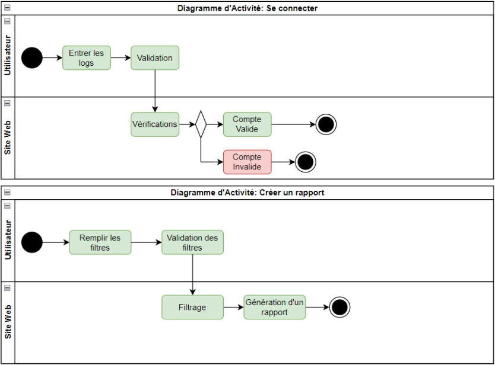
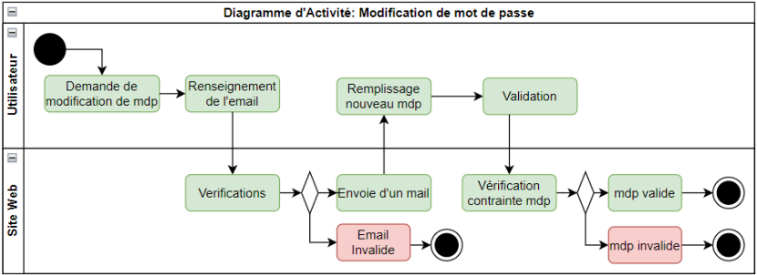
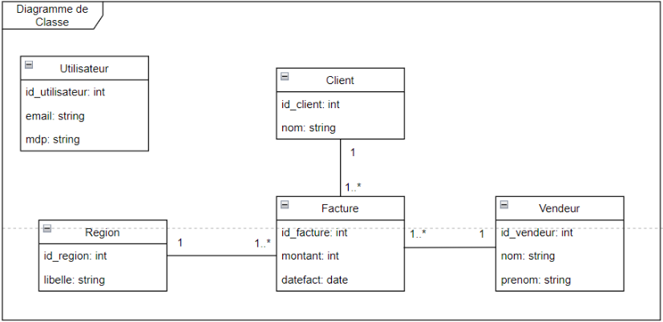
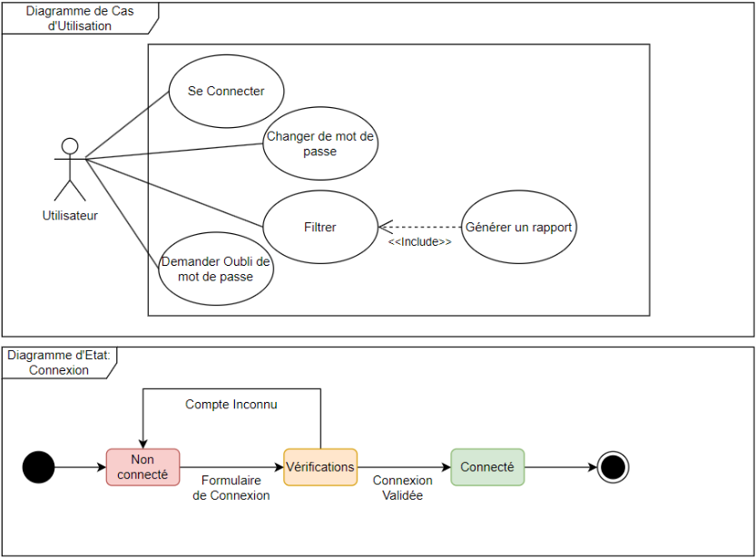
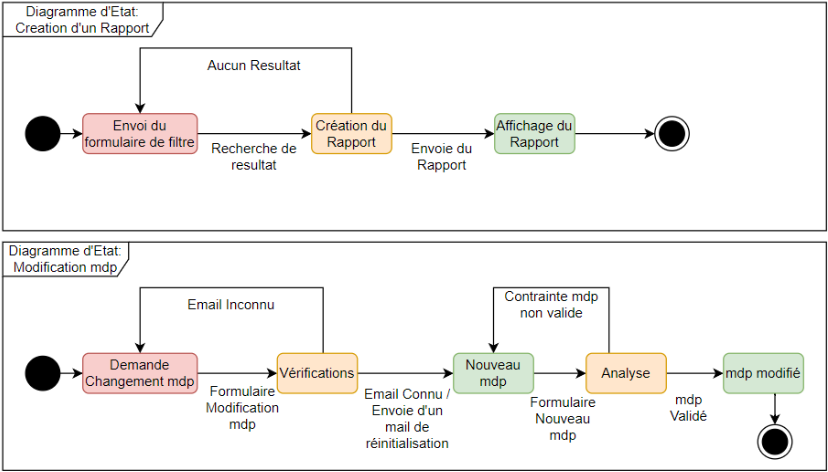

# ProjetNodeJS
Cours NFE114 - Systèmes d'information Web

Projet d'application API avec un front contenant une page de connexion

Créer dans un premier temps la base de donnée sur postgres puis copié et executé le script ci-dessous

CREATE TABLE public.ca (
    id uuid NOT NULL,
    date timestamp with time zone NOT NULL,
    montant double precision NOT NULL,
    "createdAt" timestamp with time zone NOT NULL,
    "updatedAt" timestamp with time zone NOT NULL,
    "vendeurId" integer,
    "regionId" integer
);

CREATE TABLE public.region (
    id integer NOT NULL,
    libelle character varying(255) NOT NULL,
    "createdAt" timestamp with time zone NOT NULL,
    "updatedAt" timestamp with time zone NOT NULL
);

CREATE TABLE public."user" (
    id uuid NOT NULL,
    email character varying(255) NOT NULL,
    password character varying(255) NOT NULL,
    "createdAt" timestamp with time zone NOT NULL,
    "updatedAt" timestamp with time zone NOT NULL
);

CREATE TABLE public.vendeur (
    id integer NOT NULL,
    nom character varying(255) NOT NULL,
    prenom character varying(255) NOT NULL,
    "createdAt" timestamp with time zone NOT NULL,
    "updatedAt" timestamp with time zone NOT NULL
);

INSERT INTO public.ca (id, date, montant, "createdAt", "updatedAt", "vendeurId", "regionId") VALUES ('92e9165e-ee48-4ba5-994b-87679b1267e4', '2011-07-01 00:00:00+00', 0, '2023-06-26 07:01:34.171+00', '2023-06-26 07:01:34.171+00', 3600, 1);
INSERT INTO public.ca (id, date, montant, "createdAt", "updatedAt", "vendeurId", "regionId") VALUES ('27f12609-151e-4028-8acb-1310e5e5773c', '2021-02-01 00:00:00+00', 259.116, '2023-06-26 07:01:34.171+00', '2023-06-26 07:01:34.171+00', 3500, 1);
INSERT INTO public.ca (id, date, montant, "createdAt", "updatedAt", "vendeurId", "regionId") VALUES ('4084a5de-ca20-4682-8e5e-0cb2e9e259ee', '2012-11-01 00:00:00+00', 33, '2023-06-26 07:01:34.171+00', '2023-06-26 07:01:34.171+00', 3300, 1);
INSERT INTO public.ca (id, date, montant, "createdAt", "updatedAt", "vendeurId", "regionId") VALUES ('1ce6d3c7-139a-4ab0-8967-4ed54910d6cc', '2020-12-01 00:00:00+00', 618.2022, '2023-06-26 07:01:34.171+00', '2023-06-26 07:01:34.171+00', 3300, 1);
INSERT INTO public.ca (id, date, montant, "createdAt", "updatedAt", "vendeurId", "regionId") VALUES ('88cd2060-a58b-49f9-b702-d2f228e58f6a', '2020-12-01 00:00:00+00', 618.2022, '2023-06-26 07:01:34.171+00', '2023-06-26 07:01:34.171+00', 3300, 1);
INSERT INTO public.ca (id, date, montant, "createdAt", "updatedAt", "vendeurId", "regionId") VALUES ('91176ef3-2908-4218-aac6-9a67921391fe', '2011-08-01 00:00:00+00', 0, '2023-06-26 07:01:34.171+00', '2023-06-26 07:01:34.171+00', 3000, 1);
INSERT INTO public.ca (id, date, montant, "createdAt", "updatedAt", "vendeurId", "regionId") VALUES ('e246a044-b3aa-4051-a22d-8e9832de42dc', '2020-12-01 00:00:00+00', 105.27, '2023-06-26 07:01:34.171+00', '2023-06-26 07:01:34.171+00', 3000, 1);
INSERT INTO public.ca (id, date, montant, "createdAt", "updatedAt", "vendeurId", "regionId") VALUES ('6eb8b8ce-8dea-4aaa-a4b7-1719437b803a', '2020-12-01 00:00:00+00', 0, '2023-06-26 07:01:34.171+00', '2023-06-26 07:01:34.171+00', 3000, 1);
INSERT INTO public.ca (id, date, montant, "createdAt", "updatedAt", "vendeurId", "regionId") VALUES ('d8536439-6ebf-41f5-bdc1-88839e856b01', '2020-12-01 00:00:00+00', 0, '2023-06-26 07:01:34.171+00', '2023-06-26 07:01:34.171+00', 3000, 1);
INSERT INTO public.ca (id, date, montant, "createdAt", "updatedAt", "vendeurId", "regionId") VALUES ('28c6de6e-d49a-4855-ba09-e6b0c5c68329', '2020-12-01 00:00:00+00', 105.27, '2023-06-26 07:01:34.171+00', '2023-06-26 07:01:34.171+00', 3000, 1);
INSERT INTO public.ca (id, date, montant, "createdAt", "updatedAt", "vendeurId", "regionId") VALUES ('de1b9ddb-caae-4cd9-a92e-5e5c17f37610', '2021-02-01 00:00:00+00', 17.38, '2023-06-26 07:01:34.171+00', '2023-06-26 07:01:34.171+00', 2800, 1);
INSERT INTO public.ca (id, date, montant, "createdAt", "updatedAt", "vendeurId", "regionId") VALUES ('4e458823-acbf-46d9-949e-d6a0b8af67e2', '2011-01-01 00:00:00+00', 0, '2023-06-26 07:01:34.171+00', '2023-06-26 07:01:34.171+00', 2700, 1);
INSERT INTO public.ca (id, date, montant, "createdAt", "updatedAt", "vendeurId", "regionId") VALUES ('ca31d5aa-d2d2-4046-a1aa-6bea62a786f0', '2021-02-01 00:00:00+00', 0, '2023-06-26 07:01:34.171+00', '2023-06-26 07:01:34.171+00', 2200, 1);
INSERT INTO public.ca (id, date, montant, "createdAt", "updatedAt", "vendeurId", "regionId") VALUES ('7177d2e4-a3ef-4423-87ff-65319c275239', '2021-02-01 00:00:00+00', 49.038, '2023-06-26 07:01:34.171+00', '2023-06-26 07:01:34.171+00', 2200, 1);
INSERT INTO public.ca (id, date, montant, "createdAt", "updatedAt", "vendeurId", "regionId") VALUES ('6a89606e-e45d-40f9-9e5a-04159f459556', '2021-02-01 00:00:00+00', 57.475, '2023-06-26 07:01:34.171+00', '2023-06-26 07:01:34.171+00', 2100, 1);
INSERT INTO public.ca (id, date, montant, "createdAt", "updatedAt", "vendeurId", "regionId") VALUES ('a9fa7247-024c-421a-9b3a-03ff79d2d248', '2011-02-01 00:00:00+00', 13.75, '2023-06-26 07:01:34.171+00', '2023-06-26 07:01:34.171+00', 20000, 1);
INSERT INTO public.ca (id, date, montant, "createdAt", "updatedAt", "vendeurId", "regionId") VALUES ('55ef220a-95f1-4686-9d64-57fbbe9d76d2', '2011-02-01 00:00:00+00', 25.333, '2023-06-26 07:01:34.171+00', '2023-06-26 07:01:34.171+00', 20000, 1);
INSERT INTO public.ca (id, date, montant, "createdAt", "updatedAt", "vendeurId", "regionId") VALUES ('083e77df-3327-42f1-a400-aacc7575e5cc', '2017-10-01 00:00:00+00', 47.058, '2023-06-26 07:01:34.171+00', '2023-06-26 07:01:34.171+00', 1100, 1);
INSERT INTO public.ca (id, date, montant, "createdAt", "updatedAt", "vendeurId", "regionId") VALUES ('6393c59e-f37d-4c20-bb7a-e1fe75479bbc', '2015-10-01 00:00:00+00', -108.9, '2023-06-26 07:01:34.171+00', '2023-06-26 07:01:34.171+00', 1100, 1);
INSERT INTO public.ca (id, date, montant, "createdAt", "updatedAt", "vendeurId", "regionId") VALUES ('66b5a1de-7971-4374-88ea-27a80c97406a', '2010-12-01 00:00:00+00', 0, '2023-06-26 07:01:34.171+00', '2023-06-26 07:01:34.171+00', 10000, 1);
INSERT INTO public.ca (id, date, montant, "createdAt", "updatedAt", "vendeurId", "regionId") VALUES ('7a6b8fdd-5fc7-40b2-9b82-4c1f3d86b4d3', '2012-10-01 00:00:00+00', 0, '2023-06-26 07:01:34.171+00', '2023-06-26 07:01:34.171+00', 10000, 1);
INSERT INTO public.ca (id, date, montant, "createdAt", "updatedAt", "vendeurId", "regionId") VALUES ('aa217d46-77bf-48fa-adb5-367f938d3309', '2011-09-01 00:00:00+00', 2812.007, '2023-06-26 07:01:34.171+00', '2023-06-26 07:01:34.171+00', 10000, 1);
INSERT INTO public.ca (id, date, montant, "createdAt", "updatedAt", "vendeurId", "regionId") VALUES ('c6a0e95f-7c63-496c-9270-d7465a1382c6', '2011-09-01 00:00:00+00', 0, '2023-06-26 07:01:34.171+00', '2023-06-26 07:01:34.171+00', 10000, 1);
INSERT INTO public.ca (id, date, montant, "createdAt", "updatedAt", "vendeurId", "regionId") VALUES ('fdd5c6ea-632c-4929-847a-004654ee1d38', '2013-08-01 00:00:00+00', 26776.706, '2023-06-26 07:01:34.171+00', '2023-06-26 07:01:34.171+00', 953, 1);
INSERT INTO public.ca (id, date, montant, "createdAt", "updatedAt", "vendeurId", "regionId") VALUES ('698e970d-b132-4ab0-b422-3bcbfbb59e3c', '2013-08-01 00:00:00+00', 1569.326, '2023-06-26 07:01:34.171+00', '2023-06-26 07:01:34.171+00', 953, 1);
INSERT INTO public.ca (id, date, montant, "createdAt", "updatedAt", "vendeurId", "regionId") VALUES ('a78f0e42-94c9-4298-bc7c-0cc1317c8f3f', '2013-08-01 00:00:00+00', 203.379, '2023-06-26 07:01:34.171+00', '2023-06-26 07:01:34.171+00', 953, 1);
INSERT INTO public.ca (id, date, montant, "createdAt", "updatedAt", "vendeurId", "regionId") VALUES ('39add207-6004-470f-9292-97027dc3cf3f', '2013-08-01 00:00:00+00', 0, '2023-06-26 07:01:34.171+00', '2023-06-26 07:01:34.171+00', 953, 1);
INSERT INTO public.ca (id, date, montant, "createdAt", "updatedAt", "vendeurId", "regionId") VALUES ('a9a8f0d3-798d-46d0-b4a6-aae6d9ceab2b', '2016-06-01 00:00:00+00', 623.315, '2023-06-26 07:01:34.171+00', '2023-06-26 07:01:34.171+00', 953, 1);
INSERT INTO public.ca (id, date, montant, "createdAt", "updatedAt", "vendeurId", "regionId") VALUES ('36f60361-f7bd-4343-86df-f156df3285da', '2016-06-01 00:00:00+00', 1704.56, '2023-06-26 07:01:34.171+00', '2023-06-26 07:01:34.171+00', 953, 1);
INSERT INTO public.ca (id, date, montant, "createdAt", "updatedAt", "vendeurId", "regionId") VALUES ('022006d7-1259-4efc-8338-c0bd8bb164b6', '2016-06-01 00:00:00+00', 3066.14, '2023-06-26 07:01:34.171+00', '2023-06-26 07:01:34.171+00', 953, 1);
INSERT INTO public.ca (id, date, montant, "createdAt", "updatedAt", "vendeurId", "regionId") VALUES ('64be2080-7650-45fc-9452-f176392ff80e', '2016-06-01 00:00:00+00', 186.219, '2023-06-26 07:01:34.171+00', '2023-06-26 07:01:34.171+00', 953, 1);
INSERT INTO public.ca (id, date, montant, "createdAt", "updatedAt", "vendeurId", "regionId") VALUES ('93159427-18cc-4438-af59-7943a28a1b01', '2016-06-01 00:00:00+00', 0, '2023-06-26 07:01:34.171+00', '2023-06-26 07:01:34.171+00', 953, 1);
INSERT INTO public.ca (id, date, montant, "createdAt", "updatedAt", "vendeurId", "regionId") VALUES ('37900af9-55c1-4cc2-914e-19c8df78ca4b', '2011-06-01 00:00:00+00', 291230.214, '2023-06-26 07:01:34.171+00', '2023-06-26 07:01:34.171+00', 952, 1);
INSERT INTO public.ca (id, date, montant, "createdAt", "updatedAt", "vendeurId", "regionId") VALUES ('5815f2b3-0528-4fbb-94c3-4769c7e2932d', '2011-06-01 00:00:00+00', 3360.61, '2023-06-26 07:01:34.171+00', '2023-06-26 07:01:34.171+00', 952, 1);
INSERT INTO public.ca (id, date, montant, "createdAt", "updatedAt", "vendeurId", "regionId") VALUES ('5c84cb0a-2fb1-437c-ab66-170e51c5764a', '2011-07-01 00:00:00+00', 53.735, '2023-06-26 07:01:34.171+00', '2023-06-26 07:01:34.171+00', 951, 1);
INSERT INTO public.ca (id, date, montant, "createdAt", "updatedAt", "vendeurId", "regionId") VALUES ('35853aad-798f-4da8-b413-9c3ccf739d2c', '2011-07-01 00:00:00+00', 63.019, '2023-06-26 07:01:34.171+00', '2023-06-26 07:01:34.171+00', 951, 1);
INSERT INTO public.ca (id, date, montant, "createdAt", "updatedAt", "vendeurId", "regionId") VALUES ('580f1e8c-5d52-4e92-93aa-647346b501e2', '2011-07-01 00:00:00+00', 63.019, '2023-06-26 07:01:34.171+00', '2023-06-26 07:01:34.171+00', 951, 1);
INSERT INTO public.ca (id, date, montant, "createdAt", "updatedAt", "vendeurId", "regionId") VALUES ('7a5fdfb9-dbb3-42ee-aebd-f91e1929bee6', '2011-07-01 00:00:00+00', 14.344, '2023-06-26 07:01:34.171+00', '2023-06-26 07:01:34.171+00', 951, 1);
INSERT INTO public.ca (id, date, montant, "createdAt", "updatedAt", "vendeurId", "regionId") VALUES ('80c23245-bca9-4c53-8efa-40107a421be1', '2011-07-01 00:00:00+00', 1672.418, '2023-06-26 07:01:34.171+00', '2023-06-26 07:01:34.171+00', 951, 1);
INSERT INTO public.ca (id, date, montant, "createdAt", "updatedAt", "vendeurId", "regionId") VALUES ('84b2b62b-04fe-49fd-948f-e202a689094c', '2012-04-01 00:00:00+00', 16844.828, '2023-06-26 07:01:34.171+00', '2023-06-26 07:01:34.171+00', 951, 1);
INSERT INTO public.ca (id, date, montant, "createdAt", "updatedAt", "vendeurId", "regionId") VALUES ('9d85b7f5-d8e4-4ec9-872b-7f5fac9c438f', '2012-04-01 00:00:00+00', 18574.182, '2023-06-26 07:01:34.171+00', '2023-06-26 07:01:34.171+00', 951, 1);
INSERT INTO public.ca (id, date, montant, "createdAt", "updatedAt", "vendeurId", "regionId") VALUES ('581b8a53-bee5-4e4f-bfb5-3ba8893cc26e', '2012-04-01 00:00:00+00', 88447.876, '2023-06-26 07:01:34.171+00', '2023-06-26 07:01:34.171+00', 951, 1);
INSERT INTO public.ca (id, date, montant, "createdAt", "updatedAt", "vendeurId", "regionId") VALUES ('e1b01007-fcb9-42b7-b33e-fca11e191d35', '2012-04-01 00:00:00+00', 0, '2023-06-26 07:01:34.171+00', '2023-06-26 07:01:34.171+00', 951, 1);
INSERT INTO public.ca (id, date, montant, "createdAt", "updatedAt", "vendeurId", "regionId") VALUES ('0a12c602-fbae-4c03-913d-5113c6eaafcb', '2012-04-01 00:00:00+00', 0, '2023-06-26 07:01:34.171+00', '2023-06-26 07:01:34.171+00', 951, 1);
INSERT INTO public.ca (id, date, montant, "createdAt", "updatedAt", "vendeurId", "regionId") VALUES ('4b6bc165-e05c-4f49-89ca-473e01cae5f4', '2015-02-01 00:00:00+00', 4601.564, '2023-06-26 07:01:34.171+00', '2023-06-26 07:01:34.171+00', 951, 1);
INSERT INTO public.ca (id, date, montant, "createdAt", "updatedAt", "vendeurId", "regionId") VALUES ('6e58ddad-6a00-4cbf-b3ee-1ee8a944dfbb', '2017-07-01 00:00:00+00', 119.504, '2023-06-26 07:01:34.171+00', '2023-06-26 07:01:34.171+00', 951, 1);
INSERT INTO public.ca (id, date, montant, "createdAt", "updatedAt", "vendeurId", "regionId") VALUES ('0b32d3c6-b504-4233-9c01-a69c27cbcd2f', '2018-04-01 00:00:00+00', 27915.789, '2023-06-26 07:01:34.171+00', '2023-06-26 07:01:34.171+00', 951, 1);
INSERT INTO public.ca (id, date, montant, "createdAt", "updatedAt", "vendeurId", "regionId") VALUES ('531fccee-44e4-457d-908c-e85481407a33', '2018-04-01 00:00:00+00', 2445.003, '2023-06-26 07:01:34.171+00', '2023-06-26 07:01:34.171+00', 951, 1);
INSERT INTO public.ca (id, date, montant, "createdAt", "updatedAt", "vendeurId", "regionId") VALUES ('d1276e7d-2bbf-4d44-9dcd-725847cd6631', '2018-04-01 00:00:00+00', 22, '2023-06-26 07:01:34.171+00', '2023-06-26 07:01:34.171+00', 951, 1);
INSERT INTO public.ca (id, date, montant, "createdAt", "updatedAt", "vendeurId", "regionId") VALUES ('45b2f21d-e873-443a-9f98-5dc06f1ca34d', '2018-04-01 00:00:00+00', 6777.276, '2023-06-26 07:01:34.171+00', '2023-06-26 07:01:34.171+00', 951, 1);
INSERT INTO public.ca (id, date, montant, "createdAt", "updatedAt", "vendeurId", "regionId") VALUES ('e4134b43-0326-42cd-98d7-3090f794eb82', '2019-10-01 00:00:00+00', 90247.223, '2023-06-26 07:01:34.171+00', '2023-06-26 07:01:34.171+00', 941, 1);
INSERT INTO public.ca (id, date, montant, "createdAt", "updatedAt", "vendeurId", "regionId") VALUES ('3a9f7921-c314-4785-9979-b6971bd544e8', '2019-10-01 00:00:00+00', 6603.641, '2023-06-26 07:01:34.171+00', '2023-06-26 07:01:34.171+00', 941, 1);
INSERT INTO public.ca (id, date, montant, "createdAt", "updatedAt", "vendeurId", "regionId") VALUES ('bd7c10d9-2d45-4e40-931d-e82e33472a42', '2019-10-01 00:00:00+00', 460772.191, '2023-06-26 07:01:34.171+00', '2023-06-26 07:01:34.171+00', 941, 1);
INSERT INTO public.ca (id, date, montant, "createdAt", "updatedAt", "vendeurId", "regionId") VALUES ('74c9cb28-369c-4f6b-8474-18ca2ede0a6e', '2019-10-01 00:00:00+00', 460772.191, '2023-06-26 07:01:34.171+00', '2023-06-26 07:01:34.171+00', 941, 1);
INSERT INTO public.ca (id, date, montant, "createdAt", "updatedAt", "vendeurId", "regionId") VALUES ('2f7c8a06-4820-48a7-ac56-0034490a7b10', '2019-10-01 00:00:00+00', 99608.476, '2023-06-26 07:01:34.171+00', '2023-06-26 07:01:34.171+00', 941, 1);
INSERT INTO public.ca (id, date, montant, "createdAt", "updatedAt", "vendeurId", "regionId") VALUES ('7522a76a-1ac1-4838-9db6-0e868ef55c1c', '2019-10-01 00:00:00+00', 99608.476, '2023-06-26 07:01:34.171+00', '2023-06-26 07:01:34.171+00', 941, 1);
INSERT INTO public.ca (id, date, montant, "createdAt", "updatedAt", "vendeurId", "regionId") VALUES ('aac2f037-ff67-4fc7-8565-3df1f16aac89', '2019-10-01 00:00:00+00', 35892.725, '2023-06-26 07:01:34.171+00', '2023-06-26 07:01:34.171+00', 941, 1);
INSERT INTO public.ca (id, date, montant, "createdAt", "updatedAt", "vendeurId", "regionId") VALUES ('ee770f03-bf4c-4373-98da-f4c8385fb099', '2019-10-01 00:00:00+00', 48786.32, '2023-06-26 07:01:34.171+00', '2023-06-26 07:01:34.171+00', 941, 1);
INSERT INTO public.ca (id, date, montant, "createdAt", "updatedAt", "vendeurId", "regionId") VALUES ('5b98ceef-67b6-419c-9960-a8bae6fabe13', '2019-10-01 00:00:00+00', 48786.32, '2023-06-26 07:01:34.171+00', '2023-06-26 07:01:34.171+00', 941, 1);
INSERT INTO public.ca (id, date, montant, "createdAt", "updatedAt", "vendeurId", "regionId") VALUES ('8eaa2b2b-aaa1-4f3a-81bc-1fe6d27dd16f', '2019-10-01 00:00:00+00', 79336.29, '2023-06-26 07:01:34.171+00', '2023-06-26 07:01:34.171+00', 941, 1);
INSERT INTO public.ca (id, date, montant, "createdAt", "updatedAt", "vendeurId", "regionId") VALUES ('e1987381-b800-4bea-8617-0bd11ad66f2e', '2019-10-01 00:00:00+00', 460.845, '2023-06-26 07:01:34.171+00', '2023-06-26 07:01:34.171+00', 941, 1);
INSERT INTO public.ca (id, date, montant, "createdAt", "updatedAt", "vendeurId", "regionId") VALUES ('227a57d5-6d83-40c1-b66c-62c166884a74', '2019-10-01 00:00:00+00', 77572.374, '2023-06-26 07:01:34.171+00', '2023-06-26 07:01:34.171+00', 941, 1);
INSERT INTO public.ca (id, date, montant, "createdAt", "updatedAt", "vendeurId", "regionId") VALUES ('06d95c7a-2a5e-4247-af5d-73b38cd40403', '2020-11-01 00:00:00+00', 14172.554, '2023-06-26 07:01:34.171+00', '2023-06-26 07:01:34.171+00', 940, 1);
INSERT INTO public.ca (id, date, montant, "createdAt", "updatedAt", "vendeurId", "regionId") VALUES ('66a038ce-9674-4f4c-847a-90049a505115', '2011-11-01 00:00:00+00', 5847.556, '2023-06-26 07:01:34.171+00', '2023-06-26 07:01:34.171+00', 939, 1);
INSERT INTO public.ca (id, date, montant, "createdAt", "updatedAt", "vendeurId", "regionId") VALUES ('4e71fa49-bdd5-4ee8-b624-12330fa5414f', '2011-11-01 00:00:00+00', 5847.556, '2023-06-26 07:01:34.171+00', '2023-06-26 07:01:34.171+00', 939, 1);
INSERT INTO public.ca (id, date, montant, "createdAt", "updatedAt", "vendeurId", "regionId") VALUES ('8c113d49-1dee-4a96-bfc6-0bee8c62655c', '2014-09-01 00:00:00+00', 7134.655, '2023-06-26 07:01:34.171+00', '2023-06-26 07:01:34.171+00', 939, 1);
INSERT INTO public.ca (id, date, montant, "createdAt", "updatedAt", "vendeurId", "regionId") VALUES ('3a28c59a-1e40-4677-98cd-32b67844759e', '2015-02-01 00:00:00+00', 962.005, '2023-06-26 07:01:34.171+00', '2023-06-26 07:01:34.171+00', 939, 1);
INSERT INTO public.ca (id, date, montant, "createdAt", "updatedAt", "vendeurId", "regionId") VALUES ('2e9d0ae0-e320-4244-a70b-fd15d31d1262', '2015-02-01 00:00:00+00', 962.005, '2023-06-26 07:01:34.171+00', '2023-06-26 07:01:34.171+00', 939, 1);
INSERT INTO public.ca (id, date, montant, "createdAt", "updatedAt", "vendeurId", "regionId") VALUES ('ed42a7e7-3374-47c4-ac11-2945afec7e85', '2015-02-01 00:00:00+00', 0, '2023-06-26 07:01:34.171+00', '2023-06-26 07:01:34.171+00', 939, 1);
INSERT INTO public.ca (id, date, montant, "createdAt", "updatedAt", "vendeurId", "regionId") VALUES ('0b7b0676-7bf3-47e6-9557-cae6e15f505b', '2015-02-01 00:00:00+00', 37657.829, '2023-06-26 07:01:34.171+00', '2023-06-26 07:01:34.171+00', 939, 1);
INSERT INTO public.ca (id, date, montant, "createdAt", "updatedAt", "vendeurId", "regionId") VALUES ('de927dab-4b5f-4c98-b7e4-0dedb9d95c1d', '2015-02-01 00:00:00+00', 36908.124, '2023-06-26 07:01:34.171+00', '2023-06-26 07:01:34.171+00', 939, 1);
INSERT INTO public.ca (id, date, montant, "createdAt", "updatedAt", "vendeurId", "regionId") VALUES ('2b8dcd27-63d4-4aa5-a8f8-10fef4cfafe5', '2014-07-01 00:00:00+00', 170.192, '2023-06-26 07:01:34.171+00', '2023-06-26 07:01:34.171+00', 939, 1);
INSERT INTO public.ca (id, date, montant, "createdAt", "updatedAt", "vendeurId", "regionId") VALUES ('c6020a92-7086-4bcb-a74a-4d70e3d5ef57', '2018-06-01 00:00:00+00', 22, '2023-06-26 07:01:34.171+00', '2023-06-26 07:01:34.171+00', 939, 1);
INSERT INTO public.ca (id, date, montant, "createdAt", "updatedAt", "vendeurId", "regionId") VALUES ('327a4c3e-4e75-4e2d-9264-b9e58d022139', '2017-03-01 00:00:00+00', 25.3, '2023-06-26 07:01:34.171+00', '2023-06-26 07:01:34.171+00', 939, 1);
INSERT INTO public.ca (id, date, montant, "createdAt", "updatedAt", "vendeurId", "regionId") VALUES ('7311f147-3b4e-40b9-8821-3d25a906d865', '2017-03-01 00:00:00+00', 9180.248, '2023-06-26 07:01:34.171+00', '2023-06-26 07:01:34.171+00', 939, 1);
INSERT INTO public.ca (id, date, montant, "createdAt", "updatedAt", "vendeurId", "regionId") VALUES ('2989ef5c-42f1-4f76-91e5-4f35b79a6570', '2017-03-01 00:00:00+00', 433.543, '2023-06-26 07:01:34.171+00', '2023-06-26 07:01:34.171+00', 939, 1);
INSERT INTO public.ca (id, date, montant, "createdAt", "updatedAt", "vendeurId", "regionId") VALUES ('06d85688-a7e8-4ae3-9356-2b743c77aec7', '2017-03-01 00:00:00+00', 16.775, '2023-06-26 07:01:34.171+00', '2023-06-26 07:01:34.171+00', 939, 1);
INSERT INTO public.ca (id, date, montant, "createdAt", "updatedAt", "vendeurId", "regionId") VALUES ('5877918f-ee9b-4e87-b9ff-8b29ed5100b4', '2017-12-01 00:00:00+00', 1453.254, '2023-06-26 07:01:34.171+00', '2023-06-26 07:01:34.171+00', 939, 1);
INSERT INTO public.ca (id, date, montant, "createdAt", "updatedAt", "vendeurId", "regionId") VALUES ('7f80d97e-6a18-4df6-88c7-bd234dbdf33a', '2017-12-01 00:00:00+00', 55.484, '2023-06-26 07:01:34.171+00', '2023-06-26 07:01:34.171+00', 939, 1);
INSERT INTO public.ca (id, date, montant, "createdAt", "updatedAt", "vendeurId", "regionId") VALUES ('818fb1b7-11fa-4b90-83b5-9aec21442190', '2017-12-01 00:00:00+00', 55.484, '2023-06-26 07:01:34.171+00', '2023-06-26 07:01:34.171+00', 939, 1);
INSERT INTO public.ca (id, date, montant, "createdAt", "updatedAt", "vendeurId", "regionId") VALUES ('1a75635c-f69d-4a8d-a0d1-8e6b2fd8df89', '2011-09-01 00:00:00+00', 0, '2023-06-26 07:01:34.171+00', '2023-06-26 07:01:34.171+00', 935, 1);
INSERT INTO public.ca (id, date, montant, "createdAt", "updatedAt", "vendeurId", "regionId") VALUES ('59fc6cb6-ed0a-40cb-bd41-213675044531', '2011-09-01 00:00:00+00', 3879.293, '2023-06-26 07:01:34.171+00', '2023-06-26 07:01:34.171+00', 935, 1);
INSERT INTO public.ca (id, date, montant, "createdAt", "updatedAt", "vendeurId", "regionId") VALUES ('f8be7007-fb1d-4726-9e6a-0cb315023f62', '2011-09-01 00:00:00+00', 3879.293, '2023-06-26 07:01:34.171+00', '2023-06-26 07:01:34.171+00', 935, 1);
INSERT INTO public.ca (id, date, montant, "createdAt", "updatedAt", "vendeurId", "regionId") VALUES ('076b185e-2ad6-457e-9281-17970aa198ef', '2015-08-01 00:00:00+00', 137041.421, '2023-06-26 07:01:34.171+00', '2023-06-26 07:01:34.171+00', 935, 1);
INSERT INTO public.ca (id, date, montant, "createdAt", "updatedAt", "vendeurId", "regionId") VALUES ('5cba6424-f0a3-4d6e-9ed9-9ee4b6ad694f', '2017-10-01 00:00:00+00', 30.503, '2023-06-26 07:01:34.171+00', '2023-06-26 07:01:34.171+00', 935, 1);
INSERT INTO public.ca (id, date, montant, "createdAt", "updatedAt", "vendeurId", "regionId") VALUES ('1d0d6acc-0f6b-424c-9273-312c5f2b6a93', '2011-04-01 00:00:00+00', 1532.553, '2023-06-26 07:01:34.171+00', '2023-06-26 07:01:34.171+00', 932, 5);
INSERT INTO public.ca (id, date, montant, "createdAt", "updatedAt", "vendeurId", "regionId") VALUES ('c5b49026-be84-40e3-b0b2-74483696857c', '2011-04-01 00:00:00+00', 182.127, '2023-06-26 07:01:34.171+00', '2023-06-26 07:01:34.171+00', 932, 5);
INSERT INTO public.ca (id, date, montant, "createdAt", "updatedAt", "vendeurId", "regionId") VALUES ('90551ad6-ae9d-416f-9b34-131a7e641217', '2012-06-01 00:00:00+00', 4719.726, '2023-06-26 07:01:34.171+00', '2023-06-26 07:01:34.171+00', 932, 5);
INSERT INTO public.ca (id, date, montant, "createdAt", "updatedAt", "vendeurId", "regionId") VALUES ('c39e7a81-aa75-4f1a-8b41-740d12a09790', '2012-06-01 00:00:00+00', 4719.726, '2023-06-26 07:01:34.171+00', '2023-06-26 07:01:34.171+00', 932, 5);
INSERT INTO public.ca (id, date, montant, "createdAt", "updatedAt", "vendeurId", "regionId") VALUES ('b9f88728-8d8e-40e5-a291-5a5ffa0946bd', '2014-09-01 00:00:00+00', 447.205, '2023-06-26 07:01:34.171+00', '2023-06-26 07:01:34.171+00', 932, 5);
INSERT INTO public.ca (id, date, montant, "createdAt", "updatedAt", "vendeurId", "regionId") VALUES ('4e1bf3a1-c13e-47d2-903f-7a3b80962d8e', '2015-02-01 00:00:00+00', 199.947, '2023-06-26 07:01:34.171+00', '2023-06-26 07:01:34.171+00', 932, 5);
INSERT INTO public.ca (id, date, montant, "createdAt", "updatedAt", "vendeurId", "regionId") VALUES ('487d9879-b0a1-4b8e-a4a7-5b8cd67d58dd', '2015-02-01 00:00:00+00', 59.026, '2023-06-26 07:01:34.171+00', '2023-06-26 07:01:34.171+00', 932, 5);
INSERT INTO public.ca (id, date, montant, "createdAt", "updatedAt", "vendeurId", "regionId") VALUES ('e5335907-0232-42f2-95ba-cff5246c4775', '2015-03-01 00:00:00+00', 210.32, '2023-06-26 07:01:34.171+00', '2023-06-26 07:01:34.171+00', 932, 5);
INSERT INTO public.ca (id, date, montant, "createdAt", "updatedAt", "vendeurId", "regionId") VALUES ('7a2bc6a0-f689-48d3-8782-11c746b117f9', '2015-03-01 00:00:00+00', 4759.81, '2023-06-26 07:01:34.171+00', '2023-06-26 07:01:34.171+00', 932, 5);
INSERT INTO public.ca (id, date, montant, "createdAt", "updatedAt", "vendeurId", "regionId") VALUES ('9b6004f1-fa41-4c5c-acfd-7db281293688', '2017-04-01 00:00:00+00', 344.454, '2023-06-26 07:01:34.171+00', '2023-06-26 07:01:34.171+00', 932, 5);
INSERT INTO public.ca (id, date, montant, "createdAt", "updatedAt", "vendeurId", "regionId") VALUES ('9b4eb590-1d27-4e03-b7fe-dcaed8dd9232', '2017-08-01 00:00:00+00', 33.418, '2023-06-26 07:01:34.171+00', '2023-06-26 07:01:34.171+00', 932, 5);
INSERT INTO public.ca (id, date, montant, "createdAt", "updatedAt", "vendeurId", "regionId") VALUES ('159c75b7-1a76-4c66-8d65-e7285e8830b9', '2017-08-01 00:00:00+00', 250.47, '2023-06-26 07:01:34.171+00', '2023-06-26 07:01:34.171+00', 932, 5);
INSERT INTO public.ca (id, date, montant, "createdAt", "updatedAt", "vendeurId", "regionId") VALUES ('0781cd1e-5581-4962-8b40-f3e9747bfbf0', '2017-08-01 00:00:00+00', 36.3, '2023-06-26 07:01:34.171+00', '2023-06-26 07:01:34.171+00', 932, 5);
INSERT INTO public.ca (id, date, montant, "createdAt", "updatedAt", "vendeurId", "regionId") VALUES ('e7c94ddb-b6ce-4376-8dd2-94d7168999ab', '2017-10-01 00:00:00+00', 345.246, '2023-06-26 07:01:34.171+00', '2023-06-26 07:01:34.171+00', 932, 5);
INSERT INTO public.ca (id, date, montant, "createdAt", "updatedAt", "vendeurId", "regionId") VALUES ('af9bb767-5a39-449c-8a06-d6c9651e52be', '2017-10-01 00:00:00+00', 2205.126, '2023-06-26 07:01:34.171+00', '2023-06-26 07:01:34.171+00', 932, 5);
INSERT INTO public.ca (id, date, montant, "createdAt", "updatedAt", "vendeurId", "regionId") VALUES ('8fb1373b-8500-48cb-9dfa-79a075a6957f', '2017-10-01 00:00:00+00', 1234.904, '2023-06-26 07:01:34.171+00', '2023-06-26 07:01:34.171+00', 932, 5);
INSERT INTO public.ca (id, date, montant, "createdAt", "updatedAt", "vendeurId", "regionId") VALUES ('d4793ea6-368d-4ff9-8a0c-0afb64689dc9', '2017-03-01 00:00:00+00', 1499.08, '2023-06-26 07:01:34.171+00', '2023-06-26 07:01:34.171+00', 932, 5);
INSERT INTO public.ca (id, date, montant, "createdAt", "updatedAt", "vendeurId", "regionId") VALUES ('06dc615c-aad1-474f-891e-dc6e22e28c49', '2017-03-01 00:00:00+00', 1499.08, '2023-06-26 07:01:34.171+00', '2023-06-26 07:01:34.171+00', 932, 5);
INSERT INTO public.ca (id, date, montant, "createdAt", "updatedAt", "vendeurId", "regionId") VALUES ('d88c19ba-b141-4e74-a7ce-a8277e7d9e16', '2019-11-01 00:00:00+00', 16908.463, '2023-06-26 07:01:34.171+00', '2023-06-26 07:01:34.171+00', 932, 5);
INSERT INTO public.ca (id, date, montant, "createdAt", "updatedAt", "vendeurId", "regionId") VALUES ('39098288-7f70-4627-b674-0d57c1819ffe', '2018-02-01 00:00:00+00', 178.838, '2023-06-26 07:01:34.171+00', '2023-06-26 07:01:34.171+00', 932, 5);
INSERT INTO public.ca (id, date, montant, "createdAt", "updatedAt", "vendeurId", "regionId") VALUES ('d5efcf08-a771-4436-b75b-8bf3aea931ed', '2020-01-01 00:00:00+00', 10979.452, '2023-06-26 07:01:34.171+00', '2023-06-26 07:01:34.171+00', 932, 5);
INSERT INTO public.ca (id, date, montant, "createdAt", "updatedAt", "vendeurId", "regionId") VALUES ('b28f130d-0331-4310-9af1-00003f2068f0', '2020-01-01 00:00:00+00', 10687.127, '2023-06-26 07:01:34.171+00', '2023-06-26 07:01:34.171+00', 932, 5);
INSERT INTO public.ca (id, date, montant, "createdAt", "updatedAt", "vendeurId", "regionId") VALUES ('114572b5-5107-43c3-878c-3dcb26726b0f', '2020-02-01 00:00:00+00', 560.725, '2023-06-26 07:01:34.171+00', '2023-06-26 07:01:34.171+00', 932, 5);
INSERT INTO public.ca (id, date, montant, "createdAt", "updatedAt", "vendeurId", "regionId") VALUES ('a1209cf3-4b59-43c9-a1e6-40e4f4d66c3e', '2012-08-01 00:00:00+00', 5245.68, '2023-06-26 07:01:34.171+00', '2023-06-26 07:01:34.171+00', 931, 6);
INSERT INTO public.ca (id, date, montant, "createdAt", "updatedAt", "vendeurId", "regionId") VALUES ('c806068d-66f9-495d-807c-0bd5e04c379d', '2013-08-01 00:00:00+00', 193.644, '2023-06-26 07:01:34.171+00', '2023-06-26 07:01:34.171+00', 931, 6);
INSERT INTO public.ca (id, date, montant, "createdAt", "updatedAt", "vendeurId", "regionId") VALUES ('6ae14d3c-800d-4e35-9826-2b9ae718854d', '2013-08-01 00:00:00+00', 193.644, '2023-06-26 07:01:34.171+00', '2023-06-26 07:01:34.171+00', 931, 6);
INSERT INTO public.ca (id, date, montant, "createdAt", "updatedAt", "vendeurId", "regionId") VALUES ('1f43f151-8b75-4a35-9ca0-5f1ae5ac35c3', '2013-03-01 00:00:00+00', 1027.796, '2023-06-26 07:01:34.171+00', '2023-06-26 07:01:34.171+00', 931, 6);
INSERT INTO public.ca (id, date, montant, "createdAt", "updatedAt", "vendeurId", "regionId") VALUES ('67d7a75f-d40c-4d82-bdab-da8be84e9962', '2013-08-01 00:00:00+00', 165.099, '2023-06-26 07:01:34.171+00', '2023-06-26 07:01:34.171+00', 931, 6);
INSERT INTO public.ca (id, date, montant, "createdAt", "updatedAt", "vendeurId", "regionId") VALUES ('9b63740e-20e6-4cd1-95d9-4c00ad437009', '2013-08-01 00:00:00+00', 4459.664, '2023-06-26 07:01:34.171+00', '2023-06-26 07:01:34.171+00', 931, 6);
INSERT INTO public.ca (id, date, montant, "createdAt", "updatedAt", "vendeurId", "regionId") VALUES ('92b17169-4123-4fd3-a427-a2689493d06b', '2013-09-01 00:00:00+00', 1062.237, '2023-06-26 07:01:34.171+00', '2023-06-26 07:01:34.171+00', 931, 6);
INSERT INTO public.ca (id, date, montant, "createdAt", "updatedAt", "vendeurId", "regionId") VALUES ('a382fef6-2cec-45d8-aef6-d916a405ed9e', '2014-12-01 00:00:00+00', 2537.227, '2023-06-26 07:01:34.171+00', '2023-06-26 07:01:34.171+00', 931, 6);
INSERT INTO public.ca (id, date, montant, "createdAt", "updatedAt", "vendeurId", "regionId") VALUES ('09790e7a-a6cc-4f51-990c-8138fc0fd220', '2014-07-01 00:00:00+00', 130.229, '2023-06-26 07:01:34.171+00', '2023-06-26 07:01:34.171+00', 931, 6);
INSERT INTO public.ca (id, date, montant, "createdAt", "updatedAt", "vendeurId", "regionId") VALUES ('47c6dff6-8d09-4fe0-b977-2cd236d32c8a', '2014-09-01 00:00:00+00', 22.517, '2023-06-26 07:01:34.171+00', '2023-06-26 07:01:34.171+00', 931, 6);
INSERT INTO public.ca (id, date, montant, "createdAt", "updatedAt", "vendeurId", "regionId") VALUES ('cbc94310-199b-4cfa-8dcc-3db65355eee5', '2017-03-01 00:00:00+00', 82.786, '2023-06-26 07:01:34.171+00', '2023-06-26 07:01:34.171+00', 931, 6);
INSERT INTO public.ca (id, date, montant, "createdAt", "updatedAt", "vendeurId", "regionId") VALUES ('a9db04ba-a264-4641-9d21-033df9b5a898', '2020-06-01 00:00:00+00', 115.434, '2023-06-26 07:01:34.171+00', '2023-06-26 07:01:34.171+00', 931, 6);
INSERT INTO public.ca (id, date, montant, "createdAt", "updatedAt", "vendeurId", "regionId") VALUES ('9381b832-8f3c-4b36-853f-4cf8ac657108', '2020-06-01 00:00:00+00', 203.511, '2023-06-26 07:01:34.171+00', '2023-06-26 07:01:34.171+00', 931, 6);
INSERT INTO public.ca (id, date, montant, "createdAt", "updatedAt", "vendeurId", "regionId") VALUES ('20cda35c-df7a-4088-bc7a-e4ac00b34800', '2019-02-01 00:00:00+00', 1082.455, '2023-06-26 07:01:34.171+00', '2023-06-26 07:01:34.171+00', 931, 6);
INSERT INTO public.ca (id, date, montant, "createdAt", "updatedAt", "vendeurId", "regionId") VALUES ('0e02b690-9abd-46e3-a890-ac5fafb6d2ff', '2019-02-01 00:00:00+00', 1082.455, '2023-06-26 07:01:34.171+00', '2023-06-26 07:01:34.171+00', 931, 6);
INSERT INTO public.ca (id, date, montant, "createdAt", "updatedAt", "vendeurId", "regionId") VALUES ('849ea8d5-3ef3-477d-9c87-6d5fc031ac9e', '2019-09-01 00:00:00+00', 1.43, '2023-06-26 07:01:34.171+00', '2023-06-26 07:01:34.171+00', 931, 6);
INSERT INTO public.ca (id, date, montant, "createdAt", "updatedAt", "vendeurId", "regionId") VALUES ('7535f874-0c20-464f-8359-8f10eaaf3d02', '2010-08-01 00:00:00+00', 0, '2023-06-26 07:01:34.171+00', '2023-06-26 07:01:34.171+00', 930, 5);
INSERT INTO public.ca (id, date, montant, "createdAt", "updatedAt", "vendeurId", "regionId") VALUES ('a15e4885-caf6-40f5-96bf-fc266f3492c3', '2011-12-01 00:00:00+00', 702.966, '2023-06-26 07:01:34.171+00', '2023-06-26 07:01:34.171+00', 930, 5);
INSERT INTO public.ca (id, date, montant, "createdAt", "updatedAt", "vendeurId", "regionId") VALUES ('789fd856-6e58-4b3d-8789-796a678591d4', '2014-05-01 00:00:00+00', 360.679, '2023-06-26 07:01:34.171+00', '2023-06-26 07:01:34.171+00', 930, 5);
INSERT INTO public.ca (id, date, montant, "createdAt", "updatedAt", "vendeurId", "regionId") VALUES ('06f764a0-0ad8-4d34-8ba9-180ed6f6726a', '2014-05-01 00:00:00+00', 360.679, '2023-06-26 07:01:34.171+00', '2023-06-26 07:01:34.171+00', 930, 5);
INSERT INTO public.ca (id, date, montant, "createdAt", "updatedAt", "vendeurId", "regionId") VALUES ('455211cf-c9f3-46cd-9424-fc807ef6e960', '2015-02-01 00:00:00+00', 313.72, '2023-06-26 07:01:34.171+00', '2023-06-26 07:01:34.171+00', 930, 5);
INSERT INTO public.ca (id, date, montant, "createdAt", "updatedAt", "vendeurId", "regionId") VALUES ('1f3bb031-3acd-45a0-9195-3aa2848c448e', '2015-02-01 00:00:00+00', 28.017, '2023-06-26 07:01:34.171+00', '2023-06-26 07:01:34.171+00', 930, 5);
INSERT INTO public.ca (id, date, montant, "createdAt", "updatedAt", "vendeurId", "regionId") VALUES ('bff8cf4b-ebd9-4f74-95cd-a3b2838d27c6', '2015-02-01 00:00:00+00', 96.723, '2023-06-26 07:01:34.171+00', '2023-06-26 07:01:34.171+00', 930, 5);
INSERT INTO public.ca (id, date, montant, "createdAt", "updatedAt", "vendeurId", "regionId") VALUES ('cb0d696b-55f2-4629-be2b-14c6c1fb0ad1', '2015-03-01 00:00:00+00', 201.168, '2023-06-26 07:01:34.171+00', '2023-06-26 07:01:34.171+00', 930, 5);
INSERT INTO public.ca (id, date, montant, "createdAt", "updatedAt", "vendeurId", "regionId") VALUES ('bf93cda1-2473-49c9-a15d-cca0024789f0', '2017-10-01 00:00:00+00', 297.792, '2023-06-26 07:01:34.171+00', '2023-06-26 07:01:34.171+00', 930, 5);
INSERT INTO public.ca (id, date, montant, "createdAt", "updatedAt", "vendeurId", "regionId") VALUES ('e09e37e2-8a51-4398-989d-653a62e6d11f', '2016-03-01 00:00:00+00', 14279.034, '2023-06-26 07:01:34.171+00', '2023-06-26 07:01:34.171+00', 930, 5);
INSERT INTO public.ca (id, date, montant, "createdAt", "updatedAt", "vendeurId", "regionId") VALUES ('301efecc-1f35-4a9c-b566-4d2945253aa1', '2016-03-01 00:00:00+00', 6133.523, '2023-06-26 07:01:34.171+00', '2023-06-26 07:01:34.171+00', 930, 5);
INSERT INTO public.ca (id, date, montant, "createdAt", "updatedAt", "vendeurId", "regionId") VALUES ('8138bbe7-4028-49f1-9006-9b26a2527fdb', '2016-03-01 00:00:00+00', 435.105, '2023-06-26 07:01:34.171+00', '2023-06-26 07:01:34.171+00', 930, 5);
INSERT INTO public.ca (id, date, montant, "createdAt", "updatedAt", "vendeurId", "regionId") VALUES ('5f3dbfdb-0443-4fba-9da9-5e5616d325b6', '2016-03-01 00:00:00+00', 435.105, '2023-06-26 07:01:34.171+00', '2023-06-26 07:01:34.171+00', 930, 5);
INSERT INTO public.ca (id, date, montant, "createdAt", "updatedAt", "vendeurId", "regionId") VALUES ('9a638120-fb36-4fc5-8ffc-9982ff636f7a', '2021-02-01 00:00:00+00', 2029.005, '2023-06-26 07:01:34.171+00', '2023-06-26 07:01:34.171+00', 930, 5);
INSERT INTO public.ca (id, date, montant, "createdAt", "updatedAt", "vendeurId", "regionId") VALUES ('a5d22a30-d5cb-43c8-ac29-cac6fb9db22e', '2021-02-01 00:00:00+00', 139.689, '2023-06-26 07:01:34.171+00', '2023-06-26 07:01:34.171+00', 930, 5);
INSERT INTO public.ca (id, date, montant, "createdAt", "updatedAt", "vendeurId", "regionId") VALUES ('88063faa-9f9b-4f35-8b0d-d597b9d5d3af', '2020-03-01 00:00:00+00', 271.271, '2023-06-26 07:01:34.171+00', '2023-06-26 07:01:34.171+00', 930, 5);
INSERT INTO public.ca (id, date, montant, "createdAt", "updatedAt", "vendeurId", "regionId") VALUES ('936c446b-3e72-42dc-a6ce-cdc1ebd1cee8', '2018-04-01 00:00:00+00', 413.16, '2023-06-26 07:01:34.171+00', '2023-06-26 07:01:34.171+00', 930, 5);
INSERT INTO public.ca (id, date, montant, "createdAt", "updatedAt", "vendeurId", "regionId") VALUES ('5bc2a944-80e0-4ec6-b7f4-7178f1857f12', '2010-12-01 00:00:00+00', 272.129, '2023-06-26 07:01:34.171+00', '2023-06-26 07:01:34.171+00', 929, 5);
INSERT INTO public.ca (id, date, montant, "createdAt", "updatedAt", "vendeurId", "regionId") VALUES ('5ed7295e-1e4e-434d-889c-8712cb6c6337', '2010-12-01 00:00:00+00', 105.93, '2023-06-26 07:01:34.171+00', '2023-06-26 07:01:34.171+00', 929, 5);
INSERT INTO public.ca (id, date, montant, "createdAt", "updatedAt", "vendeurId", "regionId") VALUES ('5b06e19d-3e8e-4bec-a99d-3156be12d1da', '2012-06-01 00:00:00+00', 0, '2023-06-26 07:01:34.171+00', '2023-06-26 07:01:34.171+00', 929, 5);
INSERT INTO public.ca (id, date, montant, "createdAt", "updatedAt", "vendeurId", "regionId") VALUES ('6a6b58cb-5a8e-4a9b-a875-75c6f4223f47', '2013-08-01 00:00:00+00', 39.248, '2023-06-26 07:01:34.171+00', '2023-06-26 07:01:34.171+00', 929, 5);
INSERT INTO public.ca (id, date, montant, "createdAt", "updatedAt", "vendeurId", "regionId") VALUES ('fdf583d9-71c1-4b50-b467-89d48104cdea', '2013-08-01 00:00:00+00', 39.248, '2023-06-26 07:01:34.171+00', '2023-06-26 07:01:34.171+00', 929, 5);
INSERT INTO public.ca (id, date, montant, "createdAt", "updatedAt", "vendeurId", "regionId") VALUES ('6822c1c1-5ace-4652-b88d-a9680513d5a0', '2013-07-01 00:00:00+00', 149.512, '2023-06-26 07:01:34.171+00', '2023-06-26 07:01:34.171+00', 929, 5);
INSERT INTO public.ca (id, date, montant, "createdAt", "updatedAt", "vendeurId", "regionId") VALUES ('e584e5e6-6347-4081-86af-7dc4ed3df34a', '2014-08-01 00:00:00+00', 149.028, '2023-06-26 07:01:34.171+00', '2023-06-26 07:01:34.171+00', 929, 5);
INSERT INTO public.ca (id, date, montant, "createdAt", "updatedAt", "vendeurId", "regionId") VALUES ('2f29c7ba-939e-49c0-b4f0-94a3b968d938', '2014-08-01 00:00:00+00', 1429.241, '2023-06-26 07:01:34.171+00', '2023-06-26 07:01:34.171+00', 929, 5);
INSERT INTO public.ca (id, date, montant, "createdAt", "updatedAt", "vendeurId", "regionId") VALUES ('096a1a25-aa8a-4044-9b38-1ad31575557e', '2014-08-01 00:00:00+00', 1296.119, '2023-06-26 07:01:34.171+00', '2023-06-26 07:01:34.171+00', 929, 5);
INSERT INTO public.ca (id, date, montant, "createdAt", "updatedAt", "vendeurId", "regionId") VALUES ('0835d3c6-97b6-4ac9-ab2c-b5bfcc3b8db7', '2014-08-01 00:00:00+00', 332.255, '2023-06-26 07:01:34.171+00', '2023-06-26 07:01:34.171+00', 929, 5);
INSERT INTO public.ca (id, date, montant, "createdAt", "updatedAt", "vendeurId", "regionId") VALUES ('5ff14cf5-dca9-4322-b33c-264080d57c11', '2013-09-01 00:00:00+00', 53.768, '2023-06-26 07:01:34.171+00', '2023-06-26 07:01:34.171+00', 929, 5);
INSERT INTO public.ca (id, date, montant, "createdAt", "updatedAt", "vendeurId", "regionId") VALUES ('8550df46-7cb2-45ff-99c5-193282dae7af', '2014-06-01 00:00:00+00', 752.136, '2023-06-26 07:01:34.171+00', '2023-06-26 07:01:34.171+00', 929, 5);
INSERT INTO public.ca (id, date, montant, "createdAt", "updatedAt", "vendeurId", "regionId") VALUES ('c43cfe56-aaed-4926-a9b0-c48275c3927e', '2014-06-01 00:00:00+00', 1464.705, '2023-06-26 07:01:34.171+00', '2023-06-26 07:01:34.171+00', 929, 5);
INSERT INTO public.ca (id, date, montant, "createdAt", "updatedAt", "vendeurId", "regionId") VALUES ('2e1c2b54-0f44-441d-9128-266c56ca51a0', '2014-06-01 00:00:00+00', 3292.201, '2023-06-26 07:01:34.171+00', '2023-06-26 07:01:34.171+00', 929, 5);
INSERT INTO public.ca (id, date, montant, "createdAt", "updatedAt", "vendeurId", "regionId") VALUES ('789932f2-5d18-4e42-a453-75d5308e7617', '2014-11-01 00:00:00+00', 421.234, '2023-06-26 07:01:34.171+00', '2023-06-26 07:01:34.171+00', 929, 5);
INSERT INTO public.ca (id, date, montant, "createdAt", "updatedAt", "vendeurId", "regionId") VALUES ('d86721d3-9933-4be9-9643-88944a854ccc', '2016-10-01 00:00:00+00', 112.266, '2023-06-26 07:01:34.171+00', '2023-06-26 07:01:34.171+00', 929, 5);
INSERT INTO public.ca (id, date, montant, "createdAt", "updatedAt", "vendeurId", "regionId") VALUES ('f133136f-59e4-4319-9fff-8e84777954f5', '2016-03-01 00:00:00+00', 324.94, '2023-06-26 07:01:34.171+00', '2023-06-26 07:01:34.171+00', 929, 5);
INSERT INTO public.ca (id, date, montant, "createdAt", "updatedAt", "vendeurId", "regionId") VALUES ('4fa73bbd-6b35-4a9d-bb1b-19015f614bd6', '2018-06-01 00:00:00+00', 38.148, '2023-06-26 07:01:34.171+00', '2023-06-26 07:01:34.171+00', 929, 5);
INSERT INTO public.ca (id, date, montant, "createdAt", "updatedAt", "vendeurId", "regionId") VALUES ('32e8fc25-992a-4328-ad7d-bb3c925cf8f5', '2017-07-01 00:00:00+00', 127.6, '2023-06-26 07:01:34.171+00', '2023-06-26 07:01:34.171+00', 929, 5);
INSERT INTO public.ca (id, date, montant, "createdAt", "updatedAt", "vendeurId", "regionId") VALUES ('7c99a71e-f35c-402d-8bc2-5880a0e64a97', '2019-07-01 00:00:00+00', 638.814, '2023-06-26 07:01:34.171+00', '2023-06-26 07:01:34.171+00', 929, 5);
INSERT INTO public.ca (id, date, montant, "createdAt", "updatedAt", "vendeurId", "regionId") VALUES ('d5f7ecd5-d04c-4a81-b208-b60fe940e050', '2019-07-01 00:00:00+00', 436.997, '2023-06-26 07:01:34.171+00', '2023-06-26 07:01:34.171+00', 929, 5);
INSERT INTO public.ca (id, date, montant, "createdAt", "updatedAt", "vendeurId", "regionId") VALUES ('aac5e332-61f1-4c44-92dd-c476360b5685', '2019-07-01 00:00:00+00', 830.489, '2023-06-26 07:01:34.171+00', '2023-06-26 07:01:34.171+00', 929, 5);
INSERT INTO public.ca (id, date, montant, "createdAt", "updatedAt", "vendeurId", "regionId") VALUES ('3e88353e-1e0f-43b1-bcec-6789727d6f87', '2019-11-01 00:00:00+00', 7.7, '2023-06-26 07:01:34.171+00', '2023-06-26 07:01:34.171+00', 929, 5);
INSERT INTO public.ca (id, date, montant, "createdAt", "updatedAt", "vendeurId", "regionId") VALUES ('5c3394e3-ca42-45da-8c08-4349e0eeba44', '2019-11-01 00:00:00+00', 320.529, '2023-06-26 07:01:34.171+00', '2023-06-26 07:01:34.171+00', 929, 5);
INSERT INTO public.ca (id, date, montant, "createdAt", "updatedAt", "vendeurId", "regionId") VALUES ('dace1080-c0af-45d2-b086-e759a3953ba5', '2017-07-01 00:00:00+00', 50.16, '2023-06-26 07:01:34.171+00', '2023-06-26 07:01:34.171+00', 927, 1);
INSERT INTO public.ca (id, date, montant, "createdAt", "updatedAt", "vendeurId", "regionId") VALUES ('ffbee832-3e60-4dc1-9466-109a31756d84', '2017-07-01 00:00:00+00', 50.16, '2023-06-26 07:01:34.171+00', '2023-06-26 07:01:34.171+00', 927, 1);
INSERT INTO public.ca (id, date, montant, "createdAt", "updatedAt", "vendeurId", "regionId") VALUES ('157811e9-d070-495e-b74a-ef69b71a8b22', '2019-08-01 00:00:00+00', 99.308, '2023-06-26 07:01:34.171+00', '2023-06-26 07:01:34.171+00', 839, 1);
INSERT INTO public.ca (id, date, montant, "createdAt", "updatedAt", "vendeurId", "regionId") VALUES ('696d0fb0-e0b7-42f4-917b-e2d751c3fd24', '2016-03-01 00:00:00+00', 66.198, '2023-06-26 07:01:34.171+00', '2023-06-26 07:01:34.171+00', 835, 1);
INSERT INTO public.ca (id, date, montant, "createdAt", "updatedAt", "vendeurId", "regionId") VALUES ('5406b0f4-4c1f-4620-8e4f-19852e09f651', '2010-08-01 00:00:00+00', 371.426, '2023-06-26 07:01:34.171+00', '2023-06-26 07:01:34.171+00', 834, 3);
INSERT INTO public.ca (id, date, montant, "createdAt", "updatedAt", "vendeurId", "regionId") VALUES ('c988efb5-3731-4b67-893d-72e1b8b6f497', '2010-04-01 00:00:00+00', 764.687, '2023-06-26 07:01:34.171+00', '2023-06-26 07:01:34.171+00', 834, 3);
INSERT INTO public.ca (id, date, montant, "createdAt", "updatedAt", "vendeurId", "regionId") VALUES ('923cb3ae-4454-479c-957e-504aed3fb389', '2012-02-01 00:00:00+00', 313.368, '2023-06-26 07:01:34.171+00', '2023-06-26 07:01:34.171+00', 834, 3);
INSERT INTO public.ca (id, date, montant, "createdAt", "updatedAt", "vendeurId", "regionId") VALUES ('cfe2b5b1-c06c-4de8-94fc-5bf54dc1fed2', '2012-07-01 00:00:00+00', 0, '2023-06-26 07:01:34.171+00', '2023-06-26 07:01:34.171+00', 834, 3);
INSERT INTO public.ca (id, date, montant, "createdAt", "updatedAt", "vendeurId", "regionId") VALUES ('f07a5569-0dfc-405a-b4da-c49d9946dfe4', '2012-10-01 00:00:00+00', 183.26, '2023-06-26 07:01:34.171+00', '2023-06-26 07:01:34.171+00', 834, 3);
INSERT INTO public.ca (id, date, montant, "createdAt", "updatedAt", "vendeurId", "regionId") VALUES ('4c16e8b2-9de8-4767-9952-abcdf1febfa5', '2013-04-01 00:00:00+00', 428.373, '2023-06-26 07:01:34.171+00', '2023-06-26 07:01:34.171+00', 834, 3);
INSERT INTO public.ca (id, date, montant, "createdAt", "updatedAt", "vendeurId", "regionId") VALUES ('e09cfbf2-e4cf-488a-84d8-89baba49752d', '2013-04-01 00:00:00+00', 428.373, '2023-06-26 07:01:34.171+00', '2023-06-26 07:01:34.171+00', 834, 3);
INSERT INTO public.ca (id, date, montant, "createdAt", "updatedAt", "vendeurId", "regionId") VALUES ('1c3e81e3-1f7e-4f6e-a3b3-27fc80390ea1', '2013-03-01 00:00:00+00', 216.48, '2023-06-26 07:01:34.171+00', '2023-06-26 07:01:34.171+00', 834, 3);
INSERT INTO public.ca (id, date, montant, "createdAt", "updatedAt", "vendeurId", "regionId") VALUES ('aad1ae6a-3cef-40de-ad8e-3e7b5c866597', '2013-12-01 00:00:00+00', 469.425, '2023-06-26 07:01:34.171+00', '2023-06-26 07:01:34.171+00', 834, 3);
INSERT INTO public.ca (id, date, montant, "createdAt", "updatedAt", "vendeurId", "regionId") VALUES ('6676bada-b440-417a-8327-88d3153d1567', '2013-12-01 00:00:00+00', 113.476, '2023-06-26 07:01:34.171+00', '2023-06-26 07:01:34.171+00', 834, 3);
INSERT INTO public.ca (id, date, montant, "createdAt", "updatedAt", "vendeurId", "regionId") VALUES ('97147701-7dcf-483d-9f1a-c8314c9249ee', '2014-08-01 00:00:00+00', 88.836, '2023-06-26 07:01:34.171+00', '2023-06-26 07:01:34.171+00', 834, 3);
INSERT INTO public.ca (id, date, montant, "createdAt", "updatedAt", "vendeurId", "regionId") VALUES ('7faf17d5-c516-4443-a4bf-0d8c7a8c5917', '2014-09-01 00:00:00+00', 903.903, '2023-06-26 07:01:34.171+00', '2023-06-26 07:01:34.171+00', 834, 3);
INSERT INTO public.ca (id, date, montant, "createdAt", "updatedAt", "vendeurId", "regionId") VALUES ('a41755b2-c204-4224-8bad-96f53f06ed53', '2014-08-01 00:00:00+00', 24.156, '2023-06-26 07:01:34.171+00', '2023-06-26 07:01:34.171+00', 834, 3);
INSERT INTO public.ca (id, date, montant, "createdAt", "updatedAt", "vendeurId", "regionId") VALUES ('3b3bacdf-163f-4d21-a79b-504bf24163ea', '2016-02-01 00:00:00+00', 1133.088, '2023-06-26 07:01:34.171+00', '2023-06-26 07:01:34.171+00', 834, 3);
INSERT INTO public.ca (id, date, montant, "createdAt", "updatedAt", "vendeurId", "regionId") VALUES ('2801a0bf-f1f5-4f95-b4f8-1a6df7f33e4d', '2016-02-01 00:00:00+00', 192.973, '2023-06-26 07:01:34.171+00', '2023-06-26 07:01:34.171+00', 834, 3);
INSERT INTO public.ca (id, date, montant, "createdAt", "updatedAt", "vendeurId", "regionId") VALUES ('cbdc9603-8310-4ba2-83f9-78d56946cbf7', '2017-09-01 00:00:00+00', 440.891, '2023-06-26 07:01:34.171+00', '2023-06-26 07:01:34.171+00', 834, 3);
INSERT INTO public.ca (id, date, montant, "createdAt", "updatedAt", "vendeurId", "regionId") VALUES ('5e868b55-7eb9-4479-acb5-ce03ef884d84', '2016-08-01 00:00:00+00', 42.328, '2023-06-26 07:01:34.171+00', '2023-06-26 07:01:34.171+00', 834, 3);
INSERT INTO public.ca (id, date, montant, "createdAt", "updatedAt", "vendeurId", "regionId") VALUES ('a0d18c81-3346-4119-a77a-85f4c79b7ff8', '2016-08-01 00:00:00+00', 22, '2023-06-26 07:01:34.171+00', '2023-06-26 07:01:34.171+00', 834, 3);
INSERT INTO public.ca (id, date, montant, "createdAt", "updatedAt", "vendeurId", "regionId") VALUES ('aa95024d-acb7-4e1d-afe8-70f614db8ae0', '2016-08-01 00:00:00+00', 22, '2023-06-26 07:01:34.171+00', '2023-06-26 07:01:34.171+00', 834, 3);
INSERT INTO public.ca (id, date, montant, "createdAt", "updatedAt", "vendeurId", "regionId") VALUES ('f66c025c-a96c-4f5c-9b46-a2b32826b21c', '2016-08-01 00:00:00+00', 104.456, '2023-06-26 07:01:34.171+00', '2023-06-26 07:01:34.171+00', 834, 3);
INSERT INTO public.ca (id, date, montant, "createdAt", "updatedAt", "vendeurId", "regionId") VALUES ('64cf8ff7-9492-4d20-afa8-d72bb256400f', '2016-08-01 00:00:00+00', 104.456, '2023-06-26 07:01:34.171+00', '2023-06-26 07:01:34.171+00', 834, 3);
INSERT INTO public.ca (id, date, montant, "createdAt", "updatedAt", "vendeurId", "regionId") VALUES ('88e68d45-049c-4a35-993b-00dde8dfc596', '2016-07-01 00:00:00+00', 15.114, '2023-06-26 07:01:34.171+00', '2023-06-26 07:01:34.171+00', 834, 3);
INSERT INTO public.ca (id, date, montant, "createdAt", "updatedAt", "vendeurId", "regionId") VALUES ('a65ea0cb-8345-4a93-939a-b0481e184873', '2020-07-01 00:00:00+00', 133.441, '2023-06-26 07:01:34.171+00', '2023-06-26 07:01:34.171+00', 834, 3);
INSERT INTO public.ca (id, date, montant, "createdAt", "updatedAt", "vendeurId", "regionId") VALUES ('07cf5320-82e0-44bc-be36-572d6a35b81c', '2020-07-01 00:00:00+00', 133.441, '2023-06-26 07:01:34.171+00', '2023-06-26 07:01:34.171+00', 834, 3);
INSERT INTO public.ca (id, date, montant, "createdAt", "updatedAt", "vendeurId", "regionId") VALUES ('cd75882f-7aed-4c73-abdc-008bcffaadb6', '2020-07-01 00:00:00+00', 38.577, '2023-06-26 07:01:34.171+00', '2023-06-26 07:01:34.171+00', 834, 3);
INSERT INTO public.ca (id, date, montant, "createdAt", "updatedAt", "vendeurId", "regionId") VALUES ('dfb8a960-cb06-4a32-aec4-bed41063129e', '2017-03-01 00:00:00+00', 600.622, '2023-06-26 07:01:34.171+00', '2023-06-26 07:01:34.171+00', 834, 3);
INSERT INTO public.ca (id, date, montant, "createdAt", "updatedAt", "vendeurId", "regionId") VALUES ('87de0ef5-05af-42b3-8432-39311b90422d', '2017-07-01 00:00:00+00', 282.909, '2023-06-26 07:01:34.171+00', '2023-06-26 07:01:34.171+00', 834, 3);
INSERT INTO public.ca (id, date, montant, "createdAt", "updatedAt", "vendeurId", "regionId") VALUES ('b52c8469-6c39-4a78-a276-7bab2b12a8e4', '2018-01-01 00:00:00+00', 67.309, '2023-06-26 07:01:34.171+00', '2023-06-26 07:01:34.171+00', 834, 3);
INSERT INTO public.ca (id, date, montant, "createdAt", "updatedAt", "vendeurId", "regionId") VALUES ('caa8994e-7f12-4599-a79d-855eb70e7453', '2018-01-01 00:00:00+00', 112.783, '2023-06-26 07:01:34.171+00', '2023-06-26 07:01:34.171+00', 834, 3);
INSERT INTO public.ca (id, date, montant, "createdAt", "updatedAt", "vendeurId", "regionId") VALUES ('2902ca40-fbce-4a6f-b020-38a8a9e6dd8f', '2018-01-01 00:00:00+00', 33.99, '2023-06-26 07:01:34.171+00', '2023-06-26 07:01:34.171+00', 834, 3);
INSERT INTO public.ca (id, date, montant, "createdAt", "updatedAt", "vendeurId", "regionId") VALUES ('be15f5c7-87ed-4238-96ef-5e5659ade3f6', '2017-09-01 00:00:00+00', 268.015, '2023-06-26 07:01:34.171+00', '2023-06-26 07:01:34.171+00', 834, 3);
INSERT INTO public.ca (id, date, montant, "createdAt", "updatedAt", "vendeurId", "regionId") VALUES ('74393b94-135c-45d0-9df2-75b51a0bfe91', '2018-09-01 00:00:00+00', 267.19, '2023-06-26 07:01:34.171+00', '2023-06-26 07:01:34.171+00', 834, 3);
INSERT INTO public.ca (id, date, montant, "createdAt", "updatedAt", "vendeurId", "regionId") VALUES ('036b2686-85ec-456d-a337-e9629c7d5197', '2018-02-01 00:00:00+00', 34.551, '2023-06-26 07:01:34.171+00', '2023-06-26 07:01:34.171+00', 834, 3);
INSERT INTO public.ca (id, date, montant, "createdAt", "updatedAt", "vendeurId", "regionId") VALUES ('6ec63c1c-9419-40d3-8fbb-851ea1de98ae', '2018-02-01 00:00:00+00', 238.381, '2023-06-26 07:01:34.171+00', '2023-06-26 07:01:34.171+00', 834, 3);
INSERT INTO public.ca (id, date, montant, "createdAt", "updatedAt", "vendeurId", "regionId") VALUES ('aeefb9ea-1db5-4c8b-ba0f-be9b8e19a8e7', '2018-04-01 00:00:00+00', 363.715, '2023-06-26 07:01:34.171+00', '2023-06-26 07:01:34.171+00', 834, 3);
INSERT INTO public.ca (id, date, montant, "createdAt", "updatedAt", "vendeurId", "regionId") VALUES ('d45619cc-adf8-4fd4-9c45-d90201ce0f71', '2019-09-01 00:00:00+00', 196.295, '2023-06-26 07:01:34.171+00', '2023-06-26 07:01:34.171+00', 834, 3);
INSERT INTO public.ca (id, date, montant, "createdAt", "updatedAt", "vendeurId", "regionId") VALUES ('c22235af-3225-4550-89d3-9800d027ebb6', '2019-09-01 00:00:00+00', 124.52, '2023-06-26 07:01:34.171+00', '2023-06-26 07:01:34.171+00', 834, 3);
INSERT INTO public.ca (id, date, montant, "createdAt", "updatedAt", "vendeurId", "regionId") VALUES ('3d37edc5-9a34-495e-ba15-e9ecc8cb156f', '2019-10-01 00:00:00+00', 186.725, '2023-06-26 07:01:34.171+00', '2023-06-26 07:01:34.171+00', 834, 3);
INSERT INTO public.ca (id, date, montant, "createdAt", "updatedAt", "vendeurId", "regionId") VALUES ('3cc445a7-26cc-4d4e-a839-7fc90d869cc9', '2019-06-01 00:00:00+00', 63.569, '2023-06-26 07:01:34.171+00', '2023-06-26 07:01:34.171+00', 834, 3);
INSERT INTO public.ca (id, date, montant, "createdAt", "updatedAt", "vendeurId", "regionId") VALUES ('2a48136d-d78b-4e8e-9921-8e448f87dbd2', '2019-11-01 00:00:00+00', 583.44, '2023-06-26 07:01:34.171+00', '2023-06-26 07:01:34.171+00', 834, 3);
INSERT INTO public.ca (id, date, montant, "createdAt", "updatedAt", "vendeurId", "regionId") VALUES ('443e6aaf-d32d-469a-9b5f-b47731ce695f', '2020-02-01 00:00:00+00', 49.511, '2023-06-26 07:01:34.171+00', '2023-06-26 07:01:34.171+00', 834, 3);
INSERT INTO public.ca (id, date, montant, "createdAt", "updatedAt", "vendeurId", "regionId") VALUES ('1341408e-bf11-47ce-9307-c60b45a0ca26', '2018-06-01 00:00:00+00', 192.621, '2023-06-26 07:01:34.171+00', '2023-06-26 07:01:34.171+00', 834, 3);
INSERT INTO public.ca (id, date, montant, "createdAt", "updatedAt", "vendeurId", "regionId") VALUES ('226d2814-64dc-4232-be31-660aa731d9f4', '2018-06-01 00:00:00+00', 532.961, '2023-06-26 07:01:34.171+00', '2023-06-26 07:01:34.171+00', 834, 3);
INSERT INTO public.ca (id, date, montant, "createdAt", "updatedAt", "vendeurId", "regionId") VALUES ('2f4eebaf-267d-4c7f-be25-ae9020a22383', '2018-06-01 00:00:00+00', 532.961, '2023-06-26 07:01:34.171+00', '2023-06-26 07:01:34.171+00', 834, 3);
INSERT INTO public.ca (id, date, montant, "createdAt", "updatedAt", "vendeurId", "regionId") VALUES ('9ddd9f1d-9cb9-49ae-91fe-114d1ea25c95', '2020-08-01 00:00:00+00', 105.6, '2023-06-26 07:01:34.171+00', '2023-06-26 07:01:34.171+00', 834, 3);
INSERT INTO public.ca (id, date, montant, "createdAt", "updatedAt", "vendeurId", "regionId") VALUES ('085f254a-0b7f-448a-bd3d-78101194d5dd', '2010-02-01 00:00:00+00', 306.185, '2023-06-26 07:01:34.171+00', '2023-06-26 07:01:34.171+00', 831, 3);
INSERT INTO public.ca (id, date, montant, "createdAt", "updatedAt", "vendeurId", "regionId") VALUES ('e2aa21aa-9308-43f5-943a-557c2207dea6', '2011-12-01 00:00:00+00', 1105.247, '2023-06-26 07:01:34.171+00', '2023-06-26 07:01:34.171+00', 831, 3);
INSERT INTO public.ca (id, date, montant, "createdAt", "updatedAt", "vendeurId", "regionId") VALUES ('c6136661-3fd7-46c3-96b8-955a5406d15e', '2011-12-01 00:00:00+00', 498.234, '2023-06-26 07:01:34.171+00', '2023-06-26 07:01:34.171+00', 831, 3);
INSERT INTO public.ca (id, date, montant, "createdAt", "updatedAt", "vendeurId", "regionId") VALUES ('4a0f9813-d222-4ff5-81d9-ab85bd8d4e87', '2011-12-01 00:00:00+00', 160.985, '2023-06-26 07:01:34.171+00', '2023-06-26 07:01:34.171+00', 831, 3);
INSERT INTO public.ca (id, date, montant, "createdAt", "updatedAt", "vendeurId", "regionId") VALUES ('d048d4bf-bd99-445f-b226-dff83a85693b', '2013-08-01 00:00:00+00', 232.815, '2023-06-26 07:01:34.171+00', '2023-06-26 07:01:34.171+00', 831, 3);
INSERT INTO public.ca (id, date, montant, "createdAt", "updatedAt", "vendeurId", "regionId") VALUES ('c723ad79-7a32-4f1a-834f-79b10297ba3e', '2013-08-01 00:00:00+00', 154.946, '2023-06-26 07:01:34.171+00', '2023-06-26 07:01:34.171+00', 831, 3);
INSERT INTO public.ca (id, date, montant, "createdAt", "updatedAt", "vendeurId", "regionId") VALUES ('9713070c-0863-410e-9fc9-a15ac864b32b', '2014-09-01 00:00:00+00', 171.116, '2023-06-26 07:01:34.171+00', '2023-06-26 07:01:34.171+00', 831, 3);
INSERT INTO public.ca (id, date, montant, "createdAt", "updatedAt", "vendeurId", "regionId") VALUES ('254cc331-067c-4dfc-9043-96b9fcae72f4', '2014-09-01 00:00:00+00', 171.116, '2023-06-26 07:01:34.171+00', '2023-06-26 07:01:34.171+00', 831, 3);
INSERT INTO public.ca (id, date, montant, "createdAt", "updatedAt", "vendeurId", "regionId") VALUES ('a6f9fd54-da89-4391-acb8-93c1c97f82e4', '2014-09-01 00:00:00+00', 15.818, '2023-06-26 07:01:34.171+00', '2023-06-26 07:01:34.171+00', 831, 3);
INSERT INTO public.ca (id, date, montant, "createdAt", "updatedAt", "vendeurId", "regionId") VALUES ('fd0eb7ee-2f8a-42cd-90dd-1b88959eb9ea', '2014-05-01 00:00:00+00', 55.418, '2023-06-26 07:01:34.171+00', '2023-06-26 07:01:34.171+00', 831, 3);
INSERT INTO public.ca (id, date, montant, "createdAt", "updatedAt", "vendeurId", "regionId") VALUES ('c86a489b-1330-4794-96f8-7c13d11e6d0f', '2014-11-01 00:00:00+00', 0, '2023-06-26 07:01:34.171+00', '2023-06-26 07:01:34.171+00', 831, 3);
INSERT INTO public.ca (id, date, montant, "createdAt", "updatedAt", "vendeurId", "regionId") VALUES ('72701f28-38f5-4c61-ae88-2ee97bee3d03', '2016-01-01 00:00:00+00', 583.594, '2023-06-26 07:01:34.171+00', '2023-06-26 07:01:34.171+00', 831, 3);
INSERT INTO public.ca (id, date, montant, "createdAt", "updatedAt", "vendeurId", "regionId") VALUES ('e43f1dda-0d54-4220-833b-598916724088', '2016-01-01 00:00:00+00', 509.245, '2023-06-26 07:01:34.171+00', '2023-06-26 07:01:34.171+00', 831, 3);
INSERT INTO public.ca (id, date, montant, "createdAt", "updatedAt", "vendeurId", "regionId") VALUES ('bb553d18-d476-47fd-a839-e1108616428d', '2017-04-01 00:00:00+00', 130.999, '2023-06-26 07:01:34.171+00', '2023-06-26 07:01:34.171+00', 831, 3);
INSERT INTO public.ca (id, date, montant, "createdAt", "updatedAt", "vendeurId", "regionId") VALUES ('25142b8f-030b-4934-953c-31d036902100', '2016-10-01 00:00:00+00', 318.428, '2023-06-26 07:01:34.171+00', '2023-06-26 07:01:34.171+00', 831, 3);
INSERT INTO public.ca (id, date, montant, "createdAt", "updatedAt", "vendeurId", "regionId") VALUES ('fa333b8d-20aa-447d-bbb1-e615e35f0e9f', '2015-10-01 00:00:00+00', 251.823, '2023-06-26 07:01:34.171+00', '2023-06-26 07:01:34.171+00', 831, 3);
INSERT INTO public.ca (id, date, montant, "createdAt", "updatedAt", "vendeurId", "regionId") VALUES ('474c7186-2142-45b0-8a14-905a48530a3b', '2017-10-01 00:00:00+00', 544.918, '2023-06-26 07:01:34.171+00', '2023-06-26 07:01:34.171+00', 831, 3);
INSERT INTO public.ca (id, date, montant, "createdAt", "updatedAt", "vendeurId", "regionId") VALUES ('fa13f6dc-b2ca-4ffe-b309-f25c65f273ce', '2018-01-01 00:00:00+00', 201.894, '2023-06-26 07:01:34.171+00', '2023-06-26 07:01:34.171+00', 831, 3);
INSERT INTO public.ca (id, date, montant, "createdAt", "updatedAt", "vendeurId", "regionId") VALUES ('4a9d10dc-7e4b-4095-9317-e646d338710a', '2019-05-01 00:00:00+00', 265.1, '2023-06-26 07:01:34.171+00', '2023-06-26 07:01:34.171+00', 831, 3);
INSERT INTO public.ca (id, date, montant, "createdAt", "updatedAt", "vendeurId", "regionId") VALUES ('a65f55e3-0afb-4f39-946d-8509c2398f1b', '2018-02-01 00:00:00+00', 340.802, '2023-06-26 07:01:34.171+00', '2023-06-26 07:01:34.171+00', 831, 3);
INSERT INTO public.ca (id, date, montant, "createdAt", "updatedAt", "vendeurId", "regionId") VALUES ('6748e367-5afa-471f-b092-7c9b9ba02801', '2018-06-01 00:00:00+00', 365.486, '2023-06-26 07:01:34.171+00', '2023-06-26 07:01:34.171+00', 831, 3);
INSERT INTO public.ca (id, date, montant, "createdAt", "updatedAt", "vendeurId", "regionId") VALUES ('01a4495d-201c-4634-9b83-5a3c0702de87', '2017-01-01 00:00:00+00', 54.835, '2023-06-26 07:01:34.171+00', '2023-06-26 07:01:34.171+00', 831, 3);
INSERT INTO public.ca (id, date, montant, "createdAt", "updatedAt", "vendeurId", "regionId") VALUES ('6ccd200a-e820-4177-8bbf-a6fb4ff117bc', '2021-02-01 00:00:00+00', 477.851, '2023-06-26 07:01:34.171+00', '2023-06-26 07:01:34.171+00', 831, 3);
INSERT INTO public.ca (id, date, montant, "createdAt", "updatedAt", "vendeurId", "regionId") VALUES ('98b0ef54-6b97-4942-aa63-b081ba5c398c', '2018-04-01 00:00:00+00', 68.761, '2023-06-26 07:01:34.171+00', '2023-06-26 07:01:34.171+00', 831, 3);
INSERT INTO public.ca (id, date, montant, "createdAt", "updatedAt", "vendeurId", "regionId") VALUES ('8df5ed58-9fe2-47c8-8771-5d8b363b766c', '2018-04-01 00:00:00+00', 28.787, '2023-06-26 07:01:34.171+00', '2023-06-26 07:01:34.171+00', 831, 3);
INSERT INTO public.ca (id, date, montant, "createdAt", "updatedAt", "vendeurId", "regionId") VALUES ('b5a4e491-1a5e-485e-9ccb-228ea6930c38', '2018-04-01 00:00:00+00', 28.787, '2023-06-26 07:01:34.171+00', '2023-06-26 07:01:34.171+00', 831, 3);
INSERT INTO public.ca (id, date, montant, "createdAt", "updatedAt", "vendeurId", "regionId") VALUES ('926dd592-577f-430e-8793-16179bbd7b3c', '2011-01-01 00:00:00+00', 0, '2023-06-26 07:01:34.171+00', '2023-06-26 07:01:34.171+00', 830, 3);
INSERT INTO public.ca (id, date, montant, "createdAt", "updatedAt", "vendeurId", "regionId") VALUES ('b70ec062-a7ce-45d0-a6b5-d0150229d38a', '2011-09-01 00:00:00+00', 423.478, '2023-06-26 07:01:34.171+00', '2023-06-26 07:01:34.171+00', 830, 3);
INSERT INTO public.ca (id, date, montant, "createdAt", "updatedAt", "vendeurId", "regionId") VALUES ('f2d45bed-0d41-4c56-b8af-2f0ed30f961c', '2012-02-01 00:00:00+00', 704.88, '2023-06-26 07:01:34.171+00', '2023-06-26 07:01:34.171+00', 830, 3);
INSERT INTO public.ca (id, date, montant, "createdAt", "updatedAt", "vendeurId", "regionId") VALUES ('52781763-3aac-4c0b-bbc8-9f6c51fd6e35', '2012-02-01 00:00:00+00', 2426.908, '2023-06-26 07:01:34.171+00', '2023-06-26 07:01:34.171+00', 830, 3);
INSERT INTO public.ca (id, date, montant, "createdAt", "updatedAt", "vendeurId", "regionId") VALUES ('ab40dc49-1af2-47de-8f2c-3ff24c1a923f', '2012-02-01 00:00:00+00', 1656.424, '2023-06-26 07:01:34.171+00', '2023-06-26 07:01:34.171+00', 830, 3);
INSERT INTO public.ca (id, date, montant, "createdAt", "updatedAt", "vendeurId", "regionId") VALUES ('191c9e13-618a-4285-98d1-4ad91d8104c2', '2013-11-01 00:00:00+00', 200.508, '2023-06-26 07:01:34.171+00', '2023-06-26 07:01:34.171+00', 830, 3);
INSERT INTO public.ca (id, date, montant, "createdAt", "updatedAt", "vendeurId", "regionId") VALUES ('86264967-3f98-4596-ad4e-8a6112e39a88', '2013-11-01 00:00:00+00', 98.868, '2023-06-26 07:01:34.171+00', '2023-06-26 07:01:34.171+00', 830, 3);
INSERT INTO public.ca (id, date, montant, "createdAt", "updatedAt", "vendeurId", "regionId") VALUES ('8dfd3e70-d054-407a-acb5-f643a1d62018', '2013-11-01 00:00:00+00', 98.868, '2023-06-26 07:01:34.171+00', '2023-06-26 07:01:34.171+00', 830, 3);
INSERT INTO public.ca (id, date, montant, "createdAt", "updatedAt", "vendeurId", "regionId") VALUES ('6bdff2c7-bf64-4127-8e29-269f7b532ebd', '2013-11-01 00:00:00+00', 0, '2023-06-26 07:01:34.171+00', '2023-06-26 07:01:34.171+00', 830, 3);
INSERT INTO public.ca (id, date, montant, "createdAt", "updatedAt", "vendeurId", "regionId") VALUES ('2253044d-c03e-4c4e-a4c9-960255547560', '2013-11-01 00:00:00+00', 203.984, '2023-06-26 07:01:34.171+00', '2023-06-26 07:01:34.171+00', 830, 3);
INSERT INTO public.ca (id, date, montant, "createdAt", "updatedAt", "vendeurId", "regionId") VALUES ('e79c551a-20e4-4369-91fb-e54576d8fac7', '2013-11-01 00:00:00+00', 109.934, '2023-06-26 07:01:34.171+00', '2023-06-26 07:01:34.171+00', 830, 3);
INSERT INTO public.ca (id, date, montant, "createdAt", "updatedAt", "vendeurId", "regionId") VALUES ('8b2e7158-efcb-4869-a7f3-3af619370fda', '2015-10-01 00:00:00+00', 180.532, '2023-06-26 07:01:34.171+00', '2023-06-26 07:01:34.171+00', 830, 3);
INSERT INTO public.ca (id, date, montant, "createdAt", "updatedAt", "vendeurId", "regionId") VALUES ('aada6a41-7a34-47f7-8477-a528c8130c0e', '2015-07-01 00:00:00+00', 547.283, '2023-06-26 07:01:34.171+00', '2023-06-26 07:01:34.171+00', 830, 3);
INSERT INTO public.ca (id, date, montant, "createdAt", "updatedAt", "vendeurId", "regionId") VALUES ('89a50a20-bb6f-4fe1-985d-31f740821c14', '2015-07-01 00:00:00+00', 239.811, '2023-06-26 07:01:34.171+00', '2023-06-26 07:01:34.171+00', 830, 3);
INSERT INTO public.ca (id, date, montant, "createdAt", "updatedAt", "vendeurId", "regionId") VALUES ('d9bf8307-a05b-449a-96f8-3677305a2c48', '2015-07-01 00:00:00+00', 12.1, '2023-06-26 07:01:34.171+00', '2023-06-26 07:01:34.171+00', 830, 3);
INSERT INTO public.ca (id, date, montant, "createdAt", "updatedAt", "vendeurId", "regionId") VALUES ('6713ef69-47ba-4e26-b5cd-0b7d3e2faf8e', '2017-07-01 00:00:00+00', 145.035, '2023-06-26 07:01:34.171+00', '2023-06-26 07:01:34.171+00', 830, 3);
INSERT INTO public.ca (id, date, montant, "createdAt", "updatedAt", "vendeurId", "regionId") VALUES ('cc7c5fbd-210e-4753-9641-0cc79afe947f', '2017-07-01 00:00:00+00', 145.035, '2023-06-26 07:01:34.171+00', '2023-06-26 07:01:34.171+00', 830, 3);
INSERT INTO public.ca (id, date, montant, "createdAt", "updatedAt", "vendeurId", "regionId") VALUES ('fac9c4a0-867a-4af8-bf2c-b817f65bf0eb', '2017-10-01 00:00:00+00', 16.456, '2023-06-26 07:01:34.171+00', '2023-06-26 07:01:34.171+00', 830, 3);
INSERT INTO public.ca (id, date, montant, "createdAt", "updatedAt", "vendeurId", "regionId") VALUES ('61eaad6d-1dcb-4ab7-9351-8c24f500be15', '2017-12-01 00:00:00+00', 40.546, '2023-06-26 07:01:34.171+00', '2023-06-26 07:01:34.171+00', 830, 3);
INSERT INTO public.ca (id, date, montant, "createdAt", "updatedAt", "vendeurId", "regionId") VALUES ('b3b0302c-0721-4891-a9ca-bfd956d3446a', '2017-12-01 00:00:00+00', 40.546, '2023-06-26 07:01:34.171+00', '2023-06-26 07:01:34.171+00', 830, 3);
INSERT INTO public.ca (id, date, montant, "createdAt", "updatedAt", "vendeurId", "regionId") VALUES ('bd3274c1-1050-40ef-8693-d022dc4f7a01', '2017-12-01 00:00:00+00', 40.546, '2023-06-26 07:01:34.171+00', '2023-06-26 07:01:34.171+00', 830, 3);
INSERT INTO public.ca (id, date, montant, "createdAt", "updatedAt", "vendeurId", "regionId") VALUES ('f4fe9360-8b85-40e0-952b-5f356c56ad9c', '2018-06-01 00:00:00+00', 72.281, '2023-06-26 07:01:34.171+00', '2023-06-26 07:01:34.171+00', 830, 3);
INSERT INTO public.ca (id, date, montant, "createdAt", "updatedAt", "vendeurId", "regionId") VALUES ('7e01e2db-ebac-41dd-a9bb-3ed1a2bdabc8', '2015-11-01 00:00:00+00', 31.812, '2023-06-26 07:01:34.171+00', '2023-06-26 07:01:34.171+00', 830, 3);
INSERT INTO public.ca (id, date, montant, "createdAt", "updatedAt", "vendeurId", "regionId") VALUES ('c80dd0b3-0271-488a-9046-ef9e116ea4d9', '2015-11-01 00:00:00+00', 69.3, '2023-06-26 07:01:34.171+00', '2023-06-26 07:01:34.171+00', 830, 3);
INSERT INTO public.ca (id, date, montant, "createdAt", "updatedAt", "vendeurId", "regionId") VALUES ('2388a98f-6a1e-426d-8ac2-3dad3f50461e', '2016-06-01 00:00:00+00', 139.26, '2023-06-26 07:01:34.171+00', '2023-06-26 07:01:34.171+00', 830, 3);
INSERT INTO public.ca (id, date, montant, "createdAt", "updatedAt", "vendeurId", "regionId") VALUES ('b882a737-50fe-47db-a35d-9db4ac7a9e94', '2017-03-01 00:00:00+00', 47.96, '2023-06-26 07:01:34.171+00', '2023-06-26 07:01:34.171+00', 830, 3);
INSERT INTO public.ca (id, date, montant, "createdAt", "updatedAt", "vendeurId", "regionId") VALUES ('4381c39b-8dd3-469e-adef-8b5bf53a34e2', '2018-01-01 00:00:00+00', 756.085, '2023-06-26 07:01:34.171+00', '2023-06-26 07:01:34.171+00', 830, 3);
INSERT INTO public.ca (id, date, montant, "createdAt", "updatedAt", "vendeurId", "regionId") VALUES ('af09ad00-76aa-45a3-a153-a1ef9452cd89', '2018-01-01 00:00:00+00', 271.238, '2023-06-26 07:01:34.171+00', '2023-06-26 07:01:34.171+00', 830, 3);
INSERT INTO public.ca (id, date, montant, "createdAt", "updatedAt", "vendeurId", "regionId") VALUES ('63a73578-08a4-4366-a1c6-fb5243024ae4', '2018-07-01 00:00:00+00', 315.711, '2023-06-26 07:01:34.171+00', '2023-06-26 07:01:34.171+00', 830, 3);
INSERT INTO public.ca (id, date, montant, "createdAt", "updatedAt", "vendeurId", "regionId") VALUES ('bd373807-401b-4ba5-ba52-27224f06dfec', '2017-12-01 00:00:00+00', 238.293, '2023-06-26 07:01:34.171+00', '2023-06-26 07:01:34.171+00', 830, 3);
INSERT INTO public.ca (id, date, montant, "createdAt", "updatedAt", "vendeurId", "regionId") VALUES ('7f2e8905-727f-4b6a-afd9-fa7af4ed03f7', '2018-02-01 00:00:00+00', 240.955, '2023-06-26 07:01:34.171+00', '2023-06-26 07:01:34.171+00', 830, 3);
INSERT INTO public.ca (id, date, montant, "createdAt", "updatedAt", "vendeurId", "regionId") VALUES ('29d74a05-8366-405f-807a-302c19068bb9', '2018-02-01 00:00:00+00', 240.955, '2023-06-26 07:01:34.171+00', '2023-06-26 07:01:34.171+00', 830, 3);
INSERT INTO public.ca (id, date, montant, "createdAt", "updatedAt", "vendeurId", "regionId") VALUES ('c52b5fe2-e18c-4428-9359-3d07c55380f2', '2020-05-01 00:00:00+00', 692.615, '2023-06-26 07:01:34.171+00', '2023-06-26 07:01:34.171+00', 830, 3);
INSERT INTO public.ca (id, date, montant, "createdAt", "updatedAt", "vendeurId", "regionId") VALUES ('c1954d1e-a940-4322-b4c2-7980c8a10300', '2020-05-01 00:00:00+00', 40.81, '2023-06-26 07:01:34.171+00', '2023-06-26 07:01:34.171+00', 830, 3);
INSERT INTO public.ca (id, date, montant, "createdAt", "updatedAt", "vendeurId", "regionId") VALUES ('6b0fd225-b325-47c4-a835-22d0ee06d7c3', '2018-09-01 00:00:00+00', 184.91, '2023-06-26 07:01:34.171+00', '2023-06-26 07:01:34.171+00', 830, 3);
INSERT INTO public.ca (id, date, montant, "createdAt", "updatedAt", "vendeurId", "regionId") VALUES ('85cf921b-5e35-4e29-ac48-61f4aee04806', '2020-08-01 00:00:00+00', 69.476, '2023-06-26 07:01:34.171+00', '2023-06-26 07:01:34.171+00', 830, 3);
INSERT INTO public.ca (id, date, montant, "createdAt", "updatedAt", "vendeurId", "regionId") VALUES ('61963a4b-378b-4b72-83c6-410b5b723500', '2019-12-01 00:00:00+00', 45.947, '2023-06-26 07:01:34.171+00', '2023-06-26 07:01:34.171+00', 830, 3);
INSERT INTO public.ca (id, date, montant, "createdAt", "updatedAt", "vendeurId", "regionId") VALUES ('3e1ec614-680d-451a-b6e7-52bd943f801d', '2019-12-01 00:00:00+00', 85.624, '2023-06-26 07:01:34.171+00', '2023-06-26 07:01:34.171+00', 830, 3);
INSERT INTO public.ca (id, date, montant, "createdAt", "updatedAt", "vendeurId", "regionId") VALUES ('791c0074-277d-4a34-b420-1ec647edd5cc', '2019-06-01 00:00:00+00', 148.5, '2023-06-26 07:01:34.171+00', '2023-06-26 07:01:34.171+00', 830, 3);
INSERT INTO public.ca (id, date, montant, "createdAt", "updatedAt", "vendeurId", "regionId") VALUES ('798a2830-6177-4c61-af72-a6d739072eb0', '2020-11-01 00:00:00+00', -26.07, '2023-06-26 07:01:34.171+00', '2023-06-26 07:01:34.171+00', 830, 3);
INSERT INTO public.ca (id, date, montant, "createdAt", "updatedAt", "vendeurId", "regionId") VALUES ('efeb6827-a19b-48e9-8511-71f7f623deb2', '2020-02-01 00:00:00+00', 367.015, '2023-06-26 07:01:34.171+00', '2023-06-26 07:01:34.171+00', 830, 3);
INSERT INTO public.ca (id, date, montant, "createdAt", "updatedAt", "vendeurId", "regionId") VALUES ('ed8d9e2b-4f70-415c-980b-f897d78a9276', '2010-08-01 00:00:00+00', 0, '2023-06-26 07:01:34.171+00', '2023-06-26 07:01:34.171+00', 829, 3);
INSERT INTO public.ca (id, date, montant, "createdAt", "updatedAt", "vendeurId", "regionId") VALUES ('bf418088-fbc9-4c40-9d55-98ffe276a6f2', '2010-08-01 00:00:00+00', 0, '2023-06-26 07:01:34.171+00', '2023-06-26 07:01:34.171+00', 829, 3);
INSERT INTO public.ca (id, date, montant, "createdAt", "updatedAt", "vendeurId", "regionId") VALUES ('3d5cf081-fb64-40a1-beec-e62bd38a35a1', '2010-11-01 00:00:00+00', 1683.11, '2023-06-26 07:01:34.171+00', '2023-06-26 07:01:34.171+00', 829, 3);
INSERT INTO public.ca (id, date, montant, "createdAt", "updatedAt", "vendeurId", "regionId") VALUES ('317e387a-7159-450e-bf77-ba915f2f33be', '2010-11-01 00:00:00+00', 341.231, '2023-06-26 07:01:34.171+00', '2023-06-26 07:01:34.171+00', 829, 3);
INSERT INTO public.ca (id, date, montant, "createdAt", "updatedAt", "vendeurId", "regionId") VALUES ('18d9c2f2-59f9-4799-b2c6-44534959d103', '2010-11-01 00:00:00+00', 0, '2023-06-26 07:01:34.171+00', '2023-06-26 07:01:34.171+00', 829, 3);
INSERT INTO public.ca (id, date, montant, "createdAt", "updatedAt", "vendeurId", "regionId") VALUES ('89d8415f-21b4-4581-adae-cba041841216', '2010-11-01 00:00:00+00', 0, '2023-06-26 07:01:34.171+00', '2023-06-26 07:01:34.171+00', 829, 3);
INSERT INTO public.ca (id, date, montant, "createdAt", "updatedAt", "vendeurId", "regionId") VALUES ('39f47df5-fa56-4f30-8a05-f50143a07e1c', '2011-07-01 00:00:00+00', 0, '2023-06-26 07:01:34.171+00', '2023-06-26 07:01:34.171+00', 829, 3);
INSERT INTO public.ca (id, date, montant, "createdAt", "updatedAt", "vendeurId", "regionId") VALUES ('75948162-2179-4e8b-a797-1e64267b8c54', '2011-07-01 00:00:00+00', 0, '2023-06-26 07:01:34.171+00', '2023-06-26 07:01:34.171+00', 829, 3);
INSERT INTO public.ca (id, date, montant, "createdAt", "updatedAt", "vendeurId", "regionId") VALUES ('2960ba90-d141-4530-809a-cc788eb0f63c', '2011-11-01 00:00:00+00', 76.054, '2023-06-26 07:01:34.171+00', '2023-06-26 07:01:34.171+00', 829, 3);
INSERT INTO public.ca (id, date, montant, "createdAt", "updatedAt", "vendeurId", "regionId") VALUES ('8d3f69f7-6287-4ae3-b31d-fd53b64879e7', '2011-11-01 00:00:00+00', 76.054, '2023-06-26 07:01:34.171+00', '2023-06-26 07:01:34.171+00', 829, 3);
INSERT INTO public.ca (id, date, montant, "createdAt", "updatedAt", "vendeurId", "regionId") VALUES ('0bb67b0a-40aa-4841-bed4-5c6dca698f09', '2011-11-01 00:00:00+00', 76.054, '2023-06-26 07:01:34.171+00', '2023-06-26 07:01:34.171+00', 829, 3);
INSERT INTO public.ca (id, date, montant, "createdAt", "updatedAt", "vendeurId", "regionId") VALUES ('95262100-cda1-4309-a4d9-166e608288be', '2011-12-01 00:00:00+00', 37.895, '2023-06-26 07:01:34.171+00', '2023-06-26 07:01:34.171+00', 829, 3);
INSERT INTO public.ca (id, date, montant, "createdAt", "updatedAt", "vendeurId", "regionId") VALUES ('aa7fbbbb-f269-45a3-853d-c0ed6afcef69', '2012-02-01 00:00:00+00', 429.682, '2023-06-26 07:01:34.171+00', '2023-06-26 07:01:34.171+00', 829, 3);
INSERT INTO public.ca (id, date, montant, "createdAt", "updatedAt", "vendeurId", "regionId") VALUES ('13dde8ef-289d-4e02-a54b-379005d9248d', '2012-04-01 00:00:00+00', 0, '2023-06-26 07:01:34.171+00', '2023-06-26 07:01:34.171+00', 829, 3);
INSERT INTO public.ca (id, date, montant, "createdAt", "updatedAt", "vendeurId", "regionId") VALUES ('5f011b83-4887-4fdf-930e-47823f55a606', '2012-04-01 00:00:00+00', 1059.74, '2023-06-26 07:01:34.171+00', '2023-06-26 07:01:34.171+00', 829, 3);
INSERT INTO public.ca (id, date, montant, "createdAt", "updatedAt", "vendeurId", "regionId") VALUES ('c9b19292-4979-42b0-b65f-9ed0d96d8a9c', '2012-04-01 00:00:00+00', 0, '2023-06-26 07:01:34.171+00', '2023-06-26 07:01:34.171+00', 829, 3);
INSERT INTO public.ca (id, date, montant, "createdAt", "updatedAt", "vendeurId", "regionId") VALUES ('b93bff2a-9bc0-4290-af42-82d0f5a07a3d', '2012-05-01 00:00:00+00', 169.884, '2023-06-26 07:01:34.171+00', '2023-06-26 07:01:34.171+00', 829, 3);
INSERT INTO public.ca (id, date, montant, "createdAt", "updatedAt", "vendeurId", "regionId") VALUES ('04256d6d-f89a-4ea0-a3a0-38cfe43f2885', '2012-05-01 00:00:00+00', 169.884, '2023-06-26 07:01:34.171+00', '2023-06-26 07:01:34.171+00', 829, 3);
INSERT INTO public.ca (id, date, montant, "createdAt", "updatedAt", "vendeurId", "regionId") VALUES ('7c05c53f-f4eb-4204-9e0c-f6607c108494', '2012-06-01 00:00:00+00', 0, '2023-06-26 07:01:34.171+00', '2023-06-26 07:01:34.171+00', 829, 3);
INSERT INTO public.ca (id, date, montant, "createdAt", "updatedAt", "vendeurId", "regionId") VALUES ('850b2dd9-7219-4e3d-9825-0e9867b22078', '2012-09-01 00:00:00+00', 18.634, '2023-06-26 07:01:34.171+00', '2023-06-26 07:01:34.171+00', 829, 3);
INSERT INTO public.ca (id, date, montant, "createdAt", "updatedAt", "vendeurId", "regionId") VALUES ('6dde1e7c-710e-499d-b753-0b12e52fd71a', '2012-10-01 00:00:00+00', 0, '2023-06-26 07:01:34.171+00', '2023-06-26 07:01:34.171+00', 829, 3);
INSERT INTO public.ca (id, date, montant, "createdAt", "updatedAt", "vendeurId", "regionId") VALUES ('d6ccc7a6-e64f-45a8-8103-26b72b75d5b5', '2013-08-01 00:00:00+00', 41.349, '2023-06-26 07:01:34.171+00', '2023-06-26 07:01:34.171+00', 829, 3);
INSERT INTO public.ca (id, date, montant, "createdAt", "updatedAt", "vendeurId", "regionId") VALUES ('77baf27b-78fe-4109-9513-4384af0899d3', '2013-08-01 00:00:00+00', 24.849, '2023-06-26 07:01:34.171+00', '2023-06-26 07:01:34.171+00', 829, 3);
INSERT INTO public.ca (id, date, montant, "createdAt", "updatedAt", "vendeurId", "regionId") VALUES ('546fd8e0-d627-420b-9013-498381a0cf35', '2014-08-01 00:00:00+00', 37.378, '2023-06-26 07:01:34.171+00', '2023-06-26 07:01:34.171+00', 829, 3);
INSERT INTO public.ca (id, date, montant, "createdAt", "updatedAt", "vendeurId", "regionId") VALUES ('8b0849e6-930e-4eae-9dbd-07ee7443a2a9', '2014-08-01 00:00:00+00', 37.378, '2023-06-26 07:01:34.171+00', '2023-06-26 07:01:34.171+00', 829, 3);
INSERT INTO public.ca (id, date, montant, "createdAt", "updatedAt", "vendeurId", "regionId") VALUES ('51fca652-4be3-48d4-bc0c-6f04b198c9db', '2014-09-01 00:00:00+00', 137.511, '2023-06-26 07:01:34.171+00', '2023-06-26 07:01:34.171+00', 829, 3);
INSERT INTO public.ca (id, date, montant, "createdAt", "updatedAt", "vendeurId", "regionId") VALUES ('64f18626-2a3a-46c4-a2f9-d1fe9dcb75ce', '2014-09-01 00:00:00+00', 405.812, '2023-06-26 07:01:34.171+00', '2023-06-26 07:01:34.171+00', 829, 3);
INSERT INTO public.ca (id, date, montant, "createdAt", "updatedAt", "vendeurId", "regionId") VALUES ('5c1a226e-cd84-41fe-990a-94cd8f2df5d5', '2015-02-01 00:00:00+00', 103.95, '2023-06-26 07:01:34.171+00', '2023-06-26 07:01:34.171+00', 829, 3);
INSERT INTO public.ca (id, date, montant, "createdAt", "updatedAt", "vendeurId", "regionId") VALUES ('1f0395d0-e1da-47c3-8343-fe38b6eef59a', '2013-11-01 00:00:00+00', 484.055, '2023-06-26 07:01:34.171+00', '2023-06-26 07:01:34.171+00', 829, 3);
INSERT INTO public.ca (id, date, montant, "createdAt", "updatedAt", "vendeurId", "regionId") VALUES ('4f16da39-a38e-46bd-9648-5434e48b38b8', '2014-09-01 00:00:00+00', 817.641, '2023-06-26 07:01:34.171+00', '2023-06-26 07:01:34.171+00', 829, 3);
INSERT INTO public.ca (id, date, montant, "createdAt", "updatedAt", "vendeurId", "regionId") VALUES ('9d7f55b9-fcc8-47a6-a6ed-15eb15bdfc2b', '2014-09-01 00:00:00+00', 97.108, '2023-06-26 07:01:34.171+00', '2023-06-26 07:01:34.171+00', 829, 3);
INSERT INTO public.ca (id, date, montant, "createdAt", "updatedAt", "vendeurId", "regionId") VALUES ('f748cb3d-fa94-41ec-a611-b39d65f31148', '2015-10-01 00:00:00+00', 385.99, '2023-06-26 07:01:34.171+00', '2023-06-26 07:01:34.171+00', 829, 3);
INSERT INTO public.ca (id, date, montant, "createdAt", "updatedAt", "vendeurId", "regionId") VALUES ('d5d5c712-1767-41c4-b3a6-798c43debc3c', '2015-10-01 00:00:00+00', 385.99, '2023-06-26 07:01:34.171+00', '2023-06-26 07:01:34.171+00', 829, 3);
INSERT INTO public.ca (id, date, montant, "createdAt", "updatedAt", "vendeurId", "regionId") VALUES ('ec7d4932-b18a-47b6-a96d-a8a040aea1f9', '2015-10-01 00:00:00+00', 460.614, '2023-06-26 07:01:34.171+00', '2023-06-26 07:01:34.171+00', 829, 3);
INSERT INTO public.ca (id, date, montant, "createdAt", "updatedAt", "vendeurId", "regionId") VALUES ('9e393385-c1a6-41b3-9788-7b2369623ff6', '2015-07-01 00:00:00+00', 308.66, '2023-06-26 07:01:34.171+00', '2023-06-26 07:01:34.171+00', 829, 3);
INSERT INTO public.ca (id, date, montant, "createdAt", "updatedAt", "vendeurId", "regionId") VALUES ('24b7934c-6f99-49b8-92e5-9694c38b847a', '2016-02-01 00:00:00+00', 391.435, '2023-06-26 07:01:34.171+00', '2023-06-26 07:01:34.171+00', 829, 3);
INSERT INTO public.ca (id, date, montant, "createdAt", "updatedAt", "vendeurId", "regionId") VALUES ('ae1d73fc-672a-4048-be03-72caa95f37c9', '2016-02-01 00:00:00+00', 391.435, '2023-06-26 07:01:34.171+00', '2023-06-26 07:01:34.171+00', 829, 3);
INSERT INTO public.ca (id, date, montant, "createdAt", "updatedAt", "vendeurId", "regionId") VALUES ('cb22a91b-c9f3-4599-8af5-c083e21311c8', '2017-06-01 00:00:00+00', 236.324, '2023-06-26 07:01:34.171+00', '2023-06-26 07:01:34.171+00', 829, 3);
INSERT INTO public.ca (id, date, montant, "createdAt", "updatedAt", "vendeurId", "regionId") VALUES ('259baa87-6446-41dd-8917-60cd39c58e7b', '2016-03-01 00:00:00+00', 81.675, '2023-06-26 07:01:34.171+00', '2023-06-26 07:01:34.171+00', 829, 3);
INSERT INTO public.ca (id, date, montant, "createdAt", "updatedAt", "vendeurId", "regionId") VALUES ('f26f5726-7ca1-4cfc-bf9f-b79ca52bbeb9', '2016-03-01 00:00:00+00', 22, '2023-06-26 07:01:34.171+00', '2023-06-26 07:01:34.171+00', 829, 3);
INSERT INTO public.ca (id, date, montant, "createdAt", "updatedAt", "vendeurId", "regionId") VALUES ('2d26dedf-090e-4267-98ce-6afd8e169702', '2015-12-01 00:00:00+00', 548.075, '2023-06-26 07:01:34.171+00', '2023-06-26 07:01:34.171+00', 829, 3);
INSERT INTO public.ca (id, date, montant, "createdAt", "updatedAt", "vendeurId", "regionId") VALUES ('8a32c858-c520-48db-b131-27c1717c4ea3', '2015-12-01 00:00:00+00', 127.897, '2023-06-26 07:01:34.171+00', '2023-06-26 07:01:34.171+00', 829, 3);
INSERT INTO public.ca (id, date, montant, "createdAt", "updatedAt", "vendeurId", "regionId") VALUES ('48903caf-0624-4ae2-a4bc-95b59fc42c77', '2015-12-01 00:00:00+00', 78.804, '2023-06-26 07:01:34.171+00', '2023-06-26 07:01:34.171+00', 829, 3);
INSERT INTO public.ca (id, date, montant, "createdAt", "updatedAt", "vendeurId", "regionId") VALUES ('6d5056a9-a4aa-4508-adcc-42fb41e58f36', '2016-06-01 00:00:00+00', 22, '2023-06-26 07:01:34.171+00', '2023-06-26 07:01:34.171+00', 829, 3);
INSERT INTO public.ca (id, date, montant, "createdAt", "updatedAt", "vendeurId", "regionId") VALUES ('884d7813-8d74-47d1-a601-c567c7a17da2', '2017-09-01 00:00:00+00', -57.442, '2023-06-26 07:01:34.171+00', '2023-06-26 07:01:34.171+00', 829, 3);
INSERT INTO public.ca (id, date, montant, "createdAt", "updatedAt", "vendeurId", "regionId") VALUES ('d15e7c3d-2547-4a81-a3a5-9836a7bb3aa8', '2016-06-01 00:00:00+00', 107.745, '2023-06-26 07:01:34.171+00', '2023-06-26 07:01:34.171+00', 829, 3);
INSERT INTO public.ca (id, date, montant, "createdAt", "updatedAt", "vendeurId", "regionId") VALUES ('17da8701-68e4-44da-af64-fd5292eb2410', '2019-09-01 00:00:00+00', 203.071, '2023-06-26 07:01:34.171+00', '2023-06-26 07:01:34.171+00', 829, 3);
INSERT INTO public.ca (id, date, montant, "createdAt", "updatedAt", "vendeurId", "regionId") VALUES ('db3b4c68-6efb-4c39-a978-ceb091e71a2d', '2016-03-01 00:00:00+00', 121.88, '2023-06-26 07:01:34.171+00', '2023-06-26 07:01:34.171+00', 829, 3);
INSERT INTO public.ca (id, date, montant, "createdAt", "updatedAt", "vendeurId", "regionId") VALUES ('6990429b-03f9-42c6-ac1b-97842b0cbb3c', '2017-09-01 00:00:00+00', 106.403, '2023-06-26 07:01:34.171+00', '2023-06-26 07:01:34.171+00', 829, 3);
INSERT INTO public.ca (id, date, montant, "createdAt", "updatedAt", "vendeurId", "regionId") VALUES ('639512e7-dc06-40de-bdc4-735b8cdaebdc', '2018-07-01 00:00:00+00', 65.362, '2023-06-26 07:01:34.171+00', '2023-06-26 07:01:34.171+00', 829, 3);
INSERT INTO public.ca (id, date, montant, "createdAt", "updatedAt", "vendeurId", "regionId") VALUES ('7f2c0e7f-19ee-4166-bb4b-d23765b6193a', '2019-06-01 00:00:00+00', 119.042, '2023-06-26 07:01:34.171+00', '2023-06-26 07:01:34.171+00', 829, 3);
INSERT INTO public.ca (id, date, montant, "createdAt", "updatedAt", "vendeurId", "regionId") VALUES ('421e2ca4-ca09-4589-9e31-24795868a2a0', '2019-09-01 00:00:00+00', 133.881, '2023-06-26 07:01:34.171+00', '2023-06-26 07:01:34.171+00', 829, 3);
INSERT INTO public.ca (id, date, montant, "createdAt", "updatedAt", "vendeurId", "regionId") VALUES ('f0d03916-85b9-4d3d-862a-e569ba2ba54d', '2018-09-01 00:00:00+00', 59.4, '2023-06-26 07:01:34.171+00', '2023-06-26 07:01:34.171+00', 829, 3);
INSERT INTO public.ca (id, date, montant, "createdAt", "updatedAt", "vendeurId", "regionId") VALUES ('ab0f7881-e2a0-4b1d-8468-ead5671a934b', '2020-10-01 00:00:00+00', 114.455, '2023-06-26 07:01:34.171+00', '2023-06-26 07:01:34.171+00', 829, 3);
INSERT INTO public.ca (id, date, montant, "createdAt", "updatedAt", "vendeurId", "regionId") VALUES ('39363c68-e481-4a06-9773-8ed7df3fabc0', '2020-10-01 00:00:00+00', 497.75, '2023-06-26 07:01:34.171+00', '2023-06-26 07:01:34.171+00', 829, 3);
INSERT INTO public.ca (id, date, montant, "createdAt", "updatedAt", "vendeurId", "regionId") VALUES ('b6844b94-e168-4118-ae30-a4b4bbcb923e', '2020-10-01 00:00:00+00', 22, '2023-06-26 07:01:34.171+00', '2023-06-26 07:01:34.171+00', 829, 3);
INSERT INTO public.ca (id, date, montant, "createdAt", "updatedAt", "vendeurId", "regionId") VALUES ('497464b7-93ea-4d97-a472-3a26c32937dd', '2020-10-01 00:00:00+00', 22, '2023-06-26 07:01:34.171+00', '2023-06-26 07:01:34.171+00', 829, 3);
INSERT INTO public.ca (id, date, montant, "createdAt", "updatedAt", "vendeurId", "regionId") VALUES ('0d9bc41e-46de-4c32-9971-ed83c7af4311', '2020-01-01 00:00:00+00', 210.221, '2023-06-26 07:01:34.171+00', '2023-06-26 07:01:34.171+00', 829, 3);
INSERT INTO public.ca (id, date, montant, "createdAt", "updatedAt", "vendeurId", "regionId") VALUES ('c1e7d34e-263e-4e6a-a15b-584f37b2f13b', '2021-02-01 00:00:00+00', 26.4, '2023-06-26 07:01:34.171+00', '2023-06-26 07:01:34.171+00', 829, 3);
INSERT INTO public.ca (id, date, montant, "createdAt", "updatedAt", "vendeurId", "regionId") VALUES ('014b9d90-ce39-4fa9-a81a-d2e50608f98c', '2020-08-01 00:00:00+00', 52.085, '2023-06-26 07:01:34.171+00', '2023-06-26 07:01:34.171+00', 829, 3);
INSERT INTO public.ca (id, date, montant, "createdAt", "updatedAt", "vendeurId", "regionId") VALUES ('f9c52a6d-9306-4ff0-9b14-646ae5cea6f1', '2010-11-01 00:00:00+00', 119.504, '2023-06-26 07:01:34.171+00', '2023-06-26 07:01:34.171+00', 828, 3);
INSERT INTO public.ca (id, date, montant, "createdAt", "updatedAt", "vendeurId", "regionId") VALUES ('f593bca7-4944-40c2-94fd-af16140ddf9c', '2011-02-01 00:00:00+00', 0, '2023-06-26 07:01:34.171+00', '2023-06-26 07:01:34.171+00', 828, 3);
INSERT INTO public.ca (id, date, montant, "createdAt", "updatedAt", "vendeurId", "regionId") VALUES ('ee83021b-dc81-4ea4-a8e9-08eec711fb6f', '2011-06-01 00:00:00+00', 110.55, '2023-06-26 07:01:34.171+00', '2023-06-26 07:01:34.171+00', 828, 3);
INSERT INTO public.ca (id, date, montant, "createdAt", "updatedAt", "vendeurId", "regionId") VALUES ('7f7cac69-4e20-421d-b36f-216f95f2be8d', '2010-02-01 00:00:00+00', 236.83, '2023-06-26 07:01:34.171+00', '2023-06-26 07:01:34.171+00', 828, 3);
INSERT INTO public.ca (id, date, montant, "createdAt", "updatedAt", "vendeurId", "regionId") VALUES ('8db1eedd-4fcd-4e00-a129-b5d681b008f2', '2011-08-01 00:00:00+00', 1696.178, '2023-06-26 07:01:34.171+00', '2023-06-26 07:01:34.171+00', 828, 3);
INSERT INTO public.ca (id, date, montant, "createdAt", "updatedAt", "vendeurId", "regionId") VALUES ('e797dfce-1838-4946-9ce3-b7ab9a8377a1', '2011-08-01 00:00:00+00', 1696.178, '2023-06-26 07:01:34.171+00', '2023-06-26 07:01:34.171+00', 828, 3);
INSERT INTO public.ca (id, date, montant, "createdAt", "updatedAt", "vendeurId", "regionId") VALUES ('602fc88e-b16a-46ab-8342-f3cd3c2b0b01', '2011-11-01 00:00:00+00', 256.542, '2023-06-26 07:01:34.171+00', '2023-06-26 07:01:34.171+00', 828, 3);
INSERT INTO public.ca (id, date, montant, "createdAt", "updatedAt", "vendeurId", "regionId") VALUES ('e7761c87-a2eb-4d78-88fa-fd24a38335c2', '2011-12-01 00:00:00+00', 0, '2023-06-26 07:01:34.171+00', '2023-06-26 07:01:34.171+00', 828, 3);
INSERT INTO public.ca (id, date, montant, "createdAt", "updatedAt", "vendeurId", "regionId") VALUES ('36f3957a-5287-4ff6-b029-19a6b1b522fd', '2012-02-01 00:00:00+00', 742.808, '2023-06-26 07:01:34.171+00', '2023-06-26 07:01:34.171+00', 828, 3);
INSERT INTO public.ca (id, date, montant, "createdAt", "updatedAt", "vendeurId", "regionId") VALUES ('7ba7af50-f0a1-49f7-9443-f8a54a639c1d', '2012-02-01 00:00:00+00', 0, '2023-06-26 07:01:34.171+00', '2023-06-26 07:01:34.171+00', 828, 3);
INSERT INTO public.ca (id, date, montant, "createdAt", "updatedAt", "vendeurId", "regionId") VALUES ('c57dc396-24aa-4ac0-a542-5c9b0c8955b3', '2012-02-01 00:00:00+00', 522.148, '2023-06-26 07:01:34.171+00', '2023-06-26 07:01:34.171+00', 828, 3);
INSERT INTO public.ca (id, date, montant, "createdAt", "updatedAt", "vendeurId", "regionId") VALUES ('a35597cb-5ccc-4c41-92e5-15e889ef4ab0', '2012-09-01 00:00:00+00', 589.446, '2023-06-26 07:01:34.171+00', '2023-06-26 07:01:34.171+00', 828, 3);
INSERT INTO public.ca (id, date, montant, "createdAt", "updatedAt", "vendeurId", "regionId") VALUES ('40b06f56-fb76-488c-a4c2-d8418a470471', '2012-09-01 00:00:00+00', 0, '2023-06-26 07:01:34.171+00', '2023-06-26 07:01:34.171+00', 828, 3);
INSERT INTO public.ca (id, date, montant, "createdAt", "updatedAt", "vendeurId", "regionId") VALUES ('26c6a49f-8aed-43e5-ac4e-fa2a8a3d6abd', '2012-11-01 00:00:00+00', 0, '2023-06-26 07:01:34.171+00', '2023-06-26 07:01:34.171+00', 828, 3);
INSERT INTO public.ca (id, date, montant, "createdAt", "updatedAt", "vendeurId", "regionId") VALUES ('dc9f4a61-acc6-49b0-b72f-de29b42b529b', '2014-09-01 00:00:00+00', 761.64, '2023-06-26 07:01:34.171+00', '2023-06-26 07:01:34.171+00', 828, 3);
INSERT INTO public.ca (id, date, montant, "createdAt", "updatedAt", "vendeurId", "regionId") VALUES ('545e546a-45a5-4fc3-9d59-d418b93fcc2f', '2013-10-01 00:00:00+00', 86.295, '2023-06-26 07:01:34.171+00', '2023-06-26 07:01:34.171+00', 828, 3);
INSERT INTO public.ca (id, date, montant, "createdAt", "updatedAt", "vendeurId", "regionId") VALUES ('7822e09b-57b3-40cd-bdf9-ea5161d518af', '2014-12-01 00:00:00+00', 981.112, '2023-06-26 07:01:34.171+00', '2023-06-26 07:01:34.171+00', 828, 3);
INSERT INTO public.ca (id, date, montant, "createdAt", "updatedAt", "vendeurId", "regionId") VALUES ('62a97eb8-9241-4533-ab22-8065f0a57243', '2017-12-01 00:00:00+00', 22, '2023-06-26 07:01:34.171+00', '2023-06-26 07:01:34.171+00', 828, 3);
INSERT INTO public.ca (id, date, montant, "createdAt", "updatedAt", "vendeurId", "regionId") VALUES ('ebf488d0-1f1a-4641-977b-d29e330f3c8f', '2017-08-01 00:00:00+00', 63.096, '2023-06-26 07:01:34.171+00', '2023-06-26 07:01:34.171+00', 828, 3);
INSERT INTO public.ca (id, date, montant, "createdAt", "updatedAt", "vendeurId", "regionId") VALUES ('77400265-195a-4a2d-84ed-6531cb25d74a', '2017-08-01 00:00:00+00', 43.791, '2023-06-26 07:01:34.171+00', '2023-06-26 07:01:34.171+00', 828, 3);
INSERT INTO public.ca (id, date, montant, "createdAt", "updatedAt", "vendeurId", "regionId") VALUES ('7ba578ba-8077-4e00-b40e-cab029b5f772', '2017-08-01 00:00:00+00', 19.305, '2023-06-26 07:01:34.171+00', '2023-06-26 07:01:34.171+00', 828, 3);
INSERT INTO public.ca (id, date, montant, "createdAt", "updatedAt", "vendeurId", "regionId") VALUES ('fcb5467e-f6c2-464e-80d6-5fe2f131e2d9', '2017-10-01 00:00:00+00', 111.199, '2023-06-26 07:01:34.171+00', '2023-06-26 07:01:34.171+00', 828, 3);
INSERT INTO public.ca (id, date, montant, "createdAt", "updatedAt", "vendeurId", "regionId") VALUES ('ffe448b5-b702-4696-a5d4-d17761c2a0e1', '2017-10-01 00:00:00+00', 111.199, '2023-06-26 07:01:34.171+00', '2023-06-26 07:01:34.171+00', 828, 3);
INSERT INTO public.ca (id, date, montant, "createdAt", "updatedAt", "vendeurId", "regionId") VALUES ('ea86bfad-1446-4381-aaa3-8fc15c7bdfaf', '2016-07-01 00:00:00+00', 66.869, '2023-06-26 07:01:34.171+00', '2023-06-26 07:01:34.171+00', 828, 3);
INSERT INTO public.ca (id, date, montant, "createdAt", "updatedAt", "vendeurId", "regionId") VALUES ('84169fbc-dd87-4eb3-8d10-f1d6e21346d3', '2016-07-01 00:00:00+00', 363.528, '2023-06-26 07:01:34.171+00', '2023-06-26 07:01:34.171+00', 828, 3);
INSERT INTO public.ca (id, date, montant, "createdAt", "updatedAt", "vendeurId", "regionId") VALUES ('992c02ce-1bde-4852-877b-35d1b57133f3', '2016-03-01 00:00:00+00', 197.604, '2023-06-26 07:01:34.171+00', '2023-06-26 07:01:34.171+00', 828, 3);
INSERT INTO public.ca (id, date, montant, "createdAt", "updatedAt", "vendeurId", "regionId") VALUES ('36b14e25-2887-4e89-807a-36968c8b9be8', '2017-11-01 00:00:00+00', 561.11, '2023-06-26 07:01:34.171+00', '2023-06-26 07:01:34.171+00', 828, 3);
INSERT INTO public.ca (id, date, montant, "createdAt", "updatedAt", "vendeurId", "regionId") VALUES ('00aeaaf1-5249-431e-9b24-8e2bded5edd2', '2017-11-01 00:00:00+00', 561.11, '2023-06-26 07:01:34.171+00', '2023-06-26 07:01:34.171+00', 828, 3);
INSERT INTO public.ca (id, date, montant, "createdAt", "updatedAt", "vendeurId", "regionId") VALUES ('7514f0eb-2c6a-46b9-936c-a4d5375ecabe', '2017-10-01 00:00:00+00', 240.053, '2023-06-26 07:01:34.171+00', '2023-06-26 07:01:34.171+00', 828, 3);
INSERT INTO public.ca (id, date, montant, "createdAt", "updatedAt", "vendeurId", "regionId") VALUES ('b63182aa-3054-4b87-8683-9d4eed776a28', '2017-12-01 00:00:00+00', 302.17, '2023-06-26 07:01:34.171+00', '2023-06-26 07:01:34.171+00', 828, 3);
INSERT INTO public.ca (id, date, montant, "createdAt", "updatedAt", "vendeurId", "regionId") VALUES ('c127e899-7735-4ee2-a341-b149fcb8c509', '2020-10-01 00:00:00+00', 153.802, '2023-06-26 07:01:34.171+00', '2023-06-26 07:01:34.171+00', 828, 3);
INSERT INTO public.ca (id, date, montant, "createdAt", "updatedAt", "vendeurId", "regionId") VALUES ('bfe41edb-68f5-40fc-a94d-d155538cf85e', '2020-08-01 00:00:00+00', 927.498, '2023-06-26 07:01:34.171+00', '2023-06-26 07:01:34.171+00', 828, 3);
INSERT INTO public.ca (id, date, montant, "createdAt", "updatedAt", "vendeurId", "regionId") VALUES ('40e34ce2-a4b8-4e87-8790-27693eaf861d', '2020-08-01 00:00:00+00', 891.088, '2023-06-26 07:01:34.171+00', '2023-06-26 07:01:34.171+00', 828, 3);
INSERT INTO public.ca (id, date, montant, "createdAt", "updatedAt", "vendeurId", "regionId") VALUES ('6990925a-304c-4c9e-a69c-e15c9d9d6592', '2020-11-01 00:00:00+00', 143.352, '2023-06-26 07:01:34.171+00', '2023-06-26 07:01:34.171+00', 828, 3);
INSERT INTO public.ca (id, date, montant, "createdAt", "updatedAt", "vendeurId", "regionId") VALUES ('ebe78269-c22f-4eed-a67e-6a37e8a4c112', '2020-02-01 00:00:00+00', 192.379, '2023-06-26 07:01:34.171+00', '2023-06-26 07:01:34.171+00', 828, 3);
INSERT INTO public.ca (id, date, montant, "createdAt", "updatedAt", "vendeurId", "regionId") VALUES ('2b7a7d04-3620-4cab-bf5a-5459702d778f', '2020-02-01 00:00:00+00', 222.596, '2023-06-26 07:01:34.171+00', '2023-06-26 07:01:34.171+00', 828, 3);
INSERT INTO public.ca (id, date, montant, "createdAt", "updatedAt", "vendeurId", "regionId") VALUES ('b07c1b22-b576-4fd4-888b-31ea65307ac7', '2020-02-01 00:00:00+00', 59.312, '2023-06-26 07:01:34.171+00', '2023-06-26 07:01:34.171+00', 828, 3);
INSERT INTO public.ca (id, date, montant, "createdAt", "updatedAt", "vendeurId", "regionId") VALUES ('23679718-7002-4972-9abf-fe801eee5d0c', '2020-02-01 00:00:00+00', 89.496, '2023-06-26 07:01:34.171+00', '2023-06-26 07:01:34.171+00', 828, 3);
INSERT INTO public.ca (id, date, montant, "createdAt", "updatedAt", "vendeurId", "regionId") VALUES ('c7dbd8f3-7937-4feb-b8d7-b10e4fc342f4', '2017-12-01 00:00:00+00', 22, '2023-06-26 07:01:34.171+00', '2023-06-26 07:01:34.171+00', 828, 3);
INSERT INTO public.ca (id, date, montant, "createdAt", "updatedAt", "vendeurId", "regionId") VALUES ('018acd7c-9532-40fd-8e23-0b412b12454a', '2018-04-01 00:00:00+00', 512.49, '2023-06-26 07:01:34.171+00', '2023-06-26 07:01:34.171+00', 828, 3);
INSERT INTO public.ca (id, date, montant, "createdAt", "updatedAt", "vendeurId", "regionId") VALUES ('3e3a0e45-a682-4775-82ab-7937d88f3814', '2018-04-01 00:00:00+00', 512.49, '2023-06-26 07:01:34.171+00', '2023-06-26 07:01:34.171+00', 828, 3);
INSERT INTO public.ca (id, date, montant, "createdAt", "updatedAt", "vendeurId", "regionId") VALUES ('cb640742-08cd-4a41-a692-a8bb935b39af', '2020-02-01 00:00:00+00', 379.06, '2023-06-26 07:01:34.171+00', '2023-06-26 07:01:34.171+00', 828, 3);
INSERT INTO public.ca (id, date, montant, "createdAt", "updatedAt", "vendeurId", "regionId") VALUES ('b19b00b3-a7ec-4b1f-8a02-57cbef37cff7', '2020-08-01 00:00:00+00', 72.325, '2023-06-26 07:01:34.171+00', '2023-06-26 07:01:34.171+00', 828, 3);
INSERT INTO public.ca (id, date, montant, "createdAt", "updatedAt", "vendeurId", "regionId") VALUES ('ea29381e-505f-42c4-aa43-930892939581', '2010-08-01 00:00:00+00', 40.755, '2023-06-26 07:01:34.171+00', '2023-06-26 07:01:34.171+00', 827, 3);
INSERT INTO public.ca (id, date, montant, "createdAt", "updatedAt", "vendeurId", "regionId") VALUES ('844e0c01-05ba-436b-af58-edd8bc8bbaca', '2010-08-01 00:00:00+00', 44.055, '2023-06-26 07:01:34.171+00', '2023-06-26 07:01:34.171+00', 827, 3);
INSERT INTO public.ca (id, date, montant, "createdAt", "updatedAt", "vendeurId", "regionId") VALUES ('89f9d733-1e52-47ff-a554-fb85da0e7550', '2010-12-01 00:00:00+00', 0, '2023-06-26 07:01:34.171+00', '2023-06-26 07:01:34.171+00', 827, 3);
INSERT INTO public.ca (id, date, montant, "createdAt", "updatedAt", "vendeurId", "regionId") VALUES ('69a3e16a-48ca-419b-a01a-88a9488a177b', '2010-12-01 00:00:00+00', 41.316, '2023-06-26 07:01:34.171+00', '2023-06-26 07:01:34.171+00', 827, 3);
INSERT INTO public.ca (id, date, montant, "createdAt", "updatedAt", "vendeurId", "regionId") VALUES ('b71a6ec7-1cb7-4d92-9e08-fb8d1b5dd17a', '2011-01-01 00:00:00+00', 158.147, '2023-06-26 07:01:34.171+00', '2023-06-26 07:01:34.171+00', 827, 3);
INSERT INTO public.ca (id, date, montant, "createdAt", "updatedAt", "vendeurId", "regionId") VALUES ('5bff4f7d-fc6d-4aad-bbdb-65c1be24561a', '2011-01-01 00:00:00+00', 158.147, '2023-06-26 07:01:34.171+00', '2023-06-26 07:01:34.171+00', 827, 3);
INSERT INTO public.ca (id, date, montant, "createdAt", "updatedAt", "vendeurId", "regionId") VALUES ('dc265e50-2020-4a3b-910b-5fa93a9c4618', '2011-07-01 00:00:00+00', 212.124, '2023-06-26 07:01:34.171+00', '2023-06-26 07:01:34.171+00', 827, 3);
INSERT INTO public.ca (id, date, montant, "createdAt", "updatedAt", "vendeurId", "regionId") VALUES ('04b59627-3970-404a-820a-92e52b0cb554', '2010-02-01 00:00:00+00', 120.604, '2023-06-26 07:01:34.171+00', '2023-06-26 07:01:34.171+00', 827, 3);
INSERT INTO public.ca (id, date, montant, "createdAt", "updatedAt", "vendeurId", "regionId") VALUES ('1ada038a-afb4-4f58-8489-02426d67fce1', '2012-11-01 00:00:00+00', 0, '2023-06-26 07:01:34.171+00', '2023-06-26 07:01:34.171+00', 827, 3);
INSERT INTO public.ca (id, date, montant, "createdAt", "updatedAt", "vendeurId", "regionId") VALUES ('11915b89-5967-45fc-94d7-ccbf52e1f03b', '2012-11-01 00:00:00+00', 0, '2023-06-26 07:01:34.171+00', '2023-06-26 07:01:34.171+00', 827, 3);
INSERT INTO public.ca (id, date, montant, "createdAt", "updatedAt", "vendeurId", "regionId") VALUES ('3680f25f-e9b6-455d-bf8b-4f5e6060dcaa', '2012-11-01 00:00:00+00', 494.67, '2023-06-26 07:01:34.171+00', '2023-06-26 07:01:34.171+00', 827, 3);
INSERT INTO public.ca (id, date, montant, "createdAt", "updatedAt", "vendeurId", "regionId") VALUES ('291d411d-dbaa-4186-9101-4c5e9280e789', '2013-04-01 00:00:00+00', 255.86, '2023-06-26 07:01:34.171+00', '2023-06-26 07:01:34.171+00', 827, 3);
INSERT INTO public.ca (id, date, montant, "createdAt", "updatedAt", "vendeurId", "regionId") VALUES ('9be264e3-f6a5-4b8a-8f6e-6d10a4d94407', '2013-09-01 00:00:00+00', 798.952, '2023-06-26 07:01:34.171+00', '2023-06-26 07:01:34.171+00', 827, 3);
INSERT INTO public.ca (id, date, montant, "createdAt", "updatedAt", "vendeurId", "regionId") VALUES ('9d98d784-2ac7-4ebd-b9f2-924d2c6e634d', '2013-09-01 00:00:00+00', 738.232, '2023-06-26 07:01:34.171+00', '2023-06-26 07:01:34.171+00', 827, 3);
INSERT INTO public.ca (id, date, montant, "createdAt", "updatedAt", "vendeurId", "regionId") VALUES ('fa5a0cb6-3012-4aa2-a620-04ebf0bf57be', '2014-09-01 00:00:00+00', 641.773, '2023-06-26 07:01:34.171+00', '2023-06-26 07:01:34.171+00', 827, 3);
INSERT INTO public.ca (id, date, montant, "createdAt", "updatedAt", "vendeurId", "regionId") VALUES ('980e0319-e4ae-4d7b-8e35-8044d6f532b4', '2015-01-01 00:00:00+00', 227.403, '2023-06-26 07:01:34.171+00', '2023-06-26 07:01:34.171+00', 827, 3);
INSERT INTO public.ca (id, date, montant, "createdAt", "updatedAt", "vendeurId", "regionId") VALUES ('26d2cee1-2e1a-4a3e-9d81-f1ed5d10bc22', '2014-09-01 00:00:00+00', 615.791, '2023-06-26 07:01:34.171+00', '2023-06-26 07:01:34.171+00', 827, 3);
INSERT INTO public.ca (id, date, montant, "createdAt", "updatedAt", "vendeurId", "regionId") VALUES ('c1bb1edf-ac8e-4585-896d-28378532b53b', '2014-09-01 00:00:00+00', 527.615, '2023-06-26 07:01:34.171+00', '2023-06-26 07:01:34.171+00', 827, 3);
INSERT INTO public.ca (id, date, montant, "createdAt", "updatedAt", "vendeurId", "regionId") VALUES ('272e60c9-73cd-4c9a-9b53-557e8414152f', '2014-09-01 00:00:00+00', 488.114, '2023-06-26 07:01:34.171+00', '2023-06-26 07:01:34.171+00', 827, 3);
INSERT INTO public.ca (id, date, montant, "createdAt", "updatedAt", "vendeurId", "regionId") VALUES ('605400bf-f5de-42fc-a245-07fa91d6e67a', '2014-04-01 00:00:00+00', 449.999, '2023-06-26 07:01:34.171+00', '2023-06-26 07:01:34.171+00', 827, 3);
INSERT INTO public.ca (id, date, montant, "createdAt", "updatedAt", "vendeurId", "regionId") VALUES ('e48f517e-0647-4dd4-bf4b-bf52cf6cbedf', '2014-04-01 00:00:00+00', 449.999, '2023-06-26 07:01:34.171+00', '2023-06-26 07:01:34.171+00', 827, 3);
INSERT INTO public.ca (id, date, montant, "createdAt", "updatedAt", "vendeurId", "regionId") VALUES ('3c96d9cd-0d0a-4349-a409-0ada0284e2bd', '2014-09-01 00:00:00+00', 92.62, '2023-06-26 07:01:34.171+00', '2023-06-26 07:01:34.171+00', 827, 3);
INSERT INTO public.ca (id, date, montant, "createdAt", "updatedAt", "vendeurId", "regionId") VALUES ('33ee0a31-5bc7-4d6e-98c2-cd75e54d67c3', '2015-08-01 00:00:00+00', 519.167, '2023-06-26 07:01:34.171+00', '2023-06-26 07:01:34.171+00', 827, 3);
INSERT INTO public.ca (id, date, montant, "createdAt", "updatedAt", "vendeurId", "regionId") VALUES ('b02f962a-6d7f-47f3-84bb-8a7f4b7bf53e', '2015-08-01 00:00:00+00', 255.684, '2023-06-26 07:01:34.171+00', '2023-06-26 07:01:34.171+00', 827, 3);
INSERT INTO public.ca (id, date, montant, "createdAt", "updatedAt", "vendeurId", "regionId") VALUES ('8dedcb41-8839-4df6-a58a-84bb1602b83c', '2015-10-01 00:00:00+00', 247.126, '2023-06-26 07:01:34.171+00', '2023-06-26 07:01:34.171+00', 827, 3);
INSERT INTO public.ca (id, date, montant, "createdAt", "updatedAt", "vendeurId", "regionId") VALUES ('b5151f09-9bdf-469a-ab6b-8357233891ff', '2015-10-01 00:00:00+00', 247.126, '2023-06-26 07:01:34.171+00', '2023-06-26 07:01:34.171+00', 827, 3);
INSERT INTO public.ca (id, date, montant, "createdAt", "updatedAt", "vendeurId", "regionId") VALUES ('082416bf-86f2-48ed-91e7-6adbf8016e1d', '2015-07-01 00:00:00+00', 59.378, '2023-06-26 07:01:34.171+00', '2023-06-26 07:01:34.171+00', 827, 3);
INSERT INTO public.ca (id, date, montant, "createdAt", "updatedAt", "vendeurId", "regionId") VALUES ('ed1b1ea8-d396-406a-8af0-3922da63f3a6', '2017-08-01 00:00:00+00', 418.209, '2023-06-26 07:01:34.171+00', '2023-06-26 07:01:34.171+00', 827, 3);
INSERT INTO public.ca (id, date, montant, "createdAt", "updatedAt", "vendeurId", "regionId") VALUES ('32c7dddc-7617-4171-bd02-ae37674f85e1', '2016-10-01 00:00:00+00', 13.321, '2023-06-26 07:01:34.171+00', '2023-06-26 07:01:34.171+00', 827, 3);
INSERT INTO public.ca (id, date, montant, "createdAt", "updatedAt", "vendeurId", "regionId") VALUES ('6854b740-3dfd-499f-8466-f3b245cc2a82', '2016-08-01 00:00:00+00', 201.355, '2023-06-26 07:01:34.171+00', '2023-06-26 07:01:34.171+00', 827, 3);
INSERT INTO public.ca (id, date, montant, "createdAt", "updatedAt", "vendeurId", "regionId") VALUES ('7bca24ff-d8ba-449c-adef-bc2830c8b3ef', '2018-06-01 00:00:00+00', 34.1, '2023-06-26 07:01:34.171+00', '2023-06-26 07:01:34.171+00', 827, 3);
INSERT INTO public.ca (id, date, montant, "createdAt", "updatedAt", "vendeurId", "regionId") VALUES ('2072313a-a8d1-45b0-b422-6853d93d0a0c', '2017-02-01 00:00:00+00', 115.093, '2023-06-26 07:01:34.171+00', '2023-06-26 07:01:34.171+00', 827, 3);
INSERT INTO public.ca (id, date, montant, "createdAt", "updatedAt", "vendeurId", "regionId") VALUES ('02eb07a4-4c43-44ee-8f83-8fdb2ab738d0', '2016-06-01 00:00:00+00', 222.288, '2023-06-26 07:01:34.171+00', '2023-06-26 07:01:34.171+00', 827, 3);
INSERT INTO public.ca (id, date, montant, "createdAt", "updatedAt", "vendeurId", "regionId") VALUES ('aa3a8067-c37b-4bf0-b54c-0e03eb35c9ee', '2019-07-01 00:00:00+00', 372.064, '2023-06-26 07:01:34.171+00', '2023-06-26 07:01:34.171+00', 827, 3);
INSERT INTO public.ca (id, date, montant, "createdAt", "updatedAt", "vendeurId", "regionId") VALUES ('1b83b8fe-3268-4ecf-9e6e-1829e80ac4b4', '2019-07-01 00:00:00+00', 1081.531, '2023-06-26 07:01:34.171+00', '2023-06-26 07:01:34.171+00', 827, 3);
INSERT INTO public.ca (id, date, montant, "createdAt", "updatedAt", "vendeurId", "regionId") VALUES ('1b33e169-ece5-4ef6-8bd8-aaeb5594d33d', '2018-01-01 00:00:00+00', 197.395, '2023-06-26 07:01:34.171+00', '2023-06-26 07:01:34.171+00', 827, 3);
INSERT INTO public.ca (id, date, montant, "createdAt", "updatedAt", "vendeurId", "regionId") VALUES ('79e574c8-deb3-49f4-8bf2-4156d334e25a', '2018-01-01 00:00:00+00', 147.048, '2023-06-26 07:01:34.171+00', '2023-06-26 07:01:34.171+00', 827, 3);
INSERT INTO public.ca (id, date, montant, "createdAt", "updatedAt", "vendeurId", "regionId") VALUES ('9b868e8b-cfd0-4a8b-9dac-c8243b29a196', '2018-01-01 00:00:00+00', 147.048, '2023-06-26 07:01:34.171+00', '2023-06-26 07:01:34.171+00', 827, 3);
INSERT INTO public.ca (id, date, montant, "createdAt", "updatedAt", "vendeurId", "regionId") VALUES ('b565a71c-1567-425f-b061-503a1dee1c34', '2019-11-01 00:00:00+00', 388.74, '2023-06-26 07:01:34.171+00', '2023-06-26 07:01:34.171+00', 827, 3);
INSERT INTO public.ca (id, date, montant, "createdAt", "updatedAt", "vendeurId", "regionId") VALUES ('2baf4b0a-0562-409e-a609-dfa43cc2f0ed', '2019-11-01 00:00:00+00', 388.74, '2023-06-26 07:01:34.171+00', '2023-06-26 07:01:34.171+00', 827, 3);
INSERT INTO public.ca (id, date, montant, "createdAt", "updatedAt", "vendeurId", "regionId") VALUES ('1927db4d-0604-45c0-ab87-451d1fe4ee2b', '2019-11-01 00:00:00+00', 16.412, '2023-06-26 07:01:34.171+00', '2023-06-26 07:01:34.171+00', 827, 3);
INSERT INTO public.ca (id, date, montant, "createdAt", "updatedAt", "vendeurId", "regionId") VALUES ('aaccf2a8-72f3-4522-9947-44731043534b', '2017-03-01 00:00:00+00', 390.005, '2023-06-26 07:01:34.171+00', '2023-06-26 07:01:34.171+00', 827, 3);
INSERT INTO public.ca (id, date, montant, "createdAt", "updatedAt", "vendeurId", "regionId") VALUES ('dd190dbc-1ac2-4bed-91e3-92d7aeed5c12', '2018-01-01 00:00:00+00', 28.457, '2023-06-26 07:01:34.171+00', '2023-06-26 07:01:34.171+00', 827, 3);
INSERT INTO public.ca (id, date, montant, "createdAt", "updatedAt", "vendeurId", "regionId") VALUES ('d7b485c6-a800-4762-b6b1-98acd8be3d36', '2018-01-01 00:00:00+00', 393.624, '2023-06-26 07:01:34.171+00', '2023-06-26 07:01:34.171+00', 827, 3);
INSERT INTO public.ca (id, date, montant, "createdAt", "updatedAt", "vendeurId", "regionId") VALUES ('128ac59a-2ab2-4727-9d72-6838cb6313db', '2018-02-01 00:00:00+00', 76.67, '2023-06-26 07:01:34.171+00', '2023-06-26 07:01:34.171+00', 827, 3);
INSERT INTO public.ca (id, date, montant, "createdAt", "updatedAt", "vendeurId", "regionId") VALUES ('a6752590-327a-420d-9782-ca886327c449', '2018-06-01 00:00:00+00', 44.726, '2023-06-26 07:01:34.171+00', '2023-06-26 07:01:34.171+00', 827, 3);
INSERT INTO public.ca (id, date, montant, "createdAt", "updatedAt", "vendeurId", "regionId") VALUES ('8cf60392-494d-4ec5-bd1a-f03733aa2d2b', '2020-01-01 00:00:00+00', 205.7, '2023-06-26 07:01:34.171+00', '2023-06-26 07:01:34.171+00', 827, 3);
INSERT INTO public.ca (id, date, montant, "createdAt", "updatedAt", "vendeurId", "regionId") VALUES ('730882b9-ef54-407b-a206-e2508c024017', '2020-10-01 00:00:00+00', 306.845, '2023-06-26 07:01:34.171+00', '2023-06-26 07:01:34.171+00', 827, 3);
INSERT INTO public.ca (id, date, montant, "createdAt", "updatedAt", "vendeurId", "regionId") VALUES ('7f8ce2b6-b3d7-4359-9964-a2c0c4bdccbc', '2020-10-01 00:00:00+00', 306.845, '2023-06-26 07:01:34.171+00', '2023-06-26 07:01:34.171+00', 827, 3);
INSERT INTO public.ca (id, date, montant, "createdAt", "updatedAt", "vendeurId", "regionId") VALUES ('611c8677-e9ea-4b43-abe1-e5aec0e6e925', '2020-11-01 00:00:00+00', 91.201, '2023-06-26 07:01:34.171+00', '2023-06-26 07:01:34.171+00', 827, 3);
INSERT INTO public.ca (id, date, montant, "createdAt", "updatedAt", "vendeurId", "regionId") VALUES ('7ccd3ae9-2a00-40e4-9bf3-331a380e014c', '2020-01-01 00:00:00+00', 532.048, '2023-06-26 07:01:34.171+00', '2023-06-26 07:01:34.171+00', 827, 3);
INSERT INTO public.ca (id, date, montant, "createdAt", "updatedAt", "vendeurId", "regionId") VALUES ('8c930fa3-2925-4cae-89e3-f02a918ab651', '2020-01-01 00:00:00+00', 532.048, '2023-06-26 07:01:34.171+00', '2023-06-26 07:01:34.171+00', 827, 3);
INSERT INTO public.ca (id, date, montant, "createdAt", "updatedAt", "vendeurId", "regionId") VALUES ('e1fca5f9-2091-4272-9660-c0f05bf686bf', '2021-02-01 00:00:00+00', 303.886, '2023-06-26 07:01:34.171+00', '2023-06-26 07:01:34.171+00', 827, 3);
INSERT INTO public.ca (id, date, montant, "createdAt", "updatedAt", "vendeurId", "regionId") VALUES ('2653aa33-1cae-4bf8-9bd0-c82f0abf431d', '2018-06-01 00:00:00+00', 183.062, '2023-06-26 07:01:34.171+00', '2023-06-26 07:01:34.171+00', 827, 3);
INSERT INTO public.ca (id, date, montant, "createdAt", "updatedAt", "vendeurId", "regionId") VALUES ('f0774b82-c10c-4d4d-9a67-f58870a6e847', '2020-02-01 00:00:00+00', 766.282, '2023-06-26 07:01:34.171+00', '2023-06-26 07:01:34.171+00', 827, 3);
INSERT INTO public.ca (id, date, montant, "createdAt", "updatedAt", "vendeurId", "regionId") VALUES ('db934462-ff15-4042-abf5-9d66851a8d1d', '2020-02-01 00:00:00+00', 22, '2023-06-26 07:01:34.171+00', '2023-06-26 07:01:34.171+00', 827, 3);
INSERT INTO public.ca (id, date, montant, "createdAt", "updatedAt", "vendeurId", "regionId") VALUES ('0171b515-d9a5-41ff-9860-9131a295a228', '2010-06-01 00:00:00+00', 0, '2023-06-26 07:01:34.171+00', '2023-06-26 07:01:34.171+00', 826, 3);
INSERT INTO public.ca (id, date, montant, "createdAt", "updatedAt", "vendeurId", "regionId") VALUES ('10c8d95c-5b3c-4655-a3c6-87e55cb37a90', '2010-08-01 00:00:00+00', 97.944, '2023-06-26 07:01:34.171+00', '2023-06-26 07:01:34.171+00', 826, 3);
INSERT INTO public.ca (id, date, montant, "createdAt", "updatedAt", "vendeurId", "regionId") VALUES ('0a9b7c7e-36b5-447a-b4f9-dd092fcd7d38', '2010-08-01 00:00:00+00', 97.944, '2023-06-26 07:01:34.171+00', '2023-06-26 07:01:34.171+00', 826, 3);
INSERT INTO public.ca (id, date, montant, "createdAt", "updatedAt", "vendeurId", "regionId") VALUES ('186aaa8a-122f-4817-a40a-0a9881442e18', '2011-01-01 00:00:00+00', 226.369, '2023-06-26 07:01:34.171+00', '2023-06-26 07:01:34.171+00', 826, 3);
INSERT INTO public.ca (id, date, montant, "createdAt", "updatedAt", "vendeurId", "regionId") VALUES ('950205e2-94dc-4b0a-ac43-fbd0d57ce003', '2011-07-01 00:00:00+00', 950.345, '2023-06-26 07:01:34.171+00', '2023-06-26 07:01:34.171+00', 826, 3);
INSERT INTO public.ca (id, date, montant, "createdAt", "updatedAt", "vendeurId", "regionId") VALUES ('a4b818b0-3ad5-4944-86d2-ac18c123a400', '2011-07-01 00:00:00+00', 27.467, '2023-06-26 07:01:34.171+00', '2023-06-26 07:01:34.171+00', 826, 3);
INSERT INTO public.ca (id, date, montant, "createdAt", "updatedAt", "vendeurId", "regionId") VALUES ('b29c1f62-c02a-4beb-ae4c-0577e688771f', '2011-07-01 00:00:00+00', 27.467, '2023-06-26 07:01:34.171+00', '2023-06-26 07:01:34.171+00', 826, 3);
INSERT INTO public.ca (id, date, montant, "createdAt", "updatedAt", "vendeurId", "regionId") VALUES ('4d3f7d5c-dae7-4336-a0b0-169d59ea290a', '2010-02-01 00:00:00+00', 293.634, '2023-06-26 07:01:34.171+00', '2023-06-26 07:01:34.171+00', 826, 3);
INSERT INTO public.ca (id, date, montant, "createdAt", "updatedAt", "vendeurId", "regionId") VALUES ('ea6d0c0e-caf8-4190-a319-2469cf93f5d8', '2011-12-01 00:00:00+00', 84.425, '2023-06-26 07:01:34.171+00', '2023-06-26 07:01:34.171+00', 826, 3);
INSERT INTO public.ca (id, date, montant, "createdAt", "updatedAt", "vendeurId", "regionId") VALUES ('062ef3ca-add1-400d-ba3f-c0cd524b7a79', '2011-12-01 00:00:00+00', 137.907, '2023-06-26 07:01:34.171+00', '2023-06-26 07:01:34.171+00', 826, 3);
INSERT INTO public.ca (id, date, montant, "createdAt", "updatedAt", "vendeurId", "regionId") VALUES ('232d0df5-e521-416c-bd45-3b7fd58c58aa', '2012-04-01 00:00:00+00', 939.906, '2023-06-26 07:01:34.171+00', '2023-06-26 07:01:34.171+00', 826, 3);
INSERT INTO public.ca (id, date, montant, "createdAt", "updatedAt", "vendeurId", "regionId") VALUES ('f698251a-082e-4eb9-ae2c-490edbbdbb8c', '2012-04-01 00:00:00+00', 145.97, '2023-06-26 07:01:34.171+00', '2023-06-26 07:01:34.171+00', 826, 3);
INSERT INTO public.ca (id, date, montant, "createdAt", "updatedAt", "vendeurId", "regionId") VALUES ('b0285e18-fd47-4800-b195-5166f3ab52b6', '2012-04-01 00:00:00+00', 0, '2023-06-26 07:01:34.171+00', '2023-06-26 07:01:34.171+00', 826, 3);
INSERT INTO public.ca (id, date, montant, "createdAt", "updatedAt", "vendeurId", "regionId") VALUES ('23e70164-c209-4993-a230-c892bdef2789', '2012-04-01 00:00:00+00', 0, '2023-06-26 07:01:34.171+00', '2023-06-26 07:01:34.171+00', 826, 3);
INSERT INTO public.ca (id, date, montant, "createdAt", "updatedAt", "vendeurId", "regionId") VALUES ('40808253-ca5e-4f1c-be87-45a7319569cb', '2012-09-01 00:00:00+00', 0, '2023-06-26 07:01:34.171+00', '2023-06-26 07:01:34.171+00', 826, 3);
INSERT INTO public.ca (id, date, montant, "createdAt", "updatedAt", "vendeurId", "regionId") VALUES ('5b2ff120-2b89-4e35-87d8-d58b29b74be9', '2012-11-01 00:00:00+00', 60.038, '2023-06-26 07:01:34.171+00', '2023-06-26 07:01:34.171+00', 826, 3);
INSERT INTO public.ca (id, date, montant, "createdAt", "updatedAt", "vendeurId", "regionId") VALUES ('8e341b9d-4df3-47d7-8528-d445017a9526', '2012-11-01 00:00:00+00', 0, '2023-06-26 07:01:34.171+00', '2023-06-26 07:01:34.171+00', 826, 3);
INSERT INTO public.ca (id, date, montant, "createdAt", "updatedAt", "vendeurId", "regionId") VALUES ('2141f2a8-de67-4d68-99a1-8f2c8a05b2c1', '2013-03-01 00:00:00+00', 214.5, '2023-06-26 07:01:34.171+00', '2023-06-26 07:01:34.171+00', 826, 3);
INSERT INTO public.ca (id, date, montant, "createdAt", "updatedAt", "vendeurId", "regionId") VALUES ('fb6d64d0-b7f9-44ae-b368-4c6bacf3c81a', '2013-08-01 00:00:00+00', 62.766, '2023-06-26 07:01:34.171+00', '2023-06-26 07:01:34.171+00', 826, 3);
INSERT INTO public.ca (id, date, montant, "createdAt", "updatedAt", "vendeurId", "regionId") VALUES ('b429a1d9-7add-4d81-bb09-4e5eb1d5d2d6', '2013-11-01 00:00:00+00', 29.942, '2023-06-26 07:01:34.171+00', '2023-06-26 07:01:34.171+00', 826, 3);
INSERT INTO public.ca (id, date, montant, "createdAt", "updatedAt", "vendeurId", "regionId") VALUES ('2fd3987c-26b7-4cca-bcd3-9c41b0cd8831', '2013-11-01 00:00:00+00', 14.641, '2023-06-26 07:01:34.171+00', '2023-06-26 07:01:34.171+00', 826, 3);
INSERT INTO public.ca (id, date, montant, "createdAt", "updatedAt", "vendeurId", "regionId") VALUES ('0a7de28b-2292-4f3a-8312-940617fbee21', '2013-11-01 00:00:00+00', 463.122, '2023-06-26 07:01:34.171+00', '2023-06-26 07:01:34.171+00', 826, 3);
INSERT INTO public.ca (id, date, montant, "createdAt", "updatedAt", "vendeurId", "regionId") VALUES ('3e54228d-2f62-43f9-8d4d-58ef6e4dd5e8', '2014-06-01 00:00:00+00', 81.587, '2023-06-26 07:01:34.171+00', '2023-06-26 07:01:34.171+00', 826, 3);
INSERT INTO public.ca (id, date, montant, "createdAt", "updatedAt", "vendeurId", "regionId") VALUES ('ebacae3d-1739-40a1-bc25-92b4f8e0ec09', '2015-02-01 00:00:00+00', 172.876, '2023-06-26 07:01:34.171+00', '2023-06-26 07:01:34.171+00', 826, 3);
INSERT INTO public.ca (id, date, montant, "createdAt", "updatedAt", "vendeurId", "regionId") VALUES ('2bb61a33-f10b-4a78-89cd-e25cfc4b6e9c', '2015-02-01 00:00:00+00', 30.261, '2023-06-26 07:01:34.171+00', '2023-06-26 07:01:34.171+00', 826, 3);
INSERT INTO public.ca (id, date, montant, "createdAt", "updatedAt", "vendeurId", "regionId") VALUES ('b1e19e63-b7fd-423d-9b09-71359796fbe6', '2014-05-01 00:00:00+00', 295.548, '2023-06-26 07:01:34.171+00', '2023-06-26 07:01:34.171+00', 826, 3);
INSERT INTO public.ca (id, date, montant, "createdAt", "updatedAt", "vendeurId", "regionId") VALUES ('d70e9944-3384-4be2-9887-4d24f59cd6fa', '2014-05-01 00:00:00+00', 372.251, '2023-06-26 07:01:34.171+00', '2023-06-26 07:01:34.171+00', 826, 3);
INSERT INTO public.ca (id, date, montant, "createdAt", "updatedAt", "vendeurId", "regionId") VALUES ('459350a5-d4d3-4327-a125-bd445e6018ae', '2015-03-01 00:00:00+00', 243.628, '2023-06-26 07:01:34.171+00', '2023-06-26 07:01:34.171+00', 826, 3);
INSERT INTO public.ca (id, date, montant, "createdAt", "updatedAt", "vendeurId", "regionId") VALUES ('f6d9606e-89d4-4123-9c36-607aa71c6d91', '2015-03-01 00:00:00+00', 0, '2023-06-26 07:01:34.171+00', '2023-06-26 07:01:34.171+00', 826, 3);
INSERT INTO public.ca (id, date, montant, "createdAt", "updatedAt", "vendeurId", "regionId") VALUES ('eefe9902-18cc-438a-acf8-a386a2ec9c6f', '2015-03-01 00:00:00+00', 243.628, '2023-06-26 07:01:34.171+00', '2023-06-26 07:01:34.171+00', 826, 3);
INSERT INTO public.ca (id, date, montant, "createdAt", "updatedAt", "vendeurId", "regionId") VALUES ('4e919872-bf37-48f6-8e02-a09746ee9c29', '2015-03-01 00:00:00+00', 648.087, '2023-06-26 07:01:34.171+00', '2023-06-26 07:01:34.171+00', 826, 3);
INSERT INTO public.ca (id, date, montant, "createdAt", "updatedAt", "vendeurId", "regionId") VALUES ('031750a7-be02-4d2f-975c-2f0e24434791', '2015-03-01 00:00:00+00', 33.99, '2023-06-26 07:01:34.171+00', '2023-06-26 07:01:34.171+00', 826, 3);
INSERT INTO public.ca (id, date, montant, "createdAt", "updatedAt", "vendeurId", "regionId") VALUES ('b381affc-73a1-4cda-80cf-6adc8673a791', '2015-10-01 00:00:00+00', 351.758, '2023-06-26 07:01:34.171+00', '2023-06-26 07:01:34.171+00', 826, 3);
INSERT INTO public.ca (id, date, montant, "createdAt", "updatedAt", "vendeurId", "regionId") VALUES ('a3a8c8e6-ef09-426a-9ec3-ffd444e4d502', '2015-10-01 00:00:00+00', 351.758, '2023-06-26 07:01:34.171+00', '2023-06-26 07:01:34.171+00', 826, 3);
INSERT INTO public.ca (id, date, montant, "createdAt", "updatedAt", "vendeurId", "regionId") VALUES ('e3bf80d2-e030-4b20-9af5-7ee9e6802caa', '2017-07-01 00:00:00+00', 106.92, '2023-06-26 07:01:34.171+00', '2023-06-26 07:01:34.171+00', 826, 3);
INSERT INTO public.ca (id, date, montant, "createdAt", "updatedAt", "vendeurId", "regionId") VALUES ('9a90ff4c-c13d-413d-a1fd-2978b14b3a91', '2017-02-01 00:00:00+00', 58.663, '2023-06-26 07:01:34.171+00', '2023-06-26 07:01:34.171+00', 826, 3);
INSERT INTO public.ca (id, date, montant, "createdAt", "updatedAt", "vendeurId", "regionId") VALUES ('b50cefb0-5ea0-4eb1-b829-972d62091a46', '2017-02-01 00:00:00+00', 58.663, '2023-06-26 07:01:34.171+00', '2023-06-26 07:01:34.171+00', 826, 3);
INSERT INTO public.ca (id, date, montant, "createdAt", "updatedAt", "vendeurId", "regionId") VALUES ('45a232de-5132-48f8-83e1-66e380263c4e', '2017-02-01 00:00:00+00', 19.998, '2023-06-26 07:01:34.171+00', '2023-06-26 07:01:34.171+00', 826, 3);
INSERT INTO public.ca (id, date, montant, "createdAt", "updatedAt", "vendeurId", "regionId") VALUES ('27e86228-8e92-4577-9462-9ffe8440cb9e', '2017-02-01 00:00:00+00', 19.998, '2023-06-26 07:01:34.171+00', '2023-06-26 07:01:34.171+00', 826, 3);
INSERT INTO public.ca (id, date, montant, "createdAt", "updatedAt", "vendeurId", "regionId") VALUES ('c1cf5965-f164-44e9-8d76-69421dfd6e0a', '2017-10-01 00:00:00+00', 96.041, '2023-06-26 07:01:34.171+00', '2023-06-26 07:01:34.171+00', 826, 3);
INSERT INTO public.ca (id, date, montant, "createdAt", "updatedAt", "vendeurId", "regionId") VALUES ('0ea59292-f6d8-445b-9a85-46f0253d2eb8', '2019-06-01 00:00:00+00', 949.872, '2023-06-26 07:01:34.171+00', '2023-06-26 07:01:34.171+00', 826, 3);
INSERT INTO public.ca (id, date, montant, "createdAt", "updatedAt", "vendeurId", "regionId") VALUES ('9280f335-d620-484f-8bec-c5a9b556056b', '2016-10-01 00:00:00+00', 0, '2023-06-26 07:01:34.171+00', '2023-06-26 07:01:34.171+00', 826, 3);
INSERT INTO public.ca (id, date, montant, "createdAt", "updatedAt", "vendeurId", "regionId") VALUES ('22014669-1c14-4b08-8efa-227ffc8fa5ac', '2016-10-01 00:00:00+00', 199.826, '2023-06-26 07:01:34.171+00', '2023-06-26 07:01:34.171+00', 826, 3);
INSERT INTO public.ca (id, date, montant, "createdAt", "updatedAt", "vendeurId", "regionId") VALUES ('39788b4c-7881-4b04-88b9-5b7ab4bb4b2e', '2017-03-01 00:00:00+00', 293.887, '2023-06-26 07:01:34.171+00', '2023-06-26 07:01:34.171+00', 826, 3);
INSERT INTO public.ca (id, date, montant, "createdAt", "updatedAt", "vendeurId", "regionId") VALUES ('c284e9c9-d7fd-4211-b5fb-acad56caed6a', '2018-06-01 00:00:00+00', 40.546, '2023-06-26 07:01:34.171+00', '2023-06-26 07:01:34.171+00', 826, 3);
INSERT INTO public.ca (id, date, montant, "createdAt", "updatedAt", "vendeurId", "regionId") VALUES ('46dfa5c9-2d2e-4ae3-9d87-bcbbb807fc5b', '2017-03-01 00:00:00+00', 463.386, '2023-06-26 07:01:34.171+00', '2023-06-26 07:01:34.171+00', 826, 3);
INSERT INTO public.ca (id, date, montant, "createdAt", "updatedAt", "vendeurId", "regionId") VALUES ('427b00b3-4945-41e8-bf90-c1ccf90f0f8b', '2017-03-01 00:00:00+00', 76.351, '2023-06-26 07:01:34.171+00', '2023-06-26 07:01:34.171+00', 826, 3);
INSERT INTO public.ca (id, date, montant, "createdAt", "updatedAt", "vendeurId", "regionId") VALUES ('8066ffca-8d41-4ca9-a3bc-27b3fd4aa582', '2018-01-01 00:00:00+00', 346.775, '2023-06-26 07:01:34.171+00', '2023-06-26 07:01:34.171+00', 826, 3);
INSERT INTO public.ca (id, date, montant, "createdAt", "updatedAt", "vendeurId", "regionId") VALUES ('9fca08f1-7d23-4188-a4fd-d1f1bd630a16', '2018-01-01 00:00:00+00', 156.453, '2023-06-26 07:01:34.171+00', '2023-06-26 07:01:34.171+00', 826, 3);
INSERT INTO public.ca (id, date, montant, "createdAt", "updatedAt", "vendeurId", "regionId") VALUES ('f7bdbd05-24df-4080-a988-0366b7bfdfc5', '2018-01-01 00:00:00+00', 43.373, '2023-06-26 07:01:34.171+00', '2023-06-26 07:01:34.171+00', 826, 3);
INSERT INTO public.ca (id, date, montant, "createdAt", "updatedAt", "vendeurId", "regionId") VALUES ('a6ad6e5b-2998-4390-9d0e-b58adb80f40f', '2018-03-01 00:00:00+00', 66.594, '2023-06-26 07:01:34.171+00', '2023-06-26 07:01:34.171+00', 826, 3);
INSERT INTO public.ca (id, date, montant, "createdAt", "updatedAt", "vendeurId", "regionId") VALUES ('ed34f490-a521-4f2d-b639-a1cb5afb1ef8', '2020-01-01 00:00:00+00', 960.641, '2023-06-26 07:01:34.171+00', '2023-06-26 07:01:34.171+00', 826, 3);
INSERT INTO public.ca (id, date, montant, "createdAt", "updatedAt", "vendeurId", "regionId") VALUES ('996c921c-7a1d-48a4-9056-56d5c7ecda0d', '2020-10-01 00:00:00+00', 171.325, '2023-06-26 07:01:34.171+00', '2023-06-26 07:01:34.171+00', 826, 3);
INSERT INTO public.ca (id, date, montant, "createdAt", "updatedAt", "vendeurId", "regionId") VALUES ('efff5811-5dbe-4fe7-917c-c540740fa9c5', '2021-02-01 00:00:00+00', 195.261, '2023-06-26 07:01:34.171+00', '2023-06-26 07:01:34.171+00', 826, 3);
INSERT INTO public.ca (id, date, montant, "createdAt", "updatedAt", "vendeurId", "regionId") VALUES ('2997d61c-d86f-41c3-b031-e25cabdb390e', '2019-11-01 00:00:00+00', 753.665, '2023-06-26 07:01:34.171+00', '2023-06-26 07:01:34.171+00', 826, 3);
INSERT INTO public.ca (id, date, montant, "createdAt", "updatedAt", "vendeurId", "regionId") VALUES ('9cce8447-ecf8-46ec-add1-1dd9bee2a539', '2021-02-01 00:00:00+00', 96.899, '2023-06-26 07:01:34.171+00', '2023-06-26 07:01:34.171+00', 826, 3);
INSERT INTO public.ca (id, date, montant, "createdAt", "updatedAt", "vendeurId", "regionId") VALUES ('5765b31f-b7f3-4dcd-a5c6-876c862012ec', '2017-12-01 00:00:00+00', 714.373, '2023-06-26 07:01:34.171+00', '2023-06-26 07:01:34.171+00', 826, 3);
INSERT INTO public.ca (id, date, montant, "createdAt", "updatedAt", "vendeurId", "regionId") VALUES ('d4fa235b-ead6-437c-b6a1-f1a7525df3a7', '2017-12-01 00:00:00+00', 105.49, '2023-06-26 07:01:34.171+00', '2023-06-26 07:01:34.171+00', 826, 3);
INSERT INTO public.ca (id, date, montant, "createdAt", "updatedAt", "vendeurId", "regionId") VALUES ('b65db454-dc80-4074-9bb1-4ddae39553d4', '2010-09-01 00:00:00+00', 0, '2023-06-26 07:01:34.171+00', '2023-06-26 07:01:34.171+00', 825, 3);
INSERT INTO public.ca (id, date, montant, "createdAt", "updatedAt", "vendeurId", "regionId") VALUES ('c5dd674e-c616-4479-919c-4a1d02367714', '2011-04-01 00:00:00+00', 98.406, '2023-06-26 07:01:34.171+00', '2023-06-26 07:01:34.171+00', 825, 3);
INSERT INTO public.ca (id, date, montant, "createdAt", "updatedAt", "vendeurId", "regionId") VALUES ('55bda7f7-d727-4d28-9063-b0058598bed2', '2011-11-01 00:00:00+00', 0, '2023-06-26 07:01:34.171+00', '2023-06-26 07:01:34.171+00', 825, 3);
INSERT INTO public.ca (id, date, montant, "createdAt", "updatedAt", "vendeurId", "regionId") VALUES ('e65c9259-cc5a-4d8e-8ed2-1325914608c2', '2011-11-01 00:00:00+00', 296.054, '2023-06-26 07:01:34.171+00', '2023-06-26 07:01:34.171+00', 825, 3);
INSERT INTO public.ca (id, date, montant, "createdAt", "updatedAt", "vendeurId", "regionId") VALUES ('a9ea7338-89ba-41fc-8db0-e23e5593859f', '2011-11-01 00:00:00+00', 296.054, '2023-06-26 07:01:34.171+00', '2023-06-26 07:01:34.171+00', 825, 3);
INSERT INTO public.ca (id, date, montant, "createdAt", "updatedAt", "vendeurId", "regionId") VALUES ('cc61e5bb-8e99-4a5a-99f5-f067599ae02a', '2011-11-01 00:00:00+00', 0, '2023-06-26 07:01:34.171+00', '2023-06-26 07:01:34.171+00', 825, 3);
INSERT INTO public.ca (id, date, montant, "createdAt", "updatedAt", "vendeurId", "regionId") VALUES ('5c46a0be-f463-48c4-b495-3d82d732db8a', '2011-11-01 00:00:00+00', 0, '2023-06-26 07:01:34.171+00', '2023-06-26 07:01:34.171+00', 825, 3);
INSERT INTO public.ca (id, date, montant, "createdAt", "updatedAt", "vendeurId", "regionId") VALUES ('0f26cc17-9aae-4ce1-bc53-8bccd55a8c95', '2012-02-01 00:00:00+00', 0, '2023-06-26 07:01:34.171+00', '2023-06-26 07:01:34.171+00', 825, 3);
INSERT INTO public.ca (id, date, montant, "createdAt", "updatedAt", "vendeurId", "regionId") VALUES ('7051507f-053b-44b9-8888-abc29055cc68', '2012-11-01 00:00:00+00', 1722.798, '2023-06-26 07:01:34.171+00', '2023-06-26 07:01:34.171+00', 825, 3);
INSERT INTO public.ca (id, date, montant, "createdAt", "updatedAt", "vendeurId", "regionId") VALUES ('d7102b3b-bc23-4d5a-8065-82a33293e18f', '2013-08-01 00:00:00+00', 101.222, '2023-06-26 07:01:34.171+00', '2023-06-26 07:01:34.171+00', 825, 3);
INSERT INTO public.ca (id, date, montant, "createdAt", "updatedAt", "vendeurId", "regionId") VALUES ('a025c56c-3a61-4269-a0c8-a511c89fa04b', '2013-08-01 00:00:00+00', 84.59, '2023-06-26 07:01:34.171+00', '2023-06-26 07:01:34.171+00', 825, 3);
INSERT INTO public.ca (id, date, montant, "createdAt", "updatedAt", "vendeurId", "regionId") VALUES ('fc6d7b95-aa89-4b6d-ab8b-ab15e9ec1aaa', '2014-08-01 00:00:00+00', 122.87, '2023-06-26 07:01:34.171+00', '2023-06-26 07:01:34.171+00', 825, 3);
INSERT INTO public.ca (id, date, montant, "createdAt", "updatedAt", "vendeurId", "regionId") VALUES ('1320d471-e2ef-47d4-8d7c-36adebcf096a', '2014-09-01 00:00:00+00', 344.443, '2023-06-26 07:01:34.171+00', '2023-06-26 07:01:34.171+00', 825, 3);
INSERT INTO public.ca (id, date, montant, "createdAt", "updatedAt", "vendeurId", "regionId") VALUES ('4db738fb-e654-4171-a14f-d59898b4949f', '2014-09-01 00:00:00+00', 344.443, '2023-06-26 07:01:34.171+00', '2023-06-26 07:01:34.171+00', 825, 3);
INSERT INTO public.ca (id, date, montant, "createdAt", "updatedAt", "vendeurId", "regionId") VALUES ('3e9b4fad-164e-40cc-9c21-5fc9293e9b07', '2014-09-01 00:00:00+00', 133.639, '2023-06-26 07:01:34.171+00', '2023-06-26 07:01:34.171+00', 825, 3);
INSERT INTO public.ca (id, date, montant, "createdAt", "updatedAt", "vendeurId", "regionId") VALUES ('682cc679-e948-41f2-afb0-350b1669aafa', '2015-02-01 00:00:00+00', 72.809, '2023-06-26 07:01:34.171+00', '2023-06-26 07:01:34.171+00', 825, 3);
INSERT INTO public.ca (id, date, montant, "createdAt", "updatedAt", "vendeurId", "regionId") VALUES ('7ff07542-e21c-4700-abb3-8fac069aaf44', '2013-11-01 00:00:00+00', 29.623, '2023-06-26 07:01:34.171+00', '2023-06-26 07:01:34.171+00', 825, 3);
INSERT INTO public.ca (id, date, montant, "createdAt", "updatedAt", "vendeurId", "regionId") VALUES ('a3ba05db-f47f-4883-9f30-8ea059cf52ac', '2014-02-01 00:00:00+00', 72.919, '2023-06-26 07:01:34.171+00', '2023-06-26 07:01:34.171+00', 825, 3);
INSERT INTO public.ca (id, date, montant, "createdAt", "updatedAt", "vendeurId", "regionId") VALUES ('29d15e64-61cf-4542-b86b-b2ded01a1180', '2015-03-01 00:00:00+00', 22, '2023-06-26 07:01:34.171+00', '2023-06-26 07:01:34.171+00', 825, 3);
INSERT INTO public.ca (id, date, montant, "createdAt", "updatedAt", "vendeurId", "regionId") VALUES ('5b433698-7672-4f56-92aa-506a7846ca50', '2015-03-01 00:00:00+00', 104.335, '2023-06-26 07:01:34.171+00', '2023-06-26 07:01:34.171+00', 825, 3);
INSERT INTO public.ca (id, date, montant, "createdAt", "updatedAt", "vendeurId", "regionId") VALUES ('56496312-3af9-4fff-a8a2-fd3bb0b5eaa3', '2015-03-01 00:00:00+00', 692.593, '2023-06-26 07:01:34.171+00', '2023-06-26 07:01:34.171+00', 825, 3);
INSERT INTO public.ca (id, date, montant, "createdAt", "updatedAt", "vendeurId", "regionId") VALUES ('0728f321-7446-467c-a460-fa96e65b61c5', '2015-10-01 00:00:00+00', 596.244, '2023-06-26 07:01:34.171+00', '2023-06-26 07:01:34.171+00', 825, 3);
INSERT INTO public.ca (id, date, montant, "createdAt", "updatedAt", "vendeurId", "regionId") VALUES ('d4f39e88-5766-4dd6-8fb1-dad9a81d6411', '2015-10-01 00:00:00+00', 596.244, '2023-06-26 07:01:34.171+00', '2023-06-26 07:01:34.171+00', 825, 3);
INSERT INTO public.ca (id, date, montant, "createdAt", "updatedAt", "vendeurId", "regionId") VALUES ('5cfd78e7-49ab-4a73-b0e3-df2aa68ab380', '2015-10-01 00:00:00+00', 189.706, '2023-06-26 07:01:34.171+00', '2023-06-26 07:01:34.171+00', 825, 3);
INSERT INTO public.ca (id, date, montant, "createdAt", "updatedAt", "vendeurId", "regionId") VALUES ('063b0945-5a42-4460-8cac-fed97e290f6d', '2015-07-01 00:00:00+00', 383.229, '2023-06-26 07:01:34.171+00', '2023-06-26 07:01:34.171+00', 825, 3);
INSERT INTO public.ca (id, date, montant, "createdAt", "updatedAt", "vendeurId", "regionId") VALUES ('a00dd678-02d8-4bdf-9c6c-b8da80ae3a89', '2016-06-01 00:00:00+00', 33.935, '2023-06-26 07:01:34.171+00', '2023-06-26 07:01:34.171+00', 825, 3);
INSERT INTO public.ca (id, date, montant, "createdAt", "updatedAt", "vendeurId", "regionId") VALUES ('3f487626-db90-48d7-a2b2-80027769dade', '2016-07-01 00:00:00+00', 274.923, '2023-06-26 07:01:34.171+00', '2023-06-26 07:01:34.171+00', 825, 3);
INSERT INTO public.ca (id, date, montant, "createdAt", "updatedAt", "vendeurId", "regionId") VALUES ('231c4cbf-e7ff-4a56-8906-f22243f50eb0', '2016-07-01 00:00:00+00', 22.055, '2023-06-26 07:01:34.171+00', '2023-06-26 07:01:34.171+00', 825, 3);
INSERT INTO public.ca (id, date, montant, "createdAt", "updatedAt", "vendeurId", "regionId") VALUES ('a9cb859a-b767-482b-bf73-4d900533aa03', '2019-07-01 00:00:00+00', 108.262, '2023-06-26 07:01:34.171+00', '2023-06-26 07:01:34.171+00', 825, 3);
INSERT INTO public.ca (id, date, montant, "createdAt", "updatedAt", "vendeurId", "regionId") VALUES ('e6c03e2e-8dc8-4b40-90ca-44723f4d9aaa', '2019-11-01 00:00:00+00', 109.01, '2023-06-26 07:01:34.171+00', '2023-06-26 07:01:34.171+00', 825, 3);
INSERT INTO public.ca (id, date, montant, "createdAt", "updatedAt", "vendeurId", "regionId") VALUES ('f4433ba4-3205-4a55-bfbb-ed0594da01df', '2016-10-01 00:00:00+00', 60.115, '2023-06-26 07:01:34.171+00', '2023-06-26 07:01:34.171+00', 825, 3);
INSERT INTO public.ca (id, date, montant, "createdAt", "updatedAt", "vendeurId", "regionId") VALUES ('ea2959c5-87e3-4381-8319-b03ffe1d1caa', '2017-03-01 00:00:00+00', 25.63, '2023-06-26 07:01:34.171+00', '2023-06-26 07:01:34.171+00', 825, 3);
INSERT INTO public.ca (id, date, montant, "createdAt", "updatedAt", "vendeurId", "regionId") VALUES ('8673c468-de97-4e85-b503-73562cc8899f', '2017-03-01 00:00:00+00', 443.058, '2023-06-26 07:01:34.171+00', '2023-06-26 07:01:34.171+00', 825, 3);
INSERT INTO public.ca (id, date, montant, "createdAt", "updatedAt", "vendeurId", "regionId") VALUES ('9f657b40-97a9-472b-9165-fc317900a8ef', '2017-03-01 00:00:00+00', 443.058, '2023-06-26 07:01:34.171+00', '2023-06-26 07:01:34.171+00', 825, 3);
INSERT INTO public.ca (id, date, montant, "createdAt", "updatedAt", "vendeurId", "regionId") VALUES ('50ee9659-040a-40aa-8f3c-b4d57d8216cf', '2018-07-01 00:00:00+00', 725.648, '2023-06-26 07:01:34.171+00', '2023-06-26 07:01:34.171+00', 825, 3);
INSERT INTO public.ca (id, date, montant, "createdAt", "updatedAt", "vendeurId", "regionId") VALUES ('a690386e-3435-4ab7-8275-b251924e5143', '2018-07-01 00:00:00+00', 43.769, '2023-06-26 07:01:34.171+00', '2023-06-26 07:01:34.171+00', 825, 3);
INSERT INTO public.ca (id, date, montant, "createdAt", "updatedAt", "vendeurId", "regionId") VALUES ('90e27024-0498-44dc-a7cf-4fbbb2bacf0a', '2017-09-01 00:00:00+00', 96.206, '2023-06-26 07:01:34.171+00', '2023-06-26 07:01:34.171+00', 825, 3);
INSERT INTO public.ca (id, date, montant, "createdAt", "updatedAt", "vendeurId", "regionId") VALUES ('f9aa7441-52a5-4671-b07f-4f243edc1f6a', '2018-07-01 00:00:00+00', 54.219, '2023-06-26 07:01:34.171+00', '2023-06-26 07:01:34.171+00', 825, 3);
INSERT INTO public.ca (id, date, montant, "createdAt", "updatedAt", "vendeurId", "regionId") VALUES ('27d6a39b-fe48-4238-9d43-3861dd3dcfd3', '2019-09-01 00:00:00+00', 45.034, '2023-06-26 07:01:34.171+00', '2023-06-26 07:01:34.171+00', 825, 3);
INSERT INTO public.ca (id, date, montant, "createdAt", "updatedAt", "vendeurId", "regionId") VALUES ('919b9d4a-8ea1-4ae0-ac92-258bccde06e6', '2019-09-01 00:00:00+00', 45.034, '2023-06-26 07:01:34.171+00', '2023-06-26 07:01:34.171+00', 825, 3);
INSERT INTO public.ca (id, date, montant, "createdAt", "updatedAt", "vendeurId", "regionId") VALUES ('3178a4e6-6785-493b-9096-fa4431053b6a', '2019-09-01 00:00:00+00', 32.417, '2023-06-26 07:01:34.171+00', '2023-06-26 07:01:34.171+00', 825, 3);
INSERT INTO public.ca (id, date, montant, "createdAt", "updatedAt", "vendeurId", "regionId") VALUES ('4e38067b-a07c-4d70-aaf3-bb579f8feb08', '2019-08-01 00:00:00+00', 153.879, '2023-06-26 07:01:34.171+00', '2023-06-26 07:01:34.171+00', 825, 3);
INSERT INTO public.ca (id, date, montant, "createdAt", "updatedAt", "vendeurId", "regionId") VALUES ('bbd14fb5-77e9-4fac-b587-66ea7605cb1c', '2019-08-01 00:00:00+00', 120.758, '2023-06-26 07:01:34.171+00', '2023-06-26 07:01:34.171+00', 825, 3);
INSERT INTO public.ca (id, date, montant, "createdAt", "updatedAt", "vendeurId", "regionId") VALUES ('4b8d736e-6efb-492b-9685-ba99baf1acb9', '2019-08-01 00:00:00+00', 33.121, '2023-06-26 07:01:34.171+00', '2023-06-26 07:01:34.171+00', 825, 3);
INSERT INTO public.ca (id, date, montant, "createdAt", "updatedAt", "vendeurId", "regionId") VALUES ('140de63d-74e8-4738-ac5d-f0e742e53cd6', '2019-11-01 00:00:00+00', 35.75, '2023-06-26 07:01:34.171+00', '2023-06-26 07:01:34.171+00', 825, 3);
INSERT INTO public.ca (id, date, montant, "createdAt", "updatedAt", "vendeurId", "regionId") VALUES ('fdf4ed1d-13e7-4108-b2b3-c0243e1f880a', '2019-11-01 00:00:00+00', 904.035, '2023-06-26 07:01:34.171+00', '2023-06-26 07:01:34.171+00', 825, 3);
INSERT INTO public.ca (id, date, montant, "createdAt", "updatedAt", "vendeurId", "regionId") VALUES ('8ec3fbbc-78a5-4766-bc72-9861fa30bd43', '2020-01-01 00:00:00+00', 154.99, '2023-06-26 07:01:34.171+00', '2023-06-26 07:01:34.171+00', 825, 3);
INSERT INTO public.ca (id, date, montant, "createdAt", "updatedAt", "vendeurId", "regionId") VALUES ('1b4973ec-72c9-43fc-a426-8208ee5266cc', '2020-02-01 00:00:00+00', 122.54, '2023-06-26 07:01:34.171+00', '2023-06-26 07:01:34.171+00', 825, 3);
INSERT INTO public.ca (id, date, montant, "createdAt", "updatedAt", "vendeurId", "regionId") VALUES ('5d02425d-5f7b-4bf6-b937-76a86e99d0d4', '2020-02-01 00:00:00+00', 31.955, '2023-06-26 07:01:34.171+00', '2023-06-26 07:01:34.171+00', 825, 3);
INSERT INTO public.ca (id, date, montant, "createdAt", "updatedAt", "vendeurId", "regionId") VALUES ('2f98a8f8-9b59-4b4c-a0a7-dd09136c627f', '2020-02-01 00:00:00+00', 31.955, '2023-06-26 07:01:34.171+00', '2023-06-26 07:01:34.171+00', 825, 3);
INSERT INTO public.ca (id, date, montant, "createdAt", "updatedAt", "vendeurId", "regionId") VALUES ('6e1f9dd7-eba7-43c5-9d1b-2465dbb62581', '2021-02-01 00:00:00+00', 197.527, '2023-06-26 07:01:34.171+00', '2023-06-26 07:01:34.171+00', 825, 3);
INSERT INTO public.ca (id, date, montant, "createdAt", "updatedAt", "vendeurId", "regionId") VALUES ('cf35d82e-206b-4548-bac5-04ddf6416a47', '2018-04-01 00:00:00+00', 40.546, '2023-06-26 07:01:34.171+00', '2023-06-26 07:01:34.171+00', 825, 3);
INSERT INTO public.ca (id, date, montant, "createdAt", "updatedAt", "vendeurId", "regionId") VALUES ('3311c77d-08c9-473a-bdaf-7ae781491d98', '2018-06-01 00:00:00+00', 648.285, '2023-06-26 07:01:34.171+00', '2023-06-26 07:01:34.171+00', 825, 3);
INSERT INTO public.ca (id, date, montant, "createdAt", "updatedAt", "vendeurId", "regionId") VALUES ('d6590fd8-34dd-437f-b38a-75920ad1d2ca', '2018-06-01 00:00:00+00', 125.169, '2023-06-26 07:01:34.171+00', '2023-06-26 07:01:34.171+00', 825, 3);
INSERT INTO public.ca (id, date, montant, "createdAt", "updatedAt", "vendeurId", "regionId") VALUES ('60059e20-8a3d-451a-a885-2e3aef0ab864', '2020-08-01 00:00:00+00', 96.14, '2023-06-26 07:01:34.171+00', '2023-06-26 07:01:34.171+00', 825, 3);
INSERT INTO public.ca (id, date, montant, "createdAt", "updatedAt", "vendeurId", "regionId") VALUES ('8ca57a2f-272c-40aa-b9bb-376b392aa521', '2011-02-01 00:00:00+00', 0, '2023-06-26 07:01:34.171+00', '2023-06-26 07:01:34.171+00', 823, 3);
INSERT INTO public.ca (id, date, montant, "createdAt", "updatedAt", "vendeurId", "regionId") VALUES ('97281ec6-0886-42d9-9ba9-ad4c738b13e9', '2011-08-01 00:00:00+00', 1181.598, '2023-06-26 07:01:34.171+00', '2023-06-26 07:01:34.171+00', 823, 3);
INSERT INTO public.ca (id, date, montant, "createdAt", "updatedAt", "vendeurId", "regionId") VALUES ('71aa390c-4bad-45b3-9b9c-37a76268d03c', '2011-09-01 00:00:00+00', 0, '2023-06-26 07:01:34.171+00', '2023-06-26 07:01:34.171+00', 823, 3);
INSERT INTO public.ca (id, date, montant, "createdAt", "updatedAt", "vendeurId", "regionId") VALUES ('aca3445d-15e8-43fe-b12f-322602f133fd', '2011-12-01 00:00:00+00', 1371.194, '2023-06-26 07:01:34.171+00', '2023-06-26 07:01:34.171+00', 823, 3);
INSERT INTO public.ca (id, date, montant, "createdAt", "updatedAt", "vendeurId", "regionId") VALUES ('ed4a7188-a035-459c-98c1-e816a23b493e', '2011-12-01 00:00:00+00', 1371.194, '2023-06-26 07:01:34.171+00', '2023-06-26 07:01:34.171+00', 823, 3);
INSERT INTO public.ca (id, date, montant, "createdAt", "updatedAt", "vendeurId", "regionId") VALUES ('43a2d1df-d60b-4146-b40e-6f5c66dbdfde', '2012-03-01 00:00:00+00', 317.834, '2023-06-26 07:01:34.171+00', '2023-06-26 07:01:34.171+00', 823, 3);
INSERT INTO public.ca (id, date, montant, "createdAt", "updatedAt", "vendeurId", "regionId") VALUES ('05d8a399-dcc8-46ec-bc74-1192915cce7d', '2012-08-01 00:00:00+00', 0, '2023-06-26 07:01:34.171+00', '2023-06-26 07:01:34.171+00', 823, 3);
INSERT INTO public.ca (id, date, montant, "createdAt", "updatedAt", "vendeurId", "regionId") VALUES ('1281de59-a263-44d5-a254-4a643e703616', '2012-08-01 00:00:00+00', 0, '2023-06-26 07:01:34.171+00', '2023-06-26 07:01:34.171+00', 823, 3);
INSERT INTO public.ca (id, date, montant, "createdAt", "updatedAt", "vendeurId", "regionId") VALUES ('cf3b3a57-a5e7-486c-89a9-82a3e4973299', '2013-03-01 00:00:00+00', 648.857, '2023-06-26 07:01:34.171+00', '2023-06-26 07:01:34.171+00', 823, 3);
INSERT INTO public.ca (id, date, montant, "createdAt", "updatedAt", "vendeurId", "regionId") VALUES ('9ff47f00-8240-4e1e-aff5-ac3b562bf633', '2013-08-01 00:00:00+00', 170.06, '2023-06-26 07:01:34.171+00', '2023-06-26 07:01:34.171+00', 823, 3);
INSERT INTO public.ca (id, date, montant, "createdAt", "updatedAt", "vendeurId", "regionId") VALUES ('44b9df97-e8cf-4800-96e8-3d72c518aa70', '2013-11-01 00:00:00+00', 155.672, '2023-06-26 07:01:34.171+00', '2023-06-26 07:01:34.171+00', 823, 3);
INSERT INTO public.ca (id, date, montant, "createdAt", "updatedAt", "vendeurId", "regionId") VALUES ('e5e64a53-dc68-46ef-a6a6-4457dd9dbe42', '2014-09-01 00:00:00+00', -100.606, '2023-06-26 07:01:34.171+00', '2023-06-26 07:01:34.171+00', 823, 3);
INSERT INTO public.ca (id, date, montant, "createdAt", "updatedAt", "vendeurId", "regionId") VALUES ('5b63ae54-ac30-482e-9a60-6957eb1bb4f8', '2014-09-01 00:00:00+00', -100.606, '2023-06-26 07:01:34.171+00', '2023-06-26 07:01:34.171+00', 823, 3);
INSERT INTO public.ca (id, date, montant, "createdAt", "updatedAt", "vendeurId", "regionId") VALUES ('2266d75d-1ee1-4231-9715-3c5bea61d547', '2013-10-01 00:00:00+00', 175.076, '2023-06-26 07:01:34.171+00', '2023-06-26 07:01:34.171+00', 823, 3);
INSERT INTO public.ca (id, date, montant, "createdAt", "updatedAt", "vendeurId", "regionId") VALUES ('d5fdad00-66dc-49a1-a84f-1e11aa4de10a', '2014-11-01 00:00:00+00', 21.197, '2023-06-26 07:01:34.171+00', '2023-06-26 07:01:34.171+00', 823, 3);
INSERT INTO public.ca (id, date, montant, "createdAt", "updatedAt", "vendeurId", "regionId") VALUES ('74116b0b-a27f-45f6-8c6f-c5278b45162a', '2013-10-01 00:00:00+00', 42.603, '2023-06-26 07:01:34.171+00', '2023-06-26 07:01:34.171+00', 823, 3);
INSERT INTO public.ca (id, date, montant, "createdAt", "updatedAt", "vendeurId", "regionId") VALUES ('4c9ce2df-8d33-4a11-857a-7deacd8fab9b', '2014-05-01 00:00:00+00', 101.2, '2023-06-26 07:01:34.171+00', '2023-06-26 07:01:34.171+00', 823, 3);
INSERT INTO public.ca (id, date, montant, "createdAt", "updatedAt", "vendeurId", "regionId") VALUES ('dcc3b3a7-97f3-4553-a7ba-86aa180e81ad', '2014-05-01 00:00:00+00', 101.2, '2023-06-26 07:01:34.171+00', '2023-06-26 07:01:34.171+00', 823, 3);
INSERT INTO public.ca (id, date, montant, "createdAt", "updatedAt", "vendeurId", "regionId") VALUES ('aee2102f-1a3b-48fd-9dac-86884fd103b3', '2015-02-01 00:00:00+00', 125.444, '2023-06-26 07:01:34.171+00', '2023-06-26 07:01:34.171+00', 823, 3);
INSERT INTO public.ca (id, date, montant, "createdAt", "updatedAt", "vendeurId", "regionId") VALUES ('9af61e67-bada-4763-b014-71c8daa9eb49', '2015-03-01 00:00:00+00', 0, '2023-06-26 07:01:34.171+00', '2023-06-26 07:01:34.171+00', 823, 3);
INSERT INTO public.ca (id, date, montant, "createdAt", "updatedAt", "vendeurId", "regionId") VALUES ('5cb932e5-2ab2-437d-9da1-572310015c3f', '2015-03-01 00:00:00+00', 181.225, '2023-06-26 07:01:34.171+00', '2023-06-26 07:01:34.171+00', 823, 3);
INSERT INTO public.ca (id, date, montant, "createdAt", "updatedAt", "vendeurId", "regionId") VALUES ('9b186162-1da1-4240-94db-4ad9e1297a72', '2015-10-01 00:00:00+00', 208.351, '2023-06-26 07:01:34.171+00', '2023-06-26 07:01:34.171+00', 823, 3);
INSERT INTO public.ca (id, date, montant, "createdAt", "updatedAt", "vendeurId", "regionId") VALUES ('155fb17e-052c-478b-a04d-16cd17ff6423', '2015-10-01 00:00:00+00', 208.351, '2023-06-26 07:01:34.171+00', '2023-06-26 07:01:34.171+00', 823, 3);
INSERT INTO public.ca (id, date, montant, "createdAt", "updatedAt", "vendeurId", "regionId") VALUES ('4cca7b4f-7df5-459d-84b6-94a51c26ebec', '2015-07-01 00:00:00+00', 65.681, '2023-06-26 07:01:34.171+00', '2023-06-26 07:01:34.171+00', 823, 3);
INSERT INTO public.ca (id, date, montant, "createdAt", "updatedAt", "vendeurId", "regionId") VALUES ('ebe5ea71-5e4d-4e7f-975e-13d00b7ce1ab', '2016-10-01 00:00:00+00', 17.633, '2023-06-26 07:01:34.171+00', '2023-06-26 07:01:34.171+00', 823, 3);
INSERT INTO public.ca (id, date, montant, "createdAt", "updatedAt", "vendeurId", "regionId") VALUES ('81cf3431-0e08-43c3-8a97-61d333d1aba1', '2017-10-01 00:00:00+00', 1080.046, '2023-06-26 07:01:34.171+00', '2023-06-26 07:01:34.171+00', 823, 3);
INSERT INTO public.ca (id, date, montant, "createdAt", "updatedAt", "vendeurId", "regionId") VALUES ('f3dbe90e-f9cc-4055-b396-fc321facfc43', '2018-02-01 00:00:00+00', 88.066, '2023-06-26 07:01:34.171+00', '2023-06-26 07:01:34.171+00', 823, 3);
INSERT INTO public.ca (id, date, montant, "createdAt", "updatedAt", "vendeurId", "regionId") VALUES ('f3211413-000f-4927-bee1-f70b4773e7f7', '2018-02-01 00:00:00+00', 52.228, '2023-06-26 07:01:34.171+00', '2023-06-26 07:01:34.171+00', 823, 3);
INSERT INTO public.ca (id, date, montant, "createdAt", "updatedAt", "vendeurId", "regionId") VALUES ('6d8bda52-2293-41df-9149-4e3522c6aa5a', '2016-06-01 00:00:00+00', 177.474, '2023-06-26 07:01:34.171+00', '2023-06-26 07:01:34.171+00', 823, 3);
INSERT INTO public.ca (id, date, montant, "createdAt", "updatedAt", "vendeurId", "regionId") VALUES ('ff43c541-7dd1-4c2e-9e36-c7be0e0e8153', '2017-03-01 00:00:00+00', 0, '2023-06-26 07:01:34.171+00', '2023-06-26 07:01:34.171+00', 823, 3);
INSERT INTO public.ca (id, date, montant, "createdAt", "updatedAt", "vendeurId", "regionId") VALUES ('39fc1671-80a7-4ed1-84bb-7d7194ddf27d', '2020-06-01 00:00:00+00', 40.854, '2023-06-26 07:01:34.171+00', '2023-06-26 07:01:34.171+00', 823, 3);
INSERT INTO public.ca (id, date, montant, "createdAt", "updatedAt", "vendeurId", "regionId") VALUES ('25bdbc18-92ad-4ffe-8920-4bb3fed1fd7b', '2020-12-01 00:00:00+00', 475.145, '2023-06-26 07:01:34.171+00', '2023-06-26 07:01:34.171+00', 823, 3);
INSERT INTO public.ca (id, date, montant, "createdAt", "updatedAt", "vendeurId", "regionId") VALUES ('2e8dc5c0-13c5-4393-9749-167385d26819', '2018-02-01 00:00:00+00', 54.45, '2023-06-26 07:01:34.171+00', '2023-06-26 07:01:34.171+00', 823, 3);
INSERT INTO public.ca (id, date, montant, "createdAt", "updatedAt", "vendeurId", "regionId") VALUES ('d10324ca-094f-49fc-b8f3-2c5f9e8867d2', '2018-02-01 00:00:00+00', 107.415, '2023-06-26 07:01:34.171+00', '2023-06-26 07:01:34.171+00', 823, 3);
INSERT INTO public.ca (id, date, montant, "createdAt", "updatedAt", "vendeurId", "regionId") VALUES ('59cbe5b0-52a2-45d0-99c8-5ef725a67632', '2018-02-01 00:00:00+00', 89.1, '2023-06-26 07:01:34.171+00', '2023-06-26 07:01:34.171+00', 823, 3);
INSERT INTO public.ca (id, date, montant, "createdAt", "updatedAt", "vendeurId", "regionId") VALUES ('70cffe21-46f8-4139-9495-a4ff9a8be181', '2019-09-01 00:00:00+00', 197.483, '2023-06-26 07:01:34.171+00', '2023-06-26 07:01:34.171+00', 823, 3);
INSERT INTO public.ca (id, date, montant, "createdAt", "updatedAt", "vendeurId", "regionId") VALUES ('eb00af47-83e1-4163-a86b-6e5a682445db', '2019-11-01 00:00:00+00', 208.912, '2023-06-26 07:01:34.171+00', '2023-06-26 07:01:34.171+00', 823, 3);
INSERT INTO public.ca (id, date, montant, "createdAt", "updatedAt", "vendeurId", "regionId") VALUES ('5a9a8d18-f904-45a8-a29c-267975a0b279', '2020-02-01 00:00:00+00', 97.9, '2023-06-26 07:01:34.171+00', '2023-06-26 07:01:34.171+00', 823, 3);
INSERT INTO public.ca (id, date, montant, "createdAt", "updatedAt", "vendeurId", "regionId") VALUES ('a47a0a7f-965b-43f7-b945-4684cbe46a18', '2021-02-01 00:00:00+00', 291.39, '2023-06-26 07:01:34.171+00', '2023-06-26 07:01:34.171+00', 823, 3);
INSERT INTO public.ca (id, date, montant, "createdAt", "updatedAt", "vendeurId", "regionId") VALUES ('6e7a9e61-7c35-4777-ac46-847da2839565', '2021-02-01 00:00:00+00', 291.39, '2023-06-26 07:01:34.171+00', '2023-06-26 07:01:34.171+00', 823, 3);
INSERT INTO public.ca (id, date, montant, "createdAt", "updatedAt", "vendeurId", "regionId") VALUES ('e48bd287-3e7a-40c4-969a-e34b66cf40fe', '2018-06-01 00:00:00+00', 78.067, '2023-06-26 07:01:34.171+00', '2023-06-26 07:01:34.171+00', 823, 3);
INSERT INTO public.ca (id, date, montant, "createdAt", "updatedAt", "vendeurId", "regionId") VALUES ('d7ecbb53-78be-4fbb-b9de-85da783e7668', '2010-07-01 00:00:00+00', 945.01, '2023-06-26 07:01:34.171+00', '2023-06-26 07:01:34.171+00', 822, 3);
INSERT INTO public.ca (id, date, montant, "createdAt", "updatedAt", "vendeurId", "regionId") VALUES ('1d8bdf9c-ba97-4e4d-8909-49d72541e601', '2010-12-01 00:00:00+00', 0, '2023-06-26 07:01:34.171+00', '2023-06-26 07:01:34.171+00', 822, 3);
INSERT INTO public.ca (id, date, montant, "createdAt", "updatedAt", "vendeurId", "regionId") VALUES ('f9c44e12-796c-4d8b-9904-70abe2014438', '2011-08-01 00:00:00+00', 126.962, '2023-06-26 07:01:34.171+00', '2023-06-26 07:01:34.171+00', 822, 3);
INSERT INTO public.ca (id, date, montant, "createdAt", "updatedAt", "vendeurId", "regionId") VALUES ('ac1f3ef2-b240-43e1-b14c-3b3cbd6a4045', '2014-03-01 00:00:00+00', 272.063, '2023-06-26 07:01:34.171+00', '2023-06-26 07:01:34.171+00', 822, 3);
INSERT INTO public.ca (id, date, montant, "createdAt", "updatedAt", "vendeurId", "regionId") VALUES ('f7380156-3aca-40e4-bd78-b4285f7a0039', '2015-02-01 00:00:00+00', 96.756, '2023-06-26 07:01:34.171+00', '2023-06-26 07:01:34.171+00', 822, 3);
INSERT INTO public.ca (id, date, montant, "createdAt", "updatedAt", "vendeurId", "regionId") VALUES ('ef2f930f-f454-4f34-a245-fa976be2fac7', '2015-10-01 00:00:00+00', 169.092, '2023-06-26 07:01:34.171+00', '2023-06-26 07:01:34.171+00', 822, 3);
INSERT INTO public.ca (id, date, montant, "createdAt", "updatedAt", "vendeurId", "regionId") VALUES ('ff2580f6-6a27-4cd1-bacf-ae3504a5d469', '2016-01-01 00:00:00+00', 576.378, '2023-06-26 07:01:34.171+00', '2023-06-26 07:01:34.171+00', 822, 3);
INSERT INTO public.ca (id, date, montant, "createdAt", "updatedAt", "vendeurId", "regionId") VALUES ('8f9eee42-a82f-407b-8518-b55224ce56ae', '2016-10-01 00:00:00+00', 83.204, '2023-06-26 07:01:34.171+00', '2023-06-26 07:01:34.171+00', 822, 3);
INSERT INTO public.ca (id, date, montant, "createdAt", "updatedAt", "vendeurId", "regionId") VALUES ('15f502bd-dd98-4a24-bc80-7fd7fbb43ed5', '2016-10-01 00:00:00+00', 322.674, '2023-06-26 07:01:34.171+00', '2023-06-26 07:01:34.171+00', 822, 3);
INSERT INTO public.ca (id, date, montant, "createdAt", "updatedAt", "vendeurId", "regionId") VALUES ('ed5ed24f-64a0-4c93-a8eb-e2d84e68258f', '2016-10-01 00:00:00+00', 16.511, '2023-06-26 07:01:34.171+00', '2023-06-26 07:01:34.171+00', 822, 3);
INSERT INTO public.ca (id, date, montant, "createdAt", "updatedAt", "vendeurId", "regionId") VALUES ('187736c2-3ec6-43f2-8af3-c65dfd72ada4', '2017-08-01 00:00:00+00', 166.672, '2023-06-26 07:01:34.171+00', '2023-06-26 07:01:34.171+00', 822, 3);
INSERT INTO public.ca (id, date, montant, "createdAt", "updatedAt", "vendeurId", "regionId") VALUES ('985ad607-64fb-4461-b4b6-8053665ee3a1', '2017-08-01 00:00:00+00', 95.315, '2023-06-26 07:01:34.171+00', '2023-06-26 07:01:34.171+00', 822, 3);
INSERT INTO public.ca (id, date, montant, "createdAt", "updatedAt", "vendeurId", "regionId") VALUES ('8311f6f5-f52f-4c19-a783-dce4be286a9e', '2017-08-01 00:00:00+00', 178.75, '2023-06-26 07:01:34.171+00', '2023-06-26 07:01:34.171+00', 822, 3);
INSERT INTO public.ca (id, date, montant, "createdAt", "updatedAt", "vendeurId", "regionId") VALUES ('7dc80252-cdcb-4845-8224-8986886d152a', '2017-08-01 00:00:00+00', 178.75, '2023-06-26 07:01:34.171+00', '2023-06-26 07:01:34.171+00', 822, 3);
INSERT INTO public.ca (id, date, montant, "createdAt", "updatedAt", "vendeurId", "regionId") VALUES ('c33e1004-f7f9-4faa-8002-85fd0205b920', '2017-10-01 00:00:00+00', 47.388, '2023-06-26 07:01:34.171+00', '2023-06-26 07:01:34.171+00', 822, 3);
INSERT INTO public.ca (id, date, montant, "createdAt", "updatedAt", "vendeurId", "regionId") VALUES ('a741e792-93e3-489f-96dd-4405b5d3784d', '2017-10-01 00:00:00+00', 59.004, '2023-06-26 07:01:34.171+00', '2023-06-26 07:01:34.171+00', 822, 3);
INSERT INTO public.ca (id, date, montant, "createdAt", "updatedAt", "vendeurId", "regionId") VALUES ('8965a118-39b9-4bc7-bcc1-bf0508dddc2f', '2017-01-01 00:00:00+00', 22, '2023-06-26 07:01:34.171+00', '2023-06-26 07:01:34.171+00', 822, 3);
INSERT INTO public.ca (id, date, montant, "createdAt", "updatedAt", "vendeurId", "regionId") VALUES ('0da39fbb-7176-4e30-9b25-dd1b171ec486', '2018-01-01 00:00:00+00', 1444.806, '2023-06-26 07:01:34.171+00', '2023-06-26 07:01:34.171+00', 822, 3);
INSERT INTO public.ca (id, date, montant, "createdAt", "updatedAt", "vendeurId", "regionId") VALUES ('43916459-5ce7-45fd-8bd3-83703ae13cf2', '2019-08-01 00:00:00+00', 571.989, '2023-06-26 07:01:34.171+00', '2023-06-26 07:01:34.171+00', 822, 3);
INSERT INTO public.ca (id, date, montant, "createdAt", "updatedAt", "vendeurId", "regionId") VALUES ('7215899f-c6f3-410e-aec9-c3a220d1368a', '2017-09-01 00:00:00+00', 98.89, '2023-06-26 07:01:34.171+00', '2023-06-26 07:01:34.171+00', 822, 3);
INSERT INTO public.ca (id, date, montant, "createdAt", "updatedAt", "vendeurId", "regionId") VALUES ('06b62804-85a3-46ed-bcda-42739aa24000', '2017-12-01 00:00:00+00', 22, '2023-06-26 07:01:34.171+00', '2023-06-26 07:01:34.171+00', 822, 3);
INSERT INTO public.ca (id, date, montant, "createdAt", "updatedAt", "vendeurId", "regionId") VALUES ('131995e0-60d5-4663-98b8-6d941d887749', '2020-05-01 00:00:00+00', 0, '2023-06-26 07:01:34.171+00', '2023-06-26 07:01:34.171+00', 822, 3);
INSERT INTO public.ca (id, date, montant, "createdAt", "updatedAt", "vendeurId", "regionId") VALUES ('e2a94a60-03b1-4417-a962-b3681dc5c054', '2020-01-01 00:00:00+00', 333.696, '2023-06-26 07:01:34.171+00', '2023-06-26 07:01:34.171+00', 822, 3);
INSERT INTO public.ca (id, date, montant, "createdAt", "updatedAt", "vendeurId", "regionId") VALUES ('ee387b37-d5f1-4b84-95d4-d39b4853eeeb', '2019-12-01 00:00:00+00', 95.656, '2023-06-26 07:01:34.171+00', '2023-06-26 07:01:34.171+00', 822, 3);
INSERT INTO public.ca (id, date, montant, "createdAt", "updatedAt", "vendeurId", "regionId") VALUES ('a3307622-069e-49e3-b346-a48a67124a52', '2021-02-01 00:00:00+00', 154.55, '2023-06-26 07:01:34.171+00', '2023-06-26 07:01:34.171+00', 822, 3);
INSERT INTO public.ca (id, date, montant, "createdAt", "updatedAt", "vendeurId", "regionId") VALUES ('14f424e5-c938-4911-935b-8b86a1589520', '2020-02-01 00:00:00+00', 522.2514, '2023-06-26 07:01:34.171+00', '2023-06-26 07:01:34.171+00', 822, 3);
INSERT INTO public.ca (id, date, montant, "createdAt", "updatedAt", "vendeurId", "regionId") VALUES ('0ee9a608-cd9d-4fd6-976b-375312b8c33a', '2020-08-01 00:00:00+00', 274.835, '2023-06-26 07:01:34.171+00', '2023-06-26 07:01:34.171+00', 822, 3);
INSERT INTO public.ca (id, date, montant, "createdAt", "updatedAt", "vendeurId", "regionId") VALUES ('a83bacee-f730-495c-a650-6dea4d1fc597', '2010-08-01 00:00:00+00', 113.971, '2023-06-26 07:01:34.171+00', '2023-06-26 07:01:34.171+00', 818, 3);
INSERT INTO public.ca (id, date, montant, "createdAt", "updatedAt", "vendeurId", "regionId") VALUES ('feb4fbe0-f23d-45fa-8101-515312cfa342', '2011-09-01 00:00:00+00', 0, '2023-06-26 07:01:34.171+00', '2023-06-26 07:01:34.171+00', 818, 3);
INSERT INTO public.ca (id, date, montant, "createdAt", "updatedAt", "vendeurId", "regionId") VALUES ('70007a67-2389-4673-9e73-40cd924cfb97', '2011-12-01 00:00:00+00', 180.906, '2023-06-26 07:01:34.171+00', '2023-06-26 07:01:34.171+00', 818, 3);
INSERT INTO public.ca (id, date, montant, "createdAt", "updatedAt", "vendeurId", "regionId") VALUES ('e75f9dd2-bc75-48d7-aaff-ded862ef4eb7', '2011-12-01 00:00:00+00', 675.576, '2023-06-26 07:01:34.171+00', '2023-06-26 07:01:34.171+00', 818, 3);
INSERT INTO public.ca (id, date, montant, "createdAt", "updatedAt", "vendeurId", "regionId") VALUES ('c92254dc-2114-4000-a006-378715ddf26b', '2011-12-01 00:00:00+00', 506.473, '2023-06-26 07:01:34.171+00', '2023-06-26 07:01:34.171+00', 818, 3);
INSERT INTO public.ca (id, date, montant, "createdAt", "updatedAt", "vendeurId", "regionId") VALUES ('b83e851f-0380-4974-9cfb-1d6bc24641dc', '2012-11-01 00:00:00+00', 0, '2023-06-26 07:01:34.171+00', '2023-06-26 07:01:34.171+00', 818, 3);
INSERT INTO public.ca (id, date, montant, "createdAt", "updatedAt", "vendeurId", "regionId") VALUES ('e82c5e41-5fe7-4b51-b1c0-d4cd84a33f78', '2012-11-01 00:00:00+00', 55.682, '2023-06-26 07:01:34.171+00', '2023-06-26 07:01:34.171+00', 818, 3);
INSERT INTO public.ca (id, date, montant, "createdAt", "updatedAt", "vendeurId", "regionId") VALUES ('53c06f01-263f-4519-973d-4679d3f6693d', '2012-11-01 00:00:00+00', 521.84, '2023-06-26 07:01:34.171+00', '2023-06-26 07:01:34.171+00', 818, 3);
INSERT INTO public.ca (id, date, montant, "createdAt", "updatedAt", "vendeurId", "regionId") VALUES ('bf06e4b8-7841-4fdd-b807-0e7a093fa6bb', '2012-11-01 00:00:00+00', 146.674, '2023-06-26 07:01:34.171+00', '2023-06-26 07:01:34.171+00', 818, 3);
INSERT INTO public.ca (id, date, montant, "createdAt", "updatedAt", "vendeurId", "regionId") VALUES ('112b6a6d-276e-4bcf-ad8e-a3590d637950', '2013-08-01 00:00:00+00', 229.526, '2023-06-26 07:01:34.171+00', '2023-06-26 07:01:34.171+00', 818, 3);
INSERT INTO public.ca (id, date, montant, "createdAt", "updatedAt", "vendeurId", "regionId") VALUES ('dfc6ee2a-02a4-45e0-98fc-b4b72cef55e0', '2013-08-01 00:00:00+00', 229.526, '2023-06-26 07:01:34.171+00', '2023-06-26 07:01:34.171+00', 818, 3);
INSERT INTO public.ca (id, date, montant, "createdAt", "updatedAt", "vendeurId", "regionId") VALUES ('399dbad7-3b06-4d89-ab94-46edbb02bc64', '2013-08-01 00:00:00+00', 0, '2023-06-26 07:01:34.171+00', '2023-06-26 07:01:34.171+00', 818, 3);
INSERT INTO public.ca (id, date, montant, "createdAt", "updatedAt", "vendeurId", "regionId") VALUES ('819a6897-9d46-481c-9c08-a3a2d4b5e46a', '2013-08-01 00:00:00+00', 50.49, '2023-06-26 07:01:34.171+00', '2023-06-26 07:01:34.171+00', 818, 3);
INSERT INTO public.ca (id, date, montant, "createdAt", "updatedAt", "vendeurId", "regionId") VALUES ('21bfd962-d4b7-4db2-a46f-9d6952208f89', '2014-11-01 00:00:00+00', 12.1, '2023-06-26 07:01:34.171+00', '2023-06-26 07:01:34.171+00', 818, 3);
INSERT INTO public.ca (id, date, montant, "createdAt", "updatedAt", "vendeurId", "regionId") VALUES ('e142f714-2b91-482e-8a9f-3e45c724ffb0', '2014-11-01 00:00:00+00', 12.1, '2023-06-26 07:01:34.171+00', '2023-06-26 07:01:34.171+00', 818, 3);
INSERT INTO public.ca (id, date, montant, "createdAt", "updatedAt", "vendeurId", "regionId") VALUES ('1b8a05cc-6e7e-43c0-a7fc-f00610b2a99e', '2014-11-01 00:00:00+00', 12.1, '2023-06-26 07:01:34.171+00', '2023-06-26 07:01:34.171+00', 818, 3);
INSERT INTO public.ca (id, date, montant, "createdAt", "updatedAt", "vendeurId", "regionId") VALUES ('bd16b58a-3a95-4f11-a8e0-e1414f5ab681', '2015-02-01 00:00:00+00', 186.384, '2023-06-26 07:01:34.171+00', '2023-06-26 07:01:34.171+00', 818, 3);
INSERT INTO public.ca (id, date, montant, "createdAt", "updatedAt", "vendeurId", "regionId") VALUES ('c496d929-f959-460e-aa8a-6c0e7c8402ec', '2015-02-01 00:00:00+00', 186.384, '2023-06-26 07:01:34.171+00', '2023-06-26 07:01:34.171+00', 818, 3);
INSERT INTO public.ca (id, date, montant, "createdAt", "updatedAt", "vendeurId", "regionId") VALUES ('3abd6ff0-a6a3-4c6f-b8e2-eea2d25c9bb1', '2015-02-01 00:00:00+00', 186.384, '2023-06-26 07:01:34.171+00', '2023-06-26 07:01:34.171+00', 818, 3);
INSERT INTO public.ca (id, date, montant, "createdAt", "updatedAt", "vendeurId", "regionId") VALUES ('0d31ce44-eb3f-488a-acf1-7f5820ad070f', '2014-05-01 00:00:00+00', 3079.274, '2023-06-26 07:01:34.171+00', '2023-06-26 07:01:34.171+00', 818, 3);
INSERT INTO public.ca (id, date, montant, "createdAt", "updatedAt", "vendeurId", "regionId") VALUES ('d6d7c9b4-4993-453f-84e9-fde8c5ee1085', '2014-11-01 00:00:00+00', 66.594, '2023-06-26 07:01:34.171+00', '2023-06-26 07:01:34.171+00', 818, 3);
INSERT INTO public.ca (id, date, montant, "createdAt", "updatedAt", "vendeurId", "regionId") VALUES ('898e8a35-a840-4df0-ac0f-2273093b3d01', '2015-10-01 00:00:00+00', 298.232, '2023-06-26 07:01:34.171+00', '2023-06-26 07:01:34.171+00', 818, 3);
INSERT INTO public.ca (id, date, montant, "createdAt", "updatedAt", "vendeurId", "regionId") VALUES ('354faabc-a7a1-43d0-bb95-8120c55d5e57', '2017-04-01 00:00:00+00', 85.624, '2023-06-26 07:01:34.171+00', '2023-06-26 07:01:34.171+00', 818, 3);
INSERT INTO public.ca (id, date, montant, "createdAt", "updatedAt", "vendeurId", "regionId") VALUES ('c730fede-494c-4f13-b2de-168f748a66fe', '2017-04-01 00:00:00+00', 85.624, '2023-06-26 07:01:34.171+00', '2023-06-26 07:01:34.171+00', 818, 3);
INSERT INTO public.ca (id, date, montant, "createdAt", "updatedAt", "vendeurId", "regionId") VALUES ('840684ca-5a08-4c57-88ad-5290c5f47c70', '2016-03-01 00:00:00+00', 115.654, '2023-06-26 07:01:34.171+00', '2023-06-26 07:01:34.171+00', 818, 3);
INSERT INTO public.ca (id, date, montant, "createdAt", "updatedAt", "vendeurId", "regionId") VALUES ('757521e0-ef90-46b4-b7d9-42c60c66d0f0', '2016-03-01 00:00:00+00', 115.654, '2023-06-26 07:01:34.171+00', '2023-06-26 07:01:34.171+00', 818, 3);
INSERT INTO public.ca (id, date, montant, "createdAt", "updatedAt", "vendeurId", "regionId") VALUES ('da2c8b25-b751-4bc8-8a47-c6f2c7163518', '2016-03-01 00:00:00+00', 162.096, '2023-06-26 07:01:34.171+00', '2023-06-26 07:01:34.171+00', 818, 3);
INSERT INTO public.ca (id, date, montant, "createdAt", "updatedAt", "vendeurId", "regionId") VALUES ('4bdba559-6770-4efc-9850-e1a36b550636', '2016-08-01 00:00:00+00', 151.195, '2023-06-26 07:01:34.171+00', '2023-06-26 07:01:34.171+00', 818, 3);
INSERT INTO public.ca (id, date, montant, "createdAt", "updatedAt", "vendeurId", "regionId") VALUES ('37cfb1f7-c043-40e3-98e7-a85ec4f39273', '2018-02-01 00:00:00+00', 44.814, '2023-06-26 07:01:34.171+00', '2023-06-26 07:01:34.171+00', 818, 3);
INSERT INTO public.ca (id, date, montant, "createdAt", "updatedAt", "vendeurId", "regionId") VALUES ('7df59aa8-966c-4f4c-a49a-d327ac0a7461', '2018-02-01 00:00:00+00', 44.814, '2023-06-26 07:01:34.171+00', '2023-06-26 07:01:34.171+00', 818, 3);
INSERT INTO public.ca (id, date, montant, "createdAt", "updatedAt", "vendeurId", "regionId") VALUES ('a51bb004-32a6-436c-aa48-bad672c23af6', '2016-07-01 00:00:00+00', 57.2, '2023-06-26 07:01:34.171+00', '2023-06-26 07:01:34.171+00', 818, 3);
INSERT INTO public.ca (id, date, montant, "createdAt", "updatedAt", "vendeurId", "regionId") VALUES ('aaf1cc9d-8bbd-4763-96f7-cd5092706f96', '2016-03-01 00:00:00+00', 146.641, '2023-06-26 07:01:34.171+00', '2023-06-26 07:01:34.171+00', 818, 3);
INSERT INTO public.ca (id, date, montant, "createdAt", "updatedAt", "vendeurId", "regionId") VALUES ('ef8ffc92-1c07-487d-a56b-ce5c2aeef37d', '2016-10-01 00:00:00+00', 94.897, '2023-06-26 07:01:34.171+00', '2023-06-26 07:01:34.171+00', 818, 3);
INSERT INTO public.ca (id, date, montant, "createdAt", "updatedAt", "vendeurId", "regionId") VALUES ('8713e416-d7b1-480f-86cd-2c08619a8818', '2020-06-01 00:00:00+00', 40.7, '2023-06-26 07:01:34.171+00', '2023-06-26 07:01:34.171+00', 818, 3);
INSERT INTO public.ca (id, date, montant, "createdAt", "updatedAt", "vendeurId", "regionId") VALUES ('aab2ce29-107a-40c9-8d53-8ffab6b17075', '2020-06-01 00:00:00+00', 40.7, '2023-06-26 07:01:34.171+00', '2023-06-26 07:01:34.171+00', 818, 3);
INSERT INTO public.ca (id, date, montant, "createdAt", "updatedAt", "vendeurId", "regionId") VALUES ('452d233b-e5ca-40eb-a36c-e68cfaa53c1a', '2019-08-01 00:00:00+00', 22, '2023-06-26 07:01:34.171+00', '2023-06-26 07:01:34.171+00', 818, 3);
INSERT INTO public.ca (id, date, montant, "createdAt", "updatedAt", "vendeurId", "regionId") VALUES ('2e066f5e-c3e0-425b-b375-6dbdc1225775', '2017-09-01 00:00:00+00', 374.616, '2023-06-26 07:01:34.171+00', '2023-06-26 07:01:34.171+00', 818, 3);
INSERT INTO public.ca (id, date, montant, "createdAt", "updatedAt", "vendeurId", "regionId") VALUES ('1f2df07c-53ed-40cb-9ee6-861f7643bd0e', '2017-09-01 00:00:00+00', 106.975, '2023-06-26 07:01:34.171+00', '2023-06-26 07:01:34.171+00', 818, 3);
INSERT INTO public.ca (id, date, montant, "createdAt", "updatedAt", "vendeurId", "regionId") VALUES ('bdae9846-7907-4dca-8812-b5e0bd695556', '2017-12-01 00:00:00+00', 137.335, '2023-06-26 07:01:34.171+00', '2023-06-26 07:01:34.171+00', 818, 3);
INSERT INTO public.ca (id, date, montant, "createdAt", "updatedAt", "vendeurId", "regionId") VALUES ('5cb44a4b-3e0c-4e06-a03d-dfd16fdbe7b9', '2019-05-01 00:00:00+00', 213.125, '2023-06-26 07:01:34.171+00', '2023-06-26 07:01:34.171+00', 818, 3);
INSERT INTO public.ca (id, date, montant, "createdAt", "updatedAt", "vendeurId", "regionId") VALUES ('11235120-ad89-4397-970b-9aec73f46b6e', '2019-05-01 00:00:00+00', 213.125, '2023-06-26 07:01:34.171+00', '2023-06-26 07:01:34.171+00', 818, 3);
INSERT INTO public.ca (id, date, montant, "createdAt", "updatedAt", "vendeurId", "regionId") VALUES ('84b87b4b-9b6c-4f5e-bd5c-833f6b493f6a', '2019-06-01 00:00:00+00', 118.624, '2023-06-26 07:01:34.171+00', '2023-06-26 07:01:34.171+00', 818, 3);
INSERT INTO public.ca (id, date, montant, "createdAt", "updatedAt", "vendeurId", "regionId") VALUES ('23d3eda0-9d6e-4c47-9cda-ecebc595f90c', '2019-06-01 00:00:00+00', 118.624, '2023-06-26 07:01:34.171+00', '2023-06-26 07:01:34.171+00', 818, 3);
INSERT INTO public.ca (id, date, montant, "createdAt", "updatedAt", "vendeurId", "regionId") VALUES ('34f3dda5-1b9a-45da-8f0d-ade276796c25', '2019-06-01 00:00:00+00', 118.624, '2023-06-26 07:01:34.171+00', '2023-06-26 07:01:34.171+00', 818, 3);
INSERT INTO public.ca (id, date, montant, "createdAt", "updatedAt", "vendeurId", "regionId") VALUES ('c6c1ac55-8239-4c8a-b1ab-4ec545875ebf', '2018-03-01 00:00:00+00', 403.964, '2023-06-26 07:01:34.171+00', '2023-06-26 07:01:34.171+00', 818, 3);
INSERT INTO public.ca (id, date, montant, "createdAt", "updatedAt", "vendeurId", "regionId") VALUES ('99a20d52-7500-4d36-a779-0cfdc423e41f', '2018-03-01 00:00:00+00', 236.907, '2023-06-26 07:01:34.171+00', '2023-06-26 07:01:34.171+00', 818, 3);
INSERT INTO public.ca (id, date, montant, "createdAt", "updatedAt", "vendeurId", "regionId") VALUES ('17e67c87-c5f7-41cf-8715-df2dc2ff5281', '2018-03-01 00:00:00+00', 54.175, '2023-06-26 07:01:34.171+00', '2023-06-26 07:01:34.171+00', 818, 3);
INSERT INTO public.ca (id, date, montant, "createdAt", "updatedAt", "vendeurId", "regionId") VALUES ('a8fb8b4e-00ee-4f09-8841-a9ae9378b93b', '2019-09-01 00:00:00+00', 1129.205, '2023-06-26 07:01:34.171+00', '2023-06-26 07:01:34.171+00', 818, 3);
INSERT INTO public.ca (id, date, montant, "createdAt", "updatedAt", "vendeurId", "regionId") VALUES ('6a0a8dcd-3eb5-4799-bae9-67c4d85f8f16', '2019-10-01 00:00:00+00', 262.075, '2023-06-26 07:01:34.171+00', '2023-06-26 07:01:34.171+00', 818, 3);
INSERT INTO public.ca (id, date, montant, "createdAt", "updatedAt", "vendeurId", "regionId") VALUES ('dda9965a-8892-4ccc-99b2-58792781d8aa', '2019-10-01 00:00:00+00', 127.677, '2023-06-26 07:01:34.171+00', '2023-06-26 07:01:34.171+00', 818, 3);
INSERT INTO public.ca (id, date, montant, "createdAt", "updatedAt", "vendeurId", "regionId") VALUES ('ad58dfaf-e371-44e6-b1d3-eb5d881e9b2c', '2019-10-01 00:00:00+00', 71.94, '2023-06-26 07:01:34.171+00', '2023-06-26 07:01:34.171+00', 818, 3);
INSERT INTO public.ca (id, date, montant, "createdAt", "updatedAt", "vendeurId", "regionId") VALUES ('4d21f684-496e-4956-ba34-46de8b3d1f96', '2018-06-01 00:00:00+00', 43.549, '2023-06-26 07:01:34.171+00', '2023-06-26 07:01:34.171+00', 818, 3);
INSERT INTO public.ca (id, date, montant, "createdAt", "updatedAt", "vendeurId", "regionId") VALUES ('44c4f1d9-f0b1-4647-9303-8d46588bd717', '2020-10-01 00:00:00+00', 59.62, '2023-06-26 07:01:34.171+00', '2023-06-26 07:01:34.171+00', 818, 3);
INSERT INTO public.ca (id, date, montant, "createdAt", "updatedAt", "vendeurId", "regionId") VALUES ('fedfbba8-661d-4ead-9551-3def9369e6fa', '2021-02-01 00:00:00+00', 1125.685, '2023-06-26 07:01:34.171+00', '2023-06-26 07:01:34.171+00', 818, 3);
INSERT INTO public.ca (id, date, montant, "createdAt", "updatedAt", "vendeurId", "regionId") VALUES ('1d51173d-4c85-4e80-830f-dbbb90b276bc', '2020-01-01 00:00:00+00', 460.295, '2023-06-26 07:01:34.171+00', '2023-06-26 07:01:34.171+00', 818, 3);
INSERT INTO public.ca (id, date, montant, "createdAt", "updatedAt", "vendeurId", "regionId") VALUES ('40654c8a-704c-435b-8416-d2f89a85e4c7', '2017-12-01 00:00:00+00', 66.066, '2023-06-26 07:01:34.171+00', '2023-06-26 07:01:34.171+00', 818, 3);
INSERT INTO public.ca (id, date, montant, "createdAt", "updatedAt", "vendeurId", "regionId") VALUES ('b47fb514-ed0d-4565-9f16-cdfe1a3a8606', '2017-12-01 00:00:00+00', 44.066, '2023-06-26 07:01:34.171+00', '2023-06-26 07:01:34.171+00', 818, 3);
INSERT INTO public.ca (id, date, montant, "createdAt", "updatedAt", "vendeurId", "regionId") VALUES ('e454ba92-4662-484a-a35a-5077e50eb5aa', '2018-06-01 00:00:00+00', 135.696, '2023-06-26 07:01:34.171+00', '2023-06-26 07:01:34.171+00', 818, 3);
INSERT INTO public.ca (id, date, montant, "createdAt", "updatedAt", "vendeurId", "regionId") VALUES ('98829b9d-decc-4faa-82a4-d22627621933', '2018-06-01 00:00:00+00', 135.696, '2023-06-26 07:01:34.171+00', '2023-06-26 07:01:34.171+00', 818, 3);
INSERT INTO public.ca (id, date, montant, "createdAt", "updatedAt", "vendeurId", "regionId") VALUES ('e8df38ca-0013-4a71-8000-d09f4ed51616', '2020-02-01 00:00:00+00', 519.9832, '2023-06-26 07:01:34.171+00', '2023-06-26 07:01:34.171+00', 818, 3);
INSERT INTO public.ca (id, date, montant, "createdAt", "updatedAt", "vendeurId", "regionId") VALUES ('b3dcac32-2c0e-45c9-b309-76be69632f76', '2020-02-01 00:00:00+00', 294.514, '2023-06-26 07:01:34.171+00', '2023-06-26 07:01:34.171+00', 818, 3);
INSERT INTO public.ca (id, date, montant, "createdAt", "updatedAt", "vendeurId", "regionId") VALUES ('631f5eee-4428-4dbd-b670-354b9cbfc29f', '2010-11-01 00:00:00+00', 0, '2023-06-26 07:01:34.171+00', '2023-06-26 07:01:34.171+00', 817, 3);
INSERT INTO public.ca (id, date, montant, "createdAt", "updatedAt", "vendeurId", "regionId") VALUES ('31cfc6a3-5787-4c34-91ab-997227b8935a', '2011-09-01 00:00:00+00', 335.357, '2023-06-26 07:01:34.171+00', '2023-06-26 07:01:34.171+00', 817, 3);
INSERT INTO public.ca (id, date, montant, "createdAt", "updatedAt", "vendeurId", "regionId") VALUES ('0ba8b685-ee1c-4ee4-be2c-28ac49026fbe', '2011-09-01 00:00:00+00', 43.329, '2023-06-26 07:01:34.171+00', '2023-06-26 07:01:34.171+00', 817, 3);
INSERT INTO public.ca (id, date, montant, "createdAt", "updatedAt", "vendeurId", "regionId") VALUES ('5675ff23-99df-4327-9fd3-5254b860bb62', '2011-09-01 00:00:00+00', 47.883, '2023-06-26 07:01:34.171+00', '2023-06-26 07:01:34.171+00', 817, 3);
INSERT INTO public.ca (id, date, montant, "createdAt", "updatedAt", "vendeurId", "regionId") VALUES ('1bbb7603-5a94-4734-93fc-d96adf6bf6ae', '2011-12-01 00:00:00+00', 0, '2023-06-26 07:01:34.171+00', '2023-06-26 07:01:34.171+00', 817, 3);
INSERT INTO public.ca (id, date, montant, "createdAt", "updatedAt", "vendeurId", "regionId") VALUES ('c12012a2-3d4d-4362-a0f3-0ebeb0e48996', '2012-04-01 00:00:00+00', 531.234, '2023-06-26 07:01:34.171+00', '2023-06-26 07:01:34.171+00', 817, 3);
INSERT INTO public.ca (id, date, montant, "createdAt", "updatedAt", "vendeurId", "regionId") VALUES ('1a4d949d-4163-458d-a2a5-836e569fd90b', '2012-04-01 00:00:00+00', 178.596, '2023-06-26 07:01:34.171+00', '2023-06-26 07:01:34.171+00', 817, 3);
INSERT INTO public.ca (id, date, montant, "createdAt", "updatedAt", "vendeurId", "regionId") VALUES ('8031f234-8f1b-4244-b0d5-2929ee8f84b4', '2012-04-01 00:00:00+00', 178.596, '2023-06-26 07:01:34.171+00', '2023-06-26 07:01:34.171+00', 817, 3);
INSERT INTO public.ca (id, date, montant, "createdAt", "updatedAt", "vendeurId", "regionId") VALUES ('e10ffa6b-a127-4af4-9d1d-dccd9142cb2e', '2012-05-01 00:00:00+00', 0, '2023-06-26 07:01:34.171+00', '2023-06-26 07:01:34.171+00', 817, 3);
INSERT INTO public.ca (id, date, montant, "createdAt", "updatedAt", "vendeurId", "regionId") VALUES ('4941aadc-ceab-4d33-81cd-f16cd9ee45e0', '2012-09-01 00:00:00+00', 274.472, '2023-06-26 07:01:34.171+00', '2023-06-26 07:01:34.171+00', 817, 3);
INSERT INTO public.ca (id, date, montant, "createdAt", "updatedAt", "vendeurId", "regionId") VALUES ('12540871-bcb3-41d0-8d78-8073c4b21bb7', '2012-11-01 00:00:00+00', 136.62, '2023-06-26 07:01:34.171+00', '2023-06-26 07:01:34.171+00', 817, 3);
INSERT INTO public.ca (id, date, montant, "createdAt", "updatedAt", "vendeurId", "regionId") VALUES ('d4c8407c-5a7c-4eaf-9d6a-43ebf43180f0', '2012-11-01 00:00:00+00', 0, '2023-06-26 07:01:34.171+00', '2023-06-26 07:01:34.171+00', 817, 3);
INSERT INTO public.ca (id, date, montant, "createdAt", "updatedAt", "vendeurId", "regionId") VALUES ('5a300f06-0f44-47c9-8dcc-a737abead3e4', '2013-08-01 00:00:00+00', 354.244, '2023-06-26 07:01:34.171+00', '2023-06-26 07:01:34.171+00', 817, 3);
INSERT INTO public.ca (id, date, montant, "createdAt", "updatedAt", "vendeurId", "regionId") VALUES ('ed61f3c2-5e11-4a49-a222-88c041c28b10', '2013-08-01 00:00:00+00', 128.788, '2023-06-26 07:01:34.171+00', '2023-06-26 07:01:34.171+00', 817, 3);
INSERT INTO public.ca (id, date, montant, "createdAt", "updatedAt", "vendeurId", "regionId") VALUES ('f1857a86-40d2-4231-af71-3df72cc3f438', '2015-01-01 00:00:00+00', 308.979, '2023-06-26 07:01:34.171+00', '2023-06-26 07:01:34.171+00', 817, 3);
INSERT INTO public.ca (id, date, montant, "createdAt", "updatedAt", "vendeurId", "regionId") VALUES ('73995b8e-1dbe-4213-b531-b4f23c3265bb', '2015-01-01 00:00:00+00', 308.979, '2023-06-26 07:01:34.171+00', '2023-06-26 07:01:34.171+00', 817, 3);
INSERT INTO public.ca (id, date, montant, "createdAt", "updatedAt", "vendeurId", "regionId") VALUES ('efb5e5fa-3a1d-48e4-befe-e17e6a58732b', '2014-09-01 00:00:00+00', 387.53, '2023-06-26 07:01:34.171+00', '2023-06-26 07:01:34.171+00', 817, 3);
INSERT INTO public.ca (id, date, montant, "createdAt", "updatedAt", "vendeurId", "regionId") VALUES ('889b5d85-3e1a-4039-a259-4d65f0db949e', '2014-09-01 00:00:00+00', 387.53, '2023-06-26 07:01:34.171+00', '2023-06-26 07:01:34.171+00', 817, 3);
INSERT INTO public.ca (id, date, montant, "createdAt", "updatedAt", "vendeurId", "regionId") VALUES ('2f749567-b958-4105-aa6a-6552d46b06c3', '2014-11-01 00:00:00+00', 6.798, '2023-06-26 07:01:34.171+00', '2023-06-26 07:01:34.171+00', 817, 3);
INSERT INTO public.ca (id, date, montant, "createdAt", "updatedAt", "vendeurId", "regionId") VALUES ('c91e27a4-7bc1-4a0e-8924-e3a2e72faa3c', '2014-03-01 00:00:00+00', 195.503, '2023-06-26 07:01:34.171+00', '2023-06-26 07:01:34.171+00', 817, 3);
INSERT INTO public.ca (id, date, montant, "createdAt", "updatedAt", "vendeurId", "regionId") VALUES ('612f932a-af59-4fa0-9a23-996508b304a9', '2014-09-01 00:00:00+00', 41.701, '2023-06-26 07:01:34.171+00', '2023-06-26 07:01:34.171+00', 817, 3);
INSERT INTO public.ca (id, date, montant, "createdAt", "updatedAt", "vendeurId", "regionId") VALUES ('837e940e-02e9-458a-9972-9a09899159c8', '2016-01-01 00:00:00+00', 51.821, '2023-06-26 07:01:34.171+00', '2023-06-26 07:01:34.171+00', 817, 3);
INSERT INTO public.ca (id, date, montant, "createdAt", "updatedAt", "vendeurId", "regionId") VALUES ('f937b16f-e253-42af-ad95-21d60b0d8e0c', '2016-06-01 00:00:00+00', 163.493, '2023-06-26 07:01:34.171+00', '2023-06-26 07:01:34.171+00', 817, 3);
INSERT INTO public.ca (id, date, montant, "createdAt", "updatedAt", "vendeurId", "regionId") VALUES ('58a7abb3-dbab-4824-a6ad-bfd718bf46ab', '2016-07-01 00:00:00+00', 132.649, '2023-06-26 07:01:34.171+00', '2023-06-26 07:01:34.171+00', 817, 3);
INSERT INTO public.ca (id, date, montant, "createdAt", "updatedAt", "vendeurId", "regionId") VALUES ('2e83f105-87fa-4ad1-99a1-cac193532c1a', '2016-10-01 00:00:00+00', 162.096, '2023-06-26 07:01:34.171+00', '2023-06-26 07:01:34.171+00', 817, 3);
INSERT INTO public.ca (id, date, montant, "createdAt", "updatedAt", "vendeurId", "regionId") VALUES ('71b3b8d5-9184-4921-82dd-8cbf4a821ff8', '2016-10-01 00:00:00+00', 346.401, '2023-06-26 07:01:34.171+00', '2023-06-26 07:01:34.171+00', 817, 3);
INSERT INTO public.ca (id, date, montant, "createdAt", "updatedAt", "vendeurId", "regionId") VALUES ('112f13e9-4309-4b54-91c0-59bc952aac77', '2016-08-01 00:00:00+00', 229.152, '2023-06-26 07:01:34.171+00', '2023-06-26 07:01:34.171+00', 817, 3);
INSERT INTO public.ca (id, date, montant, "createdAt", "updatedAt", "vendeurId", "regionId") VALUES ('cf8761f1-5c07-43e4-95b3-539c56f43e7c', '2016-08-01 00:00:00+00', 30.833, '2023-06-26 07:01:34.171+00', '2023-06-26 07:01:34.171+00', 817, 3);
INSERT INTO public.ca (id, date, montant, "createdAt", "updatedAt", "vendeurId", "regionId") VALUES ('a0bf2cce-0ab8-4c92-871b-bef1adb8ff93', '2017-08-01 00:00:00+00', 143.011, '2023-06-26 07:01:34.171+00', '2023-06-26 07:01:34.171+00', 817, 3);
INSERT INTO public.ca (id, date, montant, "createdAt", "updatedAt", "vendeurId", "regionId") VALUES ('2c5b6943-0950-473a-b12f-edec6117d641', '2017-12-01 00:00:00+00', 2784.936, '2023-06-26 07:01:34.171+00', '2023-06-26 07:01:34.171+00', 817, 3);
INSERT INTO public.ca (id, date, montant, "createdAt", "updatedAt", "vendeurId", "regionId") VALUES ('53d86353-6888-47d1-a323-cfd73efa926a', '2018-06-01 00:00:00+00', 102.025, '2023-06-26 07:01:34.171+00', '2023-06-26 07:01:34.171+00', 817, 3);
INSERT INTO public.ca (id, date, montant, "createdAt", "updatedAt", "vendeurId", "regionId") VALUES ('b87eb1e5-c27d-4656-a06b-344139cf6353', '2017-09-01 00:00:00+00', 19.371, '2023-06-26 07:01:34.171+00', '2023-06-26 07:01:34.171+00', 817, 3);
INSERT INTO public.ca (id, date, montant, "createdAt", "updatedAt", "vendeurId", "regionId") VALUES ('7b3dc926-08f9-473c-8bac-17d57fd8b149', '2017-09-01 00:00:00+00', 41.371, '2023-06-26 07:01:34.171+00', '2023-06-26 07:01:34.171+00', 817, 3);
INSERT INTO public.ca (id, date, montant, "createdAt", "updatedAt", "vendeurId", "regionId") VALUES ('66af7895-548d-4833-bfbf-8d885fd34e56', '2017-09-01 00:00:00+00', 22, '2023-06-26 07:01:34.171+00', '2023-06-26 07:01:34.171+00', 817, 3);
INSERT INTO public.ca (id, date, montant, "createdAt", "updatedAt", "vendeurId", "regionId") VALUES ('c317fa71-9be9-41ee-9eb4-812bd2fca96b', '2017-07-01 00:00:00+00', 22.583, '2023-06-26 07:01:34.171+00', '2023-06-26 07:01:34.171+00', 817, 3);
INSERT INTO public.ca (id, date, montant, "createdAt", "updatedAt", "vendeurId", "regionId") VALUES ('4457b616-9cd3-4ee3-8c17-66deb2e9cc36', '2017-09-01 00:00:00+00', 93.61, '2023-06-26 07:01:34.171+00', '2023-06-26 07:01:34.171+00', 817, 3);
INSERT INTO public.ca (id, date, montant, "createdAt", "updatedAt", "vendeurId", "regionId") VALUES ('4b2603c8-d91b-428d-a1bf-5832467bb8da', '2017-12-01 00:00:00+00', 307.824, '2023-06-26 07:01:34.171+00', '2023-06-26 07:01:34.171+00', 817, 3);
INSERT INTO public.ca (id, date, montant, "createdAt", "updatedAt", "vendeurId", "regionId") VALUES ('805d1c57-1f85-495f-ba12-f16c76ea7863', '2018-03-01 00:00:00+00', 53.548, '2023-06-26 07:01:34.171+00', '2023-06-26 07:01:34.171+00', 817, 3);
INSERT INTO public.ca (id, date, montant, "createdAt", "updatedAt", "vendeurId", "regionId") VALUES ('9fe7c9b7-a3c6-4c75-aa08-3d152deee233', '2018-04-01 00:00:00+00', 48.719, '2023-06-26 07:01:34.171+00', '2023-06-26 07:01:34.171+00', 817, 3);
INSERT INTO public.ca (id, date, montant, "createdAt", "updatedAt", "vendeurId", "regionId") VALUES ('6c6e6167-5cca-423b-a0a1-6cf7195afcb6', '2020-01-01 00:00:00+00', 157.487, '2023-06-26 07:01:34.171+00', '2023-06-26 07:01:34.171+00', 817, 3);
INSERT INTO public.ca (id, date, montant, "createdAt", "updatedAt", "vendeurId", "regionId") VALUES ('9025497b-c585-47d2-96ae-7726c148e4e2', '2020-10-01 00:00:00+00', 966.185, '2023-06-26 07:01:34.171+00', '2023-06-26 07:01:34.171+00', 817, 3);
INSERT INTO public.ca (id, date, montant, "createdAt", "updatedAt", "vendeurId", "regionId") VALUES ('8bc29004-77e0-4551-8617-e106f45ba8a9', '2020-11-01 00:00:00+00', 68.86, '2023-06-26 07:01:34.171+00', '2023-06-26 07:01:34.171+00', 817, 3);
INSERT INTO public.ca (id, date, montant, "createdAt", "updatedAt", "vendeurId", "regionId") VALUES ('6b7cd3e1-3f99-45d7-9ba7-fca2daeec7ab', '2020-11-01 00:00:00+00', 68.86, '2023-06-26 07:01:34.171+00', '2023-06-26 07:01:34.171+00', 817, 3);
INSERT INTO public.ca (id, date, montant, "createdAt", "updatedAt", "vendeurId", "regionId") VALUES ('8df8f6d4-d227-4c47-ac04-baf6cec6b6a5', '2020-11-01 00:00:00+00', 39.138, '2023-06-26 07:01:34.171+00', '2023-06-26 07:01:34.171+00', 817, 3);
INSERT INTO public.ca (id, date, montant, "createdAt", "updatedAt", "vendeurId", "regionId") VALUES ('e12d6123-83c1-436d-8ff6-e922c355397b', '2016-09-01 00:00:00+00', 1236.642, '2023-06-26 07:01:34.171+00', '2023-06-26 07:01:34.171+00', 817, 3);
INSERT INTO public.ca (id, date, montant, "createdAt", "updatedAt", "vendeurId", "regionId") VALUES ('85381032-d6a0-45ea-9bec-40be0034f8c5', '2016-09-01 00:00:00+00', 5.17, '2023-06-26 07:01:34.171+00', '2023-06-26 07:01:34.171+00', 817, 3);
INSERT INTO public.ca (id, date, montant, "createdAt", "updatedAt", "vendeurId", "regionId") VALUES ('0c278948-7e52-4899-be5d-6c57848cde81', '2020-01-01 00:00:00+00', 87.978, '2023-06-26 07:01:34.171+00', '2023-06-26 07:01:34.171+00', 817, 3);
INSERT INTO public.ca (id, date, montant, "createdAt", "updatedAt", "vendeurId", "regionId") VALUES ('b55c502d-6354-40c1-814e-d0eb01913ba4', '2020-02-01 00:00:00+00', 292.666, '2023-06-26 07:01:34.171+00', '2023-06-26 07:01:34.171+00', 817, 3);
INSERT INTO public.ca (id, date, montant, "createdAt", "updatedAt", "vendeurId", "regionId") VALUES ('bc8d09c5-fe0d-404b-8eab-cc9f10c8e9a9', '2018-06-01 00:00:00+00', 1212.882, '2023-06-26 07:01:34.171+00', '2023-06-26 07:01:34.171+00', 817, 3);
INSERT INTO public.ca (id, date, montant, "createdAt", "updatedAt", "vendeurId", "regionId") VALUES ('d55d71b0-df63-4ca3-8b10-e2387f834487', '2018-06-01 00:00:00+00', 22, '2023-06-26 07:01:34.171+00', '2023-06-26 07:01:34.171+00', 817, 3);
INSERT INTO public.ca (id, date, montant, "createdAt", "updatedAt", "vendeurId", "regionId") VALUES ('a6472619-7652-4ab7-991e-e5a1106ed843', '2020-02-01 00:00:00+00', 514.008, '2023-06-26 07:01:34.171+00', '2023-06-26 07:01:34.171+00', 817, 3);
INSERT INTO public.ca (id, date, montant, "createdAt", "updatedAt", "vendeurId", "regionId") VALUES ('8be12381-48c3-4476-bf02-8feb81d41ca1', '2020-08-01 00:00:00+00', 417.648, '2023-06-26 07:01:34.171+00', '2023-06-26 07:01:34.171+00', 817, 3);
INSERT INTO public.ca (id, date, montant, "createdAt", "updatedAt", "vendeurId", "regionId") VALUES ('7f8d9719-f0d0-4c08-b86e-2c8261393073', '2020-08-01 00:00:00+00', 39.127, '2023-06-26 07:01:34.171+00', '2023-06-26 07:01:34.171+00', 817, 3);
INSERT INTO public.ca (id, date, montant, "createdAt", "updatedAt", "vendeurId", "regionId") VALUES ('414effec-877c-4afd-90e7-51e908aceb3b', '2010-12-01 00:00:00+00', 13.75, '2023-06-26 07:01:34.171+00', '2023-06-26 07:01:34.171+00', 816, 3);
INSERT INTO public.ca (id, date, montant, "createdAt", "updatedAt", "vendeurId", "regionId") VALUES ('8fc66cdc-34a6-4b52-aa47-5c5924f4d689', '2011-01-01 00:00:00+00', 125.917, '2023-06-26 07:01:34.171+00', '2023-06-26 07:01:34.171+00', 816, 3);
INSERT INTO public.ca (id, date, montant, "createdAt", "updatedAt", "vendeurId", "regionId") VALUES ('d29b6de2-04a8-480c-a8d8-6546e1592391', '2011-04-01 00:00:00+00', 44.396, '2023-06-26 07:01:34.171+00', '2023-06-26 07:01:34.171+00', 816, 3);
INSERT INTO public.ca (id, date, montant, "createdAt", "updatedAt", "vendeurId", "regionId") VALUES ('ff55d1b2-4e7c-4c6e-bd10-ea5dddde7717', '2011-07-01 00:00:00+00', 57.519, '2023-06-26 07:01:34.171+00', '2023-06-26 07:01:34.171+00', 816, 3);
INSERT INTO public.ca (id, date, montant, "createdAt", "updatedAt", "vendeurId", "regionId") VALUES ('44f048be-6ecf-4a14-8161-0f01e823289b', '2011-07-01 00:00:00+00', 0, '2023-06-26 07:01:34.171+00', '2023-06-26 07:01:34.171+00', 816, 3);
INSERT INTO public.ca (id, date, montant, "createdAt", "updatedAt", "vendeurId", "regionId") VALUES ('882320a6-a8c2-47a5-be63-551b399fd135', '2010-04-01 00:00:00+00', 1435.907, '2023-06-26 07:01:34.171+00', '2023-06-26 07:01:34.171+00', 816, 3);
INSERT INTO public.ca (id, date, montant, "createdAt", "updatedAt", "vendeurId", "regionId") VALUES ('5c5ca132-8bc5-46c6-bf21-ffc7a9d7d1d9', '2010-04-01 00:00:00+00', 0, '2023-06-26 07:01:34.171+00', '2023-06-26 07:01:34.171+00', 816, 3);
INSERT INTO public.ca (id, date, montant, "createdAt", "updatedAt", "vendeurId", "regionId") VALUES ('8e8a013c-06c8-407e-9839-068b26e39425', '2012-08-01 00:00:00+00', 27.5, '2023-06-26 07:01:34.171+00', '2023-06-26 07:01:34.171+00', 816, 3);
INSERT INTO public.ca (id, date, montant, "createdAt", "updatedAt", "vendeurId", "regionId") VALUES ('3b80b9f5-98ef-4bbd-a6e8-ab354dea3713', '2012-08-01 00:00:00+00', 96.25, '2023-06-26 07:01:34.171+00', '2023-06-26 07:01:34.171+00', 816, 3);
INSERT INTO public.ca (id, date, montant, "createdAt", "updatedAt", "vendeurId", "regionId") VALUES ('07bcd107-fb46-4efe-8ba1-b436e6ab69eb', '2012-09-01 00:00:00+00', 1417.856, '2023-06-26 07:01:34.171+00', '2023-06-26 07:01:34.171+00', 816, 3);
INSERT INTO public.ca (id, date, montant, "createdAt", "updatedAt", "vendeurId", "regionId") VALUES ('db67381d-8870-4cf0-8fa3-b0df4f647f95', '2013-08-01 00:00:00+00', 16.5, '2023-06-26 07:01:34.171+00', '2023-06-26 07:01:34.171+00', 816, 3);
INSERT INTO public.ca (id, date, montant, "createdAt", "updatedAt", "vendeurId", "regionId") VALUES ('3d83ee38-f993-4659-9880-a17c5ee7b97d', '2013-12-01 00:00:00+00', 53.768, '2023-06-26 07:01:34.171+00', '2023-06-26 07:01:34.171+00', 816, 3);
INSERT INTO public.ca (id, date, montant, "createdAt", "updatedAt", "vendeurId", "regionId") VALUES ('8dcab69c-08b7-4bde-a224-81e7bf506d70', '2013-12-01 00:00:00+00', 214.302, '2023-06-26 07:01:34.171+00', '2023-06-26 07:01:34.171+00', 816, 3);
INSERT INTO public.ca (id, date, montant, "createdAt", "updatedAt", "vendeurId", "regionId") VALUES ('ca95ba69-6966-4f36-9ddd-eea1e2c26a8f', '2014-06-01 00:00:00+00', 132.374, '2023-06-26 07:01:34.171+00', '2023-06-26 07:01:34.171+00', 816, 3);
INSERT INTO public.ca (id, date, montant, "createdAt", "updatedAt", "vendeurId", "regionId") VALUES ('ea011591-0412-428c-8d0b-80b1bf0050be', '2015-02-01 00:00:00+00', 56.958, '2023-06-26 07:01:34.171+00', '2023-06-26 07:01:34.171+00', 816, 3);
INSERT INTO public.ca (id, date, montant, "createdAt", "updatedAt", "vendeurId", "regionId") VALUES ('ffbf7356-8a5f-44b9-bd2d-06c9849dc052', '2015-02-01 00:00:00+00', 126.038, '2023-06-26 07:01:34.171+00', '2023-06-26 07:01:34.171+00', 816, 3);
INSERT INTO public.ca (id, date, montant, "createdAt", "updatedAt", "vendeurId", "regionId") VALUES ('38fd7bf6-7879-4a45-9858-75303b138bb3', '2013-11-01 00:00:00+00', 340.967, '2023-06-26 07:01:34.171+00', '2023-06-26 07:01:34.171+00', 816, 3);
INSERT INTO public.ca (id, date, montant, "createdAt", "updatedAt", "vendeurId", "regionId") VALUES ('83a8628f-cd98-45c1-9ef3-7471c91e33a1', '2014-03-01 00:00:00+00', 429.341, '2023-06-26 07:01:34.171+00', '2023-06-26 07:01:34.171+00', 816, 3);
INSERT INTO public.ca (id, date, montant, "createdAt", "updatedAt", "vendeurId", "regionId") VALUES ('f1bc6cbe-95ff-4b22-8d95-767a3f58e45b', '2014-05-01 00:00:00+00', 274.659, '2023-06-26 07:01:34.171+00', '2023-06-26 07:01:34.171+00', 816, 3);
INSERT INTO public.ca (id, date, montant, "createdAt", "updatedAt", "vendeurId", "regionId") VALUES ('b5d4b7cc-5737-4b03-b676-a43fd23081ac', '2014-08-01 00:00:00+00', 28.809, '2023-06-26 07:01:34.171+00', '2023-06-26 07:01:34.171+00', 816, 3);
INSERT INTO public.ca (id, date, montant, "createdAt", "updatedAt", "vendeurId", "regionId") VALUES ('68562d3e-a5d7-4e1b-95fb-53ca7e39a2f3', '2014-11-01 00:00:00+00', 354.75, '2023-06-26 07:01:34.171+00', '2023-06-26 07:01:34.171+00', 816, 3);
INSERT INTO public.ca (id, date, montant, "createdAt", "updatedAt", "vendeurId", "regionId") VALUES ('fa4220db-92ce-4738-a9f3-0994bf204345', '2016-02-01 00:00:00+00', 580.701, '2023-06-26 07:01:34.171+00', '2023-06-26 07:01:34.171+00', 816, 3);
INSERT INTO public.ca (id, date, montant, "createdAt", "updatedAt", "vendeurId", "regionId") VALUES ('00f90702-c271-4319-a220-1c0e0c7d3125', '2016-10-01 00:00:00+00', 39.479, '2023-06-26 07:01:34.171+00', '2023-06-26 07:01:34.171+00', 816, 3);
INSERT INTO public.ca (id, date, montant, "createdAt", "updatedAt", "vendeurId", "regionId") VALUES ('053ef95b-dba6-4d0c-863d-08d5181ece88', '2016-10-01 00:00:00+00', 718.905, '2023-06-26 07:01:34.171+00', '2023-06-26 07:01:34.171+00', 816, 3);
INSERT INTO public.ca (id, date, montant, "createdAt", "updatedAt", "vendeurId", "regionId") VALUES ('bd662443-98b9-42d5-a2c9-47568aeb75e3', '2016-08-01 00:00:00+00', 40.546, '2023-06-26 07:01:34.171+00', '2023-06-26 07:01:34.171+00', 816, 3);
INSERT INTO public.ca (id, date, montant, "createdAt", "updatedAt", "vendeurId", "regionId") VALUES ('963d4562-9343-4582-9d66-4503cf25fb4c', '2016-08-01 00:00:00+00', 40.546, '2023-06-26 07:01:34.171+00', '2023-06-26 07:01:34.171+00', 816, 3);
INSERT INTO public.ca (id, date, montant, "createdAt", "updatedAt", "vendeurId", "regionId") VALUES ('763a4cc7-1968-4213-a1bf-cd65df52c3e5', '2018-10-01 00:00:00+00', 1157.86, '2023-06-26 07:01:34.171+00', '2023-06-26 07:01:34.171+00', 816, 3);
INSERT INTO public.ca (id, date, montant, "createdAt", "updatedAt", "vendeurId", "regionId") VALUES ('4d506d61-b9b5-4674-ba52-68f669ac9926', '2018-10-01 00:00:00+00', 1157.86, '2023-06-26 07:01:34.171+00', '2023-06-26 07:01:34.171+00', 816, 3);
INSERT INTO public.ca (id, date, montant, "createdAt", "updatedAt", "vendeurId", "regionId") VALUES ('156f0bea-c103-491a-b1f4-0c8853e89a95', '2018-10-01 00:00:00+00', 278.619, '2023-06-26 07:01:34.171+00', '2023-06-26 07:01:34.171+00', 816, 3);
INSERT INTO public.ca (id, date, montant, "createdAt", "updatedAt", "vendeurId", "regionId") VALUES ('3fc6f44e-d9e1-4513-a95c-4550f3a04023', '2015-10-01 00:00:00+00', 655.501, '2023-06-26 07:01:34.171+00', '2023-06-26 07:01:34.171+00', 816, 3);
INSERT INTO public.ca (id, date, montant, "createdAt", "updatedAt", "vendeurId", "regionId") VALUES ('a9dcd26d-cfc2-42d2-8986-b31f38202f8d', '2017-10-01 00:00:00+00', 162.459, '2023-06-26 07:01:34.171+00', '2023-06-26 07:01:34.171+00', 816, 3);
INSERT INTO public.ca (id, date, montant, "createdAt", "updatedAt", "vendeurId", "regionId") VALUES ('f23c6654-4992-47b5-9577-905b093b2a47', '2017-10-01 00:00:00+00', 81.95, '2023-06-26 07:01:34.171+00', '2023-06-26 07:01:34.171+00', 816, 3);
INSERT INTO public.ca (id, date, montant, "createdAt", "updatedAt", "vendeurId", "regionId") VALUES ('44382acb-9df2-4461-83dd-3daac1bb6cb5', '2018-02-01 00:00:00+00', 88.561, '2023-06-26 07:01:34.171+00', '2023-06-26 07:01:34.171+00', 816, 3);
INSERT INTO public.ca (id, date, montant, "createdAt", "updatedAt", "vendeurId", "regionId") VALUES ('0075e59b-8861-4056-b420-975cf94d2370', '2017-12-01 00:00:00+00', 315.26, '2023-06-26 07:01:34.171+00', '2023-06-26 07:01:34.171+00', 816, 3);
INSERT INTO public.ca (id, date, montant, "createdAt", "updatedAt", "vendeurId", "regionId") VALUES ('5c7de625-840b-45f1-ace8-0d2db85367e3', '2019-11-01 00:00:00+00', 19.745, '2023-06-26 07:01:34.171+00', '2023-06-26 07:01:34.171+00', 816, 3);
INSERT INTO public.ca (id, date, montant, "createdAt", "updatedAt", "vendeurId", "regionId") VALUES ('2adb3ad3-0383-425d-867f-aa7d6195e52d', '2016-10-01 00:00:00+00', 197.362, '2023-06-26 07:01:34.171+00', '2023-06-26 07:01:34.171+00', 816, 3);
INSERT INTO public.ca (id, date, montant, "createdAt", "updatedAt", "vendeurId", "regionId") VALUES ('14244501-d80e-40c8-9531-da7be43533c9', '2017-11-01 00:00:00+00', 612.766, '2023-06-26 07:01:34.171+00', '2023-06-26 07:01:34.171+00', 816, 3);
INSERT INTO public.ca (id, date, montant, "createdAt", "updatedAt", "vendeurId", "regionId") VALUES ('866dc545-08ba-45dd-87c9-88857abc7796', '2018-07-01 00:00:00+00', 13.838, '2023-06-26 07:01:34.171+00', '2023-06-26 07:01:34.171+00', 816, 3);
INSERT INTO public.ca (id, date, montant, "createdAt", "updatedAt", "vendeurId", "regionId") VALUES ('9134b897-5591-48b3-856f-b344a2aeb515', '2018-01-01 00:00:00+00', 353.496, '2023-06-26 07:01:34.171+00', '2023-06-26 07:01:34.171+00', 816, 3);
INSERT INTO public.ca (id, date, montant, "createdAt", "updatedAt", "vendeurId", "regionId") VALUES ('4256c8ca-56ca-493c-8d35-dbe5dc50ac3e', '2018-01-01 00:00:00+00', 267.542, '2023-06-26 07:01:34.171+00', '2023-06-26 07:01:34.171+00', 816, 3);
INSERT INTO public.ca (id, date, montant, "createdAt", "updatedAt", "vendeurId", "regionId") VALUES ('b499328c-dbd9-4462-858d-981887e8c306', '2018-02-01 00:00:00+00', 0, '2023-06-26 07:01:34.171+00', '2023-06-26 07:01:34.171+00', 816, 3);
INSERT INTO public.ca (id, date, montant, "createdAt", "updatedAt", "vendeurId", "regionId") VALUES ('588ad3d2-c623-4f4f-ae3e-276092484b5b', '2018-03-01 00:00:00+00', 33.033, '2023-06-26 07:01:34.171+00', '2023-06-26 07:01:34.171+00', 816, 3);
INSERT INTO public.ca (id, date, montant, "createdAt", "updatedAt", "vendeurId", "regionId") VALUES ('a16d1946-6baf-460f-ae65-b195eabf5a88', '2019-12-01 00:00:00+00', 520.344, '2023-06-26 07:01:34.171+00', '2023-06-26 07:01:34.171+00', 816, 3);
INSERT INTO public.ca (id, date, montant, "createdAt", "updatedAt", "vendeurId", "regionId") VALUES ('5e10d5b0-9fae-4213-a127-c9a28bce49d3', '2019-09-01 00:00:00+00', 42.163, '2023-06-26 07:01:34.171+00', '2023-06-26 07:01:34.171+00', 816, 3);
INSERT INTO public.ca (id, date, montant, "createdAt", "updatedAt", "vendeurId", "regionId") VALUES ('973c4cf4-435a-46b5-9742-b4cf506de23b', '2020-02-01 00:00:00+00', 1353.88, '2023-06-26 07:01:34.171+00', '2023-06-26 07:01:34.171+00', 816, 3);
INSERT INTO public.ca (id, date, montant, "createdAt", "updatedAt", "vendeurId", "regionId") VALUES ('a4143c28-5d73-40a8-9007-3bd7925d689a', '2021-02-01 00:00:00+00', 250.657, '2023-06-26 07:01:34.171+00', '2023-06-26 07:01:34.171+00', 816, 3);
INSERT INTO public.ca (id, date, montant, "createdAt", "updatedAt", "vendeurId", "regionId") VALUES ('ade8c19f-2967-49c3-a702-83e32860af34', '2010-08-01 00:00:00+00', 263.835, '2023-06-26 07:01:34.171+00', '2023-06-26 07:01:34.171+00', 815, 3);
INSERT INTO public.ca (id, date, montant, "createdAt", "updatedAt", "vendeurId", "regionId") VALUES ('be4f3e5a-3c3e-4ef2-948f-4ad68b1a8050', '2010-08-01 00:00:00+00', 119.372, '2023-06-26 07:01:34.171+00', '2023-06-26 07:01:34.171+00', 815, 3);
INSERT INTO public.ca (id, date, montant, "createdAt", "updatedAt", "vendeurId", "regionId") VALUES ('0670d7b2-3b38-4a70-8e6e-a7acd752a370', '2010-08-01 00:00:00+00', 18.315, '2023-06-26 07:01:34.171+00', '2023-06-26 07:01:34.171+00', 815, 3);
INSERT INTO public.ca (id, date, montant, "createdAt", "updatedAt", "vendeurId", "regionId") VALUES ('9de65df5-c78f-46dc-8238-5183e9e545c1', '2010-12-01 00:00:00+00', 644.556, '2023-06-26 07:01:34.171+00', '2023-06-26 07:01:34.171+00', 815, 3);
INSERT INTO public.ca (id, date, montant, "createdAt", "updatedAt", "vendeurId", "regionId") VALUES ('1c518d0f-2695-4778-878e-9e353e373501', '2010-12-01 00:00:00+00', 103.015, '2023-06-26 07:01:34.171+00', '2023-06-26 07:01:34.171+00', 815, 3);
INSERT INTO public.ca (id, date, montant, "createdAt", "updatedAt", "vendeurId", "regionId") VALUES ('ad90e47d-cef2-4485-aa73-95a72db0b784', '2011-04-01 00:00:00+00', 0, '2023-06-26 07:01:34.171+00', '2023-06-26 07:01:34.171+00', 815, 3);
INSERT INTO public.ca (id, date, montant, "createdAt", "updatedAt", "vendeurId", "regionId") VALUES ('b6b75806-0923-499c-9ae0-62b53d54688a', '2011-04-01 00:00:00+00', 0, '2023-06-26 07:01:34.171+00', '2023-06-26 07:01:34.171+00', 815, 3);
INSERT INTO public.ca (id, date, montant, "createdAt", "updatedAt", "vendeurId", "regionId") VALUES ('6e417f15-8b97-4058-8677-201f6f17e5c5', '2011-06-01 00:00:00+00', 217.03, '2023-06-26 07:01:34.171+00', '2023-06-26 07:01:34.171+00', 815, 3);
INSERT INTO public.ca (id, date, montant, "createdAt", "updatedAt", "vendeurId", "regionId") VALUES ('966aa429-319d-437b-88bb-4109829ac860', '2010-02-01 00:00:00+00', 165.462, '2023-06-26 07:01:34.171+00', '2023-06-26 07:01:34.171+00', 815, 3);
INSERT INTO public.ca (id, date, montant, "createdAt", "updatedAt", "vendeurId", "regionId") VALUES ('1d58c516-d22c-4a65-a7cf-c430ca7ec413', '2010-02-01 00:00:00+00', 165.462, '2023-06-26 07:01:34.171+00', '2023-06-26 07:01:34.171+00', 815, 3);
INSERT INTO public.ca (id, date, montant, "createdAt", "updatedAt", "vendeurId", "regionId") VALUES ('6433343f-678d-40ab-947b-4708f81e1eec', '2011-07-01 00:00:00+00', 0, '2023-06-26 07:01:34.171+00', '2023-06-26 07:01:34.171+00', 815, 3);
INSERT INTO public.ca (id, date, montant, "createdAt", "updatedAt", "vendeurId", "regionId") VALUES ('53510524-63bd-4e22-948d-acfd80acda1b', '2011-07-01 00:00:00+00', 0, '2023-06-26 07:01:34.171+00', '2023-06-26 07:01:34.171+00', 815, 3);
INSERT INTO public.ca (id, date, montant, "createdAt", "updatedAt", "vendeurId", "regionId") VALUES ('0a5700cf-8537-4154-86cb-88b5d7a8f0f8', '2011-11-01 00:00:00+00', 161.997, '2023-06-26 07:01:34.171+00', '2023-06-26 07:01:34.171+00', 815, 3);
INSERT INTO public.ca (id, date, montant, "createdAt", "updatedAt", "vendeurId", "regionId") VALUES ('3c4df056-3602-416d-81ab-e5f6c048780e', '2011-11-01 00:00:00+00', 0, '2023-06-26 07:01:34.171+00', '2023-06-26 07:01:34.171+00', 815, 3);
INSERT INTO public.ca (id, date, montant, "createdAt", "updatedAt", "vendeurId", "regionId") VALUES ('b4fedec4-2ce0-4f4a-aace-110738154a2e', '2012-05-01 00:00:00+00', 0, '2023-06-26 07:01:34.171+00', '2023-06-26 07:01:34.171+00', 815, 3);
INSERT INTO public.ca (id, date, montant, "createdAt", "updatedAt", "vendeurId", "regionId") VALUES ('1dd7e930-810c-43fe-a419-01176ff26d58', '2012-05-01 00:00:00+00', 0, '2023-06-26 07:01:34.171+00', '2023-06-26 07:01:34.171+00', 815, 3);
INSERT INTO public.ca (id, date, montant, "createdAt", "updatedAt", "vendeurId", "regionId") VALUES ('89a20f26-3808-44df-ba30-811d7f050e0a', '2012-08-01 00:00:00+00', 0, '2023-06-26 07:01:34.171+00', '2023-06-26 07:01:34.171+00', 815, 3);
INSERT INTO public.ca (id, date, montant, "createdAt", "updatedAt", "vendeurId", "regionId") VALUES ('94a48f57-8951-4c2e-b57d-f2cb6b8b90a6', '2012-08-01 00:00:00+00', 427.02, '2023-06-26 07:01:34.171+00', '2023-06-26 07:01:34.171+00', 815, 3);
INSERT INTO public.ca (id, date, montant, "createdAt", "updatedAt", "vendeurId", "regionId") VALUES ('852963b7-b631-46da-a886-d39b9a5309ca', '2013-08-01 00:00:00+00', 278.256, '2023-06-26 07:01:34.171+00', '2023-06-26 07:01:34.171+00', 815, 3);
INSERT INTO public.ca (id, date, montant, "createdAt", "updatedAt", "vendeurId", "regionId") VALUES ('bab8555b-e7be-4431-a60a-29682b386527', '2013-08-01 00:00:00+00', 278.256, '2023-06-26 07:01:34.171+00', '2023-06-26 07:01:34.171+00', 815, 3);
INSERT INTO public.ca (id, date, montant, "createdAt", "updatedAt", "vendeurId", "regionId") VALUES ('c73353c9-a07e-4560-b1bb-ba163a7ce2b1', '2013-08-01 00:00:00+00', 278.256, '2023-06-26 07:01:34.171+00', '2023-06-26 07:01:34.171+00', 815, 3);
INSERT INTO public.ca (id, date, montant, "createdAt", "updatedAt", "vendeurId", "regionId") VALUES ('083fe010-9407-4640-8208-067e778f2371', '2013-08-01 00:00:00+00', 190.718, '2023-06-26 07:01:34.171+00', '2023-06-26 07:01:34.171+00', 815, 3);
INSERT INTO public.ca (id, date, montant, "createdAt", "updatedAt", "vendeurId", "regionId") VALUES ('49614f55-e5f5-4b36-ab30-c3ffae757ef4', '2013-08-01 00:00:00+00', 63.756, '2023-06-26 07:01:34.171+00', '2023-06-26 07:01:34.171+00', 815, 3);
INSERT INTO public.ca (id, date, montant, "createdAt", "updatedAt", "vendeurId", "regionId") VALUES ('83d8d2b0-5ae2-4fb7-b5a0-f4f2492f02d4', '2013-08-01 00:00:00+00', 39.886, '2023-06-26 07:01:34.171+00', '2023-06-26 07:01:34.171+00', 815, 3);
INSERT INTO public.ca (id, date, montant, "createdAt", "updatedAt", "vendeurId", "regionId") VALUES ('6419bcfd-ba2e-4d57-80e3-210b7c65ca14', '2013-08-01 00:00:00+00', 75.196, '2023-06-26 07:01:34.171+00', '2023-06-26 07:01:34.171+00', 815, 3);
INSERT INTO public.ca (id, date, montant, "createdAt", "updatedAt", "vendeurId", "regionId") VALUES ('158e76a4-2bae-4f97-bce2-d6652d1f172f', '2014-06-01 00:00:00+00', 127.325, '2023-06-26 07:01:34.171+00', '2023-06-26 07:01:34.171+00', 815, 3);
INSERT INTO public.ca (id, date, montant, "createdAt", "updatedAt", "vendeurId", "regionId") VALUES ('babaef86-84fd-4c3b-ba14-a0f920e8dff0', '2014-03-01 00:00:00+00', 692.571, '2023-06-26 07:01:34.171+00', '2023-06-26 07:01:34.171+00', 815, 3);
INSERT INTO public.ca (id, date, montant, "createdAt", "updatedAt", "vendeurId", "regionId") VALUES ('6183f295-a316-4be7-96bd-6dea598b37ee', '2015-03-01 00:00:00+00', 1329.185, '2023-06-26 07:01:34.171+00', '2023-06-26 07:01:34.171+00', 815, 3);
INSERT INTO public.ca (id, date, montant, "createdAt", "updatedAt", "vendeurId", "regionId") VALUES ('b4e0e885-478e-4399-a457-8330ee148a32', '2015-03-01 00:00:00+00', 631.169, '2023-06-26 07:01:34.171+00', '2023-06-26 07:01:34.171+00', 815, 3);
INSERT INTO public.ca (id, date, montant, "createdAt", "updatedAt", "vendeurId", "regionId") VALUES ('fdf59d71-bb6d-42db-8a5a-c94c4224b586', '2015-07-01 00:00:00+00', 154.924, '2023-06-26 07:01:34.171+00', '2023-06-26 07:01:34.171+00', 815, 3);
INSERT INTO public.ca (id, date, montant, "createdAt", "updatedAt", "vendeurId", "regionId") VALUES ('8b6e4380-c3e2-440a-ad0b-507c903219fe', '2016-02-01 00:00:00+00', 145.717, '2023-06-26 07:01:34.171+00', '2023-06-26 07:01:34.171+00', 815, 3);
INSERT INTO public.ca (id, date, montant, "createdAt", "updatedAt", "vendeurId", "regionId") VALUES ('52694e93-5a5d-4791-8428-5df3082d2304', '2016-02-01 00:00:00+00', 35.728, '2023-06-26 07:01:34.171+00', '2023-06-26 07:01:34.171+00', 815, 3);
INSERT INTO public.ca (id, date, montant, "createdAt", "updatedAt", "vendeurId", "regionId") VALUES ('e0ea5265-f0e0-4b19-a4c8-4642562305ce', '2017-09-01 00:00:00+00', 586.927, '2023-06-26 07:01:34.171+00', '2023-06-26 07:01:34.171+00', 815, 3);
INSERT INTO public.ca (id, date, montant, "createdAt", "updatedAt", "vendeurId", "regionId") VALUES ('e5b02a72-8513-4e35-b38c-c7680646833d', '2017-09-01 00:00:00+00', 456.401, '2023-06-26 07:01:34.171+00', '2023-06-26 07:01:34.171+00', 815, 3);
INSERT INTO public.ca (id, date, montant, "createdAt", "updatedAt", "vendeurId", "regionId") VALUES ('5f3b45b0-f6b3-4a24-b070-36d18b7be409', '2017-09-01 00:00:00+00', 456.401, '2023-06-26 07:01:34.171+00', '2023-06-26 07:01:34.171+00', 815, 3);
INSERT INTO public.ca (id, date, montant, "createdAt", "updatedAt", "vendeurId", "regionId") VALUES ('ebd1a53a-8f7c-4de9-9e10-b5ee2dd23d59', '2017-12-01 00:00:00+00', 401.06, '2023-06-26 07:01:34.171+00', '2023-06-26 07:01:34.171+00', 815, 3);
INSERT INTO public.ca (id, date, montant, "createdAt", "updatedAt", "vendeurId", "regionId") VALUES ('5ca454f2-9460-4a66-bbf2-58e8bd730321', '2016-10-01 00:00:00+00', 22, '2023-06-26 07:01:34.171+00', '2023-06-26 07:01:34.171+00', 815, 3);
INSERT INTO public.ca (id, date, montant, "createdAt", "updatedAt", "vendeurId", "regionId") VALUES ('2a801030-025a-4b56-aacd-e7b332782d47', '2017-08-01 00:00:00+00', 9.295, '2023-06-26 07:01:34.171+00', '2023-06-26 07:01:34.171+00', 815, 3);
INSERT INTO public.ca (id, date, montant, "createdAt", "updatedAt", "vendeurId", "regionId") VALUES ('3bd857a2-0c13-4074-8b4d-b30a736ef3d0', '2015-11-01 00:00:00+00', 113.113, '2023-06-26 07:01:34.171+00', '2023-06-26 07:01:34.171+00', 815, 3);
INSERT INTO public.ca (id, date, montant, "createdAt", "updatedAt", "vendeurId", "regionId") VALUES ('72f5e153-692a-4eec-9918-92431b4ff243', '2015-11-01 00:00:00+00', 251.031, '2023-06-26 07:01:34.171+00', '2023-06-26 07:01:34.171+00', 815, 3);
INSERT INTO public.ca (id, date, montant, "createdAt", "updatedAt", "vendeurId", "regionId") VALUES ('c740479d-cb49-4969-8e40-d0faab941c1d', '2017-10-01 00:00:00+00', 68.959, '2023-06-26 07:01:34.171+00', '2023-06-26 07:01:34.171+00', 815, 3);
INSERT INTO public.ca (id, date, montant, "createdAt", "updatedAt", "vendeurId", "regionId") VALUES ('4fecf824-a7d9-413a-a6a8-b85b6500146e', '2017-03-01 00:00:00+00', 105.952, '2023-06-26 07:01:34.171+00', '2023-06-26 07:01:34.171+00', 815, 3);
INSERT INTO public.ca (id, date, montant, "createdAt", "updatedAt", "vendeurId", "regionId") VALUES ('5200640b-a4bb-4744-bc0b-4c78eaea7d2a', '2017-09-01 00:00:00+00', 589.281, '2023-06-26 07:01:34.171+00', '2023-06-26 07:01:34.171+00', 815, 3);
INSERT INTO public.ca (id, date, montant, "createdAt", "updatedAt", "vendeurId", "regionId") VALUES ('046d8ac9-6efc-48b9-99a3-dcf132b2b8ee', '2017-09-01 00:00:00+00', 333.971, '2023-06-26 07:01:34.171+00', '2023-06-26 07:01:34.171+00', 815, 3);
INSERT INTO public.ca (id, date, montant, "createdAt", "updatedAt", "vendeurId", "regionId") VALUES ('8226064c-5292-479d-bc8a-2de5b6f803e9', '2017-09-01 00:00:00+00', 208.406, '2023-06-26 07:01:34.171+00', '2023-06-26 07:01:34.171+00', 815, 3);
INSERT INTO public.ca (id, date, montant, "createdAt", "updatedAt", "vendeurId", "regionId") VALUES ('7ade2d1c-c5d7-4732-820e-a34ebe1ac8e5', '2017-09-01 00:00:00+00', 81.62, '2023-06-26 07:01:34.171+00', '2023-06-26 07:01:34.171+00', 815, 3);
INSERT INTO public.ca (id, date, montant, "createdAt", "updatedAt", "vendeurId", "regionId") VALUES ('8f87d955-f35b-4e72-8074-4af213d4058e', '2019-02-01 00:00:00+00', 35.2, '2023-06-26 07:01:34.171+00', '2023-06-26 07:01:34.171+00', 815, 3);
INSERT INTO public.ca (id, date, montant, "createdAt", "updatedAt", "vendeurId", "regionId") VALUES ('9c61f26a-bb4b-4df7-8d62-4bc86d4e9241', '2018-01-01 00:00:00+00', 240.878, '2023-06-26 07:01:34.171+00', '2023-06-26 07:01:34.171+00', 815, 3);
INSERT INTO public.ca (id, date, montant, "createdAt", "updatedAt", "vendeurId", "regionId") VALUES ('94d98dc4-b791-4649-aea2-764d70bd0a2b', '2017-09-01 00:00:00+00', 239.932, '2023-06-26 07:01:34.171+00', '2023-06-26 07:01:34.171+00', 815, 3);
INSERT INTO public.ca (id, date, montant, "createdAt", "updatedAt", "vendeurId", "regionId") VALUES ('43801672-d54e-426b-9ea0-e5bdd5244483', '2018-03-01 00:00:00+00', 911.57, '2023-06-26 07:01:34.171+00', '2023-06-26 07:01:34.171+00', 815, 3);
INSERT INTO public.ca (id, date, montant, "createdAt", "updatedAt", "vendeurId", "regionId") VALUES ('5b144bb2-fb59-4fea-9fe6-d6a8f6d3ab84', '2019-09-01 00:00:00+00', 668.602, '2023-06-26 07:01:34.171+00', '2023-06-26 07:01:34.171+00', 815, 3);
INSERT INTO public.ca (id, date, montant, "createdAt", "updatedAt", "vendeurId", "regionId") VALUES ('d0d5b6d1-1e6d-48dc-abb6-f267600414ae', '2019-06-01 00:00:00+00', 293.865, '2023-06-26 07:01:34.171+00', '2023-06-26 07:01:34.171+00', 815, 3);
INSERT INTO public.ca (id, date, montant, "createdAt", "updatedAt", "vendeurId", "regionId") VALUES ('bbcf50f4-ff44-41fc-a692-29d4c2647249', '2020-10-01 00:00:00+00', 1306.8, '2023-06-26 07:01:34.171+00', '2023-06-26 07:01:34.171+00', 815, 3);
INSERT INTO public.ca (id, date, montant, "createdAt", "updatedAt", "vendeurId", "regionId") VALUES ('c02b8a5e-b2b7-417f-8b14-40e7d712ac21', '2019-09-01 00:00:00+00', 22, '2023-06-26 07:01:34.171+00', '2023-06-26 07:01:34.171+00', 815, 3);
INSERT INTO public.ca (id, date, montant, "createdAt", "updatedAt", "vendeurId", "regionId") VALUES ('4ad03196-6fa7-4463-95a8-169f64c33a3f', '2020-09-01 00:00:00+00', 322.916, '2023-06-26 07:01:34.171+00', '2023-06-26 07:01:34.171+00', 815, 3);
INSERT INTO public.ca (id, date, montant, "createdAt", "updatedAt", "vendeurId", "regionId") VALUES ('82a94e75-4337-4c69-b49a-896d18e9e481', '2020-09-01 00:00:00+00', 91.201, '2023-06-26 07:01:34.171+00', '2023-06-26 07:01:34.171+00', 815, 3);
INSERT INTO public.ca (id, date, montant, "createdAt", "updatedAt", "vendeurId", "regionId") VALUES ('f3701a3d-2e1c-48d9-8067-bd133614bc4c', '2020-01-01 00:00:00+00', 142.56, '2023-06-26 07:01:34.171+00', '2023-06-26 07:01:34.171+00', 815, 3);
INSERT INTO public.ca (id, date, montant, "createdAt", "updatedAt", "vendeurId", "regionId") VALUES ('353a705c-92e1-41af-b273-013c53fd1305', '2020-01-01 00:00:00+00', 142.56, '2023-06-26 07:01:34.171+00', '2023-06-26 07:01:34.171+00', 815, 3);
INSERT INTO public.ca (id, date, montant, "createdAt", "updatedAt", "vendeurId", "regionId") VALUES ('fa8cbd89-01cf-4274-8608-54fc4caeaeed', '2020-02-01 00:00:00+00', 211.189, '2023-06-26 07:01:34.171+00', '2023-06-26 07:01:34.171+00', 815, 3);
INSERT INTO public.ca (id, date, montant, "createdAt", "updatedAt", "vendeurId", "regionId") VALUES ('cdb18cc1-e2d8-4048-8ef9-6016b8e2c011', '2021-02-01 00:00:00+00', 87.065, '2023-06-26 07:01:34.171+00', '2023-06-26 07:01:34.171+00', 815, 3);
INSERT INTO public.ca (id, date, montant, "createdAt", "updatedAt", "vendeurId", "regionId") VALUES ('747f974c-4344-4547-a9fa-6eb2bc0563ad', '2021-02-01 00:00:00+00', 87.065, '2023-06-26 07:01:34.171+00', '2023-06-26 07:01:34.171+00', 815, 3);
INSERT INTO public.ca (id, date, montant, "createdAt", "updatedAt", "vendeurId", "regionId") VALUES ('f6cdfe81-9002-4149-9859-92cea6b97b57', '2018-04-01 00:00:00+00', 29.733, '2023-06-26 07:01:34.171+00', '2023-06-26 07:01:34.171+00', 815, 3);
INSERT INTO public.ca (id, date, montant, "createdAt", "updatedAt", "vendeurId", "regionId") VALUES ('5aeb6197-2e7c-4232-80d8-dc8c73fd6134', '2018-06-01 00:00:00+00', 166.265, '2023-06-26 07:01:34.171+00', '2023-06-26 07:01:34.171+00', 815, 3);
INSERT INTO public.ca (id, date, montant, "createdAt", "updatedAt", "vendeurId", "regionId") VALUES ('db95a13f-b85d-4a97-a516-3b0d478d27b1', '2020-08-01 00:00:00+00', 204.666, '2023-06-26 07:01:34.171+00', '2023-06-26 07:01:34.171+00', 815, 3);
INSERT INTO public.ca (id, date, montant, "createdAt", "updatedAt", "vendeurId", "regionId") VALUES ('79700b83-3396-40be-b0a0-9ac039e45246', '2020-08-01 00:00:00+00', 204.666, '2023-06-26 07:01:34.171+00', '2023-06-26 07:01:34.171+00', 815, 3);
INSERT INTO public.ca (id, date, montant, "createdAt", "updatedAt", "vendeurId", "regionId") VALUES ('d492c77e-dcac-4f47-9443-e1807e092ce8', '2011-01-01 00:00:00+00', 134.024, '2023-06-26 07:01:34.171+00', '2023-06-26 07:01:34.171+00', 813, 3);
INSERT INTO public.ca (id, date, montant, "createdAt", "updatedAt", "vendeurId", "regionId") VALUES ('f9c85eb5-1ac8-450e-bec0-77703a4a247f', '2011-01-01 00:00:00+00', 84.37, '2023-06-26 07:01:34.171+00', '2023-06-26 07:01:34.171+00', 813, 3);
INSERT INTO public.ca (id, date, montant, "createdAt", "updatedAt", "vendeurId", "regionId") VALUES ('8f4289c9-5d9c-4412-9c1a-d48f2355083b', '2011-01-01 00:00:00+00', 49.654, '2023-06-26 07:01:34.171+00', '2023-06-26 07:01:34.171+00', 813, 3);
INSERT INTO public.ca (id, date, montant, "createdAt", "updatedAt", "vendeurId", "regionId") VALUES ('e5e7c6f1-ecba-45e6-903f-362b28acced8', '2011-07-01 00:00:00+00', 133.87, '2023-06-26 07:01:34.171+00', '2023-06-26 07:01:34.171+00', 813, 3);
INSERT INTO public.ca (id, date, montant, "createdAt", "updatedAt", "vendeurId", "regionId") VALUES ('339c3a62-9c34-49c7-8be0-a41fe7b6d2b6', '2011-07-01 00:00:00+00', 0, '2023-06-26 07:01:34.171+00', '2023-06-26 07:01:34.171+00', 813, 3);
INSERT INTO public.ca (id, date, montant, "createdAt", "updatedAt", "vendeurId", "regionId") VALUES ('c733e4e5-a90b-4c3c-babb-1d36442b7b08', '2010-04-01 00:00:00+00', 0, '2023-06-26 07:01:34.171+00', '2023-06-26 07:01:34.171+00', 813, 3);
INSERT INTO public.ca (id, date, montant, "createdAt", "updatedAt", "vendeurId", "regionId") VALUES ('524b86e4-7a3e-43c8-9ea8-64fe73547c53', '2011-09-01 00:00:00+00', 0, '2023-06-26 07:01:34.171+00', '2023-06-26 07:01:34.171+00', 813, 3);
INSERT INTO public.ca (id, date, montant, "createdAt", "updatedAt", "vendeurId", "regionId") VALUES ('2c97088d-ba91-41da-8f87-fd118eccb484', '2012-02-01 00:00:00+00', 0, '2023-06-26 07:01:34.171+00', '2023-06-26 07:01:34.171+00', 813, 3);
INSERT INTO public.ca (id, date, montant, "createdAt", "updatedAt", "vendeurId", "regionId") VALUES ('141704d6-d8d4-403c-9e65-698e1fc1458c', '2012-05-01 00:00:00+00', 0, '2023-06-26 07:01:34.171+00', '2023-06-26 07:01:34.171+00', 813, 3);
INSERT INTO public.ca (id, date, montant, "createdAt", "updatedAt", "vendeurId", "regionId") VALUES ('65ad4f91-d5e3-4552-97f5-39f36fd4c93e', '2012-06-01 00:00:00+00', 1581.536, '2023-06-26 07:01:34.171+00', '2023-06-26 07:01:34.171+00', 813, 3);
INSERT INTO public.ca (id, date, montant, "createdAt", "updatedAt", "vendeurId", "regionId") VALUES ('668cfb83-ec18-4013-b1fd-c602d5da6093', '2012-06-01 00:00:00+00', 1581.536, '2023-06-26 07:01:34.171+00', '2023-06-26 07:01:34.171+00', 813, 3);
INSERT INTO public.ca (id, date, montant, "createdAt", "updatedAt", "vendeurId", "regionId") VALUES ('11d85191-a688-4fb7-88ff-bec43e00f7d2', '2013-07-01 00:00:00+00', 2689.599, '2023-06-26 07:01:34.171+00', '2023-06-26 07:01:34.171+00', 813, 3);
INSERT INTO public.ca (id, date, montant, "createdAt", "updatedAt", "vendeurId", "regionId") VALUES ('71434581-e52d-423c-85a5-dae4ef0e96fe', '2013-07-01 00:00:00+00', 105.809, '2023-06-26 07:01:34.171+00', '2023-06-26 07:01:34.171+00', 813, 3);
INSERT INTO public.ca (id, date, montant, "createdAt", "updatedAt", "vendeurId", "regionId") VALUES ('e2b19f15-e7f0-4148-ae29-9c5aed13ccb7', '2013-08-01 00:00:00+00', 49.808, '2023-06-26 07:01:34.171+00', '2023-06-26 07:01:34.171+00', 813, 3);
INSERT INTO public.ca (id, date, montant, "createdAt", "updatedAt", "vendeurId", "regionId") VALUES ('1382cabd-a598-481b-9787-c855b1f5f333', '2014-09-01 00:00:00+00', 133.98, '2023-06-26 07:01:34.171+00', '2023-06-26 07:01:34.171+00', 813, 3);
INSERT INTO public.ca (id, date, montant, "createdAt", "updatedAt", "vendeurId", "regionId") VALUES ('65eee909-370d-45c4-8370-ba0d4e13a8c7', '2014-09-01 00:00:00+00', 133.98, '2023-06-26 07:01:34.171+00', '2023-06-26 07:01:34.171+00', 813, 3);
INSERT INTO public.ca (id, date, montant, "createdAt", "updatedAt", "vendeurId", "regionId") VALUES ('47669714-845e-4905-9efa-45835954c218', '2015-01-01 00:00:00+00', 406.505, '2023-06-26 07:01:34.171+00', '2023-06-26 07:01:34.171+00', 813, 3);
INSERT INTO public.ca (id, date, montant, "createdAt", "updatedAt", "vendeurId", "regionId") VALUES ('61a91c01-2d50-4206-bc65-996ddf1d4201', '2015-01-01 00:00:00+00', 0, '2023-06-26 07:01:34.171+00', '2023-06-26 07:01:34.171+00', 813, 3);
INSERT INTO public.ca (id, date, montant, "createdAt", "updatedAt", "vendeurId", "regionId") VALUES ('546f80a1-4431-4777-962c-47118bcd5252', '2014-09-01 00:00:00+00', 65.296, '2023-06-26 07:01:34.171+00', '2023-06-26 07:01:34.171+00', 813, 3);
INSERT INTO public.ca (id, date, montant, "createdAt", "updatedAt", "vendeurId", "regionId") VALUES ('0d9ac240-4e59-4415-9afc-0c75e20c19b5', '2014-02-01 00:00:00+00', 176.968, '2023-06-26 07:01:34.171+00', '2023-06-26 07:01:34.171+00', 813, 3);
INSERT INTO public.ca (id, date, montant, "createdAt", "updatedAt", "vendeurId", "regionId") VALUES ('255fff11-7b88-4d6f-ba97-38f04cb04915', '2014-02-01 00:00:00+00', 176.968, '2023-06-26 07:01:34.171+00', '2023-06-26 07:01:34.171+00', 813, 3);
INSERT INTO public.ca (id, date, montant, "createdAt", "updatedAt", "vendeurId", "regionId") VALUES ('32cd35e1-c814-4b2e-b273-96fca3737219', '2014-04-01 00:00:00+00', 188.639, '2023-06-26 07:01:34.171+00', '2023-06-26 07:01:34.171+00', 813, 3);
INSERT INTO public.ca (id, date, montant, "createdAt", "updatedAt", "vendeurId", "regionId") VALUES ('00571b58-1962-402d-b8e9-9453840f755a', '2014-04-01 00:00:00+00', 188.639, '2023-06-26 07:01:34.171+00', '2023-06-26 07:01:34.171+00', 813, 3);
INSERT INTO public.ca (id, date, montant, "createdAt", "updatedAt", "vendeurId", "regionId") VALUES ('1fe0b5f7-ade1-4d7a-b330-e940be89e850', '2014-05-01 00:00:00+00', 91.993, '2023-06-26 07:01:34.171+00', '2023-06-26 07:01:34.171+00', 813, 3);
INSERT INTO public.ca (id, date, montant, "createdAt", "updatedAt", "vendeurId", "regionId") VALUES ('648f0ca2-3e9d-4be2-99b5-1aa49285a889', '2015-02-01 00:00:00+00', 435.413, '2023-06-26 07:01:34.171+00', '2023-06-26 07:01:34.171+00', 813, 3);
INSERT INTO public.ca (id, date, montant, "createdAt", "updatedAt", "vendeurId", "regionId") VALUES ('7ec0265d-d5e7-4a66-af4c-a4ad58392f7b', '2015-03-01 00:00:00+00', 568.667, '2023-06-26 07:01:34.171+00', '2023-06-26 07:01:34.171+00', 813, 3);
INSERT INTO public.ca (id, date, montant, "createdAt", "updatedAt", "vendeurId", "regionId") VALUES ('d289a080-ba15-4d4c-b817-33f9113903b9', '2016-07-01 00:00:00+00', 592.944, '2023-06-26 07:01:34.171+00', '2023-06-26 07:01:34.171+00', 813, 3);
INSERT INTO public.ca (id, date, montant, "createdAt", "updatedAt", "vendeurId", "regionId") VALUES ('30bdfd92-feb9-4ab0-89db-fbd5007417ee', '2015-10-01 00:00:00+00', 147.664, '2023-06-26 07:01:34.171+00', '2023-06-26 07:01:34.171+00', 813, 3);
INSERT INTO public.ca (id, date, montant, "createdAt", "updatedAt", "vendeurId", "regionId") VALUES ('a5bba50f-d2fa-4fba-8a58-a646f2221c5c', '2017-12-01 00:00:00+00', 156.651, '2023-06-26 07:01:34.171+00', '2023-06-26 07:01:34.171+00', 813, 3);
INSERT INTO public.ca (id, date, montant, "createdAt", "updatedAt", "vendeurId", "regionId") VALUES ('a470dbc8-875f-4e00-9f51-a984a47e7448', '2016-03-01 00:00:00+00', 142.868, '2023-06-26 07:01:34.171+00', '2023-06-26 07:01:34.171+00', 813, 3);
INSERT INTO public.ca (id, date, montant, "createdAt", "updatedAt", "vendeurId", "regionId") VALUES ('8d659a70-ce4d-45d0-a622-2228f29a38ed', '2017-03-01 00:00:00+00', 170.258, '2023-06-26 07:01:34.171+00', '2023-06-26 07:01:34.171+00', 813, 3);
INSERT INTO public.ca (id, date, montant, "createdAt", "updatedAt", "vendeurId", "regionId") VALUES ('490596b6-adec-4ff7-b258-91a0acf344ec', '2019-08-01 00:00:00+00', 82.632, '2023-06-26 07:01:34.171+00', '2023-06-26 07:01:34.171+00', 813, 3);
INSERT INTO public.ca (id, date, montant, "createdAt", "updatedAt", "vendeurId", "regionId") VALUES ('cdfcdadf-0466-426f-affb-1ac93667dfa4', '2017-09-01 00:00:00+00', 51.755, '2023-06-26 07:01:34.171+00', '2023-06-26 07:01:34.171+00', 813, 3);
INSERT INTO public.ca (id, date, montant, "createdAt", "updatedAt", "vendeurId", "regionId") VALUES ('8c233ca9-ed5b-41c3-8c02-e91548179f47', '2017-09-01 00:00:00+00', 97.438, '2023-06-26 07:01:34.171+00', '2023-06-26 07:01:34.171+00', 813, 3);
INSERT INTO public.ca (id, date, montant, "createdAt", "updatedAt", "vendeurId", "regionId") VALUES ('8bb8eb16-3cbc-4c3d-8080-4a2730e0957b', '2017-09-01 00:00:00+00', 106.315, '2023-06-26 07:01:34.171+00', '2023-06-26 07:01:34.171+00', 813, 3);
INSERT INTO public.ca (id, date, montant, "createdAt", "updatedAt", "vendeurId", "regionId") VALUES ('2c7e014c-62a8-43d7-aa51-8243b9e4ed56', '2018-07-01 00:00:00+00', 22, '2023-06-26 07:01:34.171+00', '2023-06-26 07:01:34.171+00', 813, 3);
INSERT INTO public.ca (id, date, montant, "createdAt", "updatedAt", "vendeurId", "regionId") VALUES ('475cdca7-1088-4de1-87cf-426a09cb9f16', '2017-12-01 00:00:00+00', 304.062, '2023-06-26 07:01:34.171+00', '2023-06-26 07:01:34.171+00', 813, 3);
INSERT INTO public.ca (id, date, montant, "createdAt", "updatedAt", "vendeurId", "regionId") VALUES ('99eb8c0d-f909-40d7-92d6-4472b789ecdd', '2017-12-01 00:00:00+00', -59.807, '2023-06-26 07:01:34.171+00', '2023-06-26 07:01:34.171+00', 813, 3);
INSERT INTO public.ca (id, date, montant, "createdAt", "updatedAt", "vendeurId", "regionId") VALUES ('d89fe65d-365a-4559-a095-2d12227e7335', '2017-12-01 00:00:00+00', 180.576, '2023-06-26 07:01:34.171+00', '2023-06-26 07:01:34.171+00', 813, 3);
INSERT INTO public.ca (id, date, montant, "createdAt", "updatedAt", "vendeurId", "regionId") VALUES ('fb3440a1-3997-43a5-91a7-39b51b7f6e8b', '2019-06-01 00:00:00+00', 164.912, '2023-06-26 07:01:34.171+00', '2023-06-26 07:01:34.171+00', 813, 3);
INSERT INTO public.ca (id, date, montant, "createdAt", "updatedAt", "vendeurId", "regionId") VALUES ('244bc54e-737d-4637-a6dd-18f1853357e8', '2018-04-01 00:00:00+00', 419.562, '2023-06-26 07:01:34.171+00', '2023-06-26 07:01:34.171+00', 813, 3);
INSERT INTO public.ca (id, date, montant, "createdAt", "updatedAt", "vendeurId", "regionId") VALUES ('d6b59368-9381-434a-b7bf-ad5c9d0847e4', '2018-04-01 00:00:00+00', 49.005, '2023-06-26 07:01:34.171+00', '2023-06-26 07:01:34.171+00', 813, 3);
INSERT INTO public.ca (id, date, montant, "createdAt", "updatedAt", "vendeurId", "regionId") VALUES ('4ac89e81-8630-412a-82fd-9ac6abe0b162', '2020-01-01 00:00:00+00', 290.873, '2023-06-26 07:01:34.171+00', '2023-06-26 07:01:34.171+00', 813, 3);
INSERT INTO public.ca (id, date, montant, "createdAt", "updatedAt", "vendeurId", "regionId") VALUES ('9c0739cf-99c0-4d03-a136-2ef4c8662ac1', '2020-01-01 00:00:00+00', 290.873, '2023-06-26 07:01:34.171+00', '2023-06-26 07:01:34.171+00', 813, 3);
INSERT INTO public.ca (id, date, montant, "createdAt", "updatedAt", "vendeurId", "regionId") VALUES ('9de0ad47-2fd2-489b-a494-feb18a56b60b', '2020-09-01 00:00:00+00', 109.12, '2023-06-26 07:01:34.171+00', '2023-06-26 07:01:34.171+00', 813, 3);
INSERT INTO public.ca (id, date, montant, "createdAt", "updatedAt", "vendeurId", "regionId") VALUES ('6d9af117-bd95-41c2-8b24-8cdc09c1c1ac', '2020-02-01 00:00:00+00', 505.131, '2023-06-26 07:01:34.171+00', '2023-06-26 07:01:34.171+00', 813, 3);
INSERT INTO public.ca (id, date, montant, "createdAt", "updatedAt", "vendeurId", "regionId") VALUES ('fff0ac96-b16f-4d3c-8289-4d60fcf07bf6', '2021-02-01 00:00:00+00', 73.48, '2023-06-26 07:01:34.171+00', '2023-06-26 07:01:34.171+00', 813, 3);
INSERT INTO public.ca (id, date, montant, "createdAt", "updatedAt", "vendeurId", "regionId") VALUES ('66f2f074-ccac-407a-a380-764efd11f6c7', '2017-12-01 00:00:00+00', 99.242, '2023-06-26 07:01:34.171+00', '2023-06-26 07:01:34.171+00', 813, 3);
INSERT INTO public.ca (id, date, montant, "createdAt", "updatedAt", "vendeurId", "regionId") VALUES ('0fb1bddb-333b-4fa8-bfd3-c152ad9bf5bb', '2018-06-01 00:00:00+00', 1060.631, '2023-06-26 07:01:34.171+00', '2023-06-26 07:01:34.171+00', 813, 3);
INSERT INTO public.ca (id, date, montant, "createdAt", "updatedAt", "vendeurId", "regionId") VALUES ('1640263f-b8e6-4d04-9454-6307dda794d3', '2010-08-01 00:00:00+00', 0, '2023-06-26 07:01:34.171+00', '2023-06-26 07:01:34.171+00', 811, 3);
INSERT INTO public.ca (id, date, montant, "createdAt", "updatedAt", "vendeurId", "regionId") VALUES ('4c069c25-c395-47b3-a7c8-94a09df83d6f', '2010-08-01 00:00:00+00', 45.155, '2023-06-26 07:01:34.171+00', '2023-06-26 07:01:34.171+00', 811, 3);
INSERT INTO public.ca (id, date, montant, "createdAt", "updatedAt", "vendeurId", "regionId") VALUES ('ca85f169-a25c-4aae-b851-a07a7c5d9d99', '2010-08-01 00:00:00+00', 0, '2023-06-26 07:01:34.171+00', '2023-06-26 07:01:34.171+00', 811, 3);
INSERT INTO public.ca (id, date, montant, "createdAt", "updatedAt", "vendeurId", "regionId") VALUES ('a8c10079-608d-4f96-a045-7a33a872d8e4', '2010-08-01 00:00:00+00', 0, '2023-06-26 07:01:34.171+00', '2023-06-26 07:01:34.171+00', 811, 3);
INSERT INTO public.ca (id, date, montant, "createdAt", "updatedAt", "vendeurId", "regionId") VALUES ('79997bf7-2cb3-42fd-888e-8b1f9beaa603', '2011-04-01 00:00:00+00', 189.024, '2023-06-26 07:01:34.171+00', '2023-06-26 07:01:34.171+00', 811, 3);
INSERT INTO public.ca (id, date, montant, "createdAt", "updatedAt", "vendeurId", "regionId") VALUES ('6fcecbca-0055-40e4-8028-96c6e3b7cdb4', '2011-07-01 00:00:00+00', 0, '2023-06-26 07:01:34.171+00', '2023-06-26 07:01:34.171+00', 811, 3);
INSERT INTO public.ca (id, date, montant, "createdAt", "updatedAt", "vendeurId", "regionId") VALUES ('d873759c-b85b-4205-9663-90612c4d9f58', '2010-04-01 00:00:00+00', 61.204, '2023-06-26 07:01:34.171+00', '2023-06-26 07:01:34.171+00', 811, 3);
INSERT INTO public.ca (id, date, montant, "createdAt", "updatedAt", "vendeurId", "regionId") VALUES ('b9f21093-63cc-49cc-bfdf-8fd4cdf29115', '2010-04-01 00:00:00+00', 369.842, '2023-06-26 07:01:34.171+00', '2023-06-26 07:01:34.171+00', 811, 3);
INSERT INTO public.ca (id, date, montant, "createdAt", "updatedAt", "vendeurId", "regionId") VALUES ('5b9a447f-b355-4dfd-b7d8-e3e8b65b5fa7', '2011-11-01 00:00:00+00', 0, '2023-06-26 07:01:34.171+00', '2023-06-26 07:01:34.171+00', 811, 3);
INSERT INTO public.ca (id, date, montant, "createdAt", "updatedAt", "vendeurId", "regionId") VALUES ('589c43ac-3a68-4532-93e8-d72e007c1e37', '2011-11-01 00:00:00+00', 29.436, '2023-06-26 07:01:34.171+00', '2023-06-26 07:01:34.171+00', 811, 3);
INSERT INTO public.ca (id, date, montant, "createdAt", "updatedAt", "vendeurId", "regionId") VALUES ('2a18316d-7fce-4cf2-a9a1-25056d4d6427', '2011-11-01 00:00:00+00', 29.436, '2023-06-26 07:01:34.171+00', '2023-06-26 07:01:34.171+00', 811, 3);
INSERT INTO public.ca (id, date, montant, "createdAt", "updatedAt", "vendeurId", "regionId") VALUES ('c8a33d39-e69b-4164-b713-4593f1a50127', '2011-11-01 00:00:00+00', 710.215, '2023-06-26 07:01:34.171+00', '2023-06-26 07:01:34.171+00', 811, 3);
INSERT INTO public.ca (id, date, montant, "createdAt", "updatedAt", "vendeurId", "regionId") VALUES ('240ef24b-440b-4127-a2c9-290e138c65c1', '2011-11-01 00:00:00+00', 698.544, '2023-06-26 07:01:34.171+00', '2023-06-26 07:01:34.171+00', 811, 3);
INSERT INTO public.ca (id, date, montant, "createdAt", "updatedAt", "vendeurId", "regionId") VALUES ('cf3cc649-3d7a-4a9d-b527-65134cf15e50', '2012-01-01 00:00:00+00', 580.536, '2023-06-26 07:01:34.171+00', '2023-06-26 07:01:34.171+00', 811, 3);
INSERT INTO public.ca (id, date, montant, "createdAt", "updatedAt", "vendeurId", "regionId") VALUES ('5d8595d8-f413-4091-badd-3c05aa281ce4', '2012-01-01 00:00:00+00', 580.536, '2023-06-26 07:01:34.171+00', '2023-06-26 07:01:34.171+00', 811, 3);
INSERT INTO public.ca (id, date, montant, "createdAt", "updatedAt", "vendeurId", "regionId") VALUES ('f17f02d4-bf4b-4ba6-a061-962b8d34c05b', '2012-04-01 00:00:00+00', 0, '2023-06-26 07:01:34.171+00', '2023-06-26 07:01:34.171+00', 811, 3);
INSERT INTO public.ca (id, date, montant, "createdAt", "updatedAt", "vendeurId", "regionId") VALUES ('e237a996-bf1b-46d4-b4d5-c0182c3381e4', '2012-04-01 00:00:00+00', 195.36, '2023-06-26 07:01:34.171+00', '2023-06-26 07:01:34.171+00', 811, 3);
INSERT INTO public.ca (id, date, montant, "createdAt", "updatedAt", "vendeurId", "regionId") VALUES ('3cb913d7-08e0-4181-9eb8-d0d4b8f2681f', '2012-06-01 00:00:00+00', 0, '2023-06-26 07:01:34.171+00', '2023-06-26 07:01:34.171+00', 811, 3);
INSERT INTO public.ca (id, date, montant, "createdAt", "updatedAt", "vendeurId", "regionId") VALUES ('146d3222-2821-4fbd-91d3-40aad7f1aa2d', '2012-06-01 00:00:00+00', 0, '2023-06-26 07:01:34.171+00', '2023-06-26 07:01:34.171+00', 811, 3);
INSERT INTO public.ca (id, date, montant, "createdAt", "updatedAt", "vendeurId", "regionId") VALUES ('2f6f2999-3059-4af2-997c-c90af33e34a5', '2012-06-01 00:00:00+00', 5181.616, '2023-06-26 07:01:34.171+00', '2023-06-26 07:01:34.171+00', 811, 3);
INSERT INTO public.ca (id, date, montant, "createdAt", "updatedAt", "vendeurId", "regionId") VALUES ('c0a83f77-fc3c-4a95-aa55-da5e8fdc3ca6', '2012-06-01 00:00:00+00', 5181.616, '2023-06-26 07:01:34.171+00', '2023-06-26 07:01:34.171+00', 811, 3);
INSERT INTO public.ca (id, date, montant, "createdAt", "updatedAt", "vendeurId", "regionId") VALUES ('e4b7d44a-a918-4104-89e3-660d338d8cc3', '2012-07-01 00:00:00+00', 0, '2023-06-26 07:01:34.171+00', '2023-06-26 07:01:34.171+00', 811, 3);
INSERT INTO public.ca (id, date, montant, "createdAt", "updatedAt", "vendeurId", "regionId") VALUES ('ef7227bd-e808-42da-baa8-cfac5e90a443', '2012-10-01 00:00:00+00', 0, '2023-06-26 07:01:34.171+00', '2023-06-26 07:01:34.171+00', 811, 3);
INSERT INTO public.ca (id, date, montant, "createdAt", "updatedAt", "vendeurId", "regionId") VALUES ('65a7e53b-1ca0-466c-b634-1489210a1f88', '2013-08-01 00:00:00+00', 179.157, '2023-06-26 07:01:34.171+00', '2023-06-26 07:01:34.171+00', 811, 3);
INSERT INTO public.ca (id, date, montant, "createdAt", "updatedAt", "vendeurId", "regionId") VALUES ('cb375424-1272-484e-86c4-0c86df7b1ac1', '2013-03-01 00:00:00+00', 650.386, '2023-06-26 07:01:34.171+00', '2023-06-26 07:01:34.171+00', 811, 3);
INSERT INTO public.ca (id, date, montant, "createdAt", "updatedAt", "vendeurId", "regionId") VALUES ('8f494c57-4603-468a-a755-e468893c01c1', '2013-03-01 00:00:00+00', 603.548, '2023-06-26 07:01:34.171+00', '2023-06-26 07:01:34.171+00', 811, 3);
INSERT INTO public.ca (id, date, montant, "createdAt", "updatedAt", "vendeurId", "regionId") VALUES ('472d5837-07cd-417d-8f7d-1922d1d291c3', '2014-08-01 00:00:00+00', 44.869, '2023-06-26 07:01:34.171+00', '2023-06-26 07:01:34.171+00', 811, 3);
INSERT INTO public.ca (id, date, montant, "createdAt", "updatedAt", "vendeurId", "regionId") VALUES ('455d5bb5-1877-456b-9aec-2a1465ef3d56', '2014-02-01 00:00:00+00', 36.751, '2023-06-26 07:01:34.171+00', '2023-06-26 07:01:34.171+00', 811, 3);
INSERT INTO public.ca (id, date, montant, "createdAt", "updatedAt", "vendeurId", "regionId") VALUES ('0ef8f17c-e03c-4bc8-866c-23ace173083b', '2014-02-01 00:00:00+00', 36.751, '2023-06-26 07:01:34.171+00', '2023-06-26 07:01:34.171+00', 811, 3);
INSERT INTO public.ca (id, date, montant, "createdAt", "updatedAt", "vendeurId", "regionId") VALUES ('e971633c-d27c-49c3-b500-33b68cdfbe29', '2014-03-01 00:00:00+00', 22, '2023-06-26 07:01:34.171+00', '2023-06-26 07:01:34.171+00', 811, 3);
INSERT INTO public.ca (id, date, montant, "createdAt", "updatedAt", "vendeurId", "regionId") VALUES ('d98b4738-c90a-4462-8888-ff50a8327dd5', '2014-05-01 00:00:00+00', 107.041, '2023-06-26 07:01:34.171+00', '2023-06-26 07:01:34.171+00', 811, 3);
INSERT INTO public.ca (id, date, montant, "createdAt", "updatedAt", "vendeurId", "regionId") VALUES ('fcc66dc3-6187-4f29-8784-1bb51b05f17a', '2014-08-01 00:00:00+00', 75.504, '2023-06-26 07:01:34.171+00', '2023-06-26 07:01:34.171+00', 811, 3);
INSERT INTO public.ca (id, date, montant, "createdAt", "updatedAt", "vendeurId", "regionId") VALUES ('a0f3f57c-3f90-4117-a6c7-e138092eed64', '2015-03-01 00:00:00+00', 194.249, '2023-06-26 07:01:34.171+00', '2023-06-26 07:01:34.171+00', 811, 3);
INSERT INTO public.ca (id, date, montant, "createdAt", "updatedAt", "vendeurId", "regionId") VALUES ('6fee6368-e85d-415a-8939-88e409260d3e', '2015-02-01 00:00:00+00', 211.002, '2023-06-26 07:01:34.171+00', '2023-06-26 07:01:34.171+00', 811, 3);
INSERT INTO public.ca (id, date, montant, "createdAt", "updatedAt", "vendeurId", "regionId") VALUES ('e82ce6ce-a5c9-4bc9-83ce-2ae3bc5ae75a', '2015-10-01 00:00:00+00', 631.29, '2023-06-26 07:01:34.171+00', '2023-06-26 07:01:34.171+00', 811, 3);
INSERT INTO public.ca (id, date, montant, "createdAt", "updatedAt", "vendeurId", "regionId") VALUES ('8c75bf13-64ef-4f4d-a191-49146d529d8e', '2017-03-01 00:00:00+00', 2358.301, '2023-06-26 07:01:34.171+00', '2023-06-26 07:01:34.171+00', 811, 3);
INSERT INTO public.ca (id, date, montant, "createdAt", "updatedAt", "vendeurId", "regionId") VALUES ('2397ca7a-3c27-4e33-ab5f-7edd859e515a', '2018-06-01 00:00:00+00', 63.371, '2023-06-26 07:01:34.171+00', '2023-06-26 07:01:34.171+00', 811, 3);
INSERT INTO public.ca (id, date, montant, "createdAt", "updatedAt", "vendeurId", "regionId") VALUES ('0398b4fb-6517-4db5-a532-31dc67c03fac', '2017-01-01 00:00:00+00', 332.904, '2023-06-26 07:01:34.171+00', '2023-06-26 07:01:34.171+00', 811, 3);
INSERT INTO public.ca (id, date, montant, "createdAt", "updatedAt", "vendeurId", "regionId") VALUES ('2299e6e3-56a3-4e61-9fa0-840d6f9bf9ea', '2018-09-01 00:00:00+00', 23.243, '2023-06-26 07:01:34.171+00', '2023-06-26 07:01:34.171+00', 811, 3);
INSERT INTO public.ca (id, date, montant, "createdAt", "updatedAt", "vendeurId", "regionId") VALUES ('90bf9253-59f8-4eea-8853-8b5f27b41931', '2018-02-01 00:00:00+00', 268.125, '2023-06-26 07:01:34.171+00', '2023-06-26 07:01:34.171+00', 811, 3);
INSERT INTO public.ca (id, date, montant, "createdAt", "updatedAt", "vendeurId", "regionId") VALUES ('e355a78f-1a72-4591-a070-3f1982e8097d', '2019-10-01 00:00:00+00', 175.901, '2023-06-26 07:01:34.171+00', '2023-06-26 07:01:34.171+00', 811, 3);
INSERT INTO public.ca (id, date, montant, "createdAt", "updatedAt", "vendeurId", "regionId") VALUES ('f8f26390-0032-4ed9-ab5f-4d305c1381b0', '2021-02-01 00:00:00+00', 89.947, '2023-06-26 07:01:34.171+00', '2023-06-26 07:01:34.171+00', 811, 3);
INSERT INTO public.ca (id, date, montant, "createdAt", "updatedAt", "vendeurId", "regionId") VALUES ('4619a04f-8e40-4673-927e-53c843c83f8f', '2021-02-01 00:00:00+00', 89.947, '2023-06-26 07:01:34.171+00', '2023-06-26 07:01:34.171+00', 811, 3);
INSERT INTO public.ca (id, date, montant, "createdAt", "updatedAt", "vendeurId", "regionId") VALUES ('58109236-1118-4d4f-bd77-180f110cee48', '2021-02-01 00:00:00+00', 124.663, '2023-06-26 07:01:34.171+00', '2023-06-26 07:01:34.171+00', 811, 3);
INSERT INTO public.ca (id, date, montant, "createdAt", "updatedAt", "vendeurId", "regionId") VALUES ('131506c0-6bbb-47cd-a4e9-d5750e0efc2f', '2021-02-01 00:00:00+00', 124.663, '2023-06-26 07:01:34.171+00', '2023-06-26 07:01:34.171+00', 811, 3);
INSERT INTO public.ca (id, date, montant, "createdAt", "updatedAt", "vendeurId", "regionId") VALUES ('ba5d4677-e456-471b-81a8-419522a99764', '2021-02-01 00:00:00+00', 932.129, '2023-06-26 07:01:34.171+00', '2023-06-26 07:01:34.171+00', 811, 3);
INSERT INTO public.ca (id, date, montant, "createdAt", "updatedAt", "vendeurId", "regionId") VALUES ('c24861ef-eb29-4858-b8ea-7d1803ac88d7', '2021-02-01 00:00:00+00', 891.044, '2023-06-26 07:01:34.171+00', '2023-06-26 07:01:34.171+00', 811, 3);
INSERT INTO public.ca (id, date, montant, "createdAt", "updatedAt", "vendeurId", "regionId") VALUES ('dadd234c-7cc1-4cdb-8f9e-4e16e048277b', '2010-11-01 00:00:00+00', 169.983, '2023-06-26 07:01:34.171+00', '2023-06-26 07:01:34.171+00', 810, 3);
INSERT INTO public.ca (id, date, montant, "createdAt", "updatedAt", "vendeurId", "regionId") VALUES ('7d3c03a4-3d62-4b86-894d-78ffea1424c3', '2010-11-01 00:00:00+00', 0, '2023-06-26 07:01:34.171+00', '2023-06-26 07:01:34.171+00', 810, 3);
INSERT INTO public.ca (id, date, montant, "createdAt", "updatedAt", "vendeurId", "regionId") VALUES ('1872a671-f5e6-4d53-a435-f17bc7c5b8c2', '2011-02-01 00:00:00+00', 4732.684, '2023-06-26 07:01:34.171+00', '2023-06-26 07:01:34.171+00', 810, 3);
INSERT INTO public.ca (id, date, montant, "createdAt", "updatedAt", "vendeurId", "regionId") VALUES ('b7302512-595b-4451-9319-4d5d310fcaa0', '2012-07-01 00:00:00+00', 0, '2023-06-26 07:01:34.171+00', '2023-06-26 07:01:34.171+00', 810, 3);
INSERT INTO public.ca (id, date, montant, "createdAt", "updatedAt", "vendeurId", "regionId") VALUES ('e25daab7-d9a0-4a45-b1b6-b3f90a719305', '2012-08-01 00:00:00+00', 0, '2023-06-26 07:01:34.171+00', '2023-06-26 07:01:34.171+00', 810, 3);
INSERT INTO public.ca (id, date, montant, "createdAt", "updatedAt", "vendeurId", "regionId") VALUES ('0aadeb9c-1009-44cb-a8c7-957c02dc3c42', '2012-08-01 00:00:00+00', 0, '2023-06-26 07:01:34.171+00', '2023-06-26 07:01:34.171+00', 810, 3);
INSERT INTO public.ca (id, date, montant, "createdAt", "updatedAt", "vendeurId", "regionId") VALUES ('e535101f-59e1-419c-9b9e-aee2e3057494', '2012-08-01 00:00:00+00', 0, '2023-06-26 07:01:34.171+00', '2023-06-26 07:01:34.171+00', 810, 3);
INSERT INTO public.ca (id, date, montant, "createdAt", "updatedAt", "vendeurId", "regionId") VALUES ('352f3edb-5537-44a2-ad10-7cf226356bf3', '2012-11-01 00:00:00+00', 933.526, '2023-06-26 07:01:34.171+00', '2023-06-26 07:01:34.171+00', 810, 3);
INSERT INTO public.ca (id, date, montant, "createdAt", "updatedAt", "vendeurId", "regionId") VALUES ('e62d66e9-4fd4-4482-9ba1-675c9664b3c3', '2013-08-01 00:00:00+00', 49.808, '2023-06-26 07:01:34.171+00', '2023-06-26 07:01:34.171+00', 810, 3);
INSERT INTO public.ca (id, date, montant, "createdAt", "updatedAt", "vendeurId", "regionId") VALUES ('0bc3a7ad-7616-4cda-811a-b0573589ac56', '2013-08-01 00:00:00+00', 49.808, '2023-06-26 07:01:34.171+00', '2023-06-26 07:01:34.171+00', 810, 3);
INSERT INTO public.ca (id, date, montant, "createdAt", "updatedAt", "vendeurId", "regionId") VALUES ('c3971224-2edc-4635-84a3-5ae57b8b08b4', '2013-08-01 00:00:00+00', 49.808, '2023-06-26 07:01:34.171+00', '2023-06-26 07:01:34.171+00', 810, 3);
INSERT INTO public.ca (id, date, montant, "createdAt", "updatedAt", "vendeurId", "regionId") VALUES ('27c571ad-69e4-4527-8422-dbe8652894f2', '2015-01-01 00:00:00+00', 87.285, '2023-06-26 07:01:34.171+00', '2023-06-26 07:01:34.171+00', 810, 3);
INSERT INTO public.ca (id, date, montant, "createdAt", "updatedAt", "vendeurId", "regionId") VALUES ('f6e553b7-0526-45e8-af23-1ac2941e378f', '2015-01-01 00:00:00+00', 64.383, '2023-06-26 07:01:34.171+00', '2023-06-26 07:01:34.171+00', 810, 3);
INSERT INTO public.ca (id, date, montant, "createdAt", "updatedAt", "vendeurId", "regionId") VALUES ('adf8b569-14b5-49a3-a308-7e1d2aab5dfc', '2015-02-01 00:00:00+00', 186.252, '2023-06-26 07:01:34.171+00', '2023-06-26 07:01:34.171+00', 810, 3);
INSERT INTO public.ca (id, date, montant, "createdAt", "updatedAt", "vendeurId", "regionId") VALUES ('168ad1be-5230-40a1-b295-ce6e33839d12', '2015-02-01 00:00:00+00', 403.304, '2023-06-26 07:01:34.171+00', '2023-06-26 07:01:34.171+00', 810, 3);
INSERT INTO public.ca (id, date, montant, "createdAt", "updatedAt", "vendeurId", "regionId") VALUES ('58df1a2c-90d4-4d81-9f9c-8b5f3aa25a47', '2015-03-01 00:00:00+00', 74.899, '2023-06-26 07:01:34.171+00', '2023-06-26 07:01:34.171+00', 810, 3);
INSERT INTO public.ca (id, date, montant, "createdAt", "updatedAt", "vendeurId", "regionId") VALUES ('8ec3e46b-b100-4b2e-884b-c160f8a31e4f', '2015-03-01 00:00:00+00', 161.073, '2023-06-26 07:01:34.171+00', '2023-06-26 07:01:34.171+00', 810, 3);
INSERT INTO public.ca (id, date, montant, "createdAt", "updatedAt", "vendeurId", "regionId") VALUES ('1df95c3a-0855-4418-aa1a-d8fe210551d4', '2016-02-01 00:00:00+00', 268.521, '2023-06-26 07:01:34.171+00', '2023-06-26 07:01:34.171+00', 810, 3);
INSERT INTO public.ca (id, date, montant, "createdAt", "updatedAt", "vendeurId", "regionId") VALUES ('71cbd335-9555-4b27-8c69-8b3e01f30304', '2017-07-01 00:00:00+00', 266.618, '2023-06-26 07:01:34.171+00', '2023-06-26 07:01:34.171+00', 810, 3);
INSERT INTO public.ca (id, date, montant, "createdAt", "updatedAt", "vendeurId", "regionId") VALUES ('1c5fd803-ae04-4e06-96c2-c9290289cca7', '2017-07-01 00:00:00+00', 194.238, '2023-06-26 07:01:34.171+00', '2023-06-26 07:01:34.171+00', 810, 3);
INSERT INTO public.ca (id, date, montant, "createdAt", "updatedAt", "vendeurId", "regionId") VALUES ('7b921710-4318-4b20-be3d-5e250092211b', '2016-08-01 00:00:00+00', 972.73, '2023-06-26 07:01:34.171+00', '2023-06-26 07:01:34.171+00', 810, 3);
INSERT INTO public.ca (id, date, montant, "createdAt", "updatedAt", "vendeurId", "regionId") VALUES ('c4306bb3-05e6-41e0-921e-81ba735866a5', '2016-08-01 00:00:00+00', 944.174, '2023-06-26 07:01:34.171+00', '2023-06-26 07:01:34.171+00', 810, 3);
INSERT INTO public.ca (id, date, montant, "createdAt", "updatedAt", "vendeurId", "regionId") VALUES ('6a061f4e-cc2c-4627-9c4e-9ed9a026d840', '2018-06-01 00:00:00+00', 77.968, '2023-06-26 07:01:34.171+00', '2023-06-26 07:01:34.171+00', 810, 3);
INSERT INTO public.ca (id, date, montant, "createdAt", "updatedAt", "vendeurId", "regionId") VALUES ('95b59635-dd16-4381-a88d-8c1eccf4f270', '2016-06-01 00:00:00+00', -2.167, '2023-06-26 07:01:34.171+00', '2023-06-26 07:01:34.171+00', 810, 3);
INSERT INTO public.ca (id, date, montant, "createdAt", "updatedAt", "vendeurId", "regionId") VALUES ('af1e6b3d-320d-4817-b24a-103f373ba2dd', '2016-07-01 00:00:00+00', 166.045, '2023-06-26 07:01:34.171+00', '2023-06-26 07:01:34.171+00', 810, 3);
INSERT INTO public.ca (id, date, montant, "createdAt", "updatedAt", "vendeurId", "regionId") VALUES ('510b5214-14d6-4479-bf15-47c58f4aa093', '2017-11-01 00:00:00+00', 27.907, '2023-06-26 07:01:34.171+00', '2023-06-26 07:01:34.171+00', 810, 3);
INSERT INTO public.ca (id, date, montant, "createdAt", "updatedAt", "vendeurId", "regionId") VALUES ('fc403e87-dce2-4690-8cce-e9d191443183', '2017-11-01 00:00:00+00', 110.22, '2023-06-26 07:01:34.171+00', '2023-06-26 07:01:34.171+00', 810, 3);
INSERT INTO public.ca (id, date, montant, "createdAt", "updatedAt", "vendeurId", "regionId") VALUES ('61ddc92d-6fa7-4e3e-882b-0aa2149031b6', '2017-11-01 00:00:00+00', 142.12, '2023-06-26 07:01:34.171+00', '2023-06-26 07:01:34.171+00', 810, 3);
INSERT INTO public.ca (id, date, montant, "createdAt", "updatedAt", "vendeurId", "regionId") VALUES ('916e4816-3a39-402f-a81f-f329327e51f3', '2019-08-01 00:00:00+00', 47.641, '2023-06-26 07:01:34.171+00', '2023-06-26 07:01:34.171+00', 810, 3);
INSERT INTO public.ca (id, date, montant, "createdAt", "updatedAt", "vendeurId", "regionId") VALUES ('d3b2ba44-01b9-4558-95c8-c4f01636c3e1', '2017-12-01 00:00:00+00', 274.395, '2023-06-26 07:01:34.171+00', '2023-06-26 07:01:34.171+00', 810, 3);
INSERT INTO public.ca (id, date, montant, "createdAt", "updatedAt", "vendeurId", "regionId") VALUES ('f39b41ca-d59a-4cb6-bbc7-27964d3e8341', '2017-12-01 00:00:00+00', 234.267, '2023-06-26 07:01:34.171+00', '2023-06-26 07:01:34.171+00', 810, 3);
INSERT INTO public.ca (id, date, montant, "createdAt", "updatedAt", "vendeurId", "regionId") VALUES ('f6f2c3a0-c939-484a-b6dc-30eb857f07e2', '2020-11-01 00:00:00+00', 0, '2023-06-26 07:01:34.171+00', '2023-06-26 07:01:34.171+00', 810, 3);
INSERT INTO public.ca (id, date, montant, "createdAt", "updatedAt", "vendeurId", "regionId") VALUES ('31936c6b-47e6-4c23-8c4e-a42569d95d2c', '2020-11-01 00:00:00+00', 0, '2023-06-26 07:01:34.171+00', '2023-06-26 07:01:34.171+00', 810, 3);
INSERT INTO public.ca (id, date, montant, "createdAt", "updatedAt", "vendeurId", "regionId") VALUES ('506a2ffa-ced5-4a51-ac4a-387f11e88185', '2020-11-01 00:00:00+00', 0, '2023-06-26 07:01:34.171+00', '2023-06-26 07:01:34.171+00', 810, 3);
INSERT INTO public.ca (id, date, montant, "createdAt", "updatedAt", "vendeurId", "regionId") VALUES ('f9f376e3-d1b5-4146-b4d8-98582d7d1b6f', '2019-09-01 00:00:00+00', 393.954, '2023-06-26 07:01:34.171+00', '2023-06-26 07:01:34.171+00', 810, 3);
INSERT INTO public.ca (id, date, montant, "createdAt", "updatedAt", "vendeurId", "regionId") VALUES ('e59817a2-6811-46f3-83fd-0d3908990181', '2019-09-01 00:00:00+00', 393.954, '2023-06-26 07:01:34.171+00', '2023-06-26 07:01:34.171+00', 810, 3);
INSERT INTO public.ca (id, date, montant, "createdAt", "updatedAt", "vendeurId", "regionId") VALUES ('9150474f-ef8a-4c4d-b7a6-43496d92e617', '2020-09-01 00:00:00+00', 670.538, '2023-06-26 07:01:34.171+00', '2023-06-26 07:01:34.171+00', 810, 3);
INSERT INTO public.ca (id, date, montant, "createdAt", "updatedAt", "vendeurId", "regionId") VALUES ('c803fc96-b51d-4e3a-87af-0b78257832a2', '2020-09-01 00:00:00+00', 101.893, '2023-06-26 07:01:34.171+00', '2023-06-26 07:01:34.171+00', 810, 3);
INSERT INTO public.ca (id, date, montant, "createdAt", "updatedAt", "vendeurId", "regionId") VALUES ('e3b17b61-4e5c-4783-b53e-d7998758ad52', '2020-01-01 00:00:00+00', 171.457, '2023-06-26 07:01:34.171+00', '2023-06-26 07:01:34.171+00', 810, 3);
INSERT INTO public.ca (id, date, montant, "createdAt", "updatedAt", "vendeurId", "regionId") VALUES ('455c8d18-d6fe-49b3-8064-8109d1f1e06e', '2020-01-01 00:00:00+00', 171.457, '2023-06-26 07:01:34.171+00', '2023-06-26 07:01:34.171+00', 810, 3);
INSERT INTO public.ca (id, date, montant, "createdAt", "updatedAt", "vendeurId", "regionId") VALUES ('8b32c481-50bb-41fc-b9af-899045ae23df', '2021-02-01 00:00:00+00', 14.014, '2023-06-26 07:01:34.171+00', '2023-06-26 07:01:34.171+00', 810, 3);
INSERT INTO public.ca (id, date, montant, "createdAt", "updatedAt", "vendeurId", "regionId") VALUES ('e70050ce-05e7-4672-9aa1-ad173592c7ac', '2017-12-01 00:00:00+00', 55.418, '2023-06-26 07:01:34.171+00', '2023-06-26 07:01:34.171+00', 810, 3);
INSERT INTO public.ca (id, date, montant, "createdAt", "updatedAt", "vendeurId", "regionId") VALUES ('398eec0f-1b86-4d4c-adc6-185255cad13c', '2018-06-01 00:00:00+00', 460.152, '2023-06-26 07:01:34.171+00', '2023-06-26 07:01:34.171+00', 810, 3);
INSERT INTO public.ca (id, date, montant, "createdAt", "updatedAt", "vendeurId", "regionId") VALUES ('dfd5aa9f-fa8b-4e31-8ac3-4d01a6f31f2c', '2010-08-01 00:00:00+00', 0, '2023-06-26 07:01:34.171+00', '2023-06-26 07:01:34.171+00', 809, 3);
INSERT INTO public.ca (id, date, montant, "createdAt", "updatedAt", "vendeurId", "regionId") VALUES ('470d46d3-240a-4091-8a19-23c2a9bbed21', '2011-02-01 00:00:00+00', 13.75, '2023-06-26 07:01:34.171+00', '2023-06-26 07:01:34.171+00', 809, 3);
INSERT INTO public.ca (id, date, montant, "createdAt", "updatedAt", "vendeurId", "regionId") VALUES ('95a31b9d-76f3-4845-9b12-030b3228924b', '2011-06-01 00:00:00+00', 51.799, '2023-06-26 07:01:34.171+00', '2023-06-26 07:01:34.171+00', 809, 3);
INSERT INTO public.ca (id, date, montant, "createdAt", "updatedAt", "vendeurId", "regionId") VALUES ('c81fa680-7f0f-4195-8699-8e386b5ad149', '2011-12-01 00:00:00+00', 108.482, '2023-06-26 07:01:34.171+00', '2023-06-26 07:01:34.171+00', 809, 3);
INSERT INTO public.ca (id, date, montant, "createdAt", "updatedAt", "vendeurId", "regionId") VALUES ('1f84876a-b498-479d-9009-8f01eaefbd57', '2012-04-01 00:00:00+00', 1503.304, '2023-06-26 07:01:34.171+00', '2023-06-26 07:01:34.171+00', 809, 3);
INSERT INTO public.ca (id, date, montant, "createdAt", "updatedAt", "vendeurId", "regionId") VALUES ('777c2955-f94e-4d2c-a947-41e4d152c554', '2012-04-01 00:00:00+00', 0, '2023-06-26 07:01:34.171+00', '2023-06-26 07:01:34.171+00', 809, 3);
INSERT INTO public.ca (id, date, montant, "createdAt", "updatedAt", "vendeurId", "regionId") VALUES ('97eea606-1d30-4b10-bdab-42a56b4ecc10', '2012-11-01 00:00:00+00', 0, '2023-06-26 07:01:34.171+00', '2023-06-26 07:01:34.171+00', 809, 3);
INSERT INTO public.ca (id, date, montant, "createdAt", "updatedAt", "vendeurId", "regionId") VALUES ('aa8ee9e0-7b09-4bea-9022-10a522dab7ae', '2013-08-01 00:00:00+00', 213.367, '2023-06-26 07:01:34.171+00', '2023-06-26 07:01:34.171+00', 809, 3);
INSERT INTO public.ca (id, date, montant, "createdAt", "updatedAt", "vendeurId", "regionId") VALUES ('49936e99-c8a2-4eef-bb64-d866dd0654c7', '2013-03-01 00:00:00+00', 299.09, '2023-06-26 07:01:34.171+00', '2023-06-26 07:01:34.171+00', 809, 3);
INSERT INTO public.ca (id, date, montant, "createdAt", "updatedAt", "vendeurId", "regionId") VALUES ('3045023c-ce4b-43be-a57a-b2e02e2c15c9', '2013-08-01 00:00:00+00', 93.313, '2023-06-26 07:01:34.171+00', '2023-06-26 07:01:34.171+00', 809, 3);
INSERT INTO public.ca (id, date, montant, "createdAt", "updatedAt", "vendeurId", "regionId") VALUES ('c1def435-d004-4762-9209-c7a3d694dc5f', '2013-08-01 00:00:00+00', 1183.809, '2023-06-26 07:01:34.171+00', '2023-06-26 07:01:34.171+00', 809, 3);
INSERT INTO public.ca (id, date, montant, "createdAt", "updatedAt", "vendeurId", "regionId") VALUES ('9cb15543-8b81-48b3-a007-d73226e7bc4d', '2014-09-01 00:00:00+00', 267.795, '2023-06-26 07:01:34.171+00', '2023-06-26 07:01:34.171+00', 809, 3);
INSERT INTO public.ca (id, date, montant, "createdAt", "updatedAt", "vendeurId", "regionId") VALUES ('d808cd3d-55e5-4531-aad1-b5cfd6633208', '2014-09-01 00:00:00+00', 267.795, '2023-06-26 07:01:34.171+00', '2023-06-26 07:01:34.171+00', 809, 3);
INSERT INTO public.ca (id, date, montant, "createdAt", "updatedAt", "vendeurId", "regionId") VALUES ('2230422f-d238-492d-9645-23b95f1cc3b9', '2014-03-01 00:00:00+00', 14.08, '2023-06-26 07:01:34.171+00', '2023-06-26 07:01:34.171+00', 809, 3);
INSERT INTO public.ca (id, date, montant, "createdAt", "updatedAt", "vendeurId", "regionId") VALUES ('e268c89d-a7a0-4846-abef-44660c1633f3', '2016-02-01 00:00:00+00', 420.541, '2023-06-26 07:01:34.171+00', '2023-06-26 07:01:34.171+00', 809, 3);
INSERT INTO public.ca (id, date, montant, "createdAt", "updatedAt", "vendeurId", "regionId") VALUES ('0d90d806-96c1-46b1-bc32-9dd16e12e370', '2016-02-01 00:00:00+00', 393.195, '2023-06-26 07:01:34.171+00', '2023-06-26 07:01:34.171+00', 809, 3);
INSERT INTO public.ca (id, date, montant, "createdAt", "updatedAt", "vendeurId", "regionId") VALUES ('cc81c333-847e-4a46-ae42-7ba832256804', '2016-07-01 00:00:00+00', 100.254, '2023-06-26 07:01:34.171+00', '2023-06-26 07:01:34.171+00', 809, 3);
INSERT INTO public.ca (id, date, montant, "createdAt", "updatedAt", "vendeurId", "regionId") VALUES ('89fd07f8-d7c4-4e36-97d7-cdcfc1e6fc85', '2015-11-01 00:00:00+00', 321.288, '2023-06-26 07:01:34.171+00', '2023-06-26 07:01:34.171+00', 809, 3);
INSERT INTO public.ca (id, date, montant, "createdAt", "updatedAt", "vendeurId", "regionId") VALUES ('a855d891-9134-4fff-b5e3-d6e41688c619', '2016-07-01 00:00:00+00', 639.507, '2023-06-26 07:01:34.171+00', '2023-06-26 07:01:34.171+00', 809, 3);
INSERT INTO public.ca (id, date, montant, "createdAt", "updatedAt", "vendeurId", "regionId") VALUES ('40276a80-e0e6-43ef-9e3c-72d9358a7a04', '2017-07-01 00:00:00+00', 402.446, '2023-06-26 07:01:34.171+00', '2023-06-26 07:01:34.171+00', 809, 3);
INSERT INTO public.ca (id, date, montant, "createdAt", "updatedAt", "vendeurId", "regionId") VALUES ('cb739fc7-cbba-4367-b25c-87dc00423fb4', '2018-01-01 00:00:00+00', 1281.929, '2023-06-26 07:01:34.171+00', '2023-06-26 07:01:34.171+00', 809, 3);
INSERT INTO public.ca (id, date, montant, "createdAt", "updatedAt", "vendeurId", "regionId") VALUES ('353194ad-8df8-44fa-a641-6f92815b015f', '2018-07-01 00:00:00+00', -16.83, '2023-06-26 07:01:34.171+00', '2023-06-26 07:01:34.171+00', 809, 3);
INSERT INTO public.ca (id, date, montant, "createdAt", "updatedAt", "vendeurId", "regionId") VALUES ('2a0eb597-4be3-4c2a-9e91-0cb4597bfb60', '2018-07-01 00:00:00+00', 18.425, '2023-06-26 07:01:34.171+00', '2023-06-26 07:01:34.171+00', 809, 3);
INSERT INTO public.ca (id, date, montant, "createdAt", "updatedAt", "vendeurId", "regionId") VALUES ('f2bd2dfa-f3b5-4b2f-9d66-9aeb590186c8', '2019-05-01 00:00:00+00', 105.292, '2023-06-26 07:01:34.171+00', '2023-06-26 07:01:34.171+00', 809, 3);
INSERT INTO public.ca (id, date, montant, "createdAt", "updatedAt", "vendeurId", "regionId") VALUES ('29fd0578-f7db-40d7-9165-ed5fff423150', '2018-04-01 00:00:00+00', 616.176, '2023-06-26 07:01:34.171+00', '2023-06-26 07:01:34.171+00', 809, 3);
INSERT INTO public.ca (id, date, montant, "createdAt", "updatedAt", "vendeurId", "regionId") VALUES ('724cca63-2f95-4a42-822a-66c1f1ae9513', '2018-04-01 00:00:00+00', 40.546, '2023-06-26 07:01:34.171+00', '2023-06-26 07:01:34.171+00', 809, 3);
INSERT INTO public.ca (id, date, montant, "createdAt", "updatedAt", "vendeurId", "regionId") VALUES ('3662e746-4bd1-4627-b80b-d2b44dc33c84', '2019-09-01 00:00:00+00', 143.814, '2023-06-26 07:01:34.171+00', '2023-06-26 07:01:34.171+00', 809, 3);
INSERT INTO public.ca (id, date, montant, "createdAt", "updatedAt", "vendeurId", "regionId") VALUES ('9191625f-5039-4f71-b804-25c9189ce72a', '2019-09-01 00:00:00+00', 22, '2023-06-26 07:01:34.171+00', '2023-06-26 07:01:34.171+00', 809, 3);
INSERT INTO public.ca (id, date, montant, "createdAt", "updatedAt", "vendeurId", "regionId") VALUES ('18adc66a-8af9-4ac4-9b13-92e844671c0b', '2019-09-01 00:00:00+00', 121.814, '2023-06-26 07:01:34.171+00', '2023-06-26 07:01:34.171+00', 809, 3);
INSERT INTO public.ca (id, date, montant, "createdAt", "updatedAt", "vendeurId", "regionId") VALUES ('f9219a88-512e-4523-bbfb-a8489a20edc5', '2020-01-01 00:00:00+00', 64.68, '2023-06-26 07:01:34.171+00', '2023-06-26 07:01:34.171+00', 809, 3);
INSERT INTO public.ca (id, date, montant, "createdAt", "updatedAt", "vendeurId", "regionId") VALUES ('9c696b50-5ca3-44ea-a6ed-77ddaf68c2db', '2021-02-01 00:00:00+00', 82.5, '2023-06-26 07:01:34.171+00', '2023-06-26 07:01:34.171+00', 809, 3);
INSERT INTO public.ca (id, date, montant, "createdAt", "updatedAt", "vendeurId", "regionId") VALUES ('7f06e1c1-0e51-4cec-8bcb-d7376cb42d08', '2018-04-01 00:00:00+00', 140.305, '2023-06-26 07:01:34.171+00', '2023-06-26 07:01:34.171+00', 809, 3);
INSERT INTO public.ca (id, date, montant, "createdAt", "updatedAt", "vendeurId", "regionId") VALUES ('e96a9c5d-0390-4dfb-be4f-fb1692689b05', '2011-07-01 00:00:00+00', 185.086, '2023-06-26 07:01:34.171+00', '2023-06-26 07:01:34.171+00', 808, 3);
INSERT INTO public.ca (id, date, montant, "createdAt", "updatedAt", "vendeurId", "regionId") VALUES ('623a4152-da9e-48e2-be9a-0d22860e7bb8', '2011-07-01 00:00:00+00', 117.469, '2023-06-26 07:01:34.171+00', '2023-06-26 07:01:34.171+00', 808, 3);
INSERT INTO public.ca (id, date, montant, "createdAt", "updatedAt", "vendeurId", "regionId") VALUES ('9346e85c-1e14-47eb-9e71-02ace23dc22f', '2011-07-01 00:00:00+00', 43.274, '2023-06-26 07:01:34.171+00', '2023-06-26 07:01:34.171+00', 808, 3);
INSERT INTO public.ca (id, date, montant, "createdAt", "updatedAt", "vendeurId", "regionId") VALUES ('2cdbe03a-cfb0-4d57-aa2b-030b3e0817f1', '2011-07-01 00:00:00+00', 67.617, '2023-06-26 07:01:34.171+00', '2023-06-26 07:01:34.171+00', 808, 3);
INSERT INTO public.ca (id, date, montant, "createdAt", "updatedAt", "vendeurId", "regionId") VALUES ('d81f1758-ed6a-43c6-8959-0ba765fb8792', '2012-11-01 00:00:00+00', 2208.162, '2023-06-26 07:01:34.171+00', '2023-06-26 07:01:34.171+00', 808, 3);
INSERT INTO public.ca (id, date, montant, "createdAt", "updatedAt", "vendeurId", "regionId") VALUES ('ebb53395-ff9c-4942-a80c-16331c30cdeb', '2013-11-01 00:00:00+00', 744.337, '2023-06-26 07:01:34.171+00', '2023-06-26 07:01:34.171+00', 808, 3);
INSERT INTO public.ca (id, date, montant, "createdAt", "updatedAt", "vendeurId", "regionId") VALUES ('2b5a6986-805b-48d9-b060-0fe5b35531cf', '2013-11-01 00:00:00+00', 727.078, '2023-06-26 07:01:34.171+00', '2023-06-26 07:01:34.171+00', 808, 3);
INSERT INTO public.ca (id, date, montant, "createdAt", "updatedAt", "vendeurId", "regionId") VALUES ('a6a1576f-adfc-4dcf-be2d-6c74d64a7417', '2014-08-01 00:00:00+00', 49.39, '2023-06-26 07:01:34.171+00', '2023-06-26 07:01:34.171+00', 808, 3);
INSERT INTO public.ca (id, date, montant, "createdAt", "updatedAt", "vendeurId", "regionId") VALUES ('308fd424-f805-4a23-8e47-ff75c1999c48', '2014-09-01 00:00:00+00', 590.612, '2023-06-26 07:01:34.171+00', '2023-06-26 07:01:34.171+00', 808, 3);
INSERT INTO public.ca (id, date, montant, "createdAt", "updatedAt", "vendeurId", "regionId") VALUES ('0ccb782e-3b97-4abb-a243-0c1ee36cae3f', '2014-09-01 00:00:00+00', 590.612, '2023-06-26 07:01:34.171+00', '2023-06-26 07:01:34.171+00', 808, 3);
INSERT INTO public.ca (id, date, montant, "createdAt", "updatedAt", "vendeurId", "regionId") VALUES ('bb40516e-5e54-4208-a48e-045dac8f1580', '2014-09-01 00:00:00+00', 565.642, '2023-06-26 07:01:34.171+00', '2023-06-26 07:01:34.171+00', 808, 3);
INSERT INTO public.ca (id, date, montant, "createdAt", "updatedAt", "vendeurId", "regionId") VALUES ('321e1157-ee80-4233-8af2-636a0dd33c54', '2013-09-01 00:00:00+00', 0, '2023-06-26 07:01:34.171+00', '2023-06-26 07:01:34.171+00', 808, 3);
INSERT INTO public.ca (id, date, montant, "createdAt", "updatedAt", "vendeurId", "regionId") VALUES ('d959a5df-2a24-4cb1-86de-4991f64f9408', '2013-09-01 00:00:00+00', 560.703, '2023-06-26 07:01:34.171+00', '2023-06-26 07:01:34.171+00', 808, 3);
INSERT INTO public.ca (id, date, montant, "createdAt", "updatedAt", "vendeurId", "regionId") VALUES ('c78f64e7-4c6f-40dd-9ab5-e7a08fddf21a', '2013-11-01 00:00:00+00', 922.46, '2023-06-26 07:01:34.171+00', '2023-06-26 07:01:34.171+00', 808, 3);
INSERT INTO public.ca (id, date, montant, "createdAt", "updatedAt", "vendeurId", "regionId") VALUES ('184df5bb-9029-4af1-9c8c-4fe292d8d0e6', '2015-04-01 00:00:00+00', 98.351, '2023-06-26 07:01:34.171+00', '2023-06-26 07:01:34.171+00', 808, 3);
INSERT INTO public.ca (id, date, montant, "createdAt", "updatedAt", "vendeurId", "regionId") VALUES ('3247f050-b697-45e2-9338-69cb55978cb1', '2013-12-01 00:00:00+00', 63.954, '2023-06-26 07:01:34.171+00', '2023-06-26 07:01:34.171+00', 808, 3);
INSERT INTO public.ca (id, date, montant, "createdAt", "updatedAt", "vendeurId", "regionId") VALUES ('2708e1a2-98c7-4cb0-94fe-9d259e20217e', '2014-07-01 00:00:00+00', 92.851, '2023-06-26 07:01:34.171+00', '2023-06-26 07:01:34.171+00', 808, 3);
INSERT INTO public.ca (id, date, montant, "createdAt", "updatedAt", "vendeurId", "regionId") VALUES ('af60e90b-d33a-4dba-a691-017733e3a746', '2014-09-01 00:00:00+00', 236.797, '2023-06-26 07:01:34.171+00', '2023-06-26 07:01:34.171+00', 808, 3);
INSERT INTO public.ca (id, date, montant, "createdAt", "updatedAt", "vendeurId", "regionId") VALUES ('f7106196-f874-4e83-aa65-0c429a070ac4', '2014-09-01 00:00:00+00', 31.999, '2023-06-26 07:01:34.171+00', '2023-06-26 07:01:34.171+00', 808, 3);
INSERT INTO public.ca (id, date, montant, "createdAt", "updatedAt", "vendeurId", "regionId") VALUES ('b3c1d431-180f-4be7-9cc2-78e44b97c01a', '2015-02-01 00:00:00+00', 178.112, '2023-06-26 07:01:34.171+00', '2023-06-26 07:01:34.171+00', 808, 3);
INSERT INTO public.ca (id, date, montant, "createdAt", "updatedAt", "vendeurId", "regionId") VALUES ('7b6db20e-5b3f-4a97-a52a-45b8315627a9', '2015-10-01 00:00:00+00', 606.606, '2023-06-26 07:01:34.171+00', '2023-06-26 07:01:34.171+00', 808, 3);
INSERT INTO public.ca (id, date, montant, "createdAt", "updatedAt", "vendeurId", "regionId") VALUES ('925e2faf-b0f4-492c-8e56-0e6d5c6cc75e', '2015-10-01 00:00:00+00', 786.181, '2023-06-26 07:01:34.171+00', '2023-06-26 07:01:34.171+00', 808, 3);
INSERT INTO public.ca (id, date, montant, "createdAt", "updatedAt", "vendeurId", "regionId") VALUES ('e998a355-fb07-4c2c-8221-f232de787647', '2015-10-01 00:00:00+00', 218.097, '2023-06-26 07:01:34.171+00', '2023-06-26 07:01:34.171+00', 808, 3);
INSERT INTO public.ca (id, date, montant, "createdAt", "updatedAt", "vendeurId", "regionId") VALUES ('0086879b-abfc-4be8-a055-6daf05afafa6', '2015-07-01 00:00:00+00', 105.314, '2023-06-26 07:01:34.171+00', '2023-06-26 07:01:34.171+00', 808, 3);
INSERT INTO public.ca (id, date, montant, "createdAt", "updatedAt", "vendeurId", "regionId") VALUES ('782a4ff3-0ce5-4475-a997-d28518b773dc', '2016-02-01 00:00:00+00', 102.289, '2023-06-26 07:01:34.171+00', '2023-06-26 07:01:34.171+00', 808, 3);
INSERT INTO public.ca (id, date, montant, "createdAt", "updatedAt", "vendeurId", "regionId") VALUES ('4d3f67ef-67c3-4d42-aaa9-0175c3a4cdf4', '2017-07-01 00:00:00+00', 59.092, '2023-06-26 07:01:34.171+00', '2023-06-26 07:01:34.171+00', 808, 3);
INSERT INTO public.ca (id, date, montant, "createdAt", "updatedAt", "vendeurId", "regionId") VALUES ('20b44979-0757-4ea4-8052-29a951909ad2', '2017-07-01 00:00:00+00', 59.092, '2023-06-26 07:01:34.171+00', '2023-06-26 07:01:34.171+00', 808, 3);
INSERT INTO public.ca (id, date, montant, "createdAt", "updatedAt", "vendeurId", "regionId") VALUES ('d80062ed-ccc6-478d-bb43-1494536b6192', '2017-07-01 00:00:00+00', 242.374, '2023-06-26 07:01:34.171+00', '2023-06-26 07:01:34.171+00', 808, 3);
INSERT INTO public.ca (id, date, montant, "createdAt", "updatedAt", "vendeurId", "regionId") VALUES ('e4c83d25-1de9-4ce3-b342-2a872fb1d988', '2017-07-01 00:00:00+00', 207.812, '2023-06-26 07:01:34.171+00', '2023-06-26 07:01:34.171+00', 808, 3);
INSERT INTO public.ca (id, date, montant, "createdAt", "updatedAt", "vendeurId", "regionId") VALUES ('a673f08c-b6d7-453e-b63d-64a354b13608', '2017-08-01 00:00:00+00', 22, '2023-06-26 07:01:34.171+00', '2023-06-26 07:01:34.171+00', 808, 3);
INSERT INTO public.ca (id, date, montant, "createdAt", "updatedAt", "vendeurId", "regionId") VALUES ('9aa7e23b-c72b-46ab-b900-0ea60cfd1f91', '2017-10-01 00:00:00+00', 216.59, '2023-06-26 07:01:34.171+00', '2023-06-26 07:01:34.171+00', 808, 3);
INSERT INTO public.ca (id, date, montant, "createdAt", "updatedAt", "vendeurId", "regionId") VALUES ('e4924346-a0cb-4b03-95af-fa8781d3d2b9', '2017-10-01 00:00:00+00', 216.59, '2023-06-26 07:01:34.171+00', '2023-06-26 07:01:34.171+00', 808, 3);
INSERT INTO public.ca (id, date, montant, "createdAt", "updatedAt", "vendeurId", "regionId") VALUES ('998482a1-632f-4688-bdd1-f5e994fe1b11', '2017-10-01 00:00:00+00', 216.59, '2023-06-26 07:01:34.171+00', '2023-06-26 07:01:34.171+00', 808, 3);
INSERT INTO public.ca (id, date, montant, "createdAt", "updatedAt", "vendeurId", "regionId") VALUES ('f7e72157-57ec-4ae2-bcc0-b6fd3af69097', '2016-10-01 00:00:00+00', 99.11, '2023-06-26 07:01:34.171+00', '2023-06-26 07:01:34.171+00', 808, 3);
INSERT INTO public.ca (id, date, montant, "createdAt", "updatedAt", "vendeurId", "regionId") VALUES ('c3307b0b-20ab-4d70-826e-4062d41a2770', '2016-10-01 00:00:00+00', 72.688, '2023-06-26 07:01:34.171+00', '2023-06-26 07:01:34.171+00', 808, 3);
INSERT INTO public.ca (id, date, montant, "createdAt", "updatedAt", "vendeurId", "regionId") VALUES ('a8077ffa-1072-4d0d-bdb9-4e6da41d9224', '2018-10-01 00:00:00+00', 210.727, '2023-06-26 07:01:34.171+00', '2023-06-26 07:01:34.171+00', 808, 3);
INSERT INTO public.ca (id, date, montant, "createdAt", "updatedAt", "vendeurId", "regionId") VALUES ('baba6f58-b7c0-40e8-8186-f044dc15c9ae', '2018-10-01 00:00:00+00', 53.658, '2023-06-26 07:01:34.171+00', '2023-06-26 07:01:34.171+00', 808, 3);
INSERT INTO public.ca (id, date, montant, "createdAt", "updatedAt", "vendeurId", "regionId") VALUES ('56296ed1-5129-4daa-b902-a7b81b7a4a2e', '2016-01-01 00:00:00+00', 28.765, '2023-06-26 07:01:34.171+00', '2023-06-26 07:01:34.171+00', 808, 3);
INSERT INTO public.ca (id, date, montant, "createdAt", "updatedAt", "vendeurId", "regionId") VALUES ('105ee6de-bcbd-4e4d-8064-f3f94e68a8db', '2019-06-01 00:00:00+00', 393.866, '2023-06-26 07:01:34.171+00', '2023-06-26 07:01:34.171+00', 808, 3);
INSERT INTO public.ca (id, date, montant, "createdAt", "updatedAt", "vendeurId", "regionId") VALUES ('cd520eaa-782f-4859-bfe9-3bd1bd05e7e1', '2019-07-01 00:00:00+00', 250.162, '2023-06-26 07:01:34.171+00', '2023-06-26 07:01:34.171+00', 808, 3);
INSERT INTO public.ca (id, date, montant, "createdAt", "updatedAt", "vendeurId", "regionId") VALUES ('fa409d4f-6c8a-418c-bf89-e294c88ad4d4', '2017-03-01 00:00:00+00', 160.248, '2023-06-26 07:01:34.171+00', '2023-06-26 07:01:34.171+00', 808, 3);
INSERT INTO public.ca (id, date, montant, "createdAt", "updatedAt", "vendeurId", "regionId") VALUES ('30855c9d-0520-4d91-996c-66f26ae288d5', '2017-03-01 00:00:00+00', 160.248, '2023-06-26 07:01:34.171+00', '2023-06-26 07:01:34.171+00', 808, 3);
INSERT INTO public.ca (id, date, montant, "createdAt", "updatedAt", "vendeurId", "regionId") VALUES ('1be1864d-1d9c-4064-9508-fef8824f67c0', '2018-07-01 00:00:00+00', 69.476, '2023-06-26 07:01:34.171+00', '2023-06-26 07:01:34.171+00', 808, 3);
INSERT INTO public.ca (id, date, montant, "createdAt", "updatedAt", "vendeurId", "regionId") VALUES ('26098b46-36a3-484c-8d37-895698cc8906', '2018-09-01 00:00:00+00', 483.12, '2023-06-26 07:01:34.171+00', '2023-06-26 07:01:34.171+00', 808, 3);
INSERT INTO public.ca (id, date, montant, "createdAt", "updatedAt", "vendeurId", "regionId") VALUES ('0839a099-3f12-4d42-bb64-a775b461bd84', '2018-09-01 00:00:00+00', 306.68, '2023-06-26 07:01:34.171+00', '2023-06-26 07:01:34.171+00', 808, 3);
INSERT INTO public.ca (id, date, montant, "createdAt", "updatedAt", "vendeurId", "regionId") VALUES ('438236d3-f20b-45b8-8172-c3a1ad05ef4e', '2020-10-01 00:00:00+00', 232.87, '2023-06-26 07:01:34.171+00', '2023-06-26 07:01:34.171+00', 808, 3);
INSERT INTO public.ca (id, date, montant, "createdAt", "updatedAt", "vendeurId", "regionId") VALUES ('d47fc8f0-75c3-4f99-b6b7-0cde2ddbd84d', '2019-12-01 00:00:00+00', 22, '2023-06-26 07:01:34.171+00', '2023-06-26 07:01:34.171+00', 808, 3);
INSERT INTO public.ca (id, date, montant, "createdAt", "updatedAt", "vendeurId", "regionId") VALUES ('2d4dda4c-8cd9-4c21-bd76-61e20d23253a', '2019-08-01 00:00:00+00', 59.62, '2023-06-26 07:01:34.171+00', '2023-06-26 07:01:34.171+00', 808, 3);
INSERT INTO public.ca (id, date, montant, "createdAt", "updatedAt", "vendeurId", "regionId") VALUES ('53e92042-c6a8-4b39-971f-74a1d70c95a9', '2020-02-01 00:00:00+00', 534.798, '2023-06-26 07:01:34.171+00', '2023-06-26 07:01:34.171+00', 808, 3);
INSERT INTO public.ca (id, date, montant, "createdAt", "updatedAt", "vendeurId", "regionId") VALUES ('d6ccb172-d776-4ca0-be0b-11ea46f8e70b', '2020-03-01 00:00:00+00', 168.465, '2023-06-26 07:01:34.171+00', '2023-06-26 07:01:34.171+00', 808, 3);
INSERT INTO public.ca (id, date, montant, "createdAt", "updatedAt", "vendeurId", "regionId") VALUES ('3ef1f7ab-344c-4430-a1fb-c7f867618d37', '2020-03-01 00:00:00+00', 168.465, '2023-06-26 07:01:34.171+00', '2023-06-26 07:01:34.171+00', 808, 3);
INSERT INTO public.ca (id, date, montant, "createdAt", "updatedAt", "vendeurId", "regionId") VALUES ('3e5132d6-7017-4f99-b94b-7e36d723e399', '2021-02-01 00:00:00+00', 61.347, '2023-06-26 07:01:34.171+00', '2023-06-26 07:01:34.171+00', 808, 3);
INSERT INTO public.ca (id, date, montant, "createdAt", "updatedAt", "vendeurId", "regionId") VALUES ('8900848e-0da5-4024-893f-79d1312dec3a', '2021-02-01 00:00:00+00', 103.268, '2023-06-26 07:01:34.171+00', '2023-06-26 07:01:34.171+00', 808, 3);
INSERT INTO public.ca (id, date, montant, "createdAt", "updatedAt", "vendeurId", "regionId") VALUES ('1fb95751-4ea4-4ed6-aa5d-cc6ff41a5ab1', '2010-07-01 00:00:00+00', 0, '2023-06-26 07:01:34.171+00', '2023-06-26 07:01:34.171+00', 807, 3);
INSERT INTO public.ca (id, date, montant, "createdAt", "updatedAt", "vendeurId", "regionId") VALUES ('4d00f619-bfc8-4618-a72d-0618e771e526', '2010-07-01 00:00:00+00', 0, '2023-06-26 07:01:34.171+00', '2023-06-26 07:01:34.171+00', 807, 3);
INSERT INTO public.ca (id, date, montant, "createdAt", "updatedAt", "vendeurId", "regionId") VALUES ('fff30910-f1cd-4919-abd5-b8a229abc9ae', '2010-08-01 00:00:00+00', 0, '2023-06-26 07:01:34.171+00', '2023-06-26 07:01:34.171+00', 807, 3);
INSERT INTO public.ca (id, date, montant, "createdAt", "updatedAt", "vendeurId", "regionId") VALUES ('8fde18dc-2e4a-4762-b153-f3959f597485', '2010-08-01 00:00:00+00', 0, '2023-06-26 07:01:34.171+00', '2023-06-26 07:01:34.171+00', 807, 3);
INSERT INTO public.ca (id, date, montant, "createdAt", "updatedAt", "vendeurId", "regionId") VALUES ('bbc9a3e4-8fbd-48ee-b961-42e23b394a4f', '2011-04-01 00:00:00+00', 0, '2023-06-26 07:01:34.171+00', '2023-06-26 07:01:34.171+00', 807, 3);
INSERT INTO public.ca (id, date, montant, "createdAt", "updatedAt", "vendeurId", "regionId") VALUES ('8e97c8bc-5e29-4062-b798-d556a8cab48b', '2010-02-01 00:00:00+00', 754.479, '2023-06-26 07:01:34.171+00', '2023-06-26 07:01:34.171+00', 807, 3);
INSERT INTO public.ca (id, date, montant, "createdAt", "updatedAt", "vendeurId", "regionId") VALUES ('d70f04e9-34f4-4ba9-916a-64234929b54b', '2011-09-01 00:00:00+00', 637.01, '2023-06-26 07:01:34.171+00', '2023-06-26 07:01:34.171+00', 807, 3);
INSERT INTO public.ca (id, date, montant, "createdAt", "updatedAt", "vendeurId", "regionId") VALUES ('f9e5a177-d6a8-45c0-bcf7-78e76b8d5939', '2011-11-01 00:00:00+00', 0, '2023-06-26 07:01:34.171+00', '2023-06-26 07:01:34.171+00', 807, 3);
INSERT INTO public.ca (id, date, montant, "createdAt", "updatedAt", "vendeurId", "regionId") VALUES ('4c33f2d9-6b61-44fe-9254-ce596bc8379b', '2011-12-01 00:00:00+00', 49.225, '2023-06-26 07:01:34.171+00', '2023-06-26 07:01:34.171+00', 807, 3);
INSERT INTO public.ca (id, date, montant, "createdAt", "updatedAt", "vendeurId", "regionId") VALUES ('dc734b72-9096-4861-9fea-91f99fcaf994', '2012-08-01 00:00:00+00', 27.5, '2023-06-26 07:01:34.171+00', '2023-06-26 07:01:34.171+00', 807, 3);
INSERT INTO public.ca (id, date, montant, "createdAt", "updatedAt", "vendeurId", "regionId") VALUES ('42c73381-85cf-4bc8-bede-4cdc42222cd0', '2012-11-01 00:00:00+00', 1166.418, '2023-06-26 07:01:34.171+00', '2023-06-26 07:01:34.171+00', 807, 3);
INSERT INTO public.ca (id, date, montant, "createdAt", "updatedAt", "vendeurId", "regionId") VALUES ('d95b494f-0271-4304-a23b-3448107c99b0', '2013-03-01 00:00:00+00', 25.564, '2023-06-26 07:01:34.171+00', '2023-06-26 07:01:34.171+00', 807, 3);
INSERT INTO public.ca (id, date, montant, "createdAt", "updatedAt", "vendeurId", "regionId") VALUES ('419a9a26-2c1e-4098-a248-5194820e5f98', '2015-01-01 00:00:00+00', 130.636, '2023-06-26 07:01:34.171+00', '2023-06-26 07:01:34.171+00', 807, 3);
INSERT INTO public.ca (id, date, montant, "createdAt", "updatedAt", "vendeurId", "regionId") VALUES ('b8d76cea-0834-4557-83fe-17bedc35b5f4', '2013-11-01 00:00:00+00', 512.655, '2023-06-26 07:01:34.171+00', '2023-06-26 07:01:34.171+00', 807, 3);
INSERT INTO public.ca (id, date, montant, "createdAt", "updatedAt", "vendeurId", "regionId") VALUES ('82e96df2-8f99-4792-8962-e66300be583c', '2014-03-01 00:00:00+00', 61.765, '2023-06-26 07:01:34.171+00', '2023-06-26 07:01:34.171+00', 807, 3);
INSERT INTO public.ca (id, date, montant, "createdAt", "updatedAt", "vendeurId", "regionId") VALUES ('7225982d-a18e-47f4-8f08-519098583670', '2014-03-01 00:00:00+00', 366.718, '2023-06-26 07:01:34.171+00', '2023-06-26 07:01:34.171+00', 807, 3);
INSERT INTO public.ca (id, date, montant, "createdAt", "updatedAt", "vendeurId", "regionId") VALUES ('5f293d6f-40d3-42b2-a7e1-17c002f7fe7b', '2014-03-01 00:00:00+00', 366.718, '2023-06-26 07:01:34.171+00', '2023-06-26 07:01:34.171+00', 807, 3);
INSERT INTO public.ca (id, date, montant, "createdAt", "updatedAt", "vendeurId", "regionId") VALUES ('a36a4202-ce1f-4570-b82c-70ab0f4ab62c', '2014-04-01 00:00:00+00', 22, '2023-06-26 07:01:34.171+00', '2023-06-26 07:01:34.171+00', 807, 3);
INSERT INTO public.ca (id, date, montant, "createdAt", "updatedAt", "vendeurId", "regionId") VALUES ('c09ec7f7-7d3a-4a4a-a125-8f75e7726dd9', '2014-07-01 00:00:00+00', 358.644, '2023-06-26 07:01:34.171+00', '2023-06-26 07:01:34.171+00', 807, 3);
INSERT INTO public.ca (id, date, montant, "createdAt", "updatedAt", "vendeurId", "regionId") VALUES ('3297c4f0-1ee4-494c-81ea-a970f4da32e1', '2015-02-01 00:00:00+00', 173.129, '2023-06-26 07:01:34.171+00', '2023-06-26 07:01:34.171+00', 807, 3);
INSERT INTO public.ca (id, date, montant, "createdAt", "updatedAt", "vendeurId", "regionId") VALUES ('d82378aa-80a2-4ff2-8b39-fd8a2a56f5d1', '2017-04-01 00:00:00+00', 664.455, '2023-06-26 07:01:34.171+00', '2023-06-26 07:01:34.171+00', 807, 3);
INSERT INTO public.ca (id, date, montant, "createdAt", "updatedAt", "vendeurId", "regionId") VALUES ('e204f443-6282-4b7d-a1da-e7a1810b89e0', '2016-07-01 00:00:00+00', 36.993, '2023-06-26 07:01:34.171+00', '2023-06-26 07:01:34.171+00', 807, 3);
INSERT INTO public.ca (id, date, montant, "createdAt", "updatedAt", "vendeurId", "regionId") VALUES ('2ffee7a3-9c1b-4b2c-a462-d202d28b5f59', '2016-10-01 00:00:00+00', 278.542, '2023-06-26 07:01:34.171+00', '2023-06-26 07:01:34.171+00', 807, 3);
INSERT INTO public.ca (id, date, montant, "createdAt", "updatedAt", "vendeurId", "regionId") VALUES ('cfa5b016-5763-4204-8003-984d362b2e82', '2016-10-01 00:00:00+00', 278.542, '2023-06-26 07:01:34.171+00', '2023-06-26 07:01:34.171+00', 807, 3);
INSERT INTO public.ca (id, date, montant, "createdAt", "updatedAt", "vendeurId", "regionId") VALUES ('1881d15b-e30c-4601-b2c6-70135cacbd6c', '2017-03-01 00:00:00+00', 267.982, '2023-06-26 07:01:34.171+00', '2023-06-26 07:01:34.171+00', 807, 3);
INSERT INTO public.ca (id, date, montant, "createdAt", "updatedAt", "vendeurId", "regionId") VALUES ('276388aa-73af-4094-ac4e-4d55fa0f9b6c', '2020-06-01 00:00:00+00', 471.68, '2023-06-26 07:01:34.171+00', '2023-06-26 07:01:34.171+00', 807, 3);
INSERT INTO public.ca (id, date, montant, "createdAt", "updatedAt", "vendeurId", "regionId") VALUES ('492fc206-4e7c-4b4a-961d-fc4096fbefe9', '2020-07-01 00:00:00+00', 142.758, '2023-06-26 07:01:34.171+00', '2023-06-26 07:01:34.171+00', 807, 3);
INSERT INTO public.ca (id, date, montant, "createdAt", "updatedAt", "vendeurId", "regionId") VALUES ('10d6f53e-5ac6-488f-9f06-f6888cd62a48', '2020-07-01 00:00:00+00', 96.965, '2023-06-26 07:01:34.171+00', '2023-06-26 07:01:34.171+00', 807, 3);
INSERT INTO public.ca (id, date, montant, "createdAt", "updatedAt", "vendeurId", "regionId") VALUES ('753f4e1a-98da-4331-ac62-3a3919c1db9b', '2017-07-01 00:00:00+00', 129.14, '2023-06-26 07:01:34.171+00', '2023-06-26 07:01:34.171+00', 807, 3);
INSERT INTO public.ca (id, date, montant, "createdAt", "updatedAt", "vendeurId", "regionId") VALUES ('b417eeb2-33c1-4964-aeba-d156a29ecaab', '2019-06-01 00:00:00+00', 564.08, '2023-06-26 07:01:34.171+00', '2023-06-26 07:01:34.171+00', 807, 3);
INSERT INTO public.ca (id, date, montant, "createdAt", "updatedAt", "vendeurId", "regionId") VALUES ('93b746ad-c234-4d2e-9c76-a451a0197835', '2019-06-01 00:00:00+00', 348.722, '2023-06-26 07:01:34.171+00', '2023-06-26 07:01:34.171+00', 807, 3);
INSERT INTO public.ca (id, date, montant, "createdAt", "updatedAt", "vendeurId", "regionId") VALUES ('b2371936-40c5-4dd1-ae6b-337bd52f8658', '2019-09-01 00:00:00+00', 374.902, '2023-06-26 07:01:34.171+00', '2023-06-26 07:01:34.171+00', 807, 3);
INSERT INTO public.ca (id, date, montant, "createdAt", "updatedAt", "vendeurId", "regionId") VALUES ('41993c5b-9e5f-43f7-bcde-3175155fb9ef', '2018-06-01 00:00:00+00', -16.654, '2023-06-26 07:01:34.171+00', '2023-06-26 07:01:34.171+00', 807, 3);
INSERT INTO public.ca (id, date, montant, "createdAt", "updatedAt", "vendeurId", "regionId") VALUES ('0ba4b089-0504-43cc-9492-3e0d5ae19ca9', '2019-12-01 00:00:00+00', 230.571, '2023-06-26 07:01:34.171+00', '2023-06-26 07:01:34.171+00', 807, 3);
INSERT INTO public.ca (id, date, montant, "createdAt", "updatedAt", "vendeurId", "regionId") VALUES ('4e9fe1ff-eec8-413c-910d-43a8d6303007', '2021-02-01 00:00:00+00', 22, '2023-06-26 07:01:34.171+00', '2023-06-26 07:01:34.171+00', 807, 3);
INSERT INTO public.ca (id, date, montant, "createdAt", "updatedAt", "vendeurId", "regionId") VALUES ('bbf9e0ef-087c-436f-b01c-1ffaae3bfb65', '2021-02-01 00:00:00+00', 1703.218, '2023-06-26 07:01:34.171+00', '2023-06-26 07:01:34.171+00', 807, 3);
INSERT INTO public.ca (id, date, montant, "createdAt", "updatedAt", "vendeurId", "regionId") VALUES ('c96e4e38-bd62-4177-b32a-f1215ed131f8', '2021-02-01 00:00:00+00', 1311.662, '2023-06-26 07:01:34.171+00', '2023-06-26 07:01:34.171+00', 807, 3);
INSERT INTO public.ca (id, date, montant, "createdAt", "updatedAt", "vendeurId", "regionId") VALUES ('2b271989-d451-4c4f-a89d-bc3636b124b8', '2017-01-01 00:00:00+00', 859.804, '2023-06-26 07:01:34.171+00', '2023-06-26 07:01:34.171+00', 807, 3);
INSERT INTO public.ca (id, date, montant, "createdAt", "updatedAt", "vendeurId", "regionId") VALUES ('d75a1e65-9102-44ca-9466-f10e0450f057', '2017-01-01 00:00:00+00', 46.585, '2023-06-26 07:01:34.171+00', '2023-06-26 07:01:34.171+00', 807, 3);
INSERT INTO public.ca (id, date, montant, "createdAt", "updatedAt", "vendeurId", "regionId") VALUES ('48cc67ee-7715-4988-be53-7f295c7597b3', '2021-02-01 00:00:00+00', 38.83, '2023-06-26 07:01:34.171+00', '2023-06-26 07:01:34.171+00', 807, 3);
INSERT INTO public.ca (id, date, montant, "createdAt", "updatedAt", "vendeurId", "regionId") VALUES ('2716e963-ba24-410d-84cf-62acf73566a1', '2017-12-01 00:00:00+00', 57.156, '2023-06-26 07:01:34.171+00', '2023-06-26 07:01:34.171+00', 807, 3);
INSERT INTO public.ca (id, date, montant, "createdAt", "updatedAt", "vendeurId", "regionId") VALUES ('44d2703a-1bd4-4b6c-8b58-5403a9d82c6d', '2017-12-01 00:00:00+00', 57.156, '2023-06-26 07:01:34.171+00', '2023-06-26 07:01:34.171+00', 807, 3);
INSERT INTO public.ca (id, date, montant, "createdAt", "updatedAt", "vendeurId", "regionId") VALUES ('cf25d687-d9f9-47ee-8aee-73cd2a6b7043', '2020-02-01 00:00:00+00', 1680.3435, '2023-06-26 07:01:34.171+00', '2023-06-26 07:01:34.171+00', 807, 3);
INSERT INTO public.ca (id, date, montant, "createdAt", "updatedAt", "vendeurId", "regionId") VALUES ('72eb248b-d98b-4aa2-a367-585c003fb10e', '2020-02-01 00:00:00+00', 287.661, '2023-06-26 07:01:34.171+00', '2023-06-26 07:01:34.171+00', 807, 3);
INSERT INTO public.ca (id, date, montant, "createdAt", "updatedAt", "vendeurId", "regionId") VALUES ('124c6fb3-dbe4-48fa-ba8b-fd593c68f3c8', '2020-02-01 00:00:00+00', 122.595, '2023-06-26 07:01:34.171+00', '2023-06-26 07:01:34.171+00', 807, 3);
INSERT INTO public.ca (id, date, montant, "createdAt", "updatedAt", "vendeurId", "regionId") VALUES ('9a3b2e46-8a2f-4a06-9a7c-7252782d542e', '2020-08-01 00:00:00+00', 106.04, '2023-06-26 07:01:34.171+00', '2023-06-26 07:01:34.171+00', 807, 3);
INSERT INTO public.ca (id, date, montant, "createdAt", "updatedAt", "vendeurId", "regionId") VALUES ('7aa3f037-2f52-42d4-ad7c-13c3ee3a6614', '2020-08-01 00:00:00+00', 50.875, '2023-06-26 07:01:34.171+00', '2023-06-26 07:01:34.171+00', 807, 3);
INSERT INTO public.ca (id, date, montant, "createdAt", "updatedAt", "vendeurId", "regionId") VALUES ('b8e0bfae-499b-415c-9945-6422bdab0d40', '2020-08-01 00:00:00+00', 121.66, '2023-06-26 07:01:34.171+00', '2023-06-26 07:01:34.171+00', 807, 3);
INSERT INTO public.ca (id, date, montant, "createdAt", "updatedAt", "vendeurId", "regionId") VALUES ('d8188337-1ebd-4518-97dc-6a49f57fbfd7', '2010-08-01 00:00:00+00', 30.448, '2023-06-26 07:01:34.171+00', '2023-06-26 07:01:34.171+00', 806, 3);
INSERT INTO public.ca (id, date, montant, "createdAt", "updatedAt", "vendeurId", "regionId") VALUES ('fba44b7f-213c-4d9e-a605-e2fc46eac28f', '2010-08-01 00:00:00+00', 0, '2023-06-26 07:01:34.171+00', '2023-06-26 07:01:34.171+00', 806, 3);
INSERT INTO public.ca (id, date, montant, "createdAt", "updatedAt", "vendeurId", "regionId") VALUES ('4cca5961-eea9-48f6-b5f5-629929da38e6', '2010-11-01 00:00:00+00', 138.655, '2023-06-26 07:01:34.171+00', '2023-06-26 07:01:34.171+00', 806, 3);
INSERT INTO public.ca (id, date, montant, "createdAt", "updatedAt", "vendeurId", "regionId") VALUES ('afa8f0a6-6c9c-4135-a1f6-1b9c53d4c0b7', '2010-02-01 00:00:00+00', 846.439, '2023-06-26 07:01:34.171+00', '2023-06-26 07:01:34.171+00', 806, 3);
INSERT INTO public.ca (id, date, montant, "createdAt", "updatedAt", "vendeurId", "regionId") VALUES ('ea1e4a78-4e28-422b-acdb-f634df56b66a', '2011-12-01 00:00:00+00', 852.544, '2023-06-26 07:01:34.171+00', '2023-06-26 07:01:34.171+00', 806, 3);
INSERT INTO public.ca (id, date, montant, "createdAt", "updatedAt", "vendeurId", "regionId") VALUES ('ca865126-705b-48bc-8dda-1d7662a3b40f', '2011-12-01 00:00:00+00', 99.528, '2023-06-26 07:01:34.171+00', '2023-06-26 07:01:34.171+00', 806, 3);
INSERT INTO public.ca (id, date, montant, "createdAt", "updatedAt", "vendeurId", "regionId") VALUES ('8acc269b-da6d-4e0b-9ffa-37ffd4e7abaf', '2013-03-01 00:00:00+00', 725.065, '2023-06-26 07:01:34.171+00', '2023-06-26 07:01:34.171+00', 806, 3);
INSERT INTO public.ca (id, date, montant, "createdAt", "updatedAt", "vendeurId", "regionId") VALUES ('b941f569-7bce-475f-bbf9-ab13a19258be', '2014-09-01 00:00:00+00', 269.918, '2023-06-26 07:01:34.171+00', '2023-06-26 07:01:34.171+00', 806, 3);
INSERT INTO public.ca (id, date, montant, "createdAt", "updatedAt", "vendeurId", "regionId") VALUES ('635bfffe-1a7d-4967-b6a6-2c00573d01f0', '2015-01-01 00:00:00+00', 43.703, '2023-06-26 07:01:34.171+00', '2023-06-26 07:01:34.171+00', 806, 3);
INSERT INTO public.ca (id, date, montant, "createdAt", "updatedAt", "vendeurId", "regionId") VALUES ('38af1a33-8faa-4e94-bfd0-db482fb615bf', '2013-11-01 00:00:00+00', 1100.99, '2023-06-26 07:01:34.171+00', '2023-06-26 07:01:34.171+00', 806, 3);
INSERT INTO public.ca (id, date, montant, "createdAt", "updatedAt", "vendeurId", "regionId") VALUES ('3ca27e43-3136-47bc-abde-5ce9cd53ffa6', '2013-11-01 00:00:00+00', 1014.431, '2023-06-26 07:01:34.171+00', '2023-06-26 07:01:34.171+00', 806, 3);
INSERT INTO public.ca (id, date, montant, "createdAt", "updatedAt", "vendeurId", "regionId") VALUES ('942927ea-a46e-4056-9b65-e266732a83ae', '2014-03-01 00:00:00+00', 380.6, '2023-06-26 07:01:34.171+00', '2023-06-26 07:01:34.171+00', 806, 3);
INSERT INTO public.ca (id, date, montant, "createdAt", "updatedAt", "vendeurId", "regionId") VALUES ('808614c2-d875-47ca-a816-9c35b8c8faba', '2014-03-01 00:00:00+00', 45.826, '2023-06-26 07:01:34.171+00', '2023-06-26 07:01:34.171+00', 806, 3);
INSERT INTO public.ca (id, date, montant, "createdAt", "updatedAt", "vendeurId", "regionId") VALUES ('947c936f-c647-4e42-83ca-62f260c23a0f', '2015-02-01 00:00:00+00', 0, '2023-06-26 07:01:34.171+00', '2023-06-26 07:01:34.171+00', 806, 3);
INSERT INTO public.ca (id, date, montant, "createdAt", "updatedAt", "vendeurId", "regionId") VALUES ('300c591e-5e77-409f-aeb8-4b5e61f2d537', '2015-10-01 00:00:00+00', 166.353, '2023-06-26 07:01:34.171+00', '2023-06-26 07:01:34.171+00', 806, 3);
INSERT INTO public.ca (id, date, montant, "createdAt", "updatedAt", "vendeurId", "regionId") VALUES ('d5ad37d3-4826-4475-9940-9e2b67583c63', '2017-10-01 00:00:00+00', 304.7, '2023-06-26 07:01:34.171+00', '2023-06-26 07:01:34.171+00', 806, 3);
INSERT INTO public.ca (id, date, montant, "createdAt", "updatedAt", "vendeurId", "regionId") VALUES ('2be8f151-62dd-4291-9fa9-5311c4f511c2', '2017-10-01 00:00:00+00', 304.7, '2023-06-26 07:01:34.171+00', '2023-06-26 07:01:34.171+00', 806, 3);
INSERT INTO public.ca (id, date, montant, "createdAt", "updatedAt", "vendeurId", "regionId") VALUES ('89947fc6-677e-4cfa-8761-0d6754a01b76', '2017-12-01 00:00:00+00', 610.511, '2023-06-26 07:01:34.171+00', '2023-06-26 07:01:34.171+00', 806, 3);
INSERT INTO public.ca (id, date, montant, "createdAt", "updatedAt", "vendeurId", "regionId") VALUES ('595ec2c4-d32a-40e7-8e2e-b477f17b87bc', '2017-12-01 00:00:00+00', 473.253, '2023-06-26 07:01:34.171+00', '2023-06-26 07:01:34.171+00', 806, 3);
INSERT INTO public.ca (id, date, montant, "createdAt", "updatedAt", "vendeurId", "regionId") VALUES ('393056e9-8a63-4529-8d26-2bb9fa6e6e0a', '2017-08-01 00:00:00+00', 76.417, '2023-06-26 07:01:34.171+00', '2023-06-26 07:01:34.171+00', 806, 3);
INSERT INTO public.ca (id, date, montant, "createdAt", "updatedAt", "vendeurId", "regionId") VALUES ('b66984dd-bc3f-4385-9345-b04b65b5de1d', '2015-10-01 00:00:00+00', 657.833, '2023-06-26 07:01:34.171+00', '2023-06-26 07:01:34.171+00', 806, 3);
INSERT INTO public.ca (id, date, montant, "createdAt", "updatedAt", "vendeurId", "regionId") VALUES ('e4be2cef-18f2-43e8-9dbd-2106a3701c43', '2017-02-01 00:00:00+00', 645.876, '2023-06-26 07:01:34.171+00', '2023-06-26 07:01:34.171+00', 806, 3);
INSERT INTO public.ca (id, date, montant, "createdAt", "updatedAt", "vendeurId", "regionId") VALUES ('3f875c79-1c82-44c7-9fbd-15308d913cb9', '2017-10-01 00:00:00+00', 393.822, '2023-06-26 07:01:34.171+00', '2023-06-26 07:01:34.171+00', 806, 3);
INSERT INTO public.ca (id, date, montant, "createdAt", "updatedAt", "vendeurId", "regionId") VALUES ('0e7444b0-69b9-4e56-a470-31e1f97f020f', '2016-06-01 00:00:00+00', 387.299, '2023-06-26 07:01:34.171+00', '2023-06-26 07:01:34.171+00', 806, 3);
INSERT INTO public.ca (id, date, montant, "createdAt", "updatedAt", "vendeurId", "regionId") VALUES ('1d8680c4-2916-43d1-bfe8-2ef25c4673e9', '2016-04-01 00:00:00+00', 312.158, '2023-06-26 07:01:34.171+00', '2023-06-26 07:01:34.171+00', 806, 3);
INSERT INTO public.ca (id, date, montant, "createdAt", "updatedAt", "vendeurId", "regionId") VALUES ('b57c01c8-da75-47ad-83d0-5518e02332a5', '2016-06-01 00:00:00+00', 141.427, '2023-06-26 07:01:34.171+00', '2023-06-26 07:01:34.171+00', 806, 3);
INSERT INTO public.ca (id, date, montant, "createdAt", "updatedAt", "vendeurId", "regionId") VALUES ('fadea969-ce4d-44db-88d8-11fda6aaca28', '2016-06-01 00:00:00+00', 22, '2023-06-26 07:01:34.171+00', '2023-06-26 07:01:34.171+00', 806, 3);
INSERT INTO public.ca (id, date, montant, "createdAt", "updatedAt", "vendeurId", "regionId") VALUES ('437fa0d2-3b58-42ac-b31a-8a9c8da55546', '2016-10-01 00:00:00+00', 57.816, '2023-06-26 07:01:34.171+00', '2023-06-26 07:01:34.171+00', 806, 3);
INSERT INTO public.ca (id, date, montant, "createdAt", "updatedAt", "vendeurId", "regionId") VALUES ('a9a9a02a-08ec-422c-a62e-5e7755b4e1b8', '2017-03-01 00:00:00+00', 126.456, '2023-06-26 07:01:34.171+00', '2023-06-26 07:01:34.171+00', 806, 3);
INSERT INTO public.ca (id, date, montant, "createdAt", "updatedAt", "vendeurId", "regionId") VALUES ('765cd781-88c4-4e33-985d-93e21738c1c0', '2020-06-01 00:00:00+00', 248.49, '2023-06-26 07:01:34.171+00', '2023-06-26 07:01:34.171+00', 806, 3);
INSERT INTO public.ca (id, date, montant, "createdAt", "updatedAt", "vendeurId", "regionId") VALUES ('7d6585fc-a536-41fd-bedd-530deedcb862', '2017-03-01 00:00:00+00', 903.661, '2023-06-26 07:01:34.171+00', '2023-06-26 07:01:34.171+00', 806, 3);
INSERT INTO public.ca (id, date, montant, "createdAt", "updatedAt", "vendeurId", "regionId") VALUES ('ead327ae-50c5-448a-971d-5963d5a2ab8e', '2017-03-01 00:00:00+00', 903.661, '2023-06-26 07:01:34.171+00', '2023-06-26 07:01:34.171+00', 806, 3);
INSERT INTO public.ca (id, date, montant, "createdAt", "updatedAt", "vendeurId", "regionId") VALUES ('37d78575-96dc-4470-bd87-864011b90df0', '2018-01-01 00:00:00+00', 425.821, '2023-06-26 07:01:34.171+00', '2023-06-26 07:01:34.171+00', 806, 3);
INSERT INTO public.ca (id, date, montant, "createdAt", "updatedAt", "vendeurId", "regionId") VALUES ('064f18f7-39b0-45a1-a544-76fdd58f36eb', '2018-01-01 00:00:00+00', 425.821, '2023-06-26 07:01:34.171+00', '2023-06-26 07:01:34.171+00', 806, 3);
INSERT INTO public.ca (id, date, montant, "createdAt", "updatedAt", "vendeurId", "regionId") VALUES ('17c735f7-a1ed-4e7b-a4e6-c3c877439101', '2018-07-01 00:00:00+00', 124.487, '2023-06-26 07:01:34.171+00', '2023-06-26 07:01:34.171+00', 806, 3);
INSERT INTO public.ca (id, date, montant, "createdAt", "updatedAt", "vendeurId", "regionId") VALUES ('0219f3f0-ea0f-4571-aa99-6e69c9a9635b', '2019-05-01 00:00:00+00', 82.28, '2023-06-26 07:01:34.171+00', '2023-06-26 07:01:34.171+00', 806, 3);
INSERT INTO public.ca (id, date, montant, "createdAt", "updatedAt", "vendeurId", "regionId") VALUES ('86dcba83-8bb3-416f-9976-e50aee09cf12', '2019-05-01 00:00:00+00', 469.458, '2023-06-26 07:01:34.171+00', '2023-06-26 07:01:34.171+00', 806, 3);
INSERT INTO public.ca (id, date, montant, "createdAt", "updatedAt", "vendeurId", "regionId") VALUES ('0671f1b1-51dc-48a5-a946-b769a0fff15f', '2019-05-01 00:00:00+00', 469.458, '2023-06-26 07:01:34.171+00', '2023-06-26 07:01:34.171+00', 806, 3);
INSERT INTO public.ca (id, date, montant, "createdAt", "updatedAt", "vendeurId", "regionId") VALUES ('857dba67-d1e6-44ab-b8f9-ea691c377e96', '2018-03-01 00:00:00+00', 64.647, '2023-06-26 07:01:34.171+00', '2023-06-26 07:01:34.171+00', 806, 3);
INSERT INTO public.ca (id, date, montant, "createdAt", "updatedAt", "vendeurId", "regionId") VALUES ('0e05d767-034f-4a5e-9a98-25fe3d6e28a7', '2018-03-01 00:00:00+00', 64.647, '2023-06-26 07:01:34.171+00', '2023-06-26 07:01:34.171+00', 806, 3);
INSERT INTO public.ca (id, date, montant, "createdAt", "updatedAt", "vendeurId", "regionId") VALUES ('a9354101-65b8-42a9-9af9-7a23e6c94b3a', '2018-04-01 00:00:00+00', 44.825, '2023-06-26 07:01:34.171+00', '2023-06-26 07:01:34.171+00', 806, 3);
INSERT INTO public.ca (id, date, montant, "createdAt", "updatedAt", "vendeurId", "regionId") VALUES ('4d881ae6-ec23-4ce1-8239-915ad021396a', '2018-04-01 00:00:00+00', 44.825, '2023-06-26 07:01:34.171+00', '2023-06-26 07:01:34.171+00', 806, 3);
INSERT INTO public.ca (id, date, montant, "createdAt", "updatedAt", "vendeurId", "regionId") VALUES ('9b3e19e7-3909-43f7-a801-f703a37f461c', '2019-09-01 00:00:00+00', 362.12, '2023-06-26 07:01:34.171+00', '2023-06-26 07:01:34.171+00', 806, 3);
INSERT INTO public.ca (id, date, montant, "createdAt", "updatedAt", "vendeurId", "regionId") VALUES ('fd802087-cbe0-4892-bd69-2f2f60589737', '2019-09-01 00:00:00+00', 362.12, '2023-06-26 07:01:34.171+00', '2023-06-26 07:01:34.171+00', 806, 3);
INSERT INTO public.ca (id, date, montant, "createdAt", "updatedAt", "vendeurId", "regionId") VALUES ('28174782-41ba-41e3-8609-879d8fc7db66', '2019-10-01 00:00:00+00', 664.444, '2023-06-26 07:01:34.171+00', '2023-06-26 07:01:34.171+00', 806, 3);
INSERT INTO public.ca (id, date, montant, "createdAt", "updatedAt", "vendeurId", "regionId") VALUES ('80e439a8-cf4d-4eb2-a491-3abbb4fa8350', '2019-10-01 00:00:00+00', 119.647, '2023-06-26 07:01:34.171+00', '2023-06-26 07:01:34.171+00', 806, 3);
INSERT INTO public.ca (id, date, montant, "createdAt", "updatedAt", "vendeurId", "regionId") VALUES ('1250dd4c-0410-43da-ac44-cc6e93590255', '2018-06-01 00:00:00+00', 971.168, '2023-06-26 07:01:34.171+00', '2023-06-26 07:01:34.171+00', 806, 3);
INSERT INTO public.ca (id, date, montant, "createdAt", "updatedAt", "vendeurId", "regionId") VALUES ('b226de42-72bb-4e8c-ba71-3290bdcbbfb6', '2019-12-01 00:00:00+00', 19.217, '2023-06-26 07:01:34.171+00', '2023-06-26 07:01:34.171+00', 806, 3);
INSERT INTO public.ca (id, date, montant, "createdAt", "updatedAt", "vendeurId", "regionId") VALUES ('5d56628e-9fa4-4965-8dcb-c84914ce4db8', '2019-12-01 00:00:00+00', 308.539, '2023-06-26 07:01:34.171+00', '2023-06-26 07:01:34.171+00', 806, 3);
INSERT INTO public.ca (id, date, montant, "createdAt", "updatedAt", "vendeurId", "regionId") VALUES ('2aad79fb-a610-4b2f-b165-b80c80d04f02', '2016-09-01 00:00:00+00', 65.45, '2023-06-26 07:01:34.171+00', '2023-06-26 07:01:34.171+00', 806, 3);
INSERT INTO public.ca (id, date, montant, "createdAt", "updatedAt", "vendeurId", "regionId") VALUES ('1854373a-bb15-43e2-977f-d8a85daebabd', '2020-01-01 00:00:00+00', 29.865, '2023-06-26 07:01:34.171+00', '2023-06-26 07:01:34.171+00', 806, 3);
INSERT INTO public.ca (id, date, montant, "createdAt", "updatedAt", "vendeurId", "regionId") VALUES ('e422d4c0-e1ce-400b-8fac-9e5823facd8e', '2017-12-01 00:00:00+00', 80.663, '2023-06-26 07:01:34.171+00', '2023-06-26 07:01:34.171+00', 806, 3);
INSERT INTO public.ca (id, date, montant, "createdAt", "updatedAt", "vendeurId", "regionId") VALUES ('814d2e0b-00e9-4b15-815f-f2305cc71b8c', '2010-09-01 00:00:00+00', 228.195, '2023-06-26 07:01:34.171+00', '2023-06-26 07:01:34.171+00', 805, 3);
INSERT INTO public.ca (id, date, montant, "createdAt", "updatedAt", "vendeurId", "regionId") VALUES ('5e644473-7a1e-4535-9c8b-033ee4255aac', '2010-09-01 00:00:00+00', 56.914, '2023-06-26 07:01:34.171+00', '2023-06-26 07:01:34.171+00', 805, 3);
INSERT INTO public.ca (id, date, montant, "createdAt", "updatedAt", "vendeurId", "regionId") VALUES ('10142cab-2539-4d51-af77-5c3be220dfa7', '2010-09-01 00:00:00+00', 0, '2023-06-26 07:01:34.171+00', '2023-06-26 07:01:34.171+00', 805, 3);
INSERT INTO public.ca (id, date, montant, "createdAt", "updatedAt", "vendeurId", "regionId") VALUES ('247b3aac-72db-4ac7-8638-16296347226f', '2011-01-01 00:00:00+00', 106.887, '2023-06-26 07:01:34.171+00', '2023-06-26 07:01:34.171+00', 805, 3);
INSERT INTO public.ca (id, date, montant, "createdAt", "updatedAt", "vendeurId", "regionId") VALUES ('03df870d-41af-43e3-9920-e5a8a1cf9bfc', '2011-01-01 00:00:00+00', 0, '2023-06-26 07:01:34.171+00', '2023-06-26 07:01:34.171+00', 805, 3);
INSERT INTO public.ca (id, date, montant, "createdAt", "updatedAt", "vendeurId", "regionId") VALUES ('c824a612-d375-4ba9-bbf7-1ffad8d992d4', '2011-01-01 00:00:00+00', 0, '2023-06-26 07:01:34.171+00', '2023-06-26 07:01:34.171+00', 805, 3);
INSERT INTO public.ca (id, date, montant, "createdAt", "updatedAt", "vendeurId", "regionId") VALUES ('b2e1a928-170a-4650-bb41-751d1d91b88b', '2011-02-01 00:00:00+00', 695.772, '2023-06-26 07:01:34.171+00', '2023-06-26 07:01:34.171+00', 805, 3);
INSERT INTO public.ca (id, date, montant, "createdAt", "updatedAt", "vendeurId", "regionId") VALUES ('1249ef40-8f73-4925-a706-8b3e301e79f3', '2011-02-01 00:00:00+00', 0, '2023-06-26 07:01:34.171+00', '2023-06-26 07:01:34.171+00', 805, 3);
INSERT INTO public.ca (id, date, montant, "createdAt", "updatedAt", "vendeurId", "regionId") VALUES ('4edc2ea6-ff3b-4a19-9d11-3ea09484b184', '2011-04-01 00:00:00+00', 26.125, '2023-06-26 07:01:34.171+00', '2023-06-26 07:01:34.171+00', 805, 3);
INSERT INTO public.ca (id, date, montant, "createdAt", "updatedAt", "vendeurId", "regionId") VALUES ('129ceedf-a1bd-4cfb-acfc-888a58d43223', '2010-02-01 00:00:00+00', 0, '2023-06-26 07:01:34.171+00', '2023-06-26 07:01:34.171+00', 805, 3);
INSERT INTO public.ca (id, date, montant, "createdAt", "updatedAt", "vendeurId", "regionId") VALUES ('9a149c67-4866-4cd7-81e4-b34b203cb301', '2012-01-01 00:00:00+00', 0, '2023-06-26 07:01:34.171+00', '2023-06-26 07:01:34.171+00', 805, 3);
INSERT INTO public.ca (id, date, montant, "createdAt", "updatedAt", "vendeurId", "regionId") VALUES ('d57db6af-9149-422a-9f71-99a522baddbf', '2012-01-01 00:00:00+00', 0, '2023-06-26 07:01:34.171+00', '2023-06-26 07:01:34.171+00', 805, 3);
INSERT INTO public.ca (id, date, montant, "createdAt", "updatedAt", "vendeurId", "regionId") VALUES ('d9cec7b2-ded3-4c1b-9ff0-ebc76c51e125', '2012-04-01 00:00:00+00', 280.39, '2023-06-26 07:01:34.171+00', '2023-06-26 07:01:34.171+00', 805, 3);
INSERT INTO public.ca (id, date, montant, "createdAt", "updatedAt", "vendeurId", "regionId") VALUES ('228e4527-3fd4-4d00-a764-64ebd465fa14', '2012-04-01 00:00:00+00', 57.112, '2023-06-26 07:01:34.171+00', '2023-06-26 07:01:34.171+00', 805, 3);
INSERT INTO public.ca (id, date, montant, "createdAt", "updatedAt", "vendeurId", "regionId") VALUES ('f8f06867-eb0e-48f5-a23a-e5fd4fc51a5d', '2013-12-01 00:00:00+00', 311.619, '2023-06-26 07:01:34.171+00', '2023-06-26 07:01:34.171+00', 805, 3);
INSERT INTO public.ca (id, date, montant, "createdAt", "updatedAt", "vendeurId", "regionId") VALUES ('0167fa7f-b010-4a0c-863a-d3dfb1fdcdd2', '2014-03-01 00:00:00+00', 55.418, '2023-06-26 07:01:34.171+00', '2023-06-26 07:01:34.171+00', 805, 3);
INSERT INTO public.ca (id, date, montant, "createdAt", "updatedAt", "vendeurId", "regionId") VALUES ('d77cf39c-78f0-4334-b5de-f92893771321', '2014-07-01 00:00:00+00', 36.553, '2023-06-26 07:01:34.171+00', '2023-06-26 07:01:34.171+00', 805, 3);
INSERT INTO public.ca (id, date, montant, "createdAt", "updatedAt", "vendeurId", "regionId") VALUES ('7893a5f5-957e-48d4-a00d-39293f74989b', '2015-01-01 00:00:00+00', 59.807, '2023-06-26 07:01:34.171+00', '2023-06-26 07:01:34.171+00', 805, 3);
INSERT INTO public.ca (id, date, montant, "createdAt", "updatedAt", "vendeurId", "regionId") VALUES ('6fceca9a-dfa5-40c0-ab07-3f8d98317882', '2014-09-01 00:00:00+00', 69.531, '2023-06-26 07:01:34.171+00', '2023-06-26 07:01:34.171+00', 805, 3);
INSERT INTO public.ca (id, date, montant, "createdAt", "updatedAt", "vendeurId", "regionId") VALUES ('72111bdd-e9be-4fc5-97fa-dce5f504c21c', '2014-09-01 00:00:00+00', 101.068, '2023-06-26 07:01:34.171+00', '2023-06-26 07:01:34.171+00', 805, 3);
INSERT INTO public.ca (id, date, montant, "createdAt", "updatedAt", "vendeurId", "regionId") VALUES ('c0a8b392-d303-458e-a914-2ab7c0190c36', '2016-01-01 00:00:00+00', 25.3, '2023-06-26 07:01:34.171+00', '2023-06-26 07:01:34.171+00', 805, 3);
INSERT INTO public.ca (id, date, montant, "createdAt", "updatedAt", "vendeurId", "regionId") VALUES ('a250ecfb-5bd1-4f9b-a9ca-41e624dbadf8', '2016-10-01 00:00:00+00', 135.509, '2023-06-26 07:01:34.171+00', '2023-06-26 07:01:34.171+00', 805, 3);
INSERT INTO public.ca (id, date, montant, "createdAt", "updatedAt", "vendeurId", "regionId") VALUES ('a0254d4c-1a86-4209-ae00-8189ca66f5f4', '2017-08-01 00:00:00+00', 84.315, '2023-06-26 07:01:34.171+00', '2023-06-26 07:01:34.171+00', 805, 3);
INSERT INTO public.ca (id, date, montant, "createdAt", "updatedAt", "vendeurId", "regionId") VALUES ('0c97f1fa-1f9d-4262-950a-7c037ba96465', '2017-09-01 00:00:00+00', 40.832, '2023-06-26 07:01:34.171+00', '2023-06-26 07:01:34.171+00', 805, 3);
INSERT INTO public.ca (id, date, montant, "createdAt", "updatedAt", "vendeurId", "regionId") VALUES ('c89ec3f2-1642-42bb-9c92-fbee1e992442', '2020-12-01 00:00:00+00', 413.853, '2023-06-26 07:01:34.171+00', '2023-06-26 07:01:34.171+00', 805, 3);
INSERT INTO public.ca (id, date, montant, "createdAt", "updatedAt", "vendeurId", "regionId") VALUES ('4da31c52-1193-4c36-aaf2-0d9dc8ce2e8a', '2020-12-01 00:00:00+00', 253.352, '2023-06-26 07:01:34.171+00', '2023-06-26 07:01:34.171+00', 805, 3);
INSERT INTO public.ca (id, date, montant, "createdAt", "updatedAt", "vendeurId", "regionId") VALUES ('99fcf930-a58d-4d61-b3ec-66f66436a848', '2017-11-01 00:00:00+00', 40.469, '2023-06-26 07:01:34.171+00', '2023-06-26 07:01:34.171+00', 805, 3);
INSERT INTO public.ca (id, date, montant, "createdAt", "updatedAt", "vendeurId", "regionId") VALUES ('eab789f3-8843-4416-b4f1-817cd10ad3c6', '2017-11-01 00:00:00+00', 38.94, '2023-06-26 07:01:34.171+00', '2023-06-26 07:01:34.171+00', 805, 3);
INSERT INTO public.ca (id, date, montant, "createdAt", "updatedAt", "vendeurId", "regionId") VALUES ('d76c5e61-50b2-4e61-b9af-8cf4cffba8f2', '2018-10-01 00:00:00+00', 184.734, '2023-06-26 07:01:34.171+00', '2023-06-26 07:01:34.171+00', 805, 3);
INSERT INTO public.ca (id, date, montant, "createdAt", "updatedAt", "vendeurId", "regionId") VALUES ('299d4b78-7113-405b-8d59-ae3dff961d7a', '2018-10-01 00:00:00+00', 184.734, '2023-06-26 07:01:34.171+00', '2023-06-26 07:01:34.171+00', 805, 3);
INSERT INTO public.ca (id, date, montant, "createdAt", "updatedAt", "vendeurId", "regionId") VALUES ('e7b3d245-6dc3-47ed-81d6-4040eebac263', '2019-05-01 00:00:00+00', 26.928, '2023-06-26 07:01:34.171+00', '2023-06-26 07:01:34.171+00', 805, 3);
INSERT INTO public.ca (id, date, montant, "createdAt", "updatedAt", "vendeurId", "regionId") VALUES ('2a39431d-ccbd-4102-9a3c-7ac57961e17b', '2018-03-01 00:00:00+00', 109.296, '2023-06-26 07:01:34.171+00', '2023-06-26 07:01:34.171+00', 805, 3);
INSERT INTO public.ca (id, date, montant, "createdAt", "updatedAt", "vendeurId", "regionId") VALUES ('2937ec0e-67c1-4f9b-94de-03c20707ae26', '2019-08-01 00:00:00+00', 429.968, '2023-06-26 07:01:34.171+00', '2023-06-26 07:01:34.171+00', 805, 3);
INSERT INTO public.ca (id, date, montant, "createdAt", "updatedAt", "vendeurId", "regionId") VALUES ('d079822d-d9e6-45fa-bf3e-a186899ddfe2', '2019-10-01 00:00:00+00', 37.785, '2023-06-26 07:01:34.171+00', '2023-06-26 07:01:34.171+00', 805, 3);
INSERT INTO public.ca (id, date, montant, "createdAt", "updatedAt", "vendeurId", "regionId") VALUES ('ef36fec5-637d-46db-9b32-5bce2cde3313', '2019-02-01 00:00:00+00', 497.849, '2023-06-26 07:01:34.171+00', '2023-06-26 07:01:34.171+00', 805, 3);
INSERT INTO public.ca (id, date, montant, "createdAt", "updatedAt", "vendeurId", "regionId") VALUES ('6da417d2-702c-4afa-b04e-931a0bc970a6', '2020-08-01 00:00:00+00', 55.11, '2023-06-26 07:01:34.171+00', '2023-06-26 07:01:34.171+00', 805, 3);
INSERT INTO public.ca (id, date, montant, "createdAt", "updatedAt", "vendeurId", "regionId") VALUES ('84ae3df3-26cc-420d-b226-7ec16786c75f', '2020-08-01 00:00:00+00', 55.11, '2023-06-26 07:01:34.171+00', '2023-06-26 07:01:34.171+00', 805, 3);
INSERT INTO public.ca (id, date, montant, "createdAt", "updatedAt", "vendeurId", "regionId") VALUES ('752b7086-7792-4501-a375-082490da0587', '2020-10-01 00:00:00+00', 160.204, '2023-06-26 07:01:34.171+00', '2023-06-26 07:01:34.171+00', 805, 3);
INSERT INTO public.ca (id, date, montant, "createdAt", "updatedAt", "vendeurId", "regionId") VALUES ('a47a421a-5c8c-490b-a361-299f94c14af2', '2019-06-01 00:00:00+00', 258.61, '2023-06-26 07:01:34.171+00', '2023-06-26 07:01:34.171+00', 805, 3);
INSERT INTO public.ca (id, date, montant, "createdAt", "updatedAt", "vendeurId", "regionId") VALUES ('46bf13fa-a163-4799-97c9-2b5c88dea783', '2020-09-01 00:00:00+00', 164.395, '2023-06-26 07:01:34.171+00', '2023-06-26 07:01:34.171+00', 805, 3);
INSERT INTO public.ca (id, date, montant, "createdAt", "updatedAt", "vendeurId", "regionId") VALUES ('7b036864-c14c-4de3-9d50-a908adbc3d2a', '2021-02-01 00:00:00+00', 56.76, '2023-06-26 07:01:34.171+00', '2023-06-26 07:01:34.171+00', 805, 3);
INSERT INTO public.ca (id, date, montant, "createdAt", "updatedAt", "vendeurId", "regionId") VALUES ('5fa496ac-c834-4a9b-820a-a6fd8930bd73', '2018-04-01 00:00:00+00', 347.127, '2023-06-26 07:01:34.171+00', '2023-06-26 07:01:34.171+00', 805, 3);
INSERT INTO public.ca (id, date, montant, "createdAt", "updatedAt", "vendeurId", "regionId") VALUES ('319a5f01-668d-41f2-9a16-5b4c0c0b213e', '2018-04-01 00:00:00+00', 203.181, '2023-06-26 07:01:34.171+00', '2023-06-26 07:01:34.171+00', 805, 3);
INSERT INTO public.ca (id, date, montant, "createdAt", "updatedAt", "vendeurId", "regionId") VALUES ('e8a5f1aa-76a7-49dc-bf3e-00d246b8ea69', '2018-04-01 00:00:00+00', 177.342, '2023-06-26 07:01:34.171+00', '2023-06-26 07:01:34.171+00', 805, 3);
INSERT INTO public.ca (id, date, montant, "createdAt", "updatedAt", "vendeurId", "regionId") VALUES ('f867266f-7c66-4ff9-8cac-9ab449db3a3d', '2018-04-01 00:00:00+00', 25.839, '2023-06-26 07:01:34.171+00', '2023-06-26 07:01:34.171+00', 805, 3);
INSERT INTO public.ca (id, date, montant, "createdAt", "updatedAt", "vendeurId", "regionId") VALUES ('54eac9db-61e6-4581-97e7-2023f6538250', '2018-06-01 00:00:00+00', 18.579, '2023-06-26 07:01:34.171+00', '2023-06-26 07:01:34.171+00', 805, 3);
INSERT INTO public.ca (id, date, montant, "createdAt", "updatedAt", "vendeurId", "regionId") VALUES ('e5256140-2502-40b9-940b-e0066c268f33', '2018-06-01 00:00:00+00', 1545.786, '2023-06-26 07:01:34.171+00', '2023-06-26 07:01:34.171+00', 805, 3);
INSERT INTO public.ca (id, date, montant, "createdAt", "updatedAt", "vendeurId", "regionId") VALUES ('37c9e260-ac24-4f9c-8bc5-96e49bdcb704', '2020-02-01 00:00:00+00', 34.1, '2023-06-26 07:01:34.171+00', '2023-06-26 07:01:34.171+00', 805, 3);
INSERT INTO public.ca (id, date, montant, "createdAt", "updatedAt", "vendeurId", "regionId") VALUES ('db9e6361-ed8c-4589-a3c5-b20527718cff', '2020-02-01 00:00:00+00', 116.435, '2023-06-26 07:01:34.171+00', '2023-06-26 07:01:34.171+00', 805, 3);
INSERT INTO public.ca (id, date, montant, "createdAt", "updatedAt", "vendeurId", "regionId") VALUES ('6c6c89f1-7c8e-4e63-848d-95721ed50830', '2010-09-01 00:00:00+00', 0, '2023-06-26 07:01:34.171+00', '2023-06-26 07:01:34.171+00', 804, 3);
INSERT INTO public.ca (id, date, montant, "createdAt", "updatedAt", "vendeurId", "regionId") VALUES ('df204e72-2964-49c7-8b4c-18ce263cb4d9', '2011-04-01 00:00:00+00', 0, '2023-06-26 07:01:34.171+00', '2023-06-26 07:01:34.171+00', 804, 3);
INSERT INTO public.ca (id, date, montant, "createdAt", "updatedAt", "vendeurId", "regionId") VALUES ('19c71696-f487-491c-8d7d-11fa869a4e15', '2011-12-01 00:00:00+00', 0, '2023-06-26 07:01:34.171+00', '2023-06-26 07:01:34.171+00', 804, 3);
INSERT INTO public.ca (id, date, montant, "createdAt", "updatedAt", "vendeurId", "regionId") VALUES ('35d15336-5f04-4a51-b2e6-5621206c91a3', '2012-02-01 00:00:00+00', 243.012, '2023-06-26 07:01:34.171+00', '2023-06-26 07:01:34.171+00', 804, 3);
INSERT INTO public.ca (id, date, montant, "createdAt", "updatedAt", "vendeurId", "regionId") VALUES ('651bca36-8ca5-48c5-8074-a2a65bde7e7e', '2012-04-01 00:00:00+00', 0, '2023-06-26 07:01:34.171+00', '2023-06-26 07:01:34.171+00', 804, 3);
INSERT INTO public.ca (id, date, montant, "createdAt", "updatedAt", "vendeurId", "regionId") VALUES ('1575b853-0d26-4f7a-9ca9-a516e95912b3', '2013-12-01 00:00:00+00', 214.94, '2023-06-26 07:01:34.171+00', '2023-06-26 07:01:34.171+00', 804, 3);
INSERT INTO public.ca (id, date, montant, "createdAt", "updatedAt", "vendeurId", "regionId") VALUES ('61fc9545-dff0-438b-93ce-c7d898bd0a14', '2013-12-01 00:00:00+00', 139.711, '2023-06-26 07:01:34.171+00', '2023-06-26 07:01:34.171+00', 804, 3);
INSERT INTO public.ca (id, date, montant, "createdAt", "updatedAt", "vendeurId", "regionId") VALUES ('c560002a-3323-4200-997d-db3f1c3fe8db', '2015-04-01 00:00:00+00', 1057.727, '2023-06-26 07:01:34.171+00', '2023-06-26 07:01:34.171+00', 804, 3);
INSERT INTO public.ca (id, date, montant, "createdAt", "updatedAt", "vendeurId", "regionId") VALUES ('5b811fe4-fe34-45b3-82b3-fa24a201d8dc', '2014-03-01 00:00:00+00', 450.252, '2023-06-26 07:01:34.171+00', '2023-06-26 07:01:34.171+00', 804, 3);
INSERT INTO public.ca (id, date, montant, "createdAt", "updatedAt", "vendeurId", "regionId") VALUES ('cf79c27f-0f05-42cd-aee7-d6bd8aacc319', '2014-04-01 00:00:00+00', 22, '2023-06-26 07:01:34.171+00', '2023-06-26 07:01:34.171+00', 804, 3);
INSERT INTO public.ca (id, date, montant, "createdAt", "updatedAt", "vendeurId", "regionId") VALUES ('6162ce2a-9bc8-43eb-ba3c-c036bbf6dc5a', '2014-08-01 00:00:00+00', 130.009, '2023-06-26 07:01:34.171+00', '2023-06-26 07:01:34.171+00', 804, 3);
INSERT INTO public.ca (id, date, montant, "createdAt", "updatedAt", "vendeurId", "regionId") VALUES ('e54b62bf-498a-4c64-81b6-804ba7c65d66', '2014-08-01 00:00:00+00', 108.009, '2023-06-26 07:01:34.171+00', '2023-06-26 07:01:34.171+00', 804, 3);
INSERT INTO public.ca (id, date, montant, "createdAt", "updatedAt", "vendeurId", "regionId") VALUES ('4f81a40f-a993-4e52-8724-5933a9a694c6', '2015-10-01 00:00:00+00', 276.21, '2023-06-26 07:01:34.171+00', '2023-06-26 07:01:34.171+00', 804, 3);
INSERT INTO public.ca (id, date, montant, "createdAt", "updatedAt", "vendeurId", "regionId") VALUES ('6ed2f816-9f42-4460-b31a-f3f3ace47076', '2016-01-01 00:00:00+00', 249.139, '2023-06-26 07:01:34.171+00', '2023-06-26 07:01:34.171+00', 804, 3);
INSERT INTO public.ca (id, date, montant, "createdAt", "updatedAt", "vendeurId", "regionId") VALUES ('a9b93f93-8f8b-4db5-bb85-ec6cd6127565', '2016-02-01 00:00:00+00', -1274.9, '2023-06-26 07:01:34.171+00', '2023-06-26 07:01:34.171+00', 804, 3);
INSERT INTO public.ca (id, date, montant, "createdAt", "updatedAt", "vendeurId", "regionId") VALUES ('c4330ffe-9dfb-4088-ac91-52cc6ba5f85c', '2016-02-01 00:00:00+00', -1274.9, '2023-06-26 07:01:34.171+00', '2023-06-26 07:01:34.171+00', 804, 3);
INSERT INTO public.ca (id, date, montant, "createdAt", "updatedAt", "vendeurId", "regionId") VALUES ('8fb4ea98-d47f-4987-8485-84cfb4c11c8b', '2017-08-01 00:00:00+00', 22, '2023-06-26 07:01:34.171+00', '2023-06-26 07:01:34.171+00', 804, 3);
INSERT INTO public.ca (id, date, montant, "createdAt", "updatedAt", "vendeurId", "regionId") VALUES ('abd68512-cab3-484a-b977-4c157e5717a9', '2017-08-01 00:00:00+00', 94.16, '2023-06-26 07:01:34.171+00', '2023-06-26 07:01:34.171+00', 804, 3);
INSERT INTO public.ca (id, date, montant, "createdAt", "updatedAt", "vendeurId", "regionId") VALUES ('f41604a8-b275-4931-9e69-3b1718b84908', '2016-03-01 00:00:00+00', 394.493, '2023-06-26 07:01:34.171+00', '2023-06-26 07:01:34.171+00', 804, 3);
INSERT INTO public.ca (id, date, montant, "createdAt", "updatedAt", "vendeurId", "regionId") VALUES ('0cac6a82-2101-4f35-8e57-63b2042693dd', '2016-03-01 00:00:00+00', 169.752, '2023-06-26 07:01:34.171+00', '2023-06-26 07:01:34.171+00', 804, 3);
INSERT INTO public.ca (id, date, montant, "createdAt", "updatedAt", "vendeurId", "regionId") VALUES ('1ca8b032-23ec-4ee2-9c79-4216852da311', '2020-06-01 00:00:00+00', 611.677, '2023-06-26 07:01:34.171+00', '2023-06-26 07:01:34.171+00', 804, 3);
INSERT INTO public.ca (id, date, montant, "createdAt", "updatedAt", "vendeurId", "regionId") VALUES ('909a6622-62d3-419e-ad42-3bf51d828ff9', '2020-06-01 00:00:00+00', 11.891, '2023-06-26 07:01:34.171+00', '2023-06-26 07:01:34.171+00', 804, 3);
INSERT INTO public.ca (id, date, montant, "createdAt", "updatedAt", "vendeurId", "regionId") VALUES ('ea5c0363-e964-49f6-af13-4de22a277f7f', '2018-01-01 00:00:00+00', 0, '2023-06-26 07:01:34.171+00', '2023-06-26 07:01:34.171+00', 804, 3);
INSERT INTO public.ca (id, date, montant, "createdAt", "updatedAt", "vendeurId", "regionId") VALUES ('cf3acbc5-ed62-45cd-88ed-b1557642146a', '2018-09-01 00:00:00+00', 533.962, '2023-06-26 07:01:34.171+00', '2023-06-26 07:01:34.171+00', 804, 3);
INSERT INTO public.ca (id, date, montant, "createdAt", "updatedAt", "vendeurId", "regionId") VALUES ('1c02f86b-56c5-485c-9438-246160277eb9', '2019-10-01 00:00:00+00', 59.312, '2023-06-26 07:01:34.171+00', '2023-06-26 07:01:34.171+00', 804, 3);
INSERT INTO public.ca (id, date, montant, "createdAt", "updatedAt", "vendeurId", "regionId") VALUES ('a25ee1df-0949-405f-90cb-a0062e72ba03', '2019-10-01 00:00:00+00', 59.312, '2023-06-26 07:01:34.171+00', '2023-06-26 07:01:34.171+00', 804, 3);
INSERT INTO public.ca (id, date, montant, "createdAt", "updatedAt", "vendeurId", "regionId") VALUES ('db83c6de-5fb5-4426-b50a-a1060e833af4', '2019-06-01 00:00:00+00', 41.8, '2023-06-26 07:01:34.171+00', '2023-06-26 07:01:34.171+00', 804, 3);
INSERT INTO public.ca (id, date, montant, "createdAt", "updatedAt", "vendeurId", "regionId") VALUES ('4b013d60-1bd6-4f78-b83f-afe0a1b70407', '2020-10-01 00:00:00+00', 581.152, '2023-06-26 07:01:34.171+00', '2023-06-26 07:01:34.171+00', 804, 3);
INSERT INTO public.ca (id, date, montant, "createdAt", "updatedAt", "vendeurId", "regionId") VALUES ('0fe26f2d-666d-43d8-817a-7ee8e35ef738', '2020-10-01 00:00:00+00', 237.6, '2023-06-26 07:01:34.171+00', '2023-06-26 07:01:34.171+00', 804, 3);
INSERT INTO public.ca (id, date, montant, "createdAt", "updatedAt", "vendeurId", "regionId") VALUES ('13bbdb9a-ec4d-4d14-be3e-57f1fea1363b', '2020-08-01 00:00:00+00', 784.047, '2023-06-26 07:01:34.171+00', '2023-06-26 07:01:34.171+00', 804, 3);
INSERT INTO public.ca (id, date, montant, "createdAt", "updatedAt", "vendeurId", "regionId") VALUES ('c12dc9b9-cc4b-43f6-b2d1-41405a86b2b5', '2020-08-01 00:00:00+00', 784.047, '2023-06-26 07:01:34.171+00', '2023-06-26 07:01:34.171+00', 804, 3);
INSERT INTO public.ca (id, date, montant, "createdAt", "updatedAt", "vendeurId", "regionId") VALUES ('8945231d-5c85-442e-9843-1aa2707b4bd7', '2020-11-01 00:00:00+00', 202.51, '2023-06-26 07:01:34.171+00', '2023-06-26 07:01:34.171+00', 804, 3);
INSERT INTO public.ca (id, date, montant, "createdAt", "updatedAt", "vendeurId", "regionId") VALUES ('ed099a80-9120-4c22-891c-d018094e2dee', '2016-09-01 00:00:00+00', 251.394, '2023-06-26 07:01:34.171+00', '2023-06-26 07:01:34.171+00', 804, 3);
INSERT INTO public.ca (id, date, montant, "createdAt", "updatedAt", "vendeurId", "regionId") VALUES ('c052f3fa-4987-45fa-bb3a-6d2c1060715b', '2019-11-01 00:00:00+00', 28.215, '2023-06-26 07:01:34.171+00', '2023-06-26 07:01:34.171+00', 804, 3);
INSERT INTO public.ca (id, date, montant, "createdAt", "updatedAt", "vendeurId", "regionId") VALUES ('b76efca9-eb4d-4f15-b1d8-a5a20797a9d8', '2019-11-01 00:00:00+00', 182.281, '2023-06-26 07:01:34.171+00', '2023-06-26 07:01:34.171+00', 804, 3);
INSERT INTO public.ca (id, date, montant, "createdAt", "updatedAt", "vendeurId", "regionId") VALUES ('2e53f12c-6499-4780-96c3-0ecc8862caf1', '2017-01-01 00:00:00+00', 383.24, '2023-06-26 07:01:34.171+00', '2023-06-26 07:01:34.171+00', 804, 3);
INSERT INTO public.ca (id, date, montant, "createdAt", "updatedAt", "vendeurId", "regionId") VALUES ('64b3e7a5-2a5f-43d9-8a96-bde9d7970ddc', '2017-01-01 00:00:00+00', 338.129, '2023-06-26 07:01:34.171+00', '2023-06-26 07:01:34.171+00', 804, 3);
INSERT INTO public.ca (id, date, montant, "createdAt", "updatedAt", "vendeurId", "regionId") VALUES ('de51d8dc-e53c-4d85-a22f-6062831592e1', '2017-12-01 00:00:00+00', 22, '2023-06-26 07:01:34.171+00', '2023-06-26 07:01:34.171+00', 804, 3);
INSERT INTO public.ca (id, date, montant, "createdAt", "updatedAt", "vendeurId", "regionId") VALUES ('5aa18fe4-c7ed-4aeb-8c36-d91aae9ef9f6', '2018-04-01 00:00:00+00', 216.15, '2023-06-26 07:01:34.171+00', '2023-06-26 07:01:34.171+00', 804, 3);
INSERT INTO public.ca (id, date, montant, "createdAt", "updatedAt", "vendeurId", "regionId") VALUES ('f0cb4501-e57f-4e73-92f8-d03370131b2b', '2018-04-01 00:00:00+00', 22, '2023-06-26 07:01:34.171+00', '2023-06-26 07:01:34.171+00', 804, 3);
INSERT INTO public.ca (id, date, montant, "createdAt", "updatedAt", "vendeurId", "regionId") VALUES ('56a27448-f4f8-49c1-9ae5-bcad778d7d05', '2018-04-01 00:00:00+00', 197.67, '2023-06-26 07:01:34.171+00', '2023-06-26 07:01:34.171+00', 804, 3);
INSERT INTO public.ca (id, date, montant, "createdAt", "updatedAt", "vendeurId", "regionId") VALUES ('2a6f0680-c6fc-418d-bf84-faa14ef04f88', '2018-04-01 00:00:00+00', 116.446, '2023-06-26 07:01:34.171+00', '2023-06-26 07:01:34.171+00', 804, 3);
INSERT INTO public.ca (id, date, montant, "createdAt", "updatedAt", "vendeurId", "regionId") VALUES ('aa4249ef-a0fa-4b9b-96d1-bdeb35185e76', '2011-02-01 00:00:00+00', 102.861, '2023-06-26 07:01:34.171+00', '2023-06-26 07:01:34.171+00', 800, 3);
INSERT INTO public.ca (id, date, montant, "createdAt", "updatedAt", "vendeurId", "regionId") VALUES ('6c86d341-4757-49fd-ab1e-db2052a99a75', '2011-12-01 00:00:00+00', 0, '2023-06-26 07:01:34.171+00', '2023-06-26 07:01:34.171+00', 800, 3);
INSERT INTO public.ca (id, date, montant, "createdAt", "updatedAt", "vendeurId", "regionId") VALUES ('ea8762c8-8f11-4367-a771-a6b229ec6293', '2011-12-01 00:00:00+00', 78.254, '2023-06-26 07:01:34.171+00', '2023-06-26 07:01:34.171+00', 800, 3);
INSERT INTO public.ca (id, date, montant, "createdAt", "updatedAt", "vendeurId", "regionId") VALUES ('9368b10f-36f2-402f-9b00-f30194f7768b', '2012-04-01 00:00:00+00', 424.006, '2023-06-26 07:01:34.171+00', '2023-06-26 07:01:34.171+00', 800, 3);
INSERT INTO public.ca (id, date, montant, "createdAt", "updatedAt", "vendeurId", "regionId") VALUES ('878d55da-f8f5-47f3-82a3-60601b3d28d7', '2013-08-01 00:00:00+00', 161.084, '2023-06-26 07:01:34.171+00', '2023-06-26 07:01:34.171+00', 800, 3);
INSERT INTO public.ca (id, date, montant, "createdAt", "updatedAt", "vendeurId", "regionId") VALUES ('7e5b7fac-f74d-4091-a2d4-83e12287443f', '2015-01-01 00:00:00+00', 161.205, '2023-06-26 07:01:34.171+00', '2023-06-26 07:01:34.171+00', 800, 3);
INSERT INTO public.ca (id, date, montant, "createdAt", "updatedAt", "vendeurId", "regionId") VALUES ('eacb1fd2-c611-40bd-b15f-7c3e9053a936', '2013-11-01 00:00:00+00', 77.11, '2023-06-26 07:01:34.171+00', '2023-06-26 07:01:34.171+00', 800, 3);
INSERT INTO public.ca (id, date, montant, "createdAt", "updatedAt", "vendeurId", "regionId") VALUES ('6a21b306-6a9b-48c1-b2cd-7b946f8cb630', '2013-11-01 00:00:00+00', 61.116, '2023-06-26 07:01:34.171+00', '2023-06-26 07:01:34.171+00', 800, 3);
INSERT INTO public.ca (id, date, montant, "createdAt", "updatedAt", "vendeurId", "regionId") VALUES ('8d74936e-b983-4abe-a103-d91aaf4d7947', '2016-02-01 00:00:00+00', 0, '2023-06-26 07:01:34.171+00', '2023-06-26 07:01:34.171+00', 800, 3);
INSERT INTO public.ca (id, date, montant, "createdAt", "updatedAt", "vendeurId", "regionId") VALUES ('3221f869-f064-467b-9568-c7460689a12a', '2016-02-01 00:00:00+00', 754.05, '2023-06-26 07:01:34.171+00', '2023-06-26 07:01:34.171+00', 800, 3);
INSERT INTO public.ca (id, date, montant, "createdAt", "updatedAt", "vendeurId", "regionId") VALUES ('22c17be0-5434-4f25-bde2-d7f5220315ab', '2017-06-01 00:00:00+00', 62.755, '2023-06-26 07:01:34.171+00', '2023-06-26 07:01:34.171+00', 800, 3);
INSERT INTO public.ca (id, date, montant, "createdAt", "updatedAt", "vendeurId", "regionId") VALUES ('997401f2-a347-4f8b-8828-3f58af9fd174', '2016-07-01 00:00:00+00', 150.205, '2023-06-26 07:01:34.171+00', '2023-06-26 07:01:34.171+00', 800, 3);
INSERT INTO public.ca (id, date, montant, "createdAt", "updatedAt", "vendeurId", "regionId") VALUES ('ba86b705-7ff0-4d6f-b723-b5f577b78142', '2015-10-01 00:00:00+00', 567.468, '2023-06-26 07:01:34.171+00', '2023-06-26 07:01:34.171+00', 800, 3);
INSERT INTO public.ca (id, date, montant, "createdAt", "updatedAt", "vendeurId", "regionId") VALUES ('d1044cc0-8358-4039-b719-503d1b702e9a', '2019-06-01 00:00:00+00', 492.074, '2023-06-26 07:01:34.171+00', '2023-06-26 07:01:34.171+00', 800, 3);
INSERT INTO public.ca (id, date, montant, "createdAt", "updatedAt", "vendeurId", "regionId") VALUES ('396a5114-54c8-45d4-af72-0a16e1bd9867', '2018-09-01 00:00:00+00', 174.24, '2023-06-26 07:01:34.171+00', '2023-06-26 07:01:34.171+00', 800, 3);
INSERT INTO public.ca (id, date, montant, "createdAt", "updatedAt", "vendeurId", "regionId") VALUES ('c1a86112-2998-4867-bd14-f483c9939eeb', '2017-09-01 00:00:00+00', 71.467, '2023-06-26 07:01:34.171+00', '2023-06-26 07:01:34.171+00', 800, 3);
INSERT INTO public.ca (id, date, montant, "createdAt", "updatedAt", "vendeurId", "regionId") VALUES ('3c86289a-79b6-4112-86fc-623e9dd85355', '2017-03-01 00:00:00+00', 63.041, '2023-06-26 07:01:34.171+00', '2023-06-26 07:01:34.171+00', 800, 3);
INSERT INTO public.ca (id, date, montant, "createdAt", "updatedAt", "vendeurId", "regionId") VALUES ('07e5dc59-70be-49e9-9cf2-dc75da557f5f', '2017-03-01 00:00:00+00', 63.041, '2023-06-26 07:01:34.171+00', '2023-06-26 07:01:34.171+00', 800, 3);
INSERT INTO public.ca (id, date, montant, "createdAt", "updatedAt", "vendeurId", "regionId") VALUES ('74155ac5-7be5-4990-9e67-d13b83a89745', '2017-09-01 00:00:00+00', 576.675, '2023-06-26 07:01:34.171+00', '2023-06-26 07:01:34.171+00', 800, 3);
INSERT INTO public.ca (id, date, montant, "createdAt", "updatedAt", "vendeurId", "regionId") VALUES ('7922c50d-fc0a-4084-871a-c9aa16436269', '2017-09-01 00:00:00+00', 42.372, '2023-06-26 07:01:34.171+00', '2023-06-26 07:01:34.171+00', 800, 3);
INSERT INTO public.ca (id, date, montant, "createdAt", "updatedAt", "vendeurId", "regionId") VALUES ('da3f860e-5468-4cbd-b0be-f35c3430d290', '2018-07-01 00:00:00+00', 308.33, '2023-06-26 07:01:34.171+00', '2023-06-26 07:01:34.171+00', 800, 3);
INSERT INTO public.ca (id, date, montant, "createdAt", "updatedAt", "vendeurId", "regionId") VALUES ('f366baf3-f7a6-4e5b-a348-ca8c97d5bf88', '2017-12-01 00:00:00+00', 85.8, '2023-06-26 07:01:34.171+00', '2023-06-26 07:01:34.171+00', 800, 3);
INSERT INTO public.ca (id, date, montant, "createdAt", "updatedAt", "vendeurId", "regionId") VALUES ('deeec65a-4ce5-4ee6-a37f-ae5802abc011', '2017-12-01 00:00:00+00', 25.366, '2023-06-26 07:01:34.171+00', '2023-06-26 07:01:34.171+00', 800, 3);
INSERT INTO public.ca (id, date, montant, "createdAt", "updatedAt", "vendeurId", "regionId") VALUES ('6ea312e2-2e9b-4559-a48a-1c86eda2f507', '2017-12-01 00:00:00+00', 25.366, '2023-06-26 07:01:34.171+00', '2023-06-26 07:01:34.171+00', 800, 3);
INSERT INTO public.ca (id, date, montant, "createdAt", "updatedAt", "vendeurId", "regionId") VALUES ('a71ad403-3d4f-465c-8bd3-7959e89a577c', '2019-05-01 00:00:00+00', 15.235, '2023-06-26 07:01:34.171+00', '2023-06-26 07:01:34.171+00', 800, 3);
INSERT INTO public.ca (id, date, montant, "createdAt", "updatedAt", "vendeurId", "regionId") VALUES ('40fa1c71-4d11-437e-9afa-26dfd6432287', '2018-06-01 00:00:00+00', 22, '2023-06-26 07:01:34.171+00', '2023-06-26 07:01:34.171+00', 800, 3);
INSERT INTO public.ca (id, date, montant, "createdAt", "updatedAt", "vendeurId", "regionId") VALUES ('ca2e9894-438b-423e-91f5-7efda77d7b4c', '2020-05-01 00:00:00+00', 1134.188, '2023-06-26 07:01:34.171+00', '2023-06-26 07:01:34.171+00', 800, 3);
INSERT INTO public.ca (id, date, montant, "createdAt", "updatedAt", "vendeurId", "regionId") VALUES ('c139034b-ede4-4d99-beb3-b361138fee63', '2019-12-01 00:00:00+00', 143, '2023-06-26 07:01:34.171+00', '2023-06-26 07:01:34.171+00', 800, 3);
INSERT INTO public.ca (id, date, montant, "createdAt", "updatedAt", "vendeurId", "regionId") VALUES ('fd849404-4a40-4ce0-a992-daf2a9f8e205', '2021-02-01 00:00:00+00', -9.68, '2023-06-26 07:01:34.171+00', '2023-06-26 07:01:34.171+00', 800, 3);
INSERT INTO public.ca (id, date, montant, "createdAt", "updatedAt", "vendeurId", "regionId") VALUES ('cbf608c1-9f6d-4e5d-91f5-3bd623018349', '2020-02-01 00:00:00+00', 115.368, '2023-06-26 07:01:34.171+00', '2023-06-26 07:01:34.171+00', 800, 3);
INSERT INTO public.ca (id, date, montant, "createdAt", "updatedAt", "vendeurId", "regionId") VALUES ('a33ee880-042c-47dc-bbbc-8574b2b905f9', '2020-02-01 00:00:00+00', 115.368, '2023-06-26 07:01:34.171+00', '2023-06-26 07:01:34.171+00', 800, 3);
INSERT INTO public.ca (id, date, montant, "createdAt", "updatedAt", "vendeurId", "regionId") VALUES ('b471af7f-3c72-4fbf-9c22-618d52858178', '2017-01-01 00:00:00+00', 489.72, '2023-06-26 07:01:34.171+00', '2023-06-26 07:01:34.171+00', 800, 3);
INSERT INTO public.ca (id, date, montant, "createdAt", "updatedAt", "vendeurId", "regionId") VALUES ('d08abef2-d96b-43d0-907f-ebfeb408480d', '2017-01-01 00:00:00+00', 489.72, '2023-06-26 07:01:34.171+00', '2023-06-26 07:01:34.171+00', 800, 3);
INSERT INTO public.ca (id, date, montant, "createdAt", "updatedAt", "vendeurId", "regionId") VALUES ('0558ac58-8acb-4253-a302-b20d7b8a06f0', '2020-01-01 00:00:00+00', 67.43, '2023-06-26 07:01:34.171+00', '2023-06-26 07:01:34.171+00', 800, 3);
INSERT INTO public.ca (id, date, montant, "createdAt", "updatedAt", "vendeurId", "regionId") VALUES ('07de5f43-d2d2-4d8f-9059-e41c2ed4211a', '2021-02-01 00:00:00+00', 29.975, '2023-06-26 07:01:34.171+00', '2023-06-26 07:01:34.171+00', 800, 3);
INSERT INTO public.ca (id, date, montant, "createdAt", "updatedAt", "vendeurId", "regionId") VALUES ('55e2b19f-a74d-4282-9f7e-9be6de830b64', '2021-02-01 00:00:00+00', 29.975, '2023-06-26 07:01:34.171+00', '2023-06-26 07:01:34.171+00', 800, 3);
INSERT INTO public.ca (id, date, montant, "createdAt", "updatedAt", "vendeurId", "regionId") VALUES ('e85a40a0-19ce-4235-b4b3-ff3aab66eed9', '2021-02-01 00:00:00+00', 815.408, '2023-06-26 07:01:34.171+00', '2023-06-26 07:01:34.171+00', 800, 3);
INSERT INTO public.ca (id, date, montant, "createdAt", "updatedAt", "vendeurId", "regionId") VALUES ('abd53977-d930-4c36-b737-3a9206c65b8b', '2021-02-01 00:00:00+00', 541.068, '2023-06-26 07:01:34.171+00', '2023-06-26 07:01:34.171+00', 800, 3);
INSERT INTO public.ca (id, date, montant, "createdAt", "updatedAt", "vendeurId", "regionId") VALUES ('68729464-8b11-4385-b2e2-e97dd8d62df1', '2017-12-01 00:00:00+00', 56.155, '2023-06-26 07:01:34.171+00', '2023-06-26 07:01:34.171+00', 800, 3);
INSERT INTO public.ca (id, date, montant, "createdAt", "updatedAt", "vendeurId", "regionId") VALUES ('d5775741-0b71-43f1-ad83-a24a78dbb0c8', '2017-12-01 00:00:00+00', 56.155, '2023-06-26 07:01:34.171+00', '2023-06-26 07:01:34.171+00', 800, 3);
INSERT INTO public.ca (id, date, montant, "createdAt", "updatedAt", "vendeurId", "regionId") VALUES ('13f337af-a4d1-4def-92b6-3ad1f7292866', '2018-06-01 00:00:00+00', 652.685, '2023-06-26 07:01:34.171+00', '2023-06-26 07:01:34.171+00', 800, 3);
INSERT INTO public.ca (id, date, montant, "createdAt", "updatedAt", "vendeurId", "regionId") VALUES ('db2ec3b6-4c67-4d7a-9916-c5f470409877', '2020-02-01 00:00:00+00', 16.599, '2023-06-26 07:01:34.171+00', '2023-06-26 07:01:34.171+00', 800, 3);
INSERT INTO public.ca (id, date, montant, "createdAt", "updatedAt", "vendeurId", "regionId") VALUES ('b348a48d-6e07-4f05-9f7f-b1b05248d5c7', '2020-02-01 00:00:00+00', 16.599, '2023-06-26 07:01:34.171+00', '2023-06-26 07:01:34.171+00', 800, 3);
INSERT INTO public.ca (id, date, montant, "createdAt", "updatedAt", "vendeurId", "regionId") VALUES ('319d019e-f01e-4f79-9af2-59fa47224fdc', '2020-02-01 00:00:00+00', -1.056, '2023-06-26 07:01:34.171+00', '2023-06-26 07:01:34.171+00', 800, 3);
INSERT INTO public.ca (id, date, montant, "createdAt", "updatedAt", "vendeurId", "regionId") VALUES ('bc1bdc81-f028-42b3-973a-e0308765d53a', '2020-08-01 00:00:00+00', 62.293, '2023-06-26 07:01:34.171+00', '2023-06-26 07:01:34.171+00', 800, 3);
INSERT INTO public.ca (id, date, montant, "createdAt", "updatedAt", "vendeurId", "regionId") VALUES ('6966272f-b88c-4ae1-9196-3debd58f3c54', '2020-08-01 00:00:00+00', 22, '2023-06-26 07:01:34.171+00', '2023-06-26 07:01:34.171+00', 800, 3);
INSERT INTO public.ca (id, date, montant, "createdAt", "updatedAt", "vendeurId", "regionId") VALUES ('b351eea1-8f80-4ff0-bb8d-2dd42be31c5d', '2010-07-01 00:00:00+00', 0, '2023-06-26 07:01:34.171+00', '2023-06-26 07:01:34.171+00', 746, 3);
INSERT INTO public.ca (id, date, montant, "createdAt", "updatedAt", "vendeurId", "regionId") VALUES ('37d4911f-366b-439f-9d1e-1b688f8c961a', '2010-07-01 00:00:00+00', 0, '2023-06-26 07:01:34.171+00', '2023-06-26 07:01:34.171+00', 746, 3);
INSERT INTO public.ca (id, date, montant, "createdAt", "updatedAt", "vendeurId", "regionId") VALUES ('378dfdb7-115b-47bd-a235-1f9dd6e7d1ba', '2010-07-01 00:00:00+00', 0, '2023-06-26 07:01:34.171+00', '2023-06-26 07:01:34.171+00', 746, 3);
INSERT INTO public.ca (id, date, montant, "createdAt", "updatedAt", "vendeurId", "regionId") VALUES ('cf498adf-a4cf-4f5e-b0d2-78641d228042', '2010-07-01 00:00:00+00', 0, '2023-06-26 07:01:34.171+00', '2023-06-26 07:01:34.171+00', 746, 3);
INSERT INTO public.ca (id, date, montant, "createdAt", "updatedAt", "vendeurId", "regionId") VALUES ('e2aaacc4-29e1-4468-83a4-f91a7d922e07', '2010-07-01 00:00:00+00', 0, '2023-06-26 07:01:34.171+00', '2023-06-26 07:01:34.171+00', 746, 3);
INSERT INTO public.ca (id, date, montant, "createdAt", "updatedAt", "vendeurId", "regionId") VALUES ('0bbaca5d-821a-470b-8c5c-6059a6ac7f96', '2010-07-01 00:00:00+00', 61.732, '2023-06-26 07:01:34.171+00', '2023-06-26 07:01:34.171+00', 746, 3);
INSERT INTO public.ca (id, date, montant, "createdAt", "updatedAt", "vendeurId", "regionId") VALUES ('2eb1c4e9-aa52-439e-b00a-c92f669926b8', '2010-07-01 00:00:00+00', 0, '2023-06-26 07:01:34.171+00', '2023-06-26 07:01:34.171+00', 746, 3);
INSERT INTO public.ca (id, date, montant, "createdAt", "updatedAt", "vendeurId", "regionId") VALUES ('a23ba346-e689-451a-b2e7-ad6fbb9afd71', '2010-07-01 00:00:00+00', 101.2, '2023-06-26 07:01:34.171+00', '2023-06-26 07:01:34.171+00', 746, 3);
INSERT INTO public.ca (id, date, montant, "createdAt", "updatedAt", "vendeurId", "regionId") VALUES ('7265600d-f41b-494f-a084-0949a925f5ba', '2010-08-01 00:00:00+00', 0, '2023-06-26 07:01:34.171+00', '2023-06-26 07:01:34.171+00', 746, 3);
INSERT INTO public.ca (id, date, montant, "createdAt", "updatedAt", "vendeurId", "regionId") VALUES ('8c155d39-d6b2-4c1c-9bd4-187a552e12d8', '2010-08-01 00:00:00+00', 0, '2023-06-26 07:01:34.171+00', '2023-06-26 07:01:34.171+00', 746, 3);
INSERT INTO public.ca (id, date, montant, "createdAt", "updatedAt", "vendeurId", "regionId") VALUES ('c65fd3da-1a5d-41cd-87b7-fa17de048d27', '2010-08-01 00:00:00+00', 81.29, '2023-06-26 07:01:34.171+00', '2023-06-26 07:01:34.171+00', 746, 3);
INSERT INTO public.ca (id, date, montant, "createdAt", "updatedAt", "vendeurId", "regionId") VALUES ('c2705e0d-fb8d-4f61-a6ae-75a16ef02822', '2010-08-01 00:00:00+00', 0, '2023-06-26 07:01:34.171+00', '2023-06-26 07:01:34.171+00', 746, 3);
INSERT INTO public.ca (id, date, montant, "createdAt", "updatedAt", "vendeurId", "regionId") VALUES ('329e40ac-27d1-46a9-9fea-ee884501779e', '2010-08-01 00:00:00+00', 0, '2023-06-26 07:01:34.171+00', '2023-06-26 07:01:34.171+00', 746, 3);
INSERT INTO public.ca (id, date, montant, "createdAt", "updatedAt", "vendeurId", "regionId") VALUES ('f97a77c8-ede5-4bec-be89-6c715bf5b6e7', '2010-08-01 00:00:00+00', 24.156, '2023-06-26 07:01:34.171+00', '2023-06-26 07:01:34.171+00', 746, 3);
INSERT INTO public.ca (id, date, montant, "createdAt", "updatedAt", "vendeurId", "regionId") VALUES ('bcfc5dce-11f7-49b7-a307-990cec9134ce', '2010-09-01 00:00:00+00', 0, '2023-06-26 07:01:34.171+00', '2023-06-26 07:01:34.171+00', 746, 3);
INSERT INTO public.ca (id, date, montant, "createdAt", "updatedAt", "vendeurId", "regionId") VALUES ('0257fb54-acae-480e-a9c2-5f3a501064c5', '2010-09-01 00:00:00+00', 0, '2023-06-26 07:01:34.171+00', '2023-06-26 07:01:34.171+00', 746, 3);
INSERT INTO public.ca (id, date, montant, "createdAt", "updatedAt", "vendeurId", "regionId") VALUES ('31949d1d-c46e-4b89-bab9-6b05636e5890', '2010-09-01 00:00:00+00', 13.75, '2023-06-26 07:01:34.171+00', '2023-06-26 07:01:34.171+00', 746, 3);
INSERT INTO public.ca (id, date, montant, "createdAt", "updatedAt", "vendeurId", "regionId") VALUES ('5286e61f-287b-40ba-bf41-1b66f736e05f', '2010-09-01 00:00:00+00', 89.232, '2023-06-26 07:01:34.171+00', '2023-06-26 07:01:34.171+00', 746, 3);
INSERT INTO public.ca (id, date, montant, "createdAt", "updatedAt", "vendeurId", "regionId") VALUES ('14b37c7d-da9e-4a8e-8784-4cda30fe79bf', '2010-09-01 00:00:00+00', 0, '2023-06-26 07:01:34.171+00', '2023-06-26 07:01:34.171+00', 746, 3);
INSERT INTO public.ca (id, date, montant, "createdAt", "updatedAt", "vendeurId", "regionId") VALUES ('94744693-322f-4ad0-98cb-f0277dc656bb', '2010-11-01 00:00:00+00', 0, '2023-06-26 07:01:34.171+00', '2023-06-26 07:01:34.171+00', 746, 3);
INSERT INTO public.ca (id, date, montant, "createdAt", "updatedAt", "vendeurId", "regionId") VALUES ('4f15e0f6-8029-4687-8085-ff22634beab7', '2010-11-01 00:00:00+00', 0, '2023-06-26 07:01:34.171+00', '2023-06-26 07:01:34.171+00', 746, 3);
INSERT INTO public.ca (id, date, montant, "createdAt", "updatedAt", "vendeurId", "regionId") VALUES ('05a9a0b4-7676-4127-b378-928ae98a7f5f', '2010-11-01 00:00:00+00', 0, '2023-06-26 07:01:34.171+00', '2023-06-26 07:01:34.171+00', 746, 3);
INSERT INTO public.ca (id, date, montant, "createdAt", "updatedAt", "vendeurId", "regionId") VALUES ('80f6fe76-90da-4196-9f35-cd3e1628535e', '2010-11-01 00:00:00+00', 51.799, '2023-06-26 07:01:34.171+00', '2023-06-26 07:01:34.171+00', 746, 3);
INSERT INTO public.ca (id, date, montant, "createdAt", "updatedAt", "vendeurId", "regionId") VALUES ('84a72b1f-f20d-4675-8a5a-0f8485847ea5', '2010-11-01 00:00:00+00', 107.69, '2023-06-26 07:01:34.171+00', '2023-06-26 07:01:34.171+00', 746, 3);
INSERT INTO public.ca (id, date, montant, "createdAt", "updatedAt", "vendeurId", "regionId") VALUES ('da191da1-f70a-4925-a90b-6a88a23b3ac1', '2010-11-01 00:00:00+00', 76.758, '2023-06-26 07:01:34.171+00', '2023-06-26 07:01:34.171+00', 746, 3);
INSERT INTO public.ca (id, date, montant, "createdAt", "updatedAt", "vendeurId", "regionId") VALUES ('1487af79-a17d-4eaf-9b9d-0ff99d362621', '2010-11-01 00:00:00+00', 61.831, '2023-06-26 07:01:34.171+00', '2023-06-26 07:01:34.171+00', 746, 3);
INSERT INTO public.ca (id, date, montant, "createdAt", "updatedAt", "vendeurId", "regionId") VALUES ('1e8a2be4-3992-48fc-89e9-baaf420d28ee', '2010-11-01 00:00:00+00', 99.946, '2023-06-26 07:01:34.171+00', '2023-06-26 07:01:34.171+00', 746, 3);
INSERT INTO public.ca (id, date, montant, "createdAt", "updatedAt", "vendeurId", "regionId") VALUES ('4a32ffb8-9080-4035-a5b7-8a320297db9b', '2010-11-01 00:00:00+00', 99.946, '2023-06-26 07:01:34.171+00', '2023-06-26 07:01:34.171+00', 746, 3);
INSERT INTO public.ca (id, date, montant, "createdAt", "updatedAt", "vendeurId", "regionId") VALUES ('021e0837-5370-4537-8111-972a25eb6053', '2010-11-01 00:00:00+00', 0, '2023-06-26 07:01:34.171+00', '2023-06-26 07:01:34.171+00', 746, 3);
INSERT INTO public.ca (id, date, montant, "createdAt", "updatedAt", "vendeurId", "regionId") VALUES ('3066fa9a-1977-47de-ba0c-7c867aa7a26e', '2010-11-01 00:00:00+00', 0, '2023-06-26 07:01:34.171+00', '2023-06-26 07:01:34.171+00', 746, 3);
INSERT INTO public.ca (id, date, montant, "createdAt", "updatedAt", "vendeurId", "regionId") VALUES ('0a7a88f9-61ce-4ac4-9208-48f8611e4db4', '2010-11-01 00:00:00+00', 24.2, '2023-06-26 07:01:34.171+00', '2023-06-26 07:01:34.171+00', 746, 3);
INSERT INTO public.ca (id, date, montant, "createdAt", "updatedAt", "vendeurId", "regionId") VALUES ('2a2ba6e6-0814-4c2d-8ff4-916f4f1376eb', '2010-11-01 00:00:00+00', 100.474, '2023-06-26 07:01:34.171+00', '2023-06-26 07:01:34.171+00', 746, 3);
INSERT INTO public.ca (id, date, montant, "createdAt", "updatedAt", "vendeurId", "regionId") VALUES ('14b196a2-43f6-42c8-85dc-324761e56e81', '2010-12-01 00:00:00+00', 0, '2023-06-26 07:01:34.171+00', '2023-06-26 07:01:34.171+00', 746, 3);
INSERT INTO public.ca (id, date, montant, "createdAt", "updatedAt", "vendeurId", "regionId") VALUES ('487a0115-4d82-4c09-a63b-3530b2df1c66', '2010-11-01 00:00:00+00', 0, '2023-06-26 07:01:34.171+00', '2023-06-26 07:01:34.171+00', 746, 3);
INSERT INTO public.ca (id, date, montant, "createdAt", "updatedAt", "vendeurId", "regionId") VALUES ('64959bb6-b23b-4418-8954-4ad6b56d1457', '2010-11-01 00:00:00+00', 599.764, '2023-06-26 07:01:34.171+00', '2023-06-26 07:01:34.171+00', 746, 3);
INSERT INTO public.ca (id, date, montant, "createdAt", "updatedAt", "vendeurId", "regionId") VALUES ('cc4c633a-4e68-4424-87e8-6bd6d822c611', '2010-12-01 00:00:00+00', 13.2, '2023-06-26 07:01:34.171+00', '2023-06-26 07:01:34.171+00', 746, 3);
INSERT INTO public.ca (id, date, montant, "createdAt", "updatedAt", "vendeurId", "regionId") VALUES ('1ebd29e0-ddf4-436f-addf-5145dbf6e7e4', '2010-12-01 00:00:00+00', 0, '2023-06-26 07:01:34.171+00', '2023-06-26 07:01:34.171+00', 746, 3);
INSERT INTO public.ca (id, date, montant, "createdAt", "updatedAt", "vendeurId", "regionId") VALUES ('7a97408f-fd30-4b82-b860-6c7bc191cd36', '2010-12-01 00:00:00+00', 373.472, '2023-06-26 07:01:34.171+00', '2023-06-26 07:01:34.171+00', 746, 3);
INSERT INTO public.ca (id, date, montant, "createdAt", "updatedAt", "vendeurId", "regionId") VALUES ('ce987336-84f6-4596-8a6a-02cda57bc59b', '2010-12-01 00:00:00+00', 146.773, '2023-06-26 07:01:34.171+00', '2023-06-26 07:01:34.171+00', 746, 3);
INSERT INTO public.ca (id, date, montant, "createdAt", "updatedAt", "vendeurId", "regionId") VALUES ('220c0ad3-1131-4e67-b88e-13bc3ce7e23d', '2010-12-01 00:00:00+00', 0, '2023-06-26 07:01:34.171+00', '2023-06-26 07:01:34.171+00', 746, 3);
INSERT INTO public.ca (id, date, montant, "createdAt", "updatedAt", "vendeurId", "regionId") VALUES ('60a58ee5-b2f2-4dae-beb4-efb3e8db869c', '2010-12-01 00:00:00+00', 971.377, '2023-06-26 07:01:34.171+00', '2023-06-26 07:01:34.171+00', 746, 3);
INSERT INTO public.ca (id, date, montant, "createdAt", "updatedAt", "vendeurId", "regionId") VALUES ('e8801c19-38fa-4aca-8968-25af24d9e147', '2010-12-01 00:00:00+00', 172.238, '2023-06-26 07:01:34.171+00', '2023-06-26 07:01:34.171+00', 746, 3);
INSERT INTO public.ca (id, date, montant, "createdAt", "updatedAt", "vendeurId", "regionId") VALUES ('013ad30f-76b0-411a-9175-fe6821c53700', '2011-01-01 00:00:00+00', 0, '2023-06-26 07:01:34.171+00', '2023-06-26 07:01:34.171+00', 746, 3);
INSERT INTO public.ca (id, date, montant, "createdAt", "updatedAt", "vendeurId", "regionId") VALUES ('4fa5545d-0338-4f87-a55c-40cc502d0a55', '2011-01-01 00:00:00+00', 0, '2023-06-26 07:01:34.171+00', '2023-06-26 07:01:34.171+00', 746, 3);
INSERT INTO public.ca (id, date, montant, "createdAt", "updatedAt", "vendeurId", "regionId") VALUES ('614095ce-07c2-47ad-ab53-7569f57ad145', '2011-01-01 00:00:00+00', 0, '2023-06-26 07:01:34.171+00', '2023-06-26 07:01:34.171+00', 746, 3);
INSERT INTO public.ca (id, date, montant, "createdAt", "updatedAt", "vendeurId", "regionId") VALUES ('c0b395c8-965c-42a2-ba19-007c5b488dc0', '2011-01-01 00:00:00+00', 0, '2023-06-26 07:01:34.171+00', '2023-06-26 07:01:34.171+00', 746, 3);
INSERT INTO public.ca (id, date, montant, "createdAt", "updatedAt", "vendeurId", "regionId") VALUES ('de7aecaf-04be-4a25-81b5-ba9ef931b9cf', '2011-01-01 00:00:00+00', 0, '2023-06-26 07:01:34.171+00', '2023-06-26 07:01:34.171+00', 746, 3);
INSERT INTO public.ca (id, date, montant, "createdAt", "updatedAt", "vendeurId", "regionId") VALUES ('49709773-96f0-475d-a6e3-1424569eb632', '2011-02-01 00:00:00+00', 0, '2023-06-26 07:01:34.171+00', '2023-06-26 07:01:34.171+00', 746, 3);
INSERT INTO public.ca (id, date, montant, "createdAt", "updatedAt", "vendeurId", "regionId") VALUES ('7ad3eaa3-564a-4022-8c73-0075db0341fb', '2011-02-01 00:00:00+00', 0, '2023-06-26 07:01:34.171+00', '2023-06-26 07:01:34.171+00', 746, 3);
INSERT INTO public.ca (id, date, montant, "createdAt", "updatedAt", "vendeurId", "regionId") VALUES ('1e7c979c-ad1a-4283-a352-705221898287', '2011-02-01 00:00:00+00', 0, '2023-06-26 07:01:34.171+00', '2023-06-26 07:01:34.171+00', 746, 3);
INSERT INTO public.ca (id, date, montant, "createdAt", "updatedAt", "vendeurId", "regionId") VALUES ('6cdc8582-99c4-4251-862f-6f6c5076f1ad', '2011-02-01 00:00:00+00', 0, '2023-06-26 07:01:34.171+00', '2023-06-26 07:01:34.171+00', 746, 3);
INSERT INTO public.ca (id, date, montant, "createdAt", "updatedAt", "vendeurId", "regionId") VALUES ('1af4feb7-2e2f-4546-9115-0cc7f723748c', '2011-02-01 00:00:00+00', 0, '2023-06-26 07:01:34.171+00', '2023-06-26 07:01:34.171+00', 746, 3);
INSERT INTO public.ca (id, date, montant, "createdAt", "updatedAt", "vendeurId", "regionId") VALUES ('65275f67-35f8-4988-b686-917f2841857b', '2011-02-01 00:00:00+00', 159.291, '2023-06-26 07:01:34.171+00', '2023-06-26 07:01:34.171+00', 746, 3);
INSERT INTO public.ca (id, date, montant, "createdAt", "updatedAt", "vendeurId", "regionId") VALUES ('5761bfb4-589c-4b72-b4d0-03f2e07d84de', '2011-02-01 00:00:00+00', 76.758, '2023-06-26 07:01:34.171+00', '2023-06-26 07:01:34.171+00', 746, 3);
INSERT INTO public.ca (id, date, montant, "createdAt", "updatedAt", "vendeurId", "regionId") VALUES ('7c3b7ba6-9922-4ca3-b637-5ddd046d2e63', '2011-02-01 00:00:00+00', 0, '2023-06-26 07:01:34.171+00', '2023-06-26 07:01:34.171+00', 746, 3);
INSERT INTO public.ca (id, date, montant, "createdAt", "updatedAt", "vendeurId", "regionId") VALUES ('a6958968-a071-4be0-96db-eb64ea68bc59', '2011-02-01 00:00:00+00', 41.954, '2023-06-26 07:01:34.171+00', '2023-06-26 07:01:34.171+00', 746, 3);
INSERT INTO public.ca (id, date, montant, "createdAt", "updatedAt", "vendeurId", "regionId") VALUES ('6fc91530-3903-402e-838f-f3272a077e99', '2011-04-01 00:00:00+00', 0, '2023-06-26 07:01:34.171+00', '2023-06-26 07:01:34.171+00', 746, 3);
INSERT INTO public.ca (id, date, montant, "createdAt", "updatedAt", "vendeurId", "regionId") VALUES ('a920e850-d312-4115-91bf-499de079eb75', '2011-04-01 00:00:00+00', 0, '2023-06-26 07:01:34.171+00', '2023-06-26 07:01:34.171+00', 746, 3);
INSERT INTO public.ca (id, date, montant, "createdAt", "updatedAt", "vendeurId", "regionId") VALUES ('815b7513-6010-4212-bbba-1b193b6f6bde', '2011-04-01 00:00:00+00', 193.666, '2023-06-26 07:01:34.171+00', '2023-06-26 07:01:34.171+00', 746, 3);
INSERT INTO public.ca (id, date, montant, "createdAt", "updatedAt", "vendeurId", "regionId") VALUES ('16d499b9-a5ad-4bf6-bdbf-e46c2da94191', '2011-04-01 00:00:00+00', 63.899, '2023-06-26 07:01:34.171+00', '2023-06-26 07:01:34.171+00', 746, 3);
INSERT INTO public.ca (id, date, montant, "createdAt", "updatedAt", "vendeurId", "regionId") VALUES ('47dc5613-ade8-4504-8eea-dfce3a7fc03c', '2011-04-01 00:00:00+00', 158.598, '2023-06-26 07:01:34.171+00', '2023-06-26 07:01:34.171+00', 746, 3);
INSERT INTO public.ca (id, date, montant, "createdAt", "updatedAt", "vendeurId", "regionId") VALUES ('1e4f4167-d4db-4536-a1fd-8336790fc7cf', '2011-04-01 00:00:00+00', 0, '2023-06-26 07:01:34.171+00', '2023-06-26 07:01:34.171+00', 746, 3);
INSERT INTO public.ca (id, date, montant, "createdAt", "updatedAt", "vendeurId", "regionId") VALUES ('78da1c03-2f2d-44d2-a614-78f52e1c5127', '2011-04-01 00:00:00+00', 13.75, '2023-06-26 07:01:34.171+00', '2023-06-26 07:01:34.171+00', 746, 3);
INSERT INTO public.ca (id, date, montant, "createdAt", "updatedAt", "vendeurId", "regionId") VALUES ('fd287df9-ed63-4ba1-bfa4-2082350e1730', '2011-04-01 00:00:00+00', 0, '2023-06-26 07:01:34.171+00', '2023-06-26 07:01:34.171+00', 746, 3);
INSERT INTO public.ca (id, date, montant, "createdAt", "updatedAt", "vendeurId", "regionId") VALUES ('ca7c62ae-9b24-42a8-a371-8e1a871708df', '2011-06-01 00:00:00+00', 0, '2023-06-26 07:01:34.171+00', '2023-06-26 07:01:34.171+00', 746, 3);
INSERT INTO public.ca (id, date, montant, "createdAt", "updatedAt", "vendeurId", "regionId") VALUES ('fd12b291-9aca-4984-8974-5bc30026f22c', '2011-07-01 00:00:00+00', 0, '2023-06-26 07:01:34.171+00', '2023-06-26 07:01:34.171+00', 746, 3);
INSERT INTO public.ca (id, date, montant, "createdAt", "updatedAt", "vendeurId", "regionId") VALUES ('21187ede-3e13-4f8f-b030-ffc5c56c304b', '2011-07-01 00:00:00+00', 0, '2023-06-26 07:01:34.171+00', '2023-06-26 07:01:34.171+00', 746, 3);
INSERT INTO public.ca (id, date, montant, "createdAt", "updatedAt", "vendeurId", "regionId") VALUES ('03d8e9f8-2a1b-483b-9d2e-e089fb8925fa', '2011-07-01 00:00:00+00', 0, '2023-06-26 07:01:34.171+00', '2023-06-26 07:01:34.171+00', 746, 3);
INSERT INTO public.ca (id, date, montant, "createdAt", "updatedAt", "vendeurId", "regionId") VALUES ('52448a0d-3096-4caf-82e5-a2872c2ef8fc', '2011-07-01 00:00:00+00', 0, '2023-06-26 07:01:34.171+00', '2023-06-26 07:01:34.171+00', 746, 3);
INSERT INTO public.ca (id, date, montant, "createdAt", "updatedAt", "vendeurId", "regionId") VALUES ('00ec7e4a-1f4a-4188-8696-500f5e9dec55', '2011-07-01 00:00:00+00', 0, '2023-06-26 07:01:34.171+00', '2023-06-26 07:01:34.171+00', 746, 3);
INSERT INTO public.ca (id, date, montant, "createdAt", "updatedAt", "vendeurId", "regionId") VALUES ('52347edf-8997-4ba4-80d4-c79feb397282', '2011-07-01 00:00:00+00', 0, '2023-06-26 07:01:34.171+00', '2023-06-26 07:01:34.171+00', 746, 3);
INSERT INTO public.ca (id, date, montant, "createdAt", "updatedAt", "vendeurId", "regionId") VALUES ('dc1484dd-dd06-44b1-8f7c-8efe07c0b0df', '2011-07-01 00:00:00+00', 0, '2023-06-26 07:01:34.171+00', '2023-06-26 07:01:34.171+00', 746, 3);
INSERT INTO public.ca (id, date, montant, "createdAt", "updatedAt", "vendeurId", "regionId") VALUES ('2b7fad5b-ed48-4552-82d1-391e19ce1eae', '2011-07-01 00:00:00+00', 0, '2023-06-26 07:01:34.171+00', '2023-06-26 07:01:34.171+00', 746, 3);
INSERT INTO public.ca (id, date, montant, "createdAt", "updatedAt", "vendeurId", "regionId") VALUES ('56120c63-6589-49e4-913f-19aab30896ef', '2011-07-01 00:00:00+00', 76.725, '2023-06-26 07:01:34.171+00', '2023-06-26 07:01:34.171+00', 746, 3);
INSERT INTO public.ca (id, date, montant, "createdAt", "updatedAt", "vendeurId", "regionId") VALUES ('336f70fd-3396-4362-bd61-35bb8a972f14', '2011-07-01 00:00:00+00', 0, '2023-06-26 07:01:34.171+00', '2023-06-26 07:01:34.171+00', 746, 3);
INSERT INTO public.ca (id, date, montant, "createdAt", "updatedAt", "vendeurId", "regionId") VALUES ('ddd2baab-bca0-4b85-9b0b-58b3e54b13f9', '2010-02-01 00:00:00+00', 4404.4, '2023-06-26 07:01:34.171+00', '2023-06-26 07:01:34.171+00', 746, 3);
INSERT INTO public.ca (id, date, montant, "createdAt", "updatedAt", "vendeurId", "regionId") VALUES ('574ba382-2bd4-4f89-95fa-d66289fb8115', '2010-02-01 00:00:00+00', 3831.773, '2023-06-26 07:01:34.171+00', '2023-06-26 07:01:34.171+00', 746, 3);
INSERT INTO public.ca (id, date, montant, "createdAt", "updatedAt", "vendeurId", "regionId") VALUES ('09980d05-4154-4e4f-a466-97fd907188f3', '2010-02-01 00:00:00+00', 281.435, '2023-06-26 07:01:34.171+00', '2023-06-26 07:01:34.171+00', 746, 3);
INSERT INTO public.ca (id, date, montant, "createdAt", "updatedAt", "vendeurId", "regionId") VALUES ('79536946-d5b2-4faf-b986-929e1ad2a967', '2010-02-01 00:00:00+00', 281.435, '2023-06-26 07:01:34.171+00', '2023-06-26 07:01:34.171+00', 746, 3);
INSERT INTO public.ca (id, date, montant, "createdAt", "updatedAt", "vendeurId", "regionId") VALUES ('2f5e0d16-61ac-4414-afae-bb5c6a1651e1', '2010-02-01 00:00:00+00', 251.009, '2023-06-26 07:01:34.171+00', '2023-06-26 07:01:34.171+00', 746, 3);
INSERT INTO public.ca (id, date, montant, "createdAt", "updatedAt", "vendeurId", "regionId") VALUES ('6d0c229c-50ba-4594-a852-5049508d7459', '2010-02-01 00:00:00+00', 251.009, '2023-06-26 07:01:34.171+00', '2023-06-26 07:01:34.171+00', 746, 3);
INSERT INTO public.ca (id, date, montant, "createdAt", "updatedAt", "vendeurId", "regionId") VALUES ('e2cefcb0-0ce5-41ac-b612-18ee61d087bd', '2010-02-01 00:00:00+00', 76.274, '2023-06-26 07:01:34.171+00', '2023-06-26 07:01:34.171+00', 746, 3);
INSERT INTO public.ca (id, date, montant, "createdAt", "updatedAt", "vendeurId", "regionId") VALUES ('5788de73-9dfa-4721-b910-3681bdd53e84', '2010-02-01 00:00:00+00', 76.274, '2023-06-26 07:01:34.171+00', '2023-06-26 07:01:34.171+00', 746, 3);
INSERT INTO public.ca (id, date, montant, "createdAt", "updatedAt", "vendeurId", "regionId") VALUES ('7ace36ec-18e1-4d3b-a433-3be33c5cf68c', '2010-02-01 00:00:00+00', 76.274, '2023-06-26 07:01:34.171+00', '2023-06-26 07:01:34.171+00', 746, 3);
INSERT INTO public.ca (id, date, montant, "createdAt", "updatedAt", "vendeurId", "regionId") VALUES ('e1b7b8fe-4944-4d1e-8479-a93bad4384c7', '2010-04-01 00:00:00+00', 111.716, '2023-06-26 07:01:34.171+00', '2023-06-26 07:01:34.171+00', 746, 3);
INSERT INTO public.ca (id, date, montant, "createdAt", "updatedAt", "vendeurId", "regionId") VALUES ('96f658aa-cab9-49f7-92d2-69f964bc9d6c', '2010-04-01 00:00:00+00', 163.878, '2023-06-26 07:01:34.171+00', '2023-06-26 07:01:34.171+00', 746, 3);
INSERT INTO public.ca (id, date, montant, "createdAt", "updatedAt", "vendeurId", "regionId") VALUES ('05ce5467-1247-486b-ac79-5873c5139be6', '2010-04-01 00:00:00+00', 163.878, '2023-06-26 07:01:34.171+00', '2023-06-26 07:01:34.171+00', 746, 3);
INSERT INTO public.ca (id, date, montant, "createdAt", "updatedAt", "vendeurId", "regionId") VALUES ('c8354bd8-e701-45d6-b77a-660370b69257', '2010-04-01 00:00:00+00', 0, '2023-06-26 07:01:34.171+00', '2023-06-26 07:01:34.171+00', 746, 3);
INSERT INTO public.ca (id, date, montant, "createdAt", "updatedAt", "vendeurId", "regionId") VALUES ('bf76fb85-39b5-48cd-bfbb-f38c3e094311', '2010-04-01 00:00:00+00', 48.015, '2023-06-26 07:01:34.171+00', '2023-06-26 07:01:34.171+00', 746, 3);
INSERT INTO public.ca (id, date, montant, "createdAt", "updatedAt", "vendeurId", "regionId") VALUES ('d85f59fc-e618-4bbe-8866-ae9d4c974c99', '2010-04-01 00:00:00+00', 106.029, '2023-06-26 07:01:34.171+00', '2023-06-26 07:01:34.171+00', 746, 3);
INSERT INTO public.ca (id, date, montant, "createdAt", "updatedAt", "vendeurId", "regionId") VALUES ('20de9b1a-b18f-48d7-ab3e-3dab22410ef5', '2010-04-01 00:00:00+00', 51.7, '2023-06-26 07:01:34.171+00', '2023-06-26 07:01:34.171+00', 746, 3);
INSERT INTO public.ca (id, date, montant, "createdAt", "updatedAt", "vendeurId", "regionId") VALUES ('e6002937-9fc5-427c-9b14-fbb00ed295c1', '2011-07-01 00:00:00+00', 13.75, '2023-06-26 07:01:34.171+00', '2023-06-26 07:01:34.171+00', 746, 3);
INSERT INTO public.ca (id, date, montant, "createdAt", "updatedAt", "vendeurId", "regionId") VALUES ('29f4b5b1-2b6b-438d-9d8e-811a73629444', '2011-07-01 00:00:00+00', 0, '2023-06-26 07:01:34.171+00', '2023-06-26 07:01:34.171+00', 746, 3);
INSERT INTO public.ca (id, date, montant, "createdAt", "updatedAt", "vendeurId", "regionId") VALUES ('47ac14e9-1e41-4d99-8e0e-9aea839c8424', '2011-07-01 00:00:00+00', 0, '2023-06-26 07:01:34.171+00', '2023-06-26 07:01:34.171+00', 746, 3);
INSERT INTO public.ca (id, date, montant, "createdAt", "updatedAt", "vendeurId", "regionId") VALUES ('04a54b99-574e-4348-92c5-cd5b841c63e8', '2011-07-01 00:00:00+00', 0, '2023-06-26 07:01:34.171+00', '2023-06-26 07:01:34.171+00', 746, 3);
INSERT INTO public.ca (id, date, montant, "createdAt", "updatedAt", "vendeurId", "regionId") VALUES ('70fb67d7-1199-4f52-9e53-1364fb535a57', '2011-07-01 00:00:00+00', 0, '2023-06-26 07:01:34.171+00', '2023-06-26 07:01:34.171+00', 746, 3);
INSERT INTO public.ca (id, date, montant, "createdAt", "updatedAt", "vendeurId", "regionId") VALUES ('11beafd1-e55e-4a25-9b0e-3e7e2d65fa31', '2011-07-01 00:00:00+00', 0, '2023-06-26 07:01:34.171+00', '2023-06-26 07:01:34.171+00', 746, 3);
INSERT INTO public.ca (id, date, montant, "createdAt", "updatedAt", "vendeurId", "regionId") VALUES ('0559726e-8d88-434a-803f-e840f89c01c7', '2011-07-01 00:00:00+00', 0, '2023-06-26 07:01:34.171+00', '2023-06-26 07:01:34.171+00', 746, 3);
INSERT INTO public.ca (id, date, montant, "createdAt", "updatedAt", "vendeurId", "regionId") VALUES ('7cb2a418-7d83-4361-ab11-767ec21b87e2', '2011-08-01 00:00:00+00', 333.806, '2023-06-26 07:01:34.171+00', '2023-06-26 07:01:34.171+00', 746, 3);
INSERT INTO public.ca (id, date, montant, "createdAt", "updatedAt", "vendeurId", "regionId") VALUES ('db86246b-1e03-48ed-a29a-6e961534b72f', '2011-08-01 00:00:00+00', 333.806, '2023-06-26 07:01:34.171+00', '2023-06-26 07:01:34.171+00', 746, 3);
INSERT INTO public.ca (id, date, montant, "createdAt", "updatedAt", "vendeurId", "regionId") VALUES ('f03401b4-ebbf-4b25-86b2-7cbbbc61b8e9', '2011-08-01 00:00:00+00', 0, '2023-06-26 07:01:34.171+00', '2023-06-26 07:01:34.171+00', 746, 3);
INSERT INTO public.ca (id, date, montant, "createdAt", "updatedAt", "vendeurId", "regionId") VALUES ('19d86a2b-bc65-400a-b2ca-42fb87ed4631', '2011-08-01 00:00:00+00', 161.326, '2023-06-26 07:01:34.171+00', '2023-06-26 07:01:34.171+00', 746, 3);
INSERT INTO public.ca (id, date, montant, "createdAt", "updatedAt", "vendeurId", "regionId") VALUES ('c7c4909c-0320-4e82-8bc0-5befbda6c30d', '2011-09-01 00:00:00+00', 171.919, '2023-06-26 07:01:34.171+00', '2023-06-26 07:01:34.171+00', 746, 3);
INSERT INTO public.ca (id, date, montant, "createdAt", "updatedAt", "vendeurId", "regionId") VALUES ('9dc32f3d-0725-47ba-9bc0-b36cb4fa56e0', '2011-09-01 00:00:00+00', 0, '2023-06-26 07:01:34.171+00', '2023-06-26 07:01:34.171+00', 746, 3);
INSERT INTO public.ca (id, date, montant, "createdAt", "updatedAt", "vendeurId", "regionId") VALUES ('31da40bb-0088-49c9-8df5-2e5954de5587', '2011-09-01 00:00:00+00', 138.413, '2023-06-26 07:01:34.171+00', '2023-06-26 07:01:34.171+00', 746, 3);
INSERT INTO public.ca (id, date, montant, "createdAt", "updatedAt", "vendeurId", "regionId") VALUES ('14d49347-a51b-4443-afad-bf17015b34d3', '2011-09-01 00:00:00+00', 201.696, '2023-06-26 07:01:34.171+00', '2023-06-26 07:01:34.171+00', 746, 3);
INSERT INTO public.ca (id, date, montant, "createdAt", "updatedAt", "vendeurId", "regionId") VALUES ('1250e071-a155-4623-a6d1-a8f461dd617f', '2011-09-01 00:00:00+00', 98.846, '2023-06-26 07:01:34.171+00', '2023-06-26 07:01:34.171+00', 746, 3);
INSERT INTO public.ca (id, date, montant, "createdAt", "updatedAt", "vendeurId", "regionId") VALUES ('fa9eac09-ce25-4600-a226-361f6fdb7fd2', '2011-09-01 00:00:00+00', 980.969, '2023-06-26 07:01:34.171+00', '2023-06-26 07:01:34.171+00', 746, 3);
INSERT INTO public.ca (id, date, montant, "createdAt", "updatedAt", "vendeurId", "regionId") VALUES ('cf53edb7-7567-45b9-9469-61676a263603', '2011-09-01 00:00:00+00', 171.732, '2023-06-26 07:01:34.171+00', '2023-06-26 07:01:34.171+00', 746, 3);
INSERT INTO public.ca (id, date, montant, "createdAt", "updatedAt", "vendeurId", "regionId") VALUES ('c7050cb9-760b-4ac7-98bf-7928406b85e0', '2011-09-01 00:00:00+00', 0, '2023-06-26 07:01:34.171+00', '2023-06-26 07:01:34.171+00', 746, 3);
INSERT INTO public.ca (id, date, montant, "createdAt", "updatedAt", "vendeurId", "regionId") VALUES ('5a89f06c-ca7c-4560-844c-2fa892d0f2f8', '2011-09-01 00:00:00+00', 0, '2023-06-26 07:01:34.171+00', '2023-06-26 07:01:34.171+00', 746, 3);
INSERT INTO public.ca (id, date, montant, "createdAt", "updatedAt", "vendeurId", "regionId") VALUES ('9d58135f-069e-40b5-8838-1e4f0663f6e2', '2011-09-01 00:00:00+00', 0, '2023-06-26 07:01:34.171+00', '2023-06-26 07:01:34.171+00', 746, 3);
INSERT INTO public.ca (id, date, montant, "createdAt", "updatedAt", "vendeurId", "regionId") VALUES ('4d28ec9b-b6a1-42b3-a2b0-ada85fe1f429', '2011-09-01 00:00:00+00', 289.432, '2023-06-26 07:01:34.171+00', '2023-06-26 07:01:34.171+00', 746, 3);
INSERT INTO public.ca (id, date, montant, "createdAt", "updatedAt", "vendeurId", "regionId") VALUES ('d101eca4-fb04-430b-8d51-f56162325832', '2011-09-01 00:00:00+00', 0, '2023-06-26 07:01:34.171+00', '2023-06-26 07:01:34.171+00', 746, 3);
INSERT INTO public.ca (id, date, montant, "createdAt", "updatedAt", "vendeurId", "regionId") VALUES ('77af0386-87fa-4694-ab86-c21e5ecb9d92', '2011-09-01 00:00:00+00', 0, '2023-06-26 07:01:34.171+00', '2023-06-26 07:01:34.171+00', 746, 3);
INSERT INTO public.ca (id, date, montant, "createdAt", "updatedAt", "vendeurId", "regionId") VALUES ('96927476-0e00-49ad-ab93-ebf397a18838', '2011-09-01 00:00:00+00', 0, '2023-06-26 07:01:34.171+00', '2023-06-26 07:01:34.171+00', 746, 3);
INSERT INTO public.ca (id, date, montant, "createdAt", "updatedAt", "vendeurId", "regionId") VALUES ('e6b43154-4f8d-45ec-9f18-a4948f0cbb4d', '2011-09-01 00:00:00+00', 0, '2023-06-26 07:01:34.171+00', '2023-06-26 07:01:34.171+00', 746, 3);
INSERT INTO public.ca (id, date, montant, "createdAt", "updatedAt", "vendeurId", "regionId") VALUES ('d64337f8-3ae6-4202-8bc5-54527cdb6288', '2011-11-01 00:00:00+00', 0, '2023-06-26 07:01:34.171+00', '2023-06-26 07:01:34.171+00', 746, 3);
INSERT INTO public.ca (id, date, montant, "createdAt", "updatedAt", "vendeurId", "regionId") VALUES ('c888751f-70da-40ad-a550-6b4b3fe5e9cd', '2011-11-01 00:00:00+00', 0, '2023-06-26 07:01:34.171+00', '2023-06-26 07:01:34.171+00', 746, 3);
INSERT INTO public.ca (id, date, montant, "createdAt", "updatedAt", "vendeurId", "regionId") VALUES ('17f2208e-20f9-469f-b7e4-5308458c1d77', '2011-11-01 00:00:00+00', 0, '2023-06-26 07:01:34.171+00', '2023-06-26 07:01:34.171+00', 746, 3);
INSERT INTO public.ca (id, date, montant, "createdAt", "updatedAt", "vendeurId", "regionId") VALUES ('70122961-ac5b-4c97-9a19-31c06f7b684d', '2011-11-01 00:00:00+00', 166.969, '2023-06-26 07:01:34.171+00', '2023-06-26 07:01:34.171+00', 746, 3);
INSERT INTO public.ca (id, date, montant, "createdAt", "updatedAt", "vendeurId", "regionId") VALUES ('e01f786e-4aea-45a7-9349-a1e535e66a94', '2011-11-01 00:00:00+00', 0, '2023-06-26 07:01:34.171+00', '2023-06-26 07:01:34.171+00', 746, 3);
INSERT INTO public.ca (id, date, montant, "createdAt", "updatedAt", "vendeurId", "regionId") VALUES ('2c3d6625-66ca-49dd-8d44-123baeedce01', '2011-11-01 00:00:00+00', 0, '2023-06-26 07:01:34.171+00', '2023-06-26 07:01:34.171+00', 746, 3);
INSERT INTO public.ca (id, date, montant, "createdAt", "updatedAt", "vendeurId", "regionId") VALUES ('3978f931-6901-489f-b239-c6d9d2c2220d', '2011-11-01 00:00:00+00', 0, '2023-06-26 07:01:34.171+00', '2023-06-26 07:01:34.171+00', 746, 3);
INSERT INTO public.ca (id, date, montant, "createdAt", "updatedAt", "vendeurId", "regionId") VALUES ('6967d92f-1e1d-410d-a2d3-77330cb8880a', '2011-11-01 00:00:00+00', 0, '2023-06-26 07:01:34.171+00', '2023-06-26 07:01:34.171+00', 746, 3);
INSERT INTO public.ca (id, date, montant, "createdAt", "updatedAt", "vendeurId", "regionId") VALUES ('6b20092e-9002-45e5-b65f-06cff4582166', '2011-11-01 00:00:00+00', 9.24, '2023-06-26 07:01:34.171+00', '2023-06-26 07:01:34.171+00', 746, 3);
INSERT INTO public.ca (id, date, montant, "createdAt", "updatedAt", "vendeurId", "regionId") VALUES ('050b5666-3b93-46ab-95ac-4f4391f78468', '2011-12-01 00:00:00+00', 0, '2023-06-26 07:01:34.171+00', '2023-06-26 07:01:34.171+00', 746, 3);
INSERT INTO public.ca (id, date, montant, "createdAt", "updatedAt", "vendeurId", "regionId") VALUES ('0621ec4a-59dd-4db2-a89f-9211c4f672b0', '2011-12-01 00:00:00+00', 0, '2023-06-26 07:01:34.171+00', '2023-06-26 07:01:34.171+00', 746, 3);
INSERT INTO public.ca (id, date, montant, "createdAt", "updatedAt", "vendeurId", "regionId") VALUES ('dbad2ec6-5b2f-4421-bb6e-8974e3447c54', '2011-12-01 00:00:00+00', 183.81, '2023-06-26 07:01:34.171+00', '2023-06-26 07:01:34.171+00', 746, 3);
INSERT INTO public.ca (id, date, montant, "createdAt", "updatedAt", "vendeurId", "regionId") VALUES ('a2e337a9-7e28-4165-994f-1819c739b027', '2011-12-01 00:00:00+00', 183.81, '2023-06-26 07:01:34.171+00', '2023-06-26 07:01:34.171+00', 746, 3);
INSERT INTO public.ca (id, date, montant, "createdAt", "updatedAt", "vendeurId", "regionId") VALUES ('5642019c-bb1c-4223-9159-08bfed9571f2', '2011-12-01 00:00:00+00', 0, '2023-06-26 07:01:34.171+00', '2023-06-26 07:01:34.171+00', 746, 3);
INSERT INTO public.ca (id, date, montant, "createdAt", "updatedAt", "vendeurId", "regionId") VALUES ('26992cb1-72c1-4ba6-8937-b5f986057ec6', '2011-12-01 00:00:00+00', 0, '2023-06-26 07:01:34.171+00', '2023-06-26 07:01:34.171+00', 746, 3);
INSERT INTO public.ca (id, date, montant, "createdAt", "updatedAt", "vendeurId", "regionId") VALUES ('00fa701f-199d-49ff-9444-b217316424ad', '2011-12-01 00:00:00+00', 0, '2023-06-26 07:01:34.171+00', '2023-06-26 07:01:34.171+00', 746, 3);
INSERT INTO public.ca (id, date, montant, "createdAt", "updatedAt", "vendeurId", "regionId") VALUES ('1723a6ea-3c77-4b8a-8cac-cb88d575fafc', '2011-12-01 00:00:00+00', 28.182, '2023-06-26 07:01:34.171+00', '2023-06-26 07:01:34.171+00', 746, 3);
INSERT INTO public.ca (id, date, montant, "createdAt", "updatedAt", "vendeurId", "regionId") VALUES ('7d538255-5736-4bd6-8934-6419336651bb', '2011-12-01 00:00:00+00', 22.693, '2023-06-26 07:01:34.171+00', '2023-06-26 07:01:34.171+00', 746, 3);
INSERT INTO public.ca (id, date, montant, "createdAt", "updatedAt", "vendeurId", "regionId") VALUES ('0259e1bf-3626-4f6d-91c1-4f63223f45d9', '2011-12-01 00:00:00+00', 0, '2023-06-26 07:01:34.171+00', '2023-06-26 07:01:34.171+00', 746, 3);
INSERT INTO public.ca (id, date, montant, "createdAt", "updatedAt", "vendeurId", "regionId") VALUES ('7e6fbd83-f58c-42f0-9e66-eccb72b912a3', '2011-12-01 00:00:00+00', 0, '2023-06-26 07:01:34.171+00', '2023-06-26 07:01:34.171+00', 746, 3);
INSERT INTO public.ca (id, date, montant, "createdAt", "updatedAt", "vendeurId", "regionId") VALUES ('ee316345-bdb8-445c-b9d0-1e63d6ccac22', '2012-01-01 00:00:00+00', 0, '2023-06-26 07:01:34.171+00', '2023-06-26 07:01:34.171+00', 746, 3);
INSERT INTO public.ca (id, date, montant, "createdAt", "updatedAt", "vendeurId", "regionId") VALUES ('0a7d110d-6f43-48ad-b5eb-546834a84a26', '2012-01-01 00:00:00+00', 0, '2023-06-26 07:01:34.171+00', '2023-06-26 07:01:34.171+00', 746, 3);
INSERT INTO public.ca (id, date, montant, "createdAt", "updatedAt", "vendeurId", "regionId") VALUES ('1822ca3a-f76c-4b05-9e90-b8fdc384e75b', '2012-01-01 00:00:00+00', 0, '2023-06-26 07:01:34.171+00', '2023-06-26 07:01:34.171+00', 746, 3);
INSERT INTO public.ca (id, date, montant, "createdAt", "updatedAt", "vendeurId", "regionId") VALUES ('3356a15a-4c17-49cb-bc1a-686bf7090f2c', '2012-02-01 00:00:00+00', 0, '2023-06-26 07:01:34.171+00', '2023-06-26 07:01:34.171+00', 746, 3);
INSERT INTO public.ca (id, date, montant, "createdAt", "updatedAt", "vendeurId", "regionId") VALUES ('9755842f-d5dc-420e-bbb8-2f7d51f248ff', '2012-02-01 00:00:00+00', 0, '2023-06-26 07:01:34.171+00', '2023-06-26 07:01:34.171+00', 746, 3);
INSERT INTO public.ca (id, date, montant, "createdAt", "updatedAt", "vendeurId", "regionId") VALUES ('bc620557-034d-49dd-a989-15d4bbddf5d1', '2012-02-01 00:00:00+00', 0, '2023-06-26 07:01:34.171+00', '2023-06-26 07:01:34.171+00', 746, 3);
INSERT INTO public.ca (id, date, montant, "createdAt", "updatedAt", "vendeurId", "regionId") VALUES ('b8f09818-a206-446d-a1e5-7ca782988a7d', '2012-04-01 00:00:00+00', 451.528, '2023-06-26 07:01:34.171+00', '2023-06-26 07:01:34.171+00', 746, 3);
INSERT INTO public.ca (id, date, montant, "createdAt", "updatedAt", "vendeurId", "regionId") VALUES ('522980a5-9f30-4dc6-9991-7bfe9aa5ffc5', '2012-04-01 00:00:00+00', 0, '2023-06-26 07:01:34.171+00', '2023-06-26 07:01:34.171+00', 746, 3);
INSERT INTO public.ca (id, date, montant, "createdAt", "updatedAt", "vendeurId", "regionId") VALUES ('1c2772e8-ee7f-4bf0-9018-4512a115be9c', '2012-04-01 00:00:00+00', 0, '2023-06-26 07:01:34.171+00', '2023-06-26 07:01:34.171+00', 746, 3);
INSERT INTO public.ca (id, date, montant, "createdAt", "updatedAt", "vendeurId", "regionId") VALUES ('e468862e-b8c3-44be-a27c-7867e66057bd', '2012-04-01 00:00:00+00', 2914.12, '2023-06-26 07:01:34.171+00', '2023-06-26 07:01:34.171+00', 746, 3);
INSERT INTO public.ca (id, date, montant, "createdAt", "updatedAt", "vendeurId", "regionId") VALUES ('941853ef-a93f-4ae6-a6b9-ba899b596051', '2012-04-01 00:00:00+00', 0, '2023-06-26 07:01:34.171+00', '2023-06-26 07:01:34.171+00', 746, 3);
INSERT INTO public.ca (id, date, montant, "createdAt", "updatedAt", "vendeurId", "regionId") VALUES ('48ad43c9-e9c7-4943-8c50-b6764d18249a', '2012-04-01 00:00:00+00', 156.508, '2023-06-26 07:01:34.171+00', '2023-06-26 07:01:34.171+00', 746, 3);
INSERT INTO public.ca (id, date, montant, "createdAt", "updatedAt", "vendeurId", "regionId") VALUES ('b5a8575c-4339-472c-a0a6-3dda0ea323be', '2012-04-01 00:00:00+00', 156.508, '2023-06-26 07:01:34.171+00', '2023-06-26 07:01:34.171+00', 746, 3);
INSERT INTO public.ca (id, date, montant, "createdAt", "updatedAt", "vendeurId", "regionId") VALUES ('c2ece16b-c11d-4623-a287-28dab0c4ad74', '2012-04-01 00:00:00+00', 146.454, '2023-06-26 07:01:34.171+00', '2023-06-26 07:01:34.171+00', 746, 3);
INSERT INTO public.ca (id, date, montant, "createdAt", "updatedAt", "vendeurId", "regionId") VALUES ('34721c86-d8e0-40c5-afe3-46b0f6235915', '2012-04-01 00:00:00+00', 0, '2023-06-26 07:01:34.171+00', '2023-06-26 07:01:34.171+00', 746, 3);
INSERT INTO public.ca (id, date, montant, "createdAt", "updatedAt", "vendeurId", "regionId") VALUES ('19547bf5-697c-4d67-aa99-e05fc545abc5', '2012-04-01 00:00:00+00', 0, '2023-06-26 07:01:34.171+00', '2023-06-26 07:01:34.171+00', 746, 3);
INSERT INTO public.ca (id, date, montant, "createdAt", "updatedAt", "vendeurId", "regionId") VALUES ('6b21e017-90ea-44ed-a0b7-cb44b2e15125', '2012-04-01 00:00:00+00', 0, '2023-06-26 07:01:34.171+00', '2023-06-26 07:01:34.171+00', 746, 3);
INSERT INTO public.ca (id, date, montant, "createdAt", "updatedAt", "vendeurId", "regionId") VALUES ('0a35df13-0fa5-4ba7-8b00-561ee1e22184', '2012-04-01 00:00:00+00', 0, '2023-06-26 07:01:34.171+00', '2023-06-26 07:01:34.171+00', 746, 3);
INSERT INTO public.ca (id, date, montant, "createdAt", "updatedAt", "vendeurId", "regionId") VALUES ('92f32378-4d5a-4b5a-882d-1165995e226d', '2012-04-01 00:00:00+00', 0, '2023-06-26 07:01:34.171+00', '2023-06-26 07:01:34.171+00', 746, 3);
INSERT INTO public.ca (id, date, montant, "createdAt", "updatedAt", "vendeurId", "regionId") VALUES ('5cf60ec0-3042-4232-992c-5bf06baf7d21', '2012-04-01 00:00:00+00', 0, '2023-06-26 07:01:34.171+00', '2023-06-26 07:01:34.171+00', 746, 3);
INSERT INTO public.ca (id, date, montant, "createdAt", "updatedAt", "vendeurId", "regionId") VALUES ('339ddd25-f74d-4017-818f-dea890109103', '2012-04-01 00:00:00+00', 0, '2023-06-26 07:01:34.171+00', '2023-06-26 07:01:34.171+00', 746, 3);
INSERT INTO public.ca (id, date, montant, "createdAt", "updatedAt", "vendeurId", "regionId") VALUES ('dba6e1ec-0bf5-44ca-bf9d-6bf036ba69f9', '2012-04-01 00:00:00+00', 0, '2023-06-26 07:01:34.171+00', '2023-06-26 07:01:34.171+00', 746, 3);
INSERT INTO public.ca (id, date, montant, "createdAt", "updatedAt", "vendeurId", "regionId") VALUES ('fd97ae25-84e6-4cd9-b4b0-86c233011fc9', '2012-04-01 00:00:00+00', 0, '2023-06-26 07:01:34.171+00', '2023-06-26 07:01:34.171+00', 746, 3);
INSERT INTO public.ca (id, date, montant, "createdAt", "updatedAt", "vendeurId", "regionId") VALUES ('bca86634-9388-4b3c-91ba-f5ac1f477c67', '2012-05-01 00:00:00+00', 173.426, '2023-06-26 07:01:34.171+00', '2023-06-26 07:01:34.171+00', 746, 3);
INSERT INTO public.ca (id, date, montant, "createdAt", "updatedAt", "vendeurId", "regionId") VALUES ('e9ad04dc-c322-4c99-957f-26d79162ade6', '2012-05-01 00:00:00+00', 92.004, '2023-06-26 07:01:34.171+00', '2023-06-26 07:01:34.171+00', 746, 3);
INSERT INTO public.ca (id, date, montant, "createdAt", "updatedAt", "vendeurId", "regionId") VALUES ('a8112f55-44dc-4350-8b3b-dae3dbab9755', '2012-05-01 00:00:00+00', 0, '2023-06-26 07:01:34.171+00', '2023-06-26 07:01:34.171+00', 746, 3);
INSERT INTO public.ca (id, date, montant, "createdAt", "updatedAt", "vendeurId", "regionId") VALUES ('024ffa84-ffd8-492d-947e-076a4eca0927', '2012-05-01 00:00:00+00', 72.072, '2023-06-26 07:01:34.171+00', '2023-06-26 07:01:34.171+00', 746, 3);
INSERT INTO public.ca (id, date, montant, "createdAt", "updatedAt", "vendeurId", "regionId") VALUES ('b0698d04-7f4b-493b-8b68-9226e0070189', '2012-07-01 00:00:00+00', 0, '2023-06-26 07:01:34.171+00', '2023-06-26 07:01:34.171+00', 746, 3);
INSERT INTO public.ca (id, date, montant, "createdAt", "updatedAt", "vendeurId", "regionId") VALUES ('3b2414ef-3331-4139-ace6-95fc866fb3e4', '2012-07-01 00:00:00+00', 0, '2023-06-26 07:01:34.171+00', '2023-06-26 07:01:34.171+00', 746, 3);
INSERT INTO public.ca (id, date, montant, "createdAt", "updatedAt", "vendeurId", "regionId") VALUES ('4661af60-68ba-455f-9861-9186f84c0501', '2012-07-01 00:00:00+00', 3015.32, '2023-06-26 07:01:34.171+00', '2023-06-26 07:01:34.171+00', 746, 3);
INSERT INTO public.ca (id, date, montant, "createdAt", "updatedAt", "vendeurId", "regionId") VALUES ('c7b6972a-05cc-4a53-b3ed-ce05a5148e62', '2012-07-01 00:00:00+00', 2870.802, '2023-06-26 07:01:34.171+00', '2023-06-26 07:01:34.171+00', 746, 3);
INSERT INTO public.ca (id, date, montant, "createdAt", "updatedAt", "vendeurId", "regionId") VALUES ('38983de5-d9cb-4d60-aaf6-a89bc7099cee', '2012-07-01 00:00:00+00', 0, '2023-06-26 07:01:34.171+00', '2023-06-26 07:01:34.171+00', 746, 3);
INSERT INTO public.ca (id, date, montant, "createdAt", "updatedAt", "vendeurId", "regionId") VALUES ('d08fc060-af75-49da-9ab8-e7e44d2e2f5c', '2012-07-01 00:00:00+00', 0, '2023-06-26 07:01:34.171+00', '2023-06-26 07:01:34.171+00', 746, 3);
INSERT INTO public.ca (id, date, montant, "createdAt", "updatedAt", "vendeurId", "regionId") VALUES ('4a15343a-40d8-42a1-8026-edae1724b34e', '2012-07-01 00:00:00+00', 747.406, '2023-06-26 07:01:34.171+00', '2023-06-26 07:01:34.171+00', 746, 3);
INSERT INTO public.ca (id, date, montant, "createdAt", "updatedAt", "vendeurId", "regionId") VALUES ('fb5eab2a-e2ce-4c7f-a3d0-f879d9d49d77', '2012-06-01 00:00:00+00', 173.668, '2023-06-26 07:01:34.171+00', '2023-06-26 07:01:34.171+00', 746, 3);
INSERT INTO public.ca (id, date, montant, "createdAt", "updatedAt", "vendeurId", "regionId") VALUES ('f017145c-dfb8-4d86-aa86-4bb925713fe2', '2012-08-01 00:00:00+00', 125.862, '2023-06-26 07:01:34.171+00', '2023-06-26 07:01:34.171+00', 746, 3);
INSERT INTO public.ca (id, date, montant, "createdAt", "updatedAt", "vendeurId", "regionId") VALUES ('59e0abbd-54ce-4ee6-b8b4-d34bb82c8044', '2012-08-01 00:00:00+00', 0, '2023-06-26 07:01:34.171+00', '2023-06-26 07:01:34.171+00', 746, 3);
INSERT INTO public.ca (id, date, montant, "createdAt", "updatedAt", "vendeurId", "regionId") VALUES ('7a587f65-b4cd-4570-a647-84a34e7cc270', '2012-06-01 00:00:00+00', 214.126, '2023-06-26 07:01:34.171+00', '2023-06-26 07:01:34.171+00', 746, 3);
INSERT INTO public.ca (id, date, montant, "createdAt", "updatedAt", "vendeurId", "regionId") VALUES ('e0bf6dee-1b73-403d-9698-e48d6aa1d4ea', '2012-06-01 00:00:00+00', 0, '2023-06-26 07:01:34.171+00', '2023-06-26 07:01:34.171+00', 746, 3);
INSERT INTO public.ca (id, date, montant, "createdAt", "updatedAt", "vendeurId", "regionId") VALUES ('d5810e95-9d42-4b7d-b4bf-96acd2ac627e', '2012-06-01 00:00:00+00', 0, '2023-06-26 07:01:34.171+00', '2023-06-26 07:01:34.171+00', 746, 3);
INSERT INTO public.ca (id, date, montant, "createdAt", "updatedAt", "vendeurId", "regionId") VALUES ('1c1f66a3-2450-419b-a54e-5dcb4e090393', '2012-06-01 00:00:00+00', 0, '2023-06-26 07:01:34.171+00', '2023-06-26 07:01:34.171+00', 746, 3);
INSERT INTO public.ca (id, date, montant, "createdAt", "updatedAt", "vendeurId", "regionId") VALUES ('f7587e55-89c0-4d9c-a570-99b3d66151f2', '2012-08-01 00:00:00+00', 516.032, '2023-06-26 07:01:34.171+00', '2023-06-26 07:01:34.171+00', 746, 3);
INSERT INTO public.ca (id, date, montant, "createdAt", "updatedAt", "vendeurId", "regionId") VALUES ('c9c66f57-9847-4466-aa3a-6a473860b462', '2012-07-01 00:00:00+00', 0, '2023-06-26 07:01:34.171+00', '2023-06-26 07:01:34.171+00', 746, 3);
INSERT INTO public.ca (id, date, montant, "createdAt", "updatedAt", "vendeurId", "regionId") VALUES ('14e79f6f-0bb2-418d-be49-6d918783406a', '2012-07-01 00:00:00+00', 0, '2023-06-26 07:01:34.171+00', '2023-06-26 07:01:34.171+00', 746, 3);
INSERT INTO public.ca (id, date, montant, "createdAt", "updatedAt", "vendeurId", "regionId") VALUES ('4c7c2922-a0e1-48d9-a473-f57c43071808', '2012-07-01 00:00:00+00', 233.376, '2023-06-26 07:01:34.171+00', '2023-06-26 07:01:34.171+00', 746, 3);
INSERT INTO public.ca (id, date, montant, "createdAt", "updatedAt", "vendeurId", "regionId") VALUES ('f80484d9-8316-4ea2-ac49-334bfb46350d', '2012-07-01 00:00:00+00', 0, '2023-06-26 07:01:34.171+00', '2023-06-26 07:01:34.171+00', 746, 3);
INSERT INTO public.ca (id, date, montant, "createdAt", "updatedAt", "vendeurId", "regionId") VALUES ('26c61184-f146-44bf-afb5-8e0447eef70d', '2012-07-01 00:00:00+00', 0, '2023-06-26 07:01:34.171+00', '2023-06-26 07:01:34.171+00', 746, 3);
INSERT INTO public.ca (id, date, montant, "createdAt", "updatedAt", "vendeurId", "regionId") VALUES ('64151db4-68df-40d8-a753-f3819a020715', '2012-07-01 00:00:00+00', 98.054, '2023-06-26 07:01:34.171+00', '2023-06-26 07:01:34.171+00', 746, 3);
INSERT INTO public.ca (id, date, montant, "createdAt", "updatedAt", "vendeurId", "regionId") VALUES ('6dff718e-cf7e-49f1-9f6b-53582e686554', '2012-07-01 00:00:00+00', 114.532, '2023-06-26 07:01:34.171+00', '2023-06-26 07:01:34.171+00', 746, 3);
INSERT INTO public.ca (id, date, montant, "createdAt", "updatedAt", "vendeurId", "regionId") VALUES ('1e0e04a8-c86f-4124-a438-eb0aa1b9db99', '2012-09-01 00:00:00+00', 0, '2023-06-26 07:01:34.171+00', '2023-06-26 07:01:34.171+00', 746, 3);
INSERT INTO public.ca (id, date, montant, "createdAt", "updatedAt", "vendeurId", "regionId") VALUES ('20b9db6b-34e3-44e2-8312-487ba2d5d4b1', '2012-09-01 00:00:00+00', 0, '2023-06-26 07:01:34.171+00', '2023-06-26 07:01:34.171+00', 746, 3);
INSERT INTO public.ca (id, date, montant, "createdAt", "updatedAt", "vendeurId", "regionId") VALUES ('c3260826-882a-400c-963e-fcea796b65c1', '2012-09-01 00:00:00+00', 18.634, '2023-06-26 07:01:34.171+00', '2023-06-26 07:01:34.171+00', 746, 3);
INSERT INTO public.ca (id, date, montant, "createdAt", "updatedAt", "vendeurId", "regionId") VALUES ('4a42ef24-0caf-4585-b9a7-3e476681fc8e', '2012-09-01 00:00:00+00', 0, '2023-06-26 07:01:34.171+00', '2023-06-26 07:01:34.171+00', 746, 3);
INSERT INTO public.ca (id, date, montant, "createdAt", "updatedAt", "vendeurId", "regionId") VALUES ('076ff55b-498d-44ac-885f-2d91a654d567', '2012-09-01 00:00:00+00', 0, '2023-06-26 07:01:34.171+00', '2023-06-26 07:01:34.171+00', 746, 3);
INSERT INTO public.ca (id, date, montant, "createdAt", "updatedAt", "vendeurId", "regionId") VALUES ('51b3a9ec-76f8-4582-97d1-78c326e85273', '2012-09-01 00:00:00+00', 0, '2023-06-26 07:01:34.171+00', '2023-06-26 07:01:34.171+00', 746, 3);
INSERT INTO public.ca (id, date, montant, "createdAt", "updatedAt", "vendeurId", "regionId") VALUES ('9d7c1830-2d42-41c2-9a0f-9a6088a0a097', '2012-10-01 00:00:00+00', 84.986, '2023-06-26 07:01:34.171+00', '2023-06-26 07:01:34.171+00', 746, 3);
INSERT INTO public.ca (id, date, montant, "createdAt", "updatedAt", "vendeurId", "regionId") VALUES ('c15656b7-ff61-4c32-a6ed-b28e166e321b', '2012-10-01 00:00:00+00', 0, '2023-06-26 07:01:34.171+00', '2023-06-26 07:01:34.171+00', 746, 3);
INSERT INTO public.ca (id, date, montant, "createdAt", "updatedAt", "vendeurId", "regionId") VALUES ('36b21d14-a45a-4a5b-9b41-d16bdd29604a', '2012-10-01 00:00:00+00', 0, '2023-06-26 07:01:34.171+00', '2023-06-26 07:01:34.171+00', 746, 3);
INSERT INTO public.ca (id, date, montant, "createdAt", "updatedAt", "vendeurId", "regionId") VALUES ('247914e9-a752-4798-a61f-7592cacfa077', '2012-10-01 00:00:00+00', 0, '2023-06-26 07:01:34.171+00', '2023-06-26 07:01:34.171+00', 746, 3);
INSERT INTO public.ca (id, date, montant, "createdAt", "updatedAt", "vendeurId", "regionId") VALUES ('fc20c099-93bf-43d8-b132-b58053abdb2e', '2012-10-01 00:00:00+00', 0, '2023-06-26 07:01:34.171+00', '2023-06-26 07:01:34.171+00', 746, 3);
INSERT INTO public.ca (id, date, montant, "createdAt", "updatedAt", "vendeurId", "regionId") VALUES ('c72a0e4b-2b1b-48ea-aeaa-ff4acb8dee35', '2012-10-01 00:00:00+00', 0, '2023-06-26 07:01:34.171+00', '2023-06-26 07:01:34.171+00', 746, 3);
INSERT INTO public.ca (id, date, montant, "createdAt", "updatedAt", "vendeurId", "regionId") VALUES ('04197cf4-9599-42fa-9ea9-73476e2e4c84', '2012-09-01 00:00:00+00', -69.168, '2023-06-26 07:01:34.171+00', '2023-06-26 07:01:34.171+00', 746, 3);
INSERT INTO public.ca (id, date, montant, "createdAt", "updatedAt", "vendeurId", "regionId") VALUES ('061eb468-232e-4625-a7b2-dad923951916', '2012-10-01 00:00:00+00', 0, '2023-06-26 07:01:34.171+00', '2023-06-26 07:01:34.171+00', 746, 3);
INSERT INTO public.ca (id, date, montant, "createdAt", "updatedAt", "vendeurId", "regionId") VALUES ('45dfa360-b9d8-459c-ad40-2026d52ebc58', '2012-09-01 00:00:00+00', 0, '2023-06-26 07:01:34.171+00', '2023-06-26 07:01:34.171+00', 746, 3);
INSERT INTO public.ca (id, date, montant, "createdAt", "updatedAt", "vendeurId", "regionId") VALUES ('e04a8a44-45eb-4461-9c80-b37b4edd8605', '2012-09-01 00:00:00+00', 0, '2023-06-26 07:01:34.171+00', '2023-06-26 07:01:34.171+00', 746, 3);
INSERT INTO public.ca (id, date, montant, "createdAt", "updatedAt", "vendeurId", "regionId") VALUES ('271e6859-4c23-423c-9d7f-ad3bab9a0221', '2012-09-01 00:00:00+00', 0, '2023-06-26 07:01:34.171+00', '2023-06-26 07:01:34.171+00', 746, 3);
INSERT INTO public.ca (id, date, montant, "createdAt", "updatedAt", "vendeurId", "regionId") VALUES ('acb67891-04b8-4762-af26-4992b96d998a', '2012-09-01 00:00:00+00', 0, '2023-06-26 07:01:34.171+00', '2023-06-26 07:01:34.171+00', 746, 3);
INSERT INTO public.ca (id, date, montant, "createdAt", "updatedAt", "vendeurId", "regionId") VALUES ('86e931bb-4d38-4bef-8614-1344af106331', '2012-09-01 00:00:00+00', 0, '2023-06-26 07:01:34.171+00', '2023-06-26 07:01:34.171+00', 746, 3);
INSERT INTO public.ca (id, date, montant, "createdAt", "updatedAt", "vendeurId", "regionId") VALUES ('084d7879-43bc-41d5-a034-b5bd21063343', '2012-09-01 00:00:00+00', 0, '2023-06-26 07:01:34.171+00', '2023-06-26 07:01:34.171+00', 746, 3);
INSERT INTO public.ca (id, date, montant, "createdAt", "updatedAt", "vendeurId", "regionId") VALUES ('4e5ff2bb-527f-4782-b76f-cea3e5260ac2', '2012-09-01 00:00:00+00', 0, '2023-06-26 07:01:34.171+00', '2023-06-26 07:01:34.171+00', 746, 3);
INSERT INTO public.ca (id, date, montant, "createdAt", "updatedAt", "vendeurId", "regionId") VALUES ('ada72130-d4cd-4796-a286-2f71213af5ad', '2012-09-01 00:00:00+00', 0, '2023-06-26 07:01:34.171+00', '2023-06-26 07:01:34.171+00', 746, 3);
INSERT INTO public.ca (id, date, montant, "createdAt", "updatedAt", "vendeurId", "regionId") VALUES ('18014caf-934f-48ce-8104-4cd27c86f660', '2012-09-01 00:00:00+00', 0, '2023-06-26 07:01:34.171+00', '2023-06-26 07:01:34.171+00', 746, 3);
INSERT INTO public.ca (id, date, montant, "createdAt", "updatedAt", "vendeurId", "regionId") VALUES ('e28cd358-21f0-4555-a8d0-aecba8b57886', '2012-09-01 00:00:00+00', 230.736, '2023-06-26 07:01:34.171+00', '2023-06-26 07:01:34.171+00', 746, 3);
INSERT INTO public.ca (id, date, montant, "createdAt", "updatedAt", "vendeurId", "regionId") VALUES ('2b4c5829-a6d3-4d8b-a342-143bcf4cbd79', '2012-11-01 00:00:00+00', 0, '2023-06-26 07:01:34.171+00', '2023-06-26 07:01:34.171+00', 746, 3);
INSERT INTO public.ca (id, date, montant, "createdAt", "updatedAt", "vendeurId", "regionId") VALUES ('27776981-598c-40ce-9ead-6f870aec4bb0', '2012-11-01 00:00:00+00', 0, '2023-06-26 07:01:34.171+00', '2023-06-26 07:01:34.171+00', 746, 3);
INSERT INTO public.ca (id, date, montant, "createdAt", "updatedAt", "vendeurId", "regionId") VALUES ('5b2f02af-5b10-492f-a193-a0cfd2cc7947', '2012-11-01 00:00:00+00', 0, '2023-06-26 07:01:34.171+00', '2023-06-26 07:01:34.171+00', 746, 3);
INSERT INTO public.ca (id, date, montant, "createdAt", "updatedAt", "vendeurId", "regionId") VALUES ('232548ab-41ad-414c-a851-0c8274c288da', '2012-11-01 00:00:00+00', 0, '2023-06-26 07:01:34.171+00', '2023-06-26 07:01:34.171+00', 746, 3);
INSERT INTO public.ca (id, date, montant, "createdAt", "updatedAt", "vendeurId", "regionId") VALUES ('f5b9456e-305a-4d8f-a4e7-bdef18db60fb', '2012-11-01 00:00:00+00', 0, '2023-06-26 07:01:34.171+00', '2023-06-26 07:01:34.171+00', 746, 3);
INSERT INTO public.ca (id, date, montant, "createdAt", "updatedAt", "vendeurId", "regionId") VALUES ('7ce825a6-30e5-4706-8cff-9feb64dbbe61', '2012-11-01 00:00:00+00', 0, '2023-06-26 07:01:34.171+00', '2023-06-26 07:01:34.171+00', 746, 3);
INSERT INTO public.ca (id, date, montant, "createdAt", "updatedAt", "vendeurId", "regionId") VALUES ('70e13984-e2e0-4dd2-b8de-56f574127aa8', '2012-11-01 00:00:00+00', 90.09, '2023-06-26 07:01:34.171+00', '2023-06-26 07:01:34.171+00', 746, 3);
INSERT INTO public.ca (id, date, montant, "createdAt", "updatedAt", "vendeurId", "regionId") VALUES ('df7be378-acff-463f-80db-5cc49bd02f24', '2012-11-01 00:00:00+00', 0, '2023-06-26 07:01:34.171+00', '2023-06-26 07:01:34.171+00', 746, 3);
INSERT INTO public.ca (id, date, montant, "createdAt", "updatedAt", "vendeurId", "regionId") VALUES ('05919411-7098-413b-be67-c359d785bbe0', '2013-04-01 00:00:00+00', 31.449, '2023-06-26 07:01:34.171+00', '2023-06-26 07:01:34.171+00', 746, 3);
INSERT INTO public.ca (id, date, montant, "createdAt", "updatedAt", "vendeurId", "regionId") VALUES ('9c4a4a98-d167-4006-b116-d2f679efac0f', '2013-04-01 00:00:00+00', 56.595, '2023-06-26 07:01:34.171+00', '2023-06-26 07:01:34.171+00', 746, 3);
INSERT INTO public.ca (id, date, montant, "createdAt", "updatedAt", "vendeurId", "regionId") VALUES ('56de2bfa-5f2d-4087-8f57-ef5e1709c287', '2013-08-01 00:00:00+00', 204.996, '2023-06-26 07:01:34.171+00', '2023-06-26 07:01:34.171+00', 746, 3);
INSERT INTO public.ca (id, date, montant, "createdAt", "updatedAt", "vendeurId", "regionId") VALUES ('58a3e5ef-03ed-494a-bd89-745e7ece2765', '2013-08-01 00:00:00+00', 204.996, '2023-06-26 07:01:34.171+00', '2023-06-26 07:01:34.171+00', 746, 3);
INSERT INTO public.ca (id, date, montant, "createdAt", "updatedAt", "vendeurId", "regionId") VALUES ('c5c14b09-dd1c-4c04-b4fc-f0028823194b', '2013-08-01 00:00:00+00', 204.996, '2023-06-26 07:01:34.171+00', '2023-06-26 07:01:34.171+00', 746, 3);
INSERT INTO public.ca (id, date, montant, "createdAt", "updatedAt", "vendeurId", "regionId") VALUES ('0054baa5-e092-4ae3-8abb-da9ffe4d4c4a', '2013-08-01 00:00:00+00', 194.15, '2023-06-26 07:01:34.171+00', '2023-06-26 07:01:34.171+00', 746, 3);
INSERT INTO public.ca (id, date, montant, "createdAt", "updatedAt", "vendeurId", "regionId") VALUES ('b4337b35-9bb0-4d3e-b5df-82e19a18cc27', '2013-08-01 00:00:00+00', 194.15, '2023-06-26 07:01:34.171+00', '2023-06-26 07:01:34.171+00', 746, 3);
INSERT INTO public.ca (id, date, montant, "createdAt", "updatedAt", "vendeurId", "regionId") VALUES ('5f47f86b-72d9-4cd0-b520-df1428f3c909', '2013-07-01 00:00:00+00', 181.269, '2023-06-26 07:01:34.171+00', '2023-06-26 07:01:34.171+00', 746, 3);
INSERT INTO public.ca (id, date, montant, "createdAt", "updatedAt", "vendeurId", "regionId") VALUES ('f42f9736-5d89-4d29-b098-85d1a3d9d9da', '2013-08-01 00:00:00+00', 55.99, '2023-06-26 07:01:34.171+00', '2023-06-26 07:01:34.171+00', 746, 3);
INSERT INTO public.ca (id, date, montant, "createdAt", "updatedAt", "vendeurId", "regionId") VALUES ('69656722-90e1-4f0d-81f9-71f679577b09', '2013-08-01 00:00:00+00', 98.241, '2023-06-26 07:01:34.171+00', '2023-06-26 07:01:34.171+00', 746, 3);
INSERT INTO public.ca (id, date, montant, "createdAt", "updatedAt", "vendeurId", "regionId") VALUES ('733b9ae9-ce26-4a1b-aba0-52716970d780', '2013-08-01 00:00:00+00', 59.191, '2023-06-26 07:01:34.171+00', '2023-06-26 07:01:34.171+00', 746, 3);
INSERT INTO public.ca (id, date, montant, "createdAt", "updatedAt", "vendeurId", "regionId") VALUES ('e570a906-bfab-4802-806c-a55845d43899', '2013-08-01 00:00:00+00', 59.191, '2023-06-26 07:01:34.171+00', '2023-06-26 07:01:34.171+00', 746, 3);
INSERT INTO public.ca (id, date, montant, "createdAt", "updatedAt", "vendeurId", "regionId") VALUES ('15155551-4727-45ef-8e6f-e32204d17aee', '2013-08-01 00:00:00+00', 295.119, '2023-06-26 07:01:34.171+00', '2023-06-26 07:01:34.171+00', 746, 3);
INSERT INTO public.ca (id, date, montant, "createdAt", "updatedAt", "vendeurId", "regionId") VALUES ('d4287598-8785-4ed1-a35f-2ff6a0ac224e', '2013-11-01 00:00:00+00', 42.603, '2023-06-26 07:01:34.171+00', '2023-06-26 07:01:34.171+00', 746, 3);
INSERT INTO public.ca (id, date, montant, "createdAt", "updatedAt", "vendeurId", "regionId") VALUES ('394b1a5b-aa23-4d8c-845e-1b558a055566', '2013-12-01 00:00:00+00', 126.06, '2023-06-26 07:01:34.171+00', '2023-06-26 07:01:34.171+00', 746, 3);
INSERT INTO public.ca (id, date, montant, "createdAt", "updatedAt", "vendeurId", "regionId") VALUES ('b44e6b4a-099b-44f9-b215-ef6c1d843033', '2013-12-01 00:00:00+00', 130.878, '2023-06-26 07:01:34.171+00', '2023-06-26 07:01:34.171+00', 746, 3);
INSERT INTO public.ca (id, date, montant, "createdAt", "updatedAt", "vendeurId", "regionId") VALUES ('59dc5e06-d07b-4853-bee9-e7124aec45ef', '2013-09-01 00:00:00+00', 147.51, '2023-06-26 07:01:34.171+00', '2023-06-26 07:01:34.171+00', 746, 3);
INSERT INTO public.ca (id, date, montant, "createdAt", "updatedAt", "vendeurId", "regionId") VALUES ('5fbf7800-e0a6-4dc4-aeb7-92d3d520d3aa', '2013-09-01 00:00:00+00', 164.45, '2023-06-26 07:01:34.171+00', '2023-06-26 07:01:34.171+00', 746, 3);
INSERT INTO public.ca (id, date, montant, "createdAt", "updatedAt", "vendeurId", "regionId") VALUES ('8adcb536-675f-4c5b-b627-2978ae854715', '2013-09-01 00:00:00+00', 161.678, '2023-06-26 07:01:34.171+00', '2023-06-26 07:01:34.171+00', 746, 3);
INSERT INTO public.ca (id, date, montant, "createdAt", "updatedAt", "vendeurId", "regionId") VALUES ('34d388d0-917d-4984-902b-64d00711c0ed', '2013-09-01 00:00:00+00', 116.688, '2023-06-26 07:01:34.171+00', '2023-06-26 07:01:34.171+00', 746, 3);
INSERT INTO public.ca (id, date, montant, "createdAt", "updatedAt", "vendeurId", "regionId") VALUES ('3b21f89f-d3aa-4201-84e5-c60c23abe2b6', '2013-09-01 00:00:00+00', 116.688, '2023-06-26 07:01:34.171+00', '2023-06-26 07:01:34.171+00', 746, 3);
INSERT INTO public.ca (id, date, montant, "createdAt", "updatedAt", "vendeurId", "regionId") VALUES ('7139b54f-b42f-43be-9420-61ab01b70aed', '2015-01-01 00:00:00+00', 406.142, '2023-06-26 07:01:34.171+00', '2023-06-26 07:01:34.171+00', 746, 3);
INSERT INTO public.ca (id, date, montant, "createdAt", "updatedAt", "vendeurId", "regionId") VALUES ('5dadf1a0-00fc-4cae-9320-0e3f6158095a', '2015-01-01 00:00:00+00', 96.624, '2023-06-26 07:01:34.171+00', '2023-06-26 07:01:34.171+00', 746, 3);
INSERT INTO public.ca (id, date, montant, "createdAt", "updatedAt", "vendeurId", "regionId") VALUES ('6fca73d3-93a8-45e0-a10c-6b7b10822a9f', '2015-01-01 00:00:00+00', 162.096, '2023-06-26 07:01:34.171+00', '2023-06-26 07:01:34.171+00', 746, 3);
INSERT INTO public.ca (id, date, montant, "createdAt", "updatedAt", "vendeurId", "regionId") VALUES ('d28abd23-ab60-40bd-b3de-d0368d8236c5', '2013-11-01 00:00:00+00', 184.569, '2023-06-26 07:01:34.171+00', '2023-06-26 07:01:34.171+00', 746, 3);
INSERT INTO public.ca (id, date, montant, "createdAt", "updatedAt", "vendeurId", "regionId") VALUES ('3dce3998-6164-45fa-9887-7a125c850f6a', '2013-11-01 00:00:00+00', 58.3, '2023-06-26 07:01:34.171+00', '2023-06-26 07:01:34.171+00', 746, 3);
INSERT INTO public.ca (id, date, montant, "createdAt", "updatedAt", "vendeurId", "regionId") VALUES ('775c4d4a-ed75-44a4-9d53-7ef0c6677a60', '2013-11-01 00:00:00+00', 46.2, '2023-06-26 07:01:34.171+00', '2023-06-26 07:01:34.171+00', 746, 3);
INSERT INTO public.ca (id, date, montant, "createdAt", "updatedAt", "vendeurId", "regionId") VALUES ('303f4a83-c7af-4cca-bc57-7411e29bfa2c', '2014-06-01 00:00:00+00', 55.418, '2023-06-26 07:01:34.171+00', '2023-06-26 07:01:34.171+00', 746, 3);
INSERT INTO public.ca (id, date, montant, "createdAt", "updatedAt", "vendeurId", "regionId") VALUES ('315eccdf-645f-4372-a3a2-73530dbe1311', '2014-06-01 00:00:00+00', 55.418, '2023-06-26 07:01:34.171+00', '2023-06-26 07:01:34.171+00', 746, 3);
INSERT INTO public.ca (id, date, montant, "createdAt", "updatedAt", "vendeurId", "regionId") VALUES ('f6c08925-99e4-4d42-bfa1-323b5c3c1a61', '2014-09-01 00:00:00+00', 100.254, '2023-06-26 07:01:34.171+00', '2023-06-26 07:01:34.171+00', 746, 3);
INSERT INTO public.ca (id, date, montant, "createdAt", "updatedAt", "vendeurId", "regionId") VALUES ('9fc42ee3-55b5-4176-ac1c-c7fbce45c409', '2014-09-01 00:00:00+00', 249.821, '2023-06-26 07:01:34.171+00', '2023-06-26 07:01:34.171+00', 746, 3);
INSERT INTO public.ca (id, date, montant, "createdAt", "updatedAt", "vendeurId", "regionId") VALUES ('650d3aac-8c6f-4ad2-9801-6f9c30ee12fc', '2014-09-01 00:00:00+00', 142.989, '2023-06-26 07:01:34.171+00', '2023-06-26 07:01:34.171+00', 746, 3);
INSERT INTO public.ca (id, date, montant, "createdAt", "updatedAt", "vendeurId", "regionId") VALUES ('74ddc4af-9357-46f2-900e-8eae8431d590', '2014-09-01 00:00:00+00', 142.989, '2023-06-26 07:01:34.171+00', '2023-06-26 07:01:34.171+00', 746, 3);
INSERT INTO public.ca (id, date, montant, "createdAt", "updatedAt", "vendeurId", "regionId") VALUES ('4cf94f59-fc18-4e8e-849f-c4f6f827c5d6', '2014-09-01 00:00:00+00', 115.467, '2023-06-26 07:01:34.171+00', '2023-06-26 07:01:34.171+00', 746, 3);
INSERT INTO public.ca (id, date, montant, "createdAt", "updatedAt", "vendeurId", "regionId") VALUES ('66d867ad-3ff9-42ea-931f-5e2e461fb2ad', '2014-09-01 00:00:00+00', 22, '2023-06-26 07:01:34.171+00', '2023-06-26 07:01:34.171+00', 746, 3);
INSERT INTO public.ca (id, date, montant, "createdAt", "updatedAt", "vendeurId", "regionId") VALUES ('f924765a-5525-4fd1-8da1-0ed60ccd4a8f', '2014-09-01 00:00:00+00', 22, '2023-06-26 07:01:34.171+00', '2023-06-26 07:01:34.171+00', 746, 3);
INSERT INTO public.ca (id, date, montant, "createdAt", "updatedAt", "vendeurId", "regionId") VALUES ('b1362894-2e48-41e0-ac09-2eccb57a19d2', '2014-11-01 00:00:00+00', 60.247, '2023-06-26 07:01:34.171+00', '2023-06-26 07:01:34.171+00', 746, 3);
INSERT INTO public.ca (id, date, montant, "createdAt", "updatedAt", "vendeurId", "regionId") VALUES ('b529a3b7-0040-45a1-9e69-a9946cf15e60', '2014-11-01 00:00:00+00', 60.247, '2023-06-26 07:01:34.171+00', '2023-06-26 07:01:34.171+00', 746, 3);
INSERT INTO public.ca (id, date, montant, "createdAt", "updatedAt", "vendeurId", "regionId") VALUES ('54017ba0-c8b5-443e-a766-5d776d5e7cfa', '2014-11-01 00:00:00+00', 42.647, '2023-06-26 07:01:34.171+00', '2023-06-26 07:01:34.171+00', 746, 3);
INSERT INTO public.ca (id, date, montant, "createdAt", "updatedAt", "vendeurId", "regionId") VALUES ('f26a7cac-0ddf-4074-85be-994850bd79ba', '2014-11-01 00:00:00+00', 147.664, '2023-06-26 07:01:34.171+00', '2023-06-26 07:01:34.171+00', 746, 3);
INSERT INTO public.ca (id, date, montant, "createdAt", "updatedAt", "vendeurId", "regionId") VALUES ('adad5425-5948-41df-a7f5-cd2e5cea49fc', '2014-11-01 00:00:00+00', 93.72, '2023-06-26 07:01:34.171+00', '2023-06-26 07:01:34.171+00', 746, 3);
INSERT INTO public.ca (id, date, montant, "createdAt", "updatedAt", "vendeurId", "regionId") VALUES ('c39b5cc2-a89b-4afd-8bc1-cd7b6df2a7e6', '2015-02-01 00:00:00+00', 170.28, '2023-06-26 07:01:34.171+00', '2023-06-26 07:01:34.171+00', 746, 3);
INSERT INTO public.ca (id, date, montant, "createdAt", "updatedAt", "vendeurId", "regionId") VALUES ('770e07db-11c2-4d36-91e5-e1de1657c25b', '2015-02-01 00:00:00+00', 34.892, '2023-06-26 07:01:34.171+00', '2023-06-26 07:01:34.171+00', 746, 3);
INSERT INTO public.ca (id, date, montant, "createdAt", "updatedAt", "vendeurId", "regionId") VALUES ('5518d5b6-55b9-4dc7-bde5-9ed475f32688', '2013-11-01 00:00:00+00', 71.082, '2023-06-26 07:01:34.171+00', '2023-06-26 07:01:34.171+00', 746, 3);
INSERT INTO public.ca (id, date, montant, "createdAt", "updatedAt", "vendeurId", "regionId") VALUES ('ffe4cdad-e1cd-49c3-ac88-edbd9ab0e007', '2013-11-01 00:00:00+00', 34.21, '2023-06-26 07:01:34.171+00', '2023-06-26 07:01:34.171+00', 746, 3);
INSERT INTO public.ca (id, date, montant, "createdAt", "updatedAt", "vendeurId", "regionId") VALUES ('14058f50-8f76-4e82-a023-9abb315551bb', '2014-02-01 00:00:00+00', 253.143, '2023-06-26 07:01:34.171+00', '2023-06-26 07:01:34.171+00', 746, 3);
INSERT INTO public.ca (id, date, montant, "createdAt", "updatedAt", "vendeurId", "regionId") VALUES ('32e25ea8-30e7-4cf0-a2da-82d0d3ebe375', '2014-03-01 00:00:00+00', 22, '2023-06-26 07:01:34.171+00', '2023-06-26 07:01:34.171+00', 746, 3);
INSERT INTO public.ca (id, date, montant, "createdAt", "updatedAt", "vendeurId", "regionId") VALUES ('50375316-790b-4f7f-933b-70ac64607162', '2014-03-01 00:00:00+00', 124.949, '2023-06-26 07:01:34.171+00', '2023-06-26 07:01:34.171+00', 746, 3);
INSERT INTO public.ca (id, date, montant, "createdAt", "updatedAt", "vendeurId", "regionId") VALUES ('35323c3d-bec0-4831-8b30-df4e41f6786f', '2014-03-01 00:00:00+00', 124.949, '2023-06-26 07:01:34.171+00', '2023-06-26 07:01:34.171+00', 746, 3);
INSERT INTO public.ca (id, date, montant, "createdAt", "updatedAt", "vendeurId", "regionId") VALUES ('e215dcce-b46d-41e9-9e36-2f016721230c', '2014-03-01 00:00:00+00', 59.268, '2023-06-26 07:01:34.171+00', '2023-06-26 07:01:34.171+00', 746, 3);
INSERT INTO public.ca (id, date, montant, "createdAt", "updatedAt", "vendeurId", "regionId") VALUES ('7f112671-8c45-40e5-bfce-aa0adaa17f70', '2014-03-01 00:00:00+00', 88.836, '2023-06-26 07:01:34.171+00', '2023-06-26 07:01:34.171+00', 746, 3);
INSERT INTO public.ca (id, date, montant, "createdAt", "updatedAt", "vendeurId", "regionId") VALUES ('0283832b-bb43-42b0-8452-88957930803c', '2014-03-01 00:00:00+00', 88.836, '2023-06-26 07:01:34.171+00', '2023-06-26 07:01:34.171+00', 746, 3);
INSERT INTO public.ca (id, date, montant, "createdAt", "updatedAt", "vendeurId", "regionId") VALUES ('8074306f-6c9b-46a0-a53f-79ae5ca1f71f', '2013-12-01 00:00:00+00', 92.323, '2023-06-26 07:01:34.171+00', '2023-06-26 07:01:34.171+00', 746, 3);
INSERT INTO public.ca (id, date, montant, "createdAt", "updatedAt", "vendeurId", "regionId") VALUES ('a88b845e-efb1-4a85-89b9-1da4004688f0', '2014-05-01 00:00:00+00', 62.447, '2023-06-26 07:01:34.171+00', '2023-06-26 07:01:34.171+00', 746, 3);
INSERT INTO public.ca (id, date, montant, "createdAt", "updatedAt", "vendeurId", "regionId") VALUES ('5a648b36-4460-45ee-9837-b167272d7126', '2014-05-01 00:00:00+00', 72.655, '2023-06-26 07:01:34.171+00', '2023-06-26 07:01:34.171+00', 746, 3);
INSERT INTO public.ca (id, date, montant, "createdAt", "updatedAt", "vendeurId", "regionId") VALUES ('e9e77337-f7ba-4aff-ac4b-9db25a7dd01f', '2014-05-01 00:00:00+00', 12.76, '2023-06-26 07:01:34.171+00', '2023-06-26 07:01:34.171+00', 746, 3);
INSERT INTO public.ca (id, date, montant, "createdAt", "updatedAt", "vendeurId", "regionId") VALUES ('fdd6e1d8-3032-4087-a483-83fbe5b26335', '2014-05-01 00:00:00+00', 12.76, '2023-06-26 07:01:34.171+00', '2023-06-26 07:01:34.171+00', 746, 3);
INSERT INTO public.ca (id, date, montant, "createdAt", "updatedAt", "vendeurId", "regionId") VALUES ('fea3e49f-3f25-4090-86eb-45d203c59e47', '2014-05-01 00:00:00+00', 209.209, '2023-06-26 07:01:34.171+00', '2023-06-26 07:01:34.171+00', 746, 3);
INSERT INTO public.ca (id, date, montant, "createdAt", "updatedAt", "vendeurId", "regionId") VALUES ('4485f171-f063-4f35-a250-8d9a5bcf14fd', '2014-05-01 00:00:00+00', 42.471, '2023-06-26 07:01:34.171+00', '2023-06-26 07:01:34.171+00', 746, 3);
INSERT INTO public.ca (id, date, montant, "createdAt", "updatedAt", "vendeurId", "regionId") VALUES ('3fb5050f-7c11-49da-8ee8-0e757ff7d587', '2014-12-01 00:00:00+00', 37.51, '2023-06-26 07:01:34.171+00', '2023-06-26 07:01:34.171+00', 746, 3);
INSERT INTO public.ca (id, date, montant, "createdAt", "updatedAt", "vendeurId", "regionId") VALUES ('5291f283-5275-41d5-b45a-e5337ec712ab', '2014-12-01 00:00:00+00', 37.51, '2023-06-26 07:01:34.171+00', '2023-06-26 07:01:34.171+00', 746, 3);
INSERT INTO public.ca (id, date, montant, "createdAt", "updatedAt", "vendeurId", "regionId") VALUES ('3a7ffff3-6c57-4a87-ad24-c6eb5fd7192f', '2014-07-01 00:00:00+00', 67.804, '2023-06-26 07:01:34.171+00', '2023-06-26 07:01:34.171+00', 746, 3);
INSERT INTO public.ca (id, date, montant, "createdAt", "updatedAt", "vendeurId", "regionId") VALUES ('5bb249d0-cbbc-47c2-a415-0e304c47c785', '2014-08-01 00:00:00+00', 139.458, '2023-06-26 07:01:34.171+00', '2023-06-26 07:01:34.171+00', 746, 3);
INSERT INTO public.ca (id, date, montant, "createdAt", "updatedAt", "vendeurId", "regionId") VALUES ('a5e88016-81e3-48f8-bcd2-2e9e55429d96', '2014-08-01 00:00:00+00', 77.055, '2023-06-26 07:01:34.171+00', '2023-06-26 07:01:34.171+00', 746, 3);
INSERT INTO public.ca (id, date, montant, "createdAt", "updatedAt", "vendeurId", "regionId") VALUES ('e6b75e31-6711-498e-bb86-eb69ce8d1dff', '2015-01-01 00:00:00+00', 153.802, '2023-06-26 07:01:34.171+00', '2023-06-26 07:01:34.171+00', 746, 3);
INSERT INTO public.ca (id, date, montant, "createdAt", "updatedAt", "vendeurId", "regionId") VALUES ('e340823f-a934-41ed-95ee-03d206fc5501', '2015-02-01 00:00:00+00', 40.546, '2023-06-26 07:01:34.171+00', '2023-06-26 07:01:34.171+00', 746, 3);
INSERT INTO public.ca (id, date, montant, "createdAt", "updatedAt", "vendeurId", "regionId") VALUES ('f46758b9-395a-40a6-b453-909974366e38', '2015-02-01 00:00:00+00', 47.091, '2023-06-26 07:01:34.171+00', '2023-06-26 07:01:34.171+00', 746, 3);
INSERT INTO public.ca (id, date, montant, "createdAt", "updatedAt", "vendeurId", "regionId") VALUES ('483d3b32-059a-4dcf-837b-a793f3beacee', '2014-09-01 00:00:00+00', 123.431, '2023-06-26 07:01:34.171+00', '2023-06-26 07:01:34.171+00', 746, 3);
INSERT INTO public.ca (id, date, montant, "createdAt", "updatedAt", "vendeurId", "regionId") VALUES ('38f3befb-8a2e-45ab-88cf-48de462ca332', '2014-11-01 00:00:00+00', -922.416, '2023-06-26 07:01:34.171+00', '2023-06-26 07:01:34.171+00', 746, 3);
INSERT INTO public.ca (id, date, montant, "createdAt", "updatedAt", "vendeurId", "regionId") VALUES ('ec42b953-ec05-4516-bad0-f9442206eeec', '2015-03-01 00:00:00+00', 267.322, '2023-06-26 07:01:34.171+00', '2023-06-26 07:01:34.171+00', 746, 3);
INSERT INTO public.ca (id, date, montant, "createdAt", "updatedAt", "vendeurId", "regionId") VALUES ('932f10c1-b19a-458b-9563-0f4d35308f13', '2015-03-01 00:00:00+00', 267.322, '2023-06-26 07:01:34.171+00', '2023-06-26 07:01:34.171+00', 746, 3);
INSERT INTO public.ca (id, date, montant, "createdAt", "updatedAt", "vendeurId", "regionId") VALUES ('a5f8ee77-ebb9-468a-b09a-0c6bd2ca8664', '2015-02-01 00:00:00+00', 170.005, '2023-06-26 07:01:34.171+00', '2023-06-26 07:01:34.171+00', 746, 3);
INSERT INTO public.ca (id, date, montant, "createdAt", "updatedAt", "vendeurId", "regionId") VALUES ('bedfb286-c786-4167-827b-f11e9871cd45', '2015-02-01 00:00:00+00', 291.445, '2023-06-26 07:01:34.171+00', '2023-06-26 07:01:34.171+00', 746, 3);
INSERT INTO public.ca (id, date, montant, "createdAt", "updatedAt", "vendeurId", "regionId") VALUES ('f33495cf-cfde-4a2d-b8d3-fce242db3a4b', '2015-02-01 00:00:00+00', 17.116, '2023-06-26 07:01:34.171+00', '2023-06-26 07:01:34.171+00', 746, 3);
INSERT INTO public.ca (id, date, montant, "createdAt", "updatedAt", "vendeurId", "regionId") VALUES ('a459ac17-f7d2-400d-b4a4-ccc6d2357000', '2015-02-01 00:00:00+00', 92.081, '2023-06-26 07:01:34.171+00', '2023-06-26 07:01:34.171+00', 746, 3);
INSERT INTO public.ca (id, date, montant, "createdAt", "updatedAt", "vendeurId", "regionId") VALUES ('fd12f11e-13cb-4663-947d-717199c0bd91', '2015-03-01 00:00:00+00', -169.774, '2023-06-26 07:01:34.171+00', '2023-06-26 07:01:34.171+00', 746, 3);
INSERT INTO public.ca (id, date, montant, "createdAt", "updatedAt", "vendeurId", "regionId") VALUES ('46a03267-ea38-449a-a63d-8a08525b4a97', '2015-03-01 00:00:00+00', -169.774, '2023-06-26 07:01:34.171+00', '2023-06-26 07:01:34.171+00', 746, 3);
INSERT INTO public.ca (id, date, montant, "createdAt", "updatedAt", "vendeurId", "regionId") VALUES ('d7777fe7-b141-4f35-8960-3cd7f31b3819', '2015-03-01 00:00:00+00', 38.742, '2023-06-26 07:01:34.171+00', '2023-06-26 07:01:34.171+00', 746, 3);
INSERT INTO public.ca (id, date, montant, "createdAt", "updatedAt", "vendeurId", "regionId") VALUES ('fa96659e-30e6-47aa-b112-1d2a6a76d1e4', '2015-03-01 00:00:00+00', 142.637, '2023-06-26 07:01:34.171+00', '2023-06-26 07:01:34.171+00', 746, 3);
INSERT INTO public.ca (id, date, montant, "createdAt", "updatedAt", "vendeurId", "regionId") VALUES ('cfb4ea36-0499-4224-944b-4be0caa92855', '2016-02-01 00:00:00+00', 31.24, '2023-06-26 07:01:34.171+00', '2023-06-26 07:01:34.171+00', 746, 3);
INSERT INTO public.ca (id, date, montant, "createdAt", "updatedAt", "vendeurId", "regionId") VALUES ('d60d5b86-c235-431c-99a1-c8d54b9bc0e2', '2016-02-01 00:00:00+00', 198.11, '2023-06-26 07:01:34.171+00', '2023-06-26 07:01:34.171+00', 746, 3);
INSERT INTO public.ca (id, date, montant, "createdAt", "updatedAt", "vendeurId", "regionId") VALUES ('0501eb88-2955-4543-930d-ae69f1fc7537', '2016-02-01 00:00:00+00', 198.11, '2023-06-26 07:01:34.171+00', '2023-06-26 07:01:34.171+00', 746, 3);
INSERT INTO public.ca (id, date, montant, "createdAt", "updatedAt", "vendeurId", "regionId") VALUES ('43568688-1527-4364-b29e-76803de1d72d', '2017-06-01 00:00:00+00', 21.186, '2023-06-26 07:01:34.171+00', '2023-06-26 07:01:34.171+00', 746, 3);
INSERT INTO public.ca (id, date, montant, "createdAt", "updatedAt", "vendeurId", "regionId") VALUES ('ca2bd17d-0f8f-43d5-8bb7-e8c41e5e1ff2', '2017-06-01 00:00:00+00', 46.838, '2023-06-26 07:01:34.171+00', '2023-06-26 07:01:34.171+00', 746, 3);
INSERT INTO public.ca (id, date, montant, "createdAt", "updatedAt", "vendeurId", "regionId") VALUES ('371b3436-34bc-4213-a058-2c1811b858f4', '2016-06-01 00:00:00+00', 92.862, '2023-06-26 07:01:34.171+00', '2023-06-26 07:01:34.171+00', 746, 3);
INSERT INTO public.ca (id, date, montant, "createdAt", "updatedAt", "vendeurId", "regionId") VALUES ('9f9ed04f-efaa-42fe-9e8b-a66d45611b5c', '2016-06-01 00:00:00+00', 50.27, '2023-06-26 07:01:34.171+00', '2023-06-26 07:01:34.171+00', 746, 3);
INSERT INTO public.ca (id, date, montant, "createdAt", "updatedAt", "vendeurId", "regionId") VALUES ('7403e670-b0dc-43c3-843c-5e9d66e5815e', '2016-06-01 00:00:00+00', 17.413, '2023-06-26 07:01:34.171+00', '2023-06-26 07:01:34.171+00', 746, 3);
INSERT INTO public.ca (id, date, montant, "createdAt", "updatedAt", "vendeurId", "regionId") VALUES ('f233c6f8-f015-4bc2-ab95-be9b6d4af289', '2016-06-01 00:00:00+00', 17.413, '2023-06-26 07:01:34.171+00', '2023-06-26 07:01:34.171+00', 746, 3);
INSERT INTO public.ca (id, date, montant, "createdAt", "updatedAt", "vendeurId", "regionId") VALUES ('8afa4a7d-0231-4784-b37f-ed9e3b015fad', '2016-07-01 00:00:00+00', 166.562, '2023-06-26 07:01:34.171+00', '2023-06-26 07:01:34.171+00', 746, 3);
INSERT INTO public.ca (id, date, montant, "createdAt", "updatedAt", "vendeurId", "regionId") VALUES ('014a7c65-46d7-41e2-9986-610da4355e61', '2017-12-01 00:00:00+00', 60.247, '2023-06-26 07:01:34.171+00', '2023-06-26 07:01:34.171+00', 746, 3);
INSERT INTO public.ca (id, date, montant, "createdAt", "updatedAt", "vendeurId", "regionId") VALUES ('d7774750-da07-4624-b029-4a22a6195ca0', '2016-10-01 00:00:00+00', 97.02, '2023-06-26 07:01:34.171+00', '2023-06-26 07:01:34.171+00', 746, 3);
INSERT INTO public.ca (id, date, montant, "createdAt", "updatedAt", "vendeurId", "regionId") VALUES ('85dd4b03-5733-43a8-a8d4-6223f9c79fbe', '2017-04-01 00:00:00+00', 28.523, '2023-06-26 07:01:34.171+00', '2023-06-26 07:01:34.171+00', 746, 3);
INSERT INTO public.ca (id, date, montant, "createdAt", "updatedAt", "vendeurId", "regionId") VALUES ('2889af22-9780-4c98-8faa-d418c4a39b6e', '2016-08-01 00:00:00+00', 20.064, '2023-06-26 07:01:34.171+00', '2023-06-26 07:01:34.171+00', 746, 3);
INSERT INTO public.ca (id, date, montant, "createdAt", "updatedAt", "vendeurId", "regionId") VALUES ('8fe496cf-44bd-4e92-af38-56636787c346', '2016-08-01 00:00:00+00', 11.638, '2023-06-26 07:01:34.171+00', '2023-06-26 07:01:34.171+00', 746, 3);
INSERT INTO public.ca (id, date, montant, "createdAt", "updatedAt", "vendeurId", "regionId") VALUES ('f179d127-8c2e-47a6-9260-9e3638499bcc', '2016-08-01 00:00:00+00', 11.572, '2023-06-26 07:01:34.171+00', '2023-06-26 07:01:34.171+00', 746, 3);
INSERT INTO public.ca (id, date, montant, "createdAt", "updatedAt", "vendeurId", "regionId") VALUES ('8aab9e63-1ef7-4c1a-99fb-2cdf438a435d', '2017-08-01 00:00:00+00', 169.62, '2023-06-26 07:01:34.171+00', '2023-06-26 07:01:34.171+00', 746, 3);
INSERT INTO public.ca (id, date, montant, "createdAt", "updatedAt", "vendeurId", "regionId") VALUES ('4bd396bc-59eb-47b9-aebb-1d07f15399a4', '2017-08-01 00:00:00+00', 32.615, '2023-06-26 07:01:34.171+00', '2023-06-26 07:01:34.171+00', 746, 3);
INSERT INTO public.ca (id, date, montant, "createdAt", "updatedAt", "vendeurId", "regionId") VALUES ('d21c2b67-3bbb-4542-a2a6-8c1d9d4db4cf', '2017-02-01 00:00:00+00', 177.441, '2023-06-26 07:01:34.171+00', '2023-06-26 07:01:34.171+00', 746, 3);
INSERT INTO public.ca (id, date, montant, "createdAt", "updatedAt", "vendeurId", "regionId") VALUES ('22682079-9c64-413c-83f7-80f186a69de0', '2017-10-01 00:00:00+00', 197.131, '2023-06-26 07:01:34.171+00', '2023-06-26 07:01:34.171+00', 746, 3);
INSERT INTO public.ca (id, date, montant, "createdAt", "updatedAt", "vendeurId", "regionId") VALUES ('70d112dd-5b75-4aac-9e83-fa8901b6a2bb', '2017-10-01 00:00:00+00', 197.131, '2023-06-26 07:01:34.171+00', '2023-06-26 07:01:34.171+00', 746, 3);
INSERT INTO public.ca (id, date, montant, "createdAt", "updatedAt", "vendeurId", "regionId") VALUES ('c855d9ef-85fd-48d1-af82-0729a838e850', '2015-11-01 00:00:00+00', 8.701, '2023-06-26 07:01:34.171+00', '2023-06-26 07:01:34.171+00', 746, 3);
INSERT INTO public.ca (id, date, montant, "createdAt", "updatedAt", "vendeurId", "regionId") VALUES ('e8a4181f-4a72-46a9-b52e-7b97612250fa', '2016-06-01 00:00:00+00', 182.292, '2023-06-26 07:01:34.171+00', '2023-06-26 07:01:34.171+00', 746, 3);
INSERT INTO public.ca (id, date, montant, "createdAt", "updatedAt", "vendeurId", "regionId") VALUES ('b5379d01-37fd-4675-ad23-645dd5ca5e7b', '2016-06-01 00:00:00+00', 59.807, '2023-06-26 07:01:34.171+00', '2023-06-26 07:01:34.171+00', 746, 3);
INSERT INTO public.ca (id, date, montant, "createdAt", "updatedAt", "vendeurId", "regionId") VALUES ('4e2dba9f-fd9b-49d1-88d3-122ebdeb6aff', '2016-06-01 00:00:00+00', 59.807, '2023-06-26 07:01:34.171+00', '2023-06-26 07:01:34.171+00', 746, 3);
INSERT INTO public.ca (id, date, montant, "createdAt", "updatedAt", "vendeurId", "regionId") VALUES ('86e8f3b6-d548-46d9-8ebe-eadf0a9d5ca0', '2016-06-01 00:00:00+00', 19.272, '2023-06-26 07:01:34.171+00', '2023-06-26 07:01:34.171+00', 746, 3);
INSERT INTO public.ca (id, date, montant, "createdAt", "updatedAt", "vendeurId", "regionId") VALUES ('a58ba3aa-5a29-476d-97cc-a77042044134', '2017-10-01 00:00:00+00', 140.294, '2023-06-26 07:01:34.171+00', '2023-06-26 07:01:34.171+00', 746, 3);
INSERT INTO public.ca (id, date, montant, "createdAt", "updatedAt", "vendeurId", "regionId") VALUES ('e8b6bfb0-db79-4f40-8832-3633791343d6', '2017-10-01 00:00:00+00', 140.294, '2023-06-26 07:01:34.171+00', '2023-06-26 07:01:34.171+00', 746, 3);
INSERT INTO public.ca (id, date, montant, "createdAt", "updatedAt", "vendeurId", "regionId") VALUES ('9ff33524-faca-4de5-ab5a-23e91189b52f', '2017-10-01 00:00:00+00', 78.001, '2023-06-26 07:01:34.171+00', '2023-06-26 07:01:34.171+00', 746, 3);
INSERT INTO public.ca (id, date, montant, "createdAt", "updatedAt", "vendeurId", "regionId") VALUES ('3110408a-1006-4696-978c-ea4e3aa1cc16', '2016-04-01 00:00:00+00', 217.833, '2023-06-26 07:01:34.171+00', '2023-06-26 07:01:34.171+00', 746, 3);
INSERT INTO public.ca (id, date, montant, "createdAt", "updatedAt", "vendeurId", "regionId") VALUES ('a3001a3b-4ead-4a79-88fd-4fbe6b0bbda4', '2019-09-01 00:00:00+00', 11.935, '2023-06-26 07:01:34.171+00', '2023-06-26 07:01:34.171+00', 746, 3);
INSERT INTO public.ca (id, date, montant, "createdAt", "updatedAt", "vendeurId", "regionId") VALUES ('70fd21f4-99c3-49c1-92fe-60ba5db69603', '2016-03-01 00:00:00+00', 754.688, '2023-06-26 07:01:34.171+00', '2023-06-26 07:01:34.171+00', 746, 3);
INSERT INTO public.ca (id, date, montant, "createdAt", "updatedAt", "vendeurId", "regionId") VALUES ('ecd96720-e555-4e28-aa68-04668cc29209', '2016-03-01 00:00:00+00', 522.005, '2023-06-26 07:01:34.171+00', '2023-06-26 07:01:34.171+00', 746, 3);
INSERT INTO public.ca (id, date, montant, "createdAt", "updatedAt", "vendeurId", "regionId") VALUES ('681dca7c-5933-4ea8-a80c-2954ec52fa4d', '2016-03-01 00:00:00+00', 522.005, '2023-06-26 07:01:34.171+00', '2023-06-26 07:01:34.171+00', 746, 3);
INSERT INTO public.ca (id, date, montant, "createdAt", "updatedAt", "vendeurId", "regionId") VALUES ('24d84f54-d451-409c-949a-79a69babc138', '2016-03-01 00:00:00+00', 307.989, '2023-06-26 07:01:34.171+00', '2023-06-26 07:01:34.171+00', 746, 3);
INSERT INTO public.ca (id, date, montant, "createdAt", "updatedAt", "vendeurId", "regionId") VALUES ('737b4845-3ca3-4194-aafb-f02b044af494', '2016-03-01 00:00:00+00', 95.733, '2023-06-26 07:01:34.171+00', '2023-06-26 07:01:34.171+00', 746, 3);
INSERT INTO public.ca (id, date, montant, "createdAt", "updatedAt", "vendeurId", "regionId") VALUES ('880c1470-a6a6-4c5e-8fa5-422a52d99db0', '2019-11-01 00:00:00+00', 86.581, '2023-06-26 07:01:34.171+00', '2023-06-26 07:01:34.171+00', 746, 3);
INSERT INTO public.ca (id, date, montant, "createdAt", "updatedAt", "vendeurId", "regionId") VALUES ('ed2dd0bb-b413-42c2-9ef9-3297bd629b95', '2016-10-01 00:00:00+00', 110.506, '2023-06-26 07:01:34.171+00', '2023-06-26 07:01:34.171+00', 746, 3);
INSERT INTO public.ca (id, date, montant, "createdAt", "updatedAt", "vendeurId", "regionId") VALUES ('70b851ef-9939-43ec-86f5-03cde410ac1b', '2016-10-01 00:00:00+00', 9.207, '2023-06-26 07:01:34.171+00', '2023-06-26 07:01:34.171+00', 746, 3);
INSERT INTO public.ca (id, date, montant, "createdAt", "updatedAt", "vendeurId", "regionId") VALUES ('dea2569e-e2a4-405d-bc7c-cd1a95d3012c', '2018-09-01 00:00:00+00', 37.994, '2023-06-26 07:01:34.171+00', '2023-06-26 07:01:34.171+00', 746, 3);
INSERT INTO public.ca (id, date, montant, "createdAt", "updatedAt", "vendeurId", "regionId") VALUES ('dd8eafc4-7d2f-4e52-9660-2a964d9d6daf', '2017-03-01 00:00:00+00', 49.83, '2023-06-26 07:01:34.171+00', '2023-06-26 07:01:34.171+00', 746, 3);
INSERT INTO public.ca (id, date, montant, "createdAt", "updatedAt", "vendeurId", "regionId") VALUES ('88a92258-4706-4e5e-9b3c-ff0d0e0c50a2', '2017-03-01 00:00:00+00', 49.83, '2023-06-26 07:01:34.171+00', '2023-06-26 07:01:34.171+00', 746, 3);
INSERT INTO public.ca (id, date, montant, "createdAt", "updatedAt", "vendeurId", "regionId") VALUES ('327f55b2-e293-4a70-b6ec-913c27e3e379', '2017-09-01 00:00:00+00', 75.24, '2023-06-26 07:01:34.171+00', '2023-06-26 07:01:34.171+00', 746, 3);
INSERT INTO public.ca (id, date, montant, "createdAt", "updatedAt", "vendeurId", "regionId") VALUES ('705e8cba-e303-435f-a838-2ff6f2c9c68c', '2017-09-01 00:00:00+00', 22, '2023-06-26 07:01:34.171+00', '2023-06-26 07:01:34.171+00', 746, 3);
INSERT INTO public.ca (id, date, montant, "createdAt", "updatedAt", "vendeurId", "regionId") VALUES ('6edc6fd3-ff8d-49af-9f5f-0509d62653f2', '2017-09-01 00:00:00+00', 114.004, '2023-06-26 07:01:34.171+00', '2023-06-26 07:01:34.171+00', 746, 3);
INSERT INTO public.ca (id, date, montant, "createdAt", "updatedAt", "vendeurId", "regionId") VALUES ('edd44da4-315e-4ef5-828f-84f7797243e5', '2017-03-01 00:00:00+00', 128.931, '2023-06-26 07:01:34.171+00', '2023-06-26 07:01:34.171+00', 746, 3);
INSERT INTO public.ca (id, date, montant, "createdAt", "updatedAt", "vendeurId", "regionId") VALUES ('33028d5a-45b2-4516-bd4c-abb5d14c508d', '2017-03-01 00:00:00+00', 85.624, '2023-06-26 07:01:34.171+00', '2023-06-26 07:01:34.171+00', 746, 3);
INSERT INTO public.ca (id, date, montant, "createdAt", "updatedAt", "vendeurId", "regionId") VALUES ('80d709ec-b34f-4831-b09c-7e354fa5cfcb', '2017-07-01 00:00:00+00', 90.178, '2023-06-26 07:01:34.171+00', '2023-06-26 07:01:34.171+00', 746, 3);
INSERT INTO public.ca (id, date, montant, "createdAt", "updatedAt", "vendeurId", "regionId") VALUES ('c7575511-9173-490b-b9c6-bc13d291e5dc', '2017-07-01 00:00:00+00', 242.935, '2023-06-26 07:01:34.171+00', '2023-06-26 07:01:34.171+00', 746, 3);
INSERT INTO public.ca (id, date, montant, "createdAt", "updatedAt", "vendeurId", "regionId") VALUES ('ff340046-568d-4435-940d-481b508bc2ad', '2017-07-01 00:00:00+00', 242.935, '2023-06-26 07:01:34.171+00', '2023-06-26 07:01:34.171+00', 746, 3);
INSERT INTO public.ca (id, date, montant, "createdAt", "updatedAt", "vendeurId", "regionId") VALUES ('2df2e306-b930-47ba-81eb-31833ae04ab7', '2017-11-01 00:00:00+00', 22, '2023-06-26 07:01:34.171+00', '2023-06-26 07:01:34.171+00', 746, 3);
INSERT INTO public.ca (id, date, montant, "createdAt", "updatedAt", "vendeurId", "regionId") VALUES ('462ed36c-2771-4bcd-bf78-d5b7f8101178', '2018-01-01 00:00:00+00', 85.624, '2023-06-26 07:01:34.171+00', '2023-06-26 07:01:34.171+00', 746, 3);
INSERT INTO public.ca (id, date, montant, "createdAt", "updatedAt", "vendeurId", "regionId") VALUES ('69f3150b-bf89-447c-b944-ff2013899735', '2018-01-01 00:00:00+00', 59.664, '2023-06-26 07:01:34.171+00', '2023-06-26 07:01:34.171+00', 746, 3);
INSERT INTO public.ca (id, date, montant, "createdAt", "updatedAt", "vendeurId", "regionId") VALUES ('660602d8-5403-4db6-9e3a-68e5ba65cf48', '2018-01-01 00:00:00+00', 59.664, '2023-06-26 07:01:34.171+00', '2023-06-26 07:01:34.171+00', 746, 3);
INSERT INTO public.ca (id, date, montant, "createdAt", "updatedAt", "vendeurId", "regionId") VALUES ('651c1475-58d5-47f3-956a-5a51c8dfe7dd', '2018-01-01 00:00:00+00', 229.372, '2023-06-26 07:01:34.171+00', '2023-06-26 07:01:34.171+00', 746, 3);
INSERT INTO public.ca (id, date, montant, "createdAt", "updatedAt", "vendeurId", "regionId") VALUES ('28830b16-b872-4408-94c8-e78d82a13d5a', '2018-01-01 00:00:00+00', 229.372, '2023-06-26 07:01:34.171+00', '2023-06-26 07:01:34.171+00', 746, 3);
INSERT INTO public.ca (id, date, montant, "createdAt", "updatedAt", "vendeurId", "regionId") VALUES ('bb759f19-37d2-405b-b830-25550823aca1', '2018-01-01 00:00:00+00', 56.562, '2023-06-26 07:01:34.171+00', '2023-06-26 07:01:34.171+00', 746, 3);
INSERT INTO public.ca (id, date, montant, "createdAt", "updatedAt", "vendeurId", "regionId") VALUES ('5f9e5a1a-45db-4dd1-a876-ff00bcee837d', '2018-07-01 00:00:00+00', 35.519, '2023-06-26 07:01:34.171+00', '2023-06-26 07:01:34.171+00', 746, 3);
INSERT INTO public.ca (id, date, montant, "createdAt", "updatedAt", "vendeurId", "regionId") VALUES ('9c837e67-2549-4c56-be87-7cdef48c011f', '2018-07-01 00:00:00+00', 65.384, '2023-06-26 07:01:34.171+00', '2023-06-26 07:01:34.171+00', 746, 3);
INSERT INTO public.ca (id, date, montant, "createdAt", "updatedAt", "vendeurId", "regionId") VALUES ('9c6b14ff-61d4-4b67-82c8-10cb0170f617', '2018-09-01 00:00:00+00', 35.475, '2023-06-26 07:01:34.171+00', '2023-06-26 07:01:34.171+00', 746, 3);
INSERT INTO public.ca (id, date, montant, "createdAt", "updatedAt", "vendeurId", "regionId") VALUES ('24771cc9-300d-4155-9590-c5203cab049d', '2018-03-01 00:00:00+00', 34.1, '2023-06-26 07:01:34.171+00', '2023-06-26 07:01:34.171+00', 746, 3);
INSERT INTO public.ca (id, date, montant, "createdAt", "updatedAt", "vendeurId", "regionId") VALUES ('d9957414-950c-4b26-a8bf-b53b7b84a43c', '2018-03-01 00:00:00+00', 34.1, '2023-06-26 07:01:34.171+00', '2023-06-26 07:01:34.171+00', 746, 3);
INSERT INTO public.ca (id, date, montant, "createdAt", "updatedAt", "vendeurId", "regionId") VALUES ('0f4acd85-e053-4df8-b354-433651f9acba', '2019-06-01 00:00:00+00', 40.546, '2023-06-26 07:01:34.171+00', '2023-06-26 07:01:34.171+00', 746, 3);
INSERT INTO public.ca (id, date, montant, "createdAt", "updatedAt", "vendeurId", "regionId") VALUES ('d0f6f5cd-f1f5-4a4b-99f0-537ef6411983', '2018-04-01 00:00:00+00', 51.865, '2023-06-26 07:01:34.171+00', '2023-06-26 07:01:34.171+00', 746, 3);
INSERT INTO public.ca (id, date, montant, "createdAt", "updatedAt", "vendeurId", "regionId") VALUES ('a9c8a636-5d32-43bf-97d3-961e5681da23', '2018-04-01 00:00:00+00', 63.349, '2023-06-26 07:01:34.171+00', '2023-06-26 07:01:34.171+00', 746, 3);
INSERT INTO public.ca (id, date, montant, "createdAt", "updatedAt", "vendeurId", "regionId") VALUES ('11fea346-b6dc-48ee-91f0-ba694743107e', '2018-04-01 00:00:00+00', 263.076, '2023-06-26 07:01:34.171+00', '2023-06-26 07:01:34.171+00', 746, 3);
INSERT INTO public.ca (id, date, montant, "createdAt", "updatedAt", "vendeurId", "regionId") VALUES ('52ec0349-2313-44d4-b502-bba67ca7b559', '2018-04-01 00:00:00+00', 52.393, '2023-06-26 07:01:34.171+00', '2023-06-26 07:01:34.171+00', 746, 3);
INSERT INTO public.ca (id, date, montant, "createdAt", "updatedAt", "vendeurId", "regionId") VALUES ('d6de2c07-f09b-46de-a0a5-d7a006cad008', '2018-04-01 00:00:00+00', 65.406, '2023-06-26 07:01:34.171+00', '2023-06-26 07:01:34.171+00', 746, 3);
INSERT INTO public.ca (id, date, montant, "createdAt", "updatedAt", "vendeurId", "regionId") VALUES ('120e2dc6-18ad-48f7-a9d3-82ec2460a538', '2019-09-01 00:00:00+00', 20.735, '2023-06-26 07:01:34.171+00', '2023-06-26 07:01:34.171+00', 746, 3);
INSERT INTO public.ca (id, date, montant, "createdAt", "updatedAt", "vendeurId", "regionId") VALUES ('2495b6b7-4e58-47a5-8d59-39800f96363d', '2019-09-01 00:00:00+00', 108.317, '2023-06-26 07:01:34.171+00', '2023-06-26 07:01:34.171+00', 746, 3);
INSERT INTO public.ca (id, date, montant, "createdAt", "updatedAt", "vendeurId", "regionId") VALUES ('d797b413-d22c-4e4f-9e7b-5ffb9c20b50c', '2019-09-01 00:00:00+00', 108.317, '2023-06-26 07:01:34.171+00', '2023-06-26 07:01:34.171+00', 746, 3);
INSERT INTO public.ca (id, date, montant, "createdAt", "updatedAt", "vendeurId", "regionId") VALUES ('de5977f1-c6cc-4e23-8d27-73faf6d85f61', '2018-06-01 00:00:00+00', 31.68, '2023-06-26 07:01:34.171+00', '2023-06-26 07:01:34.171+00', 746, 3);
INSERT INTO public.ca (id, date, montant, "createdAt", "updatedAt", "vendeurId", "regionId") VALUES ('0d8408ef-782b-41c6-84c9-5c31f5cd423b', '2018-06-01 00:00:00+00', 67.947, '2023-06-26 07:01:34.171+00', '2023-06-26 07:01:34.171+00', 746, 3);
INSERT INTO public.ca (id, date, montant, "createdAt", "updatedAt", "vendeurId", "regionId") VALUES ('bbae6390-74a3-4364-bf2b-4c732ade0c46', '2020-06-01 00:00:00+00', 68.134, '2023-06-26 07:01:34.171+00', '2023-06-26 07:01:34.171+00', 746, 3);
INSERT INTO public.ca (id, date, montant, "createdAt", "updatedAt", "vendeurId", "regionId") VALUES ('14a8aeb5-5e48-40fd-860f-01fa3deb4f4a', '2019-06-01 00:00:00+00', 72.226, '2023-06-26 07:01:34.171+00', '2023-06-26 07:01:34.171+00', 746, 3);
INSERT INTO public.ca (id, date, montant, "createdAt", "updatedAt", "vendeurId", "regionId") VALUES ('14f83ba9-5603-4aa8-b3c1-a2f4e5b6f83b', '2019-08-01 00:00:00+00', -168.3, '2023-06-26 07:01:34.171+00', '2023-06-26 07:01:34.171+00', 746, 3);
INSERT INTO public.ca (id, date, montant, "createdAt", "updatedAt", "vendeurId", "regionId") VALUES ('3ca4117a-f799-4df7-93d0-150aa47b61fb', '2019-08-01 00:00:00+00', -168.3, '2023-06-26 07:01:34.171+00', '2023-06-26 07:01:34.171+00', 746, 3);
INSERT INTO public.ca (id, date, montant, "createdAt", "updatedAt", "vendeurId", "regionId") VALUES ('426b58a3-fd4c-4856-bcd2-37c6aa7a0200', '2019-08-01 00:00:00+00', 11.286, '2023-06-26 07:01:34.171+00', '2023-06-26 07:01:34.171+00', 746, 3);
INSERT INTO public.ca (id, date, montant, "createdAt", "updatedAt", "vendeurId", "regionId") VALUES ('007c332b-a576-426b-a8ff-078744fa7418', '2021-02-01 00:00:00+00', 32.846, '2023-06-26 07:01:34.171+00', '2023-06-26 07:01:34.171+00', 746, 3);
INSERT INTO public.ca (id, date, montant, "createdAt", "updatedAt", "vendeurId", "regionId") VALUES ('812575b3-6231-4fe1-91b1-5234e9f17f51', '2021-02-01 00:00:00+00', 96.404, '2023-06-26 07:01:34.171+00', '2023-06-26 07:01:34.171+00', 746, 3);
INSERT INTO public.ca (id, date, montant, "createdAt", "updatedAt", "vendeurId", "regionId") VALUES ('b9f8646f-02be-4ae0-bce5-b9cd95c8aa8e', '2017-01-01 00:00:00+00', 39.446, '2023-06-26 07:01:34.171+00', '2023-06-26 07:01:34.171+00', 746, 3);
INSERT INTO public.ca (id, date, montant, "createdAt", "updatedAt", "vendeurId", "regionId") VALUES ('0ecb96d4-d333-4d1a-b668-5ec8a3d7b2fe', '2020-01-01 00:00:00+00', 216.81, '2023-06-26 07:01:34.171+00', '2023-06-26 07:01:34.171+00', 746, 3);
INSERT INTO public.ca (id, date, montant, "createdAt", "updatedAt", "vendeurId", "regionId") VALUES ('20fae1c1-347a-46e8-bae9-883b2dfd6cf6', '2020-02-01 00:00:00+00', 41.778, '2023-06-26 07:01:34.171+00', '2023-06-26 07:01:34.171+00', 746, 3);
INSERT INTO public.ca (id, date, montant, "createdAt", "updatedAt", "vendeurId", "regionId") VALUES ('01f1bbb5-9b4c-46e4-bfeb-1879dfd09532', '2020-02-01 00:00:00+00', 50.523, '2023-06-26 07:01:34.171+00', '2023-06-26 07:01:34.171+00', 746, 3);
INSERT INTO public.ca (id, date, montant, "createdAt", "updatedAt", "vendeurId", "regionId") VALUES ('6f24cb27-e54a-466c-8cc9-5565dc0bd1ed', '2017-12-01 00:00:00+00', 68.662, '2023-06-26 07:01:34.171+00', '2023-06-26 07:01:34.171+00', 746, 3);
INSERT INTO public.ca (id, date, montant, "createdAt", "updatedAt", "vendeurId", "regionId") VALUES ('46d471be-90f8-42d8-9163-468e6b0ee6b0', '2017-12-01 00:00:00+00', 68.662, '2023-06-26 07:01:34.171+00', '2023-06-26 07:01:34.171+00', 746, 3);
INSERT INTO public.ca (id, date, montant, "createdAt", "updatedAt", "vendeurId", "regionId") VALUES ('25d7b314-828e-4459-a8a4-42236956410e', '2018-06-01 00:00:00+00', 22, '2023-06-26 07:01:34.171+00', '2023-06-26 07:01:34.171+00', 746, 3);
INSERT INTO public.ca (id, date, montant, "createdAt", "updatedAt", "vendeurId", "regionId") VALUES ('fbfe3f90-7785-4d34-8922-a8fcdf1e6f33', '2018-06-01 00:00:00+00', 12.1, '2023-06-26 07:01:34.171+00', '2023-06-26 07:01:34.171+00', 746, 3);
INSERT INTO public.ca (id, date, montant, "createdAt", "updatedAt", "vendeurId", "regionId") VALUES ('19a5c200-06ac-4334-ac10-87f2673a109f', '2018-06-01 00:00:00+00', 22.33, '2023-06-26 07:01:34.171+00', '2023-06-26 07:01:34.171+00', 746, 3);
INSERT INTO public.ca (id, date, montant, "createdAt", "updatedAt", "vendeurId", "regionId") VALUES ('3c09c88d-7c51-43d8-b3b8-6b5782c4be07', '2010-06-01 00:00:00+00', 226.941, '2023-06-26 07:01:34.171+00', '2023-06-26 07:01:34.171+00', 739, 3);
INSERT INTO public.ca (id, date, montant, "createdAt", "updatedAt", "vendeurId", "regionId") VALUES ('e8e171f1-cc53-46c8-bcce-8b1cda127b7c', '2010-06-01 00:00:00+00', 0, '2023-06-26 07:01:34.171+00', '2023-06-26 07:01:34.171+00', 739, 3);
INSERT INTO public.ca (id, date, montant, "createdAt", "updatedAt", "vendeurId", "regionId") VALUES ('caf70890-6f54-4e98-b7d1-30f0abeba30d', '2010-06-01 00:00:00+00', 0, '2023-06-26 07:01:34.171+00', '2023-06-26 07:01:34.171+00', 739, 3);
INSERT INTO public.ca (id, date, montant, "createdAt", "updatedAt", "vendeurId", "regionId") VALUES ('ec23c371-237c-4d4e-b49c-77e25b300cca', '2010-06-01 00:00:00+00', 0, '2023-06-26 07:01:34.171+00', '2023-06-26 07:01:34.171+00', 739, 3);
INSERT INTO public.ca (id, date, montant, "createdAt", "updatedAt", "vendeurId", "regionId") VALUES ('f6f44852-b1ec-42e7-b826-c5831bb0698c', '2010-06-01 00:00:00+00', 0, '2023-06-26 07:01:34.171+00', '2023-06-26 07:01:34.171+00', 739, 3);
INSERT INTO public.ca (id, date, montant, "createdAt", "updatedAt", "vendeurId", "regionId") VALUES ('f0a679f6-806e-40cd-996c-f6b3cfd194fa', '2010-06-01 00:00:00+00', 0, '2023-06-26 07:01:34.171+00', '2023-06-26 07:01:34.171+00', 739, 3);
INSERT INTO public.ca (id, date, montant, "createdAt", "updatedAt", "vendeurId", "regionId") VALUES ('c69c0f4c-ccb5-4192-b56f-121fcb06c73c', '2010-07-01 00:00:00+00', 0, '2023-06-26 07:01:34.171+00', '2023-06-26 07:01:34.171+00', 739, 3);
INSERT INTO public.ca (id, date, montant, "createdAt", "updatedAt", "vendeurId", "regionId") VALUES ('6c7e3735-a447-421c-bc22-7b23e6ecc953', '2010-08-01 00:00:00+00', 0, '2023-06-26 07:01:34.171+00', '2023-06-26 07:01:34.171+00', 739, 3);
INSERT INTO public.ca (id, date, montant, "createdAt", "updatedAt", "vendeurId", "regionId") VALUES ('5fb77d35-795f-4c58-969f-1d4dc05c097f', '2010-08-01 00:00:00+00', 0, '2023-06-26 07:01:34.171+00', '2023-06-26 07:01:34.171+00', 739, 3);
INSERT INTO public.ca (id, date, montant, "createdAt", "updatedAt", "vendeurId", "regionId") VALUES ('74f6e3fa-344d-4bd0-b6be-3e66a022eedf', '2010-08-01 00:00:00+00', 0, '2023-06-26 07:01:34.171+00', '2023-06-26 07:01:34.171+00', 739, 3);
INSERT INTO public.ca (id, date, montant, "createdAt", "updatedAt", "vendeurId", "regionId") VALUES ('d05793c8-9109-4d72-bbfb-38a1b4a872ca', '2010-08-01 00:00:00+00', 109.78, '2023-06-26 07:01:34.171+00', '2023-06-26 07:01:34.171+00', 739, 3);
INSERT INTO public.ca (id, date, montant, "createdAt", "updatedAt", "vendeurId", "regionId") VALUES ('117c8289-8e70-45ca-aae9-7f5bd46ee7b5', '2010-09-01 00:00:00+00', 0, '2023-06-26 07:01:34.171+00', '2023-06-26 07:01:34.171+00', 739, 3);
INSERT INTO public.ca (id, date, montant, "createdAt", "updatedAt", "vendeurId", "regionId") VALUES ('9f37229f-0403-4555-822c-b22e693b7bc9', '2010-09-01 00:00:00+00', 276.661, '2023-06-26 07:01:34.171+00', '2023-06-26 07:01:34.171+00', 739, 3);
INSERT INTO public.ca (id, date, montant, "createdAt", "updatedAt", "vendeurId", "regionId") VALUES ('5bf3315a-f432-4c04-920a-e843cbb601d3', '2010-09-01 00:00:00+00', 127.27, '2023-06-26 07:01:34.171+00', '2023-06-26 07:01:34.171+00', 739, 3);
INSERT INTO public.ca (id, date, montant, "createdAt", "updatedAt", "vendeurId", "regionId") VALUES ('02b4abf9-018a-46e1-8890-5e09ff2c2c9d', '2010-09-01 00:00:00+00', 0, '2023-06-26 07:01:34.171+00', '2023-06-26 07:01:34.171+00', 739, 3);
INSERT INTO public.ca (id, date, montant, "createdAt", "updatedAt", "vendeurId", "regionId") VALUES ('85363343-a643-46a5-95af-b2af1f4c6de5', '2010-09-01 00:00:00+00', 0, '2023-06-26 07:01:34.171+00', '2023-06-26 07:01:34.171+00', 739, 3);
INSERT INTO public.ca (id, date, montant, "createdAt", "updatedAt", "vendeurId", "regionId") VALUES ('346ce955-21cf-4fe8-a286-25e56e95fc31', '2010-09-01 00:00:00+00', 0, '2023-06-26 07:01:34.171+00', '2023-06-26 07:01:34.171+00', 739, 3);
INSERT INTO public.ca (id, date, montant, "createdAt", "updatedAt", "vendeurId", "regionId") VALUES ('fec343f6-f071-41b8-8645-f78d2b6054a3', '2010-09-01 00:00:00+00', 228.349, '2023-06-26 07:01:34.171+00', '2023-06-26 07:01:34.171+00', 739, 3);
INSERT INTO public.ca (id, date, montant, "createdAt", "updatedAt", "vendeurId", "regionId") VALUES ('f897ef10-332d-4d2b-ba77-3e54aba87f9b', '2010-11-01 00:00:00+00', 0, '2023-06-26 07:01:34.171+00', '2023-06-26 07:01:34.171+00', 739, 3);
INSERT INTO public.ca (id, date, montant, "createdAt", "updatedAt", "vendeurId", "regionId") VALUES ('7880524c-e82d-4595-99ea-0c351677d543', '2010-11-01 00:00:00+00', 134.453, '2023-06-26 07:01:34.171+00', '2023-06-26 07:01:34.171+00', 739, 3);
INSERT INTO public.ca (id, date, montant, "createdAt", "updatedAt", "vendeurId", "regionId") VALUES ('9ad48d3d-1df2-4d3c-8558-dc637fc275ac', '2010-11-01 00:00:00+00', 150.865, '2023-06-26 07:01:34.171+00', '2023-06-26 07:01:34.171+00', 739, 3);
INSERT INTO public.ca (id, date, montant, "createdAt", "updatedAt", "vendeurId", "regionId") VALUES ('86212c27-3297-4af7-8df0-db509c6289ee', '2010-11-01 00:00:00+00', 189.024, '2023-06-26 07:01:34.171+00', '2023-06-26 07:01:34.171+00', 739, 3);
INSERT INTO public.ca (id, date, montant, "createdAt", "updatedAt", "vendeurId", "regionId") VALUES ('6f7e4fa1-f978-475a-8a69-c16846add1b4', '2010-11-01 00:00:00+00', 25.322, '2023-06-26 07:01:34.171+00', '2023-06-26 07:01:34.171+00', 739, 3);
INSERT INTO public.ca (id, date, montant, "createdAt", "updatedAt", "vendeurId", "regionId") VALUES ('f0ab3d71-c917-444c-83c0-42239e239880', '2010-11-01 00:00:00+00', 138.82, '2023-06-26 07:01:34.171+00', '2023-06-26 07:01:34.171+00', 739, 3);
INSERT INTO public.ca (id, date, montant, "createdAt", "updatedAt", "vendeurId", "regionId") VALUES ('dd2a778a-3c43-4281-9f2e-e3b3da0c2eec', '2010-11-01 00:00:00+00', 0, '2023-06-26 07:01:34.171+00', '2023-06-26 07:01:34.171+00', 739, 3);
INSERT INTO public.ca (id, date, montant, "createdAt", "updatedAt", "vendeurId", "regionId") VALUES ('f1c43662-fa79-4776-8b74-e3dc3213d400', '2010-11-01 00:00:00+00', 0, '2023-06-26 07:01:34.171+00', '2023-06-26 07:01:34.171+00', 739, 3);
INSERT INTO public.ca (id, date, montant, "createdAt", "updatedAt", "vendeurId", "regionId") VALUES ('38194fd0-e7d7-46b7-8def-24498a86f02c', '2010-11-01 00:00:00+00', 114.312, '2023-06-26 07:01:34.171+00', '2023-06-26 07:01:34.171+00', 739, 3);
INSERT INTO public.ca (id, date, montant, "createdAt", "updatedAt", "vendeurId", "regionId") VALUES ('24a7cae6-cc3b-49fa-972d-e6c3615ad94a', '2010-11-01 00:00:00+00', 0, '2023-06-26 07:01:34.171+00', '2023-06-26 07:01:34.171+00', 739, 3);
INSERT INTO public.ca (id, date, montant, "createdAt", "updatedAt", "vendeurId", "regionId") VALUES ('8afb8f86-c82f-4c69-8e12-8fb76562cb80', '2010-11-01 00:00:00+00', 262.922, '2023-06-26 07:01:34.171+00', '2023-06-26 07:01:34.171+00', 739, 3);
INSERT INTO public.ca (id, date, montant, "createdAt", "updatedAt", "vendeurId", "regionId") VALUES ('0cf4ec07-dc0d-4ac2-9d51-2720968831db', '2010-11-01 00:00:00+00', 91.96, '2023-06-26 07:01:34.171+00', '2023-06-26 07:01:34.171+00', 739, 3);
INSERT INTO public.ca (id, date, montant, "createdAt", "updatedAt", "vendeurId", "regionId") VALUES ('8fe65b6e-27ea-42fd-9964-29f004aea418', '2010-12-01 00:00:00+00', 810.183, '2023-06-26 07:01:34.171+00', '2023-06-26 07:01:34.171+00', 739, 3);
INSERT INTO public.ca (id, date, montant, "createdAt", "updatedAt", "vendeurId", "regionId") VALUES ('21b53f90-7a60-45dc-a6c8-61de350a6705', '2010-11-01 00:00:00+00', 89.265, '2023-06-26 07:01:34.171+00', '2023-06-26 07:01:34.171+00', 739, 3);
INSERT INTO public.ca (id, date, montant, "createdAt", "updatedAt", "vendeurId", "regionId") VALUES ('5e6364c9-288e-41ce-8564-ca711f86848c', '2010-11-01 00:00:00+00', 392.579, '2023-06-26 07:01:34.171+00', '2023-06-26 07:01:34.171+00', 739, 3);
INSERT INTO public.ca (id, date, montant, "createdAt", "updatedAt", "vendeurId", "regionId") VALUES ('1370f5f9-d7fd-4899-98de-0a66f29da799', '2010-11-01 00:00:00+00', 0, '2023-06-26 07:01:34.171+00', '2023-06-26 07:01:34.171+00', 739, 3);
INSERT INTO public.ca (id, date, montant, "createdAt", "updatedAt", "vendeurId", "regionId") VALUES ('d99cd9fd-ee50-4a89-b013-8226ad50391f', '2010-11-01 00:00:00+00', 72.787, '2023-06-26 07:01:34.171+00', '2023-06-26 07:01:34.171+00', 739, 3);
INSERT INTO public.ca (id, date, montant, "createdAt", "updatedAt", "vendeurId", "regionId") VALUES ('ed619985-cb42-48e3-8556-9b84888c1e0c', '2010-11-01 00:00:00+00', 64.394, '2023-06-26 07:01:34.171+00', '2023-06-26 07:01:34.171+00', 739, 3);
INSERT INTO public.ca (id, date, montant, "createdAt", "updatedAt", "vendeurId", "regionId") VALUES ('ba112a64-fbf4-4254-876f-4d4a3c2f1d3f', '2010-11-01 00:00:00+00', 0, '2023-06-26 07:01:34.171+00', '2023-06-26 07:01:34.171+00', 739, 3);
INSERT INTO public.ca (id, date, montant, "createdAt", "updatedAt", "vendeurId", "regionId") VALUES ('491a9dcb-0971-4dc8-b032-283f8e8330ab', '2010-12-01 00:00:00+00', 0, '2023-06-26 07:01:34.171+00', '2023-06-26 07:01:34.171+00', 739, 3);
INSERT INTO public.ca (id, date, montant, "createdAt", "updatedAt", "vendeurId", "regionId") VALUES ('9e34c3ad-0123-4738-826a-b6ae6638287c', '2010-12-01 00:00:00+00', 0, '2023-06-26 07:01:34.171+00', '2023-06-26 07:01:34.171+00', 739, 3);
INSERT INTO public.ca (id, date, montant, "createdAt", "updatedAt", "vendeurId", "regionId") VALUES ('69236e76-96ac-4507-af60-1137cc792e5b', '2010-12-01 00:00:00+00', 0, '2023-06-26 07:01:34.171+00', '2023-06-26 07:01:34.171+00', 739, 3);
INSERT INTO public.ca (id, date, montant, "createdAt", "updatedAt", "vendeurId", "regionId") VALUES ('1db61f47-629b-49e6-877a-426c7b18077c', '2010-12-01 00:00:00+00', 60.357, '2023-06-26 07:01:34.171+00', '2023-06-26 07:01:34.171+00', 739, 3);
INSERT INTO public.ca (id, date, montant, "createdAt", "updatedAt", "vendeurId", "regionId") VALUES ('a4769cb3-1d82-47fd-8fd1-4192070599fa', '2010-12-01 00:00:00+00', 0, '2023-06-26 07:01:34.171+00', '2023-06-26 07:01:34.171+00', 739, 3);
INSERT INTO public.ca (id, date, montant, "createdAt", "updatedAt", "vendeurId", "regionId") VALUES ('9db65cbf-0b69-4a0b-966d-3d1622dda662', '2011-01-01 00:00:00+00', 0, '2023-06-26 07:01:34.171+00', '2023-06-26 07:01:34.171+00', 739, 3);
INSERT INTO public.ca (id, date, montant, "createdAt", "updatedAt", "vendeurId", "regionId") VALUES ('7524bb00-8af0-4bf0-96ea-cd1db2713402', '2011-01-01 00:00:00+00', 0, '2023-06-26 07:01:34.171+00', '2023-06-26 07:01:34.171+00', 739, 3);
INSERT INTO public.ca (id, date, montant, "createdAt", "updatedAt", "vendeurId", "regionId") VALUES ('faa1777b-adca-4808-afdc-90d38703276f', '2011-01-01 00:00:00+00', 0, '2023-06-26 07:01:34.171+00', '2023-06-26 07:01:34.171+00', 739, 3);
INSERT INTO public.ca (id, date, montant, "createdAt", "updatedAt", "vendeurId", "regionId") VALUES ('7a46ddb8-2ac1-4f48-9ae6-981b66891425', '2011-01-01 00:00:00+00', 0, '2023-06-26 07:01:34.171+00', '2023-06-26 07:01:34.171+00', 739, 3);
INSERT INTO public.ca (id, date, montant, "createdAt", "updatedAt", "vendeurId", "regionId") VALUES ('916fded4-bc79-4435-9ecb-0d2e26495f3c', '2011-01-01 00:00:00+00', 0, '2023-06-26 07:01:34.171+00', '2023-06-26 07:01:34.171+00', 739, 3);
INSERT INTO public.ca (id, date, montant, "createdAt", "updatedAt", "vendeurId", "regionId") VALUES ('16dea51f-08fc-4269-8818-7c14facabf59', '2011-01-01 00:00:00+00', 0, '2023-06-26 07:01:34.171+00', '2023-06-26 07:01:34.171+00', 739, 3);
INSERT INTO public.ca (id, date, montant, "createdAt", "updatedAt", "vendeurId", "regionId") VALUES ('21222aae-45a1-4ebb-bd85-5d02c4214b8b', '2011-01-01 00:00:00+00', 10.45, '2023-06-26 07:01:34.171+00', '2023-06-26 07:01:34.171+00', 739, 3);
INSERT INTO public.ca (id, date, montant, "createdAt", "updatedAt", "vendeurId", "regionId") VALUES ('babbaced-ec8e-4c7a-a865-17f08c82928a', '2011-01-01 00:00:00+00', 0, '2023-06-26 07:01:34.171+00', '2023-06-26 07:01:34.171+00', 739, 3);
INSERT INTO public.ca (id, date, montant, "createdAt", "updatedAt", "vendeurId", "regionId") VALUES ('c816fc6e-f82b-4e0e-8b6c-21fa701e3901', '2011-01-01 00:00:00+00', 125.29, '2023-06-26 07:01:34.171+00', '2023-06-26 07:01:34.171+00', 739, 3);
INSERT INTO public.ca (id, date, montant, "createdAt", "updatedAt", "vendeurId", "regionId") VALUES ('133edf24-b624-42b4-8f90-4ff983dd83c8', '2011-01-01 00:00:00+00', 562.32, '2023-06-26 07:01:34.171+00', '2023-06-26 07:01:34.171+00', 739, 3);
INSERT INTO public.ca (id, date, montant, "createdAt", "updatedAt", "vendeurId", "regionId") VALUES ('ec4348cc-fd88-46c1-a9b3-50f2e26df209', '2011-01-01 00:00:00+00', 530.816, '2023-06-26 07:01:34.171+00', '2023-06-26 07:01:34.171+00', 739, 3);
INSERT INTO public.ca (id, date, montant, "createdAt", "updatedAt", "vendeurId", "regionId") VALUES ('031840ed-3de4-4ad9-9e31-3c9baa084a5e', '2011-02-01 00:00:00+00', 0, '2023-06-26 07:01:34.171+00', '2023-06-26 07:01:34.171+00', 739, 3);
INSERT INTO public.ca (id, date, montant, "createdAt", "updatedAt", "vendeurId", "regionId") VALUES ('ec56adcb-4eb1-4a52-a1ac-2cc4e310bdc6', '2011-02-01 00:00:00+00', 0, '2023-06-26 07:01:34.171+00', '2023-06-26 07:01:34.171+00', 739, 3);
INSERT INTO public.ca (id, date, montant, "createdAt", "updatedAt", "vendeurId", "regionId") VALUES ('d54cfbd1-f9c3-4c53-a3d2-fbca9e845790', '2011-02-01 00:00:00+00', 0, '2023-06-26 07:01:34.171+00', '2023-06-26 07:01:34.171+00', 739, 3);
INSERT INTO public.ca (id, date, montant, "createdAt", "updatedAt", "vendeurId", "regionId") VALUES ('c84d8219-2c16-4cad-8c76-40a22069d391', '2011-04-01 00:00:00+00', 0, '2023-06-26 07:01:34.171+00', '2023-06-26 07:01:34.171+00', 739, 3);
INSERT INTO public.ca (id, date, montant, "createdAt", "updatedAt", "vendeurId", "regionId") VALUES ('02bac8f4-8f3e-4b34-bb8b-08cfd75541bc', '2011-04-01 00:00:00+00', 0, '2023-06-26 07:01:34.171+00', '2023-06-26 07:01:34.171+00', 739, 3);
INSERT INTO public.ca (id, date, montant, "createdAt", "updatedAt", "vendeurId", "regionId") VALUES ('d1e0e548-dcf8-4535-8d50-16c9e05e9958', '2011-04-01 00:00:00+00', 166.595, '2023-06-26 07:01:34.171+00', '2023-06-26 07:01:34.171+00', 739, 3);
INSERT INTO public.ca (id, date, montant, "createdAt", "updatedAt", "vendeurId", "regionId") VALUES ('20ac4abd-cb63-4985-83ab-d0df624df34a', '2011-04-01 00:00:00+00', 0, '2023-06-26 07:01:34.171+00', '2023-06-26 07:01:34.171+00', 739, 3);
INSERT INTO public.ca (id, date, montant, "createdAt", "updatedAt", "vendeurId", "regionId") VALUES ('b16df286-613d-4193-a541-261038a3aac0', '2011-04-01 00:00:00+00', 0, '2023-06-26 07:01:34.171+00', '2023-06-26 07:01:34.171+00', 739, 3);
INSERT INTO public.ca (id, date, montant, "createdAt", "updatedAt", "vendeurId", "regionId") VALUES ('2c45d650-ec54-4ed5-81e9-b0b70de789ba', '2011-04-01 00:00:00+00', 34.43, '2023-06-26 07:01:34.171+00', '2023-06-26 07:01:34.171+00', 739, 3);
INSERT INTO public.ca (id, date, montant, "createdAt", "updatedAt", "vendeurId", "regionId") VALUES ('dc2adc0f-ad40-4559-ac07-a6d5e17512a0', '2011-04-01 00:00:00+00', 290.532, '2023-06-26 07:01:34.171+00', '2023-06-26 07:01:34.171+00', 739, 3);
INSERT INTO public.ca (id, date, montant, "createdAt", "updatedAt", "vendeurId", "regionId") VALUES ('1430f35f-158a-4f51-9d19-0e2caed97681', '2011-04-01 00:00:00+00', 290.532, '2023-06-26 07:01:34.171+00', '2023-06-26 07:01:34.171+00', 739, 3);
INSERT INTO public.ca (id, date, montant, "createdAt", "updatedAt", "vendeurId", "regionId") VALUES ('837e8702-a346-481b-95db-0242f0ae14ef', '2011-07-01 00:00:00+00', 107.635, '2023-06-26 07:01:34.171+00', '2023-06-26 07:01:34.171+00', 739, 3);
INSERT INTO public.ca (id, date, montant, "createdAt", "updatedAt", "vendeurId", "regionId") VALUES ('5b2240d3-256b-4dda-b0c9-f37b7e20a2ff', '2011-07-01 00:00:00+00', 93.885, '2023-06-26 07:01:34.171+00', '2023-06-26 07:01:34.171+00', 739, 3);
INSERT INTO public.ca (id, date, montant, "createdAt", "updatedAt", "vendeurId", "regionId") VALUES ('c7e9409f-c527-4fd1-8770-0da03c6fdb0c', '2011-07-01 00:00:00+00', 0, '2023-06-26 07:01:34.171+00', '2023-06-26 07:01:34.171+00', 739, 3);
INSERT INTO public.ca (id, date, montant, "createdAt", "updatedAt", "vendeurId", "regionId") VALUES ('398aabbc-c583-4f25-9adb-26ecf76b17e0', '2011-07-01 00:00:00+00', 0, '2023-06-26 07:01:34.171+00', '2023-06-26 07:01:34.171+00', 739, 3);
INSERT INTO public.ca (id, date, montant, "createdAt", "updatedAt", "vendeurId", "regionId") VALUES ('9cdabb36-14fb-436a-beca-da17b0fed915', '2011-07-01 00:00:00+00', 0, '2023-06-26 07:01:34.171+00', '2023-06-26 07:01:34.171+00', 739, 3);
INSERT INTO public.ca (id, date, montant, "createdAt", "updatedAt", "vendeurId", "regionId") VALUES ('326fa35c-8a00-4660-b3dd-4746687f4c68', '2011-07-01 00:00:00+00', 0, '2023-06-26 07:01:34.171+00', '2023-06-26 07:01:34.171+00', 739, 3);
INSERT INTO public.ca (id, date, montant, "createdAt", "updatedAt", "vendeurId", "regionId") VALUES ('44d4a67e-f159-4ab9-b4b0-e4b100179eb6', '2011-07-01 00:00:00+00', 0, '2023-06-26 07:01:34.171+00', '2023-06-26 07:01:34.171+00', 739, 3);
INSERT INTO public.ca (id, date, montant, "createdAt", "updatedAt", "vendeurId", "regionId") VALUES ('76b87f75-7ec2-4632-b986-6120f31f6475', '2011-07-01 00:00:00+00', 0, '2023-06-26 07:01:34.171+00', '2023-06-26 07:01:34.171+00', 739, 3);
INSERT INTO public.ca (id, date, montant, "createdAt", "updatedAt", "vendeurId", "regionId") VALUES ('3d6d33d9-6038-43ae-9156-26dddf195dda', '2011-07-01 00:00:00+00', 210.705, '2023-06-26 07:01:34.171+00', '2023-06-26 07:01:34.171+00', 739, 3);
INSERT INTO public.ca (id, date, montant, "createdAt", "updatedAt", "vendeurId", "regionId") VALUES ('9c63ac06-99e0-4679-9050-da717e43fb4f', '2011-07-01 00:00:00+00', 2642.838, '2023-06-26 07:01:34.171+00', '2023-06-26 07:01:34.171+00', 739, 3);
INSERT INTO public.ca (id, date, montant, "createdAt", "updatedAt", "vendeurId", "regionId") VALUES ('fad2404a-c313-47ca-82de-2ed00c7f00b0', '2011-07-01 00:00:00+00', 0, '2023-06-26 07:01:34.171+00', '2023-06-26 07:01:34.171+00', 739, 3);
INSERT INTO public.ca (id, date, montant, "createdAt", "updatedAt", "vendeurId", "regionId") VALUES ('294b6543-a43c-4ad3-9316-0153a420f51c', '2010-02-01 00:00:00+00', 0, '2023-06-26 07:01:34.171+00', '2023-06-26 07:01:34.171+00', 739, 3);
INSERT INTO public.ca (id, date, montant, "createdAt", "updatedAt", "vendeurId", "regionId") VALUES ('e9c0ba6b-bb25-4ab4-a9b7-b4332a80a6fd', '2010-02-01 00:00:00+00', 10.956, '2023-06-26 07:01:34.171+00', '2023-06-26 07:01:34.171+00', 739, 3);
INSERT INTO public.ca (id, date, montant, "createdAt", "updatedAt", "vendeurId", "regionId") VALUES ('88b9291f-ad02-42f5-bceb-c94d55fc6256', '2010-04-01 00:00:00+00', 177.892, '2023-06-26 07:01:34.171+00', '2023-06-26 07:01:34.171+00', 739, 3);
INSERT INTO public.ca (id, date, montant, "createdAt", "updatedAt", "vendeurId", "regionId") VALUES ('97db09b0-ad59-4aa1-830e-1ec018a8ab98', '2010-04-01 00:00:00+00', 177.892, '2023-06-26 07:01:34.171+00', '2023-06-26 07:01:34.171+00', 739, 3);
INSERT INTO public.ca (id, date, montant, "createdAt", "updatedAt", "vendeurId", "regionId") VALUES ('beacbcab-63c2-42d0-b1b4-7623f54118f9', '2011-07-01 00:00:00+00', 86.394, '2023-06-26 07:01:34.171+00', '2023-06-26 07:01:34.171+00', 739, 3);
INSERT INTO public.ca (id, date, montant, "createdAt", "updatedAt", "vendeurId", "regionId") VALUES ('774dfe81-f8a9-4990-b71d-5431db52e0ce', '2011-07-01 00:00:00+00', 220.209, '2023-06-26 07:01:34.171+00', '2023-06-26 07:01:34.171+00', 739, 3);
INSERT INTO public.ca (id, date, montant, "createdAt", "updatedAt", "vendeurId", "regionId") VALUES ('c65a6631-35d2-4c4b-952f-93adbcb76951', '2011-07-01 00:00:00+00', 132.561, '2023-06-26 07:01:34.171+00', '2023-06-26 07:01:34.171+00', 739, 3);
INSERT INTO public.ca (id, date, montant, "createdAt", "updatedAt", "vendeurId", "regionId") VALUES ('0e64a511-4e86-4709-b8ee-e92ceee11a08', '2011-07-01 00:00:00+00', 87.648, '2023-06-26 07:01:34.171+00', '2023-06-26 07:01:34.171+00', 739, 3);
INSERT INTO public.ca (id, date, montant, "createdAt", "updatedAt", "vendeurId", "regionId") VALUES ('90667d6a-67ac-4e8c-aecd-33da1d2ff1e5', '2011-07-01 00:00:00+00', 62.722, '2023-06-26 07:01:34.171+00', '2023-06-26 07:01:34.171+00', 739, 3);
INSERT INTO public.ca (id, date, montant, "createdAt", "updatedAt", "vendeurId", "regionId") VALUES ('349a8ece-8afc-48e5-8d83-6c2bdeec8c3e', '2011-07-01 00:00:00+00', 0, '2023-06-26 07:01:34.171+00', '2023-06-26 07:01:34.171+00', 739, 3);
INSERT INTO public.ca (id, date, montant, "createdAt", "updatedAt", "vendeurId", "regionId") VALUES ('b91f446d-a908-4c10-b38f-13fb374734fd', '2011-07-01 00:00:00+00', 0, '2023-06-26 07:01:34.171+00', '2023-06-26 07:01:34.171+00', 739, 3);
INSERT INTO public.ca (id, date, montant, "createdAt", "updatedAt", "vendeurId", "regionId") VALUES ('679d63f4-9be2-4e58-971e-5e0c389fc15b', '2011-07-01 00:00:00+00', 108.262, '2023-06-26 07:01:34.171+00', '2023-06-26 07:01:34.171+00', 739, 3);
INSERT INTO public.ca (id, date, montant, "createdAt", "updatedAt", "vendeurId", "regionId") VALUES ('b8d68bad-834b-4201-9dc0-fd60c3ba2fd6', '2011-08-01 00:00:00+00', 0, '2023-06-26 07:01:34.171+00', '2023-06-26 07:01:34.171+00', 739, 3);
INSERT INTO public.ca (id, date, montant, "createdAt", "updatedAt", "vendeurId", "regionId") VALUES ('08bf12b9-54d8-4115-9edb-4a07ee3d6dce', '2011-08-01 00:00:00+00', 0, '2023-06-26 07:01:34.171+00', '2023-06-26 07:01:34.171+00', 739, 3);
INSERT INTO public.ca (id, date, montant, "createdAt", "updatedAt", "vendeurId", "regionId") VALUES ('d977673c-7d3e-4aaf-9697-24beab389046', '2011-08-01 00:00:00+00', 0, '2023-06-26 07:01:34.171+00', '2023-06-26 07:01:34.171+00', 739, 3);
INSERT INTO public.ca (id, date, montant, "createdAt", "updatedAt", "vendeurId", "regionId") VALUES ('ffafdef9-8815-4bb0-bf88-2a35d000aad7', '2011-08-01 00:00:00+00', 8.954, '2023-06-26 07:01:34.171+00', '2023-06-26 07:01:34.171+00', 739, 3);
INSERT INTO public.ca (id, date, montant, "createdAt", "updatedAt", "vendeurId", "regionId") VALUES ('b6e924cd-daff-42f3-ac9a-e9f66503f3b3', '2011-09-01 00:00:00+00', 0, '2023-06-26 07:01:34.171+00', '2023-06-26 07:01:34.171+00', 739, 3);
INSERT INTO public.ca (id, date, montant, "createdAt", "updatedAt", "vendeurId", "regionId") VALUES ('450367f0-bfd8-483b-aac4-da1bf2cfcc56', '2011-09-01 00:00:00+00', 0, '2023-06-26 07:01:34.171+00', '2023-06-26 07:01:34.171+00', 739, 3);
INSERT INTO public.ca (id, date, montant, "createdAt", "updatedAt", "vendeurId", "regionId") VALUES ('846d47e8-ce3d-44db-a64f-0ad4ff69221a', '2011-09-01 00:00:00+00', 276.694, '2023-06-26 07:01:34.171+00', '2023-06-26 07:01:34.171+00', 739, 3);
INSERT INTO public.ca (id, date, montant, "createdAt", "updatedAt", "vendeurId", "regionId") VALUES ('d08d879d-8fd3-47a7-a901-54308e4e934f', '2011-09-01 00:00:00+00', 0, '2023-06-26 07:01:34.171+00', '2023-06-26 07:01:34.171+00', 739, 3);
INSERT INTO public.ca (id, date, montant, "createdAt", "updatedAt", "vendeurId", "regionId") VALUES ('27fa943b-e68b-4bc5-a738-ab401677e8a5', '2011-09-01 00:00:00+00', 0, '2023-06-26 07:01:34.171+00', '2023-06-26 07:01:34.171+00', 739, 3);
INSERT INTO public.ca (id, date, montant, "createdAt", "updatedAt", "vendeurId", "regionId") VALUES ('6b5dd196-82e1-4d4a-8f44-2bfaa9d6a5b2', '2011-09-01 00:00:00+00', 46.002, '2023-06-26 07:01:34.171+00', '2023-06-26 07:01:34.171+00', 739, 3);
INSERT INTO public.ca (id, date, montant, "createdAt", "updatedAt", "vendeurId", "regionId") VALUES ('f712d4f1-ba6c-4072-a8bb-2cb413a15793', '2011-11-01 00:00:00+00', 46.816, '2023-06-26 07:01:34.171+00', '2023-06-26 07:01:34.171+00', 739, 3);
INSERT INTO public.ca (id, date, montant, "createdAt", "updatedAt", "vendeurId", "regionId") VALUES ('ab502df7-733b-4c51-88f3-98077471fb56', '2011-11-01 00:00:00+00', 105.743, '2023-06-26 07:01:34.171+00', '2023-06-26 07:01:34.171+00', 739, 3);
INSERT INTO public.ca (id, date, montant, "createdAt", "updatedAt", "vendeurId", "regionId") VALUES ('7b7f634b-9e5b-478d-a536-7c5c4e4a5618', '2011-11-01 00:00:00+00', 0, '2023-06-26 07:01:34.171+00', '2023-06-26 07:01:34.171+00', 739, 3);
INSERT INTO public.ca (id, date, montant, "createdAt", "updatedAt", "vendeurId", "regionId") VALUES ('883268f5-dfe4-4c35-971a-a2c412442cd0', '2011-11-01 00:00:00+00', 0, '2023-06-26 07:01:34.171+00', '2023-06-26 07:01:34.171+00', 739, 3);
INSERT INTO public.ca (id, date, montant, "createdAt", "updatedAt", "vendeurId", "regionId") VALUES ('f38b2b97-cd9a-4da7-960a-02cbb600b96f', '2011-11-01 00:00:00+00', 0, '2023-06-26 07:01:34.171+00', '2023-06-26 07:01:34.171+00', 739, 3);
INSERT INTO public.ca (id, date, montant, "createdAt", "updatedAt", "vendeurId", "regionId") VALUES ('5dd4d688-f834-45bc-b53f-28d505bb8e6d', '2011-11-01 00:00:00+00', 195.162, '2023-06-26 07:01:34.171+00', '2023-06-26 07:01:34.171+00', 739, 3);
INSERT INTO public.ca (id, date, montant, "createdAt", "updatedAt", "vendeurId", "regionId") VALUES ('9469ddbb-c6c0-4766-be8b-eb7041d1f05f', '2011-11-01 00:00:00+00', 0, '2023-06-26 07:01:34.171+00', '2023-06-26 07:01:34.171+00', 739, 3);
INSERT INTO public.ca (id, date, montant, "createdAt", "updatedAt", "vendeurId", "regionId") VALUES ('304541c7-7c72-4412-84d4-2887113305ae', '2011-11-01 00:00:00+00', 0, '2023-06-26 07:01:34.171+00', '2023-06-26 07:01:34.171+00', 739, 3);
INSERT INTO public.ca (id, date, montant, "createdAt", "updatedAt", "vendeurId", "regionId") VALUES ('7b43bec2-852a-48c5-a9a2-5c11cea774e0', '2011-11-01 00:00:00+00', 0, '2023-06-26 07:01:34.171+00', '2023-06-26 07:01:34.171+00', 739, 3);
INSERT INTO public.ca (id, date, montant, "createdAt", "updatedAt", "vendeurId", "regionId") VALUES ('aa98bd7a-1910-42a9-b29d-c54393531e6e', '2011-11-01 00:00:00+00', 40.898, '2023-06-26 07:01:34.171+00', '2023-06-26 07:01:34.171+00', 739, 3);
INSERT INTO public.ca (id, date, montant, "createdAt", "updatedAt", "vendeurId", "regionId") VALUES ('667614ca-b071-4ac5-ab8a-8a17c058070b', '2011-11-01 00:00:00+00', 0, '2023-06-26 07:01:34.171+00', '2023-06-26 07:01:34.171+00', 739, 3);
INSERT INTO public.ca (id, date, montant, "createdAt", "updatedAt", "vendeurId", "regionId") VALUES ('f79375ad-ee68-4b83-9a77-a1a62cad45f7', '2011-11-01 00:00:00+00', 0, '2023-06-26 07:01:34.171+00', '2023-06-26 07:01:34.171+00', 739, 3);
INSERT INTO public.ca (id, date, montant, "createdAt", "updatedAt", "vendeurId", "regionId") VALUES ('39fd670e-d430-4c61-8e29-e220dfb6bbdc', '2011-11-01 00:00:00+00', 363.66, '2023-06-26 07:01:34.171+00', '2023-06-26 07:01:34.171+00', 739, 3);
INSERT INTO public.ca (id, date, montant, "createdAt", "updatedAt", "vendeurId", "regionId") VALUES ('f67cfd10-7f32-4c36-9360-31e98948d227', '2011-11-01 00:00:00+00', 0, '2023-06-26 07:01:34.171+00', '2023-06-26 07:01:34.171+00', 739, 3);
INSERT INTO public.ca (id, date, montant, "createdAt", "updatedAt", "vendeurId", "regionId") VALUES ('ae0d7f84-7a3a-41b2-b6d4-6c49f8748c46', '2011-11-01 00:00:00+00', 0, '2023-06-26 07:01:34.171+00', '2023-06-26 07:01:34.171+00', 739, 3);
INSERT INTO public.ca (id, date, montant, "createdAt", "updatedAt", "vendeurId", "regionId") VALUES ('da3b2cd2-a5f0-4c98-9e39-b07bce18df51', '2011-11-01 00:00:00+00', 0, '2023-06-26 07:01:34.171+00', '2023-06-26 07:01:34.171+00', 739, 3);
INSERT INTO public.ca (id, date, montant, "createdAt", "updatedAt", "vendeurId", "regionId") VALUES ('181cad91-6a00-46fd-ad63-787beecbd78c', '2011-12-01 00:00:00+00', 0, '2023-06-26 07:01:34.171+00', '2023-06-26 07:01:34.171+00', 739, 3);
INSERT INTO public.ca (id, date, montant, "createdAt", "updatedAt", "vendeurId", "regionId") VALUES ('c70a9491-7c63-4780-996a-18352474b2fd', '2011-12-01 00:00:00+00', 0, '2023-06-26 07:01:34.171+00', '2023-06-26 07:01:34.171+00', 739, 3);
INSERT INTO public.ca (id, date, montant, "createdAt", "updatedAt", "vendeurId", "regionId") VALUES ('bad10f20-9dee-475a-bd04-e9c5e634410e', '2011-12-01 00:00:00+00', 120.219, '2023-06-26 07:01:34.171+00', '2023-06-26 07:01:34.171+00', 739, 3);
INSERT INTO public.ca (id, date, montant, "createdAt", "updatedAt", "vendeurId", "regionId") VALUES ('f8114aa0-354a-4791-9a1b-28c7859f83f9', '2011-12-01 00:00:00+00', 120.219, '2023-06-26 07:01:34.171+00', '2023-06-26 07:01:34.171+00', 739, 3);
INSERT INTO public.ca (id, date, montant, "createdAt", "updatedAt", "vendeurId", "regionId") VALUES ('99d85ff1-8957-4f94-9fc4-1103ba89b3d9', '2011-12-01 00:00:00+00', 115.148, '2023-06-26 07:01:34.171+00', '2023-06-26 07:01:34.171+00', 739, 3);
INSERT INTO public.ca (id, date, montant, "createdAt", "updatedAt", "vendeurId", "regionId") VALUES ('bae42bad-272b-4fa0-971b-8e146c3cf151', '2011-12-01 00:00:00+00', 46.002, '2023-06-26 07:01:34.171+00', '2023-06-26 07:01:34.171+00', 739, 3);
INSERT INTO public.ca (id, date, montant, "createdAt", "updatedAt", "vendeurId", "regionId") VALUES ('4a00b8a3-e9d3-4007-863f-e07bb45b5c4e', '2011-12-01 00:00:00+00', 0, '2023-06-26 07:01:34.171+00', '2023-06-26 07:01:34.171+00', 739, 3);
INSERT INTO public.ca (id, date, montant, "createdAt", "updatedAt", "vendeurId", "regionId") VALUES ('c28c88e2-c6fe-4170-8802-34e74249a1be', '2011-12-01 00:00:00+00', 0, '2023-06-26 07:01:34.171+00', '2023-06-26 07:01:34.171+00', 739, 3);
INSERT INTO public.ca (id, date, montant, "createdAt", "updatedAt", "vendeurId", "regionId") VALUES ('ab8d8dd7-b62a-43f4-93dd-bf4f9b6cab3f', '2011-12-01 00:00:00+00', 36.234, '2023-06-26 07:01:34.171+00', '2023-06-26 07:01:34.171+00', 739, 3);
INSERT INTO public.ca (id, date, montant, "createdAt", "updatedAt", "vendeurId", "regionId") VALUES ('b532084f-7b51-4774-9e61-43f3286c6eac', '2011-12-01 00:00:00+00', 0, '2023-06-26 07:01:34.171+00', '2023-06-26 07:01:34.171+00', 739, 3);
INSERT INTO public.ca (id, date, montant, "createdAt", "updatedAt", "vendeurId", "regionId") VALUES ('8b954538-4bc9-424a-81c7-7633c10adf8d', '2011-12-01 00:00:00+00', 0, '2023-06-26 07:01:34.171+00', '2023-06-26 07:01:34.171+00', 739, 3);
INSERT INTO public.ca (id, date, montant, "createdAt", "updatedAt", "vendeurId", "regionId") VALUES ('353ae59d-2388-428b-b0cb-77048bc30805', '2011-12-01 00:00:00+00', 0, '2023-06-26 07:01:34.171+00', '2023-06-26 07:01:34.171+00', 739, 3);
INSERT INTO public.ca (id, date, montant, "createdAt", "updatedAt", "vendeurId", "regionId") VALUES ('f398c212-288d-4e8e-8af9-a7b85e805a70', '2011-12-01 00:00:00+00', 0, '2023-06-26 07:01:34.171+00', '2023-06-26 07:01:34.171+00', 739, 3);
INSERT INTO public.ca (id, date, montant, "createdAt", "updatedAt", "vendeurId", "regionId") VALUES ('dcbc0600-a256-4c38-9ce2-731d57320eef', '2011-12-01 00:00:00+00', 0, '2023-06-26 07:01:34.171+00', '2023-06-26 07:01:34.171+00', 739, 3);
INSERT INTO public.ca (id, date, montant, "createdAt", "updatedAt", "vendeurId", "regionId") VALUES ('8da76853-d7e1-4525-90d2-238c73cda072', '2011-12-01 00:00:00+00', 0, '2023-06-26 07:01:34.171+00', '2023-06-26 07:01:34.171+00', 739, 3);
INSERT INTO public.ca (id, date, montant, "createdAt", "updatedAt", "vendeurId", "regionId") VALUES ('a615b582-b711-4ec5-b267-59ac87393743', '2011-12-01 00:00:00+00', 160.468, '2023-06-26 07:01:34.171+00', '2023-06-26 07:01:34.171+00', 739, 3);
INSERT INTO public.ca (id, date, montant, "createdAt", "updatedAt", "vendeurId", "regionId") VALUES ('de460ee3-5115-4841-ae21-c5c2ac39e9dc', '2011-12-01 00:00:00+00', 160.468, '2023-06-26 07:01:34.171+00', '2023-06-26 07:01:34.171+00', 739, 3);
INSERT INTO public.ca (id, date, montant, "createdAt", "updatedAt", "vendeurId", "regionId") VALUES ('40112033-a2f8-4e12-a373-6e28e0cb9135', '2011-12-01 00:00:00+00', 0, '2023-06-26 07:01:34.171+00', '2023-06-26 07:01:34.171+00', 739, 3);
INSERT INTO public.ca (id, date, montant, "createdAt", "updatedAt", "vendeurId", "regionId") VALUES ('a40a9e19-489f-4add-b271-5e4d4499390e', '2011-12-01 00:00:00+00', 0, '2023-06-26 07:01:34.171+00', '2023-06-26 07:01:34.171+00', 739, 3);
INSERT INTO public.ca (id, date, montant, "createdAt", "updatedAt", "vendeurId", "regionId") VALUES ('1b5b5b81-f505-4c62-a347-ac0257643747', '2011-12-01 00:00:00+00', 0, '2023-06-26 07:01:34.171+00', '2023-06-26 07:01:34.171+00', 739, 3);
INSERT INTO public.ca (id, date, montant, "createdAt", "updatedAt", "vendeurId", "regionId") VALUES ('ae3a9075-347b-4e9c-ba60-10fc40c74643', '2012-01-01 00:00:00+00', 0, '2023-06-26 07:01:34.171+00', '2023-06-26 07:01:34.171+00', 739, 3);
INSERT INTO public.ca (id, date, montant, "createdAt", "updatedAt", "vendeurId", "regionId") VALUES ('d9ab8d05-f085-4d35-b610-361888a5f9f7', '2012-01-01 00:00:00+00', 0, '2023-06-26 07:01:34.171+00', '2023-06-26 07:01:34.171+00', 739, 3);
INSERT INTO public.ca (id, date, montant, "createdAt", "updatedAt", "vendeurId", "regionId") VALUES ('0445c3a5-e398-42e7-bf24-57dfa8f8c49b', '2012-01-01 00:00:00+00', 0, '2023-06-26 07:01:34.171+00', '2023-06-26 07:01:34.171+00', 739, 3);
INSERT INTO public.ca (id, date, montant, "createdAt", "updatedAt", "vendeurId", "regionId") VALUES ('25cc10e5-c43c-40bc-b573-deb359fc5d9c', '2012-01-01 00:00:00+00', 0, '2023-06-26 07:01:34.171+00', '2023-06-26 07:01:34.171+00', 739, 3);
INSERT INTO public.ca (id, date, montant, "createdAt", "updatedAt", "vendeurId", "regionId") VALUES ('45f3145d-7a8d-45f6-beb2-9535c541954e', '2012-01-01 00:00:00+00', 0, '2023-06-26 07:01:34.171+00', '2023-06-26 07:01:34.171+00', 739, 3);
INSERT INTO public.ca (id, date, montant, "createdAt", "updatedAt", "vendeurId", "regionId") VALUES ('9a890520-7408-4d38-9b8a-e79e2b3beb9d', '2012-01-01 00:00:00+00', 285.516, '2023-06-26 07:01:34.171+00', '2023-06-26 07:01:34.171+00', 739, 3);
INSERT INTO public.ca (id, date, montant, "createdAt", "updatedAt", "vendeurId", "regionId") VALUES ('98e56fe2-ce1b-4494-9d70-791f5e67e5d2', '2012-02-01 00:00:00+00', 0, '2023-06-26 07:01:34.171+00', '2023-06-26 07:01:34.171+00', 739, 3);
INSERT INTO public.ca (id, date, montant, "createdAt", "updatedAt", "vendeurId", "regionId") VALUES ('f70a5ba1-26e9-42be-b02b-4731864609da', '2012-02-01 00:00:00+00', 0, '2023-06-26 07:01:34.171+00', '2023-06-26 07:01:34.171+00', 739, 3);
INSERT INTO public.ca (id, date, montant, "createdAt", "updatedAt", "vendeurId", "regionId") VALUES ('b5f372f2-49fc-4cb9-ad6d-9e43342e135e', '2012-02-01 00:00:00+00', 0, '2023-06-26 07:01:34.171+00', '2023-06-26 07:01:34.171+00', 739, 3);
INSERT INTO public.ca (id, date, montant, "createdAt", "updatedAt", "vendeurId", "regionId") VALUES ('191ef4d2-478a-48a4-b041-7f8467ff43b0', '2012-02-01 00:00:00+00', 125.07, '2023-06-26 07:01:34.171+00', '2023-06-26 07:01:34.171+00', 739, 3);
INSERT INTO public.ca (id, date, montant, "createdAt", "updatedAt", "vendeurId", "regionId") VALUES ('0e58c992-e607-4b94-8793-197b3f7e1ad9', '2012-02-01 00:00:00+00', 0, '2023-06-26 07:01:34.171+00', '2023-06-26 07:01:34.171+00', 739, 3);
INSERT INTO public.ca (id, date, montant, "createdAt", "updatedAt", "vendeurId", "regionId") VALUES ('3b066b44-8e1c-4105-9225-e8c99be05fa2', '2012-02-01 00:00:00+00', 0, '2023-06-26 07:01:34.171+00', '2023-06-26 07:01:34.171+00', 739, 3);
INSERT INTO public.ca (id, date, montant, "createdAt", "updatedAt", "vendeurId", "regionId") VALUES ('0813759d-fee5-4f79-90b1-ecb2d886b453', '2012-04-01 00:00:00+00', 1137.532, '2023-06-26 07:01:34.171+00', '2023-06-26 07:01:34.171+00', 739, 3);
INSERT INTO public.ca (id, date, montant, "createdAt", "updatedAt", "vendeurId", "regionId") VALUES ('e0a5e578-65fe-44a2-85c9-60c390ea5bb1', '2012-04-01 00:00:00+00', 1137.532, '2023-06-26 07:01:34.171+00', '2023-06-26 07:01:34.171+00', 739, 3);
INSERT INTO public.ca (id, date, montant, "createdAt", "updatedAt", "vendeurId", "regionId") VALUES ('fcaebaed-cea3-4097-b79c-45008038ea2e', '2012-04-01 00:00:00+00', 687.236, '2023-06-26 07:01:34.171+00', '2023-06-26 07:01:34.171+00', 739, 3);
INSERT INTO public.ca (id, date, montant, "createdAt", "updatedAt", "vendeurId", "regionId") VALUES ('e6a2513f-71aa-4489-a001-731e5051781e', '2012-04-01 00:00:00+00', 0, '2023-06-26 07:01:34.171+00', '2023-06-26 07:01:34.171+00', 739, 3);
INSERT INTO public.ca (id, date, montant, "createdAt", "updatedAt", "vendeurId", "regionId") VALUES ('c531d00c-b7eb-4062-ac7c-002a62990dad', '2012-04-01 00:00:00+00', 0, '2023-06-26 07:01:34.171+00', '2023-06-26 07:01:34.171+00', 739, 3);
INSERT INTO public.ca (id, date, montant, "createdAt", "updatedAt", "vendeurId", "regionId") VALUES ('b9b20049-bfe9-4d42-a2e8-96d40d15fb32', '2012-04-01 00:00:00+00', 147.356, '2023-06-26 07:01:34.171+00', '2023-06-26 07:01:34.171+00', 739, 3);
INSERT INTO public.ca (id, date, montant, "createdAt", "updatedAt", "vendeurId", "regionId") VALUES ('3909eef7-2220-400b-ba17-1350c770b5b5', '2012-04-01 00:00:00+00', 147.356, '2023-06-26 07:01:34.171+00', '2023-06-26 07:01:34.171+00', 739, 3);
INSERT INTO public.ca (id, date, montant, "createdAt", "updatedAt", "vendeurId", "regionId") VALUES ('b963d99b-b69d-4659-a48d-e47e234f44b5', '2012-04-01 00:00:00+00', 0, '2023-06-26 07:01:34.171+00', '2023-06-26 07:01:34.171+00', 739, 3);
INSERT INTO public.ca (id, date, montant, "createdAt", "updatedAt", "vendeurId", "regionId") VALUES ('c2c43266-614f-467a-b6ac-caf0b6479457', '2012-04-01 00:00:00+00', 0, '2023-06-26 07:01:34.171+00', '2023-06-26 07:01:34.171+00', 739, 3);
INSERT INTO public.ca (id, date, montant, "createdAt", "updatedAt", "vendeurId", "regionId") VALUES ('87503a69-d3c9-4d21-9b68-8ddfeaddb45b', '2012-04-01 00:00:00+00', 0, '2023-06-26 07:01:34.171+00', '2023-06-26 07:01:34.171+00', 739, 3);
INSERT INTO public.ca (id, date, montant, "createdAt", "updatedAt", "vendeurId", "regionId") VALUES ('a5f4469d-e866-4fe2-90c3-188b87ecce87', '2012-05-01 00:00:00+00', 262.526, '2023-06-26 07:01:34.171+00', '2023-06-26 07:01:34.171+00', 739, 3);
INSERT INTO public.ca (id, date, montant, "createdAt", "updatedAt", "vendeurId", "regionId") VALUES ('6ed12337-999e-451d-886e-b58cc70a11c1', '2012-05-01 00:00:00+00', 0, '2023-06-26 07:01:34.171+00', '2023-06-26 07:01:34.171+00', 739, 3);
INSERT INTO public.ca (id, date, montant, "createdAt", "updatedAt", "vendeurId", "regionId") VALUES ('8bebd207-33a5-4f51-bd8a-73fdcd1714c1', '2012-05-01 00:00:00+00', 349.272, '2023-06-26 07:01:34.171+00', '2023-06-26 07:01:34.171+00', 739, 3);
INSERT INTO public.ca (id, date, montant, "createdAt", "updatedAt", "vendeurId", "regionId") VALUES ('dd751602-2726-4fe0-a9bb-cbfedd9c4bc4', '2012-07-01 00:00:00+00', 0, '2023-06-26 07:01:34.171+00', '2023-06-26 07:01:34.171+00', 739, 3);
INSERT INTO public.ca (id, date, montant, "createdAt", "updatedAt", "vendeurId", "regionId") VALUES ('3f6a32a4-41e7-45bc-bd4c-45e77d77568b', '2012-07-01 00:00:00+00', 0, '2023-06-26 07:01:34.171+00', '2023-06-26 07:01:34.171+00', 739, 3);
INSERT INTO public.ca (id, date, montant, "createdAt", "updatedAt", "vendeurId", "regionId") VALUES ('ea9e29e4-d3be-492a-afdf-0cc12dab49bd', '2012-07-01 00:00:00+00', 0, '2023-06-26 07:01:34.171+00', '2023-06-26 07:01:34.171+00', 739, 3);
INSERT INTO public.ca (id, date, montant, "createdAt", "updatedAt", "vendeurId", "regionId") VALUES ('2f89542a-8e46-4bdf-9a2a-87f1fe60af5c', '2012-07-01 00:00:00+00', 0, '2023-06-26 07:01:34.171+00', '2023-06-26 07:01:34.171+00', 739, 3);
INSERT INTO public.ca (id, date, montant, "createdAt", "updatedAt", "vendeurId", "regionId") VALUES ('576e6d5d-84e3-4dfe-ad7a-77e0435338d7', '2012-07-01 00:00:00+00', 0, '2023-06-26 07:01:34.171+00', '2023-06-26 07:01:34.171+00', 739, 3);
INSERT INTO public.ca (id, date, montant, "createdAt", "updatedAt", "vendeurId", "regionId") VALUES ('68634b1d-c901-46a6-ba33-cefdabfc4f8a', '2012-07-01 00:00:00+00', 0, '2023-06-26 07:01:34.171+00', '2023-06-26 07:01:34.171+00', 739, 3);
INSERT INTO public.ca (id, date, montant, "createdAt", "updatedAt", "vendeurId", "regionId") VALUES ('f6e1b6ce-6849-43da-bdd6-8300b9618adf', '2012-07-01 00:00:00+00', 0, '2023-06-26 07:01:34.171+00', '2023-06-26 07:01:34.171+00', 739, 3);
INSERT INTO public.ca (id, date, montant, "createdAt", "updatedAt", "vendeurId", "regionId") VALUES ('15a97d15-4c7e-4d0b-94bf-5f0408fd205f', '2012-08-01 00:00:00+00', -14.41, '2023-06-26 07:01:34.171+00', '2023-06-26 07:01:34.171+00', 739, 3);
INSERT INTO public.ca (id, date, montant, "createdAt", "updatedAt", "vendeurId", "regionId") VALUES ('3aa926e7-90bb-44cb-868d-35f569e8da5b', '2012-08-01 00:00:00+00', 0, '2023-06-26 07:01:34.171+00', '2023-06-26 07:01:34.171+00', 739, 3);
INSERT INTO public.ca (id, date, montant, "createdAt", "updatedAt", "vendeurId", "regionId") VALUES ('2e08f62c-2ed6-427e-84c4-a0e2f0342705', '2012-08-01 00:00:00+00', 0, '2023-06-26 07:01:34.171+00', '2023-06-26 07:01:34.171+00', 739, 3);
INSERT INTO public.ca (id, date, montant, "createdAt", "updatedAt", "vendeurId", "regionId") VALUES ('970c1fe3-051b-4635-85a7-9a11728a52cf', '2012-06-01 00:00:00+00', 0, '2023-06-26 07:01:34.171+00', '2023-06-26 07:01:34.171+00', 739, 3);
INSERT INTO public.ca (id, date, montant, "createdAt", "updatedAt", "vendeurId", "regionId") VALUES ('bbb9d0bc-e102-46c1-b78b-21debb71fea8', '2012-06-01 00:00:00+00', 0, '2023-06-26 07:01:34.171+00', '2023-06-26 07:01:34.171+00', 739, 3);
INSERT INTO public.ca (id, date, montant, "createdAt", "updatedAt", "vendeurId", "regionId") VALUES ('2db57a8d-b275-4d9e-ac37-8be413d555c8', '2012-06-01 00:00:00+00', 0, '2023-06-26 07:01:34.171+00', '2023-06-26 07:01:34.171+00', 739, 3);
INSERT INTO public.ca (id, date, montant, "createdAt", "updatedAt", "vendeurId", "regionId") VALUES ('420109cd-fd63-49ff-89c1-be87f3577c35', '2012-06-01 00:00:00+00', 0, '2023-06-26 07:01:34.171+00', '2023-06-26 07:01:34.171+00', 739, 3);
INSERT INTO public.ca (id, date, montant, "createdAt", "updatedAt", "vendeurId", "regionId") VALUES ('029da389-c7fa-4f6f-bb62-9c127a19ec34', '2012-06-01 00:00:00+00', 0, '2023-06-26 07:01:34.171+00', '2023-06-26 07:01:34.171+00', 739, 3);
INSERT INTO public.ca (id, date, montant, "createdAt", "updatedAt", "vendeurId", "regionId") VALUES ('43b633db-a283-4310-858b-e4ad79a7cf27', '2012-06-01 00:00:00+00', 0, '2023-06-26 07:01:34.171+00', '2023-06-26 07:01:34.171+00', 739, 3);
INSERT INTO public.ca (id, date, montant, "createdAt", "updatedAt", "vendeurId", "regionId") VALUES ('abdddb22-84d2-4aef-bf9e-a2ef0fcceab3', '2012-09-01 00:00:00+00', 832.348, '2023-06-26 07:01:34.171+00', '2023-06-26 07:01:34.171+00', 739, 3);
INSERT INTO public.ca (id, date, montant, "createdAt", "updatedAt", "vendeurId", "regionId") VALUES ('0afb30f6-7a22-4e9e-b1d2-7173b6fd9228', '2012-09-01 00:00:00+00', 84.436, '2023-06-26 07:01:34.171+00', '2023-06-26 07:01:34.171+00', 739, 3);
INSERT INTO public.ca (id, date, montant, "createdAt", "updatedAt", "vendeurId", "regionId") VALUES ('5d04174e-eb78-41cd-bbc9-e966b7cd22fd', '2012-09-01 00:00:00+00', 33, '2023-06-26 07:01:34.171+00', '2023-06-26 07:01:34.171+00', 739, 3);
INSERT INTO public.ca (id, date, montant, "createdAt", "updatedAt", "vendeurId", "regionId") VALUES ('fe1c5ef2-651d-4a8f-94a2-afa30c9e34a9', '2012-09-01 00:00:00+00', 0, '2023-06-26 07:01:34.171+00', '2023-06-26 07:01:34.171+00', 739, 3);
INSERT INTO public.ca (id, date, montant, "createdAt", "updatedAt", "vendeurId", "regionId") VALUES ('51fb0eb4-66ab-4844-ac5e-ab07b3ec1af5', '2012-09-01 00:00:00+00', 0, '2023-06-26 07:01:34.171+00', '2023-06-26 07:01:34.171+00', 739, 3);
INSERT INTO public.ca (id, date, montant, "createdAt", "updatedAt", "vendeurId", "regionId") VALUES ('282816dc-5bb8-4629-852c-5b6041b6de4f', '2012-09-01 00:00:00+00', 0, '2023-06-26 07:01:34.171+00', '2023-06-26 07:01:34.171+00', 739, 3);
INSERT INTO public.ca (id, date, montant, "createdAt", "updatedAt", "vendeurId", "regionId") VALUES ('4713f958-66e0-4285-a82c-c7e62efd0201', '2012-09-01 00:00:00+00', 0, '2023-06-26 07:01:34.171+00', '2023-06-26 07:01:34.171+00', 739, 3);
INSERT INTO public.ca (id, date, montant, "createdAt", "updatedAt", "vendeurId", "regionId") VALUES ('81890984-891c-445e-918f-84dd5407ee0e', '2012-09-01 00:00:00+00', 0, '2023-06-26 07:01:34.171+00', '2023-06-26 07:01:34.171+00', 739, 3);
INSERT INTO public.ca (id, date, montant, "createdAt", "updatedAt", "vendeurId", "regionId") VALUES ('e1cbdf08-b020-4796-a2e7-948baf46df17', '2012-10-01 00:00:00+00', 0, '2023-06-26 07:01:34.171+00', '2023-06-26 07:01:34.171+00', 739, 3);
INSERT INTO public.ca (id, date, montant, "createdAt", "updatedAt", "vendeurId", "regionId") VALUES ('3a34c18b-9e35-4fc1-af2c-2e55a0ec6046', '2012-10-01 00:00:00+00', 248.996, '2023-06-26 07:01:34.171+00', '2023-06-26 07:01:34.171+00', 739, 3);
INSERT INTO public.ca (id, date, montant, "createdAt", "updatedAt", "vendeurId", "regionId") VALUES ('5e89b0a7-5f0f-4894-9d0f-d37ad9316508', '2012-10-01 00:00:00+00', 0, '2023-06-26 07:01:34.171+00', '2023-06-26 07:01:34.171+00', 739, 3);
INSERT INTO public.ca (id, date, montant, "createdAt", "updatedAt", "vendeurId", "regionId") VALUES ('e6759ba4-f27b-41b9-917b-cb488ca6bade', '2012-10-01 00:00:00+00', 123.244, '2023-06-26 07:01:34.171+00', '2023-06-26 07:01:34.171+00', 739, 3);
INSERT INTO public.ca (id, date, montant, "createdAt", "updatedAt", "vendeurId", "regionId") VALUES ('eed6b45b-df40-46b9-8400-58e532876c78', '2012-10-01 00:00:00+00', 418.704, '2023-06-26 07:01:34.171+00', '2023-06-26 07:01:34.171+00', 739, 3);
INSERT INTO public.ca (id, date, montant, "createdAt", "updatedAt", "vendeurId", "regionId") VALUES ('382663fb-0b81-4abc-bd52-5a1c3a663e14', '2012-09-01 00:00:00+00', 0, '2023-06-26 07:01:34.171+00', '2023-06-26 07:01:34.171+00', 739, 3);
INSERT INTO public.ca (id, date, montant, "createdAt", "updatedAt", "vendeurId", "regionId") VALUES ('eaf680a7-e3df-4eab-8c7e-9928722bc099', '2012-09-01 00:00:00+00', 95.568, '2023-06-26 07:01:34.171+00', '2023-06-26 07:01:34.171+00', 739, 3);
INSERT INTO public.ca (id, date, montant, "createdAt", "updatedAt", "vendeurId", "regionId") VALUES ('bbb11b15-37ae-408d-bb52-8d3861a461b5', '2012-11-01 00:00:00+00', 0, '2023-06-26 07:01:34.171+00', '2023-06-26 07:01:34.171+00', 739, 3);
INSERT INTO public.ca (id, date, montant, "createdAt", "updatedAt", "vendeurId", "regionId") VALUES ('09a7fa0f-5161-43f4-a112-55ed9690bb51', '2012-11-01 00:00:00+00', 0, '2023-06-26 07:01:34.171+00', '2023-06-26 07:01:34.171+00', 739, 3);
INSERT INTO public.ca (id, date, montant, "createdAt", "updatedAt", "vendeurId", "regionId") VALUES ('dd53bbbb-f6eb-4563-953b-4ad8e2bd3cfc', '2012-11-01 00:00:00+00', 0, '2023-06-26 07:01:34.171+00', '2023-06-26 07:01:34.171+00', 739, 3);
INSERT INTO public.ca (id, date, montant, "createdAt", "updatedAt", "vendeurId", "regionId") VALUES ('24c075f6-eec0-46aa-ad68-89f08f5b7eb6', '2012-11-01 00:00:00+00', 0, '2023-06-26 07:01:34.171+00', '2023-06-26 07:01:34.171+00', 739, 3);
INSERT INTO public.ca (id, date, montant, "createdAt", "updatedAt", "vendeurId", "regionId") VALUES ('d81f5139-2f66-4f92-a14b-294f75a0d4f1', '2012-11-01 00:00:00+00', 0, '2023-06-26 07:01:34.171+00', '2023-06-26 07:01:34.171+00', 739, 3);
INSERT INTO public.ca (id, date, montant, "createdAt", "updatedAt", "vendeurId", "regionId") VALUES ('65419042-64d8-4574-a776-85cac8b53fb8', '2012-11-01 00:00:00+00', 0, '2023-06-26 07:01:34.171+00', '2023-06-26 07:01:34.171+00', 739, 3);
INSERT INTO public.ca (id, date, montant, "createdAt", "updatedAt", "vendeurId", "regionId") VALUES ('9375c106-3a18-451f-b48c-fa7e632b5a42', '2012-11-01 00:00:00+00', 0, '2023-06-26 07:01:34.171+00', '2023-06-26 07:01:34.171+00', 739, 3);
INSERT INTO public.ca (id, date, montant, "createdAt", "updatedAt", "vendeurId", "regionId") VALUES ('a75e66a5-e7af-4eae-bb5e-6e4a0b009d3b', '2012-11-01 00:00:00+00', -26.29, '2023-06-26 07:01:34.171+00', '2023-06-26 07:01:34.171+00', 739, 3);
INSERT INTO public.ca (id, date, montant, "createdAt", "updatedAt", "vendeurId", "regionId") VALUES ('4a5061bb-9c6a-41e4-962b-84da0de847f3', '2012-11-01 00:00:00+00', 211.486, '2023-06-26 07:01:34.171+00', '2023-06-26 07:01:34.171+00', 739, 3);
INSERT INTO public.ca (id, date, montant, "createdAt", "updatedAt", "vendeurId", "regionId") VALUES ('04b184bb-21d7-4dc3-9af5-df7f1cee4e65', '2012-10-01 00:00:00+00', 0, '2023-06-26 07:01:34.171+00', '2023-06-26 07:01:34.171+00', 739, 3);
INSERT INTO public.ca (id, date, montant, "createdAt", "updatedAt", "vendeurId", "regionId") VALUES ('6bfd7554-2653-491e-9413-9fcd782ac016', '2012-10-01 00:00:00+00', 0, '2023-06-26 07:01:34.171+00', '2023-06-26 07:01:34.171+00', 739, 3);
INSERT INTO public.ca (id, date, montant, "createdAt", "updatedAt", "vendeurId", "regionId") VALUES ('75c11162-a652-4734-9f10-57c3f34b3084', '2012-11-01 00:00:00+00', 551.65, '2023-06-26 07:01:34.171+00', '2023-06-26 07:01:34.171+00', 739, 3);
INSERT INTO public.ca (id, date, montant, "createdAt", "updatedAt", "vendeurId", "regionId") VALUES ('bd2f724e-e738-45a1-b0fb-360ac26d5efe', '2012-11-01 00:00:00+00', 0, '2023-06-26 07:01:34.171+00', '2023-06-26 07:01:34.171+00', 739, 3);
INSERT INTO public.ca (id, date, montant, "createdAt", "updatedAt", "vendeurId", "regionId") VALUES ('a94ec924-5dfb-4778-88c5-70d4a42a3372', '2012-11-01 00:00:00+00', 0, '2023-06-26 07:01:34.171+00', '2023-06-26 07:01:34.171+00', 739, 3);
INSERT INTO public.ca (id, date, montant, "createdAt", "updatedAt", "vendeurId", "regionId") VALUES ('89255a9a-1089-4997-a272-6e7b265e222b', '2013-08-01 00:00:00+00', 47.575, '2023-06-26 07:01:34.171+00', '2023-06-26 07:01:34.171+00', 739, 3);
INSERT INTO public.ca (id, date, montant, "createdAt", "updatedAt", "vendeurId", "regionId") VALUES ('eb39f3fa-21fd-4417-812f-85cc71675a25', '2013-03-01 00:00:00+00', 151.327, '2023-06-26 07:01:34.171+00', '2023-06-26 07:01:34.171+00', 739, 3);
INSERT INTO public.ca (id, date, montant, "createdAt", "updatedAt", "vendeurId", "regionId") VALUES ('1ab9135c-6371-41e2-9441-104ac2c2891a', '2013-03-01 00:00:00+00', 218.757, '2023-06-26 07:01:34.171+00', '2023-06-26 07:01:34.171+00', 739, 3);
INSERT INTO public.ca (id, date, montant, "createdAt", "updatedAt", "vendeurId", "regionId") VALUES ('8b021f81-1d74-4190-ba35-28449c1bb485', '2013-07-01 00:00:00+00', 72.655, '2023-06-26 07:01:34.171+00', '2023-06-26 07:01:34.171+00', 739, 3);
INSERT INTO public.ca (id, date, montant, "createdAt", "updatedAt", "vendeurId", "regionId") VALUES ('b2e39390-e552-498e-97ca-230b00fc004d', '2013-08-01 00:00:00+00', 871.2, '2023-06-26 07:01:34.171+00', '2023-06-26 07:01:34.171+00', 739, 3);
INSERT INTO public.ca (id, date, montant, "createdAt", "updatedAt", "vendeurId", "regionId") VALUES ('f74a1a61-0e7b-413d-9d8b-9c877498a105', '2013-08-01 00:00:00+00', 871.2, '2023-06-26 07:01:34.171+00', '2023-06-26 07:01:34.171+00', 739, 3);
INSERT INTO public.ca (id, date, montant, "createdAt", "updatedAt", "vendeurId", "regionId") VALUES ('b2651223-5df7-47a7-b23d-2feaf4d937be', '2013-08-01 00:00:00+00', 25.63, '2023-06-26 07:01:34.171+00', '2023-06-26 07:01:34.171+00', 739, 3);
INSERT INTO public.ca (id, date, montant, "createdAt", "updatedAt", "vendeurId", "regionId") VALUES ('b8335268-e3de-4d61-9eac-7185253998dc', '2013-12-01 00:00:00+00', 104.511, '2023-06-26 07:01:34.171+00', '2023-06-26 07:01:34.171+00', 739, 3);
INSERT INTO public.ca (id, date, montant, "createdAt", "updatedAt", "vendeurId", "regionId") VALUES ('e087e499-94cd-4fa9-85f6-61a8ac2ea8a4', '2013-12-01 00:00:00+00', 58.663, '2023-06-26 07:01:34.171+00', '2023-06-26 07:01:34.171+00', 739, 3);
INSERT INTO public.ca (id, date, montant, "createdAt", "updatedAt", "vendeurId", "regionId") VALUES ('13cffa11-0807-456b-bdf7-56341771175d', '2014-09-01 00:00:00+00', 548.768, '2023-06-26 07:01:34.171+00', '2023-06-26 07:01:34.171+00', 739, 3);
INSERT INTO public.ca (id, date, montant, "createdAt", "updatedAt", "vendeurId", "regionId") VALUES ('f8442ebf-fbed-457b-bc6c-1df78109ba1f', '2014-09-01 00:00:00+00', 16.335, '2023-06-26 07:01:34.171+00', '2023-06-26 07:01:34.171+00', 739, 3);
INSERT INTO public.ca (id, date, montant, "createdAt", "updatedAt", "vendeurId", "regionId") VALUES ('b7885456-d75d-415d-91c4-06493d1d49d7', '2014-09-01 00:00:00+00', 16.335, '2023-06-26 07:01:34.171+00', '2023-06-26 07:01:34.171+00', 739, 3);
INSERT INTO public.ca (id, date, montant, "createdAt", "updatedAt", "vendeurId", "regionId") VALUES ('9f79ef4d-252b-440c-9a08-9af5dd4a213b', '2014-09-01 00:00:00+00', 7.645, '2023-06-26 07:01:34.171+00', '2023-06-26 07:01:34.171+00', 739, 3);
INSERT INTO public.ca (id, date, montant, "createdAt", "updatedAt", "vendeurId", "regionId") VALUES ('1f475f79-07ef-4828-b746-e4c2de96b0e1', '2014-09-01 00:00:00+00', 12.375, '2023-06-26 07:01:34.171+00', '2023-06-26 07:01:34.171+00', 739, 3);
INSERT INTO public.ca (id, date, montant, "createdAt", "updatedAt", "vendeurId", "regionId") VALUES ('3380d175-0037-4f53-b2c6-3333018660e4', '2014-09-01 00:00:00+00', 89.144, '2023-06-26 07:01:34.171+00', '2023-06-26 07:01:34.171+00', 739, 3);
INSERT INTO public.ca (id, date, montant, "createdAt", "updatedAt", "vendeurId", "regionId") VALUES ('fa95a2d6-f44f-45ef-b787-f0e417bad5e3', '2014-09-01 00:00:00+00', 163.592, '2023-06-26 07:01:34.171+00', '2023-06-26 07:01:34.171+00', 739, 3);
INSERT INTO public.ca (id, date, montant, "createdAt", "updatedAt", "vendeurId", "regionId") VALUES ('f2714117-9b56-4ce0-85f8-111a9f4eed89', '2014-09-01 00:00:00+00', 133.023, '2023-06-26 07:01:34.171+00', '2023-06-26 07:01:34.171+00', 739, 3);
INSERT INTO public.ca (id, date, montant, "createdAt", "updatedAt", "vendeurId", "regionId") VALUES ('c11f7490-aa3c-4c96-8500-1f5e51c7cc9e', '2014-03-01 00:00:00+00', 20.625, '2023-06-26 07:01:34.171+00', '2023-06-26 07:01:34.171+00', 739, 3);
INSERT INTO public.ca (id, date, montant, "createdAt", "updatedAt", "vendeurId", "regionId") VALUES ('992213a0-3d2f-4c5c-b30b-bfd386ab592d', '2013-09-01 00:00:00+00', 121.297, '2023-06-26 07:01:34.171+00', '2023-06-26 07:01:34.171+00', 739, 3);
INSERT INTO public.ca (id, date, montant, "createdAt", "updatedAt", "vendeurId", "regionId") VALUES ('2b5e8f2d-a285-4bd8-a02a-48bb6aa081be', '2013-09-01 00:00:00+00', 101.2, '2023-06-26 07:01:34.171+00', '2023-06-26 07:01:34.171+00', 739, 3);
INSERT INTO public.ca (id, date, montant, "createdAt", "updatedAt", "vendeurId", "regionId") VALUES ('421a2e2c-e6a1-4b0d-96f4-f7ae72968549', '2013-09-01 00:00:00+00', 220.352, '2023-06-26 07:01:34.171+00', '2023-06-26 07:01:34.171+00', 739, 3);
INSERT INTO public.ca (id, date, montant, "createdAt", "updatedAt", "vendeurId", "regionId") VALUES ('5913339e-35e9-4f3a-ac48-da7cb6a63843', '2013-09-01 00:00:00+00', 44.682, '2023-06-26 07:01:34.171+00', '2023-06-26 07:01:34.171+00', 739, 3);
INSERT INTO public.ca (id, date, montant, "createdAt", "updatedAt", "vendeurId", "regionId") VALUES ('65e67aac-d858-4e1d-b36b-d047bc881f2d', '2015-01-01 00:00:00+00', 0, '2023-06-26 07:01:34.171+00', '2023-06-26 07:01:34.171+00', 739, 3);
INSERT INTO public.ca (id, date, montant, "createdAt", "updatedAt", "vendeurId", "regionId") VALUES ('fa841413-ed61-4189-86c3-3717c38b83a7', '2015-01-01 00:00:00+00', 149.248, '2023-06-26 07:01:34.171+00', '2023-06-26 07:01:34.171+00', 739, 3);
INSERT INTO public.ca (id, date, montant, "createdAt", "updatedAt", "vendeurId", "regionId") VALUES ('93e66177-b9b9-4e96-968f-a72ffe578f06', '2014-06-01 00:00:00+00', 58.663, '2023-06-26 07:01:34.171+00', '2023-06-26 07:01:34.171+00', 739, 3);
INSERT INTO public.ca (id, date, montant, "createdAt", "updatedAt", "vendeurId", "regionId") VALUES ('e6471941-56f7-4ae4-b269-309b9b030da1', '2014-06-01 00:00:00+00', 215.325, '2023-06-26 07:01:34.171+00', '2023-06-26 07:01:34.171+00', 739, 3);
INSERT INTO public.ca (id, date, montant, "createdAt", "updatedAt", "vendeurId", "regionId") VALUES ('8dfa667c-7c6f-42d2-87ad-8cc6ab27cc56', '2014-06-01 00:00:00+00', 66.836, '2023-06-26 07:01:34.171+00', '2023-06-26 07:01:34.171+00', 739, 3);
INSERT INTO public.ca (id, date, montant, "createdAt", "updatedAt", "vendeurId", "regionId") VALUES ('06f79976-fc40-4d35-9f84-db66616e56cb', '2014-06-01 00:00:00+00', 148.489, '2023-06-26 07:01:34.171+00', '2023-06-26 07:01:34.171+00', 739, 3);
INSERT INTO public.ca (id, date, montant, "createdAt", "updatedAt", "vendeurId", "regionId") VALUES ('ae213e3d-7a11-4d74-9035-2ff1267f5755', '2014-11-01 00:00:00+00', 210.892, '2023-06-26 07:01:34.171+00', '2023-06-26 07:01:34.171+00', 739, 3);
INSERT INTO public.ca (id, date, montant, "createdAt", "updatedAt", "vendeurId", "regionId") VALUES ('bd8f11ce-8236-4aa7-8fd4-0ddfa2d20c01', '2014-11-01 00:00:00+00', 55.286, '2023-06-26 07:01:34.171+00', '2023-06-26 07:01:34.171+00', 739, 3);
INSERT INTO public.ca (id, date, montant, "createdAt", "updatedAt", "vendeurId", "regionId") VALUES ('e70e77fc-9942-492c-ba5f-038f12b02cd3', '2014-11-01 00:00:00+00', -24.266, '2023-06-26 07:01:34.171+00', '2023-06-26 07:01:34.171+00', 739, 3);
INSERT INTO public.ca (id, date, montant, "createdAt", "updatedAt", "vendeurId", "regionId") VALUES ('63ae1f96-f377-4771-909d-abd9350b2445', '2013-10-01 00:00:00+00', 204.27, '2023-06-26 07:01:34.171+00', '2023-06-26 07:01:34.171+00', 739, 3);
INSERT INTO public.ca (id, date, montant, "createdAt", "updatedAt", "vendeurId", "regionId") VALUES ('a698d857-95de-495b-a032-d778e145a2e2', '2013-11-01 00:00:00+00', 65.516, '2023-06-26 07:01:34.171+00', '2023-06-26 07:01:34.171+00', 739, 3);
INSERT INTO public.ca (id, date, montant, "createdAt", "updatedAt", "vendeurId", "regionId") VALUES ('863914c5-8b54-45c0-8e82-7e645e7c3303', '2013-11-01 00:00:00+00', 22, '2023-06-26 07:01:34.171+00', '2023-06-26 07:01:34.171+00', 739, 3);
INSERT INTO public.ca (id, date, montant, "createdAt", "updatedAt", "vendeurId", "regionId") VALUES ('0d7a7544-7a46-40bf-8869-247c291030ca', '2013-11-01 00:00:00+00', 47.256, '2023-06-26 07:01:34.171+00', '2023-06-26 07:01:34.171+00', 739, 3);
INSERT INTO public.ca (id, date, montant, "createdAt", "updatedAt", "vendeurId", "regionId") VALUES ('9cb5de3a-cd7c-43b5-abcf-2d8a4fe33150', '2014-02-01 00:00:00+00', 372.977, '2023-06-26 07:01:34.171+00', '2023-06-26 07:01:34.171+00', 739, 3);
INSERT INTO public.ca (id, date, montant, "createdAt", "updatedAt", "vendeurId", "regionId") VALUES ('8f5a7604-65ec-48d7-bfa7-d75ab0caffac', '2014-02-01 00:00:00+00', 13.75, '2023-06-26 07:01:34.171+00', '2023-06-26 07:01:34.171+00', 739, 3);
INSERT INTO public.ca (id, date, montant, "createdAt", "updatedAt", "vendeurId", "regionId") VALUES ('6e28cec4-5052-41a2-93fc-9b600f07ff10', '2014-02-01 00:00:00+00', 46.42, '2023-06-26 07:01:34.171+00', '2023-06-26 07:01:34.171+00', 739, 3);
INSERT INTO public.ca (id, date, montant, "createdAt", "updatedAt", "vendeurId", "regionId") VALUES ('5b1388e6-15a6-416b-a7a0-157f35b7a095', '2014-02-01 00:00:00+00', 46.42, '2023-06-26 07:01:34.171+00', '2023-06-26 07:01:34.171+00', 739, 3);
INSERT INTO public.ca (id, date, montant, "createdAt", "updatedAt", "vendeurId", "regionId") VALUES ('3fa8399b-6bfd-4e14-87a2-e08a7857a22a', '2014-03-01 00:00:00+00', 30.8, '2023-06-26 07:01:34.171+00', '2023-06-26 07:01:34.171+00', 739, 3);
INSERT INTO public.ca (id, date, montant, "createdAt", "updatedAt", "vendeurId", "regionId") VALUES ('398b17d8-ee8c-4244-b267-3949358e7e03', '2014-04-01 00:00:00+00', 142.263, '2023-06-26 07:01:34.171+00', '2023-06-26 07:01:34.171+00', 739, 3);
INSERT INTO public.ca (id, date, montant, "createdAt", "updatedAt", "vendeurId", "regionId") VALUES ('325563d8-9e16-440b-a82a-8e2550af7797', '2014-04-01 00:00:00+00', 50.974, '2023-06-26 07:01:34.171+00', '2023-06-26 07:01:34.171+00', 739, 3);
INSERT INTO public.ca (id, date, montant, "createdAt", "updatedAt", "vendeurId", "regionId") VALUES ('51b5c2f4-8ba1-4b71-96f6-861b897efb68', '2013-12-01 00:00:00+00', 864.204, '2023-06-26 07:01:34.171+00', '2023-06-26 07:01:34.171+00', 739, 3);
INSERT INTO public.ca (id, date, montant, "createdAt", "updatedAt", "vendeurId", "regionId") VALUES ('e3502cad-1b62-46f5-b037-52edeb1b9351', '2014-08-01 00:00:00+00', 290.653, '2023-06-26 07:01:34.171+00', '2023-06-26 07:01:34.171+00', 739, 3);
INSERT INTO public.ca (id, date, montant, "createdAt", "updatedAt", "vendeurId", "regionId") VALUES ('262415ff-7af4-4b99-b9f7-7ca5ad86408d', '2015-01-01 00:00:00+00', 47.751, '2023-06-26 07:01:34.171+00', '2023-06-26 07:01:34.171+00', 739, 3);
INSERT INTO public.ca (id, date, montant, "createdAt", "updatedAt", "vendeurId", "regionId") VALUES ('a49640c3-7d91-40fa-a993-a36dcc1ffd1a', '2015-01-01 00:00:00+00', 34.1, '2023-06-26 07:01:34.171+00', '2023-06-26 07:01:34.171+00', 739, 3);
INSERT INTO public.ca (id, date, montant, "createdAt", "updatedAt", "vendeurId", "regionId") VALUES ('a963df69-d58b-4c65-a8b2-8811c421ab99', '2015-01-01 00:00:00+00', 34.1, '2023-06-26 07:01:34.171+00', '2023-06-26 07:01:34.171+00', 739, 3);
INSERT INTO public.ca (id, date, montant, "createdAt", "updatedAt", "vendeurId", "regionId") VALUES ('de786070-6312-4fd1-937b-1b52efe046c4', '2015-01-01 00:00:00+00', 263.01, '2023-06-26 07:01:34.171+00', '2023-06-26 07:01:34.171+00', 739, 3);
INSERT INTO public.ca (id, date, montant, "createdAt", "updatedAt", "vendeurId", "regionId") VALUES ('88e963b5-addf-4b3d-a92b-33610c4d9fa9', '2014-09-01 00:00:00+00', 64.647, '2023-06-26 07:01:34.171+00', '2023-06-26 07:01:34.171+00', 739, 3);
INSERT INTO public.ca (id, date, montant, "createdAt", "updatedAt", "vendeurId", "regionId") VALUES ('2c9835c3-3d58-45d1-95ab-c558f89f9516', '2014-11-01 00:00:00+00', 53.812, '2023-06-26 07:01:34.171+00', '2023-06-26 07:01:34.171+00', 739, 3);
INSERT INTO public.ca (id, date, montant, "createdAt", "updatedAt", "vendeurId", "regionId") VALUES ('88c91e90-386a-4367-93fd-6d972a853047', '2014-11-01 00:00:00+00', 105.303, '2023-06-26 07:01:34.171+00', '2023-06-26 07:01:34.171+00', 739, 3);
INSERT INTO public.ca (id, date, montant, "createdAt", "updatedAt", "vendeurId", "regionId") VALUES ('20c175a3-d3e3-4120-bf19-5f4ef99def2c', '2014-11-01 00:00:00+00', 0.715, '2023-06-26 07:01:34.171+00', '2023-06-26 07:01:34.171+00', 739, 3);
INSERT INTO public.ca (id, date, montant, "createdAt", "updatedAt", "vendeurId", "regionId") VALUES ('68a149a6-3605-4810-8fa9-13dfe8ac5839', '2014-11-01 00:00:00+00', 1.903, '2023-06-26 07:01:34.171+00', '2023-06-26 07:01:34.171+00', 739, 3);
INSERT INTO public.ca (id, date, montant, "createdAt", "updatedAt", "vendeurId", "regionId") VALUES ('621942f2-239b-4309-85b7-bcf7ed344a39', '2014-11-01 00:00:00+00', -28.391, '2023-06-26 07:01:34.171+00', '2023-06-26 07:01:34.171+00', 739, 3);
INSERT INTO public.ca (id, date, montant, "createdAt", "updatedAt", "vendeurId", "regionId") VALUES ('c5eca6a8-abe7-41bb-8e4d-afeb44032a0a', '2015-03-01 00:00:00+00', 76.142, '2023-06-26 07:01:34.171+00', '2023-06-26 07:01:34.171+00', 739, 3);
INSERT INTO public.ca (id, date, montant, "createdAt", "updatedAt", "vendeurId", "regionId") VALUES ('4961949f-ae66-4e42-bd66-7c73cf35ecf3', '2015-02-01 00:00:00+00', 122.441, '2023-06-26 07:01:34.171+00', '2023-06-26 07:01:34.171+00', 739, 3);
INSERT INTO public.ca (id, date, montant, "createdAt", "updatedAt", "vendeurId", "regionId") VALUES ('45770f04-08fb-43b2-be3f-53f4ff85d2f4', '2015-02-01 00:00:00+00', 137.918, '2023-06-26 07:01:34.171+00', '2023-06-26 07:01:34.171+00', 739, 3);
INSERT INTO public.ca (id, date, montant, "createdAt", "updatedAt", "vendeurId", "regionId") VALUES ('ac1da4b1-0285-43aa-9f68-b428dcec1059', '2015-02-01 00:00:00+00', 14.091, '2023-06-26 07:01:34.171+00', '2023-06-26 07:01:34.171+00', 739, 3);
INSERT INTO public.ca (id, date, montant, "createdAt", "updatedAt", "vendeurId", "regionId") VALUES ('fbc08650-3f6b-4927-80cd-88c0c366ebcd', '2015-02-01 00:00:00+00', 35.926, '2023-06-26 07:01:34.171+00', '2023-06-26 07:01:34.171+00', 739, 3);
INSERT INTO public.ca (id, date, montant, "createdAt", "updatedAt", "vendeurId", "regionId") VALUES ('50be3a32-9f84-4195-a29d-353110631e57', '2015-03-01 00:00:00+00', 403.084, '2023-06-26 07:01:34.171+00', '2023-06-26 07:01:34.171+00', 739, 3);
INSERT INTO public.ca (id, date, montant, "createdAt", "updatedAt", "vendeurId", "regionId") VALUES ('f63d5416-11df-41e4-abc1-b8c70f59d1f9', '2015-03-01 00:00:00+00', 377.663, '2023-06-26 07:01:34.171+00', '2023-06-26 07:01:34.171+00', 739, 3);
INSERT INTO public.ca (id, date, montant, "createdAt", "updatedAt", "vendeurId", "regionId") VALUES ('f5afe3ee-119b-49ab-953f-632f6a2c5090', '2016-01-01 00:00:00+00', 290.07, '2023-06-26 07:01:34.171+00', '2023-06-26 07:01:34.171+00', 739, 3);
INSERT INTO public.ca (id, date, montant, "createdAt", "updatedAt", "vendeurId", "regionId") VALUES ('88acf318-938c-48f7-bf87-e95d29cffefb', '2016-01-01 00:00:00+00', 71.94, '2023-06-26 07:01:34.171+00', '2023-06-26 07:01:34.171+00', 739, 3);
INSERT INTO public.ca (id, date, montant, "createdAt", "updatedAt", "vendeurId", "regionId") VALUES ('1742ec30-adb7-4c86-92d6-31583ed57b11', '2015-07-01 00:00:00+00', 149.776, '2023-06-26 07:01:34.171+00', '2023-06-26 07:01:34.171+00', 739, 3);
INSERT INTO public.ca (id, date, montant, "createdAt", "updatedAt", "vendeurId", "regionId") VALUES ('8735fee7-0de9-4b5b-8af5-02263cc31453', '2015-07-01 00:00:00+00', 807.114, '2023-06-26 07:01:34.171+00', '2023-06-26 07:01:34.171+00', 739, 3);
INSERT INTO public.ca (id, date, montant, "createdAt", "updatedAt", "vendeurId", "regionId") VALUES ('dcaffb72-4473-4f09-b4ef-81d27956e275', '2015-07-01 00:00:00+00', 1295.646, '2023-06-26 07:01:34.171+00', '2023-06-26 07:01:34.171+00', 739, 3);
INSERT INTO public.ca (id, date, montant, "createdAt", "updatedAt", "vendeurId", "regionId") VALUES ('e95230dd-9803-4c09-b7d8-f88c83108760', '2015-07-01 00:00:00+00', 32.703, '2023-06-26 07:01:34.171+00', '2023-06-26 07:01:34.171+00', 739, 3);
INSERT INTO public.ca (id, date, montant, "createdAt", "updatedAt", "vendeurId", "regionId") VALUES ('b0ceded5-e0e9-4e93-b14c-72c58eb16070', '2015-07-01 00:00:00+00', 114.774, '2023-06-26 07:01:34.171+00', '2023-06-26 07:01:34.171+00', 739, 3);
INSERT INTO public.ca (id, date, montant, "createdAt", "updatedAt", "vendeurId", "regionId") VALUES ('b753bbc4-a560-4f1c-b7a1-f833557e54b1', '2016-02-01 00:00:00+00', 402.743, '2023-06-26 07:01:34.171+00', '2023-06-26 07:01:34.171+00', 739, 3);
INSERT INTO public.ca (id, date, montant, "createdAt", "updatedAt", "vendeurId", "regionId") VALUES ('7e5eb4b7-bc39-47a1-bc71-b5a3cb00e7f2', '2017-08-01 00:00:00+00', 56.562, '2023-06-26 07:01:34.171+00', '2023-06-26 07:01:34.171+00', 739, 3);
INSERT INTO public.ca (id, date, montant, "createdAt", "updatedAt", "vendeurId", "regionId") VALUES ('6c81be6c-a6a2-4c84-bb3e-a1471db88bc5', '2016-01-01 00:00:00+00', 41.206, '2023-06-26 07:01:34.171+00', '2023-06-26 07:01:34.171+00', 739, 3);
INSERT INTO public.ca (id, date, montant, "createdAt", "updatedAt", "vendeurId", "regionId") VALUES ('b9c082bf-fa6e-4109-8d4f-ead7752c0790', '2017-09-01 00:00:00+00', 0.781, '2023-06-26 07:01:34.171+00', '2023-06-26 07:01:34.171+00', 739, 3);
INSERT INTO public.ca (id, date, montant, "createdAt", "updatedAt", "vendeurId", "regionId") VALUES ('48cd7764-b8f8-492a-9302-71d2d40a4560', '2017-09-01 00:00:00+00', 0.781, '2023-06-26 07:01:34.171+00', '2023-06-26 07:01:34.171+00', 739, 3);
INSERT INTO public.ca (id, date, montant, "createdAt", "updatedAt", "vendeurId", "regionId") VALUES ('090588be-96b2-4c9e-8a57-d4366d287523', '2017-09-01 00:00:00+00', -41.866, '2023-06-26 07:01:34.171+00', '2023-06-26 07:01:34.171+00', 739, 3);
INSERT INTO public.ca (id, date, montant, "createdAt", "updatedAt", "vendeurId", "regionId") VALUES ('26162987-3056-4f71-a814-c6787b14785c', '2017-10-01 00:00:00+00', 40.832, '2023-06-26 07:01:34.171+00', '2023-06-26 07:01:34.171+00', 739, 3);
INSERT INTO public.ca (id, date, montant, "createdAt", "updatedAt", "vendeurId", "regionId") VALUES ('13541f6d-859f-4471-84e1-c17e1b15b985', '2017-10-01 00:00:00+00', 187.44, '2023-06-26 07:01:34.171+00', '2023-06-26 07:01:34.171+00', 739, 3);
INSERT INTO public.ca (id, date, montant, "createdAt", "updatedAt", "vendeurId", "regionId") VALUES ('d4fcab2c-d4a4-4785-9f2f-846467994b8c', '2016-08-01 00:00:00+00', 5.599, '2023-06-26 07:01:34.171+00', '2023-06-26 07:01:34.171+00', 739, 3);
INSERT INTO public.ca (id, date, montant, "createdAt", "updatedAt", "vendeurId", "regionId") VALUES ('4b2c93e4-df84-4de0-bb8d-b5bccf110dd1', '2016-08-01 00:00:00+00', 5.599, '2023-06-26 07:01:34.171+00', '2023-06-26 07:01:34.171+00', 739, 3);
INSERT INTO public.ca (id, date, montant, "createdAt", "updatedAt", "vendeurId", "regionId") VALUES ('a19b2aea-39f0-4f7b-8f2f-2792ec710c26', '2017-08-01 00:00:00+00', 59.345, '2023-06-26 07:01:34.171+00', '2023-06-26 07:01:34.171+00', 739, 3);
INSERT INTO public.ca (id, date, montant, "createdAt", "updatedAt", "vendeurId", "regionId") VALUES ('3fb73a20-fe82-4682-9d89-8c4ca3e6e217', '2018-02-01 00:00:00+00', 214.39, '2023-06-26 07:01:34.171+00', '2023-06-26 07:01:34.171+00', 739, 3);
INSERT INTO public.ca (id, date, montant, "createdAt", "updatedAt", "vendeurId", "regionId") VALUES ('452a35e4-d9ee-4a15-b2fc-49ed70365190', '2016-06-01 00:00:00+00', 89.034, '2023-06-26 07:01:34.171+00', '2023-06-26 07:01:34.171+00', 739, 3);
INSERT INTO public.ca (id, date, montant, "createdAt", "updatedAt", "vendeurId", "regionId") VALUES ('3c98eb46-3c2e-44e2-9c22-7cbabd515508', '2016-07-01 00:00:00+00', 57.706, '2023-06-26 07:01:34.171+00', '2023-06-26 07:01:34.171+00', 739, 3);
INSERT INTO public.ca (id, date, montant, "createdAt", "updatedAt", "vendeurId", "regionId") VALUES ('baa145c6-9dd5-4cb7-be0f-65923c6957f2', '2016-03-01 00:00:00+00', 188.287, '2023-06-26 07:01:34.171+00', '2023-06-26 07:01:34.171+00', 739, 3);
INSERT INTO public.ca (id, date, montant, "createdAt", "updatedAt", "vendeurId", "regionId") VALUES ('1d2e5768-1e1f-4d53-8c66-b113ac447614', '2016-03-01 00:00:00+00', 176.88, '2023-06-26 07:01:34.171+00', '2023-06-26 07:01:34.171+00', 739, 3);
INSERT INTO public.ca (id, date, montant, "createdAt", "updatedAt", "vendeurId", "regionId") VALUES ('e439eb5f-3fd0-4843-8953-60fe3bc4afd9', '2016-03-01 00:00:00+00', 54.692, '2023-06-26 07:01:34.171+00', '2023-06-26 07:01:34.171+00', 739, 3);
INSERT INTO public.ca (id, date, montant, "createdAt", "updatedAt", "vendeurId", "regionId") VALUES ('3f489168-ad67-4e77-a21d-5b6d2353aa27', '2016-03-01 00:00:00+00', 9.46, '2023-06-26 07:01:34.171+00', '2023-06-26 07:01:34.171+00', 739, 3);
INSERT INTO public.ca (id, date, montant, "createdAt", "updatedAt", "vendeurId", "regionId") VALUES ('f9a1c788-5a96-4b8c-a528-5d14ecb87cbf', '2018-09-01 00:00:00+00', 39.897, '2023-06-26 07:01:34.171+00', '2023-06-26 07:01:34.171+00', 739, 3);
INSERT INTO public.ca (id, date, montant, "createdAt", "updatedAt", "vendeurId", "regionId") VALUES ('ded4ea52-2e86-4086-bd3e-5eec300d04cc', '2018-09-01 00:00:00+00', 39.897, '2023-06-26 07:01:34.171+00', '2023-06-26 07:01:34.171+00', 739, 3);
INSERT INTO public.ca (id, date, montant, "createdAt", "updatedAt", "vendeurId", "regionId") VALUES ('1dd5aff0-3a8e-4ed6-9b9a-df274dca1a14', '2020-06-01 00:00:00+00', 47.212, '2023-06-26 07:01:34.171+00', '2023-06-26 07:01:34.171+00', 739, 3);
INSERT INTO public.ca (id, date, montant, "createdAt", "updatedAt", "vendeurId", "regionId") VALUES ('4982b542-b9f5-4338-bd56-bb9e9dbfccc6', '2017-03-01 00:00:00+00', 146.179, '2023-06-26 07:01:34.171+00', '2023-06-26 07:01:34.171+00', 739, 3);
INSERT INTO public.ca (id, date, montant, "createdAt", "updatedAt", "vendeurId", "regionId") VALUES ('38d937dd-a4da-4d94-ba54-7f2b5e99b257', '2020-12-01 00:00:00+00', 13.739, '2023-06-26 07:01:34.171+00', '2023-06-26 07:01:34.171+00', 739, 3);
INSERT INTO public.ca (id, date, montant, "createdAt", "updatedAt", "vendeurId", "regionId") VALUES ('4c5324f8-4411-4a60-b280-b914636cfc2e', '2018-07-01 00:00:00+00', 34.221, '2023-06-26 07:01:34.171+00', '2023-06-26 07:01:34.171+00', 739, 3);
INSERT INTO public.ca (id, date, montant, "createdAt", "updatedAt", "vendeurId", "regionId") VALUES ('ad5ce62e-c059-4bb8-a359-c8d1add13664', '2018-01-01 00:00:00+00', 59.807, '2023-06-26 07:01:34.171+00', '2023-06-26 07:01:34.171+00', 739, 3);
INSERT INTO public.ca (id, date, montant, "createdAt", "updatedAt", "vendeurId", "regionId") VALUES ('87a77667-15bb-47e0-b13c-83409101070c', '2019-08-01 00:00:00+00', 31.955, '2023-06-26 07:01:34.171+00', '2023-06-26 07:01:34.171+00', 739, 3);
INSERT INTO public.ca (id, date, montant, "createdAt", "updatedAt", "vendeurId", "regionId") VALUES ('734b86e6-f548-4822-9cb2-8be7ae4959a6', '2019-08-01 00:00:00+00', 31.955, '2023-06-26 07:01:34.171+00', '2023-06-26 07:01:34.171+00', 739, 3);
INSERT INTO public.ca (id, date, montant, "createdAt", "updatedAt", "vendeurId", "regionId") VALUES ('3bad0349-526a-42e9-ae5e-7e4d48d30bfa', '2018-10-01 00:00:00+00', 44.693, '2023-06-26 07:01:34.171+00', '2023-06-26 07:01:34.171+00', 739, 3);
INSERT INTO public.ca (id, date, montant, "createdAt", "updatedAt", "vendeurId", "regionId") VALUES ('18835575-b50b-43e7-b2ae-658d5a9b3fa4', '2017-10-01 00:00:00+00', 63.338, '2023-06-26 07:01:34.171+00', '2023-06-26 07:01:34.171+00', 739, 3);
INSERT INTO public.ca (id, date, montant, "createdAt", "updatedAt", "vendeurId", "regionId") VALUES ('f32c00fd-a3d8-4118-b8c5-929e00ba17c6', '2017-10-01 00:00:00+00', 63.338, '2023-06-26 07:01:34.171+00', '2023-06-26 07:01:34.171+00', 739, 3);
INSERT INTO public.ca (id, date, montant, "createdAt", "updatedAt", "vendeurId", "regionId") VALUES ('6f3534f8-43c2-4502-be3a-4f213947392e', '2018-01-01 00:00:00+00', 64.691, '2023-06-26 07:01:34.171+00', '2023-06-26 07:01:34.171+00', 739, 3);
INSERT INTO public.ca (id, date, montant, "createdAt", "updatedAt", "vendeurId", "regionId") VALUES ('6cda84f6-24f4-419b-a5b7-7626c90e4122', '2018-07-01 00:00:00+00', 49.225, '2023-06-26 07:01:34.171+00', '2023-06-26 07:01:34.171+00', 739, 3);
INSERT INTO public.ca (id, date, montant, "createdAt", "updatedAt", "vendeurId", "regionId") VALUES ('a98b4da5-3ca7-46c3-9b84-5f079315c156', '2018-07-01 00:00:00+00', 7.766, '2023-06-26 07:01:34.171+00', '2023-06-26 07:01:34.171+00', 739, 3);
INSERT INTO public.ca (id, date, montant, "createdAt", "updatedAt", "vendeurId", "regionId") VALUES ('ae970ff3-c970-4f1a-88d2-fd30ce272600', '2018-07-01 00:00:00+00', 51.205, '2023-06-26 07:01:34.171+00', '2023-06-26 07:01:34.171+00', 739, 3);
INSERT INTO public.ca (id, date, montant, "createdAt", "updatedAt", "vendeurId", "regionId") VALUES ('0801551f-41ff-47ea-826d-f427034ea68c', '2018-09-01 00:00:00+00', 164.45, '2023-06-26 07:01:34.171+00', '2023-06-26 07:01:34.171+00', 739, 3);
INSERT INTO public.ca (id, date, montant, "createdAt", "updatedAt", "vendeurId", "regionId") VALUES ('f57563d5-1d45-4bb8-993b-9ab0436d8dd3', '2019-05-01 00:00:00+00', 22.715, '2023-06-26 07:01:34.171+00', '2023-06-26 07:01:34.171+00', 739, 3);
INSERT INTO public.ca (id, date, montant, "createdAt", "updatedAt", "vendeurId", "regionId") VALUES ('58fbb673-ab84-4aa3-8161-5554f86004d6', '2019-06-01 00:00:00+00', 43.582, '2023-06-26 07:01:34.171+00', '2023-06-26 07:01:34.171+00', 739, 3);
INSERT INTO public.ca (id, date, montant, "createdAt", "updatedAt", "vendeurId", "regionId") VALUES ('674d32c2-c41a-4e97-a729-b09baa0fe2c2', '2020-08-01 00:00:00+00', 60.302, '2023-06-26 07:01:34.171+00', '2023-06-26 07:01:34.171+00', 739, 3);
INSERT INTO public.ca (id, date, montant, "createdAt", "updatedAt", "vendeurId", "regionId") VALUES ('072cf774-bdeb-4a4c-b1d9-e1bdde8256a9', '2020-08-01 00:00:00+00', 60.302, '2023-06-26 07:01:34.171+00', '2023-06-26 07:01:34.171+00', 739, 3);
INSERT INTO public.ca (id, date, montant, "createdAt", "updatedAt", "vendeurId", "regionId") VALUES ('9ddcc50a-1b10-412b-99dc-7e3d5d43f5e6', '2016-09-01 00:00:00+00', 177.067, '2023-06-26 07:01:34.171+00', '2023-06-26 07:01:34.171+00', 739, 3);
INSERT INTO public.ca (id, date, montant, "createdAt", "updatedAt", "vendeurId", "regionId") VALUES ('70aba4da-06f8-43ba-b78c-67f793690f0a', '2019-11-01 00:00:00+00', 25.135, '2023-06-26 07:01:34.171+00', '2023-06-26 07:01:34.171+00', 739, 3);
INSERT INTO public.ca (id, date, montant, "createdAt", "updatedAt", "vendeurId", "regionId") VALUES ('41a6aa74-d835-4607-ab83-08931a59b8f4', '2019-11-01 00:00:00+00', 45.595, '2023-06-26 07:01:34.171+00', '2023-06-26 07:01:34.171+00', 739, 3);
INSERT INTO public.ca (id, date, montant, "createdAt", "updatedAt", "vendeurId", "regionId") VALUES ('8f3330ab-8469-4b06-b411-b8a12d564e59', '2017-01-01 00:00:00+00', 30.8, '2023-06-26 07:01:34.171+00', '2023-06-26 07:01:34.171+00', 739, 3);
INSERT INTO public.ca (id, date, montant, "createdAt", "updatedAt", "vendeurId", "regionId") VALUES ('b240512b-5716-4fc0-9f38-83f80ef432a7', '2017-12-01 00:00:00+00', 72.644, '2023-06-26 07:01:34.171+00', '2023-06-26 07:01:34.171+00', 739, 3);
INSERT INTO public.ca (id, date, montant, "createdAt", "updatedAt", "vendeurId", "regionId") VALUES ('45806b5e-bf40-48d2-90d6-8989e31a9fab', '2018-04-01 00:00:00+00', 125.532, '2023-06-26 07:01:34.171+00', '2023-06-26 07:01:34.171+00', 739, 3);
INSERT INTO public.ca (id, date, montant, "createdAt", "updatedAt", "vendeurId", "regionId") VALUES ('24691ee8-b2d0-46b0-83e2-eb15e160dc19', '2018-06-01 00:00:00+00', 46.365, '2023-06-26 07:01:34.171+00', '2023-06-26 07:01:34.171+00', 739, 3);
INSERT INTO public.ca (id, date, montant, "createdAt", "updatedAt", "vendeurId", "regionId") VALUES ('7ddd329f-fa8a-4106-9f8b-564fea0b3117', '2018-06-01 00:00:00+00', 46.365, '2023-06-26 07:01:34.171+00', '2023-06-26 07:01:34.171+00', 739, 3);
INSERT INTO public.ca (id, date, montant, "createdAt", "updatedAt", "vendeurId", "regionId") VALUES ('7db41a8d-fb94-48d6-90e9-112b1d48ad7b', '2020-08-01 00:00:00+00', 204.974, '2023-06-26 07:01:34.171+00', '2023-06-26 07:01:34.171+00', 739, 3);
INSERT INTO public.ca (id, date, montant, "createdAt", "updatedAt", "vendeurId", "regionId") VALUES ('9e2f98af-9199-4b56-9f6c-e56891ff7142', '2020-08-01 00:00:00+00', 122.474, '2023-06-26 07:01:34.171+00', '2023-06-26 07:01:34.171+00', 739, 3);
INSERT INTO public.ca (id, date, montant, "createdAt", "updatedAt", "vendeurId", "regionId") VALUES ('fe139b66-f7af-4939-a655-67fa74d665d6', '2010-06-01 00:00:00+00', 495.583, '2023-06-26 07:01:34.171+00', '2023-06-26 07:01:34.171+00', 738, 3);
INSERT INTO public.ca (id, date, montant, "createdAt", "updatedAt", "vendeurId", "regionId") VALUES ('25c0a199-dc18-496f-96bd-ba41c980fc2b', '2010-06-01 00:00:00+00', 495.583, '2023-06-26 07:01:34.171+00', '2023-06-26 07:01:34.171+00', 738, 3);
INSERT INTO public.ca (id, date, montant, "createdAt", "updatedAt", "vendeurId", "regionId") VALUES ('b92e359b-1863-4596-97ef-780589ce163b', '2010-07-01 00:00:00+00', 0, '2023-06-26 07:01:34.171+00', '2023-06-26 07:01:34.171+00', 738, 3);
INSERT INTO public.ca (id, date, montant, "createdAt", "updatedAt", "vendeurId", "regionId") VALUES ('2d2053f9-3234-4c3d-9b98-c2d306eb36ea', '2010-07-01 00:00:00+00', 0, '2023-06-26 07:01:34.171+00', '2023-06-26 07:01:34.171+00', 738, 3);
INSERT INTO public.ca (id, date, montant, "createdAt", "updatedAt", "vendeurId", "regionId") VALUES ('771926c0-f92b-4215-b0b0-9b32c4f50663', '2010-08-01 00:00:00+00', 0, '2023-06-26 07:01:34.171+00', '2023-06-26 07:01:34.171+00', 738, 3);
INSERT INTO public.ca (id, date, montant, "createdAt", "updatedAt", "vendeurId", "regionId") VALUES ('a4492807-48d7-4e00-88e8-c869924442c4', '2010-08-01 00:00:00+00', 0, '2023-06-26 07:01:34.171+00', '2023-06-26 07:01:34.171+00', 738, 3);
INSERT INTO public.ca (id, date, montant, "createdAt", "updatedAt", "vendeurId", "regionId") VALUES ('b63d84a8-7997-4b4f-9fba-be650223adf0', '2010-08-01 00:00:00+00', 281.072, '2023-06-26 07:01:34.171+00', '2023-06-26 07:01:34.171+00', 738, 3);
INSERT INTO public.ca (id, date, montant, "createdAt", "updatedAt", "vendeurId", "regionId") VALUES ('e7b6fa33-3f4a-48c5-9f54-e641516d9b79', '2010-08-01 00:00:00+00', 143.693, '2023-06-26 07:01:34.171+00', '2023-06-26 07:01:34.171+00', 738, 3);
INSERT INTO public.ca (id, date, montant, "createdAt", "updatedAt", "vendeurId", "regionId") VALUES ('13354d3e-56e0-4a74-91e6-9abb09edc37d', '2010-08-01 00:00:00+00', 0, '2023-06-26 07:01:34.171+00', '2023-06-26 07:01:34.171+00', 738, 3);
INSERT INTO public.ca (id, date, montant, "createdAt", "updatedAt", "vendeurId", "regionId") VALUES ('2617c970-9895-4a63-8f71-4f9dd1427ee8', '2010-08-01 00:00:00+00', 0, '2023-06-26 07:01:34.171+00', '2023-06-26 07:01:34.171+00', 738, 3);
INSERT INTO public.ca (id, date, montant, "createdAt", "updatedAt", "vendeurId", "regionId") VALUES ('ee1bd1a0-6fdb-407a-8ddd-2a29d4fac68d', '2010-08-01 00:00:00+00', 303.05, '2023-06-26 07:01:34.171+00', '2023-06-26 07:01:34.171+00', 738, 3);
INSERT INTO public.ca (id, date, montant, "createdAt", "updatedAt", "vendeurId", "regionId") VALUES ('9729f9db-9afb-448d-af6f-90f5599fbbaa', '2010-08-01 00:00:00+00', 29.535, '2023-06-26 07:01:34.171+00', '2023-06-26 07:01:34.171+00', 738, 3);
INSERT INTO public.ca (id, date, montant, "createdAt", "updatedAt", "vendeurId", "regionId") VALUES ('912d2093-aac0-4115-9f55-161667eee286', '2010-08-01 00:00:00+00', 40.755, '2023-06-26 07:01:34.171+00', '2023-06-26 07:01:34.171+00', 738, 3);
INSERT INTO public.ca (id, date, montant, "createdAt", "updatedAt", "vendeurId", "regionId") VALUES ('7cfe39df-32e1-4902-b9cc-6dc43c362863', '2010-09-01 00:00:00+00', 0, '2023-06-26 07:01:34.171+00', '2023-06-26 07:01:34.171+00', 738, 3);
INSERT INTO public.ca (id, date, montant, "createdAt", "updatedAt", "vendeurId", "regionId") VALUES ('ffd8ef0c-fbaa-4756-af93-eccaf10450ae', '2010-09-01 00:00:00+00', 199.991, '2023-06-26 07:01:34.171+00', '2023-06-26 07:01:34.171+00', 738, 3);
INSERT INTO public.ca (id, date, montant, "createdAt", "updatedAt", "vendeurId", "regionId") VALUES ('f6ad53f0-bd12-4f02-8840-4ab4e86d8240', '2010-11-01 00:00:00+00', 62.106, '2023-06-26 07:01:34.171+00', '2023-06-26 07:01:34.171+00', 738, 3);
INSERT INTO public.ca (id, date, montant, "createdAt", "updatedAt", "vendeurId", "regionId") VALUES ('03bc3e3a-fb7a-4970-868c-a2c310d99c1e', '2010-11-01 00:00:00+00', 188.969, '2023-06-26 07:01:34.171+00', '2023-06-26 07:01:34.171+00', 738, 3);
INSERT INTO public.ca (id, date, montant, "createdAt", "updatedAt", "vendeurId", "regionId") VALUES ('f7652ece-1cd6-42b2-8d4a-fdbcb9dded08', '2010-11-01 00:00:00+00', 104.038, '2023-06-26 07:01:34.171+00', '2023-06-26 07:01:34.171+00', 738, 3);
INSERT INTO public.ca (id, date, montant, "createdAt", "updatedAt", "vendeurId", "regionId") VALUES ('f7085a62-ca84-4eea-b8f6-f0ccc0a8b083', '2010-11-01 00:00:00+00', 0, '2023-06-26 07:01:34.171+00', '2023-06-26 07:01:34.171+00', 738, 3);
INSERT INTO public.ca (id, date, montant, "createdAt", "updatedAt", "vendeurId", "regionId") VALUES ('0235a370-e555-4f52-99d6-f8aa577095d3', '2010-11-01 00:00:00+00', 0, '2023-06-26 07:01:34.171+00', '2023-06-26 07:01:34.171+00', 738, 3);
INSERT INTO public.ca (id, date, montant, "createdAt", "updatedAt", "vendeurId", "regionId") VALUES ('31543338-7d1f-4bec-b8ff-7ac5d2e11979', '2010-11-01 00:00:00+00', 51.799, '2023-06-26 07:01:34.171+00', '2023-06-26 07:01:34.171+00', 738, 3);
INSERT INTO public.ca (id, date, montant, "createdAt", "updatedAt", "vendeurId", "regionId") VALUES ('d104417f-bd72-43ea-a1de-f63dbde69bd4', '2010-11-01 00:00:00+00', 45.683, '2023-06-26 07:01:34.171+00', '2023-06-26 07:01:34.171+00', 738, 3);
INSERT INTO public.ca (id, date, montant, "createdAt", "updatedAt", "vendeurId", "regionId") VALUES ('6ccfc948-3ab5-40af-874e-25fb4b1d85cd', '2010-11-01 00:00:00+00', 0, '2023-06-26 07:01:34.171+00', '2023-06-26 07:01:34.171+00', 738, 3);
INSERT INTO public.ca (id, date, montant, "createdAt", "updatedAt", "vendeurId", "regionId") VALUES ('16799c42-64ce-4d70-b7bb-b70977f6f56b', '2010-11-01 00:00:00+00', 0, '2023-06-26 07:01:34.171+00', '2023-06-26 07:01:34.171+00', 738, 3);
INSERT INTO public.ca (id, date, montant, "createdAt", "updatedAt", "vendeurId", "regionId") VALUES ('cf3be959-de51-43ab-ba02-dd1754bf170b', '2010-11-01 00:00:00+00', 81.103, '2023-06-26 07:01:34.171+00', '2023-06-26 07:01:34.171+00', 738, 3);
INSERT INTO public.ca (id, date, montant, "createdAt", "updatedAt", "vendeurId", "regionId") VALUES ('64710dae-1f1c-4694-b354-07cef2919adc', '2010-11-01 00:00:00+00', 0, '2023-06-26 07:01:34.171+00', '2023-06-26 07:01:34.171+00', 738, 3);
INSERT INTO public.ca (id, date, montant, "createdAt", "updatedAt", "vendeurId", "regionId") VALUES ('c0193069-5825-4f9d-90d3-9f02e718dd2d', '2010-12-01 00:00:00+00', 0, '2023-06-26 07:01:34.171+00', '2023-06-26 07:01:34.171+00', 738, 3);
INSERT INTO public.ca (id, date, montant, "createdAt", "updatedAt", "vendeurId", "regionId") VALUES ('53c22d60-d0b0-432c-8e28-a00b1abe924d', '2010-12-01 00:00:00+00', 0, '2023-06-26 07:01:34.171+00', '2023-06-26 07:01:34.171+00', 738, 3);
INSERT INTO public.ca (id, date, montant, "createdAt", "updatedAt", "vendeurId", "regionId") VALUES ('47b69b23-2639-4779-9b5e-b9d9ab65c34a', '2010-12-01 00:00:00+00', 0, '2023-06-26 07:01:34.171+00', '2023-06-26 07:01:34.171+00', 738, 3);
INSERT INTO public.ca (id, date, montant, "createdAt", "updatedAt", "vendeurId", "regionId") VALUES ('1fa4e3dc-699e-449b-b929-feffb6bd1a16', '2010-12-01 00:00:00+00', -51.37, '2023-06-26 07:01:34.171+00', '2023-06-26 07:01:34.171+00', 738, 3);
INSERT INTO public.ca (id, date, montant, "createdAt", "updatedAt", "vendeurId", "regionId") VALUES ('6062acaf-5db4-4430-aba7-e98c4f7d8093', '2010-12-01 00:00:00+00', -51.37, '2023-06-26 07:01:34.171+00', '2023-06-26 07:01:34.171+00', 738, 3);
INSERT INTO public.ca (id, date, montant, "createdAt", "updatedAt", "vendeurId", "regionId") VALUES ('5cdcde6a-de2b-4549-b2be-7cc85d700eca', '2010-12-01 00:00:00+00', 0, '2023-06-26 07:01:34.171+00', '2023-06-26 07:01:34.171+00', 738, 3);
INSERT INTO public.ca (id, date, montant, "createdAt", "updatedAt", "vendeurId", "regionId") VALUES ('b249bfbc-3b3b-4dd7-8e03-01ebb6807dd0', '2010-12-01 00:00:00+00', 0, '2023-06-26 07:01:34.171+00', '2023-06-26 07:01:34.171+00', 738, 3);
INSERT INTO public.ca (id, date, montant, "createdAt", "updatedAt", "vendeurId", "regionId") VALUES ('14f08f82-3d7f-4c95-a186-b7cff4a083ec', '2010-12-01 00:00:00+00', 0, '2023-06-26 07:01:34.171+00', '2023-06-26 07:01:34.171+00', 738, 3);
INSERT INTO public.ca (id, date, montant, "createdAt", "updatedAt", "vendeurId", "regionId") VALUES ('b12d06c7-8e4e-4e41-9dad-85c9002e6d1f', '2010-12-01 00:00:00+00', 0, '2023-06-26 07:01:34.171+00', '2023-06-26 07:01:34.171+00', 738, 3);
INSERT INTO public.ca (id, date, montant, "createdAt", "updatedAt", "vendeurId", "regionId") VALUES ('e30e7bf1-aec6-49bc-95d4-c43bca77ba8d', '2010-12-01 00:00:00+00', 342.298, '2023-06-26 07:01:34.171+00', '2023-06-26 07:01:34.171+00', 738, 3);
INSERT INTO public.ca (id, date, montant, "createdAt", "updatedAt", "vendeurId", "regionId") VALUES ('da8d5f35-ea36-451e-98db-1248edbb1968', '2011-01-01 00:00:00+00', 0, '2023-06-26 07:01:34.171+00', '2023-06-26 07:01:34.171+00', 738, 3);
INSERT INTO public.ca (id, date, montant, "createdAt", "updatedAt", "vendeurId", "regionId") VALUES ('a57430a6-d057-4d79-95fc-acadf13f7aac', '2011-01-01 00:00:00+00', 0, '2023-06-26 07:01:34.171+00', '2023-06-26 07:01:34.171+00', 738, 3);
INSERT INTO public.ca (id, date, montant, "createdAt", "updatedAt", "vendeurId", "regionId") VALUES ('5d30cfcd-301e-4361-99c2-cb06c77afa65', '2011-01-01 00:00:00+00', 6.6, '2023-06-26 07:01:34.171+00', '2023-06-26 07:01:34.171+00', 738, 3);
INSERT INTO public.ca (id, date, montant, "createdAt", "updatedAt", "vendeurId", "regionId") VALUES ('a2f3614a-4f65-40a7-a6cb-74845aebbe56', '2011-01-01 00:00:00+00', 0, '2023-06-26 07:01:34.171+00', '2023-06-26 07:01:34.171+00', 738, 3);
INSERT INTO public.ca (id, date, montant, "createdAt", "updatedAt", "vendeurId", "regionId") VALUES ('ede64308-3aa5-4e41-aae8-69009d7472aa', '2011-01-01 00:00:00+00', 0, '2023-06-26 07:01:34.171+00', '2023-06-26 07:01:34.171+00', 738, 3);
INSERT INTO public.ca (id, date, montant, "createdAt", "updatedAt", "vendeurId", "regionId") VALUES ('d4dd2cc8-e229-4577-b825-eabd9da88f8d', '2011-02-01 00:00:00+00', 703.175, '2023-06-26 07:01:34.171+00', '2023-06-26 07:01:34.171+00', 738, 3);
INSERT INTO public.ca (id, date, montant, "createdAt", "updatedAt", "vendeurId", "regionId") VALUES ('60e444f1-7f72-41a9-a19b-2d3ba2e0ec19', '2011-02-01 00:00:00+00', 0, '2023-06-26 07:01:34.171+00', '2023-06-26 07:01:34.171+00', 738, 3);
INSERT INTO public.ca (id, date, montant, "createdAt", "updatedAt", "vendeurId", "regionId") VALUES ('fa4994be-17bc-4f16-9e64-17032d5b6fac', '2011-02-01 00:00:00+00', 0, '2023-06-26 07:01:34.171+00', '2023-06-26 07:01:34.171+00', 738, 3);
INSERT INTO public.ca (id, date, montant, "createdAt", "updatedAt", "vendeurId", "regionId") VALUES ('ee1ec07f-3915-48cc-beb6-37e59c27a869', '2011-04-01 00:00:00+00', 0, '2023-06-26 07:01:34.171+00', '2023-06-26 07:01:34.171+00', 738, 3);
INSERT INTO public.ca (id, date, montant, "createdAt", "updatedAt", "vendeurId", "regionId") VALUES ('9c496f15-1914-4204-8e7f-b3c85d25e471', '2011-04-01 00:00:00+00', 0, '2023-06-26 07:01:34.171+00', '2023-06-26 07:01:34.171+00', 738, 3);
INSERT INTO public.ca (id, date, montant, "createdAt", "updatedAt", "vendeurId", "regionId") VALUES ('9d2766d6-7b70-42c3-b060-04439d9c6ed5', '2011-04-01 00:00:00+00', 0, '2023-06-26 07:01:34.171+00', '2023-06-26 07:01:34.171+00', 738, 3);
INSERT INTO public.ca (id, date, montant, "createdAt", "updatedAt", "vendeurId", "regionId") VALUES ('66728523-ee4d-46fd-a8ca-8c6ee0441cb9', '2011-04-01 00:00:00+00', 0, '2023-06-26 07:01:34.171+00', '2023-06-26 07:01:34.171+00', 738, 3);
INSERT INTO public.ca (id, date, montant, "createdAt", "updatedAt", "vendeurId", "regionId") VALUES ('01cba35c-edaf-4622-b610-42c66e81d066', '2011-04-01 00:00:00+00', 0, '2023-06-26 07:01:34.171+00', '2023-06-26 07:01:34.171+00', 738, 3);
INSERT INTO public.ca (id, date, montant, "createdAt", "updatedAt", "vendeurId", "regionId") VALUES ('65ec31a5-2f54-4744-9934-3d9e3c57992e', '2011-04-01 00:00:00+00', 98.428, '2023-06-26 07:01:34.171+00', '2023-06-26 07:01:34.171+00', 738, 3);
INSERT INTO public.ca (id, date, montant, "createdAt", "updatedAt", "vendeurId", "regionId") VALUES ('00240174-24a6-4b6f-ab01-9a6c6c872468', '2011-04-01 00:00:00+00', 3262.996, '2023-06-26 07:01:34.171+00', '2023-06-26 07:01:34.171+00', 738, 3);
INSERT INTO public.ca (id, date, montant, "createdAt", "updatedAt", "vendeurId", "regionId") VALUES ('ddf1346b-5aac-423e-8bfc-b91e02e0dc88', '2011-04-01 00:00:00+00', 0, '2023-06-26 07:01:34.171+00', '2023-06-26 07:01:34.171+00', 738, 3);
INSERT INTO public.ca (id, date, montant, "createdAt", "updatedAt", "vendeurId", "regionId") VALUES ('dc4ef284-2633-484b-b092-ee5bee8b8bbd', '2011-04-01 00:00:00+00', 0, '2023-06-26 07:01:34.171+00', '2023-06-26 07:01:34.171+00', 738, 3);
INSERT INTO public.ca (id, date, montant, "createdAt", "updatedAt", "vendeurId", "regionId") VALUES ('2f801d24-f3a0-4826-b45a-21cca495b08f', '2011-04-01 00:00:00+00', 54.604, '2023-06-26 07:01:34.171+00', '2023-06-26 07:01:34.171+00', 738, 3);
INSERT INTO public.ca (id, date, montant, "createdAt", "updatedAt", "vendeurId", "regionId") VALUES ('f933ecfe-5e58-4f6d-af70-8b888592fdd4', '2011-04-01 00:00:00+00', 24.2, '2023-06-26 07:01:34.171+00', '2023-06-26 07:01:34.171+00', 738, 3);
INSERT INTO public.ca (id, date, montant, "createdAt", "updatedAt", "vendeurId", "regionId") VALUES ('2587c7ec-0747-427f-be0c-33531e10de76', '2011-04-01 00:00:00+00', 0, '2023-06-26 07:01:34.171+00', '2023-06-26 07:01:34.171+00', 738, 3);
INSERT INTO public.ca (id, date, montant, "createdAt", "updatedAt", "vendeurId", "regionId") VALUES ('4bdeff88-a639-44cc-b608-ad288b04e7af', '2011-04-01 00:00:00+00', 0, '2023-06-26 07:01:34.171+00', '2023-06-26 07:01:34.171+00', 738, 3);
INSERT INTO public.ca (id, date, montant, "createdAt", "updatedAt", "vendeurId", "regionId") VALUES ('3cb15ecf-cca1-4f48-8eb9-72593a7a87e1', '2011-04-01 00:00:00+00', 0, '2023-06-26 07:01:34.171+00', '2023-06-26 07:01:34.171+00', 738, 3);
INSERT INTO public.ca (id, date, montant, "createdAt", "updatedAt", "vendeurId", "regionId") VALUES ('a7f09631-df35-4ff0-a8d5-3819e32ab467', '2011-06-01 00:00:00+00', 0, '2023-06-26 07:01:34.171+00', '2023-06-26 07:01:34.171+00', 738, 3);
INSERT INTO public.ca (id, date, montant, "createdAt", "updatedAt", "vendeurId", "regionId") VALUES ('af4d52a7-29e7-4789-ad95-e07404507ea2', '2011-06-01 00:00:00+00', 0, '2023-06-26 07:01:34.171+00', '2023-06-26 07:01:34.171+00', 738, 3);
INSERT INTO public.ca (id, date, montant, "createdAt", "updatedAt", "vendeurId", "regionId") VALUES ('f5ef8aca-831f-4d58-8584-6c7d59e4d3be', '2011-06-01 00:00:00+00', 73.414, '2023-06-26 07:01:34.171+00', '2023-06-26 07:01:34.171+00', 738, 3);
INSERT INTO public.ca (id, date, montant, "createdAt", "updatedAt", "vendeurId", "regionId") VALUES ('f2008f54-d88f-4fcc-9d91-d7d75d2c6284', '2011-06-01 00:00:00+00', 0, '2023-06-26 07:01:34.171+00', '2023-06-26 07:01:34.171+00', 738, 3);
INSERT INTO public.ca (id, date, montant, "createdAt", "updatedAt", "vendeurId", "regionId") VALUES ('8ae609c3-c105-4974-a3e2-34ec8431a39b', '2011-07-01 00:00:00+00', 0, '2023-06-26 07:01:34.171+00', '2023-06-26 07:01:34.171+00', 738, 3);
INSERT INTO public.ca (id, date, montant, "createdAt", "updatedAt", "vendeurId", "regionId") VALUES ('508abc3a-642d-48d5-8a3b-39c30fc660e4', '2011-07-01 00:00:00+00', 0, '2023-06-26 07:01:34.171+00', '2023-06-26 07:01:34.171+00', 738, 3);
INSERT INTO public.ca (id, date, montant, "createdAt", "updatedAt", "vendeurId", "regionId") VALUES ('1468c3c4-320f-4119-ac12-10f6e691b985', '2011-07-01 00:00:00+00', 0, '2023-06-26 07:01:34.171+00', '2023-06-26 07:01:34.171+00', 738, 3);
INSERT INTO public.ca (id, date, montant, "createdAt", "updatedAt", "vendeurId", "regionId") VALUES ('84997393-5e30-4df9-b3fa-54847346dbd6', '2011-07-01 00:00:00+00', 0, '2023-06-26 07:01:34.171+00', '2023-06-26 07:01:34.171+00', 738, 3);
INSERT INTO public.ca (id, date, montant, "createdAt", "updatedAt", "vendeurId", "regionId") VALUES ('d04049ba-6756-4e62-a49b-a5da1df2a201', '2011-07-01 00:00:00+00', 0, '2023-06-26 07:01:34.171+00', '2023-06-26 07:01:34.171+00', 738, 3);
INSERT INTO public.ca (id, date, montant, "createdAt", "updatedAt", "vendeurId", "regionId") VALUES ('13afd1f9-efdd-42fb-9a38-6f532a92795b', '2011-07-01 00:00:00+00', 104.61, '2023-06-26 07:01:34.171+00', '2023-06-26 07:01:34.171+00', 738, 3);
INSERT INTO public.ca (id, date, montant, "createdAt", "updatedAt", "vendeurId", "regionId") VALUES ('e72164c0-f09d-473e-833b-7109475859af', '2011-07-01 00:00:00+00', 70.807, '2023-06-26 07:01:34.171+00', '2023-06-26 07:01:34.171+00', 738, 3);
INSERT INTO public.ca (id, date, montant, "createdAt", "updatedAt", "vendeurId", "regionId") VALUES ('efdaa7b1-f062-4be9-b2cf-b82f5026735c', '2011-07-01 00:00:00+00', 0, '2023-06-26 07:01:34.171+00', '2023-06-26 07:01:34.171+00', 738, 3);
INSERT INTO public.ca (id, date, montant, "createdAt", "updatedAt", "vendeurId", "regionId") VALUES ('138e6102-6ba0-4fa8-ab61-6af38c9dfb13', '2010-02-01 00:00:00+00', 35.893, '2023-06-26 07:01:34.171+00', '2023-06-26 07:01:34.171+00', 738, 3);
INSERT INTO public.ca (id, date, montant, "createdAt", "updatedAt", "vendeurId", "regionId") VALUES ('51de7f5d-5773-4617-9509-0f6ea6e06c3f', '2010-02-01 00:00:00+00', 35.893, '2023-06-26 07:01:34.171+00', '2023-06-26 07:01:34.171+00', 738, 3);
INSERT INTO public.ca (id, date, montant, "createdAt", "updatedAt", "vendeurId", "regionId") VALUES ('26656614-f6a4-48e8-8076-40d57d8bff30', '2010-04-01 00:00:00+00', 0, '2023-06-26 07:01:34.171+00', '2023-06-26 07:01:34.171+00', 738, 3);
INSERT INTO public.ca (id, date, montant, "createdAt", "updatedAt", "vendeurId", "regionId") VALUES ('0b3616d4-6e8f-4301-bdb2-5274164ff2c5', '2010-04-01 00:00:00+00', 0, '2023-06-26 07:01:34.171+00', '2023-06-26 07:01:34.171+00', 738, 3);
INSERT INTO public.ca (id, date, montant, "createdAt", "updatedAt", "vendeurId", "regionId") VALUES ('e393c702-5598-4299-bcc9-fcb530b23c39', '2011-07-01 00:00:00+00', 0, '2023-06-26 07:01:34.171+00', '2023-06-26 07:01:34.171+00', 738, 3);
INSERT INTO public.ca (id, date, montant, "createdAt", "updatedAt", "vendeurId", "regionId") VALUES ('54936bc5-f71d-4545-a7cd-41db1ecc53ef', '2011-07-01 00:00:00+00', 0, '2023-06-26 07:01:34.171+00', '2023-06-26 07:01:34.171+00', 738, 3);
INSERT INTO public.ca (id, date, montant, "createdAt", "updatedAt", "vendeurId", "regionId") VALUES ('d5ead465-246b-4a39-9936-07105e79f254', '2011-07-01 00:00:00+00', 45.452, '2023-06-26 07:01:34.171+00', '2023-06-26 07:01:34.171+00', 738, 3);
INSERT INTO public.ca (id, date, montant, "createdAt", "updatedAt", "vendeurId", "regionId") VALUES ('4efa5b68-fa37-452f-b71a-83a5749301a0', '2011-08-01 00:00:00+00', 76.758, '2023-06-26 07:01:34.171+00', '2023-06-26 07:01:34.171+00', 738, 3);
INSERT INTO public.ca (id, date, montant, "createdAt", "updatedAt", "vendeurId", "regionId") VALUES ('ca363336-7982-4207-be88-6a00e14a8600', '2011-08-01 00:00:00+00', 76.758, '2023-06-26 07:01:34.171+00', '2023-06-26 07:01:34.171+00', 738, 3);
INSERT INTO public.ca (id, date, montant, "createdAt", "updatedAt", "vendeurId", "regionId") VALUES ('38042475-a511-4db4-a8c5-ac47796adb9c', '2011-08-01 00:00:00+00', 0, '2023-06-26 07:01:34.171+00', '2023-06-26 07:01:34.171+00', 738, 3);
INSERT INTO public.ca (id, date, montant, "createdAt", "updatedAt", "vendeurId", "regionId") VALUES ('786ab331-35a3-472b-a484-5602c2b3e940', '2011-08-01 00:00:00+00', 0, '2023-06-26 07:01:34.171+00', '2023-06-26 07:01:34.171+00', 738, 3);
INSERT INTO public.ca (id, date, montant, "createdAt", "updatedAt", "vendeurId", "regionId") VALUES ('27ec119c-62af-4333-829d-9bd51fd0c696', '2011-09-01 00:00:00+00', 0, '2023-06-26 07:01:34.171+00', '2023-06-26 07:01:34.171+00', 738, 3);
INSERT INTO public.ca (id, date, montant, "createdAt", "updatedAt", "vendeurId", "regionId") VALUES ('420d94ac-d1c8-4f67-b732-880d8eb2970f', '2011-09-01 00:00:00+00', 0, '2023-06-26 07:01:34.171+00', '2023-06-26 07:01:34.171+00', 738, 3);
INSERT INTO public.ca (id, date, montant, "createdAt", "updatedAt", "vendeurId", "regionId") VALUES ('a73df6d7-d71b-475c-99a3-de75f5a21bb6', '2011-09-01 00:00:00+00', 0, '2023-06-26 07:01:34.171+00', '2023-06-26 07:01:34.171+00', 738, 3);
INSERT INTO public.ca (id, date, montant, "createdAt", "updatedAt", "vendeurId", "regionId") VALUES ('ffbc5f3f-2a52-4142-800b-c7d073089c3c', '2011-09-01 00:00:00+00', 0, '2023-06-26 07:01:34.171+00', '2023-06-26 07:01:34.171+00', 738, 3);
INSERT INTO public.ca (id, date, montant, "createdAt", "updatedAt", "vendeurId", "regionId") VALUES ('63a8fc34-9483-4afe-b068-982b1c340d52', '2011-09-01 00:00:00+00', 0, '2023-06-26 07:01:34.171+00', '2023-06-26 07:01:34.171+00', 738, 3);
INSERT INTO public.ca (id, date, montant, "createdAt", "updatedAt", "vendeurId", "regionId") VALUES ('34195faf-226d-4122-90d3-2c6f8133c3be', '2011-09-01 00:00:00+00', 0, '2023-06-26 07:01:34.171+00', '2023-06-26 07:01:34.171+00', 738, 3);
INSERT INTO public.ca (id, date, montant, "createdAt", "updatedAt", "vendeurId", "regionId") VALUES ('782fb1fa-a5a5-4e4f-861c-af3ef0d81d6a', '2011-09-01 00:00:00+00', 0, '2023-06-26 07:01:34.171+00', '2023-06-26 07:01:34.171+00', 738, 3);
INSERT INTO public.ca (id, date, montant, "createdAt", "updatedAt", "vendeurId", "regionId") VALUES ('c27aec14-94e1-4498-b31c-559b9aff03d5', '2011-09-01 00:00:00+00', 0, '2023-06-26 07:01:34.171+00', '2023-06-26 07:01:34.171+00', 738, 3);
INSERT INTO public.ca (id, date, montant, "createdAt", "updatedAt", "vendeurId", "regionId") VALUES ('2ca4961f-369f-48e7-a2de-a89dcc3c430f', '2011-09-01 00:00:00+00', 129.129, '2023-06-26 07:01:34.171+00', '2023-06-26 07:01:34.171+00', 738, 3);
INSERT INTO public.ca (id, date, montant, "createdAt", "updatedAt", "vendeurId", "regionId") VALUES ('08458527-13a3-4807-b144-0db3a0c84786', '2011-09-01 00:00:00+00', 0, '2023-06-26 07:01:34.171+00', '2023-06-26 07:01:34.171+00', 738, 3);
INSERT INTO public.ca (id, date, montant, "createdAt", "updatedAt", "vendeurId", "regionId") VALUES ('1247dee4-082d-4250-a579-ca9d342fa20f', '2011-09-01 00:00:00+00', 0, '2023-06-26 07:01:34.171+00', '2023-06-26 07:01:34.171+00', 738, 3);
INSERT INTO public.ca (id, date, montant, "createdAt", "updatedAt", "vendeurId", "regionId") VALUES ('0a385df7-7927-4e24-9ce4-131480e7b886', '2011-09-01 00:00:00+00', 78.254, '2023-06-26 07:01:34.171+00', '2023-06-26 07:01:34.171+00', 738, 3);
INSERT INTO public.ca (id, date, montant, "createdAt", "updatedAt", "vendeurId", "regionId") VALUES ('85da02ae-9c5b-4a79-baad-3a107c834298', '2011-09-01 00:00:00+00', 0, '2023-06-26 07:01:34.171+00', '2023-06-26 07:01:34.171+00', 738, 3);
INSERT INTO public.ca (id, date, montant, "createdAt", "updatedAt", "vendeurId", "regionId") VALUES ('f84d04c2-f64e-4360-9986-815e3b8276a6', '2011-11-01 00:00:00+00', 73.029, '2023-06-26 07:01:34.171+00', '2023-06-26 07:01:34.171+00', 738, 3);
INSERT INTO public.ca (id, date, montant, "createdAt", "updatedAt", "vendeurId", "regionId") VALUES ('cd4bfb1a-4fa4-4748-92ba-d34473296211', '2011-11-01 00:00:00+00', 0, '2023-06-26 07:01:34.171+00', '2023-06-26 07:01:34.171+00', 738, 3);
INSERT INTO public.ca (id, date, montant, "createdAt", "updatedAt", "vendeurId", "regionId") VALUES ('a4a0c0af-a1d9-4da6-bef9-02acdea7f991', '2011-11-01 00:00:00+00', 0, '2023-06-26 07:01:34.171+00', '2023-06-26 07:01:34.171+00', 738, 3);
INSERT INTO public.ca (id, date, montant, "createdAt", "updatedAt", "vendeurId", "regionId") VALUES ('47bbdc8e-f1fa-4101-8303-fbd48d656da6', '2011-11-01 00:00:00+00', 0, '2023-06-26 07:01:34.171+00', '2023-06-26 07:01:34.171+00', 738, 3);
INSERT INTO public.ca (id, date, montant, "createdAt", "updatedAt", "vendeurId", "regionId") VALUES ('17dea1de-630c-4e4c-883e-9ce4abf71319', '2011-11-01 00:00:00+00', 25.234, '2023-06-26 07:01:34.171+00', '2023-06-26 07:01:34.171+00', 738, 3);
INSERT INTO public.ca (id, date, montant, "createdAt", "updatedAt", "vendeurId", "regionId") VALUES ('8402e465-d451-422b-b1e3-3d72ad6840da', '2011-11-01 00:00:00+00', 193.512, '2023-06-26 07:01:34.171+00', '2023-06-26 07:01:34.171+00', 738, 3);
INSERT INTO public.ca (id, date, montant, "createdAt", "updatedAt", "vendeurId", "regionId") VALUES ('74b26174-e924-499a-a193-690721bdbab8', '2011-11-01 00:00:00+00', 0, '2023-06-26 07:01:34.171+00', '2023-06-26 07:01:34.171+00', 738, 3);
INSERT INTO public.ca (id, date, montant, "createdAt", "updatedAt", "vendeurId", "regionId") VALUES ('dfbed52d-f66c-42e6-9519-2d08a59b1e5e', '2011-11-01 00:00:00+00', 30.822, '2023-06-26 07:01:34.171+00', '2023-06-26 07:01:34.171+00', 738, 3);
INSERT INTO public.ca (id, date, montant, "createdAt", "updatedAt", "vendeurId", "regionId") VALUES ('35b4ae18-6c3b-4cdb-aa48-084620981312', '2011-12-01 00:00:00+00', 220.99, '2023-06-26 07:01:34.171+00', '2023-06-26 07:01:34.171+00', 738, 3);
INSERT INTO public.ca (id, date, montant, "createdAt", "updatedAt", "vendeurId", "regionId") VALUES ('3657905d-7cfb-4bde-9bff-c963a0f9ef91', '2011-12-01 00:00:00+00', 220.99, '2023-06-26 07:01:34.171+00', '2023-06-26 07:01:34.171+00', 738, 3);
INSERT INTO public.ca (id, date, montant, "createdAt", "updatedAt", "vendeurId", "regionId") VALUES ('ccc3e9af-d7d0-4f58-a4bb-d8aff08194bf', '2011-12-01 00:00:00+00', 0, '2023-06-26 07:01:34.171+00', '2023-06-26 07:01:34.171+00', 738, 3);
INSERT INTO public.ca (id, date, montant, "createdAt", "updatedAt", "vendeurId", "regionId") VALUES ('6bc39574-3b8a-4c19-91f5-a6f59fa3c6d2', '2011-12-01 00:00:00+00', 0, '2023-06-26 07:01:34.171+00', '2023-06-26 07:01:34.171+00', 738, 3);
INSERT INTO public.ca (id, date, montant, "createdAt", "updatedAt", "vendeurId", "regionId") VALUES ('91371ccc-c7d1-4bbb-9eba-aee14c85d9a9', '2011-12-01 00:00:00+00', 0, '2023-06-26 07:01:34.171+00', '2023-06-26 07:01:34.171+00', 738, 3);
INSERT INTO public.ca (id, date, montant, "createdAt", "updatedAt", "vendeurId", "regionId") VALUES ('6498d980-c667-4d90-b8cc-f13297f5d854', '2011-12-01 00:00:00+00', 0, '2023-06-26 07:01:34.171+00', '2023-06-26 07:01:34.171+00', 738, 3);
INSERT INTO public.ca (id, date, montant, "createdAt", "updatedAt", "vendeurId", "regionId") VALUES ('1258560a-6c76-4506-8b41-7dcb2226928b', '2011-12-01 00:00:00+00', 0, '2023-06-26 07:01:34.171+00', '2023-06-26 07:01:34.171+00', 738, 3);
INSERT INTO public.ca (id, date, montant, "createdAt", "updatedAt", "vendeurId", "regionId") VALUES ('575c1425-d31b-4c1d-8486-983d6213cb78', '2011-12-01 00:00:00+00', 0, '2023-06-26 07:01:34.171+00', '2023-06-26 07:01:34.171+00', 738, 3);
INSERT INTO public.ca (id, date, montant, "createdAt", "updatedAt", "vendeurId", "regionId") VALUES ('f3f23a91-4206-4c38-9878-9a18c5834cbd', '2011-12-01 00:00:00+00', 0, '2023-06-26 07:01:34.171+00', '2023-06-26 07:01:34.171+00', 738, 3);
INSERT INTO public.ca (id, date, montant, "createdAt", "updatedAt", "vendeurId", "regionId") VALUES ('46636545-71af-411e-b7af-0df466b4bfc5', '2011-12-01 00:00:00+00', 128.359, '2023-06-26 07:01:34.171+00', '2023-06-26 07:01:34.171+00', 738, 3);
INSERT INTO public.ca (id, date, montant, "createdAt", "updatedAt", "vendeurId", "regionId") VALUES ('3f0a6ecf-ef2c-4b2b-903f-db8a0d190075', '2011-12-01 00:00:00+00', 16.907, '2023-06-26 07:01:34.171+00', '2023-06-26 07:01:34.171+00', 738, 3);
INSERT INTO public.ca (id, date, montant, "createdAt", "updatedAt", "vendeurId", "regionId") VALUES ('43db48c7-435e-4345-8436-e19d893eeb86', '2011-12-01 00:00:00+00', 27.456, '2023-06-26 07:01:34.171+00', '2023-06-26 07:01:34.171+00', 738, 3);
INSERT INTO public.ca (id, date, montant, "createdAt", "updatedAt", "vendeurId", "regionId") VALUES ('a06f0f0a-1671-425e-8739-0ce621ce21ed', '2011-12-01 00:00:00+00', 317.075, '2023-06-26 07:01:34.171+00', '2023-06-26 07:01:34.171+00', 738, 3);
INSERT INTO public.ca (id, date, montant, "createdAt", "updatedAt", "vendeurId", "regionId") VALUES ('f6dff547-0807-42ee-bf1d-5f3bb74ca0ed', '2011-12-01 00:00:00+00', 129.008, '2023-06-26 07:01:34.171+00', '2023-06-26 07:01:34.171+00', 738, 3);
INSERT INTO public.ca (id, date, montant, "createdAt", "updatedAt", "vendeurId", "regionId") VALUES ('583e78ed-6543-428d-ac69-fcc2c1b00d12', '2011-12-01 00:00:00+00', 283.525, '2023-06-26 07:01:34.171+00', '2023-06-26 07:01:34.171+00', 738, 3);
INSERT INTO public.ca (id, date, montant, "createdAt", "updatedAt", "vendeurId", "regionId") VALUES ('27fcc4d5-8ab9-41fc-b7b3-b158e153adea', '2011-12-01 00:00:00+00', 266.211, '2023-06-26 07:01:34.171+00', '2023-06-26 07:01:34.171+00', 738, 3);
INSERT INTO public.ca (id, date, montant, "createdAt", "updatedAt", "vendeurId", "regionId") VALUES ('8c438b8d-0eee-4999-b83d-97d9b37e2390', '2011-12-01 00:00:00+00', 266.211, '2023-06-26 07:01:34.171+00', '2023-06-26 07:01:34.171+00', 738, 3);
INSERT INTO public.ca (id, date, montant, "createdAt", "updatedAt", "vendeurId", "regionId") VALUES ('e431aa2f-df83-4c80-83f9-b77f4456d94d', '2011-12-01 00:00:00+00', 2104.047, '2023-06-26 07:01:34.171+00', '2023-06-26 07:01:34.171+00', 738, 3);
INSERT INTO public.ca (id, date, montant, "createdAt", "updatedAt", "vendeurId", "regionId") VALUES ('72db18e6-db5d-45e0-bad2-c64afc333be0', '2011-12-01 00:00:00+00', 2104.047, '2023-06-26 07:01:34.171+00', '2023-06-26 07:01:34.171+00', 738, 3);
INSERT INTO public.ca (id, date, montant, "createdAt", "updatedAt", "vendeurId", "regionId") VALUES ('5163b630-7174-40c2-88c8-09f65c137ed0', '2011-12-01 00:00:00+00', 0, '2023-06-26 07:01:34.171+00', '2023-06-26 07:01:34.171+00', 738, 3);
INSERT INTO public.ca (id, date, montant, "createdAt", "updatedAt", "vendeurId", "regionId") VALUES ('c8f06ac4-801a-4684-a064-4e69155b590b', '2011-12-01 00:00:00+00', 65.142, '2023-06-26 07:01:34.171+00', '2023-06-26 07:01:34.171+00', 738, 3);
INSERT INTO public.ca (id, date, montant, "createdAt", "updatedAt", "vendeurId", "regionId") VALUES ('0f3732bc-2163-44ba-8142-45992a45d4e5', '2011-12-01 00:00:00+00', 65.142, '2023-06-26 07:01:34.171+00', '2023-06-26 07:01:34.171+00', 738, 3);
INSERT INTO public.ca (id, date, montant, "createdAt", "updatedAt", "vendeurId", "regionId") VALUES ('7e4cf3db-3b84-4c81-8e5a-13c99a735f57', '2011-12-01 00:00:00+00', 65.142, '2023-06-26 07:01:34.171+00', '2023-06-26 07:01:34.171+00', 738, 3);
INSERT INTO public.ca (id, date, montant, "createdAt", "updatedAt", "vendeurId", "regionId") VALUES ('e431747d-2e63-45c4-a0a9-3ffae5c29e14', '2011-12-01 00:00:00+00', 200.321, '2023-06-26 07:01:34.171+00', '2023-06-26 07:01:34.171+00', 738, 3);
INSERT INTO public.ca (id, date, montant, "createdAt", "updatedAt", "vendeurId", "regionId") VALUES ('5e5fb3b0-80c1-46dd-8f4c-9b8b4e0be6dd', '2011-12-01 00:00:00+00', 0, '2023-06-26 07:01:34.171+00', '2023-06-26 07:01:34.171+00', 738, 3);
INSERT INTO public.ca (id, date, montant, "createdAt", "updatedAt", "vendeurId", "regionId") VALUES ('7434f029-1961-41c5-ac86-a11df5fa2f88', '2011-12-01 00:00:00+00', 0, '2023-06-26 07:01:34.171+00', '2023-06-26 07:01:34.171+00', 738, 3);
INSERT INTO public.ca (id, date, montant, "createdAt", "updatedAt", "vendeurId", "regionId") VALUES ('e87446ef-0f46-467b-a9ac-8ccace52b1c9', '2011-12-01 00:00:00+00', 0, '2023-06-26 07:01:34.171+00', '2023-06-26 07:01:34.171+00', 738, 3);
INSERT INTO public.ca (id, date, montant, "createdAt", "updatedAt", "vendeurId", "regionId") VALUES ('68361464-c47d-4510-80dc-4382588251c4', '2011-12-01 00:00:00+00', 270.039, '2023-06-26 07:01:34.171+00', '2023-06-26 07:01:34.171+00', 738, 3);
INSERT INTO public.ca (id, date, montant, "createdAt", "updatedAt", "vendeurId", "regionId") VALUES ('d269ab85-41e3-4a4a-b9ee-29c83b6fa932', '2012-01-01 00:00:00+00', 105.38, '2023-06-26 07:01:34.171+00', '2023-06-26 07:01:34.171+00', 738, 3);
INSERT INTO public.ca (id, date, montant, "createdAt", "updatedAt", "vendeurId", "regionId") VALUES ('e087fd80-01e9-41d1-b090-5ff805e33a1e', '2012-01-01 00:00:00+00', 105.38, '2023-06-26 07:01:34.171+00', '2023-06-26 07:01:34.171+00', 738, 3);
INSERT INTO public.ca (id, date, montant, "createdAt", "updatedAt", "vendeurId", "regionId") VALUES ('90a8bca7-18de-4668-9223-b2191919c84b', '2012-01-01 00:00:00+00', 0, '2023-06-26 07:01:34.171+00', '2023-06-26 07:01:34.171+00', 738, 3);
INSERT INTO public.ca (id, date, montant, "createdAt", "updatedAt", "vendeurId", "regionId") VALUES ('87e48e8b-5f0d-41ed-aa5b-e0e33a8a59d1', '2012-01-01 00:00:00+00', 1145.056, '2023-06-26 07:01:34.171+00', '2023-06-26 07:01:34.171+00', 738, 3);
INSERT INTO public.ca (id, date, montant, "createdAt", "updatedAt", "vendeurId", "regionId") VALUES ('eecbc1ff-52bf-48bc-9063-eef9a1c134c0', '2012-01-01 00:00:00+00', 0, '2023-06-26 07:01:34.171+00', '2023-06-26 07:01:34.171+00', 738, 3);
INSERT INTO public.ca (id, date, montant, "createdAt", "updatedAt", "vendeurId", "regionId") VALUES ('a7286da0-3ab2-4874-8751-f553a66d1418', '2012-01-01 00:00:00+00', 0, '2023-06-26 07:01:34.171+00', '2023-06-26 07:01:34.171+00', 738, 3);
INSERT INTO public.ca (id, date, montant, "createdAt", "updatedAt", "vendeurId", "regionId") VALUES ('643ec059-644a-4138-87df-59a22afeae68', '2012-02-01 00:00:00+00', 0, '2023-06-26 07:01:34.171+00', '2023-06-26 07:01:34.171+00', 738, 3);
INSERT INTO public.ca (id, date, montant, "createdAt", "updatedAt", "vendeurId", "regionId") VALUES ('b9cbabeb-db9a-47c5-aac3-d3fe6292b44a', '2012-02-01 00:00:00+00', 0, '2023-06-26 07:01:34.171+00', '2023-06-26 07:01:34.171+00', 738, 3);
INSERT INTO public.ca (id, date, montant, "createdAt", "updatedAt", "vendeurId", "regionId") VALUES ('43696c6b-03cc-4d2b-8622-1ede26d9ea81', '2012-02-01 00:00:00+00', 0, '2023-06-26 07:01:34.171+00', '2023-06-26 07:01:34.171+00', 738, 3);
INSERT INTO public.ca (id, date, montant, "createdAt", "updatedAt", "vendeurId", "regionId") VALUES ('e8cbe0e2-4ab4-495d-8eea-80bc235d7319', '2012-04-01 00:00:00+00', 0, '2023-06-26 07:01:34.171+00', '2023-06-26 07:01:34.171+00', 738, 3);
INSERT INTO public.ca (id, date, montant, "createdAt", "updatedAt", "vendeurId", "regionId") VALUES ('22c9706e-0bfa-4714-b069-c63c4ce5e5eb', '2012-04-01 00:00:00+00', 0, '2023-06-26 07:01:34.171+00', '2023-06-26 07:01:34.171+00', 738, 3);
INSERT INTO public.ca (id, date, montant, "createdAt", "updatedAt", "vendeurId", "regionId") VALUES ('0d23b266-bee9-4ed8-85af-2e15e8b8c860', '2012-04-01 00:00:00+00', 0, '2023-06-26 07:01:34.171+00', '2023-06-26 07:01:34.171+00', 738, 3);
INSERT INTO public.ca (id, date, montant, "createdAt", "updatedAt", "vendeurId", "regionId") VALUES ('838182f4-8e78-46a1-ae26-3ce51b9d9a06', '2012-05-01 00:00:00+00', 791.956, '2023-06-26 07:01:34.171+00', '2023-06-26 07:01:34.171+00', 738, 3);
INSERT INTO public.ca (id, date, montant, "createdAt", "updatedAt", "vendeurId", "regionId") VALUES ('469a8c9c-be40-4b9b-ac62-a066131b449c', '2012-05-01 00:00:00+00', 0, '2023-06-26 07:01:34.171+00', '2023-06-26 07:01:34.171+00', 738, 3);
INSERT INTO public.ca (id, date, montant, "createdAt", "updatedAt", "vendeurId", "regionId") VALUES ('88eb1fc6-d4e7-42b4-a3fd-cd3886ba6944', '2012-05-01 00:00:00+00', 259.688, '2023-06-26 07:01:34.171+00', '2023-06-26 07:01:34.171+00', 738, 3);
INSERT INTO public.ca (id, date, montant, "createdAt", "updatedAt", "vendeurId", "regionId") VALUES ('fe2a6906-733e-4210-b2ab-f5cc683896b0', '2012-05-01 00:00:00+00', 259.688, '2023-06-26 07:01:34.171+00', '2023-06-26 07:01:34.171+00', 738, 3);
INSERT INTO public.ca (id, date, montant, "createdAt", "updatedAt", "vendeurId", "regionId") VALUES ('8145acca-acc6-4da8-a5a9-ad67469d5f98', '2012-05-01 00:00:00+00', 0, '2023-06-26 07:01:34.171+00', '2023-06-26 07:01:34.171+00', 738, 3);
INSERT INTO public.ca (id, date, montant, "createdAt", "updatedAt", "vendeurId", "regionId") VALUES ('d02937c7-b454-4fc6-bead-e38a64fff3a4', '2012-05-01 00:00:00+00', 0, '2023-06-26 07:01:34.171+00', '2023-06-26 07:01:34.171+00', 738, 3);
INSERT INTO public.ca (id, date, montant, "createdAt", "updatedAt", "vendeurId", "regionId") VALUES ('342dfd64-7d2d-4318-a549-92485bec6bbe', '2012-05-01 00:00:00+00', 0, '2023-06-26 07:01:34.171+00', '2023-06-26 07:01:34.171+00', 738, 3);
INSERT INTO public.ca (id, date, montant, "createdAt", "updatedAt", "vendeurId", "regionId") VALUES ('33cd4178-c3a1-430c-a5fe-c21c080a5c5e', '2012-05-01 00:00:00+00', 0, '2023-06-26 07:01:34.171+00', '2023-06-26 07:01:34.171+00', 738, 3);
INSERT INTO public.ca (id, date, montant, "createdAt", "updatedAt", "vendeurId", "regionId") VALUES ('423334eb-307b-448d-9b4f-bbc65f91f842', '2012-07-01 00:00:00+00', 0, '2023-06-26 07:01:34.171+00', '2023-06-26 07:01:34.171+00', 738, 3);
INSERT INTO public.ca (id, date, montant, "createdAt", "updatedAt", "vendeurId", "regionId") VALUES ('2d7104e9-57ad-490c-8d2e-08058642d764', '2012-07-01 00:00:00+00', 0, '2023-06-26 07:01:34.171+00', '2023-06-26 07:01:34.171+00', 738, 3);
INSERT INTO public.ca (id, date, montant, "createdAt", "updatedAt", "vendeurId", "regionId") VALUES ('2d4f6e5e-ccde-418f-83cd-c0036cf1d7bc', '2012-07-01 00:00:00+00', 0, '2023-06-26 07:01:34.171+00', '2023-06-26 07:01:34.171+00', 738, 3);
INSERT INTO public.ca (id, date, montant, "createdAt", "updatedAt", "vendeurId", "regionId") VALUES ('25f5dfac-db33-456c-8e0a-46f726c744ab', '2012-07-01 00:00:00+00', 0, '2023-06-26 07:01:34.171+00', '2023-06-26 07:01:34.171+00', 738, 3);
INSERT INTO public.ca (id, date, montant, "createdAt", "updatedAt", "vendeurId", "regionId") VALUES ('d2912a04-e561-4324-b0ff-0a6e6493f6f2', '2012-07-01 00:00:00+00', 45.694, '2023-06-26 07:01:34.171+00', '2023-06-26 07:01:34.171+00', 738, 3);
INSERT INTO public.ca (id, date, montant, "createdAt", "updatedAt", "vendeurId", "regionId") VALUES ('1945e3fe-a81f-4bc9-a6ab-48e92c05b28b', '2012-07-01 00:00:00+00', 0, '2023-06-26 07:01:34.171+00', '2023-06-26 07:01:34.171+00', 738, 3);
INSERT INTO public.ca (id, date, montant, "createdAt", "updatedAt", "vendeurId", "regionId") VALUES ('e990b71c-7379-4c23-b53f-b975bcf44140', '2012-08-01 00:00:00+00', 0, '2023-06-26 07:01:34.171+00', '2023-06-26 07:01:34.171+00', 738, 3);
INSERT INTO public.ca (id, date, montant, "createdAt", "updatedAt", "vendeurId", "regionId") VALUES ('53da6460-14f2-4a2d-9eed-138b00b0a2fd', '2012-08-01 00:00:00+00', 16.984, '2023-06-26 07:01:34.171+00', '2023-06-26 07:01:34.171+00', 738, 3);
INSERT INTO public.ca (id, date, montant, "createdAt", "updatedAt", "vendeurId", "regionId") VALUES ('9e839482-483e-4095-8531-9ef7712d7658', '2012-08-01 00:00:00+00', 16.984, '2023-06-26 07:01:34.171+00', '2023-06-26 07:01:34.171+00', 738, 3);
INSERT INTO public.ca (id, date, montant, "createdAt", "updatedAt", "vendeurId", "regionId") VALUES ('be30af50-e55d-4933-9bbd-4265bff4a3cc', '2012-08-01 00:00:00+00', 484.308, '2023-06-26 07:01:34.171+00', '2023-06-26 07:01:34.171+00', 738, 3);
INSERT INTO public.ca (id, date, montant, "createdAt", "updatedAt", "vendeurId", "regionId") VALUES ('2665010e-3d93-4b0f-adf7-cb4e480c06cc', '2012-06-01 00:00:00+00', 0, '2023-06-26 07:01:34.171+00', '2023-06-26 07:01:34.171+00', 738, 3);
INSERT INTO public.ca (id, date, montant, "createdAt", "updatedAt", "vendeurId", "regionId") VALUES ('e33c86ec-8e15-4dd6-8b43-2a966c03ee86', '2012-06-01 00:00:00+00', 0, '2023-06-26 07:01:34.171+00', '2023-06-26 07:01:34.171+00', 738, 3);
INSERT INTO public.ca (id, date, montant, "createdAt", "updatedAt", "vendeurId", "regionId") VALUES ('73c0f005-9e67-4aa1-a71e-2d540181f20b', '2012-06-01 00:00:00+00', 0, '2023-06-26 07:01:34.171+00', '2023-06-26 07:01:34.171+00', 738, 3);
INSERT INTO public.ca (id, date, montant, "createdAt", "updatedAt", "vendeurId", "regionId") VALUES ('7caf0c06-ce26-4aaf-b9f7-122ecfcb5bec', '2012-06-01 00:00:00+00', 181.368, '2023-06-26 07:01:34.171+00', '2023-06-26 07:01:34.171+00', 738, 3);
INSERT INTO public.ca (id, date, montant, "createdAt", "updatedAt", "vendeurId", "regionId") VALUES ('5c407095-5427-406d-8057-e703da0a5ae4', '2012-06-01 00:00:00+00', 181.368, '2023-06-26 07:01:34.171+00', '2023-06-26 07:01:34.171+00', 738, 3);
INSERT INTO public.ca (id, date, montant, "createdAt", "updatedAt", "vendeurId", "regionId") VALUES ('917c23b5-2b52-4123-8078-730e3b952f2a', '2012-06-01 00:00:00+00', 0, '2023-06-26 07:01:34.171+00', '2023-06-26 07:01:34.171+00', 738, 3);
INSERT INTO public.ca (id, date, montant, "createdAt", "updatedAt", "vendeurId", "regionId") VALUES ('09d5700a-9036-459f-8fc4-060d9eb1ed53', '2012-06-01 00:00:00+00', 0, '2023-06-26 07:01:34.171+00', '2023-06-26 07:01:34.171+00', 738, 3);
INSERT INTO public.ca (id, date, montant, "createdAt", "updatedAt", "vendeurId", "regionId") VALUES ('db5fcbdf-8f15-49a5-b698-cc349f9f5819', '2012-07-01 00:00:00+00', 0, '2023-06-26 07:01:34.171+00', '2023-06-26 07:01:34.171+00', 738, 3);
INSERT INTO public.ca (id, date, montant, "createdAt", "updatedAt", "vendeurId", "regionId") VALUES ('47de7e35-64bf-4dd5-ab53-5aab7980980c', '2012-07-01 00:00:00+00', 0, '2023-06-26 07:01:34.171+00', '2023-06-26 07:01:34.171+00', 738, 3);
INSERT INTO public.ca (id, date, montant, "createdAt", "updatedAt", "vendeurId", "regionId") VALUES ('27670f87-ef2f-4bef-9221-bef761a5a4ad', '2012-07-01 00:00:00+00', 0, '2023-06-26 07:01:34.171+00', '2023-06-26 07:01:34.171+00', 738, 3);
INSERT INTO public.ca (id, date, montant, "createdAt", "updatedAt", "vendeurId", "regionId") VALUES ('94d86a32-9c53-4b01-98a3-f8be2b5d49ee', '2012-07-01 00:00:00+00', 0, '2023-06-26 07:01:34.171+00', '2023-06-26 07:01:34.171+00', 738, 3);
INSERT INTO public.ca (id, date, montant, "createdAt", "updatedAt", "vendeurId", "regionId") VALUES ('3bfd8016-ba71-4d05-b056-0d5667f557cd', '2012-09-01 00:00:00+00', 0, '2023-06-26 07:01:34.171+00', '2023-06-26 07:01:34.171+00', 738, 3);
INSERT INTO public.ca (id, date, montant, "createdAt", "updatedAt", "vendeurId", "regionId") VALUES ('75b20194-77f1-4d25-8903-60aba94967b0', '2012-09-01 00:00:00+00', 0, '2023-06-26 07:01:34.171+00', '2023-06-26 07:01:34.171+00', 738, 3);
INSERT INTO public.ca (id, date, montant, "createdAt", "updatedAt", "vendeurId", "regionId") VALUES ('4a3fe897-9f81-49fb-bd11-e4976d22a384', '2012-09-01 00:00:00+00', 0, '2023-06-26 07:01:34.171+00', '2023-06-26 07:01:34.171+00', 738, 3);
INSERT INTO public.ca (id, date, montant, "createdAt", "updatedAt", "vendeurId", "regionId") VALUES ('c53eb9b7-ae68-47e3-937a-5eaa4dea21fa', '2012-09-01 00:00:00+00', 0, '2023-06-26 07:01:34.171+00', '2023-06-26 07:01:34.171+00', 738, 3);
INSERT INTO public.ca (id, date, montant, "createdAt", "updatedAt", "vendeurId", "regionId") VALUES ('b47ef97d-af69-4fbe-a54d-02c4b5e1a136', '2012-09-01 00:00:00+00', 0, '2023-06-26 07:01:34.171+00', '2023-06-26 07:01:34.171+00', 738, 3);
INSERT INTO public.ca (id, date, montant, "createdAt", "updatedAt", "vendeurId", "regionId") VALUES ('762bb0d9-0e1f-4c99-9bf9-684bd40aaac4', '2012-09-01 00:00:00+00', 195.074, '2023-06-26 07:01:34.171+00', '2023-06-26 07:01:34.171+00', 738, 3);
INSERT INTO public.ca (id, date, montant, "createdAt", "updatedAt", "vendeurId", "regionId") VALUES ('caa2b7f9-a0a2-42a2-b59a-05d96c85faa4', '2012-09-01 00:00:00+00', 195.074, '2023-06-26 07:01:34.171+00', '2023-06-26 07:01:34.171+00', 738, 3);
INSERT INTO public.ca (id, date, montant, "createdAt", "updatedAt", "vendeurId", "regionId") VALUES ('bd40a10d-c907-453c-81af-50d6288f4880', '2012-09-01 00:00:00+00', 0, '2023-06-26 07:01:34.171+00', '2023-06-26 07:01:34.171+00', 738, 3);
INSERT INTO public.ca (id, date, montant, "createdAt", "updatedAt", "vendeurId", "regionId") VALUES ('def64c65-d35d-4325-a53a-e859ba055f04', '2012-10-01 00:00:00+00', 0, '2023-06-26 07:01:34.171+00', '2023-06-26 07:01:34.171+00', 738, 3);
INSERT INTO public.ca (id, date, montant, "createdAt", "updatedAt", "vendeurId", "regionId") VALUES ('80940f3e-6ce4-4c41-8540-9de160f2e897', '2012-10-01 00:00:00+00', 565.466, '2023-06-26 07:01:34.171+00', '2023-06-26 07:01:34.171+00', 738, 3);
INSERT INTO public.ca (id, date, montant, "createdAt", "updatedAt", "vendeurId", "regionId") VALUES ('802e1c4d-76ff-4656-872d-08f686527d1a', '2012-10-01 00:00:00+00', 0, '2023-06-26 07:01:34.171+00', '2023-06-26 07:01:34.171+00', 738, 3);
INSERT INTO public.ca (id, date, montant, "createdAt", "updatedAt", "vendeurId", "regionId") VALUES ('bce24676-5bba-470e-b5bc-b981d06884e5', '2012-10-01 00:00:00+00', 0, '2023-06-26 07:01:34.171+00', '2023-06-26 07:01:34.171+00', 738, 3);
INSERT INTO public.ca (id, date, montant, "createdAt", "updatedAt", "vendeurId", "regionId") VALUES ('8f195222-8bfd-43f6-9e94-3b2a10d347ed', '2012-09-01 00:00:00+00', 0, '2023-06-26 07:01:34.171+00', '2023-06-26 07:01:34.171+00', 738, 3);
INSERT INTO public.ca (id, date, montant, "createdAt", "updatedAt", "vendeurId", "regionId") VALUES ('bb2459bd-86af-4404-ac54-e940cf32e5f2', '2012-09-01 00:00:00+00', 0, '2023-06-26 07:01:34.171+00', '2023-06-26 07:01:34.171+00', 738, 3);
INSERT INTO public.ca (id, date, montant, "createdAt", "updatedAt", "vendeurId", "regionId") VALUES ('2b479e78-a907-414e-9c7f-639253481e12', '2012-09-01 00:00:00+00', 0, '2023-06-26 07:01:34.171+00', '2023-06-26 07:01:34.171+00', 738, 3);
INSERT INTO public.ca (id, date, montant, "createdAt", "updatedAt", "vendeurId", "regionId") VALUES ('b3e072a3-b194-44ef-9771-4779df2ba150', '2012-09-01 00:00:00+00', 709.478, '2023-06-26 07:01:34.171+00', '2023-06-26 07:01:34.171+00', 738, 3);
INSERT INTO public.ca (id, date, montant, "createdAt", "updatedAt", "vendeurId", "regionId") VALUES ('e77c1833-bbf0-46b2-9ff4-b367e442c990', '2012-09-01 00:00:00+00', 0, '2023-06-26 07:01:34.171+00', '2023-06-26 07:01:34.171+00', 738, 3);
INSERT INTO public.ca (id, date, montant, "createdAt", "updatedAt", "vendeurId", "regionId") VALUES ('3b7ad5d4-148a-460d-87d4-6eccdbe714f1', '2012-09-01 00:00:00+00', 0, '2023-06-26 07:01:34.171+00', '2023-06-26 07:01:34.171+00', 738, 3);
INSERT INTO public.ca (id, date, montant, "createdAt", "updatedAt", "vendeurId", "regionId") VALUES ('8860a1c7-7bb0-478e-94d4-569b32373728', '2012-09-01 00:00:00+00', 0, '2023-06-26 07:01:34.171+00', '2023-06-26 07:01:34.171+00', 738, 3);
INSERT INTO public.ca (id, date, montant, "createdAt", "updatedAt", "vendeurId", "regionId") VALUES ('2d71af86-df1b-4beb-8c0b-775af0a5f9b3', '2012-10-01 00:00:00+00', 205.942, '2023-06-26 07:01:34.171+00', '2023-06-26 07:01:34.171+00', 738, 3);
INSERT INTO public.ca (id, date, montant, "createdAt", "updatedAt", "vendeurId", "regionId") VALUES ('6cecc0df-d8c7-408d-a826-85313f3adadc', '2012-10-01 00:00:00+00', 35.156, '2023-06-26 07:01:34.171+00', '2023-06-26 07:01:34.171+00', 738, 3);
INSERT INTO public.ca (id, date, montant, "createdAt", "updatedAt", "vendeurId", "regionId") VALUES ('2e5883b9-2aab-4838-a01e-bbe4cdfe2d2b', '2012-09-01 00:00:00+00', 154.44, '2023-06-26 07:01:34.171+00', '2023-06-26 07:01:34.171+00', 738, 3);
INSERT INTO public.ca (id, date, montant, "createdAt", "updatedAt", "vendeurId", "regionId") VALUES ('023c83a2-a3a6-459a-9ea4-5fd8b2c4af81', '2012-09-01 00:00:00+00', 616.33, '2023-06-26 07:01:34.171+00', '2023-06-26 07:01:34.171+00', 738, 3);
INSERT INTO public.ca (id, date, montant, "createdAt", "updatedAt", "vendeurId", "regionId") VALUES ('83a08e2b-0b12-4224-a399-ffd1d5a54171', '2012-09-01 00:00:00+00', 171.204, '2023-06-26 07:01:34.171+00', '2023-06-26 07:01:34.171+00', 738, 3);
INSERT INTO public.ca (id, date, montant, "createdAt", "updatedAt", "vendeurId", "regionId") VALUES ('74add1ed-8d78-4575-93c2-09086b9a067f', '2012-10-01 00:00:00+00', 0, '2023-06-26 07:01:34.171+00', '2023-06-26 07:01:34.171+00', 738, 3);
INSERT INTO public.ca (id, date, montant, "createdAt", "updatedAt", "vendeurId", "regionId") VALUES ('94a8d1f0-b13b-4c97-be2d-33ea2a97fc3a', '2012-11-01 00:00:00+00', 0, '2023-06-26 07:01:34.171+00', '2023-06-26 07:01:34.171+00', 738, 3);
INSERT INTO public.ca (id, date, montant, "createdAt", "updatedAt", "vendeurId", "regionId") VALUES ('679aae25-ca37-4a97-914b-ac092bccb389', '2012-11-01 00:00:00+00', 146.3, '2023-06-26 07:01:34.171+00', '2023-06-26 07:01:34.171+00', 738, 3);
INSERT INTO public.ca (id, date, montant, "createdAt", "updatedAt", "vendeurId", "regionId") VALUES ('864c1c5d-6a46-4f63-a959-af039c56fd87', '2012-11-01 00:00:00+00', 146.3, '2023-06-26 07:01:34.171+00', '2023-06-26 07:01:34.171+00', 738, 3);
INSERT INTO public.ca (id, date, montant, "createdAt", "updatedAt", "vendeurId", "regionId") VALUES ('6dbadbb9-f990-4dcc-a60f-c1afbc75729d', '2012-11-01 00:00:00+00', 218.24, '2023-06-26 07:01:34.171+00', '2023-06-26 07:01:34.171+00', 738, 3);
INSERT INTO public.ca (id, date, montant, "createdAt", "updatedAt", "vendeurId", "regionId") VALUES ('dc482973-3f16-4564-b63e-f705eca14c14', '2012-11-01 00:00:00+00', 0, '2023-06-26 07:01:34.171+00', '2023-06-26 07:01:34.171+00', 738, 3);
INSERT INTO public.ca (id, date, montant, "createdAt", "updatedAt", "vendeurId", "regionId") VALUES ('054a1ac9-6362-4453-ab94-cdcb7d11555f', '2012-11-01 00:00:00+00', 0, '2023-06-26 07:01:34.171+00', '2023-06-26 07:01:34.171+00', 738, 3);
INSERT INTO public.ca (id, date, montant, "createdAt", "updatedAt", "vendeurId", "regionId") VALUES ('fd7585dd-0ff0-4adb-b3cd-204f135e5d3b', '2012-11-01 00:00:00+00', 0, '2023-06-26 07:01:34.171+00', '2023-06-26 07:01:34.171+00', 738, 3);
INSERT INTO public.ca (id, date, montant, "createdAt", "updatedAt", "vendeurId", "regionId") VALUES ('ab1e1075-93d9-4d63-b0e2-6ddeb3ed35ba', '2012-11-01 00:00:00+00', 133.32, '2023-06-26 07:01:34.171+00', '2023-06-26 07:01:34.171+00', 738, 3);
INSERT INTO public.ca (id, date, montant, "createdAt", "updatedAt", "vendeurId", "regionId") VALUES ('6d7ac919-aded-4981-83ac-d2776a737cf5', '2012-11-01 00:00:00+00', 0, '2023-06-26 07:01:34.171+00', '2023-06-26 07:01:34.171+00', 738, 3);
INSERT INTO public.ca (id, date, montant, "createdAt", "updatedAt", "vendeurId", "regionId") VALUES ('a704df87-a396-4eb0-b260-8500c88f0536', '2012-11-01 00:00:00+00', 146.3, '2023-06-26 07:01:34.171+00', '2023-06-26 07:01:34.171+00', 738, 3);
INSERT INTO public.ca (id, date, montant, "createdAt", "updatedAt", "vendeurId", "regionId") VALUES ('76d62ec0-9e14-4a2b-a109-767b5dc265d1', '2012-11-01 00:00:00+00', 0, '2023-06-26 07:01:34.171+00', '2023-06-26 07:01:34.171+00', 738, 3);
INSERT INTO public.ca (id, date, montant, "createdAt", "updatedAt", "vendeurId", "regionId") VALUES ('48cfd6de-7831-4535-bdb1-8a8dfa5c416f', '2012-11-01 00:00:00+00', 0, '2023-06-26 07:01:34.171+00', '2023-06-26 07:01:34.171+00', 738, 3);
INSERT INTO public.ca (id, date, montant, "createdAt", "updatedAt", "vendeurId", "regionId") VALUES ('750b677c-6475-4639-8e7c-1fd931f6b63d', '2012-11-01 00:00:00+00', 143.506, '2023-06-26 07:01:34.171+00', '2023-06-26 07:01:34.171+00', 738, 3);
INSERT INTO public.ca (id, date, montant, "createdAt", "updatedAt", "vendeurId", "regionId") VALUES ('90fdffe2-3653-49f3-8ae1-4ebf75e2ca31', '2013-07-01 00:00:00+00', 178.607, '2023-06-26 07:01:34.171+00', '2023-06-26 07:01:34.171+00', 738, 3);
INSERT INTO public.ca (id, date, montant, "createdAt", "updatedAt", "vendeurId", "regionId") VALUES ('11fdc5ae-12b5-4ff4-9f0c-eba1f99f677e', '2013-07-01 00:00:00+00', 149.919, '2023-06-26 07:01:34.171+00', '2023-06-26 07:01:34.171+00', 738, 3);
INSERT INTO public.ca (id, date, montant, "createdAt", "updatedAt", "vendeurId", "regionId") VALUES ('12f918aa-98b0-49ae-aa3f-542346978101', '2013-03-01 00:00:00+00', 56.595, '2023-06-26 07:01:34.171+00', '2023-06-26 07:01:34.171+00', 738, 3);
INSERT INTO public.ca (id, date, montant, "createdAt", "updatedAt", "vendeurId", "regionId") VALUES ('69600d15-eaa8-45ce-bfd1-5d4a2e03995b', '2013-08-01 00:00:00+00', 44.154, '2023-06-26 07:01:34.171+00', '2023-06-26 07:01:34.171+00', 738, 3);
INSERT INTO public.ca (id, date, montant, "createdAt", "updatedAt", "vendeurId", "regionId") VALUES ('0cd3e70b-52a0-4ba9-b8cd-a5c23b6383f3', '2013-08-01 00:00:00+00', 54.065, '2023-06-26 07:01:34.171+00', '2023-06-26 07:01:34.171+00', 738, 3);
INSERT INTO public.ca (id, date, montant, "createdAt", "updatedAt", "vendeurId", "regionId") VALUES ('c3a23d34-5192-4bd8-a90e-4e24aec51f81', '2013-08-01 00:00:00+00', 41.701, '2023-06-26 07:01:34.171+00', '2023-06-26 07:01:34.171+00', 738, 3);
INSERT INTO public.ca (id, date, montant, "createdAt", "updatedAt", "vendeurId", "regionId") VALUES ('6a798e40-7699-4347-a8ce-789125b81809', '2013-08-01 00:00:00+00', 100.782, '2023-06-26 07:01:34.171+00', '2023-06-26 07:01:34.171+00', 738, 3);
INSERT INTO public.ca (id, date, montant, "createdAt", "updatedAt", "vendeurId", "regionId") VALUES ('d9acb765-1f9e-44b2-89d9-0a7b58cb0097', '2013-11-01 00:00:00+00', 57.013, '2023-06-26 07:01:34.171+00', '2023-06-26 07:01:34.171+00', 738, 3);
INSERT INTO public.ca (id, date, montant, "createdAt", "updatedAt", "vendeurId", "regionId") VALUES ('acdbbc69-59ea-4afc-94a3-d15795f1b619', '2014-08-01 00:00:00+00', 66.627, '2023-06-26 07:01:34.171+00', '2023-06-26 07:01:34.171+00', 738, 3);
INSERT INTO public.ca (id, date, montant, "createdAt", "updatedAt", "vendeurId", "regionId") VALUES ('55bb588d-14fc-467c-add1-c4f843866930', '2015-01-01 00:00:00+00', 379.555, '2023-06-26 07:01:34.171+00', '2023-06-26 07:01:34.171+00', 738, 3);
INSERT INTO public.ca (id, date, montant, "createdAt", "updatedAt", "vendeurId", "regionId") VALUES ('ad64ce63-46dd-485c-ba22-4f193233e1c0', '2015-01-01 00:00:00+00', 1116.214, '2023-06-26 07:01:34.171+00', '2023-06-26 07:01:34.171+00', 738, 3);
INSERT INTO public.ca (id, date, montant, "createdAt", "updatedAt", "vendeurId", "regionId") VALUES ('f0e46982-c1d5-40e1-a1e7-264ea75e9471', '2015-01-01 00:00:00+00', 1116.214, '2023-06-26 07:01:34.171+00', '2023-06-26 07:01:34.171+00', 738, 3);
INSERT INTO public.ca (id, date, montant, "createdAt", "updatedAt", "vendeurId", "regionId") VALUES ('95e26a96-dbb0-44ea-99fe-ab7d65a9b5d6', '2015-01-01 00:00:00+00', 277.783, '2023-06-26 07:01:34.171+00', '2023-06-26 07:01:34.171+00', 738, 3);
INSERT INTO public.ca (id, date, montant, "createdAt", "updatedAt", "vendeurId", "regionId") VALUES ('5f2d572a-f811-4046-8680-911cb04f4b9f', '2013-11-01 00:00:00+00', 237.171, '2023-06-26 07:01:34.171+00', '2023-06-26 07:01:34.171+00', 738, 3);
INSERT INTO public.ca (id, date, montant, "createdAt", "updatedAt", "vendeurId", "regionId") VALUES ('bc603d0d-dbe3-469f-94b3-09065f103623', '2013-11-01 00:00:00+00', 237.171, '2023-06-26 07:01:34.171+00', '2023-06-26 07:01:34.171+00', 738, 3);
INSERT INTO public.ca (id, date, montant, "createdAt", "updatedAt", "vendeurId", "regionId") VALUES ('f705b59c-060e-48ec-abde-657a40fa0153', '2014-09-01 00:00:00+00', 105.05, '2023-06-26 07:01:34.171+00', '2023-06-26 07:01:34.171+00', 738, 3);
INSERT INTO public.ca (id, date, montant, "createdAt", "updatedAt", "vendeurId", "regionId") VALUES ('4a85d592-0ffc-4c13-b9d7-d8f07ab64379', '2014-09-01 00:00:00+00', 593.824, '2023-06-26 07:01:34.171+00', '2023-06-26 07:01:34.171+00', 738, 3);
INSERT INTO public.ca (id, date, montant, "createdAt", "updatedAt", "vendeurId", "regionId") VALUES ('e0098972-0343-4bef-9f0c-a23a8cd5d84f', '2014-09-01 00:00:00+00', 593.824, '2023-06-26 07:01:34.171+00', '2023-06-26 07:01:34.171+00', 738, 3);
INSERT INTO public.ca (id, date, montant, "createdAt", "updatedAt", "vendeurId", "regionId") VALUES ('9a3aaf8d-7e13-4922-bed9-d748806c4207', '2014-09-01 00:00:00+00', 593.824, '2023-06-26 07:01:34.171+00', '2023-06-26 07:01:34.171+00', 738, 3);
INSERT INTO public.ca (id, date, montant, "createdAt", "updatedAt", "vendeurId", "regionId") VALUES ('49acd299-9f45-41b6-97c7-fe9bccf4c607', '2014-11-01 00:00:00+00', 63.349, '2023-06-26 07:01:34.171+00', '2023-06-26 07:01:34.171+00', 738, 3);
INSERT INTO public.ca (id, date, montant, "createdAt", "updatedAt", "vendeurId", "regionId") VALUES ('80dd5283-9641-487a-8b1e-9904523d73c7', '2013-10-01 00:00:00+00', 10.681, '2023-06-26 07:01:34.171+00', '2023-06-26 07:01:34.171+00', 738, 3);
INSERT INTO public.ca (id, date, montant, "createdAt", "updatedAt", "vendeurId", "regionId") VALUES ('f60b79c9-26de-40f2-96a1-c5143900298c', '2015-02-01 00:00:00+00', 143.022, '2023-06-26 07:01:34.171+00', '2023-06-26 07:01:34.171+00', 738, 3);
INSERT INTO public.ca (id, date, montant, "createdAt", "updatedAt", "vendeurId", "regionId") VALUES ('81974501-b8c0-48b3-9602-b6541eb6b20f', '2015-02-01 00:00:00+00', 2921.017, '2023-06-26 07:01:34.171+00', '2023-06-26 07:01:34.171+00', 738, 3);
INSERT INTO public.ca (id, date, montant, "createdAt", "updatedAt", "vendeurId", "regionId") VALUES ('4a2a057c-9d58-4cfe-8c4a-5fc4bc585501', '2015-02-01 00:00:00+00', 286.308, '2023-06-26 07:01:34.171+00', '2023-06-26 07:01:34.171+00', 738, 3);
INSERT INTO public.ca (id, date, montant, "createdAt", "updatedAt", "vendeurId", "regionId") VALUES ('bcb93e5b-73cf-4d8e-be7e-c7cc97330a52', '2013-11-01 00:00:00+00', 128.183, '2023-06-26 07:01:34.171+00', '2023-06-26 07:01:34.171+00', 738, 3);
INSERT INTO public.ca (id, date, montant, "createdAt", "updatedAt", "vendeurId", "regionId") VALUES ('061c605d-254d-4d4c-b375-14b586511d91', '2013-11-01 00:00:00+00', 412.907, '2023-06-26 07:01:34.171+00', '2023-06-26 07:01:34.171+00', 738, 3);
INSERT INTO public.ca (id, date, montant, "createdAt", "updatedAt", "vendeurId", "regionId") VALUES ('4a7d28cf-aad3-4f97-90a4-7201582d9069', '2015-04-01 00:00:00+00', 226.314, '2023-06-26 07:01:34.171+00', '2023-06-26 07:01:34.171+00', 738, 3);
INSERT INTO public.ca (id, date, montant, "createdAt", "updatedAt", "vendeurId", "regionId") VALUES ('d63a23dd-8941-4f8e-bbbd-213f8fb652f3', '2014-02-01 00:00:00+00', 35.046, '2023-06-26 07:01:34.171+00', '2023-06-26 07:01:34.171+00', 738, 3);
INSERT INTO public.ca (id, date, montant, "createdAt", "updatedAt", "vendeurId", "regionId") VALUES ('318cea24-3005-43d6-8de9-64c37b127a21', '2014-02-01 00:00:00+00', 58.927, '2023-06-26 07:01:34.171+00', '2023-06-26 07:01:34.171+00', 738, 3);
INSERT INTO public.ca (id, date, montant, "createdAt", "updatedAt", "vendeurId", "regionId") VALUES ('731c241d-c366-4297-9074-d3345c8583ed', '2013-12-01 00:00:00+00', 75.207, '2023-06-26 07:01:34.171+00', '2023-06-26 07:01:34.171+00', 738, 3);
INSERT INTO public.ca (id, date, montant, "createdAt", "updatedAt", "vendeurId", "regionId") VALUES ('673a2cb5-1ca8-4995-8da0-a72f10476d99', '2014-05-01 00:00:00+00', 23.738, '2023-06-26 07:01:34.171+00', '2023-06-26 07:01:34.171+00', 738, 3);
INSERT INTO public.ca (id, date, montant, "createdAt", "updatedAt", "vendeurId", "regionId") VALUES ('fcb914c1-69e0-4a56-a393-eda810597862', '2014-05-01 00:00:00+00', 23.738, '2023-06-26 07:01:34.171+00', '2023-06-26 07:01:34.171+00', 738, 3);
INSERT INTO public.ca (id, date, montant, "createdAt", "updatedAt", "vendeurId", "regionId") VALUES ('e0a75ee9-9f4a-4039-aab9-5e6fd0cf8921', '2014-05-01 00:00:00+00', 137.654, '2023-06-26 07:01:34.171+00', '2023-06-26 07:01:34.171+00', 738, 3);
INSERT INTO public.ca (id, date, montant, "createdAt", "updatedAt", "vendeurId", "regionId") VALUES ('37d5ef71-f430-4e2a-92c0-ee76cee33936', '2014-05-01 00:00:00+00', 137.654, '2023-06-26 07:01:34.171+00', '2023-06-26 07:01:34.171+00', 738, 3);
INSERT INTO public.ca (id, date, montant, "createdAt", "updatedAt", "vendeurId", "regionId") VALUES ('59865059-ef4e-4a34-bb12-7e5cc7cdf411', '2014-05-01 00:00:00+00', 118.646, '2023-06-26 07:01:34.171+00', '2023-06-26 07:01:34.171+00', 738, 3);
INSERT INTO public.ca (id, date, montant, "createdAt", "updatedAt", "vendeurId", "regionId") VALUES ('52797951-4741-4268-afbd-419f5b937b12', '2014-05-01 00:00:00+00', 85.206, '2023-06-26 07:01:34.171+00', '2023-06-26 07:01:34.171+00', 738, 3);
INSERT INTO public.ca (id, date, montant, "createdAt", "updatedAt", "vendeurId", "regionId") VALUES ('e77b4e4e-8688-4532-a8a0-fb2a206363fd', '2014-05-01 00:00:00+00', 64.504, '2023-06-26 07:01:34.171+00', '2023-06-26 07:01:34.171+00', 738, 3);
INSERT INTO public.ca (id, date, montant, "createdAt", "updatedAt", "vendeurId", "regionId") VALUES ('34bd67f2-a40a-4e12-aad1-b02b7c843b2a', '2014-05-01 00:00:00+00', 64.504, '2023-06-26 07:01:34.171+00', '2023-06-26 07:01:34.171+00', 738, 3);
INSERT INTO public.ca (id, date, montant, "createdAt", "updatedAt", "vendeurId", "regionId") VALUES ('5d55b9d6-a5aa-470c-89e7-94b374368116', '2014-12-01 00:00:00+00', 89.815, '2023-06-26 07:01:34.171+00', '2023-06-26 07:01:34.171+00', 738, 3);
INSERT INTO public.ca (id, date, montant, "createdAt", "updatedAt", "vendeurId", "regionId") VALUES ('af58648b-576a-4fb9-b798-3fcb51b600a7', '2014-12-01 00:00:00+00', 22.132, '2023-06-26 07:01:34.171+00', '2023-06-26 07:01:34.171+00', 738, 3);
INSERT INTO public.ca (id, date, montant, "createdAt", "updatedAt", "vendeurId", "regionId") VALUES ('00fb6e10-781d-4208-b80b-42e8b212ae6a', '2014-07-01 00:00:00+00', 0, '2023-06-26 07:01:34.171+00', '2023-06-26 07:01:34.171+00', 738, 3);
INSERT INTO public.ca (id, date, montant, "createdAt", "updatedAt", "vendeurId", "regionId") VALUES ('67e76886-a8ac-4586-9b77-b9a0de2dbefd', '2014-07-01 00:00:00+00', 53.768, '2023-06-26 07:01:34.171+00', '2023-06-26 07:01:34.171+00', 738, 3);
INSERT INTO public.ca (id, date, montant, "createdAt", "updatedAt", "vendeurId", "regionId") VALUES ('e147bd01-8636-45f0-aa62-09bc2b347448', '2014-07-01 00:00:00+00', 105.809, '2023-06-26 07:01:34.171+00', '2023-06-26 07:01:34.171+00', 738, 3);
INSERT INTO public.ca (id, date, montant, "createdAt", "updatedAt", "vendeurId", "regionId") VALUES ('cb8e3b2b-9b9a-4a5f-8e6f-83c554769966', '2014-07-01 00:00:00+00', 325.853, '2023-06-26 07:01:34.171+00', '2023-06-26 07:01:34.171+00', 738, 3);
INSERT INTO public.ca (id, date, montant, "createdAt", "updatedAt", "vendeurId", "regionId") VALUES ('d550d6b9-0fad-4da6-aa59-5c2df8b19e03', '2014-07-01 00:00:00+00', 17.38, '2023-06-26 07:01:34.171+00', '2023-06-26 07:01:34.171+00', 738, 3);
INSERT INTO public.ca (id, date, montant, "createdAt", "updatedAt", "vendeurId", "regionId") VALUES ('c23e1ce5-2ee3-42c6-b0eb-b3907d64679d', '2014-11-01 00:00:00+00', 95.161, '2023-06-26 07:01:34.171+00', '2023-06-26 07:01:34.171+00', 738, 3);
INSERT INTO public.ca (id, date, montant, "createdAt", "updatedAt", "vendeurId", "regionId") VALUES ('b79018ce-bf8a-48fa-a385-01da5653f9af', '2014-11-01 00:00:00+00', 104.698, '2023-06-26 07:01:34.171+00', '2023-06-26 07:01:34.171+00', 738, 3);
INSERT INTO public.ca (id, date, montant, "createdAt", "updatedAt", "vendeurId", "regionId") VALUES ('9086a3ec-952a-4b2f-a937-39e67463a7e5', '2014-11-01 00:00:00+00', 170.456, '2023-06-26 07:01:34.171+00', '2023-06-26 07:01:34.171+00', 738, 3);
INSERT INTO public.ca (id, date, montant, "createdAt", "updatedAt", "vendeurId", "regionId") VALUES ('89c91be5-3697-448f-9bea-f014f857ee2b', '2014-11-01 00:00:00+00', 68.376, '2023-06-26 07:01:34.171+00', '2023-06-26 07:01:34.171+00', 738, 3);
INSERT INTO public.ca (id, date, montant, "createdAt", "updatedAt", "vendeurId", "regionId") VALUES ('dd5f1767-6e9e-4847-b3dc-6f07fcfa1280', '2014-11-01 00:00:00+00', 63.349, '2023-06-26 07:01:34.171+00', '2023-06-26 07:01:34.171+00', 738, 3);
INSERT INTO public.ca (id, date, montant, "createdAt", "updatedAt", "vendeurId", "regionId") VALUES ('1ad63c77-93ec-4891-934c-9643b82e18dd', '2014-11-01 00:00:00+00', 14.311, '2023-06-26 07:01:34.171+00', '2023-06-26 07:01:34.171+00', 738, 3);
INSERT INTO public.ca (id, date, montant, "createdAt", "updatedAt", "vendeurId", "regionId") VALUES ('512543f8-e72c-4e15-8755-e2c3d5f6e745', '2015-02-01 00:00:00+00', 33.363, '2023-06-26 07:01:34.171+00', '2023-06-26 07:01:34.171+00', 738, 3);
INSERT INTO public.ca (id, date, montant, "createdAt", "updatedAt", "vendeurId", "regionId") VALUES ('72f53004-82c1-4124-b06e-ccf2b727964a', '2015-03-01 00:00:00+00', 199.903, '2023-06-26 07:01:34.171+00', '2023-06-26 07:01:34.171+00', 738, 3);
INSERT INTO public.ca (id, date, montant, "createdAt", "updatedAt", "vendeurId", "regionId") VALUES ('ad0f01cd-b748-4d76-b268-142bd9139535', '2015-11-01 00:00:00+00', 165.429, '2023-06-26 07:01:34.171+00', '2023-06-26 07:01:34.171+00', 738, 3);
INSERT INTO public.ca (id, date, montant, "createdAt", "updatedAt", "vendeurId", "regionId") VALUES ('0a2406fe-5428-451c-afcc-df382b09da1f', '2015-07-01 00:00:00+00', 154.099, '2023-06-26 07:01:34.171+00', '2023-06-26 07:01:34.171+00', 738, 3);
INSERT INTO public.ca (id, date, montant, "createdAt", "updatedAt", "vendeurId", "regionId") VALUES ('8ccd758f-72ee-4eb8-9032-98f27be2b9be', '2015-07-01 00:00:00+00', 49.346, '2023-06-26 07:01:34.171+00', '2023-06-26 07:01:34.171+00', 738, 3);
INSERT INTO public.ca (id, date, montant, "createdAt", "updatedAt", "vendeurId", "regionId") VALUES ('398edf55-b120-4eb6-91e9-5775111a92b1', '2017-06-01 00:00:00+00', 35.123, '2023-06-26 07:01:34.171+00', '2023-06-26 07:01:34.171+00', 738, 3);
INSERT INTO public.ca (id, date, montant, "createdAt", "updatedAt", "vendeurId", "regionId") VALUES ('177e96f8-4465-4c41-9eda-1704dd77df5a', '2016-07-01 00:00:00+00', 131.89, '2023-06-26 07:01:34.171+00', '2023-06-26 07:01:34.171+00', 738, 3);
INSERT INTO public.ca (id, date, montant, "createdAt", "updatedAt", "vendeurId", "regionId") VALUES ('234f1315-183f-4510-9907-4957a9fc9edc', '2017-10-01 00:00:00+00', 329.703, '2023-06-26 07:01:34.171+00', '2023-06-26 07:01:34.171+00', 738, 3);
INSERT INTO public.ca (id, date, montant, "createdAt", "updatedAt", "vendeurId", "regionId") VALUES ('68fee52e-1a92-41fa-8dce-b42d1e8b035f', '2017-10-01 00:00:00+00', 365.563, '2023-06-26 07:01:34.171+00', '2023-06-26 07:01:34.171+00', 738, 3);
INSERT INTO public.ca (id, date, montant, "createdAt", "updatedAt", "vendeurId", "regionId") VALUES ('2138d37a-8129-40d7-a7df-e8ceaf77c09d', '2017-10-01 00:00:00+00', 64.647, '2023-06-26 07:01:34.171+00', '2023-06-26 07:01:34.171+00', 738, 3);
INSERT INTO public.ca (id, date, montant, "createdAt", "updatedAt", "vendeurId", "regionId") VALUES ('64799c42-d8b6-49ef-bb2e-ff3209dd1776', '2016-04-01 00:00:00+00', 864.05, '2023-06-26 07:01:34.171+00', '2023-06-26 07:01:34.171+00', 738, 3);
INSERT INTO public.ca (id, date, montant, "createdAt", "updatedAt", "vendeurId", "regionId") VALUES ('7fb91020-192a-441a-8811-874bc6a09753', '2016-06-01 00:00:00+00', 22, '2023-06-26 07:01:34.171+00', '2023-06-26 07:01:34.171+00', 738, 3);
INSERT INTO public.ca (id, date, montant, "createdAt", "updatedAt", "vendeurId", "regionId") VALUES ('991be1a8-36e3-4a75-b951-435eb0727720', '2016-06-01 00:00:00+00', 72.71, '2023-06-26 07:01:34.171+00', '2023-06-26 07:01:34.171+00', 738, 3);
INSERT INTO public.ca (id, date, montant, "createdAt", "updatedAt", "vendeurId", "regionId") VALUES ('f3839058-8802-4a83-9797-d103c568c527', '2016-06-01 00:00:00+00', 50.71, '2023-06-26 07:01:34.171+00', '2023-06-26 07:01:34.171+00', 738, 3);
INSERT INTO public.ca (id, date, montant, "createdAt", "updatedAt", "vendeurId", "regionId") VALUES ('ea08851e-43f2-4654-ab6c-28c71fb40625', '2017-12-01 00:00:00+00', 477.609, '2023-06-26 07:01:34.171+00', '2023-06-26 07:01:34.171+00', 738, 3);
INSERT INTO public.ca (id, date, montant, "createdAt", "updatedAt", "vendeurId", "regionId") VALUES ('60547354-40a7-4f29-8de7-28037be3418c', '2017-12-01 00:00:00+00', 477.609, '2023-06-26 07:01:34.171+00', '2023-06-26 07:01:34.171+00', 738, 3);
INSERT INTO public.ca (id, date, montant, "createdAt", "updatedAt", "vendeurId", "regionId") VALUES ('d7a2b9b1-e2f7-40fa-bb12-5f0f08f1419d', '2017-01-01 00:00:00+00', 530.519, '2023-06-26 07:01:34.171+00', '2023-06-26 07:01:34.171+00', 738, 3);
INSERT INTO public.ca (id, date, montant, "createdAt", "updatedAt", "vendeurId", "regionId") VALUES ('51cc8b3d-78f9-447c-9e69-63f93887bfc7', '2017-01-01 00:00:00+00', 53.812, '2023-06-26 07:01:34.171+00', '2023-06-26 07:01:34.171+00', 738, 3);
INSERT INTO public.ca (id, date, montant, "createdAt", "updatedAt", "vendeurId", "regionId") VALUES ('aaf5e247-f0bf-4c72-9cb8-8992b729369f', '2017-09-01 00:00:00+00', 63.239, '2023-06-26 07:01:34.171+00', '2023-06-26 07:01:34.171+00', 738, 3);
INSERT INTO public.ca (id, date, montant, "createdAt", "updatedAt", "vendeurId", "regionId") VALUES ('41086f12-41c5-40a0-87a3-2666f4551b8a', '2017-09-01 00:00:00+00', 63.239, '2023-06-26 07:01:34.171+00', '2023-06-26 07:01:34.171+00', 738, 3);
INSERT INTO public.ca (id, date, montant, "createdAt", "updatedAt", "vendeurId", "regionId") VALUES ('e56a89b2-a287-4251-97cc-63b10a0dff70', '2017-11-01 00:00:00+00', -9.812, '2023-06-26 07:01:34.171+00', '2023-06-26 07:01:34.171+00', 738, 3);
INSERT INTO public.ca (id, date, montant, "createdAt", "updatedAt", "vendeurId", "regionId") VALUES ('c1a62d26-f659-42d2-8a45-ae33689d2648', '2018-07-01 00:00:00+00', 62.48, '2023-06-26 07:01:34.171+00', '2023-06-26 07:01:34.171+00', 738, 3);
INSERT INTO public.ca (id, date, montant, "createdAt", "updatedAt", "vendeurId", "regionId") VALUES ('290d67ba-718d-4b43-8730-52701ea4d480', '2018-03-01 00:00:00+00', 1141.151, '2023-06-26 07:01:34.171+00', '2023-06-26 07:01:34.171+00', 738, 3);
INSERT INTO public.ca (id, date, montant, "createdAt", "updatedAt", "vendeurId", "regionId") VALUES ('3ea5ffda-beb8-47fb-af03-a2800acc7458', '2019-12-01 00:00:00+00', 169.477, '2023-06-26 07:01:34.171+00', '2023-06-26 07:01:34.171+00', 738, 3);
INSERT INTO public.ca (id, date, montant, "createdAt", "updatedAt", "vendeurId", "regionId") VALUES ('f3be8db3-15a3-4369-8644-87eecaf7c43e', '2019-06-01 00:00:00+00', 33.121, '2023-06-26 07:01:34.171+00', '2023-06-26 07:01:34.171+00', 738, 3);
INSERT INTO public.ca (id, date, montant, "createdAt", "updatedAt", "vendeurId", "regionId") VALUES ('28accb4a-5748-418e-b9e0-fbe77354c236', '2020-01-01 00:00:00+00', -20.515, '2023-06-26 07:01:34.171+00', '2023-06-26 07:01:34.171+00', 738, 3);
INSERT INTO public.ca (id, date, montant, "createdAt", "updatedAt", "vendeurId", "regionId") VALUES ('8354d38f-e067-4664-95f5-50872d131033', '2017-01-01 00:00:00+00', 34.1, '2023-06-26 07:01:34.171+00', '2023-06-26 07:01:34.171+00', 738, 3);
INSERT INTO public.ca (id, date, montant, "createdAt", "updatedAt", "vendeurId", "regionId") VALUES ('ba9dd284-b40f-435f-8dab-22c629f81457', '2017-01-01 00:00:00+00', 34.1, '2023-06-26 07:01:34.171+00', '2023-06-26 07:01:34.171+00', 738, 3);
INSERT INTO public.ca (id, date, montant, "createdAt", "updatedAt", "vendeurId", "regionId") VALUES ('519c9afa-325f-4fbf-90ad-a2448ccec328', '2017-01-01 00:00:00+00', 111.155, '2023-06-26 07:01:34.171+00', '2023-06-26 07:01:34.171+00', 738, 3);
INSERT INTO public.ca (id, date, montant, "createdAt", "updatedAt", "vendeurId", "regionId") VALUES ('cdcff2b6-3003-4a4d-8838-5f503de4a9ca', '2017-01-01 00:00:00+00', 111.155, '2023-06-26 07:01:34.171+00', '2023-06-26 07:01:34.171+00', 738, 3);
INSERT INTO public.ca (id, date, montant, "createdAt", "updatedAt", "vendeurId", "regionId") VALUES ('41712906-ec91-4bad-919e-791a51d2cc2f', '2017-12-01 00:00:00+00', 236.368, '2023-06-26 07:01:34.171+00', '2023-06-26 07:01:34.171+00', 738, 3);
INSERT INTO public.ca (id, date, montant, "createdAt", "updatedAt", "vendeurId", "regionId") VALUES ('914a8b3f-8500-42c4-804c-a5f714bdf284', '2017-12-01 00:00:00+00', 236.368, '2023-06-26 07:01:34.171+00', '2023-06-26 07:01:34.171+00', 738, 3);
INSERT INTO public.ca (id, date, montant, "createdAt", "updatedAt", "vendeurId", "regionId") VALUES ('4d6d2fe7-295f-4922-b01a-5d08424a5d9a', '2018-04-01 00:00:00+00', 91.069, '2023-06-26 07:01:34.171+00', '2023-06-26 07:01:34.171+00', 738, 3);
INSERT INTO public.ca (id, date, montant, "createdAt", "updatedAt", "vendeurId", "regionId") VALUES ('2d493b52-3b7d-4209-9f28-004a7e323c2d', '2018-06-01 00:00:00+00', 80.245, '2023-06-26 07:01:34.171+00', '2023-06-26 07:01:34.171+00', 738, 3);
INSERT INTO public.ca (id, date, montant, "createdAt", "updatedAt", "vendeurId", "regionId") VALUES ('c48524f6-755b-40ef-a315-ee0aa608540e', '2018-06-01 00:00:00+00', 51.799, '2023-06-26 07:01:34.171+00', '2023-06-26 07:01:34.171+00', 738, 3);
INSERT INTO public.ca (id, date, montant, "createdAt", "updatedAt", "vendeurId", "regionId") VALUES ('7077e841-71bf-4c55-bf03-402f529b9fc8', '2010-07-01 00:00:00+00', 0, '2023-06-26 07:01:34.171+00', '2023-06-26 07:01:34.171+00', 730, 3);
INSERT INTO public.ca (id, date, montant, "createdAt", "updatedAt", "vendeurId", "regionId") VALUES ('9b460507-c56c-4f37-8b95-09830fc75446', '2010-07-01 00:00:00+00', 24.2, '2023-06-26 07:01:34.171+00', '2023-06-26 07:01:34.171+00', 730, 3);
INSERT INTO public.ca (id, date, montant, "createdAt", "updatedAt", "vendeurId", "regionId") VALUES ('42514568-3d66-408a-a2f2-6193217c4759', '2010-08-01 00:00:00+00', 282.876, '2023-06-26 07:01:34.171+00', '2023-06-26 07:01:34.171+00', 730, 3);
INSERT INTO public.ca (id, date, montant, "createdAt", "updatedAt", "vendeurId", "regionId") VALUES ('c6c164ea-a9e5-4e27-8cca-a3662fdc67db', '2010-08-01 00:00:00+00', 253.374, '2023-06-26 07:01:34.171+00', '2023-06-26 07:01:34.171+00', 730, 3);
INSERT INTO public.ca (id, date, montant, "createdAt", "updatedAt", "vendeurId", "regionId") VALUES ('4258e3dc-2ff2-40f9-b891-297b9a336957', '2010-08-01 00:00:00+00', 0, '2023-06-26 07:01:34.171+00', '2023-06-26 07:01:34.171+00', 730, 3);
INSERT INTO public.ca (id, date, montant, "createdAt", "updatedAt", "vendeurId", "regionId") VALUES ('44d6ca43-9634-4ffa-a3ba-79b2e13b4755', '2010-08-01 00:00:00+00', 106.337, '2023-06-26 07:01:34.171+00', '2023-06-26 07:01:34.171+00', 730, 3);
INSERT INTO public.ca (id, date, montant, "createdAt", "updatedAt", "vendeurId", "regionId") VALUES ('7237115b-a26c-4dbf-8f63-1f105f1918a6', '2010-08-01 00:00:00+00', 175.087, '2023-06-26 07:01:34.171+00', '2023-06-26 07:01:34.171+00', 730, 3);
INSERT INTO public.ca (id, date, montant, "createdAt", "updatedAt", "vendeurId", "regionId") VALUES ('67f20c94-bab5-4d6a-877b-f9ee3d3c6e26', '2010-08-01 00:00:00+00', 12.1, '2023-06-26 07:01:34.171+00', '2023-06-26 07:01:34.171+00', 730, 3);
INSERT INTO public.ca (id, date, montant, "createdAt", "updatedAt", "vendeurId", "regionId") VALUES ('dcaaf4f7-f723-4bd2-9126-82abf86586ae', '2010-08-01 00:00:00+00', 54.956, '2023-06-26 07:01:34.171+00', '2023-06-26 07:01:34.171+00', 730, 3);
INSERT INTO public.ca (id, date, montant, "createdAt", "updatedAt", "vendeurId", "regionId") VALUES ('6016f095-1f31-49d5-8642-61daea1764e1', '2010-09-01 00:00:00+00', 0, '2023-06-26 07:01:34.171+00', '2023-06-26 07:01:34.171+00', 730, 3);
INSERT INTO public.ca (id, date, montant, "createdAt", "updatedAt", "vendeurId", "regionId") VALUES ('63b0a997-6aee-49c6-9f01-91e0e974fe6e', '2010-09-01 00:00:00+00', 338.811, '2023-06-26 07:01:34.171+00', '2023-06-26 07:01:34.171+00', 730, 3);
INSERT INTO public.ca (id, date, montant, "createdAt", "updatedAt", "vendeurId", "regionId") VALUES ('a9508eaf-f11b-48c0-afb4-22e7fa146ced', '2010-11-01 00:00:00+00', 0, '2023-06-26 07:01:34.171+00', '2023-06-26 07:01:34.171+00', 730, 3);
INSERT INTO public.ca (id, date, montant, "createdAt", "updatedAt", "vendeurId", "regionId") VALUES ('b9526f73-9d2b-4a14-bbb6-6230c6a594df', '2010-11-01 00:00:00+00', 0, '2023-06-26 07:01:34.171+00', '2023-06-26 07:01:34.171+00', 730, 3);
INSERT INTO public.ca (id, date, montant, "createdAt", "updatedAt", "vendeurId", "regionId") VALUES ('f189f65e-f7c7-4013-b871-081c7cfab58b', '2010-11-01 00:00:00+00', 256.938, '2023-06-26 07:01:34.171+00', '2023-06-26 07:01:34.171+00', 730, 3);
INSERT INTO public.ca (id, date, montant, "createdAt", "updatedAt", "vendeurId", "regionId") VALUES ('c497b161-6204-41c2-b7f1-939a15733c1d', '2010-11-01 00:00:00+00', -244.838, '2023-06-26 07:01:34.171+00', '2023-06-26 07:01:34.171+00', 730, 3);
INSERT INTO public.ca (id, date, montant, "createdAt", "updatedAt", "vendeurId", "regionId") VALUES ('22057ea3-1460-4d07-ade9-0eb28df0b895', '2011-02-01 00:00:00+00', 365.024, '2023-06-26 07:01:34.171+00', '2023-06-26 07:01:34.171+00', 730, 3);
INSERT INTO public.ca (id, date, montant, "createdAt", "updatedAt", "vendeurId", "regionId") VALUES ('00fccbed-f562-4ed8-8c36-f4750c7b8675', '2011-04-01 00:00:00+00', 0, '2023-06-26 07:01:34.171+00', '2023-06-26 07:01:34.171+00', 730, 3);
INSERT INTO public.ca (id, date, montant, "createdAt", "updatedAt", "vendeurId", "regionId") VALUES ('671f03a1-0ea4-4ae6-8040-bf3f339bec9a', '2011-06-01 00:00:00+00', 0, '2023-06-26 07:01:34.171+00', '2023-06-26 07:01:34.171+00', 730, 3);
INSERT INTO public.ca (id, date, montant, "createdAt", "updatedAt", "vendeurId", "regionId") VALUES ('69efcdb8-808a-4c6c-8802-ad5dfc8475a3', '2011-06-01 00:00:00+00', 1337.138, '2023-06-26 07:01:34.171+00', '2023-06-26 07:01:34.171+00', 730, 3);
INSERT INTO public.ca (id, date, montant, "createdAt", "updatedAt", "vendeurId", "regionId") VALUES ('76c0ba25-c130-4c0f-a322-6b6655bac4c5', '2011-07-01 00:00:00+00', 0, '2023-06-26 07:01:34.171+00', '2023-06-26 07:01:34.171+00', 730, 3);
INSERT INTO public.ca (id, date, montant, "createdAt", "updatedAt", "vendeurId", "regionId") VALUES ('9cfe0e3d-d03c-4d96-a67b-10c2460119fa', '2011-07-01 00:00:00+00', 0, '2023-06-26 07:01:34.171+00', '2023-06-26 07:01:34.171+00', 730, 3);
INSERT INTO public.ca (id, date, montant, "createdAt", "updatedAt", "vendeurId", "regionId") VALUES ('fc1346d3-1e7e-46b5-b99b-ab7b54d307a5', '2011-07-01 00:00:00+00', 0, '2023-06-26 07:01:34.171+00', '2023-06-26 07:01:34.171+00', 730, 3);
INSERT INTO public.ca (id, date, montant, "createdAt", "updatedAt", "vendeurId", "regionId") VALUES ('959867ce-5da9-4fc9-8ff9-58fe6274ec27', '2010-02-01 00:00:00+00', 0, '2023-06-26 07:01:34.171+00', '2023-06-26 07:01:34.171+00', 730, 3);
INSERT INTO public.ca (id, date, montant, "createdAt", "updatedAt", "vendeurId", "regionId") VALUES ('fad6b541-02ef-43de-86b9-8dcd81f2fcca', '2010-02-01 00:00:00+00', 0, '2023-06-26 07:01:34.171+00', '2023-06-26 07:01:34.171+00', 730, 3);
INSERT INTO public.ca (id, date, montant, "createdAt", "updatedAt", "vendeurId", "regionId") VALUES ('8d8fa013-e958-4fad-a930-9012ff7e2943', '2010-02-01 00:00:00+00', 33.99, '2023-06-26 07:01:34.171+00', '2023-06-26 07:01:34.171+00', 730, 3);
INSERT INTO public.ca (id, date, montant, "createdAt", "updatedAt", "vendeurId", "regionId") VALUES ('b828e87e-65df-4de1-802f-69673b088e7e', '2011-07-01 00:00:00+00', 0, '2023-06-26 07:01:34.171+00', '2023-06-26 07:01:34.171+00', 730, 3);
INSERT INTO public.ca (id, date, montant, "createdAt", "updatedAt", "vendeurId", "regionId") VALUES ('f0f7b232-7080-49e4-abb7-14932df0c689', '2011-09-01 00:00:00+00', 0, '2023-06-26 07:01:34.171+00', '2023-06-26 07:01:34.171+00', 730, 3);
INSERT INTO public.ca (id, date, montant, "createdAt", "updatedAt", "vendeurId", "regionId") VALUES ('badf495d-9e82-4ddb-9f8f-f5e9151f511f', '2011-09-01 00:00:00+00', 0, '2023-06-26 07:01:34.171+00', '2023-06-26 07:01:34.171+00', 730, 3);
INSERT INTO public.ca (id, date, montant, "createdAt", "updatedAt", "vendeurId", "regionId") VALUES ('871729de-b984-4258-b1ad-c48f210e6329', '2011-09-01 00:00:00+00', -585.398, '2023-06-26 07:01:34.171+00', '2023-06-26 07:01:34.171+00', 730, 3);
INSERT INTO public.ca (id, date, montant, "createdAt", "updatedAt", "vendeurId", "regionId") VALUES ('4a556564-c06b-4e47-a6db-0c2498790672', '2011-09-01 00:00:00+00', 0, '2023-06-26 07:01:34.171+00', '2023-06-26 07:01:34.171+00', 730, 3);
INSERT INTO public.ca (id, date, montant, "createdAt", "updatedAt", "vendeurId", "regionId") VALUES ('d3930941-0763-40f3-9529-8d6d7abe2387', '2011-11-01 00:00:00+00', 0, '2023-06-26 07:01:34.171+00', '2023-06-26 07:01:34.171+00', 730, 3);
INSERT INTO public.ca (id, date, montant, "createdAt", "updatedAt", "vendeurId", "regionId") VALUES ('af051647-b13f-4eb9-9bce-52b9b94b7fe9', '2011-11-01 00:00:00+00', 0, '2023-06-26 07:01:34.171+00', '2023-06-26 07:01:34.171+00', 730, 3);
INSERT INTO public.ca (id, date, montant, "createdAt", "updatedAt", "vendeurId", "regionId") VALUES ('52e9596a-df98-47f1-9832-2a3642b22d95', '2011-11-01 00:00:00+00', 0, '2023-06-26 07:01:34.171+00', '2023-06-26 07:01:34.171+00', 730, 3);
INSERT INTO public.ca (id, date, montant, "createdAt", "updatedAt", "vendeurId", "regionId") VALUES ('18c67e76-e878-42b9-b310-6ccce5075a2e', '2011-11-01 00:00:00+00', 0, '2023-06-26 07:01:34.171+00', '2023-06-26 07:01:34.171+00', 730, 3);
INSERT INTO public.ca (id, date, montant, "createdAt", "updatedAt", "vendeurId", "regionId") VALUES ('22b85cfa-8869-45ba-87b0-1ae23d749f3f', '2011-11-01 00:00:00+00', 0, '2023-06-26 07:01:34.171+00', '2023-06-26 07:01:34.171+00', 730, 3);
INSERT INTO public.ca (id, date, montant, "createdAt", "updatedAt", "vendeurId", "regionId") VALUES ('9593bafe-b6f0-4c66-9203-1756817ad9c9', '2011-12-01 00:00:00+00', 0, '2023-06-26 07:01:34.171+00', '2023-06-26 07:01:34.171+00', 730, 3);
INSERT INTO public.ca (id, date, montant, "createdAt", "updatedAt", "vendeurId", "regionId") VALUES ('8e4d4bfb-3722-49d4-9904-279611644fe7', '2011-12-01 00:00:00+00', 41.822, '2023-06-26 07:01:34.171+00', '2023-06-26 07:01:34.171+00', 730, 3);
INSERT INTO public.ca (id, date, montant, "createdAt", "updatedAt", "vendeurId", "regionId") VALUES ('44745dfc-45f2-42a8-93f9-a9c525f3eddd', '2011-12-01 00:00:00+00', 31.757, '2023-06-26 07:01:34.171+00', '2023-06-26 07:01:34.171+00', 730, 3);
INSERT INTO public.ca (id, date, montant, "createdAt", "updatedAt", "vendeurId", "regionId") VALUES ('fb136082-23f3-480e-a26d-0041f4b48212', '2012-05-01 00:00:00+00', 0, '2023-06-26 07:01:34.171+00', '2023-06-26 07:01:34.171+00', 730, 3);
INSERT INTO public.ca (id, date, montant, "createdAt", "updatedAt", "vendeurId", "regionId") VALUES ('c3a35b3f-3cc5-4997-a9a3-3a57be87e345', '2012-06-01 00:00:00+00', 0, '2023-06-26 07:01:34.171+00', '2023-06-26 07:01:34.171+00', 730, 3);
INSERT INTO public.ca (id, date, montant, "createdAt", "updatedAt", "vendeurId", "regionId") VALUES ('e3e02a8a-faf0-4351-bc85-dca5b03172b5', '2012-07-01 00:00:00+00', 0, '2023-06-26 07:01:34.171+00', '2023-06-26 07:01:34.171+00', 730, 3);
INSERT INTO public.ca (id, date, montant, "createdAt", "updatedAt", "vendeurId", "regionId") VALUES ('3c001057-9b44-42bb-8f08-5936c7dac61e', '2012-07-01 00:00:00+00', 0, '2023-06-26 07:01:34.171+00', '2023-06-26 07:01:34.171+00', 730, 3);
INSERT INTO public.ca (id, date, montant, "createdAt", "updatedAt", "vendeurId", "regionId") VALUES ('3a38d2e4-00fc-4ea8-8b57-56962eef6caa', '2012-09-01 00:00:00+00', 0, '2023-06-26 07:01:34.171+00', '2023-06-26 07:01:34.171+00', 730, 3);
INSERT INTO public.ca (id, date, montant, "createdAt", "updatedAt", "vendeurId", "regionId") VALUES ('f283c0f8-9db4-42bb-8d72-193d3b034f0e', '2012-11-01 00:00:00+00', 0, '2023-06-26 07:01:34.171+00', '2023-06-26 07:01:34.171+00', 730, 3);
INSERT INTO public.ca (id, date, montant, "createdAt", "updatedAt", "vendeurId", "regionId") VALUES ('b0d422c9-0974-4668-9dc9-3b394ce45da8', '2012-11-01 00:00:00+00', 0, '2023-06-26 07:01:34.171+00', '2023-06-26 07:01:34.171+00', 730, 3);
INSERT INTO public.ca (id, date, montant, "createdAt", "updatedAt", "vendeurId", "regionId") VALUES ('22b085cd-f701-4584-838e-ecbc6b1fea27', '2012-11-01 00:00:00+00', 0, '2023-06-26 07:01:34.171+00', '2023-06-26 07:01:34.171+00', 730, 3);
INSERT INTO public.ca (id, date, montant, "createdAt", "updatedAt", "vendeurId", "regionId") VALUES ('91d1fe1c-d0e9-425f-9628-dba832115db7', '2012-10-01 00:00:00+00', 0, '2023-06-26 07:01:34.171+00', '2023-06-26 07:01:34.171+00', 730, 3);
INSERT INTO public.ca (id, date, montant, "createdAt", "updatedAt", "vendeurId", "regionId") VALUES ('b75950b6-9d1c-43b9-9b25-0cbd78443421', '2012-10-01 00:00:00+00', 0, '2023-06-26 07:01:34.171+00', '2023-06-26 07:01:34.171+00', 730, 3);
INSERT INTO public.ca (id, date, montant, "createdAt", "updatedAt", "vendeurId", "regionId") VALUES ('7550c748-34b4-459d-bae0-9eec4a1f2b0d', '2012-10-01 00:00:00+00', 0, '2023-06-26 07:01:34.171+00', '2023-06-26 07:01:34.171+00', 730, 3);
INSERT INTO public.ca (id, date, montant, "createdAt", "updatedAt", "vendeurId", "regionId") VALUES ('430a264a-2df7-4030-869a-94e0187ded74', '2012-10-01 00:00:00+00', 0, '2023-06-26 07:01:34.171+00', '2023-06-26 07:01:34.171+00', 730, 3);
INSERT INTO public.ca (id, date, montant, "createdAt", "updatedAt", "vendeurId", "regionId") VALUES ('1f7b6e96-b6b0-458e-9d32-1e4d5bdecd34', '2013-08-01 00:00:00+00', 16.522, '2023-06-26 07:01:34.171+00', '2023-06-26 07:01:34.171+00', 730, 3);
INSERT INTO public.ca (id, date, montant, "createdAt", "updatedAt", "vendeurId", "regionId") VALUES ('08041cac-7961-4167-9e48-408829425471', '2015-02-01 00:00:00+00', 1615.636, '2023-06-26 07:01:34.171+00', '2023-06-26 07:01:34.171+00', 730, 3);
INSERT INTO public.ca (id, date, montant, "createdAt", "updatedAt", "vendeurId", "regionId") VALUES ('e56c47c9-9665-47b3-adb3-4457f78cf946', '2014-03-01 00:00:00+00', 176.396, '2023-06-26 07:01:34.171+00', '2023-06-26 07:01:34.171+00', 730, 3);
INSERT INTO public.ca (id, date, montant, "createdAt", "updatedAt", "vendeurId", "regionId") VALUES ('0928eb59-84c0-495f-9d98-9b8161017063', '2014-04-01 00:00:00+00', 22.187, '2023-06-26 07:01:34.171+00', '2023-06-26 07:01:34.171+00', 730, 3);
INSERT INTO public.ca (id, date, montant, "createdAt", "updatedAt", "vendeurId", "regionId") VALUES ('43072855-604a-492d-92a4-5c48ce4d187a', '2014-08-01 00:00:00+00', 94.006, '2023-06-26 07:01:34.171+00', '2023-06-26 07:01:34.171+00', 730, 3);
INSERT INTO public.ca (id, date, montant, "createdAt", "updatedAt", "vendeurId", "regionId") VALUES ('d4f336de-996a-4de8-a0a1-e7836cc491e0', '2015-01-01 00:00:00+00', 176.561, '2023-06-26 07:01:34.171+00', '2023-06-26 07:01:34.171+00', 730, 3);
INSERT INTO public.ca (id, date, montant, "createdAt", "updatedAt", "vendeurId", "regionId") VALUES ('89ee6c40-4811-4e4e-8fd0-b8dc7e709012', '2015-01-01 00:00:00+00', 234.982, '2023-06-26 07:01:34.171+00', '2023-06-26 07:01:34.171+00', 730, 3);
INSERT INTO public.ca (id, date, montant, "createdAt", "updatedAt", "vendeurId", "regionId") VALUES ('bdfa9460-001e-4152-8a76-e165d6658cb2', '2015-01-01 00:00:00+00', 234.982, '2023-06-26 07:01:34.171+00', '2023-06-26 07:01:34.171+00', 730, 3);
INSERT INTO public.ca (id, date, montant, "createdAt", "updatedAt", "vendeurId", "regionId") VALUES ('99c60e18-101a-499d-a0ec-68a6fb123522', '2015-02-01 00:00:00+00', 453.123, '2023-06-26 07:01:34.171+00', '2023-06-26 07:01:34.171+00', 730, 3);
INSERT INTO public.ca (id, date, montant, "createdAt", "updatedAt", "vendeurId", "regionId") VALUES ('884df318-9a65-4de3-94b5-f2ba0e56bc19', '2016-01-01 00:00:00+00', 112.079, '2023-06-26 07:01:34.171+00', '2023-06-26 07:01:34.171+00', 730, 3);
INSERT INTO public.ca (id, date, montant, "createdAt", "updatedAt", "vendeurId", "regionId") VALUES ('8e683294-d309-4a60-9f69-9e30cf744cdc', '2016-10-01 00:00:00+00', 131.835, '2023-06-26 07:01:34.171+00', '2023-06-26 07:01:34.171+00', 730, 3);
INSERT INTO public.ca (id, date, montant, "createdAt", "updatedAt", "vendeurId", "regionId") VALUES ('08dbe595-4a42-4956-bdba-3b7f6d0fb5b4', '2016-10-01 00:00:00+00', 37.114, '2023-06-26 07:01:34.171+00', '2023-06-26 07:01:34.171+00', 730, 3);
INSERT INTO public.ca (id, date, montant, "createdAt", "updatedAt", "vendeurId", "regionId") VALUES ('e4a746f0-7f0f-486b-aab8-43a3b78418d7', '2017-10-01 00:00:00+00', 1025.706, '2023-06-26 07:01:34.171+00', '2023-06-26 07:01:34.171+00', 730, 3);
INSERT INTO public.ca (id, date, montant, "createdAt", "updatedAt", "vendeurId", "regionId") VALUES ('f3fb0375-b0a9-4376-9c81-c5590badb25f', '2018-02-01 00:00:00+00', 22, '2023-06-26 07:01:34.171+00', '2023-06-26 07:01:34.171+00', 730, 3);
INSERT INTO public.ca (id, date, montant, "createdAt", "updatedAt", "vendeurId", "regionId") VALUES ('65bf882b-53cc-476b-b44c-f1a88f10b016', '2019-06-01 00:00:00+00', 22, '2023-06-26 07:01:34.171+00', '2023-06-26 07:01:34.171+00', 730, 3);
INSERT INTO public.ca (id, date, montant, "createdAt", "updatedAt", "vendeurId", "regionId") VALUES ('b7fcf154-e2f4-4edc-82dd-afe70f0a5dbf', '2020-01-01 00:00:00+00', 155.936, '2023-06-26 07:01:34.171+00', '2023-06-26 07:01:34.171+00', 730, 3);
INSERT INTO public.ca (id, date, montant, "createdAt", "updatedAt", "vendeurId", "regionId") VALUES ('291427c1-3650-494f-8f49-3df5d92339fd', '2020-01-01 00:00:00+00', 1079.276, '2023-06-26 07:01:34.171+00', '2023-06-26 07:01:34.171+00', 730, 3);
INSERT INTO public.ca (id, date, montant, "createdAt", "updatedAt", "vendeurId", "regionId") VALUES ('7354553d-2664-4f74-a85f-dcc347bddba0', '2017-01-01 00:00:00+00', 352.495, '2023-06-26 07:01:34.171+00', '2023-06-26 07:01:34.171+00', 730, 3);
INSERT INTO public.ca (id, date, montant, "createdAt", "updatedAt", "vendeurId", "regionId") VALUES ('899c94d7-f471-4ce8-8657-59068591e811', '2017-01-01 00:00:00+00', 352.495, '2023-06-26 07:01:34.171+00', '2023-06-26 07:01:34.171+00', 730, 3);
INSERT INTO public.ca (id, date, montant, "createdAt", "updatedAt", "vendeurId", "regionId") VALUES ('d5f35bdc-f2e2-4f8c-856e-ce72f94122ac', '2018-06-01 00:00:00+00', 177.276, '2023-06-26 07:01:34.171+00', '2023-06-26 07:01:34.171+00', 730, 3);
INSERT INTO public.ca (id, date, montant, "createdAt", "updatedAt", "vendeurId", "regionId") VALUES ('b8b4748b-884c-4cf2-b164-aa9841dccec5', '2018-06-01 00:00:00+00', 22, '2023-06-26 07:01:34.171+00', '2023-06-26 07:01:34.171+00', 730, 3);
INSERT INTO public.ca (id, date, montant, "createdAt", "updatedAt", "vendeurId", "regionId") VALUES ('5aad662f-cfa0-4a1b-8c57-c90d54cc9a26', '2010-11-01 00:00:00+00', 618.739, '2023-06-26 07:01:34.171+00', '2023-06-26 07:01:34.171+00', 645, 3);
INSERT INTO public.ca (id, date, montant, "createdAt", "updatedAt", "vendeurId", "regionId") VALUES ('a5d68857-8058-4f71-a9a1-6f679819a5df', '2010-12-01 00:00:00+00', 313.225, '2023-06-26 07:01:34.171+00', '2023-06-26 07:01:34.171+00', 645, 3);
INSERT INTO public.ca (id, date, montant, "createdAt", "updatedAt", "vendeurId", "regionId") VALUES ('d66dc212-c33a-4e22-9476-db17753fd53b', '2010-12-01 00:00:00+00', 347.347, '2023-06-26 07:01:34.171+00', '2023-06-26 07:01:34.171+00', 645, 3);
INSERT INTO public.ca (id, date, montant, "createdAt", "updatedAt", "vendeurId", "regionId") VALUES ('c1a09938-df84-4ca5-850a-c584e0cc5b48', '2010-02-01 00:00:00+00', 585.2, '2023-06-26 07:01:34.171+00', '2023-06-26 07:01:34.171+00', 645, 3);
INSERT INTO public.ca (id, date, montant, "createdAt", "updatedAt", "vendeurId", "regionId") VALUES ('ab0b65b8-64fe-40d7-bd48-c2a95be7f173', '2010-02-01 00:00:00+00', 585.2, '2023-06-26 07:01:34.171+00', '2023-06-26 07:01:34.171+00', 645, 3);
INSERT INTO public.ca (id, date, montant, "createdAt", "updatedAt", "vendeurId", "regionId") VALUES ('67873d26-3507-4f63-bc50-32545ba2f218', '2011-12-01 00:00:00+00', 116.006, '2023-06-26 07:01:34.171+00', '2023-06-26 07:01:34.171+00', 645, 3);
INSERT INTO public.ca (id, date, montant, "createdAt", "updatedAt", "vendeurId", "regionId") VALUES ('16456026-bf75-42fa-bdde-d8e23b9e01a7', '2012-08-01 00:00:00+00', 24.2, '2023-06-26 07:01:34.171+00', '2023-06-26 07:01:34.171+00', 645, 3);
INSERT INTO public.ca (id, date, montant, "createdAt", "updatedAt", "vendeurId", "regionId") VALUES ('55157241-9a13-4da6-b2c0-a8141733eee0', '2012-08-01 00:00:00+00', 1185.228, '2023-06-26 07:01:34.171+00', '2023-06-26 07:01:34.171+00', 645, 3);
INSERT INTO public.ca (id, date, montant, "createdAt", "updatedAt", "vendeurId", "regionId") VALUES ('f63b9fc1-430e-425a-a0e0-ca5e91eba248', '2012-09-01 00:00:00+00', 0, '2023-06-26 07:01:34.171+00', '2023-06-26 07:01:34.171+00', 645, 3);
INSERT INTO public.ca (id, date, montant, "createdAt", "updatedAt", "vendeurId", "regionId") VALUES ('c33672a0-60dc-466d-a974-212e9ca89782', '2012-09-01 00:00:00+00', 0, '2023-06-26 07:01:34.171+00', '2023-06-26 07:01:34.171+00', 645, 3);
INSERT INTO public.ca (id, date, montant, "createdAt", "updatedAt", "vendeurId", "regionId") VALUES ('7a3d9d4a-e415-4def-9617-f070be8e5f56', '2013-08-01 00:00:00+00', 5203.979, '2023-06-26 07:01:34.171+00', '2023-06-26 07:01:34.171+00', 645, 3);
INSERT INTO public.ca (id, date, montant, "createdAt", "updatedAt", "vendeurId", "regionId") VALUES ('d298c766-f2c2-497b-b536-83bbf9a8a22a', '2013-08-01 00:00:00+00', 5.038, '2023-06-26 07:01:34.171+00', '2023-06-26 07:01:34.171+00', 645, 3);
INSERT INTO public.ca (id, date, montant, "createdAt", "updatedAt", "vendeurId", "regionId") VALUES ('f4fcfdb8-7f40-4bc0-b866-87a026672a6c', '2013-08-01 00:00:00+00', 84.051, '2023-06-26 07:01:34.171+00', '2023-06-26 07:01:34.171+00', 645, 3);
INSERT INTO public.ca (id, date, montant, "createdAt", "updatedAt", "vendeurId", "regionId") VALUES ('a7bd59db-46b6-421f-ae94-2f421a00be37', '2015-02-01 00:00:00+00', 1515.415, '2023-06-26 07:01:34.171+00', '2023-06-26 07:01:34.171+00', 645, 3);
INSERT INTO public.ca (id, date, montant, "createdAt", "updatedAt", "vendeurId", "regionId") VALUES ('461e7280-d262-443a-82ab-003ce3514fd8', '2015-02-01 00:00:00+00', 12.1, '2023-06-26 07:01:34.171+00', '2023-06-26 07:01:34.171+00', 645, 3);
INSERT INTO public.ca (id, date, montant, "createdAt", "updatedAt", "vendeurId", "regionId") VALUES ('ff8b5553-a169-46b3-a89a-12920f73e484', '2015-02-01 00:00:00+00', 1142.229, '2023-06-26 07:01:34.171+00', '2023-06-26 07:01:34.171+00', 645, 3);
INSERT INTO public.ca (id, date, montant, "createdAt", "updatedAt", "vendeurId", "regionId") VALUES ('00c94c3f-eda2-4149-98e9-f1276a24380d', '2015-02-01 00:00:00+00', 1142.229, '2023-06-26 07:01:34.171+00', '2023-06-26 07:01:34.171+00', 645, 3);
INSERT INTO public.ca (id, date, montant, "createdAt", "updatedAt", "vendeurId", "regionId") VALUES ('0bf36e08-7855-4614-82e8-de1edb6de0d9', '2014-05-01 00:00:00+00', 299.684, '2023-06-26 07:01:34.171+00', '2023-06-26 07:01:34.171+00', 645, 3);
INSERT INTO public.ca (id, date, montant, "createdAt", "updatedAt", "vendeurId", "regionId") VALUES ('5624bda4-3c75-4fa8-be28-abc704d75919', '2014-07-01 00:00:00+00', 1952.907, '2023-06-26 07:01:34.171+00', '2023-06-26 07:01:34.171+00', 645, 3);
INSERT INTO public.ca (id, date, montant, "createdAt", "updatedAt", "vendeurId", "regionId") VALUES ('9f26d2b4-eda9-4503-82c6-e7f34dbac7c0', '2015-07-01 00:00:00+00', 31.911, '2023-06-26 07:01:34.171+00', '2023-06-26 07:01:34.171+00', 645, 3);
INSERT INTO public.ca (id, date, montant, "createdAt", "updatedAt", "vendeurId", "regionId") VALUES ('da433358-3f09-4b0a-a8ac-dfa495494f58', '2019-06-01 00:00:00+00', 155.903, '2023-06-26 07:01:34.171+00', '2023-06-26 07:01:34.171+00', 645, 3);
INSERT INTO public.ca (id, date, montant, "createdAt", "updatedAt", "vendeurId", "regionId") VALUES ('c3086755-9f83-4c51-9722-84dc06ec53c6', '2019-06-01 00:00:00+00', 34.1, '2023-06-26 07:01:34.171+00', '2023-06-26 07:01:34.171+00', 645, 3);
INSERT INTO public.ca (id, date, montant, "createdAt", "updatedAt", "vendeurId", "regionId") VALUES ('a9e1699b-c814-4bd1-8a7c-5b062994f009', '2017-10-01 00:00:00+00', 567.028, '2023-06-26 07:01:34.171+00', '2023-06-26 07:01:34.171+00', 645, 3);
INSERT INTO public.ca (id, date, montant, "createdAt", "updatedAt", "vendeurId", "regionId") VALUES ('774c33fb-9d9e-484a-9b5c-be9f14b9880d', '2017-07-01 00:00:00+00', 2197.8, '2023-06-26 07:01:34.171+00', '2023-06-26 07:01:34.171+00', 645, 3);
INSERT INTO public.ca (id, date, montant, "createdAt", "updatedAt", "vendeurId", "regionId") VALUES ('8707abcc-50a1-4fbf-b08d-bc248015c48c', '2020-12-01 00:00:00+00', 1500.609, '2023-06-26 07:01:34.171+00', '2023-06-26 07:01:34.171+00', 645, 3);
INSERT INTO public.ca (id, date, montant, "createdAt", "updatedAt", "vendeurId", "regionId") VALUES ('3ba971f9-d5a4-4551-8dcb-6fca4811d8f5', '2018-01-01 00:00:00+00', 58.3, '2023-06-26 07:01:34.171+00', '2023-06-26 07:01:34.171+00', 645, 3);
INSERT INTO public.ca (id, date, montant, "createdAt", "updatedAt", "vendeurId", "regionId") VALUES ('9e8ba34e-06f2-4972-87e2-c282936f1e60', '2017-12-01 00:00:00+00', 34.1, '2023-06-26 07:01:34.171+00', '2023-06-26 07:01:34.171+00', 645, 3);
INSERT INTO public.ca (id, date, montant, "createdAt", "updatedAt", "vendeurId", "regionId") VALUES ('a7487907-9f81-4a5f-9d8f-c19e8666b46b', '2019-06-01 00:00:00+00', 366.971, '2023-06-26 07:01:34.171+00', '2023-06-26 07:01:34.171+00', 645, 3);
INSERT INTO public.ca (id, date, montant, "createdAt", "updatedAt", "vendeurId", "regionId") VALUES ('c2333dd5-4a5b-4a71-b0a7-6ef02813f88f', '2019-06-01 00:00:00+00', 366.971, '2023-06-26 07:01:34.171+00', '2023-06-26 07:01:34.171+00', 645, 3);
INSERT INTO public.ca (id, date, montant, "createdAt", "updatedAt", "vendeurId", "regionId") VALUES ('cb426b1e-45b4-469d-a1f0-553340c0333a', '2019-06-01 00:00:00+00', 751.454, '2023-06-26 07:01:34.171+00', '2023-06-26 07:01:34.171+00', 645, 3);
INSERT INTO public.ca (id, date, montant, "createdAt", "updatedAt", "vendeurId", "regionId") VALUES ('88f713e6-7057-45fa-ab2a-a39063d8d21b', '2019-09-01 00:00:00+00', 22, '2023-06-26 07:01:34.171+00', '2023-06-26 07:01:34.171+00', 645, 3);
INSERT INTO public.ca (id, date, montant, "createdAt", "updatedAt", "vendeurId", "regionId") VALUES ('2aecb6c8-8589-44ea-a0f1-6566cffc6b5e', '2019-10-01 00:00:00+00', 0, '2023-06-26 07:01:34.171+00', '2023-06-26 07:01:34.171+00', 645, 3);
INSERT INTO public.ca (id, date, montant, "createdAt", "updatedAt", "vendeurId", "regionId") VALUES ('89fd59a6-5c83-4d73-89bc-00b6656f2fde', '2019-09-01 00:00:00+00', 22, '2023-06-26 07:01:34.171+00', '2023-06-26 07:01:34.171+00', 645, 3);
INSERT INTO public.ca (id, date, montant, "createdAt", "updatedAt", "vendeurId", "regionId") VALUES ('881a3776-f01c-45b9-a9f8-c7506a95e940', '2019-09-01 00:00:00+00', 1102.101, '2023-06-26 07:01:34.171+00', '2023-06-26 07:01:34.171+00', 645, 3);
INSERT INTO public.ca (id, date, montant, "createdAt", "updatedAt", "vendeurId", "regionId") VALUES ('b67ca5cf-f7c4-4166-a8e0-783221f4f611', '2019-09-01 00:00:00+00', 480.513, '2023-06-26 07:01:34.171+00', '2023-06-26 07:01:34.171+00', 645, 3);
INSERT INTO public.ca (id, date, montant, "createdAt", "updatedAt", "vendeurId", "regionId") VALUES ('7936d737-5da9-44f6-8b14-fbf0ace70d74', '2019-09-01 00:00:00+00', 22, '2023-06-26 07:01:34.171+00', '2023-06-26 07:01:34.171+00', 645, 3);
INSERT INTO public.ca (id, date, montant, "createdAt", "updatedAt", "vendeurId", "regionId") VALUES ('5971e0b6-3501-43dc-9f46-88d8ddb93a08', '2010-04-01 00:00:00+00', 1695.683, '2023-06-26 07:01:34.171+00', '2023-06-26 07:01:34.171+00', 640, 1);
INSERT INTO public.ca (id, date, montant, "createdAt", "updatedAt", "vendeurId", "regionId") VALUES ('898c7614-69eb-4d7a-8dee-f1e35b125094', '2010-04-01 00:00:00+00', 2277.286, '2023-06-26 07:01:34.171+00', '2023-06-26 07:01:34.171+00', 640, 1);
INSERT INTO public.ca (id, date, montant, "createdAt", "updatedAt", "vendeurId", "regionId") VALUES ('4472dbd3-2068-4334-ba97-a36cc0af1507', '2011-09-01 00:00:00+00', 328.042, '2023-06-26 07:01:34.171+00', '2023-06-26 07:01:34.171+00', 640, 1);
INSERT INTO public.ca (id, date, montant, "createdAt", "updatedAt", "vendeurId", "regionId") VALUES ('fb888e9f-b324-4b83-a74a-95f074fa8cc8', '2011-09-01 00:00:00+00', 1680.217, '2023-06-26 07:01:34.171+00', '2023-06-26 07:01:34.171+00', 640, 1);
INSERT INTO public.ca (id, date, montant, "createdAt", "updatedAt", "vendeurId", "regionId") VALUES ('043e93f8-c4be-422b-85fa-c6879fbb38e2', '2011-09-01 00:00:00+00', 870.892, '2023-06-26 07:01:34.171+00', '2023-06-26 07:01:34.171+00', 640, 1);
INSERT INTO public.ca (id, date, montant, "createdAt", "updatedAt", "vendeurId", "regionId") VALUES ('0f79df88-073c-4ddf-b1e2-15bfcf26fa9d', '2014-03-01 00:00:00+00', 5799.728, '2023-06-26 07:01:34.171+00', '2023-06-26 07:01:34.171+00', 640, 1);
INSERT INTO public.ca (id, date, montant, "createdAt", "updatedAt", "vendeurId", "regionId") VALUES ('d5ded528-ce35-4ce6-9db4-8598855c8260', '2016-06-01 00:00:00+00', 1851.883, '2023-06-26 07:01:34.171+00', '2023-06-26 07:01:34.171+00', 640, 1);
INSERT INTO public.ca (id, date, montant, "createdAt", "updatedAt", "vendeurId", "regionId") VALUES ('8068284d-1ecd-481b-b639-219ee5b21330', '2016-06-01 00:00:00+00', 1672.363, '2023-06-26 07:01:34.171+00', '2023-06-26 07:01:34.171+00', 640, 1);
INSERT INTO public.ca (id, date, montant, "createdAt", "updatedAt", "vendeurId", "regionId") VALUES ('f8fc678a-d5be-4599-b5b2-9537c8b8454a', '2016-06-01 00:00:00+00', 51.502, '2023-06-26 07:01:34.171+00', '2023-06-26 07:01:34.171+00', 640, 1);
INSERT INTO public.ca (id, date, montant, "createdAt", "updatedAt", "vendeurId", "regionId") VALUES ('7dc5a2f8-fc0a-4c3f-a40e-06477e868896', '2016-10-01 00:00:00+00', 31.713, '2023-06-26 07:01:34.171+00', '2023-06-26 07:01:34.171+00', 640, 1);
INSERT INTO public.ca (id, date, montant, "createdAt", "updatedAt", "vendeurId", "regionId") VALUES ('5b79c28f-e8b2-4380-891b-e2ac89f818af', '2016-10-01 00:00:00+00', 2660.581, '2023-06-26 07:01:34.171+00', '2023-06-26 07:01:34.171+00', 640, 1);
INSERT INTO public.ca (id, date, montant, "createdAt", "updatedAt", "vendeurId", "regionId") VALUES ('8dcaa6cd-6f19-4ec8-9aed-8fa443086f9b', '2020-05-01 00:00:00+00', 0, '2023-06-26 07:01:34.171+00', '2023-06-26 07:01:34.171+00', 640, 1);
INSERT INTO public.ca (id, date, montant, "createdAt", "updatedAt", "vendeurId", "regionId") VALUES ('2b2d9595-03b2-409d-808d-8763370d64c3', '2020-08-01 00:00:00+00', 166800.447, '2023-06-26 07:01:34.171+00', '2023-06-26 07:01:34.171+00', 640, 1);
INSERT INTO public.ca (id, date, montant, "createdAt", "updatedAt", "vendeurId", "regionId") VALUES ('8dc704c6-8d35-4a89-8872-39c505fbd04f', '2020-08-01 00:00:00+00', 454.795, '2023-06-26 07:01:34.171+00', '2023-06-26 07:01:34.171+00', 640, 1);
INSERT INTO public.ca (id, date, montant, "createdAt", "updatedAt", "vendeurId", "regionId") VALUES ('3ceddaf7-6a60-4c1b-8337-2a0e80dc3ea4', '2010-11-01 00:00:00+00', 0, '2023-06-26 07:01:34.171+00', '2023-06-26 07:01:34.171+00', 637, 3);
INSERT INTO public.ca (id, date, montant, "createdAt", "updatedAt", "vendeurId", "regionId") VALUES ('6d377a37-8099-4078-bff0-577782bbe905', '2010-11-01 00:00:00+00', 0, '2023-06-26 07:01:34.171+00', '2023-06-26 07:01:34.171+00', 637, 3);
INSERT INTO public.ca (id, date, montant, "createdAt", "updatedAt", "vendeurId", "regionId") VALUES ('196acf7b-e0c4-4b48-a54e-7c4c787d04e3', '2010-11-01 00:00:00+00', 0, '2023-06-26 07:01:34.171+00', '2023-06-26 07:01:34.171+00', 637, 3);
INSERT INTO public.ca (id, date, montant, "createdAt", "updatedAt", "vendeurId", "regionId") VALUES ('4c0ec6d8-e41b-44f5-add2-80e34386de34', '2010-12-01 00:00:00+00', 54.945, '2023-06-26 07:01:34.171+00', '2023-06-26 07:01:34.171+00', 637, 3);
INSERT INTO public.ca (id, date, montant, "createdAt", "updatedAt", "vendeurId", "regionId") VALUES ('de129d66-6e10-4db5-a5e0-ee93080aab36', '2010-12-01 00:00:00+00', 0, '2023-06-26 07:01:34.171+00', '2023-06-26 07:01:34.171+00', 637, 3);
INSERT INTO public.ca (id, date, montant, "createdAt", "updatedAt", "vendeurId", "regionId") VALUES ('7e2f73de-5535-472c-9228-2f05b8c59072', '2011-04-01 00:00:00+00', 0, '2023-06-26 07:01:34.171+00', '2023-06-26 07:01:34.171+00', 637, 3);
INSERT INTO public.ca (id, date, montant, "createdAt", "updatedAt", "vendeurId", "regionId") VALUES ('ead8f307-7dd5-44b3-933b-6447ee0dc5d0', '2011-04-01 00:00:00+00', 0, '2023-06-26 07:01:34.171+00', '2023-06-26 07:01:34.171+00', 637, 3);
INSERT INTO public.ca (id, date, montant, "createdAt", "updatedAt", "vendeurId", "regionId") VALUES ('ee2944ec-8a99-40de-9397-a48bbb260249', '2011-04-01 00:00:00+00', 0, '2023-06-26 07:01:34.171+00', '2023-06-26 07:01:34.171+00', 637, 3);
INSERT INTO public.ca (id, date, montant, "createdAt", "updatedAt", "vendeurId", "regionId") VALUES ('b03aeae6-fb1d-47b2-b069-5a94aa6dd464', '2011-04-01 00:00:00+00', 0, '2023-06-26 07:01:34.171+00', '2023-06-26 07:01:34.171+00', 637, 3);
INSERT INTO public.ca (id, date, montant, "createdAt", "updatedAt", "vendeurId", "regionId") VALUES ('29a4be91-7555-42d8-b1e8-e46d04446520', '2011-04-01 00:00:00+00', 815.617, '2023-06-26 07:01:34.171+00', '2023-06-26 07:01:34.171+00', 637, 3);
INSERT INTO public.ca (id, date, montant, "createdAt", "updatedAt", "vendeurId", "regionId") VALUES ('d1945291-7913-4e66-95f9-073858337cfe', '2010-02-01 00:00:00+00', 100.375, '2023-06-26 07:01:34.171+00', '2023-06-26 07:01:34.171+00', 637, 3);
INSERT INTO public.ca (id, date, montant, "createdAt", "updatedAt", "vendeurId", "regionId") VALUES ('09f0bcc3-74b4-451c-9675-a7b1fe39840a', '2010-02-01 00:00:00+00', 100.375, '2023-06-26 07:01:34.171+00', '2023-06-26 07:01:34.171+00', 637, 3);
INSERT INTO public.ca (id, date, montant, "createdAt", "updatedAt", "vendeurId", "regionId") VALUES ('9d430867-51c0-4b36-ad90-392c26bd1227', '2010-02-01 00:00:00+00', 361.713, '2023-06-26 07:01:34.171+00', '2023-06-26 07:01:34.171+00', 637, 3);
INSERT INTO public.ca (id, date, montant, "createdAt", "updatedAt", "vendeurId", "regionId") VALUES ('b8a48bc3-8a3e-4924-8837-7929b57242ec', '2011-09-01 00:00:00+00', 0, '2023-06-26 07:01:34.171+00', '2023-06-26 07:01:34.171+00', 637, 3);
INSERT INTO public.ca (id, date, montant, "createdAt", "updatedAt", "vendeurId", "regionId") VALUES ('a6e33ce3-30cf-4b7f-a959-88d1b71ccf5b', '2011-09-01 00:00:00+00', 0, '2023-06-26 07:01:34.171+00', '2023-06-26 07:01:34.171+00', 637, 3);
INSERT INTO public.ca (id, date, montant, "createdAt", "updatedAt", "vendeurId", "regionId") VALUES ('e0c9c2e9-ecde-444e-a2f1-fb892c52423b', '2011-12-01 00:00:00+00', 65.285, '2023-06-26 07:01:34.171+00', '2023-06-26 07:01:34.171+00', 637, 3);
INSERT INTO public.ca (id, date, montant, "createdAt", "updatedAt", "vendeurId", "regionId") VALUES ('28807459-d2c8-474d-bcdd-9a43d52666a7', '2011-12-01 00:00:00+00', 0, '2023-06-26 07:01:34.171+00', '2023-06-26 07:01:34.171+00', 637, 3);
INSERT INTO public.ca (id, date, montant, "createdAt", "updatedAt", "vendeurId", "regionId") VALUES ('a308de66-4683-4c23-b63c-93aed599a371', '2011-12-01 00:00:00+00', 0, '2023-06-26 07:01:34.171+00', '2023-06-26 07:01:34.171+00', 637, 3);
INSERT INTO public.ca (id, date, montant, "createdAt", "updatedAt", "vendeurId", "regionId") VALUES ('525c5f27-09f0-4170-93ef-cdd7705e0a80', '2012-07-01 00:00:00+00', 0, '2023-06-26 07:01:34.171+00', '2023-06-26 07:01:34.171+00', 637, 3);
INSERT INTO public.ca (id, date, montant, "createdAt", "updatedAt", "vendeurId", "regionId") VALUES ('9aa505cc-c8c5-4791-9e41-298dd7b849b8', '2012-07-01 00:00:00+00', 646.162, '2023-06-26 07:01:34.171+00', '2023-06-26 07:01:34.171+00', 637, 3);
INSERT INTO public.ca (id, date, montant, "createdAt", "updatedAt", "vendeurId", "regionId") VALUES ('f826de4a-f11d-4eb8-b302-0568693ee6e6', '2012-09-01 00:00:00+00', 0, '2023-06-26 07:01:34.171+00', '2023-06-26 07:01:34.171+00', 637, 3);
INSERT INTO public.ca (id, date, montant, "createdAt", "updatedAt", "vendeurId", "regionId") VALUES ('c4479a5c-794b-462c-a565-06e326c2afc3', '2012-09-01 00:00:00+00', 24.2, '2023-06-26 07:01:34.171+00', '2023-06-26 07:01:34.171+00', 637, 3);
INSERT INTO public.ca (id, date, montant, "createdAt", "updatedAt", "vendeurId", "regionId") VALUES ('59fe38b9-d0fb-4acb-87ec-b2dff316d3bd', '2015-11-01 00:00:00+00', 168.784, '2023-06-26 07:01:34.171+00', '2023-06-26 07:01:34.171+00', 637, 3);
INSERT INTO public.ca (id, date, montant, "createdAt", "updatedAt", "vendeurId", "regionId") VALUES ('08bb36c8-ff58-463f-bbd8-93b79c87fb6a', '2016-03-01 00:00:00+00', 4009.06, '2023-06-26 07:01:34.171+00', '2023-06-26 07:01:34.171+00', 637, 3);
INSERT INTO public.ca (id, date, montant, "createdAt", "updatedAt", "vendeurId", "regionId") VALUES ('cdc8f64a-c903-475b-9c7c-42cee8efe8c2', '2015-12-01 00:00:00+00', 199.518, '2023-06-26 07:01:34.171+00', '2023-06-26 07:01:34.171+00', 637, 3);
INSERT INTO public.ca (id, date, montant, "createdAt", "updatedAt", "vendeurId", "regionId") VALUES ('0e06813b-5154-442e-8a7a-52ecb1cd99f6', '2016-01-01 00:00:00+00', 65.483, '2023-06-26 07:01:34.171+00', '2023-06-26 07:01:34.171+00', 637, 3);
INSERT INTO public.ca (id, date, montant, "createdAt", "updatedAt", "vendeurId", "regionId") VALUES ('126317ea-695b-45af-ab10-ef0153714987', '2016-07-01 00:00:00+00', 423.72, '2023-06-26 07:01:34.171+00', '2023-06-26 07:01:34.171+00', 637, 3);
INSERT INTO public.ca (id, date, montant, "createdAt", "updatedAt", "vendeurId", "regionId") VALUES ('4c0483d9-3248-4c07-968c-7bf02b2af809', '2017-04-01 00:00:00+00', 204.27, '2023-06-26 07:01:34.171+00', '2023-06-26 07:01:34.171+00', 637, 3);
INSERT INTO public.ca (id, date, montant, "createdAt", "updatedAt", "vendeurId", "regionId") VALUES ('ae03ee49-a19d-483c-8332-cb8099b9e7c1', '2017-04-01 00:00:00+00', 192.17, '2023-06-26 07:01:34.171+00', '2023-06-26 07:01:34.171+00', 637, 3);
INSERT INTO public.ca (id, date, montant, "createdAt", "updatedAt", "vendeurId", "regionId") VALUES ('3010d240-43a3-4eca-b8c1-fe9478dbcded', '2017-12-01 00:00:00+00', 22, '2023-06-26 07:01:34.171+00', '2023-06-26 07:01:34.171+00', 637, 3);
INSERT INTO public.ca (id, date, montant, "createdAt", "updatedAt", "vendeurId", "regionId") VALUES ('05044099-4d35-44b1-8fdc-59736f18fbdb', '2017-12-01 00:00:00+00', 49.324, '2023-06-26 07:01:34.171+00', '2023-06-26 07:01:34.171+00', 637, 3);
INSERT INTO public.ca (id, date, montant, "createdAt", "updatedAt", "vendeurId", "regionId") VALUES ('68c6568a-be8b-46c6-bad0-5b90bd28f88d', '2019-09-01 00:00:00+00', 22, '2023-06-26 07:01:34.171+00', '2023-06-26 07:01:34.171+00', 637, 3);
INSERT INTO public.ca (id, date, montant, "createdAt", "updatedAt", "vendeurId", "regionId") VALUES ('8d038b2f-cc5a-4db1-ba11-3e6b589e5039', '2019-09-01 00:00:00+00', 233.86, '2023-06-26 07:01:34.171+00', '2023-06-26 07:01:34.171+00', 637, 3);
INSERT INTO public.ca (id, date, montant, "createdAt", "updatedAt", "vendeurId", "regionId") VALUES ('25c3a708-3e00-44ad-b1e1-32baf0303c81', '2021-02-01 00:00:00+00', 1116.929, '2023-06-26 07:01:34.171+00', '2023-06-26 07:01:34.171+00', 637, 3);
INSERT INTO public.ca (id, date, montant, "createdAt", "updatedAt", "vendeurId", "regionId") VALUES ('036d562c-62e4-425a-be10-88a76306aa4c', '2019-11-01 00:00:00+00', 322.41, '2023-06-26 07:01:34.171+00', '2023-06-26 07:01:34.171+00', 637, 3);
INSERT INTO public.ca (id, date, montant, "createdAt", "updatedAt", "vendeurId", "regionId") VALUES ('bb1e0cd7-2cd5-4dea-af3e-78ae3dd13925', '2010-08-01 00:00:00+00', 0, '2023-06-26 07:01:34.171+00', '2023-06-26 07:01:34.171+00', 636, 3);
INSERT INTO public.ca (id, date, montant, "createdAt", "updatedAt", "vendeurId", "regionId") VALUES ('fb4bd042-0bc5-4f1b-b8c3-bb556d5ddd4f', '2010-08-01 00:00:00+00', 0, '2023-06-26 07:01:34.171+00', '2023-06-26 07:01:34.171+00', 636, 3);
INSERT INTO public.ca (id, date, montant, "createdAt", "updatedAt", "vendeurId", "regionId") VALUES ('fdf7c294-fea6-4316-abb6-cc48bcd6cda7', '2012-07-01 00:00:00+00', 0, '2023-06-26 07:01:34.171+00', '2023-06-26 07:01:34.171+00', 636, 3);
INSERT INTO public.ca (id, date, montant, "createdAt", "updatedAt", "vendeurId", "regionId") VALUES ('b9937d6f-0cf0-4c2b-9b0a-b3acf10d2d8c', '2012-07-01 00:00:00+00', 12855.106, '2023-06-26 07:01:34.171+00', '2023-06-26 07:01:34.171+00', 636, 3);
INSERT INTO public.ca (id, date, montant, "createdAt", "updatedAt", "vendeurId", "regionId") VALUES ('967cd090-1179-4f04-b0ad-cf80119cdb2a', '2012-07-01 00:00:00+00', -12855.106, '2023-06-26 07:01:34.171+00', '2023-06-26 07:01:34.171+00', 636, 3);
INSERT INTO public.ca (id, date, montant, "createdAt", "updatedAt", "vendeurId", "regionId") VALUES ('13fc4972-7082-4fe6-be68-867bd1ead3a6', '2015-02-01 00:00:00+00', 63.646, '2023-06-26 07:01:34.171+00', '2023-06-26 07:01:34.171+00', 636, 3);
INSERT INTO public.ca (id, date, montant, "createdAt", "updatedAt", "vendeurId", "regionId") VALUES ('c044ebee-2184-4e99-8bbc-930c966063d7', '2016-01-01 00:00:00+00', 207.152, '2023-06-26 07:01:34.171+00', '2023-06-26 07:01:34.171+00', 636, 3);
INSERT INTO public.ca (id, date, montant, "createdAt", "updatedAt", "vendeurId", "regionId") VALUES ('c1014cb4-e492-4092-ad29-7df2cc493950', '2018-09-01 00:00:00+00', 279.851, '2023-06-26 07:01:34.171+00', '2023-06-26 07:01:34.171+00', 636, 3);
INSERT INTO public.ca (id, date, montant, "createdAt", "updatedAt", "vendeurId", "regionId") VALUES ('2d9922df-a299-493b-b874-974ba7245dab', '2019-08-01 00:00:00+00', 22, '2023-06-26 07:01:34.171+00', '2023-06-26 07:01:34.171+00', 636, 3);
INSERT INTO public.ca (id, date, montant, "createdAt", "updatedAt", "vendeurId", "regionId") VALUES ('61d7e257-14a2-45a8-9f80-561c57b5997e', '2020-08-01 00:00:00+00', 111.518, '2023-06-26 07:01:34.171+00', '2023-06-26 07:01:34.171+00', 636, 3);
INSERT INTO public.ca (id, date, montant, "createdAt", "updatedAt", "vendeurId", "regionId") VALUES ('839af466-f071-4a16-8508-2814a6c20447', '2020-08-01 00:00:00+00', 666.809, '2023-06-26 07:01:34.171+00', '2023-06-26 07:01:34.171+00', 636, 3);
INSERT INTO public.ca (id, date, montant, "createdAt", "updatedAt", "vendeurId", "regionId") VALUES ('036795ce-8403-4566-bdc9-9360fa7c6efa', '2020-08-01 00:00:00+00', 363.825, '2023-06-26 07:01:34.171+00', '2023-06-26 07:01:34.171+00', 636, 3);
INSERT INTO public.ca (id, date, montant, "createdAt", "updatedAt", "vendeurId", "regionId") VALUES ('729576fe-d61e-4bae-ba0e-d31dc7fa2e35', '2010-11-01 00:00:00+00', 24.2, '2023-06-26 07:01:34.171+00', '2023-06-26 07:01:34.171+00', 635, 3);
INSERT INTO public.ca (id, date, montant, "createdAt", "updatedAt", "vendeurId", "regionId") VALUES ('394a1ace-0555-438b-8bf2-6886ab0c5629', '2010-11-01 00:00:00+00', 56.199, '2023-06-26 07:01:34.171+00', '2023-06-26 07:01:34.171+00', 635, 3);
INSERT INTO public.ca (id, date, montant, "createdAt", "updatedAt", "vendeurId", "regionId") VALUES ('35dc49ab-fe1a-457c-8b88-c84da178b22b', '2010-02-01 00:00:00+00', 252.89, '2023-06-26 07:01:34.171+00', '2023-06-26 07:01:34.171+00', 635, 3);
INSERT INTO public.ca (id, date, montant, "createdAt", "updatedAt", "vendeurId", "regionId") VALUES ('67d237ce-d7b7-40d8-addb-548e262a755d', '2010-02-01 00:00:00+00', 252.89, '2023-06-26 07:01:34.171+00', '2023-06-26 07:01:34.171+00', 635, 3);
INSERT INTO public.ca (id, date, montant, "createdAt", "updatedAt", "vendeurId", "regionId") VALUES ('10227af6-6707-4624-9912-3fbd24ef67a7', '2011-09-01 00:00:00+00', 0, '2023-06-26 07:01:34.171+00', '2023-06-26 07:01:34.171+00', 635, 3);
INSERT INTO public.ca (id, date, montant, "createdAt", "updatedAt", "vendeurId", "regionId") VALUES ('a935348c-889c-4bf4-8764-8533e8d9f84f', '2011-09-01 00:00:00+00', 0, '2023-06-26 07:01:34.171+00', '2023-06-26 07:01:34.171+00', 635, 3);
INSERT INTO public.ca (id, date, montant, "createdAt", "updatedAt", "vendeurId", "regionId") VALUES ('f6ee5c9f-5254-480b-8df0-a10253330a7b', '2012-10-01 00:00:00+00', 0, '2023-06-26 07:01:34.171+00', '2023-06-26 07:01:34.171+00', 635, 3);
INSERT INTO public.ca (id, date, montant, "createdAt", "updatedAt", "vendeurId", "regionId") VALUES ('2628fdd9-e9f6-4cab-ae34-95712e1e69cd', '2012-10-01 00:00:00+00', 1186.746, '2023-06-26 07:01:34.171+00', '2023-06-26 07:01:34.171+00', 635, 3);
INSERT INTO public.ca (id, date, montant, "createdAt", "updatedAt", "vendeurId", "regionId") VALUES ('4e2fc7a0-3a54-4b0f-979f-8fc9a255f710', '2012-11-01 00:00:00+00', 0, '2023-06-26 07:01:34.171+00', '2023-06-26 07:01:34.171+00', 635, 3);
INSERT INTO public.ca (id, date, montant, "createdAt", "updatedAt", "vendeurId", "regionId") VALUES ('2f684871-6537-40c9-bec8-8829675ab931', '2014-09-01 00:00:00+00', 2414.775, '2023-06-26 07:01:34.171+00', '2023-06-26 07:01:34.171+00', 635, 3);
INSERT INTO public.ca (id, date, montant, "createdAt", "updatedAt", "vendeurId", "regionId") VALUES ('82601a56-b3cf-4606-827e-77966abf9554', '2014-09-01 00:00:00+00', 12.1, '2023-06-26 07:01:34.171+00', '2023-06-26 07:01:34.171+00', 635, 3);
INSERT INTO public.ca (id, date, montant, "createdAt", "updatedAt", "vendeurId", "regionId") VALUES ('b6d717cb-02bd-4eb1-9ced-1e2cf7f4bc3e', '2015-04-01 00:00:00+00', 407.143, '2023-06-26 07:01:34.171+00', '2023-06-26 07:01:34.171+00', 635, 3);
INSERT INTO public.ca (id, date, montant, "createdAt", "updatedAt", "vendeurId", "regionId") VALUES ('fa4c6e42-38df-4953-b089-90ccf76851c1', '2015-04-01 00:00:00+00', 1575.299, '2023-06-26 07:01:34.171+00', '2023-06-26 07:01:34.171+00', 635, 3);
INSERT INTO public.ca (id, date, montant, "createdAt", "updatedAt", "vendeurId", "regionId") VALUES ('1826ba73-da24-48d0-85ac-b3f339e7f4f3', '2015-11-01 00:00:00+00', 490.149, '2023-06-26 07:01:34.171+00', '2023-06-26 07:01:34.171+00', 635, 3);
INSERT INTO public.ca (id, date, montant, "createdAt", "updatedAt", "vendeurId", "regionId") VALUES ('40e9308c-f4ec-4f70-b28d-895ef4193558', '2015-11-01 00:00:00+00', 747.362, '2023-06-26 07:01:34.171+00', '2023-06-26 07:01:34.171+00', 635, 3);
INSERT INTO public.ca (id, date, montant, "createdAt", "updatedAt", "vendeurId", "regionId") VALUES ('7300c840-8edb-4904-9411-74e548bf4f13', '2016-07-01 00:00:00+00', 209.022, '2023-06-26 07:01:34.171+00', '2023-06-26 07:01:34.171+00', 635, 3);
INSERT INTO public.ca (id, date, montant, "createdAt", "updatedAt", "vendeurId", "regionId") VALUES ('4f00d241-27b6-48f8-9247-5d46cbb9778a', '2020-10-01 00:00:00+00', 22, '2023-06-26 07:01:34.171+00', '2023-06-26 07:01:34.171+00', 635, 3);
INSERT INTO public.ca (id, date, montant, "createdAt", "updatedAt", "vendeurId", "regionId") VALUES ('f26e1f81-2544-4445-ac0a-e3931b3df1ae', '2020-10-01 00:00:00+00', 22, '2023-06-26 07:01:34.171+00', '2023-06-26 07:01:34.171+00', 635, 3);
INSERT INTO public.ca (id, date, montant, "createdAt", "updatedAt", "vendeurId", "regionId") VALUES ('311a7e30-5bc8-44ba-aa6c-3ba67138b245', '2010-07-01 00:00:00+00', -85.998, '2023-06-26 07:01:34.171+00', '2023-06-26 07:01:34.171+00', 626, 3);
INSERT INTO public.ca (id, date, montant, "createdAt", "updatedAt", "vendeurId", "regionId") VALUES ('acdd0adb-48ff-4bf1-852b-750f491440f2', '2010-07-01 00:00:00+00', 85.998, '2023-06-26 07:01:34.171+00', '2023-06-26 07:01:34.171+00', 626, 3);
INSERT INTO public.ca (id, date, montant, "createdAt", "updatedAt", "vendeurId", "regionId") VALUES ('6ad24b0e-bcca-411a-9fa1-c7752a76d3ca', '2011-04-01 00:00:00+00', 0, '2023-06-26 07:01:34.171+00', '2023-06-26 07:01:34.171+00', 626, 3);
INSERT INTO public.ca (id, date, montant, "createdAt", "updatedAt", "vendeurId", "regionId") VALUES ('3cd4e5f1-0d36-44b8-a9f9-02e4fc5d99de', '2011-04-01 00:00:00+00', 0, '2023-06-26 07:01:34.171+00', '2023-06-26 07:01:34.171+00', 626, 3);
INSERT INTO public.ca (id, date, montant, "createdAt", "updatedAt", "vendeurId", "regionId") VALUES ('224a2e84-b5fb-496a-b96a-402633bba100', '2010-04-01 00:00:00+00', 0, '2023-06-26 07:01:34.171+00', '2023-06-26 07:01:34.171+00', 626, 3);
INSERT INTO public.ca (id, date, montant, "createdAt", "updatedAt", "vendeurId", "regionId") VALUES ('877cc4a6-e861-4dd1-b0dc-3c2f801f1757', '2011-08-01 00:00:00+00', 0, '2023-06-26 07:01:34.171+00', '2023-06-26 07:01:34.171+00', 626, 3);
INSERT INTO public.ca (id, date, montant, "createdAt", "updatedAt", "vendeurId", "regionId") VALUES ('0cde480d-ada4-4e14-ae2d-ea117cb4325b', '2011-08-01 00:00:00+00', 0, '2023-06-26 07:01:34.171+00', '2023-06-26 07:01:34.171+00', 626, 3);
INSERT INTO public.ca (id, date, montant, "createdAt", "updatedAt", "vendeurId", "regionId") VALUES ('2107cb49-c010-45bd-949b-f9e2a8aa3bf9', '2011-09-01 00:00:00+00', 12.1, '2023-06-26 07:01:34.171+00', '2023-06-26 07:01:34.171+00', 626, 3);
INSERT INTO public.ca (id, date, montant, "createdAt", "updatedAt", "vendeurId", "regionId") VALUES ('b4e1ef6a-382a-439b-8527-df63b00b976e', '2011-11-01 00:00:00+00', 36.3, '2023-06-26 07:01:34.171+00', '2023-06-26 07:01:34.171+00', 626, 3);
INSERT INTO public.ca (id, date, montant, "createdAt", "updatedAt", "vendeurId", "regionId") VALUES ('e4024a30-2db9-4a59-a8e7-f5726d71625f', '2011-11-01 00:00:00+00', 0, '2023-06-26 07:01:34.171+00', '2023-06-26 07:01:34.171+00', 626, 3);
INSERT INTO public.ca (id, date, montant, "createdAt", "updatedAt", "vendeurId", "regionId") VALUES ('886aa907-78c8-47c4-a1b7-34bd8359f670', '2012-01-01 00:00:00+00', 0, '2023-06-26 07:01:34.171+00', '2023-06-26 07:01:34.171+00', 626, 3);
INSERT INTO public.ca (id, date, montant, "createdAt", "updatedAt", "vendeurId", "regionId") VALUES ('947ba128-292a-418c-8acf-af95dca133e5', '2012-04-01 00:00:00+00', 0, '2023-06-26 07:01:34.171+00', '2023-06-26 07:01:34.171+00', 626, 3);
INSERT INTO public.ca (id, date, montant, "createdAt", "updatedAt", "vendeurId", "regionId") VALUES ('bb8c7950-ef81-4bc1-bf6d-cc51ef08b566', '2012-10-01 00:00:00+00', 0, '2023-06-26 07:01:34.171+00', '2023-06-26 07:01:34.171+00', 626, 3);
INSERT INTO public.ca (id, date, montant, "createdAt", "updatedAt", "vendeurId", "regionId") VALUES ('7164b50a-ae9d-42fe-85bf-2bc65b9eb669', '2012-10-01 00:00:00+00', 0, '2023-06-26 07:01:34.171+00', '2023-06-26 07:01:34.171+00', 626, 3);
INSERT INTO public.ca (id, date, montant, "createdAt", "updatedAt", "vendeurId", "regionId") VALUES ('0ddc933f-18b6-45c5-b6cd-f083e5b44a4e', '2012-10-01 00:00:00+00', 0, '2023-06-26 07:01:34.171+00', '2023-06-26 07:01:34.171+00', 626, 3);
INSERT INTO public.ca (id, date, montant, "createdAt", "updatedAt", "vendeurId", "regionId") VALUES ('e7a12b94-c683-4789-b6ff-f385fece9f1d', '2012-10-01 00:00:00+00', 0, '2023-06-26 07:01:34.171+00', '2023-06-26 07:01:34.171+00', 626, 3);
INSERT INTO public.ca (id, date, montant, "createdAt", "updatedAt", "vendeurId", "regionId") VALUES ('2081f494-8d66-4d62-ad57-de6c6198a17a', '2012-10-01 00:00:00+00', -1461.9, '2023-06-26 07:01:34.171+00', '2023-06-26 07:01:34.171+00', 626, 3);
INSERT INTO public.ca (id, date, montant, "createdAt", "updatedAt", "vendeurId", "regionId") VALUES ('06a7a959-0e33-406f-acc4-4a92c5eba699', '2012-11-01 00:00:00+00', 0, '2023-06-26 07:01:34.171+00', '2023-06-26 07:01:34.171+00', 626, 3);
INSERT INTO public.ca (id, date, montant, "createdAt", "updatedAt", "vendeurId", "regionId") VALUES ('28456fa4-7526-44c3-af34-9829fee4d1ec', '2012-11-01 00:00:00+00', 0, '2023-06-26 07:01:34.171+00', '2023-06-26 07:01:34.171+00', 626, 3);
INSERT INTO public.ca (id, date, montant, "createdAt", "updatedAt", "vendeurId", "regionId") VALUES ('08eba2b7-91ca-4fcd-bdb4-b95a6eb0b8cb', '2012-11-01 00:00:00+00', 325.842, '2023-06-26 07:01:34.171+00', '2023-06-26 07:01:34.171+00', 626, 3);
INSERT INTO public.ca (id, date, montant, "createdAt", "updatedAt", "vendeurId", "regionId") VALUES ('2bdf09e6-cdd9-42e4-b134-4338f76c7867', '2012-11-01 00:00:00+00', 1569.084, '2023-06-26 07:01:34.171+00', '2023-06-26 07:01:34.171+00', 626, 3);
INSERT INTO public.ca (id, date, montant, "createdAt", "updatedAt", "vendeurId", "regionId") VALUES ('888664b4-053f-4c6a-8386-cc24da82a92b', '2012-11-01 00:00:00+00', 0, '2023-06-26 07:01:34.171+00', '2023-06-26 07:01:34.171+00', 626, 3);
INSERT INTO public.ca (id, date, montant, "createdAt", "updatedAt", "vendeurId", "regionId") VALUES ('f0e85d66-f93f-4442-ab17-8a9cd8864d50', '2014-11-01 00:00:00+00', 36.3, '2023-06-26 07:01:34.171+00', '2023-06-26 07:01:34.171+00', 626, 3);
INSERT INTO public.ca (id, date, montant, "createdAt", "updatedAt", "vendeurId", "regionId") VALUES ('da1af989-716e-49bf-8dfe-e27bc7a2b18e', '2015-04-01 00:00:00+00', 12.1, '2023-06-26 07:01:34.171+00', '2023-06-26 07:01:34.171+00', 626, 3);
INSERT INTO public.ca (id, date, montant, "createdAt", "updatedAt", "vendeurId", "regionId") VALUES ('a0c0590d-f51e-435b-a60f-03b5203f27ce', '2014-05-01 00:00:00+00', 92.378, '2023-06-26 07:01:34.171+00', '2023-06-26 07:01:34.171+00', 626, 3);
INSERT INTO public.ca (id, date, montant, "createdAt", "updatedAt", "vendeurId", "regionId") VALUES ('492d02ed-bae4-4d86-adce-7073d4d92d8a', '2015-02-01 00:00:00+00', 8457.471, '2023-06-26 07:01:34.171+00', '2023-06-26 07:01:34.171+00', 626, 3);
INSERT INTO public.ca (id, date, montant, "createdAt", "updatedAt", "vendeurId", "regionId") VALUES ('1ad61fcd-53d1-4e4c-b949-6a0dfccaab71', '2015-02-01 00:00:00+00', 8457.471, '2023-06-26 07:01:34.171+00', '2023-06-26 07:01:34.171+00', 626, 3);
INSERT INTO public.ca (id, date, montant, "createdAt", "updatedAt", "vendeurId", "regionId") VALUES ('2fbf4bc7-bd64-49c3-baba-e5fa2933089f', '2015-02-01 00:00:00+00', 89.023, '2023-06-26 07:01:34.171+00', '2023-06-26 07:01:34.171+00', 626, 3);
INSERT INTO public.ca (id, date, montant, "createdAt", "updatedAt", "vendeurId", "regionId") VALUES ('8db88982-28b2-4266-8511-50bfcc3eb169', '2015-11-01 00:00:00+00', 522.654, '2023-06-26 07:01:34.171+00', '2023-06-26 07:01:34.171+00', 626, 3);
INSERT INTO public.ca (id, date, montant, "createdAt", "updatedAt", "vendeurId", "regionId") VALUES ('ef92976b-00c0-494a-9e38-347ebc56501d', '2016-08-01 00:00:00+00', 139.843, '2023-06-26 07:01:34.171+00', '2023-06-26 07:01:34.171+00', 626, 3);
INSERT INTO public.ca (id, date, montant, "createdAt", "updatedAt", "vendeurId", "regionId") VALUES ('d1deaf6c-6761-44ce-b1cf-9eb0cbdb0f3c', '2016-08-01 00:00:00+00', 24.2, '2023-06-26 07:01:34.171+00', '2023-06-26 07:01:34.171+00', 626, 3);
INSERT INTO public.ca (id, date, montant, "createdAt", "updatedAt", "vendeurId", "regionId") VALUES ('2c48423b-1764-438a-b9c7-ca34e65667b0', '2016-08-01 00:00:00+00', 24.2, '2023-06-26 07:01:34.171+00', '2023-06-26 07:01:34.171+00', 626, 3);
INSERT INTO public.ca (id, date, montant, "createdAt", "updatedAt", "vendeurId", "regionId") VALUES ('1ae529ed-cf64-445d-8631-aa3baaf5be42', '2016-01-01 00:00:00+00', 398.519, '2023-06-26 07:01:34.171+00', '2023-06-26 07:01:34.171+00', 626, 3);
INSERT INTO public.ca (id, date, montant, "createdAt", "updatedAt", "vendeurId", "regionId") VALUES ('586edbf0-82f8-41cf-b495-e3c1c6a64100', '2017-07-01 00:00:00+00', 0, '2023-06-26 07:01:34.171+00', '2023-06-26 07:01:34.171+00', 626, 3);
INSERT INTO public.ca (id, date, montant, "createdAt", "updatedAt", "vendeurId", "regionId") VALUES ('101488e2-c674-4d1b-bebe-357f8d9102f3', '2017-07-01 00:00:00+00', 549.703, '2023-06-26 07:01:34.171+00', '2023-06-26 07:01:34.171+00', 626, 3);
INSERT INTO public.ca (id, date, montant, "createdAt", "updatedAt", "vendeurId", "regionId") VALUES ('36ef70a2-a77a-4475-89e5-3f35f3b5e76f', '2017-10-01 00:00:00+00', 74.965, '2023-06-26 07:01:34.171+00', '2023-06-26 07:01:34.171+00', 626, 3);
INSERT INTO public.ca (id, date, montant, "createdAt", "updatedAt", "vendeurId", "regionId") VALUES ('112f93a5-fd3a-4383-9ac8-76c3e37e6eac', '2018-04-01 00:00:00+00', 1267.178, '2023-06-26 07:01:34.171+00', '2023-06-26 07:01:34.171+00', 626, 3);
INSERT INTO public.ca (id, date, montant, "createdAt", "updatedAt", "vendeurId", "regionId") VALUES ('15173b4d-c89c-4199-be56-84a3a9a33e03', '2018-04-01 00:00:00+00', 1255.078, '2023-06-26 07:01:34.171+00', '2023-06-26 07:01:34.171+00', 626, 3);
INSERT INTO public.ca (id, date, montant, "createdAt", "updatedAt", "vendeurId", "regionId") VALUES ('61e81321-3c2e-4727-a849-499f4a15b125', '2019-10-01 00:00:00+00', 2191.024, '2023-06-26 07:01:34.171+00', '2023-06-26 07:01:34.171+00', 626, 3);
INSERT INTO public.ca (id, date, montant, "createdAt", "updatedAt", "vendeurId", "regionId") VALUES ('bc584fcc-e4cb-444d-ba4f-5e8c39e9e05e', '2019-02-01 00:00:00+00', 327.624, '2023-06-26 07:01:34.171+00', '2023-06-26 07:01:34.171+00', 626, 3);
INSERT INTO public.ca (id, date, montant, "createdAt", "updatedAt", "vendeurId", "regionId") VALUES ('18faacc9-efcc-4ee7-a168-43954440366a', '2019-02-01 00:00:00+00', 149.05, '2023-06-26 07:01:34.171+00', '2023-06-26 07:01:34.171+00', 626, 3);
INSERT INTO public.ca (id, date, montant, "createdAt", "updatedAt", "vendeurId", "regionId") VALUES ('4837e7eb-4d42-4c3d-bd89-4f293dda6a5a', '2017-01-01 00:00:00+00', 51.535, '2023-06-26 07:01:34.171+00', '2023-06-26 07:01:34.171+00', 626, 3);
INSERT INTO public.ca (id, date, montant, "createdAt", "updatedAt", "vendeurId", "regionId") VALUES ('26489576-8913-4382-bce0-7e4604835f35', '2010-07-01 00:00:00+00', 0, '2023-06-26 07:01:34.171+00', '2023-06-26 07:01:34.171+00', 625, 3);
INSERT INTO public.ca (id, date, montant, "createdAt", "updatedAt", "vendeurId", "regionId") VALUES ('2270518b-81a1-47ee-b084-7f0d6c2cd5ca', '2010-07-01 00:00:00+00', 0, '2023-06-26 07:01:34.171+00', '2023-06-26 07:01:34.171+00', 625, 3);
INSERT INTO public.ca (id, date, montant, "createdAt", "updatedAt", "vendeurId", "regionId") VALUES ('c8199654-7fec-4825-99b0-7a9a0d75a9b2', '2010-07-01 00:00:00+00', 0, '2023-06-26 07:01:34.171+00', '2023-06-26 07:01:34.171+00', 625, 3);
INSERT INTO public.ca (id, date, montant, "createdAt", "updatedAt", "vendeurId", "regionId") VALUES ('1e9d8e16-fe5d-45b0-ac66-f6938075a899', '2010-08-01 00:00:00+00', 336.512, '2023-06-26 07:01:34.171+00', '2023-06-26 07:01:34.171+00', 625, 3);
INSERT INTO public.ca (id, date, montant, "createdAt", "updatedAt", "vendeurId", "regionId") VALUES ('3c535cc6-5d3d-4e39-ba24-ce275081c75d', '2010-12-01 00:00:00+00', 0, '2023-06-26 07:01:34.171+00', '2023-06-26 07:01:34.171+00', 625, 3);
INSERT INTO public.ca (id, date, montant, "createdAt", "updatedAt", "vendeurId", "regionId") VALUES ('8157e269-4db2-4181-bdb7-30067f59b268', '2011-07-01 00:00:00+00', 0, '2023-06-26 07:01:34.171+00', '2023-06-26 07:01:34.171+00', 625, 3);
INSERT INTO public.ca (id, date, montant, "createdAt", "updatedAt", "vendeurId", "regionId") VALUES ('7e47d92f-2bea-4c82-9495-ee88a3b57040', '2011-09-01 00:00:00+00', 0, '2023-06-26 07:01:34.171+00', '2023-06-26 07:01:34.171+00', 625, 3);
INSERT INTO public.ca (id, date, montant, "createdAt", "updatedAt", "vendeurId", "regionId") VALUES ('d6e6f1a9-30fa-4e1b-99f0-448dd5b5e9da', '2011-09-01 00:00:00+00', 0, '2023-06-26 07:01:34.171+00', '2023-06-26 07:01:34.171+00', 625, 3);
INSERT INTO public.ca (id, date, montant, "createdAt", "updatedAt", "vendeurId", "regionId") VALUES ('f964ad0e-c22e-4c30-8071-6ae1a5542fe1', '2011-11-01 00:00:00+00', 0, '2023-06-26 07:01:34.171+00', '2023-06-26 07:01:34.171+00', 625, 3);
INSERT INTO public.ca (id, date, montant, "createdAt", "updatedAt", "vendeurId", "regionId") VALUES ('3f1e8c58-058d-44c8-a4bf-a0e7b180a72a', '2011-12-01 00:00:00+00', 0, '2023-06-26 07:01:34.171+00', '2023-06-26 07:01:34.171+00', 625, 3);
INSERT INTO public.ca (id, date, montant, "createdAt", "updatedAt", "vendeurId", "regionId") VALUES ('4a1af423-36ba-4d0d-a731-4019f72617c5', '2011-12-01 00:00:00+00', 0, '2023-06-26 07:01:34.171+00', '2023-06-26 07:01:34.171+00', 625, 3);
INSERT INTO public.ca (id, date, montant, "createdAt", "updatedAt", "vendeurId", "regionId") VALUES ('6f0d9a25-9b77-430a-94f9-4c25f8cf5480', '2012-10-01 00:00:00+00', 0, '2023-06-26 07:01:34.171+00', '2023-06-26 07:01:34.171+00', 625, 3);
INSERT INTO public.ca (id, date, montant, "createdAt", "updatedAt", "vendeurId", "regionId") VALUES ('94b348fe-6f54-417a-b482-8cc5bce2ac5d', '2012-10-01 00:00:00+00', 0, '2023-06-26 07:01:34.171+00', '2023-06-26 07:01:34.171+00', 625, 3);
INSERT INTO public.ca (id, date, montant, "createdAt", "updatedAt", "vendeurId", "regionId") VALUES ('502d7b18-ef0c-46ff-ab6e-e139104949e7', '2012-10-01 00:00:00+00', 26975.124, '2023-06-26 07:01:34.171+00', '2023-06-26 07:01:34.171+00', 625, 3);
INSERT INTO public.ca (id, date, montant, "createdAt", "updatedAt", "vendeurId", "regionId") VALUES ('8629464e-3efb-4c3d-b8c2-2d59d6024a3e', '2012-10-01 00:00:00+00', 27597.57, '2023-06-26 07:01:34.171+00', '2023-06-26 07:01:34.171+00', 625, 3);
INSERT INTO public.ca (id, date, montant, "createdAt", "updatedAt", "vendeurId", "regionId") VALUES ('1715c00c-bfaf-4a39-9d58-4a55a86c06b3', '2012-10-01 00:00:00+00', 622.446, '2023-06-26 07:01:34.171+00', '2023-06-26 07:01:34.171+00', 625, 3);
INSERT INTO public.ca (id, date, montant, "createdAt", "updatedAt", "vendeurId", "regionId") VALUES ('1c4b936b-986e-4587-8314-e86803d11b24', '2012-11-01 00:00:00+00', 0, '2023-06-26 07:01:34.171+00', '2023-06-26 07:01:34.171+00', 625, 3);
INSERT INTO public.ca (id, date, montant, "createdAt", "updatedAt", "vendeurId", "regionId") VALUES ('058b0310-1196-4a5f-9e96-675b9c1d55ca', '2013-08-01 00:00:00+00', 38.775, '2023-06-26 07:01:34.171+00', '2023-06-26 07:01:34.171+00', 625, 3);
INSERT INTO public.ca (id, date, montant, "createdAt", "updatedAt", "vendeurId", "regionId") VALUES ('1908a000-8324-43bc-b4da-59f719fb6cbb', '2015-02-01 00:00:00+00', 77.561, '2023-06-26 07:01:34.171+00', '2023-06-26 07:01:34.171+00', 625, 3);
INSERT INTO public.ca (id, date, montant, "createdAt", "updatedAt", "vendeurId", "regionId") VALUES ('81097a89-a4d8-411d-b289-5e591554ca23', '2014-07-01 00:00:00+00', 341.22, '2023-06-26 07:01:34.171+00', '2023-06-26 07:01:34.171+00', 625, 3);
INSERT INTO public.ca (id, date, montant, "createdAt", "updatedAt", "vendeurId", "regionId") VALUES ('c28e62e8-08f6-42fc-9a14-5d539448355f', '2014-07-01 00:00:00+00', 341.22, '2023-06-26 07:01:34.171+00', '2023-06-26 07:01:34.171+00', 625, 3);
INSERT INTO public.ca (id, date, montant, "createdAt", "updatedAt", "vendeurId", "regionId") VALUES ('8c7db170-e7ab-4757-8ca9-e298ba2089ed', '2015-03-01 00:00:00+00', 12.1, '2023-06-26 07:01:34.171+00', '2023-06-26 07:01:34.171+00', 625, 3);
INSERT INTO public.ca (id, date, montant, "createdAt", "updatedAt", "vendeurId", "regionId") VALUES ('3c199e91-8fc9-4c8f-b3f2-48f918f1e4d9', '2017-04-01 00:00:00+00', 166.98, '2023-06-26 07:01:34.171+00', '2023-06-26 07:01:34.171+00', 625, 3);
INSERT INTO public.ca (id, date, montant, "createdAt", "updatedAt", "vendeurId", "regionId") VALUES ('9eeef49d-0b08-4790-86b9-0b59a9b3f5ff', '2019-07-01 00:00:00+00', 782.1, '2023-06-26 07:01:34.171+00', '2023-06-26 07:01:34.171+00', 625, 3);
INSERT INTO public.ca (id, date, montant, "createdAt", "updatedAt", "vendeurId", "regionId") VALUES ('0db54fe9-db36-4a0a-9e1e-1b46731d6937', '2017-12-01 00:00:00+00', 175.967, '2023-06-26 07:01:34.171+00', '2023-06-26 07:01:34.171+00', 625, 3);
INSERT INTO public.ca (id, date, montant, "createdAt", "updatedAt", "vendeurId", "regionId") VALUES ('40ef9e8c-89d3-4119-ab80-0939ac143ccb', '2010-08-01 00:00:00+00', 0, '2023-06-26 07:01:34.171+00', '2023-06-26 07:01:34.171+00', 622, 3);
INSERT INTO public.ca (id, date, montant, "createdAt", "updatedAt", "vendeurId", "regionId") VALUES ('dde43e0b-12c2-4faf-b6ff-d8229b76f298', '2010-11-01 00:00:00+00', 0, '2023-06-26 07:01:34.171+00', '2023-06-26 07:01:34.171+00', 622, 3);
INSERT INTO public.ca (id, date, montant, "createdAt", "updatedAt", "vendeurId", "regionId") VALUES ('e435014b-4c61-4208-970d-9da52950cc9d', '2010-12-01 00:00:00+00', 0, '2023-06-26 07:01:34.171+00', '2023-06-26 07:01:34.171+00', 622, 3);
INSERT INTO public.ca (id, date, montant, "createdAt", "updatedAt", "vendeurId", "regionId") VALUES ('6e54b670-8a55-4472-bd40-4b9ead05fbe6', '2011-06-01 00:00:00+00', 0, '2023-06-26 07:01:34.171+00', '2023-06-26 07:01:34.171+00', 622, 3);
INSERT INTO public.ca (id, date, montant, "createdAt", "updatedAt", "vendeurId", "regionId") VALUES ('fee5d24c-1373-4833-b8b8-8d2dd8d448f8', '2011-06-01 00:00:00+00', 125.73, '2023-06-26 07:01:34.171+00', '2023-06-26 07:01:34.171+00', 622, 3);
INSERT INTO public.ca (id, date, montant, "createdAt", "updatedAt", "vendeurId", "regionId") VALUES ('b7314a78-0bfb-4b0f-9332-d576a75cc5d2', '2011-06-01 00:00:00+00', -85.833, '2023-06-26 07:01:34.171+00', '2023-06-26 07:01:34.171+00', 622, 3);
INSERT INTO public.ca (id, date, montant, "createdAt", "updatedAt", "vendeurId", "regionId") VALUES ('699559d9-5f18-4c20-af89-b6f455b74cde', '2011-06-01 00:00:00+00', 125.73, '2023-06-26 07:01:34.171+00', '2023-06-26 07:01:34.171+00', 622, 3);
INSERT INTO public.ca (id, date, montant, "createdAt", "updatedAt", "vendeurId", "regionId") VALUES ('b3f90f79-d348-4b38-9bb5-71c5c31727e4', '2010-04-01 00:00:00+00', 0, '2023-06-26 07:01:34.171+00', '2023-06-26 07:01:34.171+00', 622, 3);
INSERT INTO public.ca (id, date, montant, "createdAt", "updatedAt", "vendeurId", "regionId") VALUES ('57435335-8758-4289-b9d0-3207295f6370', '2011-07-01 00:00:00+00', 247.412, '2023-06-26 07:01:34.171+00', '2023-06-26 07:01:34.171+00', 622, 3);
INSERT INTO public.ca (id, date, montant, "createdAt", "updatedAt", "vendeurId", "regionId") VALUES ('95188cff-95c4-472c-97f5-9f81093e0788', '2011-08-01 00:00:00+00', 191.576, '2023-06-26 07:01:34.171+00', '2023-06-26 07:01:34.171+00', 622, 3);
INSERT INTO public.ca (id, date, montant, "createdAt", "updatedAt", "vendeurId", "regionId") VALUES ('f12d3d60-75b8-43b0-bfca-ae12f8304c8a', '2011-11-01 00:00:00+00', 0, '2023-06-26 07:01:34.171+00', '2023-06-26 07:01:34.171+00', 622, 3);
INSERT INTO public.ca (id, date, montant, "createdAt", "updatedAt", "vendeurId", "regionId") VALUES ('4ab5032d-24b4-41e3-9af0-d60fec116f75', '2011-11-01 00:00:00+00', 0, '2023-06-26 07:01:34.171+00', '2023-06-26 07:01:34.171+00', 622, 3);
INSERT INTO public.ca (id, date, montant, "createdAt", "updatedAt", "vendeurId", "regionId") VALUES ('11eba355-21c9-47e0-a570-8712b36969ac', '2011-11-01 00:00:00+00', 0, '2023-06-26 07:01:34.171+00', '2023-06-26 07:01:34.171+00', 622, 3);
INSERT INTO public.ca (id, date, montant, "createdAt", "updatedAt", "vendeurId", "regionId") VALUES ('c994a724-4b1e-4a22-bd06-1b7054010b59', '2012-09-01 00:00:00+00', 0, '2023-06-26 07:01:34.171+00', '2023-06-26 07:01:34.171+00', 622, 3);
INSERT INTO public.ca (id, date, montant, "createdAt", "updatedAt", "vendeurId", "regionId") VALUES ('5450c8e9-b34c-43f4-a0ef-260cc5dcd0c2', '2012-09-01 00:00:00+00', -364.056, '2023-06-26 07:01:34.171+00', '2023-06-26 07:01:34.171+00', 622, 3);
INSERT INTO public.ca (id, date, montant, "createdAt", "updatedAt", "vendeurId", "regionId") VALUES ('63c25828-5b2d-482d-a556-84fc815c8d85', '2012-09-01 00:00:00+00', 4952.266, '2023-06-26 07:01:34.171+00', '2023-06-26 07:01:34.171+00', 622, 3);
INSERT INTO public.ca (id, date, montant, "createdAt", "updatedAt", "vendeurId", "regionId") VALUES ('f98fd027-f794-4ca7-98fa-288617112edd', '2012-10-01 00:00:00+00', 0, '2023-06-26 07:01:34.171+00', '2023-06-26 07:01:34.171+00', 622, 3);
INSERT INTO public.ca (id, date, montant, "createdAt", "updatedAt", "vendeurId", "regionId") VALUES ('2fc11569-4060-4473-a195-e566c56a6792', '2012-10-01 00:00:00+00', 0, '2023-06-26 07:01:34.171+00', '2023-06-26 07:01:34.171+00', 622, 3);
INSERT INTO public.ca (id, date, montant, "createdAt", "updatedAt", "vendeurId", "regionId") VALUES ('45061ce7-4218-4ef1-9d23-ba8b63efafd8', '2012-11-01 00:00:00+00', 0, '2023-06-26 07:01:34.171+00', '2023-06-26 07:01:34.171+00', 622, 3);
INSERT INTO public.ca (id, date, montant, "createdAt", "updatedAt", "vendeurId", "regionId") VALUES ('5af99cc3-3d7a-46aa-9af6-079ff0d4c512', '2012-11-01 00:00:00+00', 0, '2023-06-26 07:01:34.171+00', '2023-06-26 07:01:34.171+00', 622, 3);
INSERT INTO public.ca (id, date, montant, "createdAt", "updatedAt", "vendeurId", "regionId") VALUES ('b483d586-c8b2-41c9-a801-f4d9ef4ed7e6', '2012-11-01 00:00:00+00', 0, '2023-06-26 07:01:34.171+00', '2023-06-26 07:01:34.171+00', 622, 3);
INSERT INTO public.ca (id, date, montant, "createdAt", "updatedAt", "vendeurId", "regionId") VALUES ('0e00862e-ba2b-47c0-b14a-fca32355bade', '2013-08-01 00:00:00+00', 2290.123, '2023-06-26 07:01:34.171+00', '2023-06-26 07:01:34.171+00', 622, 3);
INSERT INTO public.ca (id, date, montant, "createdAt", "updatedAt", "vendeurId", "regionId") VALUES ('aefd5d78-bde6-4aac-9468-7317739750f0', '2013-09-01 00:00:00+00', 717.222, '2023-06-26 07:01:34.171+00', '2023-06-26 07:01:34.171+00', 622, 3);
INSERT INTO public.ca (id, date, montant, "createdAt", "updatedAt", "vendeurId", "regionId") VALUES ('ad20b104-5a6c-4e56-818c-5a77f1d445a0', '2015-01-01 00:00:00+00', 756.943, '2023-06-26 07:01:34.171+00', '2023-06-26 07:01:34.171+00', 622, 3);
INSERT INTO public.ca (id, date, montant, "createdAt", "updatedAt", "vendeurId", "regionId") VALUES ('6f223ebd-be41-4438-b512-7a9a86b8339b', '2014-04-01 00:00:00+00', 919.006, '2023-06-26 07:01:34.171+00', '2023-06-26 07:01:34.171+00', 622, 3);
INSERT INTO public.ca (id, date, montant, "createdAt", "updatedAt", "vendeurId", "regionId") VALUES ('cfbc948c-c4b2-44cb-8dce-946be2c85946', '2013-12-01 00:00:00+00', 193.028, '2023-06-26 07:01:34.171+00', '2023-06-26 07:01:34.171+00', 622, 3);
INSERT INTO public.ca (id, date, montant, "createdAt", "updatedAt", "vendeurId", "regionId") VALUES ('4b941eef-bbd2-49d3-906f-fc8210824a57', '2015-02-01 00:00:00+00', 0, '2023-06-26 07:01:34.171+00', '2023-06-26 07:01:34.171+00', 622, 3);
INSERT INTO public.ca (id, date, montant, "createdAt", "updatedAt", "vendeurId", "regionId") VALUES ('06b413c2-f8a5-4276-81e4-3227a3dc7342', '2015-02-01 00:00:00+00', 218.108, '2023-06-26 07:01:34.171+00', '2023-06-26 07:01:34.171+00', 622, 3);
INSERT INTO public.ca (id, date, montant, "createdAt", "updatedAt", "vendeurId", "regionId") VALUES ('359dfda3-d1fe-4976-9066-a4f17d4184b3', '2015-03-01 00:00:00+00', 2671.878, '2023-06-26 07:01:34.171+00', '2023-06-26 07:01:34.171+00', 622, 3);
INSERT INTO public.ca (id, date, montant, "createdAt", "updatedAt", "vendeurId", "regionId") VALUES ('cdc3f382-1da8-4f25-b2f8-80f9152315a0', '2015-03-01 00:00:00+00', 2671.878, '2023-06-26 07:01:34.171+00', '2023-06-26 07:01:34.171+00', 622, 3);
INSERT INTO public.ca (id, date, montant, "createdAt", "updatedAt", "vendeurId", "regionId") VALUES ('dce80a69-746e-4e69-bc14-4ca1318a4079', '2017-04-01 00:00:00+00', 569.833, '2023-06-26 07:01:34.171+00', '2023-06-26 07:01:34.171+00', 622, 3);
INSERT INTO public.ca (id, date, montant, "createdAt", "updatedAt", "vendeurId", "regionId") VALUES ('b3498b6d-c29b-4418-8aba-a95f5d1ecdb1', '2018-06-01 00:00:00+00', 398.816, '2023-06-26 07:01:34.171+00', '2023-06-26 07:01:34.171+00', 622, 3);
INSERT INTO public.ca (id, date, montant, "createdAt", "updatedAt", "vendeurId", "regionId") VALUES ('eed235bc-9cba-4c57-b8fe-556bafb700c1', '2018-02-01 00:00:00+00', 22, '2023-06-26 07:01:34.171+00', '2023-06-26 07:01:34.171+00', 622, 3);
INSERT INTO public.ca (id, date, montant, "createdAt", "updatedAt", "vendeurId", "regionId") VALUES ('047243a1-1c15-49ae-bd17-6039cdee00b5', '2019-07-01 00:00:00+00', 22, '2023-06-26 07:01:34.171+00', '2023-06-26 07:01:34.171+00', 622, 3);
INSERT INTO public.ca (id, date, montant, "createdAt", "updatedAt", "vendeurId", "regionId") VALUES ('f7f3e966-8f4d-4a39-97b2-0c8df2194208', '2019-07-01 00:00:00+00', 762.905, '2023-06-26 07:01:34.171+00', '2023-06-26 07:01:34.171+00', 622, 3);
INSERT INTO public.ca (id, date, montant, "createdAt", "updatedAt", "vendeurId", "regionId") VALUES ('e212e7b2-a85d-4331-87d6-44987afc0ba0', '2020-10-01 00:00:00+00', 3875.278, '2023-06-26 07:01:34.171+00', '2023-06-26 07:01:34.171+00', 622, 3);
INSERT INTO public.ca (id, date, montant, "createdAt", "updatedAt", "vendeurId", "regionId") VALUES ('bdb86ae0-21ec-450b-b21c-c0e2fad8bbae', '2020-10-01 00:00:00+00', 118.8, '2023-06-26 07:01:34.171+00', '2023-06-26 07:01:34.171+00', 622, 3);
INSERT INTO public.ca (id, date, montant, "createdAt", "updatedAt", "vendeurId", "regionId") VALUES ('4c00d995-b9a0-4d7a-a4f0-998d72e480a5', '2020-10-01 00:00:00+00', 965.36, '2023-06-26 07:01:34.171+00', '2023-06-26 07:01:34.171+00', 622, 3);
INSERT INTO public.ca (id, date, montant, "createdAt", "updatedAt", "vendeurId", "regionId") VALUES ('e05ff169-c66f-491b-848d-097891659098', '2020-10-01 00:00:00+00', 965.36, '2023-06-26 07:01:34.171+00', '2023-06-26 07:01:34.171+00', 622, 3);
INSERT INTO public.ca (id, date, montant, "createdAt", "updatedAt", "vendeurId", "regionId") VALUES ('462ab32f-ead7-4375-9c64-def651708a18', '2010-08-01 00:00:00+00', 1321.034, '2023-06-26 07:01:34.171+00', '2023-06-26 07:01:34.171+00', 621, 3);
INSERT INTO public.ca (id, date, montant, "createdAt", "updatedAt", "vendeurId", "regionId") VALUES ('4c35ba67-9a07-4fcf-9f65-8f5abd1f6268', '2010-08-01 00:00:00+00', 0, '2023-06-26 07:01:34.171+00', '2023-06-26 07:01:34.171+00', 621, 3);
INSERT INTO public.ca (id, date, montant, "createdAt", "updatedAt", "vendeurId", "regionId") VALUES ('fd79118e-188e-4b21-b7ab-157a0cb20ddf', '2010-11-01 00:00:00+00', 0, '2023-06-26 07:01:34.171+00', '2023-06-26 07:01:34.171+00', 621, 3);
INSERT INTO public.ca (id, date, montant, "createdAt", "updatedAt", "vendeurId", "regionId") VALUES ('cc200106-9411-469a-aab8-23f3de4c01e7', '2010-12-01 00:00:00+00', 1067.583, '2023-06-26 07:01:34.171+00', '2023-06-26 07:01:34.171+00', 621, 3);
INSERT INTO public.ca (id, date, montant, "createdAt", "updatedAt", "vendeurId", "regionId") VALUES ('da5ff7ec-2dc9-4933-8c39-f69bfd9daee2', '2011-06-01 00:00:00+00', 0, '2023-06-26 07:01:34.171+00', '2023-06-26 07:01:34.171+00', 621, 3);
INSERT INTO public.ca (id, date, montant, "createdAt", "updatedAt", "vendeurId", "regionId") VALUES ('17e60a9a-0e7e-4f0a-a3a5-986a306f1162', '2011-06-01 00:00:00+00', 0, '2023-06-26 07:01:34.171+00', '2023-06-26 07:01:34.171+00', 621, 3);
INSERT INTO public.ca (id, date, montant, "createdAt", "updatedAt", "vendeurId", "regionId") VALUES ('264ff1c7-6079-49bf-ab94-0dccb1b4dda5', '2011-06-01 00:00:00+00', -8145.093, '2023-06-26 07:01:34.171+00', '2023-06-26 07:01:34.171+00', 621, 3);
INSERT INTO public.ca (id, date, montant, "createdAt", "updatedAt", "vendeurId", "regionId") VALUES ('ca27b4a1-95cb-44fe-bba3-62983e3b145a', '2011-06-01 00:00:00+00', 81.213, '2023-06-26 07:01:34.171+00', '2023-06-26 07:01:34.171+00', 621, 3);
INSERT INTO public.ca (id, date, montant, "createdAt", "updatedAt", "vendeurId", "regionId") VALUES ('586e72f5-076b-4720-8e1c-2d6b37c54aed', '2011-06-01 00:00:00+00', 0, '2023-06-26 07:01:34.171+00', '2023-06-26 07:01:34.171+00', 621, 3);
INSERT INTO public.ca (id, date, montant, "createdAt", "updatedAt", "vendeurId", "regionId") VALUES ('7451b8b0-6a51-459b-8dfe-3c9e15f2bbcb', '2011-06-01 00:00:00+00', 0, '2023-06-26 07:01:34.171+00', '2023-06-26 07:01:34.171+00', 621, 3);
INSERT INTO public.ca (id, date, montant, "createdAt", "updatedAt", "vendeurId", "regionId") VALUES ('137aeef9-e4e9-4775-894f-ca15ce1d87ab', '2010-02-01 00:00:00+00', 131.901, '2023-06-26 07:01:34.171+00', '2023-06-26 07:01:34.171+00', 621, 3);
INSERT INTO public.ca (id, date, montant, "createdAt", "updatedAt", "vendeurId", "regionId") VALUES ('a94cef3f-ff44-4102-a4b2-bd71e443b4b6', '2011-11-01 00:00:00+00', 0, '2023-06-26 07:01:34.171+00', '2023-06-26 07:01:34.171+00', 621, 3);
INSERT INTO public.ca (id, date, montant, "createdAt", "updatedAt", "vendeurId", "regionId") VALUES ('0f8b8cb6-4639-4ccd-8bfc-1df6eb460646', '2011-12-01 00:00:00+00', 63.393, '2023-06-26 07:01:34.171+00', '2023-06-26 07:01:34.171+00', 621, 3);
INSERT INTO public.ca (id, date, montant, "createdAt", "updatedAt", "vendeurId", "regionId") VALUES ('4c52c109-10f8-4093-a548-e41e8959b663', '2011-12-01 00:00:00+00', 0, '2023-06-26 07:01:34.171+00', '2023-06-26 07:01:34.171+00', 621, 3);
INSERT INTO public.ca (id, date, montant, "createdAt", "updatedAt", "vendeurId", "regionId") VALUES ('e12ef0a7-737c-4ac8-a236-37bcec7afc82', '2011-12-01 00:00:00+00', 21.769, '2023-06-26 07:01:34.171+00', '2023-06-26 07:01:34.171+00', 621, 3);
INSERT INTO public.ca (id, date, montant, "createdAt", "updatedAt", "vendeurId", "regionId") VALUES ('a89404a1-59de-4abe-acdf-4e538afed593', '2012-01-01 00:00:00+00', -937.244, '2023-06-26 07:01:34.171+00', '2023-06-26 07:01:34.171+00', 621, 3);
INSERT INTO public.ca (id, date, montant, "createdAt", "updatedAt", "vendeurId", "regionId") VALUES ('58344666-da8c-4805-adf2-81538110bc31', '2012-01-01 00:00:00+00', 0, '2023-06-26 07:01:34.171+00', '2023-06-26 07:01:34.171+00', 621, 3);
INSERT INTO public.ca (id, date, montant, "createdAt", "updatedAt", "vendeurId", "regionId") VALUES ('4e8b8ed9-201b-45b8-ab9f-d447ae41339c', '2012-04-01 00:00:00+00', 0, '2023-06-26 07:01:34.171+00', '2023-06-26 07:01:34.171+00', 621, 3);
INSERT INTO public.ca (id, date, montant, "createdAt", "updatedAt", "vendeurId", "regionId") VALUES ('1ef36e40-35cb-4c67-991a-b8d7e54e563b', '2012-10-01 00:00:00+00', 0, '2023-06-26 07:01:34.171+00', '2023-06-26 07:01:34.171+00', 621, 3);
INSERT INTO public.ca (id, date, montant, "createdAt", "updatedAt", "vendeurId", "regionId") VALUES ('5e263125-3af3-403c-b667-68c07bfd7c7a', '2012-10-01 00:00:00+00', 0, '2023-06-26 07:01:34.171+00', '2023-06-26 07:01:34.171+00', 621, 3);
INSERT INTO public.ca (id, date, montant, "createdAt", "updatedAt", "vendeurId", "regionId") VALUES ('fc6fe6e3-f95c-469d-9c52-2324384f3096', '2012-09-01 00:00:00+00', 0, '2023-06-26 07:01:34.171+00', '2023-06-26 07:01:34.171+00', 621, 3);
INSERT INTO public.ca (id, date, montant, "createdAt", "updatedAt", "vendeurId", "regionId") VALUES ('6bad5c6e-5b7a-4912-b598-e81f9fafa75d', '2012-09-01 00:00:00+00', 3532.276, '2023-06-26 07:01:34.171+00', '2023-06-26 07:01:34.171+00', 621, 3);
INSERT INTO public.ca (id, date, montant, "createdAt", "updatedAt", "vendeurId", "regionId") VALUES ('2a067b79-1b52-4788-8fac-bdb8fcf56c2a', '2012-11-01 00:00:00+00', 233.64, '2023-06-26 07:01:34.171+00', '2023-06-26 07:01:34.171+00', 621, 3);
INSERT INTO public.ca (id, date, montant, "createdAt", "updatedAt", "vendeurId", "regionId") VALUES ('0493ad24-4300-4291-bcaf-ec5c69755aff', '2012-11-01 00:00:00+00', 0, '2023-06-26 07:01:34.171+00', '2023-06-26 07:01:34.171+00', 621, 3);
INSERT INTO public.ca (id, date, montant, "createdAt", "updatedAt", "vendeurId", "regionId") VALUES ('ee627f9e-4586-4875-8941-1706dd197f06', '2012-11-01 00:00:00+00', 0, '2023-06-26 07:01:34.171+00', '2023-06-26 07:01:34.171+00', 621, 3);
INSERT INTO public.ca (id, date, montant, "createdAt", "updatedAt", "vendeurId", "regionId") VALUES ('49b76517-47fc-4f5a-8ab4-eeaccbca138b', '2012-11-01 00:00:00+00', 0, '2023-06-26 07:01:34.171+00', '2023-06-26 07:01:34.171+00', 621, 3);
INSERT INTO public.ca (id, date, montant, "createdAt", "updatedAt", "vendeurId", "regionId") VALUES ('cadf3d06-90be-413e-bb6f-6f51ba5acf16', '2012-11-01 00:00:00+00', 0, '2023-06-26 07:01:34.171+00', '2023-06-26 07:01:34.171+00', 621, 3);
INSERT INTO public.ca (id, date, montant, "createdAt", "updatedAt", "vendeurId", "regionId") VALUES ('8846c8db-302e-4196-83d9-7d1f2c5c43e3', '2012-11-01 00:00:00+00', 62.722, '2023-06-26 07:01:34.171+00', '2023-06-26 07:01:34.171+00', 621, 3);
INSERT INTO public.ca (id, date, montant, "createdAt", "updatedAt", "vendeurId", "regionId") VALUES ('ba3b202d-6f1a-40c6-8f85-8b66d6e1686b', '2012-11-01 00:00:00+00', 72.6, '2023-06-26 07:01:34.171+00', '2023-06-26 07:01:34.171+00', 621, 3);
INSERT INTO public.ca (id, date, montant, "createdAt", "updatedAt", "vendeurId", "regionId") VALUES ('f1c5b7fb-c2b5-48fb-a7a6-07519dc385ce', '2015-01-01 00:00:00+00', 257.631, '2023-06-26 07:01:34.171+00', '2023-06-26 07:01:34.171+00', 621, 3);
INSERT INTO public.ca (id, date, montant, "createdAt", "updatedAt", "vendeurId", "regionId") VALUES ('49041663-8952-4d51-93e5-ef50038b4ae4', '2015-01-01 00:00:00+00', 48.4, '2023-06-26 07:01:34.171+00', '2023-06-26 07:01:34.171+00', 621, 3);
INSERT INTO public.ca (id, date, montant, "createdAt", "updatedAt", "vendeurId", "regionId") VALUES ('be5d34a3-dee1-4c63-b691-1af171e4a3c4', '2015-02-01 00:00:00+00', 12.1, '2023-06-26 07:01:34.171+00', '2023-06-26 07:01:34.171+00', 621, 3);
INSERT INTO public.ca (id, date, montant, "createdAt", "updatedAt", "vendeurId", "regionId") VALUES ('73be1902-e317-4544-8bdc-10c44d980ce2', '2016-07-01 00:00:00+00', 156.75, '2023-06-26 07:01:34.171+00', '2023-06-26 07:01:34.171+00', 621, 3);
INSERT INTO public.ca (id, date, montant, "createdAt", "updatedAt", "vendeurId", "regionId") VALUES ('c82147a6-9d2b-4d2c-ab10-02d6fa2c3c72', '2016-01-01 00:00:00+00', 161.293, '2023-06-26 07:01:34.171+00', '2023-06-26 07:01:34.171+00', 621, 3);
INSERT INTO public.ca (id, date, montant, "createdAt", "updatedAt", "vendeurId", "regionId") VALUES ('dbbe0b38-7596-4934-b9bb-95396049626e', '2016-01-01 00:00:00+00', 738.265, '2023-06-26 07:01:34.171+00', '2023-06-26 07:01:34.171+00', 621, 3);
INSERT INTO public.ca (id, date, montant, "createdAt", "updatedAt", "vendeurId", "regionId") VALUES ('88343b3b-1cce-48d8-93c7-4721f454527f', '2018-01-01 00:00:00+00', 46.046, '2023-06-26 07:01:34.171+00', '2023-06-26 07:01:34.171+00', 621, 3);
INSERT INTO public.ca (id, date, montant, "createdAt", "updatedAt", "vendeurId", "regionId") VALUES ('e9ba8fa9-df0c-4cec-acc6-6fe10cb6c6a0', '2020-05-01 00:00:00+00', 326.524, '2023-06-26 07:01:34.171+00', '2023-06-26 07:01:34.171+00', 621, 3);
INSERT INTO public.ca (id, date, montant, "createdAt", "updatedAt", "vendeurId", "regionId") VALUES ('2c8e656f-e6ab-4663-8bad-683a78f1f75c', '2020-05-01 00:00:00+00', 326.524, '2023-06-26 07:01:34.171+00', '2023-06-26 07:01:34.171+00', 621, 3);
INSERT INTO public.ca (id, date, montant, "createdAt", "updatedAt", "vendeurId", "regionId") VALUES ('c8ce646e-828d-49a8-9113-67113665b6f4', '2020-05-01 00:00:00+00', 2734.259, '2023-06-26 07:01:34.171+00', '2023-06-26 07:01:34.171+00', 621, 3);
INSERT INTO public.ca (id, date, montant, "createdAt", "updatedAt", "vendeurId", "regionId") VALUES ('04a34ffa-049f-401a-9192-d21850987d33', '2020-05-01 00:00:00+00', 22, '2023-06-26 07:01:34.171+00', '2023-06-26 07:01:34.171+00', 621, 3);
INSERT INTO public.ca (id, date, montant, "createdAt", "updatedAt", "vendeurId", "regionId") VALUES ('7913665b-e293-4ae4-a5d2-0ffb5aacb9bd', '2020-05-01 00:00:00+00', 1533.279, '2023-06-26 07:01:34.171+00', '2023-06-26 07:01:34.171+00', 621, 3);
INSERT INTO public.ca (id, date, montant, "createdAt", "updatedAt", "vendeurId", "regionId") VALUES ('95447cc2-d00f-4028-a9e2-093ded78fbb1', '2018-06-01 00:00:00+00', 529.694, '2023-06-26 07:01:34.171+00', '2023-06-26 07:01:34.171+00', 621, 3);
INSERT INTO public.ca (id, date, montant, "createdAt", "updatedAt", "vendeurId", "regionId") VALUES ('80f70a0a-9e64-4f98-a2c4-e389c509a6ac', '2018-06-01 00:00:00+00', 22, '2023-06-26 07:01:34.171+00', '2023-06-26 07:01:34.171+00', 621, 3);
INSERT INTO public.ca (id, date, montant, "createdAt", "updatedAt", "vendeurId", "regionId") VALUES ('5de8cbb2-3681-41cb-9cf4-fe4ea95a29f0', '2020-01-01 00:00:00+00', 22, '2023-06-26 07:01:34.171+00', '2023-06-26 07:01:34.171+00', 621, 3);
INSERT INTO public.ca (id, date, montant, "createdAt", "updatedAt", "vendeurId", "regionId") VALUES ('64381871-0dab-4056-acfa-ddd9aeb6c2cb', '2020-01-01 00:00:00+00', 874.522, '2023-06-26 07:01:34.171+00', '2023-06-26 07:01:34.171+00', 621, 3);
INSERT INTO public.ca (id, date, montant, "createdAt", "updatedAt", "vendeurId", "regionId") VALUES ('4d2735d4-80f0-416e-a258-81a87aa359da', '2020-02-01 00:00:00+00', 751.63, '2023-06-26 07:01:34.171+00', '2023-06-26 07:01:34.171+00', 621, 3);
INSERT INTO public.ca (id, date, montant, "createdAt", "updatedAt", "vendeurId", "regionId") VALUES ('9f5e4b8f-dd19-4bd9-bd68-557a29b68071', '2017-12-01 00:00:00+00', 29.766, '2023-06-26 07:01:34.171+00', '2023-06-26 07:01:34.171+00', 621, 3);
INSERT INTO public.ca (id, date, montant, "createdAt", "updatedAt", "vendeurId", "regionId") VALUES ('6b34d5cd-0906-4089-80bb-14967b0a897c', '2018-06-01 00:00:00+00', 587.114, '2023-06-26 07:01:34.171+00', '2023-06-26 07:01:34.171+00', 621, 3);
INSERT INTO public.ca (id, date, montant, "createdAt", "updatedAt", "vendeurId", "regionId") VALUES ('cdfa606a-944f-4bec-af26-541d72acbf88', '2020-08-01 00:00:00+00', 12.1, '2023-06-26 07:01:34.171+00', '2023-06-26 07:01:34.171+00', 621, 3);
INSERT INTO public.ca (id, date, montant, "createdAt", "updatedAt", "vendeurId", "regionId") VALUES ('8cd18a36-c4b8-498b-8d1c-a93c0b82dcca', '2020-08-01 00:00:00+00', 50.545, '2023-06-26 07:01:34.171+00', '2023-06-26 07:01:34.171+00', 621, 3);
INSERT INTO public.ca (id, date, montant, "createdAt", "updatedAt", "vendeurId", "regionId") VALUES ('410a1c42-298c-4fcf-b789-350bc1a143e3', '2011-01-01 00:00:00+00', 0, '2023-06-26 07:01:34.171+00', '2023-06-26 07:01:34.171+00', 616, 4);
INSERT INTO public.ca (id, date, montant, "createdAt", "updatedAt", "vendeurId", "regionId") VALUES ('d83e0687-2af6-4859-ae8a-dedc02a2f6e3', '2010-04-01 00:00:00+00', 1432.365, '2023-06-26 07:01:34.171+00', '2023-06-26 07:01:34.171+00', 616, 4);
INSERT INTO public.ca (id, date, montant, "createdAt", "updatedAt", "vendeurId", "regionId") VALUES ('eec7ab77-b8d1-46a5-8011-58c0516c16f1', '2010-04-01 00:00:00+00', 586.96, '2023-06-26 07:01:34.171+00', '2023-06-26 07:01:34.171+00', 616, 4);
INSERT INTO public.ca (id, date, montant, "createdAt", "updatedAt", "vendeurId", "regionId") VALUES ('8678d4cc-0f1e-4597-942d-c8c4e56899d9', '2012-01-01 00:00:00+00', 0, '2023-06-26 07:01:34.171+00', '2023-06-26 07:01:34.171+00', 616, 4);
INSERT INTO public.ca (id, date, montant, "createdAt", "updatedAt", "vendeurId", "regionId") VALUES ('11fead02-5133-4ee1-8b69-14596bff284d', '2013-09-01 00:00:00+00', 2453.913, '2023-06-26 07:01:34.171+00', '2023-06-26 07:01:34.171+00', 616, 4);
INSERT INTO public.ca (id, date, montant, "createdAt", "updatedAt", "vendeurId", "regionId") VALUES ('fc6ef43e-904e-49fc-8b90-742acab44e72', '2013-09-01 00:00:00+00', 3914.295, '2023-06-26 07:01:34.171+00', '2023-06-26 07:01:34.171+00', 616, 4);
INSERT INTO public.ca (id, date, montant, "createdAt", "updatedAt", "vendeurId", "regionId") VALUES ('567fb51a-efc9-43e9-9773-bb6d1d986a63', '2013-09-01 00:00:00+00', 3756.654, '2023-06-26 07:01:34.171+00', '2023-06-26 07:01:34.171+00', 616, 4);
INSERT INTO public.ca (id, date, montant, "createdAt", "updatedAt", "vendeurId", "regionId") VALUES ('5b6515b9-9dbe-4e3e-8731-26e0a0755f87', '2014-09-01 00:00:00+00', -323.653, '2023-06-26 07:01:34.171+00', '2023-06-26 07:01:34.171+00', 616, 4);
INSERT INTO public.ca (id, date, montant, "createdAt", "updatedAt", "vendeurId", "regionId") VALUES ('14d3c2fe-2690-4fbd-899c-89fb29091124', '2014-09-01 00:00:00+00', -323.653, '2023-06-26 07:01:34.171+00', '2023-06-26 07:01:34.171+00', 616, 4);
INSERT INTO public.ca (id, date, montant, "createdAt", "updatedAt", "vendeurId", "regionId") VALUES ('4bb7d30d-36c3-4bed-a51a-db0c80a359fd', '2013-11-01 00:00:00+00', 605.836, '2023-06-26 07:01:34.171+00', '2023-06-26 07:01:34.171+00', 616, 4);
INSERT INTO public.ca (id, date, montant, "createdAt", "updatedAt", "vendeurId", "regionId") VALUES ('3676e784-7299-4f11-9078-0d0eab1dac12', '2015-10-01 00:00:00+00', 795.014, '2023-06-26 07:01:34.171+00', '2023-06-26 07:01:34.171+00', 616, 4);
INSERT INTO public.ca (id, date, montant, "createdAt", "updatedAt", "vendeurId", "regionId") VALUES ('3aa7361c-6685-407f-8cb9-b3f2acf447fc', '2017-04-01 00:00:00+00', 0, '2023-06-26 07:01:34.171+00', '2023-06-26 07:01:34.171+00', 616, 4);
INSERT INTO public.ca (id, date, montant, "createdAt", "updatedAt", "vendeurId", "regionId") VALUES ('1ea3e8f4-d293-41b3-aa5a-427ec7ef9352', '2017-04-01 00:00:00+00', 180.323, '2023-06-26 07:01:34.171+00', '2023-06-26 07:01:34.171+00', 616, 4);
INSERT INTO public.ca (id, date, montant, "createdAt", "updatedAt", "vendeurId", "regionId") VALUES ('5e56034e-61c6-441b-9230-3f3ef178e43b', '2019-12-01 00:00:00+00', 1063.469, '2023-06-26 07:01:34.171+00', '2023-06-26 07:01:34.171+00', 616, 4);
INSERT INTO public.ca (id, date, montant, "createdAt", "updatedAt", "vendeurId", "regionId") VALUES ('35c0c241-8af0-467f-861f-0fb49606c326', '2019-12-01 00:00:00+00', 82.94, '2023-06-26 07:01:34.171+00', '2023-06-26 07:01:34.171+00', 616, 4);
INSERT INTO public.ca (id, date, montant, "createdAt", "updatedAt", "vendeurId", "regionId") VALUES ('0ea6e213-40bc-47f1-9776-8a00cab08049', '2020-11-01 00:00:00+00', 1138.94, '2023-06-26 07:01:34.171+00', '2023-06-26 07:01:34.171+00', 616, 4);
INSERT INTO public.ca (id, date, montant, "createdAt", "updatedAt", "vendeurId", "regionId") VALUES ('968679a8-91d6-4f24-9266-e7254731092d', '2020-11-01 00:00:00+00', 30.14, '2023-06-26 07:01:34.171+00', '2023-06-26 07:01:34.171+00', 616, 4);
INSERT INTO public.ca (id, date, montant, "createdAt", "updatedAt", "vendeurId", "regionId") VALUES ('9751f6dc-789a-49ef-9105-3a6f950f9c68', '2021-02-01 00:00:00+00', 2729.485, '2023-06-26 07:01:34.171+00', '2023-06-26 07:01:34.171+00', 616, 4);
INSERT INTO public.ca (id, date, montant, "createdAt", "updatedAt", "vendeurId", "regionId") VALUES ('9e56bdcf-dbe3-4cb9-9192-ff08ae7db595', '2021-02-01 00:00:00+00', 4.466, '2023-06-26 07:01:34.171+00', '2023-06-26 07:01:34.171+00', 616, 4);
INSERT INTO public.ca (id, date, montant, "createdAt", "updatedAt", "vendeurId", "regionId") VALUES ('2f2aa7b5-ba23-4ae1-9e09-ce2d3dc330d7', '2020-08-01 00:00:00+00', 230.527, '2023-06-26 07:01:34.171+00', '2023-06-26 07:01:34.171+00', 616, 4);
INSERT INTO public.ca (id, date, montant, "createdAt", "updatedAt", "vendeurId", "regionId") VALUES ('54e2e371-251f-4820-8d76-1967fa675163', '2020-08-01 00:00:00+00', 179.465, '2023-06-26 07:01:34.171+00', '2023-06-26 07:01:34.171+00', 616, 4);
INSERT INTO public.ca (id, date, montant, "createdAt", "updatedAt", "vendeurId", "regionId") VALUES ('cf04f54e-a81f-46c6-99bd-d1e4d2e71dce', '2010-11-01 00:00:00+00', 741.103, '2023-06-26 07:01:34.171+00', '2023-06-26 07:01:34.171+00', 610, 3);
INSERT INTO public.ca (id, date, montant, "createdAt", "updatedAt", "vendeurId", "regionId") VALUES ('63b1f696-3006-4836-9f0e-9b83c5e4f50e', '2010-11-01 00:00:00+00', 864.215, '2023-06-26 07:01:34.171+00', '2023-06-26 07:01:34.171+00', 610, 3);
INSERT INTO public.ca (id, date, montant, "createdAt", "updatedAt", "vendeurId", "regionId") VALUES ('6c7bc286-fbc7-416d-b90c-8592e0bdf402', '2010-12-01 00:00:00+00', 0, '2023-06-26 07:01:34.171+00', '2023-06-26 07:01:34.171+00', 610, 3);
INSERT INTO public.ca (id, date, montant, "createdAt", "updatedAt", "vendeurId", "regionId") VALUES ('3cfa550b-d6b1-4b26-9877-bcb3733bfb79', '2010-12-01 00:00:00+00', 0, '2023-06-26 07:01:34.171+00', '2023-06-26 07:01:34.171+00', 610, 3);
INSERT INTO public.ca (id, date, montant, "createdAt", "updatedAt", "vendeurId", "regionId") VALUES ('fbb23dd3-9f72-4fd2-ac35-c6159f21c5dc', '2011-06-01 00:00:00+00', 0, '2023-06-26 07:01:34.171+00', '2023-06-26 07:01:34.171+00', 610, 3);
INSERT INTO public.ca (id, date, montant, "createdAt", "updatedAt", "vendeurId", "regionId") VALUES ('1db09225-59e0-4590-8314-122dcfca047c', '2011-06-01 00:00:00+00', 0, '2023-06-26 07:01:34.171+00', '2023-06-26 07:01:34.171+00', 610, 3);
INSERT INTO public.ca (id, date, montant, "createdAt", "updatedAt", "vendeurId", "regionId") VALUES ('a449100a-2893-4689-99a4-4fda30850792', '2011-07-01 00:00:00+00', 140.987, '2023-06-26 07:01:34.171+00', '2023-06-26 07:01:34.171+00', 610, 3);
INSERT INTO public.ca (id, date, montant, "createdAt", "updatedAt", "vendeurId", "regionId") VALUES ('42b8e0bd-8fef-4280-b1b6-442ff9621762', '2011-07-01 00:00:00+00', 0, '2023-06-26 07:01:34.171+00', '2023-06-26 07:01:34.171+00', 610, 3);
INSERT INTO public.ca (id, date, montant, "createdAt", "updatedAt", "vendeurId", "regionId") VALUES ('d7fd7360-da82-4792-a0f2-19c785bff948', '2011-09-01 00:00:00+00', 0, '2023-06-26 07:01:34.171+00', '2023-06-26 07:01:34.171+00', 610, 3);
INSERT INTO public.ca (id, date, montant, "createdAt", "updatedAt", "vendeurId", "regionId") VALUES ('975e2a40-c2dc-4dfa-9691-f0e8b215db4d', '2011-09-01 00:00:00+00', 0, '2023-06-26 07:01:34.171+00', '2023-06-26 07:01:34.171+00', 610, 3);
INSERT INTO public.ca (id, date, montant, "createdAt", "updatedAt", "vendeurId", "regionId") VALUES ('0a212df1-5c94-4a9c-9d2b-186d5fd47154', '2011-12-01 00:00:00+00', 0, '2023-06-26 07:01:34.171+00', '2023-06-26 07:01:34.171+00', 610, 3);
INSERT INTO public.ca (id, date, montant, "createdAt", "updatedAt", "vendeurId", "regionId") VALUES ('f02656a2-205b-47eb-a7f0-483727d34e25', '2011-12-01 00:00:00+00', 0, '2023-06-26 07:01:34.171+00', '2023-06-26 07:01:34.171+00', 610, 3);
INSERT INTO public.ca (id, date, montant, "createdAt", "updatedAt", "vendeurId", "regionId") VALUES ('e5338ac9-9b14-4e01-8c06-039912b9cd30', '2011-12-01 00:00:00+00', 0, '2023-06-26 07:01:34.171+00', '2023-06-26 07:01:34.171+00', 610, 3);
INSERT INTO public.ca (id, date, montant, "createdAt", "updatedAt", "vendeurId", "regionId") VALUES ('617915cb-d4d5-4cb3-a9a9-b648403d626b', '2011-12-01 00:00:00+00', 0, '2023-06-26 07:01:34.171+00', '2023-06-26 07:01:34.171+00', 610, 3);
INSERT INTO public.ca (id, date, montant, "createdAt", "updatedAt", "vendeurId", "regionId") VALUES ('1cef5834-81c7-4c0a-ba36-f1b2f1d15b71', '2012-05-01 00:00:00+00', 72.6, '2023-06-26 07:01:34.171+00', '2023-06-26 07:01:34.171+00', 610, 3);
INSERT INTO public.ca (id, date, montant, "createdAt", "updatedAt", "vendeurId", "regionId") VALUES ('e11ac9d7-2d82-4102-8ab7-71c27031c9a8', '2013-07-01 00:00:00+00', -1542.376, '2023-06-26 07:01:34.171+00', '2023-06-26 07:01:34.171+00', 610, 3);
INSERT INTO public.ca (id, date, montant, "createdAt", "updatedAt", "vendeurId", "regionId") VALUES ('e5fc0aee-6664-4404-a3a6-10861c6d37cc', '2013-07-01 00:00:00+00', -1542.376, '2023-06-26 07:01:34.171+00', '2023-06-26 07:01:34.171+00', 610, 3);
INSERT INTO public.ca (id, date, montant, "createdAt", "updatedAt", "vendeurId", "regionId") VALUES ('fab7ebc8-ded3-4632-8454-427177237aad', '2015-01-01 00:00:00+00', 55.814, '2023-06-26 07:01:34.171+00', '2023-06-26 07:01:34.171+00', 610, 3);
INSERT INTO public.ca (id, date, montant, "createdAt", "updatedAt", "vendeurId", "regionId") VALUES ('1971c693-98b8-4e12-8187-525772afe55c', '2014-09-01 00:00:00+00', 821.623, '2023-06-26 07:01:34.171+00', '2023-06-26 07:01:34.171+00', 610, 3);
INSERT INTO public.ca (id, date, montant, "createdAt", "updatedAt", "vendeurId", "regionId") VALUES ('2949d754-ee2d-447b-bc2b-502c6b7d1a70', '2014-03-01 00:00:00+00', 232.826, '2023-06-26 07:01:34.171+00', '2023-06-26 07:01:34.171+00', 610, 3);
INSERT INTO public.ca (id, date, montant, "createdAt", "updatedAt", "vendeurId", "regionId") VALUES ('6162e5c4-1efb-44ef-b3a5-0236dd5c3241', '2017-06-01 00:00:00+00', 670.109, '2023-06-26 07:01:34.171+00', '2023-06-26 07:01:34.171+00', 610, 3);
INSERT INTO public.ca (id, date, montant, "createdAt", "updatedAt", "vendeurId", "regionId") VALUES ('d3479996-2501-414d-b28f-b167350ce164', '2016-01-01 00:00:00+00', 24.2, '2023-06-26 07:01:34.171+00', '2023-06-26 07:01:34.171+00', 610, 3);
INSERT INTO public.ca (id, date, montant, "createdAt", "updatedAt", "vendeurId", "regionId") VALUES ('207007f9-d9c6-4e12-a6ca-021ec31045c3', '2019-02-01 00:00:00+00', 22, '2023-06-26 07:01:34.171+00', '2023-06-26 07:01:34.171+00', 610, 3);
INSERT INTO public.ca (id, date, montant, "createdAt", "updatedAt", "vendeurId", "regionId") VALUES ('4ee078fa-67d5-4122-814c-ae46cb5094b2', '2019-08-01 00:00:00+00', 22, '2023-06-26 07:01:34.171+00', '2023-06-26 07:01:34.171+00', 610, 3);
INSERT INTO public.ca (id, date, montant, "createdAt", "updatedAt", "vendeurId", "regionId") VALUES ('0255f24a-dba4-439c-aaa8-dd7c1a2dd846', '2017-10-01 00:00:00+00', 58.3, '2023-06-26 07:01:34.171+00', '2023-06-26 07:01:34.171+00', 610, 3);
INSERT INTO public.ca (id, date, montant, "createdAt", "updatedAt", "vendeurId", "regionId") VALUES ('9bb8ddfa-65ab-488f-a697-67480b714143', '2017-12-01 00:00:00+00', 22, '2023-06-26 07:01:34.171+00', '2023-06-26 07:01:34.171+00', 610, 3);
INSERT INTO public.ca (id, date, montant, "createdAt", "updatedAt", "vendeurId", "regionId") VALUES ('5c5a2dad-3369-4f05-b68c-7250796f5319', '2017-12-01 00:00:00+00', 580.965, '2023-06-26 07:01:34.171+00', '2023-06-26 07:01:34.171+00', 610, 3);
INSERT INTO public.ca (id, date, montant, "createdAt", "updatedAt", "vendeurId", "regionId") VALUES ('119846fe-58fd-48f7-8886-3c110806aac4', '2017-12-01 00:00:00+00', 558.965, '2023-06-26 07:01:34.171+00', '2023-06-26 07:01:34.171+00', 610, 3);
INSERT INTO public.ca (id, date, montant, "createdAt", "updatedAt", "vendeurId", "regionId") VALUES ('21198828-72cb-4a83-a649-a5b06e4f6c68', '2017-12-01 00:00:00+00', 58.3, '2023-06-26 07:01:34.171+00', '2023-06-26 07:01:34.171+00', 610, 3);
INSERT INTO public.ca (id, date, montant, "createdAt", "updatedAt", "vendeurId", "regionId") VALUES ('54090311-587b-4c84-afd9-9803e46a3fe8', '2019-09-01 00:00:00+00', 70.4, '2023-06-26 07:01:34.171+00', '2023-06-26 07:01:34.171+00', 610, 3);
INSERT INTO public.ca (id, date, montant, "createdAt", "updatedAt", "vendeurId", "regionId") VALUES ('9a74c3cb-bdb7-4ccc-819e-3d652165ec7b', '2020-01-01 00:00:00+00', 514.91, '2023-06-26 07:01:34.171+00', '2023-06-26 07:01:34.171+00', 610, 3);
INSERT INTO public.ca (id, date, montant, "createdAt", "updatedAt", "vendeurId", "regionId") VALUES ('ae2d926b-eba2-438d-ad39-d5da2abb7fb3', '2018-06-01 00:00:00+00', 424.226, '2023-06-26 07:01:34.171+00', '2023-06-26 07:01:34.171+00', 610, 3);
INSERT INTO public.ca (id, date, montant, "createdAt", "updatedAt", "vendeurId", "regionId") VALUES ('09814fac-bad8-4152-94fb-9ab4c882fd71', '2020-08-01 00:00:00+00', 58.3, '2023-06-26 07:01:34.171+00', '2023-06-26 07:01:34.171+00', 610, 3);
INSERT INTO public.ca (id, date, montant, "createdAt", "updatedAt", "vendeurId", "regionId") VALUES ('c7b763c2-c8aa-4f7e-8672-bc283bb8af30', '2014-05-01 00:00:00+00', 325.116, '2023-06-26 07:01:34.171+00', '2023-06-26 07:01:34.171+00', 599, 1);
INSERT INTO public.ca (id, date, montant, "createdAt", "updatedAt", "vendeurId", "regionId") VALUES ('cf0e1692-81f2-48cb-8b2f-c87159ed9f53', '2020-07-01 00:00:00+00', 45.1, '2023-06-26 07:01:34.171+00', '2023-06-26 07:01:34.171+00', 599, 1);
INSERT INTO public.ca (id, date, montant, "createdAt", "updatedAt", "vendeurId", "regionId") VALUES ('d0385e74-b9e6-4e87-a21f-9bd2d30503fe', '2020-07-01 00:00:00+00', 45.1, '2023-06-26 07:01:34.171+00', '2023-06-26 07:01:34.171+00', 599, 1);
INSERT INTO public.ca (id, date, montant, "createdAt", "updatedAt", "vendeurId", "regionId") VALUES ('51856ce5-d58b-4934-b3b3-c3eea8c548a0', '2020-08-01 00:00:00+00', 33.033, '2023-06-26 07:01:34.171+00', '2023-06-26 07:01:34.171+00', 599, 1);
INSERT INTO public.ca (id, date, montant, "createdAt", "updatedAt", "vendeurId", "regionId") VALUES ('fcc6afe9-ed58-4ee7-bf99-42dc9aa82364', '2020-08-01 00:00:00+00', 55.429, '2023-06-26 07:01:34.171+00', '2023-06-26 07:01:34.171+00', 599, 1);
INSERT INTO public.ca (id, date, montant, "createdAt", "updatedAt", "vendeurId", "regionId") VALUES ('1e68c3a1-ef5d-4a8d-a632-578985cf47ff', '2011-07-01 00:00:00+00', 0, '2023-06-26 07:01:34.171+00', '2023-06-26 07:01:34.171+00', 552, 1);
INSERT INTO public.ca (id, date, montant, "createdAt", "updatedAt", "vendeurId", "regionId") VALUES ('c53e046a-5794-43b9-993d-05290d742bbb', '2017-11-01 00:00:00+00', 16860.503, '2023-06-26 07:01:34.171+00', '2023-06-26 07:01:34.171+00', 552, 1);
INSERT INTO public.ca (id, date, montant, "createdAt", "updatedAt", "vendeurId", "regionId") VALUES ('00050b01-4a42-4b26-a6e4-2474d681135f', '2018-06-01 00:00:00+00', 175.659, '2023-06-26 07:01:34.171+00', '2023-06-26 07:01:34.171+00', 552, 1);
INSERT INTO public.ca (id, date, montant, "createdAt", "updatedAt", "vendeurId", "regionId") VALUES ('54703291-e4e2-4db7-a82c-1673e287d0b2', '2018-06-01 00:00:00+00', 2004.662, '2023-06-26 07:01:34.171+00', '2023-06-26 07:01:34.171+00', 552, 1);
INSERT INTO public.ca (id, date, montant, "createdAt", "updatedAt", "vendeurId", "regionId") VALUES ('6da67215-c46a-408f-aced-a221c1e2be9b', '2018-06-01 00:00:00+00', 12.232, '2023-06-26 07:01:34.171+00', '2023-06-26 07:01:34.171+00', 552, 1);
INSERT INTO public.ca (id, date, montant, "createdAt", "updatedAt", "vendeurId", "regionId") VALUES ('7cc6cb2c-6045-4958-a24f-84ec3e8ca99e', '2018-06-01 00:00:00+00', 41627.839, '2023-06-26 07:01:34.171+00', '2023-06-26 07:01:34.171+00', 552, 1);
INSERT INTO public.ca (id, date, montant, "createdAt", "updatedAt", "vendeurId", "regionId") VALUES ('8420e386-7228-4842-9809-7943973919c8', '2013-03-01 00:00:00+00', 804.32, '2023-06-26 07:01:34.171+00', '2023-06-26 07:01:34.171+00', 526, 1);
INSERT INTO public.ca (id, date, montant, "createdAt", "updatedAt", "vendeurId", "regionId") VALUES ('3c21c908-1a31-41c8-8e5f-5cef8cf2cffb', '2013-03-01 00:00:00+00', 3028.663, '2023-06-26 07:01:34.171+00', '2023-06-26 07:01:34.171+00', 526, 1);
INSERT INTO public.ca (id, date, montant, "createdAt", "updatedAt", "vendeurId", "regionId") VALUES ('aadf4c02-50b1-4aaa-b148-6ef55add301a', '2013-03-01 00:00:00+00', 474.562, '2023-06-26 07:01:34.171+00', '2023-06-26 07:01:34.171+00', 526, 1);
INSERT INTO public.ca (id, date, montant, "createdAt", "updatedAt", "vendeurId", "regionId") VALUES ('673c42df-d980-4dad-b4b0-4ac77415fca1', '2013-03-01 00:00:00+00', 193.897, '2023-06-26 07:01:34.171+00', '2023-06-26 07:01:34.171+00', 526, 1);
INSERT INTO public.ca (id, date, montant, "createdAt", "updatedAt", "vendeurId", "regionId") VALUES ('5dd64f5b-33cb-4e2e-97d6-e51ce4468483', '2017-03-01 00:00:00+00', 348.326, '2023-06-26 07:01:34.171+00', '2023-06-26 07:01:34.171+00', 526, 1);
INSERT INTO public.ca (id, date, montant, "createdAt", "updatedAt", "vendeurId", "regionId") VALUES ('3e174b06-828d-4915-af28-d0a1ddadf643', '2011-08-01 00:00:00+00', 1607.606, '2023-06-26 07:01:34.171+00', '2023-06-26 07:01:34.171+00', 518, 1);
INSERT INTO public.ca (id, date, montant, "createdAt", "updatedAt", "vendeurId", "regionId") VALUES ('746763c5-a34c-4baa-9a2b-f9a736d3fb3a', '2011-08-01 00:00:00+00', 227.898, '2023-06-26 07:01:34.171+00', '2023-06-26 07:01:34.171+00', 518, 1);
INSERT INTO public.ca (id, date, montant, "createdAt", "updatedAt", "vendeurId", "regionId") VALUES ('efdb8701-b8da-49a6-adb2-a2df83f30c0f', '2011-08-01 00:00:00+00', 1379.708, '2023-06-26 07:01:34.171+00', '2023-06-26 07:01:34.171+00', 518, 1);
INSERT INTO public.ca (id, date, montant, "createdAt", "updatedAt", "vendeurId", "regionId") VALUES ('a7a20538-83bd-45d9-b4ac-05bc2a914905', '2012-09-01 00:00:00+00', 28924.082, '2023-06-26 07:01:34.171+00', '2023-06-26 07:01:34.171+00', 518, 1);
INSERT INTO public.ca (id, date, montant, "createdAt", "updatedAt", "vendeurId", "regionId") VALUES ('5173a566-0dd4-43d9-a76c-353b8b52fa80', '2012-09-01 00:00:00+00', -4136.11, '2023-06-26 07:01:34.171+00', '2023-06-26 07:01:34.171+00', 518, 1);
INSERT INTO public.ca (id, date, montant, "createdAt", "updatedAt", "vendeurId", "regionId") VALUES ('6de73fe3-b1c3-466b-94b2-1e9eef73837b', '2012-09-01 00:00:00+00', 33060.192, '2023-06-26 07:01:34.171+00', '2023-06-26 07:01:34.171+00', 518, 1);
INSERT INTO public.ca (id, date, montant, "createdAt", "updatedAt", "vendeurId", "regionId") VALUES ('c9bc7140-a488-41ca-8bdc-3dbce35b47a9', '2017-09-01 00:00:00+00', 834.504, '2023-06-26 07:01:34.171+00', '2023-06-26 07:01:34.171+00', 518, 1);
INSERT INTO public.ca (id, date, montant, "createdAt", "updatedAt", "vendeurId", "regionId") VALUES ('9babd103-8a7f-4d47-91fc-066d4aac2864', '2018-02-01 00:00:00+00', 116.556, '2023-06-26 07:01:34.171+00', '2023-06-26 07:01:34.171+00', 518, 1);
INSERT INTO public.ca (id, date, montant, "createdAt", "updatedAt", "vendeurId", "regionId") VALUES ('fd93da11-c0ad-4ac4-9244-fefe7751d314', '2018-06-01 00:00:00+00', 10486.465, '2023-06-26 07:01:34.171+00', '2023-06-26 07:01:34.171+00', 518, 1);
INSERT INTO public.ca (id, date, montant, "createdAt", "updatedAt", "vendeurId", "regionId") VALUES ('d6455cab-2288-49fa-89c2-86db239d9f2e', '2013-11-01 00:00:00+00', 23.925, '2023-06-26 07:01:34.171+00', '2023-06-26 07:01:34.171+00', 517, 1);
INSERT INTO public.ca (id, date, montant, "createdAt", "updatedAt", "vendeurId", "regionId") VALUES ('f4e25261-ce3c-49a3-abd7-6ffbdc6dd42f', '2014-11-01 00:00:00+00', 0, '2023-06-26 07:01:34.171+00', '2023-06-26 07:01:34.171+00', 503, 1);
INSERT INTO public.ca (id, date, montant, "createdAt", "updatedAt", "vendeurId", "regionId") VALUES ('b708676e-8dd3-43ad-9826-fa82e922f12a', '2014-11-01 00:00:00+00', 0, '2023-06-26 07:01:34.171+00', '2023-06-26 07:01:34.171+00', 503, 1);
INSERT INTO public.ca (id, date, montant, "createdAt", "updatedAt", "vendeurId", "regionId") VALUES ('17279d5e-03a8-4507-b2ad-ea7567086cea', '2012-04-01 00:00:00+00', 91.08, '2023-06-26 07:01:34.171+00', '2023-06-26 07:01:34.171+00', 498, 1);
INSERT INTO public.ca (id, date, montant, "createdAt", "updatedAt", "vendeurId", "regionId") VALUES ('509eea36-b9aa-409f-9fed-4d6e3627d6d0', '2013-03-01 00:00:00+00', 3240.16, '2023-06-26 07:01:34.171+00', '2023-06-26 07:01:34.171+00', 498, 1);
INSERT INTO public.ca (id, date, montant, "createdAt", "updatedAt", "vendeurId", "regionId") VALUES ('2edcf588-6f9f-477e-a882-01e134b94c25', '2016-07-01 00:00:00+00', -179.531, '2023-06-26 07:01:34.171+00', '2023-06-26 07:01:34.171+00', 498, 1);
INSERT INTO public.ca (id, date, montant, "createdAt", "updatedAt", "vendeurId", "regionId") VALUES ('1b70f91a-27a5-4068-8b62-71c9d1a2ce99', '2016-07-01 00:00:00+00', -179.531, '2023-06-26 07:01:34.171+00', '2023-06-26 07:01:34.171+00', 498, 1);
INSERT INTO public.ca (id, date, montant, "createdAt", "updatedAt", "vendeurId", "regionId") VALUES ('7c452753-b590-4f2f-b0f6-24908a1e6194', '2019-05-01 00:00:00+00', 2007.434, '2023-06-26 07:01:34.171+00', '2023-06-26 07:01:34.171+00', 498, 1);
INSERT INTO public.ca (id, date, montant, "createdAt", "updatedAt", "vendeurId", "regionId") VALUES ('0f0c4cc4-1acd-43dd-b889-f5127f5b7553', '2013-09-01 00:00:00+00', 11629.992, '2023-06-26 07:01:34.171+00', '2023-06-26 07:01:34.171+00', 497, 1);
INSERT INTO public.ca (id, date, montant, "createdAt", "updatedAt", "vendeurId", "regionId") VALUES ('5796029b-2ba1-470d-a376-246ff7788320', '2015-10-01 00:00:00+00', 1741.498, '2023-06-26 07:01:34.171+00', '2023-06-26 07:01:34.171+00', 497, 1);
INSERT INTO public.ca (id, date, montant, "createdAt", "updatedAt", "vendeurId", "regionId") VALUES ('bbde3567-86b5-4549-9aa6-56b0a60825df', '2011-02-01 00:00:00+00', 25782.372, '2023-06-26 07:01:34.171+00', '2023-06-26 07:01:34.171+00', 496, 1);
INSERT INTO public.ca (id, date, montant, "createdAt", "updatedAt", "vendeurId", "regionId") VALUES ('1b4339f4-e4e9-44cc-bce2-fe2ed55cb2cd', '2011-06-01 00:00:00+00', 0, '2023-06-26 07:01:34.171+00', '2023-06-26 07:01:34.171+00', 496, 1);
INSERT INTO public.ca (id, date, montant, "createdAt", "updatedAt", "vendeurId", "regionId") VALUES ('d7c3df87-c8e6-4689-986d-396d1a9c160c', '2011-06-01 00:00:00+00', 0, '2023-06-26 07:01:34.171+00', '2023-06-26 07:01:34.171+00', 496, 1);
INSERT INTO public.ca (id, date, montant, "createdAt", "updatedAt", "vendeurId", "regionId") VALUES ('269b2a83-94ca-4b0e-83ed-fe567db18229', '2011-11-01 00:00:00+00', 0, '2023-06-26 07:01:34.171+00', '2023-06-26 07:01:34.171+00', 496, 1);
INSERT INTO public.ca (id, date, montant, "createdAt", "updatedAt", "vendeurId", "regionId") VALUES ('a7205967-6d9f-44fe-a3fc-fe237a6418fc', '2015-02-01 00:00:00+00', 1479.39, '2023-06-26 07:01:34.171+00', '2023-06-26 07:01:34.171+00', 496, 1);
INSERT INTO public.ca (id, date, montant, "createdAt", "updatedAt", "vendeurId", "regionId") VALUES ('1867ad27-6699-4eb5-a179-7c265f3bead6', '2016-06-01 00:00:00+00', 134741.816, '2023-06-26 07:01:34.171+00', '2023-06-26 07:01:34.171+00', 496, 1);
INSERT INTO public.ca (id, date, montant, "createdAt", "updatedAt", "vendeurId", "regionId") VALUES ('0b40eb57-3a89-4f77-933a-ae8a57c386d6', '2016-10-01 00:00:00+00', 124.3, '2023-06-26 07:01:34.171+00', '2023-06-26 07:01:34.171+00', 496, 1);
INSERT INTO public.ca (id, date, montant, "createdAt", "updatedAt", "vendeurId", "regionId") VALUES ('2dd92eea-d8f7-4dc1-b5bb-66740c17f750', '2017-11-01 00:00:00+00', 4031.764, '2023-06-26 07:01:34.171+00', '2023-06-26 07:01:34.171+00', 496, 1);
INSERT INTO public.ca (id, date, montant, "createdAt", "updatedAt", "vendeurId", "regionId") VALUES ('c5cb1c8f-3d94-41da-b856-533065c8d86f', '2011-04-01 00:00:00+00', 0, '2023-06-26 07:01:34.171+00', '2023-06-26 07:01:34.171+00', 494, 1);
INSERT INTO public.ca (id, date, montant, "createdAt", "updatedAt", "vendeurId", "regionId") VALUES ('401befe2-77cd-4635-bf24-1f0e6cf056f4', '2012-11-01 00:00:00+00', 24662.88, '2023-06-26 07:01:34.171+00', '2023-06-26 07:01:34.171+00', 494, 1);
INSERT INTO public.ca (id, date, montant, "createdAt", "updatedAt", "vendeurId", "regionId") VALUES ('bf028d34-c7c0-4b02-82fd-b1fab87a0c2d', '2012-11-01 00:00:00+00', 0, '2023-06-26 07:01:34.171+00', '2023-06-26 07:01:34.171+00', 494, 1);
INSERT INTO public.ca (id, date, montant, "createdAt", "updatedAt", "vendeurId", "regionId") VALUES ('d6ef05c8-f701-4d45-bc90-20c049e563d5', '2012-11-01 00:00:00+00', 0, '2023-06-26 07:01:34.171+00', '2023-06-26 07:01:34.171+00', 494, 1);
INSERT INTO public.ca (id, date, montant, "createdAt", "updatedAt", "vendeurId", "regionId") VALUES ('799ebe3d-dc0f-4716-bdfb-9b9a9b9e275f', '2014-03-01 00:00:00+00', 1168.992, '2023-06-26 07:01:34.171+00', '2023-06-26 07:01:34.171+00', 494, 1);
INSERT INTO public.ca (id, date, montant, "createdAt", "updatedAt", "vendeurId", "regionId") VALUES ('0698d388-4d86-4f12-a145-e2e578c4c26a', '2014-03-01 00:00:00+00', 1096.04, '2023-06-26 07:01:34.171+00', '2023-06-26 07:01:34.171+00', 494, 1);
INSERT INTO public.ca (id, date, montant, "createdAt", "updatedAt", "vendeurId", "regionId") VALUES ('51d414b7-aab3-43f9-acf3-d7cfdfb7f61e', '2014-03-01 00:00:00+00', 72.952, '2023-06-26 07:01:34.171+00', '2023-06-26 07:01:34.171+00', 494, 1);
INSERT INTO public.ca (id, date, montant, "createdAt", "updatedAt", "vendeurId", "regionId") VALUES ('f9b16485-d079-4a30-a1bc-f89c0f6684cf', '2014-05-01 00:00:00+00', 8026.436, '2023-06-26 07:01:34.171+00', '2023-06-26 07:01:34.171+00', 494, 1);
INSERT INTO public.ca (id, date, montant, "createdAt", "updatedAt", "vendeurId", "regionId") VALUES ('244ebccf-bb76-4d39-bf3b-84c2b482ce4c', '2014-05-01 00:00:00+00', 7905.931, '2023-06-26 07:01:34.171+00', '2023-06-26 07:01:34.171+00', 494, 1);
INSERT INTO public.ca (id, date, montant, "createdAt", "updatedAt", "vendeurId", "regionId") VALUES ('88841049-36a2-4a13-b2d5-ce3bfb6614cd', '2017-09-01 00:00:00+00', 35709.575, '2023-06-26 07:01:34.171+00', '2023-06-26 07:01:34.171+00', 494, 1);
INSERT INTO public.ca (id, date, montant, "createdAt", "updatedAt", "vendeurId", "regionId") VALUES ('a96380ee-8e28-459b-9d35-bfe59bc72337', '2017-09-01 00:00:00+00', 5664.274, '2023-06-26 07:01:34.171+00', '2023-06-26 07:01:34.171+00', 494, 1);
INSERT INTO public.ca (id, date, montant, "createdAt", "updatedAt", "vendeurId", "regionId") VALUES ('ba847bee-0b20-4338-af5b-005f9e47e5d1', '2019-06-01 00:00:00+00', 42.812, '2023-06-26 07:01:34.171+00', '2023-06-26 07:01:34.171+00', 494, 1);
INSERT INTO public.ca (id, date, montant, "createdAt", "updatedAt", "vendeurId", "regionId") VALUES ('f0e94413-d850-4f64-a90e-d2e182b581a1', '2010-08-01 00:00:00+00', 1620.641, '2023-06-26 07:01:34.171+00', '2023-06-26 07:01:34.171+00', 493, 1);
INSERT INTO public.ca (id, date, montant, "createdAt", "updatedAt", "vendeurId", "regionId") VALUES ('71ba6add-c987-463a-a942-a97d1c7011d2', '2013-08-01 00:00:00+00', 378.345, '2023-06-26 07:01:34.171+00', '2023-06-26 07:01:34.171+00', 493, 1);
INSERT INTO public.ca (id, date, montant, "createdAt", "updatedAt", "vendeurId", "regionId") VALUES ('8d6e191c-78df-4173-a920-afc3c7ccdd9f', '2013-09-01 00:00:00+00', 799.04, '2023-06-26 07:01:34.171+00', '2023-06-26 07:01:34.171+00', 493, 1);
INSERT INTO public.ca (id, date, montant, "createdAt", "updatedAt", "vendeurId", "regionId") VALUES ('77498de2-2533-414e-827e-bb85443f6f53', '2013-09-01 00:00:00+00', 799.04, '2023-06-26 07:01:34.171+00', '2023-06-26 07:01:34.171+00', 493, 1);
INSERT INTO public.ca (id, date, montant, "createdAt", "updatedAt", "vendeurId", "regionId") VALUES ('ddb5affc-66a8-475c-b22f-1b0d43ad97d4', '2015-03-01 00:00:00+00', 49.214, '2023-06-26 07:01:34.171+00', '2023-06-26 07:01:34.171+00', 493, 1);
INSERT INTO public.ca (id, date, montant, "createdAt", "updatedAt", "vendeurId", "regionId") VALUES ('b517950e-95e2-4d66-a1c1-6adfb0f0aca3', '2015-03-01 00:00:00+00', 49.214, '2023-06-26 07:01:34.171+00', '2023-06-26 07:01:34.171+00', 493, 1);
INSERT INTO public.ca (id, date, montant, "createdAt", "updatedAt", "vendeurId", "regionId") VALUES ('b5359a4c-3abf-4488-8de5-73d17a82de96', '2015-02-01 00:00:00+00', 374.154, '2023-06-26 07:01:34.171+00', '2023-06-26 07:01:34.171+00', 493, 1);
INSERT INTO public.ca (id, date, montant, "createdAt", "updatedAt", "vendeurId", "regionId") VALUES ('59059dc8-1852-49cb-9143-47c1a22a7793', '2015-03-01 00:00:00+00', 236.016, '2023-06-26 07:01:34.171+00', '2023-06-26 07:01:34.171+00', 493, 1);
INSERT INTO public.ca (id, date, montant, "createdAt", "updatedAt", "vendeurId", "regionId") VALUES ('a1f0185e-4b44-4097-a00f-bf18eb98138b', '2017-07-01 00:00:00+00', 19.965, '2023-06-26 07:01:34.171+00', '2023-06-26 07:01:34.171+00', 493, 1);
INSERT INTO public.ca (id, date, montant, "createdAt", "updatedAt", "vendeurId", "regionId") VALUES ('f4927da8-2fb3-4ac0-a2d9-fc0329375b68', '2017-02-01 00:00:00+00', 389.895, '2023-06-26 07:01:34.171+00', '2023-06-26 07:01:34.171+00', 493, 1);
INSERT INTO public.ca (id, date, montant, "createdAt", "updatedAt", "vendeurId", "regionId") VALUES ('3e6b747b-64c7-4b2a-96f9-503035aa5a1d', '2017-02-01 00:00:00+00', 109.494, '2023-06-26 07:01:34.171+00', '2023-06-26 07:01:34.171+00', 493, 1);
INSERT INTO public.ca (id, date, montant, "createdAt", "updatedAt", "vendeurId", "regionId") VALUES ('2e96d0d9-cacb-456a-821c-43ca71d7693a', '2017-02-01 00:00:00+00', 38.39, '2023-06-26 07:01:34.171+00', '2023-06-26 07:01:34.171+00', 493, 1);
INSERT INTO public.ca (id, date, montant, "createdAt", "updatedAt", "vendeurId", "regionId") VALUES ('48c9196f-db6e-4b08-83ad-4d8b3c3e1b4c', '2016-07-01 00:00:00+00', 4689.696, '2023-06-26 07:01:34.171+00', '2023-06-26 07:01:34.171+00', 493, 1);
INSERT INTO public.ca (id, date, montant, "createdAt", "updatedAt", "vendeurId", "regionId") VALUES ('65971d14-3ce6-4cd6-ad6c-3bd7933a5195', '2018-07-01 00:00:00+00', 8880.795, '2023-06-26 07:01:34.171+00', '2023-06-26 07:01:34.171+00', 493, 1);
INSERT INTO public.ca (id, date, montant, "createdAt", "updatedAt", "vendeurId", "regionId") VALUES ('8871ebb5-5bd8-4903-a789-54b9b13e130d', '2018-07-01 00:00:00+00', 8880.795, '2023-06-26 07:01:34.171+00', '2023-06-26 07:01:34.171+00', 493, 1);
INSERT INTO public.ca (id, date, montant, "createdAt", "updatedAt", "vendeurId", "regionId") VALUES ('23136870-2869-4f7e-aa49-87a280fe0ea1', '2018-07-01 00:00:00+00', 34941.357, '2023-06-26 07:01:34.171+00', '2023-06-26 07:01:34.171+00', 493, 1);
INSERT INTO public.ca (id, date, montant, "createdAt", "updatedAt", "vendeurId", "regionId") VALUES ('f99c3904-e1c8-47b6-af1a-739aef35198c', '2018-07-01 00:00:00+00', 26813.49, '2023-06-26 07:01:34.171+00', '2023-06-26 07:01:34.171+00', 493, 1);
INSERT INTO public.ca (id, date, montant, "createdAt", "updatedAt", "vendeurId", "regionId") VALUES ('a68512ec-fa9c-43f1-840b-e1f9a3d0005a', '2018-07-01 00:00:00+00', 28375.435, '2023-06-26 07:01:34.171+00', '2023-06-26 07:01:34.171+00', 493, 1);
INSERT INTO public.ca (id, date, montant, "createdAt", "updatedAt", "vendeurId", "regionId") VALUES ('203f916b-dc37-4723-ba4c-8fab2cfb35db', '2019-05-01 00:00:00+00', 45.991, '2023-06-26 07:01:34.171+00', '2023-06-26 07:01:34.171+00', 493, 1);
INSERT INTO public.ca (id, date, montant, "createdAt", "updatedAt", "vendeurId", "regionId") VALUES ('2e91600f-db11-45c4-90cb-953683603da8', '2019-09-01 00:00:00+00', 20811.175, '2023-06-26 07:01:34.171+00', '2023-06-26 07:01:34.171+00', 493, 1);
INSERT INTO public.ca (id, date, montant, "createdAt", "updatedAt", "vendeurId", "regionId") VALUES ('c4ee04a3-ab89-4039-aeb9-bf719f048bf3', '2019-08-01 00:00:00+00', 22, '2023-06-26 07:01:34.171+00', '2023-06-26 07:01:34.171+00', 493, 1);
INSERT INTO public.ca (id, date, montant, "createdAt", "updatedAt", "vendeurId", "regionId") VALUES ('e51b345a-1599-44e6-aca1-f698dd9a850e', '2019-08-01 00:00:00+00', 586.223, '2023-06-26 07:01:34.171+00', '2023-06-26 07:01:34.171+00', 493, 1);
INSERT INTO public.ca (id, date, montant, "createdAt", "updatedAt", "vendeurId", "regionId") VALUES ('bd36a161-04d8-45e1-a5dc-413156920a1f', '2019-08-01 00:00:00+00', 586.223, '2023-06-26 07:01:34.171+00', '2023-06-26 07:01:34.171+00', 493, 1);
INSERT INTO public.ca (id, date, montant, "createdAt", "updatedAt", "vendeurId", "regionId") VALUES ('e7df8b3a-215b-4427-b971-83f130d1ee39', '2014-07-01 00:00:00+00', 282.81, '2023-06-26 07:01:34.171+00', '2023-06-26 07:01:34.171+00', 492, 1);
INSERT INTO public.ca (id, date, montant, "createdAt", "updatedAt", "vendeurId", "regionId") VALUES ('e87b9a96-1f00-4589-9f9e-4db92ab60c74', '2016-01-01 00:00:00+00', 391.952, '2023-06-26 07:01:34.171+00', '2023-06-26 07:01:34.171+00', 492, 1);
INSERT INTO public.ca (id, date, montant, "createdAt", "updatedAt", "vendeurId", "regionId") VALUES ('6ed42829-419e-48d0-8ace-bb1cd81c5fbe', '2016-01-01 00:00:00+00', 93.61, '2023-06-26 07:01:34.171+00', '2023-06-26 07:01:34.171+00', 492, 1);
INSERT INTO public.ca (id, date, montant, "createdAt", "updatedAt", "vendeurId", "regionId") VALUES ('4100f0e2-7c49-47c0-9313-ba7bb43f1536', '2015-12-01 00:00:00+00', 638.407, '2023-06-26 07:01:34.171+00', '2023-06-26 07:01:34.171+00', 492, 1);
INSERT INTO public.ca (id, date, montant, "createdAt", "updatedAt", "vendeurId", "regionId") VALUES ('f1fd0037-2676-4c81-a074-81186e299e7c', '2017-08-01 00:00:00+00', 904.739, '2023-06-26 07:01:34.171+00', '2023-06-26 07:01:34.171+00', 492, 1);
INSERT INTO public.ca (id, date, montant, "createdAt", "updatedAt", "vendeurId", "regionId") VALUES ('d41fc720-0efe-4c4a-bec9-63df50837a9f', '2017-08-01 00:00:00+00', 72.105, '2023-06-26 07:01:34.171+00', '2023-06-26 07:01:34.171+00', 492, 1);
INSERT INTO public.ca (id, date, montant, "createdAt", "updatedAt", "vendeurId", "regionId") VALUES ('aea981d5-85c5-4bf2-8840-af0c62aed3f4', '2017-08-01 00:00:00+00', 173.173, '2023-06-26 07:01:34.171+00', '2023-06-26 07:01:34.171+00', 492, 1);
INSERT INTO public.ca (id, date, montant, "createdAt", "updatedAt", "vendeurId", "regionId") VALUES ('28d2afc4-3714-4626-bbf2-a8027050c402', '2016-06-01 00:00:00+00', 669.614, '2023-06-26 07:01:34.171+00', '2023-06-26 07:01:34.171+00', 492, 1);
INSERT INTO public.ca (id, date, montant, "createdAt", "updatedAt", "vendeurId", "regionId") VALUES ('c5602410-494f-42e8-bf89-202093b539de', '2016-06-01 00:00:00+00', 3858.536, '2023-06-26 07:01:34.171+00', '2023-06-26 07:01:34.171+00', 492, 1);
INSERT INTO public.ca (id, date, montant, "createdAt", "updatedAt", "vendeurId", "regionId") VALUES ('9594095c-0e6f-4350-9620-79039cd8f32e', '2016-06-01 00:00:00+00', 294.426, '2023-06-26 07:01:34.171+00', '2023-06-26 07:01:34.171+00', 492, 1);
INSERT INTO public.ca (id, date, montant, "createdAt", "updatedAt", "vendeurId", "regionId") VALUES ('fec1aaa1-d08a-4540-8f60-438b8d8a5e81', '2017-11-01 00:00:00+00', 5758.225, '2023-06-26 07:01:34.171+00', '2023-06-26 07:01:34.171+00', 492, 1);
INSERT INTO public.ca (id, date, montant, "createdAt", "updatedAt", "vendeurId", "regionId") VALUES ('c9c7e7d9-d148-4e35-acad-a73351b9732e', '2017-11-01 00:00:00+00', 22, '2023-06-26 07:01:34.171+00', '2023-06-26 07:01:34.171+00', 492, 1);
INSERT INTO public.ca (id, date, montant, "createdAt", "updatedAt", "vendeurId", "regionId") VALUES ('1fe5a3a0-e13c-4427-bfc3-e6bd0cee0e75', '2017-11-01 00:00:00+00', 5736.225, '2023-06-26 07:01:34.171+00', '2023-06-26 07:01:34.171+00', 492, 1);
INSERT INTO public.ca (id, date, montant, "createdAt", "updatedAt", "vendeurId", "regionId") VALUES ('c7a6d716-727e-40f7-9a9a-c583c454686c', '2017-11-01 00:00:00+00', 2214.828, '2023-06-26 07:01:34.171+00', '2023-06-26 07:01:34.171+00', 492, 1);
INSERT INTO public.ca (id, date, montant, "createdAt", "updatedAt", "vendeurId", "regionId") VALUES ('8c932590-82a9-4b74-a5c4-6d190b98ec87', '2013-03-01 00:00:00+00', 84165.609, '2023-06-26 07:01:34.171+00', '2023-06-26 07:01:34.171+00', 491, 1);
INSERT INTO public.ca (id, date, montant, "createdAt", "updatedAt", "vendeurId", "regionId") VALUES ('eb8869f6-2409-4727-a885-00bb92e722f9', '2017-06-01 00:00:00+00', 122811.821, '2023-06-26 07:01:34.171+00', '2023-06-26 07:01:34.171+00', 491, 1);
INSERT INTO public.ca (id, date, montant, "createdAt", "updatedAt", "vendeurId", "regionId") VALUES ('5f83e5f7-22bd-4359-89a2-7abdab145f53', '2017-06-01 00:00:00+00', 48.312, '2023-06-26 07:01:34.171+00', '2023-06-26 07:01:34.171+00', 491, 1);
INSERT INTO public.ca (id, date, montant, "createdAt", "updatedAt", "vendeurId", "regionId") VALUES ('45e16a58-5773-400e-a1e2-dab13a6e5b6f', '2016-10-01 00:00:00+00', 38632.594, '2023-06-26 07:01:34.171+00', '2023-06-26 07:01:34.171+00', 491, 1);
INSERT INTO public.ca (id, date, montant, "createdAt", "updatedAt", "vendeurId", "regionId") VALUES ('b85ee4e3-687b-4a68-9c73-af0d444bb899', '2018-07-01 00:00:00+00', 48.191, '2023-06-26 07:01:34.171+00', '2023-06-26 07:01:34.171+00', 491, 1);
INSERT INTO public.ca (id, date, montant, "createdAt", "updatedAt", "vendeurId", "regionId") VALUES ('857c09e0-d5c9-4e40-9e4d-fad273b1f103', '2010-07-01 00:00:00+00', 11108.867, '2023-06-26 07:01:34.171+00', '2023-06-26 07:01:34.171+00', 486, 1);
INSERT INTO public.ca (id, date, montant, "createdAt", "updatedAt", "vendeurId", "regionId") VALUES ('0eb92e29-adee-415e-a991-a37fddc249f9', '2010-07-01 00:00:00+00', 11108.867, '2023-06-26 07:01:34.171+00', '2023-06-26 07:01:34.171+00', 486, 1);
INSERT INTO public.ca (id, date, montant, "createdAt", "updatedAt", "vendeurId", "regionId") VALUES ('3130ae37-ac91-469f-bb73-9f56e2ed82d4', '2010-07-01 00:00:00+00', 10714.726, '2023-06-26 07:01:34.171+00', '2023-06-26 07:01:34.171+00', 486, 1);
INSERT INTO public.ca (id, date, montant, "createdAt", "updatedAt", "vendeurId", "regionId") VALUES ('ea5710e9-22c1-4b20-983e-0ee341e90455', '2014-03-01 00:00:00+00', 2629.77, '2023-06-26 07:01:34.171+00', '2023-06-26 07:01:34.171+00', 486, 1);
INSERT INTO public.ca (id, date, montant, "createdAt", "updatedAt", "vendeurId", "regionId") VALUES ('47f52aac-488f-4c08-9656-eb1215b00198', '2014-03-01 00:00:00+00', 48.367, '2023-06-26 07:01:34.171+00', '2023-06-26 07:01:34.171+00', 486, 1);
INSERT INTO public.ca (id, date, montant, "createdAt", "updatedAt", "vendeurId", "regionId") VALUES ('4ff97b7a-acd8-41ec-81ee-384ad18fd479', '2014-12-01 00:00:00+00', 6047.657, '2023-06-26 07:01:34.171+00', '2023-06-26 07:01:34.171+00', 486, 1);
INSERT INTO public.ca (id, date, montant, "createdAt", "updatedAt", "vendeurId", "regionId") VALUES ('b230059b-a6a2-4476-a75d-25953d19f4fa', '2014-12-01 00:00:00+00', 4944.027, '2023-06-26 07:01:34.171+00', '2023-06-26 07:01:34.171+00', 486, 1);
INSERT INTO public.ca (id, date, montant, "createdAt", "updatedAt", "vendeurId", "regionId") VALUES ('aed40125-45b2-4f5c-a361-130b7545e24f', '2014-12-01 00:00:00+00', 5309.04, '2023-06-26 07:01:34.171+00', '2023-06-26 07:01:34.171+00', 486, 1);
INSERT INTO public.ca (id, date, montant, "createdAt", "updatedAt", "vendeurId", "regionId") VALUES ('449a7a3c-325a-491b-9b93-f8c70c91e429', '2017-03-01 00:00:00+00', 547.261, '2023-06-26 07:01:34.171+00', '2023-06-26 07:01:34.171+00', 486, 1);
INSERT INTO public.ca (id, date, montant, "createdAt", "updatedAt", "vendeurId", "regionId") VALUES ('d5ae16e0-5d4d-4422-9f6e-e62370f49775', '2019-10-01 00:00:00+00', 173.668, '2023-06-26 07:01:34.171+00', '2023-06-26 07:01:34.171+00', 486, 1);
INSERT INTO public.ca (id, date, montant, "createdAt", "updatedAt", "vendeurId", "regionId") VALUES ('69b0d776-9b5a-4950-9c9a-757661bf3d20', '2019-10-01 00:00:00+00', 8.679, '2023-06-26 07:01:34.171+00', '2023-06-26 07:01:34.171+00', 486, 1);
INSERT INTO public.ca (id, date, montant, "createdAt", "updatedAt", "vendeurId", "regionId") VALUES ('a2ed4a98-c184-44ae-80f9-6b6ad4dc4575', '2011-06-01 00:00:00+00', 0, '2023-06-26 07:01:34.171+00', '2023-06-26 07:01:34.171+00', 485, 1);
INSERT INTO public.ca (id, date, montant, "createdAt", "updatedAt", "vendeurId", "regionId") VALUES ('00017b41-62be-4533-a1ae-92c6e3804ba1', '2011-11-01 00:00:00+00', 0, '2023-06-26 07:01:34.171+00', '2023-06-26 07:01:34.171+00', 485, 1);
INSERT INTO public.ca (id, date, montant, "createdAt", "updatedAt", "vendeurId", "regionId") VALUES ('85a06cb8-5451-494c-9faf-895907c217da', '2012-11-01 00:00:00+00', 232.848, '2023-06-26 07:01:34.171+00', '2023-06-26 07:01:34.171+00', 485, 1);
INSERT INTO public.ca (id, date, montant, "createdAt", "updatedAt", "vendeurId", "regionId") VALUES ('702c50b4-25f5-4236-94f4-5232cc621186', '2012-11-01 00:00:00+00', 0, '2023-06-26 07:01:34.171+00', '2023-06-26 07:01:34.171+00', 485, 1);
INSERT INTO public.ca (id, date, montant, "createdAt", "updatedAt", "vendeurId", "regionId") VALUES ('2b87b34b-c473-4935-bd67-f5417ef3d47c', '2013-11-01 00:00:00+00', 4763.902, '2023-06-26 07:01:34.171+00', '2023-06-26 07:01:34.171+00', 485, 1);
INSERT INTO public.ca (id, date, montant, "createdAt", "updatedAt", "vendeurId", "regionId") VALUES ('e1f68de9-b741-4c63-8bd5-0ebc16ed0315', '2016-06-01 00:00:00+00', 58.113, '2023-06-26 07:01:34.171+00', '2023-06-26 07:01:34.171+00', 485, 1);
INSERT INTO public.ca (id, date, montant, "createdAt", "updatedAt", "vendeurId", "regionId") VALUES ('17a6da9b-6c5a-46e0-a646-27a88fdd25f7', '2016-06-01 00:00:00+00', 22, '2023-06-26 07:01:34.171+00', '2023-06-26 07:01:34.171+00', 485, 1);
INSERT INTO public.ca (id, date, montant, "createdAt", "updatedAt", "vendeurId", "regionId") VALUES ('35b77d24-02b4-497c-b19d-02a24bee062b', '2016-06-01 00:00:00+00', 137261.553, '2023-06-26 07:01:34.171+00', '2023-06-26 07:01:34.171+00', 485, 1);
INSERT INTO public.ca (id, date, montant, "createdAt", "updatedAt", "vendeurId", "regionId") VALUES ('0cede8ac-e2ae-40b8-bed3-61251798b91f', '2016-06-01 00:00:00+00', 137261.553, '2023-06-26 07:01:34.171+00', '2023-06-26 07:01:34.171+00', 485, 1);
INSERT INTO public.ca (id, date, montant, "createdAt", "updatedAt", "vendeurId", "regionId") VALUES ('f49d422c-d009-46d7-b9bd-886b59752fb0', '2020-07-01 00:00:00+00', 5517.215, '2023-06-26 07:01:34.171+00', '2023-06-26 07:01:34.171+00', 485, 1);
INSERT INTO public.ca (id, date, montant, "createdAt", "updatedAt", "vendeurId", "regionId") VALUES ('88070426-2d8f-4243-83fd-f4339e9254ec', '2010-08-01 00:00:00+00', 9309.399, '2023-06-26 07:01:34.171+00', '2023-06-26 07:01:34.171+00', 481, 1);
INSERT INTO public.ca (id, date, montant, "createdAt", "updatedAt", "vendeurId", "regionId") VALUES ('a09a9f9c-a2bb-4702-b719-d97ab58d218b', '2012-07-01 00:00:00+00', 33788.458, '2023-06-26 07:01:34.171+00', '2023-06-26 07:01:34.171+00', 481, 1);
INSERT INTO public.ca (id, date, montant, "createdAt", "updatedAt", "vendeurId", "regionId") VALUES ('1feab59c-c2c4-4c64-96fa-7021f733c552', '2012-09-01 00:00:00+00', 8446.57, '2023-06-26 07:01:34.171+00', '2023-06-26 07:01:34.171+00', 481, 1);
INSERT INTO public.ca (id, date, montant, "createdAt", "updatedAt", "vendeurId", "regionId") VALUES ('b463661e-cef9-45c7-8282-f62f4f6e4a90', '2014-09-01 00:00:00+00', 2197.173, '2023-06-26 07:01:34.171+00', '2023-06-26 07:01:34.171+00', 481, 1);
INSERT INTO public.ca (id, date, montant, "createdAt", "updatedAt", "vendeurId", "regionId") VALUES ('3226a70a-7bb6-485d-92a2-7508242919e8', '2014-09-01 00:00:00+00', 0, '2023-06-26 07:01:34.171+00', '2023-06-26 07:01:34.171+00', 481, 1);
INSERT INTO public.ca (id, date, montant, "createdAt", "updatedAt", "vendeurId", "regionId") VALUES ('36284a5f-de2c-4fca-a68d-cbcd42a4228e', '2015-04-01 00:00:00+00', 39.446, '2023-06-26 07:01:34.171+00', '2023-06-26 07:01:34.171+00', 481, 1);
INSERT INTO public.ca (id, date, montant, "createdAt", "updatedAt", "vendeurId", "regionId") VALUES ('7a26786f-f19b-4aa5-95ae-f8b11c79eb90', '2014-02-01 00:00:00+00', 1288.595, '2023-06-26 07:01:34.171+00', '2023-06-26 07:01:34.171+00', 481, 1);
INSERT INTO public.ca (id, date, montant, "createdAt", "updatedAt", "vendeurId", "regionId") VALUES ('5748d249-1ebb-4021-8887-a12271f56945', '2014-03-01 00:00:00+00', 949.608, '2023-06-26 07:01:34.171+00', '2023-06-26 07:01:34.171+00', 481, 1);
INSERT INTO public.ca (id, date, montant, "createdAt", "updatedAt", "vendeurId", "regionId") VALUES ('e54ee642-d6c8-41e3-9f22-e3c78d09d742', '2014-03-01 00:00:00+00', 1967.636, '2023-06-26 07:01:34.171+00', '2023-06-26 07:01:34.171+00', 481, 1);
INSERT INTO public.ca (id, date, montant, "createdAt", "updatedAt", "vendeurId", "regionId") VALUES ('6a3a19e2-1f79-46d1-8045-24c749a6f7fc', '2014-03-01 00:00:00+00', 249.832, '2023-06-26 07:01:34.171+00', '2023-06-26 07:01:34.171+00', 481, 1);
INSERT INTO public.ca (id, date, montant, "createdAt", "updatedAt", "vendeurId", "regionId") VALUES ('155a5fec-560d-4185-9dea-72eb1c1981dc', '2014-03-01 00:00:00+00', 2058.793, '2023-06-26 07:01:34.171+00', '2023-06-26 07:01:34.171+00', 481, 1);
INSERT INTO public.ca (id, date, montant, "createdAt", "updatedAt", "vendeurId", "regionId") VALUES ('e91e5b0d-7202-4d43-b4ff-321c57f5f28e', '2014-03-01 00:00:00+00', 2058.793, '2023-06-26 07:01:34.171+00', '2023-06-26 07:01:34.171+00', 481, 1);
INSERT INTO public.ca (id, date, montant, "createdAt", "updatedAt", "vendeurId", "regionId") VALUES ('415ea6eb-8e75-4740-a1f5-f9519441b096', '2013-12-01 00:00:00+00', 445.797, '2023-06-26 07:01:34.171+00', '2023-06-26 07:01:34.171+00', 481, 1);
INSERT INTO public.ca (id, date, montant, "createdAt", "updatedAt", "vendeurId", "regionId") VALUES ('94b67f17-7199-4aaf-aa7f-a74edceca297', '2015-10-01 00:00:00+00', 96.338, '2023-06-26 07:01:34.171+00', '2023-06-26 07:01:34.171+00', 481, 1);
INSERT INTO public.ca (id, date, montant, "createdAt", "updatedAt", "vendeurId", "regionId") VALUES ('f50e909c-8037-43a0-a7e9-ad2557514b7a', '2017-09-01 00:00:00+00', 27.786, '2023-06-26 07:01:34.171+00', '2023-06-26 07:01:34.171+00', 481, 1);
INSERT INTO public.ca (id, date, montant, "createdAt", "updatedAt", "vendeurId", "regionId") VALUES ('69cb60f4-e594-4306-b2ad-d8aab32562f4', '2018-07-01 00:00:00+00', 2611.576, '2023-06-26 07:01:34.171+00', '2023-06-26 07:01:34.171+00', 481, 1);
INSERT INTO public.ca (id, date, montant, "createdAt", "updatedAt", "vendeurId", "regionId") VALUES ('d2bc352c-87d9-4c75-85e3-52dc147925ad', '2018-07-01 00:00:00+00', 23983.575, '2023-06-26 07:01:34.171+00', '2023-06-26 07:01:34.171+00', 481, 1);
INSERT INTO public.ca (id, date, montant, "createdAt", "updatedAt", "vendeurId", "regionId") VALUES ('07a1c4ed-ff61-45bb-aa5e-e4c5d8935167', '2011-12-01 00:00:00+00', 0, '2023-06-26 07:01:34.171+00', '2023-06-26 07:01:34.171+00', 474, 1);
INSERT INTO public.ca (id, date, montant, "createdAt", "updatedAt", "vendeurId", "regionId") VALUES ('373d66f5-30a7-4b01-8d0e-ca2ae1bc94e4', '2012-10-01 00:00:00+00', 0, '2023-06-26 07:01:34.171+00', '2023-06-26 07:01:34.171+00', 474, 1);
INSERT INTO public.ca (id, date, montant, "createdAt", "updatedAt", "vendeurId", "regionId") VALUES ('5d423f30-9b31-4286-9e54-e1327c482ca0', '2012-10-01 00:00:00+00', 0, '2023-06-26 07:01:34.171+00', '2023-06-26 07:01:34.171+00', 474, 1);
INSERT INTO public.ca (id, date, montant, "createdAt", "updatedAt", "vendeurId", "regionId") VALUES ('b76406aa-ad65-4d3e-8586-b975ab2c0ae0', '2012-10-01 00:00:00+00', 0, '2023-06-26 07:01:34.171+00', '2023-06-26 07:01:34.171+00', 474, 1);
INSERT INTO public.ca (id, date, montant, "createdAt", "updatedAt", "vendeurId", "regionId") VALUES ('31bb572b-d0fb-4226-a84a-8db485f08ad5', '2015-02-01 00:00:00+00', 91.817, '2023-06-26 07:01:34.171+00', '2023-06-26 07:01:34.171+00', 474, 1);
INSERT INTO public.ca (id, date, montant, "createdAt", "updatedAt", "vendeurId", "regionId") VALUES ('e158e528-4897-4717-acce-e738badf7f25', '2015-02-01 00:00:00+00', 91.817, '2023-06-26 07:01:34.171+00', '2023-06-26 07:01:34.171+00', 474, 1);
INSERT INTO public.ca (id, date, montant, "createdAt", "updatedAt", "vendeurId", "regionId") VALUES ('c9c74a6e-2afc-4018-ab50-3c5c84bb10e1', '2015-02-01 00:00:00+00', 174.042, '2023-06-26 07:01:34.171+00', '2023-06-26 07:01:34.171+00', 474, 1);
INSERT INTO public.ca (id, date, montant, "createdAt", "updatedAt", "vendeurId", "regionId") VALUES ('ce5f3068-0ee1-4415-abb2-23b914970085', '2015-02-01 00:00:00+00', 60.5, '2023-06-26 07:01:34.171+00', '2023-06-26 07:01:34.171+00', 474, 1);
INSERT INTO public.ca (id, date, montant, "createdAt", "updatedAt", "vendeurId", "regionId") VALUES ('db70701f-ccc5-4364-8b98-cdcfb7c711c0', '2015-03-01 00:00:00+00', 37.092, '2023-06-26 07:01:34.171+00', '2023-06-26 07:01:34.171+00', 474, 1);
INSERT INTO public.ca (id, date, montant, "createdAt", "updatedAt", "vendeurId", "regionId") VALUES ('04f31545-8e1a-4798-b77f-39d2b87f300d', '2016-06-01 00:00:00+00', 0, '2023-06-26 07:01:34.171+00', '2023-06-26 07:01:34.171+00', 474, 1);
INSERT INTO public.ca (id, date, montant, "createdAt", "updatedAt", "vendeurId", "regionId") VALUES ('ebeafe97-4898-4ccf-914f-89f8912a432b', '2016-06-01 00:00:00+00', 917.103, '2023-06-26 07:01:34.171+00', '2023-06-26 07:01:34.171+00', 474, 1);
INSERT INTO public.ca (id, date, montant, "createdAt", "updatedAt", "vendeurId", "regionId") VALUES ('0357bf4b-71c2-4689-88d9-67a276aadb40', '2016-06-01 00:00:00+00', 31.46, '2023-06-26 07:01:34.171+00', '2023-06-26 07:01:34.171+00', 474, 1);
INSERT INTO public.ca (id, date, montant, "createdAt", "updatedAt", "vendeurId", "regionId") VALUES ('cf857133-c8ac-4d6d-83fe-22ed70d9fd4d', '2017-10-01 00:00:00+00', 3094.63, '2023-06-26 07:01:34.171+00', '2023-06-26 07:01:34.171+00', 474, 1);
INSERT INTO public.ca (id, date, montant, "createdAt", "updatedAt", "vendeurId", "regionId") VALUES ('8b6549f7-1f39-4a45-8f43-f2e033ff3fc2', '2018-07-01 00:00:00+00', 1678.193, '2023-06-26 07:01:34.171+00', '2023-06-26 07:01:34.171+00', 474, 1);
INSERT INTO public.ca (id, date, montant, "createdAt", "updatedAt", "vendeurId", "regionId") VALUES ('74ceb013-d191-4095-a9ad-f2b54ac21f6f', '2018-07-01 00:00:00+00', 35.849, '2023-06-26 07:01:34.171+00', '2023-06-26 07:01:34.171+00', 474, 1);
INSERT INTO public.ca (id, date, montant, "createdAt", "updatedAt", "vendeurId", "regionId") VALUES ('048296df-c8d5-4901-8233-85f5cf36371a', '2018-07-01 00:00:00+00', 11890.351, '2023-06-26 07:01:34.171+00', '2023-06-26 07:01:34.171+00', 474, 1);
INSERT INTO public.ca (id, date, montant, "createdAt", "updatedAt", "vendeurId", "regionId") VALUES ('76e61114-1b35-4925-8cb2-f213147e8379', '2019-07-01 00:00:00+00', 2529.736, '2023-06-26 07:01:34.171+00', '2023-06-26 07:01:34.171+00', 474, 1);
INSERT INTO public.ca (id, date, montant, "createdAt", "updatedAt", "vendeurId", "regionId") VALUES ('f25f5ac8-7383-4d68-8c43-7567aa6dd7cb', '2019-07-01 00:00:00+00', 8200.951, '2023-06-26 07:01:34.171+00', '2023-06-26 07:01:34.171+00', 474, 1);
INSERT INTO public.ca (id, date, montant, "createdAt", "updatedAt", "vendeurId", "regionId") VALUES ('b7d331ca-77cd-4d88-aa6c-9820049c2ed9', '2019-10-01 00:00:00+00', 70.675, '2023-06-26 07:01:34.171+00', '2023-06-26 07:01:34.171+00', 474, 1);
INSERT INTO public.ca (id, date, montant, "createdAt", "updatedAt", "vendeurId", "regionId") VALUES ('86a5936f-cb22-434f-b3ad-b014deba71a5', '2019-10-01 00:00:00+00', 812.581, '2023-06-26 07:01:34.171+00', '2023-06-26 07:01:34.171+00', 474, 1);
INSERT INTO public.ca (id, date, montant, "createdAt", "updatedAt", "vendeurId", "regionId") VALUES ('a4d89058-f8cc-4462-8324-70d18e26a3e4', '2019-10-01 00:00:00+00', 4339.17, '2023-06-26 07:01:34.171+00', '2023-06-26 07:01:34.171+00', 474, 1);
INSERT INTO public.ca (id, date, montant, "createdAt", "updatedAt", "vendeurId", "regionId") VALUES ('1d9b6ac6-6d21-4048-91f9-ffe66341c36a', '2019-10-01 00:00:00+00', 218.383, '2023-06-26 07:01:34.171+00', '2023-06-26 07:01:34.171+00', 474, 1);
INSERT INTO public.ca (id, date, montant, "createdAt", "updatedAt", "vendeurId", "regionId") VALUES ('ed398e51-1b60-4cab-b96f-fde1c8b25815', '2019-10-01 00:00:00+00', 16240.939, '2023-06-26 07:01:34.171+00', '2023-06-26 07:01:34.171+00', 474, 1);
INSERT INTO public.ca (id, date, montant, "createdAt", "updatedAt", "vendeurId", "regionId") VALUES ('1f0455f1-1727-4b6d-a029-6cbe6e658452', '2020-10-01 00:00:00+00', 1361.327, '2023-06-26 07:01:34.171+00', '2023-06-26 07:01:34.171+00', 474, 1);
INSERT INTO public.ca (id, date, montant, "createdAt", "updatedAt", "vendeurId", "regionId") VALUES ('19a82093-76a8-481b-8b6b-b82f62f47011', '2020-10-01 00:00:00+00', 1361.327, '2023-06-26 07:01:34.171+00', '2023-06-26 07:01:34.171+00', 474, 1);
INSERT INTO public.ca (id, date, montant, "createdAt", "updatedAt", "vendeurId", "regionId") VALUES ('be987c3a-0c00-41f1-b826-aed4684f5c27', '2019-11-01 00:00:00+00', 692.307, '2023-06-26 07:01:34.171+00', '2023-06-26 07:01:34.171+00', 474, 1);
INSERT INTO public.ca (id, date, montant, "createdAt", "updatedAt", "vendeurId", "regionId") VALUES ('63aab1c1-b2d1-4b1c-b1d7-05aa3838246d', '2013-08-01 00:00:00+00', 18458.913, '2023-06-26 07:01:34.171+00', '2023-06-26 07:01:34.171+00', 463, 1);
INSERT INTO public.ca (id, date, montant, "createdAt", "updatedAt", "vendeurId", "regionId") VALUES ('8a17dc79-c08d-43d8-bbee-ee1d58692a8b', '2015-04-01 00:00:00+00', 3391.674, '2023-06-26 07:01:34.171+00', '2023-06-26 07:01:34.171+00', 463, 1);
INSERT INTO public.ca (id, date, montant, "createdAt", "updatedAt", "vendeurId", "regionId") VALUES ('4857719c-4479-4e88-b83c-65589e17d872', '2015-04-01 00:00:00+00', 1814.065, '2023-06-26 07:01:34.171+00', '2023-06-26 07:01:34.171+00', 463, 1);
INSERT INTO public.ca (id, date, montant, "createdAt", "updatedAt", "vendeurId", "regionId") VALUES ('66847517-b7f7-4a97-8c19-d347aab8086a', '2015-04-01 00:00:00+00', 854.865, '2023-06-26 07:01:34.171+00', '2023-06-26 07:01:34.171+00', 463, 1);
INSERT INTO public.ca (id, date, montant, "createdAt", "updatedAt", "vendeurId", "regionId") VALUES ('bee8490b-2e03-44ea-9a3d-c77a4a718358', '2017-10-01 00:00:00+00', 25605.91, '2023-06-26 07:01:34.171+00', '2023-06-26 07:01:34.171+00', 463, 1);
INSERT INTO public.ca (id, date, montant, "createdAt", "updatedAt", "vendeurId", "regionId") VALUES ('5ca3231c-26ec-4972-9e49-cc330912421d', '2017-10-01 00:00:00+00', 24046.451, '2023-06-26 07:01:34.171+00', '2023-06-26 07:01:34.171+00', 463, 1);
INSERT INTO public.ca (id, date, montant, "createdAt", "updatedAt", "vendeurId", "regionId") VALUES ('79066517-ab1d-4bb6-a10f-c1b7fe5704bf', '2017-10-01 00:00:00+00', 1559.459, '2023-06-26 07:01:34.171+00', '2023-06-26 07:01:34.171+00', 463, 1);
INSERT INTO public.ca (id, date, montant, "createdAt", "updatedAt", "vendeurId", "regionId") VALUES ('0ea41f80-5bdf-4cc2-be7d-aaaad88f1206', '2017-10-01 00:00:00+00', 1752.267, '2023-06-26 07:01:34.171+00', '2023-06-26 07:01:34.171+00', 463, 1);
INSERT INTO public.ca (id, date, montant, "createdAt", "updatedAt", "vendeurId", "regionId") VALUES ('c3008b17-bbb8-4950-b12f-e320752e805b', '2018-04-01 00:00:00+00', 11842.435, '2023-06-26 07:01:34.171+00', '2023-06-26 07:01:34.171+00', 463, 1);
INSERT INTO public.ca (id, date, montant, "createdAt", "updatedAt", "vendeurId", "regionId") VALUES ('0eeaf496-fdec-4e13-805c-84414ac5d44e', '2018-04-01 00:00:00+00', 5694.7, '2023-06-26 07:01:34.171+00', '2023-06-26 07:01:34.171+00', 463, 1);
INSERT INTO public.ca (id, date, montant, "createdAt", "updatedAt", "vendeurId", "regionId") VALUES ('37495459-d498-47a6-8681-02bedcbb3687', '2018-04-01 00:00:00+00', 2066.042, '2023-06-26 07:01:34.171+00', '2023-06-26 07:01:34.171+00', 463, 1);
INSERT INTO public.ca (id, date, montant, "createdAt", "updatedAt", "vendeurId", "regionId") VALUES ('df8e21c8-05a8-4124-bd0b-3da7df8bca54', '2018-04-01 00:00:00+00', 1119.14, '2023-06-26 07:01:34.171+00', '2023-06-26 07:01:34.171+00', 463, 1);
INSERT INTO public.ca (id, date, montant, "createdAt", "updatedAt", "vendeurId", "regionId") VALUES ('9518e3ea-444b-48ae-9bb5-5db055c99c71', '2012-05-01 00:00:00+00', 3440.69, '2023-06-26 07:01:34.171+00', '2023-06-26 07:01:34.171+00', 460, 2);
INSERT INTO public.ca (id, date, montant, "createdAt", "updatedAt", "vendeurId", "regionId") VALUES ('9f36979d-5c4b-42ec-bb83-b9f4222bb199', '2012-05-01 00:00:00+00', 542.828, '2023-06-26 07:01:34.171+00', '2023-06-26 07:01:34.171+00', 460, 2);
INSERT INTO public.ca (id, date, montant, "createdAt", "updatedAt", "vendeurId", "regionId") VALUES ('17f4b9cc-e550-4710-8b23-345d254f7a86', '2014-08-01 00:00:00+00', 9623.845, '2023-06-26 07:01:34.171+00', '2023-06-26 07:01:34.171+00', 460, 2);
INSERT INTO public.ca (id, date, montant, "createdAt", "updatedAt", "vendeurId", "regionId") VALUES ('e340d311-c9e2-4bfe-9324-ee4af435307e', '2014-08-01 00:00:00+00', 9623.845, '2023-06-26 07:01:34.171+00', '2023-06-26 07:01:34.171+00', 460, 2);
INSERT INTO public.ca (id, date, montant, "createdAt", "updatedAt", "vendeurId", "regionId") VALUES ('64b391e5-b057-4bd7-8375-61e6924bbe12', '2013-12-01 00:00:00+00', 22, '2023-06-26 07:01:34.171+00', '2023-06-26 07:01:34.171+00', 460, 2);
INSERT INTO public.ca (id, date, montant, "createdAt", "updatedAt", "vendeurId", "regionId") VALUES ('cfd9feae-f697-4f31-9e6a-239d45f8342b', '2017-04-01 00:00:00+00', 2954.809, '2023-06-26 07:01:34.171+00', '2023-06-26 07:01:34.171+00', 460, 2);
INSERT INTO public.ca (id, date, montant, "createdAt", "updatedAt", "vendeurId", "regionId") VALUES ('479b6eff-0f5f-4b42-82e1-b9b92968bce8', '2017-08-01 00:00:00+00', 170.225, '2023-06-26 07:01:34.171+00', '2023-06-26 07:01:34.171+00', 460, 2);
INSERT INTO public.ca (id, date, montant, "createdAt", "updatedAt", "vendeurId", "regionId") VALUES ('0e746869-f4b4-42f0-ac84-0cc07926e1fa', '2017-10-01 00:00:00+00', 1053.503, '2023-06-26 07:01:34.171+00', '2023-06-26 07:01:34.171+00', 460, 2);
INSERT INTO public.ca (id, date, montant, "createdAt", "updatedAt", "vendeurId", "regionId") VALUES ('b833bf31-1fff-44e4-8011-dfdbb7254c53', '2020-06-01 00:00:00+00', 57.145, '2023-06-26 07:01:34.171+00', '2023-06-26 07:01:34.171+00', 460, 2);
INSERT INTO public.ca (id, date, montant, "createdAt", "updatedAt", "vendeurId", "regionId") VALUES ('11282c78-080a-41de-bcc8-2644409f9662', '2020-07-01 00:00:00+00', 539.165, '2023-06-26 07:01:34.171+00', '2023-06-26 07:01:34.171+00', 460, 2);
INSERT INTO public.ca (id, date, montant, "createdAt", "updatedAt", "vendeurId", "regionId") VALUES ('3055af38-ad1c-424f-b2cd-7019b52a02fe', '2020-08-01 00:00:00+00', 809.094, '2023-06-26 07:01:34.171+00', '2023-06-26 07:01:34.171+00', 460, 2);
INSERT INTO public.ca (id, date, montant, "createdAt", "updatedAt", "vendeurId", "regionId") VALUES ('ed84aeb1-dcfd-47e0-8df1-53a76bdee9b9', '2020-08-01 00:00:00+00', 797.17, '2023-06-26 07:01:34.171+00', '2023-06-26 07:01:34.171+00', 460, 2);
INSERT INTO public.ca (id, date, montant, "createdAt", "updatedAt", "vendeurId", "regionId") VALUES ('41c2a31d-eebb-47de-8cbc-d42990a4474c', '2011-09-01 00:00:00+00', 398.717, '2023-06-26 07:01:34.171+00', '2023-06-26 07:01:34.171+00', 457, 1);
INSERT INTO public.ca (id, date, montant, "createdAt", "updatedAt", "vendeurId", "regionId") VALUES ('7b2b3f2b-1e33-4a54-8496-608bfd236d00', '2012-06-01 00:00:00+00', 96232.136, '2023-06-26 07:01:34.171+00', '2023-06-26 07:01:34.171+00', 457, 1);
INSERT INTO public.ca (id, date, montant, "createdAt", "updatedAt", "vendeurId", "regionId") VALUES ('23815f32-f42f-40ed-90d1-fb00f38ee171', '2012-06-01 00:00:00+00', 0, '2023-06-26 07:01:34.171+00', '2023-06-26 07:01:34.171+00', 457, 1);
INSERT INTO public.ca (id, date, montant, "createdAt", "updatedAt", "vendeurId", "regionId") VALUES ('1713b292-37a7-4b7f-8f61-c11da7c61704', '2013-08-01 00:00:00+00', 26303.728, '2023-06-26 07:01:34.171+00', '2023-06-26 07:01:34.171+00', 457, 1);
INSERT INTO public.ca (id, date, montant, "createdAt", "updatedAt", "vendeurId", "regionId") VALUES ('929ba63e-6b6c-4e0d-ba13-3ff313283b6e', '2013-08-01 00:00:00+00', 67.375, '2023-06-26 07:01:34.171+00', '2023-06-26 07:01:34.171+00', 457, 1);
INSERT INTO public.ca (id, date, montant, "createdAt", "updatedAt", "vendeurId", "regionId") VALUES ('0c8eccf5-0209-41b9-bee1-7e4da57b4edc', '2014-06-01 00:00:00+00', 230.593, '2023-06-26 07:01:34.171+00', '2023-06-26 07:01:34.171+00', 457, 1);
INSERT INTO public.ca (id, date, montant, "createdAt", "updatedAt", "vendeurId", "regionId") VALUES ('37e4c6a4-66cd-4001-b73d-61627af1f705', '2014-02-01 00:00:00+00', 8.8, '2023-06-26 07:01:34.171+00', '2023-06-26 07:01:34.171+00', 457, 1);
INSERT INTO public.ca (id, date, montant, "createdAt", "updatedAt", "vendeurId", "regionId") VALUES ('888a6377-aed8-4fde-a3d4-3bf997435888', '2015-07-01 00:00:00+00', 333.905, '2023-06-26 07:01:34.171+00', '2023-06-26 07:01:34.171+00', 457, 1);
INSERT INTO public.ca (id, date, montant, "createdAt", "updatedAt", "vendeurId", "regionId") VALUES ('ee3c53b5-add5-422b-86fc-cad9f98a4359', '2017-10-01 00:00:00+00', 3230.403, '2023-06-26 07:01:34.171+00', '2023-06-26 07:01:34.171+00', 457, 1);
INSERT INTO public.ca (id, date, montant, "createdAt", "updatedAt", "vendeurId", "regionId") VALUES ('3b53f2f0-4635-4260-81e3-866c7f5dee9d', '2017-10-01 00:00:00+00', 353.518, '2023-06-26 07:01:34.171+00', '2023-06-26 07:01:34.171+00', 457, 1);
INSERT INTO public.ca (id, date, montant, "createdAt", "updatedAt", "vendeurId", "regionId") VALUES ('15fc4b47-a4d2-48e2-adc8-e318b348bfe1', '2018-07-01 00:00:00+00', 642.488, '2023-06-26 07:01:34.171+00', '2023-06-26 07:01:34.171+00', 457, 1);
INSERT INTO public.ca (id, date, montant, "createdAt", "updatedAt", "vendeurId", "regionId") VALUES ('79b97826-6365-4e17-bd58-fbaa27442afa', '2018-07-01 00:00:00+00', 37.356, '2023-06-26 07:01:34.171+00', '2023-06-26 07:01:34.171+00', 457, 1);
INSERT INTO public.ca (id, date, montant, "createdAt", "updatedAt", "vendeurId", "regionId") VALUES ('b761d7b4-5f39-41a7-ab39-abe782c1b3d3', '2017-12-01 00:00:00+00', 12015.696, '2023-06-26 07:01:34.171+00', '2023-06-26 07:01:34.171+00', 457, 1);
INSERT INTO public.ca (id, date, montant, "createdAt", "updatedAt", "vendeurId", "regionId") VALUES ('9a6df289-f2e9-4a4c-9100-c8462d62160e', '2017-12-01 00:00:00+00', 12384.944, '2023-06-26 07:01:34.171+00', '2023-06-26 07:01:34.171+00', 457, 1);
INSERT INTO public.ca (id, date, montant, "createdAt", "updatedAt", "vendeurId", "regionId") VALUES ('699ade0a-532f-4117-8b8c-05f5a59be839', '2017-12-01 00:00:00+00', 432.52, '2023-06-26 07:01:34.171+00', '2023-06-26 07:01:34.171+00', 457, 1);
INSERT INTO public.ca (id, date, montant, "createdAt", "updatedAt", "vendeurId", "regionId") VALUES ('6ef7debc-ec09-40e9-bf3b-cb14cffb00b4', '2010-12-01 00:00:00+00', 16.995, '2023-06-26 07:01:34.171+00', '2023-06-26 07:01:34.171+00', 453, 1);
INSERT INTO public.ca (id, date, montant, "createdAt", "updatedAt", "vendeurId", "regionId") VALUES ('73d9467e-0ef2-41bd-9b40-465a91f9f44a', '2010-12-01 00:00:00+00', 3998.071, '2023-06-26 07:01:34.171+00', '2023-06-26 07:01:34.171+00', 453, 1);
INSERT INTO public.ca (id, date, montant, "createdAt", "updatedAt", "vendeurId", "regionId") VALUES ('9ec5dc12-ac80-4025-81fe-a7158f6f4941', '2010-04-01 00:00:00+00', 17809.825, '2023-06-26 07:01:34.171+00', '2023-06-26 07:01:34.171+00', 453, 1);
INSERT INTO public.ca (id, date, montant, "createdAt", "updatedAt", "vendeurId", "regionId") VALUES ('a2945ddb-6427-4297-9956-abca038593e1', '2011-12-01 00:00:00+00', 781.902, '2023-06-26 07:01:34.171+00', '2023-06-26 07:01:34.171+00', 453, 1);
INSERT INTO public.ca (id, date, montant, "createdAt", "updatedAt", "vendeurId", "regionId") VALUES ('9d797f1b-e2eb-4568-b244-12c6c78622fd', '2011-12-01 00:00:00+00', 0, '2023-06-26 07:01:34.171+00', '2023-06-26 07:01:34.171+00', 453, 1);
INSERT INTO public.ca (id, date, montant, "createdAt", "updatedAt", "vendeurId", "regionId") VALUES ('bcf99f47-d37b-4402-92d0-45b4f893e788', '2014-11-01 00:00:00+00', 10621.512, '2023-06-26 07:01:34.171+00', '2023-06-26 07:01:34.171+00', 453, 1);
INSERT INTO public.ca (id, date, montant, "createdAt", "updatedAt", "vendeurId", "regionId") VALUES ('b05617d8-6a4a-485f-b671-543720a0b229', '2014-11-01 00:00:00+00', 10621.512, '2023-06-26 07:01:34.171+00', '2023-06-26 07:01:34.171+00', 453, 1);
INSERT INTO public.ca (id, date, montant, "createdAt", "updatedAt", "vendeurId", "regionId") VALUES ('308b2c51-9605-4b8e-9ef5-d5067ed4ce6d', '2015-10-01 00:00:00+00', 153.285, '2023-06-26 07:01:34.171+00', '2023-06-26 07:01:34.171+00', 453, 1);
INSERT INTO public.ca (id, date, montant, "createdAt", "updatedAt", "vendeurId", "regionId") VALUES ('b2128857-1104-4e2a-912d-630f44b818c3', '2015-10-01 00:00:00+00', 4487.868, '2023-06-26 07:01:34.171+00', '2023-06-26 07:01:34.171+00', 453, 1);
INSERT INTO public.ca (id, date, montant, "createdAt", "updatedAt", "vendeurId", "regionId") VALUES ('36327541-6988-4087-a9fd-3cd6951aee0f', '2017-11-01 00:00:00+00', 9.218, '2023-06-26 07:01:34.171+00', '2023-06-26 07:01:34.171+00', 453, 1);
INSERT INTO public.ca (id, date, montant, "createdAt", "updatedAt", "vendeurId", "regionId") VALUES ('f0744b67-ad19-43ea-910f-164052e466df', '2010-04-01 00:00:00+00', 16593.687, '2023-06-26 07:01:34.171+00', '2023-06-26 07:01:34.171+00', 452, 1);
INSERT INTO public.ca (id, date, montant, "createdAt", "updatedAt", "vendeurId", "regionId") VALUES ('d779a33f-6f53-4c77-9a83-5e4d804ec20b', '2010-04-01 00:00:00+00', 0, '2023-06-26 07:01:34.171+00', '2023-06-26 07:01:34.171+00', 452, 1);
INSERT INTO public.ca (id, date, montant, "createdAt", "updatedAt", "vendeurId", "regionId") VALUES ('33c3a767-b0d7-42f8-a60f-1a597833620f', '2016-01-01 00:00:00+00', 76.12, '2023-06-26 07:01:34.171+00', '2023-06-26 07:01:34.171+00', 452, 1);
INSERT INTO public.ca (id, date, montant, "createdAt", "updatedAt", "vendeurId", "regionId") VALUES ('0b0f5e5f-de0a-41dc-916e-5c52df9401b1', '2016-01-01 00:00:00+00', 49.269, '2023-06-26 07:01:34.171+00', '2023-06-26 07:01:34.171+00', 452, 1);
INSERT INTO public.ca (id, date, montant, "createdAt", "updatedAt", "vendeurId", "regionId") VALUES ('0ff51f38-a301-4b4c-9824-7ca159e532f7', '2018-01-01 00:00:00+00', 46.2, '2023-06-26 07:01:34.171+00', '2023-06-26 07:01:34.171+00', 452, 1);
INSERT INTO public.ca (id, date, montant, "createdAt", "updatedAt", "vendeurId", "regionId") VALUES ('46bc29d5-8587-4b9f-b559-1fca27b798d3', '2019-06-01 00:00:00+00', 6768.52, '2023-06-26 07:01:34.171+00', '2023-06-26 07:01:34.171+00', 452, 1);
INSERT INTO public.ca (id, date, montant, "createdAt", "updatedAt", "vendeurId", "regionId") VALUES ('d99cd510-0aae-4f1c-b007-3018f4c535ce', '2019-06-01 00:00:00+00', 1600.39, '2023-06-26 07:01:34.171+00', '2023-06-26 07:01:34.171+00', 452, 1);
INSERT INTO public.ca (id, date, montant, "createdAt", "updatedAt", "vendeurId", "regionId") VALUES ('b6f227dd-c7ef-45f1-8320-a4b99feb3735', '2019-06-01 00:00:00+00', 3234.55, '2023-06-26 07:01:34.171+00', '2023-06-26 07:01:34.171+00', 452, 1);
INSERT INTO public.ca (id, date, montant, "createdAt", "updatedAt", "vendeurId", "regionId") VALUES ('abcde427-906a-4353-b08d-3685a217f10a', '2020-08-01 00:00:00+00', 344.641, '2023-06-26 07:01:34.171+00', '2023-06-26 07:01:34.171+00', 452, 1);
INSERT INTO public.ca (id, date, montant, "createdAt", "updatedAt", "vendeurId", "regionId") VALUES ('ab4755ba-8909-43d3-bdbe-60e8b1034412', '2020-08-01 00:00:00+00', 3063.302, '2023-06-26 07:01:34.171+00', '2023-06-26 07:01:34.171+00', 452, 1);
INSERT INTO public.ca (id, date, montant, "createdAt", "updatedAt", "vendeurId", "regionId") VALUES ('38d10521-545e-40e9-b9a7-4120012310e1', '2020-08-01 00:00:00+00', 28.567, '2023-06-26 07:01:34.171+00', '2023-06-26 07:01:34.171+00', 452, 1);
INSERT INTO public.ca (id, date, montant, "createdAt", "updatedAt", "vendeurId", "regionId") VALUES ('86fb7b2a-40e6-43af-9827-f58fe2baa689', '2010-08-01 00:00:00+00', 155.782, '2023-06-26 07:01:34.171+00', '2023-06-26 07:01:34.171+00', 438, 5);
INSERT INTO public.ca (id, date, montant, "createdAt", "updatedAt", "vendeurId", "regionId") VALUES ('ad4656a1-c1d5-47c4-b0e7-1c4d3f77d4de', '2010-09-01 00:00:00+00', 58.08, '2023-06-26 07:01:34.171+00', '2023-06-26 07:01:34.171+00', 438, 5);
INSERT INTO public.ca (id, date, montant, "createdAt", "updatedAt", "vendeurId", "regionId") VALUES ('0f436cda-4eea-41b7-9b99-85f3da88db68', '2010-12-01 00:00:00+00', 63.998, '2023-06-26 07:01:34.171+00', '2023-06-26 07:01:34.171+00', 438, 5);
INSERT INTO public.ca (id, date, montant, "createdAt", "updatedAt", "vendeurId", "regionId") VALUES ('038f0058-4f58-42fa-b10c-fd19928f7e29', '2010-12-01 00:00:00+00', 63.998, '2023-06-26 07:01:34.171+00', '2023-06-26 07:01:34.171+00', 438, 5);
INSERT INTO public.ca (id, date, montant, "createdAt", "updatedAt", "vendeurId", "regionId") VALUES ('31d7e82e-b3a6-4d53-83d3-5a986e37be83', '2010-12-01 00:00:00+00', 180.103, '2023-06-26 07:01:34.171+00', '2023-06-26 07:01:34.171+00', 438, 5);
INSERT INTO public.ca (id, date, montant, "createdAt", "updatedAt", "vendeurId", "regionId") VALUES ('d755b81c-3fac-4f22-8d83-57ed52ddff17', '2011-04-01 00:00:00+00', 23796.762, '2023-06-26 07:01:34.171+00', '2023-06-26 07:01:34.171+00', 438, 5);
INSERT INTO public.ca (id, date, montant, "createdAt", "updatedAt", "vendeurId", "regionId") VALUES ('126f0aa4-f1a5-47e2-82f5-f093df71c666', '2011-04-01 00:00:00+00', 22090.277, '2023-06-26 07:01:34.171+00', '2023-06-26 07:01:34.171+00', 438, 5);
INSERT INTO public.ca (id, date, montant, "createdAt", "updatedAt", "vendeurId", "regionId") VALUES ('f2789e40-5cd4-433a-acbf-27225a81376f', '2012-06-01 00:00:00+00', 0, '2023-06-26 07:01:34.171+00', '2023-06-26 07:01:34.171+00', 438, 5);
INSERT INTO public.ca (id, date, montant, "createdAt", "updatedAt", "vendeurId", "regionId") VALUES ('4c7c64f1-1cc4-49ca-a281-0dbbf5eb917e', '2014-05-01 00:00:00+00', 201.256, '2023-06-26 07:01:34.171+00', '2023-06-26 07:01:34.171+00', 438, 5);
INSERT INTO public.ca (id, date, montant, "createdAt", "updatedAt", "vendeurId", "regionId") VALUES ('3513a921-5766-436a-b1b0-018bf7d614fc', '2018-01-01 00:00:00+00', 1867.624, '2023-06-26 07:01:34.171+00', '2023-06-26 07:01:34.171+00', 438, 5);
INSERT INTO public.ca (id, date, montant, "createdAt", "updatedAt", "vendeurId", "regionId") VALUES ('832df877-e696-486d-96fc-fd38444156c1', '2019-05-01 00:00:00+00', 1329.086, '2023-06-26 07:01:34.171+00', '2023-06-26 07:01:34.171+00', 438, 5);
INSERT INTO public.ca (id, date, montant, "createdAt", "updatedAt", "vendeurId", "regionId") VALUES ('b436e31e-72b2-4ac0-8eb0-fbf3c2b51ca4', '2019-05-01 00:00:00+00', 1329.086, '2023-06-26 07:01:34.171+00', '2023-06-26 07:01:34.171+00', 438, 5);
INSERT INTO public.ca (id, date, montant, "createdAt", "updatedAt", "vendeurId", "regionId") VALUES ('b6d4fbeb-9936-48eb-a49a-2aa678267ecc', '2019-06-01 00:00:00+00', 34.474, '2023-06-26 07:01:34.171+00', '2023-06-26 07:01:34.171+00', 438, 5);
INSERT INTO public.ca (id, date, montant, "createdAt", "updatedAt", "vendeurId", "regionId") VALUES ('ae866076-4304-47a9-bb1d-04d2c68b42f3', '2020-02-01 00:00:00+00', 22, '2023-06-26 07:01:34.171+00', '2023-06-26 07:01:34.171+00', 438, 5);
INSERT INTO public.ca (id, date, montant, "createdAt", "updatedAt", "vendeurId", "regionId") VALUES ('9a0e05fa-343c-4065-9d30-10d1c67b931c', '2020-02-01 00:00:00+00', 1489.785, '2023-06-26 07:01:34.171+00', '2023-06-26 07:01:34.171+00', 438, 5);
INSERT INTO public.ca (id, date, montant, "createdAt", "updatedAt", "vendeurId", "regionId") VALUES ('70c20962-351b-4b9f-92dc-fc26ec23b861', '2010-08-01 00:00:00+00', 0, '2023-06-26 07:01:34.171+00', '2023-06-26 07:01:34.171+00', 425, 1);
INSERT INTO public.ca (id, date, montant, "createdAt", "updatedAt", "vendeurId", "regionId") VALUES ('71f45a8d-faa1-4eb3-bce1-0256a3e08d3b', '2010-08-01 00:00:00+00', 28005.197, '2023-06-26 07:01:34.171+00', '2023-06-26 07:01:34.171+00', 425, 1);
INSERT INTO public.ca (id, date, montant, "createdAt", "updatedAt", "vendeurId", "regionId") VALUES ('d6dfcdf3-6995-42d1-81c0-4003de470558', '2010-08-01 00:00:00+00', 180.213, '2023-06-26 07:01:34.171+00', '2023-06-26 07:01:34.171+00', 425, 1);
INSERT INTO public.ca (id, date, montant, "createdAt", "updatedAt", "vendeurId", "regionId") VALUES ('91aaa54f-7d6f-443c-9c53-8684b8d3622c', '2014-12-01 00:00:00+00', 44.044, '2023-06-26 07:01:34.171+00', '2023-06-26 07:01:34.171+00', 425, 1);
INSERT INTO public.ca (id, date, montant, "createdAt", "updatedAt", "vendeurId", "regionId") VALUES ('550a1afd-3c1e-4cc8-a81b-d7ddb11d9671', '2018-02-01 00:00:00+00', 365.255, '2023-06-26 07:01:34.171+00', '2023-06-26 07:01:34.171+00', 425, 1);
INSERT INTO public.ca (id, date, montant, "createdAt", "updatedAt", "vendeurId", "regionId") VALUES ('99526fe9-8c7f-4ccc-a811-3186b1776b34', '2012-09-01 00:00:00+00', 28225.494, '2023-06-26 07:01:34.171+00', '2023-06-26 07:01:34.171+00', 424, 1);
INSERT INTO public.ca (id, date, montant, "createdAt", "updatedAt", "vendeurId", "regionId") VALUES ('6302fd89-ad3e-49dc-87b9-67d00b608459', '2012-09-01 00:00:00+00', 0, '2023-06-26 07:01:34.171+00', '2023-06-26 07:01:34.171+00', 424, 1);
INSERT INTO public.ca (id, date, montant, "createdAt", "updatedAt", "vendeurId", "regionId") VALUES ('8eb4dab4-a7de-4a01-bf82-1c0a8b42b226', '2015-01-01 00:00:00+00', 10065.033, '2023-06-26 07:01:34.171+00', '2023-06-26 07:01:34.171+00', 424, 1);
INSERT INTO public.ca (id, date, montant, "createdAt", "updatedAt", "vendeurId", "regionId") VALUES ('22e9961b-4b87-47da-a411-0e1005cb1a02', '2018-02-01 00:00:00+00', 8949.27, '2023-06-26 07:01:34.171+00', '2023-06-26 07:01:34.171+00', 424, 1);
INSERT INTO public.ca (id, date, montant, "createdAt", "updatedAt", "vendeurId", "regionId") VALUES ('1ed352bf-6405-41fc-b71a-892c49e03523', '2018-02-01 00:00:00+00', 30139.846, '2023-06-26 07:01:34.171+00', '2023-06-26 07:01:34.171+00', 424, 1);
INSERT INTO public.ca (id, date, montant, "createdAt", "updatedAt", "vendeurId", "regionId") VALUES ('81d6a320-3bae-42c3-98cd-9fb5fb7d1ac2', '2018-02-01 00:00:00+00', 26897.805, '2023-06-26 07:01:34.171+00', '2023-06-26 07:01:34.171+00', 424, 1);
INSERT INTO public.ca (id, date, montant, "createdAt", "updatedAt", "vendeurId", "regionId") VALUES ('a56ca407-5447-41b0-ae67-98b2118170fb', '2018-02-01 00:00:00+00', 114.345, '2023-06-26 07:01:34.171+00', '2023-06-26 07:01:34.171+00', 424, 1);
INSERT INTO public.ca (id, date, montant, "createdAt", "updatedAt", "vendeurId", "regionId") VALUES ('3100654b-46a0-429b-ab83-fe5b2f8ab4bc', '2019-11-01 00:00:00+00', 22, '2023-06-26 07:01:34.171+00', '2023-06-26 07:01:34.171+00', 424, 1);
INSERT INTO public.ca (id, date, montant, "createdAt", "updatedAt", "vendeurId", "regionId") VALUES ('506d305a-b404-4bc3-b293-4538fa8361f3', '2017-09-01 00:00:00+00', 288.959, '2023-06-26 07:01:34.171+00', '2023-06-26 07:01:34.171+00', 424, 1);
INSERT INTO public.ca (id, date, montant, "createdAt", "updatedAt", "vendeurId", "regionId") VALUES ('97caa96a-49e9-4d85-ae10-38d7d416e745', '2017-09-01 00:00:00+00', 15448.95, '2023-06-26 07:01:34.171+00', '2023-06-26 07:01:34.171+00', 424, 1);
INSERT INTO public.ca (id, date, montant, "createdAt", "updatedAt", "vendeurId", "regionId") VALUES ('8a0449f2-90f4-48ab-9db5-34bf37d4f35b', '2017-09-01 00:00:00+00', 61075.201, '2023-06-26 07:01:34.171+00', '2023-06-26 07:01:34.171+00', 424, 1);
INSERT INTO public.ca (id, date, montant, "createdAt", "updatedAt", "vendeurId", "regionId") VALUES ('cd7026ad-1427-4214-b4d5-1042233f759d', '2018-07-01 00:00:00+00', 33196.79, '2023-06-26 07:01:34.171+00', '2023-06-26 07:01:34.171+00', 424, 1);
INSERT INTO public.ca (id, date, montant, "createdAt", "updatedAt", "vendeurId", "regionId") VALUES ('90d9d5ac-0a6a-4c2e-838a-18f4dac69812', '2018-07-01 00:00:00+00', 90.002, '2023-06-26 07:01:34.171+00', '2023-06-26 07:01:34.171+00', 424, 1);
INSERT INTO public.ca (id, date, montant, "createdAt", "updatedAt", "vendeurId", "regionId") VALUES ('d29f32a7-d543-494f-a850-b9e955cccb05', '2018-07-01 00:00:00+00', 32614.197, '2023-06-26 07:01:34.171+00', '2023-06-26 07:01:34.171+00', 424, 1);
INSERT INTO public.ca (id, date, montant, "createdAt", "updatedAt", "vendeurId", "regionId") VALUES ('b53916f5-a91f-41c4-811a-fb9eedb266c4', '2018-07-01 00:00:00+00', 2336.367, '2023-06-26 07:01:34.171+00', '2023-06-26 07:01:34.171+00', 424, 1);
INSERT INTO public.ca (id, date, montant, "createdAt", "updatedAt", "vendeurId", "regionId") VALUES ('64731c3b-fdde-4060-92f2-e4f1e274d16c', '2018-07-01 00:00:00+00', 1923.13, '2023-06-26 07:01:34.171+00', '2023-06-26 07:01:34.171+00', 424, 1);
INSERT INTO public.ca (id, date, montant, "createdAt", "updatedAt", "vendeurId", "regionId") VALUES ('0e615f24-6c43-47d2-b4f8-121dc6365f9f', '2017-12-01 00:00:00+00', 186.802, '2023-06-26 07:01:34.171+00', '2023-06-26 07:01:34.171+00', 424, 1);
INSERT INTO public.ca (id, date, montant, "createdAt", "updatedAt", "vendeurId", "regionId") VALUES ('496e2cc2-fb90-4c8d-8223-5721a56fcaec', '2019-09-01 00:00:00+00', 9.108, '2023-06-26 07:01:34.171+00', '2023-06-26 07:01:34.171+00', 424, 1);
INSERT INTO public.ca (id, date, montant, "createdAt", "updatedAt", "vendeurId", "regionId") VALUES ('c800b5a1-b2a4-4ee5-9ec9-783b4f85d23f', '2019-09-01 00:00:00+00', 7618.853, '2023-06-26 07:01:34.171+00', '2023-06-26 07:01:34.171+00', 424, 1);
INSERT INTO public.ca (id, date, montant, "createdAt", "updatedAt", "vendeurId", "regionId") VALUES ('a4f92095-584d-43f0-a32d-a149ed9e9e2f', '2019-09-01 00:00:00+00', 1958.682, '2023-06-26 07:01:34.171+00', '2023-06-26 07:01:34.171+00', 424, 1);
INSERT INTO public.ca (id, date, montant, "createdAt", "updatedAt", "vendeurId", "regionId") VALUES ('47664714-4234-4504-81bc-4213e92636e9', '2019-09-01 00:00:00+00', 85.415, '2023-06-26 07:01:34.171+00', '2023-06-26 07:01:34.171+00', 424, 1);
INSERT INTO public.ca (id, date, montant, "createdAt", "updatedAt", "vendeurId", "regionId") VALUES ('4f056d23-ea9c-42d7-aaf0-050272729aba', '2019-09-01 00:00:00+00', 3239.885, '2023-06-26 07:01:34.171+00', '2023-06-26 07:01:34.171+00', 424, 1);
INSERT INTO public.ca (id, date, montant, "createdAt", "updatedAt", "vendeurId", "regionId") VALUES ('03715c1e-f2a6-4d11-94d4-1fd28e7628d5', '2020-01-01 00:00:00+00', 151.393, '2023-06-26 07:01:34.171+00', '2023-06-26 07:01:34.171+00', 424, 1);
INSERT INTO public.ca (id, date, montant, "createdAt", "updatedAt", "vendeurId", "regionId") VALUES ('b171093d-1c5f-434a-8c59-7c30cca93511', '2020-01-01 00:00:00+00', 155.936, '2023-06-26 07:01:34.171+00', '2023-06-26 07:01:34.171+00', 424, 1);
INSERT INTO public.ca (id, date, montant, "createdAt", "updatedAt", "vendeurId", "regionId") VALUES ('a2864239-56f7-47c4-b7eb-bfccb9f6a657', '2020-01-01 00:00:00+00', 30063.077, '2023-06-26 07:01:34.171+00', '2023-06-26 07:01:34.171+00', 424, 1);
INSERT INTO public.ca (id, date, montant, "createdAt", "updatedAt", "vendeurId", "regionId") VALUES ('28ea8492-2130-4ccb-9798-d7517dfc81dd', '2021-02-01 00:00:00+00', 20778.769, '2023-06-26 07:01:34.171+00', '2023-06-26 07:01:34.171+00', 424, 1);
INSERT INTO public.ca (id, date, montant, "createdAt", "updatedAt", "vendeurId", "regionId") VALUES ('62484b83-93d6-4ba6-bcb9-33f0d3343f6b', '2013-03-01 00:00:00+00', 563.42, '2023-06-26 07:01:34.171+00', '2023-06-26 07:01:34.171+00', 420, 1);
INSERT INTO public.ca (id, date, montant, "createdAt", "updatedAt", "vendeurId", "regionId") VALUES ('d1e1259b-4845-4c30-9f90-b1a1df0386f1', '2014-09-01 00:00:00+00', 3788.466, '2023-06-26 07:01:34.171+00', '2023-06-26 07:01:34.171+00', 420, 1);
INSERT INTO public.ca (id, date, montant, "createdAt", "updatedAt", "vendeurId", "regionId") VALUES ('02b97f85-18ad-406e-babe-0f7c4be9de42', '2014-09-01 00:00:00+00', 3788.466, '2023-06-26 07:01:34.171+00', '2023-06-26 07:01:34.171+00', 420, 1);
INSERT INTO public.ca (id, date, montant, "createdAt", "updatedAt", "vendeurId", "regionId") VALUES ('ddbb73ec-3b9e-4f69-aea7-0294fdcacc9b', '2014-03-01 00:00:00+00', 466.708, '2023-06-26 07:01:34.171+00', '2023-06-26 07:01:34.171+00', 420, 1);
INSERT INTO public.ca (id, date, montant, "createdAt", "updatedAt", "vendeurId", "regionId") VALUES ('9ff98495-7d86-4a43-9e9f-63feff652766', '2014-04-01 00:00:00+00', 56029.589, '2023-06-26 07:01:34.171+00', '2023-06-26 07:01:34.171+00', 420, 1);
INSERT INTO public.ca (id, date, montant, "createdAt", "updatedAt", "vendeurId", "regionId") VALUES ('58d982e3-ed57-41ee-a4ba-bec60602c42f', '2017-08-01 00:00:00+00', 42.405, '2023-06-26 07:01:34.171+00', '2023-06-26 07:01:34.171+00', 420, 1);
INSERT INTO public.ca (id, date, montant, "createdAt", "updatedAt", "vendeurId", "regionId") VALUES ('eed9f61c-b446-499e-9f9c-e599aa85fd16', '2016-06-01 00:00:00+00', 3346.354, '2023-06-26 07:01:34.171+00', '2023-06-26 07:01:34.171+00', 420, 1);
INSERT INTO public.ca (id, date, montant, "createdAt", "updatedAt", "vendeurId", "regionId") VALUES ('770110f9-0670-49f4-b506-7afe68a1147a', '2020-08-01 00:00:00+00', 137.676, '2023-06-26 07:01:34.171+00', '2023-06-26 07:01:34.171+00', 420, 1);
INSERT INTO public.ca (id, date, montant, "createdAt", "updatedAt", "vendeurId", "regionId") VALUES ('876534f7-4212-4f7e-880b-7ca7304d708b', '2010-11-01 00:00:00+00', 4085.389, '2023-06-26 07:01:34.171+00', '2023-06-26 07:01:34.171+00', 417, 1);
INSERT INTO public.ca (id, date, montant, "createdAt", "updatedAt", "vendeurId", "regionId") VALUES ('baa30a54-6748-4654-bfa6-0a4c69ecf2b7', '2010-11-01 00:00:00+00', 0, '2023-06-26 07:01:34.171+00', '2023-06-26 07:01:34.171+00', 417, 1);
INSERT INTO public.ca (id, date, montant, "createdAt", "updatedAt", "vendeurId", "regionId") VALUES ('b4b33e7a-f824-4365-9aa2-9b05799d2cfb', '2011-08-01 00:00:00+00', 0, '2023-06-26 07:01:34.171+00', '2023-06-26 07:01:34.171+00', 417, 1);
INSERT INTO public.ca (id, date, montant, "createdAt", "updatedAt", "vendeurId", "regionId") VALUES ('6fac0039-20dd-4fec-833f-874c8b85d3f8', '2013-09-01 00:00:00+00', 47.894, '2023-06-26 07:01:34.171+00', '2023-06-26 07:01:34.171+00', 417, 1);
INSERT INTO public.ca (id, date, montant, "createdAt", "updatedAt", "vendeurId", "regionId") VALUES ('495f5fc4-960b-484f-a76a-f6cc09502f95', '2013-09-01 00:00:00+00', 25.586, '2023-06-26 07:01:34.171+00', '2023-06-26 07:01:34.171+00', 417, 1);
INSERT INTO public.ca (id, date, montant, "createdAt", "updatedAt", "vendeurId", "regionId") VALUES ('f6d1d7f4-cb91-4930-a9a4-d8e9b14caa4f', '2015-10-01 00:00:00+00', 67.188, '2023-06-26 07:01:34.171+00', '2023-06-26 07:01:34.171+00', 417, 1);
INSERT INTO public.ca (id, date, montant, "createdAt", "updatedAt", "vendeurId", "regionId") VALUES ('4572dc6f-b0f9-4a58-8b78-d562939f70ed', '2015-10-01 00:00:00+00', 67.188, '2023-06-26 07:01:34.171+00', '2023-06-26 07:01:34.171+00', 417, 1);
INSERT INTO public.ca (id, date, montant, "createdAt", "updatedAt", "vendeurId", "regionId") VALUES ('77e04c8d-dc9f-4423-baa7-97b4429b08b9', '2015-12-01 00:00:00+00', 7774.976, '2023-06-26 07:01:34.171+00', '2023-06-26 07:01:34.171+00', 417, 1);
INSERT INTO public.ca (id, date, montant, "createdAt", "updatedAt", "vendeurId", "regionId") VALUES ('3c635835-8a8e-4ba7-aca8-61151006d3e8', '2017-08-01 00:00:00+00', 38.632, '2023-06-26 07:01:34.171+00', '2023-06-26 07:01:34.171+00', 417, 1);
INSERT INTO public.ca (id, date, montant, "createdAt", "updatedAt", "vendeurId", "regionId") VALUES ('4b054578-72f3-47fb-82a1-b7e2ec8d9b1a', '2017-08-01 00:00:00+00', 2589.51, '2023-06-26 07:01:34.171+00', '2023-06-26 07:01:34.171+00', 417, 1);
INSERT INTO public.ca (id, date, montant, "createdAt", "updatedAt", "vendeurId", "regionId") VALUES ('0d210857-0958-44a5-ba79-270804b2e451', '2017-08-01 00:00:00+00', 2589.51, '2023-06-26 07:01:34.171+00', '2023-06-26 07:01:34.171+00', 417, 1);
INSERT INTO public.ca (id, date, montant, "createdAt", "updatedAt", "vendeurId", "regionId") VALUES ('890f8492-e720-48bb-b1ff-be202198546b', '2017-08-01 00:00:00+00', 2589.51, '2023-06-26 07:01:34.171+00', '2023-06-26 07:01:34.171+00', 417, 1);
INSERT INTO public.ca (id, date, montant, "createdAt", "updatedAt", "vendeurId", "regionId") VALUES ('f1b974b7-2c87-4e3e-ad32-e53107c95ba4', '2017-08-01 00:00:00+00', 89.177, '2023-06-26 07:01:34.171+00', '2023-06-26 07:01:34.171+00', 417, 1);
INSERT INTO public.ca (id, date, montant, "createdAt", "updatedAt", "vendeurId", "regionId") VALUES ('b17876fc-9be6-4f2e-9bfa-43fee644ca21', '2017-08-01 00:00:00+00', 120.208, '2023-06-26 07:01:34.171+00', '2023-06-26 07:01:34.171+00', 417, 1);
INSERT INTO public.ca (id, date, montant, "createdAt", "updatedAt", "vendeurId", "regionId") VALUES ('2ab5197b-5a3f-4010-bf6c-1427a0d8924d', '2017-08-01 00:00:00+00', 3758.392, '2023-06-26 07:01:34.171+00', '2023-06-26 07:01:34.171+00', 417, 1);
INSERT INTO public.ca (id, date, montant, "createdAt", "updatedAt", "vendeurId", "regionId") VALUES ('566eebd7-cf97-4a8a-a83f-869829759e73', '2017-08-01 00:00:00+00', 3758.392, '2023-06-26 07:01:34.171+00', '2023-06-26 07:01:34.171+00', 417, 1);
INSERT INTO public.ca (id, date, montant, "createdAt", "updatedAt", "vendeurId", "regionId") VALUES ('f77249d0-b6b2-424e-a22d-cdebafabbd73', '2017-08-01 00:00:00+00', 490.765, '2023-06-26 07:01:34.171+00', '2023-06-26 07:01:34.171+00', 417, 1);
INSERT INTO public.ca (id, date, montant, "createdAt", "updatedAt", "vendeurId", "regionId") VALUES ('ab0a0598-f94d-4a62-b51d-7b5a8d724d5e', '2017-08-01 00:00:00+00', 3263.337, '2023-06-26 07:01:34.171+00', '2023-06-26 07:01:34.171+00', 417, 1);
INSERT INTO public.ca (id, date, montant, "createdAt", "updatedAt", "vendeurId", "regionId") VALUES ('e3aeee3d-4971-46b0-a9e3-d7621789436a', '2017-08-01 00:00:00+00', 3263.337, '2023-06-26 07:01:34.171+00', '2023-06-26 07:01:34.171+00', 417, 1);
INSERT INTO public.ca (id, date, montant, "createdAt", "updatedAt", "vendeurId", "regionId") VALUES ('f56e7079-5ccb-444f-9cb0-de03ee202a69', '2017-09-01 00:00:00+00', 12558.799, '2023-06-26 07:01:34.171+00', '2023-06-26 07:01:34.171+00', 417, 1);
INSERT INTO public.ca (id, date, montant, "createdAt", "updatedAt", "vendeurId", "regionId") VALUES ('16fe6982-c970-4d5f-b729-80f0590c1795', '2017-10-01 00:00:00+00', 540.023, '2023-06-26 07:01:34.171+00', '2023-06-26 07:01:34.171+00', 417, 1);
INSERT INTO public.ca (id, date, montant, "createdAt", "updatedAt", "vendeurId", "regionId") VALUES ('aa015dc4-e2ee-4894-b934-e5d44fc0e8e8', '2019-05-01 00:00:00+00', 20751.082, '2023-06-26 07:01:34.171+00', '2023-06-26 07:01:34.171+00', 417, 1);
INSERT INTO public.ca (id, date, montant, "createdAt", "updatedAt", "vendeurId", "regionId") VALUES ('6e0feba0-034e-4d48-8cb8-2f3db2983e2d', '2020-01-01 00:00:00+00', 75.922, '2023-06-26 07:01:34.171+00', '2023-06-26 07:01:34.171+00', 417, 1);
INSERT INTO public.ca (id, date, montant, "createdAt", "updatedAt", "vendeurId", "regionId") VALUES ('7cf9444a-316f-41b7-bdea-ba2779d0f57c', '2012-04-01 00:00:00+00', 0, '2023-06-26 07:01:34.171+00', '2023-06-26 07:01:34.171+00', 415, 1);
INSERT INTO public.ca (id, date, montant, "createdAt", "updatedAt", "vendeurId", "regionId") VALUES ('3500a59f-34ea-4e00-a4e2-4bce5dc98fc8', '2012-05-01 00:00:00+00', 0, '2023-06-26 07:01:34.171+00', '2023-06-26 07:01:34.171+00', 415, 1);
INSERT INTO public.ca (id, date, montant, "createdAt", "updatedAt", "vendeurId", "regionId") VALUES ('1ea43dfa-3c84-4755-abb4-d13f3fb94407', '2012-08-01 00:00:00+00', 0, '2023-06-26 07:01:34.171+00', '2023-06-26 07:01:34.171+00', 415, 1);
INSERT INTO public.ca (id, date, montant, "createdAt", "updatedAt", "vendeurId", "regionId") VALUES ('ad701c27-c388-4d72-b43d-07344d67e3c0', '2012-09-01 00:00:00+00', 0, '2023-06-26 07:01:34.171+00', '2023-06-26 07:01:34.171+00', 415, 1);
INSERT INTO public.ca (id, date, montant, "createdAt", "updatedAt", "vendeurId", "regionId") VALUES ('ca10afe8-6cf1-4d24-8404-5e5af0f5c7a8', '2012-09-01 00:00:00+00', 0, '2023-06-26 07:01:34.171+00', '2023-06-26 07:01:34.171+00', 415, 1);
INSERT INTO public.ca (id, date, montant, "createdAt", "updatedAt", "vendeurId", "regionId") VALUES ('1ba9a3b0-67a0-49ac-bfbf-e70e5d361cbb', '2012-09-01 00:00:00+00', 0, '2023-06-26 07:01:34.171+00', '2023-06-26 07:01:34.171+00', 415, 1);
INSERT INTO public.ca (id, date, montant, "createdAt", "updatedAt", "vendeurId", "regionId") VALUES ('0ac76a96-24c4-4f95-a387-11d6db7dff7b', '2012-11-01 00:00:00+00', 129.36, '2023-06-26 07:01:34.171+00', '2023-06-26 07:01:34.171+00', 415, 1);
INSERT INTO public.ca (id, date, montant, "createdAt", "updatedAt", "vendeurId", "regionId") VALUES ('c7fc373d-8fff-40d6-b298-54f2c35e3fc3', '2012-11-01 00:00:00+00', 576.51, '2023-06-26 07:01:34.171+00', '2023-06-26 07:01:34.171+00', 415, 1);
INSERT INTO public.ca (id, date, montant, "createdAt", "updatedAt", "vendeurId", "regionId") VALUES ('f6fecaed-4b1a-438a-9023-0d6dd4b507c6', '2012-11-01 00:00:00+00', 9262.418, '2023-06-26 07:01:34.171+00', '2023-06-26 07:01:34.171+00', 415, 1);
INSERT INTO public.ca (id, date, montant, "createdAt", "updatedAt", "vendeurId", "regionId") VALUES ('ec7cfe67-4a6b-40d2-9208-30131ed8adf0', '2012-11-01 00:00:00+00', 2394.7, '2023-06-26 07:01:34.171+00', '2023-06-26 07:01:34.171+00', 415, 1);
INSERT INTO public.ca (id, date, montant, "createdAt", "updatedAt", "vendeurId", "regionId") VALUES ('8a950604-8a5e-41a6-8da1-ffab09ded4ae', '2013-11-01 00:00:00+00', 555.885, '2023-06-26 07:01:34.171+00', '2023-06-26 07:01:34.171+00', 415, 1);
INSERT INTO public.ca (id, date, montant, "createdAt", "updatedAt", "vendeurId", "regionId") VALUES ('5cbf6bc0-7c33-43b4-950f-2ee56cda1bc5', '2014-09-01 00:00:00+00', 601.04, '2023-06-26 07:01:34.171+00', '2023-06-26 07:01:34.171+00', 415, 1);
INSERT INTO public.ca (id, date, montant, "createdAt", "updatedAt", "vendeurId", "regionId") VALUES ('a49498c8-b06d-4505-b91f-84ee9e037672', '2011-01-01 00:00:00+00', 586.388, '2023-06-26 07:01:34.171+00', '2023-06-26 07:01:34.171+00', 408, 1);
INSERT INTO public.ca (id, date, montant, "createdAt", "updatedAt", "vendeurId", "regionId") VALUES ('82c93e20-a28f-4393-81af-d8f34e2d78af', '2012-11-01 00:00:00+00', 0, '2023-06-26 07:01:34.171+00', '2023-06-26 07:01:34.171+00', 408, 1);
INSERT INTO public.ca (id, date, montant, "createdAt", "updatedAt", "vendeurId", "regionId") VALUES ('6017eff9-b04f-4788-a64c-0dcdd8bfeec1', '2015-11-01 00:00:00+00', 6.666, '2023-06-26 07:01:34.171+00', '2023-06-26 07:01:34.171+00', 408, 1);
INSERT INTO public.ca (id, date, montant, "createdAt", "updatedAt", "vendeurId", "regionId") VALUES ('b5c2dac3-c863-45c2-9084-8be6e7af55a1', '2017-03-01 00:00:00+00', 418.726, '2023-06-26 07:01:34.171+00', '2023-06-26 07:01:34.171+00', 408, 1);
INSERT INTO public.ca (id, date, montant, "createdAt", "updatedAt", "vendeurId", "regionId") VALUES ('c2579479-f259-4c59-84ad-18dd72f6652b', '2017-11-01 00:00:00+00', 234.465, '2023-06-26 07:01:34.171+00', '2023-06-26 07:01:34.171+00', 408, 1);
INSERT INTO public.ca (id, date, montant, "createdAt", "updatedAt", "vendeurId", "regionId") VALUES ('ca745232-7ae6-406f-b868-8324e89c373e', '2020-10-01 00:00:00+00', 3512.74, '2023-06-26 07:01:34.171+00', '2023-06-26 07:01:34.171+00', 408, 1);
INSERT INTO public.ca (id, date, montant, "createdAt", "updatedAt", "vendeurId", "regionId") VALUES ('2f10c953-888a-4142-9ddd-eedf1b64ae0f', '2020-10-01 00:00:00+00', 3512.74, '2023-06-26 07:01:34.171+00', '2023-06-26 07:01:34.171+00', 408, 1);
INSERT INTO public.ca (id, date, montant, "createdAt", "updatedAt", "vendeurId", "regionId") VALUES ('b81ac486-3377-4568-8a8d-2fd7ed911e5a', '2010-08-01 00:00:00+00', 0, '2023-06-26 07:01:34.171+00', '2023-06-26 07:01:34.171+00', 406, 1);
INSERT INTO public.ca (id, date, montant, "createdAt", "updatedAt", "vendeurId", "regionId") VALUES ('36b8f213-c00d-4d5a-a63e-7a63f8ad2dc1', '2017-09-01 00:00:00+00', 62.37, '2023-06-26 07:01:34.171+00', '2023-06-26 07:01:34.171+00', 406, 1);
INSERT INTO public.ca (id, date, montant, "createdAt", "updatedAt", "vendeurId", "regionId") VALUES ('fe988ca9-a452-43cb-afa4-00e6bbea9aa5', '2012-09-01 00:00:00+00', 0, '2023-06-26 07:01:34.171+00', '2023-06-26 07:01:34.171+00', 405, 1);
INSERT INTO public.ca (id, date, montant, "createdAt", "updatedAt", "vendeurId", "regionId") VALUES ('4b91e7db-bc86-4892-8d18-286551f3ecb3', '2012-09-01 00:00:00+00', 1784.618, '2023-06-26 07:01:34.171+00', '2023-06-26 07:01:34.171+00', 405, 1);
INSERT INTO public.ca (id, date, montant, "createdAt", "updatedAt", "vendeurId", "regionId") VALUES ('a76b8308-9c0f-4fe5-b69b-7ef00599c3f5', '2018-06-01 00:00:00+00', 3540.944, '2023-06-26 07:01:34.171+00', '2023-06-26 07:01:34.171+00', 405, 1);
INSERT INTO public.ca (id, date, montant, "createdAt", "updatedAt", "vendeurId", "regionId") VALUES ('0cec4de4-11df-4d4f-9774-083b09b8a153', '2012-09-01 00:00:00+00', 391.534, '2023-06-26 07:01:34.171+00', '2023-06-26 07:01:34.171+00', 401, 1);
INSERT INTO public.ca (id, date, montant, "createdAt", "updatedAt", "vendeurId", "regionId") VALUES ('a25853f5-6fe9-43fe-862e-30d1e69b5a1f', '2014-08-01 00:00:00+00', 166.991, '2023-06-26 07:01:34.171+00', '2023-06-26 07:01:34.171+00', 401, 1);
INSERT INTO public.ca (id, date, montant, "createdAt", "updatedAt", "vendeurId", "regionId") VALUES ('51ad1494-6a85-4ac9-a678-f78d80235be3', '2015-11-01 00:00:00+00', 138.985, '2023-06-26 07:01:34.171+00', '2023-06-26 07:01:34.171+00', 401, 1);
INSERT INTO public.ca (id, date, montant, "createdAt", "updatedAt", "vendeurId", "regionId") VALUES ('b541cb0f-fe7f-49a0-83f8-4723c79fc8a0', '2020-06-01 00:00:00+00', 1924.241, '2023-06-26 07:01:34.171+00', '2023-06-26 07:01:34.171+00', 401, 1);
INSERT INTO public.ca (id, date, montant, "createdAt", "updatedAt", "vendeurId", "regionId") VALUES ('47666a37-a5e4-4d6f-9777-e2ad00310acb', '2020-06-01 00:00:00+00', 1062.809, '2023-06-26 07:01:34.171+00', '2023-06-26 07:01:34.171+00', 401, 1);
INSERT INTO public.ca (id, date, montant, "createdAt", "updatedAt", "vendeurId", "regionId") VALUES ('7350e114-afbb-4e9c-a6b1-0e97ae763ac4', '2020-06-01 00:00:00+00', 22, '2023-06-26 07:01:34.171+00', '2023-06-26 07:01:34.171+00', 401, 1);
INSERT INTO public.ca (id, date, montant, "createdAt", "updatedAt", "vendeurId", "regionId") VALUES ('14fcb2d6-400f-413f-acfd-e4d5527bc670', '2020-06-01 00:00:00+00', 4674.659, '2023-06-26 07:01:34.171+00', '2023-06-26 07:01:34.171+00', 401, 1);
INSERT INTO public.ca (id, date, montant, "createdAt", "updatedAt", "vendeurId", "regionId") VALUES ('07c98df9-c165-4a93-956f-d7e3b78d6ea7', '2017-01-01 00:00:00+00', 26126.023, '2023-06-26 07:01:34.171+00', '2023-06-26 07:01:34.171+00', 401, 1);
INSERT INTO public.ca (id, date, montant, "createdAt", "updatedAt", "vendeurId", "regionId") VALUES ('70df4c12-0926-48d7-9407-aa6c4239dc81', '2020-03-01 00:00:00+00', 2650.109, '2023-06-26 07:01:34.171+00', '2023-06-26 07:01:34.171+00', 401, 1);
INSERT INTO public.ca (id, date, montant, "createdAt", "updatedAt", "vendeurId", "regionId") VALUES ('9c1844f0-7a7a-4494-bf25-97d43fe95e69', '2011-06-01 00:00:00+00', 11744.7, '2023-06-26 07:01:34.171+00', '2023-06-26 07:01:34.171+00', 400, 1);
INSERT INTO public.ca (id, date, montant, "createdAt", "updatedAt", "vendeurId", "regionId") VALUES ('1aee1e5c-1be4-4db4-a3bb-58594540adf6', '2011-06-01 00:00:00+00', 116.941, '2023-06-26 07:01:34.171+00', '2023-06-26 07:01:34.171+00', 400, 1);
INSERT INTO public.ca (id, date, montant, "createdAt", "updatedAt", "vendeurId", "regionId") VALUES ('57a6eb9a-ddef-42c3-8f9f-67e9266e0655', '2017-02-01 00:00:00+00', 67996.5, '2023-06-26 07:01:34.171+00', '2023-06-26 07:01:34.171+00', 400, 1);
INSERT INTO public.ca (id, date, montant, "createdAt", "updatedAt", "vendeurId", "regionId") VALUES ('ec5750c4-9772-49ce-b005-c34b24911f10', '2017-02-01 00:00:00+00', 67851.839, '2023-06-26 07:01:34.171+00', '2023-06-26 07:01:34.171+00', 400, 1);
INSERT INTO public.ca (id, date, montant, "createdAt", "updatedAt", "vendeurId", "regionId") VALUES ('1454e6c4-b7ca-493a-b436-e24ecfa5f5cf', '2017-10-01 00:00:00+00', 11359.722, '2023-06-26 07:01:34.171+00', '2023-06-26 07:01:34.171+00', 400, 1);
INSERT INTO public.ca (id, date, montant, "createdAt", "updatedAt", "vendeurId", "regionId") VALUES ('48f7583d-b8fa-4c02-b0ff-a2468a7464e3', '2018-02-01 00:00:00+00', 8.14, '2023-06-26 07:01:34.171+00', '2023-06-26 07:01:34.171+00', 400, 1);
INSERT INTO public.ca (id, date, montant, "createdAt", "updatedAt", "vendeurId", "regionId") VALUES ('8a2d6dc7-137a-4962-8fdc-88f92c06e8a3', '2017-10-01 00:00:00+00', 3929.2, '2023-06-26 07:01:34.171+00', '2023-06-26 07:01:34.171+00', 400, 1);
INSERT INTO public.ca (id, date, montant, "createdAt", "updatedAt", "vendeurId", "regionId") VALUES ('73842c0e-beb1-40df-b5bc-c10b5a101a4b', '2018-09-01 00:00:00+00', 85758.475, '2023-06-26 07:01:34.171+00', '2023-06-26 07:01:34.171+00', 400, 1);
INSERT INTO public.ca (id, date, montant, "createdAt", "updatedAt", "vendeurId", "regionId") VALUES ('99e79e34-7b11-4898-868e-a2f603814853', '2018-09-01 00:00:00+00', 72034.567, '2023-06-26 07:01:34.171+00', '2023-06-26 07:01:34.171+00', 400, 1);
INSERT INTO public.ca (id, date, montant, "createdAt", "updatedAt", "vendeurId", "regionId") VALUES ('a6f083e8-8039-471d-83e7-6674fee0a700', '2017-03-01 00:00:00+00', 594.638, '2023-06-26 07:01:34.171+00', '2023-06-26 07:01:34.171+00', 400, 1);
INSERT INTO public.ca (id, date, montant, "createdAt", "updatedAt", "vendeurId", "regionId") VALUES ('1a8777e4-6224-4d92-bb1e-608e8e603c36', '2017-03-01 00:00:00+00', 36.3, '2023-06-26 07:01:34.171+00', '2023-06-26 07:01:34.171+00', 400, 1);
INSERT INTO public.ca (id, date, montant, "createdAt", "updatedAt", "vendeurId", "regionId") VALUES ('a1f938f8-dc00-4f05-a152-b62717867920', '2020-10-01 00:00:00+00', 31982.786, '2023-06-26 07:01:34.171+00', '2023-06-26 07:01:34.171+00', 400, 1);
INSERT INTO public.ca (id, date, montant, "createdAt", "updatedAt", "vendeurId", "regionId") VALUES ('b0e21eac-e5f1-423c-8c4f-a6df836c756d', '2020-10-01 00:00:00+00', 28945.466, '2023-06-26 07:01:34.171+00', '2023-06-26 07:01:34.171+00', 400, 1);
INSERT INTO public.ca (id, date, montant, "createdAt", "updatedAt", "vendeurId", "regionId") VALUES ('5780e0f4-29c6-4e64-b639-7ad9d6cc8362', '2020-10-01 00:00:00+00', 12843.358, '2023-06-26 07:01:34.171+00', '2023-06-26 07:01:34.171+00', 400, 1);
INSERT INTO public.ca (id, date, montant, "createdAt", "updatedAt", "vendeurId", "regionId") VALUES ('df8eab60-fc20-42f1-baad-3122c047abd2', '2020-10-01 00:00:00+00', -2006.4, '2023-06-26 07:01:34.171+00', '2023-06-26 07:01:34.171+00', 400, 1);
INSERT INTO public.ca (id, date, montant, "createdAt", "updatedAt", "vendeurId", "regionId") VALUES ('3e3827d4-59e0-4a10-ab08-844fb663d4a5', '2020-10-01 00:00:00+00', -2006.4, '2023-06-26 07:01:34.171+00', '2023-06-26 07:01:34.171+00', 400, 1);
INSERT INTO public.ca (id, date, montant, "createdAt", "updatedAt", "vendeurId", "regionId") VALUES ('0586d90b-afa2-4d57-a5cb-98d75294f936', '2020-10-01 00:00:00+00', -2006.4, '2023-06-26 07:01:34.171+00', '2023-06-26 07:01:34.171+00', 400, 1);
INSERT INTO public.ca (id, date, montant, "createdAt", "updatedAt", "vendeurId", "regionId") VALUES ('7375f4e2-061c-495d-b8db-096edff1dd35', '2019-09-01 00:00:00+00', 62.711, '2023-06-26 07:01:34.171+00', '2023-06-26 07:01:34.171+00', 400, 1);
INSERT INTO public.ca (id, date, montant, "createdAt", "updatedAt", "vendeurId", "regionId") VALUES ('20f17d86-a90e-499c-9982-52bf6dae0c23', '2019-09-01 00:00:00+00', 62.711, '2023-06-26 07:01:34.171+00', '2023-06-26 07:01:34.171+00', 400, 1);
INSERT INTO public.ca (id, date, montant, "createdAt", "updatedAt", "vendeurId", "regionId") VALUES ('92e1ab41-e110-40a8-b07e-c95e7a31dd39', '2020-09-01 00:00:00+00', 100.1, '2023-06-26 07:01:34.171+00', '2023-06-26 07:01:34.171+00', 400, 1);
INSERT INTO public.ca (id, date, montant, "createdAt", "updatedAt", "vendeurId", "regionId") VALUES ('ca9ffad7-37a9-4726-bd55-b5fa0945bd40', '2012-11-01 00:00:00+00', 0, '2023-06-26 07:01:34.171+00', '2023-06-26 07:01:34.171+00', 399, 4);
INSERT INTO public.ca (id, date, montant, "createdAt", "updatedAt", "vendeurId", "regionId") VALUES ('6ccee20a-afc0-4c52-a0d1-2e4adb97cf88', '2013-08-01 00:00:00+00', 902.495, '2023-06-26 07:01:34.171+00', '2023-06-26 07:01:34.171+00', 399, 4);
INSERT INTO public.ca (id, date, montant, "createdAt", "updatedAt", "vendeurId", "regionId") VALUES ('49042fae-131e-4c7b-8578-57f6b4c46339', '2013-08-01 00:00:00+00', 694.089, '2023-06-26 07:01:34.171+00', '2023-06-26 07:01:34.171+00', 399, 4);
INSERT INTO public.ca (id, date, montant, "createdAt", "updatedAt", "vendeurId", "regionId") VALUES ('32289fcc-fd92-4deb-b80c-90f446a16b45', '2016-06-01 00:00:00+00', 249.26, '2023-06-26 07:01:34.171+00', '2023-06-26 07:01:34.171+00', 399, 4);
INSERT INTO public.ca (id, date, montant, "createdAt", "updatedAt", "vendeurId", "regionId") VALUES ('68b33849-faff-4168-a5a4-6607fd2ea2e6', '2016-06-01 00:00:00+00', 917.081, '2023-06-26 07:01:34.171+00', '2023-06-26 07:01:34.171+00', 399, 4);
INSERT INTO public.ca (id, date, montant, "createdAt", "updatedAt", "vendeurId", "regionId") VALUES ('1fc3da8d-8f87-4058-829f-bca46d0010f9', '2016-06-01 00:00:00+00', 258.17, '2023-06-26 07:01:34.171+00', '2023-06-26 07:01:34.171+00', 399, 4);
INSERT INTO public.ca (id, date, montant, "createdAt", "updatedAt", "vendeurId", "regionId") VALUES ('baa1d779-6b3e-4966-ae40-555cf1ed5806', '2019-06-01 00:00:00+00', 4091.989, '2023-06-26 07:01:34.171+00', '2023-06-26 07:01:34.171+00', 399, 4);
INSERT INTO public.ca (id, date, montant, "createdAt", "updatedAt", "vendeurId", "regionId") VALUES ('69cfb2c4-30b4-4646-9233-fecc6ed186e4', '2019-06-01 00:00:00+00', 4091.989, '2023-06-26 07:01:34.171+00', '2023-06-26 07:01:34.171+00', 399, 4);
INSERT INTO public.ca (id, date, montant, "createdAt", "updatedAt", "vendeurId", "regionId") VALUES ('e98b5174-5ea7-4f51-bc87-7072c0f3557a', '2020-06-01 00:00:00+00', 2277.473, '2023-06-26 07:01:34.171+00', '2023-06-26 07:01:34.171+00', 399, 4);
INSERT INTO public.ca (id, date, montant, "createdAt", "updatedAt", "vendeurId", "regionId") VALUES ('167fbd5d-c5bf-4ace-9987-b3faeeb3d4ea', '2020-06-01 00:00:00+00', 2277.473, '2023-06-26 07:01:34.171+00', '2023-06-26 07:01:34.171+00', 399, 4);
INSERT INTO public.ca (id, date, montant, "createdAt", "updatedAt", "vendeurId", "regionId") VALUES ('162c4eea-11b9-48d6-b811-aa16586d3abd', '2020-07-01 00:00:00+00', 115.566, '2023-06-26 07:01:34.171+00', '2023-06-26 07:01:34.171+00', 399, 4);
INSERT INTO public.ca (id, date, montant, "createdAt", "updatedAt", "vendeurId", "regionId") VALUES ('d4823a26-69f3-47f5-b344-fa0fdb15fccb', '2019-05-01 00:00:00+00', 49.445, '2023-06-26 07:01:34.171+00', '2023-06-26 07:01:34.171+00', 399, 4);
INSERT INTO public.ca (id, date, montant, "createdAt", "updatedAt", "vendeurId", "regionId") VALUES ('0a48c01e-ea81-428c-8ecd-c944dfa59388', '2018-12-01 00:00:00+00', 388.982, '2023-06-26 07:01:34.171+00', '2023-06-26 07:01:34.171+00', 399, 4);
INSERT INTO public.ca (id, date, montant, "createdAt", "updatedAt", "vendeurId", "regionId") VALUES ('cf5c618a-ddae-43a1-ad0c-065c08e00386', '2019-08-01 00:00:00+00', 56.221, '2023-06-26 07:01:34.171+00', '2023-06-26 07:01:34.171+00', 399, 4);
INSERT INTO public.ca (id, date, montant, "createdAt", "updatedAt", "vendeurId", "regionId") VALUES ('454a4086-d71b-43fa-a941-6ee5bdd700a8', '2019-08-01 00:00:00+00', 137.093, '2023-06-26 07:01:34.171+00', '2023-06-26 07:01:34.171+00', 399, 4);
INSERT INTO public.ca (id, date, montant, "createdAt", "updatedAt", "vendeurId", "regionId") VALUES ('d7ff7d47-5191-43d1-829e-f0d3020dd928', '2021-02-01 00:00:00+00', 59.741, '2023-06-26 07:01:34.171+00', '2023-06-26 07:01:34.171+00', 399, 4);
INSERT INTO public.ca (id, date, montant, "createdAt", "updatedAt", "vendeurId", "regionId") VALUES ('d79c3493-b552-4dda-a980-6451fe64025f', '2010-08-01 00:00:00+00', 1957.032, '2023-06-26 07:01:34.171+00', '2023-06-26 07:01:34.171+00', 398, 4);
INSERT INTO public.ca (id, date, montant, "createdAt", "updatedAt", "vendeurId", "regionId") VALUES ('5cdcb688-d672-4abb-9b45-cdae500a1ac2', '2010-08-01 00:00:00+00', 1816.1, '2023-06-26 07:01:34.171+00', '2023-06-26 07:01:34.171+00', 398, 4);
INSERT INTO public.ca (id, date, montant, "createdAt", "updatedAt", "vendeurId", "regionId") VALUES ('e34b1079-9f7f-4c08-ba26-2252b5987cf9', '2011-06-01 00:00:00+00', 0, '2023-06-26 07:01:34.171+00', '2023-06-26 07:01:34.171+00', 398, 4);
INSERT INTO public.ca (id, date, montant, "createdAt", "updatedAt", "vendeurId", "regionId") VALUES ('7ca0257d-cec3-45cb-af1c-9113b80614ee', '2011-12-01 00:00:00+00', 296.956, '2023-06-26 07:01:34.171+00', '2023-06-26 07:01:34.171+00', 398, 4);
INSERT INTO public.ca (id, date, montant, "createdAt", "updatedAt", "vendeurId", "regionId") VALUES ('51c3520a-3c09-4381-a41f-98147311b852', '2012-09-01 00:00:00+00', 0, '2023-06-26 07:01:34.171+00', '2023-06-26 07:01:34.171+00', 398, 4);
INSERT INTO public.ca (id, date, montant, "createdAt", "updatedAt", "vendeurId", "regionId") VALUES ('88a2f82b-952f-4588-a81e-61064b8b79b0', '2012-09-01 00:00:00+00', 0, '2023-06-26 07:01:34.171+00', '2023-06-26 07:01:34.171+00', 398, 4);
INSERT INTO public.ca (id, date, montant, "createdAt", "updatedAt", "vendeurId", "regionId") VALUES ('58f9e8f3-0f14-4bbf-ae78-bcb924f009c4', '2012-10-01 00:00:00+00', 0, '2023-06-26 07:01:34.171+00', '2023-06-26 07:01:34.171+00', 398, 4);
INSERT INTO public.ca (id, date, montant, "createdAt", "updatedAt", "vendeurId", "regionId") VALUES ('8d5ae98c-08d9-4fa4-be58-bf97aedb042c', '2012-11-01 00:00:00+00', 2371.028, '2023-06-26 07:01:34.171+00', '2023-06-26 07:01:34.171+00', 398, 4);
INSERT INTO public.ca (id, date, montant, "createdAt", "updatedAt", "vendeurId", "regionId") VALUES ('69e21e16-cb43-4fdc-8360-a60cf4ff2afe', '2012-11-01 00:00:00+00', 0, '2023-06-26 07:01:34.171+00', '2023-06-26 07:01:34.171+00', 398, 4);
INSERT INTO public.ca (id, date, montant, "createdAt", "updatedAt", "vendeurId", "regionId") VALUES ('bae16a1e-22f3-49c5-b235-ec9f3c261507', '2012-11-01 00:00:00+00', 1174.448, '2023-06-26 07:01:34.171+00', '2023-06-26 07:01:34.171+00', 398, 4);
INSERT INTO public.ca (id, date, montant, "createdAt", "updatedAt", "vendeurId", "regionId") VALUES ('3918bd2b-d682-41eb-acc9-72fba8482814', '2014-02-01 00:00:00+00', 113.806, '2023-06-26 07:01:34.171+00', '2023-06-26 07:01:34.171+00', 398, 4);
INSERT INTO public.ca (id, date, montant, "createdAt", "updatedAt", "vendeurId", "regionId") VALUES ('39101b68-3ee0-436c-bc83-db4ca6ea9867', '2013-12-01 00:00:00+00', -13569.952, '2023-06-26 07:01:34.171+00', '2023-06-26 07:01:34.171+00', 398, 4);
INSERT INTO public.ca (id, date, montant, "createdAt", "updatedAt", "vendeurId", "regionId") VALUES ('e04d5220-f553-436f-860c-fb45a7d9f706', '2013-12-01 00:00:00+00', 584.639, '2023-06-26 07:01:34.171+00', '2023-06-26 07:01:34.171+00', 398, 4);
INSERT INTO public.ca (id, date, montant, "createdAt", "updatedAt", "vendeurId", "regionId") VALUES ('11267be5-a73d-4c0a-833d-4f543673813a', '2015-07-01 00:00:00+00', 512.93, '2023-06-26 07:01:34.171+00', '2023-06-26 07:01:34.171+00', 398, 4);
INSERT INTO public.ca (id, date, montant, "createdAt", "updatedAt", "vendeurId", "regionId") VALUES ('5ab7cad9-44c6-4e27-8aa2-771a2f48d8c6', '2017-08-01 00:00:00+00', 1198.373, '2023-06-26 07:01:34.171+00', '2023-06-26 07:01:34.171+00', 398, 4);
INSERT INTO public.ca (id, date, montant, "createdAt", "updatedAt", "vendeurId", "regionId") VALUES ('394f653d-8df2-45a7-be63-88db204bec56', '2017-03-01 00:00:00+00', 549.175, '2023-06-26 07:01:34.171+00', '2023-06-26 07:01:34.171+00', 398, 4);
INSERT INTO public.ca (id, date, montant, "createdAt", "updatedAt", "vendeurId", "regionId") VALUES ('da15e5dd-f9ad-47c7-b658-f878d9d71117', '2017-09-01 00:00:00+00', 1080.134, '2023-06-26 07:01:34.171+00', '2023-06-26 07:01:34.171+00', 398, 4);
INSERT INTO public.ca (id, date, montant, "createdAt", "updatedAt", "vendeurId", "regionId") VALUES ('50f91e58-4022-4355-b513-722e257daaeb', '2019-05-01 00:00:00+00', 8.096, '2023-06-26 07:01:34.171+00', '2023-06-26 07:01:34.171+00', 398, 4);
INSERT INTO public.ca (id, date, montant, "createdAt", "updatedAt", "vendeurId", "regionId") VALUES ('70116fb8-90de-4ef9-9020-5057352151fa', '2018-02-01 00:00:00+00', 179.949, '2023-06-26 07:01:34.171+00', '2023-06-26 07:01:34.171+00', 398, 4);
INSERT INTO public.ca (id, date, montant, "createdAt", "updatedAt", "vendeurId", "regionId") VALUES ('c1a57cfe-5c83-4197-85fe-91bde3690633', '2019-06-01 00:00:00+00', 229.922, '2023-06-26 07:01:34.171+00', '2023-06-26 07:01:34.171+00', 398, 4);
INSERT INTO public.ca (id, date, montant, "createdAt", "updatedAt", "vendeurId", "regionId") VALUES ('9e583bc8-34c0-4fbb-b70a-0a17e27e92ad', '2019-06-01 00:00:00+00', 229.922, '2023-06-26 07:01:34.171+00', '2023-06-26 07:01:34.171+00', 398, 4);
INSERT INTO public.ca (id, date, montant, "createdAt", "updatedAt", "vendeurId", "regionId") VALUES ('18baad08-efe4-42cc-acb7-d02049206684', '2020-11-01 00:00:00+00', 175.725, '2023-06-26 07:01:34.171+00', '2023-06-26 07:01:34.171+00', 398, 4);
INSERT INTO public.ca (id, date, montant, "createdAt", "updatedAt", "vendeurId", "regionId") VALUES ('6b6d804f-b700-4b97-a891-9066de28f18c', '2020-11-01 00:00:00+00', 102.443, '2023-06-26 07:01:34.171+00', '2023-06-26 07:01:34.171+00', 398, 4);
INSERT INTO public.ca (id, date, montant, "createdAt", "updatedAt", "vendeurId", "regionId") VALUES ('8a7fcd1d-8afb-483c-99ac-b2fbacfa0d90', '2020-01-01 00:00:00+00', 307.934, '2023-06-26 07:01:34.171+00', '2023-06-26 07:01:34.171+00', 398, 4);
INSERT INTO public.ca (id, date, montant, "createdAt", "updatedAt", "vendeurId", "regionId") VALUES ('7da41dbb-9cb4-477d-94ea-4c2a94f59dfa', '2020-01-01 00:00:00+00', 52.052, '2023-06-26 07:01:34.171+00', '2023-06-26 07:01:34.171+00', 398, 4);
INSERT INTO public.ca (id, date, montant, "createdAt", "updatedAt", "vendeurId", "regionId") VALUES ('be82da48-5589-4702-81a9-531179c4e157', '2020-01-01 00:00:00+00', 52.052, '2023-06-26 07:01:34.171+00', '2023-06-26 07:01:34.171+00', 398, 4);
INSERT INTO public.ca (id, date, montant, "createdAt", "updatedAt", "vendeurId", "regionId") VALUES ('e1baf741-1f53-4d48-aa5b-152a1ad856bd', '2017-12-01 00:00:00+00', 97.031, '2023-06-26 07:01:34.171+00', '2023-06-26 07:01:34.171+00', 398, 4);
INSERT INTO public.ca (id, date, montant, "createdAt", "updatedAt", "vendeurId", "regionId") VALUES ('43ff1c13-7e3b-4e08-8e15-0d50f5ecf014', '2020-02-01 00:00:00+00', 7413.659, '2023-06-26 07:01:34.171+00', '2023-06-26 07:01:34.171+00', 398, 4);
INSERT INTO public.ca (id, date, montant, "createdAt", "updatedAt", "vendeurId", "regionId") VALUES ('a4dfcbdb-975a-49e3-bff2-9ac2adc93c63', '2012-11-01 00:00:00+00', 4621.65, '2023-06-26 07:01:34.171+00', '2023-06-26 07:01:34.171+00', 396, 4);
INSERT INTO public.ca (id, date, montant, "createdAt", "updatedAt", "vendeurId", "regionId") VALUES ('4684cddd-6d27-452c-a9b3-19d8d03df0ea', '2013-08-01 00:00:00+00', 259.028, '2023-06-26 07:01:34.171+00', '2023-06-26 07:01:34.171+00', 396, 4);
INSERT INTO public.ca (id, date, montant, "createdAt", "updatedAt", "vendeurId", "regionId") VALUES ('febbfb2a-1c76-43be-afe8-243447b91307', '2013-12-01 00:00:00+00', 101.123, '2023-06-26 07:01:34.171+00', '2023-06-26 07:01:34.171+00', 396, 4);
INSERT INTO public.ca (id, date, montant, "createdAt", "updatedAt", "vendeurId", "regionId") VALUES ('74e1cabd-49cc-4a63-b02d-e9b928df40ca', '2014-06-01 00:00:00+00', 2355.815, '2023-06-26 07:01:34.171+00', '2023-06-26 07:01:34.171+00', 396, 4);
INSERT INTO public.ca (id, date, montant, "createdAt", "updatedAt", "vendeurId", "regionId") VALUES ('9e8aee2a-64a1-4472-9b47-a92941a80a16', '2013-11-01 00:00:00+00', 1941.225, '2023-06-26 07:01:34.171+00', '2023-06-26 07:01:34.171+00', 396, 4);
INSERT INTO public.ca (id, date, montant, "createdAt", "updatedAt", "vendeurId", "regionId") VALUES ('680aae72-720c-40e7-9a55-857a1e3b75d1', '2013-11-01 00:00:00+00', 306.449, '2023-06-26 07:01:34.171+00', '2023-06-26 07:01:34.171+00', 396, 4);
INSERT INTO public.ca (id, date, montant, "createdAt", "updatedAt", "vendeurId", "regionId") VALUES ('0a659df3-0775-48bd-8f56-9110c4f2036c', '2014-07-01 00:00:00+00', 1916.431, '2023-06-26 07:01:34.171+00', '2023-06-26 07:01:34.171+00', 396, 4);
INSERT INTO public.ca (id, date, montant, "createdAt", "updatedAt", "vendeurId", "regionId") VALUES ('8e7f4acc-7ca6-41d2-9ad9-75062c1eacc0', '2015-01-01 00:00:00+00', 1210.891, '2023-06-26 07:01:34.171+00', '2023-06-26 07:01:34.171+00', 396, 4);
INSERT INTO public.ca (id, date, montant, "createdAt", "updatedAt", "vendeurId", "regionId") VALUES ('d8c27c5f-f281-4fb5-9c01-31b6006d318f', '2015-01-01 00:00:00+00', 965.855, '2023-06-26 07:01:34.171+00', '2023-06-26 07:01:34.171+00', 396, 4);
INSERT INTO public.ca (id, date, montant, "createdAt", "updatedAt", "vendeurId", "regionId") VALUES ('58e72f10-f619-4f32-9daf-23a55dde1a27', '2015-12-01 00:00:00+00', 5625.356, '2023-06-26 07:01:34.171+00', '2023-06-26 07:01:34.171+00', 396, 4);
INSERT INTO public.ca (id, date, montant, "createdAt", "updatedAt", "vendeurId", "regionId") VALUES ('cbd073e6-0ca9-4fbc-a674-406ecce3a698', '2016-10-01 00:00:00+00', 333.531, '2023-06-26 07:01:34.171+00', '2023-06-26 07:01:34.171+00', 396, 4);
INSERT INTO public.ca (id, date, montant, "createdAt", "updatedAt", "vendeurId", "regionId") VALUES ('e4dd4ed4-af29-444a-b8d7-bca951e5cf60', '2015-11-01 00:00:00+00', 93.676, '2023-06-26 07:01:34.171+00', '2023-06-26 07:01:34.171+00', 396, 4);
INSERT INTO public.ca (id, date, montant, "createdAt", "updatedAt", "vendeurId", "regionId") VALUES ('c1685eaf-e3db-4fdf-96d2-5ed19a64c36c', '2016-10-01 00:00:00+00', 22, '2023-06-26 07:01:34.171+00', '2023-06-26 07:01:34.171+00', 396, 4);
INSERT INTO public.ca (id, date, montant, "createdAt", "updatedAt", "vendeurId", "regionId") VALUES ('4eebdd2b-b0c5-400a-a1d7-1f0ae4e02062', '2017-11-01 00:00:00+00', 7761.061, '2023-06-26 07:01:34.171+00', '2023-06-26 07:01:34.171+00', 396, 4);
INSERT INTO public.ca (id, date, montant, "createdAt", "updatedAt", "vendeurId", "regionId") VALUES ('f2b6fb12-53f1-4536-b215-063a1964ab45', '2017-11-01 00:00:00+00', 66.44, '2023-06-26 07:01:34.171+00', '2023-06-26 07:01:34.171+00', 396, 4);
INSERT INTO public.ca (id, date, montant, "createdAt", "updatedAt", "vendeurId", "regionId") VALUES ('89f54137-3b15-496d-b57e-611a1caffc2f', '2018-06-01 00:00:00+00', 483.824, '2023-06-26 07:01:34.171+00', '2023-06-26 07:01:34.171+00', 396, 4);
INSERT INTO public.ca (id, date, montant, "createdAt", "updatedAt", "vendeurId", "regionId") VALUES ('e850dffc-33ef-45ae-ba40-df990c99ae49', '2019-11-01 00:00:00+00', 5495.666, '2023-06-26 07:01:34.171+00', '2023-06-26 07:01:34.171+00', 396, 4);
INSERT INTO public.ca (id, date, montant, "createdAt", "updatedAt", "vendeurId", "regionId") VALUES ('412d250a-d401-4d9e-9f46-0973ecfb7afa', '2020-03-01 00:00:00+00', 26.829, '2023-06-26 07:01:34.171+00', '2023-06-26 07:01:34.171+00', 396, 4);
INSERT INTO public.ca (id, date, montant, "createdAt", "updatedAt", "vendeurId", "regionId") VALUES ('6e6b8045-2f53-42d1-aa75-371736a466f4', '2010-11-01 00:00:00+00', 0, '2023-06-26 07:01:34.171+00', '2023-06-26 07:01:34.171+00', 395, 4);
INSERT INTO public.ca (id, date, montant, "createdAt", "updatedAt", "vendeurId", "regionId") VALUES ('d0229fd7-a824-42ef-bade-02de4070aa6b', '2010-11-01 00:00:00+00', 0, '2023-06-26 07:01:34.171+00', '2023-06-26 07:01:34.171+00', 395, 4);
INSERT INTO public.ca (id, date, montant, "createdAt", "updatedAt", "vendeurId", "regionId") VALUES ('b934c2ca-cadc-45cc-8b67-30f0f3c9a861', '2010-12-01 00:00:00+00', 53.878, '2023-06-26 07:01:34.171+00', '2023-06-26 07:01:34.171+00', 395, 4);
INSERT INTO public.ca (id, date, montant, "createdAt", "updatedAt", "vendeurId", "regionId") VALUES ('c5589d60-f4a6-42b7-afd8-827418a6dca4', '2011-02-01 00:00:00+00', 6390.538, '2023-06-26 07:01:34.171+00', '2023-06-26 07:01:34.171+00', 395, 4);
INSERT INTO public.ca (id, date, montant, "createdAt", "updatedAt", "vendeurId", "regionId") VALUES ('67308025-8a6d-4f3e-a65e-f6c21941078c', '2011-02-01 00:00:00+00', 1406.185, '2023-06-26 07:01:34.171+00', '2023-06-26 07:01:34.171+00', 395, 4);
INSERT INTO public.ca (id, date, montant, "createdAt", "updatedAt", "vendeurId", "regionId") VALUES ('26c4b493-e980-4032-8c8f-77c595d21284', '2011-04-01 00:00:00+00', 31.647, '2023-06-26 07:01:34.171+00', '2023-06-26 07:01:34.171+00', 395, 4);
INSERT INTO public.ca (id, date, montant, "createdAt", "updatedAt", "vendeurId", "regionId") VALUES ('b4f265cd-92b3-4731-b769-d22634965bbd', '2013-12-01 00:00:00+00', 827.541, '2023-06-26 07:01:34.171+00', '2023-06-26 07:01:34.171+00', 395, 4);
INSERT INTO public.ca (id, date, montant, "createdAt", "updatedAt", "vendeurId", "regionId") VALUES ('85622f5d-c10f-45ec-96cc-e86a0add4973', '2013-12-01 00:00:00+00', 827.541, '2023-06-26 07:01:34.171+00', '2023-06-26 07:01:34.171+00', 395, 4);
INSERT INTO public.ca (id, date, montant, "createdAt", "updatedAt", "vendeurId", "regionId") VALUES ('9639b1b8-f566-462f-b9cd-fb5b63f056b9', '2016-01-01 00:00:00+00', 649.528, '2023-06-26 07:01:34.171+00', '2023-06-26 07:01:34.171+00', 395, 4);
INSERT INTO public.ca (id, date, montant, "createdAt", "updatedAt", "vendeurId", "regionId") VALUES ('5276dd42-5977-4c01-894a-2e8b70a5cd52', '2018-06-01 00:00:00+00', 122.408, '2023-06-26 07:01:34.171+00', '2023-06-26 07:01:34.171+00', 395, 4);
INSERT INTO public.ca (id, date, montant, "createdAt", "updatedAt", "vendeurId", "regionId") VALUES ('7c7c435a-d107-4c57-b0ad-a3f6a3af7f94', '2018-06-01 00:00:00+00', 35.75, '2023-06-26 07:01:34.171+00', '2023-06-26 07:01:34.171+00', 395, 4);
INSERT INTO public.ca (id, date, montant, "createdAt", "updatedAt", "vendeurId", "regionId") VALUES ('9067d757-c14c-42d5-9933-03e03d2b055e', '2017-10-01 00:00:00+00', 2034.032, '2023-06-26 07:01:34.171+00', '2023-06-26 07:01:34.171+00', 395, 4);
INSERT INTO public.ca (id, date, montant, "createdAt", "updatedAt", "vendeurId", "regionId") VALUES ('bc8822bd-b64d-4ffc-96d4-4aa68ae90975', '2017-03-01 00:00:00+00', 1927.816, '2023-06-26 07:01:34.171+00', '2023-06-26 07:01:34.171+00', 395, 4);
INSERT INTO public.ca (id, date, montant, "createdAt", "updatedAt", "vendeurId", "regionId") VALUES ('bec007d0-b4ec-40bc-9be2-ff46a69c1883', '2019-11-01 00:00:00+00', 43.615, '2023-06-26 07:01:34.171+00', '2023-06-26 07:01:34.171+00', 395, 4);
INSERT INTO public.ca (id, date, montant, "createdAt", "updatedAt", "vendeurId", "regionId") VALUES ('a724855e-d771-42c5-965e-786a694eff2a', '2011-04-01 00:00:00+00', 1387.331, '2023-06-26 07:01:34.171+00', '2023-06-26 07:01:34.171+00', 393, 4);
INSERT INTO public.ca (id, date, montant, "createdAt", "updatedAt", "vendeurId", "regionId") VALUES ('a53c539b-7a16-4b4c-b895-59e8e94f94f2', '2013-03-01 00:00:00+00', 307.692, '2023-06-26 07:01:34.171+00', '2023-06-26 07:01:34.171+00', 393, 4);
INSERT INTO public.ca (id, date, montant, "createdAt", "updatedAt", "vendeurId", "regionId") VALUES ('2dc24f6d-c26a-4483-a89b-09a5679dc9e3', '2013-08-01 00:00:00+00', 127.039, '2023-06-26 07:01:34.171+00', '2023-06-26 07:01:34.171+00', 393, 4);
INSERT INTO public.ca (id, date, montant, "createdAt", "updatedAt", "vendeurId", "regionId") VALUES ('c19399ab-0245-4373-b231-80da343a43d5', '2013-08-01 00:00:00+00', 127.039, '2023-06-26 07:01:34.171+00', '2023-06-26 07:01:34.171+00', 393, 4);
INSERT INTO public.ca (id, date, montant, "createdAt", "updatedAt", "vendeurId", "regionId") VALUES ('e30db7ca-f359-4893-9310-40cea2dd4458', '2013-11-01 00:00:00+00', 122.661, '2023-06-26 07:01:34.171+00', '2023-06-26 07:01:34.171+00', 393, 4);
INSERT INTO public.ca (id, date, montant, "createdAt", "updatedAt", "vendeurId", "regionId") VALUES ('fee34b48-511e-4dae-b123-3cdf8c2b04ed', '2013-11-01 00:00:00+00', 0, '2023-06-26 07:01:34.171+00', '2023-06-26 07:01:34.171+00', 393, 4);
INSERT INTO public.ca (id, date, montant, "createdAt", "updatedAt", "vendeurId", "regionId") VALUES ('ee082dae-963c-434b-84b3-6cd928acdb2d', '2013-11-01 00:00:00+00', 125.983, '2023-06-26 07:01:34.171+00', '2023-06-26 07:01:34.171+00', 393, 4);
INSERT INTO public.ca (id, date, montant, "createdAt", "updatedAt", "vendeurId", "regionId") VALUES ('e48d29a9-4e5a-4d80-a59a-eb17ee61743c', '2016-08-01 00:00:00+00', 1239.095, '2023-06-26 07:01:34.171+00', '2023-06-26 07:01:34.171+00', 393, 4);
INSERT INTO public.ca (id, date, montant, "createdAt", "updatedAt", "vendeurId", "regionId") VALUES ('af335df0-26e9-43c8-b330-be2358e12aaf', '2019-11-01 00:00:00+00', 238.568, '2023-06-26 07:01:34.171+00', '2023-06-26 07:01:34.171+00', 393, 4);
INSERT INTO public.ca (id, date, montant, "createdAt", "updatedAt", "vendeurId", "regionId") VALUES ('b3a37400-0909-4377-8b6f-551dd8a3ac6e', '2019-11-01 00:00:00+00', 238.568, '2023-06-26 07:01:34.171+00', '2023-06-26 07:01:34.171+00', 393, 4);
INSERT INTO public.ca (id, date, montant, "createdAt", "updatedAt", "vendeurId", "regionId") VALUES ('010fba5e-fec4-4ab0-94b8-31afbc3f2de9', '2018-09-01 00:00:00+00', 153.01, '2023-06-26 07:01:34.171+00', '2023-06-26 07:01:34.171+00', 393, 4);
INSERT INTO public.ca (id, date, montant, "createdAt", "updatedAt", "vendeurId", "regionId") VALUES ('fa979430-b2a9-4b18-8611-88bfb8dec434', '2017-03-01 00:00:00+00', 5667.519, '2023-06-26 07:01:34.171+00', '2023-06-26 07:01:34.171+00', 393, 4);
INSERT INTO public.ca (id, date, montant, "createdAt", "updatedAt", "vendeurId", "regionId") VALUES ('a307d0b6-9d97-45be-95b9-1c5b613dee29', '2018-09-01 00:00:00+00', 710.27, '2023-06-26 07:01:34.171+00', '2023-06-26 07:01:34.171+00', 393, 4);
INSERT INTO public.ca (id, date, montant, "createdAt", "updatedAt", "vendeurId", "regionId") VALUES ('3c78e6fc-079f-47e2-8e2b-b0b863742774', '2018-06-01 00:00:00+00', 856.339, '2023-06-26 07:01:34.171+00', '2023-06-26 07:01:34.171+00', 393, 4);
INSERT INTO public.ca (id, date, montant, "createdAt", "updatedAt", "vendeurId", "regionId") VALUES ('082922ea-608d-46ac-94e1-7652d5ca37ef', '2020-05-01 00:00:00+00', 6303.99, '2023-06-26 07:01:34.171+00', '2023-06-26 07:01:34.171+00', 393, 4);
INSERT INTO public.ca (id, date, montant, "createdAt", "updatedAt", "vendeurId", "regionId") VALUES ('7f35d71e-f264-44b1-a885-5fdad9fa4727', '2020-05-01 00:00:00+00', 13.596, '2023-06-26 07:01:34.171+00', '2023-06-26 07:01:34.171+00', 393, 4);
INSERT INTO public.ca (id, date, montant, "createdAt", "updatedAt", "vendeurId", "regionId") VALUES ('b70000f5-5f19-4a8f-a73a-c522bf13aec3', '2017-01-01 00:00:00+00', 77.99, '2023-06-26 07:01:34.171+00', '2023-06-26 07:01:34.171+00', 393, 4);
INSERT INTO public.ca (id, date, montant, "createdAt", "updatedAt", "vendeurId", "regionId") VALUES ('aa885243-4e42-47b3-897c-da2a5215df2e', '2011-11-01 00:00:00+00', 0, '2023-06-26 07:01:34.171+00', '2023-06-26 07:01:34.171+00', 392, 4);
INSERT INTO public.ca (id, date, montant, "createdAt", "updatedAt", "vendeurId", "regionId") VALUES ('4fe64760-0352-4012-8383-45016f63ad9c', '2011-12-01 00:00:00+00', 0, '2023-06-26 07:01:34.171+00', '2023-06-26 07:01:34.171+00', 392, 4);
INSERT INTO public.ca (id, date, montant, "createdAt", "updatedAt", "vendeurId", "regionId") VALUES ('c11ab7c9-a071-445d-a3c7-6cdb1212edb6', '2012-05-01 00:00:00+00', 367.202, '2023-06-26 07:01:34.171+00', '2023-06-26 07:01:34.171+00', 392, 4);
INSERT INTO public.ca (id, date, montant, "createdAt", "updatedAt", "vendeurId", "regionId") VALUES ('b19d5e4b-7ba3-484a-a9cc-d01739ab8d61', '2012-05-01 00:00:00+00', 167.068, '2023-06-26 07:01:34.171+00', '2023-06-26 07:01:34.171+00', 392, 4);
INSERT INTO public.ca (id, date, montant, "createdAt", "updatedAt", "vendeurId", "regionId") VALUES ('6e363d36-5359-41d3-bb18-9431487a3d43', '2013-08-01 00:00:00+00', 2013.121, '2023-06-26 07:01:34.171+00', '2023-06-26 07:01:34.171+00', 392, 4);
INSERT INTO public.ca (id, date, montant, "createdAt", "updatedAt", "vendeurId", "regionId") VALUES ('904f2565-3fd0-4883-8db7-d95575048a60', '2015-02-01 00:00:00+00', 127.754, '2023-06-26 07:01:34.171+00', '2023-06-26 07:01:34.171+00', 392, 4);
INSERT INTO public.ca (id, date, montant, "createdAt", "updatedAt", "vendeurId", "regionId") VALUES ('4e43917f-3eda-4035-8528-5782ad1e835e', '2015-02-01 00:00:00+00', 238.964, '2023-06-26 07:01:34.171+00', '2023-06-26 07:01:34.171+00', 392, 4);
INSERT INTO public.ca (id, date, montant, "createdAt", "updatedAt", "vendeurId", "regionId") VALUES ('5ac8e958-7bac-4a3a-91ed-eb8f0229cbd2', '2015-02-01 00:00:00+00', 112.497, '2023-06-26 07:01:34.171+00', '2023-06-26 07:01:34.171+00', 392, 4);
INSERT INTO public.ca (id, date, montant, "createdAt", "updatedAt", "vendeurId", "regionId") VALUES ('1fc292bb-5628-4f80-8881-e1072e1df9ad', '2015-04-01 00:00:00+00', 58.311, '2023-06-26 07:01:34.171+00', '2023-06-26 07:01:34.171+00', 392, 4);
INSERT INTO public.ca (id, date, montant, "createdAt", "updatedAt", "vendeurId", "regionId") VALUES ('6a9ae63b-f8b5-42ce-bef9-4aded4f0015b', '2015-11-01 00:00:00+00', 67.364, '2023-06-26 07:01:34.171+00', '2023-06-26 07:01:34.171+00', 392, 4);
INSERT INTO public.ca (id, date, montant, "createdAt", "updatedAt", "vendeurId", "regionId") VALUES ('47d8735c-7901-4f85-b396-61858e253ae3', '2015-07-01 00:00:00+00', 2949.562, '2023-06-26 07:01:34.171+00', '2023-06-26 07:01:34.171+00', 392, 4);
INSERT INTO public.ca (id, date, montant, "createdAt", "updatedAt", "vendeurId", "regionId") VALUES ('418bca3e-403e-4590-a74c-137c2ac1f9e9', '2017-06-01 00:00:00+00', 0, '2023-06-26 07:01:34.171+00', '2023-06-26 07:01:34.171+00', 392, 4);
INSERT INTO public.ca (id, date, montant, "createdAt", "updatedAt", "vendeurId", "regionId") VALUES ('53c6d3f9-45f9-4bb0-9e2c-6b19c0640352', '2017-06-01 00:00:00+00', 0, '2023-06-26 07:01:34.171+00', '2023-06-26 07:01:34.171+00', 392, 4);
INSERT INTO public.ca (id, date, montant, "createdAt", "updatedAt", "vendeurId", "regionId") VALUES ('cbae2de2-207d-4459-a68a-def5e6ecd07c', '2017-06-01 00:00:00+00', 177.848, '2023-06-26 07:01:34.171+00', '2023-06-26 07:01:34.171+00', 392, 4);
INSERT INTO public.ca (id, date, montant, "createdAt", "updatedAt", "vendeurId", "regionId") VALUES ('7fce2411-87a8-45db-865f-abfded7cd0f1', '2017-09-01 00:00:00+00', 40.832, '2023-06-26 07:01:34.171+00', '2023-06-26 07:01:34.171+00', 392, 4);
INSERT INTO public.ca (id, date, montant, "createdAt", "updatedAt", "vendeurId", "regionId") VALUES ('39625ace-e0da-4f33-a243-a68ff8cd962b', '2017-09-01 00:00:00+00', 26.565, '2023-06-26 07:01:34.171+00', '2023-06-26 07:01:34.171+00', 392, 4);
INSERT INTO public.ca (id, date, montant, "createdAt", "updatedAt", "vendeurId", "regionId") VALUES ('2e221980-1aa8-4d71-bc11-626199e23596', '2015-10-01 00:00:00+00', 240.13, '2023-06-26 07:01:34.171+00', '2023-06-26 07:01:34.171+00', 392, 4);
INSERT INTO public.ca (id, date, montant, "createdAt", "updatedAt", "vendeurId", "regionId") VALUES ('1133cdfc-bc0e-430e-bae3-c713ce34b604', '2015-11-01 00:00:00+00', 276.353, '2023-06-26 07:01:34.171+00', '2023-06-26 07:01:34.171+00', 392, 4);
INSERT INTO public.ca (id, date, montant, "createdAt", "updatedAt", "vendeurId", "regionId") VALUES ('ceac1944-bf73-41b7-915d-c3874c971793', '2017-03-01 00:00:00+00', 140.569, '2023-06-26 07:01:34.171+00', '2023-06-26 07:01:34.171+00', 392, 4);
INSERT INTO public.ca (id, date, montant, "createdAt", "updatedAt", "vendeurId", "regionId") VALUES ('a46f6b5f-082c-40ec-bdff-4db15ce79c16', '2018-06-01 00:00:00+00', 2191.244, '2023-06-26 07:01:34.171+00', '2023-06-26 07:01:34.171+00', 392, 4);
INSERT INTO public.ca (id, date, montant, "createdAt", "updatedAt", "vendeurId", "regionId") VALUES ('f456d2ef-b2a1-4a37-9939-155973845615', '2018-06-01 00:00:00+00', 82.852, '2023-06-26 07:01:34.171+00', '2023-06-26 07:01:34.171+00', 392, 4);
INSERT INTO public.ca (id, date, montant, "createdAt", "updatedAt", "vendeurId", "regionId") VALUES ('abb8237d-7430-4447-9a3f-6ac533d317c8', '2018-06-01 00:00:00+00', 418.286, '2023-06-26 07:01:34.171+00', '2023-06-26 07:01:34.171+00', 392, 4);
INSERT INTO public.ca (id, date, montant, "createdAt", "updatedAt", "vendeurId", "regionId") VALUES ('63a9ec0b-3965-45fa-93e8-33443d1b9e96', '2020-10-01 00:00:00+00', 376.629, '2023-06-26 07:01:34.171+00', '2023-06-26 07:01:34.171+00', 392, 4);
INSERT INTO public.ca (id, date, montant, "createdAt", "updatedAt", "vendeurId", "regionId") VALUES ('0f8eedc2-bc84-4575-92a7-e02ba2f6cbc6', '2019-09-01 00:00:00+00', 890.219, '2023-06-26 07:01:34.171+00', '2023-06-26 07:01:34.171+00', 392, 4);
INSERT INTO public.ca (id, date, montant, "createdAt", "updatedAt", "vendeurId", "regionId") VALUES ('1f9627dd-51e8-4e41-9343-7fb7af59db07', '2019-09-01 00:00:00+00', 141.163, '2023-06-26 07:01:34.171+00', '2023-06-26 07:01:34.171+00', 392, 4);
INSERT INTO public.ca (id, date, montant, "createdAt", "updatedAt", "vendeurId", "regionId") VALUES ('311164da-9c25-40fb-999f-12cce3535674', '2020-02-01 00:00:00+00', 22, '2023-06-26 07:01:34.171+00', '2023-06-26 07:01:34.171+00', 392, 4);
INSERT INTO public.ca (id, date, montant, "createdAt", "updatedAt", "vendeurId", "regionId") VALUES ('3082706c-b7be-4a25-a30d-3003a749fa6a', '2012-09-01 00:00:00+00', 461.89, '2023-06-26 07:01:34.171+00', '2023-06-26 07:01:34.171+00', 391, 4);
INSERT INTO public.ca (id, date, montant, "createdAt", "updatedAt", "vendeurId", "regionId") VALUES ('f72a1e4f-e452-45dd-ad05-8e997adc77b6', '2014-09-01 00:00:00+00', 321.53, '2023-06-26 07:01:34.171+00', '2023-06-26 07:01:34.171+00', 391, 4);
INSERT INTO public.ca (id, date, montant, "createdAt", "updatedAt", "vendeurId", "regionId") VALUES ('b77d696e-4d4e-41e8-a961-fb5ca8ed7feb', '2015-01-01 00:00:00+00', 24.794, '2023-06-26 07:01:34.171+00', '2023-06-26 07:01:34.171+00', 391, 4);
INSERT INTO public.ca (id, date, montant, "createdAt", "updatedAt", "vendeurId", "regionId") VALUES ('807f385e-fd95-459e-a6ae-94a22ad96344', '2015-01-01 00:00:00+00', 24.794, '2023-06-26 07:01:34.171+00', '2023-06-26 07:01:34.171+00', 391, 4);
INSERT INTO public.ca (id, date, montant, "createdAt", "updatedAt", "vendeurId", "regionId") VALUES ('69305bd9-6791-4229-a1dc-7abd74491ac5', '2018-06-01 00:00:00+00', 6482.168, '2023-06-26 07:01:34.171+00', '2023-06-26 07:01:34.171+00', 391, 4);
INSERT INTO public.ca (id, date, montant, "createdAt", "updatedAt", "vendeurId", "regionId") VALUES ('fbbc0d45-f888-4b24-95bb-d10e10b21ea1', '2019-07-01 00:00:00+00', 310.497, '2023-06-26 07:01:34.171+00', '2023-06-26 07:01:34.171+00', 391, 4);
INSERT INTO public.ca (id, date, montant, "createdAt", "updatedAt", "vendeurId", "regionId") VALUES ('b61eb2d6-4a7b-4656-9401-e83752a05750', '2018-07-01 00:00:00+00', 458.535, '2023-06-26 07:01:34.171+00', '2023-06-26 07:01:34.171+00', 391, 4);
INSERT INTO public.ca (id, date, montant, "createdAt", "updatedAt", "vendeurId", "regionId") VALUES ('b4d949dd-94bf-4441-af33-39ecab7b66ff', '2018-04-01 00:00:00+00', 765.677, '2023-06-26 07:01:34.171+00', '2023-06-26 07:01:34.171+00', 391, 4);
INSERT INTO public.ca (id, date, montant, "createdAt", "updatedAt", "vendeurId", "regionId") VALUES ('99cc2579-d640-4cfd-a18c-5af87fd35e78', '2020-02-01 00:00:00+00', 1790.481, '2023-06-26 07:01:34.171+00', '2023-06-26 07:01:34.171+00', 391, 4);
INSERT INTO public.ca (id, date, montant, "createdAt", "updatedAt", "vendeurId", "regionId") VALUES ('e5c25e82-ac21-4e33-bcc4-cbf32a8842fa', '2013-09-01 00:00:00+00', 167.684, '2023-06-26 07:01:34.171+00', '2023-06-26 07:01:34.171+00', 390, 2);
INSERT INTO public.ca (id, date, montant, "createdAt", "updatedAt", "vendeurId", "regionId") VALUES ('697caac2-dbc4-4910-86aa-d7957a06cf4d', '2014-07-01 00:00:00+00', 307.813, '2023-06-26 07:01:34.171+00', '2023-06-26 07:01:34.171+00', 390, 2);
INSERT INTO public.ca (id, date, montant, "createdAt", "updatedAt", "vendeurId", "regionId") VALUES ('04e9c305-fb08-4063-9587-d1fc261cef5e', '2014-07-01 00:00:00+00', 70.983, '2023-06-26 07:01:34.171+00', '2023-06-26 07:01:34.171+00', 390, 2);
INSERT INTO public.ca (id, date, montant, "createdAt", "updatedAt", "vendeurId", "regionId") VALUES ('7950c216-f9d9-4ad4-8b81-8552e8d6ee89', '2014-08-01 00:00:00+00', 462.253, '2023-06-26 07:01:34.171+00', '2023-06-26 07:01:34.171+00', 390, 2);
INSERT INTO public.ca (id, date, montant, "createdAt", "updatedAt", "vendeurId", "regionId") VALUES ('f2c16e6c-0661-4e7f-b9e4-4a76137c5c2c', '2014-08-01 00:00:00+00', 89.672, '2023-06-26 07:01:34.171+00', '2023-06-26 07:01:34.171+00', 390, 2);
INSERT INTO public.ca (id, date, montant, "createdAt", "updatedAt", "vendeurId", "regionId") VALUES ('d0a692ce-636c-406b-a92f-b5bcacd3973e', '2014-08-01 00:00:00+00', 89.672, '2023-06-26 07:01:34.171+00', '2023-06-26 07:01:34.171+00', 390, 2);
INSERT INTO public.ca (id, date, montant, "createdAt", "updatedAt", "vendeurId", "regionId") VALUES ('bbeb5390-7f80-4d31-98e6-848c4381236b', '2018-06-01 00:00:00+00', 842.237, '2023-06-26 07:01:34.171+00', '2023-06-26 07:01:34.171+00', 390, 2);
INSERT INTO public.ca (id, date, montant, "createdAt", "updatedAt", "vendeurId", "regionId") VALUES ('ad89212b-6209-4614-a0ff-93bc8c613f4c', '2017-03-01 00:00:00+00', 13.31, '2023-06-26 07:01:34.171+00', '2023-06-26 07:01:34.171+00', 390, 2);
INSERT INTO public.ca (id, date, montant, "createdAt", "updatedAt", "vendeurId", "regionId") VALUES ('9bfba096-7748-4115-a5d7-b2c6d72f9744', '2018-01-01 00:00:00+00', 8895.854, '2023-06-26 07:01:34.171+00', '2023-06-26 07:01:34.171+00', 390, 2);
INSERT INTO public.ca (id, date, montant, "createdAt", "updatedAt", "vendeurId", "regionId") VALUES ('c789e04c-58e6-44dd-84e6-5e8ba4f91090', '2016-09-01 00:00:00+00', 101.112, '2023-06-26 07:01:34.171+00', '2023-06-26 07:01:34.171+00', 390, 2);
INSERT INTO public.ca (id, date, montant, "createdAt", "updatedAt", "vendeurId", "regionId") VALUES ('ea1f7a79-4072-4cbf-a74a-eba2e1c4dde4', '2016-09-01 00:00:00+00', 51.084, '2023-06-26 07:01:34.171+00', '2023-06-26 07:01:34.171+00', 390, 2);
INSERT INTO public.ca (id, date, montant, "createdAt", "updatedAt", "vendeurId", "regionId") VALUES ('b9ed6a3f-ea88-48af-a2af-cc1b26bbdae4', '2020-03-01 00:00:00+00', 306.614, '2023-06-26 07:01:34.171+00', '2023-06-26 07:01:34.171+00', 390, 2);
INSERT INTO public.ca (id, date, montant, "createdAt", "updatedAt", "vendeurId", "regionId") VALUES ('8260139c-5973-4ac6-ae68-756127db4c72', '2020-03-01 00:00:00+00', 306.614, '2023-06-26 07:01:34.171+00', '2023-06-26 07:01:34.171+00', 390, 2);
INSERT INTO public.ca (id, date, montant, "createdAt", "updatedAt", "vendeurId", "regionId") VALUES ('389ef770-2b0b-43d6-8ddc-2717b813cc1d', '2018-06-01 00:00:00+00', 1233.87, '2023-06-26 07:01:34.171+00', '2023-06-26 07:01:34.171+00', 390, 2);
INSERT INTO public.ca (id, date, montant, "createdAt", "updatedAt", "vendeurId", "regionId") VALUES ('b953d288-f45b-45ae-ae94-296c8f9e262d', '2018-06-01 00:00:00+00', 106.59, '2023-06-26 07:01:34.171+00', '2023-06-26 07:01:34.171+00', 390, 2);
INSERT INTO public.ca (id, date, montant, "createdAt", "updatedAt", "vendeurId", "regionId") VALUES ('69e3b579-ab7f-4e16-8f23-c28861c3ce06', '2010-08-01 00:00:00+00', 2510.134, '2023-06-26 07:01:34.171+00', '2023-06-26 07:01:34.171+00', 389, 4);
INSERT INTO public.ca (id, date, montant, "createdAt", "updatedAt", "vendeurId", "regionId") VALUES ('9bf86df4-4814-4401-9f95-44f13ab26349', '2010-08-01 00:00:00+00', 146.388, '2023-06-26 07:01:34.171+00', '2023-06-26 07:01:34.171+00', 389, 4);
INSERT INTO public.ca (id, date, montant, "createdAt", "updatedAt", "vendeurId", "regionId") VALUES ('0516cca3-9c7e-49fc-8ee5-213c9a3928cb', '2011-02-01 00:00:00+00', 226.578, '2023-06-26 07:01:34.171+00', '2023-06-26 07:01:34.171+00', 389, 4);
INSERT INTO public.ca (id, date, montant, "createdAt", "updatedAt", "vendeurId", "regionId") VALUES ('7ea24e88-aa05-44d4-9cef-bb4be853c4ae', '2011-12-01 00:00:00+00', 31.889, '2023-06-26 07:01:34.171+00', '2023-06-26 07:01:34.171+00', 389, 4);
INSERT INTO public.ca (id, date, montant, "createdAt", "updatedAt", "vendeurId", "regionId") VALUES ('b5bb5508-2bd2-4783-a396-c012187436c8', '2012-07-01 00:00:00+00', 0, '2023-06-26 07:01:34.171+00', '2023-06-26 07:01:34.171+00', 389, 4);
INSERT INTO public.ca (id, date, montant, "createdAt", "updatedAt", "vendeurId", "regionId") VALUES ('0f57c9af-bcdf-419a-9496-7c1a55cced76', '2013-03-01 00:00:00+00', 1637.086, '2023-06-26 07:01:34.171+00', '2023-06-26 07:01:34.171+00', 389, 4);
INSERT INTO public.ca (id, date, montant, "createdAt", "updatedAt", "vendeurId", "regionId") VALUES ('a83030f3-4ed6-4343-b924-531fbd060f28', '2015-07-01 00:00:00+00', 72.699, '2023-06-26 07:01:34.171+00', '2023-06-26 07:01:34.171+00', 389, 4);
INSERT INTO public.ca (id, date, montant, "createdAt", "updatedAt", "vendeurId", "regionId") VALUES ('de67a7e4-f396-4084-8365-f62400b920be', '2018-01-01 00:00:00+00', 1263.515, '2023-06-26 07:01:34.171+00', '2023-06-26 07:01:34.171+00', 389, 4);
INSERT INTO public.ca (id, date, montant, "createdAt", "updatedAt", "vendeurId", "regionId") VALUES ('66a532ba-06f4-4a0b-a772-ab636d786b84', '2018-01-01 00:00:00+00', 1263.515, '2023-06-26 07:01:34.171+00', '2023-06-26 07:01:34.171+00', 389, 4);
INSERT INTO public.ca (id, date, montant, "createdAt", "updatedAt", "vendeurId", "regionId") VALUES ('a51dd810-a2b6-414a-8636-6983bb7612ba', '2019-05-01 00:00:00+00', 1238.721, '2023-06-26 07:01:34.171+00', '2023-06-26 07:01:34.171+00', 389, 4);
INSERT INTO public.ca (id, date, montant, "createdAt", "updatedAt", "vendeurId", "regionId") VALUES ('4ef4c97b-5116-44e5-8463-173a9afc0813', '2017-01-01 00:00:00+00', 914.628, '2023-06-26 07:01:34.171+00', '2023-06-26 07:01:34.171+00', 389, 4);
INSERT INTO public.ca (id, date, montant, "createdAt", "updatedAt", "vendeurId", "regionId") VALUES ('a5ab8e44-7238-4f88-a8e9-dcc78d23a13b', '2018-06-01 00:00:00+00', 1081.707, '2023-06-26 07:01:34.171+00', '2023-06-26 07:01:34.171+00', 389, 4);
INSERT INTO public.ca (id, date, montant, "createdAt", "updatedAt", "vendeurId", "regionId") VALUES ('d30eec16-fb60-4b9a-b44d-cdcd53781fa3', '2010-08-01 00:00:00+00', 0, '2023-06-26 07:01:34.171+00', '2023-06-26 07:01:34.171+00', 388, 1);
INSERT INTO public.ca (id, date, montant, "createdAt", "updatedAt", "vendeurId", "regionId") VALUES ('2cc55adb-d8ed-40f0-999d-c4620efa9c0c', '2010-08-01 00:00:00+00', 0, '2023-06-26 07:01:34.171+00', '2023-06-26 07:01:34.171+00', 388, 1);
INSERT INTO public.ca (id, date, montant, "createdAt", "updatedAt", "vendeurId", "regionId") VALUES ('80d9ff43-3001-4203-abe9-8f84dd427677', '2010-08-01 00:00:00+00', 0, '2023-06-26 07:01:34.171+00', '2023-06-26 07:01:34.171+00', 388, 1);
INSERT INTO public.ca (id, date, montant, "createdAt", "updatedAt", "vendeurId", "regionId") VALUES ('97aa0a2d-37c3-43de-899f-6022adb0c4c4', '2010-11-01 00:00:00+00', 1201.761, '2023-06-26 07:01:34.171+00', '2023-06-26 07:01:34.171+00', 388, 1);
INSERT INTO public.ca (id, date, montant, "createdAt", "updatedAt", "vendeurId", "regionId") VALUES ('6a6d8547-b62a-423c-99db-5800c28802e9', '2010-11-01 00:00:00+00', 0, '2023-06-26 07:01:34.171+00', '2023-06-26 07:01:34.171+00', 388, 1);
INSERT INTO public.ca (id, date, montant, "createdAt", "updatedAt", "vendeurId", "regionId") VALUES ('4de2797e-8e3f-40bc-814e-33c3ae01f289', '2010-11-01 00:00:00+00', 168.201, '2023-06-26 07:01:34.171+00', '2023-06-26 07:01:34.171+00', 388, 1);
INSERT INTO public.ca (id, date, montant, "createdAt", "updatedAt", "vendeurId", "regionId") VALUES ('4533481a-700d-4fc7-af2a-e621b4879ce3', '2011-07-01 00:00:00+00', 0, '2023-06-26 07:01:34.171+00', '2023-06-26 07:01:34.171+00', 388, 1);
INSERT INTO public.ca (id, date, montant, "createdAt", "updatedAt", "vendeurId", "regionId") VALUES ('37948dfe-d17c-4a2d-bbcf-7d593d663211', '2012-02-01 00:00:00+00', 2249.852, '2023-06-26 07:01:34.171+00', '2023-06-26 07:01:34.171+00', 388, 1);
INSERT INTO public.ca (id, date, montant, "createdAt", "updatedAt", "vendeurId", "regionId") VALUES ('61f4a3d4-c6fd-4b17-8048-60da5d481bbd', '2012-06-01 00:00:00+00', 0, '2023-06-26 07:01:34.171+00', '2023-06-26 07:01:34.171+00', 388, 1);
INSERT INTO public.ca (id, date, montant, "createdAt", "updatedAt", "vendeurId", "regionId") VALUES ('e2e5239f-900d-4e83-962b-81730f135d7f', '2012-06-01 00:00:00+00', 0, '2023-06-26 07:01:34.171+00', '2023-06-26 07:01:34.171+00', 388, 1);
INSERT INTO public.ca (id, date, montant, "createdAt", "updatedAt", "vendeurId", "regionId") VALUES ('f379d09e-de78-48d6-8d33-82b2bfb3da17', '2012-06-01 00:00:00+00', 1266.54, '2023-06-26 07:01:34.171+00', '2023-06-26 07:01:34.171+00', 388, 1);
INSERT INTO public.ca (id, date, montant, "createdAt", "updatedAt", "vendeurId", "regionId") VALUES ('e5e71d2a-92b1-4486-8f65-350153429044', '2014-09-01 00:00:00+00', 1234.728, '2023-06-26 07:01:34.171+00', '2023-06-26 07:01:34.171+00', 388, 1);
INSERT INTO public.ca (id, date, montant, "createdAt", "updatedAt", "vendeurId", "regionId") VALUES ('9450e8c6-8b75-4251-ba83-97cd7e91b70c', '2014-09-01 00:00:00+00', 67.716, '2023-06-26 07:01:34.171+00', '2023-06-26 07:01:34.171+00', 388, 1);
INSERT INTO public.ca (id, date, montant, "createdAt", "updatedAt", "vendeurId", "regionId") VALUES ('3ade2daf-4d9d-40ae-b2c0-6bb972e00d9d', '2013-11-01 00:00:00+00', 12734.909, '2023-06-26 07:01:34.171+00', '2023-06-26 07:01:34.171+00', 388, 1);
INSERT INTO public.ca (id, date, montant, "createdAt", "updatedAt", "vendeurId", "regionId") VALUES ('eec359fd-c4d3-44cc-b92e-de50a3576435', '2013-11-01 00:00:00+00', 1147.113, '2023-06-26 07:01:34.171+00', '2023-06-26 07:01:34.171+00', 388, 1);
INSERT INTO public.ca (id, date, montant, "createdAt", "updatedAt", "vendeurId", "regionId") VALUES ('2c8ae9b5-31dd-410e-bc27-f5f889fff687', '2014-02-01 00:00:00+00', 4127.299, '2023-06-26 07:01:34.171+00', '2023-06-26 07:01:34.171+00', 388, 1);
INSERT INTO public.ca (id, date, montant, "createdAt", "updatedAt", "vendeurId", "regionId") VALUES ('a76fcf89-3af6-4937-9a6c-4156db61f29c', '2014-05-01 00:00:00+00', 357.786, '2023-06-26 07:01:34.171+00', '2023-06-26 07:01:34.171+00', 388, 1);
INSERT INTO public.ca (id, date, montant, "createdAt", "updatedAt", "vendeurId", "regionId") VALUES ('137fcbe6-b32d-4681-91ea-372ea9e8e320', '2014-05-01 00:00:00+00', 357.786, '2023-06-26 07:01:34.171+00', '2023-06-26 07:01:34.171+00', 388, 1);
INSERT INTO public.ca (id, date, montant, "createdAt", "updatedAt", "vendeurId", "regionId") VALUES ('d291ca1e-7e04-45c9-9826-09e0182486fa', '2017-06-01 00:00:00+00', 1478.807, '2023-06-26 07:01:34.171+00', '2023-06-26 07:01:34.171+00', 388, 1);
INSERT INTO public.ca (id, date, montant, "createdAt", "updatedAt", "vendeurId", "regionId") VALUES ('27d23f14-1bd0-4d97-b6f3-b8ad70ef006a', '2015-12-01 00:00:00+00', 130.086, '2023-06-26 07:01:34.171+00', '2023-06-26 07:01:34.171+00', 388, 1);
INSERT INTO public.ca (id, date, montant, "createdAt", "updatedAt", "vendeurId", "regionId") VALUES ('1e498bc0-eec0-4cbc-bcd3-041449108cd4', '2016-07-01 00:00:00+00', 2171.73, '2023-06-26 07:01:34.171+00', '2023-06-26 07:01:34.171+00', 388, 1);
INSERT INTO public.ca (id, date, montant, "createdAt", "updatedAt", "vendeurId", "regionId") VALUES ('9c5f4f38-bd65-400c-9ba4-ca4b4dd01bd3', '2016-07-01 00:00:00+00', 56.562, '2023-06-26 07:01:34.171+00', '2023-06-26 07:01:34.171+00', 388, 1);
INSERT INTO public.ca (id, date, montant, "createdAt", "updatedAt", "vendeurId", "regionId") VALUES ('1f9a3157-30d0-45ed-b036-3aee90212b45', '2016-10-01 00:00:00+00', 336.215, '2023-06-26 07:01:34.171+00', '2023-06-26 07:01:34.171+00', 388, 1);
INSERT INTO public.ca (id, date, montant, "createdAt", "updatedAt", "vendeurId", "regionId") VALUES ('ea6ca2dd-212b-49ab-abb4-7b1ddedeb0b3', '2019-08-01 00:00:00+00', 2191.178, '2023-06-26 07:01:34.171+00', '2023-06-26 07:01:34.171+00', 388, 1);
INSERT INTO public.ca (id, date, montant, "createdAt", "updatedAt", "vendeurId", "regionId") VALUES ('d86e0e57-04e2-4079-ab30-0010928a30d9', '2020-11-01 00:00:00+00', 50.545, '2023-06-26 07:01:34.171+00', '2023-06-26 07:01:34.171+00', 388, 1);
INSERT INTO public.ca (id, date, montant, "createdAt", "updatedAt", "vendeurId", "regionId") VALUES ('ce71cfda-6323-449f-9fd3-db3261b6c3b1', '2020-01-01 00:00:00+00', 1343.023, '2023-06-26 07:01:34.171+00', '2023-06-26 07:01:34.171+00', 388, 1);
INSERT INTO public.ca (id, date, montant, "createdAt", "updatedAt", "vendeurId", "regionId") VALUES ('756eaed4-2609-415f-977f-9cdf40f2af4b', '2012-06-01 00:00:00+00', 0, '2023-06-26 07:01:34.171+00', '2023-06-26 07:01:34.171+00', 387, 1);
INSERT INTO public.ca (id, date, montant, "createdAt", "updatedAt", "vendeurId", "regionId") VALUES ('1a8db574-c60c-417c-bd18-ced5d06420be', '2012-09-01 00:00:00+00', 0, '2023-06-26 07:01:34.171+00', '2023-06-26 07:01:34.171+00', 387, 1);
INSERT INTO public.ca (id, date, montant, "createdAt", "updatedAt", "vendeurId", "regionId") VALUES ('dd822a6f-138a-492a-a6f8-17811490d57e', '2012-09-01 00:00:00+00', 4426.158, '2023-06-26 07:01:34.171+00', '2023-06-26 07:01:34.171+00', 387, 1);
INSERT INTO public.ca (id, date, montant, "createdAt", "updatedAt", "vendeurId", "regionId") VALUES ('6b27da5c-15d9-4f72-bce9-c000feeb6fd1', '2012-09-01 00:00:00+00', 72.622, '2023-06-26 07:01:34.171+00', '2023-06-26 07:01:34.171+00', 387, 1);
INSERT INTO public.ca (id, date, montant, "createdAt", "updatedAt", "vendeurId", "regionId") VALUES ('d82b5eb2-13da-41c2-940f-a314cdcdc450', '2012-11-01 00:00:00+00', 156.2, '2023-06-26 07:01:34.171+00', '2023-06-26 07:01:34.171+00', 387, 1);
INSERT INTO public.ca (id, date, montant, "createdAt", "updatedAt", "vendeurId", "regionId") VALUES ('af9a83d6-e6af-4b83-9fd1-53d8a84cbac0', '2015-04-01 00:00:00+00', 686.873, '2023-06-26 07:01:34.171+00', '2023-06-26 07:01:34.171+00', 387, 1);
INSERT INTO public.ca (id, date, montant, "createdAt", "updatedAt", "vendeurId", "regionId") VALUES ('70a70520-2aae-4737-8724-44b2dbe1c49d', '2015-04-01 00:00:00+00', 17.611, '2023-06-26 07:01:34.171+00', '2023-06-26 07:01:34.171+00', 387, 1);
INSERT INTO public.ca (id, date, montant, "createdAt", "updatedAt", "vendeurId", "regionId") VALUES ('c4628fbb-1bc2-4a31-a194-8783a51eea7e', '2015-11-01 00:00:00+00', 1280.092, '2023-06-26 07:01:34.171+00', '2023-06-26 07:01:34.171+00', 387, 1);
INSERT INTO public.ca (id, date, montant, "createdAt", "updatedAt", "vendeurId", "regionId") VALUES ('511be5c7-b009-4b92-b388-9b746bf0ffb0', '2016-01-01 00:00:00+00', 310.266, '2023-06-26 07:01:34.171+00', '2023-06-26 07:01:34.171+00', 387, 1);
INSERT INTO public.ca (id, date, montant, "createdAt", "updatedAt", "vendeurId", "regionId") VALUES ('5f46dd3c-eda0-45fb-8bc4-6beaf3069fc2', '2016-01-01 00:00:00+00', 22, '2023-06-26 07:01:34.171+00', '2023-06-26 07:01:34.171+00', 387, 1);
INSERT INTO public.ca (id, date, montant, "createdAt", "updatedAt", "vendeurId", "regionId") VALUES ('25a61b06-44af-4b3c-945a-25d269cc9606', '2017-10-01 00:00:00+00', 185.878, '2023-06-26 07:01:34.171+00', '2023-06-26 07:01:34.171+00', 387, 1);
INSERT INTO public.ca (id, date, montant, "createdAt", "updatedAt", "vendeurId", "regionId") VALUES ('e5bfa752-35cb-4ae3-91be-04e518c7ea5d', '2019-07-01 00:00:00+00', 221.947, '2023-06-26 07:01:34.171+00', '2023-06-26 07:01:34.171+00', 387, 1);
INSERT INTO public.ca (id, date, montant, "createdAt", "updatedAt", "vendeurId", "regionId") VALUES ('e77ed058-f93c-4bf8-8915-f81e1b15039d', '2018-07-01 00:00:00+00', 990.759, '2023-06-26 07:01:34.171+00', '2023-06-26 07:01:34.171+00', 387, 1);
INSERT INTO public.ca (id, date, montant, "createdAt", "updatedAt", "vendeurId", "regionId") VALUES ('e6993b30-c54a-417e-b1ef-c1dbd91ee8be', '2018-01-01 00:00:00+00', 362.505, '2023-06-26 07:01:34.171+00', '2023-06-26 07:01:34.171+00', 387, 1);
INSERT INTO public.ca (id, date, montant, "createdAt", "updatedAt", "vendeurId", "regionId") VALUES ('22c16d1a-7045-4a08-8d22-0f7d4f994914', '2020-01-01 00:00:00+00', 58.509, '2023-06-26 07:01:34.171+00', '2023-06-26 07:01:34.171+00', 387, 1);
INSERT INTO public.ca (id, date, montant, "createdAt", "updatedAt", "vendeurId", "regionId") VALUES ('b9a69c3f-00da-45b8-9193-ff008df8675d', '2020-01-01 00:00:00+00', 23.155, '2023-06-26 07:01:34.171+00', '2023-06-26 07:01:34.171+00', 387, 1);
INSERT INTO public.ca (id, date, montant, "createdAt", "updatedAt", "vendeurId", "regionId") VALUES ('c758fdfd-0d94-48bd-93e5-7d7205cb465c', '2011-07-01 00:00:00+00', 3147.221, '2023-06-26 07:01:34.171+00', '2023-06-26 07:01:34.171+00', 386, 1);
INSERT INTO public.ca (id, date, montant, "createdAt", "updatedAt", "vendeurId", "regionId") VALUES ('ef79b000-7b73-4f1a-9bb8-a7606cb3a4e7', '2011-07-01 00:00:00+00', 31.053, '2023-06-26 07:01:34.171+00', '2023-06-26 07:01:34.171+00', 386, 1);
INSERT INTO public.ca (id, date, montant, "createdAt", "updatedAt", "vendeurId", "regionId") VALUES ('9dcde0f7-161c-4e5b-b011-91f2a20c8360', '2011-09-01 00:00:00+00', 3615.315, '2023-06-26 07:01:34.171+00', '2023-06-26 07:01:34.171+00', 386, 1);
INSERT INTO public.ca (id, date, montant, "createdAt", "updatedAt", "vendeurId", "regionId") VALUES ('b63c465a-1c31-4d08-a0ce-0c3d2997cfc1', '2011-09-01 00:00:00+00', 142.384, '2023-06-26 07:01:34.171+00', '2023-06-26 07:01:34.171+00', 386, 1);
INSERT INTO public.ca (id, date, montant, "createdAt", "updatedAt", "vendeurId", "regionId") VALUES ('387dedd2-3abd-4be4-9c07-1410cd86705b', '2012-07-01 00:00:00+00', 0, '2023-06-26 07:01:34.171+00', '2023-06-26 07:01:34.171+00', 386, 1);
INSERT INTO public.ca (id, date, montant, "createdAt", "updatedAt", "vendeurId", "regionId") VALUES ('ac84ab32-db56-4315-8368-b51370a6db87', '2012-09-01 00:00:00+00', 0, '2023-06-26 07:01:34.171+00', '2023-06-26 07:01:34.171+00', 386, 1);
INSERT INTO public.ca (id, date, montant, "createdAt", "updatedAt", "vendeurId", "regionId") VALUES ('7c1de790-495a-4cdd-8c91-633bcebd65eb', '2013-11-01 00:00:00+00', 577.214, '2023-06-26 07:01:34.171+00', '2023-06-26 07:01:34.171+00', 386, 1);
INSERT INTO public.ca (id, date, montant, "createdAt", "updatedAt", "vendeurId", "regionId") VALUES ('9bc8f6b0-1303-4f53-a646-bd8b9dd12f8a', '2015-03-01 00:00:00+00', 632.346, '2023-06-26 07:01:34.171+00', '2023-06-26 07:01:34.171+00', 386, 1);
INSERT INTO public.ca (id, date, montant, "createdAt", "updatedAt", "vendeurId", "regionId") VALUES ('4c69c986-a8d9-488c-b818-51e0032c8259', '2019-02-01 00:00:00+00', 11.616, '2023-06-26 07:01:34.171+00', '2023-06-26 07:01:34.171+00', 386, 1);
INSERT INTO public.ca (id, date, montant, "createdAt", "updatedAt", "vendeurId", "regionId") VALUES ('467c68b3-2e4d-4e64-bf3a-bf4d2aa460f2', '2017-09-01 00:00:00+00', 1928.124, '2023-06-26 07:01:34.171+00', '2023-06-26 07:01:34.171+00', 386, 1);
INSERT INTO public.ca (id, date, montant, "createdAt", "updatedAt", "vendeurId", "regionId") VALUES ('458ce607-662a-411c-ba2b-8f8bdfbd3415', '2017-09-01 00:00:00+00', 487.256, '2023-06-26 07:01:34.171+00', '2023-06-26 07:01:34.171+00', 386, 1);
INSERT INTO public.ca (id, date, montant, "createdAt", "updatedAt", "vendeurId", "regionId") VALUES ('6603098f-3c95-453a-ae58-04755a0cf6d9', '2017-10-01 00:00:00+00', 1959.947, '2023-06-26 07:01:34.171+00', '2023-06-26 07:01:34.171+00', 386, 1);
INSERT INTO public.ca (id, date, montant, "createdAt", "updatedAt", "vendeurId", "regionId") VALUES ('80f683ce-0cea-447b-ab2c-a52529b0598f', '2018-02-01 00:00:00+00', 284.845, '2023-06-26 07:01:34.171+00', '2023-06-26 07:01:34.171+00', 386, 1);
INSERT INTO public.ca (id, date, montant, "createdAt", "updatedAt", "vendeurId", "regionId") VALUES ('0889d00b-958a-4d55-aad6-388a263e26c4', '2018-03-01 00:00:00+00', 102.74, '2023-06-26 07:01:34.171+00', '2023-06-26 07:01:34.171+00', 386, 1);
INSERT INTO public.ca (id, date, montant, "createdAt", "updatedAt", "vendeurId", "regionId") VALUES ('883c75a0-d4ed-45f9-81d6-a3357814b683', '2018-03-01 00:00:00+00', 539.814, '2023-06-26 07:01:34.171+00', '2023-06-26 07:01:34.171+00', 386, 1);
INSERT INTO public.ca (id, date, montant, "createdAt", "updatedAt", "vendeurId", "regionId") VALUES ('026e1bc0-845b-407c-b627-052c5ff07e81', '2020-01-01 00:00:00+00', 112.31, '2023-06-26 07:01:34.171+00', '2023-06-26 07:01:34.171+00', 386, 1);
INSERT INTO public.ca (id, date, montant, "createdAt", "updatedAt", "vendeurId", "regionId") VALUES ('c7f3e9da-2fd7-4ca6-a6c1-3bbc8bc34b11', '2020-01-01 00:00:00+00', 112.31, '2023-06-26 07:01:34.171+00', '2023-06-26 07:01:34.171+00', 386, 1);
INSERT INTO public.ca (id, date, montant, "createdAt", "updatedAt", "vendeurId", "regionId") VALUES ('d70c029b-fb89-4abf-9641-dbc417715d45', '2019-09-01 00:00:00+00', 291.445, '2023-06-26 07:01:34.171+00', '2023-06-26 07:01:34.171+00', 386, 1);
INSERT INTO public.ca (id, date, montant, "createdAt", "updatedAt", "vendeurId", "regionId") VALUES ('5b8a037c-2bdd-46d3-9f06-fc775205842b', '2010-12-01 00:00:00+00', 0, '2023-06-26 07:01:34.171+00', '2023-06-26 07:01:34.171+00', 385, 4);
INSERT INTO public.ca (id, date, montant, "createdAt", "updatedAt", "vendeurId", "regionId") VALUES ('dcf15a53-5d6b-4b27-a9f0-47351d1af1d9', '2011-09-01 00:00:00+00', 72.402, '2023-06-26 07:01:34.171+00', '2023-06-26 07:01:34.171+00', 385, 4);
INSERT INTO public.ca (id, date, montant, "createdAt", "updatedAt", "vendeurId", "regionId") VALUES ('b2dbd7ca-7bfa-4119-8f53-8f9a6c7ee780', '2012-11-01 00:00:00+00', 0, '2023-06-26 07:01:34.171+00', '2023-06-26 07:01:34.171+00', 385, 4);
INSERT INTO public.ca (id, date, montant, "createdAt", "updatedAt", "vendeurId", "regionId") VALUES ('9c98b719-5b82-4cd8-8684-0bdc9b2a0e3b', '2013-12-01 00:00:00+00', 22, '2023-06-26 07:01:34.171+00', '2023-06-26 07:01:34.171+00', 385, 4);
INSERT INTO public.ca (id, date, montant, "createdAt", "updatedAt", "vendeurId", "regionId") VALUES ('21c8440d-f821-45e8-ab60-d812dd33ca79', '2014-09-01 00:00:00+00', 1612.248, '2023-06-26 07:01:34.171+00', '2023-06-26 07:01:34.171+00', 385, 4);
INSERT INTO public.ca (id, date, montant, "createdAt", "updatedAt", "vendeurId", "regionId") VALUES ('f65524cc-03e2-4454-a12e-c0b8706fbf2c', '2014-09-01 00:00:00+00', 1612.248, '2023-06-26 07:01:34.171+00', '2023-06-26 07:01:34.171+00', 385, 4);
INSERT INTO public.ca (id, date, montant, "createdAt", "updatedAt", "vendeurId", "regionId") VALUES ('1360a13a-9db9-4cc4-a6a2-453e4dace475', '2014-03-01 00:00:00+00', 1304.347, '2023-06-26 07:01:34.171+00', '2023-06-26 07:01:34.171+00', 385, 4);
INSERT INTO public.ca (id, date, montant, "createdAt", "updatedAt", "vendeurId", "regionId") VALUES ('822399d2-82f6-48d0-9e6e-dcbdf0de760e', '2014-03-01 00:00:00+00', 79.145, '2023-06-26 07:01:34.171+00', '2023-06-26 07:01:34.171+00', 385, 4);
INSERT INTO public.ca (id, date, montant, "createdAt", "updatedAt", "vendeurId", "regionId") VALUES ('810f556b-b68e-4355-95b9-142805ede140', '2013-11-01 00:00:00+00', 559.207, '2023-06-26 07:01:34.171+00', '2023-06-26 07:01:34.171+00', 385, 4);
INSERT INTO public.ca (id, date, montant, "createdAt", "updatedAt", "vendeurId", "regionId") VALUES ('a7345f79-1fa6-4231-8049-68240f7a6ceb', '2014-05-01 00:00:00+00', 421.157, '2023-06-26 07:01:34.171+00', '2023-06-26 07:01:34.171+00', 385, 4);
INSERT INTO public.ca (id, date, montant, "createdAt", "updatedAt", "vendeurId", "regionId") VALUES ('dfcece4b-9cc6-4b11-a02d-3939fdb3be1b', '2014-05-01 00:00:00+00', 142.78, '2023-06-26 07:01:34.171+00', '2023-06-26 07:01:34.171+00', 385, 4);
INSERT INTO public.ca (id, date, montant, "createdAt", "updatedAt", "vendeurId", "regionId") VALUES ('0a21a394-7b1e-4b0e-8a6a-c431339c0aa9', '2015-12-01 00:00:00+00', 69.432, '2023-06-26 07:01:34.171+00', '2023-06-26 07:01:34.171+00', 385, 4);
INSERT INTO public.ca (id, date, montant, "createdAt", "updatedAt", "vendeurId", "regionId") VALUES ('219d4755-e94c-49ff-8819-e9a64a29ff4f', '2018-01-01 00:00:00+00', 1017.445, '2023-06-26 07:01:34.171+00', '2023-06-26 07:01:34.171+00', 385, 4);
INSERT INTO public.ca (id, date, montant, "createdAt", "updatedAt", "vendeurId", "regionId") VALUES ('c27dc2c1-50c4-490e-87bb-9137514b40d0', '2019-08-01 00:00:00+00', 133.804, '2023-06-26 07:01:34.171+00', '2023-06-26 07:01:34.171+00', 385, 4);
INSERT INTO public.ca (id, date, montant, "createdAt", "updatedAt", "vendeurId", "regionId") VALUES ('e697fc4b-63a4-439d-b132-29757e248058', '2017-09-01 00:00:00+00', 2221.846, '2023-06-26 07:01:34.171+00', '2023-06-26 07:01:34.171+00', 385, 4);
INSERT INTO public.ca (id, date, montant, "createdAt", "updatedAt", "vendeurId", "regionId") VALUES ('8a5ab800-0f9b-47ca-b11b-139333ffa6ba', '2017-09-01 00:00:00+00', 1528.076, '2023-06-26 07:01:34.171+00', '2023-06-26 07:01:34.171+00', 385, 4);
INSERT INTO public.ca (id, date, montant, "createdAt", "updatedAt", "vendeurId", "regionId") VALUES ('8f576248-fa1b-42b5-8528-56fdb43d90f4', '2019-06-01 00:00:00+00', 74.921, '2023-06-26 07:01:34.171+00', '2023-06-26 07:01:34.171+00', 385, 4);
INSERT INTO public.ca (id, date, montant, "createdAt", "updatedAt", "vendeurId", "regionId") VALUES ('985a2edd-bd26-4849-9251-c6e037edb5e3', '2019-08-01 00:00:00+00', -162.712, '2023-06-26 07:01:34.171+00', '2023-06-26 07:01:34.171+00', 385, 4);
INSERT INTO public.ca (id, date, montant, "createdAt", "updatedAt", "vendeurId", "regionId") VALUES ('4185ba6b-5162-46ea-b790-42728c9da9b7', '2020-08-01 00:00:00+00', 176, '2023-06-26 07:01:34.171+00', '2023-06-26 07:01:34.171+00', 385, 4);
INSERT INTO public.ca (id, date, montant, "createdAt", "updatedAt", "vendeurId", "regionId") VALUES ('00576066-50ca-4efa-b082-d975e5ac3ac4', '2020-03-01 00:00:00+00', 33.506, '2023-06-26 07:01:34.171+00', '2023-06-26 07:01:34.171+00', 385, 4);
INSERT INTO public.ca (id, date, montant, "createdAt", "updatedAt", "vendeurId", "regionId") VALUES ('96fd6c4e-b441-4169-a0c7-b1db3dcaff4e', '2010-11-01 00:00:00+00', 0, '2023-06-26 07:01:34.171+00', '2023-06-26 07:01:34.171+00', 384, 4);
INSERT INTO public.ca (id, date, montant, "createdAt", "updatedAt", "vendeurId", "regionId") VALUES ('d24c0ce7-a192-42e4-99c4-242ee4df353a', '2010-11-01 00:00:00+00', 0, '2023-06-26 07:01:34.171+00', '2023-06-26 07:01:34.171+00', 384, 4);
INSERT INTO public.ca (id, date, montant, "createdAt", "updatedAt", "vendeurId", "regionId") VALUES ('ed3d419b-2095-4126-89ce-621f29546579', '2011-08-01 00:00:00+00', 23.298, '2023-06-26 07:01:34.171+00', '2023-06-26 07:01:34.171+00', 384, 4);
INSERT INTO public.ca (id, date, montant, "createdAt", "updatedAt", "vendeurId", "regionId") VALUES ('909307ba-d023-44eb-9702-8948660ac6b0', '2011-11-01 00:00:00+00', 0, '2023-06-26 07:01:34.171+00', '2023-06-26 07:01:34.171+00', 384, 4);
INSERT INTO public.ca (id, date, montant, "createdAt", "updatedAt", "vendeurId", "regionId") VALUES ('08eaf8cd-f7af-4838-a2fa-37882928f828', '2011-11-01 00:00:00+00', 0, '2023-06-26 07:01:34.171+00', '2023-06-26 07:01:34.171+00', 384, 4);
INSERT INTO public.ca (id, date, montant, "createdAt", "updatedAt", "vendeurId", "regionId") VALUES ('290b50e2-6014-4518-af45-f70138ac1aee', '2011-12-01 00:00:00+00', 0, '2023-06-26 07:01:34.171+00', '2023-06-26 07:01:34.171+00', 384, 4);
INSERT INTO public.ca (id, date, montant, "createdAt", "updatedAt", "vendeurId", "regionId") VALUES ('f4e3fe55-e532-48dd-af79-7aa744721c60', '2011-12-01 00:00:00+00', 0, '2023-06-26 07:01:34.171+00', '2023-06-26 07:01:34.171+00', 384, 4);
INSERT INTO public.ca (id, date, montant, "createdAt", "updatedAt", "vendeurId", "regionId") VALUES ('d66ced46-46c3-4da1-b9ac-cdc2b5bbd55c', '2012-09-01 00:00:00+00', 1458.798, '2023-06-26 07:01:34.171+00', '2023-06-26 07:01:34.171+00', 384, 4);
INSERT INTO public.ca (id, date, montant, "createdAt", "updatedAt", "vendeurId", "regionId") VALUES ('4747f080-cd3f-4831-8c83-e3b1d83402d0', '2012-09-01 00:00:00+00', 1160.346, '2023-06-26 07:01:34.171+00', '2023-06-26 07:01:34.171+00', 384, 4);
INSERT INTO public.ca (id, date, montant, "createdAt", "updatedAt", "vendeurId", "regionId") VALUES ('27b2fce0-236c-410b-b33d-eb170f2939a1', '2012-09-01 00:00:00+00', 2689.654, '2023-06-26 07:01:34.171+00', '2023-06-26 07:01:34.171+00', 384, 4);
INSERT INTO public.ca (id, date, montant, "createdAt", "updatedAt", "vendeurId", "regionId") VALUES ('2755ea25-038a-4555-8df3-4d3f096df9c6', '2012-09-01 00:00:00+00', 168.388, '2023-06-26 07:01:34.171+00', '2023-06-26 07:01:34.171+00', 384, 4);
INSERT INTO public.ca (id, date, montant, "createdAt", "updatedAt", "vendeurId", "regionId") VALUES ('8a220cc9-b938-45e9-97d8-a528cc82219e', '2012-09-01 00:00:00+00', 168.388, '2023-06-26 07:01:34.171+00', '2023-06-26 07:01:34.171+00', 384, 4);
INSERT INTO public.ca (id, date, montant, "createdAt", "updatedAt", "vendeurId", "regionId") VALUES ('8e7b6522-5116-4bba-af2d-aef52b8d91af', '2014-09-01 00:00:00+00', 1568.875, '2023-06-26 07:01:34.171+00', '2023-06-26 07:01:34.171+00', 384, 4);
INSERT INTO public.ca (id, date, montant, "createdAt", "updatedAt", "vendeurId", "regionId") VALUES ('c30f6e8f-9910-4a42-984f-dfe11fa0bb9d', '2014-09-01 00:00:00+00', 388.146, '2023-06-26 07:01:34.171+00', '2023-06-26 07:01:34.171+00', 384, 4);
INSERT INTO public.ca (id, date, montant, "createdAt", "updatedAt", "vendeurId", "regionId") VALUES ('1e2a49ff-411c-4417-9f62-1c8d1e0521c0', '2013-11-01 00:00:00+00', 1639.627, '2023-06-26 07:01:34.171+00', '2023-06-26 07:01:34.171+00', 384, 4);
INSERT INTO public.ca (id, date, montant, "createdAt", "updatedAt", "vendeurId", "regionId") VALUES ('fd2fe3b6-60e3-4396-8010-f70284e90865', '2014-05-01 00:00:00+00', 974.237, '2023-06-26 07:01:34.171+00', '2023-06-26 07:01:34.171+00', 384, 4);
INSERT INTO public.ca (id, date, montant, "createdAt", "updatedAt", "vendeurId", "regionId") VALUES ('159dbcd7-7299-4720-b384-cfd822dcf312', '2018-06-01 00:00:00+00', 114.477, '2023-06-26 07:01:34.171+00', '2023-06-26 07:01:34.171+00', 384, 4);
INSERT INTO public.ca (id, date, montant, "createdAt", "updatedAt", "vendeurId", "regionId") VALUES ('80841cf5-b07b-49e1-92c4-b7db8ac81a8e', '2016-01-01 00:00:00+00', 868.318, '2023-06-26 07:01:34.171+00', '2023-06-26 07:01:34.171+00', 384, 4);
INSERT INTO public.ca (id, date, montant, "createdAt", "updatedAt", "vendeurId", "regionId") VALUES ('8135bae2-0774-405e-9ba7-354b1d5c094e', '2016-01-01 00:00:00+00', 255.299, '2023-06-26 07:01:34.171+00', '2023-06-26 07:01:34.171+00', 384, 4);
INSERT INTO public.ca (id, date, montant, "createdAt", "updatedAt", "vendeurId", "regionId") VALUES ('fd229016-f510-4f4b-a2c6-a9b8f4f09e09', '2017-02-01 00:00:00+00', 8.8, '2023-06-26 07:01:34.171+00', '2023-06-26 07:01:34.171+00', 384, 4);
INSERT INTO public.ca (id, date, montant, "createdAt", "updatedAt", "vendeurId", "regionId") VALUES ('96ea6ce6-0ae3-4391-852e-7281d784e62c', '2019-07-01 00:00:00+00', 116.721, '2023-06-26 07:01:34.171+00', '2023-06-26 07:01:34.171+00', 384, 4);
INSERT INTO public.ca (id, date, montant, "createdAt", "updatedAt", "vendeurId", "regionId") VALUES ('645660f2-261e-4c46-beaf-a65fb311de23', '2017-03-01 00:00:00+00', 2158.75, '2023-06-26 07:01:34.171+00', '2023-06-26 07:01:34.171+00', 384, 4);
INSERT INTO public.ca (id, date, montant, "createdAt", "updatedAt", "vendeurId", "regionId") VALUES ('5f91d178-e38d-44f6-85fc-73bc4462396d', '2019-06-01 00:00:00+00', 6585.623, '2023-06-26 07:01:34.171+00', '2023-06-26 07:01:34.171+00', 384, 4);
INSERT INTO public.ca (id, date, montant, "createdAt", "updatedAt", "vendeurId", "regionId") VALUES ('f3f007e9-886d-4eb4-80b4-fd7a8fb4df36', '2019-06-01 00:00:00+00', 6255.843, '2023-06-26 07:01:34.171+00', '2023-06-26 07:01:34.171+00', 384, 4);
INSERT INTO public.ca (id, date, montant, "createdAt", "updatedAt", "vendeurId", "regionId") VALUES ('726b2dcc-8e4c-4f03-9297-eb1dbe986f83', '2019-06-01 00:00:00+00', 6132.588, '2023-06-26 07:01:34.171+00', '2023-06-26 07:01:34.171+00', 384, 4);
INSERT INTO public.ca (id, date, montant, "createdAt", "updatedAt", "vendeurId", "regionId") VALUES ('5db87999-09a5-4df8-aeb3-8fbeaea82ab4', '2018-03-01 00:00:00+00', 958.54, '2023-06-26 07:01:34.171+00', '2023-06-26 07:01:34.171+00', 384, 4);
INSERT INTO public.ca (id, date, montant, "createdAt", "updatedAt", "vendeurId", "regionId") VALUES ('ea1e06c4-30e5-4c18-b8c7-aaeb0fd61032', '2018-03-01 00:00:00+00', 839.157, '2023-06-26 07:01:34.171+00', '2023-06-26 07:01:34.171+00', 384, 4);
INSERT INTO public.ca (id, date, montant, "createdAt", "updatedAt", "vendeurId", "regionId") VALUES ('4501b818-6e50-41b0-b778-1f90a863551e', '2018-03-01 00:00:00+00', 35.706, '2023-06-26 07:01:34.171+00', '2023-06-26 07:01:34.171+00', 384, 4);
INSERT INTO public.ca (id, date, montant, "createdAt", "updatedAt", "vendeurId", "regionId") VALUES ('c0f5a7f5-dd17-4f22-8efd-6f7c8dbc38de', '2020-05-01 00:00:00+00', 1029.435, '2023-06-26 07:01:34.171+00', '2023-06-26 07:01:34.171+00', 384, 4);
INSERT INTO public.ca (id, date, montant, "createdAt", "updatedAt", "vendeurId", "regionId") VALUES ('2a4a6649-56b8-40fb-ad82-4b2ca72cbf12', '2020-05-01 00:00:00+00', 1029.435, '2023-06-26 07:01:34.171+00', '2023-06-26 07:01:34.171+00', 384, 4);
INSERT INTO public.ca (id, date, montant, "createdAt", "updatedAt", "vendeurId", "regionId") VALUES ('c3397228-d4f7-4893-a88e-54dcd16239c0', '2020-05-01 00:00:00+00', 1374.142, '2023-06-26 07:01:34.171+00', '2023-06-26 07:01:34.171+00', 384, 4);
INSERT INTO public.ca (id, date, montant, "createdAt", "updatedAt", "vendeurId", "regionId") VALUES ('0a496a30-538f-426d-8a66-d5b002c31838', '2018-09-01 00:00:00+00', 149.941, '2023-06-26 07:01:34.171+00', '2023-06-26 07:01:34.171+00', 384, 4);
INSERT INTO public.ca (id, date, montant, "createdAt", "updatedAt", "vendeurId", "regionId") VALUES ('608c9216-dcad-4cbe-bf95-7747fbd803f2', '2021-02-01 00:00:00+00', 105.919, '2023-06-26 07:01:34.171+00', '2023-06-26 07:01:34.171+00', 384, 4);
INSERT INTO public.ca (id, date, montant, "createdAt", "updatedAt", "vendeurId", "regionId") VALUES ('a71f231a-79ea-4167-8437-0fcf59688960', '2021-02-01 00:00:00+00', 82.918, '2023-06-26 07:01:34.171+00', '2023-06-26 07:01:34.171+00', 384, 4);
INSERT INTO public.ca (id, date, montant, "createdAt", "updatedAt", "vendeurId", "regionId") VALUES ('85b77681-5d98-473e-9275-ae0f7eafddf8', '2010-11-01 00:00:00+00', 3434.508, '2023-06-26 07:01:34.171+00', '2023-06-26 07:01:34.171+00', 383, 4);
INSERT INTO public.ca (id, date, montant, "createdAt", "updatedAt", "vendeurId", "regionId") VALUES ('dee7e5ca-64c7-4ea9-a26a-c8262cd0bd18', '2011-02-01 00:00:00+00', 1468.148, '2023-06-26 07:01:34.171+00', '2023-06-26 07:01:34.171+00', 383, 4);
INSERT INTO public.ca (id, date, montant, "createdAt", "updatedAt", "vendeurId", "regionId") VALUES ('3f1a1a99-5ddf-4c62-9398-929abdca2b24', '2011-11-01 00:00:00+00', 1032.57, '2023-06-26 07:01:34.171+00', '2023-06-26 07:01:34.171+00', 383, 4);
INSERT INTO public.ca (id, date, montant, "createdAt", "updatedAt", "vendeurId", "regionId") VALUES ('1b8decfb-2932-4ced-9b32-7b72d056594d', '2011-11-01 00:00:00+00', 244.068, '2023-06-26 07:01:34.171+00', '2023-06-26 07:01:34.171+00', 383, 4);
INSERT INTO public.ca (id, date, montant, "createdAt", "updatedAt", "vendeurId", "regionId") VALUES ('7728e25e-3f1a-473e-886c-25ce47b09cf5', '2014-08-01 00:00:00+00', 0, '2023-06-26 07:01:34.171+00', '2023-06-26 07:01:34.171+00', 383, 4);
INSERT INTO public.ca (id, date, montant, "createdAt", "updatedAt", "vendeurId", "regionId") VALUES ('5c25f2d9-f439-48f9-adaf-6b5896adaa1d', '2014-05-01 00:00:00+00', 127.237, '2023-06-26 07:01:34.171+00', '2023-06-26 07:01:34.171+00', 383, 4);
INSERT INTO public.ca (id, date, montant, "createdAt", "updatedAt", "vendeurId", "regionId") VALUES ('f5f74d11-90d1-4892-8d2f-a9aaf3646a5f', '2015-02-01 00:00:00+00', 8117.12, '2023-06-26 07:01:34.171+00', '2023-06-26 07:01:34.171+00', 383, 4);
INSERT INTO public.ca (id, date, montant, "createdAt", "updatedAt", "vendeurId", "regionId") VALUES ('4eba8636-d6e9-43df-9596-9c5bcf76f38e', '2015-02-01 00:00:00+00', 212.553, '2023-06-26 07:01:34.171+00', '2023-06-26 07:01:34.171+00', 383, 4);
INSERT INTO public.ca (id, date, montant, "createdAt", "updatedAt", "vendeurId", "regionId") VALUES ('5486b37e-1593-4057-96d0-9accbcf35a7b', '2016-01-01 00:00:00+00', 849.442, '2023-06-26 07:01:34.171+00', '2023-06-26 07:01:34.171+00', 383, 4);
INSERT INTO public.ca (id, date, montant, "createdAt", "updatedAt", "vendeurId", "regionId") VALUES ('975abaa3-7f15-4c95-8285-44f5d5a83ac7', '2017-10-01 00:00:00+00', 103.829, '2023-06-26 07:01:34.171+00', '2023-06-26 07:01:34.171+00', 383, 4);
INSERT INTO public.ca (id, date, montant, "createdAt", "updatedAt", "vendeurId", "regionId") VALUES ('9b0c591e-5599-49c8-80b6-ae18a17e8442', '2018-06-01 00:00:00+00', 1398.617, '2023-06-26 07:01:34.171+00', '2023-06-26 07:01:34.171+00', 383, 4);
INSERT INTO public.ca (id, date, montant, "createdAt", "updatedAt", "vendeurId", "regionId") VALUES ('a67b6249-823f-41ca-9bcd-665212692d48', '2018-06-01 00:00:00+00', 25.872, '2023-06-26 07:01:34.171+00', '2023-06-26 07:01:34.171+00', 383, 4);
INSERT INTO public.ca (id, date, montant, "createdAt", "updatedAt", "vendeurId", "regionId") VALUES ('6487be10-d52e-4e6b-8ffe-f7ed0dea0f0b', '2018-06-01 00:00:00+00', 58.014, '2023-06-26 07:01:34.171+00', '2023-06-26 07:01:34.171+00', 383, 4);
INSERT INTO public.ca (id, date, montant, "createdAt", "updatedAt", "vendeurId", "regionId") VALUES ('65c0c839-dab1-4a2f-9dcb-bbf0224d2994', '2018-04-01 00:00:00+00', 129.778, '2023-06-26 07:01:34.171+00', '2023-06-26 07:01:34.171+00', 383, 4);
INSERT INTO public.ca (id, date, montant, "createdAt", "updatedAt", "vendeurId", "regionId") VALUES ('bf7811aa-ec83-4d06-a6e6-1be9852934be', '2018-04-01 00:00:00+00', 119.185, '2023-06-26 07:01:34.171+00', '2023-06-26 07:01:34.171+00', 383, 4);
INSERT INTO public.ca (id, date, montant, "createdAt", "updatedAt", "vendeurId", "regionId") VALUES ('4df0a6dd-f63e-4c15-8426-a03c4ca20ba8', '2018-04-01 00:00:00+00', 10.593, '2023-06-26 07:01:34.171+00', '2023-06-26 07:01:34.171+00', 383, 4);
INSERT INTO public.ca (id, date, montant, "createdAt", "updatedAt", "vendeurId", "regionId") VALUES ('05202277-c350-4ed1-862b-3586e1e993da', '2010-08-01 00:00:00+00', 4110.744, '2023-06-26 07:01:34.171+00', '2023-06-26 07:01:34.171+00', 382, 1);
INSERT INTO public.ca (id, date, montant, "createdAt", "updatedAt", "vendeurId", "regionId") VALUES ('a4769d16-87a5-456b-952a-8ce83e0f2bf8', '2010-12-01 00:00:00+00', 1705.704, '2023-06-26 07:01:34.171+00', '2023-06-26 07:01:34.171+00', 382, 1);
INSERT INTO public.ca (id, date, montant, "createdAt", "updatedAt", "vendeurId", "regionId") VALUES ('23e97720-47ce-4f6e-8afb-8b68fd5831b5', '2010-12-01 00:00:00+00', 664.653, '2023-06-26 07:01:34.171+00', '2023-06-26 07:01:34.171+00', 382, 1);
INSERT INTO public.ca (id, date, montant, "createdAt", "updatedAt", "vendeurId", "regionId") VALUES ('71daf537-db68-4675-9c05-50c4c499b966', '2010-12-01 00:00:00+00', 438.482, '2023-06-26 07:01:34.171+00', '2023-06-26 07:01:34.171+00', 382, 1);
INSERT INTO public.ca (id, date, montant, "createdAt", "updatedAt", "vendeurId", "regionId") VALUES ('94c75f1a-058e-49d2-9231-1b17afa1fbf6', '2011-02-01 00:00:00+00', 0, '2023-06-26 07:01:34.171+00', '2023-06-26 07:01:34.171+00', 382, 1);
INSERT INTO public.ca (id, date, montant, "createdAt", "updatedAt", "vendeurId", "regionId") VALUES ('5f3ee50e-57b6-4f39-a794-ff4d68e2c633', '2011-02-01 00:00:00+00', 1124.783, '2023-06-26 07:01:34.171+00', '2023-06-26 07:01:34.171+00', 382, 1);
INSERT INTO public.ca (id, date, montant, "createdAt", "updatedAt", "vendeurId", "regionId") VALUES ('538bd223-59e2-4c7d-96f8-db103003544d', '2011-07-01 00:00:00+00', 813.945, '2023-06-26 07:01:34.171+00', '2023-06-26 07:01:34.171+00', 382, 1);
INSERT INTO public.ca (id, date, montant, "createdAt", "updatedAt", "vendeurId", "regionId") VALUES ('9208b7f4-46db-4795-af20-e2ff000f761f', '2011-08-01 00:00:00+00', 387.035, '2023-06-26 07:01:34.171+00', '2023-06-26 07:01:34.171+00', 382, 1);
INSERT INTO public.ca (id, date, montant, "createdAt", "updatedAt", "vendeurId", "regionId") VALUES ('6da39882-8910-4222-85f9-a53c5cc29b07', '2011-12-01 00:00:00+00', 357.885, '2023-06-26 07:01:34.171+00', '2023-06-26 07:01:34.171+00', 382, 1);
INSERT INTO public.ca (id, date, montant, "createdAt", "updatedAt", "vendeurId", "regionId") VALUES ('75c46d3d-6d52-46b3-b5e1-bfd8ebb275cd', '2012-02-01 00:00:00+00', 3677.234, '2023-06-26 07:01:34.171+00', '2023-06-26 07:01:34.171+00', 382, 1);
INSERT INTO public.ca (id, date, montant, "createdAt", "updatedAt", "vendeurId", "regionId") VALUES ('a4e356d9-5adc-434f-95e2-163bd003dd19', '2012-02-01 00:00:00+00', 2663.32, '2023-06-26 07:01:34.171+00', '2023-06-26 07:01:34.171+00', 382, 1);
INSERT INTO public.ca (id, date, montant, "createdAt", "updatedAt", "vendeurId", "regionId") VALUES ('5cf75a4a-591b-48c0-9510-a02dba35f2ed', '2012-04-01 00:00:00+00', 622.204, '2023-06-26 07:01:34.171+00', '2023-06-26 07:01:34.171+00', 382, 1);
INSERT INTO public.ca (id, date, montant, "createdAt", "updatedAt", "vendeurId", "regionId") VALUES ('16bd1d25-c660-47fd-a1eb-24aa256def24', '2012-04-01 00:00:00+00', 100.892, '2023-06-26 07:01:34.171+00', '2023-06-26 07:01:34.171+00', 382, 1);
INSERT INTO public.ca (id, date, montant, "createdAt", "updatedAt", "vendeurId", "regionId") VALUES ('d7bba144-625a-47f8-87aa-4c1ed2254235', '2012-04-01 00:00:00+00', 0, '2023-06-26 07:01:34.171+00', '2023-06-26 07:01:34.171+00', 382, 1);
INSERT INTO public.ca (id, date, montant, "createdAt", "updatedAt", "vendeurId", "regionId") VALUES ('bafb519d-1562-4fc1-9e03-23881a246d39', '2013-08-01 00:00:00+00', 2240.612, '2023-06-26 07:01:34.171+00', '2023-06-26 07:01:34.171+00', 382, 1);
INSERT INTO public.ca (id, date, montant, "createdAt", "updatedAt", "vendeurId", "regionId") VALUES ('44c7943a-2808-4cfb-b535-386ec0fc1c0b', '2013-09-01 00:00:00+00', 944.757, '2023-06-26 07:01:34.171+00', '2023-06-26 07:01:34.171+00', 382, 1);
INSERT INTO public.ca (id, date, montant, "createdAt", "updatedAt", "vendeurId", "regionId") VALUES ('ad73aec6-fffb-4225-a3bb-125b6a0353c3', '2013-09-01 00:00:00+00', 241.34, '2023-06-26 07:01:34.171+00', '2023-06-26 07:01:34.171+00', 382, 1);
INSERT INTO public.ca (id, date, montant, "createdAt", "updatedAt", "vendeurId", "regionId") VALUES ('16564022-4866-4e79-9164-40733dd4408b', '2013-11-01 00:00:00+00', 175.01, '2023-06-26 07:01:34.171+00', '2023-06-26 07:01:34.171+00', 382, 1);
INSERT INTO public.ca (id, date, montant, "createdAt", "updatedAt", "vendeurId", "regionId") VALUES ('8a77a1d9-08de-48e4-862f-dd9100eec6f7', '2013-11-01 00:00:00+00', 175.01, '2023-06-26 07:01:34.171+00', '2023-06-26 07:01:34.171+00', 382, 1);
INSERT INTO public.ca (id, date, montant, "createdAt", "updatedAt", "vendeurId", "regionId") VALUES ('659d28a8-7f23-49c8-b20a-48c063409660', '2014-09-01 00:00:00+00', 1073.721, '2023-06-26 07:01:34.171+00', '2023-06-26 07:01:34.171+00', 382, 1);
INSERT INTO public.ca (id, date, montant, "createdAt", "updatedAt", "vendeurId", "regionId") VALUES ('a57bc4e4-16f5-46b4-8c58-d481ba087a7a', '2017-09-01 00:00:00+00', 626.065, '2023-06-26 07:01:34.171+00', '2023-06-26 07:01:34.171+00', 382, 1);
INSERT INTO public.ca (id, date, montant, "createdAt", "updatedAt", "vendeurId", "regionId") VALUES ('08b1f944-cbc5-4e52-b78c-cf37d63a657a', '2016-04-01 00:00:00+00', 134.233, '2023-06-26 07:01:34.171+00', '2023-06-26 07:01:34.171+00', 382, 1);
INSERT INTO public.ca (id, date, montant, "createdAt", "updatedAt", "vendeurId", "regionId") VALUES ('7182ab01-30ca-4293-9c59-bf76ca4917ad', '2017-03-01 00:00:00+00', 134.86, '2023-06-26 07:01:34.171+00', '2023-06-26 07:01:34.171+00', 382, 1);
INSERT INTO public.ca (id, date, montant, "createdAt", "updatedAt", "vendeurId", "regionId") VALUES ('98428ca7-06d1-4842-9d6c-415097c63a86', '2017-03-01 00:00:00+00', 451.121, '2023-06-26 07:01:34.171+00', '2023-06-26 07:01:34.171+00', 382, 1);
INSERT INTO public.ca (id, date, montant, "createdAt", "updatedAt", "vendeurId", "regionId") VALUES ('182e59c7-82e2-472a-bf29-dbebffe012d2', '2017-03-01 00:00:00+00', 451.121, '2023-06-26 07:01:34.171+00', '2023-06-26 07:01:34.171+00', 382, 1);
INSERT INTO public.ca (id, date, montant, "createdAt", "updatedAt", "vendeurId", "regionId") VALUES ('2f028e98-07a0-4b06-9e23-1fd5286dc4a2', '2018-02-01 00:00:00+00', 1963.786, '2023-06-26 07:01:34.171+00', '2023-06-26 07:01:34.171+00', 382, 1);
INSERT INTO public.ca (id, date, montant, "createdAt", "updatedAt", "vendeurId", "regionId") VALUES ('d848ead0-9ed7-4eac-81ac-2bd0b1417e43', '2020-10-01 00:00:00+00', 129.877, '2023-06-26 07:01:34.171+00', '2023-06-26 07:01:34.171+00', 382, 1);
INSERT INTO public.ca (id, date, montant, "createdAt", "updatedAt", "vendeurId", "regionId") VALUES ('a1300dfb-b7a6-4b74-a4d6-929d35a480f8', '2020-08-01 00:00:00+00', 291.665, '2023-06-26 07:01:34.171+00', '2023-06-26 07:01:34.171+00', 382, 1);
INSERT INTO public.ca (id, date, montant, "createdAt", "updatedAt", "vendeurId", "regionId") VALUES ('eab25887-6dc3-4d02-a06e-ce5c50fba5bf', '2020-11-01 00:00:00+00', 3302.86, '2023-06-26 07:01:34.171+00', '2023-06-26 07:01:34.171+00', 382, 1);
INSERT INTO public.ca (id, date, montant, "createdAt", "updatedAt", "vendeurId", "regionId") VALUES ('cb598369-3cc4-44ab-aa73-d4a344c601c3', '2019-11-01 00:00:00+00', 2659.305, '2023-06-26 07:01:34.171+00', '2023-06-26 07:01:34.171+00', 382, 1);
INSERT INTO public.ca (id, date, montant, "createdAt", "updatedAt", "vendeurId", "regionId") VALUES ('55d272ea-e14a-4547-b712-495c39cec2bc', '2011-07-01 00:00:00+00', 0, '2023-06-26 07:01:34.171+00', '2023-06-26 07:01:34.171+00', 381, 1);
INSERT INTO public.ca (id, date, montant, "createdAt", "updatedAt", "vendeurId", "regionId") VALUES ('2247c35a-e172-41f5-94cd-a1b47e87f297', '2011-07-01 00:00:00+00', 0, '2023-06-26 07:01:34.171+00', '2023-06-26 07:01:34.171+00', 381, 1);
INSERT INTO public.ca (id, date, montant, "createdAt", "updatedAt", "vendeurId", "regionId") VALUES ('9a5344c2-226f-4104-9f7b-7f08a53dbc88', '2011-07-01 00:00:00+00', 265.639, '2023-06-26 07:01:34.171+00', '2023-06-26 07:01:34.171+00', 381, 1);
INSERT INTO public.ca (id, date, montant, "createdAt", "updatedAt", "vendeurId", "regionId") VALUES ('d13636e9-65e5-4fa3-8ffc-171377fe3226', '2011-07-01 00:00:00+00', 227.304, '2023-06-26 07:01:34.171+00', '2023-06-26 07:01:34.171+00', 381, 1);
INSERT INTO public.ca (id, date, montant, "createdAt", "updatedAt", "vendeurId", "regionId") VALUES ('d8e23a34-4ed0-4e3c-bb73-1788b2f2c84a', '2012-01-01 00:00:00+00', 229.944, '2023-06-26 07:01:34.171+00', '2023-06-26 07:01:34.171+00', 381, 1);
INSERT INTO public.ca (id, date, montant, "createdAt", "updatedAt", "vendeurId", "regionId") VALUES ('cc0fc659-f5d4-49f9-b343-3ff7b5c437ac', '2012-03-01 00:00:00+00', 711.59, '2023-06-26 07:01:34.171+00', '2023-06-26 07:01:34.171+00', 381, 1);
INSERT INTO public.ca (id, date, montant, "createdAt", "updatedAt", "vendeurId", "regionId") VALUES ('e3f468ab-7452-4d0b-9faa-f053cde0b5d0', '2012-03-01 00:00:00+00', 0, '2023-06-26 07:01:34.171+00', '2023-06-26 07:01:34.171+00', 381, 1);
INSERT INTO public.ca (id, date, montant, "createdAt", "updatedAt", "vendeurId", "regionId") VALUES ('e7e5cb09-6828-42e5-acb0-a93010f3fd36', '2012-09-01 00:00:00+00', 0, '2023-06-26 07:01:34.171+00', '2023-06-26 07:01:34.171+00', 381, 1);
INSERT INTO public.ca (id, date, montant, "createdAt", "updatedAt", "vendeurId", "regionId") VALUES ('4c088156-aa7a-4300-8c79-c3d6241b2643', '2015-01-01 00:00:00+00', 53.812, '2023-06-26 07:01:34.171+00', '2023-06-26 07:01:34.171+00', 381, 1);
INSERT INTO public.ca (id, date, montant, "createdAt", "updatedAt", "vendeurId", "regionId") VALUES ('95495b5d-47a1-451a-87bf-873cc02a73af', '2015-01-01 00:00:00+00', 53.812, '2023-06-26 07:01:34.171+00', '2023-06-26 07:01:34.171+00', 381, 1);
INSERT INTO public.ca (id, date, montant, "createdAt", "updatedAt", "vendeurId", "regionId") VALUES ('4e3a9285-b9bf-4841-abe0-043004e75e1a', '2015-04-01 00:00:00+00', 98.131, '2023-06-26 07:01:34.171+00', '2023-06-26 07:01:34.171+00', 381, 1);
INSERT INTO public.ca (id, date, montant, "createdAt", "updatedAt", "vendeurId", "regionId") VALUES ('fb84458f-f0f7-4447-b3ab-d1a4c44f17ba', '2015-04-01 00:00:00+00', 48.609, '2023-06-26 07:01:34.171+00', '2023-06-26 07:01:34.171+00', 381, 1);
INSERT INTO public.ca (id, date, montant, "createdAt", "updatedAt", "vendeurId", "regionId") VALUES ('0ab70234-ca94-4bc5-acab-335bfd2773e9', '2014-11-01 00:00:00+00', 1775.785, '2023-06-26 07:01:34.171+00', '2023-06-26 07:01:34.171+00', 381, 1);
INSERT INTO public.ca (id, date, montant, "createdAt", "updatedAt", "vendeurId", "regionId") VALUES ('2b683bdc-7da8-4b8d-abff-6fd52174a1c8', '2015-11-01 00:00:00+00', 274.087, '2023-06-26 07:01:34.171+00', '2023-06-26 07:01:34.171+00', 381, 1);
INSERT INTO public.ca (id, date, montant, "createdAt", "updatedAt", "vendeurId", "regionId") VALUES ('a91dc68b-e2cf-4396-9a30-45fa33c969dc', '2016-07-01 00:00:00+00', 45.243, '2023-06-26 07:01:34.171+00', '2023-06-26 07:01:34.171+00', 381, 1);
INSERT INTO public.ca (id, date, montant, "createdAt", "updatedAt", "vendeurId", "regionId") VALUES ('efdccfa9-816e-49c3-9006-d071a9a70b50', '2017-10-01 00:00:00+00', 61.215, '2023-06-26 07:01:34.171+00', '2023-06-26 07:01:34.171+00', 381, 1);
INSERT INTO public.ca (id, date, montant, "createdAt", "updatedAt", "vendeurId", "regionId") VALUES ('45e9977f-71b7-4712-820e-3c637a197bdd', '2015-11-01 00:00:00+00', 745.151, '2023-06-26 07:01:34.171+00', '2023-06-26 07:01:34.171+00', 381, 1);
INSERT INTO public.ca (id, date, montant, "createdAt", "updatedAt", "vendeurId", "regionId") VALUES ('c8e3b503-a95a-4a05-aa4a-8643f5d515e0', '2016-10-01 00:00:00+00', 59.906, '2023-06-26 07:01:34.171+00', '2023-06-26 07:01:34.171+00', 381, 1);
INSERT INTO public.ca (id, date, montant, "createdAt", "updatedAt", "vendeurId", "regionId") VALUES ('66bd856b-eefc-4bfa-936d-8ccdd44eb26f', '2016-06-01 00:00:00+00', 1386.176, '2023-06-26 07:01:34.171+00', '2023-06-26 07:01:34.171+00', 381, 1);
INSERT INTO public.ca (id, date, montant, "createdAt", "updatedAt", "vendeurId", "regionId") VALUES ('7e67cfe1-a344-4e5c-9baf-cbb93c4bc49c', '2016-06-01 00:00:00+00', 219.307, '2023-06-26 07:01:34.171+00', '2023-06-26 07:01:34.171+00', 381, 1);
INSERT INTO public.ca (id, date, montant, "createdAt", "updatedAt", "vendeurId", "regionId") VALUES ('ee2a2fa9-ba5d-4fed-89db-5683ce74bb92', '2018-07-01 00:00:00+00', 614.658, '2023-06-26 07:01:34.171+00', '2023-06-26 07:01:34.171+00', 381, 1);
INSERT INTO public.ca (id, date, montant, "createdAt", "updatedAt", "vendeurId", "regionId") VALUES ('b0030447-973c-469d-926b-35669e68e094', '2018-07-01 00:00:00+00', 614.658, '2023-06-26 07:01:34.171+00', '2023-06-26 07:01:34.171+00', 381, 1);
INSERT INTO public.ca (id, date, montant, "createdAt", "updatedAt", "vendeurId", "regionId") VALUES ('04709e4b-36df-4f50-9a3c-67c742af301d', '2017-10-01 00:00:00+00', 639.826, '2023-06-26 07:01:34.171+00', '2023-06-26 07:01:34.171+00', 381, 1);
INSERT INTO public.ca (id, date, montant, "createdAt", "updatedAt", "vendeurId", "regionId") VALUES ('ededa20c-a978-45c8-80fe-566a5922696f', '2020-11-01 00:00:00+00', 32.263, '2023-06-26 07:01:34.171+00', '2023-06-26 07:01:34.171+00', 381, 1);
INSERT INTO public.ca (id, date, montant, "createdAt", "updatedAt", "vendeurId", "regionId") VALUES ('fc4a655b-a509-4113-8f07-7a1aac6018db', '2019-09-01 00:00:00+00', 73.414, '2023-06-26 07:01:34.171+00', '2023-06-26 07:01:34.171+00', 381, 1);
INSERT INTO public.ca (id, date, montant, "createdAt", "updatedAt", "vendeurId", "regionId") VALUES ('bb293093-c306-4cf4-90e2-112432079ab5', '2019-09-01 00:00:00+00', 73.414, '2023-06-26 07:01:34.171+00', '2023-06-26 07:01:34.171+00', 381, 1);
INSERT INTO public.ca (id, date, montant, "createdAt", "updatedAt", "vendeurId", "regionId") VALUES ('8e5ba168-1cc0-45d7-8b30-2cf1552c6c4f', '2018-06-01 00:00:00+00', 331.958, '2023-06-26 07:01:34.171+00', '2023-06-26 07:01:34.171+00', 381, 1);
INSERT INTO public.ca (id, date, montant, "createdAt", "updatedAt", "vendeurId", "regionId") VALUES ('11c16d49-8c1f-4ff2-ae65-7ae816c63700', '2010-08-01 00:00:00+00', 0, '2023-06-26 07:01:34.171+00', '2023-06-26 07:01:34.171+00', 380, 1);
INSERT INTO public.ca (id, date, montant, "createdAt", "updatedAt", "vendeurId", "regionId") VALUES ('9370b682-cf87-4a0d-8ef9-9eb6ba3adb68', '2011-07-01 00:00:00+00', 0, '2023-06-26 07:01:34.171+00', '2023-06-26 07:01:34.171+00', 380, 1);
INSERT INTO public.ca (id, date, montant, "createdAt", "updatedAt", "vendeurId", "regionId") VALUES ('5bd681af-0dfc-4042-9c71-91bebc2a83ab', '2011-07-01 00:00:00+00', 0, '2023-06-26 07:01:34.171+00', '2023-06-26 07:01:34.171+00', 380, 1);
INSERT INTO public.ca (id, date, montant, "createdAt", "updatedAt", "vendeurId", "regionId") VALUES ('cbfe2ec4-4f8f-445f-aada-288c246312ec', '2013-03-01 00:00:00+00', 372.691, '2023-06-26 07:01:34.171+00', '2023-06-26 07:01:34.171+00', 380, 1);
INSERT INTO public.ca (id, date, montant, "createdAt", "updatedAt", "vendeurId", "regionId") VALUES ('b5029d71-6b99-4053-94b6-20668bc056d6', '2013-09-01 00:00:00+00', 63.8, '2023-06-26 07:01:34.171+00', '2023-06-26 07:01:34.171+00', 380, 1);
INSERT INTO public.ca (id, date, montant, "createdAt", "updatedAt", "vendeurId", "regionId") VALUES ('7d298868-ed06-43c6-98a1-f96b4a436570', '2014-07-01 00:00:00+00', 979.737, '2023-06-26 07:01:34.171+00', '2023-06-26 07:01:34.171+00', 380, 1);
INSERT INTO public.ca (id, date, montant, "createdAt", "updatedAt", "vendeurId", "regionId") VALUES ('cf287b48-8cc2-4d86-b4c4-91067c60844e', '2017-02-01 00:00:00+00', 30.294, '2023-06-26 07:01:34.171+00', '2023-06-26 07:01:34.171+00', 380, 1);
INSERT INTO public.ca (id, date, montant, "createdAt", "updatedAt", "vendeurId", "regionId") VALUES ('05dcf138-6e82-499c-9214-afa53706afdb', '2016-06-01 00:00:00+00', 188.793, '2023-06-26 07:01:34.171+00', '2023-06-26 07:01:34.171+00', 380, 1);
INSERT INTO public.ca (id, date, montant, "createdAt", "updatedAt", "vendeurId", "regionId") VALUES ('22f5e14c-788a-4ceb-8ae6-54b967f6f985', '2019-06-01 00:00:00+00', 603.702, '2023-06-26 07:01:34.171+00', '2023-06-26 07:01:34.171+00', 380, 1);
INSERT INTO public.ca (id, date, montant, "createdAt", "updatedAt", "vendeurId", "regionId") VALUES ('b1eacd99-5305-4965-9f15-e244ab5125f6', '2020-03-01 00:00:00+00', 2992.132, '2023-06-26 07:01:34.171+00', '2023-06-26 07:01:34.171+00', 380, 1);
INSERT INTO public.ca (id, date, montant, "createdAt", "updatedAt", "vendeurId", "regionId") VALUES ('1f1cdb9f-d650-46b9-b958-cdb2135d116a', '2018-04-01 00:00:00+00', 60.335, '2023-06-26 07:01:34.171+00', '2023-06-26 07:01:34.171+00', 380, 1);
INSERT INTO public.ca (id, date, montant, "createdAt", "updatedAt", "vendeurId", "regionId") VALUES ('fed97f3c-4015-4279-a213-a1da87d0f8c7', '2018-04-01 00:00:00+00', 2580.292, '2023-06-26 07:01:34.171+00', '2023-06-26 07:01:34.171+00', 380, 1);
INSERT INTO public.ca (id, date, montant, "createdAt", "updatedAt", "vendeurId", "regionId") VALUES ('369e7e4b-beda-4105-848c-18508228336a', '2010-12-01 00:00:00+00', 24.101, '2023-06-26 07:01:34.171+00', '2023-06-26 07:01:34.171+00', 379, 4);
INSERT INTO public.ca (id, date, montant, "createdAt", "updatedAt", "vendeurId", "regionId") VALUES ('b4fa9de9-23d7-4cde-8cde-4869a89c0414', '2011-01-01 00:00:00+00', 191.862, '2023-06-26 07:01:34.171+00', '2023-06-26 07:01:34.171+00', 379, 4);
INSERT INTO public.ca (id, date, montant, "createdAt", "updatedAt", "vendeurId", "regionId") VALUES ('5f5e978f-594b-4553-9379-aef0abf31ab2', '2011-06-01 00:00:00+00', 0, '2023-06-26 07:01:34.171+00', '2023-06-26 07:01:34.171+00', 379, 4);
INSERT INTO public.ca (id, date, montant, "createdAt", "updatedAt", "vendeurId", "regionId") VALUES ('fa743909-86a1-49d9-9d22-bbe183427672', '2011-06-01 00:00:00+00', 0, '2023-06-26 07:01:34.171+00', '2023-06-26 07:01:34.171+00', 379, 4);
INSERT INTO public.ca (id, date, montant, "createdAt", "updatedAt", "vendeurId", "regionId") VALUES ('7bfe1c11-682d-4908-877f-29e00211d15d', '2011-08-01 00:00:00+00', 884.29, '2023-06-26 07:01:34.171+00', '2023-06-26 07:01:34.171+00', 379, 4);
INSERT INTO public.ca (id, date, montant, "createdAt", "updatedAt", "vendeurId", "regionId") VALUES ('cee97bff-5563-48b5-b492-848db3351b14', '2011-11-01 00:00:00+00', 852.467, '2023-06-26 07:01:34.171+00', '2023-06-26 07:01:34.171+00', 379, 4);
INSERT INTO public.ca (id, date, montant, "createdAt", "updatedAt", "vendeurId", "regionId") VALUES ('4328a445-ac40-4670-8030-5437b7da5631', '2011-11-01 00:00:00+00', 0, '2023-06-26 07:01:34.171+00', '2023-06-26 07:01:34.171+00', 379, 4);
INSERT INTO public.ca (id, date, montant, "createdAt", "updatedAt", "vendeurId", "regionId") VALUES ('9e9b758e-7f57-4e42-a803-3f602d7492b3', '2011-12-01 00:00:00+00', 912.912, '2023-06-26 07:01:34.171+00', '2023-06-26 07:01:34.171+00', 379, 4);
INSERT INTO public.ca (id, date, montant, "createdAt", "updatedAt", "vendeurId", "regionId") VALUES ('a32ce51b-c73e-485f-b6fe-4712b683d501', '2011-12-01 00:00:00+00', 290.268, '2023-06-26 07:01:34.171+00', '2023-06-26 07:01:34.171+00', 379, 4);
INSERT INTO public.ca (id, date, montant, "createdAt", "updatedAt", "vendeurId", "regionId") VALUES ('c2e8c705-ca71-4437-8942-c1d969a34e31', '2012-04-01 00:00:00+00', 5279.23, '2023-06-26 07:01:34.171+00', '2023-06-26 07:01:34.171+00', 379, 4);
INSERT INTO public.ca (id, date, montant, "createdAt", "updatedAt", "vendeurId", "regionId") VALUES ('ffe34257-2c7a-4a25-84e3-aefe358f191e', '2012-04-01 00:00:00+00', 3727.878, '2023-06-26 07:01:34.171+00', '2023-06-26 07:01:34.171+00', 379, 4);
INSERT INTO public.ca (id, date, montant, "createdAt", "updatedAt", "vendeurId", "regionId") VALUES ('ec82a44b-4cdc-4b6d-bc21-d4a6fcfeeee0', '2012-08-01 00:00:00+00', 0, '2023-06-26 07:01:34.171+00', '2023-06-26 07:01:34.171+00', 379, 4);
INSERT INTO public.ca (id, date, montant, "createdAt", "updatedAt", "vendeurId", "regionId") VALUES ('bd0b933e-c461-43d9-9ccc-947be97e17e2', '2012-07-01 00:00:00+00', 0, '2023-06-26 07:01:34.171+00', '2023-06-26 07:01:34.171+00', 379, 4);
INSERT INTO public.ca (id, date, montant, "createdAt", "updatedAt", "vendeurId", "regionId") VALUES ('71659724-b752-4138-a0e2-e4438a712b35', '2014-05-01 00:00:00+00', 2050.653, '2023-06-26 07:01:34.171+00', '2023-06-26 07:01:34.171+00', 379, 4);
INSERT INTO public.ca (id, date, montant, "createdAt", "updatedAt", "vendeurId", "regionId") VALUES ('73a07dcc-2b24-49c1-a067-5fbb27b7f6f7', '2014-05-01 00:00:00+00', 2050.653, '2023-06-26 07:01:34.171+00', '2023-06-26 07:01:34.171+00', 379, 4);
INSERT INTO public.ca (id, date, montant, "createdAt", "updatedAt", "vendeurId", "regionId") VALUES ('bd04c328-d82a-4ef2-97de-c580528b4111', '2015-10-01 00:00:00+00', 567.787, '2023-06-26 07:01:34.171+00', '2023-06-26 07:01:34.171+00', 379, 4);
INSERT INTO public.ca (id, date, montant, "createdAt", "updatedAt", "vendeurId", "regionId") VALUES ('1084928c-54e0-4747-993c-7a9bc7e30ed7', '2017-04-01 00:00:00+00', 9351.485, '2023-06-26 07:01:34.171+00', '2023-06-26 07:01:34.171+00', 379, 4);
INSERT INTO public.ca (id, date, montant, "createdAt", "updatedAt", "vendeurId", "regionId") VALUES ('edcf4453-6b46-4ae3-8bee-35d6eee216f2', '2017-04-01 00:00:00+00', 9351.485, '2023-06-26 07:01:34.171+00', '2023-06-26 07:01:34.171+00', 379, 4);
INSERT INTO public.ca (id, date, montant, "createdAt", "updatedAt", "vendeurId", "regionId") VALUES ('47180cf8-d02f-4f66-9d21-fd8769b36398', '2017-07-01 00:00:00+00', 125.785, '2023-06-26 07:01:34.171+00', '2023-06-26 07:01:34.171+00', 379, 4);
INSERT INTO public.ca (id, date, montant, "createdAt", "updatedAt", "vendeurId", "regionId") VALUES ('dbac291c-ea79-4ecb-ad06-db50ca8ffa75', '2017-07-01 00:00:00+00', 75.57, '2023-06-26 07:01:34.171+00', '2023-06-26 07:01:34.171+00', 379, 4);
INSERT INTO public.ca (id, date, montant, "createdAt", "updatedAt", "vendeurId", "regionId") VALUES ('4cb628f0-1198-4ed9-a7f5-017a14413534', '2017-07-01 00:00:00+00', 646.184, '2023-06-26 07:01:34.171+00', '2023-06-26 07:01:34.171+00', 379, 4);
INSERT INTO public.ca (id, date, montant, "createdAt", "updatedAt", "vendeurId", "regionId") VALUES ('c88fb17e-6086-44e8-8064-b56cf9e48cc2', '2017-10-01 00:00:00+00', 676.533, '2023-06-26 07:01:34.171+00', '2023-06-26 07:01:34.171+00', 379, 4);
INSERT INTO public.ca (id, date, montant, "createdAt", "updatedAt", "vendeurId", "regionId") VALUES ('95a6510d-c303-4258-b692-efd21814f6ef', '2017-10-01 00:00:00+00', 676.533, '2023-06-26 07:01:34.171+00', '2023-06-26 07:01:34.171+00', 379, 4);
INSERT INTO public.ca (id, date, montant, "createdAt", "updatedAt", "vendeurId", "regionId") VALUES ('692fafd1-5b16-4cea-91f4-30206805c612', '2015-11-01 00:00:00+00', 646.855, '2023-06-26 07:01:34.171+00', '2023-06-26 07:01:34.171+00', 379, 4);
INSERT INTO public.ca (id, date, montant, "createdAt", "updatedAt", "vendeurId", "regionId") VALUES ('cfe590f1-ad6b-4fbe-80a2-73e1d8a66a98', '2015-11-01 00:00:00+00', 400.202, '2023-06-26 07:01:34.171+00', '2023-06-26 07:01:34.171+00', 379, 4);
INSERT INTO public.ca (id, date, montant, "createdAt", "updatedAt", "vendeurId", "regionId") VALUES ('69ead718-13b2-4e0a-a004-b78e2f246f68', '2016-06-01 00:00:00+00', 333.124, '2023-06-26 07:01:34.171+00', '2023-06-26 07:01:34.171+00', 379, 4);
INSERT INTO public.ca (id, date, montant, "createdAt", "updatedAt", "vendeurId", "regionId") VALUES ('3c2d4d06-45d1-4beb-9b63-f7d802714eaf', '2019-09-01 00:00:00+00', 150.216, '2023-06-26 07:01:34.171+00', '2023-06-26 07:01:34.171+00', 379, 4);
INSERT INTO public.ca (id, date, montant, "createdAt", "updatedAt", "vendeurId", "regionId") VALUES ('2cf6391f-bdce-4d1e-818d-04d89d669f16', '2019-09-01 00:00:00+00', 150.216, '2023-06-26 07:01:34.171+00', '2023-06-26 07:01:34.171+00', 379, 4);
INSERT INTO public.ca (id, date, montant, "createdAt", "updatedAt", "vendeurId", "regionId") VALUES ('ab37c336-694d-47bd-a859-7a26b55eaa46', '2016-07-01 00:00:00+00', 627.011, '2023-06-26 07:01:34.171+00', '2023-06-26 07:01:34.171+00', 379, 4);
INSERT INTO public.ca (id, date, montant, "createdAt", "updatedAt", "vendeurId", "regionId") VALUES ('549d9950-263a-497c-83b1-d2a75dcdaabe', '2016-03-01 00:00:00+00', 1396.065, '2023-06-26 07:01:34.171+00', '2023-06-26 07:01:34.171+00', 379, 4);
INSERT INTO public.ca (id, date, montant, "createdAt", "updatedAt", "vendeurId", "regionId") VALUES ('1750aaae-4b1d-47f7-9d37-9d667e529da3', '2016-03-01 00:00:00+00', 350.691, '2023-06-26 07:01:34.171+00', '2023-06-26 07:01:34.171+00', 379, 4);
INSERT INTO public.ca (id, date, montant, "createdAt", "updatedAt", "vendeurId", "regionId") VALUES ('504b19eb-1b0e-4232-a59f-33c690a08478', '2017-09-01 00:00:00+00', 13256.628, '2023-06-26 07:01:34.171+00', '2023-06-26 07:01:34.171+00', 379, 4);
INSERT INTO public.ca (id, date, montant, "createdAt", "updatedAt", "vendeurId", "regionId") VALUES ('e3598ea9-e3d3-400b-8324-ee2f3ea10819', '2017-09-01 00:00:00+00', 13256.628, '2023-06-26 07:01:34.171+00', '2023-06-26 07:01:34.171+00', 379, 4);
INSERT INTO public.ca (id, date, montant, "createdAt", "updatedAt", "vendeurId", "regionId") VALUES ('670b58a6-0761-4a73-bc40-0636b11d91d0', '2019-11-01 00:00:00+00', 47.102, '2023-06-26 07:01:34.171+00', '2023-06-26 07:01:34.171+00', 379, 4);
INSERT INTO public.ca (id, date, montant, "createdAt", "updatedAt", "vendeurId", "regionId") VALUES ('9830323f-0176-4ca5-8751-c053d45e6d03', '2018-06-01 00:00:00+00', 1124.167, '2023-06-26 07:01:34.171+00', '2023-06-26 07:01:34.171+00', 379, 4);
INSERT INTO public.ca (id, date, montant, "createdAt", "updatedAt", "vendeurId", "regionId") VALUES ('d7070225-7cd0-43fe-8699-940bb7171ae5', '2018-06-01 00:00:00+00', 11092.235, '2023-06-26 07:01:34.171+00', '2023-06-26 07:01:34.171+00', 379, 4);
INSERT INTO public.ca (id, date, montant, "createdAt", "updatedAt", "vendeurId", "regionId") VALUES ('f1e91f5f-37a2-4f29-a36d-fc0333ea7c11', '2018-06-01 00:00:00+00', 1232.429, '2023-06-26 07:01:34.171+00', '2023-06-26 07:01:34.171+00', 379, 4);
INSERT INTO public.ca (id, date, montant, "createdAt", "updatedAt", "vendeurId", "regionId") VALUES ('de20ac07-b451-4b3e-9a53-e7d204f8bcad', '2019-09-01 00:00:00+00', 357.643, '2023-06-26 07:01:34.171+00', '2023-06-26 07:01:34.171+00', 379, 4);
INSERT INTO public.ca (id, date, montant, "createdAt", "updatedAt", "vendeurId", "regionId") VALUES ('3e7d3f17-1f0c-4b11-9fb4-a2dde1866c66', '2019-09-01 00:00:00+00', 434.819, '2023-06-26 07:01:34.171+00', '2023-06-26 07:01:34.171+00', 379, 4);
INSERT INTO public.ca (id, date, montant, "createdAt", "updatedAt", "vendeurId", "regionId") VALUES ('b8521d8a-136d-4aaf-a9ee-7d318e305d7d', '2019-09-01 00:00:00+00', 628.012, '2023-06-26 07:01:34.171+00', '2023-06-26 07:01:34.171+00', 379, 4);
INSERT INTO public.ca (id, date, montant, "createdAt", "updatedAt", "vendeurId", "regionId") VALUES ('c7d1d7f4-aae6-4e7c-af97-8f597fe78147', '2017-12-01 00:00:00+00', 1645.061, '2023-06-26 07:01:34.171+00', '2023-06-26 07:01:34.171+00', 379, 4);
INSERT INTO public.ca (id, date, montant, "createdAt", "updatedAt", "vendeurId", "regionId") VALUES ('e183620f-8b1b-468f-839c-b03d4842a691', '2011-04-01 00:00:00+00', 76.758, '2023-06-26 07:01:34.171+00', '2023-06-26 07:01:34.171+00', 378, 1);
INSERT INTO public.ca (id, date, montant, "createdAt", "updatedAt", "vendeurId", "regionId") VALUES ('a5975c3b-e06a-4724-b28b-5d6b222d4c09', '2012-04-01 00:00:00+00', 0, '2023-06-26 07:01:34.171+00', '2023-06-26 07:01:34.171+00', 378, 1);
INSERT INTO public.ca (id, date, montant, "createdAt", "updatedAt", "vendeurId", "regionId") VALUES ('b57f41ca-0ce3-41bb-b919-4696503d9082', '2012-06-01 00:00:00+00', 0, '2023-06-26 07:01:34.171+00', '2023-06-26 07:01:34.171+00', 378, 1);
INSERT INTO public.ca (id, date, montant, "createdAt", "updatedAt", "vendeurId", "regionId") VALUES ('b15eea47-e176-417b-93e8-09062aa7e56d', '2016-07-01 00:00:00+00', 752.774, '2023-06-26 07:01:34.171+00', '2023-06-26 07:01:34.171+00', 378, 1);
INSERT INTO public.ca (id, date, montant, "createdAt", "updatedAt", "vendeurId", "regionId") VALUES ('cb8b5630-121d-48d3-a0ab-e45b930c1e9d', '2017-11-01 00:00:00+00', 1287.924, '2023-06-26 07:01:34.171+00', '2023-06-26 07:01:34.171+00', 378, 1);
INSERT INTO public.ca (id, date, montant, "createdAt", "updatedAt", "vendeurId", "regionId") VALUES ('43f924a1-ad86-4db4-99db-78fde7919786', '2018-03-01 00:00:00+00', 5.577, '2023-06-26 07:01:34.171+00', '2023-06-26 07:01:34.171+00', 378, 1);
INSERT INTO public.ca (id, date, montant, "createdAt", "updatedAt", "vendeurId", "regionId") VALUES ('5f88c158-be99-4080-a75a-2e1047587bf5', '2020-02-01 00:00:00+00', 547.8, '2023-06-26 07:01:34.171+00', '2023-06-26 07:01:34.171+00', 378, 1);
INSERT INTO public.ca (id, date, montant, "createdAt", "updatedAt", "vendeurId", "regionId") VALUES ('f0594e74-eee8-4162-b16b-778830c4faf5', '2020-02-01 00:00:00+00', 79.596, '2023-06-26 07:01:34.171+00', '2023-06-26 07:01:34.171+00', 378, 1);
INSERT INTO public.ca (id, date, montant, "createdAt", "updatedAt", "vendeurId", "regionId") VALUES ('30cd330f-0503-491b-8ca3-72a01abe7642', '2011-04-01 00:00:00+00', 0, '2023-06-26 07:01:34.171+00', '2023-06-26 07:01:34.171+00', 376, 2);
INSERT INTO public.ca (id, date, montant, "createdAt", "updatedAt", "vendeurId", "regionId") VALUES ('c6ea000a-fdcf-4f2d-9060-c1544f0d8dac', '2010-02-01 00:00:00+00', 780.527, '2023-06-26 07:01:34.171+00', '2023-06-26 07:01:34.171+00', 376, 2);
INSERT INTO public.ca (id, date, montant, "createdAt", "updatedAt", "vendeurId", "regionId") VALUES ('26e48469-7762-45ce-9a03-468e12a8395e', '2011-07-01 00:00:00+00', 730.125, '2023-06-26 07:01:34.171+00', '2023-06-26 07:01:34.171+00', 376, 2);
INSERT INTO public.ca (id, date, montant, "createdAt", "updatedAt", "vendeurId", "regionId") VALUES ('fd4e18d5-f832-4e67-bcb7-550a3cd09d37', '2011-07-01 00:00:00+00', 73.436, '2023-06-26 07:01:34.171+00', '2023-06-26 07:01:34.171+00', 376, 2);
INSERT INTO public.ca (id, date, montant, "createdAt", "updatedAt", "vendeurId", "regionId") VALUES ('cda9cb58-d89c-42d8-a8de-ff68450eb80d', '2012-02-01 00:00:00+00', 110.198, '2023-06-26 07:01:34.171+00', '2023-06-26 07:01:34.171+00', 376, 2);
INSERT INTO public.ca (id, date, montant, "createdAt", "updatedAt", "vendeurId", "regionId") VALUES ('d4c2bf74-19b8-453d-bad8-8f4c7f072db2', '2012-02-01 00:00:00+00', 110.198, '2023-06-26 07:01:34.171+00', '2023-06-26 07:01:34.171+00', 376, 2);
INSERT INTO public.ca (id, date, montant, "createdAt", "updatedAt", "vendeurId", "regionId") VALUES ('96684cb7-d823-47ba-8bc2-b701de28f07c', '2012-02-01 00:00:00+00', 42.548, '2023-06-26 07:01:34.171+00', '2023-06-26 07:01:34.171+00', 376, 2);
INSERT INTO public.ca (id, date, montant, "createdAt", "updatedAt", "vendeurId", "regionId") VALUES ('e9f28b56-3b8a-45a0-b800-2d123e5aaab4', '2012-02-01 00:00:00+00', 77.88, '2023-06-26 07:01:34.171+00', '2023-06-26 07:01:34.171+00', 376, 2);
INSERT INTO public.ca (id, date, montant, "createdAt", "updatedAt", "vendeurId", "regionId") VALUES ('2c40a3e0-419d-4d5a-a916-168af7a34240', '2012-11-01 00:00:00+00', 1107.832, '2023-06-26 07:01:34.171+00', '2023-06-26 07:01:34.171+00', 376, 2);
INSERT INTO public.ca (id, date, montant, "createdAt", "updatedAt", "vendeurId", "regionId") VALUES ('47df6948-ed38-4cdb-a3e7-6adaece581e4', '2013-03-01 00:00:00+00', 384.406, '2023-06-26 07:01:34.171+00', '2023-06-26 07:01:34.171+00', 376, 2);
INSERT INTO public.ca (id, date, montant, "createdAt", "updatedAt", "vendeurId", "regionId") VALUES ('a11b7ff3-6eb7-4870-ba75-9efbfde456e9', '2013-08-01 00:00:00+00', 20.152, '2023-06-26 07:01:34.171+00', '2023-06-26 07:01:34.171+00', 376, 2);
INSERT INTO public.ca (id, date, montant, "createdAt", "updatedAt", "vendeurId", "regionId") VALUES ('4eb7ca9e-32c0-483d-a274-90b5d4a51425', '2014-03-01 00:00:00+00', 533.577, '2023-06-26 07:01:34.171+00', '2023-06-26 07:01:34.171+00', 376, 2);
INSERT INTO public.ca (id, date, montant, "createdAt", "updatedAt", "vendeurId", "regionId") VALUES ('7b65ad21-c7de-433e-9f9a-1b9da6bb2462', '2014-03-01 00:00:00+00', 27.401, '2023-06-26 07:01:34.171+00', '2023-06-26 07:01:34.171+00', 376, 2);
INSERT INTO public.ca (id, date, montant, "createdAt", "updatedAt", "vendeurId", "regionId") VALUES ('74ec360d-f97f-496d-8eb1-80b1fd9d89a0', '2014-04-01 00:00:00+00', 179.014, '2023-06-26 07:01:34.171+00', '2023-06-26 07:01:34.171+00', 376, 2);
INSERT INTO public.ca (id, date, montant, "createdAt", "updatedAt", "vendeurId", "regionId") VALUES ('233ec714-134e-4c6f-8bb7-a38a7885eee1', '2014-04-01 00:00:00+00', 492.503, '2023-06-26 07:01:34.171+00', '2023-06-26 07:01:34.171+00', 376, 2);
INSERT INTO public.ca (id, date, montant, "createdAt", "updatedAt", "vendeurId", "regionId") VALUES ('c05f50d1-b5c6-40c6-8477-76ef6f2e7955', '2013-12-01 00:00:00+00', 7457.593, '2023-06-26 07:01:34.171+00', '2023-06-26 07:01:34.171+00', 376, 2);
INSERT INTO public.ca (id, date, montant, "createdAt", "updatedAt", "vendeurId", "regionId") VALUES ('dea0b47a-949b-4e0c-9e33-ddce17bbb36d', '2016-02-01 00:00:00+00', 394.79, '2023-06-26 07:01:34.171+00', '2023-06-26 07:01:34.171+00', 376, 2);
INSERT INTO public.ca (id, date, montant, "createdAt", "updatedAt", "vendeurId", "regionId") VALUES ('6b458cc1-a511-4e78-b66f-020bca6749e1', '2016-02-01 00:00:00+00', 394.79, '2023-06-26 07:01:34.171+00', '2023-06-26 07:01:34.171+00', 376, 2);
INSERT INTO public.ca (id, date, montant, "createdAt", "updatedAt", "vendeurId", "regionId") VALUES ('53ad6447-bc53-4655-8caa-bbd0a590b712', '2016-03-01 00:00:00+00', 30.404, '2023-06-26 07:01:34.171+00', '2023-06-26 07:01:34.171+00', 376, 2);
INSERT INTO public.ca (id, date, montant, "createdAt", "updatedAt", "vendeurId", "regionId") VALUES ('d723d046-ad35-49b8-8c3e-0ff69f8c6d83', '2017-07-01 00:00:00+00', 45.892, '2023-06-26 07:01:34.171+00', '2023-06-26 07:01:34.171+00', 376, 2);
INSERT INTO public.ca (id, date, montant, "createdAt", "updatedAt", "vendeurId", "regionId") VALUES ('499a8a62-5103-437e-8ded-b3dc0fb2ab95', '2016-06-01 00:00:00+00', 831.644, '2023-06-26 07:01:34.171+00', '2023-06-26 07:01:34.171+00', 376, 2);
INSERT INTO public.ca (id, date, montant, "createdAt", "updatedAt", "vendeurId", "regionId") VALUES ('98f5685c-dc34-47e1-beb2-911b435741a1', '2020-06-01 00:00:00+00', 1349.282, '2023-06-26 07:01:34.171+00', '2023-06-26 07:01:34.171+00', 376, 2);
INSERT INTO public.ca (id, date, montant, "createdAt", "updatedAt", "vendeurId", "regionId") VALUES ('2aa4e917-bd75-4f2f-a1c1-d34e2037fb0a', '2017-11-01 00:00:00+00', 287.925, '2023-06-26 07:01:34.171+00', '2023-06-26 07:01:34.171+00', 376, 2);
INSERT INTO public.ca (id, date, montant, "createdAt", "updatedAt", "vendeurId", "regionId") VALUES ('d2d31056-5fe6-4b5f-b50c-788862dbc58b', '2018-02-01 00:00:00+00', 1015.476, '2023-06-26 07:01:34.171+00', '2023-06-26 07:01:34.171+00', 376, 2);
INSERT INTO public.ca (id, date, montant, "createdAt", "updatedAt", "vendeurId", "regionId") VALUES ('1bfff188-3d80-44d1-9454-6a7d1537fbbe', '2019-06-01 00:00:00+00', 2529.406, '2023-06-26 07:01:34.171+00', '2023-06-26 07:01:34.171+00', 376, 2);
INSERT INTO public.ca (id, date, montant, "createdAt", "updatedAt", "vendeurId", "regionId") VALUES ('d3efff23-f5be-47b0-9b0c-3e452e3c1f7f', '2020-02-01 00:00:00+00', 110.506, '2023-06-26 07:01:34.171+00', '2023-06-26 07:01:34.171+00', 376, 2);
INSERT INTO public.ca (id, date, montant, "createdAt", "updatedAt", "vendeurId", "regionId") VALUES ('551f5a70-51ed-4bd0-ad09-cb32788d9744', '2020-03-01 00:00:00+00', 24.86, '2023-06-26 07:01:34.171+00', '2023-06-26 07:01:34.171+00', 376, 2);
INSERT INTO public.ca (id, date, montant, "createdAt", "updatedAt", "vendeurId", "regionId") VALUES ('b7339292-3cae-4830-8549-332ee2db4abd', '2020-03-01 00:00:00+00', 69.828, '2023-06-26 07:01:34.171+00', '2023-06-26 07:01:34.171+00', 376, 2);
INSERT INTO public.ca (id, date, montant, "createdAt", "updatedAt", "vendeurId", "regionId") VALUES ('1fae922f-cd68-4fa9-9689-e4a29db68f02', '2020-02-01 00:00:00+00', 129.283, '2023-06-26 07:01:34.171+00', '2023-06-26 07:01:34.171+00', 376, 2);
INSERT INTO public.ca (id, date, montant, "createdAt", "updatedAt", "vendeurId", "regionId") VALUES ('f34c5038-30c3-430b-9c17-250088a5df70', '2020-02-01 00:00:00+00', 129.283, '2023-06-26 07:01:34.171+00', '2023-06-26 07:01:34.171+00', 376, 2);
INSERT INTO public.ca (id, date, montant, "createdAt", "updatedAt", "vendeurId", "regionId") VALUES ('ed0bcd20-bc63-4611-8294-2106a4cdc80c', '2010-11-01 00:00:00+00', 0, '2023-06-26 07:01:34.171+00', '2023-06-26 07:01:34.171+00', 375, 2);
INSERT INTO public.ca (id, date, montant, "createdAt", "updatedAt", "vendeurId", "regionId") VALUES ('e53f8567-c2a3-4d3b-825c-5654036fee6f', '2010-11-01 00:00:00+00', 0, '2023-06-26 07:01:34.171+00', '2023-06-26 07:01:34.171+00', 375, 2);
INSERT INTO public.ca (id, date, montant, "createdAt", "updatedAt", "vendeurId", "regionId") VALUES ('4db7f33c-9397-4a0d-97d0-3fa65a9ee1b4', '2010-11-01 00:00:00+00', 1123.056, '2023-06-26 07:01:34.171+00', '2023-06-26 07:01:34.171+00', 375, 2);
INSERT INTO public.ca (id, date, montant, "createdAt", "updatedAt", "vendeurId", "regionId") VALUES ('f58917b6-41ae-4440-b431-33234a07d812', '2011-01-01 00:00:00+00', 137.434, '2023-06-26 07:01:34.171+00', '2023-06-26 07:01:34.171+00', 375, 2);
INSERT INTO public.ca (id, date, montant, "createdAt", "updatedAt", "vendeurId", "regionId") VALUES ('94d3f8ab-e9f9-4c99-9174-38190080296f', '2011-07-01 00:00:00+00', 0, '2023-06-26 07:01:34.171+00', '2023-06-26 07:01:34.171+00', 375, 2);
INSERT INTO public.ca (id, date, montant, "createdAt", "updatedAt", "vendeurId", "regionId") VALUES ('b6abc9df-639b-4435-9406-79a6f2d74122', '2011-07-01 00:00:00+00', 3852.255, '2023-06-26 07:01:34.171+00', '2023-06-26 07:01:34.171+00', 375, 2);
INSERT INTO public.ca (id, date, montant, "createdAt", "updatedAt", "vendeurId", "regionId") VALUES ('c27e0926-52bb-4353-87fc-011264238992', '2011-07-01 00:00:00+00', 2952.334, '2023-06-26 07:01:34.171+00', '2023-06-26 07:01:34.171+00', 375, 2);
INSERT INTO public.ca (id, date, montant, "createdAt", "updatedAt", "vendeurId", "regionId") VALUES ('24e1b354-83c1-4167-93fa-2627517fa7e8', '2011-11-01 00:00:00+00', 991.98, '2023-06-26 07:01:34.171+00', '2023-06-26 07:01:34.171+00', 375, 2);
INSERT INTO public.ca (id, date, montant, "createdAt", "updatedAt", "vendeurId", "regionId") VALUES ('40c98af3-7230-48a7-a061-753e614a38f3', '2012-02-01 00:00:00+00', 0, '2023-06-26 07:01:34.171+00', '2023-06-26 07:01:34.171+00', 375, 2);
INSERT INTO public.ca (id, date, montant, "createdAt", "updatedAt", "vendeurId", "regionId") VALUES ('c49bf396-f204-4f23-b163-bf206a2f8b16', '2012-04-01 00:00:00+00', 0, '2023-06-26 07:01:34.171+00', '2023-06-26 07:01:34.171+00', 375, 2);
INSERT INTO public.ca (id, date, montant, "createdAt", "updatedAt", "vendeurId", "regionId") VALUES ('2ed3f078-a81f-4583-ba34-92f1d4ffa08c', '2012-07-01 00:00:00+00', 0, '2023-06-26 07:01:34.171+00', '2023-06-26 07:01:34.171+00', 375, 2);
INSERT INTO public.ca (id, date, montant, "createdAt", "updatedAt", "vendeurId", "regionId") VALUES ('2e4129db-c1fd-4e51-b914-445bf6d53c78', '2012-09-01 00:00:00+00', 6018.76, '2023-06-26 07:01:34.171+00', '2023-06-26 07:01:34.171+00', 375, 2);
INSERT INTO public.ca (id, date, montant, "createdAt", "updatedAt", "vendeurId", "regionId") VALUES ('1e98c84d-053d-4a97-9dd3-3bbe9fa6d9b4', '2013-11-01 00:00:00+00', 7574.787, '2023-06-26 07:01:34.171+00', '2023-06-26 07:01:34.171+00', 375, 2);
INSERT INTO public.ca (id, date, montant, "createdAt", "updatedAt", "vendeurId", "regionId") VALUES ('91d29dff-429e-45bf-aa20-9217bb5cfccb', '2013-12-01 00:00:00+00', 101.178, '2023-06-26 07:01:34.171+00', '2023-06-26 07:01:34.171+00', 375, 2);
INSERT INTO public.ca (id, date, montant, "createdAt", "updatedAt", "vendeurId", "regionId") VALUES ('737148ec-865e-4a8f-a8f6-6bfdcf7c6479', '2015-02-01 00:00:00+00', 1016.246, '2023-06-26 07:01:34.171+00', '2023-06-26 07:01:34.171+00', 375, 2);
INSERT INTO public.ca (id, date, montant, "createdAt", "updatedAt", "vendeurId", "regionId") VALUES ('d6265c2b-43a6-4ac4-b563-44730a3565a7', '2015-02-01 00:00:00+00', 1043.119, '2023-06-26 07:01:34.171+00', '2023-06-26 07:01:34.171+00', 375, 2);
INSERT INTO public.ca (id, date, montant, "createdAt", "updatedAt", "vendeurId", "regionId") VALUES ('98fe7e96-b18d-4e12-9817-a72493664add', '2013-11-01 00:00:00+00', 55.418, '2023-06-26 07:01:34.171+00', '2023-06-26 07:01:34.171+00', 375, 2);
INSERT INTO public.ca (id, date, montant, "createdAt", "updatedAt", "vendeurId", "regionId") VALUES ('0e0c52c8-6b35-4a4f-b530-871d543ef39b', '2015-02-01 00:00:00+00', 509.091, '2023-06-26 07:01:34.171+00', '2023-06-26 07:01:34.171+00', 375, 2);
INSERT INTO public.ca (id, date, montant, "createdAt", "updatedAt", "vendeurId", "regionId") VALUES ('83388bbe-9933-42b4-b6e1-41c2870319d6', '2015-02-01 00:00:00+00', 509.091, '2023-06-26 07:01:34.171+00', '2023-06-26 07:01:34.171+00', 375, 2);
INSERT INTO public.ca (id, date, montant, "createdAt", "updatedAt", "vendeurId", "regionId") VALUES ('3a3dc1b8-1298-479b-b9ad-8d78c6a35d00', '2014-11-01 00:00:00+00', 2336.785, '2023-06-26 07:01:34.171+00', '2023-06-26 07:01:34.171+00', 375, 2);
INSERT INTO public.ca (id, date, montant, "createdAt", "updatedAt", "vendeurId", "regionId") VALUES ('1b81e8e0-0079-4f5c-b1c3-5204c717dfef', '2014-11-01 00:00:00+00', 496.122, '2023-06-26 07:01:34.171+00', '2023-06-26 07:01:34.171+00', 375, 2);
INSERT INTO public.ca (id, date, montant, "createdAt", "updatedAt", "vendeurId", "regionId") VALUES ('1e7e56a8-28de-4b72-af1c-37fc90ed5d72', '2015-02-01 00:00:00+00', 1187.857, '2023-06-26 07:01:34.171+00', '2023-06-26 07:01:34.171+00', 375, 2);
INSERT INTO public.ca (id, date, montant, "createdAt", "updatedAt", "vendeurId", "regionId") VALUES ('3da87cf0-88f1-41ab-8809-4fc2d3f671c9', '2015-10-01 00:00:00+00', 57.057, '2023-06-26 07:01:34.171+00', '2023-06-26 07:01:34.171+00', 375, 2);
INSERT INTO public.ca (id, date, montant, "createdAt", "updatedAt", "vendeurId", "regionId") VALUES ('7b0d8acf-4d8d-4746-bd74-ece2ef6c1e8a', '2015-10-01 00:00:00+00', 57.057, '2023-06-26 07:01:34.171+00', '2023-06-26 07:01:34.171+00', 375, 2);
INSERT INTO public.ca (id, date, montant, "createdAt", "updatedAt", "vendeurId", "regionId") VALUES ('5f140895-d8ac-4aab-a7b6-27fe19c5c746', '2017-02-01 00:00:00+00', 298.463, '2023-06-26 07:01:34.171+00', '2023-06-26 07:01:34.171+00', 375, 2);
INSERT INTO public.ca (id, date, montant, "createdAt", "updatedAt", "vendeurId", "regionId") VALUES ('602ea268-7ced-4c08-9b77-ae5ba74cbe21', '2017-02-01 00:00:00+00', 298.463, '2023-06-26 07:01:34.171+00', '2023-06-26 07:01:34.171+00', 375, 2);
INSERT INTO public.ca (id, date, montant, "createdAt", "updatedAt", "vendeurId", "regionId") VALUES ('f3fd0fa8-d791-4cf6-9197-c4787cbab202', '2017-02-01 00:00:00+00', 298.463, '2023-06-26 07:01:34.171+00', '2023-06-26 07:01:34.171+00', 375, 2);
INSERT INTO public.ca (id, date, montant, "createdAt", "updatedAt", "vendeurId", "regionId") VALUES ('4f73beca-f9b8-49f8-829d-c5b6d2af7db6', '2016-03-01 00:00:00+00', 6554.317, '2023-06-26 07:01:34.171+00', '2023-06-26 07:01:34.171+00', 375, 2);
INSERT INTO public.ca (id, date, montant, "createdAt", "updatedAt", "vendeurId", "regionId") VALUES ('2f475fe2-c8f8-43a7-932c-7b3c0a3b41e0', '2018-06-01 00:00:00+00', 1266.595, '2023-06-26 07:01:34.171+00', '2023-06-26 07:01:34.171+00', 375, 2);
INSERT INTO public.ca (id, date, montant, "createdAt", "updatedAt", "vendeurId", "regionId") VALUES ('29d94823-0efd-4637-b72f-7173e5e62b71', '2018-06-01 00:00:00+00', 442.541, '2023-06-26 07:01:34.171+00', '2023-06-26 07:01:34.171+00', 375, 2);
INSERT INTO public.ca (id, date, montant, "createdAt", "updatedAt", "vendeurId", "regionId") VALUES ('a5ee4e5d-c94a-4cc3-8f07-655f49aea4b6', '2019-06-01 00:00:00+00', 509.025, '2023-06-26 07:01:34.171+00', '2023-06-26 07:01:34.171+00', 375, 2);
INSERT INTO public.ca (id, date, montant, "createdAt", "updatedAt", "vendeurId", "regionId") VALUES ('985d68a6-5c4f-4ee2-825b-224ee4ddcf3f', '2018-06-01 00:00:00+00', 3548.127, '2023-06-26 07:01:34.171+00', '2023-06-26 07:01:34.171+00', 375, 2);
INSERT INTO public.ca (id, date, montant, "createdAt", "updatedAt", "vendeurId", "regionId") VALUES ('0379a99a-e066-441a-b254-f0740fc7ea37', '2010-08-01 00:00:00+00', 635.822, '2023-06-26 07:01:34.171+00', '2023-06-26 07:01:34.171+00', 374, 4);
INSERT INTO public.ca (id, date, montant, "createdAt", "updatedAt", "vendeurId", "regionId") VALUES ('6ee3b3bd-fcfa-4991-b0fc-04ce1544900c', '2011-01-01 00:00:00+00', 2106.401, '2023-06-26 07:01:34.171+00', '2023-06-26 07:01:34.171+00', 374, 4);
INSERT INTO public.ca (id, date, montant, "createdAt", "updatedAt", "vendeurId", "regionId") VALUES ('d86afb16-bbdd-49cf-8d70-9f3bb2cec3fe', '2011-04-01 00:00:00+00', 208.153, '2023-06-26 07:01:34.171+00', '2023-06-26 07:01:34.171+00', 374, 4);
INSERT INTO public.ca (id, date, montant, "createdAt", "updatedAt", "vendeurId", "regionId") VALUES ('b20e3c97-8d47-4870-8762-38b208011ded', '2011-04-01 00:00:00+00', 137.115, '2023-06-26 07:01:34.171+00', '2023-06-26 07:01:34.171+00', 374, 4);
INSERT INTO public.ca (id, date, montant, "createdAt", "updatedAt", "vendeurId", "regionId") VALUES ('83caad2d-2b23-4365-b55d-44339fa62128', '2011-04-01 00:00:00+00', 0, '2023-06-26 07:01:34.171+00', '2023-06-26 07:01:34.171+00', 374, 4);
INSERT INTO public.ca (id, date, montant, "createdAt", "updatedAt", "vendeurId", "regionId") VALUES ('c667c95a-2166-4259-838c-c7fd1a21cdc5', '2011-06-01 00:00:00+00', 215.028, '2023-06-26 07:01:34.171+00', '2023-06-26 07:01:34.171+00', 374, 4);
INSERT INTO public.ca (id, date, montant, "createdAt", "updatedAt", "vendeurId", "regionId") VALUES ('1ae8b4c6-7a14-4f6f-8efd-5d82ad962530', '2011-07-01 00:00:00+00', 0, '2023-06-26 07:01:34.171+00', '2023-06-26 07:01:34.171+00', 374, 4);
INSERT INTO public.ca (id, date, montant, "createdAt", "updatedAt", "vendeurId", "regionId") VALUES ('14dcccd1-acb0-40d6-84e2-340455aa02a2', '2012-11-01 00:00:00+00', 211.552, '2023-06-26 07:01:34.171+00', '2023-06-26 07:01:34.171+00', 374, 4);
INSERT INTO public.ca (id, date, montant, "createdAt", "updatedAt", "vendeurId", "regionId") VALUES ('f80459e7-d9ce-495d-a45e-fc69f19f9d4f', '2015-01-01 00:00:00+00', 2492.732, '2023-06-26 07:01:34.171+00', '2023-06-26 07:01:34.171+00', 374, 4);
INSERT INTO public.ca (id, date, montant, "createdAt", "updatedAt", "vendeurId", "regionId") VALUES ('c9deff12-5387-42a0-b6e7-4fbd5a656000', '2015-03-01 00:00:00+00', 692.571, '2023-06-26 07:01:34.171+00', '2023-06-26 07:01:34.171+00', 374, 4);
INSERT INTO public.ca (id, date, montant, "createdAt", "updatedAt", "vendeurId", "regionId") VALUES ('cfa70333-3006-412e-ba1f-d1694767d925', '2015-02-01 00:00:00+00', 113.256, '2023-06-26 07:01:34.171+00', '2023-06-26 07:01:34.171+00', 374, 4);
INSERT INTO public.ca (id, date, montant, "createdAt", "updatedAt", "vendeurId", "regionId") VALUES ('4397891b-542f-495a-9a0f-1662abcd2ecc', '2015-03-01 00:00:00+00', 4176.348, '2023-06-26 07:01:34.171+00', '2023-06-26 07:01:34.171+00', 374, 4);
INSERT INTO public.ca (id, date, montant, "createdAt", "updatedAt", "vendeurId", "regionId") VALUES ('4113335a-6b0a-4e86-b16e-df1aa31260ce', '2016-02-01 00:00:00+00', 478.665, '2023-06-26 07:01:34.171+00', '2023-06-26 07:01:34.171+00', 374, 4);
INSERT INTO public.ca (id, date, montant, "createdAt", "updatedAt", "vendeurId", "regionId") VALUES ('178ed556-ac53-4f9d-b3ce-e2e02d25651e', '2016-02-01 00:00:00+00', 0, '2023-06-26 07:01:34.171+00', '2023-06-26 07:01:34.171+00', 374, 4);
INSERT INTO public.ca (id, date, montant, "createdAt", "updatedAt", "vendeurId", "regionId") VALUES ('657bb725-8b33-4bfe-be27-ca360e6e1446', '2016-02-01 00:00:00+00', 0, '2023-06-26 07:01:34.171+00', '2023-06-26 07:01:34.171+00', 374, 4);
INSERT INTO public.ca (id, date, montant, "createdAt", "updatedAt", "vendeurId", "regionId") VALUES ('a333e09b-3ae3-4d51-b078-0fc141a1fc01', '2016-01-01 00:00:00+00', 2377.76, '2023-06-26 07:01:34.171+00', '2023-06-26 07:01:34.171+00', 374, 4);
INSERT INTO public.ca (id, date, montant, "createdAt", "updatedAt", "vendeurId", "regionId") VALUES ('5eb1a4d0-4bfb-4234-8eb5-86207faf4457', '2016-01-01 00:00:00+00', 2377.76, '2023-06-26 07:01:34.171+00', '2023-06-26 07:01:34.171+00', 374, 4);
INSERT INTO public.ca (id, date, montant, "createdAt", "updatedAt", "vendeurId", "regionId") VALUES ('22547c0d-31ea-4459-a817-4da7b1ef1fa4', '2017-06-01 00:00:00+00', 79.992, '2023-06-26 07:01:34.171+00', '2023-06-26 07:01:34.171+00', 374, 4);
INSERT INTO public.ca (id, date, montant, "createdAt", "updatedAt", "vendeurId", "regionId") VALUES ('918aaae8-0c8c-4212-824e-bb42d64071c7', '2017-10-01 00:00:00+00', 717.398, '2023-06-26 07:01:34.171+00', '2023-06-26 07:01:34.171+00', 374, 4);
INSERT INTO public.ca (id, date, montant, "createdAt", "updatedAt", "vendeurId", "regionId") VALUES ('b8eecd68-3e1e-4071-acad-2a388c4e03f1', '2017-10-01 00:00:00+00', 62.799, '2023-06-26 07:01:34.171+00', '2023-06-26 07:01:34.171+00', 374, 4);
INSERT INTO public.ca (id, date, montant, "createdAt", "updatedAt", "vendeurId", "regionId") VALUES ('c60a3bdb-c3ba-4257-bf0a-c4de34c97498', '2017-03-01 00:00:00+00', 0, '2023-06-26 07:01:34.171+00', '2023-06-26 07:01:34.171+00', 374, 4);
INSERT INTO public.ca (id, date, montant, "createdAt", "updatedAt", "vendeurId", "regionId") VALUES ('70e8ff4f-d2e7-4076-b1b6-681448be4bfd', '2017-03-01 00:00:00+00', 375.826, '2023-06-26 07:01:34.171+00', '2023-06-26 07:01:34.171+00', 374, 4);
INSERT INTO public.ca (id, date, montant, "createdAt", "updatedAt", "vendeurId", "regionId") VALUES ('79075b28-111a-4dfa-8e8a-c31cc32ee91b', '2018-01-01 00:00:00+00', 164.318, '2023-06-26 07:01:34.171+00', '2023-06-26 07:01:34.171+00', 374, 4);
INSERT INTO public.ca (id, date, montant, "createdAt", "updatedAt", "vendeurId", "regionId") VALUES ('011bd4fd-2b0c-443c-8997-b6f1ac70a187', '2018-07-01 00:00:00+00', 36.256, '2023-06-26 07:01:34.171+00', '2023-06-26 07:01:34.171+00', 374, 4);
INSERT INTO public.ca (id, date, montant, "createdAt", "updatedAt", "vendeurId", "regionId") VALUES ('70b124a5-46d7-441b-8746-0347d9725cbd', '2018-07-01 00:00:00+00', 906.708, '2023-06-26 07:01:34.171+00', '2023-06-26 07:01:34.171+00', 374, 4);
INSERT INTO public.ca (id, date, montant, "createdAt", "updatedAt", "vendeurId", "regionId") VALUES ('d154bcc6-a385-4ef3-b174-c8509cffb166', '2018-07-01 00:00:00+00', 181.731, '2023-06-26 07:01:34.171+00', '2023-06-26 07:01:34.171+00', 374, 4);
INSERT INTO public.ca (id, date, montant, "createdAt", "updatedAt", "vendeurId", "regionId") VALUES ('3e6d973c-0240-4efc-9946-1ecf00d91b8e', '2019-07-01 00:00:00+00', 630.872, '2023-06-26 07:01:34.171+00', '2023-06-26 07:01:34.171+00', 374, 4);
INSERT INTO public.ca (id, date, montant, "createdAt", "updatedAt", "vendeurId", "regionId") VALUES ('199f138c-34dc-470c-a1ff-df66b050d0b1', '2019-07-01 00:00:00+00', 630.872, '2023-06-26 07:01:34.171+00', '2023-06-26 07:01:34.171+00', 374, 4);
INSERT INTO public.ca (id, date, montant, "createdAt", "updatedAt", "vendeurId", "regionId") VALUES ('4cfa3852-373d-4e7c-81cc-e587a658a7f0', '2019-07-01 00:00:00+00', 630.872, '2023-06-26 07:01:34.171+00', '2023-06-26 07:01:34.171+00', 374, 4);
INSERT INTO public.ca (id, date, montant, "createdAt", "updatedAt", "vendeurId", "regionId") VALUES ('9abb1702-55f3-4c4e-add5-6223fcc8a2d2', '2018-06-01 00:00:00+00', 37.356, '2023-06-26 07:01:34.171+00', '2023-06-26 07:01:34.171+00', 374, 4);
INSERT INTO public.ca (id, date, montant, "createdAt", "updatedAt", "vendeurId", "regionId") VALUES ('44eff26e-0c9b-4632-8f3d-5e622bb8d6b3', '2018-06-01 00:00:00+00', 942.205, '2023-06-26 07:01:34.171+00', '2023-06-26 07:01:34.171+00', 374, 4);
INSERT INTO public.ca (id, date, montant, "createdAt", "updatedAt", "vendeurId", "regionId") VALUES ('54cc5f36-d7b1-4028-b9ac-6ec7f62f863a', '2010-09-01 00:00:00+00', 1258.73, '2023-06-26 07:01:34.171+00', '2023-06-26 07:01:34.171+00', 373, 2);
INSERT INTO public.ca (id, date, montant, "createdAt", "updatedAt", "vendeurId", "regionId") VALUES ('b4c5b190-a6a6-4e15-a1f4-931d9d2ce180', '2011-07-01 00:00:00+00', 471.471, '2023-06-26 07:01:34.171+00', '2023-06-26 07:01:34.171+00', 373, 2);
INSERT INTO public.ca (id, date, montant, "createdAt", "updatedAt", "vendeurId", "regionId") VALUES ('2eab458e-559c-48d7-99fd-a6307983fe54', '2012-01-01 00:00:00+00', 1918.928, '2023-06-26 07:01:34.171+00', '2023-06-26 07:01:34.171+00', 373, 2);
INSERT INTO public.ca (id, date, montant, "createdAt", "updatedAt", "vendeurId", "regionId") VALUES ('8fb57006-c400-416f-aabb-7ad1eaa44c46', '2012-01-01 00:00:00+00', 0, '2023-06-26 07:01:34.171+00', '2023-06-26 07:01:34.171+00', 373, 2);
INSERT INTO public.ca (id, date, montant, "createdAt", "updatedAt", "vendeurId", "regionId") VALUES ('1d3a6f27-08cb-42e8-b1cd-462618488ea5', '2012-04-01 00:00:00+00', 0, '2023-06-26 07:01:34.171+00', '2023-06-26 07:01:34.171+00', 373, 2);
INSERT INTO public.ca (id, date, montant, "createdAt", "updatedAt", "vendeurId", "regionId") VALUES ('b975b126-b5a4-466f-9975-142a8a7b041e', '2012-04-01 00:00:00+00', 343.552, '2023-06-26 07:01:34.171+00', '2023-06-26 07:01:34.171+00', 373, 2);
INSERT INTO public.ca (id, date, montant, "createdAt", "updatedAt", "vendeurId", "regionId") VALUES ('5529600b-9676-41fb-a373-64c27ccc5a29', '2012-04-01 00:00:00+00', 3644.476, '2023-06-26 07:01:34.171+00', '2023-06-26 07:01:34.171+00', 373, 2);
INSERT INTO public.ca (id, date, montant, "createdAt", "updatedAt", "vendeurId", "regionId") VALUES ('6403ac74-0ba8-4dd3-b4aa-a36b1c6f9554', '2012-04-01 00:00:00+00', 3610.53, '2023-06-26 07:01:34.171+00', '2023-06-26 07:01:34.171+00', 373, 2);
INSERT INTO public.ca (id, date, montant, "createdAt", "updatedAt", "vendeurId", "regionId") VALUES ('10842131-94fc-4afa-a136-beff00e75336', '2012-04-01 00:00:00+00', 0, '2023-06-26 07:01:34.171+00', '2023-06-26 07:01:34.171+00', 373, 2);
INSERT INTO public.ca (id, date, montant, "createdAt", "updatedAt", "vendeurId", "regionId") VALUES ('7ee71005-4b81-4257-b74d-a769ccfad51f', '2012-07-01 00:00:00+00', 1263.988, '2023-06-26 07:01:34.171+00', '2023-06-26 07:01:34.171+00', 373, 2);
INSERT INTO public.ca (id, date, montant, "createdAt", "updatedAt", "vendeurId", "regionId") VALUES ('fad0647e-b3e8-4f3a-b9f0-18172f6e9a61', '2012-07-01 00:00:00+00', 1263.988, '2023-06-26 07:01:34.171+00', '2023-06-26 07:01:34.171+00', 373, 2);
INSERT INTO public.ca (id, date, montant, "createdAt", "updatedAt", "vendeurId", "regionId") VALUES ('74951af0-d48b-42f9-8fdd-89b62d8891cf', '2012-08-01 00:00:00+00', 0, '2023-06-26 07:01:34.171+00', '2023-06-26 07:01:34.171+00', 373, 2);
INSERT INTO public.ca (id, date, montant, "createdAt", "updatedAt", "vendeurId", "regionId") VALUES ('b95f79a3-cfe7-4adb-b321-02293e4e5e96', '2015-02-01 00:00:00+00', -71.071, '2023-06-26 07:01:34.171+00', '2023-06-26 07:01:34.171+00', 373, 2);
INSERT INTO public.ca (id, date, montant, "createdAt", "updatedAt", "vendeurId", "regionId") VALUES ('c1ace3af-e023-495a-9720-1551e93b1f61', '2015-03-01 00:00:00+00', 4049.408, '2023-06-26 07:01:34.171+00', '2023-06-26 07:01:34.171+00', 373, 2);
INSERT INTO public.ca (id, date, montant, "createdAt", "updatedAt", "vendeurId", "regionId") VALUES ('11c621de-da4c-4c6b-b07a-80874ee73ac0', '2015-03-01 00:00:00+00', 96.646, '2023-06-26 07:01:34.171+00', '2023-06-26 07:01:34.171+00', 373, 2);
INSERT INTO public.ca (id, date, montant, "createdAt", "updatedAt", "vendeurId", "regionId") VALUES ('3c645b8d-33b9-4e99-9637-0852427d8a72', '2016-02-01 00:00:00+00', 17.93, '2023-06-26 07:01:34.171+00', '2023-06-26 07:01:34.171+00', 373, 2);
INSERT INTO public.ca (id, date, montant, "createdAt", "updatedAt", "vendeurId", "regionId") VALUES ('21d4ec68-bdd0-4a45-8dc0-62f262796af8', '2016-02-01 00:00:00+00', 161.194, '2023-06-26 07:01:34.171+00', '2023-06-26 07:01:34.171+00', 373, 2);
INSERT INTO public.ca (id, date, montant, "createdAt", "updatedAt", "vendeurId", "regionId") VALUES ('fbef6adf-0d12-4308-a196-25ad8a58076d', '2016-01-01 00:00:00+00', 172.711, '2023-06-26 07:01:34.171+00', '2023-06-26 07:01:34.171+00', 373, 2);
INSERT INTO public.ca (id, date, montant, "createdAt", "updatedAt", "vendeurId", "regionId") VALUES ('eb592614-cee0-48cd-94cb-15c62708b687', '2017-08-01 00:00:00+00', 86.647, '2023-06-26 07:01:34.171+00', '2023-06-26 07:01:34.171+00', 373, 2);
INSERT INTO public.ca (id, date, montant, "createdAt", "updatedAt", "vendeurId", "regionId") VALUES ('1d1f18ba-ab01-4713-b31d-81b1ce5d5ced', '2017-09-01 00:00:00+00', 22, '2023-06-26 07:01:34.171+00', '2023-06-26 07:01:34.171+00', 373, 2);
INSERT INTO public.ca (id, date, montant, "createdAt", "updatedAt", "vendeurId", "regionId") VALUES ('25b7c246-072f-44c2-93ef-fa0001f88ab3', '2017-09-01 00:00:00+00', 1234.2, '2023-06-26 07:01:34.171+00', '2023-06-26 07:01:34.171+00', 373, 2);
INSERT INTO public.ca (id, date, montant, "createdAt", "updatedAt", "vendeurId", "regionId") VALUES ('ffae3d9f-0e1e-45d2-be33-1198ec4d606b', '2016-07-01 00:00:00+00', 182.666, '2023-06-26 07:01:34.171+00', '2023-06-26 07:01:34.171+00', 373, 2);
INSERT INTO public.ca (id, date, montant, "createdAt", "updatedAt", "vendeurId", "regionId") VALUES ('70df8006-adfd-48c4-afa1-02e1e6ac110b', '2016-06-01 00:00:00+00', 4487.45, '2023-06-26 07:01:34.171+00', '2023-06-26 07:01:34.171+00', 373, 2);
INSERT INTO public.ca (id, date, montant, "createdAt", "updatedAt", "vendeurId", "regionId") VALUES ('7f188f4d-b0ae-45fc-82c4-ea1df952788d', '2017-11-01 00:00:00+00', 22, '2023-06-26 07:01:34.171+00', '2023-06-26 07:01:34.171+00', 373, 2);
INSERT INTO public.ca (id, date, montant, "createdAt", "updatedAt", "vendeurId", "regionId") VALUES ('80f3238b-32b2-4300-9d5c-e313beaf7e52', '2017-11-01 00:00:00+00', 3200.076, '2023-06-26 07:01:34.171+00', '2023-06-26 07:01:34.171+00', 373, 2);
INSERT INTO public.ca (id, date, montant, "createdAt", "updatedAt", "vendeurId", "regionId") VALUES ('cbf89516-ecf3-4e18-b076-5a5b0fa8a6dc', '2019-08-01 00:00:00+00', 63.811, '2023-06-26 07:01:34.171+00', '2023-06-26 07:01:34.171+00', 373, 2);
INSERT INTO public.ca (id, date, montant, "createdAt", "updatedAt", "vendeurId", "regionId") VALUES ('c5ef5f19-fa5f-4b7e-a4d7-755214f7bbdd', '2018-03-01 00:00:00+00', 211.585, '2023-06-26 07:01:34.171+00', '2023-06-26 07:01:34.171+00', 373, 2);
INSERT INTO public.ca (id, date, montant, "createdAt", "updatedAt", "vendeurId", "regionId") VALUES ('eb01d859-2188-4730-8431-d28e9a1b0de5', '2020-03-01 00:00:00+00', 8.261, '2023-06-26 07:01:34.171+00', '2023-06-26 07:01:34.171+00', 373, 2);
INSERT INTO public.ca (id, date, montant, "createdAt", "updatedAt", "vendeurId", "regionId") VALUES ('0af65f86-0832-4765-ad5d-3ce88dee7bfc', '2010-11-01 00:00:00+00', 460.9, '2023-06-26 07:01:34.171+00', '2023-06-26 07:01:34.171+00', 371, 2);
INSERT INTO public.ca (id, date, montant, "createdAt", "updatedAt", "vendeurId", "regionId") VALUES ('ee984f15-557f-49cd-bcd2-67d03d7cfd6d', '2010-11-01 00:00:00+00', 0, '2023-06-26 07:01:34.171+00', '2023-06-26 07:01:34.171+00', 371, 2);
INSERT INTO public.ca (id, date, montant, "createdAt", "updatedAt", "vendeurId", "regionId") VALUES ('910193b5-26e4-467b-833c-fdf56aa7d52a', '2010-11-01 00:00:00+00', 0, '2023-06-26 07:01:34.171+00', '2023-06-26 07:01:34.171+00', 371, 2);
INSERT INTO public.ca (id, date, montant, "createdAt", "updatedAt", "vendeurId", "regionId") VALUES ('13829836-6658-40f0-8e24-8295ebd8d5e9', '2010-11-01 00:00:00+00', 179.938, '2023-06-26 07:01:34.171+00', '2023-06-26 07:01:34.171+00', 371, 2);
INSERT INTO public.ca (id, date, montant, "createdAt", "updatedAt", "vendeurId", "regionId") VALUES ('2a7f1112-2022-44dc-8bef-9d35981a1e00', '2014-09-01 00:00:00+00', 276.485, '2023-06-26 07:01:34.171+00', '2023-06-26 07:01:34.171+00', 371, 2);
INSERT INTO public.ca (id, date, montant, "createdAt", "updatedAt", "vendeurId", "regionId") VALUES ('57742a4f-dc55-4c44-a742-51bdbdda34c7', '2014-08-01 00:00:00+00', 5329.434, '2023-06-26 07:01:34.171+00', '2023-06-26 07:01:34.171+00', 371, 2);
INSERT INTO public.ca (id, date, montant, "createdAt", "updatedAt", "vendeurId", "regionId") VALUES ('6c1b0873-7678-4090-a88f-484190c5389e', '2016-03-01 00:00:00+00', 115.17, '2023-06-26 07:01:34.171+00', '2023-06-26 07:01:34.171+00', 371, 2);
INSERT INTO public.ca (id, date, montant, "createdAt", "updatedAt", "vendeurId", "regionId") VALUES ('6af47528-473a-4feb-afce-f3ba03e53173', '2017-12-01 00:00:00+00', 279.95, '2023-06-26 07:01:34.171+00', '2023-06-26 07:01:34.171+00', 371, 2);
INSERT INTO public.ca (id, date, montant, "createdAt", "updatedAt", "vendeurId", "regionId") VALUES ('b93bf33f-afed-4b98-8af0-8dfecd240d8b', '2017-12-01 00:00:00+00', 170.555, '2023-06-26 07:01:34.171+00', '2023-06-26 07:01:34.171+00', 371, 2);
INSERT INTO public.ca (id, date, montant, "createdAt", "updatedAt", "vendeurId", "regionId") VALUES ('dd3c8e12-c812-4db9-a055-c10a134d7a0a', '2016-10-01 00:00:00+00', 152.999, '2023-06-26 07:01:34.171+00', '2023-06-26 07:01:34.171+00', 371, 2);
INSERT INTO public.ca (id, date, montant, "createdAt", "updatedAt", "vendeurId", "regionId") VALUES ('96111f32-1849-4f11-831a-8131b1a1245d', '2017-10-01 00:00:00+00', 28.105, '2023-06-26 07:01:34.171+00', '2023-06-26 07:01:34.171+00', 371, 2);
INSERT INTO public.ca (id, date, montant, "createdAt", "updatedAt", "vendeurId", "regionId") VALUES ('1550035f-2d03-4535-a58f-5c7dab9699ce', '2020-01-01 00:00:00+00', 1954.777, '2023-06-26 07:01:34.171+00', '2023-06-26 07:01:34.171+00', 371, 2);
INSERT INTO public.ca (id, date, montant, "createdAt", "updatedAt", "vendeurId", "regionId") VALUES ('d545872f-d9e3-426d-8393-d2e0750ff768', '2010-07-01 00:00:00+00', 1529.814, '2023-06-26 07:01:34.171+00', '2023-06-26 07:01:34.171+00', 370, 2);
INSERT INTO public.ca (id, date, montant, "createdAt", "updatedAt", "vendeurId", "regionId") VALUES ('dc07021b-4459-48d7-9487-7129396b296e', '2010-07-01 00:00:00+00', 1492.7, '2023-06-26 07:01:34.171+00', '2023-06-26 07:01:34.171+00', 370, 2);
INSERT INTO public.ca (id, date, montant, "createdAt", "updatedAt", "vendeurId", "regionId") VALUES ('cbeaa7ff-e884-4a77-ad5e-04171a6ff2d5', '2010-07-01 00:00:00+00', 1492.7, '2023-06-26 07:01:34.171+00', '2023-06-26 07:01:34.171+00', 370, 2);
INSERT INTO public.ca (id, date, montant, "createdAt", "updatedAt", "vendeurId", "regionId") VALUES ('153d6a1a-214a-478c-bf34-90a60402c83f', '2010-07-01 00:00:00+00', 0, '2023-06-26 07:01:34.171+00', '2023-06-26 07:01:34.171+00', 370, 2);
INSERT INTO public.ca (id, date, montant, "createdAt", "updatedAt", "vendeurId", "regionId") VALUES ('9e6d4ac9-36c5-498e-a70e-c5e34e69f9f2', '2010-08-01 00:00:00+00', 786.159, '2023-06-26 07:01:34.171+00', '2023-06-26 07:01:34.171+00', 370, 2);
INSERT INTO public.ca (id, date, montant, "createdAt", "updatedAt", "vendeurId", "regionId") VALUES ('57c41ffd-94b6-4592-a2ab-f42abc3efebe', '2010-08-01 00:00:00+00', 601.172, '2023-06-26 07:01:34.171+00', '2023-06-26 07:01:34.171+00', 370, 2);
INSERT INTO public.ca (id, date, montant, "createdAt", "updatedAt", "vendeurId", "regionId") VALUES ('012539b7-13cf-47df-a291-ce4a9a140011', '2010-08-01 00:00:00+00', 140.547, '2023-06-26 07:01:34.171+00', '2023-06-26 07:01:34.171+00', 370, 2);
INSERT INTO public.ca (id, date, montant, "createdAt", "updatedAt", "vendeurId", "regionId") VALUES ('0891b849-953e-452b-8b35-87279e950613', '2010-08-01 00:00:00+00', 0, '2023-06-26 07:01:34.171+00', '2023-06-26 07:01:34.171+00', 370, 2);
INSERT INTO public.ca (id, date, montant, "createdAt", "updatedAt", "vendeurId", "regionId") VALUES ('4f4cca44-53b5-4d43-a22f-b66614608cbf', '2010-08-01 00:00:00+00', 0, '2023-06-26 07:01:34.171+00', '2023-06-26 07:01:34.171+00', 370, 2);
INSERT INTO public.ca (id, date, montant, "createdAt", "updatedAt", "vendeurId", "regionId") VALUES ('847de4fc-13eb-42ad-a07f-5d3d60c21aef', '2010-12-01 00:00:00+00', 0, '2023-06-26 07:01:34.171+00', '2023-06-26 07:01:34.171+00', 370, 2);
INSERT INTO public.ca (id, date, montant, "createdAt", "updatedAt", "vendeurId", "regionId") VALUES ('b92e14d0-9700-4c63-9a4a-320774482893', '2010-12-01 00:00:00+00', 0, '2023-06-26 07:01:34.171+00', '2023-06-26 07:01:34.171+00', 370, 2);
INSERT INTO public.ca (id, date, montant, "createdAt", "updatedAt", "vendeurId", "regionId") VALUES ('de19746f-b04d-4a2a-856e-fb0649f8123c', '2010-11-01 00:00:00+00', 776.182, '2023-06-26 07:01:34.171+00', '2023-06-26 07:01:34.171+00', 370, 2);
INSERT INTO public.ca (id, date, montant, "createdAt", "updatedAt", "vendeurId", "regionId") VALUES ('9899cca3-ac53-4d6a-99c1-567a98699d9b', '2010-02-01 00:00:00+00', 11558.195, '2023-06-26 07:01:34.171+00', '2023-06-26 07:01:34.171+00', 370, 2);
INSERT INTO public.ca (id, date, montant, "createdAt", "updatedAt", "vendeurId", "regionId") VALUES ('276985ea-967f-4e47-a79a-a58cfe3f9b11', '2010-02-01 00:00:00+00', 11558.195, '2023-06-26 07:01:34.171+00', '2023-06-26 07:01:34.171+00', 370, 2);
INSERT INTO public.ca (id, date, montant, "createdAt", "updatedAt", "vendeurId", "regionId") VALUES ('e274a362-41ad-478a-b647-e1fa1c23cec3', '2011-07-01 00:00:00+00', 19.096, '2023-06-26 07:01:34.171+00', '2023-06-26 07:01:34.171+00', 370, 2);
INSERT INTO public.ca (id, date, montant, "createdAt", "updatedAt", "vendeurId", "regionId") VALUES ('b2c24882-b79b-4541-b060-e3cf6b5c8e34', '2011-07-01 00:00:00+00', 803.11, '2023-06-26 07:01:34.171+00', '2023-06-26 07:01:34.171+00', 370, 2);
INSERT INTO public.ca (id, date, montant, "createdAt", "updatedAt", "vendeurId", "regionId") VALUES ('a16c278e-390c-41d7-9d49-150cf646eca7', '2012-02-01 00:00:00+00', 0, '2023-06-26 07:01:34.171+00', '2023-06-26 07:01:34.171+00', 370, 2);
INSERT INTO public.ca (id, date, montant, "createdAt", "updatedAt", "vendeurId", "regionId") VALUES ('db25f43e-55b3-45dd-b82c-cddb02320149', '2012-07-01 00:00:00+00', 2468.048, '2023-06-26 07:01:34.171+00', '2023-06-26 07:01:34.171+00', 370, 2);
INSERT INTO public.ca (id, date, montant, "createdAt", "updatedAt", "vendeurId", "regionId") VALUES ('1df52ef2-94bf-473d-a5ed-6360b9a568be', '2012-07-01 00:00:00+00', 2376.44, '2023-06-26 07:01:34.171+00', '2023-06-26 07:01:34.171+00', 370, 2);
INSERT INTO public.ca (id, date, montant, "createdAt", "updatedAt", "vendeurId", "regionId") VALUES ('15ac3dbc-f9d8-4b8a-a597-6758b69e9cb6', '2014-03-01 00:00:00+00', 253.517, '2023-06-26 07:01:34.171+00', '2023-06-26 07:01:34.171+00', 370, 2);
INSERT INTO public.ca (id, date, montant, "createdAt", "updatedAt", "vendeurId", "regionId") VALUES ('f2564140-5ad7-44fb-a3c9-b8da1261d1fd', '2015-07-01 00:00:00+00', 419.727, '2023-06-26 07:01:34.171+00', '2023-06-26 07:01:34.171+00', 370, 2);
INSERT INTO public.ca (id, date, montant, "createdAt", "updatedAt", "vendeurId", "regionId") VALUES ('3c1ffd12-ea81-4448-be3e-2098ac62a014', '2020-06-01 00:00:00+00', 3681.172, '2023-06-26 07:01:34.171+00', '2023-06-26 07:01:34.171+00', 370, 2);
INSERT INTO public.ca (id, date, montant, "createdAt", "updatedAt", "vendeurId", "regionId") VALUES ('5238b7fb-8abe-471b-9a5e-5c9b53b7f0cf', '2020-06-01 00:00:00+00', 3681.172, '2023-06-26 07:01:34.171+00', '2023-06-26 07:01:34.171+00', 370, 2);
INSERT INTO public.ca (id, date, montant, "createdAt", "updatedAt", "vendeurId", "regionId") VALUES ('f3217bc3-a456-4d09-976f-e02af0c27ddc', '2019-05-01 00:00:00+00', 2707.551, '2023-06-26 07:01:34.171+00', '2023-06-26 07:01:34.171+00', 370, 2);
INSERT INTO public.ca (id, date, montant, "createdAt", "updatedAt", "vendeurId", "regionId") VALUES ('0d004425-2cc1-4d1e-9f5b-5f0d52437350', '2018-03-01 00:00:00+00', 185.988, '2023-06-26 07:01:34.171+00', '2023-06-26 07:01:34.171+00', 370, 2);
INSERT INTO public.ca (id, date, montant, "createdAt", "updatedAt", "vendeurId", "regionId") VALUES ('c32631ef-6594-43c6-8e2a-01664d84ee09', '2018-03-01 00:00:00+00', 185.988, '2023-06-26 07:01:34.171+00', '2023-06-26 07:01:34.171+00', 370, 2);
INSERT INTO public.ca (id, date, montant, "createdAt", "updatedAt", "vendeurId", "regionId") VALUES ('3f69a0ce-7862-4a51-ba6c-1702027bac90', '2019-06-01 00:00:00+00', 97.185, '2023-06-26 07:01:34.171+00', '2023-06-26 07:01:34.171+00', 370, 2);
INSERT INTO public.ca (id, date, montant, "createdAt", "updatedAt", "vendeurId", "regionId") VALUES ('f1ef7016-2009-418c-955c-3b6b7de6b8a3', '2017-01-01 00:00:00+00', 147.136, '2023-06-26 07:01:34.171+00', '2023-06-26 07:01:34.171+00', 370, 2);
INSERT INTO public.ca (id, date, montant, "createdAt", "updatedAt", "vendeurId", "regionId") VALUES ('c129aa22-01a6-40c8-907d-ac8566b3b2fc', '2020-02-01 00:00:00+00', 158.235, '2023-06-26 07:01:34.171+00', '2023-06-26 07:01:34.171+00', 370, 2);
INSERT INTO public.ca (id, date, montant, "createdAt", "updatedAt", "vendeurId", "regionId") VALUES ('37581f2d-4ada-4028-89f3-7748ea3d0eed', '2011-06-01 00:00:00+00', 0, '2023-06-26 07:01:34.171+00', '2023-06-26 07:01:34.171+00', 367, 2);
INSERT INTO public.ca (id, date, montant, "createdAt", "updatedAt", "vendeurId", "regionId") VALUES ('fc94c07c-b38e-4be0-b335-d7a2fa918f11', '2011-06-01 00:00:00+00', 0, '2023-06-26 07:01:34.171+00', '2023-06-26 07:01:34.171+00', 367, 2);
INSERT INTO public.ca (id, date, montant, "createdAt", "updatedAt", "vendeurId", "regionId") VALUES ('ea11f440-ae13-4a34-95ef-e8c7cfd67a5f', '2012-07-01 00:00:00+00', 164.714, '2023-06-26 07:01:34.171+00', '2023-06-26 07:01:34.171+00', 367, 2);
INSERT INTO public.ca (id, date, montant, "createdAt", "updatedAt", "vendeurId", "regionId") VALUES ('0972d030-c6a1-41c3-868a-7b4d344e1d31', '2012-08-01 00:00:00+00', 8236.756, '2023-06-26 07:01:34.171+00', '2023-06-26 07:01:34.171+00', 367, 2);
INSERT INTO public.ca (id, date, montant, "createdAt", "updatedAt", "vendeurId", "regionId") VALUES ('cff0f0a9-05ae-4822-aaa1-12796b8e385b', '2012-08-01 00:00:00+00', 8236.756, '2023-06-26 07:01:34.171+00', '2023-06-26 07:01:34.171+00', 367, 2);
INSERT INTO public.ca (id, date, montant, "createdAt", "updatedAt", "vendeurId", "regionId") VALUES ('676d75a7-99ae-4340-85cc-ff7041b6c341', '2012-08-01 00:00:00+00', 8211.522, '2023-06-26 07:01:34.171+00', '2023-06-26 07:01:34.171+00', 367, 2);
INSERT INTO public.ca (id, date, montant, "createdAt", "updatedAt", "vendeurId", "regionId") VALUES ('1757d101-fbd6-4064-927e-a4d32963812c', '2012-11-01 00:00:00+00', 0, '2023-06-26 07:01:34.171+00', '2023-06-26 07:01:34.171+00', 367, 2);
INSERT INTO public.ca (id, date, montant, "createdAt", "updatedAt", "vendeurId", "regionId") VALUES ('805ffb78-86a8-4783-97b4-d533207a0da0', '2012-11-01 00:00:00+00', 0, '2023-06-26 07:01:34.171+00', '2023-06-26 07:01:34.171+00', 367, 2);
INSERT INTO public.ca (id, date, montant, "createdAt", "updatedAt", "vendeurId", "regionId") VALUES ('c13375a4-dc68-4078-86fd-87b7ffc35aac', '2012-11-01 00:00:00+00', 0, '2023-06-26 07:01:34.171+00', '2023-06-26 07:01:34.171+00', 367, 2);
INSERT INTO public.ca (id, date, montant, "createdAt", "updatedAt", "vendeurId", "regionId") VALUES ('1fde4044-eab5-4955-adec-1df2101e99eb', '2014-08-01 00:00:00+00', 30.547, '2023-06-26 07:01:34.171+00', '2023-06-26 07:01:34.171+00', 367, 2);
INSERT INTO public.ca (id, date, montant, "createdAt", "updatedAt", "vendeurId", "regionId") VALUES ('f46f9321-203d-4bf1-b45c-34db6d3248ee', '2014-08-01 00:00:00+00', 30.547, '2023-06-26 07:01:34.171+00', '2023-06-26 07:01:34.171+00', 367, 2);
INSERT INTO public.ca (id, date, montant, "createdAt", "updatedAt", "vendeurId", "regionId") VALUES ('62eb16f0-e3df-40a2-966b-396275970f60', '2014-08-01 00:00:00+00', 514.47, '2023-06-26 07:01:34.171+00', '2023-06-26 07:01:34.171+00', 367, 2);
INSERT INTO public.ca (id, date, montant, "createdAt", "updatedAt", "vendeurId", "regionId") VALUES ('958894d7-5ad8-4081-b447-aeb7921e12a9', '2013-10-01 00:00:00+00', 3252.986, '2023-06-26 07:01:34.171+00', '2023-06-26 07:01:34.171+00', 367, 2);
INSERT INTO public.ca (id, date, montant, "createdAt", "updatedAt", "vendeurId", "regionId") VALUES ('3d3ca4f0-4427-48bd-a948-344304c2ded0', '2014-02-01 00:00:00+00', 1338.623, '2023-06-26 07:01:34.171+00', '2023-06-26 07:01:34.171+00', 367, 2);
INSERT INTO public.ca (id, date, montant, "createdAt", "updatedAt", "vendeurId", "regionId") VALUES ('b6277b84-291f-43a7-8a80-72f7147e7f6d', '2014-03-01 00:00:00+00', 372.779, '2023-06-26 07:01:34.171+00', '2023-06-26 07:01:34.171+00', 367, 2);
INSERT INTO public.ca (id, date, montant, "createdAt", "updatedAt", "vendeurId", "regionId") VALUES ('00a10434-8f8f-4ef7-bb36-fa7844c16f2e', '2014-08-01 00:00:00+00', 5107.828, '2023-06-26 07:01:34.171+00', '2023-06-26 07:01:34.171+00', 367, 2);
INSERT INTO public.ca (id, date, montant, "createdAt", "updatedAt", "vendeurId", "regionId") VALUES ('5c8d5c8d-d320-4430-a30d-ad2b2fc14c4f', '2014-11-01 00:00:00+00', 713.46, '2023-06-26 07:01:34.171+00', '2023-06-26 07:01:34.171+00', 367, 2);
INSERT INTO public.ca (id, date, montant, "createdAt", "updatedAt", "vendeurId", "regionId") VALUES ('352b1763-abb7-46d9-80a3-8e9423a6b097', '2016-10-01 00:00:00+00', 233.684, '2023-06-26 07:01:34.171+00', '2023-06-26 07:01:34.171+00', 367, 2);
INSERT INTO public.ca (id, date, montant, "createdAt", "updatedAt", "vendeurId", "regionId") VALUES ('b9308fef-5842-4700-a45b-c19833e96bef', '2016-10-01 00:00:00+00', 241.934, '2023-06-26 07:01:34.171+00', '2023-06-26 07:01:34.171+00', 367, 2);
INSERT INTO public.ca (id, date, montant, "createdAt", "updatedAt", "vendeurId", "regionId") VALUES ('51ad698d-299e-4345-834b-a41660473b0d', '2017-10-01 00:00:00+00', 88.682, '2023-06-26 07:01:34.171+00', '2023-06-26 07:01:34.171+00', 367, 2);
INSERT INTO public.ca (id, date, montant, "createdAt", "updatedAt", "vendeurId", "regionId") VALUES ('bd51bc93-b27a-4b15-90b7-a96b9ae3b48f', '2016-10-01 00:00:00+00', 97.757, '2023-06-26 07:01:34.171+00', '2023-06-26 07:01:34.171+00', 367, 2);
INSERT INTO public.ca (id, date, montant, "createdAt", "updatedAt", "vendeurId", "regionId") VALUES ('172fc7df-8941-4ced-a57b-9a6f72739736', '2016-10-01 00:00:00+00', 97.757, '2023-06-26 07:01:34.171+00', '2023-06-26 07:01:34.171+00', 367, 2);
INSERT INTO public.ca (id, date, montant, "createdAt", "updatedAt", "vendeurId", "regionId") VALUES ('149bb7b3-b80b-4da6-acf5-7093148ce24b', '2018-09-01 00:00:00+00', 399.685, '2023-06-26 07:01:34.171+00', '2023-06-26 07:01:34.171+00', 367, 2);
INSERT INTO public.ca (id, date, montant, "createdAt", "updatedAt", "vendeurId", "regionId") VALUES ('1fbc36d7-e539-46f9-86c7-3cb685ae4436', '2017-07-01 00:00:00+00', 2071.564, '2023-06-26 07:01:34.171+00', '2023-06-26 07:01:34.171+00', 367, 2);
INSERT INTO public.ca (id, date, montant, "createdAt", "updatedAt", "vendeurId", "regionId") VALUES ('dceecedb-4ab9-4761-b93e-a7826d1bf303', '2017-07-01 00:00:00+00', 2071.564, '2023-06-26 07:01:34.171+00', '2023-06-26 07:01:34.171+00', 367, 2);
INSERT INTO public.ca (id, date, montant, "createdAt", "updatedAt", "vendeurId", "regionId") VALUES ('11f0977f-2a91-4f7a-88ae-5d542561043d', '2019-08-01 00:00:00+00', 155.408, '2023-06-26 07:01:34.171+00', '2023-06-26 07:01:34.171+00', 367, 2);
INSERT INTO public.ca (id, date, montant, "createdAt", "updatedAt", "vendeurId", "regionId") VALUES ('9b1ef601-cd74-4161-b4c1-2125160dd529', '2018-02-01 00:00:00+00', 76.989, '2023-06-26 07:01:34.171+00', '2023-06-26 07:01:34.171+00', 367, 2);
INSERT INTO public.ca (id, date, montant, "createdAt", "updatedAt", "vendeurId", "regionId") VALUES ('09736565-f168-45dc-98d0-de8790d12744', '2019-08-01 00:00:00+00', -4859.899, '2023-06-26 07:01:34.171+00', '2023-06-26 07:01:34.171+00', 367, 2);
INSERT INTO public.ca (id, date, montant, "createdAt", "updatedAt", "vendeurId", "regionId") VALUES ('36e4e7ce-dc4b-4727-84e7-8a2261e108b3', '2019-08-01 00:00:00+00', 440.088, '2023-06-26 07:01:34.171+00', '2023-06-26 07:01:34.171+00', 367, 2);
INSERT INTO public.ca (id, date, montant, "createdAt", "updatedAt", "vendeurId", "regionId") VALUES ('267ae39e-acb3-48c4-982b-96fbe7f1d807', '2018-06-01 00:00:00+00', 4249.41, '2023-06-26 07:01:34.171+00', '2023-06-26 07:01:34.171+00', 367, 2);
INSERT INTO public.ca (id, date, montant, "createdAt", "updatedAt", "vendeurId", "regionId") VALUES ('0411e33d-2222-44eb-a3c0-9906ab41c780', '2020-05-01 00:00:00+00', 454.685, '2023-06-26 07:01:34.171+00', '2023-06-26 07:01:34.171+00', 367, 2);
INSERT INTO public.ca (id, date, montant, "createdAt", "updatedAt", "vendeurId", "regionId") VALUES ('51ee300d-37f3-42f8-90f0-4da60f340937', '2020-11-01 00:00:00+00', 9089.377, '2023-06-26 07:01:34.171+00', '2023-06-26 07:01:34.171+00', 367, 2);
INSERT INTO public.ca (id, date, montant, "createdAt", "updatedAt", "vendeurId", "regionId") VALUES ('f28a1401-d265-476b-9aac-9dd4ccf1e591', '2020-11-01 00:00:00+00', 8913.201, '2023-06-26 07:01:34.171+00', '2023-06-26 07:01:34.171+00', 367, 2);
INSERT INTO public.ca (id, date, montant, "createdAt", "updatedAt", "vendeurId", "regionId") VALUES ('488b43ae-358f-472c-840a-b9220aa0b04d', '2021-02-01 00:00:00+00', 934.692, '2023-06-26 07:01:34.171+00', '2023-06-26 07:01:34.171+00', 367, 2);
INSERT INTO public.ca (id, date, montant, "createdAt", "updatedAt", "vendeurId", "regionId") VALUES ('8d9853cf-e055-451a-9082-c1a2808e718f', '2020-02-01 00:00:00+00', 22080.069, '2023-06-26 07:01:34.171+00', '2023-06-26 07:01:34.171+00', 367, 2);
INSERT INTO public.ca (id, date, montant, "createdAt", "updatedAt", "vendeurId", "regionId") VALUES ('0393ab30-c6ce-48eb-99a7-af45f9a03c77', '2020-02-01 00:00:00+00', 14050.861, '2023-06-26 07:01:34.171+00', '2023-06-26 07:01:34.171+00', 367, 2);
INSERT INTO public.ca (id, date, montant, "createdAt", "updatedAt", "vendeurId", "regionId") VALUES ('4eb721f7-d8f3-46f4-bdd8-44bd301e4807', '2020-02-01 00:00:00+00', 5436.75, '2023-06-26 07:01:34.171+00', '2023-06-26 07:01:34.171+00', 367, 2);
INSERT INTO public.ca (id, date, montant, "createdAt", "updatedAt", "vendeurId", "regionId") VALUES ('94c8f4b8-9602-46b5-a2ce-1ce5338e7e43', '2011-07-01 00:00:00+00', 0, '2023-06-26 07:01:34.171+00', '2023-06-26 07:01:34.171+00', 366, 2);
INSERT INTO public.ca (id, date, montant, "createdAt", "updatedAt", "vendeurId", "regionId") VALUES ('ee8d4b39-9f78-4f55-8b60-840279d5cc20', '2011-07-01 00:00:00+00', 4945.93, '2023-06-26 07:01:34.171+00', '2023-06-26 07:01:34.171+00', 366, 2);
INSERT INTO public.ca (id, date, montant, "createdAt", "updatedAt", "vendeurId", "regionId") VALUES ('1d64051c-ab1d-43f7-8efd-ab6b58a56b7b', '2011-07-01 00:00:00+00', 556.27, '2023-06-26 07:01:34.171+00', '2023-06-26 07:01:34.171+00', 366, 2);
INSERT INTO public.ca (id, date, montant, "createdAt", "updatedAt", "vendeurId", "regionId") VALUES ('cb408ef7-6d83-4b9e-b420-9a6e0a516962', '2012-01-01 00:00:00+00', 0, '2023-06-26 07:01:34.171+00', '2023-06-26 07:01:34.171+00', 366, 2);
INSERT INTO public.ca (id, date, montant, "createdAt", "updatedAt", "vendeurId", "regionId") VALUES ('4d7b33c6-c0ca-4956-8902-7128cd06a60a', '2012-07-01 00:00:00+00', 327.866, '2023-06-26 07:01:34.171+00', '2023-06-26 07:01:34.171+00', 366, 2);
INSERT INTO public.ca (id, date, montant, "createdAt", "updatedAt", "vendeurId", "regionId") VALUES ('6176168a-bdef-41e2-b008-aad508233f0a', '2012-07-01 00:00:00+00', 726.374, '2023-06-26 07:01:34.171+00', '2023-06-26 07:01:34.171+00', 366, 2);
INSERT INTO public.ca (id, date, montant, "createdAt", "updatedAt", "vendeurId", "regionId") VALUES ('d64a7872-6c9b-48fa-83cd-087ae41e9364', '2012-07-01 00:00:00+00', 0, '2023-06-26 07:01:34.171+00', '2023-06-26 07:01:34.171+00', 366, 2);
INSERT INTO public.ca (id, date, montant, "createdAt", "updatedAt", "vendeurId", "regionId") VALUES ('5f0aa5d8-5db1-4cb3-b5a5-421b36df7d52', '2015-01-01 00:00:00+00', 2393.215, '2023-06-26 07:01:34.171+00', '2023-06-26 07:01:34.171+00', 366, 2);
INSERT INTO public.ca (id, date, montant, "createdAt", "updatedAt", "vendeurId", "regionId") VALUES ('01589a25-5fb4-4e2d-95c6-787bc563c499', '2015-01-01 00:00:00+00', 489.137, '2023-06-26 07:01:34.171+00', '2023-06-26 07:01:34.171+00', 366, 2);
INSERT INTO public.ca (id, date, montant, "createdAt", "updatedAt", "vendeurId", "regionId") VALUES ('fcc087a4-f2b8-41d2-a268-ab865fa38f80', '2015-01-01 00:00:00+00', 206.646, '2023-06-26 07:01:34.171+00', '2023-06-26 07:01:34.171+00', 366, 2);
INSERT INTO public.ca (id, date, montant, "createdAt", "updatedAt", "vendeurId", "regionId") VALUES ('23798bd9-3707-40bd-890a-d136a535f99a', '2013-11-01 00:00:00+00', 81.84, '2023-06-26 07:01:34.171+00', '2023-06-26 07:01:34.171+00', 366, 2);
INSERT INTO public.ca (id, date, montant, "createdAt", "updatedAt", "vendeurId", "regionId") VALUES ('d9d1abc1-32bd-45e7-b6e2-ba58535a6478', '2014-03-01 00:00:00+00', 528.11, '2023-06-26 07:01:34.171+00', '2023-06-26 07:01:34.171+00', 366, 2);
INSERT INTO public.ca (id, date, montant, "createdAt", "updatedAt", "vendeurId", "regionId") VALUES ('99e7586b-ac9c-46f8-b547-30a48389aa6f', '2014-07-01 00:00:00+00', 22239.118, '2023-06-26 07:01:34.171+00', '2023-06-26 07:01:34.171+00', 366, 2);
INSERT INTO public.ca (id, date, montant, "createdAt", "updatedAt", "vendeurId", "regionId") VALUES ('088642a2-ab34-419b-b1b3-db50020d947b', '2017-10-01 00:00:00+00', -13832.577, '2023-06-26 07:01:34.171+00', '2023-06-26 07:01:34.171+00', 366, 2);
INSERT INTO public.ca (id, date, montant, "createdAt", "updatedAt", "vendeurId", "regionId") VALUES ('71359f8b-1f9c-497f-9767-156804fcd6b4', '2016-07-01 00:00:00+00', 100.529, '2023-06-26 07:01:34.171+00', '2023-06-26 07:01:34.171+00', 366, 2);
INSERT INTO public.ca (id, date, montant, "createdAt", "updatedAt", "vendeurId", "regionId") VALUES ('fe3e70dd-4585-48ee-8045-afdadc7ca22d', '2016-10-01 00:00:00+00', 234.597, '2023-06-26 07:01:34.171+00', '2023-06-26 07:01:34.171+00', 366, 2);
INSERT INTO public.ca (id, date, montant, "createdAt", "updatedAt", "vendeurId", "regionId") VALUES ('bfeadf4f-2191-4d42-820f-57dbf08507d6', '2016-10-01 00:00:00+00', 359.216, '2023-06-26 07:01:34.171+00', '2023-06-26 07:01:34.171+00', 366, 2);
INSERT INTO public.ca (id, date, montant, "createdAt", "updatedAt", "vendeurId", "regionId") VALUES ('137d4bbc-321a-4014-8bab-d0620d50f885', '2018-09-01 00:00:00+00', 1114.905, '2023-06-26 07:01:34.171+00', '2023-06-26 07:01:34.171+00', 366, 2);
INSERT INTO public.ca (id, date, montant, "createdAt", "updatedAt", "vendeurId", "regionId") VALUES ('a53be7a8-e975-4fb0-817f-baa7b23a521d', '2019-05-01 00:00:00+00', 725.989, '2023-06-26 07:01:34.171+00', '2023-06-26 07:01:34.171+00', 366, 2);
INSERT INTO public.ca (id, date, montant, "createdAt", "updatedAt", "vendeurId", "regionId") VALUES ('cfe3b668-5ac6-43cc-9c31-b763e5fc6ee6', '2017-01-01 00:00:00+00', 354.475, '2023-06-26 07:01:34.171+00', '2023-06-26 07:01:34.171+00', 366, 2);
INSERT INTO public.ca (id, date, montant, "createdAt", "updatedAt", "vendeurId", "regionId") VALUES ('7dacda47-29cc-49b5-9058-f487db71a1e6', '2017-01-01 00:00:00+00', 1002.166, '2023-06-26 07:01:34.171+00', '2023-06-26 07:01:34.171+00', 366, 2);
INSERT INTO public.ca (id, date, montant, "createdAt", "updatedAt", "vendeurId", "regionId") VALUES ('e5a54833-17bf-45dc-955a-3a65f3906fbc', '2021-02-01 00:00:00+00', 3357.882, '2023-06-26 07:01:34.171+00', '2023-06-26 07:01:34.171+00', 366, 2);
INSERT INTO public.ca (id, date, montant, "createdAt", "updatedAt", "vendeurId", "regionId") VALUES ('de7da912-7fd8-479d-854b-0c324e74b188', '2021-02-01 00:00:00+00', 25.63, '2023-06-26 07:01:34.171+00', '2023-06-26 07:01:34.171+00', 366, 2);
INSERT INTO public.ca (id, date, montant, "createdAt", "updatedAt", "vendeurId", "regionId") VALUES ('19bebc3d-ee18-40f9-a92a-ba125b6359b1', '2012-08-01 00:00:00+00', 1064.712, '2023-06-26 07:01:34.171+00', '2023-06-26 07:01:34.171+00', 365, 2);
INSERT INTO public.ca (id, date, montant, "createdAt", "updatedAt", "vendeurId", "regionId") VALUES ('29081448-2a72-4c36-993f-b7514f0df5e9', '2014-09-01 00:00:00+00', 175.89, '2023-06-26 07:01:34.171+00', '2023-06-26 07:01:34.171+00', 365, 2);
INSERT INTO public.ca (id, date, montant, "createdAt", "updatedAt", "vendeurId", "regionId") VALUES ('6bb30023-acb2-4e61-9b46-0ae93595d7c5', '2016-06-01 00:00:00+00', 80.168, '2023-06-26 07:01:34.171+00', '2023-06-26 07:01:34.171+00', 365, 2);
INSERT INTO public.ca (id, date, montant, "createdAt", "updatedAt", "vendeurId", "regionId") VALUES ('cb484bbc-9eaf-4ea5-9909-38f0a60df069', '2016-06-01 00:00:00+00', 241.835, '2023-06-26 07:01:34.171+00', '2023-06-26 07:01:34.171+00', 365, 2);
INSERT INTO public.ca (id, date, montant, "createdAt", "updatedAt", "vendeurId", "regionId") VALUES ('9fd5091c-efd4-499b-bcd1-1a3412bf3cce', '2016-06-01 00:00:00+00', 497.354, '2023-06-26 07:01:34.171+00', '2023-06-26 07:01:34.171+00', 365, 2);
INSERT INTO public.ca (id, date, montant, "createdAt", "updatedAt", "vendeurId", "regionId") VALUES ('47b20a64-a9ea-47dc-94aa-289c306d829c', '2016-04-01 00:00:00+00', 563.629, '2023-06-26 07:01:34.171+00', '2023-06-26 07:01:34.171+00', 365, 2);
INSERT INTO public.ca (id, date, montant, "createdAt", "updatedAt", "vendeurId", "regionId") VALUES ('84e91107-1e3d-4ca8-b6f9-81572fd460ed', '2020-07-01 00:00:00+00', 364.639, '2023-06-26 07:01:34.171+00', '2023-06-26 07:01:34.171+00', 365, 2);
INSERT INTO public.ca (id, date, montant, "createdAt", "updatedAt", "vendeurId", "regionId") VALUES ('a2573ca8-def3-49df-885a-fafb1c2baf9e', '2019-06-01 00:00:00+00', 3719.111, '2023-06-26 07:01:34.171+00', '2023-06-26 07:01:34.171+00', 365, 2);
INSERT INTO public.ca (id, date, montant, "createdAt", "updatedAt", "vendeurId", "regionId") VALUES ('70f28f41-bcfc-4e94-9692-2c3adbd2c24d', '2019-06-01 00:00:00+00', 3412.948, '2023-06-26 07:01:34.171+00', '2023-06-26 07:01:34.171+00', 365, 2);
INSERT INTO public.ca (id, date, montant, "createdAt", "updatedAt", "vendeurId", "regionId") VALUES ('e3867a22-7a2c-4de1-9f6f-1aaabb1e3dc4', '2018-03-01 00:00:00+00', 25.938, '2023-06-26 07:01:34.171+00', '2023-06-26 07:01:34.171+00', 365, 2);
INSERT INTO public.ca (id, date, montant, "createdAt", "updatedAt", "vendeurId", "regionId") VALUES ('62bbf970-e5c3-4454-9a85-c6aea58c3153', '2020-02-01 00:00:00+00', 10518.541, '2023-06-26 07:01:34.171+00', '2023-06-26 07:01:34.171+00', 365, 2);
INSERT INTO public.ca (id, date, montant, "createdAt", "updatedAt", "vendeurId", "regionId") VALUES ('e64643e4-8ceb-471b-9150-4fe5cf9445a1', '2020-02-01 00:00:00+00', 1392.86125, '2023-06-26 07:01:34.171+00', '2023-06-26 07:01:34.171+00', 365, 2);
INSERT INTO public.ca (id, date, montant, "createdAt", "updatedAt", "vendeurId", "regionId") VALUES ('c0338f26-fc72-41d4-ae22-35ef5d4490cb', '2020-02-01 00:00:00+00', 1396.49125, '2023-06-26 07:01:34.171+00', '2023-06-26 07:01:34.171+00', 365, 2);
INSERT INTO public.ca (id, date, montant, "createdAt", "updatedAt", "vendeurId", "regionId") VALUES ('8a6068b1-bbba-45be-97d1-ee57f1f4fe6e', '2010-08-01 00:00:00+00', 2704.944, '2023-06-26 07:01:34.171+00', '2023-06-26 07:01:34.171+00', 364, 2);
INSERT INTO public.ca (id, date, montant, "createdAt", "updatedAt", "vendeurId", "regionId") VALUES ('c61006da-96a4-40f3-b139-92d75582f7fa', '2011-06-01 00:00:00+00', 7234.205, '2023-06-26 07:01:34.171+00', '2023-06-26 07:01:34.171+00', 364, 2);
INSERT INTO public.ca (id, date, montant, "createdAt", "updatedAt", "vendeurId", "regionId") VALUES ('40d8aceb-2662-4f67-8258-270c3c3e24e7', '2010-02-01 00:00:00+00', 1506.01, '2023-06-26 07:01:34.171+00', '2023-06-26 07:01:34.171+00', 364, 2);
INSERT INTO public.ca (id, date, montant, "createdAt", "updatedAt", "vendeurId", "regionId") VALUES ('41bb3711-de55-4255-88a4-ff564730a80e', '2011-07-01 00:00:00+00', 1937.408, '2023-06-26 07:01:34.171+00', '2023-06-26 07:01:34.171+00', 364, 2);
INSERT INTO public.ca (id, date, montant, "createdAt", "updatedAt", "vendeurId", "regionId") VALUES ('5f3d65e4-31dc-48cc-a2d1-67d292b10ecc', '2011-07-01 00:00:00+00', 360.756, '2023-06-26 07:01:34.171+00', '2023-06-26 07:01:34.171+00', 364, 2);
INSERT INTO public.ca (id, date, montant, "createdAt", "updatedAt", "vendeurId", "regionId") VALUES ('8cbe1c36-5f7d-47a6-b78e-f35d7ec18d0f', '2012-05-01 00:00:00+00', 0, '2023-06-26 07:01:34.171+00', '2023-06-26 07:01:34.171+00', 364, 2);
INSERT INTO public.ca (id, date, montant, "createdAt", "updatedAt", "vendeurId", "regionId") VALUES ('2618e76a-0551-468a-8670-d5dd9057baa0', '2012-05-01 00:00:00+00', 0, '2023-06-26 07:01:34.171+00', '2023-06-26 07:01:34.171+00', 364, 2);
INSERT INTO public.ca (id, date, montant, "createdAt", "updatedAt", "vendeurId", "regionId") VALUES ('7fb8cab8-6e51-4f01-97e7-2a8e06fe45e0', '2014-09-01 00:00:00+00', -382.833, '2023-06-26 07:01:34.171+00', '2023-06-26 07:01:34.171+00', 364, 2);
INSERT INTO public.ca (id, date, montant, "createdAt", "updatedAt", "vendeurId", "regionId") VALUES ('17c69f17-a3da-4a12-a277-919446344998', '2014-02-01 00:00:00+00', 151.019, '2023-06-26 07:01:34.171+00', '2023-06-26 07:01:34.171+00', 364, 2);
INSERT INTO public.ca (id, date, montant, "createdAt", "updatedAt", "vendeurId", "regionId") VALUES ('7a6d8148-96df-4740-afe3-f99a8cacb0c0', '2015-11-01 00:00:00+00', 577.06, '2023-06-26 07:01:34.171+00', '2023-06-26 07:01:34.171+00', 364, 2);
INSERT INTO public.ca (id, date, montant, "createdAt", "updatedAt", "vendeurId", "regionId") VALUES ('96e02bcb-4316-46a8-b943-2e461b801f32', '2017-07-01 00:00:00+00', 1500.224, '2023-06-26 07:01:34.171+00', '2023-06-26 07:01:34.171+00', 364, 2);
INSERT INTO public.ca (id, date, montant, "createdAt", "updatedAt", "vendeurId", "regionId") VALUES ('18ebb1cb-dc6a-4353-b5e2-e2cd4ee723c1', '2017-07-01 00:00:00+00', 956.032, '2023-06-26 07:01:34.171+00', '2023-06-26 07:01:34.171+00', 364, 2);
INSERT INTO public.ca (id, date, montant, "createdAt", "updatedAt", "vendeurId", "regionId") VALUES ('c4b743bd-baaf-45f5-806b-c6bb8d6c5b7b', '2017-07-01 00:00:00+00', 915.156, '2023-06-26 07:01:34.171+00', '2023-06-26 07:01:34.171+00', 364, 2);
INSERT INTO public.ca (id, date, montant, "createdAt", "updatedAt", "vendeurId", "regionId") VALUES ('43a665e5-ea0a-4404-862a-1d10d7bd2cd2', '2016-04-01 00:00:00+00', 338.492, '2023-06-26 07:01:34.171+00', '2023-06-26 07:01:34.171+00', 364, 2);
INSERT INTO public.ca (id, date, montant, "createdAt", "updatedAt", "vendeurId", "regionId") VALUES ('9db27d50-6687-4bfe-833a-56defd929c8b', '2020-07-01 00:00:00+00', 476.872, '2023-06-26 07:01:34.171+00', '2023-06-26 07:01:34.171+00', 364, 2);
INSERT INTO public.ca (id, date, montant, "createdAt", "updatedAt", "vendeurId", "regionId") VALUES ('48ac58a0-3fc9-4680-a1d4-286057adf712', '2020-07-01 00:00:00+00', 476.872, '2023-06-26 07:01:34.171+00', '2023-06-26 07:01:34.171+00', 364, 2);
INSERT INTO public.ca (id, date, montant, "createdAt", "updatedAt", "vendeurId", "regionId") VALUES ('f8ce12ce-4d24-4de6-8da0-179a406d4358', '2020-07-01 00:00:00+00', 298.749, '2023-06-26 07:01:34.171+00', '2023-06-26 07:01:34.171+00', 364, 2);
INSERT INTO public.ca (id, date, montant, "createdAt", "updatedAt", "vendeurId", "regionId") VALUES ('5622c4dd-80f3-4cbc-b184-43655087de51', '2018-03-01 00:00:00+00', 483.406, '2023-06-26 07:01:34.171+00', '2023-06-26 07:01:34.171+00', 364, 2);
INSERT INTO public.ca (id, date, montant, "createdAt", "updatedAt", "vendeurId", "regionId") VALUES ('975ff741-4151-46ae-8aae-c6b204da2f85', '2018-04-01 00:00:00+00', 1096.92, '2023-06-26 07:01:34.171+00', '2023-06-26 07:01:34.171+00', 364, 2);
INSERT INTO public.ca (id, date, montant, "createdAt", "updatedAt", "vendeurId", "regionId") VALUES ('fdb9612b-2ef0-4755-b65d-cfdd415a192b', '2020-08-01 00:00:00+00', 498.74, '2023-06-26 07:01:34.171+00', '2023-06-26 07:01:34.171+00', 364, 2);
INSERT INTO public.ca (id, date, montant, "createdAt", "updatedAt", "vendeurId", "regionId") VALUES ('098d84a3-fb54-4d53-895e-ccb1bc7a62b3', '2020-08-01 00:00:00+00', 182.853, '2023-06-26 07:01:34.171+00', '2023-06-26 07:01:34.171+00', 364, 2);
INSERT INTO public.ca (id, date, montant, "createdAt", "updatedAt", "vendeurId", "regionId") VALUES ('6dbc28c1-30a2-4fc4-8ca9-d382462d4db2', '2012-08-01 00:00:00+00', 0, '2023-06-26 07:01:34.171+00', '2023-06-26 07:01:34.171+00', 363, 2);
INSERT INTO public.ca (id, date, montant, "createdAt", "updatedAt", "vendeurId", "regionId") VALUES ('6cef34f7-6b76-419c-895a-8e4edf02b865', '2012-11-01 00:00:00+00', 0, '2023-06-26 07:01:34.171+00', '2023-06-26 07:01:34.171+00', 363, 2);
INSERT INTO public.ca (id, date, montant, "createdAt", "updatedAt", "vendeurId", "regionId") VALUES ('89745a92-ae3b-421e-81d9-0423f44a5f72', '2012-11-01 00:00:00+00', 1895.542, '2023-06-26 07:01:34.171+00', '2023-06-26 07:01:34.171+00', 363, 2);
INSERT INTO public.ca (id, date, montant, "createdAt", "updatedAt", "vendeurId", "regionId") VALUES ('a044cd72-5ded-4631-a708-3c00b58b43dd', '2013-08-01 00:00:00+00', 689.667, '2023-06-26 07:01:34.171+00', '2023-06-26 07:01:34.171+00', 363, 2);
INSERT INTO public.ca (id, date, montant, "createdAt", "updatedAt", "vendeurId", "regionId") VALUES ('cb2c8282-12c6-41e7-acd0-4912e362ba61', '2013-08-01 00:00:00+00', 1302.741, '2023-06-26 07:01:34.171+00', '2023-06-26 07:01:34.171+00', 363, 2);
INSERT INTO public.ca (id, date, montant, "createdAt", "updatedAt", "vendeurId", "regionId") VALUES ('b981ad33-2f38-4b2c-bcc8-d995729464b7', '2016-07-01 00:00:00+00', 85.426, '2023-06-26 07:01:34.171+00', '2023-06-26 07:01:34.171+00', 363, 2);
INSERT INTO public.ca (id, date, montant, "createdAt", "updatedAt", "vendeurId", "regionId") VALUES ('9d08c5a4-08d0-4a95-bd2d-d24396ec4863', '2018-06-01 00:00:00+00', 46.442, '2023-06-26 07:01:34.171+00', '2023-06-26 07:01:34.171+00', 363, 2);
INSERT INTO public.ca (id, date, montant, "createdAt", "updatedAt", "vendeurId", "regionId") VALUES ('fff830b9-2f3e-46cd-b1b9-b461e41c7ba2', '2019-06-01 00:00:00+00', 817.399, '2023-06-26 07:01:34.171+00', '2023-06-26 07:01:34.171+00', 363, 2);
INSERT INTO public.ca (id, date, montant, "createdAt", "updatedAt", "vendeurId", "regionId") VALUES ('b95021c7-aa95-4eb1-889f-2e2c5ade423e', '2019-09-01 00:00:00+00', 437.75325, '2023-06-26 07:01:34.171+00', '2023-06-26 07:01:34.171+00', 363, 2);
INSERT INTO public.ca (id, date, montant, "createdAt", "updatedAt", "vendeurId", "regionId") VALUES ('b9f3f692-736d-4178-adbf-5a0611e869da', '2019-09-01 00:00:00+00', 41.558, '2023-06-26 07:01:34.171+00', '2023-06-26 07:01:34.171+00', 363, 2);
INSERT INTO public.ca (id, date, montant, "createdAt", "updatedAt", "vendeurId", "regionId") VALUES ('ca399b95-4cbd-444e-993d-fbf5a1c6ebfe', '2018-06-01 00:00:00+00', 519.255, '2023-06-26 07:01:34.171+00', '2023-06-26 07:01:34.171+00', 363, 2);
INSERT INTO public.ca (id, date, montant, "createdAt", "updatedAt", "vendeurId", "regionId") VALUES ('0955356e-30e0-4e8d-960d-781fcf5d799d', '2012-07-01 00:00:00+00', 0, '2023-06-26 07:01:34.171+00', '2023-06-26 07:01:34.171+00', 362, 2);
INSERT INTO public.ca (id, date, montant, "createdAt", "updatedAt", "vendeurId", "regionId") VALUES ('ea719e99-9b27-4ba4-8b8c-94c8c91c8363', '2012-07-01 00:00:00+00', 6039.264, '2023-06-26 07:01:34.171+00', '2023-06-26 07:01:34.171+00', 362, 2);
INSERT INTO public.ca (id, date, montant, "createdAt", "updatedAt", "vendeurId", "regionId") VALUES ('5d58c074-2afe-48be-bd58-b73408ffc9c9', '2012-07-01 00:00:00+00', 289.674, '2023-06-26 07:01:34.171+00', '2023-06-26 07:01:34.171+00', 362, 2);
INSERT INTO public.ca (id, date, montant, "createdAt", "updatedAt", "vendeurId", "regionId") VALUES ('e600e7d8-4ef1-4d06-85e6-061405e4b16e', '2012-11-01 00:00:00+00', 0, '2023-06-26 07:01:34.171+00', '2023-06-26 07:01:34.171+00', 362, 2);
INSERT INTO public.ca (id, date, montant, "createdAt", "updatedAt", "vendeurId", "regionId") VALUES ('587b585b-36b9-4ed6-9968-c19d822f66c3', '2012-11-01 00:00:00+00', 0, '2023-06-26 07:01:34.171+00', '2023-06-26 07:01:34.171+00', 362, 2);
INSERT INTO public.ca (id, date, montant, "createdAt", "updatedAt", "vendeurId", "regionId") VALUES ('c0129668-df8d-4f29-a8e7-48fe669d7fb7', '2014-08-01 00:00:00+00', 14524.983, '2023-06-26 07:01:34.171+00', '2023-06-26 07:01:34.171+00', 362, 2);
INSERT INTO public.ca (id, date, montant, "createdAt", "updatedAt", "vendeurId", "regionId") VALUES ('bd54ea84-c3d9-4db0-b31f-3b2ffe9ea210', '2014-03-01 00:00:00+00', 5535.398, '2023-06-26 07:01:34.171+00', '2023-06-26 07:01:34.171+00', 362, 2);
INSERT INTO public.ca (id, date, montant, "createdAt", "updatedAt", "vendeurId", "regionId") VALUES ('fc6a04b1-9ccd-4e86-9886-e31851299964', '2014-03-01 00:00:00+00', 5535.398, '2023-06-26 07:01:34.171+00', '2023-06-26 07:01:34.171+00', 362, 2);
INSERT INTO public.ca (id, date, montant, "createdAt", "updatedAt", "vendeurId", "regionId") VALUES ('f94eea11-afa4-4a97-8743-2cd463cd9208', '2014-04-01 00:00:00+00', 1155.572, '2023-06-26 07:01:34.171+00', '2023-06-26 07:01:34.171+00', 362, 2);
INSERT INTO public.ca (id, date, montant, "createdAt", "updatedAt", "vendeurId", "regionId") VALUES ('8e74b3e1-2b92-43a5-8910-b2e43dc0c7b0', '2013-12-01 00:00:00+00', 49.39, '2023-06-26 07:01:34.171+00', '2023-06-26 07:01:34.171+00', 362, 2);
INSERT INTO public.ca (id, date, montant, "createdAt", "updatedAt", "vendeurId", "regionId") VALUES ('e1978ce8-579b-43ad-882f-b4dab518d0e1', '2015-02-01 00:00:00+00', 15065.743, '2023-06-26 07:01:34.171+00', '2023-06-26 07:01:34.171+00', 362, 2);
INSERT INTO public.ca (id, date, montant, "createdAt", "updatedAt", "vendeurId", "regionId") VALUES ('787ecb6a-3335-44f7-9089-6db5782cfd99', '2015-02-01 00:00:00+00', 371.701, '2023-06-26 07:01:34.171+00', '2023-06-26 07:01:34.171+00', 362, 2);
INSERT INTO public.ca (id, date, montant, "createdAt", "updatedAt", "vendeurId", "regionId") VALUES ('b4bae2c5-47b3-426a-8741-ecb017966eb1', '2015-02-01 00:00:00+00', 262.625, '2023-06-26 07:01:34.171+00', '2023-06-26 07:01:34.171+00', 362, 2);
INSERT INTO public.ca (id, date, montant, "createdAt", "updatedAt", "vendeurId", "regionId") VALUES ('907a5588-45c2-4025-8f6c-7160e1717cae', '2017-08-01 00:00:00+00', 99.693, '2023-06-26 07:01:34.171+00', '2023-06-26 07:01:34.171+00', 362, 2);
INSERT INTO public.ca (id, date, montant, "createdAt", "updatedAt", "vendeurId", "regionId") VALUES ('9735a8d1-399e-4f56-8b5d-358e55065b4b', '2017-09-01 00:00:00+00', 457.71, '2023-06-26 07:01:34.171+00', '2023-06-26 07:01:34.171+00', 362, 2);
INSERT INTO public.ca (id, date, montant, "createdAt", "updatedAt", "vendeurId", "regionId") VALUES ('8f1437c5-8aa0-45bf-99e6-a29ec2ac7055', '2018-06-01 00:00:00+00', 550.66, '2023-06-26 07:01:34.171+00', '2023-06-26 07:01:34.171+00', 362, 2);
INSERT INTO public.ca (id, date, montant, "createdAt", "updatedAt", "vendeurId", "regionId") VALUES ('596a233a-8653-4bd1-9a05-e4905dcfd44a', '2017-10-01 00:00:00+00', 3321.054, '2023-06-26 07:01:34.171+00', '2023-06-26 07:01:34.171+00', 362, 2);
INSERT INTO public.ca (id, date, montant, "createdAt", "updatedAt", "vendeurId", "regionId") VALUES ('7adb6115-f24d-4583-a562-3bf74b89999e', '2017-10-01 00:00:00+00', 3321.054, '2023-06-26 07:01:34.171+00', '2023-06-26 07:01:34.171+00', 362, 2);
INSERT INTO public.ca (id, date, montant, "createdAt", "updatedAt", "vendeurId", "regionId") VALUES ('8be62f25-3aed-41cb-98d0-02ecf3169837', '2017-11-01 00:00:00+00', 686.719, '2023-06-26 07:01:34.171+00', '2023-06-26 07:01:34.171+00', 362, 2);
INSERT INTO public.ca (id, date, montant, "createdAt", "updatedAt", "vendeurId", "regionId") VALUES ('d6097d54-bef5-46cb-89fa-ebda9b675844', '2017-11-01 00:00:00+00', 461.615, '2023-06-26 07:01:34.171+00', '2023-06-26 07:01:34.171+00', 362, 2);
INSERT INTO public.ca (id, date, montant, "createdAt", "updatedAt", "vendeurId", "regionId") VALUES ('d44abec8-6958-4b48-b308-9cd6798f3b7d', '2018-04-01 00:00:00+00', 409.695, '2023-06-26 07:01:34.171+00', '2023-06-26 07:01:34.171+00', 362, 2);
INSERT INTO public.ca (id, date, montant, "createdAt", "updatedAt", "vendeurId", "regionId") VALUES ('9539a4b9-85b7-49fc-b4c5-0990580c6021', '2018-09-01 00:00:00+00', 93.995, '2023-06-26 07:01:34.171+00', '2023-06-26 07:01:34.171+00', 362, 2);
INSERT INTO public.ca (id, date, montant, "createdAt", "updatedAt", "vendeurId", "regionId") VALUES ('0d230f4e-a590-440f-a157-3f9729ca4da9', '2020-10-01 00:00:00+00', 572.946, '2023-06-26 07:01:34.171+00', '2023-06-26 07:01:34.171+00', 362, 2);
INSERT INTO public.ca (id, date, montant, "createdAt", "updatedAt", "vendeurId", "regionId") VALUES ('b27164fc-e65d-49c9-8833-76e645dd7e37', '2019-09-01 00:00:00+00', 38.181, '2023-06-26 07:01:34.171+00', '2023-06-26 07:01:34.171+00', 362, 2);
INSERT INTO public.ca (id, date, montant, "createdAt", "updatedAt", "vendeurId", "regionId") VALUES ('0c19db43-0904-4ab5-974c-a1c603507ccd', '2018-04-01 00:00:00+00', 244.64, '2023-06-26 07:01:34.171+00', '2023-06-26 07:01:34.171+00', 362, 2);
INSERT INTO public.ca (id, date, montant, "createdAt", "updatedAt", "vendeurId", "regionId") VALUES ('a9cba97e-0aef-4c39-b30c-10494d53fe77', '2020-08-01 00:00:00+00', 3692.568, '2023-06-26 07:01:34.171+00', '2023-06-26 07:01:34.171+00', 362, 2);
INSERT INTO public.ca (id, date, montant, "createdAt", "updatedAt", "vendeurId", "regionId") VALUES ('02c8bb8d-3241-4637-ad33-33d6ef2def2d', '2020-08-01 00:00:00+00', 1313.598, '2023-06-26 07:01:34.171+00', '2023-06-26 07:01:34.171+00', 362, 2);
INSERT INTO public.ca (id, date, montant, "createdAt", "updatedAt", "vendeurId", "regionId") VALUES ('b23c948e-1101-435c-b2e9-c0dae84e0878', '2010-06-01 00:00:00+00', 4039.893, '2023-06-26 07:01:34.171+00', '2023-06-26 07:01:34.171+00', 359, 5);
INSERT INTO public.ca (id, date, montant, "createdAt", "updatedAt", "vendeurId", "regionId") VALUES ('3eb3ad76-d46d-4c0e-8e09-be79b3ef6098', '2010-07-01 00:00:00+00', 0, '2023-06-26 07:01:34.171+00', '2023-06-26 07:01:34.171+00', 359, 5);
INSERT INTO public.ca (id, date, montant, "createdAt", "updatedAt", "vendeurId", "regionId") VALUES ('2b6723e9-407e-4084-a55a-dcf8b90ac568', '2010-11-01 00:00:00+00', 12207.932, '2023-06-26 07:01:34.171+00', '2023-06-26 07:01:34.171+00', 359, 5);
INSERT INTO public.ca (id, date, montant, "createdAt", "updatedAt", "vendeurId", "regionId") VALUES ('6eff9089-6988-4506-a44d-388748cd66e7', '2011-06-01 00:00:00+00', 0, '2023-06-26 07:01:34.171+00', '2023-06-26 07:01:34.171+00', 359, 5);
INSERT INTO public.ca (id, date, montant, "createdAt", "updatedAt", "vendeurId", "regionId") VALUES ('24c087f8-6df2-4088-8e56-9806a281f704', '2011-07-01 00:00:00+00', 0, '2023-06-26 07:01:34.171+00', '2023-06-26 07:01:34.171+00', 359, 5);
INSERT INTO public.ca (id, date, montant, "createdAt", "updatedAt", "vendeurId", "regionId") VALUES ('b5d4d059-8d09-4c43-9c30-c99dffaf7b13', '2015-01-01 00:00:00+00', 58.245, '2023-06-26 07:01:34.171+00', '2023-06-26 07:01:34.171+00', 359, 5);
INSERT INTO public.ca (id, date, montant, "createdAt", "updatedAt", "vendeurId", "regionId") VALUES ('c32bca94-2c38-4bda-aeff-0c80ede09fe5', '2015-02-01 00:00:00+00', 456.786, '2023-06-26 07:01:34.171+00', '2023-06-26 07:01:34.171+00', 359, 5);
INSERT INTO public.ca (id, date, montant, "createdAt", "updatedAt", "vendeurId", "regionId") VALUES ('26027d5b-f166-4ece-bf60-301c7095f129', '2015-02-01 00:00:00+00', 255.156, '2023-06-26 07:01:34.171+00', '2023-06-26 07:01:34.171+00', 359, 5);
INSERT INTO public.ca (id, date, montant, "createdAt", "updatedAt", "vendeurId", "regionId") VALUES ('92d3cdc4-782a-471d-9cb2-0113c56088a5', '2017-06-01 00:00:00+00', 692.571, '2023-06-26 07:01:34.171+00', '2023-06-26 07:01:34.171+00', 359, 5);
INSERT INTO public.ca (id, date, montant, "createdAt", "updatedAt", "vendeurId", "regionId") VALUES ('c347cb5d-4951-4e61-94cb-42f377d72d70', '2017-08-01 00:00:00+00', 845.735, '2023-06-26 07:01:34.171+00', '2023-06-26 07:01:34.171+00', 359, 5);
INSERT INTO public.ca (id, date, montant, "createdAt", "updatedAt", "vendeurId", "regionId") VALUES ('f274ec35-f61c-48f8-aaf6-093267689866', '2018-02-01 00:00:00+00', 518.012, '2023-06-26 07:01:34.171+00', '2023-06-26 07:01:34.171+00', 359, 5);
INSERT INTO public.ca (id, date, montant, "createdAt", "updatedAt", "vendeurId", "regionId") VALUES ('ce19d94e-953b-43ef-9e5c-9545f28409fd', '2019-07-01 00:00:00+00', 77.968, '2023-06-26 07:01:34.171+00', '2023-06-26 07:01:34.171+00', 359, 5);
INSERT INTO public.ca (id, date, montant, "createdAt", "updatedAt", "vendeurId", "regionId") VALUES ('05766374-df3f-4202-82aa-70b9afc08deb', '2019-07-01 00:00:00+00', 77.968, '2023-06-26 07:01:34.171+00', '2023-06-26 07:01:34.171+00', 359, 5);
INSERT INTO public.ca (id, date, montant, "createdAt", "updatedAt", "vendeurId", "regionId") VALUES ('4e086f15-9862-40cb-8255-d53280e03ca5', '2018-01-01 00:00:00+00', 678.051, '2023-06-26 07:01:34.171+00', '2023-06-26 07:01:34.171+00', 359, 5);
INSERT INTO public.ca (id, date, montant, "createdAt", "updatedAt", "vendeurId", "regionId") VALUES ('95dc49fd-e02d-42b6-8c2e-5c50780e125a', '2017-07-01 00:00:00+00', 39.336, '2023-06-26 07:01:34.171+00', '2023-06-26 07:01:34.171+00', 359, 5);
INSERT INTO public.ca (id, date, montant, "createdAt", "updatedAt", "vendeurId", "regionId") VALUES ('9b682bd3-3e84-4fb2-8048-004426d2de41', '2017-07-01 00:00:00+00', 39.336, '2023-06-26 07:01:34.171+00', '2023-06-26 07:01:34.171+00', 359, 5);
INSERT INTO public.ca (id, date, montant, "createdAt", "updatedAt", "vendeurId", "regionId") VALUES ('ca8fe1d9-cf44-4b91-af66-f7a2d7dab49c', '2017-09-01 00:00:00+00', 418.55, '2023-06-26 07:01:34.171+00', '2023-06-26 07:01:34.171+00', 359, 5);
INSERT INTO public.ca (id, date, montant, "createdAt", "updatedAt", "vendeurId", "regionId") VALUES ('2c31ec8f-b346-4fd4-aeb0-d84d79f2a452', '2018-02-01 00:00:00+00', 63.206, '2023-06-26 07:01:34.171+00', '2023-06-26 07:01:34.171+00', 359, 5);
INSERT INTO public.ca (id, date, montant, "createdAt", "updatedAt", "vendeurId", "regionId") VALUES ('de0d179c-fba4-40e4-8610-39caac823612', '2010-08-01 00:00:00+00', 207.328, '2023-06-26 07:01:34.171+00', '2023-06-26 07:01:34.171+00', 358, 5);
INSERT INTO public.ca (id, date, montant, "createdAt", "updatedAt", "vendeurId", "regionId") VALUES ('63a378d9-a94c-44db-a2c4-06189d66aa2b', '2010-08-01 00:00:00+00', 34.727, '2023-06-26 07:01:34.171+00', '2023-06-26 07:01:34.171+00', 358, 5);
INSERT INTO public.ca (id, date, montant, "createdAt", "updatedAt", "vendeurId", "regionId") VALUES ('29ef2ef4-853b-4834-9d2e-52e446662478', '2010-09-01 00:00:00+00', 31.251, '2023-06-26 07:01:34.171+00', '2023-06-26 07:01:34.171+00', 358, 5);
INSERT INTO public.ca (id, date, montant, "createdAt", "updatedAt", "vendeurId", "regionId") VALUES ('e613214b-1a69-4916-a0f3-de866d72fe0d', '2010-09-01 00:00:00+00', 145.156, '2023-06-26 07:01:34.171+00', '2023-06-26 07:01:34.171+00', 358, 5);
INSERT INTO public.ca (id, date, montant, "createdAt", "updatedAt", "vendeurId", "regionId") VALUES ('624d4606-4dd2-4bc7-9a25-ebc755cf40b4', '2011-02-01 00:00:00+00', 0, '2023-06-26 07:01:34.171+00', '2023-06-26 07:01:34.171+00', 358, 5);
INSERT INTO public.ca (id, date, montant, "createdAt", "updatedAt", "vendeurId", "regionId") VALUES ('24d415bf-e2bd-46c0-be38-192d3c9de6c3', '2011-04-01 00:00:00+00', 74.371, '2023-06-26 07:01:34.171+00', '2023-06-26 07:01:34.171+00', 358, 5);
INSERT INTO public.ca (id, date, montant, "createdAt", "updatedAt", "vendeurId", "regionId") VALUES ('8d79c860-aa5e-461b-84af-d0b385737a24', '2012-04-01 00:00:00+00', 0, '2023-06-26 07:01:34.171+00', '2023-06-26 07:01:34.171+00', 358, 5);
INSERT INTO public.ca (id, date, montant, "createdAt", "updatedAt", "vendeurId", "regionId") VALUES ('2769c466-afd9-48aa-b807-629d804c49c5', '2012-05-01 00:00:00+00', 0, '2023-06-26 07:01:34.171+00', '2023-06-26 07:01:34.171+00', 358, 5);
INSERT INTO public.ca (id, date, montant, "createdAt", "updatedAt", "vendeurId", "regionId") VALUES ('b0723f84-1208-4607-929e-efce2926b244', '2013-07-01 00:00:00+00', 5385.116, '2023-06-26 07:01:34.171+00', '2023-06-26 07:01:34.171+00', 358, 5);
INSERT INTO public.ca (id, date, montant, "createdAt", "updatedAt", "vendeurId", "regionId") VALUES ('b374cee4-83e0-4c19-bc60-97661846a138', '2015-04-01 00:00:00+00', 222.948, '2023-06-26 07:01:34.171+00', '2023-06-26 07:01:34.171+00', 358, 5);
INSERT INTO public.ca (id, date, montant, "createdAt", "updatedAt", "vendeurId", "regionId") VALUES ('7b58cf87-b2e5-4af5-bc95-c572d29ac41e', '2014-07-01 00:00:00+00', 585.706, '2023-06-26 07:01:34.171+00', '2023-06-26 07:01:34.171+00', 358, 5);
INSERT INTO public.ca (id, date, montant, "createdAt", "updatedAt", "vendeurId", "regionId") VALUES ('c20a6bec-53d2-4212-a910-e10362c791da', '2016-01-01 00:00:00+00', 739.783, '2023-06-26 07:01:34.171+00', '2023-06-26 07:01:34.171+00', 358, 5);
INSERT INTO public.ca (id, date, montant, "createdAt", "updatedAt", "vendeurId", "regionId") VALUES ('5fd825e3-54ca-47b6-8afd-95e4d0bac1fa', '2016-07-01 00:00:00+00', 78.122, '2023-06-26 07:01:34.171+00', '2023-06-26 07:01:34.171+00', 358, 5);
INSERT INTO public.ca (id, date, montant, "createdAt", "updatedAt", "vendeurId", "regionId") VALUES ('3a3b1758-43c8-4cef-be59-0397e8783330', '2016-07-01 00:00:00+00', 78.122, '2023-06-26 07:01:34.171+00', '2023-06-26 07:01:34.171+00', 358, 5);
INSERT INTO public.ca (id, date, montant, "createdAt", "updatedAt", "vendeurId", "regionId") VALUES ('a70a2568-1ff4-4cf4-bd48-a6bc08a1f112', '2018-02-01 00:00:00+00', 22, '2023-06-26 07:01:34.171+00', '2023-06-26 07:01:34.171+00', 358, 5);
INSERT INTO public.ca (id, date, montant, "createdAt", "updatedAt", "vendeurId", "regionId") VALUES ('8f5baa82-8620-4304-9261-4c1958ab5fc1', '2020-10-01 00:00:00+00', 253.242, '2023-06-26 07:01:34.171+00', '2023-06-26 07:01:34.171+00', 358, 5);
INSERT INTO public.ca (id, date, montant, "createdAt", "updatedAt", "vendeurId", "regionId") VALUES ('1ecb1c36-44f4-4a74-afa7-427321bd132c', '2020-10-01 00:00:00+00', 253.242, '2023-06-26 07:01:34.171+00', '2023-06-26 07:01:34.171+00', 358, 5);
INSERT INTO public.ca (id, date, montant, "createdAt", "updatedAt", "vendeurId", "regionId") VALUES ('4ba81d0a-3da8-4b2c-8c75-e76ad375e361', '2019-12-01 00:00:00+00', 581.79, '2023-06-26 07:01:34.171+00', '2023-06-26 07:01:34.171+00', 358, 5);
INSERT INTO public.ca (id, date, montant, "createdAt", "updatedAt", "vendeurId", "regionId") VALUES ('913bbbaa-e56c-4f38-a0a5-5df4049b584a', '2021-02-01 00:00:00+00', 699.875, '2023-06-26 07:01:34.171+00', '2023-06-26 07:01:34.171+00', 358, 5);
INSERT INTO public.ca (id, date, montant, "createdAt", "updatedAt", "vendeurId", "regionId") VALUES ('01f45efa-276b-4603-84c4-61004c718af9', '2021-02-01 00:00:00+00', 181.467, '2023-06-26 07:01:34.171+00', '2023-06-26 07:01:34.171+00', 358, 5);
INSERT INTO public.ca (id, date, montant, "createdAt", "updatedAt", "vendeurId", "regionId") VALUES ('ff44d5c0-1815-4d0a-a8a7-872a93aed533', '2021-02-01 00:00:00+00', 411.224, '2023-06-26 07:01:34.171+00', '2023-06-26 07:01:34.171+00', 358, 5);
INSERT INTO public.ca (id, date, montant, "createdAt", "updatedAt", "vendeurId", "regionId") VALUES ('b9959c80-9d88-4025-b1d1-e1cff5785c83', '2010-09-01 00:00:00+00', 45.254, '2023-06-26 07:01:34.171+00', '2023-06-26 07:01:34.171+00', 357, 5);
INSERT INTO public.ca (id, date, montant, "createdAt", "updatedAt", "vendeurId", "regionId") VALUES ('0d58b268-bc56-4837-af0f-f22fbffd1014', '2010-11-01 00:00:00+00', 0, '2023-06-26 07:01:34.171+00', '2023-06-26 07:01:34.171+00', 357, 5);
INSERT INTO public.ca (id, date, montant, "createdAt", "updatedAt", "vendeurId", "regionId") VALUES ('d15bd910-8c34-4154-91aa-d5595dfcceb0', '2011-07-01 00:00:00+00', 33.264, '2023-06-26 07:01:34.171+00', '2023-06-26 07:01:34.171+00', 357, 5);
INSERT INTO public.ca (id, date, montant, "createdAt", "updatedAt", "vendeurId", "regionId") VALUES ('10746e39-218f-4bc3-9d12-546b4294c84d', '2011-07-01 00:00:00+00', 0, '2023-06-26 07:01:34.171+00', '2023-06-26 07:01:34.171+00', 357, 5);
INSERT INTO public.ca (id, date, montant, "createdAt", "updatedAt", "vendeurId", "regionId") VALUES ('68c3fc46-b89e-443f-86ba-342c3b0c24f2', '2011-07-01 00:00:00+00', 6386.556, '2023-06-26 07:01:34.171+00', '2023-06-26 07:01:34.171+00', 357, 5);
INSERT INTO public.ca (id, date, montant, "createdAt", "updatedAt", "vendeurId", "regionId") VALUES ('c38366e3-fd8b-4009-bb43-dedc45b93c65', '2011-11-01 00:00:00+00', 83.831, '2023-06-26 07:01:34.171+00', '2023-06-26 07:01:34.171+00', 357, 5);
INSERT INTO public.ca (id, date, montant, "createdAt", "updatedAt", "vendeurId", "regionId") VALUES ('d236acd9-6a02-4d1d-85f6-2fedf4c678c2', '2012-07-01 00:00:00+00', 524.678, '2023-06-26 07:01:34.171+00', '2023-06-26 07:01:34.171+00', 357, 5);
INSERT INTO public.ca (id, date, montant, "createdAt", "updatedAt", "vendeurId", "regionId") VALUES ('a8737c52-48d1-4576-967d-b2ddd56f7301', '2013-08-01 00:00:00+00', 37.95, '2023-06-26 07:01:34.171+00', '2023-06-26 07:01:34.171+00', 357, 5);
INSERT INTO public.ca (id, date, montant, "createdAt", "updatedAt", "vendeurId", "regionId") VALUES ('01a2710c-832c-429f-a9e0-c3da553733af', '2014-09-01 00:00:00+00', 483.45, '2023-06-26 07:01:34.171+00', '2023-06-26 07:01:34.171+00', 357, 5);
INSERT INTO public.ca (id, date, montant, "createdAt", "updatedAt", "vendeurId", "regionId") VALUES ('9ace9a87-178f-47fa-9f44-972f765b5d3f', '2014-09-01 00:00:00+00', 439.219, '2023-06-26 07:01:34.171+00', '2023-06-26 07:01:34.171+00', 357, 5);
INSERT INTO public.ca (id, date, montant, "createdAt", "updatedAt", "vendeurId", "regionId") VALUES ('d2b299af-7fab-4946-9230-b36f321691a7', '2014-11-01 00:00:00+00', 75.57, '2023-06-26 07:01:34.171+00', '2023-06-26 07:01:34.171+00', 357, 5);
INSERT INTO public.ca (id, date, montant, "createdAt", "updatedAt", "vendeurId", "regionId") VALUES ('66e6b9a8-db54-4b5b-9223-d92bb768d95f', '2015-02-01 00:00:00+00', 391.336, '2023-06-26 07:01:34.171+00', '2023-06-26 07:01:34.171+00', 357, 5);
INSERT INTO public.ca (id, date, montant, "createdAt", "updatedAt", "vendeurId", "regionId") VALUES ('8e50bb53-5493-4532-b192-f02dcb43d6f2', '2014-02-01 00:00:00+00', 859.639, '2023-06-26 07:01:34.171+00', '2023-06-26 07:01:34.171+00', 357, 5);
INSERT INTO public.ca (id, date, montant, "createdAt", "updatedAt", "vendeurId", "regionId") VALUES ('d9fdd7d3-b134-4d42-b7a5-6fd75977111b', '2014-03-01 00:00:00+00', 70.213, '2023-06-26 07:01:34.171+00', '2023-06-26 07:01:34.171+00', 357, 5);
INSERT INTO public.ca (id, date, montant, "createdAt", "updatedAt", "vendeurId", "regionId") VALUES ('90575741-5269-44ef-9c25-25a5ef375721', '2014-12-01 00:00:00+00', 2126.113, '2023-06-26 07:01:34.171+00', '2023-06-26 07:01:34.171+00', 357, 5);
INSERT INTO public.ca (id, date, montant, "createdAt", "updatedAt", "vendeurId", "regionId") VALUES ('e792213c-75ed-4939-82e4-6f2476596596', '2014-11-01 00:00:00+00', 1087.449, '2023-06-26 07:01:34.171+00', '2023-06-26 07:01:34.171+00', 357, 5);
INSERT INTO public.ca (id, date, montant, "createdAt", "updatedAt", "vendeurId", "regionId") VALUES ('db110232-58f8-4330-9f20-836d18a643cd', '2015-10-01 00:00:00+00', 182.996, '2023-06-26 07:01:34.171+00', '2023-06-26 07:01:34.171+00', 357, 5);
INSERT INTO public.ca (id, date, montant, "createdAt", "updatedAt", "vendeurId", "regionId") VALUES ('89451577-b0de-402f-a934-17ee5305d866', '2016-02-01 00:00:00+00', 4313.342, '2023-06-26 07:01:34.171+00', '2023-06-26 07:01:34.171+00', 357, 5);
INSERT INTO public.ca (id, date, montant, "createdAt", "updatedAt", "vendeurId", "regionId") VALUES ('22da196e-3e38-40ce-842c-fae510ed5b65', '2017-09-01 00:00:00+00', 1339.206, '2023-06-26 07:01:34.171+00', '2023-06-26 07:01:34.171+00', 357, 5);
INSERT INTO public.ca (id, date, montant, "createdAt", "updatedAt", "vendeurId", "regionId") VALUES ('ce66ed6d-6fee-46af-9c6a-6e02d3586814', '2010-12-01 00:00:00+00', 1522.257, '2023-06-26 07:01:34.171+00', '2023-06-26 07:01:34.171+00', 356, 5);
INSERT INTO public.ca (id, date, montant, "createdAt", "updatedAt", "vendeurId", "regionId") VALUES ('f82f18cb-35fd-489a-bc08-60e8964f13c7', '2010-02-01 00:00:00+00', 0, '2023-06-26 07:01:34.171+00', '2023-06-26 07:01:34.171+00', 356, 5);
INSERT INTO public.ca (id, date, montant, "createdAt", "updatedAt", "vendeurId", "regionId") VALUES ('ad00468e-e1e1-48cd-9952-0469e8b23720', '2010-04-01 00:00:00+00', 152.592, '2023-06-26 07:01:34.171+00', '2023-06-26 07:01:34.171+00', 356, 5);
INSERT INTO public.ca (id, date, montant, "createdAt", "updatedAt", "vendeurId", "regionId") VALUES ('70084045-89dd-4807-b391-ffe032fb5005', '2011-08-01 00:00:00+00', 0, '2023-06-26 07:01:34.171+00', '2023-06-26 07:01:34.171+00', 356, 5);
INSERT INTO public.ca (id, date, montant, "createdAt", "updatedAt", "vendeurId", "regionId") VALUES ('08e9a47a-a090-430c-9e7f-08eb1054dd3e', '2011-09-01 00:00:00+00', 196.119, '2023-06-26 07:01:34.171+00', '2023-06-26 07:01:34.171+00', 356, 5);
INSERT INTO public.ca (id, date, montant, "createdAt", "updatedAt", "vendeurId", "regionId") VALUES ('7ba0382d-ade9-4545-9152-0d914986176c', '2011-11-01 00:00:00+00', 892.584, '2023-06-26 07:01:34.171+00', '2023-06-26 07:01:34.171+00', 356, 5);
INSERT INTO public.ca (id, date, montant, "createdAt", "updatedAt", "vendeurId", "regionId") VALUES ('82560543-1410-4f5d-9d53-d668fa256795', '2012-09-01 00:00:00+00', 3973.992, '2023-06-26 07:01:34.171+00', '2023-06-26 07:01:34.171+00', 356, 5);
INSERT INTO public.ca (id, date, montant, "createdAt", "updatedAt", "vendeurId", "regionId") VALUES ('fac4cd4e-67d5-44fa-91dd-0140bd10a084', '2012-10-01 00:00:00+00', 0, '2023-06-26 07:01:34.171+00', '2023-06-26 07:01:34.171+00', 356, 5);
INSERT INTO public.ca (id, date, montant, "createdAt", "updatedAt", "vendeurId", "regionId") VALUES ('baf52461-7b0a-422b-a392-6f82f469352f', '2013-08-01 00:00:00+00', 39.886, '2023-06-26 07:01:34.171+00', '2023-06-26 07:01:34.171+00', 356, 5);
INSERT INTO public.ca (id, date, montant, "createdAt", "updatedAt", "vendeurId", "regionId") VALUES ('3b9dc50b-98bd-4223-ad0f-87bc349688f2', '2015-04-01 00:00:00+00', 1421.046, '2023-06-26 07:01:34.171+00', '2023-06-26 07:01:34.171+00', 356, 5);
INSERT INTO public.ca (id, date, montant, "createdAt", "updatedAt", "vendeurId", "regionId") VALUES ('de853ccd-cbb3-4c18-b830-69c903d62f1b', '2014-04-01 00:00:00+00', 984.412, '2023-06-26 07:01:34.171+00', '2023-06-26 07:01:34.171+00', 356, 5);
INSERT INTO public.ca (id, date, montant, "createdAt", "updatedAt", "vendeurId", "regionId") VALUES ('512eef70-7c93-41b5-8b3a-134890bf3be6', '2015-11-01 00:00:00+00', 1511.235, '2023-06-26 07:01:34.171+00', '2023-06-26 07:01:34.171+00', 356, 5);
INSERT INTO public.ca (id, date, montant, "createdAt", "updatedAt", "vendeurId", "regionId") VALUES ('711979ea-0f68-4536-b626-f127ca73386a', '2017-04-01 00:00:00+00', 189.365, '2023-06-26 07:01:34.171+00', '2023-06-26 07:01:34.171+00', 356, 5);
INSERT INTO public.ca (id, date, montant, "createdAt", "updatedAt", "vendeurId", "regionId") VALUES ('d824f9c2-ac70-478c-883e-788477ae984a', '2017-04-01 00:00:00+00', 57.618, '2023-06-26 07:01:34.171+00', '2023-06-26 07:01:34.171+00', 356, 5);
INSERT INTO public.ca (id, date, montant, "createdAt", "updatedAt", "vendeurId", "regionId") VALUES ('1771fe48-9924-47d9-a88d-611a2a7dc943', '2017-04-01 00:00:00+00', 57.618, '2023-06-26 07:01:34.171+00', '2023-06-26 07:01:34.171+00', 356, 5);
INSERT INTO public.ca (id, date, montant, "createdAt", "updatedAt", "vendeurId", "regionId") VALUES ('db4369b1-081f-4217-9620-46b8c8cdc309', '2017-02-01 00:00:00+00', 35.057, '2023-06-26 07:01:34.171+00', '2023-06-26 07:01:34.171+00', 356, 5);
INSERT INTO public.ca (id, date, montant, "createdAt", "updatedAt", "vendeurId", "regionId") VALUES ('fff5fbae-abf8-44f9-adb6-5b3dd16a6482', '2016-07-01 00:00:00+00', 38.962, '2023-06-26 07:01:34.171+00', '2023-06-26 07:01:34.171+00', 356, 5);
INSERT INTO public.ca (id, date, montant, "createdAt", "updatedAt", "vendeurId", "regionId") VALUES ('af76580c-379b-4e68-93df-3d12ccf199c6', '2016-07-01 00:00:00+00', 843.733, '2023-06-26 07:01:34.171+00', '2023-06-26 07:01:34.171+00', 356, 5);
INSERT INTO public.ca (id, date, montant, "createdAt", "updatedAt", "vendeurId", "regionId") VALUES ('761efd03-3552-4d32-9b0b-0ef062f2c308', '2018-06-01 00:00:00+00', 3460.578, '2023-06-26 07:01:34.171+00', '2023-06-26 07:01:34.171+00', 356, 5);
INSERT INTO public.ca (id, date, montant, "createdAt", "updatedAt", "vendeurId", "regionId") VALUES ('fa488d17-817d-4de7-bf05-c6e31c1db2cb', '2017-09-01 00:00:00+00', 2583.46, '2023-06-26 07:01:34.171+00', '2023-06-26 07:01:34.171+00', 356, 5);
INSERT INTO public.ca (id, date, montant, "createdAt", "updatedAt", "vendeurId", "regionId") VALUES ('761232bb-403d-416e-add3-738a30c119ac', '2019-08-01 00:00:00+00', 57.75, '2023-06-26 07:01:34.171+00', '2023-06-26 07:01:34.171+00', 356, 5);
INSERT INTO public.ca (id, date, montant, "createdAt", "updatedAt", "vendeurId", "regionId") VALUES ('e17378a5-f3e0-46e0-b768-580b5042444a', '2019-08-01 00:00:00+00', 50.545, '2023-06-26 07:01:34.171+00', '2023-06-26 07:01:34.171+00', 356, 5);
INSERT INTO public.ca (id, date, montant, "createdAt", "updatedAt", "vendeurId", "regionId") VALUES ('7a832a01-7449-4add-9203-e7afa1b055e7', '2019-09-01 00:00:00+00', 9773.94, '2023-06-26 07:01:34.171+00', '2023-06-26 07:01:34.171+00', 356, 5);
INSERT INTO public.ca (id, date, montant, "createdAt", "updatedAt", "vendeurId", "regionId") VALUES ('318ad492-ead2-4a80-9aad-8de2d443744a', '2021-02-01 00:00:00+00', 2383.909, '2023-06-26 07:01:34.171+00', '2023-06-26 07:01:34.171+00', 356, 5);
INSERT INTO public.ca (id, date, montant, "createdAt", "updatedAt", "vendeurId", "regionId") VALUES ('6dfb46d2-f5dc-4a28-a4de-8991ba25c2ad', '2018-04-01 00:00:00+00', 48.939, '2023-06-26 07:01:34.171+00', '2023-06-26 07:01:34.171+00', 356, 5);
INSERT INTO public.ca (id, date, montant, "createdAt", "updatedAt", "vendeurId", "regionId") VALUES ('1c53ba8e-6ca2-49fc-aa8b-ced5b3b4d10a', '2018-06-01 00:00:00+00', 675.84, '2023-06-26 07:01:34.171+00', '2023-06-26 07:01:34.171+00', 356, 5);
INSERT INTO public.ca (id, date, montant, "createdAt", "updatedAt", "vendeurId", "regionId") VALUES ('beb5661f-99e9-4352-aacc-1e5ba7fa18af', '2010-09-01 00:00:00+00', 1147.135, '2023-06-26 07:01:34.171+00', '2023-06-26 07:01:34.171+00', 355, 5);
INSERT INTO public.ca (id, date, montant, "createdAt", "updatedAt", "vendeurId", "regionId") VALUES ('9b5defd5-635a-4347-9156-987187c73a06', '2010-11-01 00:00:00+00', 183.59, '2023-06-26 07:01:34.171+00', '2023-06-26 07:01:34.171+00', 355, 5);
INSERT INTO public.ca (id, date, montant, "createdAt", "updatedAt", "vendeurId", "regionId") VALUES ('55b2d543-2e90-414d-973b-625d6a1f06f7', '2010-11-01 00:00:00+00', 122.012, '2023-06-26 07:01:34.171+00', '2023-06-26 07:01:34.171+00', 355, 5);
INSERT INTO public.ca (id, date, montant, "createdAt", "updatedAt", "vendeurId", "regionId") VALUES ('2bba6453-d28e-42e7-a55d-46c32650dc84', '2011-01-01 00:00:00+00', 112.574, '2023-06-26 07:01:34.171+00', '2023-06-26 07:01:34.171+00', 355, 5);
INSERT INTO public.ca (id, date, montant, "createdAt", "updatedAt", "vendeurId", "regionId") VALUES ('8539b5fa-05da-4adf-9d65-e6c82b5449db', '2012-01-01 00:00:00+00', 0, '2023-06-26 07:01:34.171+00', '2023-06-26 07:01:34.171+00', 355, 5);
INSERT INTO public.ca (id, date, montant, "createdAt", "updatedAt", "vendeurId", "regionId") VALUES ('9a8ac91e-0b32-44f2-a29d-5136dd7208e1', '2012-01-01 00:00:00+00', 0, '2023-06-26 07:01:34.171+00', '2023-06-26 07:01:34.171+00', 355, 5);
INSERT INTO public.ca (id, date, montant, "createdAt", "updatedAt", "vendeurId", "regionId") VALUES ('84db6589-9f0b-4ac0-9010-53683b7e9010', '2012-08-01 00:00:00+00', 11782.98, '2023-06-26 07:01:34.171+00', '2023-06-26 07:01:34.171+00', 355, 5);
INSERT INTO public.ca (id, date, montant, "createdAt", "updatedAt", "vendeurId", "regionId") VALUES ('2a254a10-2c22-4180-8ae4-bdf075048e41', '2013-08-01 00:00:00+00', 54.703, '2023-06-26 07:01:34.171+00', '2023-06-26 07:01:34.171+00', 355, 5);
INSERT INTO public.ca (id, date, montant, "createdAt", "updatedAt", "vendeurId", "regionId") VALUES ('11909b5f-baec-4a25-b8ff-430573f3c155', '2015-01-01 00:00:00+00', 8738.246, '2023-06-26 07:01:34.171+00', '2023-06-26 07:01:34.171+00', 355, 5);
INSERT INTO public.ca (id, date, montant, "createdAt", "updatedAt", "vendeurId", "regionId") VALUES ('8ec79723-416e-448f-b15e-3f3d0caa5c90', '2015-01-01 00:00:00+00', 1148.147, '2023-06-26 07:01:34.171+00', '2023-06-26 07:01:34.171+00', 355, 5);
INSERT INTO public.ca (id, date, montant, "createdAt", "updatedAt", "vendeurId", "regionId") VALUES ('c776a113-b24e-4899-8387-49a56f235e49', '2015-01-01 00:00:00+00', 97.867, '2023-06-26 07:01:34.171+00', '2023-06-26 07:01:34.171+00', 355, 5);
INSERT INTO public.ca (id, date, montant, "createdAt", "updatedAt", "vendeurId", "regionId") VALUES ('42c56617-1aab-46ff-a260-e6aa4bd0634e', '2013-12-01 00:00:00+00', 2111.065, '2023-06-26 07:01:34.171+00', '2023-06-26 07:01:34.171+00', 355, 5);
INSERT INTO public.ca (id, date, montant, "createdAt", "updatedAt", "vendeurId", "regionId") VALUES ('0d162071-a682-439a-97c5-4ae2bd37acc8', '2014-07-01 00:00:00+00', 332.343, '2023-06-26 07:01:34.171+00', '2023-06-26 07:01:34.171+00', 355, 5);
INSERT INTO public.ca (id, date, montant, "createdAt", "updatedAt", "vendeurId", "regionId") VALUES ('34869281-5e16-44ab-857f-dd1823f48123', '2015-07-01 00:00:00+00', 502.348, '2023-06-26 07:01:34.171+00', '2023-06-26 07:01:34.171+00', 355, 5);
INSERT INTO public.ca (id, date, montant, "createdAt", "updatedAt", "vendeurId", "regionId") VALUES ('39c9f41f-ba7f-4467-9d84-e13afaeafd03', '2015-10-01 00:00:00+00', 763.796, '2023-06-26 07:01:34.171+00', '2023-06-26 07:01:34.171+00', 355, 5);
INSERT INTO public.ca (id, date, montant, "createdAt", "updatedAt", "vendeurId", "regionId") VALUES ('31f0a0e5-74cc-4959-adc3-f90d2e05a191', '2017-08-01 00:00:00+00', 2952.543, '2023-06-26 07:01:34.171+00', '2023-06-26 07:01:34.171+00', 355, 5);
INSERT INTO public.ca (id, date, montant, "createdAt", "updatedAt", "vendeurId", "regionId") VALUES ('10713d5b-4ebf-4c93-81f1-f2751a94afa4', '2017-08-01 00:00:00+00', 2952.543, '2023-06-26 07:01:34.171+00', '2023-06-26 07:01:34.171+00', 355, 5);
INSERT INTO public.ca (id, date, montant, "createdAt", "updatedAt", "vendeurId", "regionId") VALUES ('d489643b-4a60-4d1a-868e-71bf771e5b32', '2017-08-01 00:00:00+00', 205.678, '2023-06-26 07:01:34.171+00', '2023-06-26 07:01:34.171+00', 355, 5);
INSERT INTO public.ca (id, date, montant, "createdAt", "updatedAt", "vendeurId", "regionId") VALUES ('b3a8027e-85d8-4688-a8df-2599273e5c0c', '2017-10-01 00:00:00+00', 673.706, '2023-06-26 07:01:34.171+00', '2023-06-26 07:01:34.171+00', 355, 5);
INSERT INTO public.ca (id, date, montant, "createdAt", "updatedAt", "vendeurId", "regionId") VALUES ('2f3b726d-6cce-4bdd-8ebc-88e9135e40da', '2019-07-01 00:00:00+00', 88.132, '2023-06-26 07:01:34.171+00', '2023-06-26 07:01:34.171+00', 355, 5);
INSERT INTO public.ca (id, date, montant, "createdAt", "updatedAt", "vendeurId", "regionId") VALUES ('7cb3d36d-8647-47f9-a850-0bf43ae154de', '2019-11-01 00:00:00+00', 45.122, '2023-06-26 07:01:34.171+00', '2023-06-26 07:01:34.171+00', 355, 5);
INSERT INTO public.ca (id, date, montant, "createdAt", "updatedAt", "vendeurId", "regionId") VALUES ('32a8874e-6cb9-4ea9-aa66-14a3c0f41978', '2017-11-01 00:00:00+00', 22, '2023-06-26 07:01:34.171+00', '2023-06-26 07:01:34.171+00', 355, 5);
INSERT INTO public.ca (id, date, montant, "createdAt", "updatedAt", "vendeurId", "regionId") VALUES ('cd059cb5-fc35-4085-af56-2017c86b1ae6', '2017-11-01 00:00:00+00', 33.066, '2023-06-26 07:01:34.171+00', '2023-06-26 07:01:34.171+00', 355, 5);
INSERT INTO public.ca (id, date, montant, "createdAt", "updatedAt", "vendeurId", "regionId") VALUES ('1fcdf987-bc8c-4c5e-b2b4-413d73932602', '2018-10-01 00:00:00+00', 733.755, '2023-06-26 07:01:34.171+00', '2023-06-26 07:01:34.171+00', 355, 5);
INSERT INTO public.ca (id, date, montant, "createdAt", "updatedAt", "vendeurId", "regionId") VALUES ('2ef0f83a-4e85-414f-800d-9e3ca8be813d', '2018-07-01 00:00:00+00', 2053.205, '2023-06-26 07:01:34.171+00', '2023-06-26 07:01:34.171+00', 355, 5);
INSERT INTO public.ca (id, date, montant, "createdAt", "updatedAt", "vendeurId", "regionId") VALUES ('4f9bd8b6-163a-4988-a620-2f9affbe5f29', '2019-09-01 00:00:00+00', 562.155, '2023-06-26 07:01:34.171+00', '2023-06-26 07:01:34.171+00', 355, 5);
INSERT INTO public.ca (id, date, montant, "createdAt", "updatedAt", "vendeurId", "regionId") VALUES ('4066f23b-d8e9-4513-8e67-9599327e1713', '2020-08-01 00:00:00+00', 3443.715, '2023-06-26 07:01:34.171+00', '2023-06-26 07:01:34.171+00', 355, 5);
INSERT INTO public.ca (id, date, montant, "createdAt", "updatedAt", "vendeurId", "regionId") VALUES ('a1ef4ac4-d153-4f98-9173-8b626025e73a', '2011-06-01 00:00:00+00', 612.26, '2023-06-26 07:01:34.171+00', '2023-06-26 07:01:34.171+00', 354, 5);
INSERT INTO public.ca (id, date, montant, "createdAt", "updatedAt", "vendeurId", "regionId") VALUES ('5dd341c5-6398-45de-8f0d-53231fae4f01', '2014-08-01 00:00:00+00', 1591.986, '2023-06-26 07:01:34.171+00', '2023-06-26 07:01:34.171+00', 354, 5);
INSERT INTO public.ca (id, date, montant, "createdAt", "updatedAt", "vendeurId", "regionId") VALUES ('adecd30b-7dcb-4208-a229-78aff77ab8fc', '2014-09-01 00:00:00+00', 299.761, '2023-06-26 07:01:34.171+00', '2023-06-26 07:01:34.171+00', 354, 5);
INSERT INTO public.ca (id, date, montant, "createdAt", "updatedAt", "vendeurId", "regionId") VALUES ('d48833ec-150f-4455-a7e0-306daf06a687', '2017-07-01 00:00:00+00', 927.63, '2023-06-26 07:01:34.171+00', '2023-06-26 07:01:34.171+00', 354, 5);
INSERT INTO public.ca (id, date, montant, "createdAt", "updatedAt", "vendeurId", "regionId") VALUES ('26c0879d-386c-490c-b590-dc3db6664a80', '2018-07-01 00:00:00+00', 509.993, '2023-06-26 07:01:34.171+00', '2023-06-26 07:01:34.171+00', 354, 5);
INSERT INTO public.ca (id, date, montant, "createdAt", "updatedAt", "vendeurId", "regionId") VALUES ('0e92fdd3-7de9-402b-b283-6549327d53a2', '2019-05-01 00:00:00+00', 11403.128, '2023-06-26 07:01:34.171+00', '2023-06-26 07:01:34.171+00', 354, 5);
INSERT INTO public.ca (id, date, montant, "createdAt", "updatedAt", "vendeurId", "regionId") VALUES ('6df9bb80-4048-4aea-b2c5-ed4cfd5c4b27', '2019-09-01 00:00:00+00', 2179.782, '2023-06-26 07:01:34.171+00', '2023-06-26 07:01:34.171+00', 354, 5);
INSERT INTO public.ca (id, date, montant, "createdAt", "updatedAt", "vendeurId", "regionId") VALUES ('6bea57c1-6500-433b-99a2-3cd4e7002f5a', '2019-10-01 00:00:00+00', 53.812, '2023-06-26 07:01:34.171+00', '2023-06-26 07:01:34.171+00', 354, 5);
INSERT INTO public.ca (id, date, montant, "createdAt", "updatedAt", "vendeurId", "regionId") VALUES ('e28d2604-11b0-4929-b152-5ffd99130a7e', '2019-10-01 00:00:00+00', 53.812, '2023-06-26 07:01:34.171+00', '2023-06-26 07:01:34.171+00', 354, 5);
INSERT INTO public.ca (id, date, montant, "createdAt", "updatedAt", "vendeurId", "regionId") VALUES ('0697d046-031a-4b5d-a5d5-69dc944eb366', '2020-10-01 00:00:00+00', 35.299, '2023-06-26 07:01:34.171+00', '2023-06-26 07:01:34.171+00', 354, 5);
INSERT INTO public.ca (id, date, montant, "createdAt", "updatedAt", "vendeurId", "regionId") VALUES ('7607b9fd-209c-4f8d-b3ac-c76243ab1484', '2019-06-01 00:00:00+00', 434.94, '2023-06-26 07:01:34.171+00', '2023-06-26 07:01:34.171+00', 354, 5);
INSERT INTO public.ca (id, date, montant, "createdAt", "updatedAt", "vendeurId", "regionId") VALUES ('6d32a56a-8d9c-4c96-b372-7d86054a3656', '2019-06-01 00:00:00+00', 181.181, '2023-06-26 07:01:34.171+00', '2023-06-26 07:01:34.171+00', 354, 5);
INSERT INTO public.ca (id, date, montant, "createdAt", "updatedAt", "vendeurId", "regionId") VALUES ('f0c51493-12ee-4b13-ac25-777ca4d9ac0d', '2020-11-01 00:00:00+00', 681.615, '2023-06-26 07:01:34.171+00', '2023-06-26 07:01:34.171+00', 354, 5);
INSERT INTO public.ca (id, date, montant, "createdAt", "updatedAt", "vendeurId", "regionId") VALUES ('f10fe9de-cba7-4d0b-874e-8679841bd984', '2010-12-01 00:00:00+00', 5690.344, '2023-06-26 07:01:34.171+00', '2023-06-26 07:01:34.171+00', 353, 5);
INSERT INTO public.ca (id, date, montant, "createdAt", "updatedAt", "vendeurId", "regionId") VALUES ('9432cf4e-ccda-4bca-8cf5-79d5407bde03', '2012-04-01 00:00:00+00', 6697.68, '2023-06-26 07:01:34.171+00', '2023-06-26 07:01:34.171+00', 353, 5);
INSERT INTO public.ca (id, date, montant, "createdAt", "updatedAt", "vendeurId", "regionId") VALUES ('1a10feb4-f9e9-4a4f-9e30-1938693e5230', '2014-09-01 00:00:00+00', 26.114, '2023-06-26 07:01:34.171+00', '2023-06-26 07:01:34.171+00', 353, 5);
INSERT INTO public.ca (id, date, montant, "createdAt", "updatedAt", "vendeurId", "regionId") VALUES ('8d13ab4a-e267-4d8d-b519-800e8bee5804', '2014-03-01 00:00:00+00', 930.919, '2023-06-26 07:01:34.171+00', '2023-06-26 07:01:34.171+00', 353, 5);
INSERT INTO public.ca (id, date, montant, "createdAt", "updatedAt", "vendeurId", "regionId") VALUES ('4a133bed-7ce9-40f8-a296-cdc2c3c44039', '2014-03-01 00:00:00+00', 930.919, '2023-06-26 07:01:34.171+00', '2023-06-26 07:01:34.171+00', 353, 5);
INSERT INTO public.ca (id, date, montant, "createdAt", "updatedAt", "vendeurId", "regionId") VALUES ('2b70df17-4eb3-4e8f-a7a0-e630edded628', '2013-11-01 00:00:00+00', 839.872, '2023-06-26 07:01:34.171+00', '2023-06-26 07:01:34.171+00', 353, 5);
INSERT INTO public.ca (id, date, montant, "createdAt", "updatedAt", "vendeurId", "regionId") VALUES ('772c3ec2-b0e6-4df4-84a1-1b2382d0805b', '2013-11-01 00:00:00+00', 2375.604, '2023-06-26 07:01:34.171+00', '2023-06-26 07:01:34.171+00', 353, 5);
INSERT INTO public.ca (id, date, montant, "createdAt", "updatedAt", "vendeurId", "regionId") VALUES ('b9657b37-fbfe-4982-a6c1-438daddb8127', '2014-02-01 00:00:00+00', 1490.896, '2023-06-26 07:01:34.171+00', '2023-06-26 07:01:34.171+00', 353, 5);
INSERT INTO public.ca (id, date, montant, "createdAt", "updatedAt", "vendeurId", "regionId") VALUES ('409653fc-acf2-42fc-8508-216b9a7ab604', '2017-09-01 00:00:00+00', 290.928, '2023-06-26 07:01:34.171+00', '2023-06-26 07:01:34.171+00', 353, 5);
INSERT INTO public.ca (id, date, montant, "createdAt", "updatedAt", "vendeurId", "regionId") VALUES ('be25cd1e-e24f-405e-9c0f-38c388733884', '2017-10-01 00:00:00+00', 47.311, '2023-06-26 07:01:34.171+00', '2023-06-26 07:01:34.171+00', 353, 5);
INSERT INTO public.ca (id, date, montant, "createdAt", "updatedAt", "vendeurId", "regionId") VALUES ('40580c86-658d-4b59-80c3-0345a8e2daad', '2018-01-01 00:00:00+00', -802.197, '2023-06-26 07:01:34.171+00', '2023-06-26 07:01:34.171+00', 353, 5);
INSERT INTO public.ca (id, date, montant, "createdAt", "updatedAt", "vendeurId", "regionId") VALUES ('a2283e8b-af59-484e-92bb-0e6e59a97795', '2018-01-01 00:00:00+00', 81.202, '2023-06-26 07:01:34.171+00', '2023-06-26 07:01:34.171+00', 353, 5);
INSERT INTO public.ca (id, date, montant, "createdAt", "updatedAt", "vendeurId", "regionId") VALUES ('14576249-b3e9-4c0c-935e-76599f4f680d', '2019-09-01 00:00:00+00', 5379.858, '2023-06-26 07:01:34.171+00', '2023-06-26 07:01:34.171+00', 353, 5);
INSERT INTO public.ca (id, date, montant, "createdAt", "updatedAt", "vendeurId", "regionId") VALUES ('064bb32e-8678-4854-964a-4db3366e431c', '2010-11-01 00:00:00+00', 6566.923, '2023-06-26 07:01:34.171+00', '2023-06-26 07:01:34.171+00', 352, 5);
INSERT INTO public.ca (id, date, montant, "createdAt", "updatedAt", "vendeurId", "regionId") VALUES ('5b5e81ad-e959-475b-be18-5714c0d94a21', '2011-04-01 00:00:00+00', 0, '2023-06-26 07:01:34.171+00', '2023-06-26 07:01:34.171+00', 352, 5);
INSERT INTO public.ca (id, date, montant, "createdAt", "updatedAt", "vendeurId", "regionId") VALUES ('83df479f-412d-4fa4-938e-d02502186b55', '2011-11-01 00:00:00+00', 0, '2023-06-26 07:01:34.171+00', '2023-06-26 07:01:34.171+00', 352, 5);
INSERT INTO public.ca (id, date, montant, "createdAt", "updatedAt", "vendeurId", "regionId") VALUES ('4362e920-7231-464e-94ff-6e5db483b14c', '2014-12-01 00:00:00+00', 411.521, '2023-06-26 07:01:34.171+00', '2023-06-26 07:01:34.171+00', 352, 5);
INSERT INTO public.ca (id, date, montant, "createdAt", "updatedAt", "vendeurId", "regionId") VALUES ('af7d7c1f-e4d3-4df6-9248-75e9ec240b9c', '2017-08-01 00:00:00+00', 857.648, '2023-06-26 07:01:34.171+00', '2023-06-26 07:01:34.171+00', 352, 5);
INSERT INTO public.ca (id, date, montant, "createdAt", "updatedAt", "vendeurId", "regionId") VALUES ('f47f60ce-d018-429c-b12d-0320adacf5d1', '2017-09-01 00:00:00+00', 32.758, '2023-06-26 07:01:34.171+00', '2023-06-26 07:01:34.171+00', 352, 5);
INSERT INTO public.ca (id, date, montant, "createdAt", "updatedAt", "vendeurId", "regionId") VALUES ('27e2c117-2fd2-43e7-9baf-bbe3b1334e99', '2020-07-01 00:00:00+00', 45.1, '2023-06-26 07:01:34.171+00', '2023-06-26 07:01:34.171+00', 352, 5);
INSERT INTO public.ca (id, date, montant, "createdAt", "updatedAt", "vendeurId", "regionId") VALUES ('3ca5bf43-1b45-428c-a466-22420ebef4d8', '2020-07-01 00:00:00+00', 60.5, '2023-06-26 07:01:34.171+00', '2023-06-26 07:01:34.171+00', 352, 5);
INSERT INTO public.ca (id, date, montant, "createdAt", "updatedAt", "vendeurId", "regionId") VALUES ('6ac00aa1-819f-4e0a-893c-f928a1291647', '2020-07-01 00:00:00+00', 235.609, '2023-06-26 07:01:34.171+00', '2023-06-26 07:01:34.171+00', 352, 5);
INSERT INTO public.ca (id, date, montant, "createdAt", "updatedAt", "vendeurId", "regionId") VALUES ('0ce2a4a5-4c2b-44bc-b4f3-8bd0d76c6862', '2020-07-01 00:00:00+00', 235.609, '2023-06-26 07:01:34.171+00', '2023-06-26 07:01:34.171+00', 352, 5);
INSERT INTO public.ca (id, date, montant, "createdAt", "updatedAt", "vendeurId", "regionId") VALUES ('116fdd76-2b3d-44ca-aec6-441fb2fd9cdc', '2020-07-01 00:00:00+00', 235.609, '2023-06-26 07:01:34.171+00', '2023-06-26 07:01:34.171+00', 352, 5);
INSERT INTO public.ca (id, date, montant, "createdAt", "updatedAt", "vendeurId", "regionId") VALUES ('21a74425-15a0-45f9-aa09-06cebdc03ca7', '2020-07-01 00:00:00+00', 2938.617, '2023-06-26 07:01:34.171+00', '2023-06-26 07:01:34.171+00', 352, 5);
INSERT INTO public.ca (id, date, montant, "createdAt", "updatedAt", "vendeurId", "regionId") VALUES ('e052322e-48d8-423b-9fae-594a3e2d90a1', '2018-01-01 00:00:00+00', 8295.584, '2023-06-26 07:01:34.171+00', '2023-06-26 07:01:34.171+00', 352, 5);
INSERT INTO public.ca (id, date, montant, "createdAt", "updatedAt", "vendeurId", "regionId") VALUES ('84569866-19f0-4fa7-86ce-3b85cdccbd9e', '2018-01-01 00:00:00+00', 6888.673, '2023-06-26 07:01:34.171+00', '2023-06-26 07:01:34.171+00', 352, 5);
INSERT INTO public.ca (id, date, montant, "createdAt", "updatedAt", "vendeurId", "regionId") VALUES ('e7adfd38-8258-4f40-b280-5e4889b72c7d', '2019-10-01 00:00:00+00', 1627.384, '2023-06-26 07:01:34.171+00', '2023-06-26 07:01:34.171+00', 352, 5);
INSERT INTO public.ca (id, date, montant, "createdAt", "updatedAt", "vendeurId", "regionId") VALUES ('7070fca3-7753-48b7-bba1-143542409aee', '2011-07-01 00:00:00+00', 47.751, '2023-06-26 07:01:34.171+00', '2023-06-26 07:01:34.171+00', 351, 5);
INSERT INTO public.ca (id, date, montant, "createdAt", "updatedAt", "vendeurId", "regionId") VALUES ('af72db4e-ffaa-4310-843f-610c98af5ac6', '2012-07-01 00:00:00+00', 1300.75, '2023-06-26 07:01:34.171+00', '2023-06-26 07:01:34.171+00', 351, 5);
INSERT INTO public.ca (id, date, montant, "createdAt", "updatedAt", "vendeurId", "regionId") VALUES ('2b9a16f8-7e26-4cb8-a913-04d0788d542c', '2012-06-01 00:00:00+00', 447.15, '2023-06-26 07:01:34.171+00', '2023-06-26 07:01:34.171+00', 351, 5);
INSERT INTO public.ca (id, date, montant, "createdAt", "updatedAt", "vendeurId", "regionId") VALUES ('c564988b-2e43-4ab1-b856-60f9b9815c0b', '2012-09-01 00:00:00+00', 2496.384, '2023-06-26 07:01:34.171+00', '2023-06-26 07:01:34.171+00', 351, 5);
INSERT INTO public.ca (id, date, montant, "createdAt", "updatedAt", "vendeurId", "regionId") VALUES ('f2433fe0-ccb0-4aca-8fdd-5fc0aee49e91', '2012-09-01 00:00:00+00', 0, '2023-06-26 07:01:34.171+00', '2023-06-26 07:01:34.171+00', 351, 5);
INSERT INTO public.ca (id, date, montant, "createdAt", "updatedAt", "vendeurId", "regionId") VALUES ('b24e3062-12a5-4d37-a170-189d9cc66cdf', '2012-09-01 00:00:00+00', 115.368, '2023-06-26 07:01:34.171+00', '2023-06-26 07:01:34.171+00', 351, 5);
INSERT INTO public.ca (id, date, montant, "createdAt", "updatedAt", "vendeurId", "regionId") VALUES ('d37eb897-c0e8-45e6-bd7d-ac08619af858', '2013-08-01 00:00:00+00', 121.715, '2023-06-26 07:01:34.171+00', '2023-06-26 07:01:34.171+00', 351, 5);
INSERT INTO public.ca (id, date, montant, "createdAt", "updatedAt", "vendeurId", "regionId") VALUES ('5a7c1841-073f-4a44-a555-f6515cb292cf', '2014-08-01 00:00:00+00', 89.485, '2023-06-26 07:01:34.171+00', '2023-06-26 07:01:34.171+00', 351, 5);
INSERT INTO public.ca (id, date, montant, "createdAt", "updatedAt", "vendeurId", "regionId") VALUES ('655ab1d3-0a29-47e9-8d1a-7dc32b29972d', '2014-08-01 00:00:00+00', 25.949, '2023-06-26 07:01:34.171+00', '2023-06-26 07:01:34.171+00', 351, 5);
INSERT INTO public.ca (id, date, montant, "createdAt", "updatedAt", "vendeurId", "regionId") VALUES ('8e494462-c551-4c8d-a3d8-bca44cdaee31', '2014-09-01 00:00:00+00', 156.574, '2023-06-26 07:01:34.171+00', '2023-06-26 07:01:34.171+00', 351, 5);
INSERT INTO public.ca (id, date, montant, "createdAt", "updatedAt", "vendeurId", "regionId") VALUES ('4e60823c-9fe7-4857-b919-ee594491383b', '2015-10-01 00:00:00+00', 44.209, '2023-06-26 07:01:34.171+00', '2023-06-26 07:01:34.171+00', 351, 5);
INSERT INTO public.ca (id, date, montant, "createdAt", "updatedAt", "vendeurId", "regionId") VALUES ('fc134c9d-6a96-4aa5-9d0f-d156c598ea6d', '2015-10-01 00:00:00+00', 44.209, '2023-06-26 07:01:34.171+00', '2023-06-26 07:01:34.171+00', 351, 5);
INSERT INTO public.ca (id, date, montant, "createdAt", "updatedAt", "vendeurId", "regionId") VALUES ('e3eccf96-25d5-4c19-82d9-ce8a02bb5982', '2015-10-01 00:00:00+00', -63.569, '2023-06-26 07:01:34.171+00', '2023-06-26 07:01:34.171+00', 351, 5);
INSERT INTO public.ca (id, date, montant, "createdAt", "updatedAt", "vendeurId", "regionId") VALUES ('21a78aec-3ad4-4eeb-8d80-8ccccdce9f33', '2015-10-01 00:00:00+00', 5664.582, '2023-06-26 07:01:34.171+00', '2023-06-26 07:01:34.171+00', 351, 5);
INSERT INTO public.ca (id, date, montant, "createdAt", "updatedAt", "vendeurId", "regionId") VALUES ('ee1a6a40-97eb-40e4-9dbf-b56e4d44cc9f', '2017-04-01 00:00:00+00', 672.771, '2023-06-26 07:01:34.171+00', '2023-06-26 07:01:34.171+00', 351, 5);
INSERT INTO public.ca (id, date, montant, "createdAt", "updatedAt", "vendeurId", "regionId") VALUES ('f0efbcbd-edd2-4a37-a2e7-06f8fd9b8dbd', '2017-07-01 00:00:00+00', 1739.826, '2023-06-26 07:01:34.171+00', '2023-06-26 07:01:34.171+00', 351, 5);
INSERT INTO public.ca (id, date, montant, "createdAt", "updatedAt", "vendeurId", "regionId") VALUES ('2df1b4ff-7fd6-4302-90d8-0b5fe6457316', '2016-07-01 00:00:00+00', 3577.651, '2023-06-26 07:01:34.171+00', '2023-06-26 07:01:34.171+00', 351, 5);
INSERT INTO public.ca (id, date, montant, "createdAt", "updatedAt", "vendeurId", "regionId") VALUES ('41e98f2b-dc37-482b-b06d-a0d78f97eab3', '2016-06-01 00:00:00+00', 772.442, '2023-06-26 07:01:34.171+00', '2023-06-26 07:01:34.171+00', 351, 5);
INSERT INTO public.ca (id, date, montant, "createdAt", "updatedAt", "vendeurId", "regionId") VALUES ('14196fca-f3f4-491f-adf5-7383937bafca', '2016-06-01 00:00:00+00', 772.442, '2023-06-26 07:01:34.171+00', '2023-06-26 07:01:34.171+00', 351, 5);
INSERT INTO public.ca (id, date, montant, "createdAt", "updatedAt", "vendeurId", "regionId") VALUES ('762c77cb-91a4-4834-a7e9-3a38bd53f82e', '2017-03-01 00:00:00+00', 1549.493, '2023-06-26 07:01:34.171+00', '2023-06-26 07:01:34.171+00', 351, 5);
INSERT INTO public.ca (id, date, montant, "createdAt", "updatedAt", "vendeurId", "regionId") VALUES ('87590ece-a0cf-4e51-b20e-1ec13a16ed54', '2017-03-01 00:00:00+00', 1549.493, '2023-06-26 07:01:34.171+00', '2023-06-26 07:01:34.171+00', 351, 5);
INSERT INTO public.ca (id, date, montant, "createdAt", "updatedAt", "vendeurId", "regionId") VALUES ('c25c542a-017e-42f8-829f-0fbd3faaa7cc', '2018-03-01 00:00:00+00', 716.331, '2023-06-26 07:01:34.171+00', '2023-06-26 07:01:34.171+00', 351, 5);
INSERT INTO public.ca (id, date, montant, "createdAt", "updatedAt", "vendeurId", "regionId") VALUES ('8e4da445-bbde-40a8-80e4-c316f5a436c4', '2018-03-01 00:00:00+00', 105.6, '2023-06-26 07:01:34.171+00', '2023-06-26 07:01:34.171+00', 351, 5);
INSERT INTO public.ca (id, date, montant, "createdAt", "updatedAt", "vendeurId", "regionId") VALUES ('766fd258-9d7d-44d1-9c79-b1706e156c2d', '2019-09-01 00:00:00+00', 461.516, '2023-06-26 07:01:34.171+00', '2023-06-26 07:01:34.171+00', 351, 5);
INSERT INTO public.ca (id, date, montant, "createdAt", "updatedAt", "vendeurId", "regionId") VALUES ('b24881b0-c894-4314-b2a0-efccd1f2afb0', '2019-09-01 00:00:00+00', 461.516, '2023-06-26 07:01:34.171+00', '2023-06-26 07:01:34.171+00', 351, 5);
INSERT INTO public.ca (id, date, montant, "createdAt", "updatedAt", "vendeurId", "regionId") VALUES ('6d1c0ce3-64c6-4058-99fe-7eb2fd515184', '2018-06-01 00:00:00+00', 33.737, '2023-06-26 07:01:34.171+00', '2023-06-26 07:01:34.171+00', 351, 5);
INSERT INTO public.ca (id, date, montant, "createdAt", "updatedAt", "vendeurId", "regionId") VALUES ('f1ace3ea-f253-4456-9cc4-ead469b8cbb4', '2018-06-01 00:00:00+00', 33.737, '2023-06-26 07:01:34.171+00', '2023-06-26 07:01:34.171+00', 351, 5);
INSERT INTO public.ca (id, date, montant, "createdAt", "updatedAt", "vendeurId", "regionId") VALUES ('d953a7cf-2a97-4a3d-b5c4-0d8bdba53596', '2020-05-01 00:00:00+00', 1477.52, '2023-06-26 07:01:34.171+00', '2023-06-26 07:01:34.171+00', 351, 5);
INSERT INTO public.ca (id, date, montant, "createdAt", "updatedAt", "vendeurId", "regionId") VALUES ('7365ce7a-040a-4ba4-8ba2-0975bb8e6656', '2020-11-01 00:00:00+00', 18135.59, '2023-06-26 07:01:34.171+00', '2023-06-26 07:01:34.171+00', 351, 5);
INSERT INTO public.ca (id, date, montant, "createdAt", "updatedAt", "vendeurId", "regionId") VALUES ('3534776c-3027-47b0-a54a-faf0ab29ebc7', '2020-11-01 00:00:00+00', 18135.59, '2023-06-26 07:01:34.171+00', '2023-06-26 07:01:34.171+00', 351, 5);
INSERT INTO public.ca (id, date, montant, "createdAt", "updatedAt", "vendeurId", "regionId") VALUES ('a89d0b18-38c5-4f74-ae35-bedcf6efe04f', '2021-02-01 00:00:00+00', 439.813, '2023-06-26 07:01:34.171+00', '2023-06-26 07:01:34.171+00', 351, 5);
INSERT INTO public.ca (id, date, montant, "createdAt", "updatedAt", "vendeurId", "regionId") VALUES ('50ae00d9-02c2-4661-ab82-c5b4b0333b1c', '2020-02-01 00:00:00+00', 387.123, '2023-06-26 07:01:34.171+00', '2023-06-26 07:01:34.171+00', 351, 5);
INSERT INTO public.ca (id, date, montant, "createdAt", "updatedAt", "vendeurId", "regionId") VALUES ('1ed7d730-4298-4529-bb76-45d685346e4a', '2020-02-01 00:00:00+00', 4112.317, '2023-06-26 07:01:34.171+00', '2023-06-26 07:01:34.171+00', 351, 5);
INSERT INTO public.ca (id, date, montant, "createdAt", "updatedAt", "vendeurId", "regionId") VALUES ('ef033b70-96fe-4c7c-9548-cd7178df5d49', '2020-02-01 00:00:00+00', 1590.974, '2023-06-26 07:01:34.171+00', '2023-06-26 07:01:34.171+00', 351, 5);
INSERT INTO public.ca (id, date, montant, "createdAt", "updatedAt", "vendeurId", "regionId") VALUES ('bc5192b3-4b0e-4a77-90a9-975e9285b33f', '2020-08-01 00:00:00+00', 1018.204, '2023-06-26 07:01:34.171+00', '2023-06-26 07:01:34.171+00', 351, 5);
INSERT INTO public.ca (id, date, montant, "createdAt", "updatedAt", "vendeurId", "regionId") VALUES ('835a04f3-d866-4fe2-a9b8-8d3bbdec13cf', '2010-09-01 00:00:00+00', 1393.854, '2023-06-26 07:01:34.171+00', '2023-06-26 07:01:34.171+00', 350, 5);
INSERT INTO public.ca (id, date, montant, "createdAt", "updatedAt", "vendeurId", "regionId") VALUES ('0370c0e4-6c9d-4740-a387-f66ab20e2b1d', '2010-09-01 00:00:00+00', 448.316, '2023-06-26 07:01:34.171+00', '2023-06-26 07:01:34.171+00', 350, 5);
INSERT INTO public.ca (id, date, montant, "createdAt", "updatedAt", "vendeurId", "regionId") VALUES ('458055bc-9974-4338-8111-276e686477fc', '2010-09-01 00:00:00+00', 0, '2023-06-26 07:01:34.171+00', '2023-06-26 07:01:34.171+00', 350, 5);
INSERT INTO public.ca (id, date, montant, "createdAt", "updatedAt", "vendeurId", "regionId") VALUES ('cc04aa57-87f3-48a6-a73d-0ec4ab5c670a', '2010-04-01 00:00:00+00', 53.559, '2023-06-26 07:01:34.171+00', '2023-06-26 07:01:34.171+00', 350, 5);
INSERT INTO public.ca (id, date, montant, "createdAt", "updatedAt", "vendeurId", "regionId") VALUES ('3f321883-89e2-4520-b8b7-2b57b196cf49', '2013-08-01 00:00:00+00', 1328.514, '2023-06-26 07:01:34.171+00', '2023-06-26 07:01:34.171+00', 350, 5);
INSERT INTO public.ca (id, date, montant, "createdAt", "updatedAt", "vendeurId", "regionId") VALUES ('41a2362d-6312-4bed-8484-80c77933e0da', '2013-08-01 00:00:00+00', 680.471, '2023-06-26 07:01:34.171+00', '2023-06-26 07:01:34.171+00', 350, 5);
INSERT INTO public.ca (id, date, montant, "createdAt", "updatedAt", "vendeurId", "regionId") VALUES ('32bd1022-5382-4e04-a2b1-2b0e3c3ed1b9', '2013-08-01 00:00:00+00', 427.053, '2023-06-26 07:01:34.171+00', '2023-06-26 07:01:34.171+00', 350, 5);
INSERT INTO public.ca (id, date, montant, "createdAt", "updatedAt", "vendeurId", "regionId") VALUES ('5d3fa5d5-e773-46a5-8bc2-9c4b80e22fc1', '2015-02-01 00:00:00+00', 56.804, '2023-06-26 07:01:34.171+00', '2023-06-26 07:01:34.171+00', 350, 5);
INSERT INTO public.ca (id, date, montant, "createdAt", "updatedAt", "vendeurId", "regionId") VALUES ('8bf34bdb-c9b5-4f6b-90fa-40eb55010eed', '2014-04-01 00:00:00+00', 1836.945, '2023-06-26 07:01:34.171+00', '2023-06-26 07:01:34.171+00', 350, 5);
INSERT INTO public.ca (id, date, montant, "createdAt", "updatedAt", "vendeurId", "regionId") VALUES ('87c450bd-c447-4bdf-874c-a6ad4cdc3d53', '2013-12-01 00:00:00+00', 522.709, '2023-06-26 07:01:34.171+00', '2023-06-26 07:01:34.171+00', 350, 5);
INSERT INTO public.ca (id, date, montant, "createdAt", "updatedAt", "vendeurId", "regionId") VALUES ('122c184d-1f1d-4e4f-895e-c1dbf936ecd9', '2013-12-01 00:00:00+00', 1392.171, '2023-06-26 07:01:34.171+00', '2023-06-26 07:01:34.171+00', 350, 5);
INSERT INTO public.ca (id, date, montant, "createdAt", "updatedAt", "vendeurId", "regionId") VALUES ('3a539857-6bc8-4c6b-8447-ade59bfe4f24', '2013-12-01 00:00:00+00', 1799.171, '2023-06-26 07:01:34.171+00', '2023-06-26 07:01:34.171+00', 350, 5);
INSERT INTO public.ca (id, date, montant, "createdAt", "updatedAt", "vendeurId", "regionId") VALUES ('c958249c-b9d1-4e4b-a07d-29cc42d1eca5', '2013-12-01 00:00:00+00', 879.846, '2023-06-26 07:01:34.171+00', '2023-06-26 07:01:34.171+00', 350, 5);
INSERT INTO public.ca (id, date, montant, "createdAt", "updatedAt", "vendeurId", "regionId") VALUES ('cdfd7340-7511-4e87-b65e-38cd2c370266', '2017-08-01 00:00:00+00', 330.715, '2023-06-26 07:01:34.171+00', '2023-06-26 07:01:34.171+00', 350, 5);
INSERT INTO public.ca (id, date, montant, "createdAt", "updatedAt", "vendeurId", "regionId") VALUES ('467fd4d1-fa21-4555-825f-3ae5ab6c3511', '2017-08-01 00:00:00+00', 330.715, '2023-06-26 07:01:34.171+00', '2023-06-26 07:01:34.171+00', 350, 5);
INSERT INTO public.ca (id, date, montant, "createdAt", "updatedAt", "vendeurId", "regionId") VALUES ('c98e43a4-fd65-4eea-830e-2c9c422c8163', '2019-07-01 00:00:00+00', 5857.962, '2023-06-26 07:01:34.171+00', '2023-06-26 07:01:34.171+00', 350, 5);
INSERT INTO public.ca (id, date, montant, "createdAt", "updatedAt", "vendeurId", "regionId") VALUES ('f4e6cffe-ae25-4ff2-a8e6-e31d71f92012', '2019-07-01 00:00:00+00', 372.922, '2023-06-26 07:01:34.171+00', '2023-06-26 07:01:34.171+00', 350, 5);
INSERT INTO public.ca (id, date, montant, "createdAt", "updatedAt", "vendeurId", "regionId") VALUES ('9d13edb4-4713-470e-af72-307c8bb0a7af', '2019-07-01 00:00:00+00', 588.335, '2023-06-26 07:01:34.171+00', '2023-06-26 07:01:34.171+00', 350, 5);
INSERT INTO public.ca (id, date, montant, "createdAt", "updatedAt", "vendeurId", "regionId") VALUES ('a2d0e05c-875a-4889-acc0-8597ffc49922', '2019-02-01 00:00:00+00', 11.154, '2023-06-26 07:01:34.171+00', '2023-06-26 07:01:34.171+00', 350, 5);
INSERT INTO public.ca (id, date, montant, "createdAt", "updatedAt", "vendeurId", "regionId") VALUES ('7d696e98-e22d-4d19-8c29-77ceff73a7c6', '2019-08-01 00:00:00+00', 314.6, '2023-06-26 07:01:34.171+00', '2023-06-26 07:01:34.171+00', 350, 5);
INSERT INTO public.ca (id, date, montant, "createdAt", "updatedAt", "vendeurId", "regionId") VALUES ('9b96da31-9655-415a-b0aa-441fc3dc7704', '2019-08-01 00:00:00+00', 176.528, '2023-06-26 07:01:34.171+00', '2023-06-26 07:01:34.171+00', 350, 5);
INSERT INTO public.ca (id, date, montant, "createdAt", "updatedAt", "vendeurId", "regionId") VALUES ('27e780c5-fc4f-4a7d-9c92-2626e180f720', '2019-08-01 00:00:00+00', 154.495, '2023-06-26 07:01:34.171+00', '2023-06-26 07:01:34.171+00', 350, 5);
INSERT INTO public.ca (id, date, montant, "createdAt", "updatedAt", "vendeurId", "regionId") VALUES ('18da326f-b2a1-45bd-921b-001f1719219d', '2018-10-01 00:00:00+00', 19.811, '2023-06-26 07:01:34.171+00', '2023-06-26 07:01:34.171+00', 350, 5);
INSERT INTO public.ca (id, date, montant, "createdAt", "updatedAt", "vendeurId", "regionId") VALUES ('3da44614-e6e6-4228-8ae9-d6370fa94c58', '2018-10-01 00:00:00+00', 358.743, '2023-06-26 07:01:34.171+00', '2023-06-26 07:01:34.171+00', 350, 5);
INSERT INTO public.ca (id, date, montant, "createdAt", "updatedAt", "vendeurId", "regionId") VALUES ('8146e413-4628-4bee-a5fc-08a4a23f5a9b', '2019-10-01 00:00:00+00', 1145.782, '2023-06-26 07:01:34.171+00', '2023-06-26 07:01:34.171+00', 350, 5);
INSERT INTO public.ca (id, date, montant, "createdAt", "updatedAt", "vendeurId", "regionId") VALUES ('a7eb41c2-e8c1-444b-846a-87a0fa9aad1d', '2019-10-01 00:00:00+00', 1097.228, '2023-06-26 07:01:34.171+00', '2023-06-26 07:01:34.171+00', 350, 5);
INSERT INTO public.ca (id, date, montant, "createdAt", "updatedAt", "vendeurId", "regionId") VALUES ('a04a3521-4a8a-4372-a748-a95c39f63e41', '2019-09-01 00:00:00+00', 61.798, '2023-06-26 07:01:34.171+00', '2023-06-26 07:01:34.171+00', 350, 5);
INSERT INTO public.ca (id, date, montant, "createdAt", "updatedAt", "vendeurId", "regionId") VALUES ('4964fd21-2062-4db4-8077-82ec1099ac1b', '2020-02-01 00:00:00+00', 37.015, '2023-06-26 07:01:34.171+00', '2023-06-26 07:01:34.171+00', 350, 5);
INSERT INTO public.ca (id, date, montant, "createdAt", "updatedAt", "vendeurId", "regionId") VALUES ('eb0d95a9-9e24-4400-a38d-7152d22ec014', '2020-02-01 00:00:00+00', 37.015, '2023-06-26 07:01:34.171+00', '2023-06-26 07:01:34.171+00', 350, 5);
INSERT INTO public.ca (id, date, montant, "createdAt", "updatedAt", "vendeurId", "regionId") VALUES ('a11fdb3f-3838-4c93-9c98-037602ee41ef', '2011-02-01 00:00:00+00', 4687.903, '2023-06-26 07:01:34.171+00', '2023-06-26 07:01:34.171+00', 349, 5);
INSERT INTO public.ca (id, date, montant, "createdAt", "updatedAt", "vendeurId", "regionId") VALUES ('8e430dfa-36f2-4fdf-8995-83c044d4c750', '2011-02-01 00:00:00+00', 0, '2023-06-26 07:01:34.171+00', '2023-06-26 07:01:34.171+00', 349, 5);
INSERT INTO public.ca (id, date, montant, "createdAt", "updatedAt", "vendeurId", "regionId") VALUES ('90111280-dd47-408b-b1ef-c24116a02a08', '2011-02-01 00:00:00+00', 505.164, '2023-06-26 07:01:34.171+00', '2023-06-26 07:01:34.171+00', 349, 5);
INSERT INTO public.ca (id, date, montant, "createdAt", "updatedAt", "vendeurId", "regionId") VALUES ('f8df0e34-1f83-464f-b75f-d1e3fe5287d1', '2011-07-01 00:00:00+00', 38.214, '2023-06-26 07:01:34.171+00', '2023-06-26 07:01:34.171+00', 349, 5);
INSERT INTO public.ca (id, date, montant, "createdAt", "updatedAt", "vendeurId", "regionId") VALUES ('96d353f4-6be1-40b8-844e-13b67c68f678', '2011-07-01 00:00:00+00', 38.214, '2023-06-26 07:01:34.171+00', '2023-06-26 07:01:34.171+00', 349, 5);
INSERT INTO public.ca (id, date, montant, "createdAt", "updatedAt", "vendeurId", "regionId") VALUES ('c7eaf4bf-7d65-46c6-837c-9154a21719c5', '2011-07-01 00:00:00+00', 0, '2023-06-26 07:01:34.171+00', '2023-06-26 07:01:34.171+00', 349, 5);
INSERT INTO public.ca (id, date, montant, "createdAt", "updatedAt", "vendeurId", "regionId") VALUES ('1a93dd3a-f2f0-45e2-9d81-392daf353f96', '2012-09-01 00:00:00+00', 287.188, '2023-06-26 07:01:34.171+00', '2023-06-26 07:01:34.171+00', 349, 5);
INSERT INTO public.ca (id, date, montant, "createdAt", "updatedAt", "vendeurId", "regionId") VALUES ('1450c73e-83e6-4d45-b790-a8611c409bca', '2014-03-01 00:00:00+00', 410.41, '2023-06-26 07:01:34.171+00', '2023-06-26 07:01:34.171+00', 349, 5);
INSERT INTO public.ca (id, date, montant, "createdAt", "updatedAt", "vendeurId", "regionId") VALUES ('3c7670a9-eda9-4c76-bee0-1db8fa7d1b64', '2014-03-01 00:00:00+00', 136.29, '2023-06-26 07:01:34.171+00', '2023-06-26 07:01:34.171+00', 349, 5);
INSERT INTO public.ca (id, date, montant, "createdAt", "updatedAt", "vendeurId", "regionId") VALUES ('04da32af-29ea-4942-93f3-0b87350e7c9c', '2014-03-01 00:00:00+00', 20.35, '2023-06-26 07:01:34.171+00', '2023-06-26 07:01:34.171+00', 349, 5);
INSERT INTO public.ca (id, date, montant, "createdAt", "updatedAt", "vendeurId", "regionId") VALUES ('0ad5871d-21a6-47e2-99f3-2599270857da', '2015-02-01 00:00:00+00', 5189.811, '2023-06-26 07:01:34.171+00', '2023-06-26 07:01:34.171+00', 349, 5);
INSERT INTO public.ca (id, date, montant, "createdAt", "updatedAt", "vendeurId", "regionId") VALUES ('10964f26-69ba-470b-a821-d41aa50723c7', '2015-02-01 00:00:00+00', 88.275, '2023-06-26 07:01:34.171+00', '2023-06-26 07:01:34.171+00', 349, 5);
INSERT INTO public.ca (id, date, montant, "createdAt", "updatedAt", "vendeurId", "regionId") VALUES ('0cb5be6a-d071-485a-8010-46be9a1deec9', '2016-03-01 00:00:00+00', 636.526, '2023-06-26 07:01:34.171+00', '2023-06-26 07:01:34.171+00', 349, 5);
INSERT INTO public.ca (id, date, montant, "createdAt", "updatedAt", "vendeurId", "regionId") VALUES ('fe811d1f-a77b-4b96-ab47-28b7d282fe7a', '2016-03-01 00:00:00+00', 636.526, '2023-06-26 07:01:34.171+00', '2023-06-26 07:01:34.171+00', 349, 5);
INSERT INTO public.ca (id, date, montant, "createdAt", "updatedAt", "vendeurId", "regionId") VALUES ('576eda5c-d1a8-4c5b-8306-6d91ff9510e3', '2018-09-01 00:00:00+00', 324.72, '2023-06-26 07:01:34.171+00', '2023-06-26 07:01:34.171+00', 349, 5);
INSERT INTO public.ca (id, date, montant, "createdAt", "updatedAt", "vendeurId", "regionId") VALUES ('756853d0-87c2-468a-b178-9fba812f9fa7', '2018-09-01 00:00:00+00', 29.645, '2023-06-26 07:01:34.171+00', '2023-06-26 07:01:34.171+00', 349, 5);
INSERT INTO public.ca (id, date, montant, "createdAt", "updatedAt", "vendeurId", "regionId") VALUES ('bc6fdf04-894f-4c37-827d-9c8c2fad77c9', '2019-09-01 00:00:00+00', 43.923, '2023-06-26 07:01:34.171+00', '2023-06-26 07:01:34.171+00', 349, 5);
INSERT INTO public.ca (id, date, montant, "createdAt", "updatedAt", "vendeurId", "regionId") VALUES ('cb4c862e-2529-436a-b5cf-72b358a9de59', '2019-09-01 00:00:00+00', 1771.374, '2023-06-26 07:01:34.171+00', '2023-06-26 07:01:34.171+00', 349, 5);
INSERT INTO public.ca (id, date, montant, "createdAt", "updatedAt", "vendeurId", "regionId") VALUES ('07f1d341-c193-4394-a942-e7e200046b07', '2011-08-01 00:00:00+00', 273.999, '2023-06-26 07:01:34.171+00', '2023-06-26 07:01:34.171+00', 347, 5);
INSERT INTO public.ca (id, date, montant, "createdAt", "updatedAt", "vendeurId", "regionId") VALUES ('fdea0f84-a763-40e7-89f6-87a0d5bdaa1c', '2013-03-01 00:00:00+00', 2175.14, '2023-06-26 07:01:34.171+00', '2023-06-26 07:01:34.171+00', 347, 5);
INSERT INTO public.ca (id, date, montant, "createdAt", "updatedAt", "vendeurId", "regionId") VALUES ('2759e174-5af9-4338-97bc-3df6ba4a7723', '2020-06-01 00:00:00+00', 1644.016, '2023-06-26 07:01:34.171+00', '2023-06-26 07:01:34.171+00', 347, 5);
INSERT INTO public.ca (id, date, montant, "createdAt", "updatedAt", "vendeurId", "regionId") VALUES ('83c37293-72f5-4a42-8b03-2a78ed4879a2', '2020-12-01 00:00:00+00', 188.958, '2023-06-26 07:01:34.171+00', '2023-06-26 07:01:34.171+00', 347, 5);
INSERT INTO public.ca (id, date, montant, "createdAt", "updatedAt", "vendeurId", "regionId") VALUES ('11b1e9b6-4558-4ad1-8602-38db0d2ce672', '2020-12-01 00:00:00+00', 188.958, '2023-06-26 07:01:34.171+00', '2023-06-26 07:01:34.171+00', 347, 5);
INSERT INTO public.ca (id, date, montant, "createdAt", "updatedAt", "vendeurId", "regionId") VALUES ('695c2318-38ac-4ce7-a3c9-502463ad9c92', '2020-12-01 00:00:00+00', 188.958, '2023-06-26 07:01:34.171+00', '2023-06-26 07:01:34.171+00', 347, 5);
INSERT INTO public.ca (id, date, montant, "createdAt", "updatedAt", "vendeurId", "regionId") VALUES ('3b0d6dd1-457e-4f9a-8068-5795dd3dacbf', '2018-07-01 00:00:00+00', 337.557, '2023-06-26 07:01:34.171+00', '2023-06-26 07:01:34.171+00', 347, 5);
INSERT INTO public.ca (id, date, montant, "createdAt", "updatedAt", "vendeurId", "regionId") VALUES ('fad8828e-b1f2-4b31-aa2f-944580f4ee50', '2019-09-01 00:00:00+00', 957.143, '2023-06-26 07:01:34.171+00', '2023-06-26 07:01:34.171+00', 347, 5);
INSERT INTO public.ca (id, date, montant, "createdAt", "updatedAt", "vendeurId", "regionId") VALUES ('3540abe3-90a1-4c34-9967-04929ae207d4', '2020-08-01 00:00:00+00', 17.138, '2023-06-26 07:01:34.171+00', '2023-06-26 07:01:34.171+00', 347, 5);
INSERT INTO public.ca (id, date, montant, "createdAt", "updatedAt", "vendeurId", "regionId") VALUES ('835d0086-3ad7-4197-a2f2-d4fd7c9d5b3b', '2020-08-01 00:00:00+00', 1095.809, '2023-06-26 07:01:34.171+00', '2023-06-26 07:01:34.171+00', 347, 5);
INSERT INTO public.ca (id, date, montant, "createdAt", "updatedAt", "vendeurId", "regionId") VALUES ('5c76c819-8c63-4a7f-9e3f-234feb41f44c', '2020-01-01 00:00:00+00', 100.012, '2023-06-26 07:01:34.171+00', '2023-06-26 07:01:34.171+00', 347, 5);
INSERT INTO public.ca (id, date, montant, "createdAt", "updatedAt", "vendeurId", "regionId") VALUES ('03e73a84-b73e-4e95-a146-994ff8df4067', '2013-09-01 00:00:00+00', 148.049, '2023-06-26 07:01:34.171+00', '2023-06-26 07:01:34.171+00', 346, 5);
INSERT INTO public.ca (id, date, montant, "createdAt", "updatedAt", "vendeurId", "regionId") VALUES ('c79dbc29-685b-4624-b771-596ba83f8b9c', '2013-09-01 00:00:00+00', 304.117, '2023-06-26 07:01:34.171+00', '2023-06-26 07:01:34.171+00', 346, 5);
INSERT INTO public.ca (id, date, montant, "createdAt", "updatedAt", "vendeurId", "regionId") VALUES ('7c49e1ed-b677-46a3-9d25-466d6657e2a8', '2015-01-01 00:00:00+00', 565.004, '2023-06-26 07:01:34.171+00', '2023-06-26 07:01:34.171+00', 346, 5);
INSERT INTO public.ca (id, date, montant, "createdAt", "updatedAt", "vendeurId", "regionId") VALUES ('017425ad-2490-4134-b4c9-a2b371bd12cc', '2015-01-01 00:00:00+00', 481.789, '2023-06-26 07:01:34.171+00', '2023-06-26 07:01:34.171+00', 346, 5);
INSERT INTO public.ca (id, date, montant, "createdAt", "updatedAt", "vendeurId", "regionId") VALUES ('967b9efd-c414-4be7-afb5-8cf7fb42f82e', '2016-01-01 00:00:00+00', 2068.737, '2023-06-26 07:01:34.171+00', '2023-06-26 07:01:34.171+00', 346, 5);
INSERT INTO public.ca (id, date, montant, "createdAt", "updatedAt", "vendeurId", "regionId") VALUES ('4058b518-c716-4dd3-aa20-8e24c9590179', '2018-02-01 00:00:00+00', 2790.634, '2023-06-26 07:01:34.171+00', '2023-06-26 07:01:34.171+00', 346, 5);
INSERT INTO public.ca (id, date, montant, "createdAt", "updatedAt", "vendeurId", "regionId") VALUES ('c593d0be-2164-4175-bb30-4e559ad38f5d', '2018-06-01 00:00:00+00', 7623.385, '2023-06-26 07:01:34.171+00', '2023-06-26 07:01:34.171+00', 346, 5);
INSERT INTO public.ca (id, date, montant, "createdAt", "updatedAt", "vendeurId", "regionId") VALUES ('d899827b-3696-4973-bdc9-da62efecaca4', '2018-06-01 00:00:00+00', 7210.599, '2023-06-26 07:01:34.171+00', '2023-06-26 07:01:34.171+00', 346, 5);
INSERT INTO public.ca (id, date, montant, "createdAt", "updatedAt", "vendeurId", "regionId") VALUES ('c5b3efe3-663a-4560-89ff-479c2d6076eb', '2019-06-01 00:00:00+00', 229.625, '2023-06-26 07:01:34.171+00', '2023-06-26 07:01:34.171+00', 346, 5);
INSERT INTO public.ca (id, date, montant, "createdAt", "updatedAt", "vendeurId", "regionId") VALUES ('2a37c4c2-ffb5-4f7b-94ec-711bac2442dc', '2020-10-01 00:00:00+00', 712.25, '2023-06-26 07:01:34.171+00', '2023-06-26 07:01:34.171+00', 346, 5);
INSERT INTO public.ca (id, date, montant, "createdAt", "updatedAt", "vendeurId", "regionId") VALUES ('6d15a088-754b-46f1-9d7a-2952f3730b5e', '2020-10-01 00:00:00+00', 239.107, '2023-06-26 07:01:34.171+00', '2023-06-26 07:01:34.171+00', 346, 5);
INSERT INTO public.ca (id, date, montant, "createdAt", "updatedAt", "vendeurId", "regionId") VALUES ('7f3b3a89-fab9-4b69-b387-922ff5348f07', '2019-11-01 00:00:00+00', 34.342, '2023-06-26 07:01:34.171+00', '2023-06-26 07:01:34.171+00', 346, 5);
INSERT INTO public.ca (id, date, montant, "createdAt", "updatedAt", "vendeurId", "regionId") VALUES ('15fe4dbf-4ec6-4be8-8186-45120a2add9c', '2018-04-01 00:00:00+00', 119.24, '2023-06-26 07:01:34.171+00', '2023-06-26 07:01:34.171+00', 346, 5);
INSERT INTO public.ca (id, date, montant, "createdAt", "updatedAt", "vendeurId", "regionId") VALUES ('41389919-b0a9-44eb-b3fb-ba39aab0ec7a', '2018-04-01 00:00:00+00', 119.24, '2023-06-26 07:01:34.171+00', '2023-06-26 07:01:34.171+00', 346, 5);
INSERT INTO public.ca (id, date, montant, "createdAt", "updatedAt", "vendeurId", "regionId") VALUES ('0364eadd-3f2c-4563-a08b-704329159b31', '2020-02-01 00:00:00+00', 2065.195, '2023-06-26 07:01:34.171+00', '2023-06-26 07:01:34.171+00', 346, 5);
INSERT INTO public.ca (id, date, montant, "createdAt", "updatedAt", "vendeurId", "regionId") VALUES ('3417148d-6d0e-40d0-8ad3-eeeb9d207568', '2020-08-01 00:00:00+00', 357.61, '2023-06-26 07:01:34.171+00', '2023-06-26 07:01:34.171+00', 346, 5);
INSERT INTO public.ca (id, date, montant, "createdAt", "updatedAt", "vendeurId", "regionId") VALUES ('20f02558-5b63-4939-bca6-d41093a2c1b1', '2012-05-01 00:00:00+00', 0, '2023-06-26 07:01:34.171+00', '2023-06-26 07:01:34.171+00', 345, 4);
INSERT INTO public.ca (id, date, montant, "createdAt", "updatedAt", "vendeurId", "regionId") VALUES ('02c49966-a59a-4304-8256-ce83432f064d', '2013-08-01 00:00:00+00', 967.34, '2023-06-26 07:01:34.171+00', '2023-06-26 07:01:34.171+00', 345, 4);
INSERT INTO public.ca (id, date, montant, "createdAt", "updatedAt", "vendeurId", "regionId") VALUES ('ef548ccb-6493-4f0c-b8b1-b09d4faba9d9', '2013-08-01 00:00:00+00', 183.205, '2023-06-26 07:01:34.171+00', '2023-06-26 07:01:34.171+00', 345, 4);
INSERT INTO public.ca (id, date, montant, "createdAt", "updatedAt", "vendeurId", "regionId") VALUES ('6f8c72e8-18e0-4709-95dd-6d3e67616050', '2013-08-01 00:00:00+00', 41.261, '2023-06-26 07:01:34.171+00', '2023-06-26 07:01:34.171+00', 345, 4);
INSERT INTO public.ca (id, date, montant, "createdAt", "updatedAt", "vendeurId", "regionId") VALUES ('184cbbd8-144a-403d-9bde-5da409ce9b3e', '2013-12-01 00:00:00+00', 67.496, '2023-06-26 07:01:34.171+00', '2023-06-26 07:01:34.171+00', 345, 4);
INSERT INTO public.ca (id, date, montant, "createdAt", "updatedAt", "vendeurId", "regionId") VALUES ('a1cd7012-8f60-4e6e-9983-869a18bd36cb', '2015-02-01 00:00:00+00', 1548.756, '2023-06-26 07:01:34.171+00', '2023-06-26 07:01:34.171+00', 345, 4);
INSERT INTO public.ca (id, date, montant, "createdAt", "updatedAt", "vendeurId", "regionId") VALUES ('4aeb4b59-75f2-44cc-bf01-8dc66acd23e7', '2015-02-01 00:00:00+00', 1469.05, '2023-06-26 07:01:34.171+00', '2023-06-26 07:01:34.171+00', 345, 4);
INSERT INTO public.ca (id, date, montant, "createdAt", "updatedAt", "vendeurId", "regionId") VALUES ('3c438406-9909-4061-9e6d-57648b4dbd7b', '2016-07-01 00:00:00+00', 1305.205, '2023-06-26 07:01:34.171+00', '2023-06-26 07:01:34.171+00', 345, 4);
INSERT INTO public.ca (id, date, montant, "createdAt", "updatedAt", "vendeurId", "regionId") VALUES ('6c36ad7f-13b6-403a-be0a-3d1e1189da1f', '2018-01-01 00:00:00+00', 471.13, '2023-06-26 07:01:34.171+00', '2023-06-26 07:01:34.171+00', 345, 4);
INSERT INTO public.ca (id, date, montant, "createdAt", "updatedAt", "vendeurId", "regionId") VALUES ('d29b5adc-ead5-4ddc-839a-ca6e4e6fb8b6', '2019-06-01 00:00:00+00', 194.359, '2023-06-26 07:01:34.171+00', '2023-06-26 07:01:34.171+00', 345, 4);
INSERT INTO public.ca (id, date, montant, "createdAt", "updatedAt", "vendeurId", "regionId") VALUES ('5878d858-fab4-465e-9c56-dc2245b77ce0', '2020-01-01 00:00:00+00', 46.046, '2023-06-26 07:01:34.171+00', '2023-06-26 07:01:34.171+00', 345, 4);
INSERT INTO public.ca (id, date, montant, "createdAt", "updatedAt", "vendeurId", "regionId") VALUES ('1147fbd5-1450-42d3-87c6-47e327403c73', '2020-01-01 00:00:00+00', 46.046, '2023-06-26 07:01:34.171+00', '2023-06-26 07:01:34.171+00', 345, 4);
INSERT INTO public.ca (id, date, montant, "createdAt", "updatedAt", "vendeurId", "regionId") VALUES ('6f0a8a5e-d367-4b99-86a7-63efc6b9c11c', '2011-04-01 00:00:00+00', 1152.272, '2023-06-26 07:01:34.171+00', '2023-06-26 07:01:34.171+00', 344, 5);
INSERT INTO public.ca (id, date, montant, "createdAt", "updatedAt", "vendeurId", "regionId") VALUES ('3d04e362-0fd4-420f-beda-6d34adc5b1a1', '2011-04-01 00:00:00+00', 174.317, '2023-06-26 07:01:34.171+00', '2023-06-26 07:01:34.171+00', 344, 5);
INSERT INTO public.ca (id, date, montant, "createdAt", "updatedAt", "vendeurId", "regionId") VALUES ('6942c519-4ee5-4c90-b6eb-da13b53a38b6', '2011-04-01 00:00:00+00', 1007.248, '2023-06-26 07:01:34.171+00', '2023-06-26 07:01:34.171+00', 344, 5);
INSERT INTO public.ca (id, date, montant, "createdAt", "updatedAt", "vendeurId", "regionId") VALUES ('3dca5283-6dfe-410a-a993-da638ad0f353', '2011-04-01 00:00:00+00', 89.309, '2023-06-26 07:01:34.171+00', '2023-06-26 07:01:34.171+00', 344, 5);
INSERT INTO public.ca (id, date, montant, "createdAt", "updatedAt", "vendeurId", "regionId") VALUES ('8ff94b6a-f2dd-483a-b720-20115593a4dd', '2012-10-01 00:00:00+00', 12981.98, '2023-06-26 07:01:34.171+00', '2023-06-26 07:01:34.171+00', 344, 5);
INSERT INTO public.ca (id, date, montant, "createdAt", "updatedAt", "vendeurId", "regionId") VALUES ('f041b818-19e7-4e8f-8b8a-3eeaec3de420', '2012-10-01 00:00:00+00', 156.376, '2023-06-26 07:01:34.171+00', '2023-06-26 07:01:34.171+00', 344, 5);
INSERT INTO public.ca (id, date, montant, "createdAt", "updatedAt", "vendeurId", "regionId") VALUES ('48bdc508-9634-45f5-86d3-3934e8a4bcd7', '2012-10-01 00:00:00+00', 0, '2023-06-26 07:01:34.171+00', '2023-06-26 07:01:34.171+00', 344, 5);
INSERT INTO public.ca (id, date, montant, "createdAt", "updatedAt", "vendeurId", "regionId") VALUES ('ebf0c918-432d-4dfa-8fb0-a40920be1965', '2012-11-01 00:00:00+00', 0, '2023-06-26 07:01:34.171+00', '2023-06-26 07:01:34.171+00', 344, 5);
INSERT INTO public.ca (id, date, montant, "createdAt", "updatedAt", "vendeurId", "regionId") VALUES ('8e44eb31-93ab-4228-88d7-041438843c56', '2012-11-01 00:00:00+00', 0, '2023-06-26 07:01:34.171+00', '2023-06-26 07:01:34.171+00', 344, 5);
INSERT INTO public.ca (id, date, montant, "createdAt", "updatedAt", "vendeurId", "regionId") VALUES ('c78485fd-df2e-414f-adcd-c4eec3960924', '2013-09-01 00:00:00+00', 220.803, '2023-06-26 07:01:34.171+00', '2023-06-26 07:01:34.171+00', 344, 5);
INSERT INTO public.ca (id, date, montant, "createdAt", "updatedAt", "vendeurId", "regionId") VALUES ('72cae9bb-2640-4f8a-8372-bec7bc5694ec', '2017-07-01 00:00:00+00', 1329.504, '2023-06-26 07:01:34.171+00', '2023-06-26 07:01:34.171+00', 344, 5);
INSERT INTO public.ca (id, date, montant, "createdAt", "updatedAt", "vendeurId", "regionId") VALUES ('a339046f-20ef-4130-90aa-f482d87e6bae', '2017-02-01 00:00:00+00', 3025.088, '2023-06-26 07:01:34.171+00', '2023-06-26 07:01:34.171+00', 344, 5);
INSERT INTO public.ca (id, date, montant, "createdAt", "updatedAt", "vendeurId", "regionId") VALUES ('1fd583af-01cf-41fc-877a-a3555098839a', '2017-02-01 00:00:00+00', 274.461, '2023-06-26 07:01:34.171+00', '2023-06-26 07:01:34.171+00', 344, 5);
INSERT INTO public.ca (id, date, montant, "createdAt", "updatedAt", "vendeurId", "regionId") VALUES ('a27aba9a-4bca-4899-9c4e-5c3be6e9cf06', '2018-06-01 00:00:00+00', 1455.608, '2023-06-26 07:01:34.171+00', '2023-06-26 07:01:34.171+00', 344, 5);
INSERT INTO public.ca (id, date, montant, "createdAt", "updatedAt", "vendeurId", "regionId") VALUES ('4ccf85a6-024f-4a5d-b16b-b603b778aaff', '2017-09-01 00:00:00+00', 675.015, '2023-06-26 07:01:34.171+00', '2023-06-26 07:01:34.171+00', 344, 5);
INSERT INTO public.ca (id, date, montant, "createdAt", "updatedAt", "vendeurId", "regionId") VALUES ('44b181cb-dec4-4e2d-8aba-0f2c68f03166', '2018-10-01 00:00:00+00', 75.141, '2023-06-26 07:01:34.171+00', '2023-06-26 07:01:34.171+00', 344, 5);
INSERT INTO public.ca (id, date, montant, "createdAt", "updatedAt", "vendeurId", "regionId") VALUES ('d273b6a6-cfb8-4915-b69d-d909ec26fe48', '2018-06-01 00:00:00+00', 40.766, '2023-06-26 07:01:34.171+00', '2023-06-26 07:01:34.171+00', 344, 5);
INSERT INTO public.ca (id, date, montant, "createdAt", "updatedAt", "vendeurId", "regionId") VALUES ('14dfbae4-89fd-4042-86bf-92e343336b28', '2020-11-01 00:00:00+00', 86.68, '2023-06-26 07:01:34.171+00', '2023-06-26 07:01:34.171+00', 344, 5);
INSERT INTO public.ca (id, date, montant, "createdAt", "updatedAt", "vendeurId", "regionId") VALUES ('86a065cd-eaf0-4cb3-8b88-bb941bc2e79a', '2010-06-01 00:00:00+00', 2988.216, '2023-06-26 07:01:34.171+00', '2023-06-26 07:01:34.171+00', 343, 5);
INSERT INTO public.ca (id, date, montant, "createdAt", "updatedAt", "vendeurId", "regionId") VALUES ('369e4b37-cda1-42c6-b6cf-df15be4b9abe', '2010-06-01 00:00:00+00', 0, '2023-06-26 07:01:34.171+00', '2023-06-26 07:01:34.171+00', 343, 5);
INSERT INTO public.ca (id, date, montant, "createdAt", "updatedAt", "vendeurId", "regionId") VALUES ('2a852f65-838c-4ce6-a630-9633b562fed2', '2014-08-01 00:00:00+00', 66.572, '2023-06-26 07:01:34.171+00', '2023-06-26 07:01:34.171+00', 343, 5);
INSERT INTO public.ca (id, date, montant, "createdAt", "updatedAt", "vendeurId", "regionId") VALUES ('821f02e3-450c-4297-ba27-41cf0f939a81', '2013-09-01 00:00:00+00', 941.083, '2023-06-26 07:01:34.171+00', '2023-06-26 07:01:34.171+00', 343, 5);
INSERT INTO public.ca (id, date, montant, "createdAt", "updatedAt", "vendeurId", "regionId") VALUES ('326331d5-8b6b-4f47-bfa3-00d2a7350752', '2013-09-01 00:00:00+00', 239.943, '2023-06-26 07:01:34.171+00', '2023-06-26 07:01:34.171+00', 343, 5);
INSERT INTO public.ca (id, date, montant, "createdAt", "updatedAt", "vendeurId", "regionId") VALUES ('87c64e51-cc7b-44bb-b729-ef0a458952ab', '2013-09-01 00:00:00+00', 1146.706, '2023-06-26 07:01:34.171+00', '2023-06-26 07:01:34.171+00', 343, 5);
INSERT INTO public.ca (id, date, montant, "createdAt", "updatedAt", "vendeurId", "regionId") VALUES ('410060f0-227d-49e1-ae18-5ed721e59e16', '2013-09-01 00:00:00+00', 3794.208, '2023-06-26 07:01:34.171+00', '2023-06-26 07:01:34.171+00', 343, 5);
INSERT INTO public.ca (id, date, montant, "createdAt", "updatedAt", "vendeurId", "regionId") VALUES ('1038aad0-b9bc-4228-baf2-912c2e611383', '2013-09-01 00:00:00+00', 237.886, '2023-06-26 07:01:34.171+00', '2023-06-26 07:01:34.171+00', 343, 5);
INSERT INTO public.ca (id, date, montant, "createdAt", "updatedAt", "vendeurId", "regionId") VALUES ('bc579e08-1f98-454e-b3a7-1d27c2b507cd', '2014-04-01 00:00:00+00', 3000.712, '2023-06-26 07:01:34.171+00', '2023-06-26 07:01:34.171+00', 343, 5);
INSERT INTO public.ca (id, date, montant, "createdAt", "updatedAt", "vendeurId", "regionId") VALUES ('5bda2e10-c81d-4ff4-8889-8a4a20637bae', '2014-04-01 00:00:00+00', 2317.7, '2023-06-26 07:01:34.171+00', '2023-06-26 07:01:34.171+00', 343, 5);
INSERT INTO public.ca (id, date, montant, "createdAt", "updatedAt", "vendeurId", "regionId") VALUES ('72ce999d-5fac-4c65-bacb-d6219bb657fa', '2014-04-01 00:00:00+00', 235.829, '2023-06-26 07:01:34.171+00', '2023-06-26 07:01:34.171+00', 343, 5);
INSERT INTO public.ca (id, date, montant, "createdAt", "updatedAt", "vendeurId", "regionId") VALUES ('2754a87b-ed5b-4eb1-8310-def4266cfc39', '2014-07-01 00:00:00+00', 1688.72, '2023-06-26 07:01:34.171+00', '2023-06-26 07:01:34.171+00', 343, 5);
INSERT INTO public.ca (id, date, montant, "createdAt", "updatedAt", "vendeurId", "regionId") VALUES ('e9ed3e27-823c-4af8-b739-bfdf4eb9bb9b', '2014-09-01 00:00:00+00', 667.722, '2023-06-26 07:01:34.171+00', '2023-06-26 07:01:34.171+00', 343, 5);
INSERT INTO public.ca (id, date, montant, "createdAt", "updatedAt", "vendeurId", "regionId") VALUES ('0e81e2ef-9f6f-4c25-b449-2cf779367336', '2014-09-01 00:00:00+00', 150.909, '2023-06-26 07:01:34.171+00', '2023-06-26 07:01:34.171+00', 343, 5);
INSERT INTO public.ca (id, date, montant, "createdAt", "updatedAt", "vendeurId", "regionId") VALUES ('55d44972-3dfe-4932-86a1-5166ea27663e', '2017-07-01 00:00:00+00', 30.8, '2023-06-26 07:01:34.171+00', '2023-06-26 07:01:34.171+00', 343, 5);
INSERT INTO public.ca (id, date, montant, "createdAt", "updatedAt", "vendeurId", "regionId") VALUES ('38db34bc-0120-4795-ad30-90d3296f3a49', '2017-07-01 00:00:00+00', 30.8, '2023-06-26 07:01:34.171+00', '2023-06-26 07:01:34.171+00', 343, 5);
INSERT INTO public.ca (id, date, montant, "createdAt", "updatedAt", "vendeurId", "regionId") VALUES ('d2d38f7e-729c-4722-bcb5-99bd7a2d4b14', '2017-07-01 00:00:00+00', 384.901, '2023-06-26 07:01:34.171+00', '2023-06-26 07:01:34.171+00', 343, 5);
INSERT INTO public.ca (id, date, montant, "createdAt", "updatedAt", "vendeurId", "regionId") VALUES ('671d720e-8f5d-4a8d-b487-a2400091d664', '2017-12-01 00:00:00+00', 145.233, '2023-06-26 07:01:34.171+00', '2023-06-26 07:01:34.171+00', 343, 5);
INSERT INTO public.ca (id, date, montant, "createdAt", "updatedAt", "vendeurId", "regionId") VALUES ('95ebcf8d-177f-4fee-9b70-668cb8871515', '2019-07-01 00:00:00+00', 1365.43, '2023-06-26 07:01:34.171+00', '2023-06-26 07:01:34.171+00', 343, 5);
INSERT INTO public.ca (id, date, montant, "createdAt", "updatedAt", "vendeurId", "regionId") VALUES ('2228edc3-981d-4b9c-b0c5-df03a0679042', '2016-10-01 00:00:00+00', 1673.815, '2023-06-26 07:01:34.171+00', '2023-06-26 07:01:34.171+00', 343, 5);
INSERT INTO public.ca (id, date, montant, "createdAt", "updatedAt", "vendeurId", "regionId") VALUES ('a008652c-2633-49b5-bf65-2688f9fbef58', '2016-10-01 00:00:00+00', 174.427, '2023-06-26 07:01:34.171+00', '2023-06-26 07:01:34.171+00', 343, 5);
INSERT INTO public.ca (id, date, montant, "createdAt", "updatedAt", "vendeurId", "regionId") VALUES ('ff692ecf-d754-4ffb-88f3-dc99f5dea18d', '2017-03-01 00:00:00+00', 5325.54, '2023-06-26 07:01:34.171+00', '2023-06-26 07:01:34.171+00', 343, 5);
INSERT INTO public.ca (id, date, montant, "createdAt", "updatedAt", "vendeurId", "regionId") VALUES ('41c28ac6-de61-4ad3-8c79-ade9cdf4a1fe', '2017-03-01 00:00:00+00', 247.225, '2023-06-26 07:01:34.171+00', '2023-06-26 07:01:34.171+00', 343, 5);
INSERT INTO public.ca (id, date, montant, "createdAt", "updatedAt", "vendeurId", "regionId") VALUES ('bd363eee-226a-4aa3-9b16-165c838a2d4e', '2017-09-01 00:00:00+00', 178.475, '2023-06-26 07:01:34.171+00', '2023-06-26 07:01:34.171+00', 343, 5);
INSERT INTO public.ca (id, date, montant, "createdAt", "updatedAt", "vendeurId", "regionId") VALUES ('90dfd5c2-6b98-4ee5-8bc0-b67886ad1899', '2019-06-01 00:00:00+00', 1090.694, '2023-06-26 07:01:34.171+00', '2023-06-26 07:01:34.171+00', 343, 5);
INSERT INTO public.ca (id, date, montant, "createdAt", "updatedAt", "vendeurId", "regionId") VALUES ('8a1d73f0-0063-496b-8038-81f9018ba817', '2020-02-01 00:00:00+00', 2533.696, '2023-06-26 07:01:34.171+00', '2023-06-26 07:01:34.171+00', 343, 5);
INSERT INTO public.ca (id, date, montant, "createdAt", "updatedAt", "vendeurId", "regionId") VALUES ('4beb571a-cc1c-4ec1-9a90-0568de894d1b', '2020-02-01 00:00:00+00', 2533.696, '2023-06-26 07:01:34.171+00', '2023-06-26 07:01:34.171+00', 343, 5);
INSERT INTO public.ca (id, date, montant, "createdAt", "updatedAt", "vendeurId", "regionId") VALUES ('f0bc4b24-7783-47f1-a409-cd9ac7f82fff', '2011-04-01 00:00:00+00', 2354.473, '2023-06-26 07:01:34.171+00', '2023-06-26 07:01:34.171+00', 342, 4);
INSERT INTO public.ca (id, date, montant, "createdAt", "updatedAt", "vendeurId", "regionId") VALUES ('fbe09ebd-2516-43aa-a057-fc5c068216b1', '2011-07-01 00:00:00+00', 0, '2023-06-26 07:01:34.171+00', '2023-06-26 07:01:34.171+00', 342, 4);
INSERT INTO public.ca (id, date, montant, "createdAt", "updatedAt", "vendeurId", "regionId") VALUES ('8e44decf-58e3-4148-b610-ff2aadf1c6c5', '2011-07-01 00:00:00+00', 512.039, '2023-06-26 07:01:34.171+00', '2023-06-26 07:01:34.171+00', 342, 4);
INSERT INTO public.ca (id, date, montant, "createdAt", "updatedAt", "vendeurId", "regionId") VALUES ('281f457d-ae24-48ad-a5c2-401ac56e4acd', '2010-04-01 00:00:00+00', 31.405, '2023-06-26 07:01:34.171+00', '2023-06-26 07:01:34.171+00', 342, 4);
INSERT INTO public.ca (id, date, montant, "createdAt", "updatedAt", "vendeurId", "regionId") VALUES ('9e592c88-160d-40b2-908e-a93223f51dc5', '2010-04-01 00:00:00+00', 151.613, '2023-06-26 07:01:34.171+00', '2023-06-26 07:01:34.171+00', 342, 4);
INSERT INTO public.ca (id, date, montant, "createdAt", "updatedAt", "vendeurId", "regionId") VALUES ('501fde74-8058-4213-a777-f6477a8e1c21', '2011-09-01 00:00:00+00', 1421.365, '2023-06-26 07:01:34.171+00', '2023-06-26 07:01:34.171+00', 342, 4);
INSERT INTO public.ca (id, date, montant, "createdAt", "updatedAt", "vendeurId", "regionId") VALUES ('a0c22361-ead5-4881-a828-f1d8ce2267d8', '2011-11-01 00:00:00+00', 387.662, '2023-06-26 07:01:34.171+00', '2023-06-26 07:01:34.171+00', 342, 4);
INSERT INTO public.ca (id, date, montant, "createdAt", "updatedAt", "vendeurId", "regionId") VALUES ('c48e8a2c-bb57-4744-bccc-7292c85b7c76', '2011-11-01 00:00:00+00', 245.388, '2023-06-26 07:01:34.171+00', '2023-06-26 07:01:34.171+00', 342, 4);
INSERT INTO public.ca (id, date, montant, "createdAt", "updatedAt", "vendeurId", "regionId") VALUES ('971730fc-5ca1-48b9-84f3-ace513e0a711', '2012-07-01 00:00:00+00', 15524.498, '2023-06-26 07:01:34.171+00', '2023-06-26 07:01:34.171+00', 342, 4);
INSERT INTO public.ca (id, date, montant, "createdAt", "updatedAt", "vendeurId", "regionId") VALUES ('81f91a41-505a-4acc-aca7-362e2c844771', '2012-11-01 00:00:00+00', 912.274, '2023-06-26 07:01:34.171+00', '2023-06-26 07:01:34.171+00', 342, 4);
INSERT INTO public.ca (id, date, montant, "createdAt", "updatedAt", "vendeurId", "regionId") VALUES ('5d6a76e7-bb28-4909-b903-96891a1bfcb3', '2013-08-01 00:00:00+00', 23.276, '2023-06-26 07:01:34.171+00', '2023-06-26 07:01:34.171+00', 342, 4);
INSERT INTO public.ca (id, date, montant, "createdAt", "updatedAt", "vendeurId", "regionId") VALUES ('8531da62-bff8-4b6a-ac04-1e5cc491cd19', '2014-03-01 00:00:00+00', 169.785, '2023-06-26 07:01:34.171+00', '2023-06-26 07:01:34.171+00', 342, 4);
INSERT INTO public.ca (id, date, montant, "createdAt", "updatedAt", "vendeurId", "regionId") VALUES ('625ad9e9-b16f-472f-8cbf-06086831603d', '2013-09-01 00:00:00+00', 41.404, '2023-06-26 07:01:34.171+00', '2023-06-26 07:01:34.171+00', 342, 4);
INSERT INTO public.ca (id, date, montant, "createdAt", "updatedAt", "vendeurId", "regionId") VALUES ('c877ffc8-f78e-4083-9773-38f6eef6ba56', '2013-11-01 00:00:00+00', 703.483, '2023-06-26 07:01:34.171+00', '2023-06-26 07:01:34.171+00', 342, 4);
INSERT INTO public.ca (id, date, montant, "createdAt", "updatedAt", "vendeurId", "regionId") VALUES ('5c39dfe7-2263-4b22-9f03-7b60d3921dfa', '2014-09-01 00:00:00+00', 1314.841, '2023-06-26 07:01:34.171+00', '2023-06-26 07:01:34.171+00', 342, 4);
INSERT INTO public.ca (id, date, montant, "createdAt", "updatedAt", "vendeurId", "regionId") VALUES ('7f9abf19-2071-41a7-bde8-5f62434cb49f', '2015-02-01 00:00:00+00', 163.944, '2023-06-26 07:01:34.171+00', '2023-06-26 07:01:34.171+00', 342, 4);
INSERT INTO public.ca (id, date, montant, "createdAt", "updatedAt", "vendeurId", "regionId") VALUES ('6db1dc90-5cd1-4764-8985-8e82f62dd2da', '2015-02-01 00:00:00+00', 1659.713, '2023-06-26 07:01:34.171+00', '2023-06-26 07:01:34.171+00', 342, 4);
INSERT INTO public.ca (id, date, montant, "createdAt", "updatedAt", "vendeurId", "regionId") VALUES ('f3549ce9-7637-41d6-972c-07f17387656f', '2015-10-01 00:00:00+00', 68.53, '2023-06-26 07:01:34.171+00', '2023-06-26 07:01:34.171+00', 342, 4);
INSERT INTO public.ca (id, date, montant, "createdAt", "updatedAt", "vendeurId", "regionId") VALUES ('7ddfe607-45cb-4b7d-8520-05c11c9a7884', '2016-07-01 00:00:00+00', 1000.12, '2023-06-26 07:01:34.171+00', '2023-06-26 07:01:34.171+00', 342, 4);
INSERT INTO public.ca (id, date, montant, "createdAt", "updatedAt", "vendeurId", "regionId") VALUES ('a72e3143-0f31-404c-bff7-f453393c9a61', '2017-03-01 00:00:00+00', 574.167, '2023-06-26 07:01:34.171+00', '2023-06-26 07:01:34.171+00', 342, 4);
INSERT INTO public.ca (id, date, montant, "createdAt", "updatedAt", "vendeurId", "regionId") VALUES ('da080e3b-41a3-4ad0-b009-5a9af7acddb8', '2017-03-01 00:00:00+00', 574.167, '2023-06-26 07:01:34.171+00', '2023-06-26 07:01:34.171+00', 342, 4);
INSERT INTO public.ca (id, date, montant, "createdAt", "updatedAt", "vendeurId", "regionId") VALUES ('19b36ab8-1ab6-4e0d-9cb8-dd942c93b837', '2018-04-01 00:00:00+00', 1091.618, '2023-06-26 07:01:34.171+00', '2023-06-26 07:01:34.171+00', 342, 4);
INSERT INTO public.ca (id, date, montant, "createdAt", "updatedAt", "vendeurId", "regionId") VALUES ('a27e2c31-d779-4fb1-a5e5-c598841fe4f5', '2019-08-01 00:00:00+00', 232.639, '2023-06-26 07:01:34.171+00', '2023-06-26 07:01:34.171+00', 342, 4);
INSERT INTO public.ca (id, date, montant, "createdAt", "updatedAt", "vendeurId", "regionId") VALUES ('0790080a-60cc-47fa-98ff-e215c47cee07', '2019-09-01 00:00:00+00', 45.892, '2023-06-26 07:01:34.171+00', '2023-06-26 07:01:34.171+00', 342, 4);
INSERT INTO public.ca (id, date, montant, "createdAt", "updatedAt", "vendeurId", "regionId") VALUES ('0df3d128-ffa4-4493-a4cf-96b1c22f6523', '2010-09-01 00:00:00+00', 101.387, '2023-06-26 07:01:34.171+00', '2023-06-26 07:01:34.171+00', 341, 6);
INSERT INTO public.ca (id, date, montant, "createdAt", "updatedAt", "vendeurId", "regionId") VALUES ('986c70bc-363c-4792-b075-362da0765277', '2010-09-01 00:00:00+00', 301.741, '2023-06-26 07:01:34.171+00', '2023-06-26 07:01:34.171+00', 341, 6);
INSERT INTO public.ca (id, date, montant, "createdAt", "updatedAt", "vendeurId", "regionId") VALUES ('c2b601da-6596-40c9-912b-5a1ad4a5aaa9', '2012-07-01 00:00:00+00', 0, '2023-06-26 07:01:34.171+00', '2023-06-26 07:01:34.171+00', 341, 6);
INSERT INTO public.ca (id, date, montant, "createdAt", "updatedAt", "vendeurId", "regionId") VALUES ('5ff29587-50ca-4677-8dbc-c88592399a1f', '2013-07-01 00:00:00+00', 0, '2023-06-26 07:01:34.171+00', '2023-06-26 07:01:34.171+00', 341, 6);
INSERT INTO public.ca (id, date, montant, "createdAt", "updatedAt", "vendeurId", "regionId") VALUES ('c2fae397-a82b-446e-8684-411e7d2300a1', '2015-02-01 00:00:00+00', 672.485, '2023-06-26 07:01:34.171+00', '2023-06-26 07:01:34.171+00', 341, 6);
INSERT INTO public.ca (id, date, montant, "createdAt", "updatedAt", "vendeurId", "regionId") VALUES ('68ce6fe3-c33a-41f1-85e3-53358c7792ad', '2014-09-01 00:00:00+00', 93.291, '2023-06-26 07:01:34.171+00', '2023-06-26 07:01:34.171+00', 341, 6);
INSERT INTO public.ca (id, date, montant, "createdAt", "updatedAt", "vendeurId", "regionId") VALUES ('5a0c6492-f350-44fd-a0f7-5641b46504a8', '2014-09-01 00:00:00+00', -31.284, '2023-06-26 07:01:34.171+00', '2023-06-26 07:01:34.171+00', 341, 6);
INSERT INTO public.ca (id, date, montant, "createdAt", "updatedAt", "vendeurId", "regionId") VALUES ('a03776c3-94ef-408e-bd83-d48ee18699d4', '2017-12-01 00:00:00+00', 1056.297, '2023-06-26 07:01:34.171+00', '2023-06-26 07:01:34.171+00', 341, 6);
INSERT INTO public.ca (id, date, montant, "createdAt", "updatedAt", "vendeurId", "regionId") VALUES ('d770e2b8-1e86-42c6-8797-9c0b2a4897bd', '2017-08-01 00:00:00+00', 53.163, '2023-06-26 07:01:34.171+00', '2023-06-26 07:01:34.171+00', 341, 6);
INSERT INTO public.ca (id, date, montant, "createdAt", "updatedAt", "vendeurId", "regionId") VALUES ('f58fd417-327d-4415-90d9-12552bc6ab59', '2017-08-01 00:00:00+00', 53.163, '2023-06-26 07:01:34.171+00', '2023-06-26 07:01:34.171+00', 341, 6);
INSERT INTO public.ca (id, date, montant, "createdAt", "updatedAt", "vendeurId", "regionId") VALUES ('ec68f05a-a671-4759-acd3-e0ba0acfe6b2', '2016-06-01 00:00:00+00', 0, '2023-06-26 07:01:34.171+00', '2023-06-26 07:01:34.171+00', 341, 6);
INSERT INTO public.ca (id, date, montant, "createdAt", "updatedAt", "vendeurId", "regionId") VALUES ('afe02e57-61e6-4072-b181-1c2f55f84773', '2016-07-01 00:00:00+00', 59.807, '2023-06-26 07:01:34.171+00', '2023-06-26 07:01:34.171+00', 341, 6);
INSERT INTO public.ca (id, date, montant, "createdAt", "updatedAt", "vendeurId", "regionId") VALUES ('a8f6822d-b7b8-45c9-92a7-bd8f2f820ec0', '2017-09-01 00:00:00+00', 254.551, '2023-06-26 07:01:34.171+00', '2023-06-26 07:01:34.171+00', 341, 6);
INSERT INTO public.ca (id, date, montant, "createdAt", "updatedAt", "vendeurId", "regionId") VALUES ('a4fd3da1-7979-46ee-8594-910fe9329de1', '2017-09-01 00:00:00+00', 463.804, '2023-06-26 07:01:34.171+00', '2023-06-26 07:01:34.171+00', 341, 6);
INSERT INTO public.ca (id, date, montant, "createdAt", "updatedAt", "vendeurId", "regionId") VALUES ('c9a46a73-54f6-4f0d-be6f-54c6c6f5482b', '2017-12-01 00:00:00+00', 5403.783, '2023-06-26 07:01:34.171+00', '2023-06-26 07:01:34.171+00', 341, 6);
INSERT INTO public.ca (id, date, montant, "createdAt", "updatedAt", "vendeurId", "regionId") VALUES ('edaaab9b-19ad-44b0-ba37-f39e88526fbd', '2018-04-01 00:00:00+00', -57.277, '2023-06-26 07:01:34.171+00', '2023-06-26 07:01:34.171+00', 341, 6);
INSERT INTO public.ca (id, date, montant, "createdAt", "updatedAt", "vendeurId", "regionId") VALUES ('4a156680-44be-4455-981f-b7fb22b4ef70', '2018-04-01 00:00:00+00', 57.706, '2023-06-26 07:01:34.171+00', '2023-06-26 07:01:34.171+00', 341, 6);
INSERT INTO public.ca (id, date, montant, "createdAt", "updatedAt", "vendeurId", "regionId") VALUES ('bce97837-2c2f-4b8d-950d-ec38507fcfb4', '2018-06-01 00:00:00+00', 408.265, '2023-06-26 07:01:34.171+00', '2023-06-26 07:01:34.171+00', 341, 6);
INSERT INTO public.ca (id, date, montant, "createdAt", "updatedAt", "vendeurId", "regionId") VALUES ('b7085d7f-165c-4375-8a92-fa2f34aaca94', '2018-06-01 00:00:00+00', 229.361, '2023-06-26 07:01:34.171+00', '2023-06-26 07:01:34.171+00', 341, 6);
INSERT INTO public.ca (id, date, montant, "createdAt", "updatedAt", "vendeurId", "regionId") VALUES ('f11695b7-568a-4153-bc97-d624c2130732', '2019-09-01 00:00:00+00', 912.494, '2023-06-26 07:01:34.171+00', '2023-06-26 07:01:34.171+00', 341, 6);
INSERT INTO public.ca (id, date, montant, "createdAt", "updatedAt", "vendeurId", "regionId") VALUES ('a3b5ef0e-6184-4243-a550-f7db6211bf97', '2020-08-01 00:00:00+00', 81.576, '2023-06-26 07:01:34.171+00', '2023-06-26 07:01:34.171+00', 341, 6);
INSERT INTO public.ca (id, date, montant, "createdAt", "updatedAt", "vendeurId", "regionId") VALUES ('44df5644-2065-47d2-a4ca-bdff8f52322f', '2020-08-01 00:00:00+00', 81.576, '2023-06-26 07:01:34.171+00', '2023-06-26 07:01:34.171+00', 341, 6);
INSERT INTO public.ca (id, date, montant, "createdAt", "updatedAt", "vendeurId", "regionId") VALUES ('6e20671f-e3ba-453c-abc8-6138422f9bbd', '2021-02-01 00:00:00+00', 37.532, '2023-06-26 07:01:34.171+00', '2023-06-26 07:01:34.171+00', 341, 6);
INSERT INTO public.ca (id, date, montant, "createdAt", "updatedAt", "vendeurId", "regionId") VALUES ('e62514be-b565-4ad7-a0a3-2f19c318ff9f', '2017-12-01 00:00:00+00', 56.562, '2023-06-26 07:01:34.171+00', '2023-06-26 07:01:34.171+00', 341, 6);
INSERT INTO public.ca (id, date, montant, "createdAt", "updatedAt", "vendeurId", "regionId") VALUES ('8821d872-1ec7-46b3-88ee-5323a856322a', '2018-04-01 00:00:00+00', 19.569, '2023-06-26 07:01:34.171+00', '2023-06-26 07:01:34.171+00', 341, 6);
INSERT INTO public.ca (id, date, montant, "createdAt", "updatedAt", "vendeurId", "regionId") VALUES ('9bb9233c-4f8e-4973-aa0e-42875b11b40b', '2018-06-01 00:00:00+00', 117.656, '2023-06-26 07:01:34.171+00', '2023-06-26 07:01:34.171+00', 341, 6);
INSERT INTO public.ca (id, date, montant, "createdAt", "updatedAt", "vendeurId", "regionId") VALUES ('cbc58f97-498a-4e23-b133-c18b7d762af9', '2018-06-01 00:00:00+00', 76.626, '2023-06-26 07:01:34.171+00', '2023-06-26 07:01:34.171+00', 341, 6);
INSERT INTO public.ca (id, date, montant, "createdAt", "updatedAt", "vendeurId", "regionId") VALUES ('64c04bd2-c326-4147-a9b6-34986d441006', '2010-08-01 00:00:00+00', 0, '2023-06-26 07:01:34.171+00', '2023-06-26 07:01:34.171+00', 340, 4);
INSERT INTO public.ca (id, date, montant, "createdAt", "updatedAt", "vendeurId", "regionId") VALUES ('3b2bcff5-71ee-4b6c-aa7f-fa16fd02aff4', '2010-11-01 00:00:00+00', 975.249, '2023-06-26 07:01:34.171+00', '2023-06-26 07:01:34.171+00', 340, 4);
INSERT INTO public.ca (id, date, montant, "createdAt", "updatedAt", "vendeurId", "regionId") VALUES ('977df85b-a5a8-417a-9787-5c5c0da5219b', '2011-02-01 00:00:00+00', 84.733, '2023-06-26 07:01:34.171+00', '2023-06-26 07:01:34.171+00', 340, 4);
INSERT INTO public.ca (id, date, montant, "createdAt", "updatedAt", "vendeurId", "regionId") VALUES ('f9a33c2d-646b-449b-8c62-b6a4987a7dd2', '2011-08-01 00:00:00+00', 0, '2023-06-26 07:01:34.171+00', '2023-06-26 07:01:34.171+00', 340, 4);
INSERT INTO public.ca (id, date, montant, "createdAt", "updatedAt", "vendeurId", "regionId") VALUES ('c35846c0-1cce-4c81-b757-d6aa89aa8102', '2011-09-01 00:00:00+00', 0, '2023-06-26 07:01:34.171+00', '2023-06-26 07:01:34.171+00', 340, 4);
INSERT INTO public.ca (id, date, montant, "createdAt", "updatedAt", "vendeurId", "regionId") VALUES ('40679f19-041b-4469-b153-c50eed4dbd59', '2011-12-01 00:00:00+00', 1727.77, '2023-06-26 07:01:34.171+00', '2023-06-26 07:01:34.171+00', 340, 4);
INSERT INTO public.ca (id, date, montant, "createdAt", "updatedAt", "vendeurId", "regionId") VALUES ('0ea2c6a7-e18d-42c1-995a-9fd4f2401f80', '2011-12-01 00:00:00+00', 315.392, '2023-06-26 07:01:34.171+00', '2023-06-26 07:01:34.171+00', 340, 4);
INSERT INTO public.ca (id, date, montant, "createdAt", "updatedAt", "vendeurId", "regionId") VALUES ('78075de5-cb4e-455e-93b1-6f376440d8d4', '2012-05-01 00:00:00+00', 0, '2023-06-26 07:01:34.171+00', '2023-06-26 07:01:34.171+00', 340, 4);
INSERT INTO public.ca (id, date, montant, "createdAt", "updatedAt", "vendeurId", "regionId") VALUES ('a165de1e-a48e-48e2-88df-7795790ea378', '2012-10-01 00:00:00+00', 0, '2023-06-26 07:01:34.171+00', '2023-06-26 07:01:34.171+00', 340, 4);
INSERT INTO public.ca (id, date, montant, "createdAt", "updatedAt", "vendeurId", "regionId") VALUES ('269a8ebb-4f82-4f4c-8934-97c7d30e98a4', '2014-06-01 00:00:00+00', 175.208, '2023-06-26 07:01:34.171+00', '2023-06-26 07:01:34.171+00', 340, 4);
INSERT INTO public.ca (id, date, montant, "createdAt", "updatedAt", "vendeurId", "regionId") VALUES ('fdcfdf9a-b98c-409e-9b54-165e9c34ce8d', '2015-04-01 00:00:00+00', 1430.638, '2023-06-26 07:01:34.171+00', '2023-06-26 07:01:34.171+00', 340, 4);
INSERT INTO public.ca (id, date, montant, "createdAt", "updatedAt", "vendeurId", "regionId") VALUES ('c9b4ef11-728b-4673-ab96-071142bb5539', '2017-07-01 00:00:00+00', 567.237, '2023-06-26 07:01:34.171+00', '2023-06-26 07:01:34.171+00', 340, 4);
INSERT INTO public.ca (id, date, montant, "createdAt", "updatedAt", "vendeurId", "regionId") VALUES ('c260c0ab-5e13-4812-a7a8-9ed66728a8fc', '2018-01-01 00:00:00+00', 3018.092, '2023-06-26 07:01:34.171+00', '2023-06-26 07:01:34.171+00', 340, 4);
INSERT INTO public.ca (id, date, montant, "createdAt", "updatedAt", "vendeurId", "regionId") VALUES ('b8f8b404-ae88-4129-b332-099b5ebbc380', '2011-07-01 00:00:00+00', 2512.323, '2023-06-26 07:01:34.171+00', '2023-06-26 07:01:34.171+00', 339, 1);
INSERT INTO public.ca (id, date, montant, "createdAt", "updatedAt", "vendeurId", "regionId") VALUES ('7e87f950-19dd-48d9-bff6-0d97f4e903d0', '2011-07-01 00:00:00+00', 1086.646, '2023-06-26 07:01:34.171+00', '2023-06-26 07:01:34.171+00', 339, 1);
INSERT INTO public.ca (id, date, montant, "createdAt", "updatedAt", "vendeurId", "regionId") VALUES ('8f5c2fdc-3097-4126-90e5-4f578ffcbad7', '2012-01-01 00:00:00+00', 0, '2023-06-26 07:01:34.171+00', '2023-06-26 07:01:34.171+00', 339, 1);
INSERT INTO public.ca (id, date, montant, "createdAt", "updatedAt", "vendeurId", "regionId") VALUES ('c779d568-91c8-4389-b5ae-fc3ec3b933b1', '2012-04-01 00:00:00+00', 13738.714, '2023-06-26 07:01:34.171+00', '2023-06-26 07:01:34.171+00', 339, 1);
INSERT INTO public.ca (id, date, montant, "createdAt", "updatedAt", "vendeurId", "regionId") VALUES ('2062dae7-3ee4-4865-9804-3eb56d094b9a', '2012-04-01 00:00:00+00', 11711.942, '2023-06-26 07:01:34.171+00', '2023-06-26 07:01:34.171+00', 339, 1);
INSERT INTO public.ca (id, date, montant, "createdAt", "updatedAt", "vendeurId", "regionId") VALUES ('6fd05536-b1c1-4a6f-8cf0-ec8878a4f9cd', '2012-06-01 00:00:00+00', 0, '2023-06-26 07:01:34.171+00', '2023-06-26 07:01:34.171+00', 339, 1);
INSERT INTO public.ca (id, date, montant, "createdAt", "updatedAt", "vendeurId", "regionId") VALUES ('e07a8e43-12c0-490b-9e8e-f793b7b654e0', '2012-06-01 00:00:00+00', 99.264, '2023-06-26 07:01:34.171+00', '2023-06-26 07:01:34.171+00', 339, 1);
INSERT INTO public.ca (id, date, montant, "createdAt", "updatedAt", "vendeurId", "regionId") VALUES ('7ab64fde-bd2e-4a9c-91c6-f683cbe71808', '2013-09-01 00:00:00+00', 1352.307, '2023-06-26 07:01:34.171+00', '2023-06-26 07:01:34.171+00', 339, 1);
INSERT INTO public.ca (id, date, montant, "createdAt", "updatedAt", "vendeurId", "regionId") VALUES ('8b0b6cb5-13b2-4f8e-ab42-75e2a12da9ac', '2014-11-01 00:00:00+00', 14793.867, '2023-06-26 07:01:34.171+00', '2023-06-26 07:01:34.171+00', 339, 1);
INSERT INTO public.ca (id, date, montant, "createdAt", "updatedAt", "vendeurId", "regionId") VALUES ('be394e7d-4e81-4f50-b3b5-251a737af4c0', '2014-11-01 00:00:00+00', 14793.867, '2023-06-26 07:01:34.171+00', '2023-06-26 07:01:34.171+00', 339, 1);
INSERT INTO public.ca (id, date, montant, "createdAt", "updatedAt", "vendeurId", "regionId") VALUES ('875b7679-9937-417a-a62e-9279fefd5b93', '2014-11-01 00:00:00+00', 13667.28, '2023-06-26 07:01:34.171+00', '2023-06-26 07:01:34.171+00', 339, 1);
INSERT INTO public.ca (id, date, montant, "createdAt", "updatedAt", "vendeurId", "regionId") VALUES ('ae4ac57a-f2b2-4577-b744-28f7ff37ddf2', '2015-02-01 00:00:00+00', 2177.681, '2023-06-26 07:01:34.171+00', '2023-06-26 07:01:34.171+00', 339, 1);
INSERT INTO public.ca (id, date, montant, "createdAt", "updatedAt", "vendeurId", "regionId") VALUES ('69d15a5a-2b73-45f8-a666-08272f11dd23', '2014-11-01 00:00:00+00', 124.278, '2023-06-26 07:01:34.171+00', '2023-06-26 07:01:34.171+00', 339, 1);
INSERT INTO public.ca (id, date, montant, "createdAt", "updatedAt", "vendeurId", "regionId") VALUES ('547083da-27ac-4a2f-9bc6-73e804f51615', '2015-03-01 00:00:00+00', 40.546, '2023-06-26 07:01:34.171+00', '2023-06-26 07:01:34.171+00', 339, 1);
INSERT INTO public.ca (id, date, montant, "createdAt", "updatedAt", "vendeurId", "regionId") VALUES ('9fb7c755-c90a-4770-a401-765e0e6800a7', '2016-06-01 00:00:00+00', 1017.335, '2023-06-26 07:01:34.171+00', '2023-06-26 07:01:34.171+00', 339, 1);
INSERT INTO public.ca (id, date, montant, "createdAt", "updatedAt", "vendeurId", "regionId") VALUES ('5b7acc57-c171-462e-a605-10a8c78cb9ff', '2016-06-01 00:00:00+00', 137.852, '2023-06-26 07:01:34.171+00', '2023-06-26 07:01:34.171+00', 339, 1);
INSERT INTO public.ca (id, date, montant, "createdAt", "updatedAt", "vendeurId", "regionId") VALUES ('b598f985-bdef-4f4f-8031-4ac1df05312f', '2016-07-01 00:00:00+00', 642.741, '2023-06-26 07:01:34.171+00', '2023-06-26 07:01:34.171+00', 339, 1);
INSERT INTO public.ca (id, date, montant, "createdAt", "updatedAt", "vendeurId", "regionId") VALUES ('0c517615-9683-4d4a-ae9b-dc38e8e674bb', '2018-01-01 00:00:00+00', 967.329, '2023-06-26 07:01:34.171+00', '2023-06-26 07:01:34.171+00', 339, 1);
INSERT INTO public.ca (id, date, montant, "createdAt", "updatedAt", "vendeurId", "regionId") VALUES ('18da9e95-5d79-4df2-8f65-607354c0ed1a', '2018-01-01 00:00:00+00', 967.329, '2023-06-26 07:01:34.171+00', '2023-06-26 07:01:34.171+00', 339, 1);
INSERT INTO public.ca (id, date, montant, "createdAt", "updatedAt", "vendeurId", "regionId") VALUES ('df5afaec-1242-4c75-9c0a-f404394383c4', '2018-04-01 00:00:00+00', 535.546, '2023-06-26 07:01:34.171+00', '2023-06-26 07:01:34.171+00', 339, 1);
INSERT INTO public.ca (id, date, montant, "createdAt", "updatedAt", "vendeurId", "regionId") VALUES ('29e7be58-e357-47bf-a1de-3f5439a8c670', '2010-09-01 00:00:00+00', 77.583, '2023-06-26 07:01:34.171+00', '2023-06-26 07:01:34.171+00', 338, 1);
INSERT INTO public.ca (id, date, montant, "createdAt", "updatedAt", "vendeurId", "regionId") VALUES ('6160ed35-7c7f-40d3-b8d0-fe063cb19cdd', '2010-09-01 00:00:00+00', 77.583, '2023-06-26 07:01:34.171+00', '2023-06-26 07:01:34.171+00', 338, 1);
INSERT INTO public.ca (id, date, montant, "createdAt", "updatedAt", "vendeurId", "regionId") VALUES ('206c1d7e-3692-41fb-9f68-bccca208321a', '2010-09-01 00:00:00+00', 77.583, '2023-06-26 07:01:34.171+00', '2023-06-26 07:01:34.171+00', 338, 1);
INSERT INTO public.ca (id, date, montant, "createdAt", "updatedAt", "vendeurId", "regionId") VALUES ('0138b886-4a5a-42fa-a582-999029a0d660', '2011-07-01 00:00:00+00', 724.097, '2023-06-26 07:01:34.171+00', '2023-06-26 07:01:34.171+00', 338, 1);
INSERT INTO public.ca (id, date, montant, "createdAt", "updatedAt", "vendeurId", "regionId") VALUES ('ec9b0747-5990-4cf0-89ef-de287062f512', '2011-07-01 00:00:00+00', 737.462, '2023-06-26 07:01:34.171+00', '2023-06-26 07:01:34.171+00', 338, 1);
INSERT INTO public.ca (id, date, montant, "createdAt", "updatedAt", "vendeurId", "regionId") VALUES ('69df5116-6a81-4929-b19c-5deed9f48a25', '2011-07-01 00:00:00+00', 0, '2023-06-26 07:01:34.171+00', '2023-06-26 07:01:34.171+00', 338, 1);
INSERT INTO public.ca (id, date, montant, "createdAt", "updatedAt", "vendeurId", "regionId") VALUES ('50d69da1-1ae6-47cc-a217-802ab83be021', '2011-12-01 00:00:00+00', 87.197, '2023-06-26 07:01:34.171+00', '2023-06-26 07:01:34.171+00', 338, 1);
INSERT INTO public.ca (id, date, montant, "createdAt", "updatedAt", "vendeurId", "regionId") VALUES ('c6a3434a-79aa-4d25-8b01-1780ccc7e1cb', '2012-04-01 00:00:00+00', 0, '2023-06-26 07:01:34.171+00', '2023-06-26 07:01:34.171+00', 338, 1);
INSERT INTO public.ca (id, date, montant, "createdAt", "updatedAt", "vendeurId", "regionId") VALUES ('c961a407-9d60-4efd-bf97-dd02a119a3f2', '2012-08-01 00:00:00+00', 176.88, '2023-06-26 07:01:34.171+00', '2023-06-26 07:01:34.171+00', 338, 1);
INSERT INTO public.ca (id, date, montant, "createdAt", "updatedAt", "vendeurId", "regionId") VALUES ('870aced7-b1b0-4329-97bf-fa5d87942a4f', '2012-08-01 00:00:00+00', 0, '2023-06-26 07:01:34.171+00', '2023-06-26 07:01:34.171+00', 338, 1);
INSERT INTO public.ca (id, date, montant, "createdAt", "updatedAt", "vendeurId", "regionId") VALUES ('50347516-432e-4d40-b50f-f324106e8593', '2013-12-01 00:00:00+00', 1407.186, '2023-06-26 07:01:34.171+00', '2023-06-26 07:01:34.171+00', 338, 1);
INSERT INTO public.ca (id, date, montant, "createdAt", "updatedAt", "vendeurId", "regionId") VALUES ('73f73af1-3122-42fd-be80-07f6696c0c67', '2014-08-01 00:00:00+00', 58.773, '2023-06-26 07:01:34.171+00', '2023-06-26 07:01:34.171+00', 338, 1);
INSERT INTO public.ca (id, date, montant, "createdAt", "updatedAt", "vendeurId", "regionId") VALUES ('31346019-ea8e-4d67-ac17-40a4d22e6000', '2015-01-01 00:00:00+00', 57.442, '2023-06-26 07:01:34.171+00', '2023-06-26 07:01:34.171+00', 338, 1);
INSERT INTO public.ca (id, date, montant, "createdAt", "updatedAt", "vendeurId", "regionId") VALUES ('d53da512-cb09-4ed7-b73f-45dfc18dca1b', '2015-03-01 00:00:00+00', 5571.423, '2023-06-26 07:01:34.171+00', '2023-06-26 07:01:34.171+00', 338, 1);
INSERT INTO public.ca (id, date, montant, "createdAt", "updatedAt", "vendeurId", "regionId") VALUES ('7cbbd683-e724-471f-93db-bff9a4d74228', '2015-03-01 00:00:00+00', 280.247, '2023-06-26 07:01:34.171+00', '2023-06-26 07:01:34.171+00', 338, 1);
INSERT INTO public.ca (id, date, montant, "createdAt", "updatedAt", "vendeurId", "regionId") VALUES ('07edfe57-5149-4de4-b852-d1a6a3a92339', '2015-10-01 00:00:00+00', 359.612, '2023-06-26 07:01:34.171+00', '2023-06-26 07:01:34.171+00', 338, 1);
INSERT INTO public.ca (id, date, montant, "createdAt", "updatedAt", "vendeurId", "regionId") VALUES ('c731ab39-b089-4504-b356-e12e50ac06bd', '2015-10-01 00:00:00+00', 158.246, '2023-06-26 07:01:34.171+00', '2023-06-26 07:01:34.171+00', 338, 1);
INSERT INTO public.ca (id, date, montant, "createdAt", "updatedAt", "vendeurId", "regionId") VALUES ('cdfb00fe-5ca0-4e1e-801e-d01c27acca4d', '2017-11-01 00:00:00+00', 231.231, '2023-06-26 07:01:34.171+00', '2023-06-26 07:01:34.171+00', 338, 1);
INSERT INTO public.ca (id, date, montant, "createdAt", "updatedAt", "vendeurId", "regionId") VALUES ('e8536663-00d5-4061-ba8d-b0eefde38006', '2017-11-01 00:00:00+00', 22, '2023-06-26 07:01:34.171+00', '2023-06-26 07:01:34.171+00', 338, 1);
INSERT INTO public.ca (id, date, montant, "createdAt", "updatedAt", "vendeurId", "regionId") VALUES ('7f543c7c-6734-4dba-9ae2-19d688b6e109', '2017-11-01 00:00:00+00', 22, '2023-06-26 07:01:34.171+00', '2023-06-26 07:01:34.171+00', 338, 1);
INSERT INTO public.ca (id, date, montant, "createdAt", "updatedAt", "vendeurId", "regionId") VALUES ('73cf2db6-7ac6-4927-a818-979e59ad70b5', '2017-11-01 00:00:00+00', 4706.064, '2023-06-26 07:01:34.171+00', '2023-06-26 07:01:34.171+00', 338, 1);
INSERT INTO public.ca (id, date, montant, "createdAt", "updatedAt", "vendeurId", "regionId") VALUES ('0bcba024-bb95-4a9b-89e9-a9e32e538cfe', '2019-10-01 00:00:00+00', 99.143, '2023-06-26 07:01:34.171+00', '2023-06-26 07:01:34.171+00', 338, 1);
INSERT INTO public.ca (id, date, montant, "createdAt", "updatedAt", "vendeurId", "regionId") VALUES ('92017491-cb89-4a46-8bc2-ced0b4330af4', '2018-04-01 00:00:00+00', 140.712, '2023-06-26 07:01:34.171+00', '2023-06-26 07:01:34.171+00', 338, 1);
INSERT INTO public.ca (id, date, montant, "createdAt", "updatedAt", "vendeurId", "regionId") VALUES ('53cb0c23-02e5-48bb-966b-f03f1e3f8c4a', '2010-09-01 00:00:00+00', 1686.311, '2023-06-26 07:01:34.171+00', '2023-06-26 07:01:34.171+00', 337, 1);
INSERT INTO public.ca (id, date, montant, "createdAt", "updatedAt", "vendeurId", "regionId") VALUES ('f6652e30-298c-4391-8ac8-85e8bdfae422', '2010-12-01 00:00:00+00', 3044.58, '2023-06-26 07:01:34.171+00', '2023-06-26 07:01:34.171+00', 337, 1);
INSERT INTO public.ca (id, date, montant, "createdAt", "updatedAt", "vendeurId", "regionId") VALUES ('26f59efa-dd0e-432b-8168-293b8e6985e2', '2010-12-01 00:00:00+00', 2793.802, '2023-06-26 07:01:34.171+00', '2023-06-26 07:01:34.171+00', 337, 1);
INSERT INTO public.ca (id, date, montant, "createdAt", "updatedAt", "vendeurId", "regionId") VALUES ('aa9c99b4-9719-4a4c-9ebe-8db6512ea4b2', '2011-01-01 00:00:00+00', 0, '2023-06-26 07:01:34.171+00', '2023-06-26 07:01:34.171+00', 337, 1);
INSERT INTO public.ca (id, date, montant, "createdAt", "updatedAt", "vendeurId", "regionId") VALUES ('e2886929-1893-4f5d-ac8d-691248a3b5ed', '2011-01-01 00:00:00+00', 0, '2023-06-26 07:01:34.171+00', '2023-06-26 07:01:34.171+00', 337, 1);
INSERT INTO public.ca (id, date, montant, "createdAt", "updatedAt", "vendeurId", "regionId") VALUES ('6034d95e-587b-4f60-a1af-f697d0b66110', '2010-04-01 00:00:00+00', 2006.906, '2023-06-26 07:01:34.171+00', '2023-06-26 07:01:34.171+00', 337, 1);
INSERT INTO public.ca (id, date, montant, "createdAt", "updatedAt", "vendeurId", "regionId") VALUES ('79bff139-1c73-4972-bc27-8e147681d432', '2010-04-01 00:00:00+00', 293.854, '2023-06-26 07:01:34.171+00', '2023-06-26 07:01:34.171+00', 337, 1);
INSERT INTO public.ca (id, date, montant, "createdAt", "updatedAt", "vendeurId", "regionId") VALUES ('1c51dc3a-d227-436a-a055-6de32dcb5250', '2011-09-01 00:00:00+00', 15413.508, '2023-06-26 07:01:34.171+00', '2023-06-26 07:01:34.171+00', 337, 1);
INSERT INTO public.ca (id, date, montant, "createdAt", "updatedAt", "vendeurId", "regionId") VALUES ('72d0f401-352e-425f-b64f-183565464386', '2011-12-01 00:00:00+00', 218.328, '2023-06-26 07:01:34.171+00', '2023-06-26 07:01:34.171+00', 337, 1);
INSERT INTO public.ca (id, date, montant, "createdAt", "updatedAt", "vendeurId", "regionId") VALUES ('5c26997e-4851-4eb3-b8ba-5bb431297fae', '2011-12-01 00:00:00+00', 32.252, '2023-06-26 07:01:34.171+00', '2023-06-26 07:01:34.171+00', 337, 1);
INSERT INTO public.ca (id, date, montant, "createdAt", "updatedAt", "vendeurId", "regionId") VALUES ('ed421510-6386-4515-be5f-ef67da64ac12', '2011-12-01 00:00:00+00', 32.252, '2023-06-26 07:01:34.171+00', '2023-06-26 07:01:34.171+00', 337, 1);
INSERT INTO public.ca (id, date, montant, "createdAt", "updatedAt", "vendeurId", "regionId") VALUES ('f9215f04-a2bb-462e-93cd-dd001fbc911d', '2012-01-01 00:00:00+00', 1859.22, '2023-06-26 07:01:34.171+00', '2023-06-26 07:01:34.171+00', 337, 1);
INSERT INTO public.ca (id, date, montant, "createdAt", "updatedAt", "vendeurId", "regionId") VALUES ('27f9e9a4-aa9b-46ca-85e1-d5ebf9bbdaf2', '2012-08-01 00:00:00+00', 0, '2023-06-26 07:01:34.171+00', '2023-06-26 07:01:34.171+00', 337, 1);
INSERT INTO public.ca (id, date, montant, "createdAt", "updatedAt", "vendeurId", "regionId") VALUES ('866c7e19-5542-453b-b4e6-0d49a1202684', '2012-06-01 00:00:00+00', 3624.654, '2023-06-26 07:01:34.171+00', '2023-06-26 07:01:34.171+00', 337, 1);
INSERT INTO public.ca (id, date, montant, "createdAt", "updatedAt", "vendeurId", "regionId") VALUES ('4029205c-5690-4f0d-a1d4-fb3ff3833d5f', '2017-12-01 00:00:00+00', 47.124, '2023-06-26 07:01:34.171+00', '2023-06-26 07:01:34.171+00', 337, 1);
INSERT INTO public.ca (id, date, montant, "createdAt", "updatedAt", "vendeurId", "regionId") VALUES ('5784a7fa-5677-4917-87d4-37be1a03d707', '2016-08-01 00:00:00+00', 330.781, '2023-06-26 07:01:34.171+00', '2023-06-26 07:01:34.171+00', 337, 1);
INSERT INTO public.ca (id, date, montant, "createdAt", "updatedAt", "vendeurId", "regionId") VALUES ('86ddc71f-9ae7-441b-985e-2e809b526728', '2017-02-01 00:00:00+00', 3698.805, '2023-06-26 07:01:34.171+00', '2023-06-26 07:01:34.171+00', 337, 1);
INSERT INTO public.ca (id, date, montant, "createdAt", "updatedAt", "vendeurId", "regionId") VALUES ('09646310-4c59-4f7b-aec3-07c9435475b5', '2016-03-01 00:00:00+00', 1635.425, '2023-06-26 07:01:34.171+00', '2023-06-26 07:01:34.171+00', 337, 1);
INSERT INTO public.ca (id, date, montant, "createdAt", "updatedAt", "vendeurId", "regionId") VALUES ('a8f5a503-dd77-4398-919e-3d0b67301626', '2017-11-01 00:00:00+00', 187.033, '2023-06-26 07:01:34.171+00', '2023-06-26 07:01:34.171+00', 337, 1);
INSERT INTO public.ca (id, date, montant, "createdAt", "updatedAt", "vendeurId", "regionId") VALUES ('0e4e990f-c48d-45fd-8578-ae741b212b25', '2020-01-01 00:00:00+00', 543.521, '2023-06-26 07:01:34.171+00', '2023-06-26 07:01:34.171+00', 337, 1);
INSERT INTO public.ca (id, date, montant, "createdAt", "updatedAt", "vendeurId", "regionId") VALUES ('8144dc03-d868-4acc-aa58-29ace0e4937b', '2018-04-01 00:00:00+00', 314.336, '2023-06-26 07:01:34.171+00', '2023-06-26 07:01:34.171+00', 337, 1);
INSERT INTO public.ca (id, date, montant, "createdAt", "updatedAt", "vendeurId", "regionId") VALUES ('6e3fcc02-bac7-4f85-9acb-37c35255767c', '2011-09-01 00:00:00+00', 0, '2023-06-26 07:01:34.171+00', '2023-06-26 07:01:34.171+00', 336, 1);
INSERT INTO public.ca (id, date, montant, "createdAt", "updatedAt", "vendeurId", "regionId") VALUES ('eafefc55-23ea-4393-960b-f8d10ad43b6b', '2012-07-01 00:00:00+00', 1355.86, '2023-06-26 07:01:34.171+00', '2023-06-26 07:01:34.171+00', 336, 1);
INSERT INTO public.ca (id, date, montant, "createdAt", "updatedAt", "vendeurId", "regionId") VALUES ('5b015b1a-25d6-4dff-994c-d3eba95646cb', '2012-09-01 00:00:00+00', 3846.348, '2023-06-26 07:01:34.171+00', '2023-06-26 07:01:34.171+00', 336, 1);
INSERT INTO public.ca (id, date, montant, "createdAt", "updatedAt", "vendeurId", "regionId") VALUES ('fe6be2c7-6fae-4dbf-9814-052ea7da216b', '2013-07-01 00:00:00+00', 52.833, '2023-06-26 07:01:34.171+00', '2023-06-26 07:01:34.171+00', 336, 1);
INSERT INTO public.ca (id, date, montant, "createdAt", "updatedAt", "vendeurId", "regionId") VALUES ('0f2d94a0-22d3-4606-9b2b-f25151f4899a', '2014-09-01 00:00:00+00', 21.296, '2023-06-26 07:01:34.171+00', '2023-06-26 07:01:34.171+00', 336, 1);
INSERT INTO public.ca (id, date, montant, "createdAt", "updatedAt", "vendeurId", "regionId") VALUES ('df6ac0f2-447f-4b6f-bdee-f8ef701c3ef1', '2013-10-01 00:00:00+00', 20581.022, '2023-06-26 07:01:34.171+00', '2023-06-26 07:01:34.171+00', 336, 1);
INSERT INTO public.ca (id, date, montant, "createdAt", "updatedAt", "vendeurId", "regionId") VALUES ('0141f52c-3aa0-483f-9a1c-7e86e5ac5076', '2013-10-01 00:00:00+00', 41.998, '2023-06-26 07:01:34.171+00', '2023-06-26 07:01:34.171+00', 336, 1);
INSERT INTO public.ca (id, date, montant, "createdAt", "updatedAt", "vendeurId", "regionId") VALUES ('f62fb404-5d84-40f8-985b-8403f084a2aa', '2013-10-01 00:00:00+00', 6065.191, '2023-06-26 07:01:34.171+00', '2023-06-26 07:01:34.171+00', 336, 1);
INSERT INTO public.ca (id, date, montant, "createdAt", "updatedAt", "vendeurId", "regionId") VALUES ('7e20d591-c921-4c3d-a568-4360a67413d3', '2013-10-01 00:00:00+00', 66.968, '2023-06-26 07:01:34.171+00', '2023-06-26 07:01:34.171+00', 336, 1);
INSERT INTO public.ca (id, date, montant, "createdAt", "updatedAt", "vendeurId", "regionId") VALUES ('e6ab5360-87d4-4a6a-93dc-1b629e8f53db', '2015-03-01 00:00:00+00', 22, '2023-06-26 07:01:34.171+00', '2023-06-26 07:01:34.171+00', 336, 1);
INSERT INTO public.ca (id, date, montant, "createdAt", "updatedAt", "vendeurId", "regionId") VALUES ('eeb7705e-b3ad-40c5-8415-302aafeebad1', '2016-02-01 00:00:00+00', 195.173, '2023-06-26 07:01:34.171+00', '2023-06-26 07:01:34.171+00', 336, 1);
INSERT INTO public.ca (id, date, montant, "createdAt", "updatedAt", "vendeurId", "regionId") VALUES ('342cf406-a560-461a-b139-3c0bc47f0233', '2015-12-01 00:00:00+00', 124.014, '2023-06-26 07:01:34.171+00', '2023-06-26 07:01:34.171+00', 336, 1);
INSERT INTO public.ca (id, date, montant, "createdAt", "updatedAt", "vendeurId", "regionId") VALUES ('ae9d8a97-a144-43a1-bf04-caa8c4142b1d', '2016-07-01 00:00:00+00', 736.131, '2023-06-26 07:01:34.171+00', '2023-06-26 07:01:34.171+00', 336, 1);
INSERT INTO public.ca (id, date, montant, "createdAt", "updatedAt", "vendeurId", "regionId") VALUES ('2da59eb1-25e4-441b-be9c-a38dea8e9e31', '2018-01-01 00:00:00+00', 124.355, '2023-06-26 07:01:34.171+00', '2023-06-26 07:01:34.171+00', 336, 1);
INSERT INTO public.ca (id, date, montant, "createdAt", "updatedAt", "vendeurId", "regionId") VALUES ('233b6d7e-be4b-46af-bde5-25c0b489816c', '2018-01-01 00:00:00+00', 124.355, '2023-06-26 07:01:34.171+00', '2023-06-26 07:01:34.171+00', 336, 1);
INSERT INTO public.ca (id, date, montant, "createdAt", "updatedAt", "vendeurId", "regionId") VALUES ('1b8862f7-4ccb-4c0b-8e8b-7cc692b1dbc2', '2018-01-01 00:00:00+00', 124.355, '2023-06-26 07:01:34.171+00', '2023-06-26 07:01:34.171+00', 336, 1);
INSERT INTO public.ca (id, date, montant, "createdAt", "updatedAt", "vendeurId", "regionId") VALUES ('ff0c7afc-701a-4636-b33f-25eb5cf78468', '2016-10-01 00:00:00+00', 411.62, '2023-06-26 07:01:34.171+00', '2023-06-26 07:01:34.171+00', 336, 1);
INSERT INTO public.ca (id, date, montant, "createdAt", "updatedAt", "vendeurId", "regionId") VALUES ('56cf8843-9b32-4425-900e-77a055ce10be', '2016-06-01 00:00:00+00', 964.458, '2023-06-26 07:01:34.171+00', '2023-06-26 07:01:34.171+00', 336, 1);
INSERT INTO public.ca (id, date, montant, "createdAt", "updatedAt", "vendeurId", "regionId") VALUES ('25b4be42-5935-4112-9421-2c3f58f2d7cb', '2017-07-01 00:00:00+00', 1146.717, '2023-06-26 07:01:34.171+00', '2023-06-26 07:01:34.171+00', 336, 1);
INSERT INTO public.ca (id, date, montant, "createdAt", "updatedAt", "vendeurId", "regionId") VALUES ('7975222e-127e-4a44-af48-5eebfcf97624', '2017-12-01 00:00:00+00', 533.445, '2023-06-26 07:01:34.171+00', '2023-06-26 07:01:34.171+00', 336, 1);
INSERT INTO public.ca (id, date, montant, "createdAt", "updatedAt", "vendeurId", "regionId") VALUES ('81fd3792-0a96-46b0-9174-97d1de38be96', '2016-09-01 00:00:00+00', 2104.355, '2023-06-26 07:01:34.171+00', '2023-06-26 07:01:34.171+00', 336, 1);
INSERT INTO public.ca (id, date, montant, "createdAt", "updatedAt", "vendeurId", "regionId") VALUES ('0f67a056-9766-4556-8495-cd6bb0af4e6c', '2020-02-01 00:00:00+00', 1514.524, '2023-06-26 07:01:34.171+00', '2023-06-26 07:01:34.171+00', 336, 1);
INSERT INTO public.ca (id, date, montant, "createdAt", "updatedAt", "vendeurId", "regionId") VALUES ('c70147e5-da0d-4701-8ab4-606a9ec84fcc', '2020-08-01 00:00:00+00', 104.192, '2023-06-26 07:01:34.171+00', '2023-06-26 07:01:34.171+00', 336, 1);
INSERT INTO public.ca (id, date, montant, "createdAt", "updatedAt", "vendeurId", "regionId") VALUES ('4f52c611-bca5-49cd-b7c1-ca65811b8bf3', '2010-09-01 00:00:00+00', 911.416, '2023-06-26 07:01:34.171+00', '2023-06-26 07:01:34.171+00', 335, 1);
INSERT INTO public.ca (id, date, montant, "createdAt", "updatedAt", "vendeurId", "regionId") VALUES ('eefcb2d1-265f-4f63-bf4d-92d105f3042f', '2011-07-01 00:00:00+00', 589.567, '2023-06-26 07:01:34.171+00', '2023-06-26 07:01:34.171+00', 335, 1);
INSERT INTO public.ca (id, date, montant, "createdAt", "updatedAt", "vendeurId", "regionId") VALUES ('227b1458-3980-4265-a5eb-440ad18513a9', '2011-09-01 00:00:00+00', 0, '2023-06-26 07:01:34.171+00', '2023-06-26 07:01:34.171+00', 335, 1);
INSERT INTO public.ca (id, date, montant, "createdAt", "updatedAt", "vendeurId", "regionId") VALUES ('1cfba63d-6595-43c6-8f6e-76abef365f8a', '2011-12-01 00:00:00+00', 2663.859, '2023-06-26 07:01:34.171+00', '2023-06-26 07:01:34.171+00', 335, 1);
INSERT INTO public.ca (id, date, montant, "createdAt", "updatedAt", "vendeurId", "regionId") VALUES ('ef95020f-3e78-4771-9536-a8025c1edcb9', '2011-12-01 00:00:00+00', 0, '2023-06-26 07:01:34.171+00', '2023-06-26 07:01:34.171+00', 335, 1);
INSERT INTO public.ca (id, date, montant, "createdAt", "updatedAt", "vendeurId", "regionId") VALUES ('5fd52cdb-8b25-45c7-941d-1b97f5ab3f5e', '2011-12-01 00:00:00+00', 0, '2023-06-26 07:01:34.171+00', '2023-06-26 07:01:34.171+00', 335, 1);
INSERT INTO public.ca (id, date, montant, "createdAt", "updatedAt", "vendeurId", "regionId") VALUES ('e13ff8d1-8fe7-4fbd-81ae-7807af8db5b1', '2012-04-01 00:00:00+00', 0, '2023-06-26 07:01:34.171+00', '2023-06-26 07:01:34.171+00', 335, 1);
INSERT INTO public.ca (id, date, montant, "createdAt", "updatedAt", "vendeurId", "regionId") VALUES ('59e5b884-6347-4a3b-8e9d-66de70a321a2', '2012-04-01 00:00:00+00', 1028.456, '2023-06-26 07:01:34.171+00', '2023-06-26 07:01:34.171+00', 335, 1);
INSERT INTO public.ca (id, date, montant, "createdAt", "updatedAt", "vendeurId", "regionId") VALUES ('3c9552e1-b11a-425a-9ff8-a7c06d866cd4', '2012-04-01 00:00:00+00', 0, '2023-06-26 07:01:34.171+00', '2023-06-26 07:01:34.171+00', 335, 1);
INSERT INTO public.ca (id, date, montant, "createdAt", "updatedAt", "vendeurId", "regionId") VALUES ('1039be55-6723-489f-a48d-c7e3d09c51de', '2012-06-01 00:00:00+00', 27.5, '2023-06-26 07:01:34.171+00', '2023-06-26 07:01:34.171+00', 335, 1);
INSERT INTO public.ca (id, date, montant, "createdAt", "updatedAt", "vendeurId", "regionId") VALUES ('4b93143f-1ddf-40a1-a361-5cca5ea965db', '2015-01-01 00:00:00+00', 411.279, '2023-06-26 07:01:34.171+00', '2023-06-26 07:01:34.171+00', 335, 1);
INSERT INTO public.ca (id, date, montant, "createdAt", "updatedAt", "vendeurId", "regionId") VALUES ('db7568c3-78a4-4d14-a5b8-74a1ac675318', '2014-04-01 00:00:00+00', 288.596, '2023-06-26 07:01:34.171+00', '2023-06-26 07:01:34.171+00', 335, 1);
INSERT INTO public.ca (id, date, montant, "createdAt", "updatedAt", "vendeurId", "regionId") VALUES ('25e5c607-9ea1-42b1-a729-c6f4513dedc3', '2016-01-01 00:00:00+00', 932.635, '2023-06-26 07:01:34.171+00', '2023-06-26 07:01:34.171+00', 335, 1);
INSERT INTO public.ca (id, date, montant, "createdAt", "updatedAt", "vendeurId", "regionId") VALUES ('0df9ba7a-a92f-4b35-b4f7-0a48a17d13bc', '2016-01-01 00:00:00+00', 75.075, '2023-06-26 07:01:34.171+00', '2023-06-26 07:01:34.171+00', 335, 1);
INSERT INTO public.ca (id, date, montant, "createdAt", "updatedAt", "vendeurId", "regionId") VALUES ('133e64b0-c039-4f4e-9398-abad26523d1d', '2019-09-01 00:00:00+00', 332.497, '2023-06-26 07:01:34.171+00', '2023-06-26 07:01:34.171+00', 335, 1);
INSERT INTO public.ca (id, date, montant, "createdAt", "updatedAt", "vendeurId", "regionId") VALUES ('32e61984-e917-442d-8ec0-6e74037c7160', '2019-09-01 00:00:00+00', 34.32, '2023-06-26 07:01:34.171+00', '2023-06-26 07:01:34.171+00', 335, 1);
INSERT INTO public.ca (id, date, montant, "createdAt", "updatedAt", "vendeurId", "regionId") VALUES ('da22e8c8-67fb-4ea7-8d97-c1889066f4c1', '2019-09-01 00:00:00+00', 34.32, '2023-06-26 07:01:34.171+00', '2023-06-26 07:01:34.171+00', 335, 1);
INSERT INTO public.ca (id, date, montant, "createdAt", "updatedAt", "vendeurId", "regionId") VALUES ('4e4894a4-a573-4c14-8df4-60b0e679bd5f', '2019-09-01 00:00:00+00', 34.32, '2023-06-26 07:01:34.171+00', '2023-06-26 07:01:34.171+00', 335, 1);
INSERT INTO public.ca (id, date, montant, "createdAt", "updatedAt", "vendeurId", "regionId") VALUES ('d56e364a-2123-458a-911f-485b71dc475f', '2018-01-01 00:00:00+00', 3856.226, '2023-06-26 07:01:34.171+00', '2023-06-26 07:01:34.171+00', 335, 1);
INSERT INTO public.ca (id, date, montant, "createdAt", "updatedAt", "vendeurId", "regionId") VALUES ('e8da43d9-8452-45f2-a901-8b4c568bf671', '2018-01-01 00:00:00+00', 3103.507, '2023-06-26 07:01:34.171+00', '2023-06-26 07:01:34.171+00', 335, 1);
INSERT INTO public.ca (id, date, montant, "createdAt", "updatedAt", "vendeurId", "regionId") VALUES ('5ed8a60f-b843-4600-b034-7386d905ee86', '2018-01-01 00:00:00+00', 358.699, '2023-06-26 07:01:34.171+00', '2023-06-26 07:01:34.171+00', 335, 1);
INSERT INTO public.ca (id, date, montant, "createdAt", "updatedAt", "vendeurId", "regionId") VALUES ('b3853cd2-60f3-4761-98eb-98980923ff07', '2018-07-01 00:00:00+00', 2230.833, '2023-06-26 07:01:34.171+00', '2023-06-26 07:01:34.171+00', 335, 1);
INSERT INTO public.ca (id, date, montant, "createdAt", "updatedAt", "vendeurId", "regionId") VALUES ('169c9ed9-f581-496e-8465-05d4b728fef4', '2018-07-01 00:00:00+00', 2230.833, '2023-06-26 07:01:34.171+00', '2023-06-26 07:01:34.171+00', 335, 1);
INSERT INTO public.ca (id, date, montant, "createdAt", "updatedAt", "vendeurId", "regionId") VALUES ('39c78cd4-0e42-435d-9d7f-1031a0a65f08', '2019-08-01 00:00:00+00', 58.96, '2023-06-26 07:01:34.171+00', '2023-06-26 07:01:34.171+00', 335, 1);
INSERT INTO public.ca (id, date, montant, "createdAt", "updatedAt", "vendeurId", "regionId") VALUES ('98f60dbc-0864-4d80-b2a2-7e831b642ce3', '2018-02-01 00:00:00+00', 136.422, '2023-06-26 07:01:34.171+00', '2023-06-26 07:01:34.171+00', 335, 1);
INSERT INTO public.ca (id, date, montant, "createdAt", "updatedAt", "vendeurId", "regionId") VALUES ('0defa5e3-9b90-45d1-bb70-2fc79f395750', '2018-12-01 00:00:00+00', 2550.35, '2023-06-26 07:01:34.171+00', '2023-06-26 07:01:34.171+00', 335, 1);
INSERT INTO public.ca (id, date, montant, "createdAt", "updatedAt", "vendeurId", "regionId") VALUES ('f60c577a-9bdf-4681-b1d5-de7f591f9cae', '2019-12-01 00:00:00+00', 305.646, '2023-06-26 07:01:34.171+00', '2023-06-26 07:01:34.171+00', 335, 1);
INSERT INTO public.ca (id, date, montant, "createdAt", "updatedAt", "vendeurId", "regionId") VALUES ('940d95f0-d14b-4224-a30d-fd52f4585c7b', '2017-01-01 00:00:00+00', 154.132, '2023-06-26 07:01:34.171+00', '2023-06-26 07:01:34.171+00', 335, 1);
INSERT INTO public.ca (id, date, montant, "createdAt", "updatedAt", "vendeurId", "regionId") VALUES ('16c6801b-09c2-4a8a-ab33-f262b2c5d1e0', '2020-02-01 00:00:00+00', 396.77, '2023-06-26 07:01:34.171+00', '2023-06-26 07:01:34.171+00', 335, 1);
INSERT INTO public.ca (id, date, montant, "createdAt", "updatedAt", "vendeurId", "regionId") VALUES ('50025331-370d-4cfb-b093-83018eabde0c', '2020-02-01 00:00:00+00', 26.136, '2023-06-26 07:01:34.171+00', '2023-06-26 07:01:34.171+00', 335, 1);
INSERT INTO public.ca (id, date, montant, "createdAt", "updatedAt", "vendeurId", "regionId") VALUES ('91a883f0-3e5d-464f-9267-e04d43060bcf', '2011-04-01 00:00:00+00', -193.897, '2023-06-26 07:01:34.171+00', '2023-06-26 07:01:34.171+00', 334, 1);
INSERT INTO public.ca (id, date, montant, "createdAt", "updatedAt", "vendeurId", "regionId") VALUES ('c4978119-e119-4848-94aa-bc1c951cddd4', '2011-04-01 00:00:00+00', 0, '2023-06-26 07:01:34.171+00', '2023-06-26 07:01:34.171+00', 334, 1);
INSERT INTO public.ca (id, date, montant, "createdAt", "updatedAt", "vendeurId", "regionId") VALUES ('ac299b5f-3ccb-45ef-80a3-ebd1cdf5a191', '2011-07-01 00:00:00+00', 33.187, '2023-06-26 07:01:34.171+00', '2023-06-26 07:01:34.171+00', 334, 1);
INSERT INTO public.ca (id, date, montant, "createdAt", "updatedAt", "vendeurId", "regionId") VALUES ('e16d442e-48f8-44b2-ac3c-706a7f7f29bb', '2011-09-01 00:00:00+00', 8583.762, '2023-06-26 07:01:34.171+00', '2023-06-26 07:01:34.171+00', 334, 1);
INSERT INTO public.ca (id, date, montant, "createdAt", "updatedAt", "vendeurId", "regionId") VALUES ('1bd6196f-1517-45bd-9c37-cc0dfa217b9f', '2011-12-01 00:00:00+00', 882.992, '2023-06-26 07:01:34.171+00', '2023-06-26 07:01:34.171+00', 334, 1);
INSERT INTO public.ca (id, date, montant, "createdAt", "updatedAt", "vendeurId", "regionId") VALUES ('6efa8602-789e-4e66-a86d-1f2226fe0c09', '2012-05-01 00:00:00+00', 1237.28, '2023-06-26 07:01:34.171+00', '2023-06-26 07:01:34.171+00', 334, 1);
INSERT INTO public.ca (id, date, montant, "createdAt", "updatedAt", "vendeurId", "regionId") VALUES ('b7ed496d-1079-4880-8e8a-6b7ad5784227', '2012-05-01 00:00:00+00', 627.528, '2023-06-26 07:01:34.171+00', '2023-06-26 07:01:34.171+00', 334, 1);
INSERT INTO public.ca (id, date, montant, "createdAt", "updatedAt", "vendeurId", "regionId") VALUES ('dbce8b85-9f7d-4289-8ed9-2202d6944d6f', '2012-06-01 00:00:00+00', 1744.732, '2023-06-26 07:01:34.171+00', '2023-06-26 07:01:34.171+00', 334, 1);
INSERT INTO public.ca (id, date, montant, "createdAt", "updatedAt", "vendeurId", "regionId") VALUES ('ee4f3706-220f-4d22-a984-4df8ce054c9e', '2012-06-01 00:00:00+00', 385.308, '2023-06-26 07:01:34.171+00', '2023-06-26 07:01:34.171+00', 334, 1);
INSERT INTO public.ca (id, date, montant, "createdAt", "updatedAt", "vendeurId", "regionId") VALUES ('432d0041-2fdb-4feb-8d74-3569d60591da', '2014-09-01 00:00:00+00', 14.41, '2023-06-26 07:01:34.171+00', '2023-06-26 07:01:34.171+00', 334, 1);
INSERT INTO public.ca (id, date, montant, "createdAt", "updatedAt", "vendeurId", "regionId") VALUES ('6ac37266-f5ee-4fdb-b0eb-56adefc4fa02', '2013-10-01 00:00:00+00', 84.909, '2023-06-26 07:01:34.171+00', '2023-06-26 07:01:34.171+00', 334, 1);
INSERT INTO public.ca (id, date, montant, "createdAt", "updatedAt", "vendeurId", "regionId") VALUES ('56c1e062-70b9-45b6-8c20-61b344c050c0', '2015-02-01 00:00:00+00', 230.494, '2023-06-26 07:01:34.171+00', '2023-06-26 07:01:34.171+00', 334, 1);
INSERT INTO public.ca (id, date, montant, "createdAt", "updatedAt", "vendeurId", "regionId") VALUES ('9f579d76-5ce9-43a0-922e-f4657a3f4bea', '2015-03-01 00:00:00+00', 2397.153, '2023-06-26 07:01:34.171+00', '2023-06-26 07:01:34.171+00', 334, 1);
INSERT INTO public.ca (id, date, montant, "createdAt", "updatedAt", "vendeurId", "regionId") VALUES ('0a883307-f3d1-4aa9-afcb-5a6b941ac85a', '2017-10-01 00:00:00+00', 2214.905, '2023-06-26 07:01:34.171+00', '2023-06-26 07:01:34.171+00', 334, 1);
INSERT INTO public.ca (id, date, montant, "createdAt", "updatedAt", "vendeurId", "regionId") VALUES ('11f77462-c249-4765-b134-6e50784daa68', '2015-11-01 00:00:00+00', 23.056, '2023-06-26 07:01:34.171+00', '2023-06-26 07:01:34.171+00', 334, 1);
INSERT INTO public.ca (id, date, montant, "createdAt", "updatedAt", "vendeurId", "regionId") VALUES ('08b23e48-0720-4855-be04-6bab301b0fff', '2018-01-01 00:00:00+00', 315.689, '2023-06-26 07:01:34.171+00', '2023-06-26 07:01:34.171+00', 334, 1);
INSERT INTO public.ca (id, date, montant, "createdAt", "updatedAt", "vendeurId", "regionId") VALUES ('1ea94050-6d2f-4275-bde2-e5a2115d59c5', '2017-12-01 00:00:00+00', 13605.482, '2023-06-26 07:01:34.171+00', '2023-06-26 07:01:34.171+00', 334, 1);
INSERT INTO public.ca (id, date, montant, "createdAt", "updatedAt", "vendeurId", "regionId") VALUES ('e0c82b0a-64a4-4a92-b5c1-f903d3a8c8af', '2018-04-01 00:00:00+00', 19.206, '2023-06-26 07:01:34.171+00', '2023-06-26 07:01:34.171+00', 334, 1);
INSERT INTO public.ca (id, date, montant, "createdAt", "updatedAt", "vendeurId", "regionId") VALUES ('093f2001-6b0b-41e7-bfac-4962bfa56eb4', '2018-04-01 00:00:00+00', 1589.401, '2023-06-26 07:01:34.171+00', '2023-06-26 07:01:34.171+00', 334, 1);
INSERT INTO public.ca (id, date, montant, "createdAt", "updatedAt", "vendeurId", "regionId") VALUES ('47bc21dd-f8a1-43cd-8210-60b8f87a6721', '2011-04-01 00:00:00+00', 741.257, '2023-06-26 07:01:34.171+00', '2023-06-26 07:01:34.171+00', 333, 1);
INSERT INTO public.ca (id, date, montant, "createdAt", "updatedAt", "vendeurId", "regionId") VALUES ('257c453f-66cc-469d-a147-39bbfbfe5c63', '2011-08-01 00:00:00+00', -275, '2023-06-26 07:01:34.171+00', '2023-06-26 07:01:34.171+00', 333, 1);
INSERT INTO public.ca (id, date, montant, "createdAt", "updatedAt", "vendeurId", "regionId") VALUES ('48006e00-f01b-4960-a0ec-ba965440b536', '2011-08-01 00:00:00+00', -275, '2023-06-26 07:01:34.171+00', '2023-06-26 07:01:34.171+00', 333, 1);
INSERT INTO public.ca (id, date, montant, "createdAt", "updatedAt", "vendeurId", "regionId") VALUES ('a0c910c1-f6df-45a4-800a-d85339e96dcc', '2012-05-01 00:00:00+00', 0, '2023-06-26 07:01:34.171+00', '2023-06-26 07:01:34.171+00', 333, 1);
INSERT INTO public.ca (id, date, montant, "createdAt", "updatedAt", "vendeurId", "regionId") VALUES ('30bfe3ab-8240-4a69-96ee-0a84d4dd24e0', '2015-03-01 00:00:00+00', 1258.807, '2023-06-26 07:01:34.171+00', '2023-06-26 07:01:34.171+00', 333, 1);
INSERT INTO public.ca (id, date, montant, "createdAt", "updatedAt", "vendeurId", "regionId") VALUES ('21262fff-a159-44f7-8681-a07f179806f3', '2015-03-01 00:00:00+00', 58.212, '2023-06-26 07:01:34.171+00', '2023-06-26 07:01:34.171+00', 333, 1);
INSERT INTO public.ca (id, date, montant, "createdAt", "updatedAt", "vendeurId", "regionId") VALUES ('63ee35e8-8b8b-4e3b-9972-6813ab61a127', '2017-09-01 00:00:00+00', 5122.062, '2023-06-26 07:01:34.171+00', '2023-06-26 07:01:34.171+00', 333, 1);
INSERT INTO public.ca (id, date, montant, "createdAt", "updatedAt", "vendeurId", "regionId") VALUES ('bcc5feca-4168-409e-8c80-991d595a92ca', '2017-09-01 00:00:00+00', 20.603, '2023-06-26 07:01:34.171+00', '2023-06-26 07:01:34.171+00', 333, 1);
INSERT INTO public.ca (id, date, montant, "createdAt", "updatedAt", "vendeurId", "regionId") VALUES ('7210d7c5-b844-4b4a-963e-cba0ef62c82f', '2016-03-01 00:00:00+00', 2823.678, '2023-06-26 07:01:34.171+00', '2023-06-26 07:01:34.171+00', 333, 1);
INSERT INTO public.ca (id, date, montant, "createdAt", "updatedAt", "vendeurId", "regionId") VALUES ('98f1f55e-9ac4-46ac-95ad-ddc1be0ab937', '2020-06-01 00:00:00+00', 29.7, '2023-06-26 07:01:34.171+00', '2023-06-26 07:01:34.171+00', 333, 1);
INSERT INTO public.ca (id, date, montant, "createdAt", "updatedAt", "vendeurId", "regionId") VALUES ('101cec84-1a5e-447f-b654-9109ccd221b7', '2018-03-01 00:00:00+00', 666.776, '2023-06-26 07:01:34.171+00', '2023-06-26 07:01:34.171+00', 333, 1);
INSERT INTO public.ca (id, date, montant, "createdAt", "updatedAt", "vendeurId", "regionId") VALUES ('66ee9083-bf1c-4b4c-8908-1e337200d1d9', '2017-01-01 00:00:00+00', 30.008, '2023-06-26 07:01:34.171+00', '2023-06-26 07:01:34.171+00', 333, 1);
INSERT INTO public.ca (id, date, montant, "createdAt", "updatedAt", "vendeurId", "regionId") VALUES ('4e4b1e88-1ab4-4dd0-a0fa-991a3875c250', '2020-02-01 00:00:00+00', 136.158, '2023-06-26 07:01:34.171+00', '2023-06-26 07:01:34.171+00', 333, 1);
INSERT INTO public.ca (id, date, montant, "createdAt", "updatedAt", "vendeurId", "regionId") VALUES ('ae77db06-683e-4eea-95b1-4c715a791eae', '2011-02-01 00:00:00+00', 0, '2023-06-26 07:01:34.171+00', '2023-06-26 07:01:34.171+00', 332, 1);
INSERT INTO public.ca (id, date, montant, "createdAt", "updatedAt", "vendeurId", "regionId") VALUES ('ff88b540-0265-4b1f-afd6-a2e7c0bdaf62', '2011-08-01 00:00:00+00', 116.182, '2023-06-26 07:01:34.171+00', '2023-06-26 07:01:34.171+00', 332, 1);
INSERT INTO public.ca (id, date, montant, "createdAt", "updatedAt", "vendeurId", "regionId") VALUES ('43c4c23c-7e35-427c-a23e-717db041f60c', '2011-08-01 00:00:00+00', 116.182, '2023-06-26 07:01:34.171+00', '2023-06-26 07:01:34.171+00', 332, 1);
INSERT INTO public.ca (id, date, montant, "createdAt", "updatedAt", "vendeurId", "regionId") VALUES ('cfe6387b-6f61-4c65-b079-0c7292866f96', '2011-11-01 00:00:00+00', 315.92, '2023-06-26 07:01:34.171+00', '2023-06-26 07:01:34.171+00', 332, 1);
INSERT INTO public.ca (id, date, montant, "createdAt", "updatedAt", "vendeurId", "regionId") VALUES ('8071ed5f-6c8d-4721-b935-1999f6fc6443', '2012-07-01 00:00:00+00', 1123.848, '2023-06-26 07:01:34.171+00', '2023-06-26 07:01:34.171+00', 332, 1);
INSERT INTO public.ca (id, date, montant, "createdAt", "updatedAt", "vendeurId", "regionId") VALUES ('f3476c71-a12b-4de1-91d1-187174b15a79', '2012-06-01 00:00:00+00', 170.17, '2023-06-26 07:01:34.171+00', '2023-06-26 07:01:34.171+00', 332, 1);
INSERT INTO public.ca (id, date, montant, "createdAt", "updatedAt", "vendeurId", "regionId") VALUES ('b894546a-8059-404f-91c0-9c2733525fa4', '2012-06-01 00:00:00+00', 0, '2023-06-26 07:01:34.171+00', '2023-06-26 07:01:34.171+00', 332, 1);
INSERT INTO public.ca (id, date, montant, "createdAt", "updatedAt", "vendeurId", "regionId") VALUES ('71bf7fc6-75ac-418e-adfe-ecf742c868bb', '2012-06-01 00:00:00+00', 1242.692, '2023-06-26 07:01:34.171+00', '2023-06-26 07:01:34.171+00', 332, 1);
INSERT INTO public.ca (id, date, montant, "createdAt", "updatedAt", "vendeurId", "regionId") VALUES ('bdb8de23-fd6b-42e6-9de1-80de1844c1d9', '2012-07-01 00:00:00+00', 45.408, '2023-06-26 07:01:34.171+00', '2023-06-26 07:01:34.171+00', 332, 1);
INSERT INTO public.ca (id, date, montant, "createdAt", "updatedAt", "vendeurId", "regionId") VALUES ('688cb3a4-0376-4b54-849f-2ec7b176dcd4', '2012-07-01 00:00:00+00', 421.344, '2023-06-26 07:01:34.171+00', '2023-06-26 07:01:34.171+00', 332, 1);
INSERT INTO public.ca (id, date, montant, "createdAt", "updatedAt", "vendeurId", "regionId") VALUES ('791fdc41-d941-432f-997b-54d5492aed4c', '2012-11-01 00:00:00+00', 2004.992, '2023-06-26 07:01:34.171+00', '2023-06-26 07:01:34.171+00', 332, 1);
INSERT INTO public.ca (id, date, montant, "createdAt", "updatedAt", "vendeurId", "regionId") VALUES ('7eb29f96-0949-4ef6-ae1f-6c9a948159e8', '2012-11-01 00:00:00+00', 99.616, '2023-06-26 07:01:34.171+00', '2023-06-26 07:01:34.171+00', 332, 1);
INSERT INTO public.ca (id, date, montant, "createdAt", "updatedAt", "vendeurId", "regionId") VALUES ('e8f8d9ae-60fd-4a2c-b754-f0fe93c1b805', '2014-11-01 00:00:00+00', 147.653, '2023-06-26 07:01:34.171+00', '2023-06-26 07:01:34.171+00', 332, 1);
INSERT INTO public.ca (id, date, montant, "createdAt", "updatedAt", "vendeurId", "regionId") VALUES ('49c6e851-2016-4bde-95a9-66aec210c085', '2013-12-01 00:00:00+00', 65.45, '2023-06-26 07:01:34.171+00', '2023-06-26 07:01:34.171+00', 332, 1);
INSERT INTO public.ca (id, date, montant, "createdAt", "updatedAt", "vendeurId", "regionId") VALUES ('94dca939-e984-480d-8c66-0317c49a13ca', '2014-11-01 00:00:00+00', 3602.401, '2023-06-26 07:01:34.171+00', '2023-06-26 07:01:34.171+00', 332, 1);
INSERT INTO public.ca (id, date, montant, "createdAt", "updatedAt", "vendeurId", "regionId") VALUES ('29c64b73-e92c-43dc-bd64-5ea0b0753a86', '2017-08-01 00:00:00+00', 1230.185, '2023-06-26 07:01:34.171+00', '2023-06-26 07:01:34.171+00', 332, 1);
INSERT INTO public.ca (id, date, montant, "createdAt", "updatedAt", "vendeurId", "regionId") VALUES ('82946221-6c50-45cd-813d-d2a8d4ab0f7d', '2017-11-01 00:00:00+00', 41.888, '2023-06-26 07:01:34.171+00', '2023-06-26 07:01:34.171+00', 332, 1);
INSERT INTO public.ca (id, date, montant, "createdAt", "updatedAt", "vendeurId", "regionId") VALUES ('eec61387-8f11-4c57-a5c3-d1974e2ad62c', '2017-11-01 00:00:00+00', 84.667, '2023-06-26 07:01:34.171+00', '2023-06-26 07:01:34.171+00', 332, 1);
INSERT INTO public.ca (id, date, montant, "createdAt", "updatedAt", "vendeurId", "regionId") VALUES ('2d9f418c-14be-46d1-9284-937b4d46108f', '2018-06-01 00:00:00+00', 15435.343, '2023-06-26 07:01:34.171+00', '2023-06-26 07:01:34.171+00', 332, 1);
INSERT INTO public.ca (id, date, montant, "createdAt", "updatedAt", "vendeurId", "regionId") VALUES ('3bf29345-edfc-4d02-a005-523850eb2cd4', '2018-06-01 00:00:00+00', 4067.283, '2023-06-26 07:01:34.171+00', '2023-06-26 07:01:34.171+00', 332, 1);
INSERT INTO public.ca (id, date, montant, "createdAt", "updatedAt", "vendeurId", "regionId") VALUES ('73e14a80-80e9-4f4e-9d84-d1f3ea46876a', '2019-09-01 00:00:00+00', 17.534, '2023-06-26 07:01:34.171+00', '2023-06-26 07:01:34.171+00', 332, 1);
INSERT INTO public.ca (id, date, montant, "createdAt", "updatedAt", "vendeurId", "regionId") VALUES ('9787100f-b9a4-4ead-9f96-bd21fc4943e1', '2010-09-01 00:00:00+00', 0, '2023-06-26 07:01:34.171+00', '2023-06-26 07:01:34.171+00', 331, 1);
INSERT INTO public.ca (id, date, montant, "createdAt", "updatedAt", "vendeurId", "regionId") VALUES ('e17fdf45-3566-4bab-b2bd-e9967b3b6f85', '2014-08-01 00:00:00+00', 5859.876, '2023-06-26 07:01:34.171+00', '2023-06-26 07:01:34.171+00', 331, 1);
INSERT INTO public.ca (id, date, montant, "createdAt", "updatedAt", "vendeurId", "regionId") VALUES ('1723113c-acd8-4c10-bc24-21eac4191a24', '2014-08-01 00:00:00+00', 73.634, '2023-06-26 07:01:34.171+00', '2023-06-26 07:01:34.171+00', 331, 1);
INSERT INTO public.ca (id, date, montant, "createdAt", "updatedAt", "vendeurId", "regionId") VALUES ('e3a70801-2cd3-4119-a73a-41befafe596c', '2014-08-01 00:00:00+00', 159.335, '2023-06-26 07:01:34.171+00', '2023-06-26 07:01:34.171+00', 331, 1);
INSERT INTO public.ca (id, date, montant, "createdAt", "updatedAt", "vendeurId", "regionId") VALUES ('ab792da0-2650-4b8d-91bf-c406175ac725', '2014-08-01 00:00:00+00', 350.064, '2023-06-26 07:01:34.171+00', '2023-06-26 07:01:34.171+00', 331, 1);
INSERT INTO public.ca (id, date, montant, "createdAt", "updatedAt", "vendeurId", "regionId") VALUES ('5a42327a-5289-41a6-92c1-482c7aa58067', '2017-08-01 00:00:00+00', 1512.258, '2023-06-26 07:01:34.171+00', '2023-06-26 07:01:34.171+00', 331, 1);
INSERT INTO public.ca (id, date, montant, "createdAt", "updatedAt", "vendeurId", "regionId") VALUES ('576a5be6-6053-4b2b-b128-68d3472372ca', '2017-08-01 00:00:00+00', 1706.925, '2023-06-26 07:01:34.171+00', '2023-06-26 07:01:34.171+00', 331, 1);
INSERT INTO public.ca (id, date, montant, "createdAt", "updatedAt", "vendeurId", "regionId") VALUES ('155a6e22-7cce-4aef-9875-4119a0f4acda', '2019-08-01 00:00:00+00', 212.729, '2023-06-26 07:01:34.171+00', '2023-06-26 07:01:34.171+00', 331, 1);
INSERT INTO public.ca (id, date, montant, "createdAt", "updatedAt", "vendeurId", "regionId") VALUES ('da4e3644-1f58-43ae-a15e-bff00028fc39', '2019-11-01 00:00:00+00', 310.882, '2023-06-26 07:01:34.171+00', '2023-06-26 07:01:34.171+00', 331, 1);
INSERT INTO public.ca (id, date, montant, "createdAt", "updatedAt", "vendeurId", "regionId") VALUES ('a5162c7a-4f12-4f34-97e7-fad4bfb83320', '2017-12-01 00:00:00+00', 545.842, '2023-06-26 07:01:34.171+00', '2023-06-26 07:01:34.171+00', 331, 1);
INSERT INTO public.ca (id, date, montant, "createdAt", "updatedAt", "vendeurId", "regionId") VALUES ('93aa4774-fa99-47b2-9c50-be28b4fd61fa', '2012-11-01 00:00:00+00', 0, '2023-06-26 07:01:34.171+00', '2023-06-26 07:01:34.171+00', 330, 1);
INSERT INTO public.ca (id, date, montant, "createdAt", "updatedAt", "vendeurId", "regionId") VALUES ('bcb61ec2-4ace-45e2-bbba-d09ed6603b12', '2015-02-01 00:00:00+00', 284.284, '2023-06-26 07:01:34.171+00', '2023-06-26 07:01:34.171+00', 330, 1);
INSERT INTO public.ca (id, date, montant, "createdAt", "updatedAt", "vendeurId", "regionId") VALUES ('6baa1a6f-d353-4fde-9286-1b4a9b168a8c', '2017-02-01 00:00:00+00', 39.864, '2023-06-26 07:01:34.171+00', '2023-06-26 07:01:34.171+00', 330, 1);
INSERT INTO public.ca (id, date, montant, "createdAt", "updatedAt", "vendeurId", "regionId") VALUES ('130c65ba-48e9-47b0-95ac-819a922c0658', '2017-10-01 00:00:00+00', 22, '2023-06-26 07:01:34.171+00', '2023-06-26 07:01:34.171+00', 330, 1);
INSERT INTO public.ca (id, date, montant, "createdAt", "updatedAt", "vendeurId", "regionId") VALUES ('7e544b7e-6984-4eb5-a919-e0e80a721377', '2013-08-01 00:00:00+00', 50.105, '2023-06-26 07:01:34.171+00', '2023-06-26 07:01:34.171+00', 329, 1);
INSERT INTO public.ca (id, date, montant, "createdAt", "updatedAt", "vendeurId", "regionId") VALUES ('2bdd9f89-5c67-4d2b-bc9e-79e3b40bcab6', '2014-12-01 00:00:00+00', 627.451, '2023-06-26 07:01:34.171+00', '2023-06-26 07:01:34.171+00', 329, 1);
INSERT INTO public.ca (id, date, montant, "createdAt", "updatedAt", "vendeurId", "regionId") VALUES ('81dbc49d-03ed-4304-b422-5802a134b475', '2014-12-01 00:00:00+00', 627.451, '2023-06-26 07:01:34.171+00', '2023-06-26 07:01:34.171+00', 329, 1);
INSERT INTO public.ca (id, date, montant, "createdAt", "updatedAt", "vendeurId", "regionId") VALUES ('190c814f-2368-412d-aac8-561e0dd13733', '2015-02-01 00:00:00+00', 2694.285, '2023-06-26 07:01:34.171+00', '2023-06-26 07:01:34.171+00', 329, 1);
INSERT INTO public.ca (id, date, montant, "createdAt", "updatedAt", "vendeurId", "regionId") VALUES ('ad721f66-5c14-41fa-8698-b805637c5617', '2018-01-01 00:00:00+00', -228.459, '2023-06-26 07:01:34.171+00', '2023-06-26 07:01:34.171+00', 329, 1);
INSERT INTO public.ca (id, date, montant, "createdAt", "updatedAt", "vendeurId", "regionId") VALUES ('3ceab8e4-a259-4b65-87b9-5bee7eeb6675', '2019-10-01 00:00:00+00', 112.211, '2023-06-26 07:01:34.171+00', '2023-06-26 07:01:34.171+00', 329, 1);
INSERT INTO public.ca (id, date, montant, "createdAt", "updatedAt", "vendeurId", "regionId") VALUES ('5b32fd00-0e34-4696-9981-8952eb4e6b61', '2020-01-01 00:00:00+00', 933.064, '2023-06-26 07:01:34.171+00', '2023-06-26 07:01:34.171+00', 329, 1);
INSERT INTO public.ca (id, date, montant, "createdAt", "updatedAt", "vendeurId", "regionId") VALUES ('032de8e3-3133-4d38-9079-378b71b4ced4', '2020-01-01 00:00:00+00', 933.064, '2023-06-26 07:01:34.171+00', '2023-06-26 07:01:34.171+00', 329, 1);
INSERT INTO public.ca (id, date, montant, "createdAt", "updatedAt", "vendeurId", "regionId") VALUES ('6e395c21-02b4-46c3-82da-f1be2060b9a2', '2017-12-01 00:00:00+00', 343.266, '2023-06-26 07:01:34.171+00', '2023-06-26 07:01:34.171+00', 329, 1);
INSERT INTO public.ca (id, date, montant, "createdAt", "updatedAt", "vendeurId", "regionId") VALUES ('434032b5-8142-44e5-aab4-b56bb13955f9', '2017-12-01 00:00:00+00', 343.266, '2023-06-26 07:01:34.171+00', '2023-06-26 07:01:34.171+00', 329, 1);
INSERT INTO public.ca (id, date, montant, "createdAt", "updatedAt", "vendeurId", "regionId") VALUES ('36994644-9309-4979-b7dd-1933d6fd8788', '2020-08-01 00:00:00+00', 3126.86, '2023-06-26 07:01:34.171+00', '2023-06-26 07:01:34.171+00', 329, 1);
INSERT INTO public.ca (id, date, montant, "createdAt", "updatedAt", "vendeurId", "regionId") VALUES ('216f2e73-158a-489f-bb1f-16e6a1feec60', '2020-08-01 00:00:00+00', 2534.785, '2023-06-26 07:01:34.171+00', '2023-06-26 07:01:34.171+00', 329, 1);
INSERT INTO public.ca (id, date, montant, "createdAt", "updatedAt", "vendeurId", "regionId") VALUES ('b2d48abe-4774-42ec-8c22-e708a01397c3', '2011-09-01 00:00:00+00', 0, '2023-06-26 07:01:34.171+00', '2023-06-26 07:01:34.171+00', 328, 1);
INSERT INTO public.ca (id, date, montant, "createdAt", "updatedAt", "vendeurId", "regionId") VALUES ('fc0a8f91-6193-4214-a50f-7f83c605a9e4', '2012-06-01 00:00:00+00', 0, '2023-06-26 07:01:34.171+00', '2023-06-26 07:01:34.171+00', 328, 1);
INSERT INTO public.ca (id, date, montant, "createdAt", "updatedAt", "vendeurId", "regionId") VALUES ('fd2dea13-7ffe-4f82-9cad-ed132b9d2ea0', '2017-10-01 00:00:00+00', 4609.143, '2023-06-26 07:01:34.171+00', '2023-06-26 07:01:34.171+00', 328, 1);
INSERT INTO public.ca (id, date, montant, "createdAt", "updatedAt", "vendeurId", "regionId") VALUES ('45c251e8-7853-4162-978e-79303d4e4c99', '2017-10-01 00:00:00+00', 457.721, '2023-06-26 07:01:34.171+00', '2023-06-26 07:01:34.171+00', 328, 1);
INSERT INTO public.ca (id, date, montant, "createdAt", "updatedAt", "vendeurId", "regionId") VALUES ('d2d256a8-203f-49f6-8054-471c87ceda93', '2017-03-01 00:00:00+00', -67.1, '2023-06-26 07:01:34.171+00', '2023-06-26 07:01:34.171+00', 328, 1);
INSERT INTO public.ca (id, date, montant, "createdAt", "updatedAt", "vendeurId", "regionId") VALUES ('2a937049-70fd-4dda-bd22-364507caabb9', '2019-09-01 00:00:00+00', 44.825, '2023-06-26 07:01:34.171+00', '2023-06-26 07:01:34.171+00', 328, 1);
INSERT INTO public.ca (id, date, montant, "createdAt", "updatedAt", "vendeurId", "regionId") VALUES ('4594895f-b094-4148-8c17-c7aa96cf35fb', '2017-12-01 00:00:00+00', 66, '2023-06-26 07:01:34.171+00', '2023-06-26 07:01:34.171+00', 328, 1);
INSERT INTO public.ca (id, date, montant, "createdAt", "updatedAt", "vendeurId", "regionId") VALUES ('d893ff11-38e8-49da-a463-7d07a6aa2a16', '2010-09-01 00:00:00+00', 433.961, '2023-06-26 07:01:34.171+00', '2023-06-26 07:01:34.171+00', 326, 1);
INSERT INTO public.ca (id, date, montant, "createdAt", "updatedAt", "vendeurId", "regionId") VALUES ('9df4f8ed-9287-45d2-bf26-1bb1e396e665', '2010-11-01 00:00:00+00', -42.075, '2023-06-26 07:01:34.171+00', '2023-06-26 07:01:34.171+00', 326, 1);
INSERT INTO public.ca (id, date, montant, "createdAt", "updatedAt", "vendeurId", "regionId") VALUES ('5a7c938f-6a75-4b06-83bc-691e1abbb6d9', '2010-11-01 00:00:00+00', 14009.215, '2023-06-26 07:01:34.171+00', '2023-06-26 07:01:34.171+00', 326, 1);
INSERT INTO public.ca (id, date, montant, "createdAt", "updatedAt", "vendeurId", "regionId") VALUES ('2e997b0e-872c-4750-90f3-7dfdbfd7243e', '2011-04-01 00:00:00+00', 2772.473, '2023-06-26 07:01:34.171+00', '2023-06-26 07:01:34.171+00', 326, 1);
INSERT INTO public.ca (id, date, montant, "createdAt", "updatedAt", "vendeurId", "regionId") VALUES ('e1945eec-3e5d-45db-9066-0ccbbcc29393', '2011-04-01 00:00:00+00', 3726.998, '2023-06-26 07:01:34.171+00', '2023-06-26 07:01:34.171+00', 326, 1);
INSERT INTO public.ca (id, date, montant, "createdAt", "updatedAt", "vendeurId", "regionId") VALUES ('54c0201e-30b2-4f0d-92cc-4fe6f5b0c842', '2011-04-01 00:00:00+00', 0, '2023-06-26 07:01:34.171+00', '2023-06-26 07:01:34.171+00', 326, 1);
INSERT INTO public.ca (id, date, montant, "createdAt", "updatedAt", "vendeurId", "regionId") VALUES ('06046537-fc2b-4a57-81d7-c52312a4782d', '2011-09-01 00:00:00+00', 638.275, '2023-06-26 07:01:34.171+00', '2023-06-26 07:01:34.171+00', 326, 1);
INSERT INTO public.ca (id, date, montant, "createdAt", "updatedAt", "vendeurId", "regionId") VALUES ('a57f79f1-a422-4dc0-806c-3ad6a5a7a680', '2011-09-01 00:00:00+00', 0, '2023-06-26 07:01:34.171+00', '2023-06-26 07:01:34.171+00', 326, 1);
INSERT INTO public.ca (id, date, montant, "createdAt", "updatedAt", "vendeurId", "regionId") VALUES ('2bd029c3-00fa-4f8f-8426-9190d50c5315', '2012-04-01 00:00:00+00', 0, '2023-06-26 07:01:34.171+00', '2023-06-26 07:01:34.171+00', 326, 1);
INSERT INTO public.ca (id, date, montant, "createdAt", "updatedAt", "vendeurId", "regionId") VALUES ('178ecb19-2479-4280-9fec-6e7c87b3f2f2', '2012-04-01 00:00:00+00', 0, '2023-06-26 07:01:34.171+00', '2023-06-26 07:01:34.171+00', 326, 1);
INSERT INTO public.ca (id, date, montant, "createdAt", "updatedAt", "vendeurId", "regionId") VALUES ('653c8385-8ff0-4bd7-98ef-e7fc38284da1', '2012-05-01 00:00:00+00', 5343.822, '2023-06-26 07:01:34.171+00', '2023-06-26 07:01:34.171+00', 326, 1);
INSERT INTO public.ca (id, date, montant, "createdAt", "updatedAt", "vendeurId", "regionId") VALUES ('a0ea9240-8662-46be-a527-e5b6bd8f2839', '2012-05-01 00:00:00+00', 5343.822, '2023-06-26 07:01:34.171+00', '2023-06-26 07:01:34.171+00', 326, 1);
INSERT INTO public.ca (id, date, montant, "createdAt", "updatedAt", "vendeurId", "regionId") VALUES ('0eb2a6b2-5e91-45ad-ab03-6b5f41cb3542', '2012-10-01 00:00:00+00', 0, '2023-06-26 07:01:34.171+00', '2023-06-26 07:01:34.171+00', 326, 1);
INSERT INTO public.ca (id, date, montant, "createdAt", "updatedAt", "vendeurId", "regionId") VALUES ('90034fba-4b72-41a6-b591-862aaa74cbbf', '2012-10-01 00:00:00+00', 0, '2023-06-26 07:01:34.171+00', '2023-06-26 07:01:34.171+00', 326, 1);
INSERT INTO public.ca (id, date, montant, "createdAt", "updatedAt", "vendeurId", "regionId") VALUES ('979e9e87-b768-4636-990f-206c9fe536e9', '2012-10-01 00:00:00+00', 0, '2023-06-26 07:01:34.171+00', '2023-06-26 07:01:34.171+00', 326, 1);
INSERT INTO public.ca (id, date, montant, "createdAt", "updatedAt", "vendeurId", "regionId") VALUES ('6c7c985e-9a64-4fde-a317-4a88aead3ce8', '2012-11-01 00:00:00+00', 1772.43, '2023-06-26 07:01:34.171+00', '2023-06-26 07:01:34.171+00', 326, 1);
INSERT INTO public.ca (id, date, montant, "createdAt", "updatedAt", "vendeurId", "regionId") VALUES ('4e2a993a-0272-438f-a505-e030ad11d9d6', '2012-11-01 00:00:00+00', 235.4, '2023-06-26 07:01:34.171+00', '2023-06-26 07:01:34.171+00', 326, 1);
INSERT INTO public.ca (id, date, montant, "createdAt", "updatedAt", "vendeurId", "regionId") VALUES ('06b56a52-9456-4bbe-8b70-63ad9955ac70', '2013-03-01 00:00:00+00', 6784.921, '2023-06-26 07:01:34.171+00', '2023-06-26 07:01:34.171+00', 326, 1);
INSERT INTO public.ca (id, date, montant, "createdAt", "updatedAt", "vendeurId", "regionId") VALUES ('8182719f-5ab1-466d-aa5d-1bbb7674b7a9', '2015-02-01 00:00:00+00', 34.43, '2023-06-26 07:01:34.171+00', '2023-06-26 07:01:34.171+00', 326, 1);
INSERT INTO public.ca (id, date, montant, "createdAt", "updatedAt", "vendeurId", "regionId") VALUES ('181bc1e8-e122-4b1b-91ce-5ef7c2a06471', '2015-03-01 00:00:00+00', 605.495, '2023-06-26 07:01:34.171+00', '2023-06-26 07:01:34.171+00', 326, 1);
INSERT INTO public.ca (id, date, montant, "createdAt", "updatedAt", "vendeurId", "regionId") VALUES ('9aaf447c-7666-42c7-89b6-c01452eafee8', '2017-12-01 00:00:00+00', 125.037, '2023-06-26 07:01:34.171+00', '2023-06-26 07:01:34.171+00', 326, 1);
INSERT INTO public.ca (id, date, montant, "createdAt", "updatedAt", "vendeurId", "regionId") VALUES ('84862ff3-e5cd-46f2-ae94-fdeedcf91017', '2017-03-01 00:00:00+00', 39.721, '2023-06-26 07:01:34.171+00', '2023-06-26 07:01:34.171+00', 326, 1);
INSERT INTO public.ca (id, date, montant, "createdAt", "updatedAt", "vendeurId", "regionId") VALUES ('0bad974f-8d0f-4808-a4c8-1759f3f451f5', '2017-11-01 00:00:00+00', 515.196, '2023-06-26 07:01:34.171+00', '2023-06-26 07:01:34.171+00', 326, 1);
INSERT INTO public.ca (id, date, montant, "createdAt", "updatedAt", "vendeurId", "regionId") VALUES ('6579b7c5-caad-435e-9d72-62075e6caa69', '2019-08-01 00:00:00+00', 629.277, '2023-06-26 07:01:34.171+00', '2023-06-26 07:01:34.171+00', 326, 1);
INSERT INTO public.ca (id, date, montant, "createdAt", "updatedAt", "vendeurId", "regionId") VALUES ('7a3f5117-0644-48cf-bc04-611bccd5e18b', '2019-05-01 00:00:00+00', 24.805, '2023-06-26 07:01:34.171+00', '2023-06-26 07:01:34.171+00', 326, 1);
INSERT INTO public.ca (id, date, montant, "createdAt", "updatedAt", "vendeurId", "regionId") VALUES ('35d3ac51-c308-4dfe-90f4-d2fd5d1770e3', '2020-05-01 00:00:00+00', 1695.21, '2023-06-26 07:01:34.171+00', '2023-06-26 07:01:34.171+00', 326, 1);
INSERT INTO public.ca (id, date, montant, "createdAt", "updatedAt", "vendeurId", "regionId") VALUES ('ec498925-64a6-4f48-9ec8-af5b77cce885', '2020-05-01 00:00:00+00', 1566.565, '2023-06-26 07:01:34.171+00', '2023-06-26 07:01:34.171+00', 326, 1);
INSERT INTO public.ca (id, date, montant, "createdAt", "updatedAt", "vendeurId", "regionId") VALUES ('66184e99-ac49-47e4-a3b8-3220abcb16f9', '2020-05-01 00:00:00+00', 128.645, '2023-06-26 07:01:34.171+00', '2023-06-26 07:01:34.171+00', 326, 1);
INSERT INTO public.ca (id, date, montant, "createdAt", "updatedAt", "vendeurId", "regionId") VALUES ('40891c9d-9a55-4f9f-9aa2-8c66db0709fa', '2019-09-01 00:00:00+00', 186.67, '2023-06-26 07:01:34.171+00', '2023-06-26 07:01:34.171+00', 326, 1);
INSERT INTO public.ca (id, date, montant, "createdAt", "updatedAt", "vendeurId", "regionId") VALUES ('3a23f59b-4a8b-4e3f-b572-8cbd8bc58958', '2020-08-01 00:00:00+00', 3257.023, '2023-06-26 07:01:34.171+00', '2023-06-26 07:01:34.171+00', 326, 1);
INSERT INTO public.ca (id, date, montant, "createdAt", "updatedAt", "vendeurId", "regionId") VALUES ('b4422344-79af-4056-ad19-afb82ef00d4d', '2020-08-01 00:00:00+00', 60.896, '2023-06-26 07:01:34.171+00', '2023-06-26 07:01:34.171+00', 326, 1);
INSERT INTO public.ca (id, date, montant, "createdAt", "updatedAt", "vendeurId", "regionId") VALUES ('df4557e0-4d01-4d9c-9fc3-24e4b353a052', '2020-08-01 00:00:00+00', 22.176, '2023-06-26 07:01:34.171+00', '2023-06-26 07:01:34.171+00', 326, 1);
INSERT INTO public.ca (id, date, montant, "createdAt", "updatedAt", "vendeurId", "regionId") VALUES ('b3fc0ba2-805d-4e53-ae30-388fde82b40c', '2010-02-01 00:00:00+00', 1286.054, '2023-06-26 07:01:34.171+00', '2023-06-26 07:01:34.171+00', 325, 1);
INSERT INTO public.ca (id, date, montant, "createdAt", "updatedAt", "vendeurId", "regionId") VALUES ('2f4cb35b-d5b4-4e1b-aa5c-bcd8339e38c9', '2011-08-01 00:00:00+00', 0, '2023-06-26 07:01:34.171+00', '2023-06-26 07:01:34.171+00', 325, 1);
INSERT INTO public.ca (id, date, montant, "createdAt", "updatedAt", "vendeurId", "regionId") VALUES ('728dc4c5-097b-4cad-b6b3-98185dcfe468', '2012-02-01 00:00:00+00', 0, '2023-06-26 07:01:34.171+00', '2023-06-26 07:01:34.171+00', 325, 1);
INSERT INTO public.ca (id, date, montant, "createdAt", "updatedAt", "vendeurId", "regionId") VALUES ('5106bef6-7822-481b-a693-1d6dd0e2ef34', '2012-02-01 00:00:00+00', 0, '2023-06-26 07:01:34.171+00', '2023-06-26 07:01:34.171+00', 325, 1);
INSERT INTO public.ca (id, date, montant, "createdAt", "updatedAt", "vendeurId", "regionId") VALUES ('c71f05c9-fc6b-4da1-aac7-fdb726b63ecc', '2012-06-01 00:00:00+00', 71.588, '2023-06-26 07:01:34.171+00', '2023-06-26 07:01:34.171+00', 325, 1);
INSERT INTO public.ca (id, date, montant, "createdAt", "updatedAt", "vendeurId", "regionId") VALUES ('79c1af1f-cee5-4c8e-ab90-228904691b52', '2012-06-01 00:00:00+00', 159.192, '2023-06-26 07:01:34.171+00', '2023-06-26 07:01:34.171+00', 325, 1);
INSERT INTO public.ca (id, date, montant, "createdAt", "updatedAt", "vendeurId", "regionId") VALUES ('74f0d16c-d7a2-4db9-9b1c-9963d2601752', '2014-11-01 00:00:00+00', 358.391, '2023-06-26 07:01:34.171+00', '2023-06-26 07:01:34.171+00', 325, 1);
INSERT INTO public.ca (id, date, montant, "createdAt", "updatedAt", "vendeurId", "regionId") VALUES ('6de06099-4f2b-4375-a1ac-65667f18e09f', '2014-11-01 00:00:00+00', 358.391, '2023-06-26 07:01:34.171+00', '2023-06-26 07:01:34.171+00', 325, 1);
INSERT INTO public.ca (id, date, montant, "createdAt", "updatedAt", "vendeurId", "regionId") VALUES ('6d38a0b9-22d2-438b-a92c-ba4e4927b992', '2013-10-01 00:00:00+00', 201.608, '2023-06-26 07:01:34.171+00', '2023-06-26 07:01:34.171+00', 325, 1);
INSERT INTO public.ca (id, date, montant, "createdAt", "updatedAt", "vendeurId", "regionId") VALUES ('5d52aa06-d8c3-4e34-b7bf-02a0b21ec869', '2013-10-01 00:00:00+00', 827.09, '2023-06-26 07:01:34.171+00', '2023-06-26 07:01:34.171+00', 325, 1);
INSERT INTO public.ca (id, date, montant, "createdAt", "updatedAt", "vendeurId", "regionId") VALUES ('4da02dd0-1f12-4d73-8d8c-6e90417930ba', '2013-10-01 00:00:00+00', -42.735, '2023-06-26 07:01:34.171+00', '2023-06-26 07:01:34.171+00', 325, 1);
INSERT INTO public.ca (id, date, montant, "createdAt", "updatedAt", "vendeurId", "regionId") VALUES ('b14c1c9f-779f-435e-875f-428f2b0754c5', '2017-09-01 00:00:00+00', 169.873, '2023-06-26 07:01:34.171+00', '2023-06-26 07:01:34.171+00', 325, 1);
INSERT INTO public.ca (id, date, montant, "createdAt", "updatedAt", "vendeurId", "regionId") VALUES ('17ab93b3-2cac-4106-bf88-e388733b0166', '2017-09-01 00:00:00+00', 47.322, '2023-06-26 07:01:34.171+00', '2023-06-26 07:01:34.171+00', 325, 1);
INSERT INTO public.ca (id, date, montant, "createdAt", "updatedAt", "vendeurId", "regionId") VALUES ('e9642bb2-cd15-4465-b5a4-5ab6f2fb243d', '2016-10-01 00:00:00+00', 925.265, '2023-06-26 07:01:34.171+00', '2023-06-26 07:01:34.171+00', 325, 1);
INSERT INTO public.ca (id, date, montant, "createdAt", "updatedAt", "vendeurId", "regionId") VALUES ('31274620-3c9c-447c-8217-7e41171bacc5', '2015-10-01 00:00:00+00', 40.48, '2023-06-26 07:01:34.171+00', '2023-06-26 07:01:34.171+00', 325, 1);
INSERT INTO public.ca (id, date, montant, "createdAt", "updatedAt", "vendeurId", "regionId") VALUES ('3cbb1aba-696b-4f9b-97b8-977fedb22fed', '2010-08-01 00:00:00+00', 454.542, '2023-06-26 07:01:34.171+00', '2023-06-26 07:01:34.171+00', 324, 1);
INSERT INTO public.ca (id, date, montant, "createdAt", "updatedAt", "vendeurId", "regionId") VALUES ('503c9cce-1c6e-49bf-a5db-d511416b8ecd', '2010-11-01 00:00:00+00', 226.919, '2023-06-26 07:01:34.171+00', '2023-06-26 07:01:34.171+00', 324, 1);
INSERT INTO public.ca (id, date, montant, "createdAt", "updatedAt", "vendeurId", "regionId") VALUES ('9d683dd0-535e-4849-a6ea-10256124cf1b', '2011-04-01 00:00:00+00', 357.269, '2023-06-26 07:01:34.171+00', '2023-06-26 07:01:34.171+00', 324, 1);
INSERT INTO public.ca (id, date, montant, "createdAt", "updatedAt", "vendeurId", "regionId") VALUES ('17aae62f-bc91-498a-8727-fa40c1c3d17b', '2012-01-01 00:00:00+00', 0, '2023-06-26 07:01:34.171+00', '2023-06-26 07:01:34.171+00', 324, 1);
INSERT INTO public.ca (id, date, montant, "createdAt", "updatedAt", "vendeurId", "regionId") VALUES ('f66369e8-936d-4405-89d6-d459e78ee25d', '2012-06-01 00:00:00+00', 0, '2023-06-26 07:01:34.171+00', '2023-06-26 07:01:34.171+00', 324, 1);
INSERT INTO public.ca (id, date, montant, "createdAt", "updatedAt", "vendeurId", "regionId") VALUES ('e7f0458a-1fb3-470b-a936-41f02b4229b8', '2015-01-01 00:00:00+00', 129.976, '2023-06-26 07:01:34.171+00', '2023-06-26 07:01:34.171+00', 324, 1);
INSERT INTO public.ca (id, date, montant, "createdAt", "updatedAt", "vendeurId", "regionId") VALUES ('10500efa-eaa4-4777-97fc-2fc4b826a760', '2015-02-01 00:00:00+00', 609.807, '2023-06-26 07:01:34.171+00', '2023-06-26 07:01:34.171+00', 324, 1);
INSERT INTO public.ca (id, date, montant, "createdAt", "updatedAt", "vendeurId", "regionId") VALUES ('e7d107de-e7cf-4102-9db9-681fbbac0f88', '2014-02-01 00:00:00+00', 1094.434, '2023-06-26 07:01:34.171+00', '2023-06-26 07:01:34.171+00', 324, 1);
INSERT INTO public.ca (id, date, montant, "createdAt", "updatedAt", "vendeurId", "regionId") VALUES ('e913aaeb-e220-442c-86f7-c46150e24321', '2014-02-01 00:00:00+00', 361.185, '2023-06-26 07:01:34.171+00', '2023-06-26 07:01:34.171+00', 324, 1);
INSERT INTO public.ca (id, date, montant, "createdAt", "updatedAt", "vendeurId", "regionId") VALUES ('e9933ab8-d596-4f12-8921-d87d561976fc', '2014-11-01 00:00:00+00', 422.763, '2023-06-26 07:01:34.171+00', '2023-06-26 07:01:34.171+00', 324, 1);
INSERT INTO public.ca (id, date, montant, "createdAt", "updatedAt", "vendeurId", "regionId") VALUES ('5e56e64d-984d-4982-b1d8-c7ced52eb9e0', '2017-06-01 00:00:00+00', 167.046, '2023-06-26 07:01:34.171+00', '2023-06-26 07:01:34.171+00', 324, 1);
INSERT INTO public.ca (id, date, montant, "createdAt", "updatedAt", "vendeurId", "regionId") VALUES ('d5342b47-2fd1-4261-b5a7-3824f020a869', '2016-01-01 00:00:00+00', 3790.985, '2023-06-26 07:01:34.171+00', '2023-06-26 07:01:34.171+00', 324, 1);
INSERT INTO public.ca (id, date, montant, "createdAt", "updatedAt", "vendeurId", "regionId") VALUES ('caf42262-9a5b-4597-9490-0744264b1c7a', '2017-10-01 00:00:00+00', 1366.156, '2023-06-26 07:01:34.171+00', '2023-06-26 07:01:34.171+00', 324, 1);
INSERT INTO public.ca (id, date, montant, "createdAt", "updatedAt", "vendeurId", "regionId") VALUES ('2aef975a-8c7c-4fe2-8866-3c1ce202aa9b', '2017-10-01 00:00:00+00', 22, '2023-06-26 07:01:34.171+00', '2023-06-26 07:01:34.171+00', 324, 1);
INSERT INTO public.ca (id, date, montant, "createdAt", "updatedAt", "vendeurId", "regionId") VALUES ('cbfd0255-672f-44c0-b797-a8f1b348cdd2', '2018-06-01 00:00:00+00', 1125.795, '2023-06-26 07:01:34.171+00', '2023-06-26 07:01:34.171+00', 324, 1);
INSERT INTO public.ca (id, date, montant, "createdAt", "updatedAt", "vendeurId", "regionId") VALUES ('5db9d2a7-ba90-4985-9e73-26530a7bd87f', '2018-12-01 00:00:00+00', 1021.449, '2023-06-26 07:01:34.171+00', '2023-06-26 07:01:34.171+00', 324, 1);
INSERT INTO public.ca (id, date, montant, "createdAt", "updatedAt", "vendeurId", "regionId") VALUES ('051eacb4-6629-4aa4-b979-99849ec98c3d', '2018-12-01 00:00:00+00', 288.717, '2023-06-26 07:01:34.171+00', '2023-06-26 07:01:34.171+00', 324, 1);
INSERT INTO public.ca (id, date, montant, "createdAt", "updatedAt", "vendeurId", "regionId") VALUES ('4d7baf46-a237-4ea6-a0eb-ae4b18b71944', '2020-10-01 00:00:00+00', 2910.237, '2023-06-26 07:01:34.171+00', '2023-06-26 07:01:34.171+00', 324, 1);
INSERT INTO public.ca (id, date, montant, "createdAt", "updatedAt", "vendeurId", "regionId") VALUES ('7fe10534-53cc-474b-8e5b-ec7b4e86fea8', '2010-08-01 00:00:00+00', 3723.06, '2023-06-26 07:01:34.171+00', '2023-06-26 07:01:34.171+00', 323, 1);
INSERT INTO public.ca (id, date, montant, "createdAt", "updatedAt", "vendeurId", "regionId") VALUES ('083d03de-fa28-4384-bac5-d5def586b7a0', '2011-04-01 00:00:00+00', 7457.857, '2023-06-26 07:01:34.171+00', '2023-06-26 07:01:34.171+00', 323, 1);
INSERT INTO public.ca (id, date, montant, "createdAt", "updatedAt", "vendeurId", "regionId") VALUES ('6bee7f74-0c00-4f4d-82d0-8bfcd4f608ca', '2011-04-01 00:00:00+00', 0, '2023-06-26 07:01:34.171+00', '2023-06-26 07:01:34.171+00', 323, 1);
INSERT INTO public.ca (id, date, montant, "createdAt", "updatedAt", "vendeurId", "regionId") VALUES ('c379dc32-66dd-41fb-a5bd-16264bcd3ee2', '2010-04-01 00:00:00+00', 377.201, '2023-06-26 07:01:34.171+00', '2023-06-26 07:01:34.171+00', 323, 1);
INSERT INTO public.ca (id, date, montant, "createdAt", "updatedAt", "vendeurId", "regionId") VALUES ('81ef84d0-8a7c-490b-a2bf-785128427244', '2010-04-01 00:00:00+00', 564.421, '2023-06-26 07:01:34.171+00', '2023-06-26 07:01:34.171+00', 323, 1);
INSERT INTO public.ca (id, date, montant, "createdAt", "updatedAt", "vendeurId", "regionId") VALUES ('1981315e-28c6-4eed-9e18-ee350f1735b9', '2011-09-01 00:00:00+00', 45.342, '2023-06-26 07:01:34.171+00', '2023-06-26 07:01:34.171+00', 323, 1);
INSERT INTO public.ca (id, date, montant, "createdAt", "updatedAt", "vendeurId", "regionId") VALUES ('d6ca728c-1139-4669-a0aa-a94e44bbdc6b', '2011-09-01 00:00:00+00', 0, '2023-06-26 07:01:34.171+00', '2023-06-26 07:01:34.171+00', 323, 1);
INSERT INTO public.ca (id, date, montant, "createdAt", "updatedAt", "vendeurId", "regionId") VALUES ('ffafc050-1b57-4b86-bc18-e9eae84d6a01', '2011-12-01 00:00:00+00', 149.721, '2023-06-26 07:01:34.171+00', '2023-06-26 07:01:34.171+00', 323, 1);
INSERT INTO public.ca (id, date, montant, "createdAt", "updatedAt", "vendeurId", "regionId") VALUES ('9f41eda2-9196-4a44-b7ca-7e09261656b2', '2012-04-01 00:00:00+00', 1615.064, '2023-06-26 07:01:34.171+00', '2023-06-26 07:01:34.171+00', 323, 1);
INSERT INTO public.ca (id, date, montant, "createdAt", "updatedAt", "vendeurId", "regionId") VALUES ('93ce63b8-cae3-4a94-b960-f0cda96d9170', '2012-04-01 00:00:00+00', 258.39, '2023-06-26 07:01:34.171+00', '2023-06-26 07:01:34.171+00', 323, 1);
INSERT INTO public.ca (id, date, montant, "createdAt", "updatedAt", "vendeurId", "regionId") VALUES ('053b9cad-8d91-4680-884f-da2644d1ca4f', '2012-08-01 00:00:00+00', 0, '2023-06-26 07:01:34.171+00', '2023-06-26 07:01:34.171+00', 323, 1);
INSERT INTO public.ca (id, date, montant, "createdAt", "updatedAt", "vendeurId", "regionId") VALUES ('7678049a-9282-41da-901f-b5722af1b76b', '2012-08-01 00:00:00+00', 0, '2023-06-26 07:01:34.171+00', '2023-06-26 07:01:34.171+00', 323, 1);
INSERT INTO public.ca (id, date, montant, "createdAt", "updatedAt", "vendeurId", "regionId") VALUES ('d78f5f88-fb7e-40b3-b269-48f71ad60200', '2012-08-01 00:00:00+00', 0, '2023-06-26 07:01:34.171+00', '2023-06-26 07:01:34.171+00', 323, 1);
INSERT INTO public.ca (id, date, montant, "createdAt", "updatedAt", "vendeurId", "regionId") VALUES ('79e8e6e5-d757-42db-9f33-f7007f17b2d3', '2012-06-01 00:00:00+00', 3026.1, '2023-06-26 07:01:34.171+00', '2023-06-26 07:01:34.171+00', 323, 1);
INSERT INTO public.ca (id, date, montant, "createdAt", "updatedAt", "vendeurId", "regionId") VALUES ('5e60b58b-ee84-4ec7-bda1-4db002e23e2c', '2014-09-01 00:00:00+00', 28.314, '2023-06-26 07:01:34.171+00', '2023-06-26 07:01:34.171+00', 323, 1);
INSERT INTO public.ca (id, date, montant, "createdAt", "updatedAt", "vendeurId", "regionId") VALUES ('a5c1a670-dea0-496e-baa9-10402762332c', '2015-10-01 00:00:00+00', 2986.269, '2023-06-26 07:01:34.171+00', '2023-06-26 07:01:34.171+00', 323, 1);
INSERT INTO public.ca (id, date, montant, "createdAt", "updatedAt", "vendeurId", "regionId") VALUES ('92c327ce-0187-4b26-b515-4fe134a2790a', '2017-09-01 00:00:00+00', 12532.355, '2023-06-26 07:01:34.171+00', '2023-06-26 07:01:34.171+00', 323, 1);
INSERT INTO public.ca (id, date, montant, "createdAt", "updatedAt", "vendeurId", "regionId") VALUES ('2e8222e4-ec14-4c20-a07a-8e5dc3bcde25', '2017-09-01 00:00:00+00', 12532.355, '2023-06-26 07:01:34.171+00', '2023-06-26 07:01:34.171+00', 323, 1);
INSERT INTO public.ca (id, date, montant, "createdAt", "updatedAt", "vendeurId", "regionId") VALUES ('c7520b0c-b16d-4f6f-8004-e62bd0416529', '2017-02-01 00:00:00+00', 263.087, '2023-06-26 07:01:34.171+00', '2023-06-26 07:01:34.171+00', 323, 1);
INSERT INTO public.ca (id, date, montant, "createdAt", "updatedAt", "vendeurId", "regionId") VALUES ('b6352587-1864-44ee-b03a-caac65c931a0', '2017-02-01 00:00:00+00', 160.974, '2023-06-26 07:01:34.171+00', '2023-06-26 07:01:34.171+00', 323, 1);
INSERT INTO public.ca (id, date, montant, "createdAt", "updatedAt", "vendeurId", "regionId") VALUES ('d52f016d-c04f-40e9-a6d3-6daf9f3f3bb8', '2017-03-01 00:00:00+00', 203.082, '2023-06-26 07:01:34.171+00', '2023-06-26 07:01:34.171+00', 323, 1);
INSERT INTO public.ca (id, date, montant, "createdAt", "updatedAt", "vendeurId", "regionId") VALUES ('87d00da6-4c5d-4cbe-a804-34fb5b98d02a', '2017-03-01 00:00:00+00', 2862.794, '2023-06-26 07:01:34.171+00', '2023-06-26 07:01:34.171+00', 323, 1);
INSERT INTO public.ca (id, date, montant, "createdAt", "updatedAt", "vendeurId", "regionId") VALUES ('90ec3889-9f13-464d-b75c-e4c64daf7ee0', '2018-06-01 00:00:00+00', 9077.277, '2023-06-26 07:01:34.171+00', '2023-06-26 07:01:34.171+00', 323, 1);
INSERT INTO public.ca (id, date, montant, "createdAt", "updatedAt", "vendeurId", "regionId") VALUES ('7e272251-c646-474b-9ba5-f1dc37eed4a3', '2020-10-01 00:00:00+00', 151.129, '2023-06-26 07:01:34.171+00', '2023-06-26 07:01:34.171+00', 323, 1);
INSERT INTO public.ca (id, date, montant, "createdAt", "updatedAt", "vendeurId", "regionId") VALUES ('71339c80-9595-4c80-9b8b-be3a28862574', '2020-10-01 00:00:00+00', 151.129, '2023-06-26 07:01:34.171+00', '2023-06-26 07:01:34.171+00', 323, 1);
INSERT INTO public.ca (id, date, montant, "createdAt", "updatedAt", "vendeurId", "regionId") VALUES ('fa09ad2b-2f31-4e5b-9616-499bacd0fb3e', '2011-06-01 00:00:00+00', 511.489, '2023-06-26 07:01:34.171+00', '2023-06-26 07:01:34.171+00', 322, 1);
INSERT INTO public.ca (id, date, montant, "createdAt", "updatedAt", "vendeurId", "regionId") VALUES ('12825ed5-5ee0-431e-a5e9-76357b351b04', '2011-06-01 00:00:00+00', 344.047, '2023-06-26 07:01:34.171+00', '2023-06-26 07:01:34.171+00', 322, 1);
INSERT INTO public.ca (id, date, montant, "createdAt", "updatedAt", "vendeurId", "regionId") VALUES ('8883c4f2-b907-4d86-88ab-4908438c062d', '2011-06-01 00:00:00+00', 593.45, '2023-06-26 07:01:34.171+00', '2023-06-26 07:01:34.171+00', 322, 1);
INSERT INTO public.ca (id, date, montant, "createdAt", "updatedAt", "vendeurId", "regionId") VALUES ('99592aab-a020-45d1-b1a1-cef08a01cf0c', '2011-07-01 00:00:00+00', 216.194, '2023-06-26 07:01:34.171+00', '2023-06-26 07:01:34.171+00', 322, 1);
INSERT INTO public.ca (id, date, montant, "createdAt", "updatedAt", "vendeurId", "regionId") VALUES ('7788db86-5948-48c9-b363-060c85022b52', '2011-08-01 00:00:00+00', 305.888, '2023-06-26 07:01:34.171+00', '2023-06-26 07:01:34.171+00', 322, 1);
INSERT INTO public.ca (id, date, montant, "createdAt", "updatedAt", "vendeurId", "regionId") VALUES ('06e6d8a8-ee4a-411f-a534-1701a8c3d679', '2011-08-01 00:00:00+00', 0, '2023-06-26 07:01:34.171+00', '2023-06-26 07:01:34.171+00', 322, 1);
INSERT INTO public.ca (id, date, montant, "createdAt", "updatedAt", "vendeurId", "regionId") VALUES ('1f627346-7408-47d9-81cb-e95774eba5c9', '2011-12-01 00:00:00+00', 98.505, '2023-06-26 07:01:34.171+00', '2023-06-26 07:01:34.171+00', 322, 1);
INSERT INTO public.ca (id, date, montant, "createdAt", "updatedAt", "vendeurId", "regionId") VALUES ('7a95bf92-a163-4384-813c-50f804599fb8', '2012-06-01 00:00:00+00', 1435.83, '2023-06-26 07:01:34.171+00', '2023-06-26 07:01:34.171+00', 322, 1);
INSERT INTO public.ca (id, date, montant, "createdAt", "updatedAt", "vendeurId", "regionId") VALUES ('24747021-7a00-4f7b-9f83-03aff781720a', '2012-06-01 00:00:00+00', 940.412, '2023-06-26 07:01:34.171+00', '2023-06-26 07:01:34.171+00', 322, 1);
INSERT INTO public.ca (id, date, montant, "createdAt", "updatedAt", "vendeurId", "regionId") VALUES ('0c87a8e7-ced9-4ee2-a124-dacad930a130', '2012-06-01 00:00:00+00', 0, '2023-06-26 07:01:34.171+00', '2023-06-26 07:01:34.171+00', 322, 1);
INSERT INTO public.ca (id, date, montant, "createdAt", "updatedAt", "vendeurId", "regionId") VALUES ('a3390ef3-cad1-4c71-a82d-0b41cdfecc74', '2012-07-01 00:00:00+00', 0, '2023-06-26 07:01:34.171+00', '2023-06-26 07:01:34.171+00', 322, 1);
INSERT INTO public.ca (id, date, montant, "createdAt", "updatedAt", "vendeurId", "regionId") VALUES ('effc7cb7-c16a-4f51-82c4-a2ad3d8a4345', '2013-07-01 00:00:00+00', 208.945, '2023-06-26 07:01:34.171+00', '2023-06-26 07:01:34.171+00', 322, 1);
INSERT INTO public.ca (id, date, montant, "createdAt", "updatedAt", "vendeurId", "regionId") VALUES ('ccde608c-43ce-4622-bdaf-7b6a1fadf6a0', '2013-07-01 00:00:00+00', 161.799, '2023-06-26 07:01:34.171+00', '2023-06-26 07:01:34.171+00', 322, 1);
INSERT INTO public.ca (id, date, montant, "createdAt", "updatedAt", "vendeurId", "regionId") VALUES ('118b0d1c-5f45-4dfa-827f-cac34df481e3', '2013-08-01 00:00:00+00', 42.339, '2023-06-26 07:01:34.171+00', '2023-06-26 07:01:34.171+00', 322, 1);
INSERT INTO public.ca (id, date, montant, "createdAt", "updatedAt", "vendeurId", "regionId") VALUES ('d723b84c-74dd-485c-ad2b-39587e69fd77', '2013-10-01 00:00:00+00', 1660.417, '2023-06-26 07:01:34.171+00', '2023-06-26 07:01:34.171+00', 322, 1);
INSERT INTO public.ca (id, date, montant, "createdAt", "updatedAt", "vendeurId", "regionId") VALUES ('4965b6a0-9392-4895-b69c-0bad841fb56a', '2014-02-01 00:00:00+00', 0, '2023-06-26 07:01:34.171+00', '2023-06-26 07:01:34.171+00', 322, 1);
INSERT INTO public.ca (id, date, montant, "createdAt", "updatedAt", "vendeurId", "regionId") VALUES ('5a987685-a112-4852-8606-da51e1262aec', '2014-02-01 00:00:00+00', 22.099, '2023-06-26 07:01:34.171+00', '2023-06-26 07:01:34.171+00', 322, 1);
INSERT INTO public.ca (id, date, montant, "createdAt", "updatedAt", "vendeurId", "regionId") VALUES ('4f2fe2a9-ac9e-4254-9a62-932ca6489f85', '2014-07-01 00:00:00+00', 7399.964, '2023-06-26 07:01:34.171+00', '2023-06-26 07:01:34.171+00', 322, 1);
INSERT INTO public.ca (id, date, montant, "createdAt", "updatedAt", "vendeurId", "regionId") VALUES ('1bd2cc3e-40a9-4029-ba10-8e6cabeaf990', '2016-07-01 00:00:00+00', 202.257, '2023-06-26 07:01:34.171+00', '2023-06-26 07:01:34.171+00', 322, 1);
INSERT INTO public.ca (id, date, montant, "createdAt", "updatedAt", "vendeurId", "regionId") VALUES ('ad25642d-8c4e-4b7a-80a4-0c0c1354754c', '2017-12-01 00:00:00+00', 764.379, '2023-06-26 07:01:34.171+00', '2023-06-26 07:01:34.171+00', 322, 1);
INSERT INTO public.ca (id, date, montant, "createdAt", "updatedAt", "vendeurId", "regionId") VALUES ('3bba5865-179b-4470-9d41-0008bbe16e22', '2018-10-01 00:00:00+00', 130.911, '2023-06-26 07:01:34.171+00', '2023-06-26 07:01:34.171+00', 322, 1);
INSERT INTO public.ca (id, date, montant, "createdAt", "updatedAt", "vendeurId", "regionId") VALUES ('ac424d12-120a-4e18-bcbf-666b028a63c2', '2016-06-01 00:00:00+00', 157.058, '2023-06-26 07:01:34.171+00', '2023-06-26 07:01:34.171+00', 322, 1);
INSERT INTO public.ca (id, date, montant, "createdAt", "updatedAt", "vendeurId", "regionId") VALUES ('cc4d0539-fd02-4069-88fd-4812ff327d7c', '2018-09-01 00:00:00+00', 79.937, '2023-06-26 07:01:34.171+00', '2023-06-26 07:01:34.171+00', 322, 1);
INSERT INTO public.ca (id, date, montant, "createdAt", "updatedAt", "vendeurId", "regionId") VALUES ('af66261e-545a-498c-8812-ad1bbe21c775', '2018-06-01 00:00:00+00', 1632.004, '2023-06-26 07:01:34.171+00', '2023-06-26 07:01:34.171+00', 322, 1);
INSERT INTO public.ca (id, date, montant, "createdAt", "updatedAt", "vendeurId", "regionId") VALUES ('9c01bc9e-0b47-490c-a7d2-c95f9b90dcc7', '2017-12-01 00:00:00+00', 9557.856, '2023-06-26 07:01:34.171+00', '2023-06-26 07:01:34.171+00', 322, 1);
INSERT INTO public.ca (id, date, montant, "createdAt", "updatedAt", "vendeurId", "regionId") VALUES ('f8d91d9e-13e6-49b4-b8ad-8629f5842a85', '2017-12-01 00:00:00+00', 670.032, '2023-06-26 07:01:34.171+00', '2023-06-26 07:01:34.171+00', 322, 1);
INSERT INTO public.ca (id, date, montant, "createdAt", "updatedAt", "vendeurId", "regionId") VALUES ('42ae8cbc-9b5d-4824-9a8e-038705365961', '2017-12-01 00:00:00+00', 49.83, '2023-06-26 07:01:34.171+00', '2023-06-26 07:01:34.171+00', 322, 1);
INSERT INTO public.ca (id, date, montant, "createdAt", "updatedAt", "vendeurId", "regionId") VALUES ('0e3882c3-aaaf-41b9-8254-87bd29587492', '2011-12-01 00:00:00+00', 1099.67, '2023-06-26 07:01:34.171+00', '2023-06-26 07:01:34.171+00', 319, 1);
INSERT INTO public.ca (id, date, montant, "createdAt", "updatedAt", "vendeurId", "regionId") VALUES ('8b00df90-2739-40da-8470-b0d2e67cd50d', '2012-07-01 00:00:00+00', 291.566, '2023-06-26 07:01:34.171+00', '2023-06-26 07:01:34.171+00', 319, 1);
INSERT INTO public.ca (id, date, montant, "createdAt", "updatedAt", "vendeurId", "regionId") VALUES ('3082ae04-dace-4dec-8e56-0c70c86b817c', '2013-08-01 00:00:00+00', 645.832, '2023-06-26 07:01:34.171+00', '2023-06-26 07:01:34.171+00', 319, 1);
INSERT INTO public.ca (id, date, montant, "createdAt", "updatedAt", "vendeurId", "regionId") VALUES ('72623a5b-08a1-4480-8f5e-e1c258685d38', '2013-08-01 00:00:00+00', 440.396, '2023-06-26 07:01:34.171+00', '2023-06-26 07:01:34.171+00', 319, 1);
INSERT INTO public.ca (id, date, montant, "createdAt", "updatedAt", "vendeurId", "regionId") VALUES ('c1373f31-d4cd-400c-ab0b-fc4a0d625ca3', '2015-01-01 00:00:00+00', 1607.012, '2023-06-26 07:01:34.171+00', '2023-06-26 07:01:34.171+00', 319, 1);
INSERT INTO public.ca (id, date, montant, "createdAt", "updatedAt", "vendeurId", "regionId") VALUES ('1e542c7d-f845-4e6e-ac29-abb6659614b8', '2014-11-01 00:00:00+00', 188.221, '2023-06-26 07:01:34.171+00', '2023-06-26 07:01:34.171+00', 319, 1);
INSERT INTO public.ca (id, date, montant, "createdAt", "updatedAt", "vendeurId", "regionId") VALUES ('50eb1b8b-c2e3-4b1d-91e1-e86170e27ca2', '2013-11-01 00:00:00+00', 1829.289, '2023-06-26 07:01:34.171+00', '2023-06-26 07:01:34.171+00', 319, 1);
INSERT INTO public.ca (id, date, montant, "createdAt", "updatedAt", "vendeurId", "regionId") VALUES ('c7fa6cbe-6eb2-42b2-b120-830c1e415258', '2013-11-01 00:00:00+00', 79.024, '2023-06-26 07:01:34.171+00', '2023-06-26 07:01:34.171+00', 319, 1);
INSERT INTO public.ca (id, date, montant, "createdAt", "updatedAt", "vendeurId", "regionId") VALUES ('db2e61c9-4405-4a68-a5e2-f9342489fe33', '2014-08-01 00:00:00+00', 387.189, '2023-06-26 07:01:34.171+00', '2023-06-26 07:01:34.171+00', 319, 1);
INSERT INTO public.ca (id, date, montant, "createdAt", "updatedAt", "vendeurId", "regionId") VALUES ('77ca63e0-91ab-409f-b536-412e8ff9c85a', '2014-11-01 00:00:00+00', 87.505, '2023-06-26 07:01:34.171+00', '2023-06-26 07:01:34.171+00', 319, 1);
INSERT INTO public.ca (id, date, montant, "createdAt", "updatedAt", "vendeurId", "regionId") VALUES ('fff3aa8e-c115-4d88-9ddb-3d40d6d40ba9', '2015-03-01 00:00:00+00', 302.192, '2023-06-26 07:01:34.171+00', '2023-06-26 07:01:34.171+00', 319, 1);
INSERT INTO public.ca (id, date, montant, "createdAt", "updatedAt", "vendeurId", "regionId") VALUES ('2375195f-5c51-4942-8605-59760b94a38c', '2015-03-01 00:00:00+00', 6675.251, '2023-06-26 07:01:34.171+00', '2023-06-26 07:01:34.171+00', 319, 1);
INSERT INTO public.ca (id, date, montant, "createdAt", "updatedAt", "vendeurId", "regionId") VALUES ('31432ddc-235a-4c81-8080-744768650fea', '2015-03-01 00:00:00+00', 334.862, '2023-06-26 07:01:34.171+00', '2023-06-26 07:01:34.171+00', 319, 1);
INSERT INTO public.ca (id, date, montant, "createdAt", "updatedAt", "vendeurId", "regionId") VALUES ('481b9e48-d6d2-4b9f-af85-1c49d58ea289', '2017-06-01 00:00:00+00', 645.546, '2023-06-26 07:01:34.171+00', '2023-06-26 07:01:34.171+00', 319, 1);
INSERT INTO public.ca (id, date, montant, "createdAt", "updatedAt", "vendeurId", "regionId") VALUES ('770ebe5a-a7da-4b2e-aa37-0e7c7db20792', '2016-06-01 00:00:00+00', 925.848, '2023-06-26 07:01:34.171+00', '2023-06-26 07:01:34.171+00', 319, 1);
INSERT INTO public.ca (id, date, montant, "createdAt", "updatedAt", "vendeurId", "regionId") VALUES ('a6722859-ddfb-426e-8502-36673b944dfd', '2018-07-01 00:00:00+00', 3849.076, '2023-06-26 07:01:34.171+00', '2023-06-26 07:01:34.171+00', 319, 1);
INSERT INTO public.ca (id, date, montant, "createdAt", "updatedAt", "vendeurId", "regionId") VALUES ('452508d3-8085-4f46-8c34-6e41b260483c', '2018-07-01 00:00:00+00', 3784.396, '2023-06-26 07:01:34.171+00', '2023-06-26 07:01:34.171+00', 319, 1);
INSERT INTO public.ca (id, date, montant, "createdAt", "updatedAt", "vendeurId", "regionId") VALUES ('5c5065f5-e211-42dd-941b-5c3110d1dd2c', '2018-07-01 00:00:00+00', 64.68, '2023-06-26 07:01:34.171+00', '2023-06-26 07:01:34.171+00', 319, 1);
INSERT INTO public.ca (id, date, montant, "createdAt", "updatedAt", "vendeurId", "regionId") VALUES ('c281a630-e341-4c54-8c1c-be0db5c126aa', '2019-05-01 00:00:00+00', 1537.899, '2023-06-26 07:01:34.171+00', '2023-06-26 07:01:34.171+00', 319, 1);
INSERT INTO public.ca (id, date, montant, "createdAt", "updatedAt", "vendeurId", "regionId") VALUES ('79a02e29-41ab-48cf-b10c-c9ef06fe9323', '2011-04-01 00:00:00+00', 98.483, '2023-06-26 07:01:34.171+00', '2023-06-26 07:01:34.171+00', 318, 1);
INSERT INTO public.ca (id, date, montant, "createdAt", "updatedAt", "vendeurId", "regionId") VALUES ('84bd73ab-1584-41e7-9f7a-76be9f881e75', '2011-04-01 00:00:00+00', 0, '2023-06-26 07:01:34.171+00', '2023-06-26 07:01:34.171+00', 318, 1);
INSERT INTO public.ca (id, date, montant, "createdAt", "updatedAt", "vendeurId", "regionId") VALUES ('5fe37cc4-3e9b-4023-a7a7-83bf5eb9034f', '2011-09-01 00:00:00+00', 38.511, '2023-06-26 07:01:34.171+00', '2023-06-26 07:01:34.171+00', 318, 1);
INSERT INTO public.ca (id, date, montant, "createdAt", "updatedAt", "vendeurId", "regionId") VALUES ('03062158-2ab5-4c41-b750-7ee8f33e8007', '2011-09-01 00:00:00+00', 0, '2023-06-26 07:01:34.171+00', '2023-06-26 07:01:34.171+00', 318, 1);
INSERT INTO public.ca (id, date, montant, "createdAt", "updatedAt", "vendeurId", "regionId") VALUES ('fed7194b-d841-44f1-a9b0-daecc1f46653', '2012-01-01 00:00:00+00', 8719.216, '2023-06-26 07:01:34.171+00', '2023-06-26 07:01:34.171+00', 318, 1);
INSERT INTO public.ca (id, date, montant, "createdAt", "updatedAt", "vendeurId", "regionId") VALUES ('47745755-f6a4-4d52-84c4-440d1b5554ee', '2012-01-01 00:00:00+00', 8344.468, '2023-06-26 07:01:34.171+00', '2023-06-26 07:01:34.171+00', 318, 1);
INSERT INTO public.ca (id, date, montant, "createdAt", "updatedAt", "vendeurId", "regionId") VALUES ('12eb40b5-417b-4188-9887-39578b55a9ad', '2012-01-01 00:00:00+00', 348.15, '2023-06-26 07:01:34.171+00', '2023-06-26 07:01:34.171+00', 318, 1);
INSERT INTO public.ca (id, date, montant, "createdAt", "updatedAt", "vendeurId", "regionId") VALUES ('6f79e586-a3cc-47f7-ac41-8ddf5b0cbee1', '2012-09-01 00:00:00+00', 0, '2023-06-26 07:01:34.171+00', '2023-06-26 07:01:34.171+00', 318, 1);
INSERT INTO public.ca (id, date, montant, "createdAt", "updatedAt", "vendeurId", "regionId") VALUES ('72b09099-f54f-4199-bebb-ca4635008fdc', '2012-09-01 00:00:00+00', 0, '2023-06-26 07:01:34.171+00', '2023-06-26 07:01:34.171+00', 318, 1);
INSERT INTO public.ca (id, date, montant, "createdAt", "updatedAt", "vendeurId", "regionId") VALUES ('d301ea70-6b64-44ca-8e29-de00dd805bd0', '2012-11-01 00:00:00+00', 414.59, '2023-06-26 07:01:34.171+00', '2023-06-26 07:01:34.171+00', 318, 1);
INSERT INTO public.ca (id, date, montant, "createdAt", "updatedAt", "vendeurId", "regionId") VALUES ('ab03adb3-c49e-4e34-bd83-df32b6872d3d', '2013-07-01 00:00:00+00', 3712.148, '2023-06-26 07:01:34.171+00', '2023-06-26 07:01:34.171+00', 318, 1);
INSERT INTO public.ca (id, date, montant, "createdAt", "updatedAt", "vendeurId", "regionId") VALUES ('24b103a0-5f79-4da5-9f79-ec68a3b86a66', '2013-07-01 00:00:00+00', 3057.758, '2023-06-26 07:01:34.171+00', '2023-06-26 07:01:34.171+00', 318, 1);
INSERT INTO public.ca (id, date, montant, "createdAt", "updatedAt", "vendeurId", "regionId") VALUES ('63731890-1b72-4ba7-abec-365a33ed63a5', '2014-09-01 00:00:00+00', 1324.477, '2023-06-26 07:01:34.171+00', '2023-06-26 07:01:34.171+00', 318, 1);
INSERT INTO public.ca (id, date, montant, "createdAt", "updatedAt", "vendeurId", "regionId") VALUES ('675f84ff-512c-4d17-bac1-086183558fb7', '2014-09-01 00:00:00+00', 1239.942, '2023-06-26 07:01:34.171+00', '2023-06-26 07:01:34.171+00', 318, 1);
INSERT INTO public.ca (id, date, montant, "createdAt", "updatedAt", "vendeurId", "regionId") VALUES ('ed93e824-c7ec-4fad-9f2a-a6b97a8becc6', '2014-09-01 00:00:00+00', 1239.942, '2023-06-26 07:01:34.171+00', '2023-06-26 07:01:34.171+00', 318, 1);
INSERT INTO public.ca (id, date, montant, "createdAt", "updatedAt", "vendeurId", "regionId") VALUES ('2616ea12-b5f9-4af8-932c-dc11b609677b', '2017-10-01 00:00:00+00', 73.865, '2023-06-26 07:01:34.171+00', '2023-06-26 07:01:34.171+00', 318, 1);
INSERT INTO public.ca (id, date, montant, "createdAt", "updatedAt", "vendeurId", "regionId") VALUES ('d42d2f3a-e2c1-4049-968a-81e660ecc07d', '2017-10-01 00:00:00+00', 23.925, '2023-06-26 07:01:34.171+00', '2023-06-26 07:01:34.171+00', 318, 1);
INSERT INTO public.ca (id, date, montant, "createdAt", "updatedAt", "vendeurId", "regionId") VALUES ('9985621d-b54f-47d3-8240-97c523bd6150', '2017-01-01 00:00:00+00', 34.199, '2023-06-26 07:01:34.171+00', '2023-06-26 07:01:34.171+00', 318, 1);
INSERT INTO public.ca (id, date, montant, "createdAt", "updatedAt", "vendeurId", "regionId") VALUES ('4f9b0b12-e609-4680-95e3-532c225b0711', '2017-11-01 00:00:00+00', 20.086, '2023-06-26 07:01:34.171+00', '2023-06-26 07:01:34.171+00', 318, 1);
INSERT INTO public.ca (id, date, montant, "createdAt", "updatedAt", "vendeurId", "regionId") VALUES ('85379db1-d2cd-45e9-b727-decd0c859730', '2019-12-01 00:00:00+00', 3381.103, '2023-06-26 07:01:34.171+00', '2023-06-26 07:01:34.171+00', 318, 1);
INSERT INTO public.ca (id, date, montant, "createdAt", "updatedAt", "vendeurId", "regionId") VALUES ('3864ea13-e758-4179-bc28-fc9d6b027da3', '2019-12-01 00:00:00+00', 181.346, '2023-06-26 07:01:34.171+00', '2023-06-26 07:01:34.171+00', 318, 1);
INSERT INTO public.ca (id, date, montant, "createdAt", "updatedAt", "vendeurId", "regionId") VALUES ('33475f26-b4c5-4c6d-b701-9e58cd857d5d', '2020-10-01 00:00:00+00', 114.125, '2023-06-26 07:01:34.171+00', '2023-06-26 07:01:34.171+00', 318, 1);
INSERT INTO public.ca (id, date, montant, "createdAt", "updatedAt", "vendeurId", "regionId") VALUES ('510a83ad-3f9f-4a80-9a3a-ef4ac24bf568', '2019-09-01 00:00:00+00', 28.039, '2023-06-26 07:01:34.171+00', '2023-06-26 07:01:34.171+00', 318, 1);
INSERT INTO public.ca (id, date, montant, "createdAt", "updatedAt", "vendeurId", "regionId") VALUES ('0d82d5c6-c32f-45d6-8359-77d51158aab0', '2017-01-01 00:00:00+00', 75.02, '2023-06-26 07:01:34.171+00', '2023-06-26 07:01:34.171+00', 318, 1);
INSERT INTO public.ca (id, date, montant, "createdAt", "updatedAt", "vendeurId", "regionId") VALUES ('5ef3c070-b9ee-4ad2-b53a-92980504677a', '2020-02-01 00:00:00+00', 115.533, '2023-06-26 07:01:34.171+00', '2023-06-26 07:01:34.171+00', 318, 1);
INSERT INTO public.ca (id, date, montant, "createdAt", "updatedAt", "vendeurId", "regionId") VALUES ('80b3eb43-ba02-407f-9c50-a9c33af955fa', '2010-11-01 00:00:00+00', 2690.347, '2023-06-26 07:01:34.171+00', '2023-06-26 07:01:34.171+00', 317, 1);
INSERT INTO public.ca (id, date, montant, "createdAt", "updatedAt", "vendeurId", "regionId") VALUES ('65e8e258-250c-41c2-a30b-b739992411bd', '2010-11-01 00:00:00+00', 0, '2023-06-26 07:01:34.171+00', '2023-06-26 07:01:34.171+00', 317, 1);
INSERT INTO public.ca (id, date, montant, "createdAt", "updatedAt", "vendeurId", "regionId") VALUES ('cad97e4e-bbc1-4854-8f72-d1c9305fb10b', '2011-09-01 00:00:00+00', 0, '2023-06-26 07:01:34.171+00', '2023-06-26 07:01:34.171+00', 317, 1);
INSERT INTO public.ca (id, date, montant, "createdAt", "updatedAt", "vendeurId", "regionId") VALUES ('5c857f9e-68b0-43f7-85de-81de42e05dec', '2011-09-01 00:00:00+00', 0, '2023-06-26 07:01:34.171+00', '2023-06-26 07:01:34.171+00', 317, 1);
INSERT INTO public.ca (id, date, montant, "createdAt", "updatedAt", "vendeurId", "regionId") VALUES ('bec0bd81-e24d-4548-b670-42f55b59e7da', '2012-01-01 00:00:00+00', 0, '2023-06-26 07:01:34.171+00', '2023-06-26 07:01:34.171+00', 317, 1);
INSERT INTO public.ca (id, date, montant, "createdAt", "updatedAt", "vendeurId", "regionId") VALUES ('df6ebadb-16ad-4ab1-bf90-4a7065e3f49f', '2012-04-01 00:00:00+00', 0, '2023-06-26 07:01:34.171+00', '2023-06-26 07:01:34.171+00', 317, 1);
INSERT INTO public.ca (id, date, montant, "createdAt", "updatedAt", "vendeurId", "regionId") VALUES ('f6a1cdae-d006-4df9-ba5f-2b436e76b835', '2012-06-01 00:00:00+00', 11765.468, '2023-06-26 07:01:34.171+00', '2023-06-26 07:01:34.171+00', 317, 1);
INSERT INTO public.ca (id, date, montant, "createdAt", "updatedAt", "vendeurId", "regionId") VALUES ('091e2d9d-de00-4aaa-85a3-1c4fef1f9836', '2012-09-01 00:00:00+00', 68207.854, '2023-06-26 07:01:34.171+00', '2023-06-26 07:01:34.171+00', 317, 1);
INSERT INTO public.ca (id, date, montant, "createdAt", "updatedAt", "vendeurId", "regionId") VALUES ('ddfe0ae0-01b4-44e0-b367-f71956f4da0d', '2012-10-01 00:00:00+00', 0, '2023-06-26 07:01:34.171+00', '2023-06-26 07:01:34.171+00', 317, 1);
INSERT INTO public.ca (id, date, montant, "createdAt", "updatedAt", "vendeurId", "regionId") VALUES ('b6f44243-d726-4faf-b677-e21e67c43ad3', '2012-10-01 00:00:00+00', 0, '2023-06-26 07:01:34.171+00', '2023-06-26 07:01:34.171+00', 317, 1);
INSERT INTO public.ca (id, date, montant, "createdAt", "updatedAt", "vendeurId", "regionId") VALUES ('e2a72667-85a0-4b82-928c-cc99d8e985ad', '2014-09-01 00:00:00+00', 1637.79, '2023-06-26 07:01:34.171+00', '2023-06-26 07:01:34.171+00', 317, 1);
INSERT INTO public.ca (id, date, montant, "createdAt", "updatedAt", "vendeurId", "regionId") VALUES ('e1590b72-efb4-4abd-81b1-2e37a3b9e935', '2015-02-01 00:00:00+00', 81.026, '2023-06-26 07:01:34.171+00', '2023-06-26 07:01:34.171+00', 317, 1);
INSERT INTO public.ca (id, date, montant, "createdAt", "updatedAt", "vendeurId", "regionId") VALUES ('aaba7b1d-f5b6-46d3-a3de-a1ccf899e5af', '2014-02-01 00:00:00+00', 138.435, '2023-06-26 07:01:34.171+00', '2023-06-26 07:01:34.171+00', 317, 1);
INSERT INTO public.ca (id, date, montant, "createdAt", "updatedAt", "vendeurId", "regionId") VALUES ('34fe4f9d-9f8c-41d4-a1b7-a06ca9737ca2', '2014-05-01 00:00:00+00', 857.395, '2023-06-26 07:01:34.171+00', '2023-06-26 07:01:34.171+00', 317, 1);
INSERT INTO public.ca (id, date, montant, "createdAt", "updatedAt", "vendeurId", "regionId") VALUES ('3facfdd7-e5b0-44ef-be10-1aaf20e1a282', '2015-07-01 00:00:00+00', 85.635, '2023-06-26 07:01:34.171+00', '2023-06-26 07:01:34.171+00', 317, 1);
INSERT INTO public.ca (id, date, montant, "createdAt", "updatedAt", "vendeurId", "regionId") VALUES ('1ae69b90-6332-4ec2-be3b-5cf57617af70', '2016-10-01 00:00:00+00', 844.371, '2023-06-26 07:01:34.171+00', '2023-06-26 07:01:34.171+00', 317, 1);
INSERT INTO public.ca (id, date, montant, "createdAt", "updatedAt", "vendeurId", "regionId") VALUES ('8f9a65f8-3ab7-449d-9090-41fecee6b9e2', '2018-10-01 00:00:00+00', 551.98, '2023-06-26 07:01:34.171+00', '2023-06-26 07:01:34.171+00', 317, 1);
INSERT INTO public.ca (id, date, montant, "createdAt", "updatedAt", "vendeurId", "regionId") VALUES ('c053ed2e-38be-43dd-b9ca-d49201ea5639', '2015-10-01 00:00:00+00', 393.855, '2023-06-26 07:01:34.171+00', '2023-06-26 07:01:34.171+00', 317, 1);
INSERT INTO public.ca (id, date, montant, "createdAt", "updatedAt", "vendeurId", "regionId") VALUES ('1913eb1d-5487-4ba8-8afb-7f36ba4cd514', '2015-10-01 00:00:00+00', 82.984, '2023-06-26 07:01:34.171+00', '2023-06-26 07:01:34.171+00', 317, 1);
INSERT INTO public.ca (id, date, montant, "createdAt", "updatedAt", "vendeurId", "regionId") VALUES ('12fadc7c-6544-4faa-a5f7-e9c47105e0ba', '2015-10-01 00:00:00+00', 20315.548, '2023-06-26 07:01:34.171+00', '2023-06-26 07:01:34.171+00', 317, 1);
INSERT INTO public.ca (id, date, montant, "createdAt", "updatedAt", "vendeurId", "regionId") VALUES ('191dd6e3-71f6-4471-a49a-eef4446efc35', '2015-10-01 00:00:00+00', 245.707, '2023-06-26 07:01:34.171+00', '2023-06-26 07:01:34.171+00', 317, 1);
INSERT INTO public.ca (id, date, montant, "createdAt", "updatedAt", "vendeurId", "regionId") VALUES ('2841ce7d-a322-4ba7-b92f-7740e24f9585', '2017-10-01 00:00:00+00', 1034.682, '2023-06-26 07:01:34.171+00', '2023-06-26 07:01:34.171+00', 317, 1);
INSERT INTO public.ca (id, date, montant, "createdAt", "updatedAt", "vendeurId", "regionId") VALUES ('ffd1a14e-7b0f-4615-a30f-19505e6a42cb', '2016-06-01 00:00:00+00', 750.233, '2023-06-26 07:01:34.171+00', '2023-06-26 07:01:34.171+00', 317, 1);
INSERT INTO public.ca (id, date, montant, "createdAt", "updatedAt", "vendeurId", "regionId") VALUES ('25173265-cd42-442e-8503-cf52cc74bb3c', '2018-06-01 00:00:00+00', 83.094, '2023-06-26 07:01:34.171+00', '2023-06-26 07:01:34.171+00', 317, 1);
INSERT INTO public.ca (id, date, montant, "createdAt", "updatedAt", "vendeurId", "regionId") VALUES ('aa25e9ef-7c13-4056-9611-15c14a01e37d', '2018-06-01 00:00:00+00', 17.688, '2023-06-26 07:01:34.171+00', '2023-06-26 07:01:34.171+00', 317, 1);
INSERT INTO public.ca (id, date, montant, "createdAt", "updatedAt", "vendeurId", "regionId") VALUES ('b5dc1ef4-2f09-43a5-9c38-62e5615e3d53', '2018-06-01 00:00:00+00', 65.406, '2023-06-26 07:01:34.171+00', '2023-06-26 07:01:34.171+00', 317, 1);
INSERT INTO public.ca (id, date, montant, "createdAt", "updatedAt", "vendeurId", "regionId") VALUES ('ebd01d00-bb94-4150-9e95-86932a178a2b', '2020-06-01 00:00:00+00', 2593.602, '2023-06-26 07:01:34.171+00', '2023-06-26 07:01:34.171+00', 317, 1);
INSERT INTO public.ca (id, date, montant, "createdAt", "updatedAt", "vendeurId", "regionId") VALUES ('bbc478c3-b28b-4cdb-8674-e117497bd085', '2020-06-01 00:00:00+00', 2593.602, '2023-06-26 07:01:34.171+00', '2023-06-26 07:01:34.171+00', 317, 1);
INSERT INTO public.ca (id, date, montant, "createdAt", "updatedAt", "vendeurId", "regionId") VALUES ('bb3ca580-1fd8-4104-a02d-37f29039489f', '2018-07-01 00:00:00+00', 2235.992, '2023-06-26 07:01:34.171+00', '2023-06-26 07:01:34.171+00', 317, 1);
INSERT INTO public.ca (id, date, montant, "createdAt", "updatedAt", "vendeurId", "regionId") VALUES ('5789a1da-e0d9-4cda-ad45-fc8813a90cea', '2017-09-01 00:00:00+00', 30.173, '2023-06-26 07:01:34.171+00', '2023-06-26 07:01:34.171+00', 317, 1);
INSERT INTO public.ca (id, date, montant, "createdAt", "updatedAt", "vendeurId", "regionId") VALUES ('b083a0cd-e352-492f-97a9-907855fa04f8', '2019-06-01 00:00:00+00', 56.254, '2023-06-26 07:01:34.171+00', '2023-06-26 07:01:34.171+00', 317, 1);
INSERT INTO public.ca (id, date, montant, "createdAt", "updatedAt", "vendeurId", "regionId") VALUES ('cf6df44d-e72d-4e8d-8bdc-26d67a48f842', '2020-01-01 00:00:00+00', 86.031, '2023-06-26 07:01:34.171+00', '2023-06-26 07:01:34.171+00', 317, 1);
INSERT INTO public.ca (id, date, montant, "createdAt", "updatedAt", "vendeurId", "regionId") VALUES ('bf106dba-025e-4612-93d9-1631e6977c08', '2020-01-01 00:00:00+00', 86.031, '2023-06-26 07:01:34.171+00', '2023-06-26 07:01:34.171+00', 317, 1);
INSERT INTO public.ca (id, date, montant, "createdAt", "updatedAt", "vendeurId", "regionId") VALUES ('45e8f81b-9a8a-424d-8c36-b3df03d85bfd', '2020-08-01 00:00:00+00', 1448.436, '2023-06-26 07:01:34.171+00', '2023-06-26 07:01:34.171+00', 317, 1);
INSERT INTO public.ca (id, date, montant, "createdAt", "updatedAt", "vendeurId", "regionId") VALUES ('acb46d5a-8905-49bd-a06a-bbe993c482ed', '2018-06-01 00:00:00+00', 23.848, '2023-06-26 07:01:34.171+00', '2023-06-26 07:01:34.171+00', 317, 1);
INSERT INTO public.ca (id, date, montant, "createdAt", "updatedAt", "vendeurId", "regionId") VALUES ('b3a0f5bf-7b5c-431f-93fd-3d84be89a733', '2012-02-01 00:00:00+00', 2585.22, '2023-06-26 07:01:34.171+00', '2023-06-26 07:01:34.171+00', 315, 1);
INSERT INTO public.ca (id, date, montant, "createdAt", "updatedAt", "vendeurId", "regionId") VALUES ('6dd8a5f3-25b0-4e0c-9a4a-a2b2ed97af82', '2012-02-01 00:00:00+00', 1829.3, '2023-06-26 07:01:34.171+00', '2023-06-26 07:01:34.171+00', 315, 1);
INSERT INTO public.ca (id, date, montant, "createdAt", "updatedAt", "vendeurId", "regionId") VALUES ('11fdfab7-b421-43ea-b11a-ee911b4b5fc2', '2012-02-01 00:00:00+00', 1675.08, '2023-06-26 07:01:34.171+00', '2023-06-26 07:01:34.171+00', 315, 1);
INSERT INTO public.ca (id, date, montant, "createdAt", "updatedAt", "vendeurId", "regionId") VALUES ('8f6aea0c-1fef-45c2-86e8-2dd47a0ec0c8', '2012-02-01 00:00:00+00', 755.92, '2023-06-26 07:01:34.171+00', '2023-06-26 07:01:34.171+00', 315, 1);
INSERT INTO public.ca (id, date, montant, "createdAt", "updatedAt", "vendeurId", "regionId") VALUES ('02fa9254-ad23-4f22-bd32-8b5cc542d360', '2013-08-01 00:00:00+00', 0, '2023-06-26 07:01:34.171+00', '2023-06-26 07:01:34.171+00', 315, 1);
INSERT INTO public.ca (id, date, montant, "createdAt", "updatedAt", "vendeurId", "regionId") VALUES ('40bb0c68-db13-4b98-be99-a482069f370e', '2014-08-01 00:00:00+00', 276.309, '2023-06-26 07:01:34.171+00', '2023-06-26 07:01:34.171+00', 315, 1);
INSERT INTO public.ca (id, date, montant, "createdAt", "updatedAt", "vendeurId", "regionId") VALUES ('c4837fee-5cc0-42d4-a5af-71560b464b86', '2014-08-01 00:00:00+00', 73.271, '2023-06-26 07:01:34.171+00', '2023-06-26 07:01:34.171+00', 315, 1);
INSERT INTO public.ca (id, date, montant, "createdAt", "updatedAt", "vendeurId", "regionId") VALUES ('9d0e2a48-6d9c-4912-9573-90367185412f', '2013-11-01 00:00:00+00', 374.748, '2023-06-26 07:01:34.171+00', '2023-06-26 07:01:34.171+00', 315, 1);
INSERT INTO public.ca (id, date, montant, "createdAt", "updatedAt", "vendeurId", "regionId") VALUES ('875a61be-731c-41b3-82c3-6edb7a4ac236', '2013-11-01 00:00:00+00', 790.405, '2023-06-26 07:01:34.171+00', '2023-06-26 07:01:34.171+00', 315, 1);
INSERT INTO public.ca (id, date, montant, "createdAt", "updatedAt", "vendeurId", "regionId") VALUES ('0a3e8b47-7e45-4def-bcb2-e1877903e3a3', '2013-11-01 00:00:00+00', 1192.796, '2023-06-26 07:01:34.171+00', '2023-06-26 07:01:34.171+00', 315, 1);
INSERT INTO public.ca (id, date, montant, "createdAt", "updatedAt", "vendeurId", "regionId") VALUES ('f5ec2508-c0ef-4553-b6e3-dd4ec1c9d54b', '2013-12-01 00:00:00+00', 151.195, '2023-06-26 07:01:34.171+00', '2023-06-26 07:01:34.171+00', 315, 1);
INSERT INTO public.ca (id, date, montant, "createdAt", "updatedAt", "vendeurId", "regionId") VALUES ('cd135085-ea5e-4ed2-b92c-17f6c03507df', '2017-04-01 00:00:00+00', 1138.423, '2023-06-26 07:01:34.171+00', '2023-06-26 07:01:34.171+00', 315, 1);
INSERT INTO public.ca (id, date, montant, "createdAt", "updatedAt", "vendeurId", "regionId") VALUES ('8002be71-ccea-49fd-8c8c-bff8dab2bdcb', '2017-04-01 00:00:00+00', 289.168, '2023-06-26 07:01:34.171+00', '2023-06-26 07:01:34.171+00', 315, 1);
INSERT INTO public.ca (id, date, montant, "createdAt", "updatedAt", "vendeurId", "regionId") VALUES ('959e1909-d432-4d24-81b3-25bab9eb0fd7', '2017-04-01 00:00:00+00', 250.822, '2023-06-26 07:01:34.171+00', '2023-06-26 07:01:34.171+00', 315, 1);
INSERT INTO public.ca (id, date, montant, "createdAt", "updatedAt", "vendeurId", "regionId") VALUES ('f3510544-d0af-4d3b-916a-a22ae3a23b5a', '2017-07-01 00:00:00+00', 95.37, '2023-06-26 07:01:34.171+00', '2023-06-26 07:01:34.171+00', 315, 1);
INSERT INTO public.ca (id, date, montant, "createdAt", "updatedAt", "vendeurId", "regionId") VALUES ('58802239-57f5-42e3-8b81-b25b1aa67be9', '2016-07-01 00:00:00+00', 373.329, '2023-06-26 07:01:34.171+00', '2023-06-26 07:01:34.171+00', 315, 1);
INSERT INTO public.ca (id, date, montant, "createdAt", "updatedAt", "vendeurId", "regionId") VALUES ('afb879ad-d845-4ec2-9848-a775014253f1', '2016-06-01 00:00:00+00', 0, '2023-06-26 07:01:34.171+00', '2023-06-26 07:01:34.171+00', 315, 1);
INSERT INTO public.ca (id, date, montant, "createdAt", "updatedAt", "vendeurId", "regionId") VALUES ('652c23c8-9c9a-4ce0-a827-e890b42718f9', '2019-09-01 00:00:00+00', 314.919, '2023-06-26 07:01:34.171+00', '2023-06-26 07:01:34.171+00', 315, 1);
INSERT INTO public.ca (id, date, montant, "createdAt", "updatedAt", "vendeurId", "regionId") VALUES ('57dddb0d-05b8-4404-8e4f-b95ef222d463', '2021-02-01 00:00:00+00', 289.476, '2023-06-26 07:01:34.171+00', '2023-06-26 07:01:34.171+00', 315, 1);
INSERT INTO public.ca (id, date, montant, "createdAt", "updatedAt", "vendeurId", "regionId") VALUES ('25298827-7aa6-4d1b-9437-6468b1dbf597', '2011-04-01 00:00:00+00', 1560.878, '2023-06-26 07:01:34.171+00', '2023-06-26 07:01:34.171+00', 314, 1);
INSERT INTO public.ca (id, date, montant, "createdAt", "updatedAt", "vendeurId", "regionId") VALUES ('7735d3fe-8aa2-4c58-896e-764696ee9c2a', '2011-04-01 00:00:00+00', 1560.878, '2023-06-26 07:01:34.171+00', '2023-06-26 07:01:34.171+00', 314, 1);
INSERT INTO public.ca (id, date, montant, "createdAt", "updatedAt", "vendeurId", "regionId") VALUES ('50df71a8-beda-438d-86d6-8ec557d77889', '2011-07-01 00:00:00+00', 2753.421, '2023-06-26 07:01:34.171+00', '2023-06-26 07:01:34.171+00', 314, 1);
INSERT INTO public.ca (id, date, montant, "createdAt", "updatedAt", "vendeurId", "regionId") VALUES ('f28811e6-e64b-4218-8a4c-bda4164b551c', '2011-08-01 00:00:00+00', 0, '2023-06-26 07:01:34.171+00', '2023-06-26 07:01:34.171+00', 314, 1);
INSERT INTO public.ca (id, date, montant, "createdAt", "updatedAt", "vendeurId", "regionId") VALUES ('fd67c178-809c-4334-86b8-c70214b562e9', '2011-08-01 00:00:00+00', 153.164, '2023-06-26 07:01:34.171+00', '2023-06-26 07:01:34.171+00', 314, 1);
INSERT INTO public.ca (id, date, montant, "createdAt", "updatedAt", "vendeurId", "regionId") VALUES ('b433c6e8-16fa-42bc-9492-d3676ed6b1a7', '2011-08-01 00:00:00+00', 208.582, '2023-06-26 07:01:34.171+00', '2023-06-26 07:01:34.171+00', 314, 1);
INSERT INTO public.ca (id, date, montant, "createdAt", "updatedAt", "vendeurId", "regionId") VALUES ('e5c1108a-3e01-4bda-b2a5-08edcf3dfd64', '2012-01-01 00:00:00+00', 0, '2023-06-26 07:01:34.171+00', '2023-06-26 07:01:34.171+00', 314, 1);
INSERT INTO public.ca (id, date, montant, "createdAt", "updatedAt", "vendeurId", "regionId") VALUES ('55705f7e-934b-4bb8-a682-cb2fa97ec53c', '2012-01-01 00:00:00+00', 0, '2023-06-26 07:01:34.171+00', '2023-06-26 07:01:34.171+00', 314, 1);
INSERT INTO public.ca (id, date, montant, "createdAt", "updatedAt", "vendeurId", "regionId") VALUES ('a5f3c6c0-d8cc-4d01-a010-6f3c6934dc1e', '2012-04-01 00:00:00+00', 35.904, '2023-06-26 07:01:34.171+00', '2023-06-26 07:01:34.171+00', 314, 1);
INSERT INTO public.ca (id, date, montant, "createdAt", "updatedAt", "vendeurId", "regionId") VALUES ('4a4b1b1c-d4fc-46a0-b7cc-c0ceaf0d41ee', '2012-06-01 00:00:00+00', 0, '2023-06-26 07:01:34.171+00', '2023-06-26 07:01:34.171+00', 314, 1);
INSERT INTO public.ca (id, date, montant, "createdAt", "updatedAt", "vendeurId", "regionId") VALUES ('b229dd7c-46e2-4248-97db-a527b1475fbe', '2012-06-01 00:00:00+00', 0, '2023-06-26 07:01:34.171+00', '2023-06-26 07:01:34.171+00', 314, 1);
INSERT INTO public.ca (id, date, montant, "createdAt", "updatedAt", "vendeurId", "regionId") VALUES ('4cf52fc6-b570-4a58-aa42-dea2eb734605', '2012-08-01 00:00:00+00', 1561.89, '2023-06-26 07:01:34.171+00', '2023-06-26 07:01:34.171+00', 314, 1);
INSERT INTO public.ca (id, date, montant, "createdAt", "updatedAt", "vendeurId", "regionId") VALUES ('92ba3391-f6d6-474e-b1e9-25e1c9d3b223', '2014-05-01 00:00:00+00', 429.891, '2023-06-26 07:01:34.171+00', '2023-06-26 07:01:34.171+00', 314, 1);
INSERT INTO public.ca (id, date, montant, "createdAt", "updatedAt", "vendeurId", "regionId") VALUES ('bb1876a8-94c5-46b7-8ed3-b9ea65f3ba0b', '2015-02-01 00:00:00+00', 164.208, '2023-06-26 07:01:34.171+00', '2023-06-26 07:01:34.171+00', 314, 1);
INSERT INTO public.ca (id, date, montant, "createdAt", "updatedAt", "vendeurId", "regionId") VALUES ('3293bda8-5ec6-419c-8c82-b2684f8c0210', '2016-01-01 00:00:00+00', 336.897, '2023-06-26 07:01:34.171+00', '2023-06-26 07:01:34.171+00', 314, 1);
INSERT INTO public.ca (id, date, montant, "createdAt", "updatedAt", "vendeurId", "regionId") VALUES ('a7e10a44-930d-4327-8395-7195f8276288', '2016-01-01 00:00:00+00', 613.085, '2023-06-26 07:01:34.171+00', '2023-06-26 07:01:34.171+00', 314, 1);
INSERT INTO public.ca (id, date, montant, "createdAt", "updatedAt", "vendeurId", "regionId") VALUES ('0e912de8-7a23-4b12-b368-50766b4eb986', '2019-11-01 00:00:00+00', 204.875, '2023-06-26 07:01:34.171+00', '2023-06-26 07:01:34.171+00', 314, 1);
INSERT INTO public.ca (id, date, montant, "createdAt", "updatedAt", "vendeurId", "regionId") VALUES ('df59bc62-5bf4-4838-9d7c-7ff030da0567', '2019-11-01 00:00:00+00', 204.875, '2023-06-26 07:01:34.171+00', '2023-06-26 07:01:34.171+00', 314, 1);
INSERT INTO public.ca (id, date, montant, "createdAt", "updatedAt", "vendeurId", "regionId") VALUES ('ba5fd09d-090f-460c-9249-20e0bbc5561d', '2016-10-01 00:00:00+00', 15543.143, '2023-06-26 07:01:34.171+00', '2023-06-26 07:01:34.171+00', 314, 1);
INSERT INTO public.ca (id, date, montant, "createdAt", "updatedAt", "vendeurId", "regionId") VALUES ('e15e8e5b-6106-4532-8780-fc7c388dd0e9', '2020-12-01 00:00:00+00', 662.618, '2023-06-26 07:01:34.171+00', '2023-06-26 07:01:34.171+00', 314, 1);
INSERT INTO public.ca (id, date, montant, "createdAt", "updatedAt", "vendeurId", "regionId") VALUES ('4c758271-7590-4077-9175-28c7a4a0f5b2', '2020-12-01 00:00:00+00', 46.2, '2023-06-26 07:01:34.171+00', '2023-06-26 07:01:34.171+00', 314, 1);
INSERT INTO public.ca (id, date, montant, "createdAt", "updatedAt", "vendeurId", "regionId") VALUES ('a98071b5-1f02-44f2-bc80-b1bcd542c793', '2019-06-01 00:00:00+00', 606.584, '2023-06-26 07:01:34.171+00', '2023-06-26 07:01:34.171+00', 314, 1);
INSERT INTO public.ca (id, date, montant, "createdAt", "updatedAt", "vendeurId", "regionId") VALUES ('a853d607-6978-47cf-babc-9327fdaeca4b', '2019-06-01 00:00:00+00', 154.198, '2023-06-26 07:01:34.171+00', '2023-06-26 07:01:34.171+00', 314, 1);
INSERT INTO public.ca (id, date, montant, "createdAt", "updatedAt", "vendeurId", "regionId") VALUES ('9d585fe3-b2da-4d67-97fc-2356d0be0e5d', '2019-02-01 00:00:00+00', 2456.993, '2023-06-26 07:01:34.171+00', '2023-06-26 07:01:34.171+00', 314, 1);
INSERT INTO public.ca (id, date, montant, "createdAt", "updatedAt", "vendeurId", "regionId") VALUES ('9b5ce7ae-808f-40b6-8ab6-1726d79b17ce', '2019-02-01 00:00:00+00', 707.894, '2023-06-26 07:01:34.171+00', '2023-06-26 07:01:34.171+00', 314, 1);
INSERT INTO public.ca (id, date, montant, "createdAt", "updatedAt", "vendeurId", "regionId") VALUES ('8ed7316e-a036-4ac6-b4a9-2039e865a28a', '2010-12-01 00:00:00+00', 118.261, '2023-06-26 07:01:34.171+00', '2023-06-26 07:01:34.171+00', 313, 1);
INSERT INTO public.ca (id, date, montant, "createdAt", "updatedAt", "vendeurId", "regionId") VALUES ('04dd2dd0-7ea5-4a87-afae-c99788185224', '2010-12-01 00:00:00+00', 0, '2023-06-26 07:01:34.171+00', '2023-06-26 07:01:34.171+00', 313, 1);
INSERT INTO public.ca (id, date, montant, "createdAt", "updatedAt", "vendeurId", "regionId") VALUES ('a201a8d7-dcd2-4924-9049-504c3c065e1b', '2014-08-01 00:00:00+00', 1441.176, '2023-06-26 07:01:34.171+00', '2023-06-26 07:01:34.171+00', 313, 1);
INSERT INTO public.ca (id, date, montant, "createdAt", "updatedAt", "vendeurId", "regionId") VALUES ('bb27ebdf-eb06-4380-8b40-77b6fcb23839', '2014-08-01 00:00:00+00', 552.475, '2023-06-26 07:01:34.171+00', '2023-06-26 07:01:34.171+00', 313, 1);
INSERT INTO public.ca (id, date, montant, "createdAt", "updatedAt", "vendeurId", "regionId") VALUES ('a52171cd-aa7a-4770-9581-1dbf8421ac13', '2014-08-01 00:00:00+00', 73.293, '2023-06-26 07:01:34.171+00', '2023-06-26 07:01:34.171+00', 313, 1);
INSERT INTO public.ca (id, date, montant, "createdAt", "updatedAt", "vendeurId", "regionId") VALUES ('b7524365-a25d-4f17-820e-03c8cfb287ac', '2014-08-01 00:00:00+00', 479.182, '2023-06-26 07:01:34.171+00', '2023-06-26 07:01:34.171+00', 313, 1);
INSERT INTO public.ca (id, date, montant, "createdAt", "updatedAt", "vendeurId", "regionId") VALUES ('7fe85cc6-b60c-4a3e-bc9d-967d0bced83b', '2013-11-01 00:00:00+00', 2180.035, '2023-06-26 07:01:34.171+00', '2023-06-26 07:01:34.171+00', 313, 1);
INSERT INTO public.ca (id, date, montant, "createdAt", "updatedAt", "vendeurId", "regionId") VALUES ('9b203f17-59b2-4c2e-a842-0f441907d22f', '2015-03-01 00:00:00+00', 11751.476, '2023-06-26 07:01:34.171+00', '2023-06-26 07:01:34.171+00', 313, 1);
INSERT INTO public.ca (id, date, montant, "createdAt", "updatedAt", "vendeurId", "regionId") VALUES ('ed22de0e-e912-46fa-ac5d-c84dbf17d94b', '2016-06-01 00:00:00+00', 88.726, '2023-06-26 07:01:34.171+00', '2023-06-26 07:01:34.171+00', 313, 1);
INSERT INTO public.ca (id, date, montant, "createdAt", "updatedAt", "vendeurId", "regionId") VALUES ('890fb47b-1805-4996-b3f5-3a1a0d62c514', '2016-07-01 00:00:00+00', 254.034, '2023-06-26 07:01:34.171+00', '2023-06-26 07:01:34.171+00', 313, 1);
INSERT INTO public.ca (id, date, montant, "createdAt", "updatedAt", "vendeurId", "regionId") VALUES ('cc177ccb-70aa-43b8-b161-ad6560bdac7c', '2017-07-01 00:00:00+00', 316.14, '2023-06-26 07:01:34.171+00', '2023-06-26 07:01:34.171+00', 313, 1);
INSERT INTO public.ca (id, date, montant, "createdAt", "updatedAt", "vendeurId", "regionId") VALUES ('a7db1a49-20d3-4ce1-ac09-76d30a7702e8', '2020-10-01 00:00:00+00', 1582.46, '2023-06-26 07:01:34.171+00', '2023-06-26 07:01:34.171+00', 313, 1);
INSERT INTO public.ca (id, date, montant, "createdAt", "updatedAt", "vendeurId", "regionId") VALUES ('cca293a7-1b3e-4325-a9f8-42390ac64b3d', '2019-06-01 00:00:00+00', 53.064, '2023-06-26 07:01:34.171+00', '2023-06-26 07:01:34.171+00', 313, 1);
INSERT INTO public.ca (id, date, montant, "createdAt", "updatedAt", "vendeurId", "regionId") VALUES ('2ecfb754-01a5-4406-8b9c-735f87f86e1d', '2020-09-01 00:00:00+00', 361.273, '2023-06-26 07:01:34.171+00', '2023-06-26 07:01:34.171+00', 313, 1);
INSERT INTO public.ca (id, date, montant, "createdAt", "updatedAt", "vendeurId", "regionId") VALUES ('3ccd171d-0a1d-4c68-be02-2a8281c17a53', '2020-03-01 00:00:00+00', 4210.723, '2023-06-26 07:01:34.171+00', '2023-06-26 07:01:34.171+00', 313, 1);
INSERT INTO public.ca (id, date, montant, "createdAt", "updatedAt", "vendeurId", "regionId") VALUES ('e11e3dbe-36bf-4845-bf70-266fb177fe9b', '2018-04-01 00:00:00+00', 434.335, '2023-06-26 07:01:34.171+00', '2023-06-26 07:01:34.171+00', 313, 1);
INSERT INTO public.ca (id, date, montant, "createdAt", "updatedAt", "vendeurId", "regionId") VALUES ('f1395731-7c5e-4409-bc94-89a2a476efd3', '2018-06-01 00:00:00+00', 752.455, '2023-06-26 07:01:34.171+00', '2023-06-26 07:01:34.171+00', 313, 1);
INSERT INTO public.ca (id, date, montant, "createdAt", "updatedAt", "vendeurId", "regionId") VALUES ('97e9af90-7ef4-4b37-90dd-25422a316ffb', '2018-06-01 00:00:00+00', 752.455, '2023-06-26 07:01:34.171+00', '2023-06-26 07:01:34.171+00', 313, 1);
INSERT INTO public.ca (id, date, montant, "createdAt", "updatedAt", "vendeurId", "regionId") VALUES ('51f805d0-a035-4dce-93ae-72c368dc3222', '2012-01-01 00:00:00+00', 3893.472, '2023-06-26 07:01:34.171+00', '2023-06-26 07:01:34.171+00', 312, 6);
INSERT INTO public.ca (id, date, montant, "createdAt", "updatedAt", "vendeurId", "regionId") VALUES ('38c689b0-b270-491a-a999-7796971bd95a', '2012-01-01 00:00:00+00', 3584.702, '2023-06-26 07:01:34.171+00', '2023-06-26 07:01:34.171+00', 312, 6);
INSERT INTO public.ca (id, date, montant, "createdAt", "updatedAt", "vendeurId", "regionId") VALUES ('043ab2c2-0647-4753-bca3-4915bd52412d', '2012-10-01 00:00:00+00', 0, '2023-06-26 07:01:34.171+00', '2023-06-26 07:01:34.171+00', 312, 6);
INSERT INTO public.ca (id, date, montant, "createdAt", "updatedAt", "vendeurId", "regionId") VALUES ('0b9ab358-1e85-4502-bcc2-32cd33be3f61', '2012-09-01 00:00:00+00', 2048.706, '2023-06-26 07:01:34.171+00', '2023-06-26 07:01:34.171+00', 312, 6);
INSERT INTO public.ca (id, date, montant, "createdAt", "updatedAt", "vendeurId", "regionId") VALUES ('517840b5-130b-40f0-8760-1cce9f0afee5', '2013-11-01 00:00:00+00', 258.39, '2023-06-26 07:01:34.171+00', '2023-06-26 07:01:34.171+00', 312, 6);
INSERT INTO public.ca (id, date, montant, "createdAt", "updatedAt", "vendeurId", "regionId") VALUES ('8f8fbdac-cbcd-4ed8-951a-d96ba37813a3', '2015-01-01 00:00:00+00', 4871.812, '2023-06-26 07:01:34.171+00', '2023-06-26 07:01:34.171+00', 312, 6);
INSERT INTO public.ca (id, date, montant, "createdAt", "updatedAt", "vendeurId", "regionId") VALUES ('a2e537c1-5ed5-4622-bf7c-6dde48a693e5', '2016-10-01 00:00:00+00', 80.355, '2023-06-26 07:01:34.171+00', '2023-06-26 07:01:34.171+00', 312, 6);
INSERT INTO public.ca (id, date, montant, "createdAt", "updatedAt", "vendeurId", "regionId") VALUES ('0bd3cc14-99f3-4973-b47c-6d94ab3437cf', '2017-02-01 00:00:00+00', 30.888, '2023-06-26 07:01:34.171+00', '2023-06-26 07:01:34.171+00', 312, 6);
INSERT INTO public.ca (id, date, montant, "createdAt", "updatedAt", "vendeurId", "regionId") VALUES ('8d2aaeff-e836-4a84-9378-7fb76cdfb75f', '2018-01-01 00:00:00+00', 1911.283, '2023-06-26 07:01:34.171+00', '2023-06-26 07:01:34.171+00', 312, 6);
INSERT INTO public.ca (id, date, montant, "createdAt", "updatedAt", "vendeurId", "regionId") VALUES ('120d6c53-fb27-402d-866a-1030852b8488', '2018-01-01 00:00:00+00', 422.422, '2023-06-26 07:01:34.171+00', '2023-06-26 07:01:34.171+00', 312, 6);
INSERT INTO public.ca (id, date, montant, "createdAt", "updatedAt", "vendeurId", "regionId") VALUES ('88cbdd84-0032-4ffc-8030-1e1981aa8ff1', '2018-07-01 00:00:00+00', 132.176, '2023-06-26 07:01:34.171+00', '2023-06-26 07:01:34.171+00', 312, 6);
INSERT INTO public.ca (id, date, montant, "createdAt", "updatedAt", "vendeurId", "regionId") VALUES ('698a5fcb-8a0e-4d18-9062-a23e4f80f4b8', '2020-10-01 00:00:00+00', 3079.989, '2023-06-26 07:01:34.171+00', '2023-06-26 07:01:34.171+00', 312, 6);
INSERT INTO public.ca (id, date, montant, "createdAt", "updatedAt", "vendeurId", "regionId") VALUES ('62715d81-2261-4952-8612-468561252018', '2020-10-01 00:00:00+00', 134.816, '2023-06-26 07:01:34.171+00', '2023-06-26 07:01:34.171+00', 312, 6);
INSERT INTO public.ca (id, date, montant, "createdAt", "updatedAt", "vendeurId", "regionId") VALUES ('ea598d48-dc07-48fd-9fdf-75863c5e157c', '2019-06-01 00:00:00+00', 1882.265, '2023-06-26 07:01:34.171+00', '2023-06-26 07:01:34.171+00', 312, 6);
INSERT INTO public.ca (id, date, montant, "createdAt", "updatedAt", "vendeurId", "regionId") VALUES ('7a2b4313-3ae1-4622-a530-ecccb0ea0a91', '2010-09-01 00:00:00+00', 36.003, '2023-06-26 07:01:34.171+00', '2023-06-26 07:01:34.171+00', 311, 6);
INSERT INTO public.ca (id, date, montant, "createdAt", "updatedAt", "vendeurId", "regionId") VALUES ('e24ad8a8-1cf5-4c76-a611-24a4ad2c04b9', '2010-12-01 00:00:00+00', 637.846, '2023-06-26 07:01:34.171+00', '2023-06-26 07:01:34.171+00', 311, 6);
INSERT INTO public.ca (id, date, montant, "createdAt", "updatedAt", "vendeurId", "regionId") VALUES ('cdfade78-c017-4e05-972d-795bc1a74efd', '2011-02-01 00:00:00+00', 255.2, '2023-06-26 07:01:34.171+00', '2023-06-26 07:01:34.171+00', 311, 6);
INSERT INTO public.ca (id, date, montant, "createdAt", "updatedAt", "vendeurId", "regionId") VALUES ('f6f1bcf6-f0de-41fe-9a46-0e3144287157', '2011-02-01 00:00:00+00', 0, '2023-06-26 07:01:34.171+00', '2023-06-26 07:01:34.171+00', 311, 6);
INSERT INTO public.ca (id, date, montant, "createdAt", "updatedAt", "vendeurId", "regionId") VALUES ('84811bf0-3bb3-4b04-9cb4-82c3150af9a1', '2011-12-01 00:00:00+00', 0, '2023-06-26 07:01:34.171+00', '2023-06-26 07:01:34.171+00', 311, 6);
INSERT INTO public.ca (id, date, montant, "createdAt", "updatedAt", "vendeurId", "regionId") VALUES ('f2021581-d34e-4d23-bdc2-8af8932200bb', '2012-09-01 00:00:00+00', 1402.83, '2023-06-26 07:01:34.171+00', '2023-06-26 07:01:34.171+00', 311, 6);
INSERT INTO public.ca (id, date, montant, "createdAt", "updatedAt", "vendeurId", "regionId") VALUES ('403210c6-11e3-4258-acf7-1bfbe3268094', '2014-07-01 00:00:00+00', 1088.527, '2023-06-26 07:01:34.171+00', '2023-06-26 07:01:34.171+00', 311, 6);
INSERT INTO public.ca (id, date, montant, "createdAt", "updatedAt", "vendeurId", "regionId") VALUES ('01a844a0-9098-4442-8fc0-b764776a3008', '2014-08-01 00:00:00+00', 224.488, '2023-06-26 07:01:34.171+00', '2023-06-26 07:01:34.171+00', 311, 6);
INSERT INTO public.ca (id, date, montant, "createdAt", "updatedAt", "vendeurId", "regionId") VALUES ('e1d240c9-d0b4-47cb-862a-60d94d70d1c2', '2017-06-01 00:00:00+00', 116.369, '2023-06-26 07:01:34.171+00', '2023-06-26 07:01:34.171+00', 311, 6);
INSERT INTO public.ca (id, date, montant, "createdAt", "updatedAt", "vendeurId", "regionId") VALUES ('7f7df846-84c4-4872-8b6c-b9bdaa6bb838', '2017-10-01 00:00:00+00', 166.573, '2023-06-26 07:01:34.171+00', '2023-06-26 07:01:34.171+00', 311, 6);
INSERT INTO public.ca (id, date, montant, "createdAt", "updatedAt", "vendeurId", "regionId") VALUES ('76efdcc7-5d79-44ce-9031-ffc4ccb875ee', '2017-10-01 00:00:00+00', 35.552, '2023-06-26 07:01:34.171+00', '2023-06-26 07:01:34.171+00', 311, 6);
INSERT INTO public.ca (id, date, montant, "createdAt", "updatedAt", "vendeurId", "regionId") VALUES ('f6b55106-a63e-4824-91ef-0a35fc1a422b', '2017-10-01 00:00:00+00', 21.846, '2023-06-26 07:01:34.171+00', '2023-06-26 07:01:34.171+00', 311, 6);
INSERT INTO public.ca (id, date, montant, "createdAt", "updatedAt", "vendeurId", "regionId") VALUES ('ca6767c1-1ade-49c9-8ce0-71289faaf1b7', '2017-01-01 00:00:00+00', 7.843, '2023-06-26 07:01:34.171+00', '2023-06-26 07:01:34.171+00', 311, 6);
INSERT INTO public.ca (id, date, montant, "createdAt", "updatedAt", "vendeurId", "regionId") VALUES ('e6c24e24-2d04-4cc3-87a0-567e5d7267cc', '2019-05-01 00:00:00+00', 58.949, '2023-06-26 07:01:34.171+00', '2023-06-26 07:01:34.171+00', 311, 6);
INSERT INTO public.ca (id, date, montant, "createdAt", "updatedAt", "vendeurId", "regionId") VALUES ('b51529a9-ec24-4258-836e-561004436385', '2021-02-01 00:00:00+00', 334.763, '2023-06-26 07:01:34.171+00', '2023-06-26 07:01:34.171+00', 311, 6);
INSERT INTO public.ca (id, date, montant, "createdAt", "updatedAt", "vendeurId", "regionId") VALUES ('e5ed7905-8354-4f8e-9328-d5886700ddeb', '2020-01-01 00:00:00+00', 148.027, '2023-06-26 07:01:34.171+00', '2023-06-26 07:01:34.171+00', 311, 6);
INSERT INTO public.ca (id, date, montant, "createdAt", "updatedAt", "vendeurId", "regionId") VALUES ('ce24f1b1-a4bd-48b5-b3a3-481e784b64f1', '2020-01-01 00:00:00+00', 148.027, '2023-06-26 07:01:34.171+00', '2023-06-26 07:01:34.171+00', 311, 6);
INSERT INTO public.ca (id, date, montant, "createdAt", "updatedAt", "vendeurId", "regionId") VALUES ('2862571c-efc9-466a-bf64-436eba250df2', '2020-02-01 00:00:00+00', 1409.793, '2023-06-26 07:01:34.171+00', '2023-06-26 07:01:34.171+00', 311, 6);
INSERT INTO public.ca (id, date, montant, "createdAt", "updatedAt", "vendeurId", "regionId") VALUES ('06e186cb-184e-40d3-a1df-81fe3c5f1d30', '2017-01-01 00:00:00+00', 29.788, '2023-06-26 07:01:34.171+00', '2023-06-26 07:01:34.171+00', 311, 6);
INSERT INTO public.ca (id, date, montant, "createdAt", "updatedAt", "vendeurId", "regionId") VALUES ('fc915260-4366-46c7-a249-332dc0c19211', '2017-12-01 00:00:00+00', 8.745, '2023-06-26 07:01:34.171+00', '2023-06-26 07:01:34.171+00', 311, 6);
INSERT INTO public.ca (id, date, montant, "createdAt", "updatedAt", "vendeurId", "regionId") VALUES ('a03436e6-7d63-4962-821a-2e90f9ba0547', '2017-12-01 00:00:00+00', 215.369, '2023-06-26 07:01:34.171+00', '2023-06-26 07:01:34.171+00', 311, 6);
INSERT INTO public.ca (id, date, montant, "createdAt", "updatedAt", "vendeurId", "regionId") VALUES ('a0d48e6b-0997-452c-872d-8a4881db9ce4', '2017-12-01 00:00:00+00', 24.497, '2023-06-26 07:01:34.171+00', '2023-06-26 07:01:34.171+00', 311, 6);
INSERT INTO public.ca (id, date, montant, "createdAt", "updatedAt", "vendeurId", "regionId") VALUES ('f0f3550e-e3b4-4424-8461-93edb7d8690a', '2010-12-01 00:00:00+00', 108.262, '2023-06-26 07:01:34.171+00', '2023-06-26 07:01:34.171+00', 310, 6);
INSERT INTO public.ca (id, date, montant, "createdAt", "updatedAt", "vendeurId", "regionId") VALUES ('9baca7c1-9324-4c55-982f-2ae2418d3082', '2011-07-01 00:00:00+00', 0, '2023-06-26 07:01:34.171+00', '2023-06-26 07:01:34.171+00', 310, 6);
INSERT INTO public.ca (id, date, montant, "createdAt", "updatedAt", "vendeurId", "regionId") VALUES ('716a5e52-9bdb-4140-b576-aa571d824627', '2012-09-01 00:00:00+00', 44.792, '2023-06-26 07:01:34.171+00', '2023-06-26 07:01:34.171+00', 310, 6);
INSERT INTO public.ca (id, date, montant, "createdAt", "updatedAt", "vendeurId", "regionId") VALUES ('a295daf8-fffc-48ed-878e-ef6511a04efe', '2013-09-01 00:00:00+00', 13588.102, '2023-06-26 07:01:34.171+00', '2023-06-26 07:01:34.171+00', 310, 6);
INSERT INTO public.ca (id, date, montant, "createdAt", "updatedAt", "vendeurId", "regionId") VALUES ('2a2d765a-cc3b-4231-9e0c-297579b62118', '2013-09-01 00:00:00+00', 68.53, '2023-06-26 07:01:34.171+00', '2023-06-26 07:01:34.171+00', 310, 6);
INSERT INTO public.ca (id, date, montant, "createdAt", "updatedAt", "vendeurId", "regionId") VALUES ('9d808518-1d02-4608-8e21-8f95ddd58686', '2014-08-01 00:00:00+00', 101.728, '2023-06-26 07:01:34.171+00', '2023-06-26 07:01:34.171+00', 310, 6);
INSERT INTO public.ca (id, date, montant, "createdAt", "updatedAt", "vendeurId", "regionId") VALUES ('158e876f-f436-47bb-ac80-5f09b48d03f1', '2014-06-01 00:00:00+00', 81.224, '2023-06-26 07:01:34.171+00', '2023-06-26 07:01:34.171+00', 310, 6);
INSERT INTO public.ca (id, date, montant, "createdAt", "updatedAt", "vendeurId", "regionId") VALUES ('c0125f2d-dc7b-4bbf-8037-d9ecfaddb722', '2015-11-01 00:00:00+00', 35.486, '2023-06-26 07:01:34.171+00', '2023-06-26 07:01:34.171+00', 310, 6);
INSERT INTO public.ca (id, date, montant, "createdAt", "updatedAt", "vendeurId", "regionId") VALUES ('3f7793eb-a769-43c8-a942-c5161a3abb75', '2019-11-01 00:00:00+00', 49.159, '2023-06-26 07:01:34.171+00', '2023-06-26 07:01:34.171+00', 310, 6);
INSERT INTO public.ca (id, date, montant, "createdAt", "updatedAt", "vendeurId", "regionId") VALUES ('3359cad9-405b-4f4e-9e45-481b0c6d577e', '2019-02-01 00:00:00+00', 21875.678, '2023-06-26 07:01:34.171+00', '2023-06-26 07:01:34.171+00', 310, 6);
INSERT INTO public.ca (id, date, montant, "createdAt", "updatedAt", "vendeurId", "regionId") VALUES ('6f59fa59-2cba-4a4a-b791-0b7e5af32979', '2019-02-01 00:00:00+00', 8034.543, '2023-06-26 07:01:34.171+00', '2023-06-26 07:01:34.171+00', 310, 6);
INSERT INTO public.ca (id, date, montant, "createdAt", "updatedAt", "vendeurId", "regionId") VALUES ('8af06036-ffbf-4f60-a488-9cfb9b423e06', '2019-06-01 00:00:00+00', 12970.881, '2023-06-26 07:01:34.171+00', '2023-06-26 07:01:34.171+00', 310, 6);
INSERT INTO public.ca (id, date, montant, "createdAt", "updatedAt", "vendeurId", "regionId") VALUES ('8501f438-4dd7-4509-8841-8a9bfb46361d', '2020-11-01 00:00:00+00', 133.254, '2023-06-26 07:01:34.171+00', '2023-06-26 07:01:34.171+00', 310, 6);
INSERT INTO public.ca (id, date, montant, "createdAt", "updatedAt", "vendeurId", "regionId") VALUES ('e0012b3b-6b6b-4c4d-9794-c799c015b582', '2020-11-01 00:00:00+00', 133.254, '2023-06-26 07:01:34.171+00', '2023-06-26 07:01:34.171+00', 310, 6);
INSERT INTO public.ca (id, date, montant, "createdAt", "updatedAt", "vendeurId", "regionId") VALUES ('b1c99e54-7860-454a-a6ba-ecafcbe80b39', '2020-11-01 00:00:00+00', 133.254, '2023-06-26 07:01:34.171+00', '2023-06-26 07:01:34.171+00', 310, 6);
INSERT INTO public.ca (id, date, montant, "createdAt", "updatedAt", "vendeurId", "regionId") VALUES ('9e3d73a1-44bb-469d-b726-b0abf490421f', '2010-11-01 00:00:00+00', 0, '2023-06-26 07:01:34.171+00', '2023-06-26 07:01:34.171+00', 309, 2);
INSERT INTO public.ca (id, date, montant, "createdAt", "updatedAt", "vendeurId", "regionId") VALUES ('8a96b673-a433-43aa-9c89-8e9c07c76305', '2010-11-01 00:00:00+00', 629.024, '2023-06-26 07:01:34.171+00', '2023-06-26 07:01:34.171+00', 309, 2);
INSERT INTO public.ca (id, date, montant, "createdAt", "updatedAt", "vendeurId", "regionId") VALUES ('0cadef4d-fbe8-4f45-ab61-778a8e2fb557', '2010-11-01 00:00:00+00', 0, '2023-06-26 07:01:34.171+00', '2023-06-26 07:01:34.171+00', 309, 2);
INSERT INTO public.ca (id, date, montant, "createdAt", "updatedAt", "vendeurId", "regionId") VALUES ('401b7110-985b-42e5-9f0d-8b1c1dc32bd5', '2010-02-01 00:00:00+00', 1111.33, '2023-06-26 07:01:34.171+00', '2023-06-26 07:01:34.171+00', 309, 2);
INSERT INTO public.ca (id, date, montant, "createdAt", "updatedAt", "vendeurId", "regionId") VALUES ('777ad972-7195-47f3-9ff9-006c67b3a0e5', '2010-02-01 00:00:00+00', 159.269, '2023-06-26 07:01:34.171+00', '2023-06-26 07:01:34.171+00', 309, 2);
INSERT INTO public.ca (id, date, montant, "createdAt", "updatedAt", "vendeurId", "regionId") VALUES ('897d5832-ec96-497c-80e9-9c5c769d770d', '2011-08-01 00:00:00+00', 270.974, '2023-06-26 07:01:34.171+00', '2023-06-26 07:01:34.171+00', 309, 2);
INSERT INTO public.ca (id, date, montant, "createdAt", "updatedAt", "vendeurId", "regionId") VALUES ('e3757c39-7210-4227-9b14-4fb95e823fd0', '2012-09-01 00:00:00+00', 2199.12, '2023-06-26 07:01:34.171+00', '2023-06-26 07:01:34.171+00', 309, 2);
INSERT INTO public.ca (id, date, montant, "createdAt", "updatedAt", "vendeurId", "regionId") VALUES ('075aa1f7-22ec-407a-be3b-df75c4d7c9c1', '2013-08-01 00:00:00+00', 29.271, '2023-06-26 07:01:34.171+00', '2023-06-26 07:01:34.171+00', 309, 2);
INSERT INTO public.ca (id, date, montant, "createdAt", "updatedAt", "vendeurId", "regionId") VALUES ('959219a5-6cad-4de6-a90d-270cbaa8c84c', '2013-08-01 00:00:00+00', 55.418, '2023-06-26 07:01:34.171+00', '2023-06-26 07:01:34.171+00', 309, 2);
INSERT INTO public.ca (id, date, montant, "createdAt", "updatedAt", "vendeurId", "regionId") VALUES ('2af693cf-9357-48a3-a93b-2feead823a5c', '2013-08-01 00:00:00+00', 55.418, '2023-06-26 07:01:34.171+00', '2023-06-26 07:01:34.171+00', 309, 2);
INSERT INTO public.ca (id, date, montant, "createdAt", "updatedAt", "vendeurId", "regionId") VALUES ('1aa7050c-e35f-41fd-bce0-471412feb941', '2013-11-01 00:00:00+00', 5689.827, '2023-06-26 07:01:34.171+00', '2023-06-26 07:01:34.171+00', 309, 2);
INSERT INTO public.ca (id, date, montant, "createdAt", "updatedAt", "vendeurId", "regionId") VALUES ('a206f4be-298c-45d4-a116-fb7b174c8503', '2013-11-01 00:00:00+00', 474.914, '2023-06-26 07:01:34.171+00', '2023-06-26 07:01:34.171+00', 309, 2);
INSERT INTO public.ca (id, date, montant, "createdAt", "updatedAt", "vendeurId", "regionId") VALUES ('34cf67ad-7054-430f-91ac-3f68bc75b9b6', '2013-11-01 00:00:00+00', 180.51, '2023-06-26 07:01:34.171+00', '2023-06-26 07:01:34.171+00', 309, 2);
INSERT INTO public.ca (id, date, montant, "createdAt", "updatedAt", "vendeurId", "regionId") VALUES ('251d5f97-cf5d-49ab-b23a-7a6e93e72aeb', '2015-02-01 00:00:00+00', 764.841, '2023-06-26 07:01:34.171+00', '2023-06-26 07:01:34.171+00', 309, 2);
INSERT INTO public.ca (id, date, montant, "createdAt", "updatedAt", "vendeurId", "regionId") VALUES ('4d53d0ed-e31c-49f5-bac7-0d1568e8577e', '2015-02-01 00:00:00+00', 582.56, '2023-06-26 07:01:34.171+00', '2023-06-26 07:01:34.171+00', 309, 2);
INSERT INTO public.ca (id, date, montant, "createdAt", "updatedAt", "vendeurId", "regionId") VALUES ('60de6215-99fb-423b-a8e0-1d4020bf2f43', '2015-02-01 00:00:00+00', 30.998, '2023-06-26 07:01:34.171+00', '2023-06-26 07:01:34.171+00', 309, 2);
INSERT INTO public.ca (id, date, montant, "createdAt", "updatedAt", "vendeurId", "regionId") VALUES ('0d1b661a-b186-45f8-a76a-ffa6239f7302', '2016-01-01 00:00:00+00', 769.67, '2023-06-26 07:01:34.171+00', '2023-06-26 07:01:34.171+00', 309, 2);
INSERT INTO public.ca (id, date, montant, "createdAt", "updatedAt", "vendeurId", "regionId") VALUES ('e4ff804e-d441-4cc7-81ce-0905e7a1d27f', '2016-07-01 00:00:00+00', 0, '2023-06-26 07:01:34.171+00', '2023-06-26 07:01:34.171+00', 309, 2);
INSERT INTO public.ca (id, date, montant, "createdAt", "updatedAt", "vendeurId", "regionId") VALUES ('7b14a9e0-d8f8-4783-af81-8b60a537e921', '2016-07-01 00:00:00+00', 115.423, '2023-06-26 07:01:34.171+00', '2023-06-26 07:01:34.171+00', 309, 2);
INSERT INTO public.ca (id, date, montant, "createdAt", "updatedAt", "vendeurId", "regionId") VALUES ('b1477d9f-fa40-479a-9323-0a9f656ceefe', '2016-07-01 00:00:00+00', 703.791, '2023-06-26 07:01:34.171+00', '2023-06-26 07:01:34.171+00', 309, 2);
INSERT INTO public.ca (id, date, montant, "createdAt", "updatedAt", "vendeurId", "regionId") VALUES ('d53a78cd-f3c8-4309-9aff-19613e91530b', '2019-11-01 00:00:00+00', 222.409, '2023-06-26 07:01:34.171+00', '2023-06-26 07:01:34.171+00', 309, 2);
INSERT INTO public.ca (id, date, montant, "createdAt", "updatedAt", "vendeurId", "regionId") VALUES ('a402317c-4406-4479-9b2b-4333a18c5f47', '2017-07-01 00:00:00+00', 42.647, '2023-06-26 07:01:34.171+00', '2023-06-26 07:01:34.171+00', 309, 2);
INSERT INTO public.ca (id, date, montant, "createdAt", "updatedAt", "vendeurId", "regionId") VALUES ('7537e99f-a7b5-47ad-b794-82648db4ad6c', '2017-07-01 00:00:00+00', 714.659, '2023-06-26 07:01:34.171+00', '2023-06-26 07:01:34.171+00', 309, 2);
INSERT INTO public.ca (id, date, montant, "createdAt", "updatedAt", "vendeurId", "regionId") VALUES ('56e9cb03-5484-4bd4-a905-439d76a37802', '2018-07-01 00:00:00+00', 564.124, '2023-06-26 07:01:34.171+00', '2023-06-26 07:01:34.171+00', 309, 2);
INSERT INTO public.ca (id, date, montant, "createdAt", "updatedAt", "vendeurId", "regionId") VALUES ('a815081a-ff23-48d6-895b-160246bdebb0', '2018-07-01 00:00:00+00', 518.221, '2023-06-26 07:01:34.171+00', '2023-06-26 07:01:34.171+00', 309, 2);
INSERT INTO public.ca (id, date, montant, "createdAt", "updatedAt", "vendeurId", "regionId") VALUES ('a0482f16-f9d4-4b8d-be1b-3dcb296938dd', '2018-07-01 00:00:00+00', 13.222, '2023-06-26 07:01:34.171+00', '2023-06-26 07:01:34.171+00', 309, 2);
INSERT INTO public.ca (id, date, montant, "createdAt", "updatedAt", "vendeurId", "regionId") VALUES ('9032c9ab-605e-4bd4-a471-9f52ce3d63c7', '2020-10-01 00:00:00+00', 329.296, '2023-06-26 07:01:34.171+00', '2023-06-26 07:01:34.171+00', 309, 2);
INSERT INTO public.ca (id, date, montant, "createdAt", "updatedAt", "vendeurId", "regionId") VALUES ('4f0b204b-3e51-435f-b7e6-fea353c30055', '2020-10-01 00:00:00+00', 34.1, '2023-06-26 07:01:34.171+00', '2023-06-26 07:01:34.171+00', 309, 2);
INSERT INTO public.ca (id, date, montant, "createdAt", "updatedAt", "vendeurId", "regionId") VALUES ('c7dc30c3-c133-426c-bfec-7a962f3cd7a2', '2021-02-01 00:00:00+00', 45.1, '2023-06-26 07:01:34.171+00', '2023-06-26 07:01:34.171+00', 309, 2);
INSERT INTO public.ca (id, date, montant, "createdAt", "updatedAt", "vendeurId", "regionId") VALUES ('3efb879d-8bf4-4f71-a86a-fcd91a3151d8', '2020-02-01 00:00:00+00', 1772.111, '2023-06-26 07:01:34.171+00', '2023-06-26 07:01:34.171+00', 309, 2);
INSERT INTO public.ca (id, date, montant, "createdAt", "updatedAt", "vendeurId", "regionId") VALUES ('8fae5ee6-d026-4906-be6b-fce4267478c5', '2010-08-01 00:00:00+00', 33.44, '2023-06-26 07:01:34.171+00', '2023-06-26 07:01:34.171+00', 308, 6);
INSERT INTO public.ca (id, date, montant, "createdAt", "updatedAt", "vendeurId", "regionId") VALUES ('e0a7e942-e082-4b41-b006-4fd7ce56b15b', '2013-04-01 00:00:00+00', 91.971, '2023-06-26 07:01:34.171+00', '2023-06-26 07:01:34.171+00', 308, 6);
INSERT INTO public.ca (id, date, montant, "createdAt", "updatedAt", "vendeurId", "regionId") VALUES ('b59a0716-4b5d-4164-b77d-2e9f8c2c7581', '2014-09-01 00:00:00+00', 1582.955, '2023-06-26 07:01:34.171+00', '2023-06-26 07:01:34.171+00', 308, 6);
INSERT INTO public.ca (id, date, montant, "createdAt", "updatedAt", "vendeurId", "regionId") VALUES ('648235a8-f3a8-4ad8-a813-14dce6df3f52', '2013-11-01 00:00:00+00', 345.158, '2023-06-26 07:01:34.171+00', '2023-06-26 07:01:34.171+00', 308, 6);
INSERT INTO public.ca (id, date, montant, "createdAt", "updatedAt", "vendeurId", "regionId") VALUES ('a2c8c077-1b6e-495e-a7d3-8ae926f9caf2', '2014-02-01 00:00:00+00', 1503.227, '2023-06-26 07:01:34.171+00', '2023-06-26 07:01:34.171+00', 308, 6);
INSERT INTO public.ca (id, date, montant, "createdAt", "updatedAt", "vendeurId", "regionId") VALUES ('1db13864-25c6-48b3-9e25-99ff339f0508', '2015-01-01 00:00:00+00', 1991.286, '2023-06-26 07:01:34.171+00', '2023-06-26 07:01:34.171+00', 308, 6);
INSERT INTO public.ca (id, date, montant, "createdAt", "updatedAt", "vendeurId", "regionId") VALUES ('7dd6ef42-7f45-40f0-95e5-173414d206d8', '2015-01-01 00:00:00+00', 586.399, '2023-06-26 07:01:34.171+00', '2023-06-26 07:01:34.171+00', 308, 6);
INSERT INTO public.ca (id, date, montant, "createdAt", "updatedAt", "vendeurId", "regionId") VALUES ('fe2e9dde-1ab2-43f2-8bb0-f64b1a9ba6e2', '2018-06-01 00:00:00+00', 1113.398, '2023-06-26 07:01:34.171+00', '2023-06-26 07:01:34.171+00', 308, 6);
INSERT INTO public.ca (id, date, montant, "createdAt", "updatedAt", "vendeurId", "regionId") VALUES ('88ee7ef4-4caf-4e57-8fee-46843e7a51b0', '2018-06-01 00:00:00+00', 1031.008, '2023-06-26 07:01:34.171+00', '2023-06-26 07:01:34.171+00', 308, 6);
INSERT INTO public.ca (id, date, montant, "createdAt", "updatedAt", "vendeurId", "regionId") VALUES ('4a7ab683-1f19-4bb3-a085-e0c42740bc9c', '2018-06-01 00:00:00+00', 1031.008, '2023-06-26 07:01:34.171+00', '2023-06-26 07:01:34.171+00', 308, 6);
INSERT INTO public.ca (id, date, montant, "createdAt", "updatedAt", "vendeurId", "regionId") VALUES ('5041f85b-3922-4487-b151-797d2c49abb0', '2018-09-01 00:00:00+00', 1482.954, '2023-06-26 07:01:34.171+00', '2023-06-26 07:01:34.171+00', 308, 6);
INSERT INTO public.ca (id, date, montant, "createdAt", "updatedAt", "vendeurId", "regionId") VALUES ('b7879868-3e50-4c4e-b410-6a1cc2a52ec8', '2019-06-01 00:00:00+00', 3736.623, '2023-06-26 07:01:34.171+00', '2023-06-26 07:01:34.171+00', 308, 6);
INSERT INTO public.ca (id, date, montant, "createdAt", "updatedAt", "vendeurId", "regionId") VALUES ('331dea60-5930-4b4b-8e2f-006a560fcc0f', '2019-06-01 00:00:00+00', 3148.772, '2023-06-26 07:01:34.171+00', '2023-06-26 07:01:34.171+00', 308, 6);
INSERT INTO public.ca (id, date, montant, "createdAt", "updatedAt", "vendeurId", "regionId") VALUES ('e83d8126-3e61-439d-a95b-c09c8660e5e9', '2020-01-01 00:00:00+00', 39.578, '2023-06-26 07:01:34.171+00', '2023-06-26 07:01:34.171+00', 308, 6);
INSERT INTO public.ca (id, date, montant, "createdAt", "updatedAt", "vendeurId", "regionId") VALUES ('e3f4e290-f0ec-4a4f-9782-be18f5922180', '2020-01-01 00:00:00+00', 147.202, '2023-06-26 07:01:34.171+00', '2023-06-26 07:01:34.171+00', 308, 6);
INSERT INTO public.ca (id, date, montant, "createdAt", "updatedAt", "vendeurId", "regionId") VALUES ('c494bc1e-ef88-4a7d-8577-d6842a5c4a3e', '2020-01-01 00:00:00+00', 39.611, '2023-06-26 07:01:34.171+00', '2023-06-26 07:01:34.171+00', 308, 6);
INSERT INTO public.ca (id, date, montant, "createdAt", "updatedAt", "vendeurId", "regionId") VALUES ('e31789ff-1564-4c46-a9b5-c4eb959da9bb', '2019-12-01 00:00:00+00', 407.231, '2023-06-26 07:01:34.171+00', '2023-06-26 07:01:34.171+00', 308, 6);
INSERT INTO public.ca (id, date, montant, "createdAt", "updatedAt", "vendeurId", "regionId") VALUES ('39f87100-1b85-4c57-b80e-29de283e5d51', '2019-12-01 00:00:00+00', 39.237, '2023-06-26 07:01:34.171+00', '2023-06-26 07:01:34.171+00', 308, 6);
INSERT INTO public.ca (id, date, montant, "createdAt", "updatedAt", "vendeurId", "regionId") VALUES ('d88d5d99-91ea-483d-a848-afcbe8dc4bb4', '2010-04-01 00:00:00+00', 101.244, '2023-06-26 07:01:34.171+00', '2023-06-26 07:01:34.171+00', 307, 6);
INSERT INTO public.ca (id, date, montant, "createdAt", "updatedAt", "vendeurId", "regionId") VALUES ('78cd36b9-6fab-4d2b-b549-9f0f780ffe1f', '2010-04-01 00:00:00+00', 0, '2023-06-26 07:01:34.171+00', '2023-06-26 07:01:34.171+00', 307, 6);
INSERT INTO public.ca (id, date, montant, "createdAt", "updatedAt", "vendeurId", "regionId") VALUES ('a50c5ba7-893a-4167-aea2-5dc149b1f528', '2010-04-01 00:00:00+00', 0, '2023-06-26 07:01:34.171+00', '2023-06-26 07:01:34.171+00', 307, 6);
INSERT INTO public.ca (id, date, montant, "createdAt", "updatedAt", "vendeurId", "regionId") VALUES ('25f96bec-69d6-48ba-83d9-4930b96599c9', '2010-04-01 00:00:00+00', 0, '2023-06-26 07:01:34.171+00', '2023-06-26 07:01:34.171+00', 307, 6);
INSERT INTO public.ca (id, date, montant, "createdAt", "updatedAt", "vendeurId", "regionId") VALUES ('73cf7c8f-bb40-499d-8791-45f4a7e789d3', '2010-04-01 00:00:00+00', 148.445, '2023-06-26 07:01:34.171+00', '2023-06-26 07:01:34.171+00', 307, 6);
INSERT INTO public.ca (id, date, montant, "createdAt", "updatedAt", "vendeurId", "regionId") VALUES ('9604e3a0-f301-4cd6-b303-fdf1fa9e20be', '2013-08-01 00:00:00+00', 708.048, '2023-06-26 07:01:34.171+00', '2023-06-26 07:01:34.171+00', 307, 6);
INSERT INTO public.ca (id, date, montant, "createdAt", "updatedAt", "vendeurId", "regionId") VALUES ('b9dba962-e18e-48be-b85a-98952c401836', '2013-08-01 00:00:00+00', 393.36, '2023-06-26 07:01:34.171+00', '2023-06-26 07:01:34.171+00', 307, 6);
INSERT INTO public.ca (id, date, montant, "createdAt", "updatedAt", "vendeurId", "regionId") VALUES ('2f4d8174-fcea-4f55-9c7c-ee43895a0ae1', '2013-08-01 00:00:00+00', 47.696, '2023-06-26 07:01:34.171+00', '2023-06-26 07:01:34.171+00', 307, 6);
INSERT INTO public.ca (id, date, montant, "createdAt", "updatedAt", "vendeurId", "regionId") VALUES ('700ed96a-2205-4046-ac82-165fde9a2249', '2013-12-01 00:00:00+00', 197.637, '2023-06-26 07:01:34.171+00', '2023-06-26 07:01:34.171+00', 307, 6);
INSERT INTO public.ca (id, date, montant, "createdAt", "updatedAt", "vendeurId", "regionId") VALUES ('4ac87298-cb61-4bdb-89f0-92a3002a43c2', '2013-12-01 00:00:00+00', 111.617, '2023-06-26 07:01:34.171+00', '2023-06-26 07:01:34.171+00', 307, 6);
INSERT INTO public.ca (id, date, montant, "createdAt", "updatedAt", "vendeurId", "regionId") VALUES ('a2b052f3-59dc-4c88-896e-e8540375e9ea', '2014-09-01 00:00:00+00', 498.85, '2023-06-26 07:01:34.171+00', '2023-06-26 07:01:34.171+00', 307, 6);
INSERT INTO public.ca (id, date, montant, "createdAt", "updatedAt", "vendeurId", "regionId") VALUES ('03b0cd2e-641d-4cd7-922f-6b4143f155c0', '2014-09-01 00:00:00+00', 498.85, '2023-06-26 07:01:34.171+00', '2023-06-26 07:01:34.171+00', 307, 6);
INSERT INTO public.ca (id, date, montant, "createdAt", "updatedAt", "vendeurId", "regionId") VALUES ('26d7aaaf-4a7c-4310-9488-b6bbeeb14419', '2015-04-01 00:00:00+00', 6790.234, '2023-06-26 07:01:34.171+00', '2023-06-26 07:01:34.171+00', 307, 6);
INSERT INTO public.ca (id, date, montant, "createdAt", "updatedAt", "vendeurId", "regionId") VALUES ('939e0700-dd1a-477f-a23c-d223283f6dd0', '2015-04-01 00:00:00+00', 974.71, '2023-06-26 07:01:34.171+00', '2023-06-26 07:01:34.171+00', 307, 6);
INSERT INTO public.ca (id, date, montant, "createdAt", "updatedAt", "vendeurId", "regionId") VALUES ('73010041-8b39-42af-97d4-6ac8bec07759', '2014-05-01 00:00:00+00', 153.307, '2023-06-26 07:01:34.171+00', '2023-06-26 07:01:34.171+00', 307, 6);
INSERT INTO public.ca (id, date, montant, "createdAt", "updatedAt", "vendeurId", "regionId") VALUES ('55796de5-aa65-493a-bb79-b38da6fea085', '2017-02-01 00:00:00+00', 152.471, '2023-06-26 07:01:34.171+00', '2023-06-26 07:01:34.171+00', 307, 6);
INSERT INTO public.ca (id, date, montant, "createdAt", "updatedAt", "vendeurId", "regionId") VALUES ('f82f12f2-d0e1-4f54-8039-bfdc45633bc6', '2017-10-01 00:00:00+00', 51.414, '2023-06-26 07:01:34.171+00', '2023-06-26 07:01:34.171+00', 307, 6);
INSERT INTO public.ca (id, date, montant, "createdAt", "updatedAt", "vendeurId", "regionId") VALUES ('c225e932-2dec-498d-bd02-125fe53db1ef', '2018-01-01 00:00:00+00', 94.358, '2023-06-26 07:01:34.171+00', '2023-06-26 07:01:34.171+00', 307, 6);
INSERT INTO public.ca (id, date, montant, "createdAt", "updatedAt", "vendeurId", "regionId") VALUES ('f83face3-d39d-419f-9e97-c47a35d60810', '2020-06-01 00:00:00+00', 388.003, '2023-06-26 07:01:34.171+00', '2023-06-26 07:01:34.171+00', 307, 6);
INSERT INTO public.ca (id, date, montant, "createdAt", "updatedAt", "vendeurId", "regionId") VALUES ('2869b72d-99b7-4473-b82a-648aa602ff7a', '2020-06-01 00:00:00+00', 388.003, '2023-06-26 07:01:34.171+00', '2023-06-26 07:01:34.171+00', 307, 6);
INSERT INTO public.ca (id, date, montant, "createdAt", "updatedAt", "vendeurId", "regionId") VALUES ('2c53f180-c829-4ee5-b3c3-88f3cc769829', '2018-07-01 00:00:00+00', 45.562, '2023-06-26 07:01:34.171+00', '2023-06-26 07:01:34.171+00', 307, 6);
INSERT INTO public.ca (id, date, montant, "createdAt", "updatedAt", "vendeurId", "regionId") VALUES ('27e358e8-ce6d-422b-aaa3-1820e837623d', '2019-11-01 00:00:00+00', 437.371, '2023-06-26 07:01:34.171+00', '2023-06-26 07:01:34.171+00', 307, 6);
INSERT INTO public.ca (id, date, montant, "createdAt", "updatedAt", "vendeurId", "regionId") VALUES ('44544349-0532-403f-a352-9947f3082106', '2018-01-01 00:00:00+00', 810.348, '2023-06-26 07:01:34.171+00', '2023-06-26 07:01:34.171+00', 307, 6);
INSERT INTO public.ca (id, date, montant, "createdAt", "updatedAt", "vendeurId", "regionId") VALUES ('5070688c-849a-4890-9ec5-ef899e4b39e4', '2019-08-01 00:00:00+00', 66.055, '2023-06-26 07:01:34.171+00', '2023-06-26 07:01:34.171+00', 307, 6);
INSERT INTO public.ca (id, date, montant, "createdAt", "updatedAt", "vendeurId", "regionId") VALUES ('ad116605-9a1c-4651-a78d-b346d8538529', '2018-09-01 00:00:00+00', 239.635, '2023-06-26 07:01:34.171+00', '2023-06-26 07:01:34.171+00', 307, 6);
INSERT INTO public.ca (id, date, montant, "createdAt", "updatedAt", "vendeurId", "regionId") VALUES ('d6394b77-ac56-4871-84bc-61576a497b80', '2020-08-01 00:00:00+00', 264.99, '2023-06-26 07:01:34.171+00', '2023-06-26 07:01:34.171+00', 307, 6);
INSERT INTO public.ca (id, date, montant, "createdAt", "updatedAt", "vendeurId", "regionId") VALUES ('37e2a19e-6381-4e27-a3b8-e50f3fd23a73', '2020-08-01 00:00:00+00', 264.99, '2023-06-26 07:01:34.171+00', '2023-06-26 07:01:34.171+00', 307, 6);
INSERT INTO public.ca (id, date, montant, "createdAt", "updatedAt", "vendeurId", "regionId") VALUES ('17ac5a5f-7a5a-4943-a142-0dd4859cfce8', '2020-08-01 00:00:00+00', 2248.708, '2023-06-26 07:01:34.171+00', '2023-06-26 07:01:34.171+00', 307, 6);
INSERT INTO public.ca (id, date, montant, "createdAt", "updatedAt", "vendeurId", "regionId") VALUES ('84ad3fcd-a0fc-41f6-85ac-6b966c792c66', '2020-08-01 00:00:00+00', 616.946, '2023-06-26 07:01:34.171+00', '2023-06-26 07:01:34.171+00', 307, 6);
INSERT INTO public.ca (id, date, montant, "createdAt", "updatedAt", "vendeurId", "regionId") VALUES ('b78d15e0-e06f-42b9-acb6-88577d7a87b7', '2017-12-01 00:00:00+00', 490.435, '2023-06-26 07:01:34.171+00', '2023-06-26 07:01:34.171+00', 307, 6);
INSERT INTO public.ca (id, date, montant, "createdAt", "updatedAt", "vendeurId", "regionId") VALUES ('0b98b0d5-ff4d-446f-98ee-f6b23accb7e1', '2017-12-01 00:00:00+00', 139.425, '2023-06-26 07:01:34.171+00', '2023-06-26 07:01:34.171+00', 307, 6);
INSERT INTO public.ca (id, date, montant, "createdAt", "updatedAt", "vendeurId", "regionId") VALUES ('07f9925b-0afa-4649-b324-1029a08b1f6b', '2010-11-01 00:00:00+00', 322.124, '2023-06-26 07:01:34.171+00', '2023-06-26 07:01:34.171+00', 306, 6);
INSERT INTO public.ca (id, date, montant, "createdAt", "updatedAt", "vendeurId", "regionId") VALUES ('5b7448cb-97cb-4201-92ac-3ee6ff7d0737', '2010-11-01 00:00:00+00', 228.03, '2023-06-26 07:01:34.171+00', '2023-06-26 07:01:34.171+00', 306, 6);
INSERT INTO public.ca (id, date, montant, "createdAt", "updatedAt", "vendeurId", "regionId") VALUES ('5cc1260a-03d9-4b61-a6db-3917877f3add', '2011-07-01 00:00:00+00', 36.872, '2023-06-26 07:01:34.171+00', '2023-06-26 07:01:34.171+00', 306, 6);
INSERT INTO public.ca (id, date, montant, "createdAt", "updatedAt", "vendeurId", "regionId") VALUES ('e5b05b5c-5e54-4f78-a53e-0487b36bff52', '2011-12-01 00:00:00+00', 68.585, '2023-06-26 07:01:34.171+00', '2023-06-26 07:01:34.171+00', 306, 6);
INSERT INTO public.ca (id, date, montant, "createdAt", "updatedAt", "vendeurId", "regionId") VALUES ('b64cdd04-43c8-4757-863c-9e2402cf14e9', '2011-12-01 00:00:00+00', 68.585, '2023-06-26 07:01:34.171+00', '2023-06-26 07:01:34.171+00', 306, 6);
INSERT INTO public.ca (id, date, montant, "createdAt", "updatedAt", "vendeurId", "regionId") VALUES ('0e012b1d-63f2-47d2-b253-009ed3e36172', '2017-09-01 00:00:00+00', 3097.776, '2023-06-26 07:01:34.171+00', '2023-06-26 07:01:34.171+00', 306, 6);
INSERT INTO public.ca (id, date, montant, "createdAt", "updatedAt", "vendeurId", "regionId") VALUES ('210760dd-0347-49f7-90b6-f615c39ebb2d', '2018-01-01 00:00:00+00', 2748.174, '2023-06-26 07:01:34.171+00', '2023-06-26 07:01:34.171+00', 306, 6);
INSERT INTO public.ca (id, date, montant, "createdAt", "updatedAt", "vendeurId", "regionId") VALUES ('ed99ae66-ce06-4ef3-8d2d-93777e3d3826', '2018-09-01 00:00:00+00', 133.859, '2023-06-26 07:01:34.171+00', '2023-06-26 07:01:34.171+00', 306, 6);
INSERT INTO public.ca (id, date, montant, "createdAt", "updatedAt", "vendeurId", "regionId") VALUES ('21da3218-73e6-4a32-b32b-88c2de73d50c', '2019-05-01 00:00:00+00', 63.547, '2023-06-26 07:01:34.171+00', '2023-06-26 07:01:34.171+00', 306, 6);
INSERT INTO public.ca (id, date, montant, "createdAt", "updatedAt", "vendeurId", "regionId") VALUES ('1f3f90ca-e3a1-43cb-be0c-62219ed5a207', '2020-10-01 00:00:00+00', 93.346, '2023-06-26 07:01:34.171+00', '2023-06-26 07:01:34.171+00', 306, 6);
INSERT INTO public.ca (id, date, montant, "createdAt", "updatedAt", "vendeurId", "regionId") VALUES ('f8f0b058-dfcc-40aa-9790-7d74e000ed83', '2020-01-01 00:00:00+00', 1945.526, '2023-06-26 07:01:34.171+00', '2023-06-26 07:01:34.171+00', 306, 6);
INSERT INTO public.ca (id, date, montant, "createdAt", "updatedAt", "vendeurId", "regionId") VALUES ('1a879215-e89e-4301-b6b7-f967e9da2944', '2011-02-01 00:00:00+00', 1224.091, '2023-06-26 07:01:34.171+00', '2023-06-26 07:01:34.171+00', 305, 6);
INSERT INTO public.ca (id, date, montant, "createdAt", "updatedAt", "vendeurId", "regionId") VALUES ('b15e521a-4cee-42fc-9ab6-c51143fb85b4', '2011-02-01 00:00:00+00', 0, '2023-06-26 07:01:34.171+00', '2023-06-26 07:01:34.171+00', 305, 6);
INSERT INTO public.ca (id, date, montant, "createdAt", "updatedAt", "vendeurId", "regionId") VALUES ('9fd68e6e-1d4d-40a3-af55-90d44de312cd', '2012-10-01 00:00:00+00', 0, '2023-06-26 07:01:34.171+00', '2023-06-26 07:01:34.171+00', 305, 6);
INSERT INTO public.ca (id, date, montant, "createdAt", "updatedAt", "vendeurId", "regionId") VALUES ('662c3282-edee-4d5a-a42b-ccdf7cfa2cba', '2015-01-01 00:00:00+00', 276.518, '2023-06-26 07:01:34.171+00', '2023-06-26 07:01:34.171+00', 305, 6);
INSERT INTO public.ca (id, date, montant, "createdAt", "updatedAt", "vendeurId", "regionId") VALUES ('2fb404bd-ce35-4760-89d5-e955facf3bb9', '2014-03-01 00:00:00+00', 451.858, '2023-06-26 07:01:34.171+00', '2023-06-26 07:01:34.171+00', 305, 6);
INSERT INTO public.ca (id, date, montant, "createdAt", "updatedAt", "vendeurId", "regionId") VALUES ('5f0b1a62-1180-4535-bf55-733b9fa78db9', '2015-02-01 00:00:00+00', 3112.076, '2023-06-26 07:01:34.171+00', '2023-06-26 07:01:34.171+00', 305, 6);
INSERT INTO public.ca (id, date, montant, "createdAt", "updatedAt", "vendeurId", "regionId") VALUES ('3e6a7334-2a9c-473d-9691-ad3b49067af2', '2015-02-01 00:00:00+00', 56.969, '2023-06-26 07:01:34.171+00', '2023-06-26 07:01:34.171+00', 305, 6);
INSERT INTO public.ca (id, date, montant, "createdAt", "updatedAt", "vendeurId", "regionId") VALUES ('b499ed5d-5139-4f20-9227-c3b23034078c', '2015-02-01 00:00:00+00', 210.243, '2023-06-26 07:01:34.171+00', '2023-06-26 07:01:34.171+00', 305, 6);
INSERT INTO public.ca (id, date, montant, "createdAt", "updatedAt", "vendeurId", "regionId") VALUES ('19e2494b-457f-40af-843b-e8827b0c4cfb', '2015-02-01 00:00:00+00', 114.873, '2023-06-26 07:01:34.171+00', '2023-06-26 07:01:34.171+00', 305, 6);
INSERT INTO public.ca (id, date, montant, "createdAt", "updatedAt", "vendeurId", "regionId") VALUES ('106dd69c-c7e7-414c-b4f3-50c1edb6dabc', '2016-01-01 00:00:00+00', 626.065, '2023-06-26 07:01:34.171+00', '2023-06-26 07:01:34.171+00', 305, 6);
INSERT INTO public.ca (id, date, montant, "createdAt", "updatedAt", "vendeurId", "regionId") VALUES ('006f13da-6f27-478e-8d82-1a2e8294665d', '2018-01-01 00:00:00+00', 14.938, '2023-06-26 07:01:34.171+00', '2023-06-26 07:01:34.171+00', 305, 6);
INSERT INTO public.ca (id, date, montant, "createdAt", "updatedAt", "vendeurId", "regionId") VALUES ('ab00974d-6b7e-4104-981c-682b0d470fa4', '2019-08-01 00:00:00+00', 36.993, '2023-06-26 07:01:34.171+00', '2023-06-26 07:01:34.171+00', 305, 6);
INSERT INTO public.ca (id, date, montant, "createdAt", "updatedAt", "vendeurId", "regionId") VALUES ('eda8ebba-78ed-4813-8947-5c01cca1d832', '2017-09-01 00:00:00+00', 351.087, '2023-06-26 07:01:34.171+00', '2023-06-26 07:01:34.171+00', 305, 6);
INSERT INTO public.ca (id, date, montant, "createdAt", "updatedAt", "vendeurId", "regionId") VALUES ('a01d93d3-3062-417f-8d09-17847c56e939', '2019-05-01 00:00:00+00', 127.38, '2023-06-26 07:01:34.171+00', '2023-06-26 07:01:34.171+00', 305, 6);
INSERT INTO public.ca (id, date, montant, "createdAt", "updatedAt", "vendeurId", "regionId") VALUES ('efa7c81a-65cd-487d-978c-75f2db17009a', '2019-08-01 00:00:00+00', 214.907, '2023-06-26 07:01:34.171+00', '2023-06-26 07:01:34.171+00', 305, 6);
INSERT INTO public.ca (id, date, montant, "createdAt", "updatedAt", "vendeurId", "regionId") VALUES ('e805382d-33aa-4d7c-b814-059e8fe53595', '2020-01-01 00:00:00+00', 113.707, '2023-06-26 07:01:34.171+00', '2023-06-26 07:01:34.171+00', 305, 6);
INSERT INTO public.ca (id, date, montant, "createdAt", "updatedAt", "vendeurId", "regionId") VALUES ('3e0b21e1-b995-4648-b9a2-f8c05340f14d', '2019-06-01 00:00:00+00', 1371.216, '2023-06-26 07:01:34.171+00', '2023-06-26 07:01:34.171+00', 305, 6);
INSERT INTO public.ca (id, date, montant, "createdAt", "updatedAt", "vendeurId", "regionId") VALUES ('e8bdb8c0-2b4c-4875-bd63-1f9b18ee4125', '2019-06-01 00:00:00+00', 8.635, '2023-06-26 07:01:34.171+00', '2023-06-26 07:01:34.171+00', 305, 6);
INSERT INTO public.ca (id, date, montant, "createdAt", "updatedAt", "vendeurId", "regionId") VALUES ('1761e7f6-436f-425c-a8d9-c51a829f576c', '2017-01-01 00:00:00+00', 56.32, '2023-06-26 07:01:34.171+00', '2023-06-26 07:01:34.171+00', 305, 6);
INSERT INTO public.ca (id, date, montant, "createdAt", "updatedAt", "vendeurId", "regionId") VALUES ('d9d566e4-934a-4f7f-bc9a-aa09c5cb6688', '2020-02-01 00:00:00+00', 536.536, '2023-06-26 07:01:34.171+00', '2023-06-26 07:01:34.171+00', 305, 6);
INSERT INTO public.ca (id, date, montant, "createdAt", "updatedAt", "vendeurId", "regionId") VALUES ('88862f8c-cb6b-4c12-8204-ee05a9ada8be', '2011-06-01 00:00:00+00', 0, '2023-06-26 07:01:34.171+00', '2023-06-26 07:01:34.171+00', 304, 5);
INSERT INTO public.ca (id, date, montant, "createdAt", "updatedAt", "vendeurId", "regionId") VALUES ('fbee7011-c6d3-4898-8cf1-261fe95f655b', '2012-05-01 00:00:00+00', 1857.35, '2023-06-26 07:01:34.171+00', '2023-06-26 07:01:34.171+00', 304, 5);
INSERT INTO public.ca (id, date, montant, "createdAt", "updatedAt", "vendeurId", "regionId") VALUES ('eca99e35-b370-4168-9038-9f350763b2d6', '2012-05-01 00:00:00+00', 1535.886, '2023-06-26 07:01:34.171+00', '2023-06-26 07:01:34.171+00', 304, 5);
INSERT INTO public.ca (id, date, montant, "createdAt", "updatedAt", "vendeurId", "regionId") VALUES ('31d49b7d-6bf5-4d64-aa1b-f90a853c35c4', '2013-08-01 00:00:00+00', 597.036, '2023-06-26 07:01:34.171+00', '2023-06-26 07:01:34.171+00', 304, 5);
INSERT INTO public.ca (id, date, montant, "createdAt", "updatedAt", "vendeurId", "regionId") VALUES ('8676b889-2e25-4e8c-bbe6-8ae7ae98e979', '2013-08-01 00:00:00+00', 597.036, '2023-06-26 07:01:34.171+00', '2023-06-26 07:01:34.171+00', 304, 5);
INSERT INTO public.ca (id, date, montant, "createdAt", "updatedAt", "vendeurId", "regionId") VALUES ('33549f7a-8637-4d04-a289-8a96ce087850', '2014-05-01 00:00:00+00', 22, '2023-06-26 07:01:34.171+00', '2023-06-26 07:01:34.171+00', 304, 5);
INSERT INTO public.ca (id, date, montant, "createdAt", "updatedAt", "vendeurId", "regionId") VALUES ('21b2c57a-654d-4a09-8886-75d5008f1390', '2014-12-01 00:00:00+00', 671.121, '2023-06-26 07:01:34.171+00', '2023-06-26 07:01:34.171+00', 304, 5);
INSERT INTO public.ca (id, date, montant, "createdAt", "updatedAt", "vendeurId", "regionId") VALUES ('9cb9151b-8882-43e1-b3a3-0b95eb4a319f', '2014-07-01 00:00:00+00', 287.485, '2023-06-26 07:01:34.171+00', '2023-06-26 07:01:34.171+00', 304, 5);
INSERT INTO public.ca (id, date, montant, "createdAt", "updatedAt", "vendeurId", "regionId") VALUES ('51b926f1-1254-4266-a707-9a423ca978ca', '2014-07-01 00:00:00+00', 287.485, '2023-06-26 07:01:34.171+00', '2023-06-26 07:01:34.171+00', 304, 5);
INSERT INTO public.ca (id, date, montant, "createdAt", "updatedAt", "vendeurId", "regionId") VALUES ('fe09c73f-700d-4928-a7f3-54f44db65759', '2015-02-01 00:00:00+00', 621.676, '2023-06-26 07:01:34.171+00', '2023-06-26 07:01:34.171+00', 304, 5);
INSERT INTO public.ca (id, date, montant, "createdAt", "updatedAt", "vendeurId", "regionId") VALUES ('34f95656-e8fb-4ba8-b9fe-9fa0a49c2ce6', '2015-07-01 00:00:00+00', 4185.236, '2023-06-26 07:01:34.171+00', '2023-06-26 07:01:34.171+00', 304, 5);
INSERT INTO public.ca (id, date, montant, "createdAt", "updatedAt", "vendeurId", "regionId") VALUES ('e34b46e4-725d-40a7-a70b-98f925b4c5e8', '2016-08-01 00:00:00+00', 2628.098, '2023-06-26 07:01:34.171+00', '2023-06-26 07:01:34.171+00', 304, 5);
INSERT INTO public.ca (id, date, montant, "createdAt", "updatedAt", "vendeurId", "regionId") VALUES ('278b1410-78e9-453c-96af-c00ff50a4760', '2016-08-01 00:00:00+00', 2628.098, '2023-06-26 07:01:34.171+00', '2023-06-26 07:01:34.171+00', 304, 5);
INSERT INTO public.ca (id, date, montant, "createdAt", "updatedAt", "vendeurId", "regionId") VALUES ('c7824557-f862-40fd-9e1f-0193ca48a9b6', '2019-07-01 00:00:00+00', 190.773, '2023-06-26 07:01:34.171+00', '2023-06-26 07:01:34.171+00', 304, 5);
INSERT INTO public.ca (id, date, montant, "createdAt", "updatedAt", "vendeurId", "regionId") VALUES ('91d45eb0-1726-4950-9cc0-f8c547daf78a', '2020-12-01 00:00:00+00', 109.021, '2023-06-26 07:01:34.171+00', '2023-06-26 07:01:34.171+00', 304, 5);
INSERT INTO public.ca (id, date, montant, "createdAt", "updatedAt", "vendeurId", "regionId") VALUES ('e41f2a6b-11f0-4262-9646-b8c46f2d6c2f', '2020-12-01 00:00:00+00', 57.684, '2023-06-26 07:01:34.171+00', '2023-06-26 07:01:34.171+00', 304, 5);
INSERT INTO public.ca (id, date, montant, "createdAt", "updatedAt", "vendeurId", "regionId") VALUES ('27eaa0e0-a510-452a-b386-f4de941abf0b', '2019-10-01 00:00:00+00', 4307.391, '2023-06-26 07:01:34.171+00', '2023-06-26 07:01:34.171+00', 304, 5);
INSERT INTO public.ca (id, date, montant, "createdAt", "updatedAt", "vendeurId", "regionId") VALUES ('11a0ff65-3330-4b0a-ab02-eaa462a676a0', '2019-10-01 00:00:00+00', 3984.475, '2023-06-26 07:01:34.171+00', '2023-06-26 07:01:34.171+00', 304, 5);
INSERT INTO public.ca (id, date, montant, "createdAt", "updatedAt", "vendeurId", "regionId") VALUES ('674eff2b-9107-4dc4-a9dd-8d2611ff1607', '2019-10-01 00:00:00+00', 190.465, '2023-06-26 07:01:34.171+00', '2023-06-26 07:01:34.171+00', 304, 5);
INSERT INTO public.ca (id, date, montant, "createdAt", "updatedAt", "vendeurId", "regionId") VALUES ('d6d306fb-bf25-4c46-b92d-23b0aa3891fc', '2020-10-01 00:00:00+00', 2943.424, '2023-06-26 07:01:34.171+00', '2023-06-26 07:01:34.171+00', 304, 5);
INSERT INTO public.ca (id, date, montant, "createdAt", "updatedAt", "vendeurId", "regionId") VALUES ('40595a05-f995-4eb9-8a66-9a56546a7e70', '2019-08-01 00:00:00+00', 34.1, '2023-06-26 07:01:34.171+00', '2023-06-26 07:01:34.171+00', 304, 5);
INSERT INTO public.ca (id, date, montant, "createdAt", "updatedAt", "vendeurId", "regionId") VALUES ('424e923c-189b-420e-9f31-0d0abd243a2d', '2010-06-01 00:00:00+00', 244.266, '2023-06-26 07:01:34.171+00', '2023-06-26 07:01:34.171+00', 303, 6);
INSERT INTO public.ca (id, date, montant, "createdAt", "updatedAt", "vendeurId", "regionId") VALUES ('f189a62d-b1a5-438f-855e-0f874a5a565b', '2012-01-01 00:00:00+00', 0, '2023-06-26 07:01:34.171+00', '2023-06-26 07:01:34.171+00', 303, 6);
INSERT INTO public.ca (id, date, montant, "createdAt", "updatedAt", "vendeurId", "regionId") VALUES ('8b18a71c-f343-4cdb-b92f-777f1b6cb533', '2015-01-01 00:00:00+00', 1591.777, '2023-06-26 07:01:34.171+00', '2023-06-26 07:01:34.171+00', 303, 6);
INSERT INTO public.ca (id, date, montant, "createdAt", "updatedAt", "vendeurId", "regionId") VALUES ('0c9a756e-ad18-48f8-b210-1457edff2030', '2015-01-01 00:00:00+00', 1085.832, '2023-06-26 07:01:34.171+00', '2023-06-26 07:01:34.171+00', 303, 6);
INSERT INTO public.ca (id, date, montant, "createdAt", "updatedAt", "vendeurId", "regionId") VALUES ('d2bb1413-5728-4649-8e8f-dee2dfcb3ade', '2015-01-01 00:00:00+00', 505.945, '2023-06-26 07:01:34.171+00', '2023-06-26 07:01:34.171+00', 303, 6);
INSERT INTO public.ca (id, date, montant, "createdAt", "updatedAt", "vendeurId", "regionId") VALUES ('5ddf39c0-81c4-4cf0-b2f6-cf18938c2dee', '2014-06-01 00:00:00+00', 384.12, '2023-06-26 07:01:34.171+00', '2023-06-26 07:01:34.171+00', 303, 6);
INSERT INTO public.ca (id, date, montant, "createdAt", "updatedAt", "vendeurId", "regionId") VALUES ('04b614f6-3c36-4c8e-9574-67b7c2fbc72f', '2014-06-01 00:00:00+00', 605.792, '2023-06-26 07:01:34.171+00', '2023-06-26 07:01:34.171+00', 303, 6);
INSERT INTO public.ca (id, date, montant, "createdAt", "updatedAt", "vendeurId", "regionId") VALUES ('ab94d88b-5ecc-41df-8044-37d4d0cc876b', '2015-02-01 00:00:00+00', 1830.026, '2023-06-26 07:01:34.171+00', '2023-06-26 07:01:34.171+00', 303, 6);
INSERT INTO public.ca (id, date, montant, "createdAt", "updatedAt", "vendeurId", "regionId") VALUES ('dd318e63-39ed-45e4-b333-d2ad6b7547d6', '2017-06-01 00:00:00+00', 114.598, '2023-06-26 07:01:34.171+00', '2023-06-26 07:01:34.171+00', 303, 6);
INSERT INTO public.ca (id, date, montant, "createdAt", "updatedAt", "vendeurId", "regionId") VALUES ('0a4a191c-33dc-4084-bc3a-b01d211eb871', '2020-12-01 00:00:00+00', 9.57, '2023-06-26 07:01:34.171+00', '2023-06-26 07:01:34.171+00', 303, 6);
INSERT INTO public.ca (id, date, montant, "createdAt", "updatedAt", "vendeurId", "regionId") VALUES ('232f0698-232c-49a5-97db-ce1508ce616d', '2019-10-01 00:00:00+00', 3956.953, '2023-06-26 07:01:34.171+00', '2023-06-26 07:01:34.171+00', 303, 6);
INSERT INTO public.ca (id, date, montant, "createdAt", "updatedAt", "vendeurId", "regionId") VALUES ('2d153ba6-ea75-4de8-9c1b-f43eb0bf54e7', '2020-01-01 00:00:00+00', 170.434, '2023-06-26 07:01:34.171+00', '2023-06-26 07:01:34.171+00', 303, 6);
INSERT INTO public.ca (id, date, montant, "createdAt", "updatedAt", "vendeurId", "regionId") VALUES ('0159c868-7f1d-4838-91b0-0b9267af372c', '2011-07-01 00:00:00+00', 0, '2023-06-26 07:01:34.171+00', '2023-06-26 07:01:34.171+00', 302, 6);
INSERT INTO public.ca (id, date, montant, "createdAt", "updatedAt", "vendeurId", "regionId") VALUES ('9995ea7e-6e41-414d-a8ef-5f64d9205308', '2012-11-01 00:00:00+00', 1064.162, '2023-06-26 07:01:34.171+00', '2023-06-26 07:01:34.171+00', 302, 6);
INSERT INTO public.ca (id, date, montant, "createdAt", "updatedAt", "vendeurId", "regionId") VALUES ('3540cd5b-aaa6-4609-8aeb-97bb1db16baf', '2012-11-01 00:00:00+00', 1064.162, '2023-06-26 07:01:34.171+00', '2023-06-26 07:01:34.171+00', 302, 6);
INSERT INTO public.ca (id, date, montant, "createdAt", "updatedAt", "vendeurId", "regionId") VALUES ('1727b109-fd1a-4363-a152-9b5852190924', '2012-11-01 00:00:00+00', 0, '2023-06-26 07:01:34.171+00', '2023-06-26 07:01:34.171+00', 302, 6);
INSERT INTO public.ca (id, date, montant, "createdAt", "updatedAt", "vendeurId", "regionId") VALUES ('edbb1e75-c8f9-43e0-867f-46c655b5bbd5', '2014-02-01 00:00:00+00', -30.569, '2023-06-26 07:01:34.171+00', '2023-06-26 07:01:34.171+00', 302, 6);
INSERT INTO public.ca (id, date, montant, "createdAt", "updatedAt", "vendeurId", "regionId") VALUES ('4ec7dc63-18a5-4441-8ee6-39ee3a52de27', '2017-12-01 00:00:00+00', 141.042, '2023-06-26 07:01:34.171+00', '2023-06-26 07:01:34.171+00', 302, 6);
INSERT INTO public.ca (id, date, montant, "createdAt", "updatedAt", "vendeurId", "regionId") VALUES ('ec8e35b5-bbbe-4696-952d-8122e26ab8ac', '2017-12-01 00:00:00+00', 30.613, '2023-06-26 07:01:34.171+00', '2023-06-26 07:01:34.171+00', 302, 6);
INSERT INTO public.ca (id, date, montant, "createdAt", "updatedAt", "vendeurId", "regionId") VALUES ('ddccfbc5-a628-47e3-a15e-cbff7f425f2a', '2015-10-01 00:00:00+00', 1781.593, '2023-06-26 07:01:34.171+00', '2023-06-26 07:01:34.171+00', 302, 6);
INSERT INTO public.ca (id, date, montant, "createdAt", "updatedAt", "vendeurId", "regionId") VALUES ('e3b86fc5-96f1-40a2-bfb8-7c485660f2dd', '2015-10-01 00:00:00+00', 269.94, '2023-06-26 07:01:34.171+00', '2023-06-26 07:01:34.171+00', 302, 6);
INSERT INTO public.ca (id, date, montant, "createdAt", "updatedAt", "vendeurId", "regionId") VALUES ('81528498-cb77-482f-a727-9ab717e15162', '2015-10-01 00:00:00+00', 177.892, '2023-06-26 07:01:34.171+00', '2023-06-26 07:01:34.171+00', 302, 6);
INSERT INTO public.ca (id, date, montant, "createdAt", "updatedAt", "vendeurId", "regionId") VALUES ('b9baf7f1-1b9c-4d9c-a059-f5bb2b766d0e', '2018-01-01 00:00:00+00', 867.064, '2023-06-26 07:01:34.171+00', '2023-06-26 07:01:34.171+00', 302, 6);
INSERT INTO public.ca (id, date, montant, "createdAt", "updatedAt", "vendeurId", "regionId") VALUES ('9ee993b6-fec3-4bd8-84f7-9c1de818459b', '2018-07-01 00:00:00+00', 22, '2023-06-26 07:01:34.171+00', '2023-06-26 07:01:34.171+00', 302, 6);
INSERT INTO public.ca (id, date, montant, "createdAt", "updatedAt", "vendeurId", "regionId") VALUES ('6003df4e-412e-478b-8482-bea9cb06a62d', '2019-09-01 00:00:00+00', 439.296, '2023-06-26 07:01:34.171+00', '2023-06-26 07:01:34.171+00', 302, 6);
INSERT INTO public.ca (id, date, montant, "createdAt", "updatedAt", "vendeurId", "regionId") VALUES ('693a4fd6-b1b8-4f6a-bb93-2f9f62110e03', '2019-09-01 00:00:00+00', 6138, '2023-06-26 07:01:34.171+00', '2023-06-26 07:01:34.171+00', 302, 6);
INSERT INTO public.ca (id, date, montant, "createdAt", "updatedAt", "vendeurId", "regionId") VALUES ('02d2be95-c645-4069-a94f-dc09385fe5c5', '2021-02-01 00:00:00+00', 1245.332, '2023-06-26 07:01:34.171+00', '2023-06-26 07:01:34.171+00', 302, 6);
INSERT INTO public.ca (id, date, montant, "createdAt", "updatedAt", "vendeurId", "regionId") VALUES ('e53475cc-220a-4f11-8edb-35ed3dc9aa6d', '2021-02-01 00:00:00+00', 222.574, '2023-06-26 07:01:34.171+00', '2023-06-26 07:01:34.171+00', 302, 6);
INSERT INTO public.ca (id, date, montant, "createdAt", "updatedAt", "vendeurId", "regionId") VALUES ('4a3efc45-739a-47ef-ac5d-e2434024da84', '2021-02-01 00:00:00+00', 21.274, '2023-06-26 07:01:34.171+00', '2023-06-26 07:01:34.171+00', 302, 6);
INSERT INTO public.ca (id, date, montant, "createdAt", "updatedAt", "vendeurId", "regionId") VALUES ('3d49ddf6-2dc2-415a-96ce-ac2c8052e5e5', '2011-04-01 00:00:00+00', 62.293, '2023-06-26 07:01:34.171+00', '2023-06-26 07:01:34.171+00', 301, 6);
INSERT INTO public.ca (id, date, montant, "createdAt", "updatedAt", "vendeurId", "regionId") VALUES ('233ed807-26e2-4ceb-a7cc-f4c332e30f9d', '2011-04-01 00:00:00+00', 110.088, '2023-06-26 07:01:34.171+00', '2023-06-26 07:01:34.171+00', 301, 6);
INSERT INTO public.ca (id, date, montant, "createdAt", "updatedAt", "vendeurId", "regionId") VALUES ('d6881cf3-ec5d-442d-a590-a0f8faa9437b', '2011-04-01 00:00:00+00', 762.729, '2023-06-26 07:01:34.171+00', '2023-06-26 07:01:34.171+00', 301, 6);
INSERT INTO public.ca (id, date, montant, "createdAt", "updatedAt", "vendeurId", "regionId") VALUES ('c049409f-7eb6-4a76-86ad-72bcb06e7213', '2011-04-01 00:00:00+00', 698.676, '2023-06-26 07:01:34.171+00', '2023-06-26 07:01:34.171+00', 301, 6);
INSERT INTO public.ca (id, date, montant, "createdAt", "updatedAt", "vendeurId", "regionId") VALUES ('db8fc2fd-eb2e-4e2c-90d0-b318567f6a93', '2012-05-01 00:00:00+00', 785.642, '2023-06-26 07:01:34.171+00', '2023-06-26 07:01:34.171+00', 301, 6);
INSERT INTO public.ca (id, date, montant, "createdAt", "updatedAt", "vendeurId", "regionId") VALUES ('57759c08-d4e4-4b03-8970-a28f5f427c86', '2012-05-01 00:00:00+00', 0, '2023-06-26 07:01:34.171+00', '2023-06-26 07:01:34.171+00', 301, 6);
INSERT INTO public.ca (id, date, montant, "createdAt", "updatedAt", "vendeurId", "regionId") VALUES ('5098414b-f495-4bd8-9c45-4dd5c129396b', '2012-06-01 00:00:00+00', 705.232, '2023-06-26 07:01:34.171+00', '2023-06-26 07:01:34.171+00', 301, 6);
INSERT INTO public.ca (id, date, montant, "createdAt", "updatedAt", "vendeurId", "regionId") VALUES ('fb34c57f-815d-46df-94d4-8f158f5cdf28', '2012-11-01 00:00:00+00', 94.028, '2023-06-26 07:01:34.171+00', '2023-06-26 07:01:34.171+00', 301, 6);
INSERT INTO public.ca (id, date, montant, "createdAt", "updatedAt", "vendeurId", "regionId") VALUES ('0510d0d2-3dde-4d9c-80f2-77d09ee546cf', '2012-11-01 00:00:00+00', 0, '2023-06-26 07:01:34.171+00', '2023-06-26 07:01:34.171+00', 301, 6);
INSERT INTO public.ca (id, date, montant, "createdAt", "updatedAt", "vendeurId", "regionId") VALUES ('ea954dd6-65e9-4484-b1a5-2e8f1a136736', '2012-11-01 00:00:00+00', 0, '2023-06-26 07:01:34.171+00', '2023-06-26 07:01:34.171+00', 301, 6);
INSERT INTO public.ca (id, date, montant, "createdAt", "updatedAt", "vendeurId", "regionId") VALUES ('e81953a9-e69e-4a37-b30e-dee6f09af08e', '2015-10-01 00:00:00+00', 22156.079, '2023-06-26 07:01:34.171+00', '2023-06-26 07:01:34.171+00', 301, 6);
INSERT INTO public.ca (id, date, montant, "createdAt", "updatedAt", "vendeurId", "regionId") VALUES ('f3875a93-16bc-48cf-bac1-ee73b61cbe2f', '2015-10-01 00:00:00+00', 530.442, '2023-06-26 07:01:34.171+00', '2023-06-26 07:01:34.171+00', 301, 6);
INSERT INTO public.ca (id, date, montant, "createdAt", "updatedAt", "vendeurId", "regionId") VALUES ('fbe072ee-78f4-4e0a-b75c-135c96610b9b', '2015-10-01 00:00:00+00', 1540.462, '2023-06-26 07:01:34.171+00', '2023-06-26 07:01:34.171+00', 301, 6);
INSERT INTO public.ca (id, date, montant, "createdAt", "updatedAt", "vendeurId", "regionId") VALUES ('849765c0-12b2-4845-952a-82ac4ff93b28', '2017-10-01 00:00:00+00', 86.24, '2023-06-26 07:01:34.171+00', '2023-06-26 07:01:34.171+00', 301, 6);
INSERT INTO public.ca (id, date, montant, "createdAt", "updatedAt", "vendeurId", "regionId") VALUES ('232e7a8f-aa45-449a-94c6-65957b1944fd', '2017-10-01 00:00:00+00', 86.24, '2023-06-26 07:01:34.171+00', '2023-06-26 07:01:34.171+00', 301, 6);
INSERT INTO public.ca (id, date, montant, "createdAt", "updatedAt", "vendeurId", "regionId") VALUES ('e5bab437-a2a2-499a-b516-204a878e7e90', '2017-09-01 00:00:00+00', 160.16, '2023-06-26 07:01:34.171+00', '2023-06-26 07:01:34.171+00', 301, 6);
INSERT INTO public.ca (id, date, montant, "createdAt", "updatedAt", "vendeurId", "regionId") VALUES ('2a9a5be5-58ea-46b4-b7aa-5715927d88ec', '2020-12-01 00:00:00+00', 471.02, '2023-06-26 07:01:34.171+00', '2023-06-26 07:01:34.171+00', 301, 6);
INSERT INTO public.ca (id, date, montant, "createdAt", "updatedAt", "vendeurId", "regionId") VALUES ('68feb955-9473-44e0-acab-5b2a019670a3', '2020-12-01 00:00:00+00', 397.177, '2023-06-26 07:01:34.171+00', '2023-06-26 07:01:34.171+00', 301, 6);
INSERT INTO public.ca (id, date, montant, "createdAt", "updatedAt", "vendeurId", "regionId") VALUES ('010eb9ef-c978-4087-9eae-ff96d36a801e', '2018-09-01 00:00:00+00', 3204.3, '2023-06-26 07:01:34.171+00', '2023-06-26 07:01:34.171+00', 301, 6);
INSERT INTO public.ca (id, date, montant, "createdAt", "updatedAt", "vendeurId", "regionId") VALUES ('a8261e3b-7553-4db7-a3c1-96f6d1c2e018', '2018-09-01 00:00:00+00', 285.791, '2023-06-26 07:01:34.171+00', '2023-06-26 07:01:34.171+00', 301, 6);
INSERT INTO public.ca (id, date, montant, "createdAt", "updatedAt", "vendeurId", "regionId") VALUES ('5d4ac8fe-b2b6-4650-9619-8a4c4bfd204b', '2018-04-01 00:00:00+00', 49.632, '2023-06-26 07:01:34.171+00', '2023-06-26 07:01:34.171+00', 301, 6);
INSERT INTO public.ca (id, date, montant, "createdAt", "updatedAt", "vendeurId", "regionId") VALUES ('7ceeed6c-d22b-408a-8b19-68db46920c86', '2019-06-01 00:00:00+00', 126.17, '2023-06-26 07:01:34.171+00', '2023-06-26 07:01:34.171+00', 301, 6);
INSERT INTO public.ca (id, date, montant, "createdAt", "updatedAt", "vendeurId", "regionId") VALUES ('f16bb220-3021-4db9-b55b-bc24edc6a64f', '2018-04-01 00:00:00+00', 557.535, '2023-06-26 07:01:34.171+00', '2023-06-26 07:01:34.171+00', 301, 6);
INSERT INTO public.ca (id, date, montant, "createdAt", "updatedAt", "vendeurId", "regionId") VALUES ('657931c5-cc20-4bca-8ba5-68405ff85430', '2020-08-01 00:00:00+00', 391.512, '2023-06-26 07:01:34.171+00', '2023-06-26 07:01:34.171+00', 301, 6);
INSERT INTO public.ca (id, date, montant, "createdAt", "updatedAt", "vendeurId", "regionId") VALUES ('1de90e87-28ff-4da1-9ab1-dcca83b902a5', '2020-08-01 00:00:00+00', 186.395, '2023-06-26 07:01:34.171+00', '2023-06-26 07:01:34.171+00', 301, 6);
INSERT INTO public.ca (id, date, montant, "createdAt", "updatedAt", "vendeurId", "regionId") VALUES ('425e2168-16f0-43ac-9848-c7eb8509801a', '2010-09-01 00:00:00+00', 240.009, '2023-06-26 07:01:34.171+00', '2023-06-26 07:01:34.171+00', 300, 5);
INSERT INTO public.ca (id, date, montant, "createdAt", "updatedAt", "vendeurId", "regionId") VALUES ('a8722cfc-215c-407e-adf6-cf8bede35820', '2012-11-01 00:00:00+00', 0, '2023-06-26 07:01:34.171+00', '2023-06-26 07:01:34.171+00', 300, 5);
INSERT INTO public.ca (id, date, montant, "createdAt", "updatedAt", "vendeurId", "regionId") VALUES ('30a9eddf-fbe3-45c0-81d6-d4658a4e1fde', '2013-03-01 00:00:00+00', 136.356, '2023-06-26 07:01:34.171+00', '2023-06-26 07:01:34.171+00', 300, 5);
INSERT INTO public.ca (id, date, montant, "createdAt", "updatedAt", "vendeurId", "regionId") VALUES ('e05f49a2-504f-428e-a7b5-a7b4bb7673b1', '2013-10-01 00:00:00+00', 47.256, '2023-06-26 07:01:34.171+00', '2023-06-26 07:01:34.171+00', 300, 5);
INSERT INTO public.ca (id, date, montant, "createdAt", "updatedAt", "vendeurId", "regionId") VALUES ('8c89e2d6-3d2d-471c-a0ef-9443eefc3dc3', '2016-06-01 00:00:00+00', 62.04, '2023-06-26 07:01:34.171+00', '2023-06-26 07:01:34.171+00', 300, 5);
INSERT INTO public.ca (id, date, montant, "createdAt", "updatedAt", "vendeurId", "regionId") VALUES ('a4fc3867-d15e-4c38-b2a2-d7146ae7af9d', '2017-03-01 00:00:00+00', 1267.299, '2023-06-26 07:01:34.171+00', '2023-06-26 07:01:34.171+00', 300, 5);
INSERT INTO public.ca (id, date, montant, "createdAt", "updatedAt", "vendeurId", "regionId") VALUES ('d035914b-1f2a-4bb1-b469-cc7c4a25ac92', '2018-04-01 00:00:00+00', 10755.316, '2023-06-26 07:01:34.171+00', '2023-06-26 07:01:34.171+00', 300, 5);
INSERT INTO public.ca (id, date, montant, "createdAt", "updatedAt", "vendeurId", "regionId") VALUES ('bf867ddf-269b-487d-a8df-6f2af009456d', '2020-01-01 00:00:00+00', 1151.15, '2023-06-26 07:01:34.171+00', '2023-06-26 07:01:34.171+00', 300, 5);
INSERT INTO public.ca (id, date, montant, "createdAt", "updatedAt", "vendeurId", "regionId") VALUES ('ae5cb1c3-7cb3-41fd-8782-5f446637e701', '2019-09-01 00:00:00+00', 2651.946, '2023-06-26 07:01:34.171+00', '2023-06-26 07:01:34.171+00', 300, 5);
INSERT INTO public.ca (id, date, montant, "createdAt", "updatedAt", "vendeurId", "regionId") VALUES ('3620b180-6a96-4b5f-9ebd-bd77dbb29c6a', '2019-09-01 00:00:00+00', 2651.946, '2023-06-26 07:01:34.171+00', '2023-06-26 07:01:34.171+00', 300, 5);
INSERT INTO public.ca (id, date, montant, "createdAt", "updatedAt", "vendeurId", "regionId") VALUES ('a865b65f-1a85-4cb5-9136-5f1633e6debf', '2021-02-01 00:00:00+00', 227.964, '2023-06-26 07:01:34.171+00', '2023-06-26 07:01:34.171+00', 300, 5);
INSERT INTO public.ca (id, date, montant, "createdAt", "updatedAt", "vendeurId", "regionId") VALUES ('e4911090-c5df-48fa-98a7-13791df01bcd', '2020-03-01 00:00:00+00', 579.843, '2023-06-26 07:01:34.171+00', '2023-06-26 07:01:34.171+00', 300, 5);
INSERT INTO public.ca (id, date, montant, "createdAt", "updatedAt", "vendeurId", "regionId") VALUES ('f83fbd1f-715f-4154-9eb6-a4e62d321606', '2020-03-01 00:00:00+00', 424.985, '2023-06-26 07:01:34.171+00', '2023-06-26 07:01:34.171+00', 300, 5);
INSERT INTO public.ca (id, date, montant, "createdAt", "updatedAt", "vendeurId", "regionId") VALUES ('d68a8e88-dbab-47f5-9683-a0fe92fb4cc7', '2020-03-01 00:00:00+00', 42.471, '2023-06-26 07:01:34.171+00', '2023-06-26 07:01:34.171+00', 300, 5);
INSERT INTO public.ca (id, date, montant, "createdAt", "updatedAt", "vendeurId", "regionId") VALUES ('20086c1e-1656-4111-a092-5218f2bb7ed5', '2017-12-01 00:00:00+00', 109.912, '2023-06-26 07:01:34.171+00', '2023-06-26 07:01:34.171+00', 300, 5);
INSERT INTO public.ca (id, date, montant, "createdAt", "updatedAt", "vendeurId", "regionId") VALUES ('f03cd7ab-581c-48e7-9027-dcd3e0dc9154', '2010-04-01 00:00:00+00', 0, '2023-06-26 07:01:34.171+00', '2023-06-26 07:01:34.171+00', 225, 3);
INSERT INTO public.ca (id, date, montant, "createdAt", "updatedAt", "vendeurId", "regionId") VALUES ('a6cc3cea-4379-4172-a2f7-b6b9a63c5847', '2011-11-01 00:00:00+00', 89.276, '2023-06-26 07:01:34.171+00', '2023-06-26 07:01:34.171+00', 225, 3);
INSERT INTO public.ca (id, date, montant, "createdAt", "updatedAt", "vendeurId", "regionId") VALUES ('5f7a0144-4116-41a0-ada9-311a9540e86b', '2011-11-01 00:00:00+00', 0, '2023-06-26 07:01:34.171+00', '2023-06-26 07:01:34.171+00', 225, 3);
INSERT INTO public.ca (id, date, montant, "createdAt", "updatedAt", "vendeurId", "regionId") VALUES ('beca44d0-74de-4570-9012-5a278360044e', '2011-11-01 00:00:00+00', 89.276, '2023-06-26 07:01:34.171+00', '2023-06-26 07:01:34.171+00', 225, 3);
INSERT INTO public.ca (id, date, montant, "createdAt", "updatedAt", "vendeurId", "regionId") VALUES ('9f40bb13-bb0a-4a02-b4a9-1cbbff167585', '2011-12-01 00:00:00+00', 0, '2023-06-26 07:01:34.171+00', '2023-06-26 07:01:34.171+00', 225, 3);
INSERT INTO public.ca (id, date, montant, "createdAt", "updatedAt", "vendeurId", "regionId") VALUES ('7b14c953-2e6d-4442-97d6-3299c1ebda57', '2012-07-01 00:00:00+00', 4161.476, '2023-06-26 07:01:34.171+00', '2023-06-26 07:01:34.171+00', 225, 3);
INSERT INTO public.ca (id, date, montant, "createdAt", "updatedAt", "vendeurId", "regionId") VALUES ('9d8acf6b-298b-4d04-9a6e-b885a5790476', '2012-10-01 00:00:00+00', 24.2, '2023-06-26 07:01:34.171+00', '2023-06-26 07:01:34.171+00', 225, 3);
INSERT INTO public.ca (id, date, montant, "createdAt", "updatedAt", "vendeurId", "regionId") VALUES ('7d1eb2c4-87a1-4f02-bc62-51061e907614', '2012-10-01 00:00:00+00', 798.776, '2023-06-26 07:01:34.171+00', '2023-06-26 07:01:34.171+00', 225, 3);
INSERT INTO public.ca (id, date, montant, "createdAt", "updatedAt", "vendeurId", "regionId") VALUES ('2cc0a498-e4a7-48ac-95ad-81f2e6f39ea0', '2012-10-01 00:00:00+00', 0, '2023-06-26 07:01:34.171+00', '2023-06-26 07:01:34.171+00', 225, 3);
INSERT INTO public.ca (id, date, montant, "createdAt", "updatedAt", "vendeurId", "regionId") VALUES ('99cf4bad-d300-4100-97b0-b76c2cea7b9e', '2015-03-01 00:00:00+00', 35.607, '2023-06-26 07:01:34.171+00', '2023-06-26 07:01:34.171+00', 225, 3);
INSERT INTO public.ca (id, date, montant, "createdAt", "updatedAt", "vendeurId", "regionId") VALUES ('c622ea18-5bb8-4f82-a7a1-c8f4ee116b9d', '2015-07-01 00:00:00+00', 10459.889, '2023-06-26 07:01:34.171+00', '2023-06-26 07:01:34.171+00', 225, 3);
INSERT INTO public.ca (id, date, montant, "createdAt", "updatedAt", "vendeurId", "regionId") VALUES ('75e613f5-5c0d-4b8c-a9de-2ea214d52a41', '2017-06-01 00:00:00+00', 147.84, '2023-06-26 07:01:34.171+00', '2023-06-26 07:01:34.171+00', 225, 3);
INSERT INTO public.ca (id, date, montant, "createdAt", "updatedAt", "vendeurId", "regionId") VALUES ('606c3742-ff2f-4d9d-b81f-ed77db6c54fc', '2016-04-01 00:00:00+00', 36.3, '2023-06-26 07:01:34.171+00', '2023-06-26 07:01:34.171+00', 225, 3);
INSERT INTO public.ca (id, date, montant, "createdAt", "updatedAt", "vendeurId", "regionId") VALUES ('24b5baf6-a129-443b-ba57-e730b2cbb100', '2016-04-01 00:00:00+00', 813.615, '2023-06-26 07:01:34.171+00', '2023-06-26 07:01:34.171+00', 225, 3);
INSERT INTO public.ca (id, date, montant, "createdAt", "updatedAt", "vendeurId", "regionId") VALUES ('ae0a908e-fb1a-4fc2-865b-91e07ff1e7da', '2016-03-01 00:00:00+00', 392.931, '2023-06-26 07:01:34.171+00', '2023-06-26 07:01:34.171+00', 225, 3);
INSERT INTO public.ca (id, date, montant, "createdAt", "updatedAt", "vendeurId", "regionId") VALUES ('76ffe81f-e997-4355-b870-82bffadef9b8', '2020-02-01 00:00:00+00', 843.546, '2023-06-26 07:01:34.171+00', '2023-06-26 07:01:34.171+00', 225, 3);
INSERT INTO public.ca (id, date, montant, "createdAt", "updatedAt", "vendeurId", "regionId") VALUES ('16ba29ec-3550-451f-96c9-72944b660786', '2020-02-01 00:00:00+00', 1236.576, '2023-06-26 07:01:34.171+00', '2023-06-26 07:01:34.171+00', 225, 3);
INSERT INTO public.ca (id, date, montant, "createdAt", "updatedAt", "vendeurId", "regionId") VALUES ('28bcd31a-3955-4af4-a5cd-a30eae43b0ac', '2012-10-01 00:00:00+00', 0, '2023-06-26 07:01:34.171+00', '2023-06-26 07:01:34.171+00', 222, 3);
INSERT INTO public.ca (id, date, montant, "createdAt", "updatedAt", "vendeurId", "regionId") VALUES ('1eb557a7-3fee-494c-bc88-615145966cda', '2012-10-01 00:00:00+00', 0, '2023-06-26 07:01:34.171+00', '2023-06-26 07:01:34.171+00', 222, 3);
INSERT INTO public.ca (id, date, montant, "createdAt", "updatedAt", "vendeurId", "regionId") VALUES ('09b66dbb-ad34-49ed-b2c2-a60e33665193', '2012-10-01 00:00:00+00', 0, '2023-06-26 07:01:34.171+00', '2023-06-26 07:01:34.171+00', 222, 3);
INSERT INTO public.ca (id, date, montant, "createdAt", "updatedAt", "vendeurId", "regionId") VALUES ('6a223902-da31-4bc0-a9c5-d93c16fd0a92', '2012-10-01 00:00:00+00', 1055.12, '2023-06-26 07:01:34.171+00', '2023-06-26 07:01:34.171+00', 222, 3);
INSERT INTO public.ca (id, date, montant, "createdAt", "updatedAt", "vendeurId", "regionId") VALUES ('bc17d240-8b7e-4cf8-98c5-53959f3ce25e', '2012-10-01 00:00:00+00', 0, '2023-06-26 07:01:34.171+00', '2023-06-26 07:01:34.171+00', 222, 3);
INSERT INTO public.ca (id, date, montant, "createdAt", "updatedAt", "vendeurId", "regionId") VALUES ('3012d3f4-ce30-4aa0-bafe-8cd9ee8b9d97', '2014-09-01 00:00:00+00', 135.542, '2023-06-26 07:01:34.171+00', '2023-06-26 07:01:34.171+00', 222, 3);
INSERT INTO public.ca (id, date, montant, "createdAt", "updatedAt", "vendeurId", "regionId") VALUES ('573b6fe7-b2fc-4327-b01b-3dce8f39ee7d', '2014-09-01 00:00:00+00', 3171.135, '2023-06-26 07:01:34.171+00', '2023-06-26 07:01:34.171+00', 222, 3);
INSERT INTO public.ca (id, date, montant, "createdAt", "updatedAt", "vendeurId", "regionId") VALUES ('bd4fff0b-17a4-4ef3-8dd5-d289a1fab473', '2019-11-01 00:00:00+00', 299.398, '2023-06-26 07:01:34.171+00', '2023-06-26 07:01:34.171+00', 222, 3);
INSERT INTO public.ca (id, date, montant, "createdAt", "updatedAt", "vendeurId", "regionId") VALUES ('54d7ada2-3fe6-41d5-a772-51736a3deb34', '2019-11-01 00:00:00+00', 22, '2023-06-26 07:01:34.171+00', '2023-06-26 07:01:34.171+00', 222, 3);
INSERT INTO public.ca (id, date, montant, "createdAt", "updatedAt", "vendeurId", "regionId") VALUES ('9c62cd55-169e-4e72-be2e-a012457a2907', '2019-11-01 00:00:00+00', 277.398, '2023-06-26 07:01:34.171+00', '2023-06-26 07:01:34.171+00', 222, 3);
INSERT INTO public.ca (id, date, montant, "createdAt", "updatedAt", "vendeurId", "regionId") VALUES ('3c718f70-3c9d-4ef2-946c-c1a8decb5114', '2012-09-01 00:00:00+00', 0, '2023-06-26 07:01:34.171+00', '2023-06-26 07:01:34.171+00', 102, 1);
INSERT INTO public.ca (id, date, montant, "createdAt", "updatedAt", "vendeurId", "regionId") VALUES ('e8051f5a-2bf2-4ba9-8da2-caaacb7ce051', '2012-09-01 00:00:00+00', 0, '2023-06-26 07:01:34.171+00', '2023-06-26 07:01:34.171+00', 102, 1);
INSERT INTO public.ca (id, date, montant, "createdAt", "updatedAt", "vendeurId", "regionId") VALUES ('39200714-23f2-47ce-b00a-3e9357b51cf5', '2012-09-01 00:00:00+00', 0, '2023-06-26 07:01:34.171+00', '2023-06-26 07:01:34.171+00', 102, 1);
INSERT INTO public.ca (id, date, montant, "createdAt", "updatedAt", "vendeurId", "regionId") VALUES ('32b5b095-ab2d-4736-921e-405ccab04531', '2012-09-01 00:00:00+00', 0, '2023-06-26 07:01:34.171+00', '2023-06-26 07:01:34.171+00', 102, 1);
INSERT INTO public.ca (id, date, montant, "createdAt", "updatedAt", "vendeurId", "regionId") VALUES ('360078b2-345a-412c-982c-df5ac25f2a0b', '2012-09-01 00:00:00+00', 0, '2023-06-26 07:01:34.171+00', '2023-06-26 07:01:34.171+00', 102, 1);
INSERT INTO public.ca (id, date, montant, "createdAt", "updatedAt", "vendeurId", "regionId") VALUES ('131cee24-0ddd-48b9-a1e0-0878f233bf92', '2012-09-01 00:00:00+00', 0, '2023-06-26 07:01:34.171+00', '2023-06-26 07:01:34.171+00', 102, 1);
INSERT INTO public.ca (id, date, montant, "createdAt", "updatedAt", "vendeurId", "regionId") VALUES ('d37b00bb-e9fa-4275-9a6e-e48e98379441', '2012-10-01 00:00:00+00', 0, '2023-06-26 07:01:34.171+00', '2023-06-26 07:01:34.171+00', 102, 1);
INSERT INTO public.ca (id, date, montant, "createdAt", "updatedAt", "vendeurId", "regionId") VALUES ('75c4b39c-3828-4dbf-827a-327b73fd83fa', '2013-08-01 00:00:00+00', 534466.229, '2023-06-26 07:01:34.171+00', '2023-06-26 07:01:34.171+00', 102, 1);
INSERT INTO public.ca (id, date, montant, "createdAt", "updatedAt", "vendeurId", "regionId") VALUES ('f1f1349d-edf2-4f49-bc58-be777d52d5dd', '2013-08-01 00:00:00+00', 534419.468, '2023-06-26 07:01:34.171+00', '2023-06-26 07:01:34.171+00', 102, 1);
INSERT INTO public.ca (id, date, montant, "createdAt", "updatedAt", "vendeurId", "regionId") VALUES ('60a92274-2f3c-4450-aca8-3cc82e469310', '2013-08-01 00:00:00+00', 7403.66, '2023-06-26 07:01:34.171+00', '2023-06-26 07:01:34.171+00', 102, 1);
INSERT INTO public.ca (id, date, montant, "createdAt", "updatedAt", "vendeurId", "regionId") VALUES ('78f4d81f-f40d-4f39-9b80-2b98b6fbfccd', '2016-06-01 00:00:00+00', 2683.296, '2023-06-26 07:01:34.171+00', '2023-06-26 07:01:34.171+00', 102, 1);
INSERT INTO public.ca (id, date, montant, "createdAt", "updatedAt", "vendeurId", "regionId") VALUES ('06a4780e-9316-44b2-88b6-71a5aa12a86b', '2016-06-01 00:00:00+00', 481899.308, '2023-06-26 07:01:34.171+00', '2023-06-26 07:01:34.171+00', 102, 1);
INSERT INTO public.ca (id, date, montant, "createdAt", "updatedAt", "vendeurId", "regionId") VALUES ('5c98dc81-7179-420d-8325-1ff68310dab0', '2016-06-01 00:00:00+00', 57294.622, '2023-06-26 07:01:34.171+00', '2023-06-26 07:01:34.171+00', 102, 1);
INSERT INTO public.ca (id, date, montant, "createdAt", "updatedAt", "vendeurId", "regionId") VALUES ('6444e5ac-2e86-4ba6-8908-dd3ba7c8ef51', '2016-06-01 00:00:00+00', 57294.622, '2023-06-26 07:01:34.171+00', '2023-06-26 07:01:34.171+00', 102, 1);
INSERT INTO public.ca (id, date, montant, "createdAt", "updatedAt", "vendeurId", "regionId") VALUES ('250f529f-0c2b-46a2-8416-a66e8505093b', '2016-06-01 00:00:00+00', 0, '2023-06-26 07:01:34.171+00', '2023-06-26 07:01:34.171+00', 102, 1);
INSERT INTO public.ca (id, date, montant, "createdAt", "updatedAt", "vendeurId", "regionId") VALUES ('9c3f0b11-f6f0-470d-914e-75a05fc4b3c5', '2020-01-01 00:00:00+00', 0, '2023-06-26 07:01:34.171+00', '2023-06-26 07:01:34.171+00', 102, 1);
INSERT INTO public.ca (id, date, montant, "createdAt", "updatedAt", "vendeurId", "regionId") VALUES ('4e7f52d4-54e3-4124-a201-555b6596aa82', '2020-01-01 00:00:00+00', 0, '2023-06-26 07:01:34.171+00', '2023-06-26 07:01:34.171+00', 102, 1);
INSERT INTO public.ca (id, date, montant, "createdAt", "updatedAt", "vendeurId", "regionId") VALUES ('11bad5ff-738a-4f90-823c-dc431cb0f0f1', '2020-01-01 00:00:00+00', 0, '2023-06-26 07:01:34.171+00', '2023-06-26 07:01:34.171+00', 102, 1);
INSERT INTO public.ca (id, date, montant, "createdAt", "updatedAt", "vendeurId", "regionId") VALUES ('e6c5ca44-0cbd-4090-ae71-edb11009d0ae', '2020-01-01 00:00:00+00', 0, '2023-06-26 07:01:34.171+00', '2023-06-26 07:01:34.171+00', 102, 1);
INSERT INTO public.ca (id, date, montant, "createdAt", "updatedAt", "vendeurId", "regionId") VALUES ('9c5b1fd7-e8d9-4f35-83a8-62f36c6802c0', '2020-01-01 00:00:00+00', 0, '2023-06-26 07:01:34.171+00', '2023-06-26 07:01:34.171+00', 102, 1);
INSERT INTO public.ca (id, date, montant, "createdAt", "updatedAt", "vendeurId", "regionId") VALUES ('179e633d-69de-43dd-b4db-4932efefb3b3', '2020-01-01 00:00:00+00', 0, '2023-06-26 07:01:34.171+00', '2023-06-26 07:01:34.171+00', 102, 1);
INSERT INTO public.ca (id, date, montant, "createdAt", "updatedAt", "vendeurId", "regionId") VALUES ('218b9f2f-d439-4daf-962d-0a687206d7cd', '2020-01-01 00:00:00+00', 0, '2023-06-26 07:01:34.171+00', '2023-06-26 07:01:34.171+00', 102, 1);
INSERT INTO public.ca (id, date, montant, "createdAt", "updatedAt", "vendeurId", "regionId") VALUES ('f9ef7176-d991-4363-a966-1c2eebf33034', '2020-01-01 00:00:00+00', 0, '2023-06-26 07:01:34.171+00', '2023-06-26 07:01:34.171+00', 102, 1);
INSERT INTO public.ca (id, date, montant, "createdAt", "updatedAt", "vendeurId", "regionId") VALUES ('7bcac14e-a9a9-43a1-91f9-3d382c43c19e', '2020-01-01 00:00:00+00', 0, '2023-06-26 07:01:34.171+00', '2023-06-26 07:01:34.171+00', 102, 1);
INSERT INTO public.ca (id, date, montant, "createdAt", "updatedAt", "vendeurId", "regionId") VALUES ('26e69671-ab86-48d5-a097-dc4be93f93fc', '2020-01-01 00:00:00+00', 0, '2023-06-26 07:01:34.171+00', '2023-06-26 07:01:34.171+00', 102, 1);
INSERT INTO public.ca (id, date, montant, "createdAt", "updatedAt", "vendeurId", "regionId") VALUES ('e45d7c4a-b82b-4ad0-9179-df072ed57564', '2020-01-01 00:00:00+00', 0, '2023-06-26 07:01:34.171+00', '2023-06-26 07:01:34.171+00', 102, 1);
INSERT INTO public.ca (id, date, montant, "createdAt", "updatedAt", "vendeurId", "regionId") VALUES ('0f1da6ce-b8a0-492d-9806-22a68a58e4ff', '2020-01-01 00:00:00+00', 0, '2023-06-26 07:01:34.171+00', '2023-06-26 07:01:34.171+00', 102, 1);
INSERT INTO public.ca (id, date, montant, "createdAt", "updatedAt", "vendeurId", "regionId") VALUES ('51ba5d83-9421-4f28-a6ea-8cfff60a0f22', '2020-01-01 00:00:00+00', 0, '2023-06-26 07:01:34.171+00', '2023-06-26 07:01:34.171+00', 102, 1);
INSERT INTO public.ca (id, date, montant, "createdAt", "updatedAt", "vendeurId", "regionId") VALUES ('4ddd5d48-6d40-47d2-b939-acd2df93f4b0', '2020-01-01 00:00:00+00', 0, '2023-06-26 07:01:34.171+00', '2023-06-26 07:01:34.171+00', 102, 1);
INSERT INTO public.ca (id, date, montant, "createdAt", "updatedAt", "vendeurId", "regionId") VALUES ('a7e11f54-41ce-4935-b5e2-12fb29906f39', '2020-01-01 00:00:00+00', 0, '2023-06-26 07:01:34.171+00', '2023-06-26 07:01:34.171+00', 102, 1);
INSERT INTO public.ca (id, date, montant, "createdAt", "updatedAt", "vendeurId", "regionId") VALUES ('7b0ba330-aaff-4b3f-b1e1-2e5e540f2d08', '2020-01-01 00:00:00+00', 0, '2023-06-26 07:01:34.171+00', '2023-06-26 07:01:34.171+00', 102, 1);
INSERT INTO public.ca (id, date, montant, "createdAt", "updatedAt", "vendeurId", "regionId") VALUES ('90c82d00-4e72-4b05-965f-02a537dbba79', '2020-01-01 00:00:00+00', 0, '2023-06-26 07:01:34.171+00', '2023-06-26 07:01:34.171+00', 102, 1);
INSERT INTO public.ca (id, date, montant, "createdAt", "updatedAt", "vendeurId", "regionId") VALUES ('afa77c9f-c585-41f7-a035-54307ad3de1c', '2020-01-01 00:00:00+00', 0, '2023-06-26 07:01:34.171+00', '2023-06-26 07:01:34.171+00', 102, 1);
INSERT INTO public.ca (id, date, montant, "createdAt", "updatedAt", "vendeurId", "regionId") VALUES ('d7acb9c4-81a6-41d7-9b57-c40c211844cd', '2020-01-01 00:00:00+00', 0, '2023-06-26 07:01:34.171+00', '2023-06-26 07:01:34.171+00', 102, 1);
INSERT INTO public.ca (id, date, montant, "createdAt", "updatedAt", "vendeurId", "regionId") VALUES ('39c59f90-4ea7-4dd2-8822-83ac90016efd', '2020-01-01 00:00:00+00', 0, '2023-06-26 07:01:34.171+00', '2023-06-26 07:01:34.171+00', 102, 1);
INSERT INTO public.ca (id, date, montant, "createdAt", "updatedAt", "vendeurId", "regionId") VALUES ('c8a327a9-3724-4b23-b047-efc711b873f7', '2020-01-01 00:00:00+00', 0, '2023-06-26 07:01:34.171+00', '2023-06-26 07:01:34.171+00', 102, 1);
INSERT INTO public.ca (id, date, montant, "createdAt", "updatedAt", "vendeurId", "regionId") VALUES ('46fc651e-a587-4f2b-bc39-2e3be3026b3f', '2013-12-01 00:00:00+00', 1486.716, '2023-06-26 07:01:34.171+00', '2023-06-26 07:01:34.171+00', 94, 1);
INSERT INTO public.ca (id, date, montant, "createdAt", "updatedAt", "vendeurId", "regionId") VALUES ('b06a4905-b1ed-44b2-a925-c1a4ffbdb9f6', '2010-04-01 00:00:00+00', 1213.322, '2023-06-26 07:01:34.171+00', '2023-06-26 07:01:34.171+00', 90, 1);
INSERT INTO public.ca (id, date, montant, "createdAt", "updatedAt", "vendeurId", "regionId") VALUES ('bd3bd315-2bb1-48ad-a57e-a6b6cfd56f35', '2015-10-01 00:00:00+00', 3683.372, '2023-06-26 07:01:34.171+00', '2023-06-26 07:01:34.171+00', 90, 1);
INSERT INTO public.ca (id, date, montant, "createdAt", "updatedAt", "vendeurId", "regionId") VALUES ('41865aa0-f6e1-4724-845c-21b4ef4c2ce1', '2018-06-01 00:00:00+00', 57.321, '2023-06-26 07:01:34.171+00', '2023-06-26 07:01:34.171+00', 87, 1);
INSERT INTO public.ca (id, date, montant, "createdAt", "updatedAt", "vendeurId", "regionId") VALUES ('f298955b-9eda-4837-9363-b234a9def982', '2020-01-01 00:00:00+00', 5752.659, '2023-06-26 07:01:34.171+00', '2023-06-26 07:01:34.171+00', 87, 1);
INSERT INTO public.ca (id, date, montant, "createdAt", "updatedAt", "vendeurId", "regionId") VALUES ('001907fd-80ed-40d1-b6d2-48189eeb2e0e', '2020-01-01 00:00:00+00', 81.29, '2023-06-26 07:01:34.171+00', '2023-06-26 07:01:34.171+00', 87, 1);
INSERT INTO public.ca (id, date, montant, "createdAt", "updatedAt", "vendeurId", "regionId") VALUES ('5707f673-d1ad-451b-a2bf-d74779b1bff8', '2020-10-01 00:00:00+00', 1256.992, '2023-06-26 07:01:34.171+00', '2023-06-26 07:01:34.171+00', 87, 1);
INSERT INTO public.ca (id, date, montant, "createdAt", "updatedAt", "vendeurId", "regionId") VALUES ('a83c255f-67ec-44da-9e32-e6e66b4823d1', '2018-01-01 00:00:00+00', 110.286, '2023-06-26 07:01:34.171+00', '2023-06-26 07:01:34.171+00', 85, 1);
INSERT INTO public.ca (id, date, montant, "createdAt", "updatedAt", "vendeurId", "regionId") VALUES ('d595b887-6fb8-495b-8a5b-251c17975e70', '2019-09-01 00:00:00+00', 836.165, '2023-06-26 07:01:34.171+00', '2023-06-26 07:01:34.171+00', 85, 1);
INSERT INTO public.ca (id, date, montant, "createdAt", "updatedAt", "vendeurId", "regionId") VALUES ('50c0e216-53a2-465b-9ed1-065f184898cd', '2011-01-01 00:00:00+00', 294.371, '2023-06-26 07:01:34.171+00', '2023-06-26 07:01:34.171+00', 84, 1);
INSERT INTO public.ca (id, date, montant, "createdAt", "updatedAt", "vendeurId", "regionId") VALUES ('4c582c4a-2131-4a4d-bc2f-ea532c36de50', '2018-04-01 00:00:00+00', 7866.54, '2023-06-26 07:01:34.171+00', '2023-06-26 07:01:34.171+00', 84, 1);
INSERT INTO public.ca (id, date, montant, "createdAt", "updatedAt", "vendeurId", "regionId") VALUES ('96520f72-4965-4558-9b3d-c08f9a28f81c', '2018-04-01 00:00:00+00', 7866.54, '2023-06-26 07:01:34.171+00', '2023-06-26 07:01:34.171+00', 84, 1);
INSERT INTO public.ca (id, date, montant, "createdAt", "updatedAt", "vendeurId", "regionId") VALUES ('e00b0e95-0fe8-402c-8ea3-6812b82d3582', '2018-09-01 00:00:00+00', 1821.985, '2023-06-26 07:01:34.171+00', '2023-06-26 07:01:34.171+00', 83, 1);
INSERT INTO public.ca (id, date, montant, "createdAt", "updatedAt", "vendeurId", "regionId") VALUES ('e8ec63ba-e967-4700-865a-11cdcb5b8e3b', '2018-06-01 00:00:00+00', 1146.64, '2023-06-26 07:01:34.171+00', '2023-06-26 07:01:34.171+00', 83, 1);
INSERT INTO public.ca (id, date, montant, "createdAt", "updatedAt", "vendeurId", "regionId") VALUES ('97eee12b-32bb-4064-a7bf-b0b7807732a8', '2018-06-01 00:00:00+00', 1146.64, '2023-06-26 07:01:34.171+00', '2023-06-26 07:01:34.171+00', 83, 1);
INSERT INTO public.ca (id, date, montant, "createdAt", "updatedAt", "vendeurId", "regionId") VALUES ('b1bf3039-d1cb-48a8-8298-c4d7e9253921', '2016-08-01 00:00:00+00', 442.838, '2023-06-26 07:01:34.171+00', '2023-06-26 07:01:34.171+00', 82, 1);
INSERT INTO public.ca (id, date, montant, "createdAt", "updatedAt", "vendeurId", "regionId") VALUES ('e881ea7e-3c87-454a-92e9-523ed40cf0ae', '2019-11-01 00:00:00+00', 282.645, '2023-06-26 07:01:34.171+00', '2023-06-26 07:01:34.171+00', 80, 1);
INSERT INTO public.ca (id, date, montant, "createdAt", "updatedAt", "vendeurId", "regionId") VALUES ('116b7b66-2728-48af-826a-c3a5c667619f', '2018-01-01 00:00:00+00', 1559.811, '2023-06-26 07:01:34.171+00', '2023-06-26 07:01:34.171+00', 80, 1);
INSERT INTO public.ca (id, date, montant, "createdAt", "updatedAt", "vendeurId", "regionId") VALUES ('3de4d119-fc59-4db0-9dac-5a45bf64818c', '2017-09-01 00:00:00+00', 106.106, '2023-06-26 07:01:34.171+00', '2023-06-26 07:01:34.171+00', 75, 1);
INSERT INTO public.ca (id, date, montant, "createdAt", "updatedAt", "vendeurId", "regionId") VALUES ('19a8d59a-6385-403c-9eac-04b8fcbd6947', '2017-07-01 00:00:00+00', 34.595, '2023-06-26 07:01:34.171+00', '2023-06-26 07:01:34.171+00', 74, 1);

INSERT INTO public.region (id, libelle, "createdAt", "updatedAt") VALUES (1, 'IDF', '2023-06-26 07:01:34.147+00', '2023-06-26 07:01:34.147+00');
INSERT INTO public.region (id, libelle, "createdAt", "updatedAt") VALUES (2, 'OUEST', '2023-06-26 07:01:34.147+00', '2023-06-26 07:01:34.147+00');
INSERT INTO public.region (id, libelle, "createdAt", "updatedAt") VALUES (3, 'OUTRE-MER', '2023-06-26 07:01:34.147+00', '2023-06-26 07:01:34.147+00');
INSERT INTO public.region (id, libelle, "createdAt", "updatedAt") VALUES (4, 'NORD EST', '2023-06-26 07:01:34.147+00', '2023-06-26 07:01:34.147+00');
INSERT INTO public.region (id, libelle, "createdAt", "updatedAt") VALUES (5, 'SUD EST', '2023-06-26 07:01:34.147+00', '2023-06-26 07:01:34.147+00');
INSERT INTO public.region (id, libelle, "createdAt", "updatedAt") VALUES (6, 'SUD 2', '2023-06-26 07:01:34.147+00', '2023-06-26 07:01:34.147+00');

INSERT INTO public."user" (id, email, password, "createdAt", "updatedAt") VALUES ('eab20951-b3df-4e21-b064-ad7fb19740d5', 'victor.girault536@gmail.com', '$2y$10$EHFYFzo89qb7/IMpD9ONBeHHbMqKknR2w9gdiw9fipbpHMuh4nI56', '2023-06-26 07:01:34.152+00', '2023-06-26 07:01:34.152+00');

INSERT INTO public.vendeur (id, nom, prenom, "createdAt", "updatedAt") VALUES (3600, 'Petra', 'Glynis', '2023-06-26 07:01:34.153+00', '2023-06-26 07:01:34.153+00');
INSERT INTO public.vendeur (id, nom, prenom, "createdAt", "updatedAt") VALUES (3500, 'Beth', 'Pansie', '2023-06-26 07:01:34.153+00', '2023-06-26 07:01:34.153+00');
INSERT INTO public.vendeur (id, nom, prenom, "createdAt", "updatedAt") VALUES (3300, 'Elbertine', 'Nancie', '2023-06-26 07:01:34.153+00', '2023-06-26 07:01:34.153+00');
INSERT INTO public.vendeur (id, nom, prenom, "createdAt", "updatedAt") VALUES (3000, 'Clemence', 'Betty', '2023-06-26 07:01:34.153+00', '2023-06-26 07:01:34.153+00');
INSERT INTO public.vendeur (id, nom, prenom, "createdAt", "updatedAt") VALUES (2800, 'Shela', 'Joceline', '2023-06-26 07:01:34.153+00', '2023-06-26 07:01:34.153+00');
INSERT INTO public.vendeur (id, nom, prenom, "createdAt", "updatedAt") VALUES (2700, 'Alexine', 'Gussy', '2023-06-26 07:01:34.153+00', '2023-06-26 07:01:34.153+00');
INSERT INTO public.vendeur (id, nom, prenom, "createdAt", "updatedAt") VALUES (2200, 'Addy', 'Toby', '2023-06-26 07:01:34.153+00', '2023-06-26 07:01:34.153+00');
INSERT INTO public.vendeur (id, nom, prenom, "createdAt", "updatedAt") VALUES (2100, 'Dianna', 'Tiff', '2023-06-26 07:01:34.153+00', '2023-06-26 07:01:34.153+00');
INSERT INTO public.vendeur (id, nom, prenom, "createdAt", "updatedAt") VALUES (20000, 'Gilemette', 'Cherilyn', '2023-06-26 07:01:34.153+00', '2023-06-26 07:01:34.153+00');
INSERT INTO public.vendeur (id, nom, prenom, "createdAt", "updatedAt") VALUES (1100, 'Zulema', 'Erena', '2023-06-26 07:01:34.153+00', '2023-06-26 07:01:34.153+00');
INSERT INTO public.vendeur (id, nom, prenom, "createdAt", "updatedAt") VALUES (10000, 'Anette', 'Annemarie', '2023-06-26 07:01:34.153+00', '2023-06-26 07:01:34.153+00');
INSERT INTO public.vendeur (id, nom, prenom, "createdAt", "updatedAt") VALUES (953, 'Loleta', 'Zulema', '2023-06-26 07:01:34.153+00', '2023-06-26 07:01:34.153+00');
INSERT INTO public.vendeur (id, nom, prenom, "createdAt", "updatedAt") VALUES (952, 'Angie', 'Gusta', '2023-06-26 07:01:34.153+00', '2023-06-26 07:01:34.153+00');
INSERT INTO public.vendeur (id, nom, prenom, "createdAt", "updatedAt") VALUES (951, 'Noami', 'Tasha', '2023-06-26 07:01:34.153+00', '2023-06-26 07:01:34.153+00');
INSERT INTO public.vendeur (id, nom, prenom, "createdAt", "updatedAt") VALUES (941, 'Flore', 'Josy', '2023-06-26 07:01:34.153+00', '2023-06-26 07:01:34.153+00');
INSERT INTO public.vendeur (id, nom, prenom, "createdAt", "updatedAt") VALUES (940, 'Davita', 'Janina', '2023-06-26 07:01:34.153+00', '2023-06-26 07:01:34.153+00');
INSERT INTO public.vendeur (id, nom, prenom, "createdAt", "updatedAt") VALUES (939, 'Lanette', 'Jewelle', '2023-06-26 07:01:34.153+00', '2023-06-26 07:01:34.153+00');
INSERT INTO public.vendeur (id, nom, prenom, "createdAt", "updatedAt") VALUES (935, 'Demetra', 'Myrilla', '2023-06-26 07:01:34.153+00', '2023-06-26 07:01:34.153+00');
INSERT INTO public.vendeur (id, nom, prenom, "createdAt", "updatedAt") VALUES (932, 'Sarajane', 'Bathsheba', '2023-06-26 07:01:34.153+00', '2023-06-26 07:01:34.153+00');
INSERT INTO public.vendeur (id, nom, prenom, "createdAt", "updatedAt") VALUES (931, 'Gertrude', 'Emmaline', '2023-06-26 07:01:34.153+00', '2023-06-26 07:01:34.153+00');
INSERT INTO public.vendeur (id, nom, prenom, "createdAt", "updatedAt") VALUES (930, 'Steffane', 'Tracee', '2023-06-26 07:01:34.153+00', '2023-06-26 07:01:34.153+00');
INSERT INTO public.vendeur (id, nom, prenom, "createdAt", "updatedAt") VALUES (929, 'Zorah', 'Ophelie', '2023-06-26 07:01:34.153+00', '2023-06-26 07:01:34.153+00');
INSERT INTO public.vendeur (id, nom, prenom, "createdAt", "updatedAt") VALUES (927, 'Maisie', 'Liv', '2023-06-26 07:01:34.153+00', '2023-06-26 07:01:34.153+00');
INSERT INTO public.vendeur (id, nom, prenom, "createdAt", "updatedAt") VALUES (839, 'Abbye', 'Maddalena', '2023-06-26 07:01:34.153+00', '2023-06-26 07:01:34.153+00');
INSERT INTO public.vendeur (id, nom, prenom, "createdAt", "updatedAt") VALUES (835, 'Minda', 'Deni', '2023-06-26 07:01:34.153+00', '2023-06-26 07:01:34.153+00');
INSERT INTO public.vendeur (id, nom, prenom, "createdAt", "updatedAt") VALUES (834, 'Veronika', 'Belia', '2023-06-26 07:01:34.153+00', '2023-06-26 07:01:34.153+00');
INSERT INTO public.vendeur (id, nom, prenom, "createdAt", "updatedAt") VALUES (831, 'Lisabeth', 'Coreen', '2023-06-26 07:01:34.153+00', '2023-06-26 07:01:34.153+00');
INSERT INTO public.vendeur (id, nom, prenom, "createdAt", "updatedAt") VALUES (830, 'Feliza', 'Leonanie', '2023-06-26 07:01:34.153+00', '2023-06-26 07:01:34.153+00');
INSERT INTO public.vendeur (id, nom, prenom, "createdAt", "updatedAt") VALUES (829, 'Evvy', 'Marys', '2023-06-26 07:01:34.153+00', '2023-06-26 07:01:34.153+00');
INSERT INTO public.vendeur (id, nom, prenom, "createdAt", "updatedAt") VALUES (828, 'Yvonne', 'Marie', '2023-06-26 07:01:34.153+00', '2023-06-26 07:01:34.153+00');
INSERT INTO public.vendeur (id, nom, prenom, "createdAt", "updatedAt") VALUES (827, 'Silvia', 'Illa', '2023-06-26 07:01:34.153+00', '2023-06-26 07:01:34.153+00');
INSERT INTO public.vendeur (id, nom, prenom, "createdAt", "updatedAt") VALUES (826, 'Lois', 'Jeannine', '2023-06-26 07:01:34.153+00', '2023-06-26 07:01:34.153+00');
INSERT INTO public.vendeur (id, nom, prenom, "createdAt", "updatedAt") VALUES (825, 'Gwendolen', 'Melantha', '2023-06-26 07:01:34.153+00', '2023-06-26 07:01:34.153+00');
INSERT INTO public.vendeur (id, nom, prenom, "createdAt", "updatedAt") VALUES (823, 'Cindi', 'Tyne', '2023-06-26 07:01:34.153+00', '2023-06-26 07:01:34.153+00');
INSERT INTO public.vendeur (id, nom, prenom, "createdAt", "updatedAt") VALUES (822, 'Elbertina', 'Moina', '2023-06-26 07:01:34.153+00', '2023-06-26 07:01:34.153+00');
INSERT INTO public.vendeur (id, nom, prenom, "createdAt", "updatedAt") VALUES (818, 'Imelda', 'Alie', '2023-06-26 07:01:34.153+00', '2023-06-26 07:01:34.153+00');
INSERT INTO public.vendeur (id, nom, prenom, "createdAt", "updatedAt") VALUES (817, 'Vivien', 'Rosanne', '2023-06-26 07:01:34.153+00', '2023-06-26 07:01:34.153+00');
INSERT INTO public.vendeur (id, nom, prenom, "createdAt", "updatedAt") VALUES (816, 'Nellie', 'Colene', '2023-06-26 07:01:34.153+00', '2023-06-26 07:01:34.153+00');
INSERT INTO public.vendeur (id, nom, prenom, "createdAt", "updatedAt") VALUES (815, 'Glad', 'Julina', '2023-06-26 07:01:34.153+00', '2023-06-26 07:01:34.153+00');
INSERT INTO public.vendeur (id, nom, prenom, "createdAt", "updatedAt") VALUES (813, 'Cristina', 'Kanya', '2023-06-26 07:01:34.153+00', '2023-06-26 07:01:34.153+00');
INSERT INTO public.vendeur (id, nom, prenom, "createdAt", "updatedAt") VALUES (811, 'Codie', 'Ingeborg', '2023-06-26 07:01:34.153+00', '2023-06-26 07:01:34.153+00');
INSERT INTO public.vendeur (id, nom, prenom, "createdAt", "updatedAt") VALUES (810, 'Deanne', 'Claudette', '2023-06-26 07:01:34.153+00', '2023-06-26 07:01:34.153+00');
INSERT INTO public.vendeur (id, nom, prenom, "createdAt", "updatedAt") VALUES (809, 'Leta', 'Harmonie', '2023-06-26 07:01:34.153+00', '2023-06-26 07:01:34.153+00');
INSERT INTO public.vendeur (id, nom, prenom, "createdAt", "updatedAt") VALUES (808, 'Lilla', 'Tanhya', '2023-06-26 07:01:34.153+00', '2023-06-26 07:01:34.153+00');
INSERT INTO public.vendeur (id, nom, prenom, "createdAt", "updatedAt") VALUES (807, 'Dniren', 'Twila', '2023-06-26 07:01:34.153+00', '2023-06-26 07:01:34.153+00');
INSERT INTO public.vendeur (id, nom, prenom, "createdAt", "updatedAt") VALUES (806, 'Nadia', 'Sheri', '2023-06-26 07:01:34.153+00', '2023-06-26 07:01:34.153+00');
INSERT INTO public.vendeur (id, nom, prenom, "createdAt", "updatedAt") VALUES (805, 'Margalit', 'Angelle', '2023-06-26 07:01:34.153+00', '2023-06-26 07:01:34.153+00');
INSERT INTO public.vendeur (id, nom, prenom, "createdAt", "updatedAt") VALUES (804, 'Mallorie', 'Florella', '2023-06-26 07:01:34.153+00', '2023-06-26 07:01:34.153+00');
INSERT INTO public.vendeur (id, nom, prenom, "createdAt", "updatedAt") VALUES (800, 'Juieta', 'Jeanette', '2023-06-26 07:01:34.153+00', '2023-06-26 07:01:34.153+00');
INSERT INTO public.vendeur (id, nom, prenom, "createdAt", "updatedAt") VALUES (746, 'Lorie', 'Jacquelyn', '2023-06-26 07:01:34.153+00', '2023-06-26 07:01:34.153+00');
INSERT INTO public.vendeur (id, nom, prenom, "createdAt", "updatedAt") VALUES (739, 'Lotti', 'Dana', '2023-06-26 07:01:34.153+00', '2023-06-26 07:01:34.153+00');
INSERT INTO public.vendeur (id, nom, prenom, "createdAt", "updatedAt") VALUES (738, 'Lorna', 'Brianne', '2023-06-26 07:01:34.153+00', '2023-06-26 07:01:34.153+00');
INSERT INTO public.vendeur (id, nom, prenom, "createdAt", "updatedAt") VALUES (730, 'Pris', 'Eyde', '2023-06-26 07:01:34.153+00', '2023-06-26 07:01:34.153+00');
INSERT INTO public.vendeur (id, nom, prenom, "createdAt", "updatedAt") VALUES (645, 'Kikelia', 'Bridie', '2023-06-26 07:01:34.153+00', '2023-06-26 07:01:34.153+00');
INSERT INTO public.vendeur (id, nom, prenom, "createdAt", "updatedAt") VALUES (640, 'Melisa', 'Terry', '2023-06-26 07:01:34.153+00', '2023-06-26 07:01:34.153+00');
INSERT INTO public.vendeur (id, nom, prenom, "createdAt", "updatedAt") VALUES (637, 'Karie', 'Sabrina', '2023-06-26 07:01:34.153+00', '2023-06-26 07:01:34.153+00');
INSERT INTO public.vendeur (id, nom, prenom, "createdAt", "updatedAt") VALUES (636, 'Brittan', 'Merralee', '2023-06-26 07:01:34.153+00', '2023-06-26 07:01:34.153+00');
INSERT INTO public.vendeur (id, nom, prenom, "createdAt", "updatedAt") VALUES (635, 'Nelia', 'Eada', '2023-06-26 07:01:34.153+00', '2023-06-26 07:01:34.153+00');
INSERT INTO public.vendeur (id, nom, prenom, "createdAt", "updatedAt") VALUES (626, 'Sybil', 'Muffin', '2023-06-26 07:01:34.153+00', '2023-06-26 07:01:34.153+00');
INSERT INTO public.vendeur (id, nom, prenom, "createdAt", "updatedAt") VALUES (625, 'Linnell', 'Constancia', '2023-06-26 07:01:34.153+00', '2023-06-26 07:01:34.153+00');
INSERT INTO public.vendeur (id, nom, prenom, "createdAt", "updatedAt") VALUES (622, 'Ree', 'Amalie', '2023-06-26 07:01:34.153+00', '2023-06-26 07:01:34.153+00');
INSERT INTO public.vendeur (id, nom, prenom, "createdAt", "updatedAt") VALUES (621, 'Lorrin', 'Amandie', '2023-06-26 07:01:34.153+00', '2023-06-26 07:01:34.153+00');
INSERT INTO public.vendeur (id, nom, prenom, "createdAt", "updatedAt") VALUES (616, 'Roselin', 'Sasha', '2023-06-26 07:01:34.153+00', '2023-06-26 07:01:34.153+00');
INSERT INTO public.vendeur (id, nom, prenom, "createdAt", "updatedAt") VALUES (610, 'Anastasia', 'Corrianne', '2023-06-26 07:01:34.153+00', '2023-06-26 07:01:34.153+00');
INSERT INTO public.vendeur (id, nom, prenom, "createdAt", "updatedAt") VALUES (599, 'Devonne', 'Marisa', '2023-06-26 07:01:34.153+00', '2023-06-26 07:01:34.153+00');
INSERT INTO public.vendeur (id, nom, prenom, "createdAt", "updatedAt") VALUES (552, 'Dede', 'Gabey', '2023-06-26 07:01:34.153+00', '2023-06-26 07:01:34.153+00');
INSERT INTO public.vendeur (id, nom, prenom, "createdAt", "updatedAt") VALUES (526, 'Shena', 'Bliss', '2023-06-26 07:01:34.153+00', '2023-06-26 07:01:34.153+00');
INSERT INTO public.vendeur (id, nom, prenom, "createdAt", "updatedAt") VALUES (518, 'Aili', 'Leilah', '2023-06-26 07:01:34.153+00', '2023-06-26 07:01:34.153+00');
INSERT INTO public.vendeur (id, nom, prenom, "createdAt", "updatedAt") VALUES (517, 'Arabella', 'Maryjane', '2023-06-26 07:01:34.153+00', '2023-06-26 07:01:34.153+00');
INSERT INTO public.vendeur (id, nom, prenom, "createdAt", "updatedAt") VALUES (503, 'Tobye', 'Kirstyn', '2023-06-26 07:01:34.153+00', '2023-06-26 07:01:34.153+00');
INSERT INTO public.vendeur (id, nom, prenom, "createdAt", "updatedAt") VALUES (498, 'Nicol', 'Lorie', '2023-06-26 07:01:34.153+00', '2023-06-26 07:01:34.153+00');
INSERT INTO public.vendeur (id, nom, prenom, "createdAt", "updatedAt") VALUES (497, 'Lizbeth', 'Wenona', '2023-06-26 07:01:34.153+00', '2023-06-26 07:01:34.153+00');
INSERT INTO public.vendeur (id, nom, prenom, "createdAt", "updatedAt") VALUES (496, 'Beryle', 'Jessamyn', '2023-06-26 07:01:34.153+00', '2023-06-26 07:01:34.153+00');
INSERT INTO public.vendeur (id, nom, prenom, "createdAt", "updatedAt") VALUES (494, 'Jilli', 'Giorgia', '2023-06-26 07:01:34.153+00', '2023-06-26 07:01:34.153+00');
INSERT INTO public.vendeur (id, nom, prenom, "createdAt", "updatedAt") VALUES (493, 'Sharona', 'Philippe', '2023-06-26 07:01:34.153+00', '2023-06-26 07:01:34.153+00');
INSERT INTO public.vendeur (id, nom, prenom, "createdAt", "updatedAt") VALUES (492, 'Bevvy', 'Elane', '2023-06-26 07:01:34.153+00', '2023-06-26 07:01:34.153+00');
INSERT INTO public.vendeur (id, nom, prenom, "createdAt", "updatedAt") VALUES (491, 'Moria', 'Mela', '2023-06-26 07:01:34.153+00', '2023-06-26 07:01:34.153+00');
INSERT INTO public.vendeur (id, nom, prenom, "createdAt", "updatedAt") VALUES (486, 'Concettina', 'Lauren', '2023-06-26 07:01:34.153+00', '2023-06-26 07:01:34.153+00');
INSERT INTO public.vendeur (id, nom, prenom, "createdAt", "updatedAt") VALUES (485, 'Faydra', 'Othilie', '2023-06-26 07:01:34.153+00', '2023-06-26 07:01:34.153+00');
INSERT INTO public.vendeur (id, nom, prenom, "createdAt", "updatedAt") VALUES (481, 'Hermine', 'Ursa', '2023-06-26 07:01:34.153+00', '2023-06-26 07:01:34.153+00');
INSERT INTO public.vendeur (id, nom, prenom, "createdAt", "updatedAt") VALUES (474, 'Freda', 'Elsie', '2023-06-26 07:01:34.153+00', '2023-06-26 07:01:34.153+00');
INSERT INTO public.vendeur (id, nom, prenom, "createdAt", "updatedAt") VALUES (463, 'Esta', 'Joela', '2023-06-26 07:01:34.153+00', '2023-06-26 07:01:34.153+00');
INSERT INTO public.vendeur (id, nom, prenom, "createdAt", "updatedAt") VALUES (460, 'Ranna', 'Katrinka', '2023-06-26 07:01:34.153+00', '2023-06-26 07:01:34.153+00');
INSERT INTO public.vendeur (id, nom, prenom, "createdAt", "updatedAt") VALUES (457, 'Madelle', 'Melli', '2023-06-26 07:01:34.153+00', '2023-06-26 07:01:34.153+00');
INSERT INTO public.vendeur (id, nom, prenom, "createdAt", "updatedAt") VALUES (453, 'Barbette', 'Anett', '2023-06-26 07:01:34.153+00', '2023-06-26 07:01:34.153+00');
INSERT INTO public.vendeur (id, nom, prenom, "createdAt", "updatedAt") VALUES (452, 'Willetta', 'Mira', '2023-06-26 07:01:34.153+00', '2023-06-26 07:01:34.153+00');
INSERT INTO public.vendeur (id, nom, prenom, "createdAt", "updatedAt") VALUES (438, 'Koral', 'Karie', '2023-06-26 07:01:34.153+00', '2023-06-26 07:01:34.153+00');
INSERT INTO public.vendeur (id, nom, prenom, "createdAt", "updatedAt") VALUES (425, 'Sibylle', 'Ashlan', '2023-06-26 07:01:34.153+00', '2023-06-26 07:01:34.153+00');
INSERT INTO public.vendeur (id, nom, prenom, "createdAt", "updatedAt") VALUES (424, 'Sherrie', 'Korney', '2023-06-26 07:01:34.153+00', '2023-06-26 07:01:34.153+00');
INSERT INTO public.vendeur (id, nom, prenom, "createdAt", "updatedAt") VALUES (420, 'Binny', 'Sigrid', '2023-06-26 07:01:34.153+00', '2023-06-26 07:01:34.153+00');
INSERT INTO public.vendeur (id, nom, prenom, "createdAt", "updatedAt") VALUES (417, 'Willa', 'Cherilynn', '2023-06-26 07:01:34.153+00', '2023-06-26 07:01:34.153+00');
INSERT INTO public.vendeur (id, nom, prenom, "createdAt", "updatedAt") VALUES (415, 'Vicki', 'Effie', '2023-06-26 07:01:34.153+00', '2023-06-26 07:01:34.153+00');
INSERT INTO public.vendeur (id, nom, prenom, "createdAt", "updatedAt") VALUES (408, 'Hailee', 'Fulvia', '2023-06-26 07:01:34.153+00', '2023-06-26 07:01:34.153+00');
INSERT INTO public.vendeur (id, nom, prenom, "createdAt", "updatedAt") VALUES (406, 'Hesther', 'Loise', '2023-06-26 07:01:34.153+00', '2023-06-26 07:01:34.153+00');
INSERT INTO public.vendeur (id, nom, prenom, "createdAt", "updatedAt") VALUES (405, 'Gladi', 'Irita', '2023-06-26 07:01:34.153+00', '2023-06-26 07:01:34.153+00');
INSERT INTO public.vendeur (id, nom, prenom, "createdAt", "updatedAt") VALUES (401, 'Corey', 'Carleen', '2023-06-26 07:01:34.153+00', '2023-06-26 07:01:34.153+00');
INSERT INTO public.vendeur (id, nom, prenom, "createdAt", "updatedAt") VALUES (400, 'Loleta', 'Robinet', '2023-06-26 07:01:34.153+00', '2023-06-26 07:01:34.153+00');
INSERT INTO public.vendeur (id, nom, prenom, "createdAt", "updatedAt") VALUES (399, 'Fiorenze', 'Thalia', '2023-06-26 07:01:34.153+00', '2023-06-26 07:01:34.153+00');
INSERT INTO public.vendeur (id, nom, prenom, "createdAt", "updatedAt") VALUES (398, 'Roanne', 'Vitia', '2023-06-26 07:01:34.153+00', '2023-06-26 07:01:34.153+00');
INSERT INTO public.vendeur (id, nom, prenom, "createdAt", "updatedAt") VALUES (396, 'Fulvia', 'Bryna', '2023-06-26 07:01:34.153+00', '2023-06-26 07:01:34.153+00');
INSERT INTO public.vendeur (id, nom, prenom, "createdAt", "updatedAt") VALUES (395, 'Dasi', 'Sara-ann', '2023-06-26 07:01:34.153+00', '2023-06-26 07:01:34.153+00');
INSERT INTO public.vendeur (id, nom, prenom, "createdAt", "updatedAt") VALUES (393, 'Harrietta', 'Lyndsie', '2023-06-26 07:01:34.153+00', '2023-06-26 07:01:34.153+00');
INSERT INTO public.vendeur (id, nom, prenom, "createdAt", "updatedAt") VALUES (392, 'Sarene', 'Moina', '2023-06-26 07:01:34.153+00', '2023-06-26 07:01:34.153+00');
INSERT INTO public.vendeur (id, nom, prenom, "createdAt", "updatedAt") VALUES (391, 'Wilma', 'Gael', '2023-06-26 07:01:34.153+00', '2023-06-26 07:01:34.153+00');
INSERT INTO public.vendeur (id, nom, prenom, "createdAt", "updatedAt") VALUES (390, 'Pam', 'Charlene', '2023-06-26 07:01:34.153+00', '2023-06-26 07:01:34.153+00');
INSERT INTO public.vendeur (id, nom, prenom, "createdAt", "updatedAt") VALUES (389, 'Karoly', 'Heidi', '2023-06-26 07:01:34.153+00', '2023-06-26 07:01:34.153+00');
INSERT INTO public.vendeur (id, nom, prenom, "createdAt", "updatedAt") VALUES (388, 'Gayel', 'Marthe', '2023-06-26 07:01:34.153+00', '2023-06-26 07:01:34.153+00');
INSERT INTO public.vendeur (id, nom, prenom, "createdAt", "updatedAt") VALUES (387, 'Selinda', 'Helen', '2023-06-26 07:01:34.153+00', '2023-06-26 07:01:34.153+00');
INSERT INTO public.vendeur (id, nom, prenom, "createdAt", "updatedAt") VALUES (386, 'Carol-jean', 'Elsie', '2023-06-26 07:01:34.153+00', '2023-06-26 07:01:34.153+00');
INSERT INTO public.vendeur (id, nom, prenom, "createdAt", "updatedAt") VALUES (385, 'Deva', 'Jyoti', '2023-06-26 07:01:34.153+00', '2023-06-26 07:01:34.153+00');
INSERT INTO public.vendeur (id, nom, prenom, "createdAt", "updatedAt") VALUES (384, 'Flori', 'Bobby', '2023-06-26 07:01:34.153+00', '2023-06-26 07:01:34.153+00');
INSERT INTO public.vendeur (id, nom, prenom, "createdAt", "updatedAt") VALUES (383, 'Nicolle', 'Zea', '2023-06-26 07:01:34.153+00', '2023-06-26 07:01:34.153+00');
INSERT INTO public.vendeur (id, nom, prenom, "createdAt", "updatedAt") VALUES (382, 'Bari', 'Tracee', '2023-06-26 07:01:34.153+00', '2023-06-26 07:01:34.153+00');
INSERT INTO public.vendeur (id, nom, prenom, "createdAt", "updatedAt") VALUES (381, 'Cassandra', 'Neilla', '2023-06-26 07:01:34.153+00', '2023-06-26 07:01:34.153+00');
INSERT INTO public.vendeur (id, nom, prenom, "createdAt", "updatedAt") VALUES (380, 'Florenza', 'Lanie', '2023-06-26 07:01:34.153+00', '2023-06-26 07:01:34.153+00');
INSERT INTO public.vendeur (id, nom, prenom, "createdAt", "updatedAt") VALUES (379, 'Francine', 'Jacenta', '2023-06-26 07:01:34.153+00', '2023-06-26 07:01:34.153+00');
INSERT INTO public.vendeur (id, nom, prenom, "createdAt", "updatedAt") VALUES (378, 'Alaine', 'Lucretia', '2023-06-26 07:01:34.153+00', '2023-06-26 07:01:34.153+00');
INSERT INTO public.vendeur (id, nom, prenom, "createdAt", "updatedAt") VALUES (376, 'Kelcie', 'Robin', '2023-06-26 07:01:34.153+00', '2023-06-26 07:01:34.153+00');
INSERT INTO public.vendeur (id, nom, prenom, "createdAt", "updatedAt") VALUES (375, 'Kore', 'Christyna', '2023-06-26 07:01:34.153+00', '2023-06-26 07:01:34.153+00');
INSERT INTO public.vendeur (id, nom, prenom, "createdAt", "updatedAt") VALUES (374, 'Devan', 'Ronnie', '2023-06-26 07:01:34.153+00', '2023-06-26 07:01:34.153+00');
INSERT INTO public.vendeur (id, nom, prenom, "createdAt", "updatedAt") VALUES (373, 'Lani', 'Annecorinne', '2023-06-26 07:01:34.153+00', '2023-06-26 07:01:34.153+00');
INSERT INTO public.vendeur (id, nom, prenom, "createdAt", "updatedAt") VALUES (371, 'Ottilie', 'Brina', '2023-06-26 07:01:34.153+00', '2023-06-26 07:01:34.153+00');
INSERT INTO public.vendeur (id, nom, prenom, "createdAt", "updatedAt") VALUES (370, 'Corie', 'Lyndsey', '2023-06-26 07:01:34.153+00', '2023-06-26 07:01:34.153+00');
INSERT INTO public.vendeur (id, nom, prenom, "createdAt", "updatedAt") VALUES (367, 'Laetitia', 'Benedicta', '2023-06-26 07:01:34.153+00', '2023-06-26 07:01:34.153+00');
INSERT INTO public.vendeur (id, nom, prenom, "createdAt", "updatedAt") VALUES (366, 'Renate', 'Gilli', '2023-06-26 07:01:34.153+00', '2023-06-26 07:01:34.153+00');
INSERT INTO public.vendeur (id, nom, prenom, "createdAt", "updatedAt") VALUES (365, 'Erina', 'Heida', '2023-06-26 07:01:34.153+00', '2023-06-26 07:01:34.153+00');
INSERT INTO public.vendeur (id, nom, prenom, "createdAt", "updatedAt") VALUES (364, 'Natalie', 'Miguela', '2023-06-26 07:01:34.153+00', '2023-06-26 07:01:34.153+00');
INSERT INTO public.vendeur (id, nom, prenom, "createdAt", "updatedAt") VALUES (363, 'Hillary', 'Charlean', '2023-06-26 07:01:34.153+00', '2023-06-26 07:01:34.153+00');
INSERT INTO public.vendeur (id, nom, prenom, "createdAt", "updatedAt") VALUES (362, 'Jsandye', 'Carmine', '2023-06-26 07:01:34.153+00', '2023-06-26 07:01:34.153+00');
INSERT INTO public.vendeur (id, nom, prenom, "createdAt", "updatedAt") VALUES (359, 'Britney', 'Gilli', '2023-06-26 07:01:34.153+00', '2023-06-26 07:01:34.153+00');
INSERT INTO public.vendeur (id, nom, prenom, "createdAt", "updatedAt") VALUES (358, 'Nan', 'Scarlett', '2023-06-26 07:01:34.153+00', '2023-06-26 07:01:34.153+00');
INSERT INTO public.vendeur (id, nom, prenom, "createdAt", "updatedAt") VALUES (357, 'Catarina', 'Daile', '2023-06-26 07:01:34.153+00', '2023-06-26 07:01:34.153+00');
INSERT INTO public.vendeur (id, nom, prenom, "createdAt", "updatedAt") VALUES (356, 'Tamqrah', 'Carleen', '2023-06-26 07:01:34.153+00', '2023-06-26 07:01:34.153+00');
INSERT INTO public.vendeur (id, nom, prenom, "createdAt", "updatedAt") VALUES (355, 'Dasya', 'Ardyth', '2023-06-26 07:01:34.153+00', '2023-06-26 07:01:34.153+00');
INSERT INTO public.vendeur (id, nom, prenom, "createdAt", "updatedAt") VALUES (354, 'Stephannie', 'Gertrudis', '2023-06-26 07:01:34.153+00', '2023-06-26 07:01:34.153+00');
INSERT INTO public.vendeur (id, nom, prenom, "createdAt", "updatedAt") VALUES (353, 'Annecorinne', 'Lulita', '2023-06-26 07:01:34.153+00', '2023-06-26 07:01:34.153+00');
INSERT INTO public.vendeur (id, nom, prenom, "createdAt", "updatedAt") VALUES (352, 'Chad', 'Ella', '2023-06-26 07:01:34.153+00', '2023-06-26 07:01:34.153+00');
INSERT INTO public.vendeur (id, nom, prenom, "createdAt", "updatedAt") VALUES (351, 'Gloria', 'Sisely', '2023-06-26 07:01:34.153+00', '2023-06-26 07:01:34.153+00');
INSERT INTO public.vendeur (id, nom, prenom, "createdAt", "updatedAt") VALUES (350, 'Ag', 'Zita', '2023-06-26 07:01:34.153+00', '2023-06-26 07:01:34.153+00');
INSERT INTO public.vendeur (id, nom, prenom, "createdAt", "updatedAt") VALUES (349, 'Estel', 'Aviva', '2023-06-26 07:01:34.153+00', '2023-06-26 07:01:34.153+00');
INSERT INTO public.vendeur (id, nom, prenom, "createdAt", "updatedAt") VALUES (347, 'Florence', 'Janella', '2023-06-26 07:01:34.153+00', '2023-06-26 07:01:34.153+00');
INSERT INTO public.vendeur (id, nom, prenom, "createdAt", "updatedAt") VALUES (346, 'Oralla', 'Malory', '2023-06-26 07:01:34.153+00', '2023-06-26 07:01:34.153+00');
INSERT INTO public.vendeur (id, nom, prenom, "createdAt", "updatedAt") VALUES (345, 'Georgena', 'Darci', '2023-06-26 07:01:34.153+00', '2023-06-26 07:01:34.153+00');
INSERT INTO public.vendeur (id, nom, prenom, "createdAt", "updatedAt") VALUES (344, 'Nissie', 'Linet', '2023-06-26 07:01:34.153+00', '2023-06-26 07:01:34.153+00');
INSERT INTO public.vendeur (id, nom, prenom, "createdAt", "updatedAt") VALUES (343, 'Tiff', 'Shauna', '2023-06-26 07:01:34.153+00', '2023-06-26 07:01:34.153+00');
INSERT INTO public.vendeur (id, nom, prenom, "createdAt", "updatedAt") VALUES (342, 'Jaquith', 'Terrijo', '2023-06-26 07:01:34.153+00', '2023-06-26 07:01:34.153+00');
INSERT INTO public.vendeur (id, nom, prenom, "createdAt", "updatedAt") VALUES (341, 'Faun', 'Deerdre', '2023-06-26 07:01:34.153+00', '2023-06-26 07:01:34.153+00');
INSERT INTO public.vendeur (id, nom, prenom, "createdAt", "updatedAt") VALUES (340, 'Harlene', 'Phebe', '2023-06-26 07:01:34.153+00', '2023-06-26 07:01:34.153+00');
INSERT INTO public.vendeur (id, nom, prenom, "createdAt", "updatedAt") VALUES (339, 'Norma', 'Elaina', '2023-06-26 07:01:34.153+00', '2023-06-26 07:01:34.153+00');
INSERT INTO public.vendeur (id, nom, prenom, "createdAt", "updatedAt") VALUES (338, 'Sean', 'Corabelle', '2023-06-26 07:01:34.153+00', '2023-06-26 07:01:34.153+00');
INSERT INTO public.vendeur (id, nom, prenom, "createdAt", "updatedAt") VALUES (337, 'Alexine', 'Tobey', '2023-06-26 07:01:34.153+00', '2023-06-26 07:01:34.153+00');
INSERT INTO public.vendeur (id, nom, prenom, "createdAt", "updatedAt") VALUES (336, 'Vinnie', 'Damara', '2023-06-26 07:01:34.153+00', '2023-06-26 07:01:34.153+00');
INSERT INTO public.vendeur (id, nom, prenom, "createdAt", "updatedAt") VALUES (335, 'Annamarie', 'Zahara', '2023-06-26 07:01:34.153+00', '2023-06-26 07:01:34.153+00');
INSERT INTO public.vendeur (id, nom, prenom, "createdAt", "updatedAt") VALUES (334, 'Danell', 'Maure', '2023-06-26 07:01:34.153+00', '2023-06-26 07:01:34.153+00');
INSERT INTO public.vendeur (id, nom, prenom, "createdAt", "updatedAt") VALUES (333, 'Birgitta', 'Kipp', '2023-06-26 07:01:34.153+00', '2023-06-26 07:01:34.153+00');
INSERT INTO public.vendeur (id, nom, prenom, "createdAt", "updatedAt") VALUES (332, 'Edi', 'Dian', '2023-06-26 07:01:34.153+00', '2023-06-26 07:01:34.153+00');
INSERT INTO public.vendeur (id, nom, prenom, "createdAt", "updatedAt") VALUES (331, 'Averil', 'Drucill', '2023-06-26 07:01:34.153+00', '2023-06-26 07:01:34.153+00');
INSERT INTO public.vendeur (id, nom, prenom, "createdAt", "updatedAt") VALUES (330, 'Moyra', 'Petunia', '2023-06-26 07:01:34.153+00', '2023-06-26 07:01:34.153+00');
INSERT INTO public.vendeur (id, nom, prenom, "createdAt", "updatedAt") VALUES (329, 'Nerta', 'Bernete', '2023-06-26 07:01:34.153+00', '2023-06-26 07:01:34.153+00');
INSERT INTO public.vendeur (id, nom, prenom, "createdAt", "updatedAt") VALUES (328, 'Lanna', 'Kirsti', '2023-06-26 07:01:34.153+00', '2023-06-26 07:01:34.153+00');
INSERT INTO public.vendeur (id, nom, prenom, "createdAt", "updatedAt") VALUES (326, 'Gaylene', 'Nert', '2023-06-26 07:01:34.153+00', '2023-06-26 07:01:34.153+00');
INSERT INTO public.vendeur (id, nom, prenom, "createdAt", "updatedAt") VALUES (325, 'Ellynn', 'Irene', '2023-06-26 07:01:34.153+00', '2023-06-26 07:01:34.153+00');
INSERT INTO public.vendeur (id, nom, prenom, "createdAt", "updatedAt") VALUES (324, 'Alayne', 'Miguelita', '2023-06-26 07:01:34.153+00', '2023-06-26 07:01:34.153+00');
INSERT INTO public.vendeur (id, nom, prenom, "createdAt", "updatedAt") VALUES (323, 'Marilee', 'Shirley', '2023-06-26 07:01:34.153+00', '2023-06-26 07:01:34.153+00');
INSERT INTO public.vendeur (id, nom, prenom, "createdAt", "updatedAt") VALUES (322, 'Isis', 'Amelita', '2023-06-26 07:01:34.153+00', '2023-06-26 07:01:34.153+00');
INSERT INTO public.vendeur (id, nom, prenom, "createdAt", "updatedAt") VALUES (319, 'Vonni', 'Janice', '2023-06-26 07:01:34.153+00', '2023-06-26 07:01:34.153+00');
INSERT INTO public.vendeur (id, nom, prenom, "createdAt", "updatedAt") VALUES (318, 'Marysa', 'Florinda', '2023-06-26 07:01:34.153+00', '2023-06-26 07:01:34.153+00');
INSERT INTO public.vendeur (id, nom, prenom, "createdAt", "updatedAt") VALUES (317, 'Cecelia', 'Antonie', '2023-06-26 07:01:34.153+00', '2023-06-26 07:01:34.153+00');
INSERT INTO public.vendeur (id, nom, prenom, "createdAt", "updatedAt") VALUES (315, 'Celinka', 'Tiffany', '2023-06-26 07:01:34.153+00', '2023-06-26 07:01:34.153+00');
INSERT INTO public.vendeur (id, nom, prenom, "createdAt", "updatedAt") VALUES (314, 'Lesley', 'Kath', '2023-06-26 07:01:34.153+00', '2023-06-26 07:01:34.153+00');
INSERT INTO public.vendeur (id, nom, prenom, "createdAt", "updatedAt") VALUES (313, 'Emilee', 'Roanne', '2023-06-26 07:01:34.153+00', '2023-06-26 07:01:34.153+00');
INSERT INTO public.vendeur (id, nom, prenom, "createdAt", "updatedAt") VALUES (312, 'Nollie', 'Viola', '2023-06-26 07:01:34.153+00', '2023-06-26 07:01:34.153+00');
INSERT INTO public.vendeur (id, nom, prenom, "createdAt", "updatedAt") VALUES (311, 'Mitzi', 'Carin', '2023-06-26 07:01:34.153+00', '2023-06-26 07:01:34.153+00');
INSERT INTO public.vendeur (id, nom, prenom, "createdAt", "updatedAt") VALUES (310, 'Tamiko', 'Elizabeth', '2023-06-26 07:01:34.153+00', '2023-06-26 07:01:34.153+00');
INSERT INTO public.vendeur (id, nom, prenom, "createdAt", "updatedAt") VALUES (309, 'Wendy', 'Teddie', '2023-06-26 07:01:34.153+00', '2023-06-26 07:01:34.153+00');
INSERT INTO public.vendeur (id, nom, prenom, "createdAt", "updatedAt") VALUES (308, 'Harrie', 'Violette', '2023-06-26 07:01:34.153+00', '2023-06-26 07:01:34.153+00');
INSERT INTO public.vendeur (id, nom, prenom, "createdAt", "updatedAt") VALUES (307, 'Maritsa', 'Briana', '2023-06-26 07:01:34.153+00', '2023-06-26 07:01:34.153+00');
INSERT INTO public.vendeur (id, nom, prenom, "createdAt", "updatedAt") VALUES (306, 'Merola', 'Jacqui', '2023-06-26 07:01:34.153+00', '2023-06-26 07:01:34.153+00');
INSERT INTO public.vendeur (id, nom, prenom, "createdAt", "updatedAt") VALUES (305, 'Verna', 'Diane', '2023-06-26 07:01:34.153+00', '2023-06-26 07:01:34.153+00');
INSERT INTO public.vendeur (id, nom, prenom, "createdAt", "updatedAt") VALUES (304, 'Idalina', 'Elset', '2023-06-26 07:01:34.153+00', '2023-06-26 07:01:34.153+00');
INSERT INTO public.vendeur (id, nom, prenom, "createdAt", "updatedAt") VALUES (303, 'Leesa', 'Natalie', '2023-06-26 07:01:34.153+00', '2023-06-26 07:01:34.153+00');
INSERT INTO public.vendeur (id, nom, prenom, "createdAt", "updatedAt") VALUES (302, 'Rosette', 'Audy', '2023-06-26 07:01:34.153+00', '2023-06-26 07:01:34.153+00');
INSERT INTO public.vendeur (id, nom, prenom, "createdAt", "updatedAt") VALUES (301, 'Sarina', 'Emmalynn', '2023-06-26 07:01:34.153+00', '2023-06-26 07:01:34.153+00');
INSERT INTO public.vendeur (id, nom, prenom, "createdAt", "updatedAt") VALUES (300, 'Paolina', 'Silvia', '2023-06-26 07:01:34.153+00', '2023-06-26 07:01:34.153+00');
INSERT INTO public.vendeur (id, nom, prenom, "createdAt", "updatedAt") VALUES (225, 'Sophey', 'Melessa', '2023-06-26 07:01:34.153+00', '2023-06-26 07:01:34.153+00');
INSERT INTO public.vendeur (id, nom, prenom, "createdAt", "updatedAt") VALUES (222, 'Ora', 'Sigrid', '2023-06-26 07:01:34.153+00', '2023-06-26 07:01:34.153+00');
INSERT INTO public.vendeur (id, nom, prenom, "createdAt", "updatedAt") VALUES (102, 'Katee', 'Cherish', '2023-06-26 07:01:34.153+00', '2023-06-26 07:01:34.153+00');
INSERT INTO public.vendeur (id, nom, prenom, "createdAt", "updatedAt") VALUES (94, 'Dorothea', 'Analise', '2023-06-26 07:01:34.153+00', '2023-06-26 07:01:34.153+00');
INSERT INTO public.vendeur (id, nom, prenom, "createdAt", "updatedAt") VALUES (90, 'Catha', 'Charleen', '2023-06-26 07:01:34.153+00', '2023-06-26 07:01:34.153+00');
INSERT INTO public.vendeur (id, nom, prenom, "createdAt", "updatedAt") VALUES (87, 'Zarla', 'Tabina', '2023-06-26 07:01:34.153+00', '2023-06-26 07:01:34.153+00');
INSERT INTO public.vendeur (id, nom, prenom, "createdAt", "updatedAt") VALUES (85, 'Ruthi', 'Fredelia', '2023-06-26 07:01:34.153+00', '2023-06-26 07:01:34.153+00');
INSERT INTO public.vendeur (id, nom, prenom, "createdAt", "updatedAt") VALUES (84, 'Vicki', 'Madge', '2023-06-26 07:01:34.153+00', '2023-06-26 07:01:34.153+00');
INSERT INTO public.vendeur (id, nom, prenom, "createdAt", "updatedAt") VALUES (83, 'Lauretta', 'Brenn', '2023-06-26 07:01:34.153+00', '2023-06-26 07:01:34.153+00');
INSERT INTO public.vendeur (id, nom, prenom, "createdAt", "updatedAt") VALUES (82, 'Marji', 'Ondrea', '2023-06-26 07:01:34.153+00', '2023-06-26 07:01:34.153+00');
INSERT INTO public.vendeur (id, nom, prenom, "createdAt", "updatedAt") VALUES (80, 'Ray', 'Lonni', '2023-06-26 07:01:34.153+00', '2023-06-26 07:01:34.153+00');
INSERT INTO public.vendeur (id, nom, prenom, "createdAt", "updatedAt") VALUES (75, 'Maxine', 'Ally', '2023-06-26 07:01:34.153+00', '2023-06-26 07:01:34.153+00');
INSERT INTO public.vendeur (id, nom, prenom, "createdAt", "updatedAt") VALUES (74, 'Ardyce', 'Modesta', '2023-06-26 07:01:34.153+00', '2023-06-26 07:01:34.153+00');

